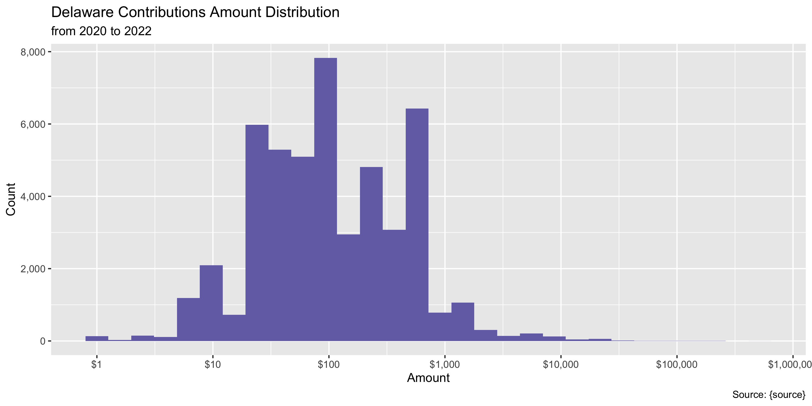
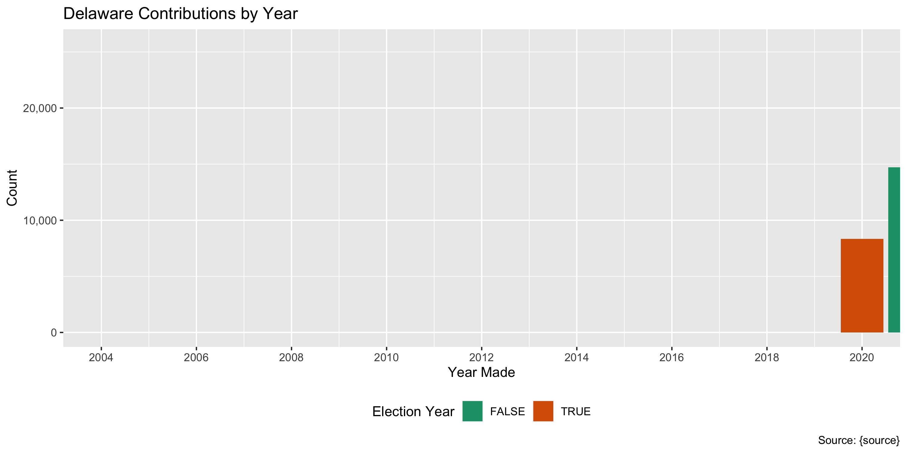
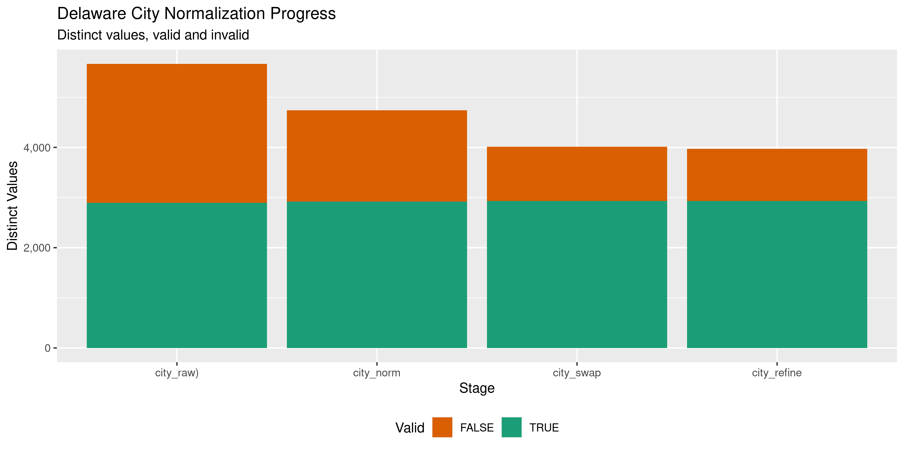

Delaware Contributions
================
Kiernan Nicholls & Yanqi Xu
2022-12-27 08:56:52

- <a href="#project" id="toc-project">Project</a>
- <a href="#objectives" id="toc-objectives">Objectives</a>
- <a href="#packages" id="toc-packages">Packages</a>
- <a href="#data" id="toc-data">Data</a>
- <a href="#download" id="toc-download">Download</a>
- <a href="#read" id="toc-read">Read</a>
- <a href="#explore" id="toc-explore">Explore</a>
- <a href="#amounts" id="toc-amounts">Amounts</a>
- <a href="#dates" id="toc-dates">Dates</a>
- <a href="#wrangle" id="toc-wrangle">Wrangle</a>
- <a href="#conclude" id="toc-conclude">Conclude</a>
- <a href="#export" id="toc-export">Export</a>
- <a href="#upload" id="toc-upload">Upload</a>
- <a href="#dictionary" id="toc-dictionary">Dictionary</a>

<!-- Place comments regarding knitting here -->

## Project

The Accountability Project is an effort to cut across data silos and
give journalists, policy professionals, activists, and the public at
large a simple way to search across huge volumes of public data about
people and organizations.

Our goal is to standardizing public data on a few key fields by thinking
of each dataset row as a transaction. For each transaction there should
be (at least) 3 variables:

1.  All **parties** to a transaction.
2.  The **date** of the transaction.
3.  The **amount** of money involved.

## Objectives

This document describes the process used to complete the following
objectives:

1.  How many records are in the database?
2.  Check for entirely duplicated records.
3.  Check ranges of continuous variables.
4.  Is there anything blank or missing?
5.  Check for consistency issues.
6.  Create a five-digit ZIP Code called `zip`.
7.  Create a `year` field from the transaction date.
8.  Make sure there is data on both parties to a transaction.

## Packages

The following packages are needed to collect, manipulate, visualize,
analyze, and communicate these results. The `pacman` package will
facilitate their installation and attachment.

The IRW’s `campfin` package will also have to be installed from GitHub.
This package contains functions custom made to help facilitate the
processing of campaign finance data.

``` r
if (!require("pacman")) install.packages("pacman")
pacman::p_load_gh("irworkshop/campfin")
pacman::p_load(
  tidyverse, # data manipulation
  lubridate, # datetime strings
  gluedown, # printing markdown
  magrittr, # pipe operators
  janitor, # clean data frames
  batman, # parse na and lgl
  aws.s3, # upload to aws s3
  refinr, # cluster and merge
  scales, # format strings
  knitr, # knit documents
  vroom, # read files fast
  rvest, # html scraping
  glue, # combine strings
  here, # relative paths
  httr, # http requests
  fs # local storage 
)
```

This document should be run as part of the `R_campfin` project, which
lives as a sub-directory of the more general, language-agnostic
[`irworkshop/accountability_datacleaning`](https://github.com/irworkshop/accountability_datacleaning)
GitHub repository.

The `R_campfin` project uses the [RStudio
projects](https://support.rstudio.com/hc/en-us/articles/200526207-Using-Projects)
feature and should be run as such. The project also uses the dynamic
`here::here()` tool for file paths relative to *your* machine.

``` r
# where does this document knit?
here::here()
#> [1] "/Users/yanqixu/code/accountability_datacleaning"
```

## Data

This data is obtained from the [Campaign Finance Reporting System
(CFRS)](https://cfrs.elections.delaware.gov/).

On the \[Contributions search page\]\[04\], the CFRS describes the data
that can be searched.

> An expenditure is defined as a gift, transfer, disbursement, debt
> incurred, or promise of money or valuable thing by or on behalf of a
> political committee to promote or assist in promoting the success or
> defeat of a candidate, political party, or question at an election.
> Expenditures must be election related; that is, they must enhance the
> candidate’s election chances, such that they would not have been
> incurred if there had been no candidacy. Furthermore, expenditures,
> including loans, may not be for the personal use of the candidate or
> any other individual. Debt Incurred is any unpaid debt that the
> committee is obligated to pay.

On the CFRS [FAQ
page](https://cfrs.elections.delaware.gov/Public/ViewReceipts), the CFRS
defines exactly what expenditures are reported.

> All receipts over \$100 must be itemized and all sales items over \$50
> must be itemized. All contributions from a political committee shall
> be itemized no matter what amount. If the person who made the
> contribution is an organization, and the total amount of contributions
> by such organization during the election period exceeds \$1,200, then
> the report shall also include the name and address of one responsible
> party for the organization.

## Download

We can use the search portal to find all record from 1975 to the current
date.

``` r
raw_dir <- dir_create(here("state","de", "contribs", "data", "raw"))
raw_path <- path(raw_dir, "ViewContributionsList.csv")
```

First, we submit an `httr::POST()` request with all fields but the dates
empty.

``` r
de_post <- POST(
  url = "https://cfrs.elections.delaware.gov/Public/ViewReceipts",
  body = list(
    hdnTP = "",
    txtContributorName = "",
    txtFirstName = "",
    txtStreet = "",
    txtTown = "",
    MemberId = "",
    FilingYear = "",
    FilingPeriodName = "",
    ContributorType = "",
    ContributionType = "",
    ddlState = "",
    txtZipCode = "",
    txtZipExt = "",
    dtStartDate = "10/05/2020",
    dtEndDate = format(today(), "11/27/2022"),
    txtAmountRangeFrom = "",
    txtAmountRangeTo = "",
    ddlOffice = "",
    ddlCounty = "",
    ddlOfficeSought = "",
    ddljurisdiction = "",
    txtReceivingRegistrant = "",
    ddlEmployerOccupation = "",
    hdnFixedAssets = "",
    btnSearch = "Search",
    hdnddlOffice = "",
    hdnddlCounty = "",
    hdnddlOfficeSought = "",
    hdnddljurisdiction = ""
  )
)
```

Then, we use the cookies from that POST to make an `httr::GET()`
request.

``` r
de_cook <- cookies(de_post)$value
names(de_cook) <- cookies(de_post)$name
```

``` r
if (!file_exists(raw_path) | file_size(raw_path) < "50M") {
  de_get <- GET(
    url = "https://cfrs.elections.delaware.gov/Public/ExportCSVNew",
    set_cookies(de_cook),
    write_disk(raw_path, overwrite = TRUE),
    query = list(
      `page` = "1",
      `orderBy` = "~",
      `filter` = "~",
      `Grid-size` = "15",
      `theme` = "vista"
    )
  )
}
```

## Read

Some errors with new line (`\n`) and double quote (`"`) characters needs
to be fixed with regular expressions and saved to a new text file.

``` r
fix_path <- file_temp(ext = "csv")
read_file(raw_path) %>%
  str_remove("(?<=Fixed Asset),") %>% 
  str_replace_all("(?<!,No|Asset)\n", " ") %>% 
  str_replace_all("\"", "\'") %>% 
  write_lines(fix_path)
```

The fixed file can be read with `readr::read_delim()`.

``` r
# 304,202 rows
dec <- read_delim(
  file = fix_path,
  delim = ",",
  escape_backslash = FALSE,
  escape_double = FALSE,
  col_types = cols(
    .default = col_character(),
    `Contribution Date` = col_date_mdy(),
    `Contribution Amount` = col_double()
  )
)
```

For convenience, we can rename some character and remove empty columns.

``` r
old_names <- names(dec)
dec <- dec %>% 
  clean_names("snake") %>% 
  remove_empty("cols") %>% 
  mutate_at(vars(fixed_asset), to_logical) %>% 
  rename_all(str_remove, "contributor_") %>% 
  rename(
    contributor = name,
    recipient = receiving_committee,
    employer = employer_name,
    occupation = employer_occupation,
    method = contribution_type,
    period = filing_period,
  ) %>% 
  rename_all(str_replace, "address_line_", "addr") %>% 
  rename_all(str_remove, "contribution_")
```

Check the distinct values of a discrete variable to verify file reading.

``` r
count(dec, fixed_asset)
#> # A tibble: 1 × 2
#>   fixed_asset     n
#>   <lgl>       <int>
#> 1 FALSE       48807
```

## Explore

``` r
glimpse(dec)
#> Rows: 48,807
#> Columns: 17
#> $ date        <date> 2020-10-05, 2020-10-05, 2020-10-05, 2020-10-05, 2020-10-06, 2020-10-06, 2020…
#> $ contributor <chr> "Robert Calhoun", "Mr. William Zak", "Joan Short", "Kirill Bakeev", "Geneviev…
#> $ addr1       <chr> "3282 Bay Rd.", "7 Deerfield Dr.", "6301 Kennett Pike", "5 Wildflower Cir", "…
#> $ addr2       <chr> NA, NA, NA, NA, NA, NA, NA, NA, NA, NA, NA, NA, NA, NA, NA, NA, NA, NA, NA, N…
#> $ city        <chr> "Milford", "Lewes", "Wilmington", "Newark", "Newark", NA, "Newark", "Newark",…
#> $ state       <chr> "DE", "DE", "DE", "DE", "DE", NA, "DE", "DE", "DE", "NJ", "DE", "DE", "DE", "…
#> $ zip         <chr> "19963-    ", "19958-    ", "19807-    ", "19702-1148", "19711-    ", NA, "19…
#> $ type        <chr> "Individual", "Individual", "Individual", "Individual", "Individual", "Total …
#> $ employer    <chr> NA, NA, NA, NA, NA, NA, NA, NA, NA, NA, NA, NA, NA, NA, NA, NA, "DowDuPont", …
#> $ occupation  <chr> NA, NA, NA, NA, NA, NA, NA, NA, NA, NA, NA, NA, NA, NA, NA, NA, "Administrati…
#> $ method      <chr> "Cash", "Check", "Check", "Check", "Check", "Total of Contributions not excee…
#> $ amount      <dbl> 50.00, 300.00, 50.00, 50.00, 100.00, 180.00, 30.00, 549.00, 16.66, 8.33, 300.…
#> $ cf_id       <chr> "01003148", "01005047", "01004153", "01004765", "01004867", "01001279", "0100…
#> $ recipient   <chr> "Friends for Charles Postles", "Friends of Patricia Drago for SCC", "Krista G…
#> $ period      <chr> "2020 2020 General Election 11/03/2020 8 Day", "2020 2020 General Election 11…
#> $ office      <chr> "District 33 (State Representative)", "District 03 (County Council)", "Distri…
#> $ fixed_asset <lgl> FALSE, FALSE, FALSE, FALSE, FALSE, FALSE, FALSE, FALSE, FALSE, FALSE, FALSE, …
tail(dec)
#> # A tibble: 6 × 17
#>   date       contributor    addr1 addr2 city  state zip   type  emplo…¹ occup…² method amount cf_id
#>   <date>     <chr>          <chr> <chr> <chr> <chr> <chr> <chr> <chr>   <chr>   <chr>   <dbl> <chr>
#> 1 2022-11-06 Phillip Hudson 7 Ba… <NA>  Newa… DE    "197… Indi… <NA>    <NA>    Credi…   25   0100…
#> 2 2022-11-02 Gary McConlog… 19 S… <NA>  Wilm… DE    "198… Indi… <NA>    <NA>    Credi…   26.0 0100…
#> 3 2022-10-25 Democratic St… P.O.… <NA>  Wilm… DE    "198… Poli… <NA>    <NA>    Check   600   0100…
#> 4 2022-10-29 Shelley Grabel 2448… <NA>  Milt… DE    "199… Indi… <NA>    <NA>    Elect…   25   0100…
#> 5 2022-10-19 Senate D PAC   4250… Ste … Wilm… DE    "198… Poli… <NA>    <NA>    Check  1000   0200…
#> 6 2022-10-10 Roger L Owens  104 … <NA>  Elkt… MD    "219… Indi… RyMark… Financ… Elect…   10   0200…
#> # … with 4 more variables: recipient <chr>, period <chr>, office <chr>, fixed_asset <lgl>, and
#> #   abbreviated variable names ¹​employer, ²​occupation
```

### Missing

``` r
col_stats(dec, count_na)
#> # A tibble: 17 × 4
#>    col         class      n        p
#>    <chr>       <chr>  <int>    <dbl>
#>  1 date        <date>     0 0       
#>  2 contributor <chr>     19 0.000389
#>  3 addr1       <chr>   3471 0.0711  
#>  4 addr2       <chr>  45652 0.935   
#>  5 city        <chr>   3548 0.0727  
#>  6 state       <chr>   3542 0.0726  
#>  7 zip         <chr>   3541 0.0726  
#>  8 type        <chr>      0 0       
#>  9 employer    <chr>  39278 0.805   
#> 10 occupation  <chr>  38367 0.786   
#> 11 method      <chr>      0 0       
#> 12 amount      <dbl>      0 0       
#> 13 cf_id       <chr>      0 0       
#> 14 recipient   <chr>      0 0       
#> 15 period      <chr>      0 0       
#> 16 office      <chr>  20406 0.418   
#> 17 fixed_asset <lgl>      0 0
```

Records missing a date, amount, or name need to be flagged.

``` r
key_vars <- c("date", "contributor", "amount", "recipient")
dec <- flag_na(dec, all_of(key_vars))
percent(mean(dec$na_flag), 0.001)
#> [1] "0.039%"
```

All of these records are missing the contributor name.

``` r
dec %>% 
  filter(na_flag) %>% 
  select(all_of(key_vars)) %>% 
  sample_frac()
#> # A tibble: 19 × 4
#>    date       contributor amount recipient                          
#>    <date>     <chr>        <dbl> <chr>                              
#>  1 2021-12-14 <NA>           100 Friends of Rysheema Dixon          
#>  2 2021-09-11 <NA>            10 New Castle County Libertarian Party
#>  3 2021-08-11 <NA>            10 New Castle County Libertarian Party
#>  4 2021-03-11 <NA>            10 New Castle County Libertarian Party
#>  5 2021-01-11 <NA>            10 New Castle County Libertarian Party
#>  6 2021-10-20 <NA>             5 New Castle County Libertarian Party
#>  7 2021-02-11 <NA>            10 New Castle County Libertarian Party
#>  8 2021-04-20 <NA>             5 New Castle County Libertarian Party
#>  9 2021-07-20 <NA>             5 New Castle County Libertarian Party
#> 10 2021-05-20 <NA>             5 New Castle County Libertarian Party
#> 11 2021-05-11 <NA>            10 New Castle County Libertarian Party
#> 12 2021-06-11 <NA>            10 New Castle County Libertarian Party
#> 13 2021-07-11 <NA>            10 New Castle County Libertarian Party
#> 14 2021-11-20 <NA>             5 New Castle County Libertarian Party
#> 15 2021-09-20 <NA>             5 New Castle County Libertarian Party
#> 16 2021-08-20 <NA>             5 New Castle County Libertarian Party
#> 17 2021-06-20 <NA>             5 New Castle County Libertarian Party
#> 18 2021-12-14 <NA>           100 Friends of Rysheema Dixon          
#> 19 2021-04-11 <NA>            10 New Castle County Libertarian Party
```

``` r
dec %>% 
  filter(na_flag) %>% 
  select(all_of(key_vars)) %>% 
  col_stats(count_na)
#> # A tibble: 4 × 4
#>   col         class      n     p
#>   <chr>       <chr>  <int> <dbl>
#> 1 date        <date>     0     0
#> 2 contributor <chr>     19     1
#> 3 amount      <dbl>      0     0
#> 4 recipient   <chr>      0     0
```

### Duplicates

The same can be done for records entirely duplicated more than once.

``` r
dec <- flag_dupes(dec, everything())
percent(mean(dec$dupe_flag), 0.001)
#> [1] "3.973%"
```

``` r
dec %>% 
  filter(dupe_flag) %>% 
  select(all_of(key_vars)) %>% 
  arrange(date)
#> # A tibble: 1,939 × 4
#>    date       contributor                               amount recipient                           
#>    <date>     <chr>                                      <dbl> <chr>                               
#>  1 2020-10-05 Leslie Schneider                              25 Krista Griffith For Delaware        
#>  2 2020-10-05 Leslie Schneider                              25 Krista Griffith For Delaware        
#>  3 2020-10-05 Mr. David Miller                              25 Friends of Patricia Drago for SCC   
#>  4 2020-10-05 Mr. David Miller                              25 Friends of Patricia Drago for SCC   
#>  5 2020-10-06 Ms. Cynthia D Souza                           20 Delaware Association of Realtors DE…
#>  6 2020-10-06 Mr. Michael Milligan                          35 Delaware Association of Realtors DE…
#>  7 2020-10-06 Mr. Michael Milligan                          35 Delaware Association of Realtors DE…
#>  8 2020-10-06 Ms. Cynthia D Souza                           20 Delaware Association of Realtors DE…
#>  9 2020-10-07 Total of Contributions not exceeding $100    100 Committee to Elect Debbie Harrington
#> 10 2020-10-07 Total of Contributions not exceeding $100    100 Committee to Elect Debbie Harrington
#> # … with 1,929 more rows
```

## Amounts

``` r
summary(dec$amount)
#>    Min. 1st Qu.  Median    Mean 3rd Qu.    Max. 
#>       0      35     100     358     300  520000
mean(dec$amount <= 0, na.rm = TRUE)
#> [1] 0
```

<!-- -->

## Dates

The calendar year can be added from the `date` column with
`lubridate::year()`.

``` r
dec <- mutate(dec, year = year(date))
```

Aside from a handful of missing values, the `date` and `year` are fairly
clean.

``` r
prop_na(dec$date)
#> [1] 0
min(dec$date, na.rm = TRUE)
#> [1] "2020-10-05"
sum(dec$year < 2000, na.rm = TRUE)
#> [1] 0
max(dec$date, na.rm = TRUE)
#> [1] "2022-11-15"
sum(dec$date > today(), na.rm = TRUE)
#> [1] 0
```

<!-- -->

## Wrangle

To improve the searchability of the database, we will perform some
consistent, confident string normalization. For geographic variables
like city names and ZIP codes, the corresponding `campfin::normal_*()`
functions are tailor made to facilitate this process.

### Address

For the street `addresss` variable, the `campfin::normal_address()`
function will force consistence case, remove punctuation, and abbreviate
official USPS suffixes.

``` r
dec <- dec %>% 
  unite(
    col = addr_full,
    starts_with("addr"),
    sep = " ",
    remove = FALSE,
    na.rm = TRUE
  ) %>% 
  mutate(
    addr_norm = normal_address(
      address = addr_full,
      abbs = usps_street,
      na_rep = TRUE
    )
  ) %>% 
  select(-addr_full)
```

``` r
dec %>% 
  select(starts_with("addr")) %>% 
  distinct() %>% 
  sample_n(10)
#> # A tibble: 10 × 3
#>    addr1                 addr2 addr_norm          
#>    <chr>                 <chr> <chr>              
#>  1 227 E Union Drive     <NA>  227 E UNION DR     
#>  2 33289 W Edgmoor St    <NA>  33289 W EDGMOOR ST 
#>  3 1910 Thomas Rd        <NA>  1910 THOMAS RD     
#>  4 109 McCormick Avenue  <NA>  109 MCCORMICK AVE  
#>  5 39101 Crows Nest Lane <NA>  39101 CROWS NEST LN
#>  6 244 Avalon Drive      <NA>  244 AVALON DR      
#>  7 100 W Commons Blvd    <NA>  100 W COMMONS BLVD 
#>  8 707 Taunton Road      <NA>  707 TAUNTON RD     
#>  9 67 Cole Road          <NA>  67 COLE RD         
#> 10 Po Box 218            <NA>  PO BOX 218
```

### ZIP

For ZIP codes, the `campfin::normal_zip()` function will attempt to
create valid *five* digit codes by removing the ZIP+4 suffix and
returning leading zeroes dropped by other programs like Microsoft Excel.

``` r
dec <- dec %>% 
  mutate(
    zip_norm = normal_zip(
      zip = zip,
      na_rep = TRUE
    )
  )
```

``` r
progress_table(
  dec$zip,
  dec$zip_norm,
  compare = valid_zip
)
#> # A tibble: 2 × 6
#>   stage        prop_in n_distinct prop_na n_out n_diff
#>   <chr>          <dbl>      <dbl>   <dbl> <dbl>  <dbl>
#> 1 dec$zip        0.286       5648  0.0726 32339   4701
#> 2 dec$zip_norm   0.997       1987  0.0732   152    108
```

### State

Valid two digit state abbreviations can be made using the
`campfin::normal_state()` function.

``` r
dec <- dec %>% 
  mutate(
    state_norm = normal_state(
      state = state,
      abbreviate = TRUE,
      na_rep = TRUE,
      valid = valid_state
    )
  )
```

``` r
dec %>% 
  filter(state != state_norm) %>% 
  count(state, state_norm, sort = TRUE)
#> # A tibble: 0 × 3
#> # … with 3 variables: state <chr>, state_norm <chr>, n <int>
```

``` r
progress_table(
  dec$state,
  dec$state_norm,
  compare = valid_state
)
#> # A tibble: 2 × 6
#>   stage          prop_in n_distinct prop_na n_out n_diff
#>   <chr>            <dbl>      <dbl>   <dbl> <dbl>  <dbl>
#> 1 dec$state            1         52  0.0726     0      1
#> 2 dec$state_norm       1         52  0.0726     0      1
```

### City

Cities are the most difficult geographic variable to normalize, simply
due to the wide variety of valid cities and formats.

#### Normal

The `campfin::normal_city()` function is a good start, again converting
case, removing punctuation, but *expanding* USPS abbreviations. We can
also remove `invalid_city` values.

``` r
dec <- dec %>% 
  mutate(
    city_norm = normal_city(
      city = city, 
      abbs = usps_city,
      states = c("DE", "DC", "DELAWARE"),
      na = invalid_city,
      na_rep = TRUE
    )
  )
```

#### Swap

We can further improve normalization by comparing our normalized value
against the *expected* value for that record’s state abbreviation and
ZIP code. If the normalized value is either an abbreviation for or very
similar to the expected value, we can confidently swap those two.

``` r
dec <- dec %>% 
  rename(city_raw = city) %>% 
  left_join(
    y = zipcodes,
    by = c(
      "state_norm" = "state",
      "zip_norm" = "zip"
    )
  ) %>% 
  rename(city_match = city) %>% 
  mutate(
    match_abb = is_abbrev(city_norm, city_match),
    match_dist = str_dist(city_norm, city_match),
    city_swap = if_else(
      condition = !is.na(match_dist) & (match_abb | match_dist == 1),
      true = city_match,
      false = city_norm
    )
  ) %>% 
  select(
    -city_match,
    -match_dist,
    -match_abb
  )
```

#### Refine

The \[OpenRefine\] algorithms can be used to group similar strings and
replace the less common versions with their most common counterpart.
This can greatly reduce inconsistency, but with low confidence; we will
only keep any refined strings that have a valid city/state/zip
combination.

``` r
good_refine <- dec %>% 
  mutate(
    city_refine = city_swap %>% 
      key_collision_merge() %>% 
      n_gram_merge(numgram = 1)
  ) %>% 
  filter(city_refine != city_swap) %>% 
  inner_join(
    y = zipcodes,
    by = c(
      "city_refine" = "city",
      "state_norm" = "state",
      "zip_norm" = "zip"
    )
  )
```

    #> [1] 4
    #> # A tibble: 4 × 5
    #>   state_norm zip_norm city_swap      city_refine        n
    #>   <chr>      <chr>    <chr>          <chr>          <int>
    #> 1 DE         19801    WILMINGONT     WILMINGTON         1
    #> 2 DE         19804    WILMINGONT     WILMINGTON         1
    #> 3 DE         19809    WILMIGTONN     WILMINGTON         1
    #> 4 DE         19971    REBOHOTH BEACH REHOBOTH BEACH     1

Then we can join the refined values back to the database.

``` r
dec <- dec %>% 
  left_join(good_refine, by = names(.)) %>% 
  mutate(city_refine = coalesce(city_refine, city_swap))
```

#### Progress

A lot of the remaining invalid cities are really parts of the address.

``` r
many_city <- c(valid_city, extra_city)
many_city <- c(many_city, usps_street$full, usps_street$abb, "DE")
dec %>% 
  filter(city_refine %out% many_city) %>% 
  count(city_refine, sort = TRUE)
#> # A tibble: 70 × 2
#>    city_refine             n
#>    <chr>               <int>
#>  1 <NA>                 3583
#>  2 LONG NECK             100
#>  3 DEWEY BEACH            63
#>  4 LOWER GWYNEDD          24
#>  5 HISTORIC NEW CASTLE    15
#>  6 HENLOPEN ACRES          4
#>  7 REHOBOTH BEACH DE       4
#>  8 TYSONS                  4
#>  9 WILMINGTON MANOR        4
#> 10 BLADES                  3
#> # … with 60 more rows
```

``` r
dec <- dec %>% 
  mutate(
    city_refine = city_refine %>% 
      str_replace("^WILM$", "WILMINGTON")
  )
```

| stage                                                                      | prop_in | n_distinct | prop_na | n_out | n_diff |
|:---------------------------------------------------------------------------|--------:|-----------:|--------:|------:|-------:|
| str_to_upper(dec$city_raw) | 0.967| 1552| 0.073| 1496| 294| |dec$city_norm |   0.969 |       1512 |   0.073 |  1391 |    245 |
| dec$city_swap | 0.993| 1341| 0.073| 301| 73| |dec$city_refine              |   0.993 |       1337 |   0.073 |   295 |     69 |

You can see how the percentage of valid values increased with each
stage.

<!-- -->

More importantly, the number of distinct values decreased each stage. We
were able to confidently change many distinct invalid values to their
valid equivalent.

<!-- -->

## Conclude

``` r
dec <- dec %>% 
  select(
    -city_norm,
    -city_swap,
    city_clean = city_refine
  ) %>% 
  rename_all(~str_replace(., "_norm", "_clean")) %>% 
  rename_all(~str_remove(., "_raw"))
```

``` r
glimpse(sample_n(dec, 100))
#> Rows: 100
#> Columns: 24
#> $ date        <date> 2022-08-03, 2021-07-02, 2022-08-11, 2022-09-18, 2020-11-20, 2022-04-11, 2022…
#> $ contributor <chr> "Theresa Deamond", "Karl Stomberg", "James Jones", "Total of Contributions no…
#> $ addr1       <chr> "5 Paisley Drive", "2105 Baynard Blvd", "336 Cornish Rd", NA, "199 W Radison …
#> $ addr2       <chr> NA, NA, NA, NA, NA, NA, NA, NA, NA, NA, NA, NA, NA, NA, NA, NA, NA, NA, NA, N…
#> $ city        <chr> "Wilmington", "Wilmington", "Harrington", NA, "Clayton", "Dover", "Rehoboth B…
#> $ state       <chr> "DE", "DE", "DE", NA, "DE", "DE", "DE", "DE", "MD", "DE", "DE", NA, "DE", "DE…
#> $ zip         <chr> "19808-    ", "19802-    ", "19952-    ", NA, "19938-    ", "19904-    ", "19…
#> $ type        <chr> "Individual", "Individual", "Individual", "Total of Contributions not exceedi…
#> $ employer    <chr> NA, NA, NA, NA, NA, NA, NA, NA, NA, NA, NA, NA, "Coldwell Banker Premier- L",…
#> $ occupation  <chr> NA, NA, NA, NA, NA, NA, NA, "Unemployed", "Other", NA, NA, NA, "Other", NA, N…
#> $ method      <chr> "Check", "Credit Card", "Check", "Check", "Check", "Check", "Check", "Electro…
#> $ amount      <dbl> 100, 100, 50, 100, 240, 200, 100, 91, 104, 5, 5, 50, 35, 35, 600, 1200, 900, …
#> $ cf_id       <chr> "01005510", "02004717", "01005550", "01004213", "01004210", "01003160", "0100…
#> $ recipient   <chr> "Lorrah for Delaware", "Delaware United Action", "Friends of Norman Barlow", …
#> $ period      <chr> "2022 2022 General Election 11/08/22 30 Day", "2021  Annual", "2022 2022 Gene…
#> $ office      <chr> "(Auditor of Accounts)", NA, "(Sheriff)", "District 05 (State Representative)…
#> $ fixed_asset <lgl> FALSE, FALSE, FALSE, FALSE, FALSE, FALSE, FALSE, FALSE, FALSE, FALSE, FALSE, …
#> $ na_flag     <lgl> FALSE, FALSE, FALSE, FALSE, FALSE, FALSE, FALSE, FALSE, FALSE, FALSE, FALSE, …
#> $ dupe_flag   <lgl> FALSE, FALSE, FALSE, TRUE, FALSE, FALSE, FALSE, FALSE, FALSE, FALSE, FALSE, T…
#> $ year        <dbl> 2022, 2021, 2022, 2022, 2020, 2022, 2022, 2022, 2021, 2021, 2021, 2021, 2022,…
#> $ addr_clean  <chr> "5 PAISLEY DR", "2105 BAYNARD BLVD", "336 CORNISH RD", NA, "199 W RADISON RUN…
#> $ zip_clean   <chr> "19808", "19802", "19952", NA, "19938", "19904", "19771", "19971", "21651", "…
#> $ state_clean <chr> "DE", "DE", "DE", NA, "DE", "DE", "DE", "DE", "MD", "DE", "DE", NA, "DE", "DE…
#> $ city_clean  <chr> "WILMINGTON", "WILMINGTON", "HARRINGTON", NA, "CLAYTON", "DOVER", "REHOBOTH B…
```

1.  There are 48,807 records in the database.
2.  There are 1,939 duplicate records in the database.
3.  The range and distribution of `amount` and `date` seem reasonable.
4.  There are 19 records missing ….
5.  Consistency in geographic data has been improved with
    `campfin::normal_*()`.
6.  The 4-digit `year` variable has been created with
    `lubridate::year()`.

## Export

``` r
clean_dir <- dir_create(here("state","de", "contribs", "data", "clean"))
clean_path <- path(clean_dir, "de_contribs_clean_20201005-20221127.csv")
write_csv(dec, clean_path, na = "")
(clean_size <- file_size(clean_path))
#> 11.9M
file_encoding(clean_path) %>% 
  mutate(across(path, path.abbrev))
#> # A tibble: 1 × 3
#>   path                                                                                mime  charset
#>   <fs::path>                                                                          <chr> <chr>  
#> 1 …_datacleaning/state/de/contribs/data/clean/de_contribs_clean_20201005-20221127.csv <NA>  <NA>
```

The file strings need to be converted to ASCII.

``` r
read_lines(clean_path) %>% 
  iconv(to = "ASCII", sub = "byte") %>% 
  write_lines(clean_path)
```

## Upload

We can use the `aws.s3::put_object()` to upload the text file to the IRW
server.

``` r
s3_path <- path("csv", basename(clean_path))
if (!object_exists(s3_path, "publicaccountability")) {
  put_object(
    file = clean_path,
    object = s3_path, 
    bucket = "publicaccountability",
    acl = "public-read",
    show_progress = TRUE,
    multipart = TRUE
  )
}
s3_head <- head_object(s3_path, "publicaccountability")
(s3_size <- as_fs_bytes(attr(s3_head, "content-length")))
unname(s3_size == clean_size)
```

## Dictionary

| Column        | Original                     | Type        | Definition                                        |
|:--------------|:-----------------------------|:------------|:--------------------------------------------------|
| `date`        | `Contribution Date`          | `double`    | Date contribution was made                        |
| `contributor` | `Contributor Name`           | `character` | Contributor full name                             |
| `addr1`       | `Contributor Address Line 1` | `character` | Contributor street address                        |
| `addr2`       | `Contributor Address Line 2` | `character` | Contributor secondary address                     |
| `city`        | `Contributor City`           | `character` | Contributor city name                             |
| `state`       | `Contributor State`          | `character` | Contributor 2-digit state abbreviation            |
| `zip`         | `Contributor Zip`            | `character` | Contributor ZIP+4 code                            |
| `type`        | `Contributor Type`           | `character` | Contributor type                                  |
| `employer`    | `Employer Name`              | `character` | Contributor employer name                         |
| `occupation`  | `Employer Occupation`        | `character` | Contributor occupation                            |
| `method`      | `Contribution Type`          | `character` | Contribution method                               |
| `amount`      | `Contribution Amount`        | `double`    | Contribution amount or correction                 |
| `cf_id`       | `CF_ID`                      | `character` | Unique campaign finance ID                        |
| `recipient`   | `Receiving Committee`        | `character` | Recipient committee name                          |
| `period`      | `Filing Period`              | `character` | Report filing period                              |
| `office`      | `Office`                     | `character` | Office sought by recipient                        |
| `fixed_asset` | `Fixed Asset`                | `logical`   | Fix asset flag                                    |
| `na_flag`     |                              | `logical`   | Flag for missing date, amount, or name            |
| `dupe_flag`   |                              | `logical`   | Flag for completely duplicated record             |
| `year`        |                              | `double`    | Calendar year of contribution date                |
| `addr_clean`  |                              | `character` | Normalized contributor street address             |
| `zip_clean`   |                              | `character` | Normalized contributor 5-digit ZIP code           |
| `state_clean` |                              | `character` | Normalized contributor 2-digit state abbreviation |
| `city_clean`  |                              | `character` | Normalized contributor city name                  |
