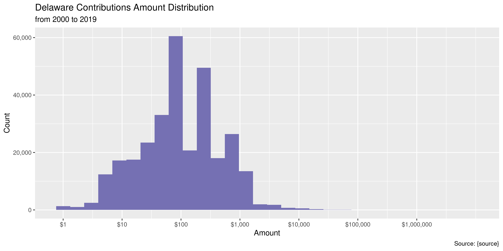
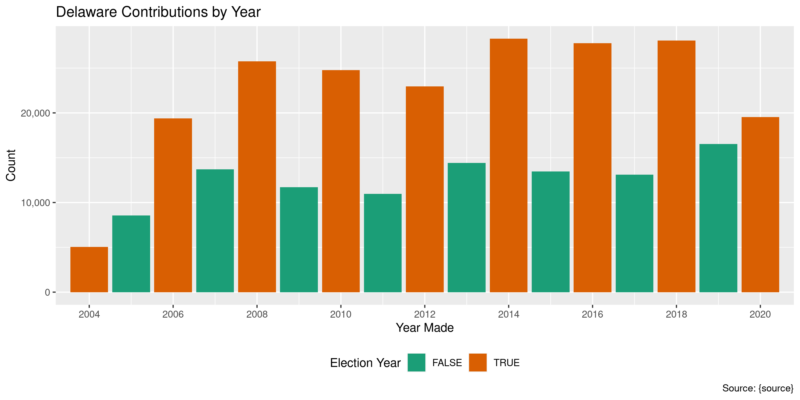
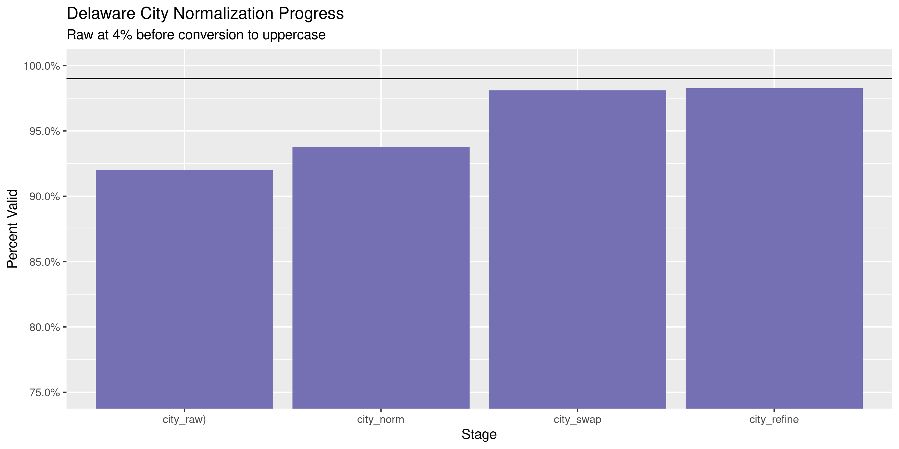

Delaware Contributions
================
Kiernan Nicholls
2020-10-07 13:01:34

  - [Project](#project)
  - [Objectives](#objectives)
  - [Packages](#packages)
  - [Data](#data)
  - [Download](#download)
  - [Read](#read)
  - [Explore](#explore)
  - [Amounts](#amounts)
  - [Dates](#dates)
  - [Wrangle](#wrangle)
  - [Conclude](#conclude)
  - [Export](#export)
  - [Upload](#upload)
  - [Dictionary](#dictionary)

<!-- Place comments regarding knitting here -->

## Project

The Accountability Project is an effort to cut across data silos and
give journalists, policy professionals, activists, and the public at
large a simple way to search across huge volumes of public data about
people and organizations.

Our goal is to standardizing public data on a few key fields by thinking
of each dataset row as a transaction. For each transaction there should
be (at least) 3 variables:

1.  All **parties** to a transaction.
2.  The **date** of the transaction.
3.  The **amount** of money involved.

## Objectives

This document describes the process used to complete the following
objectives:

1.  How many records are in the database?
2.  Check for entirely duplicated records.
3.  Check ranges of continuous variables.
4.  Is there anything blank or missing?
5.  Check for consistency issues.
6.  Create a five-digit ZIP Code called `zip`.
7.  Create a `year` field from the transaction date.
8.  Make sure there is data on both parties to a transaction.

## Packages

The following packages are needed to collect, manipulate, visualize,
analyze, and communicate these results. The `pacman` package will
facilitate their installation and attachment.

The IRW’s `campfin` package will also have to be installed from GitHub.
This package contains functions custom made to help facilitate the
processing of campaign finance data.

``` r
if (!require("pacman")) install.packages("pacman")
pacman::p_load_gh("irworkshop/campfin")
pacman::p_load(
  tidyverse, # data manipulation
  lubridate, # datetime strings
  gluedown, # printing markdown
  magrittr, # pipe operators
  janitor, # clean data frames
  batman, # parse na and lgl
  aws.s3, # upload to aws s3
  refinr, # cluster and merge
  scales, # format strings
  knitr, # knit documents
  vroom, # read files fast
  rvest, # html scraping
  glue, # combine strings
  here, # relative paths
  httr, # http requests
  fs # local storage 
)
```

This document should be run as part of the `R_campfin` project, which
lives as a sub-directory of the more general, language-agnostic
[`irworkshop/accountability_datacleaning`](https://github.com/irworkshop/accountability_datacleaning)
GitHub repository.

The `R_campfin` project uses the [RStudio
projects](https://support.rstudio.com/hc/en-us/articles/200526207-Using-Projects)
feature and should be run as such. The project also uses the dynamic
`here::here()` tool for file paths relative to *your* machine.

``` r
# where does this document knit?
here::here()
#> [1] "/home/kiernan/Code/tap/R_campfin"
```

## Data

This data is obtained from the [Campaign Finance Reporting System
(CFRS)](https://cfrs.elections.delaware.gov/).

On the \[Contributions search page\]\[04\], the CFRS describes the data
that can be searched.

> An expenditure is defined as a gift, transfer, disbursement, debt
> incurred, or promise of money or valuable thing by or on behalf of a
> political committee to promote or assist in promoting the success or
> defeat of a candidate, political party, or question at an election.
> Expenditures must be election related; that is, they must enhance the
> candidate’s election chances, such that they would not have been
> incurred if there had been no candidacy. Furthermore, expenditures,
> including loans, may not be for the personal use of the candidate or
> any other individual. Debt Incurred is any unpaid debt that the
> committee is obligated to pay.

On the CFRS [FAQ
page](https://cfrs.elections.delaware.gov/Public/ViewReceipts), the CFRS
defines exactly what expenditures are reported.

> All receipts over $100 must be itemized and all sales items over $50
> must be itemized. All contributions from a political committee shall
> be itemized no matter what amount. If the person who made the
> contribution is an organization, and the total amount of contributions
> by such organization during the election period exceeds $1,200, then
> the report shall also include the name and address of one responsible
> party for the organization.

## Download

We can use the search portal to find all record from 1975 to the current
date.

``` r
raw_dir <- dir_create(here("de", "contribs", "data", "raw"))
raw_path <- path(raw_dir, "ViewContributionsList.csv")
```

First, we submit an `httr::POST()` request with all fields but the dates
empty.

``` r
de_post <- POST(
  url = "https://cfrs.elections.delaware.gov/Public/ViewReceipts",
  body = list(
    hdnTP = "",
    txtContributorName = "",
    txtFirstName = "",
    txtStreet = "",
    txtTown = "",
    MemberId = "",
    FilingYear = "",
    FilingPeriodName = "",
    ContributorType = "",
    ContributionType = "",
    ddlState = "",
    txtZipCode = "",
    txtZipExt = "",
    dtStartDate = "01/01/1975",
    dtEndDate = format(today(), "%m/%d/%Y"),
    txtAmountRangeFrom = "",
    txtAmountRangeTo = "",
    ddlOffice = "",
    ddlCounty = "",
    ddlOfficeSought = "",
    ddljurisdiction = "",
    txtReceivingRegistrant = "",
    ddlEmployerOccupation = "",
    hdnFixedAssets = "",
    btnSearch = "Search",
    hdnddlOffice = "",
    hdnddlCounty = "",
    hdnddlOfficeSought = "",
    hdnddljurisdiction = ""
  )
)
```

Then, we use the cookies from that POST to make an `httr::GET()`
request.

``` r
de_cook <- cookies(de_post)$value
names(de_cook) <- cookies(de_post)$name
```

``` r
if (!file_exists(raw_path) | file_size(raw_path) < "50M") {
  de_get <- GET(
    url = "https://cfrs.elections.delaware.gov/Public/ExportCSVNew",
    set_cookies(de_cook),
    write_disk(raw_path, overwrite = TRUE),
    query = list(
      `page` = "1",
      `orderBy` = "~",
      `filter` = "~",
      `Grid-size` = "15",
      `theme` = "vista"
    )
  )
}
```

## Read

Some errors with new line (`\n`) and double quote (`"`) characters needs
to be fixed with regular expressions and saved to a new text file.

``` r
fix_path <- file_temp(ext = "csv")
read_file(raw_path) %>%
  str_remove("(?<=Fixed Asset),") %>% 
  str_replace_all("(?<!,No|Asset)\n", " ") %>% 
  str_replace_all("\"", "\'") %>% 
  write_lines(fix_path)
```

The fixed file can be read with `readr::read_delim()`.

``` r
# 304,202 rows
dec <- read_delim(
  file = fix_path,
  delim = ",",
  escape_backslash = FALSE,
  escape_double = FALSE,
  col_types = cols(
    .default = col_character(),
    `Contribution Date` = col_date_usa(),
    `Contribution Amount` = col_double()
  )
)
```

For convenience, we can rename some character and remove empty columns.

``` r
old_names <- names(dec)
dec <- dec %>% 
  clean_names("snake") %>% 
  remove_empty("cols") %>% 
  mutate_at(vars(fixed_asset), to_logical) %>% 
  rename_all(str_remove, "contributor_") %>% 
  rename(
    contributor = name,
    recipient = receiving_committee,
    employer = employer_name,
    occupation = employer_occupation,
    method = contribution_type,
    period = filing_period,
  ) %>% 
  rename_all(str_replace, "address_line_", "addr") %>% 
  rename_all(str_remove, "contribution_")
```

Check the distinct values of a discrete variable to verify file reading.

``` r
count(dec, fixed_asset)
#> # A tibble: 1 x 2
#>   fixed_asset      n
#>   <lgl>        <int>
#> 1 FALSE       304014
```

## Explore

``` r
glimpse(dec)
#> Rows: 304,014
#> Columns: 17
#> $ date        <date> 2004-02-02, 2004-09-22, 2004-09-17, 2004-09-17, 2004-09-22, 2004-09-22, 200…
#> $ contributor <chr> "Inc  Caldera   Management", "Conset-vancy/LLC  Rehoboth   Bay", "lingua  Ja…
#> $ addr1       <chr> "4260 Hwy 1", "1207 Delaware AveWilinin too/DE 19806", "28 The Circle.George…
#> $ addr2       <chr> NA, NA, NA, NA, NA, NA, NA, NA, NA, NA, NA, NA, NA, NA, NA, NA, NA, NA, NA, …
#> $ city        <chr> "Rehoboth", NA, NA, NA, NA, NA, NA, NA, NA, NA, NA, NA, "Phila.", "Newark", …
#> $ state       <chr> "DE", "DE", "DE", "DE", "DE", "DE", "DE", "DE", "DE", "DE", "DE", "DE", "PA"…
#> $ zip         <chr> "19971", NA, NA, NA, NA, NA, NA, NA, NA, NA, NA, NA, NA, NA, NA, NA, NA, NA,…
#> $ type        <chr> "Individual", "Individual", "Individual", "Individual", "Individual", "Indiv…
#> $ employer    <chr> NA, NA, NA, NA, NA, NA, NA, NA, NA, NA, NA, NA, NA, NA, NA, NA, NA, NA, NA, …
#> $ occupation  <chr> NA, NA, NA, NA, NA, NA, NA, NA, NA, NA, NA, NA, NA, NA, NA, NA, NA, NA, NA, …
#> $ method      <chr> "Data Conversion", "Data Conversion", "Data Conversion", "Data Conversion", …
#> $ amount      <dbl> 600.00, 600.00, 500.00, 500.00, 250.00, 600.00, 600.00, 120.00, 500.00, 600.…
#> $ cf_id       <chr> "01000086", "01000086", "01000086", "01000086", "01000086", "01000086", "010…
#> $ recipient   <chr> "Friends To Elect Finley B. Jones Jr.", "Friends To Elect Finley B. Jones Jr…
#> $ period      <chr> "2004 2004 General 11/02/2004 30 Day", "2004 2004 General 11/02/2004 30 Day"…
#> $ office      <chr> "District 02 (County Council)", "District 02 (County Council)", "District 02…
#> $ fixed_asset <lgl> FALSE, FALSE, FALSE, FALSE, FALSE, FALSE, FALSE, FALSE, FALSE, FALSE, FALSE,…
tail(dec)
#> # A tibble: 6 x 17
#>   date       contributor addr1 addr2 city  state zip   type  employer occupation method amount
#>   <date>     <chr>       <chr> <chr> <chr> <chr> <chr> <chr> <chr>    <chr>      <chr>   <dbl>
#> 1 2020-06-09 David Dani… 215 … <NA>  Town… DE    "197… Indi… <NA>     <NA>       Check     100
#> 2 2020-02-18 Melanie Be… 7 Du… <NA>  Midd… DE    "197… Indi… <NA>     <NA>       Check     200
#> 3 2020-01-10 Saul Ewing… 1500… <NA>  Phil… PA    "191… Indi… <NA>     <NA>       Check     600
#> 4 2020-04-30 Jeff Nause  110 … <NA>  Midd… DE    "197… Indi… <NA>     <NA>       Check     500
#> 5 2020-08-19 EPB Associ… 107 … <NA>  Wilm… DE    "198… Indi… <NA>     <NA>       Check     600
#> 6 2020-09-02 Total of C… <NA>  <NA>  <NA>  <NA>   <NA> Tota… <NA>     <NA>       Check     650
#> # … with 5 more variables: cf_id <chr>, recipient <chr>, period <chr>, office <chr>,
#> #   fixed_asset <lgl>
```

### Missing

``` r
col_stats(dec, count_na)
#> # A tibble: 17 x 4
#>    col         class       n         p
#>    <chr>       <chr>   <int>     <dbl>
#>  1 date        <date>      0 0        
#>  2 contributor <chr>      23 0.0000757
#>  3 addr1       <chr>   13227 0.0435   
#>  4 addr2       <chr>  294660 0.969    
#>  5 city        <chr>   25699 0.0845   
#>  6 state       <chr>   12729 0.0419   
#>  7 zip         <chr>   24115 0.0793   
#>  8 type        <chr>       0 0        
#>  9 employer    <chr>  279182 0.918    
#> 10 occupation  <chr>  275917 0.908    
#> 11 method      <chr>       0 0        
#> 12 amount      <dbl>       0 0        
#> 13 cf_id       <chr>       0 0        
#> 14 recipient   <chr>       0 0        
#> 15 period      <chr>       0 0        
#> 16 office      <chr>  126888 0.417    
#> 17 fixed_asset <lgl>       0 0
```

Records missing a date, amount, or name need to be flagged.

``` r
key_vars <- c("date", "contributor", "amount", "recipient")
dec <- flag_na(dec, all_of(key_vars))
percent(mean(dec$na_flag), 0.001)
#> [1] "0.008%"
```

All of these records are missing the contributor name.

``` r
dec %>% 
  filter(na_flag) %>% 
  select(all_of(key_vars)) %>% 
  sample_frac()
#> # A tibble: 23 x 4
#>    date       contributor  amount recipient                        
#>    <date>     <chr>         <dbl> <chr>                            
#>  1 2009-04-16 <NA>         5000   IHC Group PAC                    
#>  2 2012-12-31 <NA>        17651.  Mobley 2012 Campaign             
#>  3 2006-10-30 <NA>            0   Friends of Jeanine Kleimo        
#>  4 2017-06-27 <NA>           93.9 Committee to Elect Timothy Conrad
#>  5 2010-09-27 <NA>          600   Committee to Elect Rebecca Walker
#>  6 2009-07-24 <NA>         5000   IHC Group PAC                    
#>  7 2009-04-16 <NA>         5000   IHC Group PAC                    
#>  8 2009-04-16 <NA>         5000   IHC Group PAC                    
#>  9 2012-05-15 <NA>         7110.  Ted Becker for Lewes City Council
#> 10 2009-07-24 <NA>         5000   IHC Group PAC                    
#> # … with 13 more rows
```

``` r
dec %>% 
  filter(na_flag) %>% 
  select(all_of(key_vars)) %>% 
  col_stats(count_na)
#> # A tibble: 4 x 4
#>   col         class      n     p
#>   <chr>       <chr>  <int> <dbl>
#> 1 date        <date>     0     0
#> 2 contributor <chr>     23     1
#> 3 amount      <dbl>      0     0
#> 4 recipient   <chr>      0     0
```

### Duplicates

The same can be done for records entirely duplicated more than once.

``` r
dec <- flag_dupes(dec, everything())
percent(mean(dec$dupe_flag), 0.001)
#> [1] "2.099%"
```

``` r
dec %>% 
  filter(dupe_flag) %>% 
  select(all_of(key_vars)) %>% 
  arrange(date)
#> # A tibble: 6,380 x 4
#>    date       contributor                       amount recipient                        
#>    <date>     <chr>                              <dbl> <chr>                            
#>  1 2004-01-13 Fraternal Order of Police Lodge 1   2000 F O P LODGE #1 PAC COMMITTEE     
#>  2 2004-01-13 Fraternal Order of Police Lodge 1   2000 F O P LODGE #1 PAC COMMITTEE     
#>  3 2004-02-25 Robert Krapf  Jean   &               200 James M. Baker Campaign Committee
#>  4 2004-02-25 Robert Krapf  Jean   &               200 James M. Baker Campaign Committee
#>  5 2004-02-27 Dr. Regina Turner  Mark   &          100 James M. Baker Campaign Committee
#>  6 2004-02-27 Dr. Regina Turner  Mark   &          100 James M. Baker Campaign Committee
#>  7 2004-03-01 AIA Delaware PAC                     100 James M. Baker Campaign Committee
#>  8 2004-03-01 AIA Delaware PAC                     100 James M. Baker Campaign Committee
#>  9 2004-03-04 Andrea Levine  Richard   &           100 James M. Baker Campaign Committee
#> 10 2004-03-04 Andrea Levine  Richard   &           100 James M. Baker Campaign Committee
#> # … with 6,370 more rows
```

## Amounts

``` r
summary(dec$amount)
#>    Min. 1st Qu.  Median    Mean 3rd Qu.    Max. 
#>   -5577      35     100     552     300 8331771
mean(dec$amount <= 0, na.rm = TRUE)
#> [1] 0.001953857
```

<!-- -->

## Dates

The calendar year can be added from the `date` column with
`lubridate::year()`.

``` r
dec <- mutate(dec, year = year(date))
```

Aside from a handful of missing values, the `date` and `year` are fairly
clean.

``` r
prop_na(dec$date)
#> [1] 0
min(dec$date, na.rm = TRUE)
#> [1] "2000-08-03"
sum(dec$year < 2000, na.rm = TRUE)
#> [1] 0
max(dec$date, na.rm = TRUE)
#> [1] "2020-10-04"
sum(dec$date > today(), na.rm = TRUE)
#> [1] 0
```

<!-- -->

## Wrangle

To improve the searchability of the database, we will perform some
consistent, confident string normalization. For geographic variables
like city names and ZIP codes, the corresponding `campfin::normal_*()`
functions are tailor made to facilitate this process.

### Address

For the street `addresss` variable, the `campfin::normal_address()`
function will force consistence case, remove punctuation, and abbreviate
official USPS suffixes.

``` r
dec <- dec %>% 
  unite(
    col = addr_full,
    starts_with("addr"),
    sep = " ",
    remove = FALSE,
    na.rm = TRUE
  ) %>% 
  mutate(
    addr_norm = normal_address(
      address = addr_full,
      abbs = usps_street,
      na_rep = TRUE
    )
  ) %>% 
  select(-addr_full)
```

``` r
dec %>% 
  select(starts_with("addr")) %>% 
  distinct() %>% 
  sample_n(10)
#> # A tibble: 10 x 3
#>    addr1                             addr2        addr_norm                 
#>    <chr>                             <chr>        <chr>                     
#>  1 1410 William Penn Ln              <NA>         1410 WILLIAM PENN LN      
#>  2 200 CONTINENTAL DRIVE             <NA>         200 CONTINENTAL DR        
#>  3 105 Front St. Wyoming DE          <NA>         105 FRNT ST WYOMING DE    
#>  4 522 Greenhill Ave                 <NA>         522 GREENHILL AVE         
#>  5 908 N Dupont Road                 <NA>         908 N DUPONT RD           
#>  6 304 Detjen Drive    Hockessin  DE <NA>         304 DETJEN DR HOCKESSIN DE
#>  7 901 Tatnall St.                   Second Floor 901 TATNALL ST SECOND FL  
#>  8 PO Box 308                        <NA>         PO BOX 308                
#>  9 222Delaware #1200                 <NA>         222 DELAWARE 1200         
#> 10 180 Merion Rd.                    <NA>         180 MERION RD
```

### ZIP

For ZIP codes, the `campfin::normal_zip()` function will attempt to
create valid *five* digit codes by removing the ZIP+4 suffix and
returning leading zeroes dropped by other programs like Microsoft Excel.

``` r
dec <- dec %>% 
  mutate(
    zip_norm = normal_zip(
      zip = zip,
      na_rep = TRUE
    )
  )
```

``` r
progress_table(
  dec$zip,
  dec$zip_norm,
  compare = valid_zip
)
#> # A tibble: 2 x 6
#>   stage    prop_in n_distinct prop_na n_out n_diff
#>   <chr>      <dbl>      <dbl>   <dbl> <dbl>  <dbl>
#> 1 zip        0.653      14167  0.0793 97162   9981
#> 2 zip_norm   0.997       5545  0.0798   949    328
```

### State

Valid two digit state abbreviations can be made using the
`campfin::normal_state()` function.

``` r
dec <- dec %>% 
  mutate(
    state_norm = normal_state(
      state = state,
      abbreviate = TRUE,
      na_rep = TRUE,
      valid = valid_state
    )
  )
```

``` r
dec %>% 
  filter(state != state_norm) %>% 
  count(state, state_norm, sort = TRUE)
#> # A tibble: 34 x 3
#>    state state_norm     n
#>    <chr> <chr>      <int>
#>  1 De    DE          1998
#>  2 Pa    PA          1060
#>  3 de    DE           396
#>  4 Ct    CT            45
#>  5 Md    MD            38
#>  6 pa    PA            27
#>  7 Il    IL            21
#>  8 dc    DC            17
#>  9 nj    NJ            17
#> 10 Fl    FL            16
#> # … with 24 more rows
```

``` r
progress_table(
  dec$state,
  dec$state_norm,
  compare = valid_state
)
#> # A tibble: 2 x 6
#>   stage      prop_in n_distinct prop_na n_out n_diff
#>   <chr>        <dbl>      <dbl>   <dbl> <dbl>  <dbl>
#> 1 state        0.987         88  0.0419  3729     35
#> 2 state_norm   1             54  0.0419     0      1
```

### City

Cities are the most difficult geographic variable to normalize, simply
due to the wide variety of valid cities and formats.

#### Normal

The `campfin::normal_city()` function is a good start, again converting
case, removing punctuation, but *expanding* USPS abbreviations. We can
also remove `invalid_city` values.

``` r
dec <- dec %>% 
  mutate(
    city_norm = normal_city(
      city = city, 
      abbs = usps_city,
      states = c("DE", "DC", "DELAWARE"),
      na = invalid_city,
      na_rep = TRUE
    )
  )
```

#### Swap

We can further improve normalization by comparing our normalized value
against the *expected* value for that record’s state abbreviation and
ZIP code. If the normalized value is either an abbreviation for or very
similar to the expected value, we can confidently swap those two.

``` r
dec <- dec %>% 
  rename(city_raw = city) %>% 
  left_join(
    y = zipcodes,
    by = c(
      "state_norm" = "state",
      "zip_norm" = "zip"
    )
  ) %>% 
  rename(city_match = city) %>% 
  mutate(
    match_abb = is_abbrev(city_norm, city_match),
    match_dist = str_dist(city_norm, city_match),
    city_swap = if_else(
      condition = !is.na(match_dist) & (match_abb | match_dist == 1),
      true = city_match,
      false = city_norm
    )
  ) %>% 
  select(
    -city_match,
    -match_dist,
    -match_abb
  )
```

#### Refine

The \[OpenRefine\] algorithms can be used to group similar strings and
replace the less common versions with their most common counterpart.
This can greatly reduce inconsistency, but with low confidence; we will
only keep any refined strings that have a valid city/state/zip
combination.

``` r
good_refine <- dec %>% 
  mutate(
    city_refine = city_swap %>% 
      key_collision_merge() %>% 
      n_gram_merge(numgram = 1)
  ) %>% 
  filter(city_refine != city_swap) %>% 
  inner_join(
    y = zipcodes,
    by = c(
      "city_refine" = "city",
      "state_norm" = "state",
      "zip_norm" = "zip"
    )
  )
```

    #> [1] 80
    #> # A tibble: 61 x 5
    #>    state_norm zip_norm city_swap        city_refine        n
    #>    <chr>      <chr>    <chr>            <chr>          <int>
    #>  1 CA         92037    JOLLA            LA JOLLA           4
    #>  2 DE         19710    MONTCHANIN CT    MONTCHANIN         3
    #>  3 DE         19801    WILMINGONT       WILMINGTON         3
    #>  4 DE         19904    DOVER DE         DOVER              3
    #>  5 NY         11733    SETAUKET         EAST SETAUKET      3
    #>  6 CA         92625    CORONADO DEL MAR CORONA DEL MAR     2
    #>  7 CA         94023    ALTOS            LOS ALTOS          2
    #>  8 CA         94109    FRANCISCO        SAN FRANCISCO      2
    #>  9 CA         94121    FRANCISCO        SAN FRANCISCO      2
    #> 10 CA         94131    FRANCISCO        SAN FRANCISCO      2
    #> # … with 51 more rows

Then we can join the refined values back to the database.

``` r
dec <- dec %>% 
  left_join(good_refine, by = names(.)) %>% 
  mutate(city_refine = coalesce(city_refine, city_swap))
```

#### Progress

A lot of the remaining invalid cities are really parts of the address.

``` r
many_city <- c(valid_city, extra_city)
many_city <- c(many_city, usps_street$full, usps_street$abb, "DE")
dec %>% 
  filter(city_refine %out% many_city) %>% 
  count(city_refine, sort = TRUE)
#> # A tibble: 1,040 x 2
#>    city_refine      n
#>    <chr>        <int>
#>  1 <NA>         26943
#>  2 LONG NECK      543
#>  3 SAINT          444
#>  4 WILM           412
#>  5 DEWEY BEACH    230
#>  6 MEETING        130
#>  7 VEGAS          129
#>  8 CITY           120
#>  9 ND FLOOR       110
#> 10 SHEPARDSTOWN    93
#> # … with 1,030 more rows
```

``` r
dec <- dec %>% 
  mutate(
    city_refine = city_refine %>% 
      str_replace("^WILM$", "WILMINGTON")
  )
```

| stage        | prop\_in | n\_distinct | prop\_na | n\_out | n\_diff |
| :----------- | -------: | ----------: | -------: | -----: | ------: |
| city\_raw)   |    0.920 |        5668 |    0.085 |  22241 |    2775 |
| city\_norm   |    0.938 |        4743 |    0.089 |  17260 |    1824 |
| city\_swap   |    0.981 |        4013 |    0.089 |   5275 |    1080 |
| city\_refine |    0.983 |        3971 |    0.089 |   4796 |    1039 |

You can see how the percentage of valid values increased with each
stage.

<!-- -->

More importantly, the number of distinct values decreased each stage. We
were able to confidently change many distinct invalid values to their
valid equivalent.

<!-- -->

## Conclude

``` r
dec <- dec %>% 
  select(
    -city_norm,
    -city_swap,
    city_clean = city_refine
  ) %>% 
  rename_all(~str_replace(., "_norm", "_clean")) %>% 
  rename_all(~str_remove(., "_raw"))
```

``` r
glimpse(sample_n(dec, 100))
#> Rows: 100
#> Columns: 24
#> $ date        <date> 2016-02-25, 2016-12-31, 2012-02-06, 2006-06-30, 2008-10-05, 2019-11-21, 201…
#> $ contributor <chr> "Walter S Rowland", "KATHRYN R TAYLOR", "Brown  Michael   K.", "Michael  Val…
#> $ addr1       <chr> "2501 Willard Street", "1005 GREENTREE RD", "364 Butterpat Rd  Hartly DE", "…
#> $ addr2       <chr> NA, NA, NA, NA, NA, "Michael K Towe", NA, NA, NA, NA, NA, NA, NA, NA, NA, NA…
#> $ city        <chr> "Wilmington", "NEWARK", "DE", "Hockessin", NA, "Middletown", "Rehoboth Beach…
#> $ state       <chr> "DE", "DE", "DE", "DE", "DE", "DE", "DE", "DE", "DE", "DE", "TX", "DE", "PA"…
#> $ zip         <chr> "19806-    ", "19713-4207", "19953", "19707-1142", "19810", "19709-9179", "1…
#> $ type        <chr> "Individual", "Individual", "Individual", "Individual", "Individual", "Indiv…
#> $ employer    <chr> NA, NA, NA, NA, NA, "Keller Williams Realty Central", NA, NA, NA, "mellongro…
#> $ occupation  <chr> NA, "Education", NA, NA, NA, "Other", NA, NA, NA, "Financial", "Manufacturin…
#> $ method      <chr> "Check", "Payroll Deductions", "Data Conversion", "Data Conversion", "Data C…
#> $ amount      <dbl> 113.00, 136.00, 500.00, 6.00, 1200.00, 47.50, 300.00, 300.00, 250.00, 500.00…
#> $ cf_id       <chr> "01002965", "02000511", "01002283", "02000568", "01001573", "02000483", "010…
#> $ recipient   <chr> "Lacey Lafferty for Governor 2016", "DSEA Advocacy Fund For Children & Publi…
#> $ period      <chr> "2016 2016 Primary 09/13/2016 30 Day", "2016  Annual", "2012 2012 General 11…
#> $ office      <chr> "(Governor)", NA, "District 15 (State Senator)", NA, "Governor", NA, "Distri…
#> $ fixed_asset <lgl> FALSE, FALSE, FALSE, FALSE, FALSE, FALSE, FALSE, FALSE, FALSE, FALSE, FALSE,…
#> $ na_flag     <lgl> FALSE, FALSE, FALSE, FALSE, FALSE, FALSE, FALSE, FALSE, FALSE, FALSE, FALSE,…
#> $ dupe_flag   <lgl> FALSE, FALSE, FALSE, FALSE, FALSE, FALSE, FALSE, FALSE, FALSE, FALSE, FALSE,…
#> $ year        <dbl> 2016, 2016, 2012, 2006, 2008, 2019, 2014, 2016, 2016, 2013, 2014, 2008, 2010…
#> $ addr_clean  <chr> "2501 WILLARD ST", "1005 GREENTREE RD", "364 BUTTERPAT RD HARTLY DE", "44 RO…
#> $ zip_clean   <chr> "19806", "19713", "19953", "19707", "19810", "19709", "19971", "19805", "198…
#> $ state_clean <chr> "DE", "DE", "DE", "DE", "DE", "DE", "DE", "DE", "DE", "DE", "TX", "DE", "PA"…
#> $ city_clean  <chr> "WILMINGTON", "NEWARK", "DE", "HOCKESSIN", NA, "MIDDLETOWN", "REHOBOTH BEACH…
```

1.  There are 304,014 records in the database.
2.  There are 6,380 duplicate records in the database.
3.  The range and distribution of `amount` and `date` seem reasonable.
4.  There are 23 records missing ….
5.  Consistency in geographic data has been improved with
    `campfin::normal_*()`.
6.  The 4-digit `year` variable has been created with
    `lubridate::year()`.

## Export

``` r
clean_dir <- dir_create(here("de", "contribs", "data", "clean"))
clean_path <- path(clean_dir, "de_contribs_clean.csv")
write_csv(dec, clean_path, na = "")
(clean_size <- file_size(clean_path))
#> 72.2M
file_encoding(clean_path) %>% 
  mutate(across(path, path.abbrev))
#> # A tibble: 1 x 3
#>   path                                           mime                     charset
#>   <chr>                                          <chr>                    <chr>  
#> 1 ~/de/contribs/data/clean/de_contribs_clean.csv application/octet-stream binary
```

The file strings need to be converted to ASCII.

``` r
read_lines(clean_path) %>% 
  iconv(to = "ASCII", sub = "byte") %>% 
  write_lines(clean_path)
```

## Upload

We can use the `aws.s3::put_object()` to upload the text file to the IRW
server.

``` r
s3_path <- path("csv", basename(clean_path))
if (!object_exists(s3_path, "publicaccountability")) {
  put_object(
    file = clean_path,
    object = s3_path, 
    bucket = "publicaccountability",
    acl = "public-read",
    show_progress = TRUE,
    multipart = TRUE
  )
}
s3_head <- head_object(s3_path, "publicaccountability")
(s3_size <- as_fs_bytes(attr(s3_head, "content-length")))
#> 72.2M
unname(s3_size == clean_size)
#> [1] FALSE
```

## Dictionary

| Column        | Original                     | Type        | Definition                                        |
| :------------ | :--------------------------- | :---------- | :------------------------------------------------ |
| `date`        | `Contribution Date`          | `double`    | Date contribution was made                        |
| `contributor` | `Contributor Name`           | `character` | Contributor full name                             |
| `addr1`       | `Contributor Address Line 1` | `character` | Contributor street address                        |
| `addr2`       | `Contributor Address Line 2` | `character` | Contributor secondary address                     |
| `city`        | `Contributor City`           | `character` | Contributor city name                             |
| `state`       | `Contributor State`          | `character` | Contributor 2-digit state abbreviation            |
| `zip`         | `Contributor Zip`            | `character` | Contributor ZIP+4 code                            |
| `type`        | `Contributor Type`           | `character` | Contributor type                                  |
| `employer`    | `Employer Name`              | `character` | Contributor employer name                         |
| `occupation`  | `Employer Occupation`        | `character` | Contributor occupation                            |
| `method`      | `Contribution Type`          | `character` | Contribution method                               |
| `amount`      | `Contribution Amount`        | `double`    | Contribution amount or correction                 |
| `cf_id`       | `CF_ID`                      | `character` | Unique campaign finance ID                        |
| `recipient`   | `Receiving Committee`        | `character` | Recipient committee name                          |
| `period`      | `Filing Period`              | `character` | Report filing period                              |
| `office`      | `Office`                     | `character` | Office sought by recipient                        |
| `fixed_asset` | `Fixed Asset`                | `logical`   | Fix asset flag                                    |
| `na_flag`     |                              | `logical`   | Flag for missing date, amount, or name            |
| `dupe_flag`   |                              | `logical`   | Flag for completely duplicated record             |
| `year`        |                              | `double`    | Calendar year of contribution date                |
| `addr_clean`  |                              | `character` | Normalized contributor street address             |
| `zip_clean`   |                              | `character` | Normalized contributor 5-digit ZIP code           |
| `state_clean` |                              | `character` | Normalized contributor 2-digit state abbreviation |
| `city_clean`  |                              | `character` | Normalized contributor city name                  |
