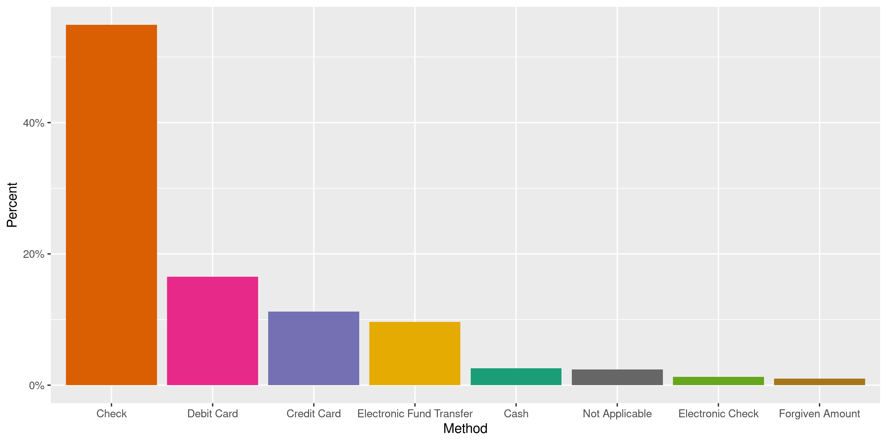
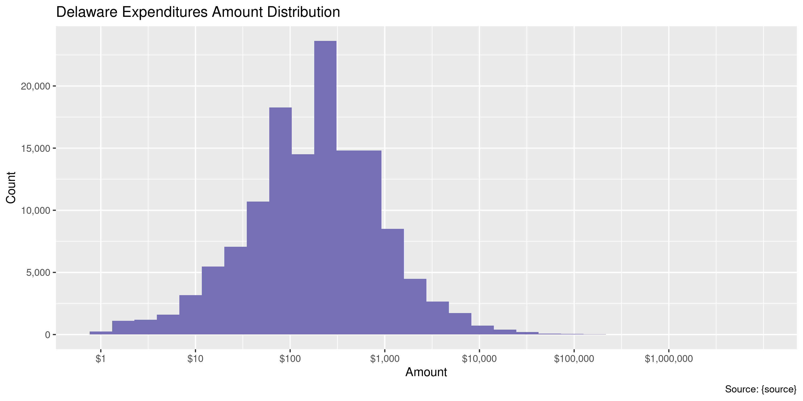

Delaware Expenditures
================
Kiernan Nicholls
2020-06-25 12:03:22

  - [Project](#project)
  - [Objectives](#objectives)
  - [Packages](#packages)
  - [Data](#data)
  - [Download](#download)
  - [Read](#read)
  - [Explore](#explore)
  - [Wrangle](#wrangle)
  - [Conclude](#conclude)
  - [Export](#export)
  - [Upload](#upload)
  - [Dictionary](#dictionary)

<!-- Place comments regarding knitting here -->

## Project

The Accountability Project is an effort to cut across data silos and
give journalists, policy professionals, activists, and the public at
large a simple way to search across huge volumes of public data about
people and organizations.

Our goal is to standardizing public data on a few key fields by thinking
of each dataset row as a transaction. For each transaction there should
be (at least) 3 variables:

1.  All **parties** to a transaction.
2.  The **date** of the transaction.
3.  The **amount** of money involved.

## Objectives

This document describes the process used to complete the following
objectives:

1.  How many records are in the database?
2.  Check for entirely duplicated records.
3.  Check ranges of continuous variables.
4.  Is there anything blank or missing?
5.  Check for consistency issues.
6.  Create a five-digit ZIP Code called `zip`.
7.  Create a `year` field from the transaction date.
8.  Make sure there is data on both parties to a transaction.

## Packages

The following packages are needed to collect, manipulate, visualize,
analyze, and communicate these results. The `pacman` package will
facilitate their installation and attachment.

The IRW’s `campfin` package will also have to be installed from GitHub.
This package contains functions custom made to help facilitate the
processing of campaign finance data.

``` r
if (!require("pacman")) install.packages("pacman")
pacman::p_load_gh("irworkshop/campfin")
pacman::p_load(
  tidyverse, # data manipulation
  lubridate, # datetime strings
  gluedown, # printing markdown
  magrittr, # pipe operators
  janitor, # clean data frames
  refinr, # cluster and merge
  scales, # format strings
  knitr, # knit documents
  vroom, # read files fast
  rvest, # html scraping
  glue, # combine strings
  here, # relative paths
  httr, # http requests
  fs # local storage 
)
```

This document should be run as part of the `R_campfin` project, which
lives as a sub-directory of the more general, language-agnostic
[`irworkshop/accountability_datacleaning`](https://github.com/irworkshop/accountability_datacleaning)
GitHub repository.

The `R_campfin` project uses the [RStudio
projects](https://support.rstudio.com/hc/en-us/articles/200526207-Using-Projects)
feature and should be run as such. The project also uses the dynamic
`here::here()` tool for file paths relative to *your* machine.

``` r
# where does this document knit?
here::here()
#> [1] "/home/kiernan/Code/accountability_datacleaning/R_campfin"
```

## Data

This data is obtained from the Delaware [Campaign Finance Reporting
System](https://cfrs.elections.delaware.gov/).

On the [Expenditures search
page](https://cfrs.elections.delaware.gov/Public/ViewExpensesMain), the
CFRS describes what can be searched:

> An expenditure is defined as a gift, transfer, disbursement, debt
> incurred, or promise of money or valuable thing by or on behalf of a
> political committee to promote or assist in promoting the success or
> defeat of a candidate, political party, or question at an election.
> Expenditures must be election related; that is, they must enhance the
> candidate’s election chances, such that they would not have been
> incurred if there had been no candidacy. Furthermore, expenditures,
> including loans, may not be for the personal use of the candidate or
> any other individual. Debt Incurred is any unpaid debt that the
> committee is obligated to pay.

On [the FAQ page](https://cfrs.elections.delaware.gov/Public/FAQ), the
CFRS defines exactly what expenditures are reported.

> All receipts over $100 must be itemized and all sales items over $50
> must be itemized. All contributions from a political committee shall
> be itemized no matter what amount. If the person who made the
> contribution is an organization, and the total amount of contributions
> by such organization during the election period exceeds $1,200, then
> the report shall also include the name and address of one responsible
> party for the organization.

## Download

We can download the raw file using a combination of `POST()` and
`GET()`.

``` r
raw_dir <- dir_create(here("de", "expends", "data", "raw"))
raw_path <- path(raw_dir, "Expensesinfo.csv")
```

First, we use `httr::POST()` to fill out the CFRS form to return all
results from January 1, 2000 to today.

``` r
de_post <- POST(
  url = "https://cfrs.elections.delaware.gov/Public/OtherSearch",
  body = list(
    hdnTP = "",
    ddlPayeeType = "",
    txtPayeeLastName = "",
    txtPayeeFirstName = "",
    txtStreet = "",
    txtTown = "",
    ddlState = "",
    txtZipCode = "",
    txtZipExt = "",
    txtCommitteeID = "",
    ddlExpenCategory = "",
    ddlExpensePurpose = "",
    MemberId = "",
    txtRegistrant = "",
    CommitteeType = "",
    dtStartDate = "1/1/2000",
    dtEndDate = format(today(), "%m/%d/%Y")
  )
)
```

Then, we can use `httr::cookies()` to get the cookies of that request.

``` r
de_cookie <- cookies(de_post)$value
names(de_cookie) <- cookies(de_post)$name
```

Which can then be passed to `httr::GET()` to download the file.

``` r
de_get <- GET(
  url = "https://cfrs.elections.delaware.gov/Public/ExportExpensestoCsv",
  set_cookies(de_cookie),
  write_disk(raw_path, overwrite = TRUE)
)
```

## Read

Before reading the file, we need to use regular expressions to fix two
big problems in the raw text file: 1. EQuation marks being used where
they should be apostrophes 2. Errant newline characters in the middle of
lines

``` r
fix_path <- file_temp()
read_file(raw_path) %>% 
  str_replace_all("\"", "'") %>% 
  str_remove_all("(?<!(Yes|No),)\n") %>% 
  write_file(path = fix_path)
```

This fixed text file can then be read with `readr::read_delim()`.

``` r
dee <- read_delim(
  file = fix_path,
  delim = ",",
  trim_ws = TRUE,
  escape_backslash = FALSE,
  escape_double = FALSE,
  col_types = cols(
    .default = col_character(),
    `Expenditure Date` = col_date("%m/%d/%Y"),
    `Amount($)` = col_double()
  )
)
```

If the file was properly fixed and read, we can count the distinct
values of a known discrete variable like the logical `Fixed Asset`.

``` r
count(dee, `Fixed Asset`)
#> # A tibble: 2 x 2
#>   `Fixed Asset`      n
#>   <chr>          <int>
#> 1 No            140596
#> 2 Yes               82
```

For convenience, we can rename variables and remove the last empty
column.

``` r
old_names <- names(dee)[-ncol(dee)]
dee <- dee %>% 
  remove_empty("cols") %>% 
  clean_names("snake") %>% 
  mutate(across(fixed_asset, equals, "Y")) %>% 
  rename_all(str_remove, "payee_") %>% 
  rename_all(str_remove, "_name") %>% 
  rename_all(str_remove, "filing_") %>% 
  rename_all(str_remove, "expense_") %>% 
  rename_all(str_remove, "expenditure_") %>% 
  rename_all(str_replace, "address_line_", "addr")
```

## Explore

``` r
glimpse(dee)
#> Rows: 140,678
#> Columns: 16
#> $ date        <date> 2012-08-15, 2011-11-01, 2011-11-19, 2011-12-08, 2011-12-10, 2011-12-29, 201…
#> $ name        <chr> "USPS", "Vista Print", "Caleeob Watson", "Fast Signs", "Pal", "Charles Potte…
#> $ addr1       <chr> NA, "95 Hayden ave", "2 Colony Blvd", "Po box 5471", "37th & Market St", "30…
#> $ addr2       <chr> NA, NA, NA, NA, NA, NA, NA, NA, NA, NA, NA, NA, NA, NA, NA, NA, NA, NA, NA, …
#> $ city        <chr> "Wilmington", "Lexington", "Wilmington", "Wilmington", "Wilmington", NA, "Wi…
#> $ state       <chr> "DE", "MA", "DE", "DE", "DE", "DE", "DE", "DE", "DE", "DE", "DE", "DE", "DE"…
#> $ zip         <chr> NA, "02421", "19802", "19808", "19808", NA, NA, NA, NA, NA, NA, NA, NA, NA, …
#> $ type        <chr> "Business/Group/Organization", "Business/Group/Organization", "Business/Grou…
#> $ amount      <dbl> 135.00, 110.00, 400.00, 122.00, 100.00, 0.00, 100.00, 150.00, 100.00, 50.00,…
#> $ cf_id       <chr> "01002568", "01002568", "01002568", "01002568", "01002568", "01002568", "010…
#> $ committee   <chr> "Potter for State Representative", "Potter for State Representative", "Potte…
#> $ category    <chr> "Postage", "Printing and Campaign Materials", "Media", "Printing and Campaig…
#> $ purpose     <chr> "Data Conversion", "Data Conversion", "Data Conversion", "Data Conversion", …
#> $ method      <chr> NA, NA, NA, NA, NA, NA, NA, NA, NA, NA, NA, NA, NA, NA, NA, NA, NA, NA, NA, …
#> $ period      <chr> "2012 8 Day Primary", "2011 Annual", "2011 Annual", "2011 Annual", "2011 Ann…
#> $ fixed_asset <lgl> FALSE, FALSE, FALSE, FALSE, FALSE, FALSE, FALSE, FALSE, FALSE, FALSE, FALSE,…
tail(dee)
#> # A tibble: 6 x 16
#>   date       name  addr1 addr2 city  state zip   type  amount cf_id committee category purpose
#>   <date>     <chr> <chr> <chr> <chr> <chr> <chr> <chr>  <dbl> <chr> <chr>     <chr>    <chr>  
#> 1 2019-03-20 Diam… PO B… <NA>  Delm… DE    1994… Busi…  376   0100… Bill Col… Fund Ra… Fundra…
#> 2 2019-03-22 King… PO B… <NA>  Pitt… PA    1525… Busi…  408   0100… Horning … Printin… Printi…
#> 3 2019-03-29 Init… 1412… <NA>  Wilm… DE    1980… Busi…  395   0100… Horning … Printin… Printi…
#> 4 2019-04-01 Face… 1 Ha… <NA>  Menl… CA    94025 Busi…   50.0 0100… Horning … Media    Media …
#> 5 2019-04-01 King… PO B… <NA>  Pitt… PA    1525… Busi…  987   0100… Horning … Printin… Printi…
#> 6 2019-04-01 King… PO B… <NA>  Pitt… PA    1525… Busi…   60.0 0100… Horning … Printin… Printi…
#> # … with 3 more variables: method <chr>, period <chr>, fixed_asset <lgl>
```

### Missing

Variable differ in their degree of missing values.

``` r
col_stats(dee, count_na)
#> # A tibble: 16 x 4
#>    col         class       n         p
#>    <chr>       <chr>   <int>     <dbl>
#>  1 date        <date>      0 0        
#>  2 name        <chr>    4242 0.0302   
#>  3 addr1       <chr>    5907 0.0420   
#>  4 addr2       <chr>  135704 0.965    
#>  5 city        <chr>   17663 0.126    
#>  6 state       <chr>    4791 0.0341   
#>  7 zip         <chr>   19923 0.142    
#>  8 type        <chr>       4 0.0000284
#>  9 amount      <dbl>       0 0        
#> 10 cf_id       <chr>       2 0.0000142
#> 11 committee   <chr>       0 0        
#> 12 category    <chr>       0 0        
#> 13 purpose     <chr>    6659 0.0473   
#> 14 method      <chr>   67553 0.480    
#> 15 period      <chr>       0 0        
#> 16 fixed_asset <lgl>       0 0
```

We can use `campfin::flag_na()` to identify records missing key
variables.

``` r
dee <- dee %>% flag_na(date, name, amount, committee)
percent(mean(dee$na_flag), 0.1)
#> [1] "3.0%"
```

``` r
dee %>% 
  filter(na_flag) %>% 
  select(date, name, amount, committee)
#> # A tibble: 4,242 x 4
#>    date       name  amount committee                      
#>    <date>     <chr>  <dbl> <chr>                          
#>  1 2014-02-28 <NA>    2    Potter for State Representative
#>  2 2014-04-18 <NA>   50    Potter for State Representative
#>  3 2014-04-30 <NA>    2    Potter for State Representative
#>  4 2014-04-30 <NA>    9.99 Potter for State Representative
#>  5 2014-05-06 <NA>   80    Potter for State Representative
#>  6 2014-05-23 <NA>   50    Potter for State Representative
#>  7 2014-05-30 <NA>    2    Potter for State Representative
#>  8 2014-06-10 <NA>   24.2  Potter for State Representative
#>  9 2014-06-24 <NA>    6.83 Potter for State Representative
#> 10 2014-06-26 <NA>   25    Potter for State Representative
#> # … with 4,232 more rows
```

All of these missing *key* values are in the `name` variable.

``` r
sum(dee$na_flag) == count_na(dee$name)
#> [1] TRUE
```

### Duplicates

``` r
dee <- flag_dupes(dee, everything())
percent(mean(dee$dupe_flag), 0.1)
#> [1] "2.6%"
```

``` r
dee %>% 
  filter(dupe_flag) %>% 
  select(date, name, amount, committee)
#> # A tibble: 3,677 x 4
#>    date       name                                   amount committee                      
#>    <date>     <chr>                                   <dbl> <chr>                          
#>  1 2014-07-01 <NA>                                       50 Potter for State Representative
#>  2 2014-07-01 <NA>                                       50 Potter for State Representative
#>  3 2014-08-25 Friends Of Margaret Rose Henry            200 Potter for State Representative
#>  4 2014-09-02 <NA>                                       35 Potter for State Representative
#>  5 2014-09-02 <NA>                                       35 Potter for State Representative
#>  6 2015-07-30 Robert Bovell                             100 Potter for State Representative
#>  7 2015-07-30 Robert Bovell                             100 Potter for State Representative
#>  8 2017-06-12 Democrat Legislative Campaign Committe    125 Friends of Quinn Johnson       
#>  9 2017-06-12 Democrat Legislative Campaign Committe    125 Friends of Quinn Johnson       
#> 10 2017-01-10 Joseph Fulgham                            295 BlueGoldPAC                    
#> # … with 3,667 more rows
```

### Categorical

``` r
col_stats(dee, n_distinct)
#> # A tibble: 18 x 4
#>    col         class      n          p
#>    <chr>       <chr>  <int>      <dbl>
#>  1 date        <date>  5755 0.0409    
#>  2 name        <chr>  32241 0.229     
#>  3 addr1       <chr>  34559 0.246     
#>  4 addr2       <chr>    961 0.00683   
#>  5 city        <chr>   3341 0.0237    
#>  6 state       <chr>     80 0.000569  
#>  7 zip         <chr>   4329 0.0308    
#>  8 type        <chr>     15 0.000107  
#>  9 amount      <dbl>  27837 0.198     
#> 10 cf_id       <chr>   1481 0.0105    
#> 11 committee   <chr>   1477 0.0105    
#> 12 category    <chr>     23 0.000163  
#> 13 purpose     <chr>     84 0.000597  
#> 14 method      <chr>     12 0.0000853 
#> 15 period      <chr>    211 0.00150   
#> 16 fixed_asset <lgl>      1 0.00000711
#> 17 na_flag     <lgl>      2 0.0000142 
#> 18 dupe_flag   <lgl>      2 0.0000142
```

``` r
explore_plot(dee, type)
```

<!-- -->

``` r
explore_plot(dee, category)
```

<!-- -->

``` r
explore_plot(dee, purpose)
```

<!-- -->

``` r
explore_plot(dee, method)
```

<!-- -->

### Amounts

``` r
summary(dee$amount)
#>    Min. 1st Qu.  Median    Mean 3rd Qu.    Max. 
#>  -16811      60     200    1270     500 7558376
mean(dee$amount <= 0)
#> [1] 0.03474602
```

<!-- -->

### Dates

We can add the calendar year from `date` with `lubridate::year()`

``` r
dee <- mutate(dee, year = year(date))
```

There are no outlier dates, which makes sense given our records were
returned using a date range `POST()`.

``` r
min(dee$date)
#> [1] "2000-04-07"
sum(dee$year < 2000)
#> [1] 0
max(dee$date)
#> [1] "2020-06-21"
sum(dee$date > today())
#> [1] 0
```

<!-- -->

## Wrangle

To improve the searchability of the database, we will perform some
consistent, confident string normalization. For geographic variables
like city names and ZIP codes, the corresponding `campfin::normal_*()`
functions are tailor made to facilitate this process.

### Address

For the street `addresss` variable, the `campfin::normal_address()`
function will force consistence case, remove punctuation, and abbreviate
official USPS suffixes.

``` r
dee <- dee %>% 
  unite(
    col = addr_full,
    starts_with("addr"),
    sep = " ",
    remove = FALSE,
    na.rm = TRUE
  ) %>% 
  mutate(
    addr_norm = normal_address(
      address = addr_full,
      abbs = usps_street,
      na_rep = TRUE
    )
  ) %>% 
  select(-addr_full)
```

``` r
dee %>% 
  select(contains("addr")) %>% 
  distinct() %>% 
  sample_n(10)
#> # A tibble: 10 x 3
#>    addr1                    addr2     addr_norm                  
#>    <chr>                    <chr>     <chr>                      
#>  1 17 Maryland Av.          <NA>      17 MARYLAND AVE            
#>  2 905 South Governors Ave. Suite 170 905 S GOVERNORS AVE STE 170
#>  3 110 E Atlantic Avenue    Suite 250 110 E ATLANTIC AVE STE 250 
#>  4 333 W. Windmill Way      <NA>      333 W WINDMILL WAY         
#>  5 6522 Battersby           <NA>      6522 BATTERSBY             
#>  6 PO Box 216               <NA>      PO BOX 216                 
#>  7 1401 Todds Ln            <NA>      1401 TODDS LN              
#>  8 701 Lee Road  Suite 300  <NA>      701 LEE RD STE 300         
#>  9 3505 Silverside Road     <NA>      3505 SILVERSIDE RD         
#> 10 PO Box 1105              <NA>      PO BOX 1105
```

### ZIP

For ZIP codes, the `campfin::normal_zip()` function will attempt to
create valid *five* digit codes by removing the ZIP+4 suffix and
returning leading zeroes dropped by other programs like Microsoft Excel.

``` r
dee <- dee %>% 
  mutate(
    zip_norm = normal_zip(
      zip = zip,
      na_rep = TRUE
    )
  )
```

``` r
progress_table(
  dee$zip,
  dee$zip_norm,
  compare = valid_zip
)
#> # A tibble: 2 x 6
#>   stage    prop_in n_distinct prop_na n_out n_diff
#>   <chr>      <dbl>      <dbl>   <dbl> <dbl>  <dbl>
#> 1 zip        0.681       4329   0.142 38513   2665
#> 2 zip_norm   0.995       2588   0.142   619    218
```

### State

Valid two digit state abbreviations can be made using the
`campfin::normal_state()` function.

``` r
dee <- dee %>% 
  mutate(
    state_norm = normal_state(
      state = state,
      abbreviate = TRUE,
      na_rep = TRUE,
      valid = valid_state
    )
  )
```

``` r
dee %>% 
  filter(state != state_norm) %>% 
  count(state, state_norm, sort = TRUE)
#> # A tibble: 28 x 3
#>    state state_norm     n
#>    <chr> <chr>      <int>
#>  1 De    DE          1548
#>  2 de    DE           219
#>  3 Pa    PA            72
#>  4 Md    MD            47
#>  5 Ma    MA            28
#>  6 Fl    FL            16
#>  7 Ct    CT            13
#>  8 Tx    TX            12
#>  9 Ca    CA            11
#> 10 il    IL             8
#> # … with 18 more rows
```

``` r
progress_table(
  dee$state,
  dee$state_norm,
  compare = valid_state
)
#> # A tibble: 2 x 6
#>   stage      prop_in n_distinct prop_na n_out n_diff
#>   <chr>        <dbl>      <dbl>   <dbl> <dbl>  <dbl>
#> 1 state        0.985         80  0.0341  2015     29
#> 2 state_norm   1             52  0.0341     0      1
```

### City

Cities are the most difficult geographic variable to normalize, simply
due to the wide variety of valid cities and formats.

#### Normal

The `campfin::normal_city()` function is a good start, again converting
case, removing punctuation, but *expanding* USPS abbreviations. We can
also remove `invalid_city` values.

``` r
dee <- dee %>% 
  mutate(
    city_norm = normal_city(
      city = city, 
      abbs = usps_city,
      states = c("DE", "DC", "DELAWARE"),
      na = invalid_city,
      na_rep = TRUE
    )
  )
```

#### Swap

We can further improve normalization by comparing our normalized value
against the *expected* value for that record’s state abbreviation and
ZIP code. If the normalized value is either an abbreviation for or very
similar to the expected value, we can confidently swap those two.

``` r
dee <- dee %>% 
  rename(city_raw = city) %>% 
  left_join(
    y = zipcodes,
    by = c(
      "state_norm" = "state",
      "zip_norm" = "zip"
    )
  ) %>% 
  rename(city_match = city) %>% 
  mutate(
    rx = glue("(?<=^|\\s){city_norm}(?=\\s|$)"),
    match_rx = str_detect(city_norm, rx),
    match_abb = is_abbrev(city_norm, city_match),
    match_dist = str_dist(city_norm, city_match),
    city_swap = if_else(
      condition = !is.na(match_dist) & (match_rx | match_abb | match_dist == 1),
      true = city_match,
      false = city_norm
    )
  ) %>% 
  select(
    -rx,
    -match_rx,
    -city_match,
    -match_dist,
    -match_abb
  )
```

#### Refine

The [OpenRefine](https://openrefine.org/) algorithms can be used to
group similar strings and replace the less common versions with their
most common counterpart. This can greatly reduce inconsistency, but with
low confidence; we will only keep any refined strings that have a valid
city/state/zip combination.

``` r
good_refine <- dee %>% 
  mutate(
    city_refine = city_swap %>% 
      key_collision_merge() %>% 
      n_gram_merge(numgram = 1)
  ) %>% 
  filter(city_refine != city_swap) %>% 
  inner_join(
    y = zipcodes,
    by = c(
      "city_refine" = "city",
      "state_norm" = "state",
      "zip_norm" = "zip"
    )
  )
```

    #> # A tibble: 0 x 5
    #> # … with 5 variables: state_norm <chr>, zip_norm <chr>, city_swap <chr>, city_refine <chr>,
    #> #   n <int>

Then we can join the refined values back to the database.

``` r
dee <- dee %>% 
  left_join(good_refine) %>% 
  mutate(city_refine = coalesce(city_refine, city_swap))
```

#### Progress

``` r
many_city <- c(valid_city, extra_city)
dee %>% 
  filter(city_refine %out% many_city) %>% 
  count(city_refine, state_norm, sort = TRUE) %>% 
  drop_na()
#> # A tibble: 350 x 3
#>    city_refine state_norm     n
#>    <chr>       <chr>      <int>
#>  1 WILM        DE           481
#>  2 PHILA       DE           106
#>  3 VIEW        DE            67
#>  4 PA          DE            55
#>  5 DC          DE            38
#>  6 SAINT       DE            29
#>  7 MD          DE            27
#>  8 NECK        DE            27
#>  9 COUNTY      DE            22
#> 10 RD          DE            21
#> # … with 340 more rows
```

``` r
dee <- mutate(
  .data = dee,
  city_refine = city_refine %>% 
    str_replace("^WILM$", "WILMINGTON")
)
```

``` r
many_city <- c(many_city, "DEWEY BEACH", "LONG NECK")
```

| stage        | prop\_in | n\_distinct | prop\_na | n\_out | n\_diff |
| :----------- | -------: | ----------: | -------: | -----: | ------: |
| city\_raw)   |    0.903 |        2962 |    0.126 |  11920 |    1600 |
| city\_norm   |    0.917 |        2456 |    0.132 |  10186 |    1079 |
| city\_swap   |    0.987 |        1654 |    0.132 |   1635 |     322 |
| city\_refine |    0.991 |        1653 |    0.132 |   1154 |     321 |

You can see how the percentage of valid values increased with each
stage.

<!-- -->

More importantly, the number of distinct values decreased each stage. We
were able to confidently change many distinct invalid values to their
valid equivalent.

<!-- -->

## Conclude

Before exporting, we can remove the intermediary normalization columns
and rename all added variables with the `_clean` suffix.

``` r
dee <- dee %>% 
  select(
    -city_norm,
    -city_swap,
    city_clean = city_refine
  ) %>% 
  rename_all(~str_replace(., "_norm", "_clean")) %>% 
  rename_all(~str_remove(., "_raw"))
```

``` r
glimpse(sample_n(dee, 20))
#> Rows: 20
#> Columns: 23
#> $ date        <date> 2014-06-14, 2018-06-28, 2013-06-07, 2018-07-25, 2018-10-19, 2008-11-03, 201…
#> $ name        <chr> "Courtyard by Marriott", "Alpaca Signs & Designs", "Kenneth Taylor", "Pat Mo…
#> $ addr1       <chr> "400 David Hollowell Drive", "126 Patriot Dr", "117 17th Street NE", "1505  …
#> $ addr2       <chr> NA, "Ste 2", NA, NA, NA, NA, NA, NA, NA, NA, NA, NA, NA, NA, NA, NA, NA, NA,…
#> $ city        <chr> "Newark", "Middletown", "Atlanta", "Wilmington", "Menlo Park", "TwigLanes", …
#> $ state       <chr> "DE", "DE", "GA", "DE", "CA", "PA", "DE", "DE", "DE", "DE", "DE", "DE", "OH"…
#> $ zip         <chr> "19716", "19709-", "30309", "19810-", "94025", "19454", "19808", "19970-", "…
#> $ type        <chr> "Business/Group/Organization", "Business/Group/Organization", "Individual", …
#> $ amount      <dbl> 1740.48, 650.00, 1200.00, 35.58, 750.00, 570.00, 565.00, 100.00, 318.50, 288…
#> $ cf_id       <chr> "03003465", "01004381", "01001297", "01004353", "01003002", "02000550", "010…
#> $ committee   <chr> "Western New Castle Region Republicans", "Bryan Rash for House", "Biden for …
#> $ category    <chr> "Fund Raiser", "Printing and Campaign Materials", "In-Kind", "In-Kind", "Oth…
#> $ purpose     <chr> "Fundraiser - Food & Beverage", "Printing - Brochures", "Fundraiser - Food &…
#> $ method      <chr> "Check", "Debit Card", NA, "Debit Card", "Credit Card", NA, "Check", "Check"…
#> $ period      <chr> "2014 30 Day Primary", "2018 30 Day General", "2013 Annual", "2018 30 Day Pr…
#> $ fixed_asset <lgl> FALSE, FALSE, FALSE, FALSE, FALSE, FALSE, FALSE, FALSE, FALSE, FALSE, FALSE,…
#> $ na_flag     <lgl> FALSE, FALSE, FALSE, FALSE, FALSE, FALSE, FALSE, FALSE, FALSE, FALSE, FALSE,…
#> $ dupe_flag   <lgl> FALSE, FALSE, FALSE, FALSE, TRUE, FALSE, FALSE, FALSE, FALSE, FALSE, FALSE, …
#> $ year        <dbl> 2014, 2018, 2013, 2018, 2018, 2008, 2013, 2016, 2018, 2014, 2015, 2018, 2016…
#> $ addr_clean  <chr> "400 DAVID HOLLOWELL DR", "126 PATRIOT DR STE 2", "117 17 TH ST NE", "1505 E…
#> $ zip_clean   <chr> "19716", "19709", "30309", "19810", "94025", "19454", "19808", "19970", "199…
#> $ state_clean <chr> "DE", "DE", "GA", "DE", "CA", "PA", "DE", "DE", "DE", "DE", "DE", "DE", "OH"…
#> $ city_clean  <chr> "NEWARK", "MIDDLETOWN", "ATLANTA", "WILMINGTON", "MENLO PARK", "NORTH WALES"…
```

1.  There are 140,678 records in the database.
2.  There are 3,677 duplicate records in the database.
3.  The range and distribution of `amount` and `date` seem reasonable.
4.  There are 4,242 records missing key variables.
5.  Consistency in geographic data has been improved with
    `campfin::normal_*()`.
6.  The 4-digit `year` variable has been created with
    `lubridate::year()`.

## Export

Now the file can be saved on disk for upload to the Accountability
server.

``` r
clean_dir <- dir_create(here("de", "expends", "data", "clean"))
clean_path <- path(clean_dir, "de_expends_clean.csv")
write_csv(dee, clean_path, na = "")
file_size(clean_path)
#> 33.6M
file_encoding(clean_path)
#> # A tibble: 1 x 3
#>   path                                                                         mime         charset
#>   <fs::path>                                                                   <chr>        <chr>  
#> 1 /home/kiernan/Code/accountability_datacleaning/R_campfin/de/expends/data/cl… application… utf-8
```

## Upload

Using the [duckr](https://github.com/kiernann/duckr) R package, we can
wrap around the [duck](https://duck.sh/) commnand line tool to upload
the file to the IRW server.

``` r
# remotes::install_github("kiernann/duckr")
s3_dir <- "s3:/publicaccountability/csv/"
s3_path <- path(s3_dir, basename(clean_path))
if (require(duckr)) {
  duckr::duck_upload(clean_path, s3_path)
}
```

## Dictionary

The following table describes the variables in our final exported file:

| Column        | Original Name          | Type        | Definition                             |
| :------------ | :--------------------- | :---------- | :------------------------------------- |
| `date`        | `Expenditure Date`     | `double`    | Date expenditure made                  |
| `name`        | `Payee Name`           | `character` | Vendor name                            |
| `addr1`       | `Payee Address Line 1` | `character` | Vendor street address                  |
| `addr2`       | `Payee Address Line 2` | `character` | Vendor secondary address               |
| `city`        | `Payee City`           | `character` | Vendor city name                       |
| `state`       | `Payee State`          | `character` | Vendor state abbreviation              |
| `zip`         | `Payee Zip`            | `character` | Vendor ZIP+4 code                      |
| `type`        | `Payee Type`           | `character` | Vendor business type                   |
| `amount`      | `Amount($)`            | `double`    | Expenditure amount                     |
| `cf_id`       | `CF ID`                | `character` | Unique spending committee ID           |
| `committee`   | `Committee Name`       | `character` | Spending committee name                |
| `category`    | `Expense Category`     | `character` | Expenditure category                   |
| `purpose`     | `Expense Purpose`      | `character` | Purpose for expenditure                |
| `method`      | `Expense Method`       | `character` | Spending method                        |
| `period`      | `Filing Period`        | `character` | Filing period reported                 |
| `fixed_asset` | `Fixed Asset`          | `logical`   | Fixed asset (TRUE/FALSE)               |
| `na_flag`     |                        | `logical`   | Flag for missing date, amount, or name |
| `dupe_flag`   |                        | `logical`   | Flag for completely duplicated record  |
| `year`        |                        | `double`    | Calendar year of contribution date     |
| `addr_clean`  |                        | `character` | Normalized combined street address     |
| `zip_clean`   |                        | `character` | Normalized 5-digit ZIP code            |
| `state_clean` |                        | `character` | Normalized 2-digit state abbreviation  |
| `city_clean`  |                        | `character` | Normalized city name                   |
