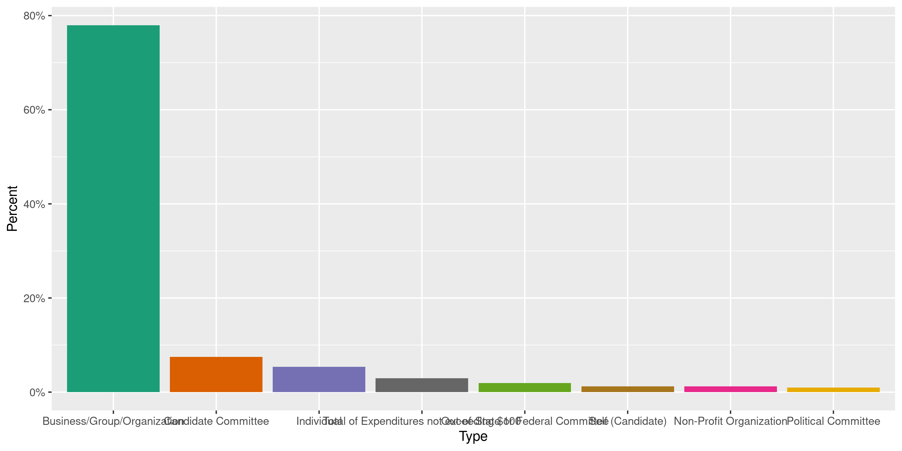
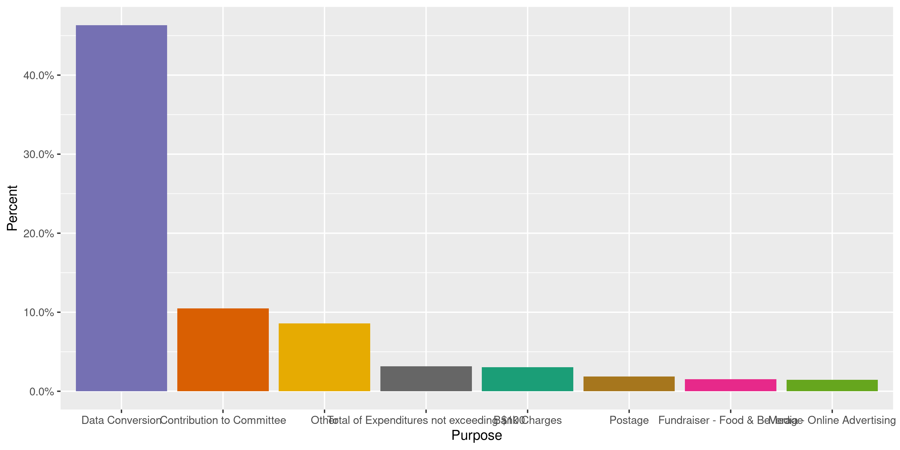
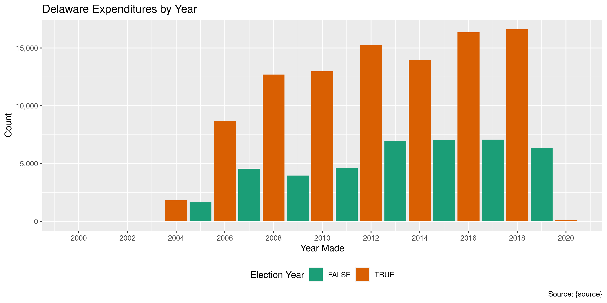

Delaware Expenditures
================
Kiernan Nicholls & Aarushi Sahejpal
2023-03-25 00:34:08

- <a href="#project" id="toc-project">Project</a>
- <a href="#objectives" id="toc-objectives">Objectives</a>
- <a href="#packages" id="toc-packages">Packages</a>
- <a href="#data" id="toc-data">Data</a>
- <a href="#download" id="toc-download">Download</a>
- <a href="#read" id="toc-read">Read</a>
- <a href="#explore" id="toc-explore">Explore</a>
- <a href="#wrangle" id="toc-wrangle">Wrangle</a>
- <a href="#conclude" id="toc-conclude">Conclude</a>
- <a href="#export" id="toc-export">Export</a>
- <a href="#upload" id="toc-upload">Upload</a>
- <a href="#dictionary" id="toc-dictionary">Dictionary</a>

<!-- Place comments regarding knitting here -->

## Project

The Accountability Project is an effort to cut across data silos and
give journalists, policy professionals, activists, and the public at
large a simple way to search across huge volumes of public data about
people and organizations.

Our goal is to standardizing public data on a few key fields by thinking
of each dataset row as a transaction. For each transaction there should
be (at least) 3 variables:

1.  All **parties** to a transaction.
2.  The **date** of the transaction.
3.  The **amount** of money involved.

## Objectives

This document describes the process used to complete the following
objectives:

1.  How many records are in the database?
2.  Check for entirely duplicated records.
3.  Check ranges of continuous variables.
4.  Is there anything blank or missing?
5.  Check for consistency issues.
6.  Create a five-digit ZIP Code called `zip`.
7.  Create a `year` field from the transaction date.
8.  Make sure there is data on both parties to a transaction.

## Packages

The following packages are needed to collect, manipulate, visualize,
analyze, and communicate these results. The `pacman` package will
facilitate their installation and attachment.

The IRW’s `campfin` package will also have to be installed from GitHub.
This package contains functions custom made to help facilitate the
processing of campaign finance data.

``` r
if (!require("pacman")) install.packages("pacman")
pacman::p_load_gh("irworkshop/campfin")
pacman::p_load(
  tidyverse, # data manipulation
  lubridate, # datetime strings
  gluedown, # printing markdown
  magrittr, # pipe operators
  janitor, # clean data frames
  refinr, # cluster and merge
  scales, # format strings
  knitr, # knit documents
  vroom, # read files fast
  rvest, # html scraping
  glue, # combine strings
  here, # relative paths
  httr, # http requests
  fs # local storage 
)
```

This document should be run as part of the `R_campfin` project, which
lives as a sub-directory of the more general, language-agnostic
[`irworkshop/accountability_datacleaning`](https://github.com/irworkshop/accountability_datacleaning)
GitHub repository.

The `R_campfin` project uses the [RStudio
projects](https://support.rstudio.com/hc/en-us/articles/200526207-Using-Projects)
feature and should be run as such. The project also uses the dynamic
`here::here()` tool for file paths relative to *your* machine.

``` r
# where does this document knit?
here::here()
#> [1] "/Volumes/TAP/accountability_datacleaning"
```

## Data

This data is obtained from the Delaware [Campaign Finance Reporting
System](https://cfrs.elections.delaware.gov/).

On the [Expenditures search
page](https://cfrs.elections.delaware.gov/Public/ViewExpensesMain), the
CFRS describes what can be searched:

> An expenditure is defined as a gift, transfer, disbursement, debt
> incurred, or promise of money or valuable thing by or on behalf of a
> political committee to promote or assist in promoting the success or
> defeat of a candidate, political party, or question at an election.
> Expenditures must be election related; that is, they must enhance the
> candidate’s election chances, such that they would not have been
> incurred if there had been no candidacy. Furthermore, expenditures,
> including loans, may not be for the personal use of the candidate or
> any other individual. Debt Incurred is any unpaid debt that the
> committee is obligated to pay.

On [the FAQ page](https://cfrs.elections.delaware.gov/Public/FAQ), the
CFRS defines exactly what expenditures are reported.

> All receipts over \$100 must be itemized and all sales items over \$50
> must be itemized. All contributions from a political committee shall
> be itemized no matter what amount. If the person who made the
> contribution is an organization, and the total amount of contributions
> by such organization during the election period exceeds \$1,200, then
> the report shall also include the name and address of one responsible
> party for the organization.

## Download

We can download the raw file using a combination of `POST()` and
`GET()`.

``` r
raw_dir <- dir_create(here("de", "expends", "data", "raw"))
raw_path <- path(raw_dir, "Expensesinfo.csv")
```

First, we use `httr::POST()` to fill out the CFRS form to return all
results from January 1, 2000 to today.

``` r
de_post <- POST(
  url = "https://cfrs.elections.delaware.gov/Public/OtherSearch",
  body = list(
    hdnTP = "",
    ddlPayeeType = "",
    txtPayeeLastName = "",
    txtPayeeFirstName = "",
    txtStreet = "",
    txtTown = "",
    ddlState = "",
    txtZipCode = "",
    txtZipExt = "",
    txtCommitteeID = "",
    ddlExpenCategory = "",
    ddlExpensePurpose = "",
    MemberId = "",
    txtRegistrant = "",
    CommitteeType = "",
    dtStartDate = "1/1/2000",
    dtEndDate = format(today(), "%m/%d/%Y")
  )
)
```

Then, we can use `httr::cookies()` to get the cookies of that request.

``` r
de_cookie <- cookies(de_post)$value
names(de_cookie) <- cookies(de_post)$name
```

Which can then be passed to `httr::GET()` to download the file.

``` r
de_get <- GET(
  url = "https://cfrs.elections.delaware.gov/Public/ExportExpensestoCsv",
  set_cookies(de_cookie),
  write_disk(raw_path, overwrite = TRUE)
)
```

## Read

Before reading the file, we need to use regular expressions to fix two
big problems in the raw text file: 1. EQuation marks being used where
they should be apostrophes 2. Errant newline characters in the middle of
lines

``` r
fix_path <- file_temp()
read_file(raw_path) %>% 
  str_replace_all("\"", "'") %>% 
  str_remove_all("(?<!(Yes|No),)\n") %>% 
  write_file(path = fix_path)
```

This fixed text file can then be read with `readr::read_delim()`.

``` r
dee <- read_delim(
  file = fix_path,
  delim = ",",
  trim_ws = TRUE,
  escape_backslash = FALSE,
  escape_double = FALSE,
  col_types = cols(
    .default = col_character(),
    `Expenditure Date` = col_date("%m/%d/%Y"),
    `Amount($)` = col_double()
  )
)
```

If the file was properly fixed and read, we can count the distinct
values of a known discrete variable like the logical `Fixed Asset`.

``` r
count(dee, `Fixed Asset`)
#> # A tibble: 2 × 2
#>   `Fixed Asset`      n
#>   <chr>          <int>
#> 1 No            175728
#> 2 Yes              117
```

For convenience, we can rename variables and remove the last empty
column.

``` r
old_names <- names(dee)[-ncol(dee)]
dee <- dee %>% 
  remove_empty("cols") %>% 
  clean_names("snake") %>% 
  mutate(across(fixed_asset, equals, "Y")) %>% 
  rename_all(str_remove, "payee_") %>% 
  rename_all(str_remove, "_name") %>% 
  rename_all(str_remove, "filing_") %>% 
  rename_all(str_remove, "expense_") %>% 
  rename_all(str_remove, "expenditure_") %>% 
  rename_all(str_replace, "address_line_", "addr")
```

## Explore

``` r
glimpse(dee)
#> Rows: 175,845
#> Columns: 16
#> $ date        <date> 2012-08-15, 2011-11-01, 2011-11-19, 2011-12-08, 2011-12-10, 2011-12-29, 2012…
#> $ name        <chr> "USPS", "Vista Print", "Caleeob Watson", "Fast Signs", "Pal", "Charles Potter…
#> $ addr1       <chr> NA, "95 Hayden ave", "2 Colony Blvd", "Po box 5471", "37th & Market St", "301…
#> $ addr2       <chr> NA, NA, NA, NA, NA, NA, NA, NA, NA, NA, NA, NA, NA, NA, NA, NA, NA, NA, NA, N…
#> $ city        <chr> "Wilmington", "Lexington", "Wilmington", "Wilmington", "Wilmington", NA, "Wil…
#> $ state       <chr> "DE", "MA", "DE", "DE", "DE", "DE", "DE", "DE", "DE", "DE", "DE", "DE", "DE",…
#> $ zip         <chr> NA, "02421", "19802", "19808", "19808", NA, NA, NA, NA, NA, NA, NA, NA, NA, N…
#> $ type        <chr> "Business/Group/Organization", "Business/Group/Organization", "Business/Group…
#> $ amount      <dbl> 135.00, 110.00, 400.00, 122.00, 100.00, 0.00, 100.00, 150.00, 100.00, 50.00, …
#> $ cf_id       <chr> "01002568", "01002568", "01002568", "01002568", "01002568", "01002568", "0100…
#> $ committee   <chr> "Potter for State Representative", "Potter for State Representative", "Potter…
#> $ category    <chr> "Postage", "Printing and Campaign Materials", "Media", "Printing and Campaign…
#> $ purpose     <chr> "Data Conversion", "Data Conversion", "Data Conversion", "Data Conversion", "…
#> $ method      <chr> NA, NA, NA, NA, NA, NA, NA, NA, NA, NA, NA, NA, NA, NA, NA, NA, NA, NA, NA, N…
#> $ period      <chr> "2012 8 Day Primary", "2011 Annual", "2011 Annual", "2011 Annual", "2011 Annu…
#> $ fixed_asset <lgl> FALSE, FALSE, FALSE, FALSE, FALSE, FALSE, FALSE, FALSE, FALSE, FALSE, FALSE, …
tail(dee)
#> # A tibble: 6 × 16
#>   date       name   addr1 addr2 city  state zip   type  amount cf_id commi…¹ categ…² purpose method
#>   <date>     <chr>  <chr> <chr> <chr> <chr> <chr> <chr>  <dbl> <chr> <chr>   <chr>   <chr>   <chr> 
#> 1 2022-04-05 NGP V… 1445… <NA>  Wash… DC    20005 Busi…    150 0100… People… Other … Other   Debit…
#> 2 2022-06-13 NGP V… 1445… <NA>  Wash… DC    20005 Busi…    150 0100… People… Other … Other   Debit…
#> 3 2022-07-05 NGP V… 1445… <NA>  Wash… DC    20005 Busi…    150 0100… People… Other … Other   Debit…
#> 4 2022-08-04 NGP V… 1445… <NA>  Wash… DC    20005 Busi…    150 0100… People… Other … Other   Debit…
#> 5 2022-09-01 NGP V… 1445… <NA>  Wash… DC    20005 Busi…    150 0100… People… Other … Other   Debit…
#> 6 2022-09-30 NGP V… 1445… <NA>  Wash… DC    20005 Busi…    150 0100… People… Other … Other   Debit…
#> # … with 2 more variables: period <chr>, fixed_asset <lgl>, and abbreviated variable names
#> #   ¹​committee, ²​category
```

### Missing

Variable differ in their degree of missing values.

``` r
col_stats(dee, count_na)
#> # A tibble: 16 × 4
#>    col         class       n         p
#>    <chr>       <chr>   <int>     <dbl>
#>  1 date        <date>      0 0        
#>  2 name        <chr>    6259 0.0356   
#>  3 addr1       <chr>    7966 0.0453   
#>  4 addr2       <chr>  167544 0.953    
#>  5 city        <chr>   19736 0.112    
#>  6 state       <chr>    6857 0.0390   
#>  7 zip         <chr>   22005 0.125    
#>  8 type        <chr>       6 0.0000341
#>  9 amount      <dbl>       0 0        
#> 10 cf_id       <chr>       2 0.0000114
#> 11 committee   <chr>       0 0        
#> 12 category    <chr>       0 0        
#> 13 purpose     <chr>    8042 0.0457   
#> 14 method      <chr>   68171 0.388    
#> 15 period      <chr>       0 0        
#> 16 fixed_asset <lgl>       0 0
```

We can use `campfin::flag_na()` to identify records missing key
variables.

``` r
dee <- dee %>% flag_na(date, name, amount, committee)
percent(mean(dee$na_flag), 0.1)
#> [1] "3.6%"
```

``` r
dee %>% 
  filter(na_flag) %>% 
  select(date, name, amount, committee)
#> # A tibble: 6,259 × 4
#>    date       name  amount committee                                                            
#>    <date>     <chr>  <dbl> <chr>                                                                
#>  1 2017-10-19 <NA>   100   Friends of Melanie George                                            
#>  2 2017-10-18 <NA>    75   Friends Of Margaret Rose Henry                                       
#>  3 2017-08-22 <NA>    90   Committee to Elect Laura Brown  NCC Recorder of Deeds                
#>  4 2017-08-10 <NA>    30   Committee to Elect Laura Brown  NCC Recorder of Deeds                
#>  5 2017-12-31 <NA>   890.  Outtens Campaign                                                     
#>  6 2017-04-12 <NA>    45   Committee to Elect Laura Brown for 17th State Representative District
#>  7 2017-12-28 <NA>    64   Committee to Elect Laura Brown for 17th State Representative District
#>  8 2017-03-22 <NA>    14.2 Progressive Democrats for Delaware  Inc.                             
#>  9 2017-01-25 <NA>    60   Friends of Rich Collins                                              
#> 10 2017-03-31 <NA>    12   Friends of Rich Collins                                              
#> # … with 6,249 more rows
```

All of these missing *key* values are in the `name` variable.

``` r
sum(dee$na_flag) == count_na(dee$name)
#> [1] TRUE
```

### Duplicates

``` r
dee <- flag_dupes(dee, everything())
percent(mean(dee$dupe_flag), 0.1)
#> [1] "2.7%"
```

``` r
dee %>% 
  filter(dupe_flag) %>% 
  select(date, name, amount, committee)
#> # A tibble: 4,717 × 4
#>    date       name                                   amount committee                       
#>    <date>     <chr>                                   <dbl> <chr>                           
#>  1 2017-06-12 Democrat Legislative Campaign Committe 125    Friends of Quinn Johnson        
#>  2 2017-06-12 Democrat Legislative Campaign Committe 125    Friends of Quinn Johnson        
#>  3 2017-01-10 Joseph Fulgham                         295    BlueGoldPAC                     
#>  4 2017-01-10 Joseph Fulgham                         295    BlueGoldPAC                     
#>  5 2018-08-01 Shari Murphy                            40.4  Delaware P.E.O.P.L.E. Committee 
#>  6 2017-02-01 RallyPiryx  Inc.                        10.4  Kent County Republican Committee
#>  7 2017-02-01 RallyPiryx  Inc.                         5.18 Kent County Republican Committee
#>  8 2017-02-01 RallyPiryx  Inc.                        10.4  Kent County Republican Committee
#>  9 2017-02-01 RallyPiryx  Inc.                         5.18 Kent County Republican Committee
#> 10 2017-02-08 RallyPiryx  Inc.                         5.18 Kent County Republican Committee
#> # … with 4,707 more rows
```

### Categorical

``` r
col_stats(dee, n_distinct)
#> # A tibble: 18 × 4
#>    col         class      n          p
#>    <chr>       <chr>  <int>      <dbl>
#>  1 date        <date>  6802 0.0387    
#>  2 name        <chr>  36375 0.207     
#>  3 addr1       <chr>  39080 0.222     
#>  4 addr2       <chr>   1278 0.00727   
#>  5 city        <chr>   3679 0.0209    
#>  6 state       <chr>     80 0.000455  
#>  7 zip         <chr>   4981 0.0283    
#>  8 type        <chr>     16 0.0000910 
#>  9 amount      <dbl>  32400 0.184     
#> 10 cf_id       <chr>   1738 0.00988   
#> 11 committee   <chr>   1729 0.00983   
#> 12 category    <chr>     24 0.000136  
#> 13 purpose     <chr>     88 0.000500  
#> 14 method      <chr>     13 0.0000739 
#> 15 period      <chr>    410 0.00233   
#> 16 fixed_asset <lgl>      1 0.00000569
#> 17 na_flag     <lgl>      2 0.0000114 
#> 18 dupe_flag   <lgl>      2 0.0000114
```

``` r
explore_plot(dee, type)
```

<!-- -->

``` r
explore_plot(dee, category)
```

<!-- -->

``` r
explore_plot(dee, purpose)
```

<!-- -->

``` r
explore_plot(dee, method)
```

<!-- -->

### Amounts

``` r
summary(dee$amount)
#>    Min. 1st Qu.  Median    Mean 3rd Qu.    Max. 
#>  -16811      51     190    1190     507 7558376
mean(dee$amount <= 0)
#> [1] 0.02925872
```

<!-- -->

### Dates

We can add the calendar year from `date` with `lubridate::year()`

``` r
dee <- mutate(dee, year = year(date))
```

There are no outlier dates, which makes sense given our records were
returned using a date range `POST()`.

``` r
min(dee$date)
#> [1] "2000-04-07"
sum(dee$year < 2000)
#> [1] 0
max(dee$date)
#> [1] "2023-02-15"
sum(dee$date > today())
#> [1] 0
```

<!-- -->

## Wrangle

To improve the searchability of the database, we will perform some
consistent, confident string normalization. For geographic variables
like city names and ZIP codes, the corresponding `campfin::normal_*()`
functions are tailor made to facilitate this process.

### Address

For the street `addresss` variable, the `campfin::normal_address()`
function will force consistence case, remove punctuation, and abbreviate
official USPS suffixes.

``` r
dee <- dee %>% 
  unite(
    col = addr_full,
    starts_with("addr"),
    sep = " ",
    remove = FALSE,
    na.rm = TRUE
  ) %>% 
  mutate(
    addr_norm = normal_address(
      address = addr_full,
      abbs = usps_street,
      na_rep = TRUE
    )
  ) %>% 
  select(-addr_full)
```

``` r
dee %>% 
  select(contains("addr")) %>% 
  distinct() %>% 
  sample_n(10)
#> # A tibble: 10 × 3
#>    addr1                               addr2 addr_norm                       
#>    <chr>                               <chr> <chr>                           
#>  1 20980 DuPont                        <NA>  20980 DUPONT                    
#>  2 3 par court                         <NA>  3 PAR CT                        
#>  3 9349 Old Furnace Road               <NA>  9349 OLD FURNACE RD             
#>  4 PRIVATE                             <NA>  PRIVATE                         
#>  5 1 Whittington Way                   <NA>  1 WHITTINGTON WAY               
#>  6 3 Bala Plaza West                   #125  3 BALA PLAZA WEST 125           
#>  7 9A Trolley Square    Wilmington  DE <NA>  9 A TROLLEY SQUARE WILMINGTON DE
#>  8 323 W. Main Street                  <NA>  323 W MAIN ST                   
#>  9 4425 N Market St                    <NA>  4425 N MARKET ST                
#> 10 P.O. Box 182564                     <NA>  PO BOX 182564
```

### ZIP

For ZIP codes, the `campfin::normal_zip()` function will attempt to
create valid *five* digit codes by removing the ZIP+4 suffix and
returning leading zeroes dropped by other programs like Microsoft Excel.

``` r
dee <- dee %>% 
  mutate(
    zip_norm = normal_zip(
      zip = zip,
      na_rep = TRUE
    )
  )
```

``` r
progress_table(
  dee$zip,
  dee$zip_norm,
  compare = valid_zip
)
#> # A tibble: 2 × 6
#>   stage        prop_in n_distinct prop_na n_out n_diff
#>   <chr>          <dbl>      <dbl>   <dbl> <dbl>  <dbl>
#> 1 dee$zip        0.592       4981   0.125 62805   3260
#> 2 dee$zip_norm   0.996       2955   0.126   677    259
```

### State

Valid two digit state abbreviations can be made using the
`campfin::normal_state()` function.

``` r
dee <- dee %>% 
  mutate(
    state_norm = normal_state(
      state = state,
      abbreviate = TRUE,
      na_rep = TRUE,
      valid = valid_state
    )
  )
```

``` r
dee %>% 
  filter(state != state_norm) %>% 
  count(state, state_norm, sort = TRUE)
#> # A tibble: 28 × 3
#>    state state_norm     n
#>    <chr> <chr>      <int>
#>  1 De    DE          1548
#>  2 de    DE           219
#>  3 Pa    PA            71
#>  4 Md    MD            47
#>  5 Ma    MA            28
#>  6 Fl    FL            16
#>  7 Ct    CT            13
#>  8 Tx    TX            12
#>  9 Ca    CA            11
#> 10 il    IL             8
#> # … with 18 more rows
```

``` r
progress_table(
  dee$state,
  dee$state_norm,
  compare = valid_state
)
#> # A tibble: 2 × 6
#>   stage          prop_in n_distinct prop_na n_out n_diff
#>   <chr>            <dbl>      <dbl>   <dbl> <dbl>  <dbl>
#> 1 dee$state        0.988         80  0.0390  2014     29
#> 2 dee$state_norm   1             52  0.0390     0      1
```

### City

Cities are the most difficult geographic variable to normalize, simply
due to the wide variety of valid cities and formats.

#### Normal

The `campfin::normal_city()` function is a good start, again converting
case, removing punctuation, but *expanding* USPS abbreviations. We can
also remove `invalid_city` values.

``` r
dee <- dee %>% 
  mutate(
    city_norm = normal_city(
      city = city, 
      abbs = usps_city,
      states = c("DE", "DC", "DELAWARE"),
      na = invalid_city,
      na_rep = TRUE
    )
  )
```

#### Swap

We can further improve normalization by comparing our normalized value
against the *expected* value for that record’s state abbreviation and
ZIP code. If the normalized value is either an abbreviation for or very
similar to the expected value, we can confidently swap those two.

``` r
dee <- dee %>% 
  rename(city_raw = city) %>% 
  left_join(
    y = zipcodes,
    by = c(
      "state_norm" = "state",
      "zip_norm" = "zip"
    )
  ) %>% 
  rename(city_match = city) %>% 
  mutate(
    rx = glue("(?<=^|\\s){city_norm}(?=\\s|$)"),
    match_rx = str_detect(city_norm, rx),
    match_abb = is_abbrev(city_norm, city_match),
    match_dist = str_dist(city_norm, city_match),
    city_swap = if_else(
      condition = !is.na(match_dist) & (match_rx | match_abb | match_dist == 1),
      true = city_match,
      false = city_norm
    )
  ) %>% 
  select(
    -rx,
    -match_rx,
    -city_match,
    -match_dist,
    -match_abb
  )
```

#### Refine

The [OpenRefine](https://openrefine.org/) algorithms can be used to
group similar strings and replace the less common versions with their
most common counterpart. This can greatly reduce inconsistency, but with
low confidence; we will only keep any refined strings that have a valid
city/state/zip combination.

``` r
good_refine <- dee %>% 
  mutate(
    city_refine = city_swap %>% 
      key_collision_merge() %>% 
      n_gram_merge(numgram = 1)
  ) %>% 
  filter(city_refine != city_swap) %>% 
  inner_join(
    y = zipcodes,
    by = c(
      "city_refine" = "city",
      "state_norm" = "state",
      "zip_norm" = "zip"
    )
  )
```

    #> # A tibble: 0 × 5
    #> # … with 5 variables: state_norm <chr>, zip_norm <chr>, city_swap <chr>, city_refine <chr>,
    #> #   n <int>

Then we can join the refined values back to the database.

``` r
dee <- dee %>% 
  left_join(good_refine) %>% 
  mutate(city_refine = coalesce(city_refine, city_swap))
```

#### Progress

``` r
many_city <- c(valid_city, extra_city)
dee %>% 
  filter(city_refine %out% many_city) %>% 
  count(city_refine, state_norm, sort = TRUE) %>% 
  drop_na()
#> # A tibble: 355 × 3
#>    city_refine state_norm     n
#>    <chr>       <chr>      <int>
#>  1 WILM        DE           481
#>  2 PHILA       DE           106
#>  3 PA          DE            69
#>  4 VIEW        DE            67
#>  5 DC          DE            41
#>  6 ST          DE            29
#>  7 MD          DE            27
#>  8 NECK        DE            27
#>  9 COUNTY      DE            22
#> 10 RD          DE            21
#> # … with 345 more rows
```

``` r
dee <- mutate(
  .data = dee,
  city_refine = city_refine %>% 
    str_replace("^WILM$", "WILMINGTON")
)
```

``` r
many_city <- c(many_city, "DEWEY BEACH", "LONG NECK")
```

| stage                                                                        | prop_in | n_distinct | prop_na | n_out | n_diff |
|:-----------------------------------------------------------------------------|--------:|-----------:|--------:|------:|-------:|
| str_to_upper(dee$city_raw) | 0.917| 3221| 0.112| 13006| 1705| |dee$city_norm |   0.929 |       2700 |   0.117 | 11040 |   1170 |
| dee$city_swap | 0.989| 1809| 0.117| 1672| 326| |dee$city_refine              |   0.992 |       1808 |   0.117 |  1191 |    325 |

You can see how the percentage of valid values increased with each
stage.

<!-- -->

More importantly, the number of distinct values decreased each stage. We
were able to confidently change many distinct invalid values to their
valid equivalent.

<!-- -->

## Conclude

Before exporting, we can remove the intermediary normalization columns
and rename all added variables with the `_clean` suffix.

``` r
dee <- dee %>% 
  select(
    -city_norm,
    -city_swap,
    city_clean = city_refine
  ) %>% 
  rename_all(~str_replace(., "_norm", "_clean")) %>% 
  rename_all(~str_remove(., "_raw"))
```

``` r
glimpse(sample_n(dee, 20))
#> Rows: 20
#> Columns: 23
#> $ date        <date> 2018-07-29, 2022-02-15, 2010-09-27, 2019-12-06, 2009-02-16, 2020-10-13, 2021…
#> $ name        <chr> "The Writer's Block", "New Castle County Democratic Committee", "Town of Brid…
#> $ addr1       <chr> "1203 Glenside Ave", "136 Peoples Way", "Bridgeville", "235 Drawyers Drive", …
#> $ addr2       <chr> NA, NA, NA, NA, NA, NA, NA, "Suite 200", NA, NA, NA, "Suite 219", NA, NA, NA,…
#> $ city        <chr> "Wilmington", "Hockessin", NA, "Middletown", "Bala Cynwyd", NA, "Wilmington",…
#> $ state       <chr> "DE", "DE", "DE", "DE", "PA", NA, "DE", "MA", "DE", "DE", "DE", "AZ", "DE", "…
#> $ zip         <chr> "19803-3303", "19707-", NA, "19709", "19004", NA, "19702-", "02458-", "19805"…
#> $ type        <chr> "Business/Group/Organization", "Political Committee", "Business/Group/Organiz…
#> $ amount      <dbl> 940.00, 4047.00, 150.00, 80.00, 1000.00, 12.89, 600.00, 150.00, 150.00, 240.0…
#> $ cf_id       <chr> "01004420", "01004147", "01002077", "03000712", "02000527", "01001285", "0200…
#> $ committee   <chr> "Friends of Jeff Olmstead", "Scott Phillips for Sheriff", "Booth for Senate",…
#> $ category    <chr> "Media", "Other Expenses", "Other Expenses", "In-Kind", "Other Expenses", "To…
#> $ purpose     <chr> "Media - Website Development", "Other", "Data Conversion", "Fundraiser - Auct…
#> $ method      <chr> "Check", "Check", NA, "Check", NA, "Debit Card", "Check", "Check", "Debit Car…
#> $ period      <chr> "2018 30 Day General", "2022 30 Day General", "2010 30 Day General", "2019 An…
#> $ fixed_asset <lgl> FALSE, FALSE, FALSE, FALSE, FALSE, FALSE, FALSE, FALSE, FALSE, FALSE, FALSE, …
#> $ na_flag     <lgl> FALSE, FALSE, FALSE, FALSE, FALSE, TRUE, FALSE, FALSE, FALSE, FALSE, FALSE, F…
#> $ dupe_flag   <lgl> FALSE, FALSE, FALSE, FALSE, FALSE, FALSE, FALSE, FALSE, FALSE, FALSE, FALSE, …
#> $ year        <dbl> 2018, 2022, 2010, 2019, 2009, 2020, 2021, 2015, 2018, 2007, 2013, 2020, 2013,…
#> $ addr_clean  <chr> "1203 GLENSIDE AVE", "136 PEOPLES WAY", "BRIDGEVILLE", "235 DRAWYERS DR", "ON…
#> $ zip_clean   <chr> "19803", "19707", NA, "19709", "19004", NA, "19702", "02458", "19805", "19973…
#> $ state_clean <chr> "DE", "DE", "DE", "DE", "PA", NA, "DE", "MA", "DE", "DE", "DE", "AZ", "DE", "…
#> $ city_clean  <chr> "WILMINGTON", "HOCKESSIN", NA, "MIDDLETOWN", "BALA CYNWYD", NA, "NEWARK", "NE…
```

1.  There are 175,845 records in the database.
2.  There are 4,717 duplicate records in the database.
3.  The range and distribution of `amount` and `date` seem reasonable.
4.  There are 6,259 records missing key variables.
5.  Consistency in geographic data has been improved with
    `campfin::normal_*()`.
6.  The 4-digit `year` variable has been created with
    `lubridate::year()`.

## Export

Now the file can be saved on disk for upload to the Accountability
server.

``` r
clean_dir <- dir_create(here("de", "expends", "data", "clean"))
clean_path <- path(clean_dir, "de_expends_clean.csv")
write_csv(dee, clean_path, na = "")
file_size(clean_path)
#> 42.5M
file_encoding(clean_path)
#> # A tibble: 1 × 3
#>   path                                                                                mime  charset
#>   <fs::path>                                                                          <chr> <chr>  
#> 1 /Volumes/TAP/accountability_datacleaning/de/expends/data/clean/de_expends_clean.csv <NA>  <NA>
```

## Upload

Using the [duckr](https://github.com/kiernann/duckr) R package, we can
wrap around the [duck](https://duck.sh/) commnand line tool to upload
the file to the IRW server.

``` r
# remotes::install_github("kiernann/duckr")
s3_dir <- "s3:/publicaccountability/csv/"
s3_path <- path(s3_dir, basename(clean_path))
if (require(duckr)) {
  duckr::duck_upload(clean_path, s3_path)
}
```

## Dictionary

The following table describes the variables in our final exported file:

| Column        | Original Name          | Type        | Definition                             |
|:--------------|:-----------------------|:------------|:---------------------------------------|
| `date`        | `Expenditure Date`     | `double`    | Date expenditure made                  |
| `name`        | `Payee Name`           | `character` | Vendor name                            |
| `addr1`       | `Payee Address Line 1` | `character` | Vendor street address                  |
| `addr2`       | `Payee Address Line 2` | `character` | Vendor secondary address               |
| `city`        | `Payee City`           | `character` | Vendor city name                       |
| `state`       | `Payee State`          | `character` | Vendor state abbreviation              |
| `zip`         | `Payee Zip`            | `character` | Vendor ZIP+4 code                      |
| `type`        | `Payee Type`           | `character` | Vendor business type                   |
| `amount`      | `Amount($)`            | `double`    | Expenditure amount                     |
| `cf_id`       | `CF ID`                | `character` | Unique spending committee ID           |
| `committee`   | `Committee Name`       | `character` | Spending committee name                |
| `category`    | `Expense Category`     | `character` | Expenditure category                   |
| `purpose`     | `Expense Purpose`      | `character` | Purpose for expenditure                |
| `method`      | `Expense Method`       | `character` | Spending method                        |
| `period`      | `Filing Period`        | `character` | Filing period reported                 |
| `fixed_asset` | `Fixed Asset`          | `logical`   | Fixed asset (TRUE/FALSE)               |
| `na_flag`     |                        | `logical`   | Flag for missing date, amount, or name |
| `dupe_flag`   |                        | `logical`   | Flag for completely duplicated record  |
| `year`        |                        | `double`    | Calendar year of contribution date     |
| `addr_clean`  |                        | `character` | Normalized combined street address     |
| `zip_clean`   |                        | `character` | Normalized 5-digit ZIP code            |
| `state_clean` |                        | `character` | Normalized 2-digit state abbreviation  |
| `city_clean`  |                        | `character` | Normalized city name                   |
