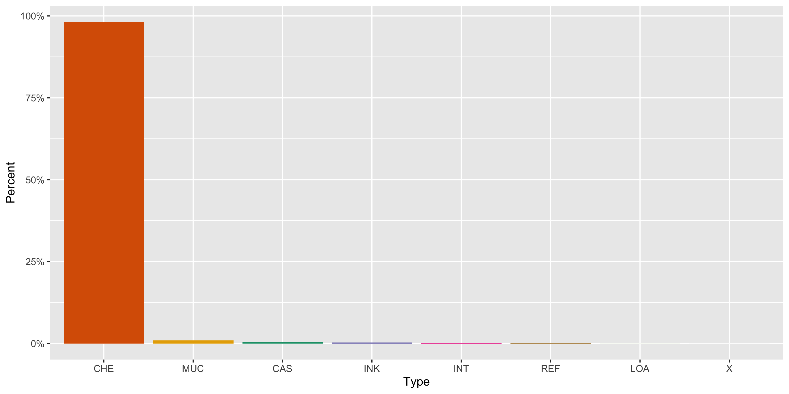
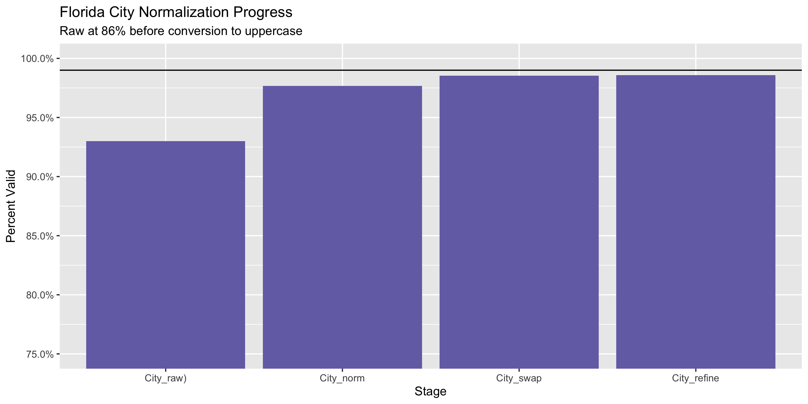
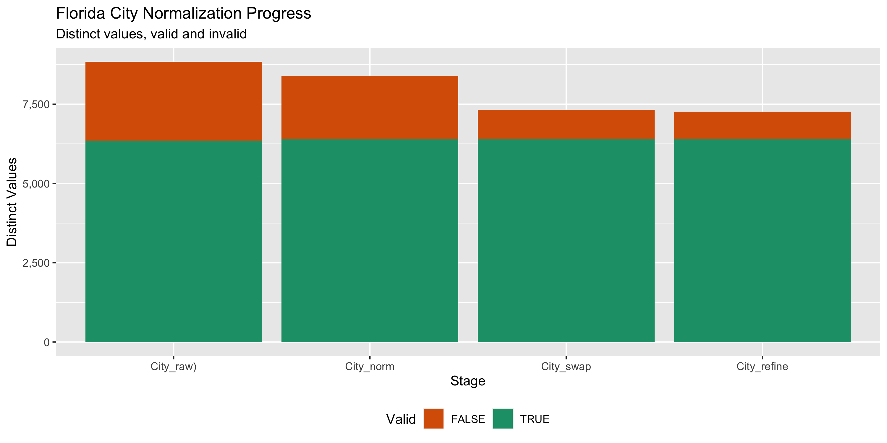

Florida Contributions
================
Kiernan Nicholls & Yanqi Xu
Mon Jan 16 10:09:08 2023

- <a href="#project" id="toc-project">Project</a>
- <a href="#objectives" id="toc-objectives">Objectives</a>
- <a href="#packages" id="toc-packages">Packages</a>
- <a href="#data" id="toc-data">Data</a>
  - <a href="#about" id="toc-about">About</a>
- <a href="#download" id="toc-download">Download</a>
- <a href="#fix" id="toc-fix">Fix</a>
- <a href="#read" id="toc-read">Read</a>
- <a href="#explore" id="toc-explore">Explore</a>
  - <a href="#missing" id="toc-missing">Missing</a>
  - <a href="#duplicates" id="toc-duplicates">Duplicates</a>
  - <a href="#categorical" id="toc-categorical">Categorical</a>
  - <a href="#amounts" id="toc-amounts">Amounts</a>
  - <a href="#dates" id="toc-dates">Dates</a>
- <a href="#wrangle" id="toc-wrangle">Wrangle</a>
  - <a href="#separate" id="toc-separate">Separate</a>
  - <a href="#address" id="toc-address">Address</a>
  - <a href="#zip" id="toc-zip">ZIP</a>
  - <a href="#state" id="toc-state">State</a>
  - <a href="#city" id="toc-city">City</a>
- <a href="#conclude" id="toc-conclude">Conclude</a>
- <a href="#export" id="toc-export">Export</a>
- <a href="#upload" id="toc-upload">Upload</a>

<!-- Place comments regarding knitting here -->

## Project

The Accountability Project is an effort to cut across data silos and
give journalists, policy professionals, activists, and the public at
large a simple way to search across huge volumes of public data about
people and organizations.

Our goal is to standardize public data on a few key fields by thinking
of each dataset row as a transaction. For each transaction there should
be (at least) 3 variables:

1.  All **parties** to a transaction.
2.  The **date** of the transaction.
3.  The **amount** of money involved.

## Objectives

This document describes the process used to complete the following
objectives:

1.  How many records are in the database?
2.  Check for entirely duplicated records.
3.  Check ranges of continuous variables.
4.  Is there anything blank or missing?
5.  Check for consistency issues.
6.  Create a five-digit ZIP Code called `zip`.
7.  Create a `year` field from the transaction date.
8.  Make sure there is data on both parties to a transaction.

## Packages

The following packages are needed to collect, manipulate, visualize,
analyze, and communicate these results. The `pacman` package will
facilitate their installation and attachment.

``` r
if (!require("pacman")) {
  install.packages("pacman")
}
pacman::p_load(
  tidyverse, # data manipulation
  lubridate, # datetime strings
  gluedown, # printing markdown
  janitor, # clean data frames
  campfin, # custom irw tools
  aws.s3, # aws cloud storage
  refinr, # cluster & merge
  scales, # format strings
  knitr, # knit documents
  vroom, # fast reading
  rvest, # scrape html
  glue, # code strings
  here, # project paths
  httr, # http requests
  fs # local storage 
)
```

``` r
packageVersion("campfin")
#> [1] '1.0.9.9000'
```

This document should be run as part of the `R_campfin` project, which
lives as a sub-directory of the more general, language-agnostic
[`irworkshop/accountability_datacleaning`](https://github.com/irworkshop/accountability_datacleaning)
GitHub repository.

The `R_campfin` project uses the [RStudio
projects](https://support.rstudio.com/hc/en-us/articles/200526207-Using-Projects)
feature and should be run as such. The project also uses the dynamic
`here::here()` tool for file paths relative to *your* machine.

``` r
# where does this document knit?
here::i_am("state/fl/contribs/docs/fl_contribs_diary.Rmd")
```

## Data

Data is obtained from the Florida Division of Elections.

As the [agency home
page](https://dos.myflorida.com/elections/candidates-committees/campaign-finance/)
explains:

> By Florida law, campaigns, committees, and electioneering
> communications organizations are required to disclose detailed
> financial records of campaign contributions and Contributions. Chapter
> 106, Florida Statutes, regulates campaign financing for all
> candidates, including judicial candidates, political committees,
> electioneering communication organizations, affiliated party
> committees, and political parties. It does not regulate campaign
> financing for candidates for federal office.

### About

A more detailed description of available data can be found on the
[Campaign Finance
page](https://dos.myflorida.com/elections/candidates-committees/campaign-finance/campaign-finance-database/):

> #### Quality of Data
>
> The information presented in the campaign finance database is an
> accurate representation of the reports filed with the Florida Division
> of Elections. \> \> Some of the information in the campaign finance
> database was submitted in electronic form, and some of the information
> was key-entered from paper reports. Sometimes items which are not
> consistent with filing requirements, such as incorrect codes or
> incorrectly formatted or blank items, are present in the results of a
> query. They are incorrect in the database because they were incorrect
> on reports submitted to the division.

> #### What does the Database Contain?
>
> By law candidates and committees are required to disclose detailed
> financial records of contributions received and Contributions made.
> For committees, the campaign finance database contains all
> contributions and Contributions reported to the Florida Division of
> Elections since January 1, 1996. For candidates, the campaign finance
> database contains all contributions and Contributions reported to the
> Division since the candidacy was announced, beginning with the 1996
> election.

> #### Whose Records are Included?
>
> Included are campaign finance reports which have been filed by
> candidates for any multi-county office, with the exception of U.S.
> Senator and U.S. Representative, and by organizations that receive
> contributions or make Contributions of more than \$500 in a calendar
> year to support or oppose any multi-county candidate, issue, or party.
> To obtain reports from local county or municipal candidates and
> committees, contact county or city filing offices.

> #### When are the Records Available?
>
> Campaign finance reports are posted to the database as they are
> received from the candidates and committees. Our data is as current as
> possible, consistent with the reporting requirements of Florida law.

## Download

We will use the [Contributions
Records](https://dos.elections.myflorida.com/campaign-finance/Contributions/)
query form to download three separate files covering all campaign
Contributions. [The home
page](https://dos.myflorida.com/elections/candidates-committees/campaign-finance/campaign-finance-database/)
lists instructions on how to download the desired files:

> #### How to Use the Campaign Finance Database
>
> 1.  Specify a subset of the \[Contributions\]…
> 2.  Select an election year entry from the list box.
> 3.  Select a candidate/committee option…
> 4.  Select contribution criteria (for Detail report only)…
> 5.  Select how you would like the records sorted.
> 6.  Select the format in which you would like the data returned.
> 7.  Limit the number of records to return….
>     - Choosing “Return Query Results in a Tab Delimited Text File”
>       will return the data in a file of tab-separated columns suitable
>       for importing into almost any spreadsheet or database. This
>       option allows you to download the data for further analysis
>       offline.
> 8.  Click on the Submit Query button.

To get all files covering all contributions:

1.  Select “All” from the **Election Year** drop down menu
2.  In the **From Date Range** text box, enter “01/01/2008”
3.  Delete “500” from the **Limit Records** text box
4.  Select the “Return Results in a Tab Delimited Text File” **Retrieval
    Format**
5.  Save to the `/fl/contribs/data/raw` directory

``` r
raw_dir <- dir_create(here("state","fl", "contribs", "data", "raw"))
raw_tsv <- path(raw_dir, "Contrib.txt")
```

``` r
fl_get <- GET(
  url = "https://dos.elections.myflorida.com/campaign-finance/contributions/"
)
```

``` r
fl_cookie <- cookies(fl_get)
fl_cookie <- setNames(fl_cookie$value, fl_cookie$name)
```

``` r
post_dt <- tibble(
  from_dt = seq(
    from = as.Date("1995-01-01"), 
    to = Sys.Date(), 
    by = "1 month"
  ),
  thru_dt = rollforward(from_dt)
)
```

``` r
for (i in seq(nrow(post_dt))) {
  from_ymd <- format(post_dt$from_dt[i], "%Y%m%d")
  from_mdy <- format(post_dt$from_dt[i], "%m/%d/%Y")
  thru_ymd <- format(post_dt$thru_dt[i], "%Y%m%d")
  thru_mdy <- format(post_dt$thru_dt[i], "%m/%d/%Y")
  dt_tsv <- path(raw_dir, glue("flc_{from_ymd}-{thru_ymd}.tsv"))
  if (!file_exists(dt_tsv)) {
    POST(
      url = "https://dos.elections.myflorida.com/cgi-bin/contrib.exe",
      user_agent("https://publicaccountability.org/"),
      write_disk(path = dt_tsv, overwrite = TRUE),
      set_cookies(fl_cookie),
      encode = "form",
      body = list(
        election = "All",
        search_on = "1",
        CanFName = "",
        CanLName = "",
        CanNameSrch = "2",
        office = "All",
        cdistrict = "",
        cgroup = "",
        party = "All",
        ComName = "",
        ComNameSrch = "2",
        committee = "All",
        cfname = "",
        clname = "",
        namesearch = "2",
        ccity = "",
        cstate = "",
        czipcode = "",
        cpurpose = "",
        cdollar_minimum = "",
        cdollar_maximum = "",
        rowlimit = "",
        csort1 = "DAT",
        csort2 = "CAN",
        cdatefrom = from_mdy,
        cdateto = thru_mdy,
        queryformat = "2",
        Submit = "Submit"
      )
    )
    #cli_alert_success("{from_mdy} - {thru_mdy}")
  }
}
```

## Fix

``` r
raw_tsv <- dir_ls(raw_dir, glob = "*.tsv")
```

``` r
fix_dir <- dir_create(path(dirname(raw_dir), "fix"))
fix_tsv <- path(fix_dir, basename(raw_tsv))
for (i in seq_along(raw_tsv)) {
  message(i)
  if (!file_exists(fix_tsv[i])) {
    x <- read_lines(raw_tsv[i])
    x_top <- x[1]
    x <- x[-1]
    # find rows without date in 2nd col
    bad_nl <- str_which(x, "^(.*)\t(\\d{2}/\\d{2}/\\d{4})", negate = TRUE)
    if (length(bad_nl) > 1) {
      x[bad_nl - 1] <- paste0(x[bad_nl - 1], x[bad_nl])
      x <- x[-bad_nl]
      x <- iconv(x, to = "ASCII//TRANSLIT", sub = "")
    }
    write_lines(x = c(x_top, x), file = fix_tsv[i])
    rm(x, x_top)
  }
}
```

## Read

``` r
flc <- read_delim(
  file = raw_tsv,
  delim = "\t",
  quote = "",
  escape_backslash = FALSE,
  escape_double = FALSE,
  col_types = cols(
    .default = col_character(),
    Date = col_date_mdy(),
    Amount = col_double()
  )
)
```

``` r
problems(flc)
#> # A tibble: 305 × 5
#>      row   col expected  actual    file                                                                                 
#>    <int> <int> <chr>     <chr>     <chr>                                                                                
#>  1  2455     5 9 columns 5 columns /Users/yanqixu/code/accountability_datacleaning/state/fl/contribs/data/raw/flc_19950…
#>  2  2456     5 9 columns 5 columns /Users/yanqixu/code/accountability_datacleaning/state/fl/contribs/data/raw/flc_19950…
#>  3  4165     5 9 columns 5 columns /Users/yanqixu/code/accountability_datacleaning/state/fl/contribs/data/raw/flc_19951…
#>  4  4168     5 9 columns 5 columns /Users/yanqixu/code/accountability_datacleaning/state/fl/contribs/data/raw/flc_19951…
#>  5  4169     5 9 columns 5 columns /Users/yanqixu/code/accountability_datacleaning/state/fl/contribs/data/raw/flc_19951…
#>  6  6469     5 9 columns 5 columns /Users/yanqixu/code/accountability_datacleaning/state/fl/contribs/data/raw/flc_19960…
#>  7  6470     5 9 columns 5 columns /Users/yanqixu/code/accountability_datacleaning/state/fl/contribs/data/raw/flc_19960…
#>  8  7630     5 9 columns 5 columns /Users/yanqixu/code/accountability_datacleaning/state/fl/contribs/data/raw/flc_19960…
#>  9  7631     5 9 columns 5 columns /Users/yanqixu/code/accountability_datacleaning/state/fl/contribs/data/raw/flc_19960…
#> 10  7633     5 9 columns 5 columns /Users/yanqixu/code/accountability_datacleaning/state/fl/contribs/data/raw/flc_19960…
#> # … with 295 more rows
```

``` r
flc <- flc %>% 
  rename(`Comm Name` = `Candidate/Committee`) %>% 
  clean_names(case = "snake")
```

To confirm our file was read correctly, we can count the distinct values
of a variable known to be discrete (like `typ`). If we find no erroneous
values, we know this column has been properly read across every line.

``` r
count(flc, typ)
#> # A tibble: 35 × 2
#>    typ                           n
#>    <chr>                     <int>
#>  1 "\r"                          4
#>  2 "ATTORNEY"                    1
#>  3 "BEVARGE DISTRIB. CO."        1
#>  4 "CA"                          1
#>  5 "CAS"                    884558
#>  6 "CCP"                        18
#>  7 "CH"                        405
#>  8 "CHE"                  22670305
#>  9 "COF"                       428
#> 10 "COUNSELOR"                   1
#> # … with 25 more rows
```

## Explore

There are 25,516,640 rows of 9 columns. Each record represents a single
contribution made from an individual to a committee.

``` r
glimpse(flc)
#> Rows: 25,516,640
#> Columns: 9
#> $ comm_name        <chr> "Jennings, Toni  (REP)(STS)", "Ballman, Donna  (NOP)(CTJ)", "Ballman, Donna  (NOP)(CTJ)", "Ba…
#> $ date             <date> 1995-01-01, 1995-01-04, 1995-01-05, 1995-01-05, 1995-01-05, 1995-01-05, 1995-01-05, 1995-01-…
#> $ amount           <dbl> 3397.15, 50.00, 25000.00, 500.00, 250.00, 200.00, 100.00, 100.00, 100.00, 100.00, 100.00, 50.…
#> $ typ              <chr> "CHE", "CHE", "LOA", "CHE", "CHE", "CHE", "CHE", "CHE", "CHE", "CHE", "CHE", "CHE", "CHE", "C…
#> $ contributor_name <chr> "BARNETT BANK OF CENTRAL FL.", "HARRISON, LOIS COWLES", "BALLMAN, DONNA M.", "CLARK, JUDY", "…
#> $ address          <chr> "PO BOX 1000", "2311 NEVADA AVE", "13899 BISCAYNE BLVD.,STE.#154", "5930 N. BAYSHORE DR.", "9…
#> $ city_state_zip   <chr> "WINTER PARK, FL 32790", "LAKELAND, FL 33803", "NORTH MIAMI BEACH, FL 33181", "MIAMI, FL 3313…
#> $ occupation       <chr> "INTEREST", NA, "ATTORNEY", "REALTOR", "LAW FIRM", "LAW FIRM", NA, NA, NA, NA, NA, NA, NA, NA…
#> $ inkind_desc      <chr> NA, NA, NA, NA, NA, NA, NA, NA, NA, NA, NA, NA, NA, NA, NA, NA, NA, NA, NA, NA, NA, NA, NA, N…
tail(flc)
#> # A tibble: 6 × 9
#>   comm_name                                      date        amount typ   contributor_…¹ address city_…² occup…³ inkin…⁴
#>   <chr>                                          <date>       <dbl> <chr> <chr>          <chr>   <chr>   <chr>   <chr>  
#> 1 Florida Family Medicine Political Action (PAC) 2022-12-31   285.  CHE   KEEHBAUCH JEN… 901 SP… ALTAMO… PHYSIC… <NA>   
#> 2 Florida Family Medicine Political Action (PAC) 2022-12-31 25000   CHE   THE FLORIDA A… 13241 … JACKSO… PHYSIC… <NA>   
#> 3 Help Out Public Education (PAC)                2022-12-31    50   CHE   FEINSTEIN MEL… 2905 S… STUART… NOT EM… <NA>   
#> 4 FAIAPAC (PAC)                                  2022-12-31    78.8 INT   BB&T BANK      3522 T… TALLAH… BANK    <NA>   
#> 5 Hialeah First (PAC)                            2022-12-31  4000   CHE   PEOPLE FOR PR… 6500 C… MIAMI … PC      <NA>   
#> 6 Florida Credit Union Political Action Co (PAC) 2022-12-31   594.  INT   NATIONAL COOP… 2011 C… ARLING… BANK    <NA>   
#> # … with abbreviated variable names ¹​contributor_name, ²​city_state_zip, ³​occupation, ⁴​inkind_desc
```

### Missing

Columns vary in their degree of missing values.

``` r
col_stats(flc, count_na)
#> # A tibble: 9 × 4
#>   col              class         n           p
#>   <chr>            <chr>     <int>       <dbl>
#> 1 comm_name        <chr>        11 0.000000431
#> 2 date             <date>       94 0.00000368 
#> 3 amount           <dbl>        94 0.00000368 
#> 4 typ              <chr>        57 0.00000223 
#> 5 contributor_name <chr>      1412 0.0000553  
#> 6 address          <chr>    437284 0.0171     
#> 7 city_state_zip   <chr>       138 0.00000541 
#> 8 occupation       <chr>  13219765 0.518      
#> 9 inkind_desc      <chr>  25337906 0.993
```

We can flag any record missing a key variable needed to identify a
transaction.

``` r
key_vars <- c("date", "contributor_name", "amount", "comm_name")
flc <- flag_na(flc, all_of(key_vars))
sum(flc$na_flag)
#> [1] 1452
```

A few hundred records are missing a `contributor_name`.

``` r
flc %>% 
  filter(na_flag) %>% 
  select(all_of(key_vars), city_state_zip) %>% 
  relocate(city_state_zip, .after = contributor_name)
#> # A tibble: 1,452 × 5
#>    date       contributor_name city_state_zip          amount comm_name                                     
#>    <date>     <chr>            <chr>                    <dbl> <chr>                                         
#>  1 1995-11-07 <NA>             "BOCS RATON, FL 33433"  250    Brenner, Scott  (DEM)(STR)                    
#>  2 1996-01-02 <NA>             "TALLAHASSEE, FL 32301"   0.25 Florida Police Benevolent Association In (PAC)
#>  3 1996-01-04 <NA>             "TALLAHASSEE, FL 32301"   0.25 Florida Police Benevolent Association In (PAC)
#>  4 1996-01-04 <NA>             "TALLAHASSEE, FL 32301"   0.25 Florida Police Benevolent Association In (PAC)
#>  5 1996-01-05 <NA>             "TALLAHASSEE, FL 32301"   0.25 Florida Police Benevolent Association In (PAC)
#>  6 1996-01-05 <NA>             "TALLAHASSEE, FL 32301"   0.25 Florida Police Benevolent Association In (PAC)
#>  7 1996-01-08 <NA>             "TALLAHASSEE, FL 32301"   0.25 Florida Police Benevolent Association In (PAC)
#>  8 1996-01-09 <NA>             "TALLAHASSEE, FL 32301"   0.25 Florida Police Benevolent Association In (PAC)
#>  9 1996-01-10 <NA>             "TALLAHASSEE, FL 32301"   0.25 Florida Police Benevolent Association In (PAC)
#> 10 1996-01-10 <NA>             ",       "                0    O'Brien, Timothy  (DEM)(STS)                  
#> # … with 1,442 more rows
```

``` r
flc %>% 
  select(all_of(key_vars)) %>% 
  col_stats(count_na)
#> # A tibble: 4 × 4
#>   col              class      n           p
#>   <chr>            <chr>  <int>       <dbl>
#> 1 date             <date>    94 0.00000368 
#> 2 contributor_name <chr>   1412 0.0000553  
#> 3 amount           <dbl>     94 0.00000368 
#> 4 comm_name        <chr>     11 0.000000431
```

### Duplicates

We can also flag any record completely duplicated across every column.

``` r
flc <- flag_dupes(flc, everything())
mean(flc$dupe_flag)
#> [1] 0.0756502
sum(flc$dupe_flag)
#> [1] 1930339
```

7.57% of records are duplicated at least once.

``` r
flc %>% 
  filter(dupe_flag) %>% 
  select(all_of(key_vars)) %>% 
  arrange(contributor_name, amount)
#> # A tibble: 1,930,339 × 4
#>    date       contributor_name              amount comm_name                                     
#>    <date>     <chr>                          <dbl> <chr>                                         
#>  1 NA         "\r"                           NA    <NA>                                          
#>  2 NA         "\r"                           NA    <NA>                                          
#>  3 NA         "\r"                           NA    <NA>                                          
#>  4 NA         "\r"                           NA    PAC                                           
#>  5 NA         "\r"                           NA    PAC                                           
#>  6 NA         "\r"                           NA    POLITICAL                                     
#>  7 NA         "\r"                           NA    POLITICAL                                     
#>  8 1996-02-25 ", RADFORD-WI DANA J"           0.25 Florida Police Benevolent Association In (PAC)
#>  9 1996-02-25 ", RADFORD-WI DANA J"           0.25 Florida Police Benevolent Association In (PAC)
#> 10 2000-04-17 "'IMPACT' MANAGEMENT COMPANY" 250    Personette, Steven  (REP)(STR)                
#> # … with 1,930,329 more rows
```

``` r
flc %>% 
  filter(dupe_flag) %>% 
  select(all_of(key_vars)) %>% 
  count(contributor_name, amount, comm_name, sort = TRUE)
#> # A tibble: 213,760 × 4
#>    contributor_name amount comm_name                                          n
#>    <chr>             <dbl> <chr>                                          <int>
#>  1 BROWN MICHAEL      0.25 Florida Police Benevolent Association In (PAC)  1618
#>  2 JOHNSON WILLIAM    0.25 Florida Police Benevolent Association In (PAC)  1615
#>  3 SMITH JAMES        0.25 Florida Police Benevolent Association In (PAC)  1482
#>  4 ROBERTS WILLIAM    0.25 Florida Police Benevolent Association In (PAC)  1366
#>  5 JONES MICHAEL      0.25 Florida Police Benevolent Association In (PAC)  1106
#>  6 WILLIAMS STEVEN    0.25 Florida Police Benevolent Association In (PAC)  1090
#>  7 WILLIAMS MARY      0.25 Florida Police Benevolent Association In (PAC)  1027
#>  8 STEWART JAMES      0.25 Florida Police Benevolent Association In (PAC)   955
#>  9 WASHINGTON JOHN    0.25 Florida Police Benevolent Association In (PAC)   932
#> 10 DAVIS ALLEN        0.25 Florida Police Benevolent Association In (PAC)   854
#> # … with 213,750 more rows
```

### Categorical

``` r
col_stats(flc, n_distinct)
#> # A tibble: 11 × 4
#>    col              class        n            p
#>    <chr>            <chr>    <int>        <dbl>
#>  1 comm_name        <chr>    12087 0.000474    
#>  2 date             <date>   10124 0.000397    
#>  3 amount           <dbl>    84925 0.00333     
#>  4 typ              <chr>       35 0.00000137  
#>  5 contributor_name <chr>  3625947 0.142       
#>  6 address          <chr>  3617933 0.142       
#>  7 city_state_zip   <chr>   150897 0.00591     
#>  8 occupation       <chr>   268128 0.0105      
#>  9 inkind_desc      <chr>    32186 0.00126     
#> 10 na_flag          <lgl>        2 0.0000000784
#> 11 dupe_flag        <lgl>        2 0.0000000784
```

``` r
flc <- mutate(flc, across(typ, str_to_upper))
```

<!-- -->

### Amounts

``` r
summary(flc$amount)
#>     Min.  1st Qu.   Median     Mean  3rd Qu.     Max.     NA's 
#>  -900801        1        5      243       25 41000000       94
mean(flc$amount <= 0)
#> [1] NA
```

These are the records with the minimum and maximum amounts.

``` r
glimpse(flc[c(which.max(flc$amount), which.min(flc$amount)), ])
#> Rows: 2
#> Columns: 11
#> $ comm_name        <chr> "Lipner, Ryan Adam (NPA)(GOV)", "Housing for Hometown Heroes (PAC)"
#> $ date             <date> 2001-12-03, 2021-11-22
#> $ amount           <dbl> 41000000.0, -900801.5
#> $ typ              <chr> "X", "REF"
#> $ contributor_name <chr> "HUGHES HUBBARD AND REED LLP", "SGS INC"
#> $ address          <chr> "201 SOUTH BISCAYNE BOULEVARD SUITE 2500", "6211 NW 132ND STREET"
#> $ city_state_zip   <chr> "MIAMI, FL 33131", "GAINESVILLE, FL 32653"
#> $ occupation       <chr> NA, "CONSULTING - RTRN OF ADV FEES"
#> $ inkind_desc      <chr> NA, NA
#> $ na_flag          <lgl> FALSE, FALSE
#> $ dupe_flag        <lgl> FALSE, FALSE
```

<!-- -->

### Dates

We can add the calendar year from `date` with `lubridate::year()`

``` r
flc <- mutate(flc, year = year(date))
```

``` r
min(flc$date)
#> [1] NA
sum(flc$year < 1995)
#> [1] NA
max(flc$date)
#> [1] NA
sum(flc$date > today())
#> [1] NA
```

<!-- -->

## Wrangle

To improve the searchability of the database, we will perform some
consistent, confident string normalization. For geographic variables
like city names and ZIP codes, the corresponding `campfin::normal_*()`
functions are tailor made to facilitate this process.

### Separate

The `city_state_zip` column contains all three geographic variables in a
single string. We need to separate out the data so they can be properly
searched on the site. The string normally takes the format of
`Miami, FL 33101`, with the city name first before a common, followed by
the two-letter state abbreviation and 5-digit ZIP code. Quite a number
of these values break this expected format, upwards of 5% of values. We
can use regular expressions to manipulate broken strings and then
extract the geographic variables from their expected locations.

``` r
flc$city_state_zip <- str_conv(flc$city_state_zip, "UTF-8")
```

``` r
flc <- extract(
  data = flc,
  col = city_state_zip,
  into = c("city_sep", "state_sep", "zip_sep"),
  regex = "^(.*),\\s+(.*),?\\s+(.*)$",
  remove = FALSE
)
```

``` r
csz <- flc %>%
  distinct(city_state_zip) %>% 
  mutate(
    # fix the city_state_zip values
    x = city_state_zip %>% 
      na_rep() %>% 
      str_squish() %>% 
      str_replace("(?<=\\s)F, L", ", FL") %>% 
      str_replace("(?<=\\s)F, L,", ", FL") %>% 
      str_replace("(?<=\\s)F, L.", ", FL") %>% 
      str_remove("(?<=FL),") %>% 
      str_replace("([A-Z]{2})(\\d+)", "\\1 \\2") %>% 
      str_replace("\\sDC,", ", DC"),
    # extract the geo from each spot
    city_sep = str_extract(x, "(.*)(?=,(\\s|$))"),
    state_sep = str_extract(x, "[A-Z\\*\\.]{1,}(?=\\s\\d|$)"),
    zip_sep = str_extract(x, "\\d{2,5}(?:-\\d{4})?$"),
    across(where(is.character), na_if, "")
  ) %>% 
  select(-x)
```

``` r
flc <- left_join(flc, csz, by = "city_state_zip")
```

### Address

For the street `addresss` variable, the `campfin::normal_address()`
function will force consistence case, remove punctuation, and abbreviate
official USPS suffixes.

The `address` also seems to be separated by white space not
tab-characters. We can create a new variable with the secondary address.

``` r
flc %>% 
  select(address) %>% 
  head(10)
#> # A tibble: 10 × 1
#>    address                      
#>    <chr>                        
#>  1 PO BOX 1000                  
#>  2 2311 NEVADA AVE              
#>  3 13899 BISCAYNE BLVD.,STE.#154
#>  4 5930 N. BAYSHORE DR.         
#>  5 999 PONCE DE LEON BLVD.      
#>  6 359 ALCAZAR AVE.             
#>  7 2121 PONCE DE LEON BIVD. #721
#>  8 19 W.FLAGER ST.208           
#>  9 505 NE 76TH ST.              
#> 10 707 VILABELLE AVE.
```

``` r
flc$address <- str_conv(flc$address, encoding = "UTF-8")
```

``` r
fl_addr <- flc %>% 
  distinct(address) %>% 
  separate(
    col = address,
    into = c("address1", "address2"),
    sep = "\\s{3,}",
    remove = FALSE,
    extra = "merge",
    fill = "right"
  )
```

``` r
fl_addr <- fl_addr %>% 
  mutate(
    across(
      .cols = c(address1, address2),
      .fns = ~normal_address(
        address = .,
        abbs = usps_street,
        na_rep = TRUE,
        na = invalid_city
      )
    )
  )
```

``` r
fl_addr <- unite(
  data = fl_addr,
  col = address_clean,
  address1, address2,
  sep = " ",
  remove = TRUE,
  na.rm = TRUE
)
```

``` r
flc <- left_join(flc, fl_addr, by = "address")
```

``` r
flc %>% 
  select(contains("address")) %>% 
  distinct() %>% 
  sample_n(10)
#> # A tibble: 10 × 2
#>    address                         address_clean                 
#>    <chr>                           <chr>                         
#>  1 200 S. ANDREWS AVENUE, 6TH FL   200 S ANDREWS AVENUE 6TH FL   
#>  2 PO BOX 653407                   PO BOX 653407                 
#>  3 105 SANTIAGO DRIVE UNIT NO. 104 105 SANTIAGO DRIVE UNIT NO 104
#>  4 2204 LAKE OSBORNE               2204 LAKE OSBORNE             
#>  5 14438 HAROCHE AVE               14438 HAROCHE AVE             
#>  6 108 S MONROE SR. #200           108 S MONROE SR #200          
#>  7 1912 WHITE HERON BAY CIR        1912 WHITE HERON BAY CIR      
#>  8 11425 REAMES ROAD               11425 REAMES RD               
#>  9 2241 NE 9TH AVE                 2241 NE 9TH AVE               
#> 10 335 35TH STREET SOUTH           335 35TH STREET S
```

### ZIP

For ZIP codes, the `campfin::normal_zip()` function will attempt to
create valid *five* digit codes by removing the ZIP+4 suffix and
returning leading zeroes dropped by other programs like Microsoft Excel.

``` r
flc <- flc %>% 
  mutate(
    zip_norm = normal_zip(
      zip = zip_sep,
      na_rep = TRUE
    )
  )
```

``` r
progress_table(
  flc$zip_sep,
  flc$zip_norm,
  compare = valid_zip
)
#> # A tibble: 2 × 6
#>   stage        prop_in n_distinct prop_na   n_out n_diff
#>   <chr>          <dbl>      <dbl>   <dbl>   <dbl>  <dbl>
#> 1 flc$zip_sep    0.947      42021  0.0226 1312766   8511
#> 2 flc$zip_norm   0.994      42002  0.0684  145558   8492
```

### State

Valid two digit state abbreviations can be made using the
`campfin::normal_state()` function.

``` r
flc <- flc %>% 
  mutate(
    state_norm = normal_state(
      state = state_sep,
      abbreviate = TRUE,
      na_rep = TRUE,
      valid = valid_state
    )
  )
```

``` r
flc %>% 
  filter(state_sep != state_norm) %>% 
  count(state_sep, state_norm, sort = TRUE)
#> # A tibble: 5 × 3
#>   state_sep    state_norm     n
#>   <chr>        <chr>      <int>
#> 1 FL.          FL           104
#> 2 FLORIDA      FL             9
#> 3 WASHINGTON   WA             2
#> 4 PENNSYLVANIA PA             1
#> 5 TEXAS        TX             1
```

``` r
progress_table(
  flc$state_sep,
  flc$state_norm,
  compare = valid_state
)
#> # A tibble: 2 × 6
#>   stage          prop_in n_distinct prop_na n_out n_diff
#>   <chr>            <dbl>      <dbl>   <dbl> <dbl>  <dbl>
#> 1 flc$state_sep    0.999        639  0.0545 14092    578
#> 2 flc$state_norm   1             62  0.0551     0      1
```

### City

Cities are the most difficult geographic variable to normalize, simply
due to the wide variety of valid cities and formats.

#### Normal

The `campfin::normal_city()` function is a good start, again converting
case, removing punctuation, but *expanding* USPS abbreviations. We can
also remove `invalid_city` values.

``` r
norm_city <- flc %>% 
  distinct(city_sep, state_norm, zip_norm) %>% 
  mutate(
    city_norm = normal_city(
      city = city_sep, 
      abbs = usps_city,
      states = c("FL", "DC", "FLORIDA"),
      na = invalid_city,
      na_rep = TRUE
    )
  )
```

#### Swap

We can further improve normalization by comparing our normalized value
against the *expected* value for that record’s state abbreviation and
ZIP code. If the normalized value is either an abbreviation for or very
similar to the expected value, we can confidently swap those two.

``` r
norm_city <- norm_city %>% 
  left_join(
    y = zipcodes,
    by = c(
      "state_norm" = "state",
      "zip_norm" = "zip"
    )
  ) %>% 
  rename(city_match = city) %>% 
  mutate(
    match_abb = is_abbrev(city_norm, city_match),
    match_dist = str_dist(city_norm, city_match),
    city_swap = if_else(
      condition = !is.na(match_dist) & (match_abb | match_dist == 1),
      true = city_match,
      false = city_norm
    )
  ) %>% 
  select(
    -city_match,
    -match_dist,
    -match_abb
  )
```

``` r
flc <- left_join(
  x = flc,
  y = norm_city,
  by = c(
    "city_sep", 
    "state_norm", 
    "zip_norm"
  )
)
```

#### Refine

The [OpenRefine](https://openrefine.org/) algorithms can be used to
group similar strings and replace the less common versions with their
most common counterpart. This can greatly reduce inconsistency, but with
low confidence; we will only keep any refined strings that have a valid
city/state/zip combination.

``` r
good_refine <- flc %>% 
  mutate(
    city_refine = city_swap %>% 
      key_collision_merge() %>% 
      n_gram_merge(numgram = 1)
  ) %>% 
  filter(city_refine != city_swap) %>% 
  inner_join(
    y = zipcodes,
    by = c(
      "city_refine" = "city",
      "state_norm" = "state",
      "zip_norm" = "zip"
    )
  )
```

    #> # A tibble: 1,325 × 5
    #>    state_norm zip_norm city_swap            city_refine           n
    #>    <chr>      <chr>    <chr>                <chr>             <int>
    #>  1 FL         34653    NEW POINT RICHEY     NEW PORT RICHEY     493
    #>  2 FL         34655    NEW POINT RICHEY     NEW PORT RICHEY     397
    #>  3 FL         34654    NEW POINT RICHEY     NEW PORT RICHEY     363
    #>  4 FL         32082    PONTE VERDE BEACH    PONTE VEDRA BEACH   293
    #>  5 NY         11733    SETAUKET             EAST SETAUKET       250
    #>  6 IL         60010    NO BARRINGTON        BARRINGTON          175
    #>  7 FL         33706    SAINT PETERSBURG BEA SAINT PETERSBURG    146
    #>  8 SC         29406    NORTH CHARLESTON     CHARLESTON          134
    #>  9 OH         45244    CINCINATTI           CINCINNATI           97
    #> 10 FL         32082    PONTEVERDA BEACH     PONTE VEDRA BEACH    78
    #> # … with 1,315 more rows

Then we can join the refined values back to the database.

``` r
flc <- flc %>% 
  left_join(good_refine, by = names(.)) %>% 
  mutate(city_refine = coalesce(city_refine, city_swap))
```

#### Manual

``` r
many_city <- c(valid_city, extra_city)
flc %>% 
  count(city_sep, city_refine, state_norm, sort = TRUE) %>% 
  filter(city_refine %out% many_city)
#> # A tibble: 16,613 × 4
#>    city_sep          city_refine       state_norm       n
#>    <chr>             <chr>             <chr>        <int>
#>  1 <NA>              <NA>              <NA>       1382531
#>  2 <NA>              <NA>              IL           15161
#>  3 <NA>              <NA>              FL           14252
#>  4 PT. CHARLOTTE     POINT CHARLOTTE   FL           11962
#>  5 MIAMI SHORES      MIAMI SHORES      FL            7885
#>  6 FARMINGTON HILLS  FARMINGTON HILLS  MI            7226
#>  7 HALLANDALE BEACH  HALLANDALE BEACH  FL            6657
#>  8 <NA>              <NA>              CA            5989
#>  9 SUNNY ISLES BEACH SUNNY ISLES BEACH FL            5814
#> 10 BELLEAIR          BELLEAIR          FL            5752
#> # … with 16,603 more rows
```

``` r
flc <- flc %>% 
  mutate(
    city_refine = city_refine %>% 
      str_replace("^RYL(?=\\s)", "ROYAL") %>% 
      str_replace("^PMBK(?=\\s)", "PEMBROKE") %>% 
      str_replace("^LGHTHSE(?=\\s)", "LIGHTHOUSE") %>% 
      str_replace("^FARMINGTON HILL$", "FARMINGTON HILLS")
  )
```

``` r
many_city <- c(many_city, "HALLANDALE BEACH", "FARMINGTON HILLS")
```

#### Progress

Our goal for normalization was to increase the proportion of city values
known to be valid and reduce the total distinct values by correcting
misspellings.

| stage                        | prop_in | n_distinct | prop_na |   n_out | n_diff |
|:-----------------------------|--------:|-----------:|--------:|--------:|-------:|
| `str_to_upper(flc$city_sep)` |   0.950 |      50100 |   0.057 | 1206256 |  34102 |
| `flc$city_norm`              |   0.967 |      44020 |   0.057 |  804767 |  27987 |
| `flc$city_swap`              |   0.988 |      30945 |   0.057 |  277225 |  14875 |
| `flc$city_refine`            |   0.989 |      30099 |   0.057 |  263135 |  14031 |

You can see how the percentage of valid values increased with each
stage.

<!-- -->

More importantly, the number of distinct values decreased each stage. We
were able to confidently change many distinct invalid values to their
valid equivalent.

<!-- -->

Before exporting, we can remove the intermediary normalization columns
and rename all added variables with the `_clean` suffix.

``` r
flc <- flc %>% 
  select(-ends_with("_sep")) %>% 
  select(-city_norm, -city_swap) %>% 
  rename(city_clean = city_refine) %>% 
  rename_all(~str_replace(., "_norm", "_clean")) %>% 
  relocate(city_clean, state_clean, zip_clean, .after = address_clean)
```

``` r
glimpse(sample_n(flc, 50))
#> Rows: 50
#> Columns: 16
#> $ comm_name        <chr> "Florida Police Benevolent Association In (PAC)", "Wal-Mart Stores Inc. PAC For Responsible (…
#> $ date             <date> 2003-02-24, 2004-06-03, 2003-07-09, 2009-09-25, 2005-05-23, 2013-10-30, 2004-07-26, 1996-12-…
#> $ amount           <dbl> 0.25, 1.00, 2.50, 0.25, 0.50, 1.00, 5.00, 175.00, 23.00, 10.00, 25.00, 29.00, 20.20, 2.50, 0.…
#> $ typ              <chr> "DUE", "CHE", "CHE", "CHE", "CHE", "CHE", "CHE", "CHE", "CHE", "CHE", "CHE", "CHE", "CHE", "C…
#> $ contributor_name <chr> "SMITH FLETCHE", "SANTANGELO STEPHANIE C", "GRAEF THERESA", "SPENCE DYANN", "SMITH SCOTT D.",…
#> $ address          <chr> "ADDRESS PROTECTED PER FSCH119", "16260 KAMANA ROAD", "4609 TAMMY DRIVE", "300 EAST BREVARD S…
#> $ city_state_zip   <chr> ",  00000", "APPLE VALLEY, CA 92307", "WICHITA FALLS, TX 76306", "TALLAHASSEE, FL 32301", "EA…
#> $ occupation       <chr> NA, "9LOGISTICS AREA MANA", NA, NA, "DRIVER", "FIREFIGHTER", "PKG OPS SUPV", "ATTORNEY", NA, …
#> $ inkind_desc      <chr> NA, NA, NA, NA, NA, NA, NA, NA, NA, NA, NA, NA, NA, NA, NA, NA, NA, NA, NA, NA, NA, NA, NA, N…
#> $ na_flag          <lgl> FALSE, FALSE, FALSE, FALSE, FALSE, FALSE, FALSE, FALSE, FALSE, FALSE, FALSE, FALSE, FALSE, FA…
#> $ dupe_flag        <lgl> FALSE, FALSE, TRUE, FALSE, FALSE, FALSE, FALSE, FALSE, FALSE, FALSE, FALSE, FALSE, FALSE, FAL…
#> $ year             <dbl> 2003, 2004, 2003, 2009, 2005, 2013, 2004, 1996, 2008, 2021, 2004, 2005, 2020, 2000, 2002, 199…
#> $ address_clean    <chr> "ADDRESS PROTECTED PER FSCH119", "16260 KAMANA RD", "4609 TAMMY DR", "300 EAST BREVARD ST", "…
#> $ city_clean       <chr> NA, "APPLE VALLEY", "WICHITA FALLS", "TALLAHASSEE", "EAST ORANGE", "FORT LAUDERDALE", "WEST D…
#> $ state_clean      <chr> NA, "CA", "TX", "FL", "NJ", "FL", "IA", "FL", "CA", "OH", "NY", "VA", "FL", "AZ", NA, "TX", "…
#> $ zip_clean        <chr> NA, "92307", "76306", "32301", "07017", "33312", "50265", "32207", "92118", "44118", "10005",…
```

## Conclude

1.  There are 25,516,906 records in the database.
2.  There are 1,930,605 duplicate records in the database.
3.  The range and distribution of `amount` and `date` seem reasonable.
4.  There are 1,452 records missing key variables.
5.  Consistency in geographic data has been improved with
    `campfin::normal_*()`.
6.  The 4-digit `year` variable has been created with
    `lubridate::year()`.

## Export

Now the file can be saved on disk for upload to the Accountability
server.

``` r
clean_dir <- dir_create(here("state","fl", "contribs", "data", "clean"))
clean_path <- path(clean_dir, "fl_contribs_19950101-20230109.csv")
write_csv(flc, clean_path, na = "")
(clean_size <- file_size(clean_path))
#> 4.31G
```

## Upload

We can use the `aws.s3::put_object()` to upload the text file to the IRW
server.

``` r
aws_path <- path("csv", basename(clean_path))
if (!object_exists(aws_path, "publicaccountability")) {
  put_object(
    file = clean_path,
    object = aws_path, 
    bucket = "publicaccountability",
    acl = "public-read",
    show_progress = TRUE,
    multipart = TRUE
  )
}
aws_head <- head_object(aws_path, "publicaccountability")
(aws_size <- as_fs_bytes(attr(aws_head, "content-length")))
unname(aws_size == clean_size)
```
