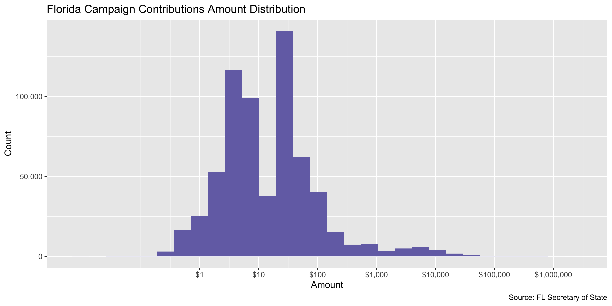

Florida Contributions
================
Kiernan Nicholls
Tue Sep 21 16:01:34 2021

-   [Project](#project)
-   [Objectives](#objectives)
-   [Packages](#packages)
-   [Data](#data)
    -   [About](#about)
-   [Download](#download)
-   [Fix](#fix)
-   [Read](#read)
-   [Explore](#explore)
    -   [Missing](#missing)
    -   [Duplicates](#duplicates)
    -   [Categorical](#categorical)
    -   [Amounts](#amounts)
    -   [Dates](#dates)
-   [Wrangle](#wrangle)
    -   [Separate](#separate)
    -   [Address](#address)
    -   [ZIP](#zip)
    -   [State](#state)
    -   [City](#city)
-   [Conclude](#conclude)
-   [Export](#export)
-   [Upload](#upload)

<!-- Place comments regarding knitting here -->

## Project

The Accountability Project is an effort to cut across data silos and
give journalists, policy professionals, activists, and the public at
large a simple way to search across huge volumes of public data about
people and organizations.

Our goal is to standardize public data on a few key fields by thinking
of each dataset row as a transaction. For each transaction there should
be (at least) 3 variables:

1.  All **parties** to a transaction.
2.  The **date** of the transaction.
3.  The **amount** of money involved.

## Objectives

This document describes the process used to complete the following
objectives:

1.  How many records are in the database?
2.  Check for entirely duplicated records.
3.  Check ranges of continuous variables.
4.  Is there anything blank or missing?
5.  Check for consistency issues.
6.  Create a five-digit ZIP Code called `zip`.
7.  Create a `year` field from the transaction date.
8.  Make sure there is data on both parties to a transaction.

## Packages

The following packages are needed to collect, manipulate, visualize,
analyze, and communicate these results. The `pacman` package will
facilitate their installation and attachment.

``` r
if (!require("pacman")) {
  install.packages("pacman")
}
pacman::p_load(
  tidyverse, # data manipulation
  lubridate, # datetime strings
  gluedown, # printing markdown
  janitor, # clean data frames
  campfin, # custom irw tools
  aws.s3, # aws cloud storage
  refinr, # cluster & merge
  scales, # format strings
  knitr, # knit documents
  vroom, # fast reading
  rvest, # scrape html
  glue, # code strings
  here, # project paths
  httr, # http requests
  cli, # command line
  fs # local storage 
)
```

``` r
packageVersion("campfin")
#> [1] '1.0.8.9000'
```

This document should be run as part of the `R_campfin` project, which
lives as a sub-directory of the more general, language-agnostic
[`irworkshop/accountability_datacleaning`](https://github.com/irworkshop/accountability_datacleaning)
GitHub repository.

The `R_campfin` project uses the [RStudio
projects](https://support.rstudio.com/hc/en-us/articles/200526207-Using-Projects)
feature and should be run as such. The project also uses the dynamic
`here::here()` tool for file paths relative to *your* machine.

``` r
# where does this document knit?
here::i_am("fl/contribs/docs/fl_contribs_diary.Rmd")
```

## Data

Data is obtained from the Florida Division of Elections.

As the [agency home
page](https://dos.myflorida.com/elections/candidates-committees/campaign-finance/)
explains:

> By Florida law, campaigns, committees, and electioneering
> communications organizations are required to disclose detailed
> financial records of campaign contributions and Contributions. Chapter
> 106, Florida Statutes, regulates campaign financing for all
> candidates, including judicial candidates, political committees,
> electioneering communication organizations, affiliated party
> committees, and political parties. It does not regulate campaign
> financing for candidates for federal office.

### About

A more detailed description of available data can be found on the
[Campaign Finance
page](https://dos.myflorida.com/elections/candidates-committees/campaign-finance/campaign-finance-database/):

> #### Quality of Data
>
> The information presented in the campaign finance database is an
> accurate representation of the reports filed with the Florida Division
> of Elections. &gt; &gt; Some of the information in the campaign
> finance database was submitted in electronic form, and some of the
> information was key-entered from paper reports. Sometimes items which
> are not consistent with filing requirements, such as incorrect codes
> or incorrectly formatted or blank items, are present in the results of
> a query. They are incorrect in the database because they were
> incorrect on reports submitted to the division.

> #### What does the Database Contain?
>
> By law candidates and committees are required to disclose detailed
> financial records of contributions received and Contributions made.
> For committees, the campaign finance database contains all
> contributions and Contributions reported to the Florida Division of
> Elections since January 1, 1996. For candidates, the campaign finance
> database contains all contributions and Contributions reported to the
> Division since the candidacy was announced, beginning with the 1996
> election.

> #### Whose Records are Included?
>
> Included are campaign finance reports which have been filed by
> candidates for any multi-county office, with the exception of U.S.
> Senator and U.S. Representative, and by organizations that receive
> contributions or make Contributions of more than $500 in a calendar
> year to support or oppose any multi-county candidate, issue, or party.
> To obtain reports from local county or municipal candidates and
> committees, contact county or city filing offices.

> #### When are the Records Available?
>
> Campaign finance reports are posted to the database as they are
> received from the candidates and committees. Our data is as current as
> possible, consistent with the reporting requirements of Florida law.

## Download

We will use the [Contributions
Records](https://dos.elections.myflorida.com/campaign-finance/Contributions/)
query form to download three separate files covering all campaign
Contributions. [The home
page](https://dos.myflorida.com/elections/candidates-committees/campaign-finance/campaign-finance-database/)
lists instructions on how to download the desired files:

> #### How to Use the Campaign Finance Database
>
> 1.  Specify a subset of the \[Contributions\]…
> 2.  Select an election year entry from the list box.
> 3.  Select a candidate/committee option…
> 4.  Select contribution criteria (for Detail report only)…
> 5.  Select how you would like the records sorted.
> 6.  Select the format in which you would like the data returned.
> 7.  Limit the number of records to return….
>     -   Choosing “Return Query Results in a Tab Delimited Text File”
>         will return the data in a file of tab-separated columns
>         suitable for importing into almost any spreadsheet or
>         database. This option allows you to download the data for
>         further analysis offline.
> 8.  Click on the Submit Query button.

To get all files covering all contributions:

1.  Select “All” from the **Election Year** drop down menu
2.  In the **From Date Range** text box, enter “01/01/2008”
3.  Delete “500” from the **Limit Records** text box
4.  Select the “Return Results in a Tab Delimited Text File” **Retrieval
    Format**
5.  Save to the `/fl/contribs/data/raw` directory

``` r
raw_dir <- dir_create(here("fl", "contribs", "data", "raw"))
raw_tsv <- path(raw_dir, "Contrib.txt")
```

``` r
fl_get <- GET(
  url = "https://dos.elections.myflorida.com/campaign-finance/contributions/"
)
```

``` r
fl_cookie <- cookies(fl_get)
fl_cookie <- setNames(fl_cookie$value, fl_cookie$name)
```

``` r
post_dt <- tibble(
  from_dt = seq(
    from = as.Date("1995-01-01"), 
    to = Sys.Date(), 
    by = "1 month"
  ),
  thru_dt = rollforward(from_dt)
)
```

``` r
for (i in seq(nrow(post_dt))) {
  from_ymd <- format(post_dt$from_dt[i], "%Y%m%d")
  from_mdy <- format(post_dt$from_dt[i], "%m/%d/%Y")
  thru_ymd <- format(post_dt$from_dt[i], "%Y%m%d")
  thru_mdy <- format(post_dt$from_dt[i], "%m/%d/%Y")
  dt_tsv <- path(raw_dir, glue("flc_{from_ymd}-{thru_ymd}.tsv"))
  if (!file_exists(dt_tsv)) {
    POST(
      url = "https://dos.elections.myflorida.com/cgi-bin/contrib.exe",
      user_agent("https://publicaccountability.org/"),
      write_disk(path = dt_tsv, overwrite = TRUE),
      set_cookies(fl_cookie),
      encode = "form",
      body = list(
        election = "All",
        search_on = "1",
        CanFName = "",
        CanLName = "",
        CanNameSrch = "2",
        office = "All",
        cdistrict = "",
        cgroup = "",
        party = "All",
        ComName = "",
        ComNameSrch = "2",
        committee = "All",
        cfname = "",
        clname = "",
        namesearch = "2",
        ccity = "",
        cstate = "",
        czipcode = "",
        cpurpose = "",
        cdollar_minimum = "",
        cdollar_maximum = "",
        rowlimit = "",
        csort1 = "DAT",
        csort2 = "CAN",
        cdatefrom = from_mdy,
        cdateto = thru_mdy,
        queryformat = "2",
        Submit = "Submit"
      )
    )
    cli_alert_success("{from_mdy} - {thru_mdy}")
  }
}
```

## Fix

``` r
raw_tsv <- dir_ls(raw_dir, glob = "*.tsv")
```

``` r
fix_dir <- dir_create(path(dirname(raw_dir), "fix"))
fix_tsv <- path(fix_dir, basename(raw_tsv))
for (i in seq_along(raw_tsv)) {
  message(i)
  if (!file_exists(fix_tsv[i])) {
    x <- read_lines(raw_tsv[i])
    x_top <- x[1]
    x <- x[-1]
    # find rows without date in 2nd col
    bad_nl <- str_which(x, "^(.*)\t(\\d{2}/\\d{2}/\\d{4})", negate = TRUE)
    if (length(bad_nl) > 1) {
      x[bad_nl - 1] <- paste0(x[bad_nl - 1], x[bad_nl])
      x <- x[-bad_nl]
      x <- iconv(x, to = "ASCII//TRANSLIT", sub = "")
    }
    write_lines(x = c(x_top, x), file = fix_tsv[i])
    rm(x, x_top)
  }
}
```

## Read

``` r
fle <- read_delim(
  file = raw_tsv,
  delim = "\t",
  quote = "",
  escape_backslash = FALSE,
  escape_double = FALSE,
  col_types = cols(
    .default = col_character(),
    Date = col_date_mdy(),
    Amount = col_double()
  )
)
```

``` r
problems(fle)
#> # A tibble: 0 × 5
#> # … with 5 variables: row <int>, col <int>, expected <chr>, actual <chr>, file <chr>
```

``` r
fle <- fle %>% 
  rename(`Comm Name` = `Candidate/Committee`) %>% 
  clean_names(case = "snake")
```

To confirm our file was read correctly, we can count the distinct values
of a variable known to be discrete (like `typ`). If we find no erroneous
values, we know this column has been properly read across every line.

``` r
count(fle, typ)
#> # A tibble: 12 × 2
#>    typ        n
#>    <chr>  <int>
#>  1 CAS    78997
#>  2 CHE   594541
#>  3 COF       20
#>  4 DUE   101153
#>  5 INK     5858
#>  6 INT     1938
#>  7 LOA      679
#>  8 MO        64
#>  9 MUC     1066
#> 10 RCT        5
#> 11 REF     1010
#> 12 X       1110
```

## Explore

There are 786,441 rows of 9 columns. Each record represents a single
contribution made from an individual to a committee.

``` r
glimpse(fle)
#> Rows: 786,441
#> Columns: 9
#> $ comm_name        <chr> "Jennings, Toni  (REP)(STS)", "Kelly, Everett  (DEM)(STR)", "Kelly, Everett  (DEM)(STR)", "St…
#> $ date             <date> 1995-01-01, 1995-02-01, 1995-02-01, 1995-02-01, 1995-03-01, 1995-03-01, 1995-03-01, 1995-03-…
#> $ amount           <dbl> 3397.15, 500.00, 500.00, 500.00, 300.00, 200.00, 100.00, 100.00, 100.00, 100.00, 100.00, 50.0…
#> $ typ              <chr> "CHE", "CHE", "CHE", "CHE", "CHE", "CHE", "CHE", "CHE", "CHE", "CHE", "CHE", "CHE", "CHE", "C…
#> $ contributor_name <chr> "BARNETT BANK OF CENTRAL FL.", "FLORIDA PHARMACY PAC", "PANZER, MAURER, MAYNARD PA", "MANUFAC…
#> $ address          <chr> "PO BOX 1000", "P.O. BOX 1575", "3081 E COMMERCIAL BLVD.", "TWO N. RIVERSIDE PZ", "217 N KIRK…
#> $ city_state_zip   <chr> "WINTER PARK, FL 32790", "TALLAHASSEE, FL 32302", "FT. LAUDERDALE, FL 33308", "CHICAGO, IL 60…
#> $ occupation       <chr> "INTEREST", "PAC", "ATTORNEYS", "MOBILE HOMES", "PAC", "REGIONAL MANAGER", NA, "POLITICAL ACT…
#> $ inkind_desc      <chr> NA, NA, NA, NA, NA, NA, NA, NA, NA, NA, NA, NA, NA, NA, NA, NA, NA, NA, NA, NA, NA, NA, NA, N…
tail(fle)
#> # A tibble: 6 × 9
#>   comm_name                     date        amount typ   contributor_name  address city_state_zip occupation inkind_desc
#>   <chr>                         <date>       <dbl> <chr> <chr>             <chr>   <chr>          <chr>      <chr>      
#> 1 Friends of Ron DeSantis (PAC) 2021-08-01   250   CHE   TATO JOHN         293 FL… SANTA ROSA BE… RETIRED    <NA>       
#> 2 Friends of Ron DeSantis (PAC) 2021-08-01   500   CHE   BARNETT SCOTT     4602 C… BUSHNELL, FL … RETIRED    <NA>       
#> 3 Friends of Ron DeSantis (PAC) 2021-08-01  5000   CHE   BIEKER MICHAEL    354 1S… NAPLES, FL 34… LED LIGHT… <NA>       
#> 4 Friends of Ron DeSantis (PAC) 2021-08-01 10000   CHE   METABUILT LLC     550 AR… BIRMINGHAM, M… MANUFACTU… <NA>       
#> 5 FAIAPAC (PAC)                 2021-08-01    62.5 CHE   ASHWORTH & SACHS… 999 VA… NAPLES, FL 34… INSURANCE  <NA>       
#> 6 Florida Cow PAC (PAC)         2021-08-01    50   CHE   JOHNSON ANDREA    3049 C… GREEN, FL 341… RANCHER    <NA>
```

### Missing

Columns vary in their degree of missing values.

``` r
col_stats(fle, count_na)
#> # A tibble: 9 × 4
#>   col              class       n        p
#>   <chr>            <chr>   <int>    <dbl>
#> 1 comm_name        <chr>       0 0       
#> 2 date             <date>      0 0       
#> 3 amount           <dbl>       0 0       
#> 4 typ              <chr>       0 0       
#> 5 contributor_name <chr>     157 0.000200
#> 6 address          <chr>    7934 0.0101  
#> 7 city_state_zip   <chr>       0 0       
#> 8 occupation       <chr>  394321 0.501   
#> 9 inkind_desc      <chr>  779222 0.991
```

We can flag any record missing a key variable needed to identify a
transaction.

``` r
key_vars <- c("date", "contributor_name", "amount", "comm_name")
fle <- flag_na(fle, all_of(key_vars))
sum(fle$na_flag)
#> [1] 157
```

A few hundred records are missing a `contributor_name`.

``` r
fle %>% 
  filter(na_flag) %>% 
  select(all_of(key_vars), city_state_zip) %>% 
  relocate(city_state_zip, .after = contributor_name)
#> # A tibble: 157 × 5
#>    date       contributor_name city_state_zip           amount comm_name                                     
#>    <date>     <chr>            <chr>                     <dbl> <chr>                                         
#>  1 1996-03-01 <NA>             "WINTER HAVEN, FL 33882"  200   Brennan, Mary  (DEM)(STR)                     
#>  2 1996-03-01 <NA>             ",       "                 30   NRA Political Victory Fund (PAC)              
#>  3 1996-03-01 <NA>             ",       "                 56.3 NRA Political Victory Fund (PAC)              
#>  4 1996-03-01 <NA>             ",       "                 28.1 NRA Political Victory Fund (PAC)              
#>  5 1996-03-01 <NA>             ",       "                 28.1 NRA Political Victory Fund (PAC)              
#>  6 1996-03-01 <NA>             ",       "                 28.1 NRA Political Victory Fund (PAC)              
#>  7 1996-04-01 <NA>             ",  00000"                  0   The Parole Elimination Network Group (PAC)    
#>  8 1996-06-01 <NA>             "HOLLYWOOD, FL 23020"     175   Baum, Maurice  (REP)(STR)                     
#>  9 1996-06-01 <NA>             "HOLLYWOOD, FL 23020"      69   Baum, Maurice  (REP)(STR)                     
#> 10 1996-06-01 <NA>             ", FL 00000"                0   Palm Beach County PBA Association Campai (CCE)
#> # … with 147 more rows
```

``` r
fle %>% 
  select(all_of(key_vars)) %>% 
  col_stats(count_na)
#> # A tibble: 4 × 4
#>   col              class      n        p
#>   <chr>            <chr>  <int>    <dbl>
#> 1 date             <date>     0 0       
#> 2 contributor_name <chr>    157 0.000200
#> 3 amount           <dbl>      0 0       
#> 4 comm_name        <chr>      0 0
```

### Duplicates

We can also flag any record completely duplicated across every column.

``` r
fle <- flag_dupes(fle, everything())
mean(fle$dupe_flag)
#> [1] 0.04872457
sum(fle$dupe_flag)
#> [1] 38319
```

4.87% of records are duplicated at least once.

``` r
fle %>% 
  filter(dupe_flag) %>% 
  select(all_of(key_vars)) %>% 
  arrange(contributor_name, amount)
#> # A tibble: 38,319 × 4
#>    date       contributor_name amount comm_name                 
#>    <date>     <chr>             <dbl> <chr>                     
#>  1 2011-06-01 1 @ $100          100   Ruth's List  Florida (CCE)
#>  2 2011-06-01 1 @ $100          100   Ruth's List  Florida (CCE)
#>  3 2009-07-01 1 @ $7              7   TREE PAC, Inc. (CCE)      
#>  4 2009-07-01 1 @ $7              7   TREE PAC, Inc. (CCE)      
#>  5 2001-10-01 1 @ 100.00        100   TREE PAC, Inc. (CCE)      
#>  6 2001-10-01 1 @ 100.00        100   TREE PAC, Inc. (CCE)      
#>  7 2001-10-01 1 @ 11.31          11.3 TREE PAC, Inc. (CCE)      
#>  8 2001-10-01 1 @ 11.31          11.3 TREE PAC, Inc. (CCE)      
#>  9 2001-10-01 1 @ 13.10          13.1 TREE PAC, Inc. (CCE)      
#> 10 2001-10-01 1 @ 13.10          13.1 TREE PAC, Inc. (CCE)      
#> # … with 38,309 more rows
```

``` r
fle %>% 
  filter(dupe_flag) %>% 
  select(all_of(key_vars)) %>% 
  count(contributor_name, amount, comm_name, sort = TRUE)
#> # A tibble: 13,867 × 4
#>    contributor_name              amount comm_name                                          n
#>    <chr>                          <dbl> <chr>                                          <int>
#>  1 CARDWELL GRACIE                 5    AT&T Florida Political Action Committee  (CCE)    86
#>  2 SIRIANNI MARYROSE               5    AT&T Florida Political Action Committee  (CCE)    86
#>  3 <NA>                            0    Streitfeld, Jeffrey E. (NOP)(CTJ)                 53
#>  4 LASTNAME FIRSTNAME MIDDLENAME   0    DRIVE-Democrat, Republican, Independent  (PAC)    41
#>  5 MEMBERSHIP DUES                 6    Florida Action Committee for Rural Elect (CCE)    39
#>  6 FERNANDEZ DANIEL                5    Hialeah Fire PAC (PAC)                            38
#>  7 SMITH JAMES                     0.25 Florida Police Benevolent Association In (PAC)    17
#>  8 SMITH JAMES                     0.5  Florida Police Benevolent Association In (PAC)    15
#>  9 HOLMES WILLIAM                  1    Sun Coast Police Benevolent Association  (PAC)    14
#> 10 JOHNSON WILLIAM                 0.25 Florida Police Benevolent Association In (PAC)    14
#> # … with 13,857 more rows
```

### Categorical

``` r
col_stats(fle, n_distinct)
#> # A tibble: 11 × 4
#>    col              class       n          p
#>    <chr>            <chr>   <int>      <dbl>
#>  1 comm_name        <chr>    6827 0.00868   
#>  2 date             <date>    320 0.000407  
#>  3 amount           <dbl>   11577 0.0147    
#>  4 typ              <chr>      12 0.0000153 
#>  5 contributor_name <chr>  394224 0.501     
#>  6 address          <chr>  328970 0.418     
#>  7 city_state_zip   <chr>   37967 0.0483    
#>  8 occupation       <chr>   29146 0.0371    
#>  9 inkind_desc      <chr>    2631 0.00335   
#> 10 na_flag          <lgl>       2 0.00000254
#> 11 dupe_flag        <lgl>       2 0.00000254
```

``` r
fle <- mutate(fle, across(typ, str_to_upper))
```

<!-- -->

### Amounts

``` r
summary(fle$amount)
#>    Min. 1st Qu.  Median    Mean 3rd Qu.    Max. 
#> -400000       1       5     231      20 3400000
mean(fle$amount <= 0)
#> [1] 0.009925729
```

These are the records with the minimum and maximum amounts.

``` r
glimpse(fle[c(which.max(fle$amount), which.min(fle$amount)), ])
#> Rows: 2
#> Columns: 11
#> $ comm_name        <chr> "Floridians for a Fair Democracy,  Inc. (PAC)", "Hinkle, Jeff  (REP)(STR)"
#> $ date             <date> 2018-08-01, 2020-05-01
#> $ amount           <dbl> 3400000, -400000
#> $ typ              <chr> "CHE", "LOA"
#> $ contributor_name <chr> "AMERICAN CIVIL LIBERTIES UNION, INC.", "HINKLE JEFF"
#> $ address          <chr> "125 BROAD ST", "4482 STONEBRIDGE RD"
#> $ city_state_zip   <chr> "NEW YORK, NY 10004", "DESTIN, FL 32541"
#> $ occupation       <chr> "SOCIAL WELFARE ORGANIZATION", "CEO AVIATION"
#> $ inkind_desc      <chr> NA, NA
#> $ na_flag          <lgl> FALSE, FALSE
#> $ dupe_flag        <lgl> FALSE, FALSE
```

<!-- -->

### Dates

We can add the calendar year from `date` with `lubridate::year()`

``` r
fle <- mutate(fle, year = year(date))
```

``` r
min(fle$date)
#> [1] "1995-01-01"
sum(fle$year < 1995)
#> [1] 0
max(fle$date)
#> [1] "2021-08-01"
sum(fle$date > today())
#> [1] 0
```

<!-- -->

## Wrangle

To improve the searchability of the database, we will perform some
consistent, confident string normalization. For geographic variables
like city names and ZIP codes, the corresponding `campfin::normal_*()`
functions are tailor made to facilitate this process.

### Separate

The `city_state_zip` column contains all three geographic variables in a
single string. We need to separate out the data so they can be properly
searched on the site. The string normally takes the format of
`Miami, FL 33101`, with the city name first before a common, followed by
the two-letter state abbreviation and 5-digit ZIP code. Quite a number
of these values break this expected format, upwards of 5% of values. We
can use regular expressions to manipulate broken strings and then
extract the geographic variables from their expected locations.

``` r
fle$city_state_zip <- str_conv(fle$city_state_zip, "UTF-8")
```

``` r
fle <- extract(
  data = fle,
  col = city_state_zip,
  into = c("city_sep", "state_sep", "zip_sep"),
  regex = "^(.*),\\s+(.*),?\\s+(.*)$",
  remove = FALSE
)
```

``` r
csz <- fle %>%
  distinct(city_state_zip) %>% 
  mutate(
    # fix the city_state_zip values
    x = city_state_zip %>% 
      na_rep() %>% 
      str_squish() %>% 
      str_replace("(?<=\\s)F, L", ", FL") %>% 
      str_replace("(?<=\\s)F, L,", ", FL") %>% 
      str_replace("(?<=\\s)F, L.", ", FL") %>% 
      str_remove("(?<=FL),") %>% 
      str_replace("([A-Z]{2})(\\d+)", "\\1 \\2") %>% 
      str_replace("\\sDC,", ", DC"),
    # extract the geo from each spot
    city_sep = str_extract(x, "(.*)(?=,(\\s|$))"),
    state_sep = str_extract(x, "[A-Z\\*\\.]{1,}(?=\\s\\d|$)"),
    zip_sep = str_extract(x, "\\d{2,5}(?:-\\d{4})?$"),
    across(where(is.character), na_if, "")
  ) %>% 
  select(-x)
```

``` r
fle <- left_join(fle, csz, by = "city_state_zip")
```

### Address

For the street `addresss` variable, the `campfin::normal_address()`
function will force consistence case, remove punctuation, and abbreviate
official USPS suffixes.

The `address` also seems to be separated by white space not
tab-characters. We can create a new variable with the secondary address.

``` r
fle %>% 
  select(address) %>% 
  head(10)
#> # A tibble: 10 × 1
#>    address                
#>    <chr>                  
#>  1 PO BOX 1000            
#>  2 P.O. BOX 1575          
#>  3 3081 E COMMERCIAL BLVD.
#>  4 TWO N. RIVERSIDE PZ    
#>  5 217 N KIRKMAN RD #1    
#>  6 12203 SW 107TH COURT   
#>  7 P.O. BOX 3106          
#>  8 335 BEARD STREET       
#>  9 2092 CYNTHIA DR        
#> 10 P.O. BOX 10615
```

``` r
fle$address <- str_conv(fle$address, encoding = "UTF-8")
```

``` r
fl_addr <- fle %>% 
  distinct(address) %>% 
  separate(
    col = address,
    into = c("address1", "address2"),
    sep = "\\s{3,}",
    remove = FALSE,
    extra = "merge",
    fill = "right"
  )
```

``` r
fl_addr <- fl_addr %>% 
  mutate(
    across(
      .cols = c(address1, address2),
      .fns = ~normal_address(
        address = .,
        abbs = usps_street,
        na_rep = TRUE,
        na = invalid_city
      )
    )
  )
```

``` r
fl_addr <- unite(
  data = fl_addr,
  col = address_clean,
  address1, address2,
  sep = " ",
  remove = TRUE,
  na.rm = TRUE
)
```

``` r
fle <- left_join(fle, fl_addr, by = "address")
```

``` r
fle %>% 
  select(contains("address")) %>% 
  distinct() %>% 
  sample_n(10)
#> # A tibble: 10 × 2
#>    address                               address_clean          
#>    <chr>                                 <chr>                  
#>  1 216 SARATOGA BLVD. E.                 216 SARATOGA BLVD E    
#>  2 7019 MCBRIDE POINTE                   7019 MCBRIDE POINTE    
#>  3 1010 GARDEN PLAZA             SUITE A 1010 GARDEN PLZ SUITE A
#>  4 207 PARK STREET                       207 PARK ST            
#>  5 40 WISCONSIN ST APT 40                40 WISCONSIN ST APT 40 
#>  6 10097 NORTHWEST 16TH STREET           10097 NORTHWEST 16TH ST
#>  7 6110NW 1ST STREET                     6110 NW 1ST ST         
#>  8 727 ASHERY DR.                        727 ASHERY DR          
#>  9 8482 CARTER ST.                       8482 CARTER ST         
#> 10 5033 GALBRAITH                        5033 GALBRAITH
```

### ZIP

For ZIP codes, the `campfin::normal_zip()` function will attempt to
create valid *five* digit codes by removing the ZIP+4 suffix and
returning leading zeroes dropped by other programs like Microsoft Excel.

``` r
fle <- fle %>% 
  mutate(
    zip_norm = normal_zip(
      zip = zip_sep,
      na_rep = TRUE
    )
  )
```

``` r
progress_table(
  fle$zip_sep,
  fle$zip_norm,
  compare = valid_zip
)
#> # A tibble: 2 × 6
#>   stage        prop_in n_distinct prop_na n_out n_diff
#>   <chr>          <dbl>      <dbl>   <dbl> <dbl>  <dbl>
#> 1 fle$zip_sep    0.981      21100  0.0224 14498   1362
#> 2 fle$zip_norm   0.993      21091  0.0338  5512   1353
```

### State

Valid two digit state abbreviations can be made using the
`campfin::normal_state()` function.

``` r
fle <- fle %>% 
  mutate(
    state_norm = normal_state(
      state = state_sep,
      abbreviate = TRUE,
      na_rep = TRUE,
      valid = valid_state
    )
  )
```

``` r
fle %>% 
  filter(state_sep != state_norm) %>% 
  count(state_sep, state_norm, sort = TRUE)
#> # A tibble: 1 × 3
#>   state_sep state_norm     n
#>   <chr>     <chr>      <int>
#> 1 FL.       FL             6
```

``` r
progress_table(
  fle$state_sep,
  fle$state_norm,
  compare = valid_state
)
#> # A tibble: 2 × 6
#>   stage          prop_in n_distinct prop_na n_out n_diff
#>   <chr>            <dbl>      <dbl>   <dbl> <dbl>  <dbl>
#> 1 fle$state_sep    0.999        144  0.0185   410     86
#> 2 fle$state_norm   1             58  0.0190     0      1
```

### City

Cities are the most difficult geographic variable to normalize, simply
due to the wide variety of valid cities and formats.

#### Normal

The `campfin::normal_city()` function is a good start, again converting
case, removing punctuation, but *expanding* USPS abbreviations. We can
also remove `invalid_city` values.

``` r
norm_city <- fle %>% 
  distinct(city_sep, state_norm, zip_norm) %>% 
  mutate(
    city_norm = normal_city(
      city = city_sep, 
      abbs = usps_city,
      states = c("FL", "DC", "FLORIDA"),
      na = invalid_city,
      na_rep = TRUE
    )
  )
```

#### Swap

We can further improve normalization by comparing our normalized value
against the *expected* value for that record’s state abbreviation and
ZIP code. If the normalized value is either an abbreviation for or very
similar to the expected value, we can confidently swap those two.

``` r
norm_city <- norm_city %>% 
  left_join(
    y = zipcodes,
    by = c(
      "state_norm" = "state",
      "zip_norm" = "zip"
    )
  ) %>% 
  rename(city_match = city) %>% 
  mutate(
    match_abb = is_abbrev(city_norm, city_match),
    match_dist = str_dist(city_norm, city_match),
    city_swap = if_else(
      condition = !is.na(match_dist) & (match_abb | match_dist == 1),
      true = city_match,
      false = city_norm
    )
  ) %>% 
  select(
    -city_match,
    -match_dist,
    -match_abb
  )
```

``` r
fle <- left_join(
  x = fle,
  y = norm_city,
  by = c(
    "city_sep", 
    "state_norm", 
    "zip_norm"
  )
)
```

#### Refine

The [OpenRefine](https://openrefine.org/) algorithms can be used to
group similar strings and replace the less common versions with their
most common counterpart. This can greatly reduce inconsistency, but with
low confidence; we will only keep any refined strings that have a valid
city/state/zip combination.

``` r
good_refine <- fle %>% 
  mutate(
    city_refine = city_swap %>% 
      key_collision_merge() %>% 
      n_gram_merge(numgram = 1)
  ) %>% 
  filter(city_refine != city_swap) %>% 
  inner_join(
    y = zipcodes,
    by = c(
      "city_refine" = "city",
      "state_norm" = "state",
      "zip_norm" = "zip"
    )
  )
```

    #> # A tibble: 97 × 5
    #>    state_norm zip_norm city_swap         city_refine           n
    #>    <chr>      <chr>    <chr>             <chr>             <int>
    #>  1 FL         34653    NEW POINT RICHEY  NEW PORT RICHEY      30
    #>  2 FL         34655    NEW POINT RICHEY  NEW PORT RICHEY      21
    #>  3 FL         34654    NEW POINT RICHEY  NEW PORT RICHEY      19
    #>  4 FL         32082    PONTEVERDE BEACH  PONTE VEDRA BEACH     9
    #>  5 FL         32082    PONTE VERDE BEACH PONTE VEDRA BEACH     5
    #>  6 SC         29406    NORTH CHARLESTON  CHARLESTON            5
    #>  7 NY         11733    SETAUKET          EAST SETAUKET         4
    #>  8 WV         25309    SO CHARLESTON     CHARLESTON            4
    #>  9 FL         34652    NEW POINT RICHEY  NEW PORT RICHEY       3
    #> 10 OH         45244    CINCINATTI        CINCINNATI            3
    #> # … with 87 more rows

Then we can join the refined values back to the database.

``` r
fle <- fle %>% 
  left_join(good_refine, by = names(.)) %>% 
  mutate(city_refine = coalesce(city_refine, city_swap))
```

#### Manual

``` r
many_city <- c(valid_city, extra_city)
fle %>% 
  count(city_sep, city_refine, state_norm, sort = TRUE) %>% 
  filter(city_refine %out% many_city)
#> # A tibble: 2,253 × 4
#>    city_sep          city_refine       state_norm     n
#>    <chr>             <chr>             <chr>      <int>
#>  1 <NA>              <NA>              <NA>       14288
#>  2 PMBK PINES        PMBK PINES        FL          1406
#>  3 RYL PALM BEACH    RYL PALM BEACH    FL           469
#>  4 HALLANDALE BEACH  HALLANDALE BEACH  FL           423
#>  5 <NA>              <NA>              FL           302
#>  6 MIAMI SHORES      MIAMI SHORES      FL           285
#>  7 FARMINGTON HL     FARMINGTON HILL   MI           243
#>  8 SUNNY ISLES BEACH SUNNY ISLES BEACH FL           242
#>  9 FARMINGTON HILLS  FARMINGTON HILLS  MI           235
#> 10 PT. CHARLOTTE     POINT CHARLOTTE   FL           184
#> # … with 2,243 more rows
```

``` r
fle <- fle %>% 
  mutate(
    city_refine = city_refine %>% 
      str_replace("^RYL(?=\\s)", "ROYAL") %>% 
      str_replace("^PMBK(?=\\s)", "PEMBROKE") %>% 
      str_replace("^LGHTHSE(?=\\s)", "LIGHTHOUSE") %>% 
      str_replace("^FARMINGTON HILL$", "FARMINGTON HILLS")
  )
```

``` r
many_city <- c(many_city, "HALLANDALE BEACH", "FARMINGTON HILLS")
```

#### Progress

Our goal for normalization was to increase the proportion of city values
known to be valid and reduce the total distinct values by correcting
misspellings.

| stage                        | prop\_in | n\_distinct | prop\_na | n\_out | n\_diff |
|:-----------------------------|---------:|------------:|---------:|-------:|--------:|
| `str_to_upper(fle$city_sep)` |    0.940 |       15933 |    0.019 |  46482 |    6190 |
| `fle$city_norm`              |    0.963 |       14135 |    0.020 |  28270 |    4315 |
| `fle$city_swap`              |    0.986 |       11892 |    0.020 |  11110 |    2033 |
| `fle$city_refine`            |    0.989 |       11807 |    0.020 |   8543 |    1948 |

You can see how the percentage of valid values increased with each
stage.

<!-- -->

More importantly, the number of distinct values decreased each stage. We
were able to confidently change many distinct invalid values to their
valid equivalent.

<!-- -->

Before exporting, we can remove the intermediary normalization columns
and rename all added variables with the `_clean` suffix.

``` r
fle <- fle %>% 
  select(-ends_with("_sep")) %>% 
  select(-city_norm, -city_swap) %>% 
  rename(city_clean = city_refine) %>% 
  rename_all(~str_replace(., "_norm", "_clean")) %>% 
  relocate(city_clean, state_clean, zip_clean, .after = address_clean)
```

``` r
glimpse(sample_n(fle, 50))
#> Rows: 50
#> Columns: 16
#> $ comm_name        <chr> "DRIVE-Democrat, Republican, Independent  (PAC)", "Bogdanoff, Ellyn  (REP)(STS)", "Diaz de la…
#> $ date             <date> 2005-06-01, 2011-03-01, 1996-03-01, 2005-08-01, 2020-08-01, 2016-04-01, 2007-09-01, 2013-03-…
#> $ amount           <dbl> 1.00, 500.00, 500.00, 1.00, 1.02, 20.00, 5.00, 4.62, 10.00, 15.00, 0.42, 10.00, 2.00, 2.00, 1…
#> $ typ              <chr> "CHE", "CHE", "CHE", "CHE", "CHE", "CHE", "DUE", "CHE", "CHE", "CHE", "CHE", "DUE", "CHE", "C…
#> $ contributor_name <chr> "SMITH MICHAEL B", "AT&T FLORIDA PAC", "MORRISON-KNUDSSEN CORPORATION", "RUSSELL HAROLD", "GA…
#> $ address          <chr> "115 SPICER CT", "150 SOUTH MONROE STREET       SUITE 400", "PO BOX 73", "235 FAIRFIELD DR.",…
#> $ city_state_zip   <chr> "WHITEHOUSE, TN 37188", "TALLAHASSEE, FL 32301", "BOISE, ID 83729", "JACKSON, MS 39206", "NAP…
#> $ occupation       <chr> "DRIVER", "PAC", "CONSTRUCTION COMPA", "DRIVER", "ADMIN, CYPRESS CONTRACTING", "REAL ESTATE B…
#> $ inkind_desc      <chr> NA, NA, NA, NA, NA, NA, NA, NA, NA, NA, NA, NA, NA, NA, NA, NA, NA, NA, NA, NA, NA, NA, NA, N…
#> $ na_flag          <lgl> FALSE, FALSE, FALSE, FALSE, FALSE, FALSE, FALSE, FALSE, FALSE, FALSE, FALSE, FALSE, FALSE, FA…
#> $ dupe_flag        <lgl> FALSE, FALSE, FALSE, FALSE, FALSE, FALSE, FALSE, FALSE, FALSE, FALSE, FALSE, FALSE, FALSE, FA…
#> $ year             <dbl> 2005, 2011, 1996, 2005, 2020, 2016, 2007, 2013, 2004, 2007, 2019, 2006, 2005, 2000, 2003, 200…
#> $ address_clean    <chr> "115 SPICER CT", "150 SOUTH MONROE ST SUITE 400", "PO BOX 73", "235 FAIRFIELD DR", "7060 VENI…
#> $ city_clean       <chr> "WHITE HOUSE", "TALLAHASSEE", "BOISE", "JACKSON", "NAPLES", "MILTON", "MIAMI", "GRAND BLANC",…
#> $ state_clean      <chr> "TN", "FL", "ID", "MS", "FL", "FL", "FL", "MI", "AZ", "CT", "FL", "FL", "OH", "FL", "NY", "FL…
#> $ zip_clean        <chr> "37188", "32301", "83729", "39206", "34119", "32570", "00003", "48439", "85020", "06810", "33…
```

## Conclude

1.  There are 786,443 records in the database.
2.  There are 38,321 duplicate records in the database.
3.  The range and distribution of `amount` and `date` seem reasonable.
4.  There are 157 records missing key variables.
5.  Consistency in geographic data has been improved with
    `campfin::normal_*()`.
6.  The 4-digit `year` variable has been created with
    `lubridate::year()`.

## Export

Now the file can be saved on disk for upload to the Accountability
server.

``` r
clean_dir <- dir_create(here("fl", "contribs", "data", "clean"))
clean_path <- path(clean_dir, "fl_contribs_19950101-20210921.csv")
write_csv(fle, clean_path, na = "")
(clean_size <- file_size(clean_path))
#> 137M
```

## Upload

We can use the `aws.s3::put_object()` to upload the text file to the IRW
server.

``` r
aws_path <- path("csv", basename(clean_path))
if (!object_exists(aws_path, "publicaccountability")) {
  put_object(
    file = clean_path,
    object = aws_path, 
    bucket = "publicaccountability",
    acl = "public-read",
    show_progress = TRUE,
    multipart = TRUE
  )
}
aws_head <- head_object(aws_path, "publicaccountability")
(aws_size <- as_fs_bytes(attr(aws_head, "content-length")))
unname(aws_size == clean_size)
```
