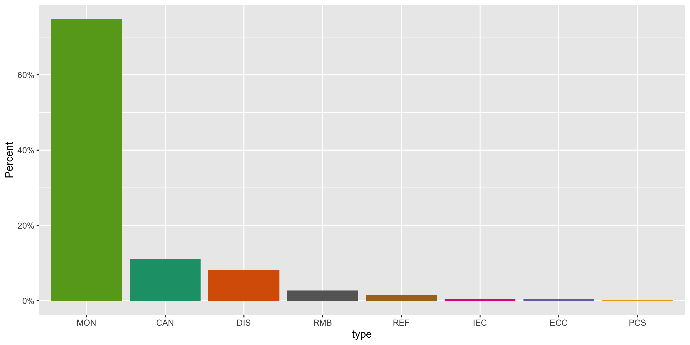
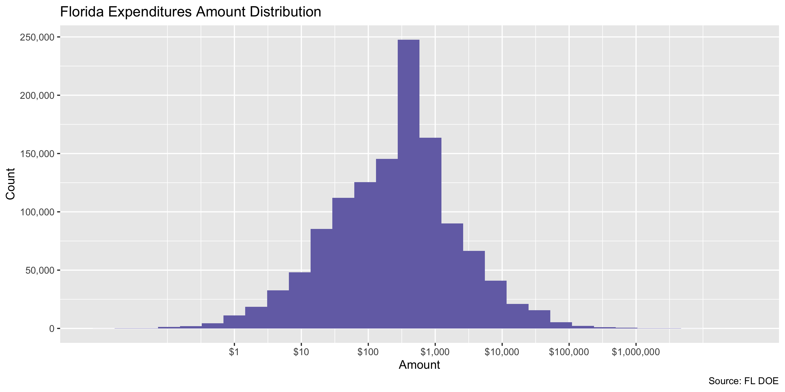
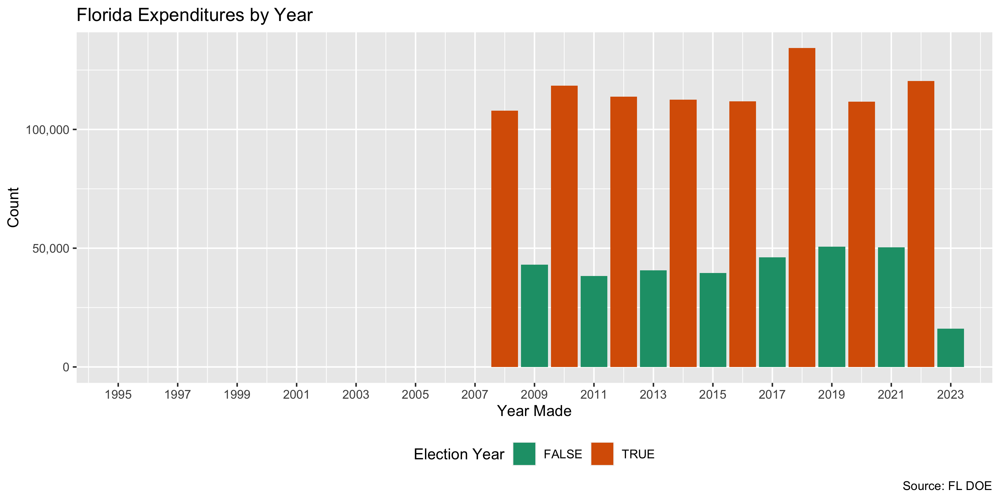
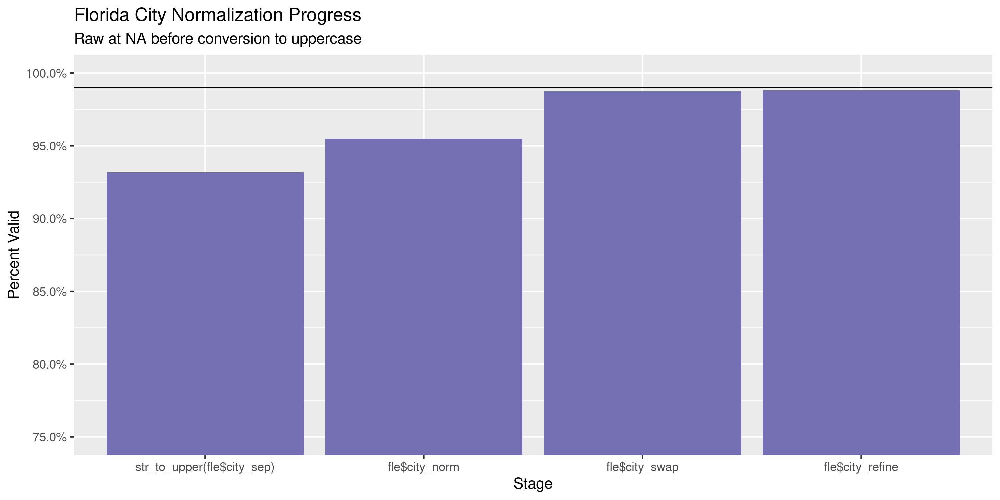
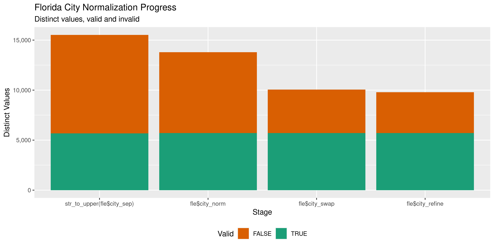

Florida Expenditures
================
Kiernan Nicholls & Aarushi Sahejpal
Sat Apr 29 17:05:28 2023

- <a href="#project" id="toc-project">Project</a>
- <a href="#objectives" id="toc-objectives">Objectives</a>
- <a href="#packages" id="toc-packages">Packages</a>
- <a href="#data" id="toc-data">Data</a>
  - <a href="#about" id="toc-about">About</a>
- <a href="#download" id="toc-download">Download</a>
- <a href="#fix" id="toc-fix">Fix</a>
  - <a href="#error-r-fix_merge" id="toc-error-r-fix_merge">error {r
    fix_merge}</a>
- <a href="#read" id="toc-read">Read</a>
- <a href="#explore" id="toc-explore">Explore</a>
  - <a href="#missing" id="toc-missing">Missing</a>
  - <a href="#duplicates" id="toc-duplicates">Duplicates</a>
  - <a href="#categorical" id="toc-categorical">Categorical</a>
  - <a href="#amounts" id="toc-amounts">Amounts</a>
  - <a href="#dates" id="toc-dates">Dates</a>
- <a href="#wrangle" id="toc-wrangle">Wrangle</a>
  - <a href="#separate" id="toc-separate">Separate</a>
  - <a href="#address" id="toc-address">Address</a>
  - <a href="#zip" id="toc-zip">ZIP</a>
  - <a href="#state" id="toc-state">State</a>
  - <a href="#city" id="toc-city">City</a>
- <a href="#conclude" id="toc-conclude">Conclude</a>
- <a href="#export" id="toc-export">Export</a>
- <a href="#upload" id="toc-upload">Upload</a>

<!-- Place comments regarding knitting here -->

## Project

The Accountability Project is an effort to cut across data silos and
give journalists, policy professionals, activists, and the public at
large a simple way to search across huge volumes of public data about
people and organizations.

Our goal is to standardize public data on a few key fields by thinking
of each dataset row as a transaction. For each transaction there should
be (at least) 3 variables:

1.  All **parties** to a transaction.
2.  The **date** of the transaction.
3.  The **amount** of money involved.

## Objectives

This document describes the process used to complete the following
objectives:

1.  How many records are in the database?
2.  Check for entirely duplicated records.
3.  Check ranges of continuous variables.
4.  Is there anything blank or missing?
5.  Check for consistency issues.
6.  Create a five-digit ZIP Code called `zip`.
7.  Create a `year` field from the transaction date.
8.  Make sure there is data on both parties to a transaction.

## Packages

The following packages are needed to collect, manipulate, visualize,
analyze, and communicate these results. The `pacman` package will
facilitate their installation and attachment.

``` r
if (!require("pacman")) {
  install.packages("pacman")
}
pacman::p_load(
  tidyverse, # data manipulation
  lubridate, # datetime strings
  gluedown, # printing markdown
  janitor, # clean data frames
  campfin, # custom irw tools
  aws.s3, # aws cloud storage
  refinr, # cluster & merge
  scales, # format strings
  knitr, # knit documents
  vroom, # fast reading
  rvest, # scrape html
  glue, # code strings
  here, # project paths
  httr, # http requests
  fs # local storage 
)
```

``` r
packageVersion("campfin")
#> [1] '1.0.10.9001'
```

This document should be run as part of the `R_campfin` project, which
lives as a sub-directory of the more general, language-agnostic
[`irworkshop/accountability_datacleaning`](https://github.com/irworkshop/accountability_datacleaning)
GitHub repository.

The `R_campfin` project uses the [RStudio
projects](https://support.rstudio.com/hc/en-us/articles/200526207-Using-Projects)
feature and should be run as such. The project also uses the dynamic
`here::here()` tool for file paths relative to *your* machine.

``` r
# where does this document knit?
here::here('Volumes/TAP/accountability_datacleaning/state/fl/expends')
#> [1] "/Volumes/TAP/accountability_datacleaning/Volumes/TAP/accountability_datacleaning/state/fl/expends"
```

## Data

Data is obtained from the Florida Division of Elections.

As the [agency home
page](https://dos.myflorida.com/elections/candidates-committees/campaign-finance/)
explains:

> By Florida law, campaigns, committees, and electioneering
> communications organizations are required to disclose detailed
> financial records of campaign contributions and expenditures. Chapter
> 106, Florida Statutes, regulates campaign financing for all
> candidates, including judicial candidates, political committees,
> electioneering communication organizations, affiliated party
> committees, and political parties. It does not regulate campaign
> financing for candidates for federal office.

### About

A more detailed description of available data can be found on the
[Campaign Finance
page](https://dos.myflorida.com/elections/candidates-committees/campaign-finance/campaign-finance-database/):

> #### Quality of Data
>
> The information presented in the campaign finance database is an
> accurate representation of the reports filed with the Florida Division
> of Elections. \> \> Some of the information in the campaign finance
> database was submitted in electronic form, and some of the information
> was key-entered from paper reports. Sometimes items which are not
> consistent with filing requirements, such as incorrect codes or
> incorrectly formatted or blank items, are present in the results of a
> query. They are incorrect in the database because they were incorrect
> on reports submitted to the division.

> #### What does the Database Contain?
>
> By law candidates and committees are required to disclose detailed
> financial records of contributions received and expenditures made. For
> committees, the campaign finance database contains all contributions
> and expenditures reported to the Florida Division of Elections since
> January 1, 1996. For candidates, the campaign finance database
> contains all contributions and expenditures reported to the Division
> since the candidacy was announced, beginning with the 1996 election.

> #### Whose Records are Included?
>
> Included are campaign finance reports which have been filed by
> candidates for any multi-county office, with the exception of U.S.
> Senator and U.S. Representative, and by organizations that receive
> contributions or make expenditures of more than \$500 in a calendar
> year to support or oppose any multi-county candidate, issue, or party.
> To obtain reports from local county or municipal candidates and
> committees, contact county or city filing offices.

> #### When are the Records Available?
>
> Campaign finance reports are posted to the database as they are
> received from the candidates and committees. Our data is as current as
> possible, consistent with the reporting requirements of Florida law.

## Download

We will use the [Expenditure
Records](https://dos.elections.myflorida.com/campaign-finance/expenditures/)
query form to download three separate files covering all campaign
expenditures. [The home
page](https://dos.myflorida.com/elections/candidates-committees/campaign-finance/campaign-finance-database/)
lists instructions on how to download the desired files:

> #### How to Use the Campaign Finance Database
>
> 1.  Specify a subset of the \[Expenditure\]…
> 2.  Select an election year entry from the list box.
> 3.  Select a candidate/committee option…
> 4.  Select contribution criteria (for Detail report only)…
> 5.  Select how you would like the records sorted.
> 6.  Select the format in which you would like the data returned.
> 7.  Limit the number of records to return….
>     - Choosing “Return Query Results in a Tab Delimited Text File”
>       will return the data in a file of tab-separated columns suitable
>       for importing into almost any spreadsheet or database. This
>       option allows you to download the data for further analysis
>       offline.
> 8.  Click on the Submit Query button.

To get all files covering all expenditures:

1.  Select “All” from the **Election Year** drop down menu
2.  In the **From Date Range** text box, enter “01/01/2008”
3.  Delete “500” from the **Limit Records** text box
4.  Select the “Return Results in a Tab Delimited Text File” **Retrieval
    Format**
5.  Save to the `/fl/expends/data/raw` directory

``` r
raw_dir <- dir_create(here("fl", "expends", "data", "raw"))
raw_tsv <- path(raw_dir, "'Expend.txt'")
```

``` r
if (!file_exists(raw_tsv) && FALSE) {
  POST(
    write_disk(raw_tsv),
    user_agent("https://publicaccountability.org/"),
    url = "https://dos.elections.myflorida.com/cgi-bin/expend.exe",
    # must get cookies from browser :(
    set_cookies(),
    encode = "form",
    body = list(
      election = "All",
      search_on = "1",
      CanFName = "",
      CanLName = "",
      CanNameSrch = "2",
      office = "All",
      cdistrict = "",
      cgroup = "",
      party = "All",
      ComName = "",
      ComNameSrch = "2",
      committee = "All",
      cfname = "",
      clname = "",
      namesearch = "2",
      ccity = "",
      cstate = "",
      czipcode = "",
      cpurpose = "",
      cdollar_minimum = "",
      cdollar_maximum = "",
      rowlimit = "",
      csort1 = "DAT",
      csort2 = "CAN",
      cdatefrom = "01/01/1900",
      cdateto = "",
      queryformat = "2",
      Submit = "Submit"
    )
  )
}
```

## Fix

The tab-separated file has no quotes surrounding problematic fields.
That results in a handful with new-line character breaks (e.g., typed in
an address). To fix this problem, we have to read each line separately
and then manually combine any of those split lines.

``` r
fll <- read_lines(raw_tsv)
length(fll)
#> [1] 1252735
fl_head <- fll[1] # save header
fll <- fll[-1] # remove header
```

We can identify the problematic lines by looking for any line without a
`Date` character pattern following the first tab-delimiter.

``` r
bad_nl <- str_which(
  string = fll,
  # find rows without date in 2nd col
  pattern = "^(.*)\t(\\d{2}/\\d{2}/\\d{4})",
  negate = TRUE
)
```

``` r
length(bad_nl)
#> [1] 4
fll[bad_nl]
#> [1] "\tTAMPA, FL 33605\tCONSULTING\tMON"                                           
#> [2] "2361 NW 2ND AVENUE\tMIAMI GARDENS, FL 33169\tGAS\tMON"                        
#> [3] "18912 N CREEK PARKWAY\tBOTHELL, WA 98011\tSUPPLIES FOR SIGN INSTALLATION\tMON"
#> [4] "TALLAHASSEE, FL 32301\tBANK FEE\tMON"
```

We can then combine these identified lines with the previous, making a
new valid line. When the broken line is removed, the file can be read.

### error {r fix_merge}

fl_combine \<- paste0(fll\[bad_nl - 1\], fll\[bad_nl\]) read_tsv(file =
c(fl_head, fl_combine)) \# test lines fll\[bad_nl - 1\] \<- fl_combine
\# replace broken lines fll \<- fll\[-bad_nl\] \# remove extra already
merged \### error

``` r
fll <- iconv(fll, to = "UTF-8", sub = "")
```

``` r
tmp_tsv <- file_temp(ext = "tsv")
write_lines(x = c(fl_head, fll), file = tmp_tsv)
```

    #>           used (Mb) gc trigger  (Mb) limit (Mb) max used (Mb)
    #> Ncells 1232053 65.8    4297061 229.5         NA  1232053 65.8
    #> Vcells 3084216 23.6   28514414 217.6     102400  3084216 23.6

## Read

``` r
fle <- read_delim(
  file = tmp_tsv,
  delim = "\t",
  quote = "",
  escape_backslash = FALSE,
  escape_double = FALSE,
  col_types = cols(
    .default = col_character(),
    Date = col_date_mdy(),
    Amount = col_double()
  )
)
```

``` r
fle <- fle %>% 
  rename(`Comm Name` = `Candidate/Committee`) %>% 
  clean_names(case = "snake")
```

## Explore

There are 1,252,734 rows of 8 columns. Each record represents a single
expenditure made by a political campaign to an outside vendor for goods
or services.

``` r
glimpse(fle)
#> Rows: 1,252,734
#> Columns: 8
#> $ comm_name      <chr> "Ackerman, Paul J (REP)(STR)", "Adkins, Janet H. (REP)(STR)", "Florida Justice PAC (CCE)", "Cit…
#> $ date           <date> 2008-01-01, 2008-01-01, 2008-01-01, 2008-01-01, 2008-01-01, 2008-01-01, 2008-01-01, 2008-01-01…
#> $ amount         <dbl> 14.97, 30.00, 30.00, 2000.00, 9000.00, 48.51, 43.55, 46.05, 200.00, 3750.00, 54.85, 483.78, 434…
#> $ payee_name     <chr> "STAPLES", "PAY PAL, INC.", "REGIONS BANK", "DSI, INC", "DATA TARGETING, INC.", "RACEWAY", "USP…
#> $ address        <chr> "1950 STATE RD 426", "2145 HAMILTON AVENUE", "2000 CAPITAL CIRCLE NE", "PO BOX 12665", "6211 NW…
#> $ city_state_zip <chr> "OVIEDO, FL 32765", "SAN JOSE, CA ", "TALLAHASSEE, FL 32308", "GAINESVILLE, FL 32604", "GAINESV…
#> $ purpose        <chr> "OFFICE SUPPLIES", "SERVICE CHARGE", "BANK FEES", "CONSULTING", "CONSULTING", "GAS", "SHIPPING"…
#> $ type           <chr> "MON", "MON", "MON", "MON", "MON", "MON", "MON", "MON", "MON", "MON", "MON", "MON", "MON", "MON…
tail(fle)
#> # A tibble: 6 × 8
#>   comm_name           date       amount payee_name                 address                  city_state_zip purpose type 
#>   <chr>               <date>      <dbl> <chr>                      <chr>                    <chr>          <chr>   <chr>
#> 1 Florida CUPAC (CCE) 9919-12-03   5    99FLORIDA DEMOCRATIC PARTY POST OFFICE BOX 1758     TALLAHASSEE, … ONHOLI… X    
#> 2 Florida CUPAC (CCE) 9919-12-03   5    99LAURENT, JOHN            FLORIDA HOUSE OF REPRES… BARTOW,  FL338 ONRE-E… X    
#> 3 Florida CUPAC (CCE) 9919-12-03   2.5  99FARKAS, FRANK            FLORIDA HOUSE OF REPRES… SAINT PETERSB… ONRE-E… X    
#> 4 Florida CUPAC (CCE) 9919-12-20   2.5  99DOBSON, MICHAEL          THE MICHAEL DOBSON CAMP… TALLAHASSEE, … ONELEC… X    
#> 5 Florida CUPAC (CCE) 9919-12-20  15    99SENATE MAJORITY 2000     PO BOX 311               TALLAHASSEE, … ONSUGA… X    
#> 6 Florida CUPAC (CCE) 9919-12-31   0.12 99SOUTHEAST CORPORATE FCU  3555 COMMONWEALTH BLVD.  TALLAHASSEE, … ONCU C… X
```

### Missing

Columns vary in their degree of missing values.

``` r
col_stats(fle, count_na)
#> # A tibble: 8 × 4
#>   col            class      n           p
#>   <chr>          <chr>  <int>       <dbl>
#> 1 comm_name      <chr>      1 0.000000798
#> 2 date           <date>     4 0.00000319 
#> 3 amount         <dbl>      4 0.00000319 
#> 4 payee_name     <chr>     59 0.0000471  
#> 5 address        <chr>   1108 0.000884   
#> 6 city_state_zip <chr>      9 0.00000718 
#> 7 purpose        <chr>    324 0.000259   
#> 8 type           <chr>      9 0.00000718
```

We can flag any record missing a key variable needed to identify a
transaction.

``` r
key_vars <- c("date", "payee_name", "amount", "comm_name")
fle <- flag_na(fle, all_of(key_vars))
sum(fle$na_flag)
#> [1] 62
```

A few hundred records are missing a `payee_name`.

``` r
fle %>% 
  filter(na_flag) %>% 
  select(all_of(key_vars), city_state_zip) %>% 
  relocate(city_state_zip, .after = payee_name)
#> # A tibble: 62 × 5
#>    date       payee_name city_state_zip amount comm_name                                    
#>    <date>     <chr>      <chr>           <dbl> <chr>                                        
#>  1 2008-03-18 <NA>       ", FL 32302"        0 Lake County Education Association Tiger (CCE)
#>  2 2008-03-20 <NA>       ",  "               0 Florida Cattle PAC (CCE)                     
#>  3 2008-04-10 <NA>       ",  "               0 Greater Pinellas Democratic Club CCE (CCE)   
#>  4 2008-07-22 <NA>       ", FL 34748"        0 Lake County Education Association Tiger (CCE)
#>  5 2008-08-12 <NA>       ", FL 32778"        0 Lake County Education Association Tiger (CCE)
#>  6 2008-08-12 <NA>       ", FL 34788"        0 Lake County Education Association Tiger (CCE)
#>  7 2008-08-12 <NA>       ", ND 34731"        0 Lake County Education Association Tiger (CCE)
#>  8 2008-08-12 <NA>       ", FL 32778"        0 Lake County Education Association Tiger (CCE)
#>  9 2008-08-28 <NA>       ", FL 34731"        0 Lake County Education Association Tiger (CCE)
#> 10 2008-08-28 <NA>       ", FL 32778"        0 Lake County Education Association Tiger (CCE)
#> # ℹ 52 more rows
```

``` r
fle %>% 
  select(all_of(key_vars)) %>% 
  col_stats(count_na)
#> # A tibble: 4 × 4
#>   col        class      n           p
#>   <chr>      <chr>  <int>       <dbl>
#> 1 date       <date>     4 0.00000319 
#> 2 payee_name <chr>     59 0.0000471  
#> 3 amount     <dbl>      4 0.00000319 
#> 4 comm_name  <chr>      1 0.000000798
```

### Duplicates

We can also flag any record completely duplicated across every column.

``` r
fle <- flag_dupes(fle, everything())
mean(fle$dupe_flag)
#> [1] 0.02187615
sum(fle$dupe_flag)
#> [1] 27405
```

2.19% of records are duplicated at least once.

``` r
fle %>% 
  filter(dupe_flag) %>% 
  select(all_of(key_vars)) %>% 
  arrange(payee_name, amount)
#> # A tibble: 27,405 × 4
#>    date       payee_name     amount comm_name                       
#>    <date>     <chr>           <dbl> <chr>                           
#>  1 2021-09-15 .COM, AMAZON     16   Leadership in Action (PAC)      
#>  2 2021-09-15 .COM, AMAZON     16   Leadership in Action (PAC)      
#>  3 2022-02-11 .COM, AMAZON     64.2 Leadership in Action (PAC)      
#>  4 2022-02-11 .COM, AMAZON     64.2 Leadership in Action (PAC)      
#>  5 2021-09-07 .COM, BROADWAY  510.  Leadership in Action (PAC)      
#>  6 2021-09-07 .COM, BROADWAY  510.  Leadership in Action (PAC)      
#>  7 2018-07-23 .COM, CALLFIRE   75   Porter, Jeffrey Duane (DEM)(AGR)
#>  8 2018-07-23 .COM, CALLFIRE   75   Porter, Jeffrey Duane (DEM)(AGR)
#>  9 2018-07-23 .COM, CALLFIRE   75   Porter, Jeffrey Duane (DEM)(AGR)
#> 10 2018-07-27 .COM, CALLFIRE   75   Porter, Jeffrey Duane (DEM)(AGR)
#> # ℹ 27,395 more rows
```

``` r
fle %>% 
  filter(dupe_flag) %>% 
  select(all_of(key_vars)) %>% 
  count(payee_name, amount, comm_name, sort = TRUE)
#> # A tibble: 7,910 × 4
#>    payee_name                amount comm_name                                          n
#>    <chr>                      <dbl> <chr>                                          <int>
#>  1 HANCOCK BANK               20    Florida Democratic Legislative Campaign  (PAP)   612
#>  2 GOOGLE                    500    Crist, Charlie  (DEM)(GOV)                       370
#>  3 RAISE THE MONEY             1.25 Hardy, Omari  (DEM)(STR)                         314
#>  4 ANEDOT, INC.                4.3  Zhao, Mike  (REP)(STR)                           214
#>  5 VIP TRAVEL AND TOURS, INC  35    Crist, Charlie  (DEM)(GOV)                       184
#>  6 ANEDOT, INC.                2.3  Zhao, Mike  (REP)(STR)                           180
#>  7 RAISE THE MONEY             0.65 Hardy, Omari  (DEM)(STR)                         173
#>  8 HANCOCK BANK               30    Florida Democratic Legislative Campaign  (PAP)   155
#>  9 SUNTRUST BANK              10    Gillum, Andrew  (DEM)(GOV)                       136
#> 10 BANK OF AMERICA             3    Amendment 2 is for Everybody (PAC)               135
#> # ℹ 7,900 more rows
```

### Categorical

``` r
col_stats(fle, n_distinct)
#> # A tibble: 10 × 4
#>    col            class       n          p
#>    <chr>          <chr>   <int>      <dbl>
#>  1 comm_name      <chr>    8616 0.00688   
#>  2 date           <date>   5600 0.00447   
#>  3 amount         <dbl>  145020 0.116     
#>  4 payee_name     <chr>  253992 0.203     
#>  5 address        <chr>  295833 0.236     
#>  6 city_state_zip <chr>   28466 0.0227    
#>  7 purpose        <chr>  172152 0.137     
#>  8 type           <chr>      21 0.0000168 
#>  9 na_flag        <lgl>       2 0.00000160
#> 10 dupe_flag      <lgl>       2 0.00000160
```

``` r
fle <- mutate(fle, across(type, str_to_upper))
```

<!-- -->

### Amounts

``` r
summary(fle$amount)
#>     Min.  1st Qu.   Median     Mean  3rd Qu.     Max.     NA's 
#> -4500000       55      320     3498     1000 27395368        4
mean(fle$amount <= 0)
#> [1] NA
```

These are the records with the minimum and maximum amounts.

``` r
glimpse(fle[c(which.max(fle$amount), which.min(fle$amount)), ])
#> Rows: 2
#> Columns: 10
#> $ comm_name      <chr> "Let's Get To Work (ECO)", "Friends of Ron DeSantis (PAC)"
#> $ date           <date> 2014-03-06, 2022-12-30
#> $ amount         <dbl> 27395368, -4500000
#> $ payee_name     <chr> "LET'S GET TO WORK", "REPUBLICAN PARTY OF FLORIDA"
#> $ address        <chr> "1531 LIVE OAK DRIVE", "PO BOX 311"
#> $ city_state_zip <chr> "TALLAHASSEE, FL 32301", "TALLAHASSEE, FL 32302"
#> $ purpose        <chr> "DISPOSITION UPON TERMINATION", "CONTRIBUTION REFUND"
#> $ type           <chr> "MON", "REF"
#> $ na_flag        <lgl> FALSE, FALSE
#> $ dupe_flag      <lgl> FALSE, FALSE
```

<!-- -->

### Dates

We can add the calendar year from `date` with `lubridate::year()`

``` r
fle <- mutate(fle, year = year(date))
```

``` r
min(fle$date)
#> [1] NA
sum(fle$year < 1995)
#> [1] NA
max(fle$date)
#> [1] NA
sum(fle$date > today())
#> [1] NA
```

<!-- -->

## Wrangle

To improve the searchability of the database, we will perform some
consistent, confident string normalization. For geographic variables
like city names and ZIP codes, the corresponding `campfin::normal_*()`
functions are tailor made to facilitate this process.

### Separate

The `city_state_zip` column contains all three geographic variables in a
single string. We need to separate out the data so they can be properly
searched on the site. The string normally takes the format of
`Miami, FL 33101`, with the city name first before a common, followed by
the two-letter state abbreviation and 5-digit ZIP code. Quite a number
of these values break this expected format, upwards of 5% of values. We
can use regular expressions to manipulate broken strings and then
extract the geographic variables from their expected locations.

``` r
fle <- extract(
  data = fle,
  col = city_state_zip,
  into = c("city_sep", "state_sep", "zip_sep"),
  regex = "^(.*),\\s+(.*),?\\s+(.*)$",
  remove = FALSE
)
```

``` r
csz <- fle %>%
  distinct(city_state_zip) %>% 
  mutate(
    # fix the city_state_zip values
    x = city_state_zip %>% 
      str_squish() %>% 
      str_replace("(?<=\\s)F, L", ", FL") %>% 
      str_replace("(?<=\\s)F, L,", ", FL") %>% 
      str_replace("(?<=\\s)F, L.", ", FL") %>% 
      str_remove("(?<=FL),") %>% 
      str_replace("([A-Z]{2})(\\d+)", "\\1 \\2") %>% 
      str_replace("\\sDC,", ", DC"),
    # extract the geo from each spot
    city_sep = str_extract(x, "(.*)(?=,(\\s|$))"),
    state_sep = str_extract(x, "[A-Z\\*\\.]{1,}(?=\\s\\d|$)"),
    zip_sep = str_extract(x, "\\d{2,5}(?:-\\d{4})?$"),
    across(where(is.character), na_if, "")
  ) %>% 
  select(-x)
```

``` r
fle <- left_join(fle, csz, by = "city_state_zip")
```

### Address

For the street `addresss` variable, the `campfin::normal_address()`
function will force consistence case, remove punctuation, and abbreviate
official USPS suffixes.

The `address` also seems to be separated by white space not
tab-characters. We can create a new variable with the secondary address.

``` r
fle %>% 
  select(address) %>% 
  head(10)
#> # A tibble: 10 × 1
#>    address               
#>    <chr>                 
#>  1 1950 STATE RD 426     
#>  2 2145 HAMILTON AVENUE  
#>  3 2000 CAPITAL CIRCLE NE
#>  4 PO BOX 12665          
#>  5 6211 NW 132ND STREET  
#>  6 INT'L SPEEDWAY BLVD   
#>  7 OLD MISSION RD        
#>  8 OLD MISSION RD        
#>  9 PO BOX 330965         
#> 10 5960 7TH AVE W
```

``` r
fl_addr <- fle %>% 
  distinct(address) %>% 
  separate(
    col = address,
    into = c("address1", "address2"),
    sep = "\\s{3,}",
    remove = FALSE,
    extra = "merge",
    fill = "right"
  )
```

``` r
fl_addr <- fl_addr %>% 
  mutate(
    across(
      .cols = c(address1, address2),
      .fns = ~normal_address(
        address = .,
        abbs = usps_street,
        na_rep = TRUE,
        na = invalid_city
      )
    )
  )
```

``` r
fl_addr <- unite(
  data = fl_addr,
  col = address_clean,
  address1, address2,
  sep = " ",
  remove = TRUE,
  na.rm = TRUE
)
```

``` r
fle <- left_join(fle, fl_addr, by = "address")
```

``` r
fle %>% 
  select(contains("address")) %>% 
  distinct() %>% 
  sample_n(10)
#> # A tibble: 10 × 2
#>    address                                       address_clean                             
#>    <chr>                                         <chr>                                     
#>  1 13030 SW 260TH STREET                         13030 SW 260TH ST                         
#>  2 11700 CENTRAL PARKWAY                         11700 CENTRAL PKWY                        
#>  3 7050 WEST PALMETTO PARK ROAD, #15 - SUITE 190 7050 WEST PALMETTO PARK ROAD #15 SUITE 190
#>  4 1766 NW 95TH STREET                           1766 NW 95TH ST                           
#>  5 5885 S HIGHWAY US 1                           5885 S HIGHWAY US 1                       
#>  6 23374 SERENE MEADOW DR S                      23374 SERENE MEADOW DR S                  
#>  7 511 WEST SOUTH STREET, #201                   511 WEST SOUTH STREET #201                
#>  8 2170 SE OCEAN BLVD.                           2170 SE OCEAN BLVD                        
#>  9 US1                                           US1                                       
#> 10 198 E. BIG BEAVER RD                          198 E BIG BEAVER RD
```

### ZIP

For ZIP codes, the `campfin::normal_zip()` function will attempt to
create valid *five* digit codes by removing the ZIP+4 suffix and
returning leading zeroes dropped by other programs like Microsoft Excel.

``` r
fle <- fle %>% 
  mutate(
    zip_norm = normal_zip(
      zip = zip_sep,
      na_rep = TRUE
    )
  )
```

``` r
progress_table(
  fle$zip_sep,
  fle$zip_norm,
  compare = valid_zip
)
#> # A tibble: 2 × 6
#>   stage        prop_in n_distinct prop_na n_out n_diff
#>   <chr>          <dbl>      <dbl>   <dbl> <dbl>  <dbl>
#> 1 fle$zip_sep    0.994      11677  0.0225  6735   1816
#> 2 fle$zip_norm   0.995      11663  0.0234  5600   1802
```

### State

Valid two digit state abbreviations can be made using the
`campfin::normal_state()` function.

``` r
fle <- fle %>% 
  mutate(
    state_norm = normal_state(
      state = state_sep,
      abbreviate = TRUE,
      na_rep = TRUE,
      valid = valid_state
    )
  )
```

``` r
fle %>% 
  filter(state_sep != state_norm) %>% 
  count(state_sep, state_norm, sort = TRUE)
#> # A tibble: 3 × 3
#>   state_sep  state_norm     n
#>   <chr>      <chr>      <int>
#> 1 CALIFORNIA CA             1
#> 2 FL.        FL             1
#> 3 WASHINGTON WA             1
```

``` r
progress_table(
  fle$state_sep,
  fle$state_norm,
  compare = valid_state
)
#> # A tibble: 2 × 6
#>   stage          prop_in n_distinct  prop_na n_out n_diff
#>   <chr>            <dbl>      <dbl>    <dbl> <dbl>  <dbl>
#> 1 fle$state_sep    0.995        176 0.000750  6829    121
#> 2 fle$state_norm   1             56 0.00620      0      1
```

### City

Cities are the most difficult geographic variable to normalize, simply
due to the wide variety of valid cities and formats.

#### Normal

The `campfin::normal_city()` function is a good start, again converting
case, removing punctuation, but *expanding* USPS abbreviations. We can
also remove `invalid_city` values.

``` r
norm_city <- fle %>% 
  distinct(city_sep, state_norm, zip_norm) %>% 
  mutate(
    city_norm = normal_city(
      city = city_sep, 
      abbs = usps_city,
      states = c("FL", "DC", "FLORIDA"),
      na = invalid_city,
      na_rep = TRUE
    )
  )
```

#### Swap

We can further improve normalization by comparing our normalized value
against the *expected* value for that record’s state abbreviation and
ZIP code. If the normalized value is either an abbreviation for or very
similar to the expected value, we can confidently swap those two.

``` r
norm_city <- norm_city %>% 
  left_join(
    y = zipcodes,
    by = c(
      "state_norm" = "state",
      "zip_norm" = "zip"
    )
  ) %>% 
  rename(city_match = city) %>% 
  mutate(
    match_abb = is_abbrev(city_norm, city_match),
    match_dist = str_dist(city_norm, city_match),
    city_swap = if_else(
      condition = !is.na(match_dist) & (match_abb | match_dist == 1),
      true = city_match,
      false = city_norm
    )
  ) %>% 
  select(
    -city_match,
    -match_dist,
    -match_abb
  )
```

``` r
fle <- left_join(
  x = fle,
  y = norm_city,
  by = c(
    "city_sep", 
    "state_norm", 
    "zip_norm"
  )
)
```

#### Refine

The [OpenRefine](https://openrefine.org/) algorithms can be used to
group similar strings and replace the less common versions with their
most common counterpart. This can greatly reduce inconsistency, but with
low confidence; we will only keep any refined strings that have a valid
city/state/zip combination.

``` r
good_refine <- fle %>% 
  mutate(
    city_refine = city_swap %>% 
      key_collision_merge() %>% 
      n_gram_merge(numgram = 1)
  ) %>% 
  filter(city_refine != city_swap) %>% 
  inner_join(
    y = zipcodes,
    by = c(
      "city_refine" = "city",
      "state_norm" = "state",
      "zip_norm" = "zip"
    )
  )
```

    #> # A tibble: 253 × 5
    #>    state_norm zip_norm city_swap          city_refine            n
    #>    <chr>      <chr>    <chr>              <chr>              <int>
    #>  1 OH         45249    CINCINATTI         CINCINNATI            56
    #>  2 FL         32223    JACKONSVILLE       JACKSONVILLE          39
    #>  3 FL         32043    COVE SPRINGS       GREEN COVE SPRINGS    25
    #>  4 FL         33606    TAMPAPA            TAMPA                 22
    #>  5 OH         45274    CINCINATTI         CINCINNATI            18
    #>  6 CA         94103    SAN FRANSCISO      SAN FRANCISCO         13
    #>  7 FL         32082    PONTE VERDE BEACH  PONTE VEDRA BEACH     13
    #>  8 FL         33126    MIAMIMI            MIAMI                  9
    #>  9 FL         32082    PONTE VERDRE BEACH PONTE VEDRA BEACH      8
    #> 10 FL         33584    SNEFFER            SEFFNER                8
    #> # ℹ 243 more rows

Then we can join the refined values back to the database.

``` r
fle <- fle %>% 
  left_join(good_refine, by = names(.)) %>% 
  mutate(city_refine = coalesce(city_refine, city_swap))
```

#### Progress

Our goal for normalization was to increase the proportion of city values
known to be valid and reduce the total distinct values by correcting
misspellings.

| stage                                                                        | prop_in | n_distinct | prop_na | n_out | n_diff |
|:-----------------------------------------------------------------------------|--------:|-----------:|--------:|------:|-------:|
| str_to_upper(fle$city_sep) | 0.945| 9268| 0.005| 68681| 5170| |fle$city_norm |   0.959 |       8520 |   0.005 | 50789 |   4409 |
| fle$city_swap | 0.990| 6416| 0.005| 12820| 2291| |fle$city_refine            |   0.990 |       6267 |   0.005 | 12226 |   2145 |

You can see how the percentage of valid values increased with each
stage.

<!-- -->

More importantly, the number of distinct values decreased each stage. We
were able to confidently change many distinct invalid values to their
valid equivalent.

<!-- -->

## Conclude

Before exporting, we can remove the intermediary normalization columns
and rename all added variables with the `_clean` suffix.

``` r
fle <- fle %>% 
  select(-ends_with("_sep")) %>% 
  select(-city_norm, -city_swap) %>% 
  rename(city_clean = city_refine) %>% 
  rename_all(~str_replace(., "_norm", "_clean")) %>% 
  relocate(city_clean, .after = address_clean) %>% 
  relocate(zip_clean, .after = state_clean)
```

``` r
glimpse(sample_n(fle, 50))
#> Rows: 50
#> Columns: 15
#> $ comm_name      <chr> "Proven Leadership for Miami-Dade County  (PAC)", "Committee of Florida Agents (PAC)", "Florida…
#> $ date           <date> 2019-10-17, 2016-07-25, 2018-10-25, 2020-08-09, 2016-04-15, 2014-07-31, 2018-05-21, 2014-02-05…
#> $ amount         <dbl> 5210.00, 5000.00, 1000.00, 18040.41, 63.90, 61.70, 935.00, 1000.00, 520.00, 500.00, 50000.00, 1…
#> $ payee_name     <chr> "VARGAS, ANGELA", "FLORIDA FIRST FOREVER, INC.", "PATRICK HENRY FOR STATE HOUSE - DISTRICT 26",…
#> $ address        <chr> "1833 NW 35TH STREET APT 3", "1700 NORTH MONROE STREET, SUITE 11-253", "P.O. BOX 12082", "405 S…
#> $ city_state_zip <chr> "MIAMI, FL 33142", "TALLAHASSEE, FL 32303", "DAYTONA BEACH, FL 32120", "TAMPA, FL ", "DAYTONA B…
#> $ purpose        <chr> "WAGES", "CONTRIBUTION", "CAMPAIGN CONTRIBUTION", "ADVERTISING", "CAMPAIGN EMBROIDERY", "REFUND…
#> $ type           <chr> "ECC", "MON", "CAN", "MON", "MON", "MON", "MON", "CAN", "DIS", "MON", "MON", "CAN", "CAN", "MON…
#> $ na_flag        <lgl> FALSE, FALSE, FALSE, FALSE, FALSE, FALSE, FALSE, FALSE, FALSE, FALSE, FALSE, FALSE, FALSE, FALS…
#> $ dupe_flag      <lgl> FALSE, TRUE, FALSE, FALSE, FALSE, FALSE, FALSE, FALSE, FALSE, FALSE, FALSE, FALSE, FALSE, FALSE…
#> $ year           <dbl> 2019, 2016, 2018, 2020, 2016, 2014, 2018, 2014, 2020, 2009, 2022, 2020, 2014, 2022, 2019, 2010,…
#> $ address_clean  <chr> "1833 NW 35TH STREET APT 3", "1700 NORTH MONROE STREET SUITE 11253", "PO BOX 12082", "405 S DAL…
#> $ city_clean     <chr> "MIAMI", "TALLAHASSEE", "DAYTONA BEACH", "TAMPA", "DAYTONA BEACH", "SUNRISE", "LAKELAND", "NORT…
#> $ state_clean    <chr> "FL", "FL", "FL", "FL", "FL", "FL", "FL", "FL", "FL", "FL", "FL", "FL", "MO", "LA", "FL", "FL",…
#> $ zip_clean      <chr> "33142", "32303", "32120", NA, "32114", "33351", "33811", "33408", "32202", "33441", "32223", "…
```

1.  There are 1,252,736 records in the database.
2.  There are 27,407 duplicate records in the database.
3.  The range and distribution of `amount` and `date` seem reasonable.
4.  There are 62 records missing key variables.
5.  Consistency in geographic data has been improved with
    `campfin::normal_*()`.
6.  The 4-digit `year` variable has been created with
    `lubridate::year()`.

## Export

Now the file can be saved on disk for upload to the Accountability
server.

``` r
clean_dir <- dir_create(here("fl", "expends", "data", "clean"))
clean_path <- path(clean_dir, "fl_expends_1995-20230429.csv")
write_csv(fle, clean_path, na = "")
(clean_size <- file_size(clean_path))
#> 229M
```

## Upload

We can use the `aws.s3::put_object()` to upload the text file to the IRW
server.

``` r
aws_path <- path("csv", basename(clean_path))
if (!object_exists(aws_path, "publicaccountability")) {
  put_object(
    file = clean_path,
    object = aws_path, 
    bucket = "publicaccountability",
    acl = "public-read",
    show_progress = TRUE,
    multipart = TRUE
  )
}
aws_head <- head_object(aws_path, "publicaccountability")
(aws_size <- as_fs_bytes(attr(aws_head, "content-length")))
unname(aws_size == clean_size)
```
