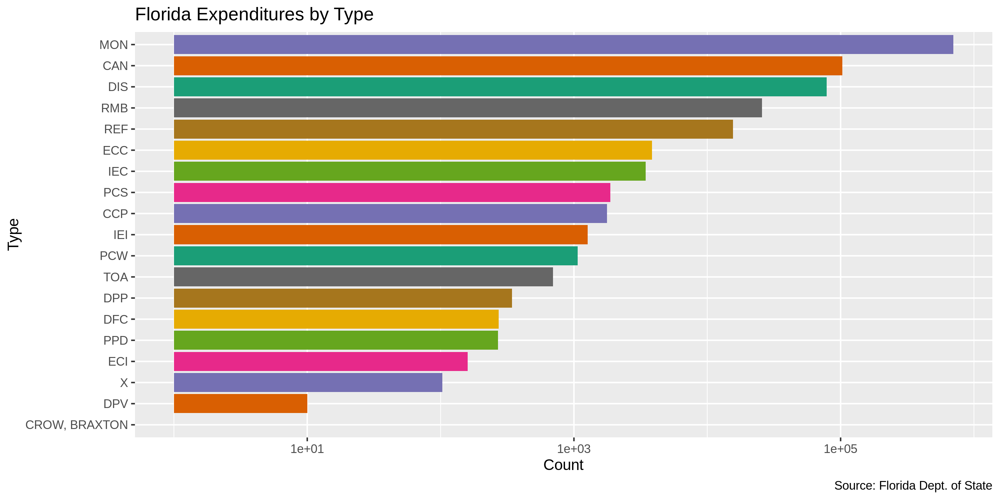
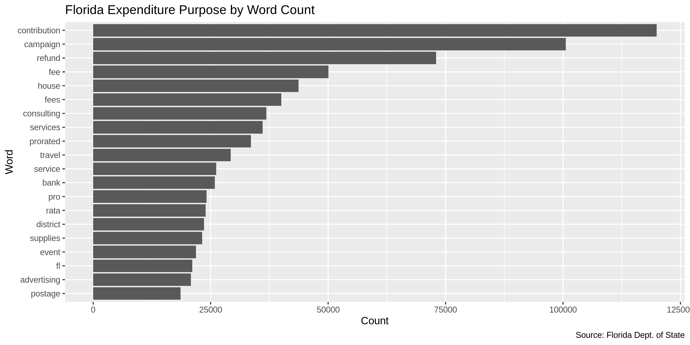
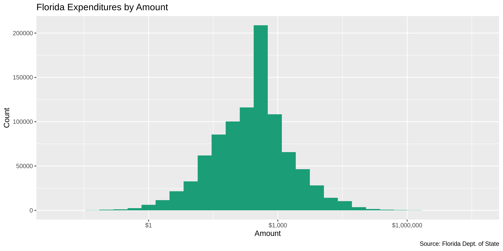
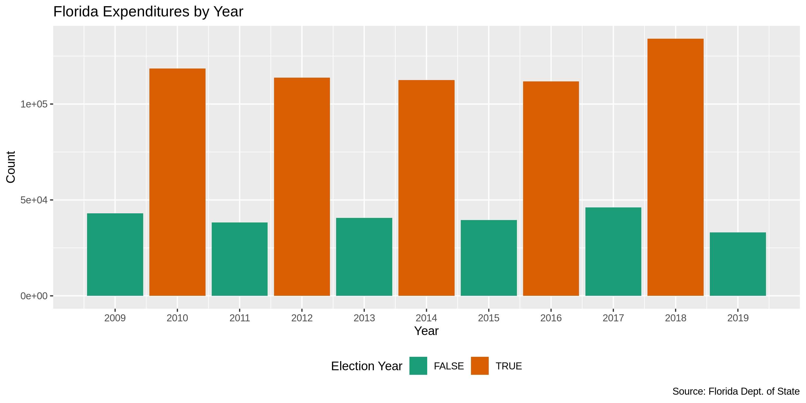
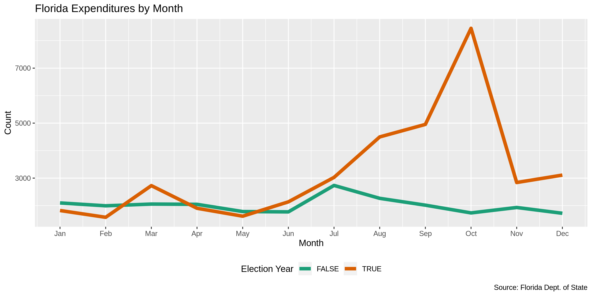
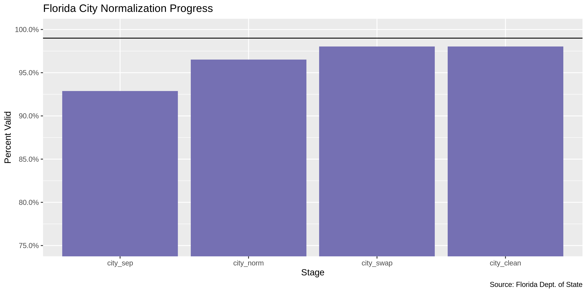
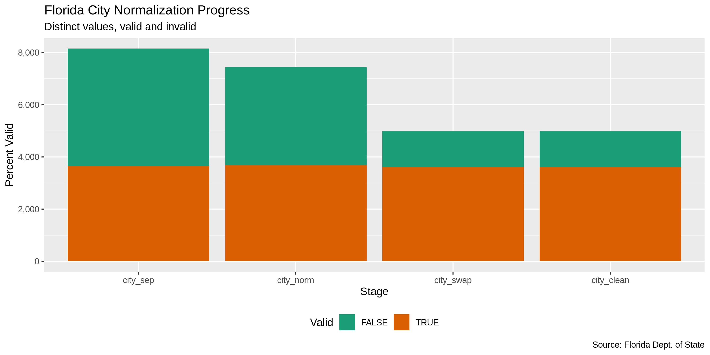

Florida Expenditures
================
Kienan Nicholls
2019-10-17 17:11:49

## Project

The Accountability Project is an effort to cut across data silos and
give journalists, policy professionals, activists, and the public at
large a simple way to search across huge volumes of public data about
people and organizations.

Our goal is to standardizing public data on a few key fields by thinking
of each dataset row as a transaction. For each transaction there should
be (at least) 3 variables:

1.  All **parties** to a transaction
2.  The **date** of the transaction
3.  The **amount** of money involved

## Objectives

This document describes the process used to complete the following
objectives:

1.  How many records are in the database?
2.  Check for duplicates
3.  Check ranges
4.  Is there anything blank or missing?
5.  Check for consistency issues
6.  Create a five-digit ZIP Code called `ZIP5`
7.  Create a `YEAR` field from the transaction date
8.  Make sure there is data on both parties to a transaction

## Packages

The following packages are needed to collect, manipulate, visualize,
analyze, and communicate these results. The `pacman` package will
facilitate their installation and attachment.

The IRW’s `campfin` package will also have to be installed from GitHub.
This package contains functions custom made to help facilitate the
processing of campaign finance data.

``` r
if (!require("pacman")) install.packages("pacman")
pacman::p_load_current_gh("irworkshop/campfin")
pacman::p_load(
  stringdist, # levenshtein value
  RSelenium, # remote browser
  tidyverse, # data manipulation
  lubridate, # datetime strings
  tidytext, # string analysis
  magrittr, # pipe opperators
  janitor, # dataframe clean
  refinr, # cluster and merge
  scales, # format strings
  knitr, # knit documents
  vroom, # read files fast
  glue, # combine strings
  here, # relative storage
  fs # search storage 
)
```

This document should be run as part of the `R_campfin` project, which
lives as a sub-directory of the more general, language-agnostic
[`irworkshop/accountability_datacleaning`](https://github.com/irworkshop/accountability_datacleaning "TAP repo")
GitHub repository.

The `R_campfin` project uses the [RStudio
projects](https://support.rstudio.com/hc/en-us/articles/200526207-Using-Projects "Rproj")
feature and should be run as such. The project also uses the dynamic
`here::here()` tool for file paths relative to *your* machine.

``` r
# where dfs this document knit?
here::here()
#> [1] "/home/kiernan/R/accountability_datacleaning/R_campfin"
```

## Data

Data is obtained from the Florida Division of Elections.

As the [agency home
page](https://dos.myflorida.com/elections/candidates-committees/campaign-finance/ "source")
explains:

> By Florida law, campaigns, committees, and electioneering
> communications organizations are required to disclose detailed
> financial records of campaign contributions and expenditures. Chapter
> 106, Florida Statutes, regulates campaign financing for all
> candidates, including judicial candidates, political committees,
> electioneering communication organizations, affiliated party
> committees, and political parties. It does not regulate campaign
> financing for candidates for federal office.

### About

A more detailed description of available data can be found on the
[Campaign Finance
page](https://dos.myflorida.com/elections/candidates-committees/campaign-finance/campaign-finance-database/):

> #### Quality of Data
> 
> The information presented in the campaign finance database is an
> accurate representation of the reports filed with the Florida Division
> of Elections.
> 
> Some of the information in the campaign finance database was submitted
> in electronic form, and some of the information was key-entered from
> paper reports. Sometimes items which are not consistent with filing
> requirements, such as incorrect codes or incorrectly formatted or
> blank items, are present in the results of a query. They are incorrect
> in the database because they were incorrect on reports submitted to
> the division.

> #### What does the Database Contain?
> 
> By law candidates and committees are required to disclose detailed
> financial records of contributions received and expenditures made. For
> committees, the campaign finance database contains all contributions
> and expenditures reported to the Florida Division of Elections since
> January 1, 1996. For candidates, the campaign finance database
> contains all contributions and expenditures reported to the Division
> since the candidacy was announced, beginning with the 1996 election.

> #### Whose Records are Included?
> 
> Included are campaign finance reports which have been filed by
> candidates for any multi-county office, with the exception of U.S.
> Senator and U.S. Representative, and by organizations that receive
> contributions or make expenditures of more than $500 in a calendar
> year to support or oppose any multi-county candidate, issue, or party.
> To obtain reports from local county or municipal candidates and
> committees, contact county or city filing offices.

> #### When are the Records Available?
> 
> Campaign finance reports are posted to the database as they are
> received from the candidates and committees. Our data is as current as
> possible, consistent with the reporting requirements of Florida law.

## Import

### Download

We will use the [Expenditure
Records](https://dos.elections.myflorida.com/campaign-finance/expenditures/)
querey form to download three separate files covering all campaign
expenditures. [The previous
page](https://dos.myflorida.com/elections/candidates-committees/campaign-finance/campaign-finance-database/)
lists instructions on how to download the desired files:

> #### How to Use the Campaign Finance Database
> 
> 1.  Specify a subset of the \[Expenditure\]…
> 2.  Select an election year entry from the list box
> 3.  Select a candidate/committee option:
> 4.  Select contribution criteria (for Detail report only):
> 5.  Select how you would like the records sorted.
> 6.  Select the format in which you would like the data returned.
> 7.  Limit the number of records to return.
> 8.  Click on the Submit Query button.

To get all files covering all expenditures:

1.  Select “All” from the **Election Year** drop down menu
2.  In the **From Date Range** text box, enter “01/01/2008”
3.  Delete “500” from the **Limit Records** text box
4.  Select “Return Results in a Tab Delimited Text File” **Retrieval
    Format** option
5.  Save to the `/fl/expends/data/raw` directory

We can automate this process using the `RSelenium` package:

``` r
# create a directory for the raw data
raw_dir <- here("fl", "expends", "data", "raw")
dir_create(raw_dir)
```

``` r
# open the driver with auto download options
remote_driver <- rsDriver(
  port = 4444L,
  browser = "firefox",
  extraCapabilities = makeFirefoxProfile(
    list(
      browser.download.dir = raw_dir,
      browser.download.folderList = 2L,
      browser.helperApps.neverAsk.saveToDisk = "text/txt"
    )
  )
)

# navigate to the FL DOE download site
remote_browser <- remote_driver$client
expends_url <- "https://dos.elections.myflorida.com/campaign-finance/expenditures/"
remote_browser$navigate(expends_url)

# chose "All" from elections list
year_menu <- "/html/body/div/div[1]/div/div/div/div/div/div/div/div/form/select[1]/option[@value = 'All']"
remote_browser$findElement("xpath", year_menu)$clickElement()

# remove the records limit text of 500
limit_box <- "div.marginBot:nth-child(64) > input:nth-child(1)"
remote_browser$findElement("css", limit_box)$clearElement()

# enter Jan 1 2008 as start date
date_box <- "div.indent:nth-child(2) > input:nth-child(1)"
remote_browser$findElement("css", date_box)$sendKeysToElement(list("01/01/2008"))

# chose "txt" as export option
txt_button <- "ul.noBullet:nth-child(70) > li:nth-child(2) > input:nth-child(1)"
remote_browser$findElement("css", txt_button)$clickElement()

# click the submit button
submit_button <- "#rightContent > form:nth-child(6) > div:nth-child(71) > input:nth-child(2)"
remote_browser$findElement("css", submit_button)$clickElement()

# close the browser and driver
remote_browser$close()
remote_driver$server$stop()
```

### Read

``` r
fl <- 
  read_delim(
    file = dir_ls(path = raw_dir),
    delim = "\t",
    escape_double = FALSE,
    escape_backslash = FALSE,
    trim_ws = TRUE,
    col_types = cols(
      .default = col_character(),
      Date = col_date("%m/%d/%Y"),
      Amount = col_double()
    )
  ) %>% 
  select(-starts_with("X")) %>% 
  clean_names() %>% 
  mutate_if(is_character, str_to_upper)
```

## Explore

``` r
head(fl)
```

    #> # A tibble: 6 x 8
    #>   candidate_committee    date       amount payee_name    address     city_state_zip  purpose  type 
    #>   <chr>                  <date>      <dbl> <chr>         <chr>       <chr>           <chr>    <chr>
    #> 1 ACKERMAN, PAUL J (REP… 2008-01-01   15.0 STAPLES       1950 STATE… OVIEDO, FL 327… OFFICE … MON  
    #> 2 ADKINS, JANET H. (REP… 2008-01-01   30   PAY PAL, INC. 2145 HAMIL… SAN JOSE, CA    SERVICE… MON  
    #> 3 FLORIDA JUSTICE PAC (… 2008-01-01   30   REGIONS BANK  2000 CAPIT… TALLAHASSEE, F… BANK FE… MON  
    #> 4 CITIZENS SPEAKING OUT… 2008-01-01 2000   DSI, INC      PO BOX 126… GAINESVILLE, F… CONSULT… MON  
    #> 5 CITIZENS SPEAKING OUT… 2008-01-01 9000   DATA TARGETI… 6211 NW 13… GAINESVILLE, F… CONSULT… MON  
    #> 6 FLORIDA HOMETOWN DEMO… 2008-01-01   48.5 RACEWAY       INT'L SPEE… DAYTONA BEACH,… GAS      MON

``` r
tail(fl)
```

    #> # A tibble: 6 x 8
    #>   candidate_commit… date       amount payee_name    address       city_state_zip  purpose     type 
    #>   <chr>             <date>      <dbl> <chr>         <chr>         <chr>           <chr>       <chr>
    #> 1 FLORIDA CUPAC (C… 9919-12-03   5    99FLORIDA DE… POST OFFICE … TALLAHASSEE,  … ONHOLIDAY … X    
    #> 2 FLORIDA CUPAC (C… 9919-12-03   5    99LAURENT, J… FLORIDA HOUS… BARTOW,  FL338  ONRE-ELECT… X    
    #> 3 FLORIDA CUPAC (C… 9919-12-03   2.5  99FARKAS, FR… FLORIDA HOUS… SAINT PETERSBU… ONRE-ELECT… X    
    #> 4 FLORIDA CUPAC (C… 9919-12-20   2.5  99DOBSON, MI… THE MICHAEL … TALLAHASSEE,  … ONELECTION… X    
    #> 5 FLORIDA CUPAC (C… 9919-12-20  15    99SENATE MAJ… PO BOX 311    TALLAHASSEE,  … ONSUGAR BO… X    
    #> 6 FLORIDA CUPAC (C… 9919-12-31   0.12 99SOUTHEAST … 3555 COMMONW… TALLAHASSEE,  … ONCU CHARG… X

``` r
glimpse(fl)
```

    #> Observations: 939,372
    #> Variables: 8
    #> $ candidate_committee <chr> "ACKERMAN, PAUL J (REP)(STR)", "ADKINS, JANET H. (REP)(STR)", "FLORI…
    #> $ date                <date> 2008-01-01, 2008-01-01, 2008-01-01, 2008-01-01, 2008-01-01, 2008-01…
    #> $ amount              <dbl> 14.97, 30.00, 30.00, 2000.00, 9000.00, 48.51, 43.55, 46.05, 200.00, …
    #> $ payee_name          <chr> "STAPLES", "PAY PAL, INC.", "REGIONS BANK", "DSI, INC", "DATA TARGET…
    #> $ address             <chr> "1950 STATE RD 426", "2145 HAMILTON AVENUE", "2000 CAPITAL CIRCLE NE…
    #> $ city_state_zip      <chr> "OVIEDO, FL 32765", "SAN JOSE, CA", "TALLAHASSEE, FL 32308", "GAINES…
    #> $ purpose             <chr> "OFFICE SUPPLIES", "SERVICE CHARGE", "BANK FEES", "CONSULTING", "CON…
    #> $ type                <chr> "MON", "MON", "MON", "MON", "MON", "MON", "MON", "MON", "MON", "MON"…

### Categorical

We can explore the least distinct variables with `ggplot::geom_bar()` or
perform tidytext analysis on complex character strings.

``` r
glimpse_fun(fl, n_distinct)
```

    #> # A tibble: 8 x 4
    #>   col                 type       n         p
    #>   <chr>               <chr>  <dbl>     <dbl>
    #> 1 candidate_committee chr     6885 0.00733  
    #> 2 date                date    4324 0.00460  
    #> 3 amount              dbl   119588 0.127    
    #> 4 payee_name          chr   212959 0.227    
    #> 5 address             chr   246861 0.263    
    #> 6 city_state_zip      chr    24546 0.0261   
    #> 7 purpose             chr   141114 0.150    
    #> 8 type                chr       19 0.0000202

<!-- -->

<!-- -->

### Continuous

``` r
fl <- mutate(fl, year = year(date))
```

<!-- -->

<!-- -->

<!-- -->

### Duplicates

The `flag_dupes()` function can flag records with duplicate values
across every variable.

``` r
fl <- flag_dupes(fl, everything())
sum(fl$dupe_flag)
#> [1] 10609
mean(fl$dupe_flag)
#> [1] 0.01129372
```

### Missing

There are a number of rows missing key information.

``` r
glimpse_fun(fl, count_na)
```

    #> # A tibble: 10 x 4
    #>    col                 type      n         p
    #>    <chr>               <chr> <dbl>     <dbl>
    #>  1 candidate_committee chr       0 0        
    #>  2 date                date      0 0        
    #>  3 amount              dbl       0 0        
    #>  4 payee_name          chr      47 0.0000500
    #>  5 address             chr     914 0.000973 
    #>  6 city_state_zip      chr       0 0        
    #>  7 purpose             chr     282 0.000300 
    #>  8 type                chr       0 0        
    #>  9 year                dbl       0 0        
    #> 10 dupe_flag           lgl       0 0

The `flag_na()` function can flag records missing values key values in
any key variable.

``` r
fl <- flag_na(fl, payee_name, candidate_committee, date, amount)
sum(fl$na_flag)
```

    #> [1] 47

## Clean

We need to separate the `city_state_zip` variable into their respective
variables. Then we can clean each part.

``` r
fl <- fl %>% 
  separate(
    col = city_state_zip,
    into = c("city_sep", "state_zip"),
    sep = ",\\s",
    remove = FALSE
  ) %>% 
  separate(
    col = state_zip,
    into = c("state_sep", "zip_sep"),
    sep = "\\s",
    remove = TRUE
  )
```

### Address

The database seems to use repeating astricks characters as `NA` values.
We can remove any value with a single repeating character.

``` r
fl <- fl %>% 
  mutate(
    address_clean = normal_address(
      address = address,
      add_abbs = usps_street,
      na_rep = TRUE
    )
  )
```

### Zip

``` r
sample(fl$zip_sep[which(nchar(fl$zip_sep) != 5)], 10)
#>  [1] "3278" "3225" "3316" "613"  "3337" "70"   "613"  "CP"   "3607" "3378"
```

``` r
fl <- fl %>% mutate(zip_clean = normal_zip(zip_sep, na_rep = TRUE))
```

``` r
progress_table(
  fl$zip_sep,
  fl$zip_clean,
  compare = valid_zip
)
```

    #> # A tibble: 2 x 6
    #>   stage     prop_in n_distinct prop_na n_out n_diff
    #>   <chr>       <dbl>      <dbl>   <dbl> <dbl>  <dbl>
    #> 1 zip_sep     0.994      10773  0.0200  5353   1545
    #> 2 zip_clean   0.996      10630  0.0238  3309   1294

### State

``` r
fl <- fl %>% mutate(
  state_clean = normal_state(
    state = state_sep,
    abbreviate = TRUE,
    valid = NULL
  )
)
```

``` r
progress_table(
  fl$state_sep,
  fl$state_clean,
  compare = valid_state
)
```

    #> # A tibble: 2 x 6
    #>   stage       prop_in n_distinct prop_na n_out n_diff
    #>   <chr>         <dbl>      <dbl>   <dbl> <dbl>  <dbl>
    #> 1 state_sep     0.999        142 0.00384   926     87
    #> 2 state_clean   0.999        130 0.00391   838     75

``` r
fl %>% 
  filter(state_clean %out% valid_state) %>% 
  count(state_clean, sort = TRUE)
```

    #> # A tibble: 75 x 2
    #>    state_clean     n
    #>    <chr>       <int>
    #>  1 <NA>         3675
    #>  2 XC            335
    #>  3 F              86
    #>  4 ON             86
    #>  5 PETERSBURG     45
    #>  6 MM             33
    #>  7 CL             31
    #>  8 BC             29
    #>  9 NB             23
    #> 10 QC             21
    #> # … with 65 more rows

``` r
fl$state_clean <- str_replace(fl$state_clean, "^F$", "FL")
fl$state_clean <- na_out(fl$state_clean, valid_state)
```

### City

``` r
fl <- fl %>% 
  mutate(
    city_norm = normal_city(
      city = city_sep,
      na = invalid_city,
      st_abbs = c("FL", "DC"),
      geo_abbs = usps_city,
      na_rep = TRUE
    )
  )

n_distinct(fl$city_norm)
```

    #> [1] 7442

``` r
fl <- fl %>% 
  left_join(
    y = zipcodes, 
    by = c(
      "zip_clean" = "zip", 
      "state_clean" = "state"
    )
  ) %>% 
  rename(city_match = city)
```

``` r
fl <- fl %>% 
  mutate(
    match_abb = is_abbrev(city_norm, city_match),
    match_dist = str_dist(city_norm, city_match),
    city_swap = if_else(
      condition = match_abb | match_dist <= 2,
      true = city_match,
      false = city_norm
    )
  )

summary(fl$match_dist)
```

    #>    Min. 1st Qu.  Median    Mean 3rd Qu.    Max.    NA's 
    #>    0.00    0.00    0.00    1.16    0.00   22.00   29735

``` r
sum(fl$match_dist == 1, na.rm = TRUE)
```

    #> [1] 7688

``` r
fl_refine <- fl %>% 
  filter(state_clean == "FL") %>% 
  mutate(
    city_refine = city_swap %>% 
      key_collision_merge() %>% 
      n_gram_merge()
  ) %>% 
  filter(city_refine != city_swap) %>% 
  inner_join(
    y = zipcodes, 
    by = c(
      "city_swap" = "city",
      "zip_clean" = "zip", 
      "state_clean" = "state"
    )
  )

fl_refine %>% 
  count(
    city_swap, 
    city_refine,
    sort = TRUE
  )
```

    #> # A tibble: 1 x 3
    #>   city_swap  city_refine     n
    #>   <chr>      <chr>       <int>
    #> 1 ANNA MARIA MARIANNA       15

``` r
fl <- fl %>% 
  left_join(fl_refine) %>% 
  mutate(city_clean = coalesce(city_refine, city_swap))
```

We will check a few remaining cities by hand. The 20 most common cities
not in `valid_city` are actually valid cities.

``` r
bad_city <- fl$city_clean[which(fl$city_clean %out% valid_city)]
more_city <- most_common(bad_city, n = 20)
print(more_city)
```

    #>  [1] "CORAL GABLES"       "DORAL"              "PLANTATION"         "CORAL SPRINGS"     
    #>  [5] "PALM BEACH GARDENS" "DAVIE"              "MIAMI GARDENS"      "SOUTH MIAMI"       
    #>  [9] "RIVIERA BEACH"      "SUNRISE"            "MIAMI LAKES"        "MIRAMAR"           
    #> [13] "AVENTURA"           "COCONUT GROVE"      "LAUDERHILL"         "TEMPLE TERRACE"    
    #> [17] "ROYAL PALM BEACH"   "COCONUT CREEK"      "WILTON MANORS"      "MIAMI SPRINGS"

``` r
progress <-
  progress_table(
    fl$city_sep,
    fl$city_norm,
    fl$city_swap,
    fl$city_clean,
    compare = c(valid_city, more_city)
  ) %>% 
  mutate(stage = as_factor(stage))
```

    #> # A tibble: 4 x 6
    #>   stage      prop_in n_distinct  prop_na n_out n_diff
    #>   <fct>        <dbl>      <dbl>    <dbl> <dbl>  <dbl>
    #> 1 city_sep     0.929       8152 0        66785   4491
    #> 2 city_norm    0.965       7442 0.000130 32752   3753
    #> 3 city_swap    0.980       4990 0.0317   17979   1373
    #> 4 city_clean   0.980       4990 0.0317   17979   1373

You can see how the percentage of valid values increased with each
stage.

<!-- -->

More importantly, the number of distinct values decreased each stage. We
were able to confidently change many distinct invalid values to their
valid equivilent.

``` r
progress %>% 
  select(
    stage, 
    all = n_distinct,
    bad = n_diff
  ) %>% 
  mutate(good = all - bad) %>% 
  pivot_longer(c("good", "bad")) %>% 
  mutate(name = name == "good") %>% 
  ggplot(aes(x = stage, y = value)) +
  geom_col(aes(fill = name)) +
  scale_fill_brewer(palette = "Dark2") +
  scale_y_continuous(labels = comma) +
  theme(legend.position = "bottom") +
  labs(
    title = "Florida City Normalization Progress",
    subtitle = "Distinct values, valid and invalid",
    x = "Stage",
    y = "Percent Valid",
    caption = "Source: Florida Dept. of State",
    fill = "Valid"
  )
```

<!-- -->

## Lookup

If there is a lookup file, we can add that stage
too.

``` r
lookup_file <- here("fl", "expends", "data", "fl_expends_city_lookup.csv")
if (file.exists(lookup_file)) {
  lookup <- read_csv(lookup_file) %>% clean_names()
  fl <- left_join(fl, select(lookup, 1, 2))
  progress_table(
    fl$city_sep,
    fl$city_norm,
    fl$city_swap,
    fl$city_clean,
    fl$city_clean2,
    compare = c(valid_city, more_city)
  ) 
}
```

    #> # A tibble: 5 x 6
    #>   stage       prop_in n_distinct  prop_na n_out n_diff
    #>   <chr>         <dbl>      <dbl>    <dbl> <dbl>  <dbl>
    #> 1 city_sep      0.924       8152 0        73929   4491
    #> 2 city_norm     0.961       7442 0.000252 38204   3753
    #> 3 city_swap     0.980       4990 0.0614   17979   1373
    #> 4 city_clean    0.980       4990 0.0614   17979   1373
    #> 5 city_clean2   0.982       4057 0.0626   16505    636

## Export

``` r
clean_dir <- here("fl", "expends", "data", "processed")
dir_create(clean_dir)
fl %>% 
  select(
    -city_state_zip,
    -city_sep,
    -state_sep,
    -zip_sep,
    -city_norm,
    -city_match,
    -match_dist,
    -match_abb,
    -city_swap,
    -city_refine
  ) %>% 
  write_csv(
    path = glue("{clean_dir}/fl_expends_clean.csv"),
    na = ""
  )
```
