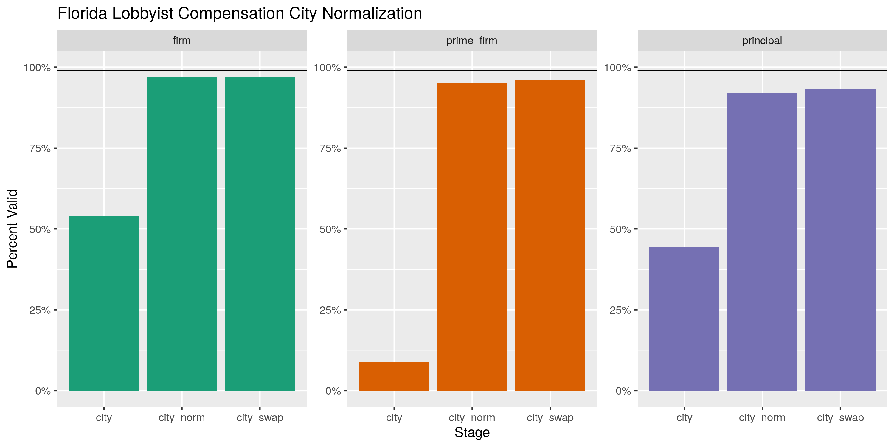
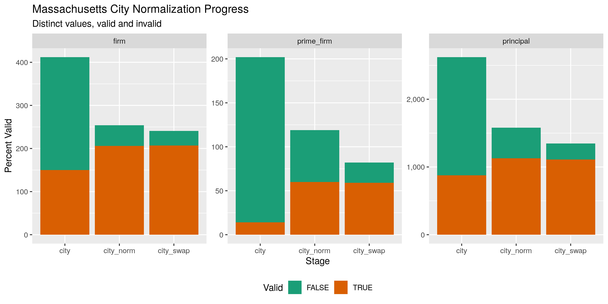

Florida Lobbyist Compensation
================
Kiernan Nicholls
2020-01-17 12:43:51

  - [Project](#project)
  - [Objectives](#objectives)
  - [Packages](#packages)
  - [Data](#data)
      - [About](#about)
      - [Variables](#variables)
  - [Import](#import)
      - [Download](#download)
      - [Read](#read)
  - [Explore](#explore)
  - [Normalize](#normalize)
      - [Address](#address)
      - [ZIP](#zip)
      - [State](#state)
      - [Phone](#phone)
      - [City](#city)
  - [Split](#split)
  - [Export](#export)

<!-- Place comments regarding knitting here -->

## Project

The Accountability Project is an effort to cut across data silos and
give journalists, policy professionals, activists, and the public at
large a simple way to search across huge volumes of public data about
people and organizations.

Our goal is to standardizing public data on a few key fields by thinking
of each dataset row as a transaction. For each transaction there should
be (at least) 3 variables:

1.  All **parties** to a transaction
2.  The **date** of the transaction
3.  The **amount** of money involved

## Objectives

This document describes the process used to complete the following
objectives:

1.  How many records are in the database?
2.  Check for duplicates
3.  Check ranges
4.  Is there anything blank or missing?
5.  Check for consistency issues
6.  Create a five-digit ZIP Code called `ZIP5`
7.  Create a `YEAR` field from the transaction date
8.  Make sure there is data on both parties to a transaction

## Packages

The following packages are needed to collect, manipulate, visualize,
analyze, and communicate these results. The `pacman` package will
facilitate their installation and attachment.

The IRW’s `campfin` package will also have to be installed from GitHub.
This package contains functions custom made to help facilitate the
processing of campaign finance data.

``` r
if (!require("pacman")) install.packages("pacman")
pacman::p_load_gh("irworkshop/campfin")
pacman::p_load(
  tidyverse, # data manipulation
  lubridate, # datetime strings
  gluedown, # printing markdown
  magrittr, # pipe opperators
  janitor, # dataframe clean
  scales, # format strings
  knitr, # knit documents
  vroom, # read files fast
  rvest, # read web pages
  glue, # combine strings
  here, # relative storage
  fs # search storage 
)
```

This document should be run as part of the `R_campfin` project, which
lives as a sub-directory of the more general, language-agnostic
[`irworkshop/accountability_datacleaning`](https://github.com/irworkshop/accountability_datacleaning "TAP repo")
GitHub repository.

The `R_campfin` project uses the [RStudio
projects](https://support.rstudio.com/hc/en-us/articles/200526207-Using-Projects "Rproj")
feature and should be run as such. The project also uses the dynamic
`here::here()` tool for file paths relative to *your* machine.

``` r
# where does this document knit?
here::here()
#> [1] "/home/kiernan/R/accountability_datacleaning/R_campfin"
```

## Data

Data is obtained as tab-delinated files from the [Florida Lobbying
Registration Office](https://floridalobbyist.gov/) (LRO).

### About

> Delimited data files are made available below for compensation reports
> submitted online, beginning in 2007. Data files for the last eight
> quarters will be retained for each branch. The tab-delimited files
> below are in the (.TXT) format and can be imported into any word
> processor, spreadsheet, or database program.

### Variables

The LRO provides a variable key with definitions for each column in the
data sets.

| Data Element                   | Definition                                                                     |
| :----------------------------- | :----------------------------------------------------------------------------- |
| `report_quarter`               | Reporting period for the year                                                  |
| `report_year`                  | Reporting year for the report                                                  |
| `record_type`                  | Firm, Lobbyist or Principal                                                    |
| `firm_name`                    | Name of the lobbying firm                                                      |
| `certification_name`           | Name of the officer, owner or person responsible for certifying the compensat… |
| `title`                        | Title of the officer, owner or person responsible for certifying the compensa… |
| `address_line_1`               | First line of the address for the firm                                         |
| `address_line_2`               | Second line of the address for the firm                                        |
| `city`                         | City on record for the firm                                                    |
| `state`                        | State on record for the firm                                                   |
| `postal_code`                  | Postal code of address for the firm                                            |
| `zip_4`                        | Plus four (4) of postal code                                                   |
| `country`                      | Country code of where the firm is located                                      |
| `phone_number`                 | Phone number for the firm format:country code (area code) prefix-suffix exten… |
| `submission_date`              | Date the compensation report was submitted                                     |
| `total_compensation_range`     | Range of reported compensation on the report                                   |
| `lobbyist_name`                | Lobbyist name Last, First Middle, Suffix                                       |
| `principal_name`               | Principal’s name                                                               |
| `principal_address_line_1`     | First line of the principal’s address                                          |
| `principal_address_line_2`     | Second line of the principal’s address                                         |
| `principal_city_name`          | City where the principal is located                                            |
| `principal_state_name`         | State where the principal is located                                           |
| `principal_postal_code`        | Postal Code where the principal is located                                     |
| `principal_zip_ext`            | Plus four(+4) of the postal code where the principal is located                |
| `principal_country_name`       | Country code where the principal is located                                    |
| `principal_phone_number`       | Phone number for the principal format:country code (area code) prefix-suffix … |
| `principal_compensation_range` | Compensation received from an individual principal (range or specific amount … |
| `prime_firm_name`              | Name of prime contracting firm                                                 |
| `prime_firm_address_line_1`    | First line of the prime contractor’s address                                   |
| `prime_firm_address_line_2`    | Second line of prime contractor’s address                                      |
| `prime_firm_city_name`         | City where the prime contractor is located                                     |
| `prime_firm_state_name`        | State where the prime contractor is located                                    |
| `prime_firm_postal_code`       | Postal code where the prime contractor is located                              |
| `prime_firm_zip_ext`           | Plus four(+4) of the postal code where the prime contractor is located         |
| `prime_firm_country_name`      | Country code of where the prime contractor is located                          |
| `prime_firm_phone_number`      | Phone number for the prime contractor format:country code (area code) prefix-… |

## Import

To create a single clean data file of lobbyist activity, we will first
download each file locally and read as a single data frame.

### Download

The data is separated into quarterly files by year. The URL for each
file takes a consistent format. With the `tidyr::expand_grid()` and
`glue::glue()` functions, we can create a URL for all bombinations of
year, quarter, and branch.

``` r
urls <- 
  expand_grid(
    year = 2008:2019,
    quarter = 1:4,
    branch = c("Executive", "Legislative")
  ) %>% 
  mutate(
    url = glue("https://floridalobbyist.gov/reports/{year}_Quarter{quarter}_{branch}.txt")
  )
```

    #> # A tibble: 96 x 4
    #>     year quarter branch      url                                                              
    #>    <int>   <int> <chr>       <glue>                                                           
    #>  1  2008       1 Executive   https://floridalobbyist.gov/reports/2008_Quarter1_Executive.txt  
    #>  2  2008       1 Legislative https://floridalobbyist.gov/reports/2008_Quarter1_Legislative.txt
    #>  3  2008       2 Executive   https://floridalobbyist.gov/reports/2008_Quarter2_Executive.txt  
    #>  4  2008       2 Legislative https://floridalobbyist.gov/reports/2008_Quarter2_Legislative.txt
    #>  5  2008       3 Executive   https://floridalobbyist.gov/reports/2008_Quarter3_Executive.txt  
    #>  6  2008       3 Legislative https://floridalobbyist.gov/reports/2008_Quarter3_Legislative.txt
    #>  7  2008       4 Executive   https://floridalobbyist.gov/reports/2008_Quarter4_Executive.txt  
    #>  8  2008       4 Legislative https://floridalobbyist.gov/reports/2008_Quarter4_Legislative.txt
    #>  9  2009       1 Executive   https://floridalobbyist.gov/reports/2009_Quarter1_Executive.txt  
    #> 10  2009       1 Legislative https://floridalobbyist.gov/reports/2009_Quarter1_Legislative.txt
    #> # … with 86 more rows

``` r
urls <- pull(urls)
```

This creates 96 distinct URLs, each corresponding to a separate file.

``` r
md_bullet(head(urls))
```

  - <https://floridalobbyist.gov/reports/2008_Quarter1_Executive.txt>
  - <https://floridalobbyist.gov/reports/2008_Quarter1_Legislative.txt>
  - <https://floridalobbyist.gov/reports/2008_Quarter2_Executive.txt>
  - <https://floridalobbyist.gov/reports/2008_Quarter2_Legislative.txt>
  - <https://floridalobbyist.gov/reports/2008_Quarter3_Executive.txt>
  - <https://floridalobbyist.gov/reports/2008_Quarter3_Legislative.txt>

We can download each TXT file to the `/fl/data/raw` directory.

``` r
raw_dir <- dir_create(here("fl", "lobbying", "comp", "data", "raw"))
```

``` r
if (!all_files_new(raw_dir, glob = "*.txt$")) {
  for (url in urls) {
    download.file(url, destfile = str_c(raw_dir, basename(url), sep = "/"))
  }
}
```

    #> # A tibble: 96 x 4
    #>    path                                                     type         size birth_time         
    #>    <chr>                                                    <fct> <fs::bytes> <dttm>             
    #>  1 /fl/lobbying/comp/data/raw/2008_Quarter1_Executive.txt   file         653K 2020-01-16 14:43:40
    #>  2 /fl/lobbying/comp/data/raw/2008_Quarter1_Legislative.txt file         789K 2020-01-16 14:43:41
    #>  3 /fl/lobbying/comp/data/raw/2008_Quarter2_Executive.txt   file         667K 2020-01-16 14:43:42
    #>  4 /fl/lobbying/comp/data/raw/2008_Quarter2_Legislative.txt file         801K 2020-01-16 14:43:43
    #>  5 /fl/lobbying/comp/data/raw/2008_Quarter3_Executive.txt   file         694K 2020-01-16 14:43:44
    #>  6 /fl/lobbying/comp/data/raw/2008_Quarter3_Legislative.txt file         815K 2020-01-16 14:43:45
    #>  7 /fl/lobbying/comp/data/raw/2008_Quarter4_Executive.txt   file         713K 2020-01-16 14:43:46
    #>  8 /fl/lobbying/comp/data/raw/2008_Quarter4_Legislative.txt file         830K 2020-01-16 14:43:47
    #>  9 /fl/lobbying/comp/data/raw/2009_Quarter1_Executive.txt   file         684K 2020-01-16 14:43:48
    #> 10 /fl/lobbying/comp/data/raw/2009_Quarter1_Legislative.txt file         813K 2020-01-16 14:43:50
    #> # … with 86 more rows

### Read

``` r
read_quiet <- function(...) {
  suppressWarnings(suppressMessages(read_delim(...)))
}
fllc <- map_dfr(
  .x = dir_ls(raw_dir),
  .f = read_quiet,
  delim = "\t",
  escape_backslash = FALSE,
  escape_double = FALSE,
  col_types = cols(
    .default = col_character(),
    REPORT_QUARTER = col_factor(
      levels = c(
        "January - March",
        "April - June",
        "July - September",
        "October - December"
      )
    ),
    SUBMISSION_DATE = col_date_usa(),
    REPORT_YEAR = col_double(),
    TOTAL_COMPENSATION_RANGE = col_factor(
      levels = c(
        "$0.00", 
        "$1.00-$49,999.00",
        "$50,000.00-$99,999.00", 
        "$100,000.00-$249,999.00", 
        "$250,000.00-$499,999.00", 
        "$500,000.00-$999,999.00",
        "$1,000,000.00"
      )
    )
  )
)

fllc <- fllc %>% 
  clean_names("snake") %>% 
  rename_at(
    .vars = vars(7:14),
    .funs = ~str_c("firm", ., sep = "_")
  )
```

Despite each quarterly file ostensibly containing all data of the same
type, the files really contain *three* types of records, each with a
different number of columns. We can split the combined data frame into a
list of data frames and then remove from each the empty columns.

## Explore

``` r
glimpse(fllc, max.level = 1)
#> Observations: 455,159
#> Variables: 36
#> $ report_quarter               <fct> January - March, January - March, January - March, January …
#> $ report_year                  <dbl> 2008, 2008, 2008, 2008, 2008, 2008, 2008, 2008, 2008, 2008,…
#> $ record_type                  <chr> "FIRM", "LOBBYIST", "PRINCIPAL", "PRINCIPAL", "PRINCIPAL", …
#> $ firm_name                    <chr> "4th Floor Advocacy", "4th Floor Advocacy", "4th Floor Advo…
#> $ certification_name           <chr> "Kari  Hebrank", NA, NA, NA, NA, NA, NA, NA, "Alison B Dudl…
#> $ title                        <chr> "Owner", NA, NA, NA, NA, NA, NA, NA, "Owner", NA, NA, NA, N…
#> $ firm_address_line_1          <chr> "7711 Deepwood Trail", NA, NA, NA, NA, NA, NA, NA, "PO Box …
#> $ firm_address_line_2          <chr> NA, NA, NA, NA, NA, NA, NA, NA, NA, NA, NA, NA, NA, NA, NA,…
#> $ firm_city                    <chr> "TALLAHASSEE", NA, NA, NA, NA, NA, NA, NA, "TALLAHASSEE", N…
#> $ firm_state                   <chr> "FLORIDA", NA, NA, NA, NA, NA, NA, NA, "FLORIDA", NA, NA, N…
#> $ firm_postal_code             <chr> "32317", NA, NA, NA, NA, NA, NA, NA, "32302", NA, NA, NA, N…
#> $ firm_zip_4                   <chr> NA, NA, NA, NA, NA, NA, NA, NA, NA, NA, NA, NA, NA, NA, NA,…
#> $ firm_country                 <chr> "US        ", NA, NA, NA, NA, NA, NA, NA, "US        ", NA,…
#> $ firm_phone_number            <chr> "(850)681-3290", NA, NA, NA, NA, NA, NA, NA, "(850)556-6517…
#> $ submission_date              <date> 2008-05-16, NA, NA, NA, NA, NA, NA, NA, 2008-04-23, NA, NA…
#> $ total_compensation_range     <fct> "$1.00-$49,999.00", NA, NA, NA, NA, NA, NA, NA, "$1.00-$49,…
#> $ lobbyist_name                <chr> NA, "Kari B. Hebrank", NA, NA, NA, NA, NA, NA, NA, "Alison …
#> $ principal_name               <chr> NA, NA, "Florida Building Material Association", "Florida F…
#> $ principal_address_line_1     <chr> NA, NA, "1303 Limit Ave", "225 Newburyport Ave", "1718 Main…
#> $ principal_address_line_2     <chr> NA, NA, NA, NA, NA, NA, NA, NA, NA, NA, NA, NA, NA, NA, NA,…
#> $ principal_city_name          <chr> NA, NA, "MOUNT DORA", "ALTAMONTE SPRINGS", "SARASOTA", "NOK…
#> $ principal_state_name         <chr> NA, NA, "FLORIDA", "FLORIDA", "FLORIDA", "FLORIDA", "TEXAS"…
#> $ principal_postal_code        <chr> NA, NA, "32757", "32701", "34236", "34274", "75069", "33543…
#> $ principal_zip_ext            <chr> NA, NA, NA, NA, NA, NA, NA, NA, NA, NA, NA, NA, NA, NA, NA,…
#> $ principal_country_name       <chr> NA, NA, "US        ", "US        ", "US        ", "US      …
#> $ principal_phone_number       <chr> NA, NA, "(352)383-0366", "(865)467-8991", "(941)952-9294", …
#> $ principal_compensation_range <chr> NA, NA, "$1.00-$9,999.00", "$1.00-$9,999.00", "$1.00-$9,999…
#> $ prime_firm_name              <chr> NA, NA, NA, NA, NA, NA, NA, NA, NA, NA, NA, NA, NA, NA, NA,…
#> $ prime_firm_address_line_1    <chr> NA, NA, NA, NA, NA, NA, NA, NA, NA, NA, NA, NA, NA, NA, NA,…
#> $ prime_firm_address_line_2    <chr> NA, NA, NA, NA, NA, NA, NA, NA, NA, NA, NA, NA, NA, NA, NA,…
#> $ prime_firm_city_name         <chr> NA, NA, NA, NA, NA, NA, NA, NA, NA, NA, NA, NA, NA, NA, NA,…
#> $ prime_firm_state_name        <chr> NA, NA, NA, NA, NA, NA, NA, NA, NA, NA, NA, NA, NA, NA, NA,…
#> $ prime_firm_postal_code       <chr> NA, NA, NA, NA, NA, NA, NA, NA, NA, NA, NA, NA, NA, NA, NA,…
#> $ prime_firm_zip_ext           <chr> NA, NA, NA, NA, NA, NA, NA, NA, NA, NA, NA, NA, NA, NA, NA,…
#> $ prime_firm_country_name      <chr> NA, NA, NA, NA, NA, NA, NA, NA, NA, NA, NA, NA, NA, NA, NA,…
#> $ prime_firm_phone_number      <chr> NA, NA, NA, NA, NA, NA, NA, NA, NA, NA, NA, NA, NA, NA, NA,…
```

## Normalize

### Address

``` r
fllc <- fllc %>% 
  unite(
    col = "firm_address_full",
    starts_with("firm_address"),
    sep = " ",
    remove = FALSE,
    na.rm = TRUE
  ) %>% 
  unite(
    col = "principal_address_full",
    starts_with("principal_address"),
    sep = " ",
    remove = FALSE,
    na.rm = TRUE
  ) %>% 
  unite(
    col = "prime_firm_address_full",
    starts_with("prime_firm_address"),
    sep = " ",
    remove = FALSE,
    na.rm = TRUE
  ) %>% 
  mutate_at(
    .vars = vars(contains("address_full")),
    .funs = list(norm = normal_address),
    abbs = usps_street
  ) %>% 
  select(
    -ends_with("address_full")
  ) %>% 
  mutate_if(is_character, na_if, "") %>% 
  rename_at(
    .vars = vars(ends_with("address_full_norm")),
    .funs = ~str_replace(., "full_norm", "norm")
  )
```

``` r
fllc %>% 
  select(starts_with("firm_address")) %>% 
  distinct() %>% 
  sample_frac()
#> # A tibble: 2,718 x 3
#>    firm_address_line_1     firm_address_line_2        firm_address_norm                            
#>    <chr>                   <chr>                      <chr>                                        
#>  1 Bank of America Bldg    315 S Calhoun St Ste 848   BANK OF AMERICA BUILDING 315 SOUTH CALHOUN S…
#>  2 1139 Tuscany Blvd       <NA>                       1139 TUSCANY BOULEVARD                       
#>  3 300 S Duval St Ste 410  Suite 410                  300 SOUTH DUVAL STREET SUITE 410 SUITE 410   
#>  4 PO Box 273932           <NA>                       PO BOX 273932                                
#>  5 8769 Minnow Creek Dr    <NA>                       8769 MINNOW CREEK DRIVE                      
#>  6 1579 Monroe Dr          Ste F-603                  1579 MONROE DRIVE SUITE F 603                
#>  7 Mitchell A. Bierman     2525 Ponce de Leon Blvd S… MITCHELL A BIERMAN 2525 PONCE DE LEON BOULEV…
#>  8 4394 NE 23rd Terrace    <NA>                       4394 NORTHEAST 23RD TERRACE                  
#>  9 5301 N Habana Ave       Suite 3                    5301 NORTH HABANA AVENUE SUITE 3             
#> 10 2861 Executive Dr Ste … <NA>                       2861 EXECUTIVE DRIVE SUITE 100               
#> # … with 2,708 more rows
```

### ZIP

``` r
fllc <- fllc %>% 
  mutate_at(
    .vars = vars(ends_with("postal_code")),
    .funs = list(norm = normal_zip),
    na_rep = TRUE
  ) %>% 
  rename_all(
    .funs = ~str_replace(., "postal_code", "zip")
  )
```

``` r
progress_table(
  fllc$firm_zip,
  fllc$firm_zip_norm,
  fllc$principal_zip,
  fllc$principal_zip_norm,
  fllc$prime_firm_zip,
  fllc$prime_firm_zip_norm,
  compare = valid_zip
)
#> # A tibble: 6 x 6
#>   stage               prop_in n_distinct prop_na n_out n_diff
#>   <chr>                 <dbl>      <dbl>   <dbl> <dbl>  <dbl>
#> 1 firm_zip              0.818       1036   0.918  6791    592
#> 2 firm_zip_norm         1.00         487   0.918    12      5
#> 3 principal_zip         0.885       4806   0.237 40053   2396
#> 4 principal_zip_norm    0.994       2727   0.237  2184    128
#> 5 prime_firm_zip        0.963        236   0.971   496     95
#> 6 prime_firm_zip_norm   0.998        172   0.971    25     19
```

### State

``` r
fllc <- fllc %>% 
  mutate_at(
    .vars = vars(contains("state")),
    .funs = list(norm = normal_state),
    na_rep = TRUE
  ) %>% 
  rename_all(
    .funs = ~str_replace(., "state_name", "state")
  )
```

``` r
progress_table(
  fllc$firm_state,
  fllc$firm_state_norm,
  fllc$principal_state,
  fllc$principal_state_norm,
  fllc$prime_firm_state,
  fllc$prime_firm_state_norm,
  compare = valid_state
)
#> # A tibble: 6 x 6
#>   stage                 prop_in n_distinct prop_na  n_out n_diff
#>   <chr>                   <dbl>      <dbl>   <dbl>  <dbl>  <dbl>
#> 1 firm_state              0.405         70   0.918  22227     44
#> 2 firm_state_norm         1.00          38   0.918     14      5
#> 3 principal_state         0.467        251   0.236 185238    205
#> 4 principal_state_norm    0.998        118   0.237    752     69
#> 5 prime_firm_state        0.601         67   0.970   5488     57
#> 6 prime_firm_state_norm   0.994         33   0.970     80     21
```

``` r
count(fllc, firm_state, firm_state_norm, sort = TRUE)
#> # A tibble: 70 x 3
#>    firm_state           firm_state_norm      n
#>    <chr>                <chr>            <int>
#>  1 <NA>                 <NA>            417781
#>  2 FLORIDA              FL               21054
#>  3 FL                   FL               14554
#>  4 Florida              FL                 423
#>  5 DC                   DC                 180
#>  6 DISTRICT OF COLUMBIA DC                 169
#>  7 GEORGIA              GA                 154
#>  8 VA                   VA                  92
#>  9 VIRGINIA             VA                  71
#> 10 GA                   GA                  54
#> # … with 60 more rows
```

### Phone

``` r
fllc <- fllc %>% 
  mutate_at(
    .vars = vars(ends_with("phone_number")),
    .funs = list(norm = normal_phone),
  ) %>% 
  rename_all(
    .funs = ~str_replace(., "phone_number", "phone")
  )
```

``` r
fllc %>% 
  select(starts_with("firm_phone")) %>% 
  distinct() %>% 
  sample_frac()
#> # A tibble: 2,025 x 2
#>    firm_phone         firm_phone_norm    
#>    <chr>              <chr>              
#>  1 (305) 216-7794     (305) 216-7794     
#>  2 (850)222-5155      (850) 222-5155     
#>  3 (850)727-3465      (850) 727-3465     
#>  4 (954) 540-7252     (954) 540-7252     
#>  5 (305)968-1222      (305) 968-1222     
#>  6 (305) 342-6111     (305) 342-6111     
#>  7 (850)681-6788 x101 (850) 681-6788 x101
#>  8 (850) 294-7963     (850) 294-7963     
#>  9 (772) 418-6068     (772) 418-6068     
#> 10 (850) 590-2186     (850) 590-2186     
#> # … with 2,015 more rows
```

### City

``` r
fllc <- fllc %>% 
  mutate_at(
    .vars = vars(contains("city")),
    .funs = list(norm = normal_city),
    abbs = usps_city,
    states = c("FL", "DC", "FLORIDA"),
    na = invalid_city,
    na_rep = TRUE
  ) %>% 
  rename_all(
    .funs = ~str_replace(., "city_name", "city")
  )
```

``` r
fllc <- fllc %>%
  # firm
  left_join(
    y = zipcodes,
    by = c(
      "firm_state_norm" = "state",
      "firm_zip_norm" = "zip"
    )
  ) %>% 
  rename(firm_city_match = city) %>% 
  mutate(
    firm_match_abb = is_abbrev(firm_city_norm, firm_city_match),
    firm_match_dist = str_dist(firm_city_norm, firm_city_match),
    firm_city_swap = if_else(
      condition = firm_match_abb | firm_match_dist == 1,
      true = firm_city_match,
      false = firm_city_norm
    )
  ) %>% 
  # firm
  left_join(
    y = zipcodes,
    by = c(
      "principal_state_norm" = "state",
      "principal_zip_norm" = "zip"
    )
  ) %>% 
  rename(principal_city_match = city) %>% 
  mutate(
    principal_match_abb = is_abbrev(principal_city_norm, principal_city_match),
    principal_match_dist = str_dist(principal_city_norm, principal_city_match),
    principal_city_swap = if_else(
      condition = principal_match_abb | principal_match_dist == 1,
      true = principal_city_match,
      false = principal_city_norm
    )
  ) %>% 
  # firm
  left_join(
    y = zipcodes,
    by = c(
      "prime_firm_state_norm" = "state",
      "prime_firm_zip_norm" = "zip"
    )
  ) %>% 
  rename(prime_firm_city_match = city) %>% 
  mutate(
    prime_firm_match_abb = is_abbrev(prime_firm_city_norm, prime_firm_city_match),
    prime_firm_match_dist = str_dist(prime_firm_city_norm, prime_firm_city_match),
    prime_firm_city_swap = if_else(
      condition = prime_firm_match_abb | prime_firm_match_dist == 1,
      true = prime_firm_city_match,
      false = prime_firm_city_norm
    )
  )
```

``` r
city_prog <- progress_table(
  fllc$firm_city,
  fllc$firm_city_norm,
  fllc$firm_city_swap,
  fllc$principal_city,
  fllc$principal_city_norm,
  fllc$principal_city_swap,
  fllc$prime_firm_city,
  fllc$prime_firm_city_norm,
  fllc$prime_firm_city_swap,
  compare = valid_city
)

city_prog <- city_prog %>% 
  separate(
    col = stage,
    into = c("type", "stage"),
    sep = "_(?=city)"
  ) %>% 
  group_by(type) %>% 
  mutate(stage = as_factor(stage))
```

<!-- -->

<!-- -->

``` r
fllc <- fllc %>% 
  select(
    -ends_with("city_match"),
    -ends_with("match_abb"),
    -ends_with("match_dist"),
    -contains("city_norm")
  ) %>% 
  rename_at(
    .vars = vars(ends_with("city_swap")),
    .funs = ~str_replace(., "swap", "norm")
  )
```

## Split

``` r
fllc <- fllc %>% 
  group_split(record_type) %>% 
  map(remove_empty, "cols") %>% 
  set_names(c("firm", "lob", "pri"))
```

The data with a `record_type` of “LOBBYIST” contains one row for every
lobbyist alongside the firm for which they work. There is no information
on which particular clients that lobbyist is assigned.

``` r
head(sample_frac(fllc$lob))
#> # A tibble: 6 x 5
#>   report_quarter     report_year record_type firm_name              lobbyist_name    
#>   <fct>                    <dbl> <chr>       <chr>                  <chr>            
#> 1 July - September          2008 LOBBYIST    Capitol Alliance Group Richard B. Pinsky
#> 2 October - December        2009 LOBBYIST    Prieguez & Weems       Christian Ulvert 
#> 3 July - September          2009 LOBBYIST    The Fiorentino Group   Whitney W Walker 
#> 4 January - March           2013 LOBBYIST    Akerman Senterfitt     Eliakim Nortelus 
#> 5 July - September          2010 LOBBYIST    Foley & Lardner LLP    Robert H. Hosay  
#> 6 July - September          2008 LOBBYIST    John P. Fons           John P. Fons
```

For “FIRM” records, there are not 16 variables for every firm listed,
including geographic information and the range of total compensation
they have earned.

``` r
glimpse(sample_frac(fllc$firm))
#> Observations: 37,379
#> Variables: 20
#> $ report_quarter           <fct> April - June, October - December, July - September, October - D…
#> $ report_year              <dbl> 2014, 2011, 2015, 2012, 2009, 2018, 2009, 2011, 2017, 2015, 201…
#> $ record_type              <chr> "FIRM", "FIRM", "FIRM", "FIRM", "FIRM", "FIRM", "FIRM", "FIRM",…
#> $ firm_name                <chr> "Harrison Rivard Duncan & Buzzett Chtd.", "Kim Bertron", "Bradf…
#> $ certification_name       <chr> "William   Harrison Jr.", "Kim  Bertron", "Owner Gary Bradford"…
#> $ title                    <chr> "Senior Partner", "Owner", "Owner", "Owner", "Owner", "Senior P…
#> $ firm_address_line_1      <chr> "101 Harrison Ave", "PO Box 10062", "23200 Gracewood Circle", "…
#> $ firm_address_line_2      <chr> NA, NA, NA, NA, NA, NA, NA, NA, NA, "Ste 320", "Ste 1000", NA, …
#> $ firm_city                <chr> "PANAMA CITY", "TALLAHASSEE", "Land 'O Lakes", "TALLAHASSEE", "…
#> $ firm_state               <chr> "FLORIDA", "FLORIDA", "FL", "FLORIDA", "FLORIDA", "FL", "FLORID…
#> $ firm_zip                 <chr> "32401", "32302", "34639", "32308", "32317", "32302-2570", "323…
#> $ firm_country             <chr> "US        ", "US        ", "US        ", "US        ", "US    …
#> $ firm_phone               <chr> "(850)769-7714", "(850)224-4116", "(813) 833-5931", "+1 8505086…
#> $ submission_date          <date> 2014-07-16, 2012-01-10, 2015-10-09, 2013-01-07, 2009-11-14, 20…
#> $ total_compensation_range <fct> "$1.00-$49,999.00", "$1.00-$49,999.00", "$1.00-$49,999.00", "$1…
#> $ firm_address_norm        <chr> "101 HARRISON AVENUE", "PO BOX 10062", "23200 GRACEWOOD CIRCLE"…
#> $ firm_zip_norm            <chr> "32401", "32302", "34639", "32308", "32317", "32302", "32301", …
#> $ firm_state_norm          <chr> "FL", "FL", "FL", "FL", "FL", "FL", "FL", "FL", "FL", "FL", "FL…
#> $ firm_phone_norm          <chr> "(850) 769-7714", "(850) 224-4116", "(813) 833-5931", "(850) 50…
#> $ firm_city_norm           <chr> "PANAMA CITY", "TALLAHASSEE", "LAND O LAKES", "TALLAHASSEE", "T…
```

The “PRINCIPAL” records are the clients hiring firms (and their
lobbyist) to conduct lobbying work. The exact lobbyists working for each
client account are *not* listed, only the overal lobbying firm hired.

``` r
glimpse(sample_frac(fllc$pri))
#> Observations: 347,719
#> Variables: 33
#> $ report_quarter               <fct> October - December, October - December, April - June, Octob…
#> $ report_year                  <dbl> 2017, 2018, 2008, 2018, 2010, 2017, 2009, 2018, 2016, 2014,…
#> $ record_type                  <chr> "PRINCIPAL", "PRINCIPAL", "PRINCIPAL", "PRINCIPAL", "PRINCI…
#> $ firm_name                    <chr> "Corcoran & Johnston", "Ballard Partners", "Michael Spinell…
#> $ principal_name               <chr> "Novartis Services, Inc.", "DISH Network LLC", "Gulf Coast …
#> $ principal_address_line_1     <chr> "701 Pennsylvania Ave. N.W.", "1110 Vermont Ave NW", "3000 …
#> $ principal_address_line_2     <chr> "Suite 725", "Ste 750", NA, "Ste 270", NA, NA, NA, NA, NA, …
#> $ principal_city               <chr> "Washington", "Washington", "FT LAUDERDALE", "Baton Rouge",…
#> $ principal_state              <chr> "DC", "DC", "FLORIDA", "LA", "DISTRICT OF COLUMBIA", "FL", …
#> $ principal_zip                <chr> "20004", "20005", "33309", "70809", "20036", "32351", "3468…
#> $ principal_zip_ext            <chr> NA, NA, NA, NA, NA, NA, NA, NA, NA, NA, NA, NA, NA, NA, NA,…
#> $ principal_country_name       <chr> "US        ", "US        ", "US        ", "US        ", "US…
#> $ principal_phone              <chr> "(202) 662-4361", "(202) 293-0981", "(954)493-6565 x165", "…
#> $ principal_compensation_range <chr> "$10,000.00-$19,999.00", "$10,000.00-$19,999.00", "$1.00-$9…
#> $ prime_firm_name              <chr> NA, NA, NA, NA, NA, NA, NA, NA, NA, NA, NA, NA, NA, NA, NA,…
#> $ prime_firm_address_line_1    <chr> NA, NA, NA, NA, NA, NA, NA, NA, NA, NA, NA, NA, NA, NA, NA,…
#> $ prime_firm_address_line_2    <chr> NA, NA, NA, NA, NA, NA, NA, NA, NA, NA, NA, NA, NA, NA, NA,…
#> $ prime_firm_city              <chr> NA, NA, NA, NA, NA, NA, NA, NA, NA, NA, NA, NA, NA, NA, NA,…
#> $ prime_firm_state             <chr> NA, NA, NA, NA, NA, NA, NA, NA, NA, NA, NA, NA, NA, NA, NA,…
#> $ prime_firm_zip               <chr> NA, NA, NA, NA, NA, NA, NA, NA, NA, NA, NA, NA, NA, NA, NA,…
#> $ prime_firm_zip_ext           <chr> NA, NA, NA, NA, NA, NA, NA, NA, NA, NA, NA, NA, NA, NA, NA,…
#> $ prime_firm_country_name      <chr> NA, NA, NA, NA, NA, NA, NA, NA, NA, NA, NA, NA, NA, NA, NA,…
#> $ prime_firm_phone             <chr> NA, NA, NA, NA, NA, NA, NA, NA, NA, NA, NA, NA, NA, NA, NA,…
#> $ principal_address_norm       <chr> "701 PENNSYLVANIA AVENUE NORTH WEST SUITE 725", "1110 VERMO…
#> $ prime_firm_address_norm      <chr> NA, NA, NA, NA, NA, NA, NA, NA, NA, NA, NA, NA, NA, NA, NA,…
#> $ principal_zip_norm           <chr> "20004", "20005", "33309", "70809", "20036", "32351", "3468…
#> $ prime_firm_zip_norm          <chr> NA, NA, NA, NA, NA, NA, NA, NA, NA, NA, NA, NA, NA, NA, NA,…
#> $ principal_state_norm         <chr> "DC", "DC", "FL", "LA", "DC", "FL", "FL", "FL", "FL", "FL",…
#> $ prime_firm_state_norm        <chr> NA, NA, NA, NA, NA, NA, NA, NA, NA, NA, NA, NA, NA, NA, NA,…
#> $ principal_phone_norm         <chr> "(202) 662-4361", "(202) 293-0981", "(954) 493-6565 x165", …
#> $ prime_firm_phone_norm        <chr> NA, NA, NA, NA, NA, NA, NA, NA, NA, NA, NA, NA, NA, NA, NA,…
#> $ principal_city_norm          <chr> "WASHINGTON", "WASHINGTON", "FORT LAUDERDALE", "BATON ROUGE…
#> $ prime_firm_city_norm         <chr> NA, NA, NA, NA, NA, NA, NA, NA, NA, NA, NA, NA, NA, NA, NA,…
```

## Export

``` r
proc_dir <- dir_create(here("fl", "lobbying", "comp", "data", "processed"))
```

``` r
write_csv(
  x = fllc$firm,
  path = glue("{proc_dir}/fl_lobby_firm_comp.csv"),
  na = ""
)
```

``` r
write_csv(
  x = fllc$lob,
  path = glue("{proc_dir}/fl_lobby_firms.csv"),
  na = ""
)
```

``` r
write_csv(
  x = fllc$pri,
  path = glue("{proc_dir}/fl_lobby_pri_comp.csv"),
  na = ""
)
```
