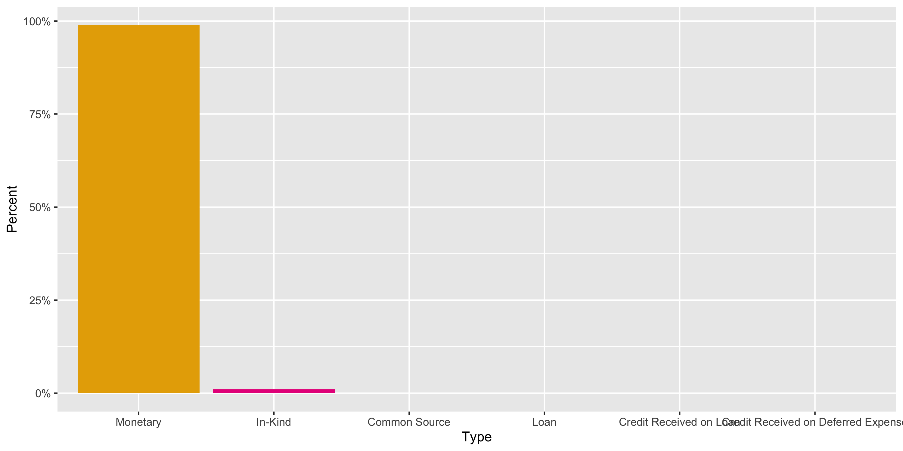
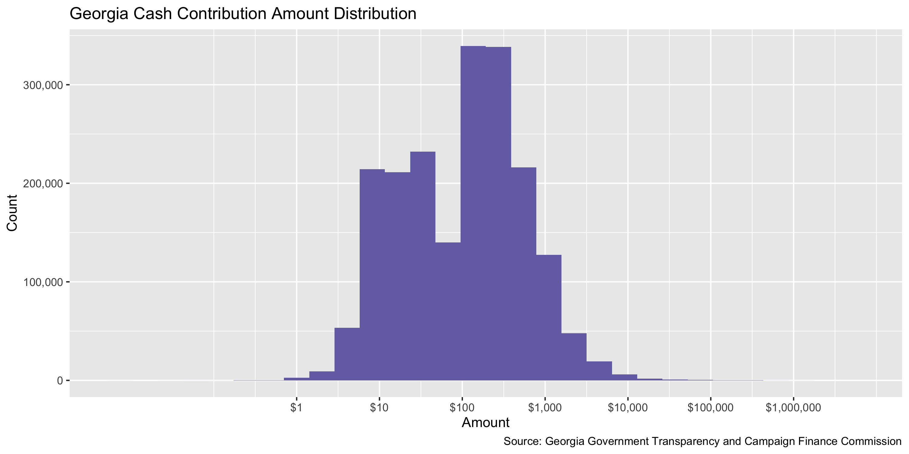
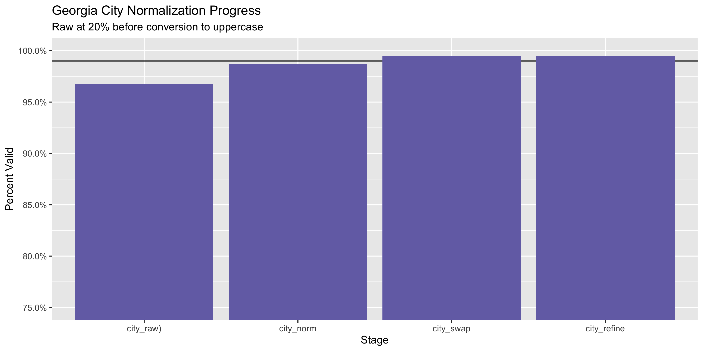

Georgia Contribution Data Diary
================
Yanqi Xu
2022-10-09 21:45:58

-   <a href="#project" id="toc-project">Project</a>
-   <a href="#objectives" id="toc-objectives">Objectives</a>
-   <a href="#packages" id="toc-packages">Packages</a>
-   <a href="#data" id="toc-data">Data</a>
-   <a href="#download" id="toc-download">Download</a>
-   <a href="#read" id="toc-read">Read</a>
-   <a href="#explore" id="toc-explore">Explore</a>
-   <a href="#wrangle" id="toc-wrangle">Wrangle</a>
-   <a href="#conclude" id="toc-conclude">Conclude</a>
-   <a href="#export" id="toc-export">Export</a>
-   <a href="#upload" id="toc-upload">Upload</a>
-   <a href="#dictionary" id="toc-dictionary">Dictionary</a>

<!-- Place comments regarding knitting here -->

## Project

The Accountability Project is an effort to cut across data silos and
give journalists, policy professionals, activists, and the public at
large a simple way to search across huge volumes of public data about
people and organizations.

Our goal is to standardizing public data on a few key fields by thinking
of each dataset row as a transaction. For each transaction there should
be (at least) 3 variables:

1.  All **parties** to a transaction.
2.  The **date** of the transaction.
3.  The **amount** of money involved.

## Objectives

This document describes the process used to complete the following
objectives:

1.  How many records are in the database?
2.  Check for entirely duplicated records.
3.  Check ranges of continuous variables.
4.  Is there anything blank or missing?
5.  Check for consistency issues.
6.  Create a five-digit ZIP Code called `zip`.
7.  Create a `year` field from the transaction date.
8.  Make sure there is data on both parties to a transaction.

## Packages

The following packages are needed to collect, manipulate, visualize,
analyze, and communicate these results. The `pacman` package will
facilitate their installation and attachment.

The IRW’s `campfin` package will also have to be installed from GitHub.
This package contains functions custom made to help facilitate the
processing of campaign finance data.

``` r
if (!require("pacman")) install.packages("pacman")
pacman::p_load_gh("irworkshop/campfin")
pacman::p_load(
  tidyverse, # data manipulation
  lubridate, # datetime strings
  gluedown, # printing markdown
  magrittr, # pipe operators
  janitor, # clean data frames
  refinr, # cluster and merge
  scales, # format strings
  knitr, # knit documents
  vroom, # read files fast
  rvest, # html scraping
  glue, # combine strings
  here, # relative paths
  httr, # http requests
  fs # local storage 
)
```

This document should be run as part of the `R_campfin` project, which
lives as a sub-directory of the more general, language-agnostic
[`irworkshop/accountability_datacleaning`](https://github.com/irworkshop/accountability_datacleaning)
GitHub repository.

The `R_campfin` project uses the [RStudio
projects](https://support.rstudio.com/hc/en-us/articles/200526207-Using-Projects)
feature and should be run as such. The project also uses the dynamic
`here::here()` tool for file paths relative to *your* machine.

``` r
# where does this document knit?
here::here()
#> [1] "/Users/yanqixu/code/accountability_datacleaning"
```

## Data

## Download

Campaign contribution data is available from the [Georgia Ethics
Administration
Program](https://media.ethics.ga.gov/search/Campaign/Campaign_ByContributions.aspx).
The update covers the time period of Oct 6,2020 to Oct 8, 2022. The next
update should start from Oct 9, 2022. Note from earlier: We downloaded
the data year by year since there’s a limit on the number of rows at
each export. The end date of this data is Oct 5, 2020 and the next
update should start on Oct 6, 2020.

``` r
raw_dir <- dir_create(here("state","ga", "contribs", "data", "raw"))
source <- "Georgia Government Transparency and Campaign Finance Commission"
```

## Read

More in formation about the types of forms that are filed can be found
on the Georgia Ethics Administration Program’s
[website](http://ethics.la.gov/CampFinanForms.aspx#CandidateForms).

``` r
read_ga_contrib <-  function(file){
df <- file %>% 
  read_lines(skip = 1) %>% 
  str_replace_all("(?<!(\n|^|,))\"(?!(,(?=\"))|$|\r)", "'") %>% I() %>% 
  read_delim(
    delim = ",",
    escape_backslash = FALSE,
    escape_double = FALSE,
    col_names = read_names(file),
    col_types = cols(
      .default = col_character()
    )
  )
return(df)
}

gac <- dir_ls(raw_dir) %>% read_ga_contrib()

gac <- gac %>% 
  clean_names() %>% 
  mutate(date = date %>% as.Date(format = "%m/%d/%Y"))

gac <- gac %>% 
  mutate(across(ends_with("amount"), as.numeric))
```

## Explore

``` r
glimpse(gac)
#> Rows: 497,993
#> Columns: 22
#> $ filer_id              <chr> "C2017000227", "C2017000227", "C2017000227", "C2017000227", "C20170…
#> $ type                  <chr> "Monetary", "Monetary", "Monetary", "Monetary", "Monetary", "Moneta…
#> $ last_name             <chr> "D and R Intensive Car Care", "Mr. Daniel", "Daniels", "Mr. Shah", …
#> $ first_name            <chr> NA, "Christopher", "Christopher", "Rahim", "Raymond", "Charles R.",…
#> $ address               <chr> "811 S Main St", "11 Macedonia Rd", "301 Windsor Pkwy", "1555 Calvi…
#> $ city                  <chr> "Statesboro", "White", "Sandy Springs", "Lawrenceville", "Bloomfiel…
#> $ state                 <chr> "GA", "GA", "GA", "GA", "MI", "GA", "GA", "GA", "GA", "GA", "GA", "…
#> $ zip                   <chr> "30458-3464", "30184-3350", "30342-2747", "30043-3612", "48304-2139…
#> $ pac                   <chr> NA, NA, NA, NA, NA, NA, NA, NA, NA, NA, NA, NA, NA, NA, NA, NA, NA,…
#> $ occupation            <chr> NA, "Investor", "Attorney", "Owner", "Retired", "Information Reques…
#> $ employer              <chr> NA, "Self Employed", "Barnes and Thornburg Llp", "Maandesh Llc", "N…
#> $ date                  <date> 2021-10-14, 2022-01-07, 2021-12-01, 2021-08-09, 2021-12-31, 2021-0…
#> $ election              <chr> "Primary", "Primary", "Primary", "Primary", "Primary", "Primary", "…
#> $ election_year         <chr> "2022", "2022", "2022", "2022", "2022", "2022", "2022", "2022", "20…
#> $ cash_amount           <dbl> 1000.00, 5000.00, 1000.00, 2500.00, 100.00, 7000.00, 7000.00, 1500.…
#> $ in_kind_amount        <dbl> 0, 0, 0, 0, 0, 0, 0, 0, 0, 0, 0, 0, 0, 0, 0, 0, 0, 0, 0, 0, 0, 0, 0…
#> $ in_kind_description   <chr> NA, NA, NA, NA, NA, NA, NA, NA, NA, NA, NA, NA, NA, NA, NA, NA, NA,…
#> $ candidate_first_name  <chr> "Brian", "Brian", "Brian", "Brian", "Brian", "Brian", "Brian", "Bri…
#> $ candidate_middle_name <chr> "Porter", "Porter", "Porter", "Porter", "Porter", "Porter", "Porter…
#> $ candidate_last_name   <chr> "Kemp", "Kemp", "Kemp", "Kemp", "Kemp", "Kemp", "Kemp", "Kemp", "Ke…
#> $ candidate_suffix      <chr> NA, NA, NA, NA, NA, NA, NA, NA, NA, NA, NA, NA, NA, NA, NA, NA, NA,…
#> $ committee_name        <chr> "Kemp For Governor, Inc. ", "Kemp For Governor, Inc. ", "Kemp For G…
tail(gac)
#> # A tibble: 6 × 22
#>   filer_id type  last_…¹ first…² address city  state zip   pac   occup…³ emplo…⁴ date       elect…⁵
#>   <chr>    <chr> <chr>   <chr>   <chr>   <chr> <chr> <chr> <chr> <chr>   <chr>   <date>     <chr>  
#> 1 C202100… Mone… Machin… <NA>    9000 M… Uppe… MD    2077… <NA>  <NA>    <NA>    2021-12-15 Primary
#> 2 C202100… Mone… Mason   Rayburn 115 Al… Macon GA    3121… <NA>  Deep L… Tracto… 2021-08-16 Primary
#> 3 C202100… Mone… McCarr… Matt    430 Hu… Atla… GA    3035… <NA>  Chief … Bey & … 2022-01-09 Primary
#> 4 C202100… Mone… Meller  Samuel… 3235 W… Augu… GA    3090… <NA>  Princi… THE ME… 2021-09-29 Primary
#> 5 C202100… Mone… Melton  Willie  2080 C… Coll… GA    3033… <NA>  Broker  Melton… 2021-10-30 Primary
#> 6 C202100… Mone… Nash    Katrell 437 Wa… Augu… GA    3090… <NA>  Attorn… Self    2021-09-28 Primary
#> # … with 9 more variables: election_year <chr>, cash_amount <dbl>, in_kind_amount <dbl>,
#> #   in_kind_description <chr>, candidate_first_name <chr>, candidate_middle_name <chr>,
#> #   candidate_last_name <chr>, candidate_suffix <chr>, committee_name <chr>, and abbreviated
#> #   variable names ¹​last_name, ²​first_name, ³​occupation, ⁴​employer, ⁵​election
```

### Missing

``` r
col_stats(gac, count_na)
#> # A tibble: 22 × 4
#>    col                   class       n         p
#>    <chr>                 <chr>   <int>     <dbl>
#>  1 filer_id              <chr>       0 0        
#>  2 type                  <chr>       0 0        
#>  3 last_name             <chr>       0 0        
#>  4 first_name            <chr>   20139 0.0404   
#>  5 address               <chr>       0 0        
#>  6 city                  <chr>       0 0        
#>  7 state                 <chr>      25 0.0000502
#>  8 zip                   <chr>       0 0        
#>  9 pac                   <chr>  484945 0.974    
#> 10 occupation            <chr>   20128 0.0404   
#> 11 employer              <chr>   20218 0.0406   
#> 12 date                  <date>      0 0        
#> 13 election              <chr>   31177 0.0626   
#> 14 election_year         <chr>   30108 0.0605   
#> 15 cash_amount           <dbl>       0 0        
#> 16 in_kind_amount        <dbl>       0 0        
#> 17 in_kind_description   <chr>  497431 0.999    
#> 18 candidate_first_name  <chr>  415859 0.835    
#> 19 candidate_middle_name <chr>  430203 0.864    
#> 20 candidate_last_name   <chr>  415859 0.835    
#> 21 candidate_suffix      <chr>  494786 0.994    
#> 22 committee_name        <chr>   13300 0.0267
```

We will flag entries with missing `last_name`,`candidate_name`, `city`
and `date`

``` r
gac <- gac %>% flag_na(last_name, city,date,committee_name)
sum(gac$na_flag)
#> [1] 13300
```

``` r
gac %>% 
  filter(na_flag) %>% 
  select(last_name, city,date,committee_name)
#> # A tibble: 13,300 × 4
#>    last_name      city          date       committee_name
#>    <chr>          <chr>         <date>     <chr>         
#>  1 Prescott       Conyers       2022-01-31 <NA>          
#>  2 Purdy          Atlanta       2022-01-14 <NA>          
#>  3 Roden Love LLC Savannah      2022-01-24 <NA>          
#>  4 Roden          Savannah      2022-01-24 <NA>          
#>  5 Ross           New York      2022-01-27 <NA>          
#>  6 S Allen Murray Fairfax       2022-01-11 <NA>          
#>  7 Sams           Newnan        2022-01-19 <NA>          
#>  8 Schaufler      Lagrange      2022-01-13 <NA>          
#>  9 Sharpless      Pine Mountain 2022-01-17 <NA>          
#> 10 Shigley        Atlanta       2022-01-17 <NA>          
#> # … with 13,290 more rows
```

### Duplicates

``` r
gac <- flag_dupes(gac,dplyr::everything())
sum(gac$dupe_flag)
#> [1] 18711
```

``` r
gac %>% 
  filter(dupe_flag)
#> # A tibble: 18,711 × 24
#>    filer…¹ type  last_…² first…³ address city  state zip   pac   occup…⁴ emplo…⁵ date       elect…⁶
#>    <chr>   <chr> <chr>   <chr>   <chr>   <chr> <chr> <chr> <chr> <chr>   <chr>   <date>     <chr>  
#>  1 C20170… Mone… Mr. Sh… Rahim   1555 C… Lawr… GA    3004… <NA>  Owner   Maande… 2021-08-09 Primary
#>  2 NC2006… Mone… Brooks  Nakia   409 Ju… Bras… GA    3051… <NA>  Real E… BKG - … 2021-08-17 <NA>   
#>  3 NC2006… Mone… Ms. Br… Sheila… 4506 O… Mari… GA    3006… <NA>  Real E… Harry … 2021-08-25 <NA>   
#>  4 NC2006… Mone… Butcher Kaley … 185 Br… Broo… GA    3020… <NA>  Real E… Harry … 2021-08-29 <NA>   
#>  5 C20220… Mone… Borrum  Jacque… 3858 W… Memp… TN    3811… <NA>  Retired Not Em… 2021-12-20 Primary
#>  6 C20220… Mone… Galt    John    12 Ken… Pitt… MA    0120… <NA>  Not Em… Not Em… 2021-12-01 Primary
#>  7 NC2006… Mone… Jefcoat Doug    7716 L… Midl… GA    3182… <NA>  Real E… Jefcoa… 2021-08-27 <NA>   
#>  8 C20220… Mone… Bryant  Donald… 91307 … East… GA    30364 <NA>  Not Em… Not Em… 2021-12-02 Primary
#>  9 C20220… Mone… Gholson Sylvia  2330 W… Cony… GA    3009… <NA>  Not Em… Not Em… 2021-12-01 Primary
#> 10 C20220… Mone… Gholson Sylvia  2330 W… Cony… GA    3009… <NA>  Not Em… Not Em… 2021-12-01 Primary
#> # … with 18,701 more rows, 11 more variables: election_year <chr>, cash_amount <dbl>,
#> #   in_kind_amount <dbl>, in_kind_description <chr>, candidate_first_name <chr>,
#> #   candidate_middle_name <chr>, candidate_last_name <chr>, candidate_suffix <chr>,
#> #   committee_name <chr>, na_flag <lgl>, dupe_flag <lgl>, and abbreviated variable names
#> #   ¹​filer_id, ²​last_name, ³​first_name, ⁴​occupation, ⁵​employer, ⁶​election
```

### Categorical

``` r
col_stats(gac, n_distinct)
#> # A tibble: 24 × 4
#>    col                   class       n          p
#>    <chr>                 <chr>   <int>      <dbl>
#>  1 filer_id              <chr>     638 0.00128   
#>  2 type                  <chr>       5 0.0000100 
#>  3 last_name             <chr>   90104 0.181     
#>  4 first_name            <chr>   27829 0.0559    
#>  5 address               <chr>  202414 0.406     
#>  6 city                  <chr>   11825 0.0237    
#>  7 state                 <chr>     284 0.000570  
#>  8 zip                   <chr>  179084 0.360     
#>  9 pac                   <chr>     165 0.000331  
#> 10 occupation            <chr>   23045 0.0463    
#> 11 employer              <chr>   66474 0.133     
#> 12 date                  <date>    546 0.00110   
#> 13 election              <chr>      10 0.0000201 
#> 14 election_year         <chr>      16 0.0000321 
#> 15 cash_amount           <dbl>    4313 0.00866   
#> 16 in_kind_amount        <dbl>     324 0.000651  
#> 17 in_kind_description   <chr>     255 0.000512  
#> 18 candidate_first_name  <chr>     342 0.000687  
#> 19 candidate_middle_name <chr>     249 0.000500  
#> 20 candidate_last_name   <chr>     381 0.000765  
#> 21 candidate_suffix      <chr>       7 0.0000141 
#> 22 committee_name        <chr>     575 0.00115   
#> 23 na_flag               <lgl>       2 0.00000402
#> 24 dupe_flag             <lgl>       2 0.00000402
```

``` r
explore_plot(gac, type)
```

<!-- -->

### Amounts

Since there are two types of contributions, `in_kind_amount` and
`cash_amount`, we will add them up in a `total_amount` column in order
to map it on TAP.

``` r
gac <- gac %>% mutate(total_amount = cash_amount + in_kind_amount)

summary(gac$in_kind_amount)
#>      Min.   1st Qu.    Median      Mean   3rd Qu.      Max. 
#>       0.0       0.0       0.0       7.6       0.0 1127920.0
summary(gac$cash_amount)
#>    Min. 1st Qu.  Median    Mean 3rd Qu.    Max. 
#>       0      25     100     419     150 5000000
mean(gac$in_kind_amount<= 0)
#> [1] 0.9988715
mean(gac$cash_amount<= 0)
#> [1] 0.00112853
```

<!-- --><!-- -->

### Dates

We can add the calendar year from `date` with `lubridate::year()`

``` r
gac <- mutate(gac, year = year(date))
```

``` r
min(gac$date)
#> [1] "2020-10-06"
max(gac$date)
#> [1] "2022-10-01"
sum(gac$date > today())
#> [1] 0
```

<!-- -->

## Wrangle

To improve the searchability of the database, we will perform some
consistent, confident string normalization. For geographic variables
like city names and ZIP codes, the corresponding `campfin::normal_*()`
functions are tailor made to facilitate this process.

### Address

For the street `addresss` variable, the `campfin::normal_address()`
function will force consistence case, remove punctuation, and abbreviate
official USPS suffixes.

``` r
gac <- gac %>% 
  mutate(
    address_norm = normal_address(
      address = address,
      abbs = usps_street,
      na_rep = TRUE
    )
  )
```

``` r
gac %>% 
  select(contains("address")) %>% 
  distinct() %>% 
  sample_n(10)
#> # A tibble: 10 × 2
#>    address            address_norm      
#>    <chr>              <chr>             
#>  1 202 W 27th Ave     202 W 27TH AVE    
#>  2 7000 PEACHTREE     7000 PEACHTREE    
#>  3 60 Quail Valley Rd 60 QUAIL VALLEY RD
#>  4 895 Park Pl        895 PARK PL       
#>  5 2027 Hulsey Pl     2027 HULSEY PL    
#>  6 32 Woodcrest Ave   32 WOODCREST AVE  
#>  7 1476 Fulton St     1476 FULTON ST    
#>  8 4617 42nd St NW    4617 42ND ST NW   
#>  9 223 Devon Dr       223 DEVON DR      
#> 10 1026 Sandpiper Ln  1026 SANDPIPER LN
```

### ZIP

For ZIP codes, the `campfin::normal_zip()` function will attempt to
create valid *five* digit codes by removing the ZIP+4 suffix and
returning leading zeroes dropped by other programs like Microsoft Excel.

``` r
gac <- gac %>% 
  mutate(
    zip_norm = normal_zip(
      zip = zip,
      na_rep = TRUE
    )
  )
```

``` r
progress_table(
  gac$zip,
  gac$zip_norm,
  compare = valid_zip
)
#> # A tibble: 2 × 6
#>   stage        prop_in n_distinct prop_na  n_out n_diff
#>   <chr>          <dbl>      <dbl>   <dbl>  <dbl>  <dbl>
#> 1 gac$zip        0.113     179084 0       441759 172410
#> 2 gac$zip_norm   0.999      15424 0.00335    524    142
```

### State

Valid two digit state abbreviations can be made using the
`campfin::normal_state()` function.

``` r
gac <- gac %>% 
  mutate(
    state_norm = normal_state(
      state = state,
      abbreviate = TRUE,
      na_rep = TRUE,
      valid = valid_state
    )
  )
```

``` r
gac %>% 
  filter(state != state_norm) %>% 
  count(state, sort = TRUE)
#> # A tibble: 180 × 2
#>    state            n
#>    <chr>        <int>
#>  1 " MI"         3541
#>  2 "Georgia"     1102
#>  3 "ga"           959
#>  4 "Ga"           666
#>  5 "georgia"      558
#>  6 "GEORGIA"      547
#>  7 "gA"           120
#>  8 "GA "          117
#>  9 "Georgia "      39
#> 10 "California"    37
#> # … with 170 more rows
```

``` r
progress_table(
  gac$state,
  gac$state_norm,
  compare = valid_state
)
#> # A tibble: 2 × 6
#>   stage          prop_in n_distinct   prop_na n_out n_diff
#>   <chr>            <dbl>      <dbl>     <dbl> <dbl>  <dbl>
#> 1 gac$state        0.980        284 0.0000502  9978    226
#> 2 gac$state_norm   1             59 0.00347       0      1
```

### City

Cities are the most difficult geographic variable to normalize, simply
due to the wide variety of valid cities and formats.

#### Normal

The `campfin::normal_city()` function is a good start, again converting
case, removing punctuation, but *expanding* USPS abbreviations. We can
also remove `invalid_city` values.

``` r
gac <- gac %>% 
  mutate(
    city_norm = normal_city(
      city = city, 
      abbs = usps_city,
      states = c("LA", "DC", "Georgia"),
      na = invalid_city,
      na_rep = TRUE
    )
  )
```

#### Swap

We can further improve normalization by comparing our normalized value
against the *expected* value for that record’s state abbreviation and
ZIP code. If the normalized value is either an abbreviation for or very
similar to the expected value, we can confidently swap those two.

``` r
gac <- gac %>% 
  rename(city_raw = city) %>% 
  left_join(
    y = zipcodes,
    by = c(
      "state_norm" = "state",
      "zip_norm" = "zip"
    )
  ) %>% 
  rename(city_match = city) %>% 
  mutate(
    match_abb = is_abbrev(city_norm, city_match),
    match_dist = str_dist(city_norm, city_match),
    city_swap = if_else(
      condition = !is.na(match_dist) & (match_abb | match_dist == 1),
      true = city_match,
      false = city_norm
    )
  ) %>% 
  select(
    -city_match,
    -match_dist,
    -match_abb
  )
```

#### Refine

The [OpenRefine](https://openrefine.org/) algorithms can be used to
group similar strings and replace the less common versions with their
most common counterpart. This can greatly reduce inconsistency, but with
low confidence; we will only keep any refined strings that have a valid
city/state/zip combination.

``` r
good_refine <- gac %>% 
  mutate(
    city_refine = city_swap %>% 
      key_collision_merge() %>% 
      n_gram_merge(numgram = 1)
  ) %>% 
  filter(city_refine != city_swap) %>% 
  inner_join(
    y = zipcodes,
    by = c(
      "city_refine" = "city",
      "state_norm" = "state",
      "zip_norm" = "zip"
    )
  )
```

    #> # A tibble: 17 × 5
    #>    state_norm zip_norm city_swap         city_refine             n
    #>    <chr>      <chr>    <chr>             <chr>               <int>
    #>  1 NY         11733    SETAUKET          EAST SETAUKET          20
    #>  2 OH         45209    CINCINATTI        CINCINNATI              4
    #>  3 GA         30339    ATLANTATA         ATLANTA                 3
    #>  4 CA         90292    MARINA DALE REY   MARINA DEL REY          2
    #>  5 GA         30308    ALTNATA           ATLANTA                 2
    #>  6 GA         31522    ST SIMMONS ISLAND SAINT SIMONS ISLAND     2
    #>  7 IN         47119    FLOYD KNOBBS      FLOYDS KNOBS            2
    #>  8 CA         92625    CORONA DALE MAR   CORONA DEL MAR          1
    #>  9 FL         32256    JACKONSVILLE      JACKSONVILLE            1
    #> 10 GA         30060    MARITTE           MARIETTA                1
    #> 11 GA         30327    ATLANTATA         ATLANTA                 1
    #> 12 GA         30354    ATLANTATA         ATLANTA                 1
    #> 13 GA         30504    GAINESVILLE GA    GAINESVILLE             1
    #> 14 GU         96931    TAMUNING GU       TAMUNING                1
    #> 15 OH         45209    CINNCINATI        CINCINNATI              1
    #> 16 PA         19123    PHILADEDELPHIA    PHILADELPHIA            1
    #> 17 SC         29406    NORTH CHARLESTON  CHARLESTON              1

Then we can join the refined values back to the database.

``` r
gac <- gac %>% 
  left_join(good_refine) %>% 
  mutate(city_refine = coalesce(city_refine, city_swap))
```

#### Progress

| stage                                                                   | prop_in | n_distinct | prop_na | n_out | n_diff |
|:------------------------------------------------------------------------|--------:|-----------:|--------:|------:|-------:|
| str_to_upper(gac$city_raw) | 0.981| 9218| 0| 9648| 1392| |gac$city_norm |   0.991 |       8831 |       0 |  4725 |    994 |
| gac$city_swap | 0.994| 8532| 0| 3159| 680| |gac$city_refine             |   0.994 |       8518 |       0 |  3115 |    666 |

You can see how the percentage of valid values increased with each
stage.

<!-- -->

More importantly, the number of distinct values decreased each stage. We
were able to confidently change many distinct invalid values to their
valid equivalent.

<!-- -->

## Conclude

Before exporting, we can remove the intermediary normalization columns
and rename all added variables with the `_clean` suffix.

``` r
gac <- gac %>% 
  select(
    -city_norm,
    -city_swap,
     city_clean = city_refine
  ) %>% 
  rename_all(~str_replace(., "_norm", "_clean")) %>% 
  rename_all(~str_remove(., "_raw"))
```

``` r
glimpse(sample_n(gac, 20))
#> Rows: 20
#> Columns: 30
#> $ filer_id              <chr> "NC2018000098", "NC2018000098", "NC2018000098", "NC2018000098", "NC…
#> $ type                  <chr> "Monetary", "Monetary", "Monetary", "Monetary", "Monetary", "Moneta…
#> $ last_name             <chr> "Kamesar", "Brower", "Pollard", "Vates", "Bibby", "VIRAL SOLUTIONS …
#> $ first_name            <chr> "Nathan", "Mark", "Clifford", "Edward", "Elizabeth", NA, "Christoph…
#> $ address               <chr> "225 S 18th St", "129 Birchwood Ave", "3923 Fruitvale Ave", "7950 O…
#> $ city                  <chr> "Philadelphia", "Holland", "Oakland", "Pittsford", "Atlanta", "DECA…
#> $ state                 <chr> "PA", "MI", "CA", "NY", "GA", "GA", "MA", "CA", "OR", "CA", "NJ", "…
#> $ zip                   <chr> "19103-7904", "49423-6654", "94602-2423", "14534-9505", "30326-1271…
#> $ pac                   <chr> NA, NA, NA, NA, NA, NA, NA, NA, NA, NA, NA, NA, NA, NA, NA, NA, NA,…
#> $ occupation            <chr> "Intern", "Mechanical Designer", "Creative Director", "Neurosurgeon…
#> $ employer              <chr> "Society Hill Synagogue", "Ces Group", "Uber", "University of Roche…
#> $ date                  <date> 2020-12-07, 2021-09-12, 2020-12-16, 2021-03-10, 2020-12-01, 2021-1…
#> $ election              <chr> "Run-Off General", "Primary", "Run-Off General", "Primary", "Run-Of…
#> $ election_year         <chr> "2020", "2022", "2020", "2022", "2020", "2022", "2022", "2020", "20…
#> $ cash_amount           <dbl> 100, 25, 100, 100, 100, 250, 25, 100, 50, 100, 25, 1000, 500, 100, …
#> $ in_kind_amount        <dbl> 0, 0, 0, 0, 0, 0, 0, 0, 0, 0, 0, 0, 0, 0, 0, 0, 0, 0, 0, 0
#> $ in_kind_description   <chr> NA, NA, NA, NA, NA, NA, NA, NA, NA, NA, NA, NA, NA, NA, NA, NA, NA,…
#> $ candidate_first_name  <chr> NA, NA, NA, NA, NA, "Kay", NA, NA, NA, NA, NA, "Hugh 'Bruce'", "Sta…
#> $ candidate_middle_name <chr> NA, NA, NA, NA, NA, NA, NA, NA, NA, NA, NA, "Brewster", "Yvonne", "…
#> $ candidate_last_name   <chr> NA, NA, NA, NA, NA, "Kirkpatrick", NA, NA, NA, NA, NA, "Williamson"…
#> $ candidate_suffix      <chr> NA, NA, NA, NA, NA, NA, NA, NA, NA, NA, NA, "III", NA, NA, NA, NA, …
#> $ committee_name        <chr> "Fair Fight", "Fair Fight", "Fair Fight", "Fair Fight", "Fair Fight…
#> $ na_flag               <lgl> FALSE, FALSE, FALSE, FALSE, FALSE, FALSE, FALSE, FALSE, FALSE, FALS…
#> $ dupe_flag             <lgl> FALSE, FALSE, FALSE, FALSE, FALSE, TRUE, FALSE, FALSE, FALSE, FALSE…
#> $ total_amount          <dbl> 100, 25, 100, 100, 100, 250, 25, 100, 50, 100, 25, 1000, 500, 100, …
#> $ year                  <dbl> 2020, 2021, 2020, 2021, 2020, 2021, 2021, 2020, 2021, 2020, 2021, 2…
#> $ address_clean         <chr> "225 S 18TH ST", "129 BIRCHWOOD AVE", "3923 FRUITVALE AVE", "7950 O…
#> $ zip_clean             <chr> "19103", "49423", "94602", "14534", "30326", "30033", "02474", "941…
#> $ state_clean           <chr> "PA", "MI", "CA", "NY", "GA", "GA", "MA", "CA", "OR", "CA", "NJ", "…
#> $ city_clean            <chr> "PHILADELPHIA", "HOLLAND", "OAKLAND", "PITTSFORD", "ATLANTA", "DECA…
```

1.  There are 497,993 records in the database.
2.  There are 18,711 duplicate records in the database.
3.  The range and distribution of `amount` and `date` seem reasonable.
4.  There are 13,300 records missing key variables.
5.  Consistency in geographic data has been improved with
    `campfin::normal_*()`.
6.  The 4-digit `year` variable has been created with
    `lubridate::year()`.

## Export

Now the file can be saved on disk for upload to the Accountability
server.

``` r
clean_dir <- dir_create(here("state","ga", "contribs", "data", "clean"))
clean_path <- path(clean_dir, "ga_contribs_clean.csv")
write_csv(gac, clean_path, na = "")
file_size(clean_path)
#> 104M
file_encoding(clean_path)
#> # A tibble: 1 × 3
#>   path                                                                                mime  charset
#>   <fs::path>                                                                          <chr> <chr>  
#> 1 …ode/accountability_datacleaning/state/ga/contribs/data/clean/ga_contribs_clean.csv <NA>  <NA>
```

## Upload

Using the `aws.s3` package, we can upload the file to the IRW server.

``` r
s3_path <- path("csv", basename(clean_path))
put_object(
  file = clean_path,
  object = s3_path, 
  bucket = "publicaccountability",
  acl = "public-read",
  multipart = TRUE,
  show_progress = TRUE
)
as_fs_bytes(object_size(s3_path, "publicaccountability"))
```

## Dictionary

The following table describes the variables in our final exported file:

| Column                  | Type        | Definition                                  |
|:------------------------|:------------|:--------------------------------------------|
| `filer_id`              | `character` | ID of filer                                 |
| `type`                  | `character` | Contribution method                         |
| `last_name`             | `character` | Last name of filer                          |
| `first_name`            | `character` | First name of filer                         |
| `address`               | `character` | Contributor street address                  |
| `city`                  | `character` | Contributor city name                       |
| `state`                 | `character` | Contributor state abbreviation              |
| `zip`                   | `character` | Contributor ZIP+4 code                      |
| `pac`                   | `character` | PAC                                         |
| `occupation`            | `character` | Contributor occupation                      |
| `employer`              | `character` | Contributor employer                        |
| `date`                  | `double`    | Date contribution was made                  |
| `election`              | `character` | Election type                               |
| `election_year`         | `character` | Election cycle                              |
| `cash_amount`           | `double`    | Contribution amount or correction in cash   |
| `in_kind_amount`        | `double`    | In-kind contribution amount or correction   |
| `in_kind_description`   | `character` | Description of in-kind contribution         |
| `candidate_first_name`  | `character` | Candidate first name                        |
| `candidate_middle_name` | `character` | Candidate middle name                       |
| `candidate_last_name`   | `character` | Candidate last name                         |
| `candidate_suffix`      | `character` | Candidate suffix                            |
| `committee_name`        | `character` | Committee name                              |
| `na_flag`               | `logical`   | Flag for missing name, city or address      |
| `dupe_flag`             | `logical`   | Flag for completely duplicated record       |
| `total_amount`          | `double`    | Sum of in-kind and cash contribution amount |
| `year`                  | `double`    | Calendar year of contribution date          |
| `address_clean`         | `character` | Normalized combined street address          |
| `zip_clean`             | `character` | Normalized 5-digit ZIP code                 |
| `state_clean`           | `character` | Normalized 2-digit state abbreviation       |
| `city_clean`            | `character` | Normalized city name                        |

``` r
write_lines(
  x = c("# Georgia Contributions Data Dictionary\n", dict_md),
  path = here("state","ga", "contribs", "ga_contribs_dict.md"),
)
```
