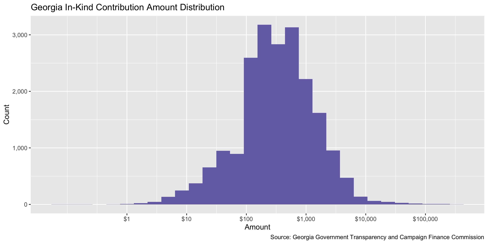
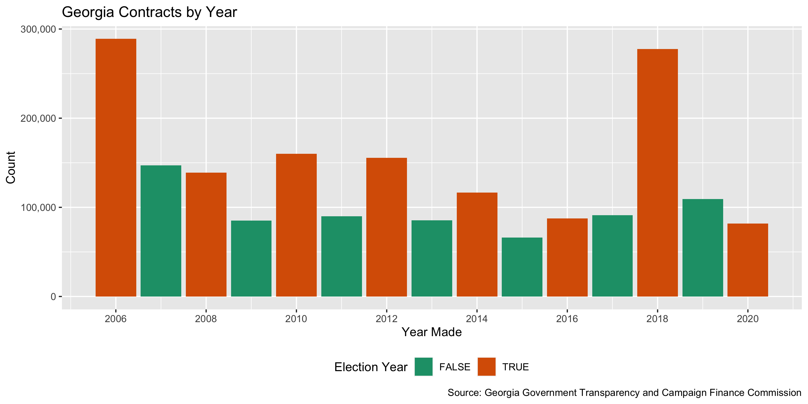
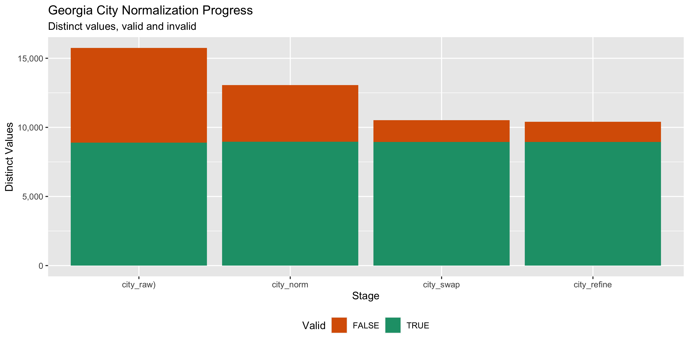

Georgia Contribution Data Diary
================
Yanqi Xu
2020-10-09 22:53:53

  - [Project](#project)
  - [Objectives](#objectives)
  - [Packages](#packages)
  - [Data](#data)
  - [Download](#download)
  - [Read](#read)
  - [Explore](#explore)
  - [Wrangle](#wrangle)
  - [Conclude](#conclude)
  - [Export](#export)
  - [Upload](#upload)
  - [Dictionary](#dictionary)

<!-- Place comments regarding knitting here -->

## Project

The Accountability Project is an effort to cut across data silos and
give journalists, policy professionals, activists, and the public at
large a simple way to search across huge volumes of public data about
people and organizations.

Our goal is to standardizing public data on a few key fields by thinking
of each dataset row as a transaction. For each transaction there should
be (at least) 3 variables:

1.  All **parties** to a transaction.
2.  The **date** of the transaction.
3.  The **amount** of money involved.

## Objectives

This document describes the process used to complete the following
objectives:

1.  How many records are in the database?
2.  Check for entirely duplicated records.
3.  Check ranges of continuous variables.
4.  Is there anything blank or missing?
5.  Check for consistency issues.
6.  Create a five-digit ZIP Code called `zip`.
7.  Create a `year` field from the transaction date.
8.  Make sure there is data on both parties to a transaction.

## Packages

The following packages are needed to collect, manipulate, visualize,
analyze, and communicate these results. The `pacman` package will
facilitate their installation and attachment.

The IRW’s `campfin` package will also have to be installed from GitHub.
This package contains functions custom made to help facilitate the
processing of campaign finance data.

``` r
if (!require("pacman")) install.packages("pacman")
pacman::p_load_gh("irworkshop/campfin")
pacman::p_load(
  tidyverse, # data manipulation
  lubridate, # datetime strings
  gluedown, # printing markdown
  magrittr, # pipe operators
  janitor, # clean data frames
  refinr, # cluster and merge
  scales, # format strings
  knitr, # knit documents
  vroom, # read files fast
  rvest, # html scraping
  glue, # combine strings
  here, # relative paths
  httr, # http requests
  fs # local storage 
)
```

This document should be run as part of the `R_campfin` project, which
lives as a sub-directory of the more general, language-agnostic
[`irworkshop/accountability_datacleaning`](https://github.com/irworkshop/accountability_datacleaning)
GitHub repository.

The `R_campfin` project uses the [RStudio
projects](https://support.rstudio.com/hc/en-us/articles/200526207-Using-Projects)
feature and should be run as such. The project also uses the dynamic
`here::here()` tool for file paths relative to *your* machine.

``` r
# where does this document knit?
here::here()
#> [1] "/Users/yanqixu/code/accountability_datacleaning/R_campfin"
```

## Data

## Download

Campaign contribution data is available from the [Georgia Ethics
Administration
Program](http://www.ethics.la.gov/CampaignFinanceSearch/SearchResultsByContributions.aspx).

We downloaded the data year by year since there’s a limit on the number
of rows at each export. The end date of this data is Oct 5, 2020 and the
next update should start on Oct 6, 2020.

``` r
raw_dir <- dir_create(here("ga", "contribs", "data", "raw"))
source <- "Georgia Government Transparency and Campaign Finance Commission"
```

## Read

More in formation about the types of forms that are filed can be found
on the Georgia Ethics Administration Program’s
[website](http://ethics.la.gov/CampFinanForms.aspx#CandidateForms).

``` r
read_ga_contrib <-  function(file){
df <- file %>% 
  read_lines(skip = 1) %>% 
  str_replace_all("(?<!(\n|^|,))\"(?!(,(?=\"))|$|\r)", "'") %>% 
  read_delim(
    delim = ",",
    escape_backslash = FALSE,
    escape_double = FALSE,
    col_names = read_names(file),
    col_types = cols(
      .default = col_character()
    )
  )
return(df)
}

gac <- dir_ls(raw_dir) %>% map_dfr(read_ga_contrib)

gac <- gac %>% 
  clean_names() %>% 
  mutate(date = date %>% as.Date(format = "%m/%d/%Y"))

gac <- gac %>% 
  mutate(across(ends_with("amount"), as.numeric))
```

## Explore

``` r
glimpse(gac)
#> Rows: 1,981,563
#> Columns: 22
#> $ filer_id              <chr> "C2006000061", "C2006000061", "C2006000061", "C2006000061", "C2006…
#> $ type                  <chr> "Monetary", "Monetary", "Monetary", "Monetary", "Monetary", "Monet…
#> $ last_name             <chr> "Raymon D Burns PC", "Wayne Lancaster, PC", "Lucas O Harsh, PC", "…
#> $ first_name            <chr> NA, NA, NA, NA, "Mike", NA, NA, "Pat", "James", "E.D.", NA, NA, NA…
#> $ address               <chr> "7 Lumpkin Street", "4474 Commerce Dr. Ste B", "Post Office Box 12…
#> $ city                  <chr> "Lawrenceville", "Buford", "Lawrenceville", "Grayson", "Atlanta", …
#> $ state                 <chr> "GA", "GA", "GA", "GA", "GA", "GA", "GA", "GA", "GA", "GA", "GA", …
#> $ zip                   <chr> "30045", "30518", "30046", "30017", "30324", "30263", "31534", "30…
#> $ pac                   <chr> "none", "none", "none", "none", NA, NA, NA, NA, NA, NA, NA, NA, NA…
#> $ occupation            <chr> NA, NA, NA, NA, "Attorney", NA, NA, "Heating & Air Conditioning Co…
#> $ employer              <chr> NA, NA, NA, NA, "self", NA, NA, "United Maintenance, Inc.", "James…
#> $ date                  <date> 2006-03-10, 2006-03-08, 2006-03-02, 2006-03-03, 2006-03-10, 2006-…
#> $ election              <chr> "Primary", "Primary", "Primary", "Primary", "Primary", " ", " ", "…
#> $ election_year         <chr> "2006", "2006", "2006", "2006", "2006", NA, NA, "2006", "2006", "2…
#> $ cash_amount           <dbl> 250.00, 250.00, 250.00, 500.00, 250.00, 25.00, 480.00, 100.00, 250…
#> $ in_kind_amount        <dbl> 0, 0, 0, 0, 0, 0, 0, 0, 0, 0, 0, 0, 0, 0, 0, 0, 0, 0, 0, 0, 0, 0, …
#> $ in_kind_description   <chr> NA, NA, NA, NA, NA, NA, NA, NA, NA, NA, NA, NA, NA, NA, NA, NA, NA…
#> $ candidate_first_name  <chr> "Thomas", "Thomas", "Thomas", "Thomas", "Thomas", NA, NA, NA, NA, …
#> $ candidate_middle_name <chr> "Ned", "Ned", "Ned", "Ned", "Ned", NA, NA, NA, NA, "Mary", "Mary",…
#> $ candidate_last_name   <chr> "Davis", "Davis", "Davis", "Davis", "Davis", NA, NA, NA, NA, "Nich…
#> $ candidate_suffix      <chr> "Jr.", "Jr.", "Jr.", "Jr.", "Jr.", NA, NA, NA, NA, NA, NA, NA, NA,…
#> $ committee_name        <chr> "The Committee for Judge Tom Davis", "The Committee for Judge Tom …
tail(gac)
#> # A tibble: 6 x 22
#>   filer_id type  last_name first_name address city  state zip   pac   occupation employer
#>   <chr>    <chr> <chr>     <chr>      <chr>   <chr> <chr> <chr> <chr> <chr>      <chr>   
#> 1 C202000… Mone… Harvey    Bruce      929 Cl… Atla… GA    3030… <NA>  Attorney   Self Em…
#> 2 C202000… Mone… Jacxsens… Pete A.    927 Ar… Atla… GA    30307 <NA>  Attorney   Hawkins…
#> 3 C202000… Mone… Mitchell… Greta      734 Be… Boli… IL    60490 <NA>  Administr… Proviso…
#> 4 C202000… Mone… Norman    Clorisa    2013 L… Kenn… ga    30152 <NA>  Consultant Unemplo…
#> 5 C202000… Mone… Rayasam   Ravindra   1936 N… Broo… ga    30319 <NA>  Attorney   Ghanaye…
#> 6 C202000… Mone… Riggins   Bruce      30 WAD… Macon ga    31210 <NA>  Owner      Ciceros…
#> # … with 11 more variables: date <date>, election <chr>, election_year <chr>, cash_amount <dbl>,
#> #   in_kind_amount <dbl>, in_kind_description <chr>, candidate_first_name <chr>,
#> #   candidate_middle_name <chr>, candidate_last_name <chr>, candidate_suffix <chr>,
#> #   committee_name <chr>
```

### Missing

``` r
col_stats(gac, count_na)
#> # A tibble: 22 x 4
#>    col                   class        n           p
#>    <chr>                 <chr>    <int>       <dbl>
#>  1 filer_id              <chr>        0 0          
#>  2 type                  <chr>        0 0          
#>  3 last_name             <chr>        3 0.00000151 
#>  4 first_name            <chr>   327959 0.166      
#>  5 address               <chr>       83 0.0000419  
#>  6 city                  <chr>       19 0.00000959 
#>  7 state                 <chr>      105 0.0000530  
#>  8 zip                   <chr>        1 0.000000505
#>  9 pac                   <chr>  1636912 0.826      
#> 10 occupation            <chr>   313101 0.158      
#> 11 employer              <chr>   316669 0.160      
#> 12 date                  <date>       0 0          
#> 13 election              <chr>   907552 0.458      
#> 14 election_year         <chr>   921573 0.465      
#> 15 cash_amount           <dbl>        0 0          
#> 16 in_kind_amount        <dbl>        0 0          
#> 17 in_kind_description   <chr>  1960899 0.990      
#> 18 candidate_first_name  <chr>  1208904 0.610      
#> 19 candidate_middle_name <chr>  1372980 0.693      
#> 20 candidate_last_name   <chr>  1208904 0.610      
#> 21 candidate_suffix      <chr>  1901439 0.960      
#> 22 committee_name        <chr>    52350 0.0264
```

We will flag entries with missing `last_name`,`candidate_name`, `city`
and `date`

``` r
gac <- gac %>% flag_na(last_name, city,date,committee_name)
sum(gac$na_flag)
#> [1] 52369
```

``` r
gac %>% 
  filter(na_flag) %>% 
  select(last_name, city,date,committee_name)
#> # A tibble: 52,369 x 4
#>    last_name                         city          date       committee_name
#>    <chr>                             <chr>         <date>     <chr>         
#>  1 Giannasi                          Athens        2006-03-27 <NA>          
#>  2 Hathaway                          Athens        2006-03-27 <NA>          
#>  3 Kardos                            Athens        2006-03-24 <NA>          
#>  4 Ball                              Athens        2006-03-02 <NA>          
#>  5 Outdoor Advertising Assoc. of Ga. Duluth        2006-01-04 <NA>          
#>  6 Strange                           The Woodlands 2006-03-16 <NA>          
#>  7 Abdur-Rahim                       Atlanta       2006-03-31 <NA>          
#>  8 Bierema                           Athens        2006-03-30 <NA>          
#>  9 Hicks                             Riverdale     2006-03-31 <NA>          
#> 10 Burton                            Athens        2006-03-22 <NA>          
#> # … with 52,359 more rows
```

### Duplicates

``` r
gac <- flag_dupes(gac,dplyr::everything())
sum(gac$dupe_flag)
#> [1] 65738
```

``` r
gac %>% 
  filter(dupe_flag)
#> # A tibble: 65,738 x 24
#>    filer_id type  last_name first_name address city  state zip   pac   occupation employer
#>    <chr>    <chr> <chr>     <chr>      <chr>   <chr> <chr> <chr> <chr> <chr>      <chr>   
#>  1 NC20060… Mone… The Howa… <NA>       1948 O… Tift… GA    31794 <NA>  <NA>       <NA>    
#>  2 NC20060… Mone… North At… <NA>       11975 … Alph… GA    30005 <NA>  <NA>       <NA>    
#>  3 C200600… Mone… WellCare  <NA>       P.O. B… Tampa FL    33622 <NA>  <NA>       <NA>    
#>  4 NC20060… Mone… Ruthann … <NA>       2000 1… Colu… GA    31901 <NA>  <NA>       <NA>    
#>  5 NC20060… Mone… North At… <NA>       1121 J… Atla… GA    30068 <NA>  <NA>       <NA>    
#>  6 NC20060… Mone… West Aug… <NA>       1126 M… Augu… GA    30909 <NA>  <NA>       <NA>    
#>  7 NC20060… Mone… Women's … <NA>       107 Hi… Rive… GA    30296 <NA>  <NA>       <NA>    
#>  8 C200600… Mone… Powell    Rex        4485 Y… Doug… GA    30135 <NA>  Construct… Chick-f…
#>  9 NC20060… Mone… Georgia … <NA>       5445 M… Atla… GA    30342 <NA>  <NA>       <NA>    
#> 10 NC20060… Mone… Camille … <NA>       95 Col… Atla… GA    30309 <NA>  <NA>       <NA>    
#> # … with 65,728 more rows, and 13 more variables: date <date>, election <chr>,
#> #   election_year <chr>, cash_amount <dbl>, in_kind_amount <dbl>, in_kind_description <chr>,
#> #   candidate_first_name <chr>, candidate_middle_name <chr>, candidate_last_name <chr>,
#> #   candidate_suffix <chr>, committee_name <chr>, na_flag <lgl>, dupe_flag <lgl>
```

### Categorical

``` r
col_stats(gac, n_distinct)
#> # A tibble: 24 x 4
#>    col                   class       n          p
#>    <chr>                 <chr>   <int>      <dbl>
#>  1 filer_id              <chr>    6838 0.00345   
#>  2 type                  <chr>       6 0.00000303
#>  3 last_name             <chr>  225311 0.114     
#>  4 first_name            <chr>   76082 0.0384    
#>  5 address               <chr>  490848 0.248     
#>  6 city                  <chr>   22700 0.0115    
#>  7 state                 <chr>     917 0.000463  
#>  8 zip                   <chr>  181736 0.0917    
#>  9 pac                   <chr>    4720 0.00238   
#> 10 occupation            <chr>   67767 0.0342    
#> 11 employer              <chr>  136424 0.0688    
#> 12 date                  <date>   5387 0.00272   
#> 13 election              <chr>      10 0.00000505
#> 14 election_year         <chr>      38 0.0000192 
#> 15 cash_amount           <dbl>   36325 0.0183    
#> 16 in_kind_amount        <dbl>    7443 0.00376   
#> 17 in_kind_description   <chr>   11001 0.00555   
#> 18 candidate_first_name  <chr>    1815 0.000916  
#> 19 candidate_middle_name <chr>    1480 0.000747  
#> 20 candidate_last_name   <chr>    2944 0.00149   
#> 21 candidate_suffix      <chr>      14 0.00000707
#> 22 committee_name        <chr>    4302 0.00217   
#> 23 na_flag               <lgl>       2 0.00000101
#> 24 dupe_flag             <lgl>       2 0.00000101
```

``` r
explore_plot(gac, type)
```

<!-- -->

### Amounts

Since there are two types of contributions, `in_kind_amount` and
`cash_amount`, we will add them up in a `total_amount` column in order
to map it on TAP.

``` r
gac <- gac %>% mutate(total_amount = cash_amount + in_kind_amount)

summary(gac$in_kind_amount)
#>     Min.  1st Qu.   Median     Mean  3rd Qu.     Max. 
#>      0.0      0.0      0.0     10.7      0.0 379603.2
summary(gac$cash_amount)
#>    Min. 1st Qu.  Median    Mean 3rd Qu.    Max. 
#>       0      21     100     447     250 6800000
mean(gac$in_kind_amount<= 0)
#> [1] 0.989586
mean(gac$cash_amount<= 0)
#> [1] 0.01042662
```

<!-- --><!-- -->

### Dates

We can add the calendar year from `date` with `lubridate::year()`

``` r
gac <- mutate(gac, year = year(date))
```

``` r
min(gac$date)
#> [1] "2006-01-01"
max(gac$date)
#> [1] "2020-10-05"
sum(gac$date > today())
#> [1] 0
```

<!-- -->

## Wrangle

To improve the searchability of the database, we will perform some
consistent, confident string normalization. For geographic variables
like city names and ZIP codes, the corresponding `campfin::normal_*()`
functions are tailor made to facilitate this process.

### Address

For the street `addresss` variable, the `campfin::normal_address()`
function will force consistence case, remove punctuation, and abbreviate
official USPS suffixes.

``` r
gac <- gac %>% 
  mutate(
    address_norm = normal_address(
      address = address,
      abbs = usps_street,
      na_rep = TRUE
    )
  )
```

``` r
gac %>% 
  select(contains("address")) %>% 
  distinct() %>% 
  sample_n(10)
#> # A tibble: 10 x 2
#>    address                         address_norm                  
#>    <chr>                           <chr>                         
#>  1 4146 Chadds Crossing, NE        4146 CHADDS XING NE           
#>  2 100 Galleria Parkway            100 GALLERIA PKWY             
#>  3 1800 Diagonal Road              1800 DIAGONAL RD              
#>  4 11241 HILLSBORO VICTOR          11241 HILLSBORO VICTOR        
#>  5 230 Cedar Circle                230 CEDAR CIR                 
#>  6 125 Britt Waters Road           125 BRITT WATERS RD           
#>  7 3344 Peachtree Rd. NE Unit 4104 3344 PEACHTREE RD NE UNIT 4104
#>  8 P. O. Box 612                   PO BOX 612                    
#>  9 1677 Terrel Ridge Dr., SE       1677 TERREL RDG DR SE         
#> 10 100 Emanuel Farm Rd             100 EMANUEL FARM RD
```

### ZIP

For ZIP codes, the `campfin::normal_zip()` function will attempt to
create valid *five* digit codes by removing the ZIP+4 suffix and
returning leading zeroes dropped by other programs like Microsoft Excel.

``` r
gac <- gac %>% 
  mutate(
    zip_norm = normal_zip(
      zip = zip,
      na_rep = TRUE
    )
  )
```

``` r
progress_table(
  gac$zip,
  gac$zip_norm,
  compare = valid_zip
)
#> # A tibble: 2 x 6
#>   stage    prop_in n_distinct     prop_na  n_out n_diff
#>   <chr>      <dbl>      <dbl>       <dbl>  <dbl>  <dbl>
#> 1 zip        0.555     181736 0.000000505 882592 167755
#> 2 zip_norm   0.999      19143 0.000608      2936    907
```

### State

Valid two digit state abbreviations can be made using the
`campfin::normal_state()` function.

``` r
gac <- gac %>% 
  mutate(
    state_norm = normal_state(
      state = state,
      abbreviate = TRUE,
      na_rep = TRUE,
      valid = valid_state
    )
  )
```

``` r
gac %>% 
  filter(state != state_norm) %>% 
  count(state, sort = TRUE)
#> # A tibble: 518 x 2
#>    state          n
#>    <chr>      <int>
#>  1 "Georgia"  25511
#>  2 "ga"       18507
#>  3 "Ga"       13949
#>  4 "georgia"   6013
#>  5 "GEORGIA"   5728
#>  6 "GA "       2197
#>  7 "gA"        1683
#>  8 "Georgia "  1131
#>  9 "Ga."        896
#> 10 "Florida"    437
#> # … with 508 more rows
```

``` r
progress_table(
  gac$state,
  gac$state_norm,
  compare = valid_state
)
#> # A tibble: 2 x 6
#>   stage      prop_in n_distinct   prop_na n_out n_diff
#>   <chr>        <dbl>      <dbl>     <dbl> <dbl>  <dbl>
#> 1 state        0.956        917 0.0000530 86346    859
#> 2 state_norm   1             58 0.00106       0      1
```

### City

Cities are the most difficult geographic variable to normalize, simply
due to the wide variety of valid cities and formats.

#### Normal

The `campfin::normal_city()` function is a good start, again converting
case, removing punctuation, but *expanding* USPS abbreviations. We can
also remove `invalid_city` values.

``` r
gac <- gac %>% 
  mutate(
    city_norm = normal_city(
      city = city, 
      abbs = usps_city,
      states = c("LA", "DC", "Georgia"),
      na = invalid_city,
      na_rep = TRUE
    )
  )
```

#### Swap

We can further improve normalization by comparing our normalized value
against the *expected* value for that record’s state abbreviation and
ZIP code. If the normalized value is either an abbreviation for or very
similar to the expected value, we can confidently swap those two.

``` r
gac <- gac %>% 
  rename(city_raw = city) %>% 
  left_join(
    y = zipcodes,
    by = c(
      "state_norm" = "state",
      "zip_norm" = "zip"
    )
  ) %>% 
  rename(city_match = city) %>% 
  mutate(
    match_abb = is_abbrev(city_norm, city_match),
    match_dist = str_dist(city_norm, city_match),
    city_swap = if_else(
      condition = !is.na(match_dist) & (match_abb | match_dist == 1),
      true = city_match,
      false = city_norm
    )
  ) %>% 
  select(
    -city_match,
    -match_dist,
    -match_abb
  )
```

#### Refine

The [OpenRefine](https://openrefine.org/) algorithms can be used to
group similar strings and replace the less common versions with their
most common counterpart. This can greatly reduce inconsistency, but with
low confidence; we will only keep any refined strings that have a valid
city/state/zip combination.

``` r
good_refine <- gac %>% 
  mutate(
    city_refine = city_swap %>% 
      key_collision_merge() %>% 
      n_gram_merge(numgram = 1)
  ) %>% 
  filter(city_refine != city_swap) %>% 
  inner_join(
    y = zipcodes,
    by = c(
      "city_refine" = "city",
      "state_norm" = "state",
      "zip_norm" = "zip"
    )
  )
```

    #> # A tibble: 148 x 5
    #>    state_norm zip_norm city_swap        city_refine            n
    #>    <chr>      <chr>    <chr>            <chr>              <int>
    #>  1 OH         45206    CINCINATTI       CINCINNATI            36
    #>  2 IL         60010    NO BARRINGTON    BARRINGTON            24
    #>  3 IN         47119    FLOYD KNOBBS     FLOYDS KNOBS          15
    #>  4 OH         45209    CINCINATTI       CINCINNATI            13
    #>  5 NY         11746    HUNTINGTON SAINT HUNTINGTON STATION     9
    #>  6 WI         54702    EAU CLAIRE RI    EAU CLAIRE             9
    #>  7 GA         30080    SMRNYA           SMYRNA                 6
    #>  8 GA         30144    KENNNESSAW       KENNESAW               6
    #>  9 GA         31561    SEA ISLAND CO    SEA ISLAND             6
    #> 10 SC         29406    NORTH CHARLESTON CHARLESTON             5
    #> # … with 138 more rows

Then we can join the refined values back to the database.

``` r
gac <- gac %>% 
  left_join(good_refine) %>% 
  mutate(city_refine = coalesce(city_refine, city_swap))
```

#### Progress

| stage        | prop\_in | n\_distinct | prop\_na | n\_out | n\_diff |
| :----------- | -------: | ----------: | -------: | -----: | ------: |
| city\_raw)   |    0.967 |       15741 |    0.000 |  64886 |    6848 |
| city\_norm   |    0.987 |       13053 |    0.001 |  26292 |    4094 |
| city\_swap   |    0.995 |       10516 |    0.001 |  10600 |    1575 |
| city\_refine |    0.995 |       10397 |    0.001 |  10288 |    1457 |

You can see how the percentage of valid values increased with each
stage.

<!-- -->

More importantly, the number of distinct values decreased each stage. We
were able to confidently change many distinct invalid values to their
valid equivalent.

<!-- -->

## Conclude

Before exporting, we can remove the intermediary normalization columns
and rename all added variables with the `_clean` suffix.

``` r
gac <- gac %>% 
  select(
    -city_norm,
    -city_swap,
     city_clean = city_refine
  ) %>% 
  rename_all(~str_replace(., "_norm", "_clean")) %>% 
  rename_all(~str_remove(., "_raw"))
```

``` r
glimpse(sample_n(gac, 20))
#> Rows: 20
#> Columns: 30
#> $ filer_id              <chr> "NC2006000172", "NC2006000336", "NC2010000071", "NC2006000063", "C…
#> $ type                  <chr> "Monetary", "Monetary", "Monetary", "Monetary", "Monetary", "Monet…
#> $ last_name             <chr> "KREMER", "Arnold", "Kulprathipanja", "PetroSouth, Inc", "Moon", "…
#> $ first_name            <chr> "SCOTT", "Jimmy", "Santi", NA, "W. Harold", "GREGORY", "Stacey J."…
#> $ address               <chr> "1526 HERITAGE MANOR COURT", "152 N Crest Blvd Ste A", "101 Consti…
#> $ city                  <chr> "SAINT PETERS", "Macon", "Washington", "Griffin", "Augusta", "BATA…
#> $ state                 <chr> "MO", "GA", "DC", "GA", "GA", "IL", "GA", "GA", "GA", "OK", "FL", …
#> $ zip                   <chr> "633038484", "31210-1847", "20001", "30224", "30909", "60510", "30…
#> $ pac                   <chr> NA, NA, "HONEYWELL INTERNATIONAL POLITICAL ACTION COMMITTEE", NA, …
#> $ occupation            <chr> "COMPLEX SALES MANAGER", "Endodontics", "Director, R&D", NA, "Reti…
#> $ employer              <chr> "INTERNATIONAL PAPER CO.", "Self Employed", "HONEYWELL INTERNATION…
#> $ date                  <date> 2018-05-31, 2016-06-01, 2018-12-31, 2016-04-15, 2018-07-08, 2012-…
#> $ election              <chr> NA, "General", NA, "General", "General", NA, "Primary", NA, "Prima…
#> $ election_year         <chr> NA, "2016", NA, "2016", "2018", NA, "2016", NA, "2012", NA, NA, NA…
#> $ cash_amount           <dbl> 30.00, 160.00, 155.20, 300.00, 100.00, 150.00, 500.00, 200.00, 0.0…
#> $ in_kind_amount        <dbl> 0, 0, 0, 0, 0, 0, 0, 0, 200, 0, 0, 0, 0, 0, 0, 0, 0, 0, 0, 0
#> $ in_kind_description   <chr> NA, NA, NA, NA, NA, NA, NA, NA, "Lumber for signs", NA, NA, NA, NA…
#> $ candidate_first_name  <chr> NA, NA, NA, NA, "John", NA, "Stacey", NA, "Frederick", NA, NA, NA,…
#> $ candidate_middle_name <chr> NA, NA, NA, NA, "Jenkins ", NA, "Yvonne", NA, "Clinton", NA, NA, N…
#> $ candidate_last_name   <chr> NA, NA, NA, NA, "Barrow", NA, "Abrams", NA, "Roden", NA, NA, NA, N…
#> $ candidate_suffix      <chr> NA, NA, NA, NA, NA, NA, NA, NA, "Jr.", NA, NA, NA, NA, NA, NA, NA,…
#> $ committee_name        <chr> "International Paper PAC (IP PAC)", "Georgia Dental Political Acti…
#> $ na_flag               <lgl> FALSE, FALSE, FALSE, FALSE, FALSE, FALSE, FALSE, FALSE, TRUE, FALS…
#> $ dupe_flag             <lgl> FALSE, FALSE, FALSE, FALSE, FALSE, FALSE, FALSE, FALSE, FALSE, FAL…
#> $ total_amount          <dbl> 30.00, 160.00, 155.20, 300.00, 100.00, 150.00, 500.00, 200.00, 200…
#> $ year                  <dbl> 2018, 2016, 2018, 2016, 2018, 2012, 2016, 2019, 2012, 2010, 2011, …
#> $ address_clean         <chr> "1526 HERITAGE MNR CT", "152 N CRST BLVD STE A", "101 CONSTITUTION…
#> $ zip_clean             <chr> "63303", "31210", "20001", "30224", "30909", "60510", "30329", "30…
#> $ state_clean           <chr> "MO", "GA", "DC", "GA", "GA", "IL", "GA", "GA", "GA", "OK", "FL", …
#> $ city_clean            <chr> "SAINT PETERS", "MACON", "WASHINGTON", "GRIFFIN", "AUGUSTA", "BATA…
```

1.  There are 1,981,569 records in the database.
2.  There are 65,744 duplicate records in the database.
3.  The range and distribution of `amount` and `date` seem reasonable.
4.  There are 52,369 records missing key variables.
5.  Consistency in geographic data has been improved with
    `campfin::normal_*()`.
6.  The 4-digit `year` variable has been created with
    `lubridate::year()`.

## Export

Now the file can be saved on disk for upload to the Accountability
server.

``` r
clean_dir <- dir_create(here("ga", "contribs", "data", "clean"))
clean_path <- path(clean_dir, "ga_contribs_clean.csv")
write_csv(gac, clean_path, na = "")
file_size(clean_path)
#> 467M
file_encoding(clean_path)
#> # A tibble: 1 x 3
#>   path                                                                                mime  charset
#>   <fs::path>                                                                          <chr> <chr>  
#> 1 /Users/yanqixu/code/accountability_datacleaning/R_campfin/ga/contribs/data/clean/g… <NA>  <NA>
```

## Upload

Using the `aws.s3` package, we can upload the file to the IRW server.

``` r
s3_path <- path("csv", basename(clean_path))
put_object(
  file = clean_path,
  object = s3_path, 
  bucket = "publicaccountability",
  acl = "public-read",
  multipart = TRUE,
  show_progress = TRUE
)
as_fs_bytes(object_size(s3_path, "publicaccountability"))
```

## Dictionary

The following table describes the variables in our final exported file:

| Column                  | Type        | Definition                                  |
| :---------------------- | :---------- | :------------------------------------------ |
| `filer_id`              | `character` | ID of filer                                 |
| `type`                  | `character` | Contribution method                         |
| `last_name`             | `character` | Last name of filer                          |
| `first_name`            | `character` | First name of filer                         |
| `address`               | `character` | Contributor street address                  |
| `city`                  | `character` | Contributor city name                       |
| `state`                 | `character` | Contributor state abbreviation              |
| `zip`                   | `character` | Contributor ZIP+4 code                      |
| `pac`                   | `character` | PAC                                         |
| `occupation`            | `character` | Contributor occupation                      |
| `employer`              | `character` | Contributor employer                        |
| `date`                  | `double`    | Date contribution was made                  |
| `election`              | `character` | Election type                               |
| `election_year`         | `character` | Election cycle                              |
| `cash_amount`           | `double`    | Contribution amount or correction in cash   |
| `in_kind_amount`        | `double`    | In-kind contribution amount or correction   |
| `in_kind_description`   | `character` | Description of in-kind contribution         |
| `candidate_first_name`  | `character` | Candidate first name                        |
| `candidate_middle_name` | `character` | Candidate middle name                       |
| `candidate_last_name`   | `character` | Candidate last name                         |
| `candidate_suffix`      | `character` | Candidate suffix                            |
| `committee_name`        | `character` | Committee name                              |
| `na_flag`               | `logical`   | Flag for missing name, city or address      |
| `dupe_flag`             | `logical`   | Flag for completely duplicated record       |
| `total_amount`          | `double`    | Sum of in-kind and cash contribution amount |
| `year`                  | `double`    | Calendar year of contribution date          |
| `address_clean`         | `character` | Normalized combined street address          |
| `zip_clean`             | `character` | Normalized 5-digit ZIP code                 |
| `state_clean`           | `character` | Normalized 2-digit state abbreviation       |
| `city_clean`            | `character` | Normalized city name                        |

``` r
write_lines(
  x = c("# Georgia Contributions Data Dictionary\n", dict_md),
  path = here("ga", "contribs", "ga_contribs_dict.md"),
)
```
