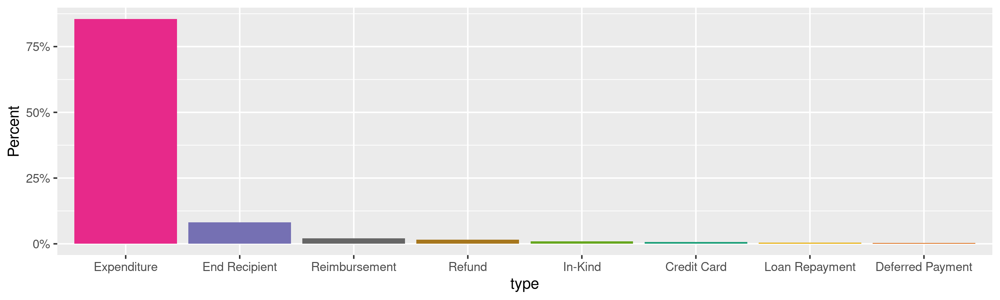
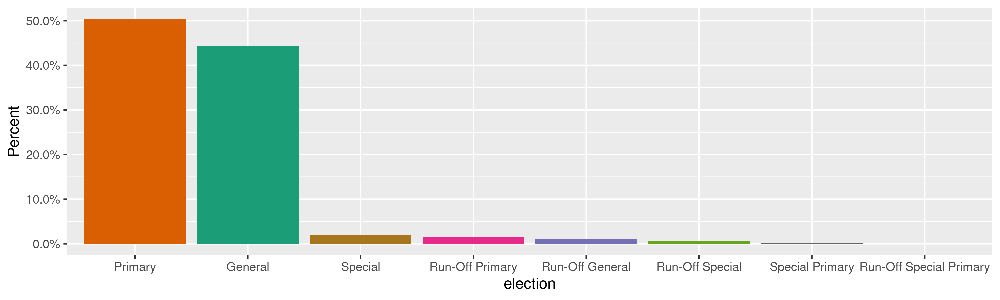
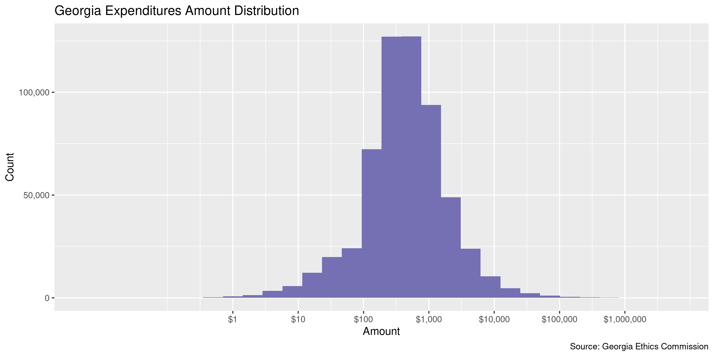
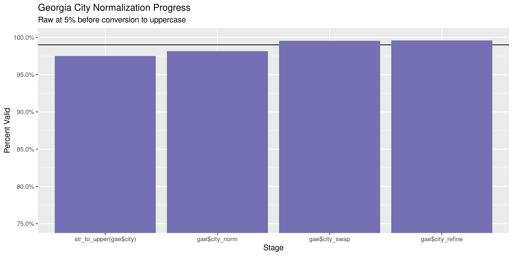

Georgia Expenditures
================
Kiernan Nicholls
Tue Mar 15 13:31:33 2022

-   [Project](#project)
-   [Objectives](#objectives)
-   [Packages](#packages)
-   [Source](#source)
-   [Download](#download)
-   [Read](#read)
-   [Explore](#explore)
    -   [Missing](#missing)
    -   [Duplicates](#duplicates)
    -   [Categorical](#categorical)
    -   [Amounts](#amounts)
    -   [Dates](#dates)
-   [Wrangle](#wrangle)
    -   [Address](#address)
    -   [ZIP](#zip)
    -   [State](#state)
    -   [City](#city)
-   [Conclude](#conclude)
-   [Export](#export)
-   [Upload](#upload)

<!-- Place comments regarding knitting here -->

## Project

The Accountability Project is an effort to cut across data silos and
give journalists, policy professionals, activists, and the public at
large a simple way to search across huge volumes of public data about
people and organizations.

Our goal is to standardize public data on a few key fields by thinking
of each dataset row as a transaction. For each transaction there should
be (at least) 3 variables:

1.  All **parties** to a transaction.
2.  The **date** of the transaction.
3.  The **amount** of money involved.

## Objectives

This document describes the process used to complete the following
objectives:

1.  How many records are in the database?
2.  Check for entirely duplicated records.
3.  Check ranges of continuous variables.
4.  Is there anything blank or missing?
5.  Check for consistency issues.
6.  Create a five-digit ZIP Code called `zip`.
7.  Create a `year` field from the transaction date.
8.  Make sure there is data on both parties to a transaction.

## Packages

The following packages are needed to collect, manipulate, visualize,
analyze, and communicate these results. The `pacman` package will
facilitate their installation and attachment.

``` r
if (!require("pacman")) {
  install.packages("pacman")
}
pacman::p_load(
  tidyverse, # data manipulation
  lubridate, # datetime strings
  gluedown, # printing markdown
  janitor, # clean data frames
  campfin, # custom irw tools
  aws.s3, # aws cloud storage
  refinr, # cluster & merge
  scales, # format strings
  knitr, # knit documents
  vroom, # fast reading
  rvest, # scrape html
  glue, # code strings
  here, # project paths
  httr, # http requests
  fs # local storage 
)
```

This diary was run using `campfin` version 1.0.8.9201.

``` r
packageVersion("campfin")
#> [1] '1.0.8.9201'
```

This document should be run as part of the `R_tap` project, which lives
as a sub-directory of the more general, language-agnostic
[`irworkshop/accountability_datacleaning`](https://github.com/irworkshop/accountability_datacleaning)
GitHub repository.

The `R_tap` project uses the [RStudio
projects](https://support.rstudio.com/hc/en-us/articles/200526207-Using-Projects)
feature and should be run as such. The project also uses the dynamic
`here::here()` tool for file paths relative to *your* machine.

``` r
# where does this document knit?
here::i_am("ga/expends/docs/ga_expends_diary.Rmd")
```

## Source

Georgia expenditures data can be obtained from the [Georgia Government
Transparency & Campaign Finance Commission](https://ethics.ga.gov/),
which operates a
[search](https://media.ethics.ga.gov/search/Campaign/Campaign_ByExpenditures.aspx).

## Download

We can replicate the process of searching for expenditures in a separate
script.

``` r
source("ga/expends/docs/ga_expend_scrape.R")
```

## Read

The files exported from the search portal can most easily be read as
HTML files.

``` r
read_html_table <- function(file) {
  x <- read_html(file)
  html_table(
    x = html_element(x, "table"),
    header = TRUE,
    na.strings = ""
  )
}
```

We will read together all the HTML files exported by our script.

``` r
raw_dir <- here("ga", "expends", "data", "raw")
raw_xls <- dir_ls(raw_dir, glob = "*.xls")
gae <- map_df(raw_xls, read_html_table)
```

``` r
gae <- clean_names(gae, case = "snake")
```

``` r
gae$date <- parse_date(gae$date, "%m/%d/%Y %H:%M:%S %p")
```

## Explore

There are 640,333 rows of 22 columns. Each record represents a single
expenditure made from a campaign to a vendor.

``` r
glimpse(gae)
#> Rows: 640,333
#> Columns: 22
#> $ filer_id               <chr> "NC2006000060", "NC2006000202", "C2006000303", "C2006000303", "C2006000303", "C20060003…
#> $ key                    <int> 1, 6, 3, 4, 5, 6, 7, 8, 1, 9, 10, 1, 2, 3, 11, 12, 13, 14, 28, 1, 2, 1, 2, 3, 4, 5, 6, …
#> $ ref                    <int> 1, 6, 3, 4, 5, 6, 7, 8, 1, 9, 10, 1, 2, 3, 11, 12, 13, 14, 28, 1, 2, 1, 2, 3, 4, 5, 6, …
#> $ type                   <chr> "Expenditure", "Expenditure", "Expenditure", "Expenditure", "Expenditure", "Expenditure…
#> $ last_name              <chr> "Perdue", "CROTTS", "Wal Mart", "Clayton County Branch NAACP", "CBCCCC", "CBCCCC", "Sin…
#> $ first_name             <chr> "Sonny", "MIKE", NA, NA, NA, NA, "Sonna", NA, NA, NA, NA, NA, NA, NA, "Kathy", "Melanie…
#> $ address                <chr> "PO Box 12369", "3295 EBENEZER RD", "7050 Hwy 85", "P O Box 1949", "P O Box 962571", "P…
#> $ city                   <chr> "Atlanta", "CONYERS", "Riverdale", "Jonesboro", "Riverdale", "Riverdale", "Rex", "Conle…
#> $ state                  <chr> "GA", "GA", "GA", "GA", "GA", "GA", "GA", "GA", "GA", "GA", "GA", "GA", "GA", "GA", "GA…
#> $ zip                    <chr> "30355", "30094", "30274", "30237", "30296", "30296", "30273", "30288", "31202", "30311…
#> $ occupation_or_employer <chr> "Governor of State of Georgia", "COMMERCIAL RE", NA, NA, NA, NA, "Clayton County Justic…
#> $ date                   <date> 2006-01-05, 2006-03-15, 2006-01-15, 2006-01-18, 2006-01-18, 2006-01-18, 2006-01-05, 20…
#> $ purpose                <chr> "Campaign contribution", "CAMPAIGN CONTRIBUTION", "Parade Candy", "Contribution", "MLK …
#> $ paid                   <dbl> 2000.00, 2000.00, 27.44, 100.00, 15.00, 50.00, 100.00, 200.00, 21.30, 200.00, 500.00, 1…
#> $ other                  <dbl> 0, 0, 0, 0, 0, 0, 0, 0, 0, 0, 0, 0, 0, 0, 0, 0, 0, 0, 0, 0, 0, 0, 0, 0, 0, 0, 0, 0, 0, …
#> $ election               <chr> "Primary", NA, "Primary", "Primary", "Primary", "Primary", "Primary", "Primary", "Prima…
#> $ election_year          <int> 2006, NA, 2006, 2006, 2006, 2006, 2006, 2006, 2006, 2006, 2006, 2006, 2006, 2006, 2006,…
#> $ candidate_first_name   <chr> NA, NA, "Valencia", "Valencia", "Valencia", "Valencia", "Valencia", "Valencia", "Margar…
#> $ candidate_middle_name  <chr> NA, NA, NA, NA, NA, NA, NA, NA, "Mary", NA, NA, "Marvin", "Marvin", "Marvin", NA, NA, N…
#> $ candidate_last_name    <chr> NA, NA, "Seay", "Seay", "Seay", "Seay", "Seay", "Seay", "Nichols", "Seay", "Seay", "Cru…
#> $ candidate_suffix       <chr> NA, NA, NA, NA, NA, NA, NA, NA, NA, NA, NA, NA, NA, NA, NA, NA, NA, NA, NA, NA, NA, NA,…
#> $ committee_name         <chr> "Delta-PAC", "Independent Insurance Agents of Georgia IPAC", "Seay for Senate", "Seay f…
tail(gae)
#> # A tibble: 6 × 22
#>   filer_id     key   ref type  last_name first_name address city  state zip   occupation_or_e… date       purpose   paid
#>   <chr>      <int> <int> <chr> <chr>     <chr>      <chr>   <chr> <chr> <chr> <chr>            <date>     <chr>    <dbl>
#> 1 C20210000…    95    95 Expe… HI-TECH … <NA>       1018 N… ROME  GA    30165 <NA>             2022-01-14 SIGNS   1872. 
#> 2 C20210000…    27    27 Refu… Dowless   David      332 Ba… Athe… GA    3060… Computer Progra… 2022-01-27 Refund…   51.8
#> 3 C20210000…    33    33 Expe… Dreambas… <NA>       2627 E… Visa… CA    9329… <NA>             2022-01-28 Data m…  495  
#> 4 C20210000…    38    38 Expe… Hyatt Ho… <NA>       1268 B… Augu… GA    3090… <NA>             2022-01-30 Lodging  329. 
#> 5 C20150013…     5     5 Expe… ANEDOT    <NA>       PO BOX… BATO… LA    70884 <NA>             2022-01-31 CREDIT…  144. 
#> 6 C20150013…     9     9 Expe… CENTRAL … <NA>       511 15… AUGU… GA    30901 <NA>             2022-01-18 FUNDRA… 2500  
#> # … with 8 more variables: other <dbl>, election <chr>, election_year <int>, candidate_first_name <chr>,
#> #   candidate_middle_name <chr>, candidate_last_name <chr>, candidate_suffix <chr>, committee_name <chr>
```

### Missing

Columns vary in their degree of missing values.

``` r
col_stats(gae, count_na)
#> # A tibble: 22 × 4
#>    col                    class       n         p
#>    <chr>                  <chr>   <int>     <dbl>
#>  1 filer_id               <chr>       0 0        
#>  2 key                    <int>       0 0        
#>  3 ref                    <int>       0 0        
#>  4 type                   <chr>       0 0        
#>  5 last_name              <chr>      17 0.0000265
#>  6 first_name             <chr>  498276 0.778    
#>  7 address                <chr>     680 0.00106  
#>  8 city                   <chr>      25 0.0000390
#>  9 state                  <chr>    3690 0.00576  
#> 10 zip                    <chr>      78 0.000122 
#> 11 occupation_or_employer <chr>  491155 0.767    
#> 12 date                   <date>      0 0        
#> 13 purpose                <chr>    3243 0.00506  
#> 14 paid                   <dbl>       0 0        
#> 15 other                  <dbl>       0 0        
#> 16 election               <chr>   89420 0.140    
#> 17 election_year          <int>   99483 0.155    
#> 18 candidate_first_name   <chr>  230651 0.360    
#> 19 candidate_middle_name  <chr>  331830 0.518    
#> 20 candidate_last_name    <chr>  230651 0.360    
#> 21 candidate_suffix       <chr>  588987 0.920    
#> 22 committee_name         <chr>   45829 0.0716
```

We can flag any record missing a key variable needed to identify a
transaction.

``` r
gae <- mutate(gae, name_any = coalesce(committee_name, candidate_last_name))
key_vars <- c("date", "last_name", "paid", "name_any")
gae <- flag_na(gae, all_of(key_vars))
sum(gae$na_flag)
#> [1] 17
```

``` r
gae %>% 
  filter(na_flag) %>% 
  select(all_of(key_vars))
#> # A tibble: 17 × 4
#>    date       last_name  paid name_any                       
#>    <date>     <chr>     <dbl> <chr>                          
#>  1 2008-06-17 <NA>       275  Sheila Jones Election Committee
#>  2 2008-04-08 <NA>       208. Sheila Jones Election Committee
#>  3 2008-05-09 <NA>       208. Sheila Jones Election Committee
#>  4 2008-06-17 <NA>       208. Sheila Jones Election Committee
#>  5 2008-07-10 <NA>       285  Sheila Jones Election Committee
#>  6 2008-10-25 <NA>       125  Sheila Jones Election Committee
#>  7 2009-12-15 <NA>      1167. Sheila Jones Election Committee
#>  8 2012-05-14 <NA>       800  Sheila Jones Election Committee
#>  9 2012-05-22 <NA>       400  Sheila Jones Election Committee
#> 10 2013-08-28 <NA>       207  Clarke                         
#> 11 2013-10-12 <NA>        75  Clarke                         
#> 12 2013-08-30 <NA>         0  Wexel-Tice                     
#> 13 2013-11-08 <NA>       161. Cox                            
#> 14 2014-10-21 <NA>       800  Sheila Jones Election Committee
#> 15 2018-02-12 <NA>      3191. Sheila Jones Election Committee
#> 16 2018-11-06 <NA>       300  Sheila Jones Election Committee
#> 17 2020-02-28 <NA>       300  Sheila Jones Election Committee
```

``` r
gae <- select(gae, -name_any)
key_vars[length(key_vars)] <- "committee_name"
```

### Duplicates

We can also flag any record completely duplicated across every column.

``` r
gae <- flag_dupes(gae, everything())
sum(gae$dupe_flag)
#> [1] 9031
```

``` r
gae %>% 
  filter(dupe_flag) %>% 
  count(date, last_name, paid, committee_name, sort = TRUE)
#> # A tibble: 4,199 × 5
#>    date       last_name          paid committee_name                     n
#>    <date>     <chr>             <dbl> <chr>                          <int>
#>  1 2020-12-18 Chick Fil A           0 Georgia Republican Party, Inc.    22
#>  2 2020-10-30 Chick Fil A           0 Georgia Republican Party, Inc.    14
#>  3 2020-12-18 Zaxby''s              0 Georgia Republican Party, Inc.    12
#>  4 2020-12-21 Zaxby''s              0 Georgia Republican Party, Inc.    12
#>  5 2020-10-30 Kroger                0 Georgia Republican Party, Inc.    10
#>  6 2020-12-18 Delta Airlines        0 Georgia Republican Party, Inc.    10
#>  7 2020-12-18 Quick Trip            0 Georgia Republican Party, Inc.    10
#>  8 2020-12-18 Uber                  0 Georgia Republican Party, Inc.    10
#>  9 2020-12-31 Synovus Bank         18 Georgia Republican Party, Inc.    10
#> 10 2010-07-07 PBI Postage Meter   300 Porter for Georgia                 8
#> # … with 4,189 more rows
```

### Categorical

``` r
col_stats(gae, n_distinct)
#> # A tibble: 24 × 4
#>    col                    class       n          p
#>    <chr>                  <chr>   <int>      <dbl>
#>  1 filer_id               <chr>    7805 0.0122    
#>  2 key                    <int>   56564 0.0883    
#>  3 ref                    <int>   47097 0.0736    
#>  4 type                   <chr>      11 0.0000172 
#>  5 last_name              <chr>  124344 0.194     
#>  6 first_name             <chr>   12428 0.0194    
#>  7 address                <chr>  145629 0.227     
#>  8 city                   <chr>    9246 0.0144    
#>  9 state                  <chr>      84 0.000131  
#> 10 zip                    <chr>   26788 0.0418    
#> 11 occupation_or_employer <chr>   13071 0.0204    
#> 12 date                   <date>   5883 0.00919   
#> 13 purpose                <chr>  115088 0.180     
#> 14 paid                   <dbl>   92045 0.144     
#> 15 other                  <dbl>   22206 0.0347    
#> 16 election               <chr>       9 0.0000141 
#> 17 election_year          <int>      45 0.0000703 
#> 18 candidate_first_name   <chr>    1752 0.00274   
#> 19 candidate_middle_name  <chr>    1525 0.00238   
#> 20 candidate_last_name    <chr>    3167 0.00495   
#> 21 candidate_suffix       <chr>      11 0.0000172 
#> 22 committee_name         <chr>    4571 0.00714   
#> 23 na_flag                <lgl>       2 0.00000312
#> 24 dupe_flag              <lgl>       2 0.00000312
```

<!-- --><!-- -->

### Amounts

There are two columns referring to amounts. When the `paid` column is 0
then the `other` column contains some amount.

``` r
mean(gae$paid[gae$other != 0] == 0)
#> [1] 1
mean(gae$other[gae$paid != 0] == 0)
#> [1] 1
mean(gae$other[gae$paid == 0] == 0)
#> [1] 0.002018079
```

``` r
gae <- mutate(gae, across(c(paid, other), na_if, 0))
```

``` r
# fix floating point precision
gae$paid <- round(gae$paid, digits = 2)
```

``` r
summary(gae$paid)
#>    Min. 1st Qu.  Median    Mean 3rd Qu.    Max.    NA's 
#>       0     200     471    2200    1000 6265535   59958
mean(gae$paid < 0, na.rm = TRUE)
#> [1] 0
```

These are the records with the minimum and maximum amounts.

``` r
glimpse(gae[c(which.max(gae$paid), which.min(gae$paid)), ])
#> Rows: 2
#> Columns: 24
#> $ filer_id               <chr> "NC2018000098", "C2006000745"
#> $ key                    <int> 62, 1
#> $ ref                    <int> 62, 1
#> $ type                   <chr> "Expenditure", "Refund"
#> $ last_name              <chr> "AL Media LLC", "Porter"
#> $ first_name             <chr> NA, "Lyle K."
#> $ address                <chr> "222 W Ontario St", "368 South Perry Street"
#> $ city                   <chr> "Chicago", "Lawrenceville"
#> $ state                  <chr> "IL", "GA"
#> $ zip                    <chr> "60654-3655", "30045"
#> $ occupation_or_employer <chr> NA, "Attorney"
#> $ date                   <date> 2020-11-20, 2008-09-28
#> $ purpose                <chr> "TV Ad Buy", "refund"
#> $ paid                   <dbl> 6265535.00, 0.01
#> $ other                  <dbl> NA, NA
#> $ election               <chr> "Run-Off General", "General"
#> $ election_year          <int> 2020, 2008
#> $ candidate_first_name   <chr> NA, "Melodie"
#> $ candidate_middle_name  <chr> NA, "Snell"
#> $ candidate_last_name    <chr> NA, "Conner"
#> $ candidate_suffix       <chr> NA, NA
#> $ committee_name         <chr> "Fair Fight", "Committee to Elect Melodie Snell Conner"
#> $ na_flag                <lgl> FALSE, FALSE
#> $ dupe_flag              <lgl> TRUE, FALSE
```

The distribution of amount values are typically log-normal.

<!-- -->

### Dates

We can add the calendar year from `date` with `lubridate::year()`

``` r
gae <- mutate(gae, year = year(date))
```

``` r
min(gae$date)
#> [1] "2006-01-01"
sum(gae$year < 2000)
#> [1] 0
max(gae$date)
#> [1] "2022-12-14"
sum(gae$date > today())
#> [1] 7
```

It’s common to see an increase in the number of expenditure in elections
years.

<!-- -->

## Wrangle

To improve the searchability of the database, we will perform some
consistent, confident string normalization. For geographic variables
like city names and ZIP codes, the corresponding `campfin::normal_*()`
functions are tailor made to facilitate this process.

### Address

For the street `addresss` variable, the `campfin::normal_address()`
function will force consistence case, remove punctuation, and abbreviate
official USPS suffixes.

``` r
addr_norm <- gae %>% 
  distinct(address) %>% 
  mutate(
    address_norm = normal_address(
      address = address,
      abbs = usps_street,
      na_rep = TRUE
    )
  )
```

``` r
addr_norm
#> # A tibble: 145,629 × 2
#>    address                 address_norm          
#>    <chr>                   <chr>                 
#>  1 PO Box 12369            PO BOX 12369          
#>  2 3295 EBENEZER RD        3295 EBENEZER RD      
#>  3 7050 Hwy 85             7050 HWY 85           
#>  4 P O Box 1949            PO BOX 1949           
#>  5 P O Box 962571          PO BOX 962571         
#>  6 6091 Katherine Rd.      6091 KATHERINE RD     
#>  7 P O Box 99990           PO BOX 99990          
#>  8 P O Box 1936            PO BOX 1936           
#>  9 P O Box 4232            PO BOX 4232           
#> 10 1100 Spring St. STE 710 1100 SPRING ST STE 710
#> # … with 145,619 more rows
```

``` r
gae <- left_join(gae, addr_norm, by = "address")
```

### ZIP

For ZIP codes, the `campfin::normal_zip()` function will attempt to
create valid *five* digit codes by removing the ZIP+4 suffix and
returning leading zeroes dropped by other programs like Microsoft Excel.

``` r
gae <- gae %>% 
  mutate(
    zip_norm = normal_zip(
      zip = zip,
      na_rep = TRUE
    )
  )
```

``` r
progress_table(
  gae$zip,
  gae$zip_norm,
  compare = valid_zip
)
#> # A tibble: 2 × 6
#>   stage        prop_in n_distinct  prop_na  n_out n_diff
#>   <chr>          <dbl>      <dbl>    <dbl>  <dbl>  <dbl>
#> 1 gae$zip        0.800      26788 0.000122 128327  19458
#> 2 gae$zip_norm   0.996       9428 0.00294    2622    793
```

### State

Valid two digit state abbreviations can be made using the
`campfin::normal_state()` function.

``` r
gae <- gae %>% 
  mutate(
    state_norm = normal_state(
      state = state,
      abbreviate = TRUE,
      na_rep = TRUE,
      valid = valid_state
    )
  )
```

``` r
gae %>% 
  filter(state != state_norm) %>% 
  count(state, state_norm, sort = TRUE)
#> # A tibble: 10 × 3
#>    state   state_norm     n
#>    <chr>   <chr>      <int>
#>  1 Ga      GA          2720
#>  2 ga      GA             9
#>  3 Co      CO             8
#>  4 Ar      AR             6
#>  5 GEORGIA GA             5
#>  6 Il      IL             2
#>  7 Ma      MA             2
#>  8 Wa      WA             2
#>  9 Fl      FL             1
#> 10 Me      ME             1
```

``` r
progress_table(
  gae$state,
  gae$state_norm,
  compare = valid_state
)
#> # A tibble: 2 × 6
#>   stage          prop_in n_distinct prop_na n_out n_diff
#>   <chr>            <dbl>      <dbl>   <dbl> <dbl>  <dbl>
#> 1 gae$state        0.994         84 0.00576  3630     31
#> 2 gae$state_norm   1             54 0.00713     0      1
```

### City

Cities are the most difficult geographic variable to normalize, simply
due to the wide variety of valid cities and formats.

#### Normal

The `campfin::normal_city()` function is a good start, again converting
case, removing punctuation, but *expanding* USPS abbreviations. We can
also remove `invalid_city` values.

``` r
norm_city <- gae %>% 
  distinct(city, state_norm, zip_norm) %>% 
  mutate(
    city_norm = normal_city(
      city = city, 
      abbs = usps_city,
      states = c("GA", "DC", "GEORGIA"),
      na = invalid_city,
      na_rep = TRUE
    )
  )
```

#### Swap

We can further improve normalization by comparing our normalized value
against the *expected* value for that record’s state abbreviation and
ZIP code. If the normalized value is either an abbreviation for or very
similar to the expected value, we can confidently swap those two.

``` r
norm_city <- norm_city %>% 
  rename(city_raw = city) %>% 
  left_join(
    y = zipcodes,
    by = c(
      "state_norm" = "state",
      "zip_norm" = "zip"
    )
  ) %>% 
  rename(city_match = city) %>% 
  mutate(
    match_abb = is_abbrev(city_norm, city_match),
    match_dist = str_dist(city_norm, city_match),
    city_swap = if_else(
      condition = !is.na(match_dist) & (match_abb | match_dist == 1),
      true = city_match,
      false = city_norm
    )
  ) %>% 
  select(
    -city_match,
    -match_dist,
    -match_abb
  )
```

``` r
gae <- left_join(
  x = gae,
  y = norm_city,
  by = c(
    "city" = "city_raw", 
    "state_norm", 
    "zip_norm"
  )
)
```

#### Refine

The [OpenRefine](https://openrefine.org/) algorithms can be used to
group similar strings and replace the less common versions with their
most common counterpart. This can greatly reduce inconsistency, but with
low confidence; we will only keep any refined strings that have a valid
city/state/zip combination.

``` r
good_refine <- gae %>% 
  mutate(
    city_refine = city_swap %>% 
      key_collision_merge() %>% 
      n_gram_merge(numgram = 1)
  ) %>% 
  filter(city_refine != city_swap) %>% 
  inner_join(
    y = zipcodes,
    by = c(
      "city_refine" = "city",
      "state_norm" = "state",
      "zip_norm" = "zip"
    )
  )
```

    #> # A tibble: 123 × 5
    #>    state_norm zip_norm city_swap         city_refine             n
    #>    <chr>      <chr>    <chr>             <chr>               <int>
    #>  1 OH         45249    CINCINATTI        CINCINNATI             29
    #>  2 CA         94105    SAN FRANCISCO CA  SAN FRANCISCO          25
    #>  3 GA         31522    ST SIMMONS ISLAND SAINT SIMONS ISLAND    16
    #>  4 GA         30033    DECAUTER          DECATUR                12
    #>  5 CA         94117    SAN FRANSICO      SAN FRANCISCO           8
    #>  6 GA         30125    CEDARTOWNTOWN     CEDARTOWN               8
    #>  7 IL         60067    PALENTINE         PALATINE                8
    #>  8 GA         30125    CEADERTOWN        CEDARTOWN               7
    #>  9 GA         30533    DAHLONEGA GA      DAHLONEGA               6
    #> 10 GA         30251    ST LUTHERSVILLE   LUTHERSVILLE            5
    #> # … with 113 more rows

Then we can join the refined values back to the database.

``` r
gae <- gae %>% 
  left_join(good_refine, by = names(.)) %>% 
  mutate(city_refine = coalesce(city_refine, city_swap))
```

#### Progress

Our goal for normalization was to increase the proportion of city values
known to be valid and reduce the total distinct values by correcting
misspellings.

| stage                    | prop_in | n_distinct | prop_na | n_out | n_diff |
|:-------------------------|--------:|-----------:|--------:|------:|-------:|
| `str_to_upper(gae$city)` |   0.975 |       7254 |   0.000 | 16000 |   3531 |
| `gae$city_norm`          |   0.981 |       6643 |   0.002 | 11857 |   2912 |
| `gae$city_swap`          |   0.995 |       4859 |   0.002 |  2906 |   1141 |
| `gae$city_refine`        |   0.996 |       4761 |   0.002 |  2633 |   1044 |

You can see how the percentage of valid values increased with each
stage.

<!-- -->

More importantly, the number of distinct values decreased each stage. We
were able to confidently change many distinct invalid values to their
valid equivalent.

<!-- -->

Before exporting, we can remove the intermediary normalization columns
and rename all added variables with the `_clean` suffix.

``` r
gae <- gae %>% 
  select(
    -city_norm,
    -city_swap,
    city_clean = city_refine
  ) %>% 
  rename_all(~str_replace(., "_norm", "_clean")) %>% 
  rename_all(~str_remove(., "_raw")) %>% 
  relocate(address_clean, city_clean, state_clean, .before = zip_clean)
```

## Conclude

``` r
glimpse(sample_n(gae, 1000))
#> Rows: 1,000
#> Columns: 29
#> $ filer_id               <chr> "C2006000132", "C2006000244", "C2009000269", "C2006000188", "C2006000103", "NC201800009…
#> $ key                    <int> 2, 1, 36, 5, 2, 80, 2, 22, 2, 13, 1, 25, 26, 1, 680, 17, 1, 25, 8, 15, 1, 7, 17853379, …
#> $ ref                    <int> 2, 1, 36, 5, 2, 80, 2, 22, 2, 13, 1, 25, 26, 1, 680, 15, 1, 25, 8, 1, 1, 7, 17853379, 7…
#> $ type                   <chr> "Expenditure", "Expenditure", "Expenditure", "Expenditure", "Expenditure", "Expenditure…
#> $ last_name              <chr> "Here to Host", "CHRISTIAN HERITAGE", "Committee to Elect Jason Anavirtarte", "Capital …
#> $ first_name             <chr> NA, NA, NA, NA, "Markie", NA, "Felicia", "Lester", NA, NA, NA, NA, NA, "Michiah", NA, N…
#> $ address                <chr> "897 Wooten Drive", "1600 MARTIN LUTHER KING JR BLVD", "316 Blackberry Run Drive", "7 J…
#> $ city                   <chr> "Kennesaw", "DALTON", "Dallas", "Atlanta", "Douglas", "Atlanta", "Atlanta", "Savannah",…
#> $ state                  <chr> "GA", "GA", "GA", "GA", "GA", "GA", "GA", "GA", "MA", "GA", "GA", "GA", "DC", "GA", "GA…
#> $ zip                    <chr> "30144", "30721", "30132", "30303", "31535", "30326-1353", "30318", "31401", "02238-211…
#> $ occupation_or_employer <chr> NA, NA, NA, NA, "Bookkeeper", NA, "Councilmember", "State Senator, District 2", NA, NA,…
#> $ date                   <date> 2009-06-22, 2019-08-27, 2020-09-17, 2016-08-29, 2010-12-28, 2020-12-17, 2013-10-21, 20…
#> $ purpose                <chr> "Web Site Hosting", "CONTRIBUTION", "Campaign contribution", "Majority Leader dinner", …
#> $ paid                   <dbl> 160.00, 2000.00, 2800.00, 625.00, 125.00, 1000.00, 2025.12, 500.00, 285.47, 500.00, 300…
#> $ other                  <dbl> NA, NA, NA, NA, NA, NA, NA, NA, NA, NA, NA, NA, NA, NA, NA, 375.60, NA, NA, NA, 283.55,…
#> $ election               <chr> "Primary", "Primary", "General", "General", "General", "Run-Off General", "General", NA…
#> $ election_year          <int> 2010, 2019, 2020, 2016, 2010, 2020, 2013, NA, 2014, 2013, 2020, 2006, 2014, 2019, 2022,…
#> $ candidate_first_name   <chr> "Sean", "Donald", "Cecil", "William", "Charles", NA, "Felicia", NA, "Jason", "Ceasar", …
#> $ candidate_middle_name  <chr> NA, "R.", "Terrell (Butch)", "Stone", "Neil", NA, "A.", NA, "J.", "C", NA, "H.", "D", "…
#> $ candidate_last_name    <chr> "Jerguson", "Thomas", "Miller", "Cowsert", "Sims", NA, "Moore", NA, "Carter", "Mitchell…
#> $ candidate_suffix       <chr> NA, NA, NA, NA, "Jr.", NA, NA, NA, NA, NA, NA, "Jr.", NA, NA, NA, NA, NA, NA, NA, NA, N…
#> $ committee_name         <chr> "Georgians for Jerguson", "Committee to Elect Donald R. Thomas", "Committee to Elect Bu…
#> $ na_flag                <lgl> FALSE, FALSE, FALSE, FALSE, FALSE, FALSE, FALSE, FALSE, FALSE, FALSE, FALSE, FALSE, FAL…
#> $ dupe_flag              <lgl> FALSE, FALSE, FALSE, FALSE, FALSE, FALSE, FALSE, FALSE, FALSE, FALSE, FALSE, FALSE, FAL…
#> $ year                   <dbl> 2009, 2019, 2020, 2016, 2010, 2020, 2013, 2013, 2014, 2013, 2020, 2006, 2014, 2019, 202…
#> $ address_clean          <chr> "897 WOOTEN DR", "1600 MARTIN LUTHER KING JR BLVD", "316 BLACKBERRY RUN DR", "7 JOHN PO…
#> $ city_clean             <chr> "KENNESAW", "DALTON", "DALLAS", "ATLANTA", "DOUGLAS", "ATLANTA", "ATLANTA", "SAVANNAH",…
#> $ state_clean            <chr> "GA", "GA", "GA", "GA", "GA", "GA", "GA", "GA", "MA", "GA", "GA", "GA", "DC", "GA", "GA…
#> $ zip_clean              <chr> "30144", "30721", "30132", "30303", "31535", "30326", "30318", "31401", "02238", "30318…
```

1.  There are 640,333 records in the database.
2.  There are 9,031 duplicate records in the database.
3.  The range and distribution of `amount` and `date` seem reasonable.
4.  There are 17 records missing key variables.
5.  Consistency in geographic data has been improved with
    `campfin::normal_*()`.
6.  The 4-digit `year` variable has been created with
    `lubridate::year()`.

## Export

Now the file can be saved on disk for upload to the Accountability
server. We will name the object using a date range of the records
included.

``` r
min_dt <- str_remove_all(min(gae$date), "-")
max_dt <- str_remove_all(max(gae$date), "-")
csv_ts <- paste(min_dt, max_dt, sep = "-")
```

``` r
clean_dir <- dir_create(here("ga", "expends", "data", "clean"))
clean_csv <- path(clean_dir, glue("ga_expends_{csv_ts}.csv"))
clean_rds <- path_ext_set(clean_csv, "rds")
basename(clean_csv)
#> [1] "ga_expends_20060101-20221214.csv"
```

``` r
write_csv(gae, clean_csv, na = "")
write_rds(gae, clean_rds, compress = "xz")
(clean_size <- file_size(clean_csv))
#> 146M
```

## Upload

We can use the `aws.s3::put_object()` to upload the text file to the IRW
server.

``` r
aws_key <- path("csv", basename(clean_csv))
if (!object_exists(aws_key, "publicaccountability")) {
  put_object(
    file = clean_csv,
    object = aws_key, 
    bucket = "publicaccountability",
    acl = "public-read",
    show_progress = TRUE,
    multipart = TRUE
  )
}
aws_head <- head_object(aws_key, "publicaccountability")
(aws_size <- as_fs_bytes(attr(aws_head, "content-length")))
unname(aws_size == clean_size)
```
