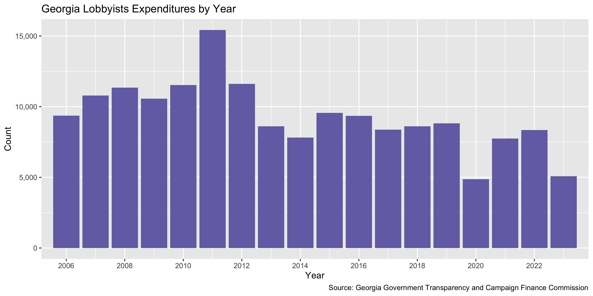
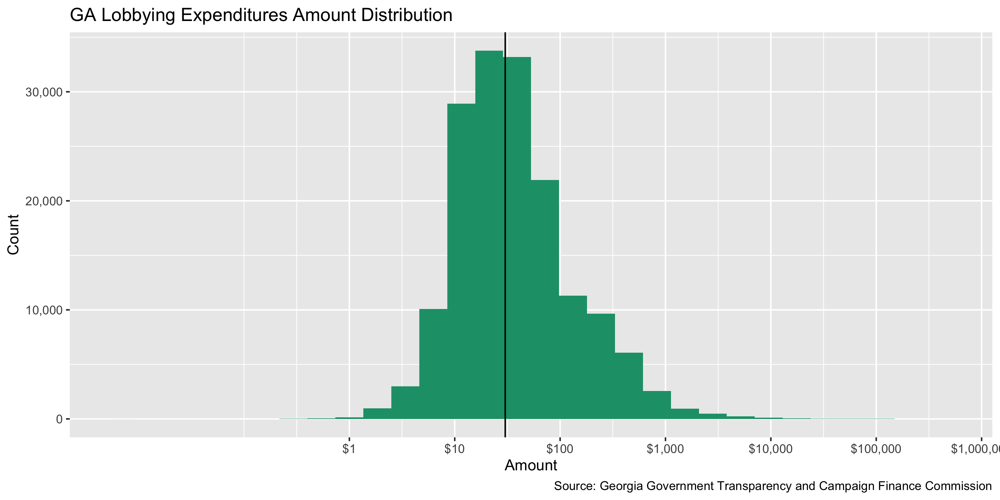

Georgia Lobbyying Expenditures
================
Yanqi Xu
2023-05-30 23:14:44

- <a href="#project" id="toc-project">Project</a>
- <a href="#objectives" id="toc-objectives">Objectives</a>
- <a href="#packages" id="toc-packages">Packages</a>
- <a href="#data" id="toc-data">Data</a>
- <a href="#download" id="toc-download">Download</a>
- <a href="#explore" id="toc-explore">Explore</a>
- <a href="#conclude" id="toc-conclude">Conclude</a>
- <a href="#export" id="toc-export">Export</a>
- <a href="#upload" id="toc-upload">Upload</a>

<!-- Place comments regarding knitting here -->

## Project

The Accountability Project is an effort to cut across data silos and
give journalists, policy professionals, activists, and the public at
large a simple way to search across huge volumes of public data about
people and organizations.

Our goal is to standardizing public data on a few key fields by thinking
of each dataset row as a transaction. For each transaction there should
be (at least) 3 variables:

1.  All **parties** to a transaction.
2.  The **date** of the transaction.
3.  The **amount** of money involved.

## Objectives

This document describes the process used to complete the following
objectives:

1.  How many records are in the database?
2.  Check for entirely duplicated records.
3.  Check ranges of continuous variables.
4.  Is there anything blank or missing?
5.  Check for consistency issues.
6.  Create a five-digit ZIP Code called `zip`.
7.  Create a `year` field from the transaction date.
8.  Make sure there is data on both parties to a transaction.

## Packages

The following packages are needed to collect, manipulate, visualize,
analyze, and communicate these results. The `pacman` package will
facilitate their installation and attachment.

The IRW’s `campfin` package will also have to be installed from GitHub.
This package contains functions custom made to help facilitate the
processing of campaign finance data.

``` r
if (!require("pacman")) install.packages("pacman")
pacman::p_load_gh("irworkshop/campfin")
pacman::p_load(
  tidyverse, # data manipulation
  readxl, #read excel files
  lubridate, # datetime strings
  gluedown, # printing markdown
  magrittr, # pipe operators
  janitor, # clean data frames
  refinr, # cluster and merge
  scales, # format strings
  knitr, # knit documents
  vroom, # read files fast
  rvest, # html scraping
  glue, # combine strings
  here, # relative paths
  httr, # http requests
  fs # local storage 
)
```

This document should be run as part of the `R_campfin` project, which
lives as a sub-directory of the more general, language-agnostic
[`irworkshop/accountability_datacleaning`](https://github.com/irworkshop/accountability_datacleaning)
GitHub repository.

The `R_campfin` project uses the [RStudio
projects](https://support.rstudio.com/hc/en-us/articles/200526207-Using-Projects)
feature and should be run as such. The project also uses the dynamic
`here::here()` tool for file paths relative to *your* machine.

``` r
# where does this document knit?
here::here()
#> [1] "/Users/yanqixu/code/accountability_datacleaning"
```

## Data

Lobbying data is obtained from the [Georgia Government Transparency and
Campaign Finance
Commission](https://media.ethics.ga.gov/search/Lobbyist/Lobbyist_ByExpenditures.aspx).
We use the Lobbyist Roster under the **Search Lobbyist** feature to
return a list of lobbyists. There’re two options for the data output,
organized by group or lobbyist. We will use the Lobbyist Group Roster so
that the data is organized by clients in relation to the lobbyists they
employed.

Note that the data is separated by year, and we will use `httr` to
obtain each year’s data via a `POST` request, whose parameters can be
found from network activities.

## Download

We can set up the raw directory.

``` r
raw_dir <- dir_create(here("state","ga", "lobby", "data", "raw","exp"))
```

We can download the data files by year from 2006 to 2020. The 2020 data
file is downloaded on September 29.

Then We can view the file details here.

``` r
dir_info(raw_dir)
#> # A tibble: 36 × 18
#>    path        type   size permiss…¹ modification_time   user  group devic…² hard_…³ speci…⁴  inode
#>    <fs::path>  <fct> <fs:> <fs::per> <dttm>              <chr> <chr>   <dbl>   <dbl>   <dbl>  <dbl>
#>  1 …rt2006.xls file  3.56M rw-r--r-- 2020-09-29 11:27:16 yanq… staff  1.68e7       1       0 2.65e7
#>  2 …rt2007.xls file   4.1M rw-r--r-- 2020-09-29 11:25:57 yanq… staff  1.68e7       1       0 2.65e7
#>  3 …rt2008.xls file   4.3M rw-r--r-- 2020-09-23 20:06:20 yanq… staff  1.68e7       1       0 2.60e7
#>  4 …rt2009.xls file  4.01M rw-r--r-- 2020-09-23 20:03:19 yanq… staff  1.68e7       1       0 2.60e7
#>  5 …rt2010.xls file  4.43M rw-r--r-- 2020-09-23 20:05:00 yanq… staff  1.68e7       1       0 2.60e7
#>  6 …rt2011.xls file  5.94M rw-r--r-- 2020-09-23 19:36:19 yanq… staff  1.68e7       1       0 2.60e7
#>  7 …rt2012.xls file  4.53M rw-r--r-- 2020-09-23 19:35:51 yanq… staff  1.68e7       1       0 2.60e7
#>  8 …rt2013.xls file  3.35M rw-r--r-- 2020-09-23 18:08:40 yanq… staff  1.68e7       1       0 2.60e7
#>  9 …rt2014.xls file  3.01M rw-r--r-- 2020-09-23 16:45:33 yanq… staff  1.68e7       1       0 2.60e7
#> 10 …rt2015.xls file  3.68M rw-r--r-- 2020-09-23 16:40:24 yanq… staff  1.68e7       1       0 2.60e7
#> # … with 26 more rows, 7 more variables: block_size <dbl>, blocks <dbl>, flags <int>,
#> #   generation <dbl>, access_time <dttm>, change_time <dttm>, birth_time <dttm>, and abbreviated
#> #   variable names ¹​permissions, ²​device_id, ³​hard_links, ⁴​special_device_id
```

### Read

The file’s also not in a standard Excel format, so we will use `rvest`
to scrape the html content.

``` r

ga_lob_read <- function(ga_path){
  year_from_file <- str_extract(ga_path,"20\\d{2}")
  #lob_type <- str_extract(ga_path,"(?<=_)\\w{3}(?=_\\d+)")
  lob_file <- path(raw_dir, glue("ga_lob_exp_{year_from_file}.csv"))
if (file_exists(lob_file)) {
  message("File for year {year_from_file} already converted, skipping")
} else {
  message(glue("Start converting file for year {year_from_file}"))
  ga_html <- ga_path %>% read_html()
  ga_node <- ga_html %>% html_node("table")
  ga_table <- ga_node %>% html_table()
  names(ga_table) <- ga_table[1,]
  ga_table <- ga_table[2:nrow(ga_table),]
    write_csv(
    x = ga_table,
    path = lob_file
  )
    message(glue("Conversion complete for year {year_from_file}"))
}
}

ga_lob <- map_dfr(dir_ls(raw_dir,glob = "*.xls"), ga_lob_read)
```

Now we can read the converted csv files.

``` r
gale <- dir_ls(raw_dir,regexp = ".*exp_.*.csv") %>% 
  map_dfr(read_csv,col_types = cols(.default = col_character()))

gale <- gale %>% 
  mutate(Amount = as.numeric(Amount),
         Date = as.Date(Date, format = "%m/%d/%Y"))
```

### Duplicates

There are no duplicate records.

``` r
gale <- flag_dupes(gale, everything())
sum(gale$dupe_flag)
#> [1] 1087
```

## Explore

``` r
glimpse(gale)
#> Rows: 167,822
#> Columns: 18
#> $ ReportYear   <chr> "2006", "2006", "2006", "2006", "2006", "2006", "2006", "2006", "2006", "200…
#> $ FilerID      <chr> "L20050401", "L20050401", "L20050308", "L20050308", "L20050308", "L20050308"…
#> $ Name         <chr> "HERRIN,  MOLLY", "HERRIN,  MOLLY", "MILLER, JR WILLIAM G.", "MILLER, JR WIL…
#> $ FirstName    <chr> "MOLLY", "MOLLY", "WILLIAM", "WILLIAM", "WILLIAM", "WILLIAM", "WILLIAM", "WI…
#> $ MiddleName   <chr> NA, NA, "G.", "G.", "G.", "G.", "G.", "G.", "G.", "G.", "G.", "G.", "G.", "G…
#> $ LastName     <chr> "HERRIN", "HERRIN", "MILLER", "MILLER", "MILLER", "MILLER", "MILLER", "MILLE…
#> $ Suffix       <chr> NA, NA, "JR", "JR", "JR", "JR", "JR", "JR", "JR", "JR", "JR", "JR", "JR", "J…
#> $ Association  <chr> "THE AMERICAN CANCER SOCIETY", "THE AMERICAN CANCER SOCIETY", "GEORGIA WORLD…
#> $ GroupName    <chr> "Families First", "2006 GA Women's Policy Education Fund", NA, NA, NA, NA, N…
#> $ POTitle      <chr> NA, NA, "Representative, District 61", "Senator, District 32", "Representati…
#> $ POName       <chr> NA, NA, "Bob Holmes", "Judson Hill", "Len Walker", "Freddie Powell Sims", "B…
#> $ CityCounty   <chr> NA, "Atlanta, GA", NA, NA, NA, NA, NA, NA, NA, NA, NA, NA, NA, NA, NA, NA, N…
#> $ Description  <chr> "Sponsorship of the Families First Annual Appreciation Dinner for the Health…
#> $ Date         <date> 2006-01-30, 2006-10-17, 2006-01-01, 2006-01-01, 2006-01-01, 2006-01-01, 200…
#> $ Amount       <dbl> 250, 250, 164, 164, 164, 164, 164, 164, 285, 190, 40, 65, 65, 65, 65, 65, 13…
#> $ BillNumber   <chr> "No particular bill or resolution.", NA, NA, NA, NA, NA, NA, NA, NA, NA, NA,…
#> $ Report_Level <chr> "STATE", "LOCAL", "STATE", "STATE", "STATE", "STATE", "STATE", "STATE", "STA…
#> $ dupe_flag    <lgl> FALSE, FALSE, FALSE, FALSE, FALSE, FALSE, FALSE, FALSE, FALSE, FALSE, FALSE,…
tail(gale)
#> # A tibble: 6 × 18
#>   ReportYear FilerID   Name   First…¹ Middl…² LastN…³ Suffix Assoc…⁴ Group…⁵ POTitle POName CityC…⁶
#>   <chr>      <chr>     <chr>  <chr>   <chr>   <chr>   <chr>  <chr>   <chr>   <chr>   <chr>  <chr>  
#> 1 2023       L20230153 GERME… MATTHEW CHARLES GERMER  <NA>   R STRE… <NA>    Deputy… Jorda… <NA>   
#> 2 2023       L20230153 GERME… MATTHEW CHARLES GERMER  <NA>   R STRE… <NA>    Secret… Brad … <NA>   
#> 3 2023       L20230153 GERME… MATTHEW CHARLES GERMER  <NA>   R STRE… <NA>    Deputy… Jorda… <NA>   
#> 4 2023       L20230153 GERME… MATTHEW CHARLES GERMER  <NA>   R STRE… <NA>    Deputy… Jorda… <NA>   
#> 5 2023       L20230153 GERME… MATTHEW CHARLES GERMER  <NA>   R STRE… <NA>    Deputy… Jorda… <NA>   
#> 6 2023       L20230153 GERME… MATTHEW CHARLES GERMER  <NA>   R STRE… <NA>    Deputy… Jorda… <NA>   
#> # … with 6 more variables: Description <chr>, Date <date>, Amount <dbl>, BillNumber <chr>,
#> #   Report_Level <chr>, dupe_flag <lgl>, and abbreviated variable names ¹​FirstName, ²​MiddleName,
#> #   ³​LastName, ⁴​Association, ⁵​GroupName, ⁶​CityCounty
```

### Missing

``` r
col_stats(gale, count_na)
#> # A tibble: 18 × 4
#>    col          class       n       p
#>    <chr>        <chr>   <int>   <dbl>
#>  1 ReportYear   <chr>       0 0      
#>  2 FilerID      <chr>       0 0      
#>  3 Name         <chr>       0 0      
#>  4 FirstName    <chr>       0 0      
#>  5 MiddleName   <chr>   46810 0.279  
#>  6 LastName     <chr>       0 0      
#>  7 Suffix       <chr>  162022 0.965  
#>  8 Association  <chr>       0 0      
#>  9 GroupName    <chr>  141661 0.844  
#> 10 POTitle      <chr>   26171 0.156  
#> 11 POName       <chr>   26146 0.156  
#> 12 CityCounty   <chr>  167410 0.998  
#> 13 Description  <chr>     981 0.00585
#> 14 Date         <date>      0 0      
#> 15 Amount       <dbl>       0 0      
#> 16 BillNumber   <chr>   60622 0.361  
#> 17 Report_Level <chr>       0 0      
#> 18 dupe_flag    <lgl>       0 0
```

### Categorical

``` r
col_stats(gale, n_distinct)
#> # A tibble: 18 × 4
#>    col          class      n         p
#>    <chr>        <chr>  <int>     <dbl>
#>  1 ReportYear   <chr>     18 0.000107 
#>  2 FilerID      <chr>   1788 0.0107   
#>  3 Name         <chr>   1793 0.0107   
#>  4 FirstName    <chr>    751 0.00447  
#>  5 MiddleName   <chr>    523 0.00312  
#>  6 LastName     <chr>   1296 0.00772  
#>  7 Suffix       <chr>      7 0.0000417
#>  8 Association  <chr>   2338 0.0139   
#>  9 GroupName    <chr>   8605 0.0513   
#> 10 POTitle      <chr>   6697 0.0399   
#> 11 POName       <chr>  11639 0.0694   
#> 12 CityCounty   <chr>    152 0.000906 
#> 13 Description  <chr>  25590 0.152    
#> 14 Date         <date>  5490 0.0327   
#> 15 Amount       <dbl>  20868 0.124    
#> 16 BillNumber   <chr>   4826 0.0288   
#> 17 Report_Level <chr>      5 0.0000298
#> 18 dupe_flag    <lgl>      2 0.0000119
```

### Dates

We can examine the validity of `date_clean`. It looks pretty clean.

``` r
min(gale$Date)
#> [1] "2006-01-01"
max(gale$Date)
#> [1] "2023-05-30"
sum(gale$Date > today())
#> [1] 0
```

<!-- -->

### Continuous

``` r
brewer_dark2 <- RColorBrewer::brewer.pal(n = 8, name = "Dark2")
gale %>% 
  ggplot(aes(Amount)) +
  geom_histogram(fill = brewer_dark2[1]) +
  geom_vline(xintercept = median(gale$Amount, na.rm = TRUE)) +
  scale_x_continuous(
    breaks = c(1 %o% 10^(0:6)),
    labels = dollar,
    trans = "log10"
  ) +
  scale_y_continuous(labels = comma) +
  labs(
    title = "GA Lobbying Expenditures Amount Distribution",
    caption = "Source: Georgia Government Transparency and Campaign Finance Commission",
    x = "Amount",
    y = "Count"
  )
```

<!-- -->

## Conclude

Before exporting, we can remove the intermediary normalization columns
and rename all added variables with the `_clean` suffix.

``` r
gale <- gale %>% 
  rename_all(~str_replace(., "_norm", "_clean")
             )
```

``` r
glimpse(sample_n(gale, 20))
#> Rows: 20
#> Columns: 18
#> $ ReportYear   <int> 2016, 2007, 2010, 2012, 2023, 2023, 2012, 2011, 2010, 2020, 2014, 2011, 2012…
#> $ FilerID      <chr> "L20051183", "L20060251", "L20090268", "L20051413", "L20051094", "L20230048"…
#> $ Name         <chr> "HUGHES,  JENNINGS LEE", "MITCHELL,  MICHAEL R.", "WOOD ,  KEITH", "KINDREGA…
#> $ FirstName    <chr> "JENNINGS", "MICHAEL", "KEITH", "STEPHANIE", "TARRY", "MACY", "MEREDITH", "R…
#> $ MiddleName   <chr> "LEE", "R.", NA, "CARTER", "MILLS", "MICHELLE", "WALKER", NA, NA, NA, "ELIZA…
#> $ LastName     <chr> "HUGHES", "MITCHELL", "WOOD", "KINDREGAN", "HODGES", "MCFALL", "HODGES", "WH…
#> $ Suffix       <chr> NA, NA, NA, NA, NA, NA, NA, NA, NA, NA, NA, NA, NA, NA, NA, NA, NA, NA, NA, …
#> $ Association  <chr> "HUGHES PUBLIC AFFAIRS", "UST PUBLIC AFFAIRS INC.", "NOVARTIS PHARMACEITICAL…
#> $ GroupName    <chr> "Senate Republican Caucus", NA, NA, NA, NA, NA, NA, NA, NA, NA, NA, NA, "Sen…
#> $ POTitle      <chr> NA, "State Representative", "Representative", "Representative", "State Repre…
#> $ POName       <chr> NA, "Mark Williams", "Calvin Smyre", "Billy Mitchell", "Tanya Miller", "Card…
#> $ CityCounty   <chr> NA, NA, NA, NA, NA, NA, NA, NA, NA, NA, NA, NA, NA, NA, NA, NA, NA, NA, NA, …
#> $ Description  <chr> "Sine Die Reception - pro rata share", "Dinner", "Meal", "Georgia World Cong…
#> $ Date         <date> 2016-03-25, 2007-12-10, 2010-03-24, 2012-10-30, 2023-03-28, 2023-03-19, 201…
#> $ Amount       <dbl> 150.00, 37.91, 74.10, 25.00, 20.71, 6.49, 85.00, 46.00, 97.06, 5.07, 13.95, …
#> $ BillNumber   <chr> "N/A", NA, "N/A", "N/A", "N/a", NA, NA, "N/A", NA, "n/a", NA, NA, "Issues su…
#> $ Report_Level <chr> "STATE", "STATE", "STATE", "STATE", "STATE", "STATE", "SA", "STATE", "STATE"…
#> $ dupe_flag    <lgl> FALSE, FALSE, FALSE, FALSE, FALSE, FALSE, FALSE, FALSE, FALSE, FALSE, FALSE,…
```

``` r
nrow(gale)
#> [1] 167822
```

1.  There are 167,822 records in the database.
2.  There are 1,087 duplicate records in the database.
3.  The range and distribution of `date` seem reasonable.
4.  There are few records missing key variables.
5.  Consistency in geographic data has been improved with
    `campfin::normal_*()`.

## Export

Now the file can be saved on disk for upload to the Accountability
server.

``` r
clean_dir <- dir_create(here("state","ga", "lobby", "data", "clean","exp"))
clean_path <- path(clean_dir, "ga_lobby_exp_clean.csv")
write_csv(gale, clean_path, na = "")
file_size(clean_path)
#> 27.5M
```

## Upload

Using the `aws.s3` package, we can upload the file to the IRW server.

``` r
s3_path <- path("csv", basename(clean_path))
put_object(
  file = clean_path,
  object = s3_path, 
  bucket = "publicaccountability",
  acl = "public-read",
  multipart = TRUE,
  show_progress = TRUE
)
as_fs_bytes(object_size(s3_path, "publicaccountability"))
```
