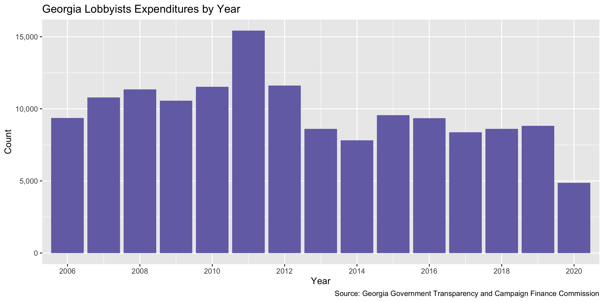

Georgia Lobbyying Registration
================
Yanqi Xu
2020-09-09 20:39:13

  - [Project](#project)
  - [Objectives](#objectives)
  - [Packages](#packages)
  - [Data](#data)
  - [Download](#download)
  - [Explore](#explore)
  - [Wrangle](#wrangle)
  - [Conclude](#conclude)
  - [Export](#export)
  - [Upload](#upload)
  - [Dictionary](#dictionary)

<!-- Place comments regarding knitting here -->

## Project

The Accountability Project is an effort to cut across data silos and
give journalists, policy professionals, activists, and the public at
large a simple way to search across huge volumes of public data about
people and organizations.

Our goal is to standardizing public data on a few key fields by thinking
of each dataset row as a transaction. For each transaction there should
be (at least) 3 variables:

1.  All **parties** to a transaction.
2.  The **date** of the transaction.
3.  The **amount** of money involved.

## Objectives

This document describes the process used to complete the following
objectives:

1.  How many records are in the database?
2.  Check for entirely duplicated records.
3.  Check ranges of continuous variables.
4.  Is there anything blank or missing?
5.  Check for consistency issues.
6.  Create a five-digit ZIP Code called `zip`.
7.  Create a `year` field from the transaction date.
8.  Make sure there is data on both parties to a transaction.

## Packages

The following packages are needed to collect, manipulate, visualize,
analyze, and communicate these results. The `pacman` package will
facilitate their installation and attachment.

The IRW’s `campfin` package will also have to be installed from GitHub.
This package contains functions custom made to help facilitate the
processing of campaign finance data.

``` r
if (!require("pacman")) install.packages("pacman")
pacman::p_load_gh("irworkshop/campfin")
pacman::p_load(
  tidyverse, # data manipulation
  readxl, #read excel files
  lubridate, # datetime strings
  gluedown, # printing markdown
  magrittr, # pipe operators
  janitor, # clean data frames
  refinr, # cluster and merge
  scales, # format strings
  knitr, # knit documents
  vroom, # read files fast
  rvest, # html scraping
  glue, # combine strings
  here, # relative paths
  httr, # http requests
  fs # local storage 
)
```

This document should be run as part of the `R_campfin` project, which
lives as a sub-directory of the more general, language-agnostic
[`irworkshop/accountability_datacleaning`](https://github.com/irworkshop/accountability_datacleaning)
GitHub repository.

The `R_campfin` project uses the [RStudio
projects](https://support.rstudio.com/hc/en-us/articles/200526207-Using-Projects)
feature and should be run as such. The project also uses the dynamic
`here::here()` tool for file paths relative to *your* machine.

``` r
# where does this document knit?
here::here()
#> [1] "/Users/yanqixu/code/accountability_datacleaning/R_campfin"
```

## Data

Lobbying data is obtained from the \[Georgia Government Transparency and
Campaign Finance Commission\]\[ethics\]. We use the Lobbyist Roster
under the **Search Lobbyist** feature to return a list of lobbyists.
There’re two options for the data output, organized by group or
lobbyist. We will use the Lobbyist Group Roster so that the data is
organized by clients in relation to the lobbyists they employed.

Note that the data is separated by year, and we will use `httr` to
obtain each year’s data via a `POST` request, whose parameters can be
found from network activities.

## Download

We can set up the raw directory.

``` r
raw_dir <- dir_create(here("ga", "lobby", "data", "raw","reg"))
raw_lob_paths <- path(raw_dir, glue("ga_lob_{2004:2020}.xls"))
```

The curl command is preprocessed to include `listGroup={c(LGR,LR)}` and
`listYear={2004:2020}`

``` r
ga_lob_curls <- glue(read_file(path(raw_dir,"ga_lob_curl.sh")))

ga_lob_download <- function(ga_curl,curl_type) { 
  #listGroup=LGR for lobbyist roster, and listGroup=LR for group roster
  #curl_type <- ifelse(test = str_detect(ga_curl,"listGroup=LGR"),yes = "lob", no = "grp")
  this_year <- ga_curl %>% str_extract("(?<=listYear=)\\d{4}")
  raw_path <- path(raw_dir, glue("ga_{curl_type}_{this_year}.xls"))
  if (!this_file_new(raw_path)) {
  write_lines(
  # x = system(paste("bash", path(raw_dir,"ga_curl.sh")), intern = TRUE),
  x = system(ga_curl, intern = TRUE),
  path = raw_path
)
  }
}

map2(ga_lob_curls,"lob",ga_lob_download)

### the 2001-2003 xls file can be accessed via a GET request
download.file("https://media.ethics.ga.gov/search/Lobbyist/Exp/Ros_2003_2001.xls", path(raw_dir,"ga_lob_0103.xls"))
```

We can view the file details here.

``` r
dir_info(raw_dir)
#> # A tibble: 68 x 18
#>    path       type   size permissions modification_time   user  group device_id hard_links
#>    <fs::path> <fct> <fs:> <fs::perms> <dttm>              <chr> <chr>     <dbl>      <dbl>
#>  1 /Users/ya… file      0 rw-r--r--   2020-09-04 10:50:34 yanq… staff  16777221          1
#>  2 /Users/ya… file      0 rw-r--r--   2020-09-04 10:50:34 yanq… staff  16777221          1
#>  3 /Users/ya… file  1.05M rw-r--r--   2020-09-09 14:42:14 yanq… staff  16777221          1
#>  4 /Users/ya… file  2.27M rw-r--r--   2020-09-04 10:50:35 yanq… staff  16777221          1
#>  5 /Users/ya… file  3.29M rw-r--r--   2020-09-09 14:46:08 yanq… staff  16777221          1
#>  6 /Users/ya… file  7.18M rw-r--r--   2020-09-04 10:50:37 yanq… staff  16777221          1
#>  7 /Users/ya… file  3.31M rw-r--r--   2020-09-09 14:50:08 yanq… staff  16777221          1
#>  8 /Users/ya… file  7.22M rw-r--r--   2020-09-04 10:50:39 yanq… staff  16777221          1
#>  9 /Users/ya… file  3.33M rw-r--r--   2020-09-09 14:53:37 yanq… staff  16777221          1
#> 10 /Users/ya… file  7.28M rw-r--r--   2020-09-04 10:31:01 yanq… staff  16777221          1
#> # … with 58 more rows, and 9 more variables: special_device_id <dbl>, inode <dbl>,
#> #   block_size <dbl>, blocks <dbl>, flags <int>, generation <dbl>, access_time <dttm>,
#> #   change_time <dttm>, birth_time <dttm>
```

We can see that for year 2004 and 2005 the files are actually empty, so
we’ll disregard these two when reading.

### Read

The 2001—2003 data has rows to escape. So we’ll read the two datasets
separately. The file’s also not in a standard Excel format, so we will
use `rvest` to scrape the html content. We’ll also add the year to each
dataframe.

``` r
ga_lob_read <- function(ga_path){
  year_from_file <- str_extract(ga_path,"20\\d{2}")
  lob_type <- str_extract(ga_path,"(?<=_)\\w{3}(?=_\\d+)")
  lob_file <- path(raw_dir, glue("ga_{lob_type}_{year_from_file}.csv"))
if (file_exists(lob_file)) {
  message("File for year {year_from_file} already converted, skipping")
} else {
  message(glue("Start converting file for year {year_from_file}"))
  ga_html <- ga_path %>% read_html()
  ga_node <- ga_html %>% html_node("table")
  ga_table <- ga_node %>% html_table()
  names(ga_table) <- ga_table[1,]
  ga_table <- ga_table[2:nrow(ga_table),]
  ga_table <- ga_table %>% 
    mutate(Year = year_from_file)
    write_csv(
    x = ga_table,
    path = lob_file
  )
    message(glue("Conversion completed for year {year_from_file}"))
}
}

ga_lob <- map_dfr(raw_lob_paths[3:length(raw_lob_paths)], ga_lob_read)
```

``` r
galr <- dir_ls(raw_dir,regexp = ".*lob_.*.csv") %>% 
  map_dfr(read_csv,col_types = cols(.default = col_character()))

galr_early <- dir_ls(raw_dir, regexp = ".+0103.xls") %>% read_xls(skip = 1,col_types = "text")
```

According to the website, the `PaymentExceeds` column is a logical
vector indicating whether payments have exceeded $10,000.

We will also need to rename some columns in the 01-03 files to keep it
consistent with the later files.

``` r
galr_early <- galr_early %>% 
  mutate(Year = str_sub(`Docket Year`, start = 1L, end = 4L),
         Registered = excel_numeric_to_date(as.numeric(Registered))) %>% 
  rename(Association=`Association Name`,
         DateRegistered = Registered,
         FirstName = First,
         MiddleName = Middle,
         DocketYear = `Docket Year`,
         Address1 = `Address 1`,
         LastName = Last)
```

### Duplicates

There are no duplicate records.

``` r
galr <- flag_dupes(galr, everything())
galr_early <- flag_dupes(galr_early, everything())
sum(galr_early$dupe_flag)
#> [1] 22
```

## Explore

``` r
glimpse(galr)
#> Rows: 215,887
#> Columns: 21
#> $ FilerID        <chr> "L20050485", "L20050485", "L20050272", "L20050601", "L20051071", "L200502…
#> $ LastName       <chr> "ABERCROMBIE", "ABERCROMBIE", "ADAMS", "ADAMS", "ADAMS", "ADAMS", "ADAMS"…
#> $ Suffix         <chr> NA, NA, NA, NA, NA, NA, NA, NA, NA, NA, NA, NA, NA, NA, NA, NA, NA, NA, N…
#> $ FirstName      <chr> "ALYSON", "ALYSON", "ALEXANDRA", "BILLY", "JUDITH", "NORMER", "PAMELA", "…
#> $ MiddleName     <chr> "B.", "B.", NA, "L.", "M.", "M.", "LYNN", "COOGLE", "ANTHONY", "SUK", "B.…
#> $ Address1       <chr> "1940 THE EXCHANGE SUITE 100", "1940 THE EXCHANGE SUITE 100", "3 PURITAN …
#> $ Address2       <chr> NA, NA, "916 JOSEPH LOWERY BLVD.", NA, NA, NA, NA, NA, NA, "SUITE 130", N…
#> $ City           <chr> "ATLANTA", "ATLANTA", "ATLANTA", "DUBLIN", "MARIETTA", "FAYETTEVILLE", "F…
#> $ State          <chr> "GA", "GA", "GA", "GA", "GA", "GA", "GA", "GA", "GA", "GA", "GA", "GA", "…
#> $ Zip            <chr> "30339", "30339", "30318", "31021", "30062", "30214", "30214", "30204", "…
#> $ Phone          <chr> "6782984100", "6782984100", "4043529828", "(478) 272 - 5400", "7705654531…
#> $ PhoneExt       <chr> NA, NA, NA, NA, NA, NA, NA, NA, NA, NA, NA, NA, NA, NA, NA, NA, NA, NA, N…
#> $ Phone2         <chr> NA, NA, NA, NA, NA, "(770) 461 - 2778", NA, NA, NA, "(770) 925 - 0112", N…
#> $ Public_EMail   <chr> NA, NA, "aadams@ucriverkeeper.org", NA, NA, "normer@gahsc.org", "pamela@g…
#> $ Association    <chr> "GEORGIA BRANCH, ASSOCIATED GENERAL CONTRACTORS", "GEORGIA BRANCH, ASSOCI…
#> $ PaymentExceeds <chr> "False", "False", "False", "False", "False", "False", "False", "False", "…
#> $ DateRegistered <chr> "1/1/2006 12:00:00 AM", "1/1/2006 12:00:00 AM", "1/1/2006 12:00:00 AM", "…
#> $ DateTerminated <chr> "12/31/2006 12:00:00 AM", "12/31/2006 12:00:00 AM", "12/31/2008 12:00:00 …
#> $ LobbyingLevel  <chr> "STATE", "LOCAL", "STATE", "STATE", "STATE", "STATE", "VENDOR", "STATE", …
#> $ Year           <chr> "2006", "2006", "2006", "2006", "2006", "2006", "2006", "2006", "2006", "…
#> $ dupe_flag      <lgl> FALSE, FALSE, FALSE, FALSE, FALSE, FALSE, FALSE, FALSE, FALSE, FALSE, FAL…
tail(galr)
#> # A tibble: 6 x 21
#>   FilerID LastName Suffix FirstName MiddleName Address1 Address2 City  State Zip   Phone PhoneExt
#>   <chr>   <chr>    <chr>  <chr>     <chr>      <chr>    <chr>    <chr> <chr> <chr> <chr> <chr>   
#> 1 L20100… YOUNG    <NA>   RACHAEL   WILLIS     75 5TH … SUITE 7… ATLA… GA    30308 (404… <NA>    
#> 2 L20100… YOUNG    <NA>   RACHAEL   WILLIS     75 5TH … SUITE 7… ATLA… GA    30308 (404… <NA>    
#> 3 L20160… YOUNGER  <NA>   GRAHAM    DAVIS      513 N H… APT 5    ATLA… GA    30307 (678… <NA>    
#> 4 L20190… YOUNGO   <NA>   EMILY     ELIZABETH  18 CAPI… SUITE 1… ATLA… GA    30334 (404… <NA>    
#> 5 L20200… ZANDO    <NA>   CHERYL    <NA>       PO BOX … <NA>     WASH… DC    20090 (202… <NA>    
#> 6 L20110… ZAUNER   <NA>   JOHN      FRANCIS    9 JEFFE… <NA>     NEWN… GA    30263 (678… <NA>    
#> # … with 9 more variables: Phone2 <chr>, Public_EMail <chr>, Association <chr>,
#> #   PaymentExceeds <chr>, DateRegistered <chr>, DateTerminated <chr>, LobbyingLevel <chr>,
#> #   Year <chr>, dupe_flag <lgl>
glimpse(galr_early)
#> Rows: 8,244
#> Columns: 16
#> $ DocketYear     <chr> "20010001", "20010002", "20010003", "20010004", "20010005", "20010006", "…
#> $ FirstName      <chr> "Gloria", "Jerry", "Ralph", "Missy", "Secundina", "Raymon", "Raymon", "Ra…
#> $ MiddleName     <chr> "Kemp", "R", "T", NA, "Angelic", "E.", "E.", "E.", "E.", "E.", "E.", "E."…
#> $ LastName       <chr> "Engelke", "Gossett", "Bowden", "Moore", "Moore", "White", "White", "Whit…
#> $ Suffix         <chr> NA, NA, NA, NA, NA, NA, NA, NA, NA, NA, NA, NA, NA, NA, NA, NA, NA, NA, N…
#> $ Address        <chr> "P.o.box 7021", "9570 Medlock Bridge Rd.", "One Decatur Towncenter Suite …
#> $ Address1       <chr> NA, "Suite 201", "150 E. Ponce De Leon Ave.", NA, NA, "Suite 3493", "Suit…
#> $ City           <chr> "Atlanta", "Duluth", "Decatur", "Atlanta", "Atlanta", "Atlanta", "Atlanta…
#> $ State          <chr> "GA", "GA", "GA", "GA", "GA", "GA", "GA", "GA", "GA", "GA", "GA", "GA", "…
#> $ Zip            <chr> "30357", "30097", "300302547", "30329", "30305", "30339", "30339", "30339…
#> $ Phone          <chr> "4048761720", "6784730012", "4043733131", "7703179458", "4049325482", "77…
#> $ DateRegistered <date> 2000-12-27, 2000-12-27, 2000-12-27, 2000-12-27, 2000-12-27, 2000-12-27, …
#> $ Association    <chr> "Ga Citizens For The Arts", "Ga. Crushed Stone Association", "Georgia Equ…
#> $ Level          <chr> NA, NA, NA, NA, NA, NA, NA, NA, NA, NA, NA, NA, NA, NA, NA, NA, NA, NA, N…
#> $ Year           <chr> "2001", "2001", "2001", "2001", "2001", "2001", "2001", "2001", "2001", "…
#> $ dupe_flag      <lgl> FALSE, FALSE, FALSE, FALSE, FALSE, FALSE, FALSE, FALSE, FALSE, FALSE, FAL…
tail(galr_early)
#> # A tibble: 6 x 16
#>   DocketYear FirstName MiddleName LastName Suffix Address Address1 City  State Zip   Phone
#>   <chr>      <chr>     <chr>      <chr>    <chr>  <chr>   <chr>    <chr> <chr> <chr> <chr>
#> 1 20031387   TAMARA    K.         YOUNG    <NA>   <NA>    3723 RA… DECA… GA    30034 4042…
#> 2 20031388   RAY       A.         BARRENT… <NA>   <NA>    1191 GO… LOUI… GA    30434 4786…
#> 3 20031389   WILLIAM   DON        CHASTAIN <NA>   <NA>    P.O.BOX… ATLA… GA    3037… 4046…
#> 4 20031390   WALTER    <NA>       DUKES    <NA>   <NA>    1607 WA… AUGU… GA    3090… 7067…
#> 5 20031391   E.        LANIER     FINCH    <NA>   8010 R… SUITE 1… ATLA… GA    30350 7703…
#> 6 20031392   MICHAEL   A.         CADGER   <NA>   1311 M… <NA>     DUNW… GA    30338 7708…
#> # … with 5 more variables: DateRegistered <date>, Association <chr>, Level <chr>, Year <chr>,
#> #   dupe_flag <lgl>
```

### Missing

``` r
col_stats(galr, count_na)
#> # A tibble: 21 x 4
#>    col            class      n          p
#>    <chr>          <chr>  <int>      <dbl>
#>  1 FilerID        <chr>      0 0         
#>  2 LastName       <chr>      0 0         
#>  3 Suffix         <chr> 208495 0.966     
#>  4 FirstName      <chr>      0 0         
#>  5 MiddleName     <chr>  54066 0.250     
#>  6 Address1       <chr>      6 0.0000278 
#>  7 Address2       <chr>  87731 0.406     
#>  8 City           <chr>      0 0         
#>  9 State          <chr>      2 0.00000926
#> 10 Zip            <chr>      3 0.0000139 
#> 11 Phone          <chr>     47 0.000218  
#> 12 PhoneExt       <chr> 215887 1         
#> 13 Phone2         <chr> 199316 0.923     
#> 14 Public_EMail   <chr> 102622 0.475     
#> 15 Association    <chr>      0 0         
#> 16 PaymentExceeds <chr>      0 0         
#> 17 DateRegistered <chr>      0 0         
#> 18 DateTerminated <chr>  79286 0.367     
#> 19 LobbyingLevel  <chr>      0 0         
#> 20 Year           <chr>      0 0         
#> 21 dupe_flag      <lgl>      0 0
col_stats(galr_early, count_na)
#> # A tibble: 16 x 4
#>    col            class      n        p
#>    <chr>          <chr>  <int>    <dbl>
#>  1 DocketYear     <chr>      0 0       
#>  2 FirstName      <chr>     10 0.00121 
#>  3 MiddleName     <chr>   2150 0.261   
#>  4 LastName       <chr>      2 0.000243
#>  5 Suffix         <chr>   8135 0.987   
#>  6 Address        <chr>   1971 0.239   
#>  7 Address1       <chr>   1236 0.150   
#>  8 City           <chr>      0 0       
#>  9 State          <chr>      0 0       
#> 10 Zip            <chr>      0 0       
#> 11 Phone          <chr>      3 0.000364
#> 12 DateRegistered <date>    30 0.00364 
#> 13 Association    <chr>      0 0       
#> 14 Level          <chr>   5184 0.629   
#> 15 Year           <chr>      0 0       
#> 16 dupe_flag      <lgl>      0 0
```

``` r
galr <- galr %>% flag_na(FilerID, FirstName,LastName, DateRegistered,Association)
galr_early <- galr_early %>% flag_na(FirstName,LastName, DateRegistered,Association)
sum(galr$na_flag)
#> [1] 0
sum(galr_early$na_flag)
#> [1] 42
```

``` r
galr %>% 
  filter(na_flag) %>% 
  select(FilerID, FirstName,LastName, DateRegistered,Association)
#> # A tibble: 0 x 5
#> # … with 5 variables: FilerID <chr>, FirstName <chr>, LastName <chr>, DateRegistered <chr>,
#> #   Association <chr>

galr_early %>% 
  filter(na_flag) %>% 
  select(FirstName,LastName, DateRegistered,Association)
#> # A tibble: 42 x 4
#>    FirstName LastName DateRegistered Association                                                   
#>    <chr>     <chr>    <date>         <chr>                                                         
#>  1 Saralyn   <NA>     2002-01-08     Secretary Of State,elections Division                         
#>  2 KAREN     <NA>     2002-07-11     Progressive Insurance                                         
#>  3 RANDY     CRAWFORD NA             BAKERY CONFECTIONARY TOBACCO & GRAIN MILLERS INTERNATIONAL UN…
#>  4 RICKEY    CRAWFORD NA             BAKERY CONFECTIONARY TOBACCO & GRAIN MILLER INTERNATIONAL UNI…
#>  5 J.        ALLEN    NA             GA. FORESTRY COMMISSION                                       
#>  6 ROBERT    FARRIS   NA             GA. FORESTRY COMMISSION                                       
#>  7 WILLIAM   LAZENBY  NA             GA. FORESTRY COMMISSION                                       
#>  8 MIKE      VAQUER   NA             INTERNATIONAL PAPER                                           
#>  9 CARLOTTA  FRANKLIN NA             METRO ATLANTA CHAMBER OF COMMERCE                             
#> 10 SAMUEL    GARDNER  NA             SPALDING COUNTY                                               
#> # … with 32 more rows
```

### Categorical

``` r
col_stats(galr, n_distinct)
#> # A tibble: 22 x 4
#>    col            class     n          p
#>    <chr>          <chr> <int>      <dbl>
#>  1 FilerID        <chr>  4644 0.0215    
#>  2 LastName       <chr>  2837 0.0131    
#>  3 Suffix         <chr>     9 0.0000417 
#>  4 FirstName      <chr>  1401 0.00649   
#>  5 MiddleName     <chr>   974 0.00451   
#>  6 Address1       <chr>  3582 0.0166    
#>  7 Address2       <chr>  1015 0.00470   
#>  8 City           <chr>   431 0.00200   
#>  9 State          <chr>    39 0.000181  
#> 10 Zip            <chr>   743 0.00344   
#> 11 Phone          <chr>  3925 0.0182    
#> 12 PhoneExt       <chr>     1 0.00000463
#> 13 Phone2         <chr>   158 0.000732  
#> 14 Public_EMail   <chr>   805 0.00373   
#> 15 Association    <chr>  7511 0.0348    
#> 16 PaymentExceeds <chr>     2 0.00000926
#> 17 DateRegistered <chr>  2899 0.0134    
#> 18 DateTerminated <chr>  4142 0.0192    
#> 19 LobbyingLevel  <chr>     6 0.0000278 
#> 20 Year           <chr>    15 0.0000695 
#> 21 dupe_flag      <lgl>     2 0.00000926
#> 22 na_flag        <lgl>     1 0.00000463
```

### Dates

We can examine the validity of `date_clean`. It looks pretty clean.

``` r
min(galr$DateRegistered)
#> [1] "1/1/2006 10:33:39 AM"
max(galr$DateRegistered)
#> [1] "9/9/2019 12:00:00 AM"
sum(galr$DateRegistered > today())
#> [1] NA
```

``` r
min(galr_early$DateRegistered)
#> [1] NA
max(galr_early$DateRegistered)
#> [1] NA
sum(galr_early$DateRegistered > today())
#> [1] NA
```

<!-- -->

## Wrangle

To improve the searchability of the database, we will perform some
consistent, confident string normalization. For geographic variables
like city names and ZIP codes, the corresponding `campfin::normal_*()`
functions are tailor made to facilitate this process. To normalize the
lobbyist phone number variable, will will combine the number and
extension with `tidyr::unite()` and pass the united string to
`campfin::normal_phone()`.

``` r
galr <- galr %>% 
  unite(
    Phone, PhoneExt,
    col = "Phone_norm",
    sep = "x",
    remove = FALSE,
    na.rm = TRUE
  ) %>% 
  mutate(
    Phone_norm = normal_phone(
      number = "Phone_norm",
      na_bad = FALSE,
      rm_ext = FALSE
    )
  )

galr_early <- galr_early %>% 
  mutate(
    Phone_norm = normal_phone(
      number = "Phone",
      na_bad = FALSE,
      rm_ext = FALSE
    )
  )
```

    #> # A tibble: 3,925 x 3
    #>    Phone            PhoneExt Phone_norm
    #>    <chr>            <chr>    <chr>     
    #>  1 4046593122       <NA>     Phone_norm
    #>  2 (404) 506 - 6084 <NA>     Phone_norm
    #>  3 (404) 506 - 7915 <NA>     Phone_norm
    #>  4 (404) 290 - 4231 <NA>     Phone_norm
    #>  5 (404) 525 - 2793 <NA>     Phone_norm
    #>  6 (404) 506 - 7740 <NA>     Phone_norm
    #>  7 (770) 912 - 2582 <NA>     Phone_norm
    #>  8 (404) 897 - 7876 <NA>     Phone_norm
    #>  9 (706) 975 - 6145 <NA>     Phone_norm
    #> 10 (678) 595 - 9326 <NA>     Phone_norm
    #> # … with 3,915 more rows
    #> # A tibble: 1,590 x 2
    #>    Phone      Phone_norm
    #>    <chr>      <chr>     
    #>  1 7705592768 Phone     
    #>  2 4043306897 Phone     
    #>  3 4049861738 Phone     
    #>  4 4043785933 Phone     
    #>  5 9127438612 Phone     
    #>  6 4048153500 Phone     
    #>  7 4046575027 Phone     
    #>  8 7704242967 Phone     
    #>  9 9126343817 Phone     
    #> 10 6788371137 Phone     
    #> # … with 1,580 more rows

### Address

For the street `addresss` variable, the `campfin::normal_address()`
function will force consistence case, remove punctuation, and abbreviate
official USPS suffixes.

``` r
galr <- galr %>% 
  # combine street addr
  unite(
    col = address_full,
    starts_with("Address"),
    sep = " ",
    remove = FALSE,
    na.rm = TRUE
  ) %>% 
  mutate(
   address_norm = normal_address(
     address = address_full,
     abbs = usps_street,
     na = invalid_city
   )
 ) 

galr_early <- galr_early %>% 
  # combine street addr
  unite(
    col = address_full,
    starts_with("Address"),
    sep = " ",
    remove = FALSE,
    na.rm = TRUE
  ) %>% 
  mutate(
   address_norm = normal_address(
     address = address_full,
     abbs = usps_street,
     na = invalid_city
   )
 )
```

``` r
galr %>% 
  select(address_full, address_norm) %>% 
  distinct() %>% 
  sample_n(10)
#> # A tibble: 10 x 2
#>    address_full                           address_norm                       
#>    <chr>                                  <chr>                              
#>  1 233 PEACHTREE ST. NE SUITE 1225        233 PEACHTREE ST NE STE 1225       
#>  2 600 LIVE OAK WAY # 602                 600 LIVE OAK WAY 602               
#>  3 2 PEACHTREE STREET, NW 15TH FLOOR      2 PEACHTREE ST NW 15 TH FL         
#>  4 50 HURT PLAZA SE STE 800               50 HURT PLZ SE STE 800             
#>  5 245 PEACHTREE CENTER AVE, SUITE 2200   245 PEACHTREE CTR AVE STE 2200     
#>  6 201 PRYOR STREET                       201 PRYOR ST                       
#>  7 168 BONNIE'S WAY                       168 BONNIES WAY                    
#>  8 318 PASCHAL ST.                        318 PASCHAL ST                     
#>  9 3535 PIEDMONT ROAD NE BLDG 14, STE 100 3535 PIEDMONT RD NE BLDG 14 STE 100
#> 10 1 PRIMERICA PKWY                       1 PRIMERICA PKWY

galr_early %>% 
  select(address_full, address_norm) %>% 
  distinct() %>% 
  sample_n(10)
#> # A tibble: 10 x 2
#>    address_full                          address_norm                   
#>    <chr>                                 <chr>                          
#>  1 1525 Clifton Rd. Suite 124            1525 CLIFTON RD STE 124        
#>  2 Suntrust Bank,inc. Po Box 4418        SUNTRUST BANKINC PO BOX 4418   
#>  3 P.o. Box 828                          PO BOX 828                     
#>  4 215 PIEDMONT AVE., N.E. SUITE C-5     215 PIEDMONT AVE N E STE C 5   
#>  5 200 PIEDMONT AVE. SUITE 1202, W. TWR. 200 PIEDMONT AVE STE 1202 W TWR
#>  6 2103 St Clair Drv                     2103 ST CLAIR DR               
#>  7 235 INTERNATIONAL BLVD.               235 INTERNATIONAL BLVD         
#>  8 329 GLENDALE AVE., N.E.               329 GLENDALE AVE N E           
#>  9 6520 Burdett Dr.                      6520 BURDETT DR                
#> 10 2100 E. Exchange Pl. Ste 510          2100 E EXCHANGE PL STE 510

galr <- galr %>% 
  select(-address_full)

galr_early <- galr_early %>% 
  select(-address_full)
```

### ZIP

For ZIP codes, the `campfin::normal_zip()` function will attempt to
create valid *five* digit codes by removing the ZIP+4 suffix and
returning leading zeroes dropped by other programs like Microsoft Excel.

``` r
galr <- mutate(
  .data = galr,
  zip_norm = normal_zip(
    zip = Zip,
    na_rep = TRUE
  )
)

galr_early <- mutate(
  .data = galr_early,
  zip_norm = normal_zip(
    zip = Zip,
    na_rep = TRUE
  )
)
```

``` r
progress_table(
  galr$Zip,
  galr_early$Zip,
  galr$zip_norm,
  galr_early$zip_norm,
  compare = valid_zip
)
#> # A tibble: 4 x 6
#>   stage    prop_in n_distinct   prop_na n_out n_diff
#>   <chr>      <dbl>      <dbl>     <dbl> <dbl>  <dbl>
#> 1 Zip        0.996        743 0.0000139   806     18
#> 2 Zip        0.862        525 0          1139    166
#> 3 zip_norm   1.00         740 0.0000139    38     13
#> 4 zip_norm   0.999        384 0             5      5
```

### State

The two-letter state abbreviations are almost valid and don’t need to be
normalized.

``` r
prop_in(galr$State, valid_state, na.rm = T)
#> [1] 0.9999352
prop_in(galr_early$State, valid_state, na.rm = T)
#> [1] 0.9969675
```

### City

Cities are the most difficult geographic variable to normalize, simply
due to the wide variety of valid cities and formats.

#### Normal

The `campfin::normal_city()` function is a good start, again converting
case, removing punctuation, but *expanding* USPS abbreviations. We can
also remove `invalid_city` values.

``` r
galr <- galr %>% 
  mutate(
    city_norm = normal_city(
      city = City, 
      abbs = usps_city,
      states = usps_state,
      na = invalid_city,
      na_rep = TRUE
    )
  )

galr_early <- galr_early %>% 
  mutate(
    city_norm = normal_city(
      city = City, 
      abbs = usps_city,
      states = usps_state,
      na = invalid_city,
      na_rep = TRUE
    )
  )
many_city <- c(valid_city, extra_city)
prop_in(galr_early$city_norm,many_city)
#> [1] 0.9923581
```

#### Progress

| stage      | prop\_in | n\_distinct | prop\_na | n\_out | n\_diff |
| :--------- | -------: | ----------: | -------: | -----: | ------: |
| City)      |    0.997 |         431 |        0 |    603 |      51 |
| city\_norm |    0.997 |         429 |        0 |    570 |      43 |

## Conclude

Before exporting, we can remove the intermediary normalization columns
and rename all added variables with the `_clean` suffix.

``` r
galr <- galr %>% 
  rename_all(~str_replace(., "_norm", "_clean")
             )
galr_early <- galr_early %>% 
  rename_all(~str_replace(., "_norm", "_clean")
             )
```

``` r
glimpse(sample_n(galr, 20))
#> Rows: 20
#> Columns: 26
#> $ FilerID        <chr> "L20051111", "L20050637", "L20060127", "L20051340", "L20050678", "L200506…
#> $ LastName       <chr> "BROCE", "HUMBERSTONE", "THOMPSON", "VINSON", "FIVEASH", "WATSON", "ALEXA…
#> $ Suffix         <chr> NA, NA, NA, NA, NA, NA, NA, NA, NA, NA, NA, NA, NA, NA, NA, NA, NA, NA, N…
#> $ FirstName      <chr> "JASON", "SHEILA", "OWEN", "BENJAMIN", "BRYAN", "JOHN", "BRAD", "HEIDI", …
#> $ MiddleName     <chr> "EDWARD", NA, "GRAHAM", "JAMES", "LILES", "K.", "L.", NA, NA, "JAMES", "G…
#> $ Address1       <chr> "1360 WHITE RD.", "4062 PEACHTREE ROAD, SUITE A-516", "PO BOX 11838", "30…
#> $ Address2       <chr> NA, NA, NA, NA, "W 7", "SUITE 860", "SUITE 1225", "SUITE 2000", NA, "SUIT…
#> $ City           <chr> "WHITE", "ATLANTA", "ATLANTA", "ATLANTA", "ATLANTA", "ATLANTA", "ATLANTA"…
#> $ State          <chr> "GA", "GA", "GA", "GA", "GA", "GA", "GA", "GA", "GA", "GA", "GA", "GA", "…
#> $ Zip            <chr> "30184", "30319", "30355", "30308", "30306", "30303", "30303", "30303", "…
#> $ Phone_clean    <chr> "Phone_norm", "Phone_norm", "Phone_norm", "Phone_norm", "Phone_norm", "Ph…
#> $ Phone          <chr> "(770) 757 - 1992", "(404) 234 - 1408", "(404) 668 - 4974", "(404) 527 - …
#> $ PhoneExt       <chr> NA, NA, NA, NA, NA, NA, NA, NA, NA, NA, NA, NA, NA, NA, NA, NA, NA, NA, N…
#> $ Phone2         <chr> NA, NA, NA, NA, "(404) 550 - 2361", NA, NA, NA, NA, "(404) 729 - 3184", N…
#> $ Public_EMail   <chr> "jason.broce@choa.org", "sheila.humberstone@troutmansanders.com", NA, "ms…
#> $ Association    <chr> "GEORGIANS FOR LAWSUIT REFORM", "GEORGIA ASSOCIATION OF CONVENIENCE STORE…
#> $ PaymentExceeds <chr> "True", "True", "True", "True", "True", "True", "True", "True", "True", "…
#> $ DateRegistered <chr> "1/14/2020 12:00:00 AM", "1/7/2015 12:00:00 AM", "3/6/2019 12:00:00 AM", …
#> $ DateTerminated <chr> "8/4/2020 12:00:00 AM", NA, "2/24/2020 12:00:00 AM", "11/1/2012 1:15:03 P…
#> $ LobbyingLevel  <chr> "STATE", "STATE", "STATE", "STATE", "STATE", "SA", "SA", "VENDOR", "STATE…
#> $ Year           <int> 2015, 2020, 2007, 2009, 2008, 2017, 2012, 2010, 2012, 2008, 2019, 2013, 2…
#> $ dupe_flag      <lgl> FALSE, FALSE, FALSE, FALSE, FALSE, FALSE, FALSE, FALSE, FALSE, FALSE, FAL…
#> $ na_flag        <lgl> FALSE, FALSE, FALSE, FALSE, FALSE, FALSE, FALSE, FALSE, FALSE, FALSE, FAL…
#> $ address_clean  <chr> "1360 WHITE RD", "4062 PEACHTREE RD STE A 516", "PO BOX 11838", "303 PEAC…
#> $ zip_clean      <chr> "30184", "30319", "30355", "30308", "30306", "30303", "30303", "30303", "…
#> $ city_clean     <chr> "WHITE", "ATLANTA", "ATLANTA", "ATLANTA", "ATLANTA", "ATLANTA", "ATLANTA"…
glimpse(sample_n(galr_early, 20))
#> Rows: 20
#> Columns: 21
#> $ DocketYear     <chr> "20010110", "20020106", "20030949", "20030684", "20020936", "20010674", "…
#> $ FirstName      <chr> "Sara", "Raymon", "KATHRYN", "ROBERT", "William", "Maceo", "JAMES", "Kirk…
#> $ MiddleName     <chr> "J.", "E.", "M.", "D.", "Woodson", "C.", "M.", "A.", "CULVER", "E.", "Dou…
#> $ LastName       <chr> "Totonchi", "White", "ZICKERT", "SUMNER", "Galloway", "Williams", "NEY", …
#> $ Suffix         <chr> NA, NA, NA, NA, NA, NA, NA, NA, NA, NA, NA, NA, NA, NA, NA, NA, NA, NA, N…
#> $ Address        <chr> "83 Poplar St. N.w.", "2451 Cumberland Pkwy", "1230 PEACHTREE ST.", "3459…
#> $ Address1       <chr> NA, "Suite 3493", "SUITE 3100", "GEROGETOWN SQ.,SUITE D", "Suite 1500", N…
#> $ City           <chr> "Atlanta", "Atlanta", "ATLANTA", "SUWANEE", "Atlanta", "Decatur", "ATLANT…
#> $ State          <chr> "GA", "GA", "GA", "GA", "GA", "GA", "GA", "GA", "GA", "GA", "GA", "GA", "…
#> $ Zip            <chr> "30303", "30339", "30309", "30024", "30326", "30036", "30339", "30309", "…
#> $ Phone          <chr> "4046881202", "7708194895", "4048153500", "7702714663", "4049653680", "40…
#> $ DateRegistered <date> 2000-12-28, 2002-01-07, 2003-01-17, 2003-01-03, 2002-01-24, 2001-01-09, …
#> $ Association    <chr> "Georgia Commission On Family Violence", "National Rifle Association", "J…
#> $ Level          <chr> NA, NA, "City/County", "State", NA, NA, "City/County", NA, "State", NA, N…
#> $ Year           <int> 2001, 2002, 2003, 2003, 2002, 2001, 2003, 2002, 2003, 2001, 2002, 2001, 2…
#> $ dupe_flag      <lgl> FALSE, FALSE, FALSE, FALSE, FALSE, FALSE, FALSE, FALSE, FALSE, FALSE, FAL…
#> $ na_flag        <lgl> FALSE, FALSE, FALSE, FALSE, FALSE, FALSE, FALSE, FALSE, FALSE, FALSE, FAL…
#> $ Phone_clean    <chr> "Phone", "Phone", "Phone", "Phone", "Phone", "Phone", "Phone", "Phone", "…
#> $ address_clean  <chr> "83 POPLAR ST N W", "2451 CUMBERLAND PKWY STE 3493", "1230 PEACHTREE ST S…
#> $ zip_clean      <chr> "30303", "30339", "30309", "30024", "30326", "30036", "30339", "30309", "…
#> $ city_clean     <chr> "ATLANTA", "ATLANTA", "ATLANTA", "SUWANEE", "ATLANTA", "DECATUR", "ATLANT…
```

``` r
nrow(galr)
#> [1] 215887
nrow(galr_early)
#> [1] 8244
```

1.  There are 224,131 records in the database.
2.  There are 699 duplicate records in the database.
3.  The range and distribution of `date` seem reasonable.
4.  There are 0 records missing key variables.
5.  Consistency in geographic data has been improved with
    `campfin::normal_*()`.

## Export

Now the file can be saved on disk for upload to the Accountability
server.

``` r
clean_dir <- dir_create(here("ga", "lobby", "data", "clean","reg"))
clean_path <- path(clean_dir, "ga_lobby_reg_clean_2006_2020.csv")
early_path <- path(clean_dir, "ga_lobby_reg_clean_2001_2003.csv")
write_csv(galr, clean_path, na = "")
write_csv(galr_early, early_path, na = "")
file_size(clean_path)
#> 52.1M
file_size(early_path)
#> 1.47M
```

## Upload

Using the `aws.s3` package, we can upload the file to the IRW server.

``` r
s3_path <- path("csv", basename(clean_path))
s3_path_early <- path("csv", basename(early_path))
put_object(
  file = clean_path,
  object = s3_path, 
  bucket = "publicaccountability",
  acl = "public-read",
  multipart = TRUE,
  show_progress = TRUE
)
put_object(
  file = early_path,
  object = s3_path, 
  bucket = "publicaccountability",
  acl = "public-read",
  multipart = TRUE,
  show_progress = TRUE
)
as_fs_bytes(object_size(s3_path, "publicaccountability"))
as_fs_bytes(object_size(s3_path_early, "publicaccountability"))
```

## Dictionary

The following table describes the variables in our final exported file:

| Column           | Type        | Definition                                               |
| :--------------- | :---------- | :------------------------------------------------------- |
| `FilerID`        | `character` | ID of the filer (lobbyist)                               |
| `LastName`       | `character` | Lobbyist last name                                       |
| `Suffix`         | `character` | Lobbyist name suffix                                     |
| `FirstName`      | `character` | Lobbyist first name                                      |
| `MiddleName`     | `character` | Lobbyist middle name                                     |
| `Address1`       | `character` | Lobbyist street address line 1                           |
| `Address2`       | `character` | Lobbyist street address line 2                           |
| `City`           | `character` | Lobbyist City                                            |
| `State`          | `character` | Lobbyis State                                            |
| `Zip`            | `character` | Lobbyist ZIP code                                        |
| `Phone_clean`    | `character` | Normalized Lobbyist phone                                |
| `Phone`          | `character` | Lobbyist phone                                           |
| `PhoneExt`       | `character` | Lobbyist phone extension                                 |
| `Phone2`         | `character` | Secondary lobbyist phone                                 |
| `Public_EMail`   | `character` | Lobbyist email                                           |
| `Association`    | `character` | Organization to which lobbyists were associated          |
| `PaymentExceeds` | `character` | Payment exceeds $10,000                                  |
| `DateRegistered` | `character` | Date registered                                          |
| `DateTerminated` | `character` | Date terminated                                          |
| `LobbyingLevel`  | `character` | Level of lobbying activity                               |
| `Year`           | `integer`   | Year of data publication                                 |
| `dupe_flag`      | `logical`   | Flag for missing date, organization, or, filerID or name |
| `na_flag`        | `logical`   | Flag for completely duplicated record                    |
| `address_clean`  | `character` | Normalized lobbyist street address                       |
| `zip_clean`      | `character` | Normalized 5-digit ZIP code                              |
| `city_clean`     | `character` | Normalized city name                                     |

``` r
write_lines(
  x = c("# Georgia Lobbying Registration Data Dictionary\n", dict_md),
  path = here("ga", "lobby", "ga_contribs_dict.md"),
)
```
