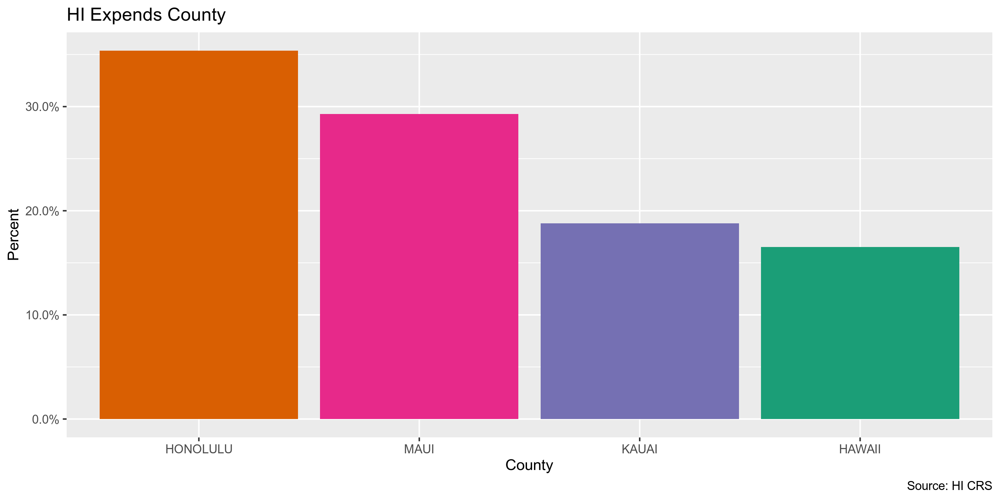
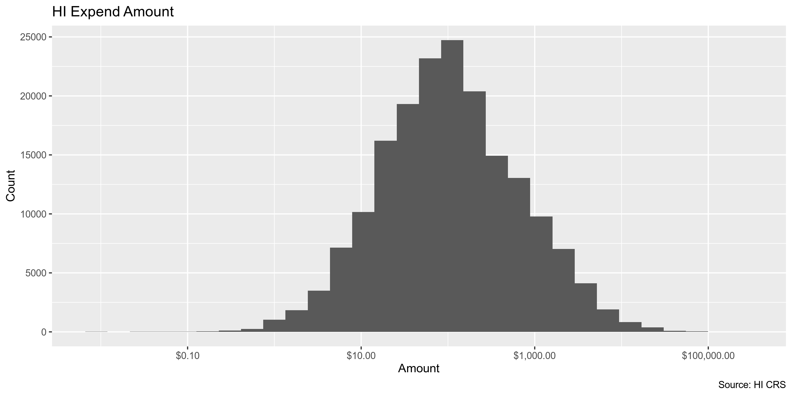
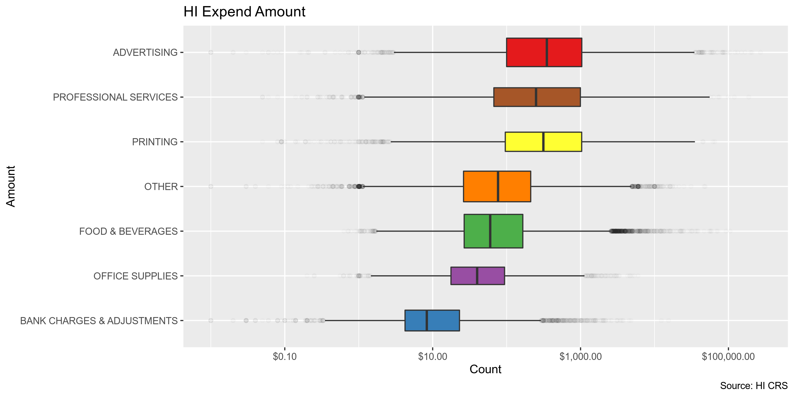
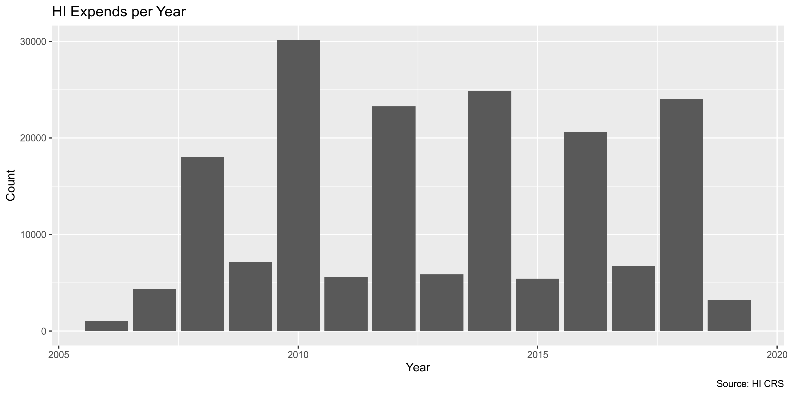
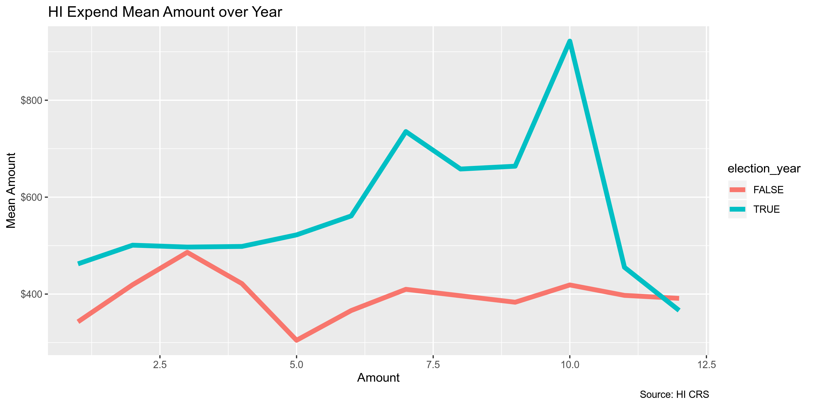

Hawaii Expenditures
================
Kiernan Nicholls, Yanqi Xu, and Aarushi Sahejpal
2023-05-30 13:05:19

- <a href="#project" id="toc-project">Project</a>
- <a href="#objectives" id="toc-objectives">Objectives</a>
- <a href="#packages" id="toc-packages">Packages</a>
- <a href="#data" id="toc-data">Data</a>
- <a href="#import" id="toc-import">Import</a>
- <a href="#explore" id="toc-explore">Explore</a>
- <a href="#wrangle" id="toc-wrangle">Wrangle</a>
- <a href="#conclude" id="toc-conclude">Conclude</a>
- <a href="#export" id="toc-export">Export</a>
- <a href="#export-1" id="toc-export-1">Export</a>
- <a href="#upload" id="toc-upload">Upload</a>

## Project

The Accountability Project is an effort to cut across data silos and
give journalists, policy professionals, activists, and the public at
large a simple way to search across huge volumes of public data about
people and organizations.

Our goal is to standardizing public data on a few key fields by thinking
of each dataset row as a transaction. For each transaction there should
be (at least) 3 variables:

1.  All **parties** to a transaction
2.  The **date** of the transaction
3.  The **amount** of money involved

## Objectives

This document describes the process used to complete the following
objectives:

1.  How many records are in the database?
2.  Check for duplicates
3.  Check ranges
4.  Is there anything blank or missing?
5.  Check for consistency issues
6.  Create a five-digit ZIP Code called `ZIP5`
7.  Create a `YEAR` field from the transaction date
8.  Make sure there is data on both parties to a transaction

## Packages

The following packages are needed to collect, manipulate, visualize,
analyze, and communicate these results. The `pacman` package will
facilitate their installation and attachment.

``` r
if (!require("pacman")) install.packages("pacman")
if (!require("pacman")) install.packages("pacman")
pacman::p_load_gh("irworkshop/campfin")
pacman::p_load(
  tidyverse, # data manipulation
  tidytext, #unnest tokens
  lubridate, # datetime strings
  magrittr, # pipe operators
  gluedown, # print markdown
  janitor, # dataframe clean
  refinr, # cluster and merge
  aws.s3, # aws cloud storage
  scales, # format strings
  rvest, # read html pages
  RSocrata, # read SODA API
  knitr, # knit documents
  stringdist, # token distance
  vroom, # read files fast
  glue, # combine strings
  here, # relative storage
  fs # search storage 
)
```

The IRW’s `campfin` package will also have to be installed from GitHub.
This package contains functions custom made to help facilitate the
processing of campaign finance data.

``` r
pacman::p_load_gh("irworkshop/campfin")
```

This document should be run as part of the `R_campfin` project, which
lives as a sub-directory of the more general, language-agnostic
[`irworkshop/accountability_datacleaning`](https://github.com/irworkshop/accountability_datacleaning "TAP repo")
GitHub repository.

The `R_campfin` project uses the [RStudio
projects](https://support.rstudio.com/hc/en-us/articles/200526207-Using-Projects "Rproj")
feature and should be run as such. The project also uses the dynamic
`here::here()` tool for file paths relative to *your* machine.

``` r
# where dfs this document knit?
here::here()
#> [1] "/Volumes/TAP/accountability_datacleaning"
```

## Data

Data is provided by the Hawaii Campaign Spending Committee’s Socrata
open data portal. From the [Primer metadata
page](https://opendata.hawaii.gov/dataset/expenditures-made-by-hawaii-state-and-county-candidates),
we can find more information. The Records Reporting System RSN is 38832.
The file was created on December 12, 2019 and last updated February 8,
2023. This file represents expenditures made by Hawaii state and county
candidates From November 8, 2006 Through December 31, 2022.

## Import

The data can be directly read using `RSocrata::read.socrata()`.

``` r
raw_dir <- dir_create(here("state","hi", "expends", "data", "raw"))
```

``` r
# hie <- as_tibble(read.socrata("https://data.hawaii.gov/resource/3maa-4fgr.json"))
raw_url <- "http://hicscdata.hawaii.gov/api/views/3maa-4fgr/rows.csv?accessType=DOWNLOAD"
raw_path <- path(raw_dir,"hi_exp_download.csv")

if (this_file_new(raw_path)) {
  download.file(raw_url, raw_path, method = "libcurl")
}
```

Then we can make some general changes to the structure and format of the
data frame.

``` r
hie <- read_csv(dir_ls(raw_dir)) %>% clean_names()

hie <- hie %>% 
  mutate_if(
    is_character, 
    str_to_upper
  ) %>% 
  mutate(
    amount = as.double(amount)
  ) 
```

## Explore

``` r
head(hie)
```

    #> # A tibble: 6 × 21
    #>   candidate_name   vendor_type  vendor_name        date  amount authorized_use expenditure_category
    #>   <chr>            <chr>        <chr>              <chr>  <dbl> <chr>          <chr>               
    #> 1 AIONA, JAMES     OTHER ENTITY HAWAIIAN TELCOM    05/1…  131.  <NA>           UTILITIES           
    #> 2 AIONA, JAMES     OTHER ENTITY EDWARD ENTERPRISES 03/0… 1263.  <NA>           POSTAGE/MAILING     
    #> 3 AIONA, JAMES     OTHER ENTITY GLENN'S FLOWERS &… 11/0…   56.5 <NA>           OTHER               
    #> 4 AIONA, JAMES     OTHER ENTITY HAWAIIAN TELCOM    11/1…   57.3 <NA>           UTILITIES           
    #> 5 AKUNA, MEILING   CANDIDATE    AKUNA, MEILING     10/1…    0   <NA>           OTHER               
    #> 6 ANDERSON, IKAIKA OTHER ENTITY OLOMANA COMMUNITY… 07/2…  100   <NA>           DONATIONS           
    #> # ℹ 14 more variables: purpose_of_expenditure <chr>, address_1 <chr>, address_2 <chr>, city <chr>,
    #> #   state <chr>, zip_code <chr>, office <chr>, district <chr>, county <chr>, party <chr>,
    #> #   reg_no <chr>, election_period <chr>, mapping_location <chr>, in_out_state <chr>

``` r
tail(hie)
```

    #> # A tibble: 6 × 21
    #>   candidate_name  vendor_type  vendor_name         date  amount authorized_use expenditure_category
    #>   <chr>           <chr>        <chr>               <chr>  <dbl> <chr>          <chr>               
    #> 1 YUKIMURA, JOANN OTHER ENTITY GAYLORD'S           06/1…   37.9 <NA>           FOOD & BEVERAGES    
    #> 2 YAMASHITA, KYLE OTHER ENTITY EAST MAUI DISTRICT… 10/1…  500   <NA>           CAMPAIGN HEADQUARTE…
    #> 3 YAMASHITA, KYLE OTHER ENTITY PUKALANI ELEMENTAR… 03/1…  250   PUBLIC SCHOOL… DONATIONS           
    #> 4 YOUNG, BYRON    OTHER ENTITY BUILDASIGN.COM      04/1…  494   DIRECTLY RELA… ADVERTISING, MEDIA …
    #> 5 YAMASHITA, KYLE OTHER ENTITY U.S. POSTAL SERVICE 03/2…    5   DIRECTLY RELA… POSTAGE/MAILING     
    #> 6 YUKIMURA, JOANN OTHER ENTITY HAWAII LINK         06/0…   46.8 <NA>           CONTRACT, EMPLOYEE …
    #> # ℹ 14 more variables: purpose_of_expenditure <chr>, address_1 <chr>, address_2 <chr>, city <chr>,
    #> #   state <chr>, zip_code <chr>, office <chr>, district <chr>, county <chr>, party <chr>,
    #> #   reg_no <chr>, election_period <chr>, mapping_location <chr>, in_out_state <chr>

``` r
glimpse(hie)
```

    #> Rows: 237,202
    #> Columns: 21
    #> $ candidate_name         <chr> "AIONA, JAMES", "AIONA, JAMES", "AIONA, JAMES", "AIONA, JAMES", "A…
    #> $ vendor_type            <chr> "OTHER ENTITY", "OTHER ENTITY", "OTHER ENTITY", "OTHER ENTITY", "C…
    #> $ vendor_name            <chr> "HAWAIIAN TELCOM", "EDWARD ENTERPRISES", "GLENN'S FLOWERS & PLANTS…
    #> $ date                   <chr> "05/18/2009", "03/04/2009", "11/07/2008", "11/16/2010", "10/11/201…
    #> $ amount                 <dbl> 130.92, 1263.17, 56.54, 57.28, 0.00, 100.00, 20.92, 6.50, 100.00, …
    #> $ authorized_use         <chr> NA, NA, NA, NA, NA, NA, NA, NA, NA, NA, NA, NA, NA, NA, NA, NA, NA…
    #> $ expenditure_category   <chr> "UTILITIES", "POSTAGE/MAILING", "OTHER", "UTILITIES", "OTHER", "DO…
    #> $ purpose_of_expenditure <chr> "TELEPHONE", "POSTAGE", "FLOWERS", "INTERNET", "NO EXPENDITURES", …
    #> $ address_1              <chr> "PO BOX 30770", "PO BOX 30468", "PO BOX 553", "PO BOX 30770", "HC1…
    #> $ address_2              <chr> NA, NA, NA, NA, NA, NA, NA, NA, NA, NA, NA, NA, NA, NA, NA, NA, NA…
    #> $ city                   <chr> "HONOLULU", "HONOLULU", "WAIMANALO", "HONOLULU", "HAIKU", "KAILUA"…
    #> $ state                  <chr> "HI", "HI", "HI", "HI", "HI", "HI", "HI", "HI", "HI", "HI", "HI", …
    #> $ zip_code               <chr> "96820", "96820", "96795", "96820", "96708", "96734", "96797", "96…
    #> $ office                 <chr> "GOVERNOR", "GOVERNOR", "GOVERNOR", "GOVERNOR", "HOUSE", "HONOLULU…
    #> $ district               <chr> NA, NA, NA, NA, NA, NA, NA, NA, NA, NA, NA, NA, NA, NA, NA, NA, NA…
    #> $ county                 <chr> NA, NA, NA, NA, NA, NA, NA, NA, NA, NA, NA, NA, NA, NA, NA, NA, NA…
    #> $ party                  <chr> NA, NA, NA, NA, NA, NA, NA, NA, NA, NA, NA, NA, NA, NA, NA, NA, NA…
    #> $ reg_no                 <chr> "CC10162", "CC10162", "CC10162", "CC10162", "CC10756", "CC10472", …
    #> $ election_period        <chr> "2006-2010", "2006-2010", "2006-2010", "2010-2014", "2008-2010", "…
    #> $ mapping_location       <chr> NA, NA, NA, NA, NA, NA, NA, NA, NA, NA, NA, NA, NA, NA, NA, NA, NA…
    #> $ in_out_state           <chr> "HI", "HI", "HI", "HI", "HI", "HI", "HI", "HI", "HI", "HI", "HI", …

### Distinct

``` r
col_stats(hie, n_distinct)
```

    #> # A tibble: 21 × 4
    #>    col                    class     n          p
    #>    <chr>                  <chr> <int>      <dbl>
    #>  1 candidate_name         <chr>  1331 0.00561   
    #>  2 vendor_type            <chr>     6 0.0000253 
    #>  3 vendor_name            <chr> 39102 0.165     
    #>  4 date                   <chr>  5886 0.0248    
    #>  5 amount                 <dbl> 52186 0.220     
    #>  6 authorized_use         <chr>     9 0.0000379 
    #>  7 expenditure_category   <chr>    27 0.000114  
    #>  8 purpose_of_expenditure <chr> 94387 0.398     
    #>  9 address_1              <chr> 42926 0.181     
    #> 10 address_2              <chr>  3275 0.0138    
    #> 11 city                   <chr>  2054 0.00866   
    #> 12 state                  <chr>    57 0.000240  
    #> 13 zip_code               <chr>  3396 0.0143    
    #> 14 office                 <chr>    12 0.0000506 
    #> 15 district               <chr>    66 0.000278  
    #> 16 county                 <chr>     5 0.0000211 
    #> 17 party                  <chr>     9 0.0000379 
    #> 18 reg_no                 <chr>  1486 0.00626   
    #> 19 election_period        <chr>    24 0.000101  
    #> 20 mapping_location       <chr> 35355 0.149     
    #> 21 in_out_state           <chr>     2 0.00000843

We can use `campfin::explore_plot()` and/or `ggplot2::geom_bar()` to
explore the distribution of distinct categorical variables.

<!-- -->

<!-- -->

<!-- -->

<!-- -->

<!-- -->

<!-- -->

<!-- -->

### Duplicates

We can use `janitor::get_dupes()` to create a separate table of
duplicate rows, then flag those rows on the original data frame.

``` r
hie <- flag_dupes(hie, everything())
tabyl(hie$dupe_flag)
#> # A tibble: 2 × 3
#>   `hie$dupe_flag`      n percent
#>   <lgl>            <int>   <dbl>
#> 1 FALSE           233856  0.986 
#> 2 TRUE              3346  0.0141
```

### Missing

We flag the fields that miss the “city” field.

``` r
col_stats(hie, count_na)
```

    #> # A tibble: 22 × 4
    #>    col                    class      n        p
    #>    <chr>                  <chr>  <int>    <dbl>
    #>  1 candidate_name         <chr>      0 0       
    #>  2 vendor_type            <chr>      0 0       
    #>  3 vendor_name            <chr>      0 0       
    #>  4 date                   <chr>      0 0       
    #>  5 amount                 <dbl>      0 0       
    #>  6 authorized_use         <chr>  97292 0.410   
    #>  7 expenditure_category   <chr>      0 0       
    #>  8 purpose_of_expenditure <chr>      0 0       
    #>  9 address_1              <chr>    114 0.000481
    #> 10 address_2              <chr> 221529 0.934   
    #> 11 city                   <chr>     42 0.000177
    #> 12 state                  <chr>      0 0       
    #> 13 zip_code               <chr>      0 0       
    #> 14 office                 <chr>      0 0       
    #> 15 district               <chr> 194545 0.820   
    #> 16 county                 <chr> 216531 0.913   
    #> 17 party                  <chr> 176928 0.746   
    #> 18 reg_no                 <chr>      0 0       
    #> 19 election_period        <chr>      0 0       
    #> 20 mapping_location       <chr>  57267 0.241   
    #> 21 in_out_state           <chr>      0 0       
    #> 22 dupe_flag              <lgl>      0 0

``` r
key_vars <- c("city","party")

hie <- flag_na(hie, all_of(key_vars))
tabyl(hie$na_flag)
```

    #> # A tibble: 2 × 3
    #>   `hie$na_flag`      n percent
    #>   <lgl>          <int>   <dbl>
    #> 1 FALSE          60267   0.254
    #> 2 TRUE          176935   0.746

### Ranges

#### Amount

``` r
summary(hie$amount)
#>      Min.   1st Qu.    Median      Mean   3rd Qu.      Max. 
#>  -5898.00     27.17    100.00    616.02    353.36 271096.00
sum(hie$amount < 0)
#> [1] 306
```

<!-- -->

<!-- -->

<!-- -->

<!-- -->

#### Date

To better explore the distribution of dates and track expenditures, we
will create a `year_clean` variable from `date` using
`lubridate::year()`.

``` r
hie <- hie %>% mutate(date = as.Date(date, format = "%m/%d/%Y"))
hie <- mutate(hie, year_clean = year(date))
```

``` r
min(hie$date)
#> [1] "2006-11-08"
max(hie$date)
#> [1] "2023-01-27"
```

We can see the expenditures naturally increase in frequency every other
year, during the elections.

``` r
hie %>%
  ggplot(aes(year_clean)) +
  geom_bar() +
  labs(
    title = "HI Expends per Year",
    caption = "Source: HI CRS",
    x = "Year",
    y = "Count"
  )
```

<!-- -->

``` r
is_even <- function(x) x %% 2 == 0
hie %>% 
  mutate(election_year = is_even(year_clean)) %>% 
  group_by(year_clean, election_year) %>% 
  summarize(mean = mean(amount)) %>% 
  ggplot(aes(year_clean, mean)) +
  geom_col(aes(fill = election_year)) +
  scale_y_continuous(labels = dollar) +
  labs(
    title = "HI Expend Mean Amount per Year",
    caption = "Source: HI CRS",
    fill = "Election Year",
    x = "Amount",
    y = "Mean Amount"
  )
```

<!-- -->

``` r
hie %>% 
  mutate(
    month = month(date),
    election_year = is_even(year_clean)
  ) %>%
  group_by(month, election_year) %>% 
  summarize(mean = mean(amount)) %>% 
  ggplot(aes(month, mean)) +
  scale_y_continuous(labels = dollar) +
  geom_line(size = 2, aes(color = election_year)) +
  labs(
    title = "HI Expend Mean Amount over Year",
    caption = "Source: HI CRS",
    fill = "Election Year",
    x = "Amount",
    y = "Mean Amount"
  )
```

<!-- -->

## Wrangle

To improve the searchability of the database, we can perform some
functional data cleaning and text normalization, using the
`campfin::normal_*()` functions, which wrap around `stringr::str_*()`
functions.

### Address

``` r
hie <- hie %>% 
  unite(
    col = address_combine,
    address_1, address_2,
    sep = " ",
    remove = FALSE,
    na.rm = TRUE
  ) %>% 
  mutate(
    address_norm = normal_address(
      address = address_combine,
      abbs = usps_street,
      na_rep = TRUE
    )
  )
```

``` r
hie %>% 
  select(
    address_1,
    address_2,
    address_norm
  ) %>% head(10)
```

    #> # A tibble: 10 × 3
    #>    address_1                   address_2 address_norm               
    #>    <chr>                       <chr>     <chr>                      
    #>  1 PO BOX 30770                <NA>      PO BOX 30770               
    #>  2 PO BOX 30468                <NA>      PO BOX 30468               
    #>  3 PO BOX 553                  <NA>      PO BOX 553                 
    #>  4 PO BOX 30770                <NA>      PO BOX 30770               
    #>  5 HC173 WAILUA ROAD KEANAE    <NA>      HC173 WAILUA ROAD KEANAE   
    #>  6 P.O. BOX 734                <NA>      PO BOX 734                 
    #>  7 97-799 LUMIAINA ST.         <NA>      97799 LUMIAINA ST          
    #>  8 ONLINE CONTRIBUTION SERVICE <NA>      ONLINE CONTRIBUTION SERVICE
    #>  9 P. O. BOX 790100            <NA>      P O BOX 790100             
    #> 10 P. O. BOX 548               <NA>      P O BOX 548

### ZIP

``` r
n_distinct(hie$zip_code)
#> [1] 3396
prop_in(hie$zip_code, valid_zip)
#> [1] 0.955658
sum(hie$zip_code %out% valid_zip)
#> [1] 10518
```

``` r
hie <- hie %>% 
  mutate(
    zip_norm = normal_zip(
      zip = zip_code,
      na_rep = TRUE
    )
  )
```

``` r
n_distinct(hie$zip_norm)
#> [1] 2301
prop_in(hie$zip_norm, valid_zip)
#> [1] 0.9972174
sum(hie$zip_norm %out% valid_zip)
#> [1] 1747
```

### State

100% of `state` values are valid.

``` r
n_distinct(hie$state)
#> [1] 57
prop_in(hie$state, valid_state)
#> [1] 1
sum(hie$state %out% valid_state)
#> [1] 0
```

### City

#### Normal

``` r
n_distinct(hie$city)
#> [1] 2054
prop_in(hie$city, valid_city)
#> [1] 0.954537
sum(unique(hie$city) %out% valid_city)
#> [1] 1095
```

``` r
hie %>% 
  count(city, sort = TRUE) %>% 
  filter(city %out% valid_city)
```

    #> # A tibble: 1,095 × 2
    #>    city               n
    #>    <chr>          <int>
    #>  1 KAILUA-KONA     2742
    #>  2 SOMMERVILLE      343
    #>  3 95131            227
    #>  4 HON              210
    #>  5 ???              202
    #>  6 IWILEI           190
    #>  7 ONLINE           171
    #>  8 HONOLULU, OAHU   147
    #>  9 -                133
    #> 10 KANE'OHE         132
    #> # ℹ 1,085 more rows

``` r
hie <- hie %>% 
  mutate(
    city_norm = normal_city(
      city = city,
      abbs = usps_city,
      states = c("HI", "HAWAII", "DC"),
      na = invalid_city,
      na_rep = TRUE
    )
  )

n_distinct(hie$city_norm)
```

    #> [1] 1861

``` r
prop_in(hie$city_norm, valid_city)
```

    #> [1] 0.9642647

``` r
sum(unique(hie$city_norm) %out% valid_city)
```

    #> [1] 897

#### Swap

``` r
hie <- hie %>% 
  rename(city_raw = city) %>% 
  left_join(
    y = zipcodes,
    by = c(
      "zip_norm" = "zip", 
      "state" = "state"
    )
  ) %>% 
  rename(city_match = city) %>% 
  mutate(
    match_dist = stringdist(city_norm, city_match),
    city_swap = if_else(
      condition = match_dist == 1,
      true = city_match,
      false = city_norm
    )
  )

mean(hie$match_dist, na.rm = TRUE)
#> [1] 0.1991597
max(hie$match_dist, na.rm = TRUE)
#> [1] 27
sum(hie$match_dist == 1, na.rm = TRUE)
#> [1] 4970
n_distinct(hie$city_swap)
#> [1] 1357
prop_in(hie$city_swap, valid_city)
#> [1] 0.9874731
sum(unique(hie$city_swap) %out% valid_city)
#> [1] 402
```

``` r
hie %>% 
  count(state, city_swap, sort = TRUE) %>% 
  filter(city_swap %out% valid_city) %>% 
  drop_na()
```

    #> # A tibble: 403 × 3
    #>    state city_swap         n
    #>    <chr> <chr>         <int>
    #>  1 HI    HON             233
    #>  2 HI    IWILEI          190
    #>  3 HI    HONOLULU OAHU   146
    #>  4 CA    MOUNT VIEW      110
    #>  5 PA    CHESTERBROOK    105
    #>  6 HI    LANAI            95
    #>  7 HI    WAILEA           89
    #>  8 HI    KONA             81
    #>  9 CA    SAN FRANSCISO    67
    #> 10 HI    KAHULUI MAUI     56
    #> # ℹ 393 more rows

``` r
hie$city_swap <- hie$city_swap %>% 
  str_replace("^HON$", "HONOLULU") %>% 
  na_if("HI")

prop_in(hie$city_swap, valid_city)
```

    #> [1] 0.9886222

``` r
hie <- hie %>% rename(city_clean = city_swap)
```

## Conclude

1.  There are 237,202 records in the database.
2.  There are 3346 duplicate records, flagged with `dupe_flag`.
3.  Ranges for `amount` and `date` are both reasonable.
4.  There are no missing records of importance.
5.  Consistency issues in geographic values have been improved.
6.  The 5-digit `zip_norm` variable has been created with
    `campfin::normal_zip(hie$zip_code)`
7.  The 4-gitit `year_clean` variable has been created with
    `lubridate::year(hie$date)`
8.  Every record has a payer, payee, date, and amount.

## Export

``` r
proc_dir <- here("state","hi", "expends", "data", "processed")
dir_create(proc_dir)

hie <- hie %>% 
  select(
    -zip_code,
    -address_1,
    -address_2,
    -address_combine,
    -city_norm,
    -city_match,
    -match_dist
  )
```

## Export

``` r
# lookup <- read_csv("state/hi/expends/data/hi_city_lookup.csv") %>% select(1:2)
# hie <- left_join(hie, lookup)
progress_table(hie$city_raw,
               hie$city_norm,
               hie$city_clean, compare = valid_city)
```

    #> # A tibble: 3 × 6
    #>   stage          prop_in n_distinct    prop_na n_out n_diff
    #>   <chr>            <dbl>      <dbl>      <dbl> <dbl>  <dbl>
    #> 1 hie$city_raw     0.955       2054   0.000177 10782   1095
    #> 2 hie$city_norm  NaN              0 NaN            0      0
    #> 3 hie$city_clean   0.989       1355   0.0148    2659    400

``` r
write_csv(
  x = hie,
  path = glue("{proc_dir}/hi_expends_20230127.csv"),
  na = ""
)
```

## Upload

We can use the `aws.s3::put_object()` to upload the text file to the IRW
server.

``` r
aws_path <- path("csv", basename(clean_path))
if (!object_exists(aws_path, "publicaccountability")) {
  put_object(
    file = clean_path,
    object = aws_path, 
    bucket = "publicaccountability",
    acl = "public-read",
    show_progress = TRUE,
    multipart = TRUE
  )
}
aws_head <- head_object(aws_path, "publicaccountability")
(aws_size <- as_fs_bytes(attr(aws_head, "content-length")))
unname(aws_size == clean_size)
```
