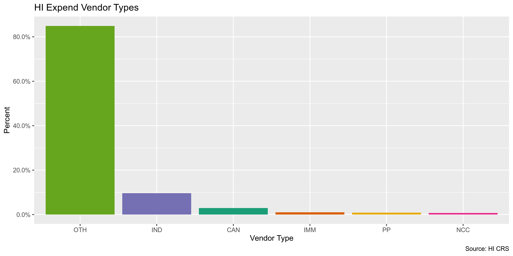
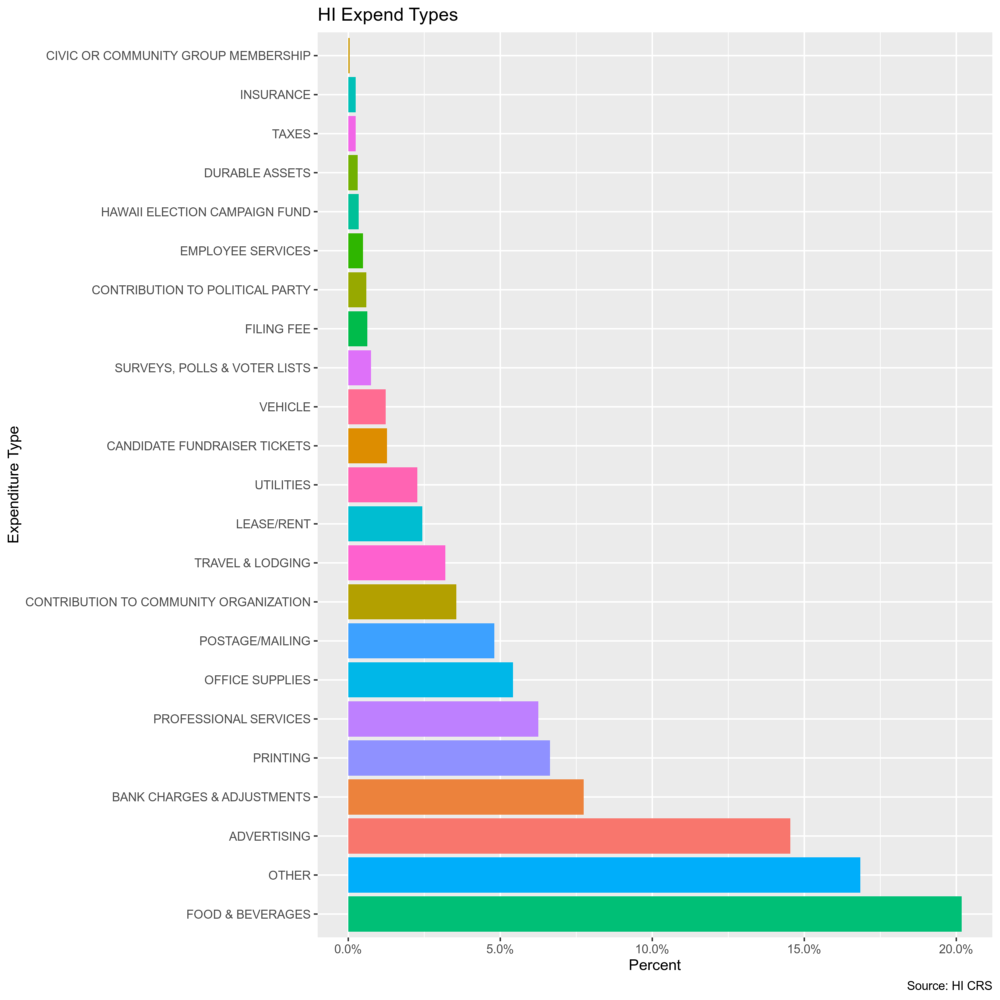
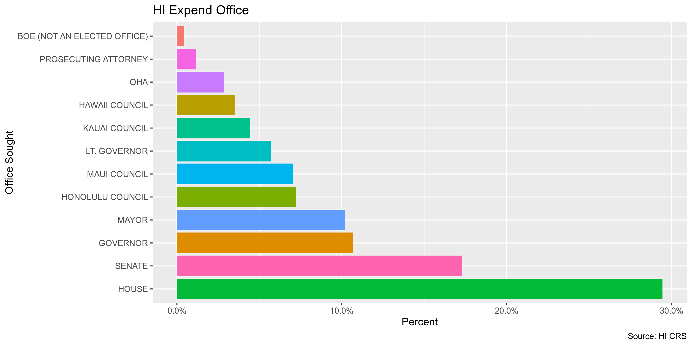
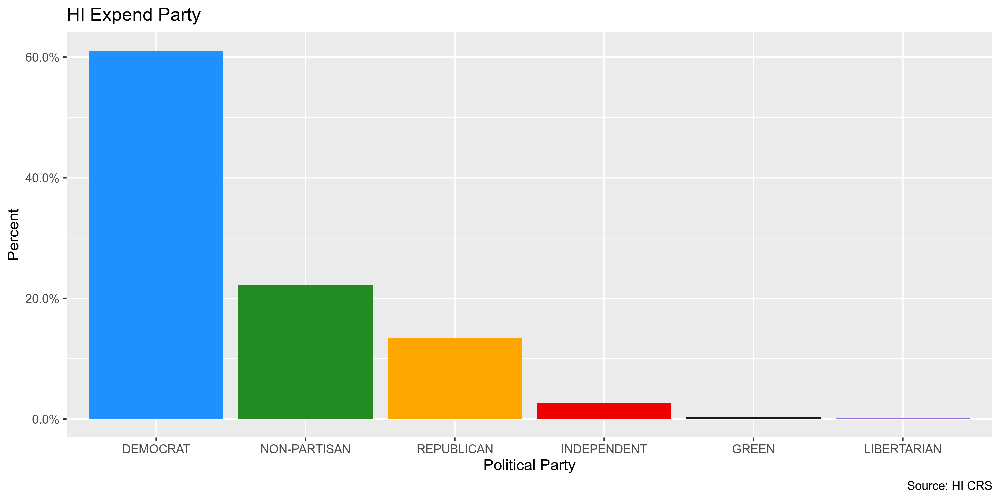
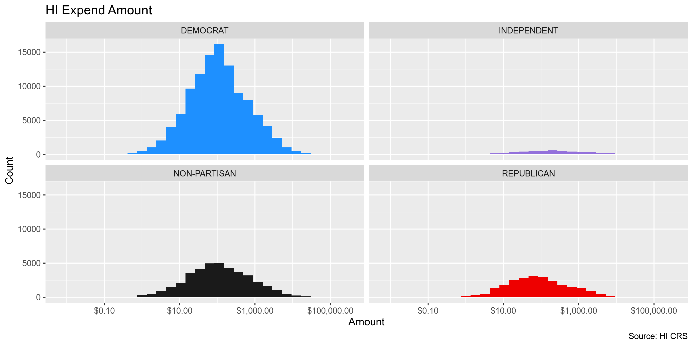
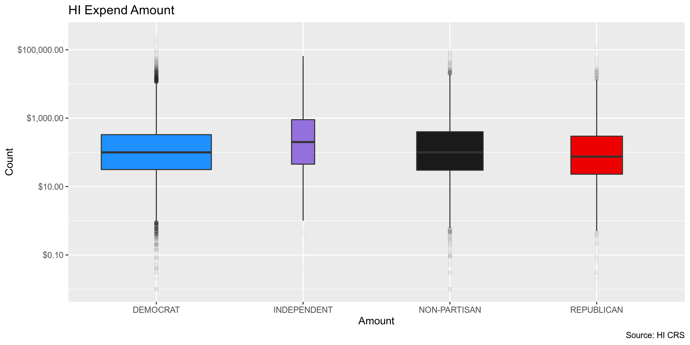
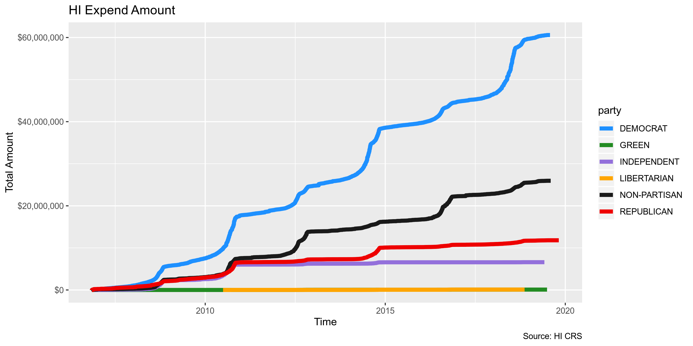
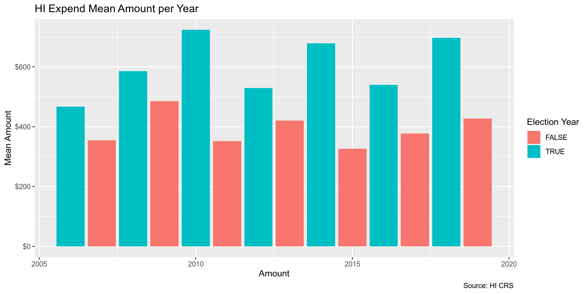

Hawaii Expenditures
================
Kiernan Nicholls & Yanqi Xu
2022-12-17 16:25:26

-   <a href="#project" id="toc-project">Project</a>
-   <a href="#objectives" id="toc-objectives">Objectives</a>
-   <a href="#packages" id="toc-packages">Packages</a>
-   <a href="#data" id="toc-data">Data</a>
-   <a href="#import" id="toc-import">Import</a>
-   <a href="#explore" id="toc-explore">Explore</a>
-   <a href="#wrangle" id="toc-wrangle">Wrangle</a>
-   <a href="#conclude" id="toc-conclude">Conclude</a>
-   <a href="#export" id="toc-export">Export</a>
-   <a href="#export-1" id="toc-export-1">Export</a>

## Project

The Accountability Project is an effort to cut across data silos and
give journalists, policy professionals, activists, and the public at
large a simple way to search across huge volumes of public data about
people and organizations.

Our goal is to standardizing public data on a few key fields by thinking
of each dataset row as a transaction. For each transaction there should
be (at least) 3 variables:

1.  All **parties** to a transaction
2.  The **date** of the transaction
3.  The **amount** of money involved

## Objectives

This document describes the process used to complete the following
objectives:

1.  How many records are in the database?
2.  Check for duplicates
3.  Check ranges
4.  Is there anything blank or missing?
5.  Check for consistency issues
6.  Create a five-digit ZIP Code called `ZIP5`
7.  Create a `YEAR` field from the transaction date
8.  Make sure there is data on both parties to a transaction

## Packages

The following packages are needed to collect, manipulate, visualize,
analyze, and communicate these results. The `pacman` package will
facilitate their installation and attachment.

``` r
if (!require("pacman")) install.packages("pacman")
if (!require("pacman")) install.packages("pacman")
pacman::p_load_gh("irworkshop/campfin")
pacman::p_load(
  tidyverse, # data manipulation
  tidytext, #unnest tokens
  lubridate, # datetime strings
  magrittr, # pipe operators
  gluedown, # print markdown
  janitor, # dataframe clean
  refinr, # cluster and merge
  aws.s3, # aws cloud storage
  scales, # format strings
  rvest, # read html pages
RSocrata, # read SODA API
  knitr, # knit documents
  stringdist, # token distance
  vroom, # read files fast
  glue, # combine strings
  here, # relative storage
  fs # search storage 
)
```

The IRW’s `campfin` package will also have to be installed from GitHub.
This package contains functions custom made to help facilitate the
processing of campaign finance data.

``` r
pacman::p_load_gh("irworkshop/campfin")
```

This document should be run as part of the `R_campfin` project, which
lives as a sub-directory of the more general, language-agnostic
[`irworkshop/accountability_datacleaning`](https://github.com/irworkshop/accountability_datacleaning "TAP repo")
GitHub repository.

The `R_campfin` project uses the [RStudio
projects](https://support.rstudio.com/hc/en-us/articles/200526207-Using-Projects "Rproj")
feature and should be run as such. The project also uses the dynamic
`here::here()` tool for file paths relative to *your* machine.

``` r
# where dfs this document knit?
here::here()
#> [1] "/Users/yanqixu/code/accountability_datacleaning"
```

## Data

Data is provided by the Hawaii Campaign Spending Committee’s Socrata
open data portal. From the [Primer metadata
page](https://data.hawaii.gov/Community/Expenditures-Made-By-Hawaii-State-and-County-Candi/3maa-4fgr),
we can find more information. The Records Reporting System RSN is 38832.
The file was created on February 26, 2013 and last updated Nov 3, 2022.

## Import

The data can be directly read using `RSocrata::read.socrata()`.

``` r
raw_dir <- dir_create(here("state","hi", "expends", "data", "raw"))
```

``` r
#hie <- as_tibble(read.socrata("https://data.hawaii.gov/resource/3maa-4fgr.json"))
raw_url <- "http://hicscdata.hawaii.gov/api/views/3maa-4fgr/rows.csv?accessType=DOWNLOAD"
raw_path <- path(raw_dir,"hi_exp_download.csv")

if (this_file_new(raw_path)) {
  download.file(raw_url, raw_path, method = "libcurl")
}
```

Then we can make some general changes to the structure and format of the
data frame.

``` r
hie <- read_csv(dir_ls(raw_dir)) %>% clean_names()

hie <- hie %>% 
  mutate_if(
    is_character, 
    str_to_upper
  ) %>% 
  mutate(
    amount = as.double(amount)
  ) 
```

## Explore

``` r
head(hie)
```

    #> # A tibble: 6 × 21
    #>   candid…¹ vendo…² vendo…³ date  amount autho…⁴ expen…⁵ purpo…⁶ addre…⁷ addre…⁸ city  state zip_c…⁹
    #>   <chr>    <chr>   <chr>   <chr>  <dbl> <chr>   <chr>   <chr>   <chr>   <chr>   <chr> <chr> <chr>  
    #> 1 AIONA, … OTHER … SERVPA… 10/0…  868.  <NA>    UTILIT… TELEPH… PO BOX… <NA>    HONO… HI    96803  
    #> 2 AIONA, … OTHER … HAWAII… 04/0…  130.  <NA>    UTILIT… TELEPH… PO BOX… <NA>    HONO… HI    96820  
    #> 3 AIONA, … OTHER … USPS K… 09/1…   44   <NA>    POSTAG… POSTAGE HAHANI… <NA>    KAIL… HI    96734  
    #> 4 AIONA, … OTHER … NEW SE… 06/0…   20   <NA>    OTHER   GRATUI… PO BOX… <NA>    KANE… HI    96744  
    #> 5 AIONA, … OTHER … FEDEX   12/0…   45.5 <NA>    POSTAG… SHIPPI… PO BOX… <NA>    PASA… CA    91109  
    #> 6 ANDERSO… INDIVI… HIYAKU… 09/1… 1000   <NA>    OTHER   RETURN… P.O. B… <NA>    AIEA  HI    96701  
    #> # … with 8 more variables: office <chr>, district <chr>, county <chr>, party <chr>, reg_no <chr>,
    #> #   election_period <chr>, mapping_location <chr>, in_out_state <chr>, and abbreviated variable
    #> #   names ¹​candidate_name, ²​vendor_type, ³​vendor_name, ⁴​authorized_use, ⁵​expenditure_category,
    #> #   ⁶​purpose_of_expenditure, ⁷​address_1, ⁸​address_2, ⁹​zip_code

``` r
tail(hie)
```

    #> # A tibble: 6 × 21
    #>   candid…¹ vendo…² vendo…³ date  amount autho…⁴ expen…⁵ purpo…⁶ addre…⁷ addre…⁸ city  state zip_c…⁹
    #>   <chr>    <chr>   <chr>   <chr>  <dbl> <chr>   <chr>   <chr>   <chr>   <chr>   <chr> <chr> <chr>  
    #> 1 WILLE, … OTHER … KAMUEL… 09/2…  120.  DIRECT… OTHER   PAPER … 67-114… <NA>    KAMU… HI    96743  
    #> 2 VICTORI… POLITI… MAUI D… 07/2…   45   <NA>    OTHER   LUNCHE… P.O. B… <NA>    KULA  HI    96790  
    #> 3 WHITING… OTHER … US POS… 08/0…  175   DIRECT… POSTAG… STAMPS  95-566… <NA>    NA'A… HI    96772  
    #> 4 WHITING… OTHER … US POS… 06/2…    7   DIRECT… POSTAG… STAMPS  96-316… <NA>    PAHA… HI    96777  
    #> 5 WAKAI, … CANDID… WAKAI,… 05/0…   70.6 <NA>    FOOD &… REIMB.… 1541 A… <NA>    HONO… HI    96819  
    #> 6 WEATHER… OTHER … HAWAII… 04/1… 2541.  <NA>    ADVERT… NEWSPA… P.O. B… <NA>    HILO  HI    96721  
    #> # … with 8 more variables: office <chr>, district <chr>, county <chr>, party <chr>, reg_no <chr>,
    #> #   election_period <chr>, mapping_location <chr>, in_out_state <chr>, and abbreviated variable
    #> #   names ¹​candidate_name, ²​vendor_type, ³​vendor_name, ⁴​authorized_use, ⁵​expenditure_category,
    #> #   ⁶​purpose_of_expenditure, ⁷​address_1, ⁸​address_2, ⁹​zip_code

``` r
glimpse(hie)
```

    #> Rows: 232,898
    #> Columns: 21
    #> $ candidate_name         <chr> "AIONA, JAMES", "AIONA, JAMES", "AIONA, JAMES", "AIONA, JAMES", "A…
    #> $ vendor_type            <chr> "OTHER ENTITY", "OTHER ENTITY", "OTHER ENTITY", "OTHER ENTITY", "O…
    #> $ vendor_name            <chr> "SERVPAC INC.", "HAWAIIAN TELCOM", "USPS KAILUA", "NEW SEASON ENTE…
    #> $ date                   <chr> "10/05/2010", "04/02/2009", "09/14/2010", "06/02/2010", "12/08/201…
    #> $ amount                 <dbl> 868.27, 130.44, 44.00, 20.00, 45.47, 1000.00, 12.00, 50.00, 430.13…
    #> $ authorized_use         <chr> NA, NA, NA, NA, NA, NA, NA, NA, NA, NA, NA, NA, NA, NA, NA, NA, NA…
    #> $ expenditure_category   <chr> "UTILITIES", "UTILITIES", "POSTAGE/MAILING", "OTHER", "POSTAGE/MAI…
    #> $ purpose_of_expenditure <chr> "TELEPHONE", "TELEPHONE", "POSTAGE", "GRATUITY", "SHIPPING", "RETU…
    #> $ address_1              <chr> "PO BOX 2719", "PO BOX 30770", "HAHANI ST.", "PO BOX 4503", "PO BO…
    #> $ address_2              <chr> NA, NA, NA, NA, NA, NA, NA, "-", NA, NA, NA, NA, NA, NA, NA, NA, N…
    #> $ city                   <chr> "HONOLULU", "HONOLULU", "KAILUA", "KANEOHE", "PASADENA", "AIEA", "…
    #> $ state                  <chr> "HI", "HI", "HI", "HI", "CA", "HI", "HI", "HI", "HI", "HI", "HI", …
    #> $ zip_code               <chr> "96803", "96820", "96734", "96744", "91109", "96701", "96804", "96…
    #> $ office                 <chr> "GOVERNOR", "GOVERNOR", "GOVERNOR", "GOVERNOR", "GOVERNOR", "HONOL…
    #> $ district               <chr> NA, NA, NA, NA, NA, NA, NA, NA, NA, NA, NA, NA, NA, NA, NA, NA, NA…
    #> $ county                 <chr> NA, NA, NA, NA, NA, NA, NA, NA, NA, NA, NA, NA, NA, NA, NA, NA, NA…
    #> $ party                  <chr> NA, NA, NA, NA, NA, NA, NA, NA, NA, NA, NA, NA, NA, NA, NA, NA, NA…
    #> $ reg_no                 <chr> "CC10162", "CC10162", "CC10162", "CC10162", "CC10162", "CC10472", …
    #> $ election_period        <chr> "2006-2010", "2006-2010", "2006-2010", "2006-2010", "2010-2014", "…
    #> $ mapping_location       <chr> NA, NA, NA, NA, NA, NA, NA, NA, NA, NA, NA, NA, NA, NA, NA, NA, NA…
    #> $ in_out_state           <chr> "HI", "HI", "HI", "HI", "OUT OF STATE", "HI", "HI", "HI", "HI", "H…

### Distinct

``` r
col_stats(hie, n_distinct)
```

    #> # A tibble: 21 × 4
    #>    col                    class     n          p
    #>    <chr>                  <chr> <int>      <dbl>
    #>  1 candidate_name         <chr>  1312 0.00563   
    #>  2 vendor_type            <chr>     6 0.0000258 
    #>  3 vendor_name            <chr> 38501 0.165     
    #>  4 date                   <chr>  5816 0.0250    
    #>  5 amount                 <dbl> 51675 0.222     
    #>  6 authorized_use         <chr>     9 0.0000386 
    #>  7 expenditure_category   <chr>    27 0.000116  
    #>  8 purpose_of_expenditure <chr> 93062 0.400     
    #>  9 address_1              <chr> 42298 0.182     
    #> 10 address_2              <chr>  3215 0.0138    
    #> 11 city                   <chr>  2023 0.00869   
    #> 12 state                  <chr>    57 0.000245  
    #> 13 zip_code               <chr>  3324 0.0143    
    #> 14 office                 <chr>    12 0.0000515 
    #> 15 district               <chr>    66 0.000283  
    #> 16 county                 <chr>     5 0.0000215 
    #> 17 party                  <chr>     8 0.0000343 
    #> 18 reg_no                 <chr>  1461 0.00627   
    #> 19 election_period        <chr>    23 0.0000988 
    #> 20 mapping_location       <chr> 33603 0.144     
    #> 21 in_out_state           <chr>     2 0.00000859

We can use `campfin::explore_plot()` and/or `ggplot2::geom_bar()` to
explore the distribution of distinct categorical variables.

<!-- -->

<!-- -->

<!-- -->

<!-- -->

<!-- -->

<!-- -->

<!-- -->

<!-- -->

### Duplicates

We can use `janitor::get_dupes()` to create a separate table of
duplicate rows, then flag those rows on the original data frame.

``` r
hie <- flag_dupes(hie, everything())
tabyl(hie$dupe_flag)
#> # A tibble: 2 × 3
#>   `hie$dupe_flag`      n percent
#>   <lgl>            <int>   <dbl>
#> 1 FALSE           229641  0.986 
#> 2 TRUE              3257  0.0140
```

### Missing

We flag the fields that miss the “city” field.

``` r
col_stats(hie, count_na)
```

    #> # A tibble: 22 × 4
    #>    col                    class      n        p
    #>    <chr>                  <chr>  <int>    <dbl>
    #>  1 candidate_name         <chr>      0 0       
    #>  2 vendor_type            <chr>      0 0       
    #>  3 vendor_name            <chr>      0 0       
    #>  4 date                   <chr>      0 0       
    #>  5 amount                 <dbl>      0 0       
    #>  6 authorized_use         <chr>  97292 0.418   
    #>  7 expenditure_category   <chr>      0 0       
    #>  8 purpose_of_expenditure <chr>      0 0       
    #>  9 address_1              <chr>    114 0.000489
    #> 10 address_2              <chr> 217509 0.934   
    #> 11 city                   <chr>     42 0.000180
    #> 12 state                  <chr>      0 0       
    #> 13 zip_code               <chr>      0 0       
    #> 14 office                 <chr>      0 0       
    #> 15 district               <chr> 192310 0.826   
    #> 16 county                 <chr> 213056 0.915   
    #> 17 party                  <chr> 176635 0.758   
    #> 18 reg_no                 <chr>      0 0       
    #> 19 election_period        <chr>      0 0       
    #> 20 mapping_location       <chr>  61012 0.262   
    #> 21 in_out_state           <chr>      0 0       
    #> 22 dupe_flag              <lgl>      0 0

``` r
key_vars <- c("city","party")

hie <- flag_na(hie, all_of(key_vars))
tabyl(hie$na_flag)
```

    #> # A tibble: 2 × 3
    #>   `hie$na_flag`      n percent
    #>   <lgl>          <int>   <dbl>
    #> 1 FALSE          56256   0.242
    #> 2 TRUE          176642   0.758

### Ranges

#### Amount

``` r
summary(hie$amount)
#>      Min.   1st Qu.    Median      Mean   3rd Qu.      Max. 
#>  -5898.00     27.20     99.99    615.80    350.48 271096.00
sum(hie$amount < 0)
#> [1] 306
```

<!-- -->

<!-- -->

<!-- -->

<!-- -->

<!-- -->

#### Date

There are no dates before NA and NA dates past the creation of this
document.

``` r
min(hie$date)
#> [1] "01/01/2007"
max(hie$date)
#> [1] "12/31/2021"
sum(hie$date > today())
#> [1] NA
```

To better explore the distribution of dates and track expendtures, we
will create a `year_clean` variable from `date` using
`lubridate::year()`.

``` r
hie <- hie %>% mutate(date = as.Date(date, format = "%m/%d/%Y"))
hie <- mutate(hie, year_clean = year(date))
```

We can see the expenditures naturally increase in frequency every other
year, during the elections.

``` r
hie %>%
  ggplot(aes(year_clean)) +
  geom_bar() +
  labs(
    title = "HI Expends per Year",
    caption = "Source: HI CRS",
    x = "Year",
    y = "Count"
  )
```

<!-- -->

``` r
is_even <- function(x) x %% 2 == 0
hie %>% 
  mutate(election_year = is_even(year_clean)) %>% 
  group_by(year_clean, election_year) %>% 
  summarize(mean = mean(amount)) %>% 
  ggplot(aes(year_clean, mean)) +
  geom_col(aes(fill = election_year)) +
  scale_y_continuous(labels = dollar) +
  labs(
    title = "HI Expend Mean Amount per Year",
    caption = "Source: HI CRS",
    fill = "Election Year",
    x = "Amount",
    y = "Mean Amount"
  )
```

<!-- -->

``` r
hie %>% 
  mutate(
    month = month(date),
    election_year = is_even(year_clean)
  ) %>%
  group_by(month, election_year) %>% 
  summarize(mean = mean(amount)) %>% 
  ggplot(aes(month, mean)) +
  scale_y_continuous(labels = dollar) +
  geom_line(size = 2, aes(color = election_year)) +
  labs(
    title = "HI Expend Mean Amount over Year",
    caption = "Source: HI CRS",
    fill = "Election Year",
    x = "Amount",
    y = "Mean Amount"
  )
```

<!-- -->

## Wrangle

To improve the searchability of the database, we can perform some
functional data cleaning and text normalization, using the
`campfin::normal_*()` functions, which wrap around `stringr::str_*()`
functions.

### Address

``` r
hie <- hie %>% 
  unite(
    col = address_combine,
    address_1, address_2,
    sep = " ",
    remove = FALSE,
    na.rm = TRUE
  ) %>% 
  mutate(
    address_norm = normal_address(
      address = address_combine,
      abbs = usps_street,
      na_rep = TRUE
    )
  )
```

``` r
hie %>% 
  select(
    address_1,
    address_2,
    address_norm
  ) %>% head(10)
```

    #> # A tibble: 10 × 3
    #>    address_1                 address_2 address_norm            
    #>    <chr>                     <chr>     <chr>                   
    #>  1 PO BOX 2719               <NA>      PO BOX 2719             
    #>  2 PO BOX 30770              <NA>      PO BOX 30770            
    #>  3 HAHANI ST.                <NA>      HAHANI ST               
    #>  4 PO BOX 4503               <NA>      PO BOX 4503             
    #>  5 PO BOX 7221               <NA>      PO BOX 7221             
    #>  6 P.O. BOX 2930             <NA>      PO BOX 2930             
    #>  7 P.O. BOX 2300             <NA>      PO BOX 2300             
    #>  8 -                         -         <NA>                    
    #>  9 94-3000 FARRINGTON HWY #1 <NA>      943000 FARRINGTON HWY #1
    #> 10 PO BOX 970081             <NA>      PO BOX 970081

### ZIP

``` r
n_distinct(hie$zip_code)
#> [1] 3324
prop_in(hie$zip_code, valid_zip)
#> [1] 0.9554741
sum(hie$zip_code %out% valid_zip)
#> [1] 10370
```

``` r
hie <- hie %>% 
  mutate(
    zip_norm = normal_zip(
      zip = zip_code,
      na_rep = TRUE
    )
  )
```

``` r
n_distinct(hie$zip_norm)
#> [1] 2260
prop_in(hie$zip_norm, valid_zip)
#> [1] 0.9972652
sum(hie$zip_norm %out% valid_zip)
#> [1] 1708
```

### State

100% of `state` values are valid.

``` r
n_distinct(hie$state)
#> [1] 57
prop_in(hie$state, valid_state)
#> [1] 1
sum(hie$state %out% valid_state)
#> [1] 0
```

### City

#### Normal

``` r
n_distinct(hie$city)
#> [1] 2023
prop_in(hie$city, valid_city)
#> [1] 0.9544654
sum(unique(hie$city) %out% valid_city)
#> [1] 1081
```

``` r
hie %>% 
  count(city, sort = TRUE) %>% 
  filter(city %out% valid_city)
```

    #> # A tibble: 1,081 × 2
    #>    city               n
    #>    <chr>          <int>
    #>  1 KAILUA-KONA     2704
    #>  2 SOMMERVILLE      339
    #>  3 95131            227
    #>  4 HON              210
    #>  5 ???              200
    #>  6 IWILEI           189
    #>  7 ONLINE           172
    #>  8 HONOLULU, OAHU   139
    #>  9 -                132
    #> 10 KANE'OHE         132
    #> # … with 1,071 more rows

``` r
hie <- hie %>% 
  mutate(
    city_norm = normal_city(
      city = city,
      abbs = usps_city,
      states = c("HI", "HAWAII", "DC"),
      na = invalid_city,
      na_rep = TRUE
    )
  )

n_distinct(hie$city_norm)
```

    #> [1] 1831

``` r
prop_in(hie$city_norm, valid_city)
```

    #> [1] 0.9643139

``` r
sum(unique(hie$city_norm) %out% valid_city)
```

    #> [1] 884

#### Swap

``` r
hie <- hie %>% 
  rename(city_raw = city) %>% 
  left_join(
    y = zipcodes,
    by = c(
      "zip_norm" = "zip", 
      "state" = "state"
    )
  ) %>% 
  rename(city_match = city) %>% 
  mutate(
    match_dist = stringdist(city_norm, city_match),
    city_swap = if_else(
      condition = match_dist == 1,
      true = city_match,
      false = city_norm
    )
  )

mean(hie$match_dist, na.rm = TRUE)
#> [1] 0.1987494
max(hie$match_dist, na.rm = TRUE)
#> [1] 27
sum(hie$match_dist == 1, na.rm = TRUE)
#> [1] 4888
n_distinct(hie$city_swap)
#> [1] 1332
prop_in(hie$city_swap, valid_city)
#> [1] 0.9875422
sum(unique(hie$city_swap) %out% valid_city)
#> [1] 395
```

``` r
hie %>% 
  count(state, city_swap, sort = TRUE) %>% 
  filter(city_swap %out% valid_city) %>% 
  drop_na()
```

    #> # A tibble: 396 × 3
    #>    state city_swap         n
    #>    <chr> <chr>         <int>
    #>  1 HI    HON             232
    #>  2 HI    IWILEI          189
    #>  3 HI    HONOLULU OAHU   138
    #>  4 PA    CHESTERBROOK    105
    #>  5 CA    MOUNT VIEW      102
    #>  6 HI    LANAI            95
    #>  7 HI    WAILEA           89
    #>  8 HI    KONA             81
    #>  9 CA    SAN FRANSCISO    61
    #> 10 HI    KAHULUI MAUI     56
    #> # … with 386 more rows

``` r
hie$city_swap <- hie$city_swap %>% 
  str_replace("^HON$", "HONOLULU") %>% 
  na_if("HI")

prop_in(hie$city_swap, valid_city)
```

    #> [1] 0.9887082

``` r
hie <- hie %>% rename(city_clean = city_swap)
```

## Conclude

1.  There are 232,898 records in the database.
2.  There are 3257 duplicate records, flagged with `dupe_flag`.
3.  Ranges for `amount` and `date` are both reasonable.
4.  There are no missing records of importance.
5.  Consistency issues in geographic values have been improved.
6.  The 5-digit `zip_norm` variable has been created with
    `campfin::normal_zip(hie$zip_code)`
7.  The 4-gitit `year_clean` variable has been created with
    `lubridate::year(hie$date)`
8.  Every record has a payer, payee, date, and amount.

## Export

``` r
proc_dir <- here("state","hi", "expends", "data", "processed")
dir_create(proc_dir)

hie <- hie %>% 
  select(
    -zip_code,
    -address_1,
    -address_2,
    -address_combine,
    -city_norm,
    -city_match,
    -match_dist
  )
```

## Export

``` r
# lookup <- read_csv("state/hi/expends/data/hi_city_lookup.csv") %>% select(1:2)
# hie <- left_join(hie, lookup)
progress_table(hie$city_raw,
               hie$city_norm,
               hie$city_clean, compare = valid_city)
```

    #> # A tibble: 3 × 6
    #>   stage          prop_in n_distinct    prop_na n_out n_diff
    #>   <chr>            <dbl>      <dbl>      <dbl> <dbl>  <dbl>
    #> 1 hie$city_raw     0.954       2023   0.000180 10603   1081
    #> 2 hie$city_norm  NaN              0 NaN            0      0
    #> 3 hie$city_clean   0.989       1330   0.0148    2591    393

``` r
write_csv(
  x = hie,
  path = glue("{proc_dir}/hi_expends_clean.csv"),
  na = ""
)
```
