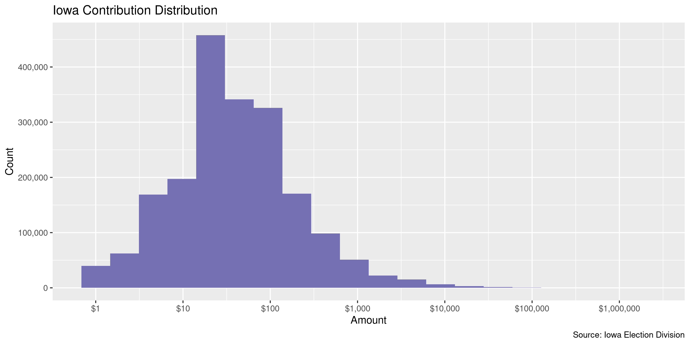
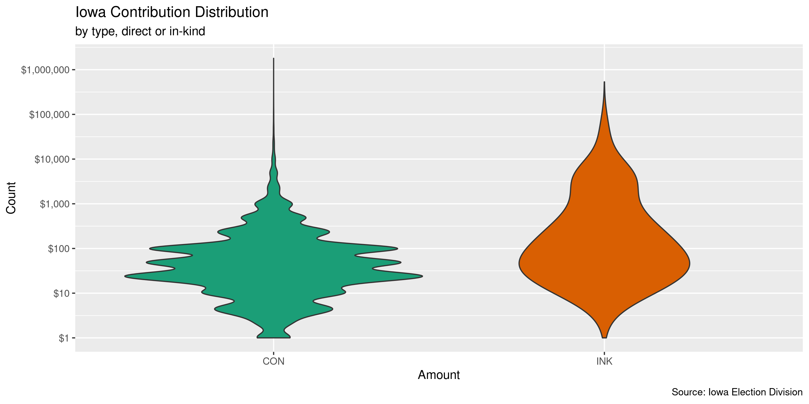
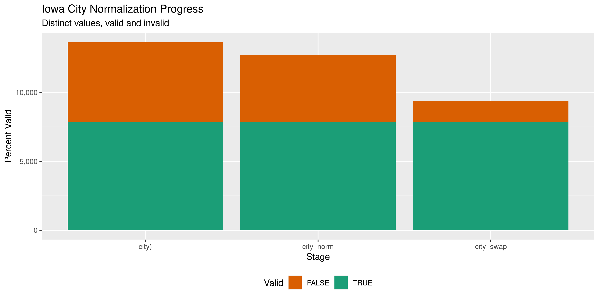

Iowa Contributions
================
Kiernan Nicholls & Yanqi Xu
2023-07-02 18:17:36

- [Project](#project)
- [Objectives](#objectives)
- [Packages](#packages)
- [Data](#data)
- [Read](#read)
- [Explore](#explore)
- [Categorical](#categorical)
- [Amounts](#amounts)
- [Dates](#dates)
- [Wrangle](#wrangle)
- [Conclude](#conclude)
- [Export](#export)
- [Upload](#upload)
- [Dictionary](#dictionary)

<!-- Place comments regarding knitting here -->

## Project

The Accountability Project is an effort to cut across data silos and
give journalists, policy professionals, activists, and the public at
large a simple way to search across huge volumes of public data about
people and organizations.

Our goal is to standardizing public data on a few key fields by thinking
of each dataset row as a transaction. For each transaction there should
be (at least) 3 variables:

1.  All **parties** to a transaction.
2.  The **date** of the transaction.
3.  The **amount** of money involved.

## Objectives

This document describes the process used to complete the following
objectives:

1.  How many records are in the database?
2.  Check for entirely duplicated records.
3.  Check ranges of continuous variables.
4.  Is there anything blank or missing?
5.  Check for consistency issues.
6.  Create a five-digit ZIP Code called `zip`.
7.  Create a `year` field from the transaction date.
8.  Make sure there is data on both parties to a transaction.

## Packages

The following packages are needed to collect, manipulate, visualize,
analyze, and communicate these results. The `pacman` package will
facilitate their installation and attachment.

The IRW’s `campfin` package will also have to be installed from GitHub.
This package contains functions custom made to help facilitate the
processing of campaign finance data.

``` r
if (!require("pacman")) install.packages("pacman")
pacman::p_load_gh("irworkshop/campfin")
pacman::p_load(
  tidyverse, # data manipulation
  lubridate, # datetime strings
  jsonlite, # import json api
  magrittr, # pipe operators
  gluedown, # print markdown
  janitor, # dataframe clean
  refinr, # cluster and merge
  aws.s3, # aws cloud storage
  scales, # format strings
  rvest, # read html pages
  knitr, # knit documents
  vroom, # read files fast
  glue, # combine strings
  here, # relative storage
  fs # search storage 
)
```

This document should be run as part of the `R_campfin` project, which
lives as a sub-directory of the more general, language-agnostic
[`irworkshop/accountability_datacleaning`](https://github.com/irworkshop/accountability_datacleaning)
GitHub repository.

The `R_campfin` project uses the [RStudio
projects](https://support.rstudio.com/hc/en-us/articles/200526207-Using-Projects)
feature and should be run as such. The project also uses the dynamic
`here::here()` tool for file paths relative to *your* machine.

``` r
# where does this document knit?
here::here()
#> [1] "/Users/yanqixu/code/accountability_datacleaning"
```

## Data

Data is obtained from the [Iowa Ethics and Campaign Disclosure
Board](https://ethics.iowa.gov/). The API returns contributions dating
back to `2003-01-01`.

> In order to accomplish its Mission, the Board will enforce the
> provisions of the “Campaign Disclosure Act” in Iowa Code chapter 68A,
> the “Government Ethics and Lobbying Act” in Iowa Code chapter 68B, the
> reporting of gifts and bequests received by agencies under Iowa Code
> section 8.7, and the Board’s administrative rules in Chapter 351 of
> the Iowa Administrative Code.

The Board provides the file through the [state open data
portal](https://data.iowa.gov/) under the title [“Iowa Campaign
Contributions
Received.”](https://data.iowa.gov/Campaigns-Elections/Iowa-Campaign-Contributions-Received/smfg-ds7h)
The data can be accessed as a tabular CSV file or through a number of
direct APIs.

The database was created June 18, 2015 and last updated July 1, 2023.

> This dataset contains information on contributions and in kind
> donations made by organizations and individuals to state-wide,
> legislative or local candidate committees, state PACs, county central
> committees, state parties, and state and local ballot issue committees
> in Iowa. Data is available beginning in 2003 for all reports filed
> electronically, and some paper filed reports.

> Data is provided through reports submitted by candidate committees,
> state political committees, federal/out-of-state political committees,
> county central committees, ballot issue committees and organizations
> making contributions or independent expenditures. Quality of the data
> provided in the dataset is dependent upon the accuracy of the data
> reported electronically.

The Board also provides a disclaimer on the completness of the database:

> Data on paper filed reports is not available except for the following:
> contributions to individual candidates between 2003 and 2006 from
> political and party committees; contributions to individual candidates
> 2007 on; contributions to party committees between 2003 and 2007 from
> political and candidate committees; contributions from State Political
> Committees to candidates between 2003 and 2004; contributions from
> Federal/Out-of-State Political Committees over \$50 from 2005 on; and
> contributions from county central committees from 2008 on.

The database license is as follows:

> Pursuant to Iowa Code section 68B.32A(7), the information obtained
> from statements or reports filed with the board under Iowa Code
> chapter 68A, Iowa Code chapter 68B, Iowa Code section 8.7, or rules
> adopted by the board shall not be copied or otherwise used for any
> commercial purpose. For purposes of this rule, “commercial purposes”
> shall include solicitations by a business or charitable organization.
> Information used in newspapers, magazines, books, or other similar
> communications, so long as the principal purpose of such
> communications is for providing information to the public and not for
> other commercial purpose, and for soliciting political campaign
> contributions is permissable.

## Read

These fixed files can be read into a single data frame with
`purrr::map_df()` and `readr::read_delim()`.

``` r
raw_dir <- dir_create(here("state","ia", "contribs", "data", "raw"))
raw_url <- "https://data.iowa.gov/api/views/smfg-ds7h/rows.csv"
raw_path <- path(raw_dir, basename(raw_url))
if (!this_file_new(raw_path)) {
  download.file(raw_url, raw_path)
}
```

``` r
iac <- vroom(
  file = raw_path,
  na = c("", "N/A", "NA", "n/a", "na"),
  col_types = cols(
    .default = col_character(),
    `Date` = col_date_mdy(),
    `Contribution Amount` = col_double()
  )
)
```

We can ensure this file was read correctly by counting distinct values
of a known discrete variable.

``` r
n_distinct(iac$type) == 2
#> [1] FALSE
```

## Explore

There are 2,248,344 rows of 15 columns.

``` r
glimpse(iac)
#> Rows: 2,248,344
#> Columns: 15
#> $ date           <date> 2007-12-18, 2003-12-31, 2004-12-31, 2007-06-30, 2006-12-31, 2004-07-14, 2…
#> $ code           <chr> "1700", "6082", "6082", "6082", "6082", "6082", "6082", "6082", "6082", "6…
#> $ committee_type <chr> "State House", "Iowa PAC", "Iowa PAC", "Iowa PAC", "Iowa PAC", "Iowa PAC",…
#> $ committee      <chr> "Johnson for Iowa House", "MidAmerican Energy Company PAC", "MidAmerican E…
#> $ type           <chr> "CON", "CON", "CON", "CON", "CON", "CON", "CON", "CON", "CON", "CON", "CON…
#> $ cont_org       <chr> NA, NA, NA, NA, NA, NA, NA, NA, NA, NA, NA, NA, NA, NA, NA, NA, NA, NA, NA…
#> $ first          <chr> "Al & Lori", "Daniel", "Daniel", "Daniel", "Daniel", "Daniel", "Daniel", "…
#> $ last           <chr> "Hill", "Hegarty", "Hegarty", "Hegarty", "Hegarty", "Hegarty", "Hegarty", …
#> $ addr1          <chr> "15768 - 300th Street", "1405 W 6th St", "1405 W 6th St", "1405 W 6th St",…
#> $ addr2          <chr> NA, NA, NA, NA, NA, NA, NA, NA, NA, NA, NA, NA, NA, NA, NA, NA, NA, NA, NA…
#> $ city           <chr> "Radcliffe", "Storm Lake", "Storm Lake", "Storm Lake", "Storm Lake", "Stor…
#> $ state          <chr> "IA", "IA", "IA", "IA", "IA", "IA", "IA", "IA", "IA", "IA", "IA", "IA", "I…
#> $ zip            <chr> "50230", "50588", "50588", "50588", "50588", "50588", "50588", "50588", "5…
#> $ amount         <dbl> 500.00, 24.48, 25.20, 55.20, 26.76, 16.80, 40.88, 28.62, 60.24, 29.64, 38.…
#> $ check_number   <chr> "5012", NA, NA, NA, NA, NA, NA, NA, NA, NA, NA, NA, NA, NA, NA, NA, NA, NA…
tail(iac)
#> # A tibble: 6 × 15
#>   date       code  committ…¹ commi…² type  cont_…³ first last  addr1 addr2 city  state zip   amount
#>   <date>     <chr> <chr>     <chr>   <chr> <chr>   <chr> <chr> <chr> <chr> <chr> <chr> <chr>  <dbl>
#> 1 2019-09-12 731   State Se… People… CON   <NA>    Elai… Klein 2775… <NA>  Dubu… IA    52001    100
#> 2 2018-09-02 40034 County C… Kacena… CON   <NA>    JoAnn Sadl… 3448… <NA>  Corr… IA    51016     25
#> 3 2014-05-12 57    State Se… Re-ele… CON   <NA>    David Brown 520 … <NA>  Des … IA    5030…    100
#> 4 2010-08-02 1318  State Ho… Paulse… CON   <NA>    Nic   Pott… 134 … <NA>  Mari… IA    52302     50
#> 5 2020-10-15 2620  State Ho… clayto… CON   <NA>    Brit… Patt… 1220… <NA>  Delr… FL    33445      1
#> 6 2016-06-21 9098  State Ce… Iowa D… CON   <NA>    Ally… McKe… 658 … <NA>  Iowa… IA    5224…     40
#> # … with 1 more variable: check_number <chr>, and abbreviated variable names ¹​committee_type,
#> #   ²​committee, ³​cont_org
```

### Missing

Columns vary in their degree of missing values.

``` r
col_stats(iac, count_na)
#> # A tibble: 15 × 4
#>    col            class        n       p
#>    <chr>          <chr>    <int>   <dbl>
#>  1 date           <date>       0 0      
#>  2 code           <chr>        0 0      
#>  3 committee_type <chr>        0 0      
#>  4 committee      <chr>        0 0      
#>  5 type           <chr>        0 0      
#>  6 cont_org       <chr>  2054093 0.914  
#>  7 first          <chr>   214337 0.0953 
#>  8 last           <chr>   214281 0.0953 
#>  9 addr1          <chr>    13924 0.00619
#> 10 addr2          <chr>  2158462 0.960  
#> 11 city           <chr>    12133 0.00540
#> 12 state          <chr>     5577 0.00248
#> 13 zip            <chr>     3474 0.00155
#> 14 amount         <dbl>        0 0      
#> 15 check_number   <chr>  1369542 0.609
```

We can flag any record missing a key variable needed to identify a
transaction.

``` r
key_vars <- c("date", "last", "amount", "committee")
iac <- flag_na(iac, all_of(key_vars))
sum(iac$na_flag)
#> [1] 214281
```

All of the flagged rows are only missing a contributor `last` name.

``` r
iac %>% 
  filter(na_flag) %>% 
  select(all_of(key_vars)) %>% 
  sample_n(10)
#> # A tibble: 10 × 4
#>    date       last   amount committee                                             
#>    <date>     <chr>   <dbl> <chr>                                                 
#>  1 2019-06-10 <NA>   1000   Iowa Insurance Institute PAC                          
#>  2 2006-08-29 <NA>  20000   Iowa Democratic Party                                 
#>  3 2020-08-10 <NA>  25000   Kim Reynolds for Iowa                                 
#>  4 2016-09-26 <NA>    500   Kressig for Iowa House 59                             
#>  5 2017-12-22 <NA>    500   Chaz Allen 4 Senate                                   
#>  6 2017-01-03 <NA>     23   Plumbers & Steamfitters Local Union #33               
#>  7 2013-07-31 <NA>     11.5 Iowans for Fitzgerald                                 
#>  8 2022-09-02 <NA>    500   Win With Windschitl                                   
#>  9 2017-01-03 <NA>    100   Dan Dawson for State Senate                           
#> 10 2004-02-27 <NA>     14   Iowa Farm Bureau Federation Political Action Committee
```

``` r
iac %>% 
  filter(na_flag) %>% 
  select(all_of(key_vars)) %>% 
  col_stats(count_na)
#> # A tibble: 4 × 4
#>   col       class       n     p
#>   <chr>     <chr>   <int> <dbl>
#> 1 date      <date>      0     0
#> 2 last      <chr>  214281     1
#> 3 amount    <dbl>       0     0
#> 4 committee <chr>       0     0
```

### Duplicates

We can create a file containing every duplicate record in the data.

``` r
dupe_file <- path(raw_dir, "dupes.csv")
iac <- rowid_to_column(iac, var = "tx")
if (!file_exists(dupe_file)) {
  write_lines("tx,dupe_flag", dupe_file)
  iac <- mutate(iac, group = str_sub(date, end = 7))
  ia_tx <- split(iac$tx, iac$group)
  ias <- iac %>%
    select(-tx) %>% 
    group_split(group, .keep = FALSE)
  pb <- txtProgressBar(max = length(ias), style = 3)
  for (i in seq_along(ias)) {
    write_csv(
      file = dupe_file,
      append = TRUE,
      x = tibble(
        tx = ia_tx[[i]],
        dupe_flag = or(
          duplicated(ias[[i]], fromLast = FALSE),
          duplicated(ias[[i]], fromLast = TRUE)
        )
      )
    )
    setTxtProgressBar(pb, i)
    ias[i] <- NA
    flush_memory(1)
  }
}
```

``` r
dupes <- read_csv(
  file = dupe_file,
  col_types = cols(
    tx = col_integer(),
    dupe_flag = col_logical()
  )
)
```

This file can then be joined against the contributions using the
transaction ID.

``` r
iac <- left_join(iac, dupes)
iac <- mutate(iac, dupe_flag = !is.na(dupe_flag))
percent(mean(iac$dupe_flag), 0.1)
#> [1] "100.0%"
```

``` r
iac %>% 
  filter(dupe_flag) %>% 
  select(all_of(key_vars)) %>% 
  arrange(date, last)
#> # A tibble: 2,248,344 × 4
#>    date       last       amount committee                                            
#>    <date>     <chr>       <dbl> <chr>                                                
#>  1 2003-01-01 Price        50   Planned Parenthood Advocates of Iowa PAC             
#>  2 2003-01-01 Unitemized  261   Community Bankers of Iowa Political Action Committee 
#>  3 2003-01-01 <NA>         21.8 Citizens to Elect Bill Dotzler                       
#>  4 2003-01-02 Balderston   15   Linn County Republican Women                         
#>  5 2003-01-02 Bee          25   Iowa Dental Political Action Committee               
#>  6 2003-01-02 Burnham     100   Iowa Dental Political Action Committee               
#>  7 2003-01-02 Consamus    100   Iowa Dental Political Action Committee               
#>  8 2003-01-02 DeVore      250   Manufactured Housing Political Action Committee #6096
#>  9 2003-01-02 Foster       15   Linn County Republican Women                         
#> 10 2003-01-02 Gee          15   Linn County Republican Women                         
#> # … with 2,248,334 more rows
```

``` r
iac <- iac %>% select(-tx)
```

## Categorical

``` r
col_stats(iac, n_distinct)
#> # A tibble: 17 × 4
#>    col            class       n           p
#>    <chr>          <chr>   <int>       <dbl>
#>  1 date           <date>   7341 0.00327    
#>  2 code           <chr>    5479 0.00244    
#>  3 committee_type <chr>      27 0.0000120  
#>  4 committee      <chr>    5337 0.00237    
#>  5 type           <chr>       1 0.000000445
#>  6 cont_org       <chr>   13778 0.00613    
#>  7 first          <chr>   89669 0.0399     
#>  8 last           <chr>  124054 0.0552     
#>  9 addr1          <chr>  575641 0.256      
#> 10 addr2          <chr>    8951 0.00398    
#> 11 city           <chr>   19887 0.00885    
#> 12 state          <chr>      65 0.0000289  
#> 13 zip            <chr>   90323 0.0402     
#> 14 amount         <dbl>   27329 0.0122     
#> 15 check_number   <chr>   59055 0.0263     
#> 16 na_flag        <lgl>       2 0.000000890
#> 17 dupe_flag      <lgl>       1 0.000000445
```

    #> # A tibble: 1 × 3
    #>   type        n     p
    #>   <chr>   <int> <dbl>
    #> 1 CON   2248344     1

## Amounts

``` r
summary(iac$amount)
#>      Min.   1st Qu.    Median      Mean   3rd Qu.      Max. 
#> -106521.5      10.4      30.0     261.8     100.0 2390585.7
mean(iac$amount <= 0)
#> [1] 0.005338151
```

<!-- -->

<!-- -->

## Dates

``` r
iac <- mutate(iac, year = year(date))
```

``` r
iac %>% 
  count(year) %>% 
  mutate(even = is_even(year)) %>% 
  ggplot(aes(x = year, y = n)) +
  geom_col(aes(fill = even)) + 
  scale_fill_brewer(palette = "Dark2") +
  scale_y_continuous(labels = comma) +
  scale_x_continuous(breaks = seq(1998, 2024, by = 2)) +
  theme(legend.position = "bottom") +
  labs(
    title = "Iowa Contributions by Year",
    caption = "Source: Iowa Election Division",
    fill = "Election Year",
    x = "Year Made",
    y = "Count"
  )
```

<!-- -->

## Wrangle

To improve the searchability of the database, we will perform some
consistent, confident string normalization. For geographic variables
like city names and ZIP codes, the corresponding `campfin::normal_*()`
functions are taylor made to facilitate this process.

### Address

For the street `addresss` variable, the `campfin::normal_address()`
function will force consistence case, remove punctuation, and
abbreviation official USPS suffixes.

``` r
addr_norm <- iac %>%
  select(starts_with("addr")) %>% 
  distinct() %>% 
  unite(
    everything(),
    col = addr_full,
    sep = " ",
    remove = FALSE,
    na.rm = TRUE
  ) %>% 
  mutate(
    addr_norm = normal_address(
      address = addr_full,
      abbs = usps_street,
      na_rep = TRUE
    )
  ) %>% 
  select(-addr_full)
```

``` r
iac <- left_join(iac, addr_norm)
rm(addr_norm)
```

We can see how this process improved consistency.

``` r
iac %>% 
  sample_n(10) %>% 
  select(starts_with("addr"))
#> # A tibble: 10 × 3
#>    addr1                  addr2 addr_norm             
#>    <chr>                  <chr> <chr>                 
#>  1 703 12th st            <NA>  703 12TH ST           
#>  2 4354 Pioneer Rail SE   <NA>  4354 PIONEER RAIL SE  
#>  3 3420 Wenig Rd NE       <NA>  3420 WENIG RD NE      
#>  4 5 Ashcroft Pl.         <NA>  5 ASHCROFT PL         
#>  5 508    3rd Avenue N    <NA>  508 3RD AVENUE N      
#>  6 242 North Main Avenue  <NA>  242 NORTH MAIN AVE    
#>  7 2031 Manzanita Avenue  <NA>  2031 MANZANITA AVE    
#>  8 384 Keeline Ave        <NA>  384 KEELINE AVE       
#>  9 410 North Hickory Blvd <NA>  410 NORTH HICKORY BLVD
#> 10 4314 Northwest Dr.     <NA>  4314 NORTHWEST DR
```

### ZIP

For ZIP codes, the `campfin::normal_zip()` function will attempt to
create valied *five* digit codes by removing the ZIP+4 suffix and
returning leading zeroes dropped by other programs like Microsoft Excel.

``` r
iac <- iac %>% 
  mutate(
    zip_norm = normal_zip(
      zip = zip,
      na_rep = TRUE
    )
  )
```

``` r
progress_table(
  iac$zip, 
  iac$zip_norm, 
  compare = valid_zip
)
#> # A tibble: 2 × 6
#>   stage        prop_in n_distinct prop_na  n_out n_diff
#>   <chr>          <dbl>      <dbl>   <dbl>  <dbl>  <dbl>
#> 1 iac$zip        0.843      90323 0.00155 351832  74589
#> 2 iac$zip_norm   0.998      18515 0.0161    4665   1191
```

### State

Very little needs to be done to clean the `state` variable.

``` r
x <- iac$state
length(x)
#> [1] 2248344
prop_in(x, valid_state)
#> [1] 0.9999545
count_out(x, valid_state)
#> [1] 102
st_zip <- iac$zip %in% zipcodes$zip[zipcodes$state == "IA"]
st_out <- x %out% valid_state
st_rx <- str_detect(x, "^[Ii]|[Aa]$")
st_na <- !is.na(x)
# has ia zip, ia regex, not valid, not na
x[st_zip & st_rx & st_out & st_na] <- "IA"
length(x)
#> [1] 2248344
iac <- mutate(iac, state_norm = x)
```

``` r
progress_table(
  iac$state, 
  iac$state_norm, 
  compare = valid_state
)
#> # A tibble: 2 × 6
#>   stage          prop_in n_distinct prop_na n_out n_diff
#>   <chr>            <dbl>      <dbl>   <dbl> <dbl>  <dbl>
#> 1 iac$state         1.00         65 0.00248   102     11
#> 2 iac$state_norm    1.00         64 0.00248    27     10
```

### City

Cities are the most difficult geographic variable to normalize, simply
due to the wide variety of valid cities and formats. The
`campfin::normal_city()` function is a good start, again converting
case, removing punctuation, but *expanding* USPS abbreviations. We can
also remove `invalid_city` values.

``` r
ia_city <- iac %>% 
  count(city, state_norm, zip_norm, sort = TRUE) %>% 
  select(-n) %>% 
  mutate(
    city_norm = normal_city(
      city = city, 
      abbs = usps_city,
      states = c("IA", "DC", "IOWA"),
      na = invalid_city,
      na_rep = TRUE
    )
  )
```

Again, we can further improve normalization by comparing our normalized
value against the *expected* value for that record’s state abbreviation
and ZIP code. If the normalized value is either an abbreviation for or
very similar to the expected value, we can confidently swap those two.

``` r
ia_city <- ia_city %>% 
  rename(city_raw = city) %>% 
  left_join(
    y = zipcodes,
    by = c(
      "state_norm" = "state",
      "zip_norm" = "zip"
    )
  ) %>% 
  rename(city_match = city) %>% 
  mutate(
    match_abb = is_abbrev(city_norm, city_match),
    match_dist = str_dist(city_norm, city_match),
    city_swap = if_else(
      condition = !is.na(city_match) & (match_abb | match_dist == 1),
      true = city_match,
      false = city_norm
    )
  ) %>% 
  select(
    -city_match,
    -match_dist,
    -match_abb
  )
```

``` r
many_city <- c(valid_city, extra_city)
ia_city %>% 
  count(city_swap, state_norm, sort = TRUE) %>% 
  filter(!is.na(city_swap), city_swap %out% many_city)
#> # A tibble: 1,693 × 3
#>    city_swap        state_norm     n
#>    <chr>            <chr>      <int>
#>  1 NEW YORK CITY    NY            33
#>  2 NYC              NY            24
#>  3 LECLAIRE         IA            14
#>  4 IA               IA            13
#>  5 FARMINGTON HILLS MI            11
#>  6 JOHNSTNON        IA            11
#>  7 LEMARS           IA            10
#>  8 UNITEMIZED       IA            10
#>  9 ST LOUIS         MO             9
#> 10 NY               NY             8
#> # … with 1,683 more rows
```

``` r
ia_city <- ia_city %>% 
  mutate(
    city_swap = city_swap %>% 
      str_replace("^OVERLAND PARKS$", "OVERLAND PARK") %>% 
      str_replace("^NEW YORK CITY$", "NEW YORK") %>% 
      str_replace("^NYC$", "NEW YORK") %>% 
      str_replace("^WASHINGTON D C$", "WASHINGTON") %>% 
      str_replace("\\sPK$", "PARK") %>% 
      str_remove("\\sD\\sC$") %>% 
      str_remove("\\sIN$") %>% 
      na_if("UNITEMIZED") %>% 
      na_if("IA")
  )
```

``` r
ia_city <- rename(ia_city, city = city_raw)
iac <- left_join(iac, ia_city, by = c("city", "state_norm", "zip_norm"))
```

| stage                                                                     | prop_in | n_distinct | prop_na | n_out | n_diff |
|:--------------------------------------------------------------------------|--------:|-----------:|--------:|------:|-------:|
| str_to_upper(iac$city) | 0.969| 14762| 0.005| 70151| 6159| |iac$city_norm |   0.985 |      13804 |   0.016 | 32753 |   5169 |
| iac\$city_swap                                                            |   0.997 |      10299 |   0.016 |  6133 |   1629 |

You can see how the percentage of valid values increased with each
stage.

<!-- -->

More importantly, the number of distinct values decreased each stage. We
were able to confidently change many distinct invalid values to their
valid equivalent.

``` r
progress %>% 
  select(
    stage, 
    all = n_distinct,
    bad = n_diff
  ) %>% 
  mutate(good = all - bad) %>% 
  pivot_longer(c("good", "bad")) %>% 
  mutate(name = name == "good") %>% 
  ggplot(aes(x = stage, y = value)) +
  geom_col(aes(fill = name)) +
  scale_fill_brewer(palette = "Dark2", direction = -1) +
  scale_y_continuous(labels = comma) +
  theme(legend.position = "bottom") +
  labs(
    title = "Iowa City Normalization Progress",
    subtitle = "Distinct values, valid and invalid",
    x = "Stage",
    y = "Percent Valid",
    fill = "Valid"
  )
```

<!-- -->

## Conclude

Before exporting, we can remove the intermediary normalization columns
and rename all added variables with the `_clean` suffix.

``` r
iac <- iac %>% 
  select(
    -city_norm,
    city_clean = city_swap
  ) %>% 
  rename_all(~str_replace(., "_norm", "_clean")) %>% 
  rename_all(~str_remove(., "_raw"))
```

``` r
glimpse(sample_n(iac, 50))
#> Rows: 50
#> Columns: 22
#> $ date           <date> 2018-09-25, 2010-01-04, 2013-10-28, 2022-09-13, 2022-05-23, 2017-03-09, 2…
#> $ code           <chr> "5172", "18485", "14136", "6060", "9098", "1247", "6237", "14711", "2671",…
#> $ committee_type <chr> "Governor", "County Candidate - Supervisor", "City Candidate - City Counci…
#> $ committee      <chr> "Hubbell for Governor", "Lori Cardella for Johnson Co. Board of Supervisor…
#> $ type           <chr> "CON", "CON", "CON", "CON", "CON", "CON", "CON", "CON", "CON", "CON", "CON…
#> $ cont_org       <chr> NA, NA, NA, "IFL Funds", NA, NA, NA, NA, NA, NA, NA, NA, NA, NA, NA, NA, N…
#> $ first          <chr> "Colleen", "Jim/Ruth", "Judy", NA, "Jean", "Kathleen", "unitemized", "Robi…
#> $ last           <chr> "Bortscheller", "Dane", "Griffin", NA, "Carlson", "McCauley", "unitemized"…
#> $ addr1          <chr> "1297 4th Ave SW", "4507 Dane Rd SW", "216 NW Linden St", "2000 Walker St"…
#> $ addr2          <chr> NA, NA, NA, NA, NA, NA, NA, NA, NA, NA, NA, NA, NA, NA, NA, NA, NA, NA, NA…
#> $ city           <chr> "Le Mars", "Iowa City", "Ankeny", "Des Moines", "Sioux City", "Council Blu…
#> $ state          <chr> "IA", "IA", "IA", "IA", "IA", "IA", NA, "IA", "IA", "IA", "IA", "IA", "IA"…
#> $ zip            <chr> "51031-2770", "52240", "50023", "50317", "51106-4039", "51503", NA, "52404…
#> $ amount         <dbl> 50.00, 0.00, 100.00, 120.00, 5.00, 10.00, 67.00, 100.00, 50.00, 100.00, 10…
#> $ check_number   <chr> NA, "5391", NA, NA, NA, NA, NA, NA, NA, NA, NA, NA, "14344", NA, NA, NA, N…
#> $ na_flag        <lgl> FALSE, FALSE, FALSE, TRUE, FALSE, FALSE, FALSE, FALSE, FALSE, FALSE, FALSE…
#> $ dupe_flag      <lgl> TRUE, TRUE, TRUE, TRUE, TRUE, TRUE, TRUE, TRUE, TRUE, TRUE, TRUE, TRUE, TR…
#> $ year           <dbl> 2018, 2010, 2013, 2022, 2022, 2017, 2012, 2021, 2022, 2006, 2017, 2006, 20…
#> $ addr_clean     <chr> "1297 4TH AVE SW", "4507 DANE RD SW", "216 NW LINDEN ST", "2000 WALKER ST"…
#> $ zip_clean      <chr> "51031", "52240", "50023", "50317", "51106", "51503", NA, "52404", "50312"…
#> $ state_clean    <chr> "IA", "IA", "IA", "IA", "IA", "IA", NA, "IA", "IA", "IA", "IA", "IA", "IA"…
#> $ city_clean     <chr> "LE MARS", "IOWA CITY", "ANKENY", "DES MOINES", "SIOUX CITY", "COUNCIL BLU…
```

1.  There are 2,248,344 records in the database.
2.  There are 2,248,344 duplicate records in the database.
3.  The range and distribution of `amount` and `date` seem reasonable.
4.  There are 214,281 records missing key variables.
5.  Consistency in geographic data has been improved with
    `campfin::normal_*()`.
6.  The 4-digit `year` variable has been created with
    `lubridate::year()`.

## Export

Now the file can be saved on disk for upload to the Accountability
server.

``` r
clean_dir <- dir_create(here("state","ia", "contribs", "data", "clean"))
clean_path <- path(clean_dir, "ia_contribs_clean.csv")
write_csv(iac, clean_path, na = "")
(clean_size <- file_size(clean_path))
#> 382M
file_encoding(clean_path) %>% 
  mutate(across(path, path.abbrev))
#> # A tibble: 1 × 3
#>   path                                                                                mime  charset
#>   <fs::path>                                                                          <chr> <chr>  
#> 1 …ode/accountability_datacleaning/state/ia/contribs/data/clean/ia_contribs_clean.csv <NA>  <NA>
```

## Upload

We can use the `aws.s3::put_object()` to upload the text file to the IRW
server.

``` r
aws_path <- path("csv", basename(clean_path))
if (!object_exists(aws_path, "publicaccountability")) {
  put_object(
    file = clean_path,
    object = aws_path, 
    bucket = "publicaccountability",
    acl = "public-read",
    show_progress = TRUE,
    multipart = TRUE
  )
}
aws_head <- head_object(aws_path, "publicaccountability")
(aws_size <- as_fs_bytes(attr(aws_head, "content-length")))
unname(aws_size == clean_size)
```

## Dictionary

The following table describes the variables in our final exported file:

| Column           | Type        | Definition                             |
|:-----------------|:------------|:---------------------------------------|
| `date`           | `double`    | Date contribution was made             |
| `code`           | `character` | Recipient committee code               |
| `committee_type` | `character` | Recipient committee type               |
| `committee`      | `character` | Recipient committee name               |
| `type`           | `character` | Type of contribution (direct, in-kind) |
| `cont_org`       | `character` | Contributor organization               |
| `first`          | `character` | Contributor first name                 |
| `last`           | `character` | Contributor last name                  |
| `addr1`          | `character` | Contributor street address             |
| `addr2`          | `character` | Contributor secondary address          |
| `city`           | `character` | Contributor state abbreviation         |
| `state`          | `character` | Contributor city name                  |
| `zip`            | `character` | Contributor ZIP+4 code                 |
| `amount`         | `double`    | Amount or correction                   |
| `check_number`   | `character` | Check number                           |
| `na_flag`        | `logical`   | Flag for missing value                 |
| `dupe_flag`      | `logical`   | Flag for duplicate row                 |
| `year`           | `double`    | Calendar year contribution made        |
| `addr_clean`     | `character` | Normalized street address              |
| `zip_clean`      | `character` | Normalized 5-digit ZIP code            |
| `state_clean`    | `character` | Normalized 2-letter state abbreviation |
| `city_clean`     | `character` | Normalized city name                   |
