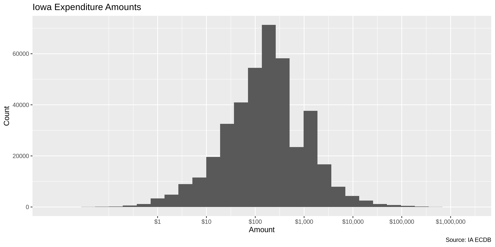
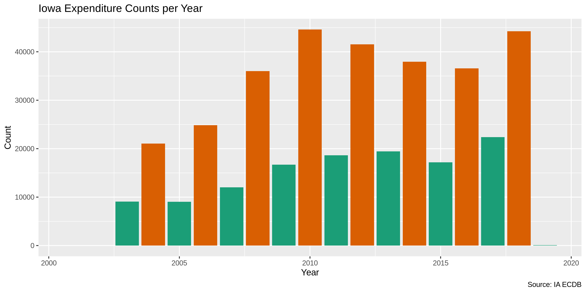
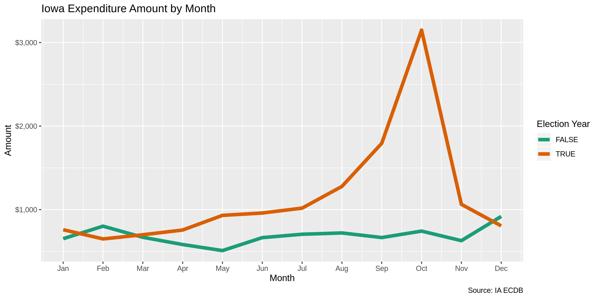

Iowa Expenditures
================
Kiernan Nicholls & Yanqi Xu
2022-12-17 14:57:33

-   <a href="#project" id="toc-project">Project</a>
-   <a href="#objectives" id="toc-objectives">Objectives</a>
-   <a href="#packages" id="toc-packages">Packages</a>
-   <a href="#data" id="toc-data">Data</a>
-   <a href="#import" id="toc-import">Import</a>
-   <a href="#explore" id="toc-explore">Explore</a>
-   <a href="#wrangle" id="toc-wrangle">Wrangle</a>
-   <a href="#conclude" id="toc-conclude">Conclude</a>
-   <a href="#export" id="toc-export">Export</a>

<!-- Place comments regarding knitting here -->

## Project

The Accountability Project is an effort to cut across data silos and
give journalists, policy professionals, activists, and the public at
large a simple way to search across huge volumes of public data about
people and organizations.

Our goal is to standardizing public data on a few key fields by thinking
of each dataset row as a transaction. For each transaction there should
be (at least) 3 variables:

1.  All **parties** to a transaction
2.  The **date** of the transaction
3.  The **amount** of money involved

## Objectives

This document describes the process used to complete the following
objectives:

1.  How many records are in the database?
2.  Check for duplicates
3.  Check ranges
4.  Is there anything blank or missing?
5.  Check for consistency issues
6.  Create a five-digit ZIP Code called `ZIP5`
7.  Create a `YEAR` field from the transaction date
8.  Make sure there is data on both parties to a transaction

## Packages

The following packages are needed to collect, manipulate, visualize,
analyze, and communicate these results. The `pacman` package will
facilitate their installation and attachment.

The IRW’s `campfin` package will also have to be installed from GitHub.
This package contains functions custom made to help facilitate the
processing of campaign finance data.

``` r
pacman::p_load_gh("VerbalExpressions/RVerbalExpressions")
pacman::p_load_current_gh("irworkshop/campfin")
pacman::p_load(
  stringdist, # levenshtein value
  tidyverse, # data manipulation
  lubridate, # datetime strings
  tidytext, # text mining tools
  magrittr, # pipe opperators
  janitor, # dataframe clean
  zipcode, # clean & databse
  batman, # parse logicals
  RSocrata, # query soda api
  refinr, # cluster & merge
  scales, #format strings
  rvest, # scrape website
  skimr, # summary stats
  vroom, # quickly read
  glue, # combine strings
  gluedown, #markdown
  here, # locate storage
  fs # search storage 
)
```

This document should be run as part of the `R_campfin` project, which
lives as a sub-directory of the more general, language-agnostic
[`irworkshop/accountability_datacleaning`](https://github.com/irworkshop/accountability_datacleaning "TAP repo")
GitHub repository.

The `R_campfin` project uses the [RStudio
projects](https://support.rstudio.com/hc/en-us/articles/200526207-Using-Projects "Rproj")
feature and should be run as such. The project also uses the dynamic
`here::here()` tool for file paths relative to *your* machine.

``` r
# where does this document knit?
here::here()
```

    #> [1] "/Users/yanqixu/code/accountability_datacleaning"

## Data

[Data](https://data.iowa.gov/Campaigns-Elections/Iowa-Campaign-Expenditures/3adi-mht4)
is obtained from the Iowa Ethics & Campaign Disclosure Board’s open data
portal.

> This dataset contains information on expenditures made by state-wide,
> legislative or local candidate committees, state PACs, county central
> committees, state parties, and state and local ballot issue committees
> in Iowa. Data is available beginning in 2003 for all reports filed
> electronically, and some paper filed reports. Data is provided through
> reports submitted by candidate committees, state political committees,
> federal/out-of-state political committees, county central committees,
> ballot issue committees and organizations making contributions or
> independent expenditures. Quality of the data provided in the dataset
> is dependent upon the accuracy of the data reported electronically.

## Import

The data can be directly read using `RSocrata::read.socrata()`.

``` r
#ia <- as_tibble(read.socrata("https://data.iowa.gov/resource/3adi-mht4.json"))
raw_dir <- here("state","ia","expends","data","raw")
ia <- read_csv(dir_ls(raw_dir)) %>% clean_names()
ia$expenditure_amount <- as.double(ia$expenditure_amount)
ia$date <- as.Date(ia$date,format = "%m/%d/%Y")
```

## Explore

``` r
head(ia)
```

    #> # A tibble: 6 × 16
    #>   date       transa…¹ commi…² commi…³ commi…⁴ recei…⁵ recei…⁶ first…⁷ last_…⁸ addre…⁹ addre…˟ city 
    #>   <date>     <chr>    <chr>   <chr>   <chr>     <dbl> <chr>   <chr>   <chr>   <chr>   <chr>   <chr>
    #> 1 2004-10-12 EXP      9103    County… Jeffer…      NA Metcal… <NA>    <NA>    2642 H… <NA>    Fair…
    #> 2 2004-09-09 EXP      9103    County… Jeffer…      NA Mornin… <NA>    <NA>    51 1/2… <NA>    Fair…
    #> 3 2004-12-06 EXP      9103    County… Jeffer…      NA Mornin… <NA>    <NA>    51 1/2… <NA>    Fair…
    #> 4 2004-09-18 EXP      9103    County… Jeffer…      NA Mornin… <NA>    <NA>    51 1/2… <NA>    Fair…
    #> 5 2011-06-13 EXP      9645    Iowa P… Linn P…      NA Postma… <NA>    <NA>    Main P… <NA>    Ceda…
    #> 6 2010-03-25 EXP      9645    Iowa P… Linn P…      NA Postma… <NA>    <NA>    Main P… <NA>    Ceda…
    #> # … with 4 more variables: state <chr>, zip <chr>, expenditure_amount <dbl>, check_number <dbl>,
    #> #   and abbreviated variable names ¹​transaction_type, ²​committee_code, ³​committee_type,
    #> #   ⁴​committee_name, ⁵​receiving_committee_code, ⁶​receiving_organization_name, ⁷​first_name,
    #> #   ⁸​last_name, ⁹​address_line_1, ˟​address_line_2

``` r
tail(ia)
```

    #> # A tibble: 6 × 16
    #>   date       transa…¹ commi…² commi…³ commi…⁴ recei…⁵ recei…⁶ first…⁷ last_…⁸ addre…⁹ addre…˟ city 
    #>   <date>     <chr>    <chr>   <chr>   <chr>     <dbl> <chr>   <chr>   <chr>   <chr>   <chr>   <chr>
    #> 1 2008-07-01 EXP      1811    <NA>    CITIZE…      NA ADCRAF… <NA>    <NA>    PO BOX… <NA>    CLIN…
    #> 2 2010-09-24 EXP      1361    <NA>    PEOPLE…      NA DEHAAN… <NA>    <NA>    <NA>    <NA>    <NA> 
    #> 3 2007-08-04 EXP      662     <NA>    Rants …      NA <NA>    Christ… Rants   2740 S… <NA>    Siou…
    #> 4 2010-11-15 EXP      1361    <NA>    PEOPLE…      NA BAYARD… <NA>    <NA>    PO BOX… <NA>    BAYA…
    #> 5 2008-08-07 EXP      1603    <NA>    APPEL …      NA DAILY … <NA>    <NA>    204 W … <NA>    INDI…
    #> 6 2007-09-06 EXP      851     <NA>    Iowans…      NA Java S… <NA>    <NA>    1018 M… <NA>    Dave…
    #> # … with 4 more variables: state <chr>, zip <chr>, expenditure_amount <dbl>, check_number <dbl>,
    #> #   and abbreviated variable names ¹​transaction_type, ²​committee_code, ³​committee_type,
    #> #   ⁴​committee_name, ⁵​receiving_committee_code, ⁶​receiving_organization_name, ⁷​first_name,
    #> #   ⁸​last_name, ⁹​address_line_1, ˟​address_line_2

``` r
glimpse(sample_frac(ia))
```

    #> Rows: 531,314
    #> Columns: 16
    #> $ date                        <date> 2022-06-22, 2022-08-23, 2010-05-20, 2010-06-28, 2008-06-30, …
    #> $ transaction_type            <chr> "EXP", "EXP", "EXP", "EXP", "EXP", "EXP", "EXP", "EXP", "EXP"…
    #> $ committee_code              <chr> "5201", "SWGA50236", "18631", "1247", "1791", "2448", "9106",…
    #> $ committee_type              <chr> "Governor", "State Senate", "County Candidate - Treasurer", "…
    #> $ committee_name              <chr> "Rick Stewart", "Kurt Bendixen for Iowa", "Committee to Elect…
    #> $ receiving_committee_code    <dbl> NA, NA, NA, NA, NA, NA, 9541, 1612, 1612, NA, NA, 2256, NA, 5…
    #> $ receiving_organization_name <chr> "Anedot", "WinRed", "Postmaster", "U.S. Post Office", "West B…
    #> $ first_name                  <chr> NA, NA, NA, NA, NA, "Phil", NA, NA, NA, NA, NA, NA, "Helen", …
    #> $ last_name                   <chr> NA, NA, NA, NA, NA, "Thompson", NA, NA, NA, NA, NA, NA, "Mill…
    #> $ address_line_1              <chr> "5555 Hilton Ave", "1776 Wilson Blvd", "Main St", "309 E. Lin…
    #> $ address_line_2              <chr> "Suite 106", "Ste 530", NA, NA, NA, NA, NA, NA, NA, NA, NA, N…
    #> $ city                        <chr> "Baton Rouge", "Arlington", "Wapello", "Marshalltown", "West …
    #> $ state                       <chr> "La", "VA", "IA", "IA", "IA", "IA", "IA", "IA", "IA", "CO", "…
    #> $ zip                         <chr> "70808", "22209", "52653", "50158", "50265", "50129", "52241"…
    #> $ expenditure_amount          <dbl> 4.30, 4.10, 88.00, 220.00, 6.36, 41.00, 200.00, 1500.00, 2000…
    #> $ check_number                <dbl> 0, NA, NA, 2082, NA, 1018, 2215, 22440, 9158, 4623, 1109, 102…

### Missing

The variables range in their degree of missing values. There are 0
missing values for variables like `transaction_id`, `date`, or `amount`.

``` r
col_stats(ia, count_na)
```

    #> # A tibble: 16 × 4
    #>    col                         class       n       p
    #>    <chr>                       <chr>   <int>   <dbl>
    #>  1 date                        <date>      0 0      
    #>  2 transaction_type            <chr>       0 0      
    #>  3 committee_code              <chr>       0 0      
    #>  4 committee_type              <chr>   10964 0.0206 
    #>  5 committee_name              <chr>       0 0      
    #>  6 receiving_committee_code    <dbl>  375851 0.707  
    #>  7 receiving_organization_name <chr>   76828 0.145  
    #>  8 first_name                  <chr>  453378 0.853  
    #>  9 last_name                   <chr>  453356 0.853  
    #> 10 address_line_1              <chr>    3415 0.00643
    #> 11 address_line_2              <chr>  496246 0.934  
    #> 12 city                        <chr>    1791 0.00337
    #> 13 state                       <chr>    1647 0.00310
    #> 14 zip                         <chr>    1579 0.00297
    #> 15 expenditure_amount          <dbl>       0 0      
    #> 16 check_number                <dbl>  168107 0.316

While there are 0 missing values for `committee_nm`, NA of
`organization_nm` is missing. However, NA of records *do* have a
`last_nm` value. We will flag any record without either an
`organization_nm` or `last_nm`.

``` r
ia <- ia %>% 
  flag_na(committee_name, receiving_organization_name, date, expenditure_amount)

sum(ia$na_flag)
#> [1] 76828
```

### Distinct

The variables also range in their degree of distinctness. We can see
that the `transaction_id` is 0% distinct and can be used to identify a
unique expenditure.

``` r
col_stats(ia, n_distinct)
```

    #> # A tibble: 17 × 4
    #>    col                         class      n          p
    #>    <chr>                       <chr>  <int>      <dbl>
    #>  1 date                        <date>  7455 0.0140    
    #>  2 transaction_type            <chr>      1 0.00000188
    #>  3 committee_code              <chr>   6332 0.0119    
    #>  4 committee_type              <chr>     29 0.0000546 
    #>  5 committee_name              <chr>   6396 0.0120    
    #>  6 receiving_committee_code    <dbl>   3322 0.00625   
    #>  7 receiving_organization_name <chr>  44525 0.0838    
    #>  8 first_name                  <chr>   5194 0.00978   
    #>  9 last_name                   <chr>  10437 0.0196    
    #> 10 address_line_1              <chr>  68713 0.129     
    #> 11 address_line_2              <chr>   3687 0.00694   
    #> 12 city                        <chr>   4823 0.00908   
    #> 13 state                       <chr>     57 0.000107  
    #> 14 zip                         <chr>   7123 0.0134    
    #> 15 expenditure_amount          <dbl>  73651 0.139     
    #> 16 check_number                <dbl>  27689 0.0521    
    #> 17 na_flag                     <lgl>      2 0.00000376

### Duplicates

Ignoring the supposedly unique `transaction_id` variable, there are a
number of completely duplicated records than can be flagged with a new
`dupe_flag` variable with `campfin::flag_dupes`.

``` r
ia <- flag_dupes(ia, everything())
sum(ia$dupe_flag)
#> [1] 5833
mean(ia$dupe_flag)
#> [1] 0.01097844
```

### Ranges

For continuous variables, we should check the range and distribution of
values.

#### Amounts

The `amount` value ranges from Inf to -Inf with 0 values less than or
equal to \$0 (which typically indicates a correction). The mean
expenditure is has a value of NA, while the median is only .

``` r
summary(ia$expenditure_amount)
```

    #>    Min. 1st Qu.  Median    Mean 3rd Qu.    Max. 
    #> -100000      40     169    1417     500 3430003

``` r
sum(ia$expenditure_amount <= 0)
```

    #> [1] 9922

``` r
percent(mean(ia$expenditure_amount <= 0))
```

    #> [1] "2%"

<!-- -->

We can view the smallest and largest expenditures to see if these are
potentially typos.

``` r
glimpse(ia %>% filter(expenditure_amount == min(expenditure_amount)))
```

    #> Rows: 1
    #> Columns: 18
    #> $ date                        <date> 2008-06-27
    #> $ transaction_type            <chr> "EXP"
    #> $ committee_code              <chr> "5083"
    #> $ committee_type              <chr> "Governor"
    #> $ committee_name              <chr> "Chet Culver Committee"
    #> $ receiving_committee_code    <dbl> NA
    #> $ receiving_organization_name <chr> "Iowa Democratic Party"
    #> $ first_name                  <chr> NA
    #> $ last_name                   <chr> NA
    #> $ address_line_1              <chr> "5661 Fleur Drive"
    #> $ address_line_2              <chr> NA
    #> $ city                        <chr> "Des Moines"
    #> $ state                       <chr> "IA"
    #> $ zip                         <chr> "50321"
    #> $ expenditure_amount          <dbl> -1e+05
    #> $ check_number                <dbl> 4034
    #> $ na_flag                     <lgl> FALSE
    #> $ dupe_flag                   <lgl> FALSE

``` r
glimpse(ia %>% filter(expenditure_amount == max(expenditure_amount)))
```

    #> Rows: 1
    #> Columns: 18
    #> $ date                        <date> 2006-10-14
    #> $ transaction_type            <chr> "EXP"
    #> $ committee_code              <chr> "5083"
    #> $ committee_type              <chr> "Governor"
    #> $ committee_name              <chr> "Chet Culver Committee"
    #> $ receiving_committee_code    <dbl> NA
    #> $ receiving_organization_name <chr> "Expenditures Total"
    #> $ first_name                  <chr> NA
    #> $ last_name                   <chr> NA
    #> $ address_line_1              <chr> "N/A"
    #> $ address_line_2              <chr> "N/A"
    #> $ city                        <chr> "N/A"
    #> $ state                       <chr> "IA"
    #> $ zip                         <chr> "22222-2222"
    #> $ expenditure_amount          <dbl> 3430003
    #> $ check_number                <dbl> NA
    #> $ na_flag                     <lgl> FALSE
    #> $ dupe_flag                   <lgl> FALSE

#### Dates

The ranges for `date` seem reasonable. There are 2 dates beyond
2022-12-17.

``` r
min(ia$date)
#> [1] "1960-08-29"
max(ia$date)
#> [1] "2022-12-31"
sum(ia$date > today())
#> [1] 2
```

We can create a `year` variable to better explore and search the data,
using `lubridate::year()`

``` r
ia <- ia %>% 
  mutate(
    year = year(date),
    on_year = is_even(year)
  )
```

``` r
sum(ia$year == min(ia$year))
#> [1] 2
sum(ia$year == max(ia$year))
#> [1] 34591
```

<!-- -->

<!-- -->

``` r
ia %>% 
  mutate(month = month(date)) %>% 
  group_by(on_year, month) %>% 
  summarize(mean = mean(expenditure_amount)) %>% 
  ggplot(aes(month, mean)) +
  geom_line(aes(color = on_year), size = 2) +
  scale_y_continuous(labels = dollar) +
  scale_x_continuous(labels = month.abb, breaks = 1:12) +
  scale_color_brewer(
    type = "qual",
    palette = "Dark2"
  ) +
  labs(
    title = "Iowa Expenditure Amount by Month",
    caption = "Source: IA ECDB",
    color = "Election Year",
    x = "Month",
    y = "Amount"
  )
```

<!-- -->

## Wrangle

### Address

``` r
ia <- ia %>% 
  unite(
    col = address_comb,
    starts_with("address_line"),
    remove = FALSE,
    na.rm = TRUE
  ) %>% 
  mutate(
    address_norm = normal_address(
      address = address_comb,
      abbs = usps_street,
      na = c("", "NA"),
      na_rep = TRUE
    )
  )
```

``` r
ia %>% 
  select(
    starts_with("address")
  ) %>% 
  sample_frac()
```

    #> # A tibble: 531,314 × 4
    #>    address_comb            address_line_1          address_line_2 address_norm          
    #>    <chr>                   <chr>                   <chr>          <chr>                 
    #>  1 2600 Renaissance Dr. #3 2600 Renaissance Dr. #3 <NA>           2600 RENAISSANCE DR #3
    #>  2 6 W. Main St            6 W. Main St            <NA>           6 W MAIN ST           
    #>  3 366 Summer St           366 Summer St           <NA>           366 SUMMER ST         
    #>  4 PO Box 611              PO Box 611              <NA>           PO BOX 611            
    #>  5 1169 Rainbow Dr         1169 Rainbow Dr         <NA>           1169 RAINBOW DR       
    #>  6 PO Box 75214            PO Box 75214            <NA>           PO BOX 75214          
    #>  7 859 Guthrie Street      859 Guthrie Street      <NA>           859 GUTHRIE ST        
    #>  8 4028 98th Street        4028 98th Street        <NA>           4028 98TH ST          
    #>  9 429 5th Street, NE      429 5th Street, NE      <NA>           429 5TH STREET NE     
    #> 10 1739 E Grand Ave        1739 E Grand Ave        <NA>           1739 E GRAND AVE      
    #> # … with 531,304 more rows

### ZIP

``` r
ia <- ia %>% 
  mutate(
    zip_norm = normal_zip(
      zip = zip,
      na_rep = TRUE
    )
  )
```

``` r
progress_table(
  ia$zip,
  ia$zip_norm,
  compare = valid_zip
)
```

    #> # A tibble: 2 × 6
    #>   stage       prop_in n_distinct prop_na n_out n_diff
    #>   <chr>         <dbl>      <dbl>   <dbl> <dbl>  <dbl>
    #> 1 ia$zip        0.895       7123 0.00297 55648   3132
    #> 2 ia$zip_norm   0.997       4447 0.00892  1354    303

### State

``` r
ia <- ia %>% 
  mutate(
    state_norm = normal_state(
      state = str_replace(state, "AI", "IA"),
      na_rep = TRUE,
      valid = NULL
    )
  )
```

``` r
progress_table(
  ia$state,
  ia$state_norm,
  compare = valid_state
)
```

    #> # A tibble: 2 × 6
    #>   stage         prop_in n_distinct prop_na n_out n_diff
    #>   <chr>           <dbl>      <dbl>   <dbl> <dbl>  <dbl>
    #> 1 ia$state         1.00         57 0.00310   194      6
    #> 2 ia$state_norm    1            52 0.00311     0      1

### City

### Normalize

``` r
ia <- ia %>% 
  mutate(
    city_norm = normal_city(
      city = city %>% str_replace("DesMoines", "Des Moines"),
      abbs = usps_city,
      states = c("IA", "IOWA", "DC"),
      na = c("", "NA"),
      na_rep = TRUE
    )
  )
```

``` r
ia %>% 
  filter(city_norm %out% valid_city) %>% 
  count(state_norm, city, city_norm, sort = TRUE)
```

    #> # A tibble: 1,427 × 4
    #>    state_norm city            city_norm           n
    #>    <chr>      <chr>           <chr>           <int>
    #>  1 IA         N/A             NORTH/A          3685
    #>  2 <NA>       <NA>            <NA>             1020
    #>  3 MA         Sommerville     SOMMERVILLE      1000
    #>  4 IA         <NA>            <NA>              763
    #>  5 IA         LeMars          LEMARS            695
    #>  6 IA         Hiawtha         HIAWTHA           496
    #>  7 MA         West Somerville WEST SOMERVILLE   475
    #>  8 IA         n/a             NORTH/A           451
    #>  9 IA         WestDes Moines  WESTDES MOINES    322
    #> 10 IA         anywhere        ANYWHERE          228
    #> # … with 1,417 more rows

### Swap

``` r
ia <- ia %>% 
  rename(city_raw = city) %>% 
  left_join(
    y = zipcodes,
    by = c(
      "state_norm" = "state",
      "zip_norm" = "zip"
    )
  ) %>% 
  rename(city_match = city) %>% 
  mutate(
    match_abb = is_abbrev(city_norm, city_match),
    match_dist = str_dist(city_norm, city_match),
    city_swap = if_else(
      condition = match_dist == 1 | match_abb,
      true = city_match,
      false = city_norm
    )
  )
```

``` r
progress_table(
  str_to_upper(ia$city_raw),
  ia$city_norm,
  ia$city_swap,
  compare = valid_city
)
```

    #> # A tibble: 3 × 6
    #>   stage                     prop_in n_distinct prop_na n_out n_diff
    #>   <chr>                       <dbl>      <dbl>   <dbl> <dbl>  <dbl>
    #> 1 str_to_upper(ia$city_raw)   0.960       3619 0.00337 21057   1449
    #> 2 ia$city_norm                0.973       3367 0.00530 14528   1191
    #> 3 ia$city_swap                0.995       2457 0.0337   2548    305

## Conclude

1.  There are 531314 records in the database.
2.  There are duplicate records in the database.
3.  The range and distribution of `amount` and `date` seem reasonable.
4.  There are 76828 records missing a recipient.
5.  Consistency in goegraphic data has been improved with
    `campfin::normal_*()`.
6.  The 5-digit `zip_norm` variable has been created with
    `campfin::normal_zip(ia$zip)`.
7.  The 4-digit `year` variable has been created with
    `lubridate::year(ia$date)`.

## Export

``` r
proc_dir <- here("state","ia", "expends", "data", "processed")
dir_create(proc_dir)
```

``` r
ia %>% 
  select(
    -on_year,
    -city_match,
    -city_norm,
    -match_dist,
    -city_swap
  ) %>% 
  write_csv(
    path = glue("{proc_dir}/ia_expends_clean.csv"),
    na = ""
  )
```
