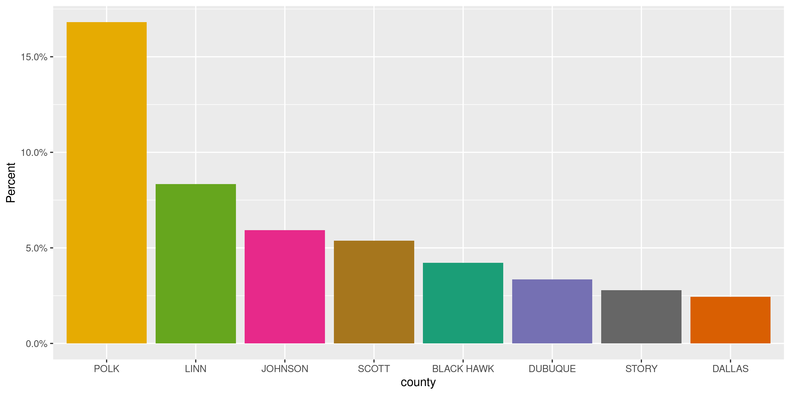
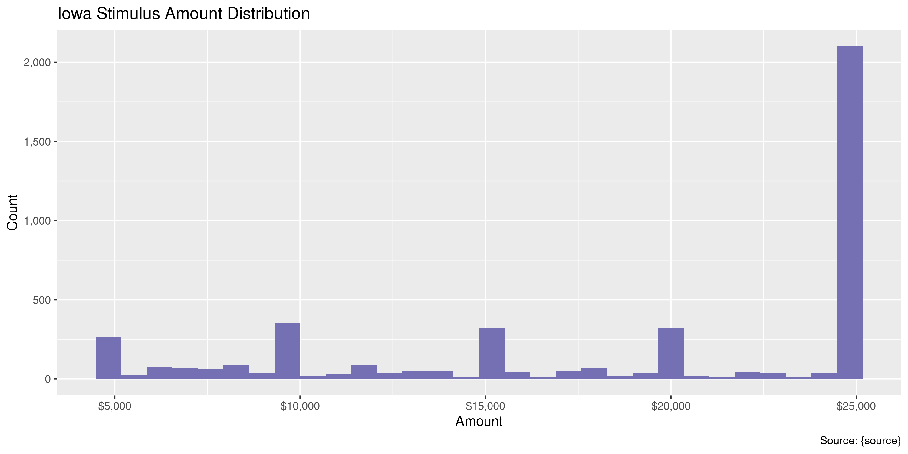

Iowa Stimulus
================
Kiernan Nicholls
2020-07-27 14:32:57

  - [Project](#project)
  - [Objectives](#objectives)
  - [Packages](#packages)
  - [Data](#data)
  - [Download](#download)
  - [Read](#read)
  - [Explore](#explore)
  - [Wrangle](#wrangle)
  - [Conclude](#conclude)
  - [Export](#export)
  - [Upload](#upload)
  - [Dictionary](#dictionary)

<!-- Place comments regarding knitting here -->

## Project

The Accountability Project is an effort to cut across data silos and
give journalists, policy professionals, activists, and the public at
large a simple way to search across huge volumes of public data about
people and organizations.

Our goal is to standardizing public data on a few key fields by thinking
of each dataset row as a transaction. For each transaction there should
be (at least) 3 variables:

1.  All **parties** to a transaction.
2.  The **date** of the transaction.
3.  The **amount** of money involved.

## Objectives

This document describes the process used to complete the following
objectives:

1.  How many records are in the database?
2.  Check for entirely duplicated records.
3.  Check ranges of continuous variables.
4.  Is there anything blank or missing?
5.  Check for consistency issues.
6.  Create a five-digit ZIP Code called `zip`.
7.  Create a `year` field from the transaction date.
8.  Make sure there is data on both parties to a transaction.

## Packages

The following packages are needed to collect, manipulate, visualize,
analyze, and communicate these results. The `pacman` package will
facilitate their installation and attachment.

The IRW’s `campfin` package will also have to be installed from GitHub.
This package contains functions custom made to help facilitate the
processing of campaign finance data.

``` r
if (!require("pacman")) install.packages("pacman")
pacman::p_load_gh("irworkshop/campfin")
pacman::p_load(
  tidyverse, # data manipulation
  lubridate, # datetime strings
  tabulizer, # scrape pdf tables
  gluedown, # printing markdown
  magrittr, # pipe operators
  janitor, # clean data frames
  refinr, # cluster and merge
  scales, # format strings
  knitr, # knit documents
  vroom, # read files fast
  rvest, # html scraping
  glue, # combine strings
  here, # relative paths
  httr, # http requests
  fs # local storage 
)
```

This document should be run as part of the `R_campfin` project, which
lives as a sub-directory of the more general, language-agnostic
[`irworkshop/accountability_datacleaning`](https://github.com/irworkshop/accountability_datacleaning)
GitHub repository.

The `R_campfin` project uses the [RStudio
projects](https://support.rstudio.com/hc/en-us/articles/200526207-Using-Projects)
feature and should be run as such. The project also uses the dynamic
`here::here()` tool for file paths relative to *your* machine.

``` r
# where does this document knit?
here::here()
#> [1] "/home/kiernan/Code/tap/R_campfin"
```

## Data

Stimulus data comes from the Iowa Economic Development Authority.

> Governor Reynolds launched the Iowa Small Business Relief Program to
> provide financial assistance to small businesses economically impacted
> by the COVID-19 pandemic. The program offers eligible small businesses
> grants ranging from $5,000-$25,000 in addition to offering Iowa
> businesses a deferral of sales and use or withholding taxes due and
> waiver of penalty and interest. The application window closed March
> 31. IEDA will not open a new round of applications.

> $24 million was appropriated and disbursed for the Small Business
> Relief program April 7-10. On April 23, Governor Reynolds announced
> additional funding through the federal CARES Act to assist more
> eligible businesses that applied during the March application period.

## Download

We can scrape the IEDA website to obtain the links of PDF reports.

``` r
raw_dir <- dir_create(here("ia", "stimulus", "data", "raw"))
```

``` r
home <- "https://www.iowaeconomicdevelopment.com/aspx/general/dynamicpage.aspx"
raw_get <- GET(home, query = list(id = 205))
```

``` r
raw_urls <- content(raw_get) %>% 
  html_nodes("a") %>% 
  html_attr("href") %>% 
  str_subset("sbrg-recipientslist_\\d+.pdf") %>% 
  str_c("https://www.iowaeconomicdevelopment.com", .)
```

Those 34 PDF files can be downloaded locally.

``` r
raw_paths <- path(raw_dir, basename(raw_urls))
if (!all(file_exists(raw_paths))) {
  download.file(raw_urls, raw_paths)
}
```

``` r
sum(file_size(raw_paths))
#> 41.6M
```

## Read

Using the `tabulizer::extract_tables()` function, we can scrape the PDF
pages for the tables containing our data.

``` r
mid_area <- c(50, 0, 700, 600)
ias <- rep(list(NA), length(raw_paths))
for (i in seq_along(raw_paths)) {
  # extract date from file name
  file_date <- mdy(str_extract(raw_paths[i], "\\d+"))
  # create list of table areas
  n_pgs <- get_n_pages(raw_paths[i])
  pg_areas <- rep(list(mid_area), n_pgs)
  # first and last have smaller tables
  pg_areas[[1]][1] <- 100
  pg_areas[[n_pgs]][1] <- 100
  # scrape all tables
  ias[[i]] <- raw_paths[i] %>% 
    extract_tables(area = pg_areas) %>% 
    map(row_to_names, 1) %>% 
    map_df(as_tibble) %>%
    set_names(c("business", "county", "amount")) %>% 
    # remove total row from end
    slice(-nrow(.)) %>%
    # filter out double headers
    filter(str_detect(amount, "\\d")) %>% 
    # parse numeric column
    mutate(across(3, parse_number)) %>% 
    # add row and date from file
    mutate(round = i, date = file_date, .before = 1)
}
```

The tables from each file can be combined into a single data frame.

``` r
ias <- bind_rows(ias)
ias <- mutate(ias, across(where(is.character), str_to_upper))
```

## Explore

``` r
head(ias)
#> # A tibble: 6 x 5
#>   round date       business                           county        amount
#>   <int> <date>     <chr>                              <chr>          <dbl>
#> 1     1 2020-04-07 10TH HOLE BAR & GRILL LLC          HOWARD          8000
#> 2     1 2020-04-07 2118-2120 INC. DBA GRUMPY’S SALOON SCOTT          25000
#> 3     1 2020-04-07 26550, LLC                         POLK           25000
#> 4     1 2020-04-07 3B GOLF RESTAURANT AND BAR         PALO ALTO      25000
#> 5     1 2020-04-07 4 AMIGOS, INC.                     POTTAWATTAMIE  25000
#> 6     1 2020-04-07 50TH STREET SPORTS, LLC            POLK           25000
tail(ias)
#> # A tibble: 6 x 5
#>   round date       business                              county    amount
#>   <int> <date>     <chr>                                 <chr>      <dbl>
#> 1    34 2020-07-02 FREE SPIRIT YOGA FITNESS, LLC         CLINTON    5000 
#> 2    34 2020-07-02 KITTD                                 LINN       5000 
#> 3    34 2020-07-02 LEVEL 10 FIT                          DICKINSON 11000 
#> 4    34 2020-07-02 OLD TIMER TAVERN                      MARSHALL  15000 
#> 5    34 2020-07-02 SALON 220 LLC                         CHEROKEE  15013.
#> 6    34 2020-07-02 SHEA STUDIO PHOTOGRAPHY, MAGGIE ALLEN HARDIN     5000
```

### Missing

There are no missing values.

``` r
col_stats(ias, count_na)
#> # A tibble: 5 x 4
#>   col      class      n     p
#>   <chr>    <chr>  <int> <dbl>
#> 1 round    <int>      0     0
#> 2 date     <date>     0     0
#> 3 business <chr>      0     0
#> 4 county   <chr>      0     0
#> 5 amount   <dbl>      0     0
```

### Duplicates

There are no duplicate records.

``` r
any(duplicated(ias))
#> [1] FALSE
```

### Categorical

``` r
col_stats(ias, n_distinct)
#> # A tibble: 5 x 4
#>   col      class      n       p
#>   <chr>    <chr>  <int>   <dbl>
#> 1 round    <int>     34 0.00775
#> 2 date     <date>    34 0.00775
#> 3 business <chr>   4368 0.995  
#> 4 county   <chr>    108 0.0246 
#> 5 amount   <dbl>    356 0.0811
```

``` r
explore_plot(ias, county)
```

<!-- -->

### Amounts

We see the minimum and maximum are in line with the statutory values.

``` r
noquote(map_chr(summary(ias$amount), dollar))
#>       Min.    1st Qu.     Median       Mean    3rd Qu.       Max. 
#>     $5,000    $12,000    $22,000 $18,777.54    $25,000    $25,000
```

<!-- -->

### Dates

We can add the calendar year from `date` with `lubridate::year()`

``` r
ias <- mutate(ias, year = year(date))
```

``` r
min(ias$date)
#> [1] "2020-04-07"
max(ias$date)
#> [1] "2020-07-02"
sum(ias$date > today())
#> [1] 0
```

## Wrangle

We need to manually add the state, agency, and funding program name.

``` r
ias <- ias %>% 
  mutate(
    .data = ias,
    .before = business,
    state = "IA",
    agency = "IOWA ECONOMIC DEVELOPMENT AUTHORITY"
  )
```

## Conclude

``` r
head(ias)
#> # A tibble: 6 x 8
#>   round date       state agency                    business                 county     amount  year
#>   <int> <date>     <chr> <chr>                     <chr>                    <chr>       <dbl> <dbl>
#> 1     1 2020-04-07 IA    IOWA ECONOMIC DEVELOPMEN… 10TH HOLE BAR & GRILL L… HOWARD       8000  2020
#> 2     1 2020-04-07 IA    IOWA ECONOMIC DEVELOPMEN… 2118-2120 INC. DBA GRUM… SCOTT       25000  2020
#> 3     1 2020-04-07 IA    IOWA ECONOMIC DEVELOPMEN… 26550, LLC               POLK        25000  2020
#> 4     1 2020-04-07 IA    IOWA ECONOMIC DEVELOPMEN… 3B GOLF RESTAURANT AND … PALO ALTO   25000  2020
#> 5     1 2020-04-07 IA    IOWA ECONOMIC DEVELOPMEN… 4 AMIGOS, INC.           POTTAWATT…  25000  2020
#> 6     1 2020-04-07 IA    IOWA ECONOMIC DEVELOPMEN… 50TH STREET SPORTS, LLC  POLK        25000  2020
```

1.  There are 4,389 records in the database.
2.  There are 0 duplicate records in the database.
3.  The range and distribution of `amount` and `date` seem reasonable.
4.  There are 0 records missing key variables.
5.  Consistency in geographic data has been improved with
    `campfin::normal_*()`.
6.  The 4-digit `year` variable has been created with
    `lubridate::year()`.

## Export

Now the file can be saved on disk for upload to the Accountability
server.

``` r
clean_dir <- dir_create(here("ia", "stimulus", "data", "clean"))
clean_path <- path(clean_dir, "ia_stimulus_clean.csv")
write_csv(ias, clean_path, na = "")
file_size(clean_path)
#> 415K
file_encoding(clean_path) %>% 
  mutate(across(path, path.abbrev))
#> # A tibble: 1 x 3
#>   path                                           mime            charset
#>   <chr>                                          <chr>           <chr>  
#> 1 ~/ia/stimulus/data/clean/ia_stimulus_clean.csv application/csv utf-8
```

## Upload

Using the [duckr](https://github.com/kiernann/duckr) R package, we can
wrap around the [duck](https://duck.sh/) command line tool to upload the
file to the IRW server.

``` r
# remotes::install_github("kiernann/duckr")
s3_dir <- "s3:/publicaccountability/csv/"
s3_path <- path(s3_dir, basename(clean_path))
if (require(duckr)) {
  duckr::duck_upload(clean_path, s3_path)
}
```

## Dictionary

The following table describes the variables in our final exported file:

| Column     | Type        | Definition                      |
| :--------- | :---------- | :------------------------------ |
| `round`    | `integer`   | Stimulus funding round          |
| `date`     | `double`    | Date reported with file         |
| `state`    | `character` | Funding state abbreviation      |
| `agency`   | `character` | Funding agency name             |
| `business` | `character` | Recipient business name         |
| `county`   | `character` | Recipient county name           |
| `amount`   | `double`    | Loan amount ($5,000 to $25,000) |
| `year`     | `double`    | Year loan given                 |
