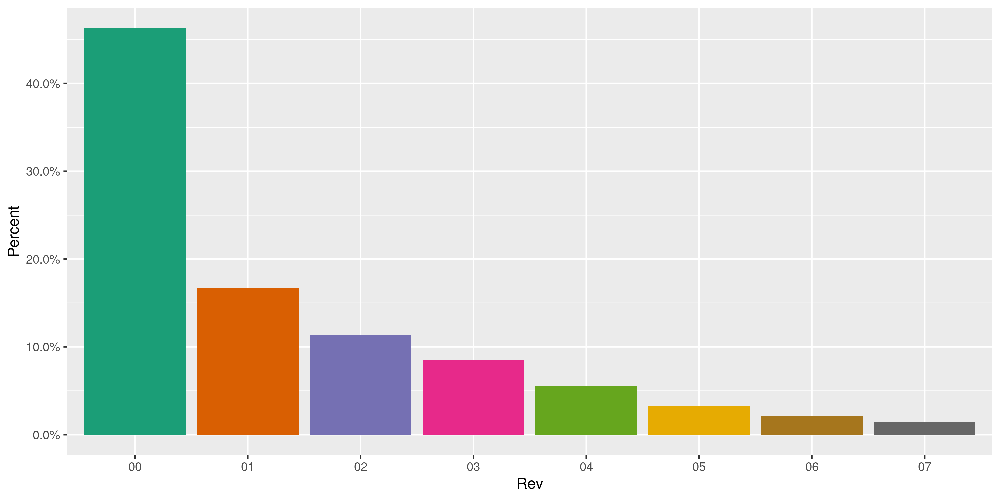
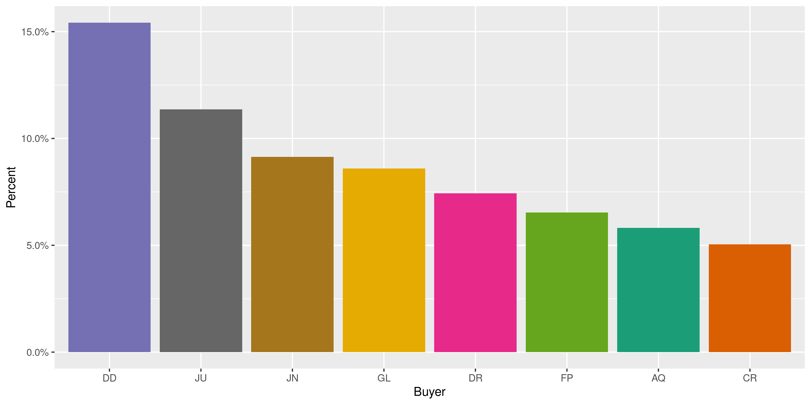
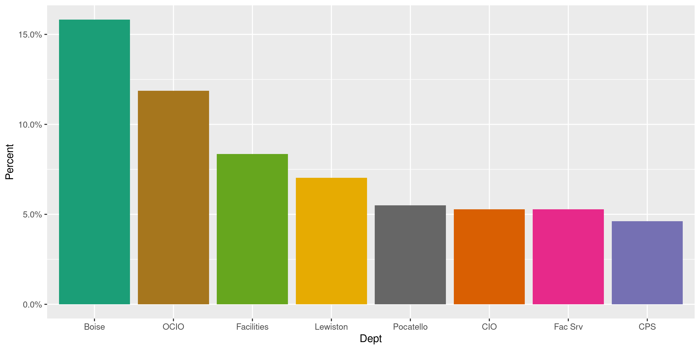
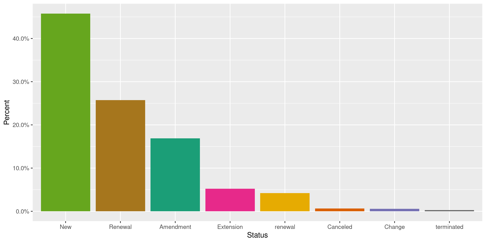
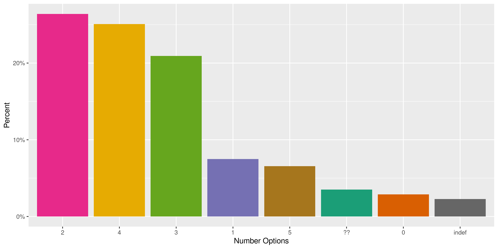
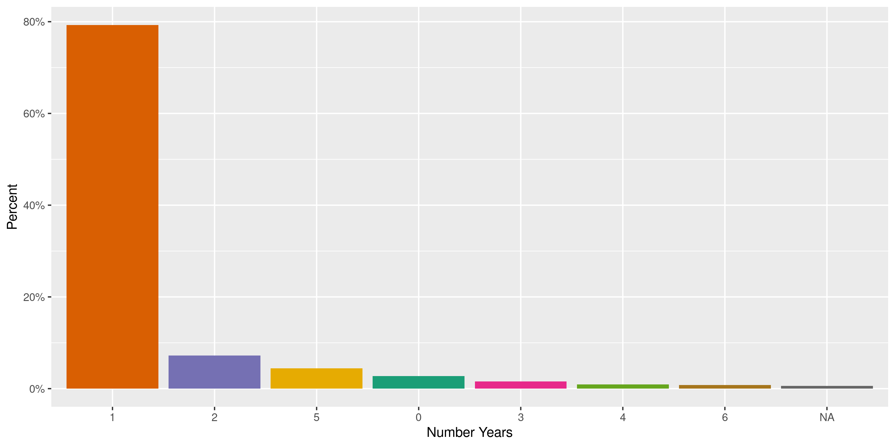
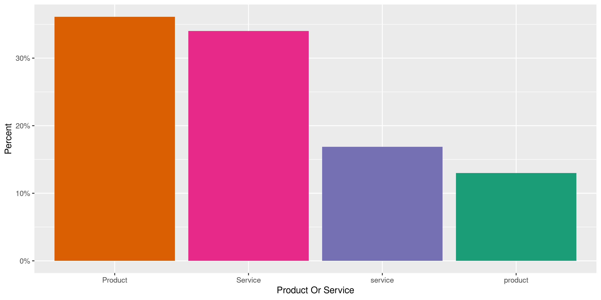
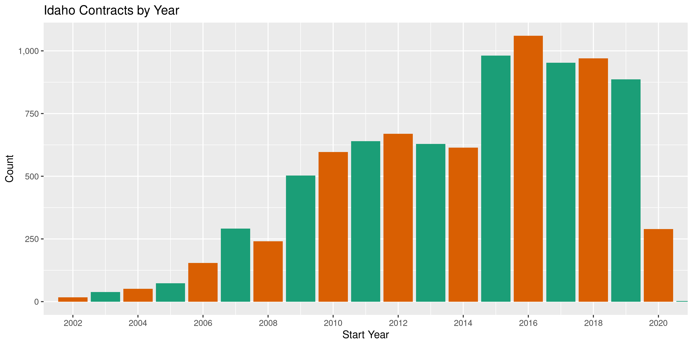

Idaho Contracts
================
Kiernan Nicholls
2020-05-27 13:13:46

  - [Project](#project)
  - [Objectives](#objectives)
  - [Packages](#packages)
  - [Data](#data)
  - [Read](#read)
  - [Explore](#explore)
  - [Conclude](#conclude)
  - [Export](#export)
  - [Dictionary](#dictionary)

<!-- Place comments regarding knitting here -->

## Project

The Accountability Project is an effort to cut across data silos and
give journalists, policy professionals, activists, and the public at
large a simple way to search across huge volumes of public data about
people and organizations.

Our goal is to standardizing public data on a few key fields by thinking
of each dataset row as a transaction. For each transaction there should
be (at least) 3 variables:

1.  All **parties** to a transaction.
2.  The **date** of the transaction.
3.  The **amount** of money involved.

## Objectives

This document describes the process used to complete the following
objectives:

1.  How many records are in the database?
2.  Check for entirely duplicated records.
3.  Check ranges of continuous variables.
4.  Is there anything blank or missing?
5.  Check for consistency issues.
6.  Create a five-digit ZIP Code called `zip`.
7.  Create a `year` field from the transaction date.
8.  Make sure there is data on both parties to a transaction.

## Packages

The following packages are needed to collect, manipulate, visualize,
analyze, and communicate these results. The `pacman` package will
facilitate their installation and attachment.

The IRW’s `campfin` package will also have to be installed from GitHub.
This package contains functions custom made to help facilitate the
processing of campaign finance data.

``` r
if (!require("pacman")) install.packages("pacman")
pacman::p_load_gh("irworkshop/campfin")
pacman::p_load(
  tidyverse, # data manipulation
  lubridate, # datetime strings
  gluedown, # printing markdown
  pdftools, # read pdf files
  magrittr, # pipe operators
  janitor, # clean data frames
  refinr, # cluster and merge
  scales, # format strings
  readxl, # read excel files
  knitr, # knit documents
  vroom, # read files fast
  rvest, # html scraping
  glue, # combine strings
  here, # relative paths
  httr, # http requests
  fs # local storage 
)
```

This document should be run as part of the `R_campfin` project, which
lives as a sub-directory of the more general, language-agnostic
[`irworkshop/accountability_datacleaning`](https://github.com/irworkshop/accountability_datacleaning)
GitHub repository.

The `R_campfin` project uses the [RStudio
projects](https://support.rstudio.com/hc/en-us/articles/200526207-Using-Projects)
feature and should be run as such. The project also uses the dynamic
`here::here()` tool for file paths relative to *your* machine.

``` r
# where does this document knit?
here::here()
#> [1] "/home/kiernan/Code/accountability_datacleaning/R_campfin"
```

## Data

Bulk contracts data for the state of Idaho was received via a Idaho
Public Records Act request.

``` r
raw_dir <- dir_create(here("id", "contracts", "data", "raw"))
raw_zip <- path(raw_dir, "Response.zip")
file_size(raw_zip)
#> 1.76M
```

The archive contains a number of excel files listing contracts by fiscal
year.

``` r
as_tibble(unzip(raw_zip, list = TRUE))
#> # A tibble: 8 x 3
#>   Name                                         Length Date               
#>   <chr>                                         <dbl> <dttm>             
#> 1 Response/Master List 5-19-20.xlsx           1002890 2020-05-19 10:36:00
#> 2 Response/PO List MGS.pdf                     101306 2020-05-19 14:11:00
#> 3 Response/Purchase Order Log Sheet FY15.xlsx  223358 2016-07-01 10:57:00
#> 4 Response/Purchase Order Log Sheet FY16.xlsx  186340 2016-07-01 10:57:00
#> 5 Response/Purchase Order Log Sheet FY17.xlsx  108810 2017-10-25 16:23:00
#> 6 Response/Purchase Order Log Sheet FY18.xlsx  141520 2018-09-11 10:21:00
#> 7 Response/Purchase Order Log Sheet FY19.xlsx  118002 2019-06-28 13:42:00
#> 8 Response/Purchase Order Log Sheet FY20.xlsx   19643 2020-04-20 12:54:00
```

We only require the master contracts list.

``` r
raw_path <- unzip(
  zipfile = raw_zip, 
  files = "Response/Master List 5-19-20.xlsx",
  exdir = raw_dir
)
```

## Read

That master excel file can be read as a data frame.

``` r
idc <- read_excel(
  path = raw_path,
  col_types = "text"
)
```

Then we can parse date and numeric columns after the fact.

``` r
idc <- idc %>% 
  clean_names("snake") %>% 
  na_if("N/A") %>% 
  mutate(across(c(9:11, 15), ~excel_numeric_to_date(as.numeric(.)))) %>% 
  mutate(across(contract_amount, parse_number))
```

The data recieved lists buying agencies only by their abbreviations. A
telephone directory was provided upon request to convert these
abbreviations to full agency names. Using `pdftools::pdf_text()`, we can
read the lines of this directory and parse the text into a proper data
frame.

We will need a new function to split the two-column lines of text on the
page.

``` r
str_insert <- function(string, insert, n) {
  lhs <- sprintf("^(.{%s})(.*)$", n - 1)
  rhs <- stringr::str_c('\\1', insert, '\\2')
  stringr::str_replace(string, lhs, rhs)
}
```

We can read the lines of text into a character vector and replace the
padding full stops with white space so the lines can be read with
`readr::read_table()`.

``` r
tel_paths <- dir_ls(here("id", "contracts"), regexp = "tel")
tel_text <- str_split(pdf_text(tel_paths[1]), "\n")[[1]][4:57]
tel_text <- unlist(str_split(str_insert(tel_text, "\n", 80), "\\s+\n"))[-1]
tel_abbs <- tel_text %>% 
  str_trim("left") %>% 
  str_replace_all("\\.{2,}", str_dup(" ", 50)) %>% 
  read_table(col_names = TRUE) %>% 
  clean_names()
```

Then, the same can be done for the second page of the telephone
directory. Then we can bind the two pages together into a single data
frame.

``` r
tel_paths <- dir_ls(here("id", "contracts"), regexp = "tel")
tel_text <- str_split(pdf_text(tel_paths[2]), "\n")[[1]][4:57]
tel_text <- unlist(str_split(str_insert(tel_text, "\n", 80), "\\s+\n"))[-1]
tel_abbs <- tel_text %>% 
  str_trim("left") %>% 
  str_replace_all("\\.{2,}", str_dup(" ", 50)) %>% 
  read_table(col_names = TRUE) %>% 
  clean_names() %>% 
  bind_rows(tel_abbs)
```

That data frame of abbreviation translations can be used to define the
full names of the buying agencies. Not all agency abbreviations are
found in this directory.

``` r
idc <- left_join(idc, tel_abbs, by = c("agency" = "abbreviation"))
```

``` r
idc %>% 
  count(agency, agency_name, sort = TRUE) %>%
  add_prop() %>% 
  mutate(t = cumsum(p))
#> # A tibble: 111 x 5
#>    agency agency_name                             n      p     t
#>    <chr>  <chr>                               <int>  <dbl> <dbl>
#>  1 STW    <NA>                                 1655 0.138  0.138
#>  2 ITD    Idaho Department of Transportation   1513 0.126  0.264
#>  3 ITD    Transportation, Idaho Department of  1513 0.126  0.390
#>  4 IDOC   Correction, Department of             461 0.0384 0.429
#>  5 IDOC   Department of Correction              461 0.0384 0.467
#>  6 DHW    Department of Health and Welfare      383 0.0319 0.499
#>  7 DHW    Health and Welfare, Department of     383 0.0319 0.531
#>  8 IDFG   Department of Fish and Game           381 0.0318 0.563
#>  9 IDFG   Fish and Game, Department of          381 0.0318 0.595
#> 10 ISP    Idaho State Police                    208 0.0173 0.612
#> # … with 101 more rows
```

17% of this new `agency_name` variable is `NA`, meaning an abbreviation
was not found in the telephone directory. They make up a relatively
small amount of the overal records.

``` r
idc %>% 
  count(agency, agency_name, sort = TRUE) %>%
  add_prop() %>% 
  filter(is.na(agency_name))
#> # A tibble: 30 x 4
#>    agency  agency_name     n       p
#>    <chr>   <chr>       <int>   <dbl>
#>  1 STW     <NA>         1655 0.138  
#>  2 IDVS    <NA>          162 0.0135 
#>  3 EITC    <NA>           30 0.00250
#>  4 IDVR    <NA>           30 0.00250
#>  5 ISLD    <NA>           30 0.00250
#>  6 ICFL    <NA>           19 0.00158
#>  7 ADM-CPS <NA>           17 0.00142
#>  8 IBOP    <NA>           16 0.00133
#>  9 ISWCC   <NA>           13 0.00108
#> 10 BON     <NA>           12 0.00100
#> # … with 20 more rows
```

For these records missing an agency name, we can just use the
abbreviation given to us.

``` r
idc <- idc %>% 
  rename(agency_abb = agency) %>% 
  mutate(agency_name = coalesce(agency_name, agency_abb))
```

## Explore

``` r
glimpse(idc)
#> Rows: 11,990
#> Columns: 24
#> $ contract_number       <chr> "BPO01205", "BPO01205", "BPO01205", "BPO01205", "BPO01205", "BPO01…
#> $ rev                   <chr> "00", "01", "02", "03", "04", "05", "06", "00", "00", "01", "01", …
#> $ buyer                 <chr> "BS", "BS", "BS", "BS", "BS", "SJW", "SJW", "DV", "DV", "DV", "DV"…
#> $ agency_abb            <chr> "ISP", "ISP", "ISP", "ISP", "ISP", "ISP", "ISP", "ITD", "ITD", "IT…
#> $ dept                  <chr> NA, NA, NA, NA, NA, NA, NA, NA, NA, NA, NA, NA, NA, NA, NA, NA, NA…
#> $ pa                    <chr> NA, NA, NA, NA, NA, NA, NA, "BPO75", "BPO75", NA, NA, NA, NA, NA, …
#> $ solicitation          <chr> NA, NA, NA, NA, NA, NA, NA, NA, NA, NA, NA, NA, NA, NA, NA, NA, NA…
#> $ status                <chr> "Renewal", "Renewal", "Renewal", "Renewal", "Renewal", "Renewal", …
#> $ issue                 <date> 2002-09-03, 2004-08-31, 2006-08-15, 2008-08-13, 2010-08-31, 2013-…
#> $ start                 <date> 2002-08-16, 2004-08-16, 2006-08-16, 2008-06-16, 2010-08-16, 2013-…
#> $ expires               <date> 2004-08-15, 2006-08-15, 2008-08-15, 2010-08-15, 2013-08-15, 2016-…
#> $ contract_amount       <dbl> 57000, 57000, 96000, 96000, 144000, 144000, 144000, 3000, 3000, 30…
#> $ number_options        <chr> NA, NA, NA, NA, NA, NA, NA, NA, NA, NA, NA, NA, NA, NA, NA, NA, NA…
#> $ number_years          <chr> NA, NA, NA, NA, NA, NA, NA, NA, NA, NA, NA, NA, NA, NA, NA, NA, NA…
#> $ max_end               <date> NA, NA, NA, NA, NA, NA, NA, NA, NA, NA, NA, NA, NA, NA, NA, NA, N…
#> $ vendor                <chr> "NLETS", "NLETS", "NLETS", "NLETS", "NLETS", "NLETS", "NLETS", "Ac…
#> $ commodity             <chr> "Data Processing Services", "Data Processing Services", "Data Proc…
#> $ commodity_code        <chr> "92002", "92002", "92002", "92002", "92002", "92002", "92002", "54…
#> $ product_or_service    <chr> "Service", "Service", "Service", "Service", "Service", "Service", …
#> $ fee_language          <chr> NA, NA, NA, NA, "6/28/10 t&c", "No", "No", NA, NA, NA, NA, NA, NA,…
#> $ admin_fee             <chr> NA, NA, NA, NA, "1.2500000000000001E-2", NA, NA, NA, NA, NA, NA, N…
#> $ previous_solicitation <chr> NA, NA, NA, NA, NA, NA, NA, NA, NA, NA, NA, NA, NA, NA, NA, NA, NA…
#> $ notes                 <chr> NA, NA, NA, NA, NA, NA, NA, NA, NA, NA, NA, NA, NA, NA, NA, NA, NA…
#> $ agency_name           <chr> "Idaho State Police", "Idaho State Police", "Idaho State Police", …
tail(idc)
#> # A tibble: 6 x 24
#>   contract_number rev   buyer agency_abb dept  pa    solicitation status issue      start     
#>   <chr>           <chr> <chr> <chr>      <chr> <chr> <chr>        <chr>  <date>     <date>    
#> 1 SBPO20200181    00    DD    STW        <NA>  <NA>  ITB17200380  New    2019-11-05 2019-11-05
#> 2 SBPO20200219    00    JU    STW        <NA>  <NA>  RFP15000097  New    2019-12-23 2020-01-01
#> 3 SBPO20200234    00    DD    STW        <NA>  <NA>  ITB20200260  New    2019-12-30 2019-12-30
#> 4 SBPO20200388    00    JN    STW        <NA>  <NA>  RFQ20200486  New    2020-05-04 2020-05-04
#> 5 SBPO20200389    00    JN    STW        <NA>  <NA>  RFQ20200486  New    2020-05-04 2020-05-04
#> 6 SBPO20200390    00    JN    STW        <NA>  <NA>  RFQ20200486  New    2020-05-04 2020-05-04
#> # … with 14 more variables: expires <date>, contract_amount <dbl>, number_options <chr>,
#> #   number_years <chr>, max_end <date>, vendor <chr>, commodity <chr>, commodity_code <chr>,
#> #   product_or_service <chr>, fee_language <chr>, admin_fee <chr>, previous_solicitation <chr>,
#> #   notes <chr>, agency_name <chr>
```

### Missing

Columns vary in their number of missing values.

``` r
col_stats(idc, count_na)
#> # A tibble: 24 x 4
#>    col                   class      n        p
#>    <chr>                 <chr>  <int>    <dbl>
#>  1 contract_number       <chr>      0 0       
#>  2 rev                   <chr>     27 0.00225 
#>  3 buyer                 <chr>      0 0       
#>  4 agency_abb            <chr>      0 0       
#>  5 dept                  <chr>  11535 0.962   
#>  6 pa                    <chr>   9468 0.790   
#>  7 solicitation          <chr>   6497 0.542   
#>  8 status                <chr>     71 0.00592 
#>  9 issue                 <date>    21 0.00175 
#> 10 start                 <date>  2332 0.194   
#> 11 expires               <date>    46 0.00384 
#> 12 contract_amount       <dbl>     82 0.00684 
#> 13 number_options        <chr>  10710 0.893   
#> 14 number_years          <chr>  10677 0.890   
#> 15 max_end               <date> 10676 0.890   
#> 16 vendor                <chr>      8 0.000667
#> 17 commodity             <chr>     14 0.00117 
#> 18 commodity_code        <chr>   2544 0.212   
#> 19 product_or_service    <chr>   2330 0.194   
#> 20 fee_language          <chr>   7345 0.613   
#> 21 admin_fee             <chr>   9248 0.771   
#> 22 previous_solicitation <chr>  11888 0.991   
#> 23 notes                 <chr>   9681 0.807   
#> 24 agency_name           <chr>      0 0
```

Any record missing a variable needed to identify the transaction will be
flagged with `campfin::flag_na()`.

``` r
idc <- idc %>% flag_na(issue, agency_name, contract_amount, vendor)
sum(idc$na_flag)
#> [1] 97
```

``` r
idc %>% 
  filter(na_flag) %>% 
  select(contract_number, issue, agency_name, contract_amount, vendor)
#> # A tibble: 97 x 5
#>    contract_number issue      agency_name                   contract_amount vendor                 
#>    <chr>           <date>     <chr>                                   <dbl> <chr>                  
#>  1 BPO01697        2010-07-01 Transportation, Idaho Depart…              NA IBM                    
#>  2 BPO01697        2010-07-01 Idaho Department of Transpor…              NA IBM                    
#>  3 BPO15701118     2015-06-19 Agriculture, Department of                  0 <NA>                   
#>  4 BPO15701118     2015-06-19 Department of Agriculture                   0 <NA>                   
#>  5 BPO162400454    2019-11-15 Transportation, Idaho Depart…           74090 <NA>                   
#>  6 BPO162400454    2019-11-15 Idaho Department of Transpor…           74090 <NA>                   
#>  7 BPO182400387    2020-04-07 Transportation, Idaho Depart…              NA Freightliner of Idaho,…
#>  8 BPO182400387    2020-04-07 Idaho Department of Transpor…              NA Freightliner of Idaho,…
#>  9 CPO00044        NA         Idaho State Police                         NA Western Identification…
#> 10 CPO01199        2002-03-27 Tax Commission, Idaho                      NA Fast Enterprises, LLC  
#> # … with 87 more rows
```

### Duplicates

Ignoring the supposedly unique `contract_number`, there are a handful of
duplicated records.

``` r
idc <- flag_dupes(idc, -contract_number)
sum(idc$dupe_flag)
#> [1] 866
```

``` r
idc %>% 
  filter(dupe_flag) %>% 
  select(contract_number, issue, agency_name, contract_amount, vendor)
#> # A tibble: 866 x 5
#>    contract_number issue      agency_name                      contract_amount vendor              
#>    <chr>           <date>     <chr>                                      <dbl> <chr>               
#>  1 BPO01382        2010-07-30 Boise State University                        0  Johnson Controls Inc
#>  2 BPO01382        2010-07-30 Boise State University                        0  Johnson Controls Inc
#>  3 BPO01658        2010-03-12 Public Employee Retirement Syst…              0  Sedgwick CMS        
#>  4 BPO01658        2010-03-12 Public Employee Retirement Syst…              0  Sedgwick CMS        
#>  5 BPO01662        2010-01-28 Real Estate Commission                     6000  Alexander Clark Pri…
#>  6 BPO01662        2010-01-28 Real Estate Commission                     6000  Alexander Clark Pri…
#>  7 BPO01708        2011-08-17 Lewis-Clark State College                 89032. EBSCO Subscription …
#>  8 BPO01708        2011-08-17 Lewis-Clark State College                 89032. EBSCO Subscription …
#>  9 BPO01708        2012-07-13 Lewis-Clark State College                108497  EBSCO Subscription …
#> 10 BPO01708        2012-07-13 Lewis-Clark State College                108497  EBSCO Subscription …
#> # … with 856 more rows
```

### Categorical

``` r
col_stats(idc, n_distinct)
#> # A tibble: 26 x 4
#>    col                   class      n        p
#>    <chr>                 <chr>  <int>    <dbl>
#>  1 contract_number       <chr>   3291 0.274   
#>  2 rev                   <chr>     28 0.00234 
#>  3 buyer                 <chr>     46 0.00384 
#>  4 agency_abb            <chr>     84 0.00701 
#>  5 dept                  <chr>     38 0.00317 
#>  6 pa                    <chr>    110 0.00917 
#>  7 solicitation          <chr>   1851 0.154   
#>  8 status                <chr>     21 0.00175 
#>  9 issue                 <date>  2567 0.214   
#> 10 start                 <date>  1866 0.156   
#> 11 expires               <date>  2139 0.178   
#> 12 contract_amount       <dbl>   3807 0.318   
#> 13 number_options        <chr>     20 0.00167 
#> 14 number_years          <chr>     20 0.00167 
#> 15 max_end               <date>   437 0.0364  
#> 16 vendor                <chr>   1368 0.114   
#> 17 commodity             <chr>   2355 0.196   
#> 18 commodity_code        <chr>    539 0.0450  
#> 19 product_or_service    <chr>      5 0.000417
#> 20 fee_language          <chr>     27 0.00225 
#> 21 admin_fee             <chr>     22 0.00183 
#> 22 previous_solicitation <chr>     26 0.00217 
#> 23 notes                 <chr>   1159 0.0967  
#> 24 agency_name           <chr>    111 0.00926 
#> 25 na_flag               <lgl>      2 0.000167
#> 26 dupe_flag             <lgl>      2 0.000167
```

``` r
explore_plot(idc, rev)
```

<!-- -->

``` r
explore_plot(idc, buyer)
```

<!-- -->

``` r
explore_plot(idc, agency_name) + scale_x_truncate()
```

<!-- -->

``` r
explore_plot(idc, dept)
```

<!-- -->

``` r
explore_plot(idc, status)
```

<!-- -->

``` r
explore_plot(idc, number_options)
```

<!-- -->

``` r
explore_plot(idc, number_years)
```

<!-- -->

``` r
explore_plot(idc, product_or_service)
```

<!-- -->

### Amounts

``` r
noquote(map_chr(summary(idc$contract_amount), dollar))
#>            Min.         1st Qu.          Median            Mean         3rd Qu.            Max. 
#> -$1,885,781,211      $19,020.96      $57,667.27        $621,318        $222,757    $310,000,000 
#>            NA's 
#>             $82
prop_na(idc$contract_amount)
#> [1] 0.006839033
mean(idc$contract_amount <= 0, na.rm = TRUE)
#> [1] 0.1126973
```

Here are the minimum and maximum contract amount values.

``` r
idc[which.min(idc$contract_amount), ] %>% 
  mutate(across(contract_amount, dollar)) %>% 
  glimpse()
#> Rows: 1
#> Columns: 26
#> $ contract_number       <chr> "CPO02617"
#> $ rev                   <chr> "14"
#> $ buyer                 <chr> "JU"
#> $ agency_abb            <chr> "IDOC"
#> $ dept                  <chr> NA
#> $ pa                    <chr> NA
#> $ solicitation          <chr> NA
#> $ status                <chr> "Amendment"
#> $ issue                 <date> 2019-10-23
#> $ start                 <date> 2019-01-01
#> $ expires               <date> 2020-12-31
#> $ contract_amount       <chr> "-$1,885,781,211"
#> $ number_options        <chr> NA
#> $ number_years          <chr> NA
#> $ max_end               <date> NA
#> $ vendor                <chr> "Corizon, Inc."
#> $ commodity             <chr> "Offender Health Care Services"
#> $ commodity_code        <chr> "94874"
#> $ product_or_service    <chr> "Service"
#> $ fee_language          <chr> NA
#> $ admin_fee             <chr> NA
#> $ previous_solicitation <chr> NA
#> $ notes                 <chr> NA
#> $ agency_name           <chr> "Correction, Department of"
#> $ na_flag               <lgl> FALSE
#> $ dupe_flag             <lgl> FALSE
idc[which.max(idc$contract_amount), ] %>% 
  mutate(across(contract_amount, dollar)) %>% 
  glimpse()
#> Rows: 1
#> Columns: 26
#> $ contract_number       <chr> "SBPO1391"
#> $ rev                   <chr> "00"
#> $ buyer                 <chr> "JU"
#> $ agency_abb            <chr> "STW"
#> $ dept                  <chr> NA
#> $ pa                    <chr> "Y"
#> $ solicitation          <chr> NA
#> $ status                <chr> "New"
#> $ issue                 <date> 2012-07-31
#> $ start                 <date> 2012-08-01
#> $ expires               <date> 2017-07-31
#> $ contract_amount       <chr> "$310,000,000"
#> $ number_options        <chr> NA
#> $ number_years          <chr> NA
#> $ max_end               <date> NA
#> $ vendor                <chr> "Bank of America"
#> $ commodity             <chr> "Purchasing Card"
#> $ commodity_code        <chr> "94635"
#> $ product_or_service    <chr> "service"
#> $ fee_language          <chr> "Rebates"
#> $ admin_fee             <chr> NA
#> $ previous_solicitation <chr> NA
#> $ notes                 <chr> "Changed from $200,000,000 to $310,000,000 per the actual spend in…
#> $ agency_name           <chr> "STW"
#> $ na_flag               <lgl> FALSE
#> $ dupe_flag             <lgl> FALSE
```

<!-- -->

### Dates

We can add the calendar year from `date` with `lubridate::year()`

``` r
idc <- mutate(idc, year = year(start))
```

``` r
min(idc$start, na.rm = TRUE)
#> [1] "2002-01-01"
sum(idc$year < 2000, na.rm = TRUE)
#> [1] 0
max(idc$start, na.rm = TRUE)
#> [1] "2906-09-01"
sum(idc$start > today(), na.rm = TRUE)
#> [1] 22
```

``` r
idc %>% 
  filter(year > 2020) %>% 
  count(year, sort = TRUE)
#> # A tibble: 2 x 2
#>    year     n
#>   <dbl> <int>
#> 1  2906     6
#> 2  2021     2
```

``` r
idc <- mutate(idc, across(start, str_replace, "^(29)", "20"))
idc <- mutate(idc, year = year(start))
```

<!-- -->

## Conclude

1.  There are 11,990 records in the database.
2.  There are 866 duplicate records in the database.
3.  The range and distribution of `amount` and `date` seem reasonable.
4.  There are 97 records missing key variables.
5.  The 4-digit `year` variable has been created with
    `lubridate::year()`.

## Export

Now the file can be saved on disk for upload to the Accountability
server.

``` r
clean_dir <- dir_create(here("id", "contracts", "data", "clean"))
clean_path <- path(clean_dir, "id_contracts_clean.csv")
write_csv(idc, clean_path, na = "")
file_size(clean_path)
#> 2.36M
mutate(file_encoding(clean_path), across(path, basename))
#> # A tibble: 1 x 3
#>   path                   mime            charset
#>   <chr>                  <chr>           <chr>  
#> 1 id_contracts_clean.csv application/csv utf-8
```

## Dictionary

The following table describes the variables in our final exported file:

| Column                  | Type      | Definition |
| :---------------------- | :-------- | :--------- |
| `contract_number`       | character |            |
| `rev`                   | character |            |
| `buyer`                 | character |            |
| `agency_abb`            | character |            |
| `dept`                  | character |            |
| `pa`                    | character |            |
| `solicitation`          | character |            |
| `status`                | character |            |
| `issue`                 | double    |            |
| `start`                 | character |            |
| `expires`               | double    |            |
| `contract_amount`       | double    |            |
| `number_options`        | character |            |
| `number_years`          | character |            |
| `max_end`               | double    |            |
| `vendor`                | character |            |
| `commodity`             | character |            |
| `commodity_code`        | character |            |
| `product_or_service`    | character |            |
| `fee_language`          | character |            |
| `admin_fee`             | character |            |
| `previous_solicitation` | character |            |
| `notes`                 | character |            |
| `agency_name`           | character |            |
| `na_flag`               | logical   |            |
| `dupe_flag`             | logical   |            |
| `year`                  | double    |            |

``` r
write_lines(
  x = c("# Idaho Contracts Data Dictionary\n", dict_md),
  path = here("id", "contracts", "id_contracts_dict.md"),
)
```
