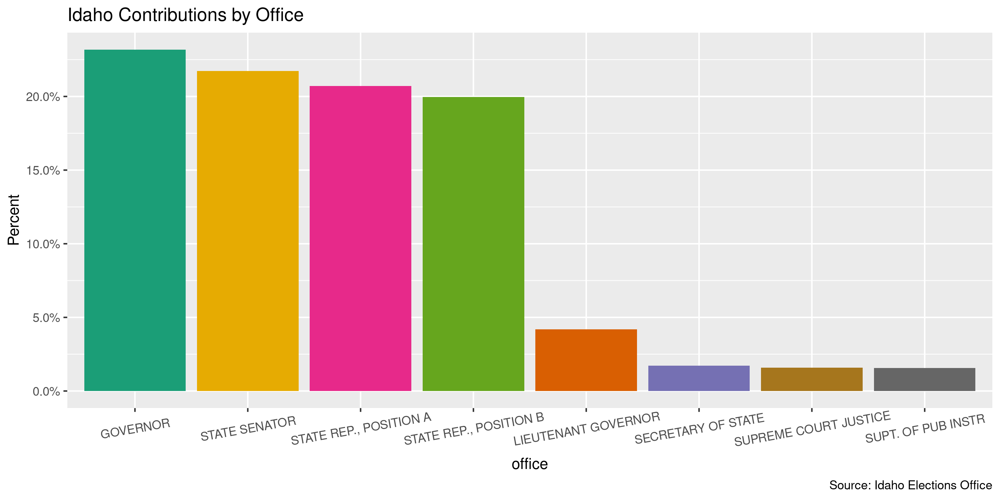
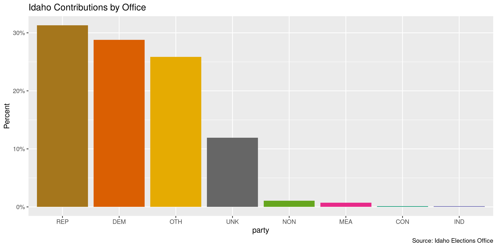
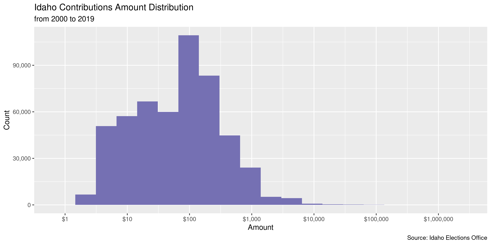
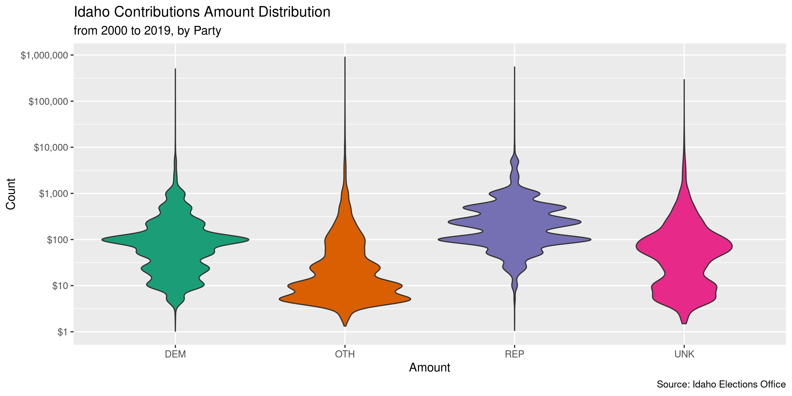

Idaho Contributions, 2020-present
================
Kiernan Nicholls & Yanqi Xu
2023-12-28 23:53:44

- [Project](#project)
- [Objectives](#objectives)
- [Packages](#packages)
- [Import](#import)
- [Data](#data)
- [Explore](#explore)
- [Wrangle](#wrangle)
- [Conclude](#conclude)
- [Export](#export)
- [Upload](#upload)

<!-- Place comments regarding knitting here -->

## Project

The Accountability Project is an effort to cut across data silos and
give journalists, policy professionals, activists, and the public at
large a simple way to search across huge volumes of public data about
people and organizations.

Our goal is to standardizing public data on a few key fields by thinking
of each dataset row as a transaction. For each transaction there should
be (at least) 3 variables:

1.  All **parties** to a transaction
2.  The **date** of the transaction
3.  The **amount** of money involved

## Objectives

This document describes the process used to complete the following
objectives:

1.  How many records are in the database?
2.  Check for duplicates
3.  Check ranges
4.  Is there anything blank or missing?
5.  Check for consistency issues
6.  Create a five-digit ZIP Code called `zip`
7.  Create a `year` field from the transaction date
8.  Make sure there is data on both parties to a transaction

## Packages

The following packages are needed to collect, manipulate, visualize,
analyze, and communicate these results. The `pacman` package will
facilitate their installation and attachment.

The IRW’s `campfin` package will also have to be installed from GitHub.
This package contains functions custom made to help facilitate the
processing of campaign finance data.

``` r
if (!require("pacman")) install.packages("pacman")
pacman::p_load_gh("irworkshop/campfin")
pacman::p_load(
  tidyverse, # data manipulation
  snakecase, # column naming
  lubridate, # datetime strings
  magrittr, # pipe opperators
  gluedown, # printing markdown
  janitor, # dataframe clean
  aws.s3, # upload to aws s3
  refinr, # cluster and merge
  scales, # format strings
  readxl, # read excel files
  knitr, # knit documents
  rvest, # read html pages
  vroom, # read files fast
  glue, # combine strings
  here, # relative storage
  fs # search storage 
)
```

This document should be run as part of the `R_campfin` project, which
lives as a sub-directory of the more general, language-agnostic
[`irworkshop/accountability_datacleaning`](https://github.com/irworkshop/accountability_datacleaning)
GitHub repository.

The `R_campfin` project uses the [RStudio
projects](https://support.rstudio.com/hc/en-us/articles/200526207-Using-Projects)
feature and should be run as such. The project also uses the dynamic
`here::here()` tool for file paths relative to *your* machine.

``` r
# where does this document knit?
here::here()
#> [1] "/Users/yanqixu/code/accountability_datacleaning"
```

## Import

To import the data for processing, we will have to download each archive
file and read them together into a single data frame object.

``` r
raw_dir <- dir_create(here("state","id", "contribs", "data", "raw"))
```

## Data

The data was provided as a public records request and was fulfilled on Dec. 4, 2023. For data prior to 2020, see this [data dictionary](https://github.com/irworkshop/accountability_datacleaning/blob/8689889cefa62b7e5b0bdad5133123ed72fe9393/state/id/contribs/docs/id_contribs_diary.md?plain=1#L827).

### Read

Each file has a different column order and names. We will first use
`purrr::map()` to use `readxl::read_excel()` and create a list of data
frames.

``` r
idc <- read_csv(
  dir_ls(raw_dir)
) %>% clean_names()
```

In this update, since we would like to create a new dataset for records
from 2020-01-01 and on, we need to remove records after 2020-01-01 in
the last update. We will do so by segregating these 2020 records and
replace the data in the previous update.

``` r
prev_dir <- here("state","id", "contribs", "data", "previous")

idc_prev <- read_csv(path(prev_dir, "id_contribs_clean_download.csv"))

x <- idc_prev %>% filter(date>=as.Date("2020-01-01") & is.na(source_file))

idc_prev_new <- anti_join(idc_prev, x)

idc_prev_new %>% write_csv(path(prev_dir, "id_contribs_clean.csv"))
```

We also need to reorder and recode these variables to be consistent
across each year.

``` r
idc <- idc %>% 
  mutate_if(is_character, str_to_upper) %>% 
  mutate(
    to_office = to_office %>% 
      str_replace("REPRESENTATIVE", "REP."),
    to_party = to_party %>% 
      str_replace("OTHER", "OTH") %>% 
      str_replace("REPUBLICAN", "REP") %>% 
      str_replace("DEMOCRATIC", "DEM") %>% 
      str_replace("INDEPENDENT", "IND") %>% 
      str_replace("LIBERTARIAN", "LIB") %>% 
      str_replace("CONSTITUTION", "CON") %>% 
      str_replace("NON-PARTISAN", "NON")
  )
```

``` r
count_na(idc$date) 
#> [1] 0
```

## Explore

``` r
glimpse(idc)
#> Rows: 234,059
#> Columns: 39
#> $ id                                <dbl> 238527, 118542, 84965, 204943, 245909, 117109, 81988, 2…
#> $ date                              <dttm> 2023-12-03 12:00:00, 2023-12-02 12:00:00, 2023-12-02 1…
#> $ activity_type                     <chr> "DONATE", "DONATE", "DONATE", "DONATE", "DONATE", "DONA…
#> $ amount                            <dbl> 30000.00, 1000.00, 1000.00, 5000.00, 1000.00, 1000.00, …
#> $ report_name                       <chr> "2023 ANNUAL", "2023 DECEMBER-ANNUAL", "2023 DECEMBER-A…
#> $ report_id                         <dbl> 74878, 85994, 85994, 85787, 75235, 85968, 75158, 82386,…
#> $ donation_count                    <dbl> 1, 1, 1, 1, 1, 1, 1, 1, 1, 1, 1, 0, 1, 1, 1, 1, 1, 1, 1…
#> $ donate_type                       <chr> "NORMAL", "NORMAL", "NORMAL", "NORMAL", "NORMAL", "NORM…
#> $ spend_count                       <lgl> NA, NA, NA, NA, NA, NA, NA, NA, NA, NA, NA, NA, NA, NA,…
#> $ spend_type                        <lgl> NA, NA, NA, NA, NA, NA, NA, NA, NA, NA, NA, NA, NA, NA,…
#> $ spend_codes                       <lgl> NA, NA, NA, NA, NA, NA, NA, NA, NA, NA, NA, NA, NA, NA,…
#> $ election_year                     <dbl> NA, 2023, 2023, NA, 2024, 2023, 2024, NA, NA, 2024, NA,…
#> $ election_type                     <chr> NA, "GENERAL", "GENERAL", NA, "PRIMARY", "GENERAL", "PR…
#> $ from_name                         <chr> "IDAHO AUTOMOBILE DEALERS ASSOCIATION INC", "ADAM PITAL…
#> $ from_type                         <chr> "COMPANY", "INDIVIDUAL", "INDIVIDUAL", "INDIVIDUAL", "I…
#> $ from_address                      <chr> "4980 W STATE STREET", "6526 N CONAGHER LANE", "4795 VA…
#> $ from_city                         <chr> "BOISE", "EAGLE", "BOULDER", "EAGLE", "BOISE", "BOISE",…
#> $ from_state                        <chr> "ID", "ID", "CO", "ID", "ID", "ID", "ID", "ID", "ID", "…
#> $ from_zip                          <chr> "83703", NA, NA, NA, NA, NA, "83209", "83706", NA, NA, …
#> $ from_office                       <lgl> NA, NA, NA, NA, NA, NA, NA, NA, NA, NA, NA, NA, NA, NA,…
#> $ from_district                     <lgl> NA, NA, NA, NA, NA, NA, NA, NA, NA, NA, NA, NA, NA, NA,…
#> $ from_party                        <lgl> NA, NA, NA, NA, NA, NA, NA, NA, NA, NA, NA, NA, NA, NA,…
#> $ from_jurisdiction_of_registration <lgl> NA, NA, NA, NA, NA, NA, NA, NA, NA, NA, NA, NA, NA, NA,…
#> $ from_status                       <lgl> NA, NA, NA, NA, NA, NA, NA, NA, NA, NA, NA, NA, NA, NA,…
#> $ from_cash_on_hand                 <lgl> NA, NA, NA, NA, NA, NA, NA, NA, NA, NA, NA, NA, NA, NA,…
#> $ from_remaining_loan               <lgl> NA, NA, NA, NA, NA, NA, NA, NA, NA, NA, NA, NA, NA, NA,…
#> $ from_remaining_debt               <lgl> NA, NA, NA, NA, NA, NA, NA, NA, NA, NA, NA, NA, NA, NA,…
#> $ to_name                           <chr> "AUTOPAC", "BRAD PIKE", "BRAD PIKE", "PRESERVE IDAHO PA…
#> $ to_type                           <chr> "PAC", "CANDIDATE", "CANDIDATE", "PAC", "CANDIDATE", "C…
#> $ to_address                        <chr> "207 MILITARY DR", "1905 N. SYNERGY PL.", "1905 N. SYNE…
#> $ to_city                           <chr> "COEUR D ALENE", "EAGLE", "EAGLE", "LEWISTON", "BOISE",…
#> $ to_state                          <chr> "ID", "ID", "ID", "ID", "ID", "ID", "ID", "ID", "ID", "…
#> $ to_zip                            <dbl> 83814, 83616, 83616, 83501, 83713, 83616, 83669, 83669,…
#> $ to_office                         <chr> NA, "MAYOR", "MAYOR", NA, "STATE SENATOR", "MAYOR", "ST…
#> $ to_district                       <chr> NA, "EAGLE CITY", "EAGLE CITY", NA, "15", "EAGLE CITY",…
#> $ to_party                          <chr> NA, NA, NA, NA, "DEM", NA, "REP", NA, NA, "DEM", NA, NA…
#> $ to_jurisdiction_of_registration   <chr> "IDAHO STATE", "ADA", "ADA", "IDAHO STATE", "IDAHO STAT…
#> $ to_status                         <chr> "ACTIVE", "ACTIVE", "ACTIVE", "ACTIVE", "ACTIVE", "ACTI…
#> $ report_url                        <chr> "HTTPS://ELECTIONS.SOS.IDAHO.GOV/TED/FILINGS/74878.PDF"…
head(idc)
#> # A tibble: 6 × 39
#>       id date                activ…¹ amount repor…² repor…³ donat…⁴ donat…⁵ spend…⁶ spend…⁷ spend…⁸
#>    <dbl> <dttm>              <chr>    <dbl> <chr>     <dbl>   <dbl> <chr>   <lgl>   <lgl>   <lgl>  
#> 1 238527 2023-12-03 12:00:00 DONATE   30000 2023 A…   74878       1 NORMAL  NA      NA      NA     
#> 2 118542 2023-12-02 12:00:00 DONATE    1000 2023 D…   85994       1 NORMAL  NA      NA      NA     
#> 3  84965 2023-12-02 12:00:00 DONATE    1000 2023 D…   85994       1 NORMAL  NA      NA      NA     
#> 4 204943 2023-12-02 12:00:00 DONATE    5000 2023 A…   85787       1 NORMAL  NA      NA      NA     
#> 5 245909 2023-12-01 12:00:00 DONATE    1000 2023 A…   75235       1 NORMAL  NA      NA      NA     
#> 6 117109 2023-12-01 12:00:00 DONATE    1000 2023 D…   85968       1 NORMAL  NA      NA      NA     
#> # … with 28 more variables: election_year <dbl>, election_type <chr>, from_name <chr>,
#> #   from_type <chr>, from_address <chr>, from_city <chr>, from_state <chr>, from_zip <chr>,
#> #   from_office <lgl>, from_district <lgl>, from_party <lgl>,
#> #   from_jurisdiction_of_registration <lgl>, from_status <lgl>, from_cash_on_hand <lgl>,
#> #   from_remaining_loan <lgl>, from_remaining_debt <lgl>, to_name <chr>, to_type <chr>,
#> #   to_address <chr>, to_city <chr>, to_state <chr>, to_zip <dbl>, to_office <chr>,
#> #   to_district <chr>, to_party <chr>, to_jurisdiction_of_registration <chr>, to_status <chr>, …
tail(idc)
#> # A tibble: 6 × 39
#>       id date                activ…¹ amount repor…² repor…³ donat…⁴ donat…⁵ spend…⁶ spend…⁷ spend…⁸
#>    <dbl> <dttm>              <chr>    <dbl> <chr>     <dbl>   <dbl> <chr>   <lgl>   <lgl>   <lgl>  
#> 1  16454 2020-01-01 12:00:00 DONATE     100 2020 J…     413       1 NORMAL  NA      NA      NA     
#> 2  48124 2020-01-01 00:00:00 DONATE      25 2020 A…   32705       1 NORMAL  NA      NA      NA     
#> 3 150390 2020-01-01 12:00:00 DONATE     100 2020 A…   34810       1 NORMAL  NA      NA      NA     
#> 4 113849 2020-01-01 13:00:00 DONATE     100 2020 M…   16466       1 NORMAL  NA      NA      NA     
#> 5  66373 2020-01-01 12:00:00 DONATE     100 2020 A…   34810       1 NORMAL  NA      NA      NA     
#> 6  17546 2020-01-01 12:00:00 DONATE     250 2020 J…    1387       1 NORMAL  NA      NA      NA     
#> # … with 28 more variables: election_year <dbl>, election_type <chr>, from_name <chr>,
#> #   from_type <chr>, from_address <chr>, from_city <chr>, from_state <chr>, from_zip <chr>,
#> #   from_office <lgl>, from_district <lgl>, from_party <lgl>,
#> #   from_jurisdiction_of_registration <lgl>, from_status <lgl>, from_cash_on_hand <lgl>,
#> #   from_remaining_loan <lgl>, from_remaining_debt <lgl>, to_name <chr>, to_type <chr>,
#> #   to_address <chr>, to_city <chr>, to_state <chr>, to_zip <dbl>, to_office <chr>,
#> #   to_district <chr>, to_party <chr>, to_jurisdiction_of_registration <chr>, to_status <chr>, …
```

We should first identify which columns are missing the kinds of key
information we need to properly identify all parties to a contribution.
We can do this with `campfin::flag_na()` after creating a new

``` r
col_stats(idc, count_na)
#> # A tibble: 39 × 4
#>    col                               class       n       p
#>    <chr>                             <chr>   <int>   <dbl>
#>  1 id                                <dbl>       0 0      
#>  2 date                              <dttm>      0 0      
#>  3 activity_type                     <chr>       0 0      
#>  4 amount                            <dbl>       0 0      
#>  5 report_name                       <chr>       0 0      
#>  6 report_id                         <dbl>       0 0      
#>  7 donation_count                    <dbl>    5031 0.0215 
#>  8 donate_type                       <chr>       0 0      
#>  9 spend_count                       <lgl>  234059 1      
#> 10 spend_type                        <lgl>  234059 1      
#> 11 spend_codes                       <lgl>  234059 1      
#> 12 election_year                     <dbl>   12880 0.0550 
#> 13 election_type                     <chr>  116605 0.498  
#> 14 from_name                         <chr>    8416 0.0360 
#> 15 from_type                         <chr>       0 0      
#> 16 from_address                      <chr>    8506 0.0363 
#> 17 from_city                         <chr>    8425 0.0360 
#> 18 from_state                        <chr>    8380 0.0358 
#> 19 from_zip                          <chr>  206455 0.882  
#> 20 from_office                       <lgl>  234059 1      
#> 21 from_district                     <lgl>  234059 1      
#> 22 from_party                        <lgl>  234059 1      
#> 23 from_jurisdiction_of_registration <lgl>  234059 1      
#> 24 from_status                       <lgl>  234059 1      
#> 25 from_cash_on_hand                 <lgl>  234059 1      
#> 26 from_remaining_loan               <lgl>  234059 1      
#> 27 from_remaining_debt               <lgl>  234059 1      
#> 28 to_name                           <chr>       0 0      
#> 29 to_type                           <chr>       0 0      
#> 30 to_address                        <chr>     851 0.00364
#> 31 to_city                           <chr>     851 0.00364
#> 32 to_state                          <chr>     851 0.00364
#> 33 to_zip                            <dbl>     851 0.00364
#> 34 to_office                         <chr>  122111 0.522  
#> 35 to_district                       <chr>  123229 0.526  
#> 36 to_party                          <chr>  143359 0.612  
#> 37 to_jurisdiction_of_registration   <chr>       0 0      
#> 38 to_status                         <chr>       0 0      
#> 39 report_url                        <chr>       0 0
```

``` r
idc <- idc %>% 
  flag_na(from_name, to_name, date, amount)

sum(idc$na_flag)
#> [1] 8416
mean(idc$na_flag)
#> [1] 0.03595675
```

Records that are entirely duplicated at least once across all columns
should also be identified with `campfin::flag_dupes()`. The first
occurrence of the record is not flagged, but all subsequent duplicates
are. Not all these records are true duplicates, since it is technically
possible to make the same contribution to the same person on the same
day for the same amount.

Upon checking, we found no incidence of duplicates.

``` r
idc <- flag_dupes(idc, everything(), .check = TRUE)
```

### Categorical

``` r
col_stats(idc, n_distinct)
#> # A tibble: 40 × 4
#>    col                               class       n          p
#>    <chr>                             <chr>   <int>      <dbl>
#>  1 id                                <dbl>  234059 1         
#>  2 date                              <dttm>   4951 0.0212    
#>  3 activity_type                     <chr>       1 0.00000427
#>  4 amount                            <dbl>    6758 0.0289    
#>  5 report_name                       <chr>      53 0.000226  
#>  6 report_id                         <dbl>   10467 0.0447    
#>  7 donation_count                    <dbl>     141 0.000602  
#>  8 donate_type                       <chr>       7 0.0000299 
#>  9 spend_count                       <lgl>       1 0.00000427
#> 10 spend_type                        <lgl>       1 0.00000427
#> 11 spend_codes                       <lgl>       1 0.00000427
#> 12 election_year                     <dbl>      10 0.0000427 
#> 13 election_type                     <chr>       3 0.0000128 
#> 14 from_name                         <chr>   64352 0.275     
#> 15 from_type                         <chr>       2 0.00000854
#> 16 from_address                      <chr>   67697 0.289     
#> 17 from_city                         <chr>    3036 0.0130    
#> 18 from_state                        <chr>     100 0.000427  
#> 19 from_zip                          <chr>     949 0.00405   
#> 20 from_office                       <lgl>       1 0.00000427
#> 21 from_district                     <lgl>       1 0.00000427
#> 22 from_party                        <lgl>       1 0.00000427
#> 23 from_jurisdiction_of_registration <lgl>       1 0.00000427
#> 24 from_status                       <lgl>       1 0.00000427
#> 25 from_cash_on_hand                 <lgl>       1 0.00000427
#> 26 from_remaining_loan               <lgl>       1 0.00000427
#> 27 from_remaining_debt               <lgl>       1 0.00000427
#> 28 to_name                           <chr>    1599 0.00683   
#> 29 to_type                           <chr>       2 0.00000854
#> 30 to_address                        <chr>    1539 0.00658   
#> 31 to_city                           <chr>     205 0.000876  
#> 32 to_state                          <chr>       6 0.0000256 
#> 33 to_zip                            <dbl>     205 0.000876  
#> 34 to_office                         <chr>      38 0.000162  
#> 35 to_district                       <chr>     213 0.000910  
#> 36 to_party                          <chr>       6 0.0000256 
#> 37 to_jurisdiction_of_registration   <chr>      45 0.000192  
#> 38 to_status                         <chr>       3 0.0000128 
#> 39 report_url                        <chr>   10467 0.0447    
#> 40 na_flag                           <lgl>       2 0.00000854
```

<!-- -->

<!-- -->

### Amounts

``` r
summary(idc$amount)
#>     Min.  1st Qu.   Median     Mean  3rd Qu.     Max. 
#>      1.0     15.0     50.0    265.9    150.0 500000.0
mean(idc$amount <= 0)
#> [1] 0
```

``` r
glimpse(idc[c(which.min(idc$amount), which.max(idc$amount)), ])
#> Rows: 2
#> Columns: 40
#> $ id                                <dbl> 92861, 183327
#> $ date                              <dttm> 2023-10-17 00:00:00, 2023-03-06 12:00:00
#> $ activity_type                     <chr> "DONATE", "DONATE"
#> $ amount                            <dbl> 1e+00, 5e+05
#> $ report_name                       <chr> "2023 OCTOBER", "2023 ANNUAL"
#> $ report_id                         <dbl> 74559, 74868
#> $ donation_count                    <dbl> 1, 1
#> $ donate_type                       <chr> "NORMAL", "NORMAL"
#> $ spend_count                       <lgl> NA, NA
#> $ spend_type                        <lgl> NA, NA
#> $ spend_codes                       <lgl> NA, NA
#> $ election_year                     <dbl> 0, NA
#> $ election_type                     <chr> NA, NA
#> $ from_name                         <chr> "MICHAEL ABBOTT", "IDAHO INAUGURAL COMMITTEE"
#> $ from_type                         <chr> "INDIVIDUAL", "COMPANY"
#> $ from_address                      <chr> "2920 N 45 E", "PO BOX 615"
#> $ from_city                         <chr> "IDAHO FALLS", "BOISE"
#> $ from_state                        <chr> "ID", "ID"
#> $ from_zip                          <chr> NA, "83701"
#> $ from_office                       <lgl> NA, NA
#> $ from_district                     <lgl> NA, NA
#> $ from_party                        <lgl> NA, NA
#> $ from_jurisdiction_of_registration <lgl> NA, NA
#> $ from_status                       <lgl> NA, NA
#> $ from_cash_on_hand                 <lgl> NA, NA
#> $ from_remaining_loan               <lgl> NA, NA
#> $ from_remaining_debt               <lgl> NA, NA
#> $ to_name                           <chr> "IDAHO FALLS FIREFIGHTERS LOCAL 1565", "IDAHO VICTORY F…
#> $ to_type                           <chr> "PAC", "PAC"
#> $ to_address                        <chr> "4430 E 375 N", "PO BOX 615"
#> $ to_city                           <chr> "RIGBY", "BOISE"
#> $ to_state                          <chr> "ID", "ID"
#> $ to_zip                            <dbl> 83442, 83701
#> $ to_office                         <chr> NA, NA
#> $ to_district                       <chr> NA, NA
#> $ to_party                          <chr> NA, NA
#> $ to_jurisdiction_of_registration   <chr> "BONNEVILLE", "IDAHO STATE"
#> $ to_status                         <chr> "ACTIVE", "ACTIVE"
#> $ report_url                        <chr> "HTTPS://ELECTIONS.SOS.IDAHO.GOV/TED/FILINGS/74559.PDF…
#> $ na_flag                           <lgl> FALSE, FALSE
```

<!-- -->

### Dates

``` r
idc <- mutate(idc, year = year(date))
```

``` r
min(idc$date, na.rm = TRUE)
#> [1] "2020-01-01 UTC"
max(idc$date, na.rm = TRUE)
#> [1] "2023-12-03 12:00:00 UTC"
idc <- mutate(idc, date_flag = date > today() | year < 1999 | is.na(date))
count_na(idc$date) 
#> [1] 0
sum(idc$date_flag) 
#> [1] 0
mean(idc$date_flag)
#> [1] 0
min_year <- year(min(idc$date, na.rm = TRUE))
max_year <- year(max(idc$date, na.rm = TRUE))
```

``` r
x <- idc$date[idc$date_flag & !is.na(idc$date)]
x <- str_replace(x, "^202(?=[^2])", "201")
x <- str_replace(x, "^19([^9])", "199")
x <- str_replace(x, "^2([^2])", "20")
x <- str_replace(x, "2061", "2016")
x[which(x > today() | year(x) < 1999)] <- NA
idc$date[idc$date_flag & !is.na(idc$date)] <- as_date(x)
idc <- mutate(
  .data = idc,
  date_flag = date > today() | year < 1999 | is.na(date),
  year = year(date)
)
count_na(idc$date) # 807
#> [1] 0
sum(idc$date_flag) # 807
#> [1] 0
```

<!-- -->

## Wrangle

### Address

``` r
idc <- idc %>% 
  mutate_at(.vars = vars(ends_with('address')),
            .funs = list(norm = ~ normal_address(address = .,
      abbs = usps_city,
      na_rep = TRUE)))
```

``` r
idc %>% 
  select(contains("address")) %>% 
  distinct() %>% 
  sample_frac()
#> # A tibble: 114,584 × 4
#>    from_address                    to_address                from_address_norm              to_ad…¹
#>    <chr>                           <chr>                     <chr>                          <chr>  
#>  1 1915 N 10TH ST                  PO BOX 454                1915 N 10TH ST                 PO BOX…
#>  2 2467 E LENOX CT                 4109 W SPRING HOUSE DR    2467 E LENOX CT                4109 W…
#>  3 1178 MARCUS DR                  P.O. BOX 50048            1178 MARCUS DR                 PO BOX…
#>  4 PO BOX 2295                     3672 N. TUMBLEWEED PL     PO BOX 2295                    3672 N…
#>  5 311 GREENWICH ST                P.O. BOX 485              311 GREENWICH ST               PO BOX…
#>  6 10464 SOUTH JORDAN GATEWAY #457 1415 WHITEWATER AVE #7308 10464 SOUTH JORDAN GATEWAY #4… 1415 W…
#>  7 PO BOX 2167                     419 W. UNION STREET       PO BOX 2167                    419 W …
#>  8 1234 UNKNOWN                    8116 N. STONEHAVEN DR.    1234 UNKNOWN                   8116 N…
#>  9 PO BOX 117                      P.O. BOX 50048            PO BOX 117                     PO BOX…
#> 10 8000 S.FEDERAL WAY PO BOX 6     346 N 4456 E              8000 SFEDERAL WAY PO BOX 6     346 N …
#> # … with 114,574 more rows, and abbreviated variable name ¹​to_address_norm
```

### ZIP

``` r
idc %>% select(ends_with('zip')) %>% 
  map_dbl(prop_in, valid_zip, na.rm = TRUE) %>% map_chr(percent) %>% glimpse()
#>  Named chr [1:2] "98%" "100%"
#>  - attr(*, "names")= chr [1:2] "from_zip" "to_zip"

idc <- idc %>% 
  mutate_at(.vars = vars(ends_with('zip')), .funs = list(norm = ~ normal_zip(.)))

idc %>% select(contains('zip')) %>% 
  map_dbl(prop_in, valid_zip, na.rm = TRUE) %>%  map_chr(percent)
#>      from_zip        to_zip from_zip_norm   to_zip_norm 
#>         "98%"        "100%"         "99%"        "100%"
```

``` r
progress_table(
  idc$to_zip,
  idc$to_zip_norm,
  idc$from_zip,
  idc$from_zip_norm,
  compare = valid_zip
)
#> # A tibble: 4 × 6
#>   stage             prop_in n_distinct prop_na n_out n_diff
#>   <chr>               <dbl>      <dbl>   <dbl> <dbl>  <dbl>
#> 1 idc$to_zip          0.999        205 0.00364   171      4
#> 2 idc$to_zip_norm     0.999        205 0.00364   171      4
#> 3 idc$from_zip        0.980        949 0.882     541    126
#> 4 idc$from_zip_norm   0.993        865 0.882     188     37
```

### State

``` r
idc %>% select(ends_with('state')) %>% 
  map_dbl(prop_in, valid_state, na.rm = TRUE) %>% map_chr(percent) %>% glimpse()
#>  Named chr [1:2] "99%" "100%"
#>  - attr(*, "names")= chr [1:2] "from_state" "to_state"

idc <- idc %>% mutate(from_state_norm = normal_state(from_state))
```

``` r
progress_table(
  idc$from_state,
  idc$from_state_norm,
  compare = valid_state
)
#> # A tibble: 2 × 6
#>   stage               prop_in n_distinct prop_na n_out n_diff
#>   <chr>                 <dbl>      <dbl>   <dbl> <dbl>  <dbl>
#> 1 idc$from_state        0.988        100  0.0358  2747     45
#> 2 idc$from_state_norm   0.996         78  0.0362   890     23
```

### City

``` r
idc %>% select(ends_with('city')) %>% 
  map_dbl(prop_in, valid_city, na.rm = TRUE) %>% map_chr(percent) %>% glimpse()
#>  Named chr [1:2] "95%" "95%"
#>  - attr(*, "names")= chr [1:2] "from_city" "to_city"

valid_place <- c(valid_city,extra_city)

idc <- idc %>% 
  mutate_at(.vars = vars(ends_with('city')),
            .funs = list(norm = ~ normal_city(city = .,abbs = usps_city,
                                            states = c(valid_state),
                                            na = invalid_city,
                                            na_rep = TRUE)))
idc %>% select(contains('city')) %>% 
  map_dbl(prop_in, valid_place, na.rm = TRUE) %>%  map_chr(percent)
#>      from_city        to_city from_city_norm   to_city_norm 
#>          "95%"          "96%"          "95%"          "97%"
```

``` r
idc <- idc %>%
  rename(from_city_raw = from_city) %>% 
  left_join(
    y = zipcodes,
    by = c(
      "from_state_norm" = "state",
      "from_zip_norm" = "zip"
    )
  ) %>% 
  rename(city_match = city) %>% 
  mutate(
    match_abb = is_abbrev(from_city_norm, city_match),
    match_dist = str_dist(from_city_norm, city_match),
    from_city_swap = if_else(
      condition = match_abb | match_dist == 1,
      true = city_match,
      false = from_city_norm
    )
  ) %>% 
  select(
    -match_abb,
    -match_dist,
    -city_match
  )
```

``` r
idc <- idc %>%
  rename(to_city_raw = to_city) %>% 
  left_join(
    y = zipcodes,
    by = c(
      "to_state" = "state",
      "to_zip_norm" = "zip"
    )
  ) %>% 
  rename(city_match = city) %>% 
  mutate(
    match_abb = is_abbrev(to_city_norm, city_match),
    match_dist = str_dist(to_city_norm, city_match),
    to_city_swap = if_else(
      condition = match_abb | match_dist == 1,
      true = city_match,
      false = to_city_norm
    )
  ) %>% 
  select(
    -match_abb,
    -match_dist,
    -city_match
  )
```

``` r
progress_table(
  idc$from_city_raw,
  idc$from_city_norm,
  idc$from_city_swap,
  idc$to_city_raw,
  idc$to_city_norm,
  idc$to_city_swap,
  compare = valid_place
)
#> # A tibble: 6 × 6
#>   stage              prop_in n_distinct prop_na n_out n_diff
#>   <chr>                <dbl>      <dbl>   <dbl> <dbl>  <dbl>
#> 1 idc$from_city_raw    0.950       3036 0.0360  11270    855
#> 2 idc$from_city_norm   0.955       2918 0.0366  10255    726
#> 3 idc$from_city_swap   0.993        579 0.884     185     27
#> 4 idc$to_city_raw      0.959        205 0.00364  9671     27
#> 5 idc$to_city_norm     0.970        197 0.00364  7049     19
#> 6 idc$to_city_swap     0.998        180 0.00539   452      7
```

## Conclude

Before exporting, we can remove the intermediary normalization columns
and rename all added variables with the `_clean` suffix.

``` r
idc <- idc %>% 
  select(
    -c(from_city_norm, to_city_norm),
    from_city_clean = from_city_swap,
    to_city_clean = to_city_swap,
  ) %>% 
  rename_all(~str_replace(., "_norm", "_clean")) %>% 
  rename_all(~str_remove(., "_raw"))
```

``` r
glimpse(sample_n(idc, 50))
#> Rows: 50
#> Columns: 49
#> $ id                                <dbl> 254380, 70702, 211766, 121028, 171224, 86653, 132705, 2…
#> $ date                              <dttm> 2023-09-13 12:00:00, 2021-09-03 12:00:00, 2023-02-20 1…
#> $ activity_type                     <chr> "DONATE", "DONATE", "DONATE", "DONATE", "DONATE", "DONA…
#> $ amount                            <dbl> 15.0, 200.0, 130.0, 5.0, 25.0, 15.0, 100.0, 20.0, 100.0…
#> $ report_name                       <chr> "2023 SEPTEMBER", "FIRST $500", "2023 FEBRUARY", "2021 …
#> $ report_id                         <dbl> 74473, 49969, 82665, 39955, 33955, 84554, 33327, 73808,…
#> $ donation_count                    <dbl> 1, 1, 1, 1, 1, NA, 1, 1, 1, 1, 1, 1, 1, 0, 1, 0, 1, 1, …
#> $ donate_type                       <chr> "NORMAL", "NORMAL", "NORMAL", "NORMAL", "NORMAL", "IN-K…
#> $ spend_count                       <lgl> NA, NA, NA, NA, NA, NA, NA, NA, NA, NA, NA, NA, NA, NA,…
#> $ spend_type                        <lgl> NA, NA, NA, NA, NA, NA, NA, NA, NA, NA, NA, NA, NA, NA,…
#> $ spend_codes                       <lgl> NA, NA, NA, NA, NA, NA, NA, NA, NA, NA, NA, NA, NA, NA,…
#> $ election_year                     <dbl> NA, 2021, NA, 2021, 0, 2023, 2022, NA, 2020, 2023, 0, 2…
#> $ election_type                     <chr> NA, "GENERAL", NA, NA, NA, "GENERAL", "PRIMARY", NA, "P…
#> $ from_name                         <chr> "MIKE FISCHER", "ZEZE RWASAMA", "RUTH I PRATT", "JANICE…
#> $ from_type                         <chr> "INDIVIDUAL", "INDIVIDUAL", "INDIVIDUAL", "INDIVIDUAL",…
#> $ from_address                      <chr> "40 N PIT LANE", "1510 ADDISON AVE", "2193 W. AVIARA PL…
#> $ from_city                         <chr> "NAMPA", "TWIN FALLS", "COEUR D'ALENE", "COUNCIL", "SAN…
#> $ from_state                        <chr> "ID", "ID", "ID", "ID", "ID", "ID", "ID", "ID", "ID", "…
#> $ from_zip                          <chr> NA, NA, NA, NA, NA, NA, NA, NA, NA, NA, NA, NA, NA, NA,…
#> $ from_office                       <lgl> NA, NA, NA, NA, NA, NA, NA, NA, NA, NA, NA, NA, NA, NA,…
#> $ from_district                     <lgl> NA, NA, NA, NA, NA, NA, NA, NA, NA, NA, NA, NA, NA, NA,…
#> $ from_party                        <lgl> NA, NA, NA, NA, NA, NA, NA, NA, NA, NA, NA, NA, NA, NA,…
#> $ from_jurisdiction_of_registration <lgl> NA, NA, NA, NA, NA, NA, NA, NA, NA, NA, NA, NA, NA, NA,…
#> $ from_status                       <lgl> NA, NA, NA, NA, NA, NA, NA, NA, NA, NA, NA, NA, NA, NA,…
#> $ from_cash_on_hand                 <lgl> NA, NA, NA, NA, NA, NA, NA, NA, NA, NA, NA, NA, NA, NA,…
#> $ from_remaining_loan               <lgl> NA, NA, NA, NA, NA, NA, NA, NA, NA, NA, NA, NA, NA, NA,…
#> $ from_remaining_debt               <lgl> NA, NA, NA, NA, NA, NA, NA, NA, NA, NA, NA, NA, NA, NA,…
#> $ to_name                           <chr> "IAFF LOCAL 4716 PAC", "MICHAEL ALLRED", "KOOTENAI COUN…
#> $ to_type                           <chr> "PAC", "CANDIDATE", "PAC", "PAC", "PAC", "CANDIDATE", "…
#> $ to_address                        <chr> "10050 GABICA ST", "1015 SHOSHONE ST N", "PO BOX1297", …
#> $ to_city                           <chr> "MIDDLETON", "TWIN FALLS", "COEUR D' ALENE", "BOISE", "…
#> $ to_state                          <chr> "ID", "ID", "ID", "ID", "ID", "ID", "ID", NA, "ID", "ID…
#> $ to_zip                            <dbl> 83644, 83301, 83816, 83701, 83702, 83856, 83815, NA, 83…
#> $ to_office                         <chr> NA, "CITY COUNCIL", NA, NA, NA, "TRUSTEE SCHOOL", "ATTO…
#> $ to_district                       <chr> NA, "CITY OF TWIN FALLS", NA, NA, NA, "TRUSTEE ZONE", "…
#> $ to_party                          <chr> NA, NA, NA, NA, NA, NA, "REP", NA, "DEM", NA, NA, "DEM"…
#> $ to_jurisdiction_of_registration   <chr> "ADA", "TWIN FALLS", "KOOTENAI", "IDAHO STATE", "IDAHO …
#> $ to_status                         <chr> "ACTIVE", "TERMINATED", "ACTIVE", "ACTIVE", "ACTIVE", "…
#> $ report_url                        <chr> "HTTPS://ELECTIONS.SOS.IDAHO.GOV/TED/FILINGS/74473.PDF"…
#> $ na_flag                           <lgl> FALSE, FALSE, FALSE, FALSE, FALSE, FALSE, FALSE, FALSE,…
#> $ year                              <dbl> 2023, 2021, 2023, 2021, 2021, 2023, 2021, 2023, 2020, 2…
#> $ date_flag                         <lgl> FALSE, FALSE, FALSE, FALSE, FALSE, FALSE, FALSE, FALSE,…
#> $ from_address_clean                <chr> "40 N PIT LANE", "1510 ADDISON AVENUE", "2193 W AVIARA …
#> $ to_address_clean                  <chr> "10050 GABICA ST", "1015 SHOSHONE ST NORTH", "PO BOX129…
#> $ from_zip_clean                    <chr> NA, NA, NA, NA, NA, NA, NA, NA, NA, NA, NA, NA, NA, NA,…
#> $ to_zip_clean                      <chr> "83644", "83301", "83816", "83701", "83702", "83856", "…
#> $ from_state_clean                  <chr> "ID", "ID", "ID", "ID", "ID", "ID", "ID", "ID", "ID", "…
#> $ from_city_clean                   <chr> NA, NA, NA, NA, NA, NA, NA, NA, NA, NA, NA, NA, NA, NA,…
#> $ to_city_clean                     <chr> "MIDDLETON", "TWIN FALLS", "COEUR D ALENE", "BOISE", "B…
```

1.  There are 234,059 records in the database.
2.  There are 0 duplicate records in the database.
3.  The range and distribution of `amount` and `date` seem reasonable.
4.  There are 8,416 records missing key variables.
5.  Consistency in geographic data has been improved with
    `campfin::normal_*()`.
6.  The 4-digit `year` variable has been created with
    `lubridate::year()`.

## Export

Now the file can be saved on disk for upload to the Accountability
server.

``` r
clean_dir <- dir_create(here("state","id", "contribs", "data", "clean"))
clean_path <- path(clean_dir, "id_contribs_20200101-20231203.csv")
write_csv(idc, clean_path, na = "")
(clean_size <- file_size(clean_path))
#> 80M
file_encoding(clean_path) %>% 
  mutate(across(path, path.abbrev))
#> # A tibble: 1 × 3
#>   path                                                                                mime  charset
#>   <fs::path>                                                                          <chr> <chr>  
#> 1 …bility_datacleaning/state/id/contribs/data/clean/id_contribs_20200101-20231203.csv <NA>  <NA>
```

## Upload

We can use the `aws.s3::put_object()` to upload the text file to the IRW
server.

``` r
aws_path <- path("csv", basename(clean_path))
if (!object_exists(aws_path, "publicaccountability")) {
  put_object(
    file = clean_path,
    object = aws_path, 
    bucket = "publicaccountability",
    acl = "public-read",
    show_progress = TRUE,
    multipart = TRUE
  )
}
aws_head <- head_object(aws_path, "publicaccountability")
(aws_size <- as_fs_bytes(attr(aws_head, "content-length")))
unname(aws_size == clean_size)
```
