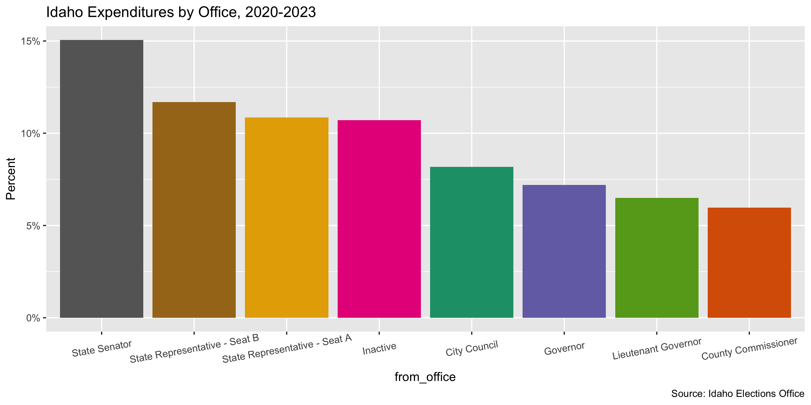
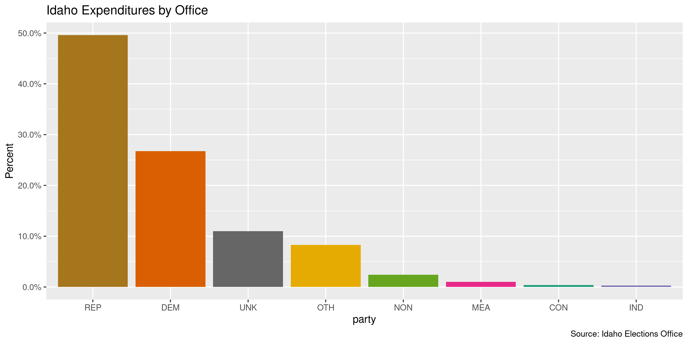
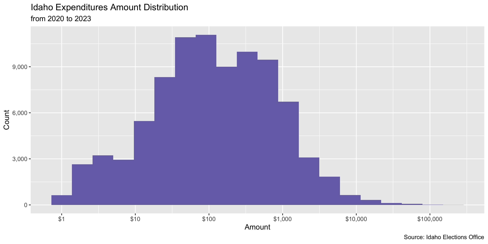
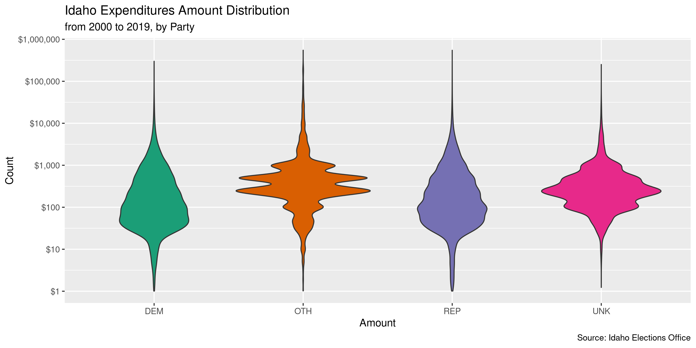
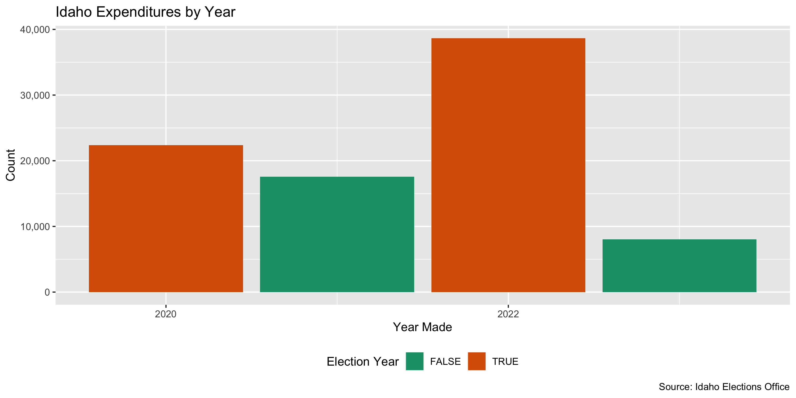

Idaho Expenditures, 2020-present
================
Kiernan Nicholls & Yanqi Xu
2024-01-07 22:23:24

- [Project](#project)
- [Objectives](#objectives)
- [Packages](#packages)
- [Data](#data)
- [Explore](#explore)
- [Wrangle](#wrangle)
- [Conclude](#conclude)
- [Export](#export)
- [Upload](#upload)

<!-- Place comments regarding knitting here -->

## Project

The Accountability Project is an effort to cut across data silos and
give journalists, policy professionals, activists, and the public at
large a simple way to search across huge volumes of public data about
people and organizations.

Our goal is to standardizing public data on a few key fields by thinking
of each dataset row as a transaction. For each transaction there should
be (at least) 3 variables:

1.  All **parties** to a transaction
2.  The **date** of the transaction
3.  The **amount** of money involved

## Objectives

This document describes the process used to complete the following
objectives:

1.  How many records are in the database?
2.  Check for duplicates
3.  Check ranges
4.  Is there anything blank or missing?
5.  Check for consistency issues
6.  Create a five-digit ZIP Code called `zip`
7.  Create a `year` field from the transaction date
8.  Make sure there is data on both parties to a transaction

## Packages

The following packages are needed to collect, manipulate, visualize,
analyze, and communicate these results. The `pacman` package will
facilitate their installation and attachment.

The IRW’s `campfin` package will also have to be installed from GitHub.
This package contains functions custom made to help facilitate the
processing of campaign finance data.

``` r
if (!require("pacman")) install.packages("pacman")
pacman::p_load_gh("irworkshop/campfin")
pacman::p_load(
  tidyverse, # data manipulation
  snakecase, # column naming
  lubridate, # datetime strings
  jsonlite, # from json data
  magrittr, # pipe opperators
  gluedown, # printing markdown
  janitor, # dataframe clean
  aws.s3, # upload to aws s3
  refinr, # cluster and merge
  scales, # format strings
  readxl, # read excel files
  knitr, # knit documents
  rvest, # read html pages
  vroom, # read files fast
  glue, # combine strings
  httr, # http requests
  here, # relative storage
  fs # search storage 
)
```

This document should be run as part of the `R_campfin` project, which
lives as a sub-directory of the more general, language-agnostic
[`irworkshop/accountability_datacleaning`](https://github.com/irworkshop/accountability_datacleaning)
GitHub repository.

The `R_campfin` project uses the [RStudio
projects](https://support.rstudio.com/hc/en-us/articles/200526207-Using-Projects)
feature and should be run as such. The project also uses the dynamic
`here::here()` tool for file paths relative to *your* machine.

``` r
# where does this document knit?
here::here()
#> [1] "/Users/yanqixu/code/accountability_datacleaning"
```

## Data

The data was provided as a public records request and was fulfilled on
Dec. 4, 2023. For data prior to 2020, see this [data
dictionary](https://github.com/irworkshop/accountability_datacleaning/blob/8689889cefa62b7e5b0bdad5133123ed72fe9393/state/id/contribs/docs/id_contribs_diary.md?plain=1#L827).

``` r
raw_dir <- dir_create(here("state","id", "expends", "data", "raw"))
```

### Read

Each file has a different column order and names. We will first use
`purrr::map()` to use `readxl::read_excel()` and create a list of data
frames.

``` r
ide <- read_csv(
  dir_ls(raw_dir)
) %>% clean_names()
```

In this update, since we would like to create a new dataset for records
from 2020-01-01 and on, we need to remove records after 2020-01-01 in
the last update. We will do so by segregating these 2020 records and
replace the data in the previous update.

``` r
prev_dir <- here("state","id", "expends", "data", "previous")

ide_prev <- read_csv(path(prev_dir, "id_expends_19990101-20220309.csv"))

x <- ide_prev %>% filter(date>=as.Date("2020-01-01") & (source_file == "get_activity.json"))

ide_prev_new <- anti_join(ide_prev, x)

ide_prev_new %>% write_csv(path(prev_dir, "id_expends_1999-2019.csv"))
```

``` r
count(ide,donate_type)
#> # A tibble: 1 × 2
#>   donate_type     n
#>   <lgl>       <int>
#> 1 NA          86638
```

``` r
count_na(ide$date)
#> [1] 0
```

## Explore

``` r
glimpse(ide)
#> Rows: 86,638
#> Columns: 39
#> $ id                                <dbl> 293699, 290719, 325263, 299342, 356777, 351838, 5804, 3…
#> $ date                              <dttm> 2023-11-30 12:00:00, 2023-11-30 12:00:00, 2023-11-30 1…
#> $ activity_type                     <chr> "spend", "spend", "spend", "spend", "spend", "spend", "…
#> $ amount                            <dbl> 3.00, 1.88, 7.20, 48.12, 2.88, 81.97, 250.00, 397.41, 6…
#> $ report_name                       <chr> "2023 November", "2023 November", "2023 November", "202…
#> $ report_id                         <dbl> 78894, 74651, 85804, 86008, 86008, 86008, 81783, 85234,…
#> $ donation_count                    <lgl> NA, NA, NA, NA, NA, NA, NA, NA, NA, NA, NA, NA, NA, NA,…
#> $ donate_type                       <lgl> NA, NA, NA, NA, NA, NA, NA, NA, NA, NA, NA, NA, NA, NA,…
#> $ spend_count                       <dbl> 0, 0, 0, NA, NA, 0, 0, 0, NA, 0, 0, 0, 0, 0, 0, 0, 0, 0…
#> $ spend_type                        <chr> "Normal", "Normal", "Normal", "Loan Payment", "Loan Pay…
#> $ spend_codes                       <chr> NA, NA, NA, NA, NA, NA, NA, NA, NA, NA, NA, NA, NA, NA,…
#> $ election_year                     <dbl> 0, 0, 2023, NA, NA, 2023, 2023, 2023, NA, 2020, 0, 0, 0…
#> $ election_type                     <chr> NA, NA, "General", NA, NA, "Primary", "General", "Gener…
#> $ from_name                         <chr> "Bannock County Republican Party", "District 15 Democra…
#> $ from_type                         <chr> "PAC", "PAC", "Candidate", "Candidate", "Candidate", "C…
#> $ from_address                      <chr> "P.O. Box 4143", "3085 N Cole Rd Suite 105", "803 E. 8t…
#> $ from_city                         <chr> "Pocatello", "Boise", "Moscow", "Idaho Falls", "Idaho F…
#> $ from_state                        <chr> "ID", "ID", "ID", "ID", "ID", "ID", "ID", "ID", "ID", "…
#> $ from_zip                          <dbl> 83205, 83704, 83843, 83402, 83402, 83402, 83634, 83605,…
#> $ from_office                       <chr> NA, NA, "Trustee School", "Trustee School", "Trustee Sc…
#> $ from_district                     <chr> NA, NA, "MOSCOW SD 3", "IDAHO FALLS SD 91", "IDAHO FALL…
#> $ from_party                        <chr> NA, NA, NA, NA, NA, NA, NA, NA, NA, NA, NA, NA, NA, NA,…
#> $ from_jurisdiction_of_registration <chr> "BANNOCK", "ADA", "LATAH", "BONNEVILLE", "BONNEVILLE", …
#> $ from_status                       <chr> "Active", "Active", "Active", "Active", "Active", "Acti…
#> $ from_cash_on_hand                 <lgl> NA, NA, NA, NA, NA, NA, NA, NA, NA, NA, NA, NA, NA, NA,…
#> $ from_remaining_loan               <lgl> NA, NA, NA, NA, NA, NA, NA, NA, NA, NA, NA, NA, NA, NA,…
#> $ from_remaining_debt               <lgl> NA, NA, NA, NA, NA, NA, NA, NA, NA, NA, NA, NA, NA, NA,…
#> $ to_name                           <chr> "Idaho Central Credit Union", "Actblue", "Google", "Hil…
#> $ to_type                           <chr> "Company", "Company", "Company", "Company", "Company", …
#> $ to_address                        <chr> "4400 Central Way", "P O Box 441146", "1600 Ampitheatre…
#> $ to_city                           <chr> "Chubbuck", "Somerville", "Mountain View", "Idaho Falls…
#> $ to_state                          <chr> "ID", "MA", "CA", "ID", "ID", "CA", "ID", "ID", "ID", "…
#> $ to_zip                            <chr> "83202", "02144", "94943", "83402", "83402", "94025", N…
#> $ to_office                         <lgl> NA, NA, NA, NA, NA, NA, NA, NA, NA, NA, NA, NA, NA, NA,…
#> $ to_district                       <lgl> NA, NA, NA, NA, NA, NA, NA, NA, NA, NA, NA, NA, NA, NA,…
#> $ to_party                          <lgl> NA, NA, NA, NA, NA, NA, NA, NA, NA, NA, NA, NA, NA, NA,…
#> $ to_jurisdiction_of_registration   <lgl> NA, NA, NA, NA, NA, NA, NA, NA, NA, NA, NA, NA, NA, NA,…
#> $ to_status                         <lgl> NA, NA, NA, NA, NA, NA, NA, NA, NA, NA, NA, NA, NA, NA,…
#> $ report_url                        <chr> "https://elections.sos.idaho.gov/TED/Filings/78894.pdf"…
head(ide)
#> # A tibble: 6 × 39
#>       id date                activ…¹ amount repor…² repor…³ donat…⁴ donat…⁵ spend…⁶ spend…⁷ spend…⁸
#>    <dbl> <dttm>              <chr>    <dbl> <chr>     <dbl> <lgl>   <lgl>     <dbl> <chr>   <chr>  
#> 1 293699 2023-11-30 12:00:00 spend     3    2023 N…   78894 NA      NA            0 Normal  <NA>   
#> 2 290719 2023-11-30 12:00:00 spend     1.88 2023 N…   74651 NA      NA            0 Normal  <NA>   
#> 3 325263 2023-11-30 12:00:00 spend     7.2  2023 N…   85804 NA      NA            0 Normal  <NA>   
#> 4 299342 2023-11-30 00:00:00 spend    48.1  2023 N…   86008 NA      NA           NA Loan P… <NA>   
#> 5 356777 2023-11-30 00:00:00 spend     2.88 2023 N…   86008 NA      NA           NA Loan P… <NA>   
#> 6 351838 2023-11-30 12:00:00 spend    82.0  2023 N…   86008 NA      NA            0 Normal  <NA>   
#> # … with 28 more variables: election_year <dbl>, election_type <chr>, from_name <chr>,
#> #   from_type <chr>, from_address <chr>, from_city <chr>, from_state <chr>, from_zip <dbl>,
#> #   from_office <chr>, from_district <chr>, from_party <chr>,
#> #   from_jurisdiction_of_registration <chr>, from_status <chr>, from_cash_on_hand <lgl>,
#> #   from_remaining_loan <lgl>, from_remaining_debt <lgl>, to_name <chr>, to_type <chr>,
#> #   to_address <chr>, to_city <chr>, to_state <chr>, to_zip <chr>, to_office <lgl>,
#> #   to_district <lgl>, to_party <lgl>, to_jurisdiction_of_registration <lgl>, to_status <lgl>, …
tail(ide)
#> # A tibble: 6 × 39
#>       id date                activ…¹ amount repor…² repor…³ donat…⁴ donat…⁵ spend…⁶ spend…⁷ spend…⁸
#>    <dbl> <dttm>              <chr>    <dbl> <chr>     <dbl> <lgl>   <lgl>     <dbl> <chr>   <chr>  
#> 1 300867 2020-01-01 20:00:00 spend     24.5 2020 J…   23277 NA      NA           NA Credit… F      
#> 2 282365 2020-01-01 20:00:00 spend     26.2 2020 J…   23277 NA      NA            0 Credit… F      
#> 3 282366 2020-01-01 20:00:00 spend    157.  2020 J…   23277 NA      NA            0 Credit… L      
#> 4 282364 2020-01-01 20:00:00 spend     11.4 2020 J…   23277 NA      NA            0 Credit… O      
#> 5 282363 2020-01-01 20:00:00 spend     21   2020 J…   23277 NA      NA            0 Credit… G      
#> 6 304642 2020-01-01 20:00:00 spend   1226.  2020 J…    8047 NA      NA           NA Credit… L      
#> # … with 28 more variables: election_year <dbl>, election_type <chr>, from_name <chr>,
#> #   from_type <chr>, from_address <chr>, from_city <chr>, from_state <chr>, from_zip <dbl>,
#> #   from_office <chr>, from_district <chr>, from_party <chr>,
#> #   from_jurisdiction_of_registration <chr>, from_status <chr>, from_cash_on_hand <lgl>,
#> #   from_remaining_loan <lgl>, from_remaining_debt <lgl>, to_name <chr>, to_type <chr>,
#> #   to_address <chr>, to_city <chr>, to_state <chr>, to_zip <chr>, to_office <lgl>,
#> #   to_district <lgl>, to_party <lgl>, to_jurisdiction_of_registration <lgl>, to_status <lgl>, …
```

We should first identify which columns are missing the kinds of key
information we need to properly identify all parties to a contribution.
We can do this with `campfin::flag_na()` after creating a new

``` r
col_stats(ide, count_na)
#> # A tibble: 39 × 4
#>    col                               class      n       p
#>    <chr>                             <chr>  <int>   <dbl>
#>  1 id                                <dbl>      0 0      
#>  2 date                              <dttm>     0 0      
#>  3 activity_type                     <chr>      0 0      
#>  4 amount                            <dbl>      0 0      
#>  5 report_name                       <chr>      0 0      
#>  6 report_id                         <dbl>      0 0      
#>  7 donation_count                    <lgl>  86638 1      
#>  8 donate_type                       <lgl>  86638 1      
#>  9 spend_count                       <dbl>   1144 0.0132 
#> 10 spend_type                        <chr>      0 0      
#> 11 spend_codes                       <chr>  11924 0.138  
#> 12 election_year                     <dbl>   1235 0.0143 
#> 13 election_type                     <chr>  26921 0.311  
#> 14 from_name                         <chr>      0 0      
#> 15 from_type                         <chr>      0 0      
#> 16 from_address                      <chr>    767 0.00885
#> 17 from_city                         <chr>    767 0.00885
#> 18 from_state                        <chr>    767 0.00885
#> 19 from_zip                          <dbl>    767 0.00885
#> 20 from_office                       <chr>  24320 0.281  
#> 21 from_district                     <chr>  25088 0.290  
#> 22 from_party                        <chr>  35911 0.414  
#> 23 from_jurisdiction_of_registration <chr>      0 0      
#> 24 from_status                       <chr>      0 0      
#> 25 from_cash_on_hand                 <lgl>  86638 1      
#> 26 from_remaining_loan               <lgl>  86638 1      
#> 27 from_remaining_debt               <lgl>  86638 1      
#> 28 to_name                           <chr>   3464 0.0400 
#> 29 to_type                           <chr>      0 0      
#> 30 to_address                        <chr>   3290 0.0380 
#> 31 to_city                           <chr>   3243 0.0374 
#> 32 to_state                          <chr>   3358 0.0388 
#> 33 to_zip                            <chr>  16842 0.194  
#> 34 to_office                         <lgl>  86638 1      
#> 35 to_district                       <lgl>  86638 1      
#> 36 to_party                          <lgl>  86638 1      
#> 37 to_jurisdiction_of_registration   <lgl>  86638 1      
#> 38 to_status                         <lgl>  86638 1      
#> 39 report_url                        <chr>      0 0
```

``` r
ide <- ide %>% 
  flag_na(from_name, to_name, date, amount)

sum(ide$na_flag)
#> [1] 3464
mean(ide$na_flag)
#> [1] 0.03998246
```

Records that are entirely duplicated at least once across all columns
should also be identified with `campfin::flag_dupes()`. The first
occurrence of the record is not flagged, but all subsequent duplicates
are.

Upon running the algorithm, we found no completely identical rows.

``` r
ide <- flag_dupes(ide, everything(), .check = TRUE)
```

### Categorical

``` r
col_stats(ide, n_distinct)
#> # A tibble: 40 × 4
#>    col                               class      n         p
#>    <chr>                             <chr>  <int>     <dbl>
#>  1 id                                <dbl>  86638 1        
#>  2 date                              <dttm>  4660 0.0538   
#>  3 activity_type                     <chr>      1 0.0000115
#>  4 amount                            <dbl>  23587 0.272    
#>  5 report_name                       <chr>     53 0.000612 
#>  6 report_id                         <dbl>  11025 0.127    
#>  7 donation_count                    <lgl>      1 0.0000115
#>  8 donate_type                       <lgl>      1 0.0000115
#>  9 spend_count                       <dbl>     58 0.000669 
#> 10 spend_type                        <chr>     10 0.000115 
#> 11 spend_codes                       <chr>    324 0.00374  
#> 12 election_year                     <dbl>     10 0.000115 
#> 13 election_type                     <chr>      3 0.0000346
#> 14 from_name                         <chr>   1617 0.0187   
#> 15 from_type                         <chr>      2 0.0000231
#> 16 from_address                      <chr>   1567 0.0181   
#> 17 from_city                         <chr>    279 0.00322  
#> 18 from_state                        <chr>      6 0.0000693
#> 19 from_zip                          <dbl>    208 0.00240  
#> 20 from_office                       <chr>     39 0.000450 
#> 21 from_district                     <chr>    213 0.00246  
#> 22 from_party                        <chr>      6 0.0000693
#> 23 from_jurisdiction_of_registration <chr>     45 0.000519 
#> 24 from_status                       <chr>      3 0.0000346
#> 25 from_cash_on_hand                 <lgl>      1 0.0000115
#> 26 from_remaining_loan               <lgl>      1 0.0000115
#> 27 from_remaining_debt               <lgl>      1 0.0000115
#> 28 to_name                           <chr>  13372 0.154    
#> 29 to_type                           <chr>      2 0.0000231
#> 30 to_address                        <chr>  15224 0.176    
#> 31 to_city                           <chr>   1431 0.0165   
#> 32 to_state                          <chr>     82 0.000946 
#> 33 to_zip                            <chr>   1663 0.0192   
#> 34 to_office                         <lgl>      1 0.0000115
#> 35 to_district                       <lgl>      1 0.0000115
#> 36 to_party                          <lgl>      1 0.0000115
#> 37 to_jurisdiction_of_registration   <lgl>      1 0.0000115
#> 38 to_status                         <lgl>      1 0.0000115
#> 39 report_url                        <chr>  11025 0.127    
#> 40 na_flag                           <lgl>      2 0.0000231
```

<!-- -->

<!-- -->

### Amounts

``` r
summary(ide$amount)
#>     Min.  1st Qu.   Median     Mean  3rd Qu.     Max. 
#>      1.0     30.0    110.0    645.8    496.0 210069.6
mean(ide$amount <= 0, na.rm = TRUE)
#> [1] 0
```

``` r
glimpse(ide[c(which.min(ide$amount), which.max(ide$amount)), ])
#> Rows: 2
#> Columns: 40
#> $ id                                <dbl> 322424, 320668
#> $ date                              <dttm> 2023-07-17 12:00:00, 2022-05-09 12:00:00
#> $ activity_type                     <chr> "spend", "spend"
#> $ amount                            <dbl> 1.0, 210069.6
#> $ report_name                       <chr> "2023 July", "2022 May"
#> $ report_id                         <dbl> 83146, 42533
#> $ donation_count                    <lgl> NA, NA
#> $ donate_type                       <lgl> NA, NA
#> $ spend_count                       <dbl> 0, 0
#> $ spend_type                        <chr> "Normal", "Normal"
#> $ spend_codes                       <chr> NA, "B"
#> $ election_year                     <dbl> 2023, 2022
#> $ election_type                     <chr> "General", "Primary"
#> $ from_name                         <chr> "Lisa Sanchez", "Brad Little"
#> $ from_type                         <chr> "Candidate", "Candidate"
#> $ from_address                      <chr> "PO Box 126", "PO BOX 2664"
#> $ from_city                         <chr> "Boise", "Emmett"
#> $ from_state                        <chr> "ID", "ID"
#> $ from_zip                          <dbl> 83702, 83617
#> $ from_office                       <chr> "City Council", "Governor"
#> $ from_district                     <chr> "BOISE CITY", "SW"
#> $ from_party                        <chr> NA, "Republican"
#> $ from_jurisdiction_of_registration <chr> "ADA", "Idaho State"
#> $ from_status                       <chr> "Terminated", "Active"
#> $ from_cash_on_hand                 <lgl> NA, NA
#> $ from_remaining_loan               <lgl> NA, NA
#> $ from_remaining_debt               <lgl> NA, NA
#> $ to_name                           <chr> "City Of Boise", "FP1 Strategies"
#> $ to_type                           <chr> "Company", "Company"
#> $ to_address                        <chr> "Po Box 2600", "3001 Washington Blvd 7th Floor"
#> $ to_city                           <chr> "Boise", "Arlington"
#> $ to_state                          <chr> "ID", "VA"
#> $ to_zip                            <chr> "83701", "22201"
#> $ to_office                         <lgl> NA, NA
#> $ to_district                       <lgl> NA, NA
#> $ to_party                          <lgl> NA, NA
#> $ to_jurisdiction_of_registration   <lgl> NA, NA
#> $ to_status                         <lgl> NA, NA
#> $ report_url                        <chr> "https://elections.sos.idaho.gov/TED/Filings/83146.pdf"…
#> $ na_flag                           <lgl> FALSE, FALSE
```

<!-- -->

<!-- -->

### Dates

``` r
ide <- mutate(ide, year = year(date))
```

``` r
min(ide$date, na.rm = TRUE)
#> [1] "2020-01-01 UTC"
max(ide$date, na.rm = TRUE)
#> [1] "2023-11-30 12:00:00 UTC"
ide <- mutate(ide, date_flag = date > today() | year < 1999 | is.na(date))
count_na(ide$date) 
#> [1] 0
sum(ide$date_flag) 
#> [1] 0
mean(ide$date_flag)
#> [1] 0

ide <- ide %>% select(-date_flag)
```

``` r
ide %>% 
  count(year) %>% 
  mutate(even = is_even(year)) %>% 
  ggplot(aes(x = year, y = n)) +
  geom_col(aes(fill = even)) + 
  scale_fill_brewer(palette = "Dark2") +
  scale_y_continuous(labels = comma) +
  scale_x_continuous(breaks = seq(2020, 2023, by = 2)) +
  theme(legend.position = "bottom") +
  labs(
    title = "Idaho Expenditures by Year",
    caption = "Source: Idaho Elections Office",
    fill = "Election Year",
    x = "Year Made",
    y = "Count"
  )
```

<!-- -->

## Wrangle

### Address

``` r
ide <- ide %>% 
  mutate_at(.vars = vars(ends_with('address')),
            .funs = list(norm = ~ normal_address(address = .,
      abbs = usps_city,
      na_rep = TRUE)))
```

``` r
ide %>% 
  select(contains("address")) %>% 
  distinct() %>% 
  sample_frac()
#> # A tibble: 40,312 × 4
#>    from_address                        to_address             from_address_norm             to_ad…¹
#>    <chr>                               <chr>                  <chr>                         <chr>  
#>  1 1525 Big Salmon Rd                  410 Terry Avenue North 1525 BIG SALMON RD            410 TE…
#>  2 3313 W. Cherry Lane, #433           4224 W.Fairmont St.    3313 W CHERRY LANE #433       4224 W…
#>  3 1953 E Grandview Dr.                1601 Willow Road       1953 E GRANDVIEW DR           1601 W…
#>  4 9613 Lincoln Road                   133 N Citrus Ste.202   9613 LINCOLN ROAD             133 N …
#>  5 1235 Kinghorn Rd Pocatello ID 83201 123 N Main St.         1235 KINGHORN RD POCATELLO I… 123 N …
#>  6 105 Vermeer Dr Box 131              477181 N.Hwy 95        105 VERMEER DR BOX 131        477181…
#>  7 505 E Croy St                       410 Terry Ave N        505 E CROY ST                 410 TE…
#>  8 PO Box 131                          1 Facebook Way         PO BOX 131                    1 FACE…
#>  9 2111 2nd St S                       1115 W Grove St        2111 2ND ST SOUTH             1115 W…
#> 10 7609 Paddock Lane                   313 D St,Suite100      7609 PADDOCK LANE             313 D …
#> # … with 40,302 more rows, and abbreviated variable name ¹​to_address_norm
```

### ZIP

``` r
ide %>% select(ends_with('zip')) %>% 
  map_dbl(prop_in, valid_zip, na.rm = TRUE) %>% map_chr(percent) %>% glimpse()
#>  Named chr [1:2] "100%" "97%"
#>  - attr(*, "names")= chr [1:2] "from_zip" "to_zip"

ide <- ide %>% 
  mutate_at(.vars = vars(ends_with('zip')), .funs = list(norm = ~ normal_zip(.)))

ide %>% select(contains('zip')) %>% 
  map_dbl(prop_in, valid_zip, na.rm = TRUE) %>%  map_chr(percent)
#>      from_zip        to_zip from_zip_norm   to_zip_norm 
#>        "100%"         "97%"        "100%"         "98%"
```

``` r
progress_table(
  ide$to_zip,
  ide$to_zip_norm,
  ide$from_zip,
  ide$from_zip_norm,
  compare = valid_zip
)
#> # A tibble: 4 × 6
#>   stage             prop_in n_distinct prop_na n_out n_diff
#>   <chr>               <dbl>      <dbl>   <dbl> <dbl>  <dbl>
#> 1 ide$to_zip          0.965       1663 0.194    2420    251
#> 2 ide$to_zip_norm     0.979       1521 0.194    1442    100
#> 3 ide$from_zip        0.998        208 0.00885   200      4
#> 4 ide$from_zip_norm   0.998        208 0.00885   200      4
```

### State

``` r
ide %>% select(ends_with('state')) %>% 
  map_dbl(prop_in, valid_state, na.rm = TRUE) %>% map_chr(percent) %>% glimpse()
#>  Named chr [1:2] "100%" "100%"
#>  - attr(*, "names")= chr [1:2] "from_state" "to_state"

ide <- ide %>% mutate(from_state_norm = normal_state(from_state))
```

``` r
progress_table(
  ide$from_state,
  ide$from_state_norm,
  compare = valid_state
)
#> # A tibble: 2 × 6
#>   stage               prop_in n_distinct prop_na n_out n_diff
#>   <chr>                 <dbl>      <dbl>   <dbl> <dbl>  <dbl>
#> 1 ide$from_state            1          6 0.00885     0      1
#> 2 ide$from_state_norm       1          6 0.00885     0      1
```

### City

``` r
ide %>% select(ends_with('city')) %>% 
  map_dbl(prop_in, valid_city, na.rm = TRUE) %>% map_chr(percent) %>% glimpse()
#>  Named chr [1:2] "5%" "2%"
#>  - attr(*, "names")= chr [1:2] "from_city" "to_city"

valid_place <- c(valid_city,extra_city)

ide <- ide %>% 
  mutate_at(.vars = vars(ends_with('city')),
            .funs = list(norm = ~ normal_city(city = .,abbs = usps_city,
                                            states = c(valid_state),
                                            na = invalid_city,
                                            na_rep = TRUE)))
ide %>% select(contains('city')) %>% 
  map_dbl(prop_in, valid_place, na.rm = TRUE) %>%  map_chr(percent)
#>      from_city        to_city from_city_norm   to_city_norm 
#>           "5%"           "2%"          "96%"          "94%"
```

``` r
ide <- ide %>%
  rename(from_city_raw = from_city) %>% 
  left_join(
    y = zipcodes,
    by = c(
      "from_state_norm" = "state",
      "from_zip_norm" = "zip"
    )
  ) %>% 
  rename(city_match = city) %>% 
  mutate(
    match_abb = is_abbrev(from_city_norm, city_match),
    match_dist = str_dist(from_city_norm, city_match),
    from_city_swap = if_else(
      condition = match_abb | match_dist == 1,
      true = city_match,
      false = from_city_norm
    )
  ) %>% 
  select(
    -match_abb,
    -match_dist,
    -city_match
  )
```

``` r
ide <- ide %>%
  rename(to_city_raw = to_city) %>% 
  left_join(
    y = zipcodes,
    by = c(
      "to_state" = "state",
      "to_zip_norm" = "zip"
    )
  ) %>% 
  rename(city_match = city) %>% 
  mutate(
    match_abb = is_abbrev(to_city_norm, city_match),
    match_dist = str_dist(to_city_norm, city_match),
    to_city_swap = if_else(
      condition = match_abb | match_dist == 1,
      true = city_match,
      false = to_city_norm
    )
  ) %>% 
  select(
    -match_abb,
    -match_dist,
    -city_match
  )
```

``` r
progress_table(
  ide$from_city_raw,
  ide$from_city_norm,
  ide$from_city_swap,
  ide$to_city_raw,
  ide$to_city_norm,
  ide$to_city_swap,
  compare = valid_place
)
#> # A tibble: 6 × 6
#>   stage              prop_in n_distinct prop_na n_out n_diff
#>   <chr>                <dbl>      <dbl>   <dbl> <dbl>  <dbl>
#> 1 ide$from_city_raw   0.0534        279 0.00885 81282    227
#> 2 ide$from_city_norm  0.956         200 0.00885  3816     19
#> 3 ide$from_city_swap  0.994         182 0.0132    503      7
#> 4 ide$to_city_raw     0.0155       1431 0.0374  82102   1293
#> 5 ide$to_city_norm    0.943        1180 0.0391   4757    286
#> 6 ide$to_city_swap    0.990         882 0.220     673     59
```

## Conclude

``` r
glimpse(sample_n(ide, 1000))
#> Rows: 1,000
#> Columns: 50
#> $ id                                <dbl> 352874, 315553, 6180, 286761, 318275, 308369, 360279, 3…
#> $ date                              <dttm> 2023-02-15 00:00:00, 2020-10-11 12:00:00, 2022-04-22 1…
#> $ activity_type                     <chr> "spend", "spend", "spend", "spend", "spend", "spend", "…
#> $ amount                            <dbl> 250.00, 29.30, 44.10, 22.21, 357.75, 100.00, 506.00, 21…
#> $ report_name                       <chr> "2023 February", "2020 October", "2022 April", "2022 Ap…
#> $ report_id                         <dbl> 73716, 29051, 67437, 67507, 73421, 83579, 58746, 4047, …
#> $ donation_count                    <lgl> NA, NA, NA, NA, NA, NA, NA, NA, NA, NA, NA, NA, NA, NA,…
#> $ donate_type                       <lgl> NA, NA, NA, NA, NA, NA, NA, NA, NA, NA, NA, NA, NA, NA,…
#> $ spend_count                       <dbl> 1, 0, 1, 0, 0, 0, 0, 0, 0, 0, 0, 0, 0, 0, 0, 1, NA, 0, …
#> $ spend_type                        <chr> "Normal", "Normal", "In-Kind", "Normal", "Normal", "Nor…
#> $ spend_codes                       <chr> "G", "C", "D", "L", "L", NA, "B", "O", "D", "F", "N", "…
#> $ election_year                     <dbl> 0, 2020, 0, 2022, 2022, 2023, 2022, 2020, 2022, 2020, 2…
#> $ election_type                     <chr> NA, "General", "General", "Primary", "General", "Genera…
#> $ from_name                         <chr> "Ada County Democrats", "Jason Speer", "Bonneville Coun…
#> $ from_type                         <chr> "PAC", "Candidate", "PAC", "Candidate", "Candidate", "C…
#> $ from_address                      <chr> "PO Box 1761", "PO Box 366", "POB 2668", "367 W. Reserv…
#> $ from_city_raw                     <chr> "Boise", "Cascade", "Idaho Falls", "Lewiston", "Boise",…
#> $ from_state                        <chr> "ID", "ID", "ID", "ID", "ID", "ID", "ID", "ID", "ID", "…
#> $ from_zip                          <dbl> 83701, 83611, 83403, 83501, 83709, 83835, 83716, 83221,…
#> $ from_office                       <chr> NA, "Sheriff", NA, "District Judge", "State Representat…
#> $ from_district                     <chr> NA, "COUNTY", NA, "COUNTY", "15", "SD #271 ZONE 2", "SW…
#> $ from_party                        <chr> NA, "Republican", NA, NA, "Republican", NA, "Democratic…
#> $ from_jurisdiction_of_registration <chr> "ADA", "VALLEY", "BONNEVILLE", "NEZ PERCE", "Idaho Stat…
#> $ from_status                       <chr> "Active", "Terminated", "Active", "Active", "Active", "…
#> $ from_cash_on_hand                 <lgl> NA, NA, NA, NA, NA, NA, NA, NA, NA, NA, NA, NA, NA, NA,…
#> $ from_remaining_loan               <lgl> NA, NA, NA, NA, NA, NA, NA, NA, NA, NA, NA, NA, NA, NA,…
#> $ from_remaining_debt               <lgl> NA, NA, NA, NA, NA, NA, NA, NA, NA, NA, NA, NA, NA, NA,…
#> $ to_name                           <chr> "BIJAN NEKOIE", "PayPal", "Love at First Bite", "Signs.…
#> $ to_type                           <chr> "Individual", "Company", "Company", "Company", "Company…
#> $ to_address                        <chr> "2651 16TH ST", "2211 N 1st Street", "901 Pier View Dr …
#> $ to_city_raw                       <chr> "Washington", "San Jose", "Idaho Falls", "Salt Lake Cit…
#> $ to_state                          <chr> "DC", "CA", "ID", "UT", "ID", "ID", "ID", "ID", "ID", "…
#> $ to_zip                            <chr> NA, "95131", "83402", "84104", "83642", "83835", "83687…
#> $ to_office                         <lgl> NA, NA, NA, NA, NA, NA, NA, NA, NA, NA, NA, NA, NA, NA,…
#> $ to_district                       <lgl> NA, NA, NA, NA, NA, NA, NA, NA, NA, NA, NA, NA, NA, NA,…
#> $ to_party                          <lgl> NA, NA, NA, NA, NA, NA, NA, NA, NA, NA, NA, NA, NA, NA,…
#> $ to_jurisdiction_of_registration   <lgl> NA, NA, NA, NA, NA, NA, NA, NA, NA, NA, NA, NA, NA, NA,…
#> $ to_status                         <lgl> NA, NA, NA, NA, NA, NA, NA, NA, NA, NA, NA, NA, NA, NA,…
#> $ report_url                        <chr> "https://elections.sos.idaho.gov/TED/Filings/73716.pdf"…
#> $ na_flag                           <lgl> FALSE, FALSE, FALSE, FALSE, FALSE, FALSE, FALSE, FALSE,…
#> $ year                              <dbl> 2023, 2020, 2022, 2022, 2022, 2023, 2022, 2020, 2022, 2…
#> $ from_address_norm                 <chr> "PO BOX 1761", "PO BOX 366", "POB 2668", "367 W RESERVO…
#> $ to_address_norm                   <chr> "2651 16TH ST", "2211 N 1ST STREET", "901 PIER VIEW DR …
#> $ from_zip_norm                     <chr> "83701", "83611", "83403", "83501", "83709", "83835", "…
#> $ to_zip_norm                       <chr> NA, "95131", "83402", "84104", "83642", "83835", "83687…
#> $ from_state_norm                   <chr> "ID", "ID", "ID", "ID", "ID", "ID", "ID", "ID", "ID", "…
#> $ from_city_norm                    <chr> "BOISE", "CASCADE", "IDAHO FALLS", "LEWISTON", "BOISE",…
#> $ to_city_norm                      <chr> "WASHINGTON", "SAN JOSE", "IDAHO FALLS", "SALT LAKE CIT…
#> $ from_city_swap                    <chr> "BOISE", "CASCADE", "IDAHO FALLS", "LEWISTON", "BOISE",…
#> $ to_city_swap                      <chr> NA, "SAN JOSE", "IDAHO FALLS", "SALT LAKE CITY", "MERID…
```

1.  There are 86,638 records in the database.
2.  There are no duplicate records in the database.
3.  The range and distribution of `amount` and `date` seem reasonable.
4.  There are 3,464 records missing key variables.
5.  Consistency in geographic data has been improved with
    `campfin::normal_*()`.
6.  The 4-digit `year` variable has been created with
    `lubridate::year()`.

## Export

``` r
ide <- ide %>% 
  rename_all(~str_replace(., "_swap", "_clean")) %>% 
  select(-ends_with("city_norm")) %>% 
  rename_all(~str_replace(., "_norm", "_clean")) %>% 
  rename_all(~str_remove(., "_raw"))
```

Now the file can be saved on disk for upload to the Accountability
server. We will name the object using a date range of the records
included.

``` r
ide$date <- as.Date(ide$date)
min_dt <- str_remove_all(min(ide$date, na.rm = TRUE), "-")
max_dt <- str_remove_all(max(ide$date, na.rm = TRUE), "-")
csv_ts <- paste(min_dt, max_dt, sep = "-")
```

``` r
clean_dir <- dir_create(here("state","id", "expends", "data", "clean"))
clean_csv <- path(clean_dir, glue("id_expends_{csv_ts}.csv"))
clean_rds <- path_ext_set(clean_csv, "rds")
basename(clean_csv)
#> [1] "id_expends_20200101-20231130.csv"
```

``` r
write_csv(ide, clean_csv, na = "")
write_rds(ide, clean_rds, compress = "xz")
(clean_size <- file_size(clean_csv))
#> 30.5M
```

## Upload

We can use the `aws.s3::put_object()` to upload the text file to the IRW
server.

``` r
aws_key <- path("csv", basename(clean_csv))
if (!object_exists(aws_key, "publicaccountability")) {
  put_object(
    file = clean_csv,
    object = aws_key, 
    bucket = "publicaccountability",
    acl = "public-read",
    show_progress = TRUE,
    multipart = TRUE
  )
}
aws_head <- head_object(aws_key, "publicaccountability")
(aws_size <- as_fs_bytes(attr(aws_head, "content-length")))
unname(aws_size == clean_size)
```
