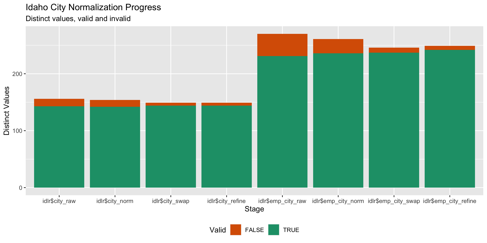

Idaho Lobbyists
================
Kiernan Nicholls & Yanqi Xu
2023-07-08 15:54:41

- [Project](#project)
- [Objectives](#objectives)
- [Packages](#packages)
- [Data](#data)
- [Explore](#explore)
- [Wrangle](#wrangle)
- [Conclude](#conclude)
- [Export](#export)

<!-- Place comments regarding knitting here -->

## Project

The Accountability Project is an effort to cut across data silos and
give journalists, policy professionals, activists, and the public at
large a simple way to search across huge volumes of public data about
people and organizations.

Our goal is to standardizing public data on a few key fields by thinking
of each dataset row as a transaction. For each transaction there should
be (at least) 3 variables:

1.  All **parties** to a transaction
2.  The **date** of the transaction
3.  The **amount** of money involved

## Objectives

This document describes the process used to complete the following
objectives:

1.  How many records are in the database?
2.  Check for duplicates
3.  Check ranges
4.  Is there anything blank or missing?
5.  Check for consistency issues
6.  Create a five-digit ZIP Code called `ZIP5`
7.  Create a `YEAR` field from the transaction date
8.  Make sure there is data on both parties to a transaction

## Packages

The following packages are needed to collect, manipulate, visualize,
analyze, and communicate these results. The `pacman` package will
facilitate their installation and attachment.

The IRW’s `campfin` package will also have to be installed from GitHub.
This package contains functions custom made to help facilitate the
processing of campaign finance data.

``` r
if (!require("pacman")) install.packages("pacman")
pacman::p_load_gh("irworkshop/campfin")
pacman::p_load(
  tidyverse, # data manipulation
  lubridate, # datetime strings
  magrittr, # pipe opperators
  janitor, # dataframe clean
  refinr, # cluster and merge
  scales, # format strings
  readxl, # read excel files
  knitr, # knit documents
  glue, # combine strings
  gluedown, #format markdown
  here, # relative storage
  fs # search storage 
)
```

This document should be run as part of the `R_campfin` project, which
lives as a sub-directory of the more general, language-agnostic
[`irworkshop/accountability_datacleaning`](https://github.com/irworkshop/accountability_datacleaning "TAP repo")
GitHub repository.

The `R_campfin` project uses the [RStudio
projects](https://support.rstudio.com/hc/en-us/articles/200526207-Using-Projects "Rproj")
feature and should be run as such. The project also uses the dynamic
`here::here()` tool for file paths relative to *your* machine.

``` r
# where does this document knit?
here::here()
#> [1] "/Users/yanqixu/code/accountability_datacleaning"
```

## Data

> All registered lobbyists must file financial reports showing the
> totals of all expenditures made by the lobbyist or incurred on behalf
> of such lobbyist‘s employer (not including payments made directly to
> the lobbyist) during the period covered by the report, the totals are
> segregated according to financial category i.e., entertainment, food
> and refreshment, advertising, living accommodations, travel,
> telephone, office expenses, and other expenses or services.

### Download

The lobbying registration data can be downloaded from the [Idaho
Secretary of State’s
website](https://elections.sos.idaho.gov/TED/PublicPortal/Launchpad.aspx).
Registartion data for 2019 onward can be accessed through direct
download. The website has two views by lobbyist and by employer, but
they are essentially powered by the same data backend. Data prior to
2018 can also be downloaded in a separate tab.

This data is downloaded on July 4, 2023 to include registration data for
2019 through 2022.

### Read

``` r
raw_dir <- here("state","id", "lobbying", "reg", "data", "raw")

idlr <- map_dfr(
  .x = dir_ls(raw_dir),
  .f = read_excel,
  col_types = "guess"
)

idlr <- idlr %>% clean_names()
```

## Explore

``` r
head(idlr)
#> # A tibble: 6 × 17
#>   date_filed          filing_status lobby…¹ lobby…² perma…³ tempo…⁴ emplo…⁵ emplo…⁶ emplo…⁷ emplo…⁸
#>   <dttm>              <chr>         <chr>   <chr>   <chr>   <chr>   <chr>   <chr>   <chr>   <chr>  
#> 1 2019-01-15 08:51:27 Complete      Gary    Allen   601 W.… N/A     Idaho … 55 SW … Rick    Waitley
#> 2 2019-02-05 09:23:49 Complete      Christ… Anders… 1730 N… N/A     Idaho … 1087 W… John    Sager  
#> 3 2019-09-09 08:41:45 Complete      Lisa    Anders… 6930 S… N/A     Alzhei… 2995 N… Adrean  Cavener
#> 4 2019-01-21 14:51:26 Complete      Lisa    Anders… 6930 S… N/A     Idaho … P.O. B… Lisa    Anders…
#> 5 2019-01-03 16:41:14 Complete      Nathan  Anders… 280 S … N/A     Union … 1400 D… Cherri  Carpen…
#> 6 2019-01-04 11:43:24 Complete      Chris   Anstead 6300 L… N/A     Amgen,… 601 13… Kathy   Sherman
#> # … with 7 more variables: occupation_or_business_of_employer <chr>, legislature_activity <chr>,
#> #   executive_activity <chr>, name_of_person_with_custody_of_account <chr>,
#> #   address_of_person_with_custody_of_account <chr>, employed_and_compensated <chr>,
#> #   subject_codes <chr>, and abbreviated variable names ¹​lobbyist_first_name, ²​lobbyist_last_name,
#> #   ³​permanent_address, ⁴​temporary_address, ⁵​employer_name, ⁶​employer_address,
#> #   ⁷​employer_contact_first_name, ⁸​employer_contact_last_name
tail(idlr)
#> # A tibble: 6 × 17
#>   date_filed          filing_status lobby…¹ lobby…² perma…³ tempo…⁴ emplo…⁵ emplo…⁶ emplo…⁷ emplo…⁸
#>   <dttm>              <chr>         <chr>   <chr>   <chr>   <chr>   <chr>   <chr>   <chr>   <chr>  
#> 1 2022-01-10 13:30:44 Complete      Blake   Youde   2725 S… N/A     Teach … 5700 E… Tony    Ashton 
#> 2 2022-01-10 13:28:31 Complete      Blake   Youde   2725 S… N/A     Wester… 4001 S… Lyn     White  
#> 3 2022-01-10 13:51:13 Terminated    Blake   Youde   2725 S… N/A     Zoll    121 Ga… Dena    Benson…
#> 4 2022-01-03 08:12:51 Complete      Mark    Zaleski 6311 S… N/A     IBEW L… 225 N.… Mark    Zaleski
#> 5 2022-12-22 09:28:54 Complete      Christy Zito    8821 O… N/A     Idaho … 3383 N… Greg    Pruett 
#> 6 2022-12-02 12:07:26 Complete      Bryan   Zollin… 414 Sh… N/A     Idaho … 5538 S… Shane   Bartlo…
#> # … with 7 more variables: occupation_or_business_of_employer <chr>, legislature_activity <chr>,
#> #   executive_activity <chr>, name_of_person_with_custody_of_account <chr>,
#> #   address_of_person_with_custody_of_account <chr>, employed_and_compensated <chr>,
#> #   subject_codes <chr>, and abbreviated variable names ¹​lobbyist_first_name, ²​lobbyist_last_name,
#> #   ³​permanent_address, ⁴​temporary_address, ⁵​employer_name, ⁶​employer_address,
#> #   ⁷​employer_contact_first_name, ⁸​employer_contact_last_name
glimpse(idlr)
#> Rows: 4,686
#> Columns: 17
#> $ date_filed                                <dttm> 2019-01-15 08:51:27, 2019-02-05 09:23:49, 2019…
#> $ filing_status                             <chr> "Complete", "Complete", "Complete", "Complete",…
#> $ lobbyist_first_name                       <chr> "Gary", "Christian", "Lisa", "Lisa", "Nathan", …
#> $ lobbyist_last_name                        <chr> "Allen", "Anderson", "Anderson", "Anderson", "A…
#> $ permanent_address                         <chr> "601 W. Bannock Street P.O. Box 2720 Boise ID, …
#> $ temporary_address                         <chr> "N/A", "N/A", "N/A", "N/A", "N/A", "N/A", "N/A"…
#> $ employer_name                             <chr> "Idaho Property Rights Coalition", "Idaho Healt…
#> $ employer_address                          <chr> "55 SW 5th Avenue Suite 100  Meridian ID, 83642…
#> $ employer_contact_first_name               <chr> "Rick", "John", "Adrean", "Lisa", "Cherri", "Ka…
#> $ employer_contact_last_name                <chr> "Waitley", "Sager", "Cavener", "Anderson", "Car…
#> $ occupation_or_business_of_employer        <chr> "Coalition", "Healthcare Finance", "Health Care…
#> $ legislature_activity                      <chr> "Yes", "Yes", "Yes", "Yes", "Yes", "No", "Yes",…
#> $ executive_activity                        <chr> "Yes", "No", "Yes", "Yes", "Yes", "Yes", "Yes",…
#> $ name_of_person_with_custody_of_account    <chr> "Benjamin Kelly", "John Sager", "Lisa Anderson"…
#> $ address_of_person_with_custody_of_account <chr> "55 SW 5th Avenue Suite 100  Meridian ID, 83642…
#> $ employed_and_compensated                  <chr> "Solely as a lobbyist", "As a regular employee …
#> $ subject_codes                             <chr> "7,16", "3,11,12,15,17", "4,8,10,12,13,14,16,17…
```

### Year

We will create a `year` field out of the `date_filed` field.

``` r
idlr <- idlr %>% mutate(year = year(date_filed))

min(idlr$year)
#> [1] 2019
max(idlr$year)
#> [1] 2022
```

### Distinct

``` r
col_stats(idlr, n_distinct)
#> # A tibble: 18 × 4
#>    col                                       class      n        p
#>    <chr>                                     <chr>  <int>    <dbl>
#>  1 date_filed                                <dttm>  4677 0.998   
#>  2 filing_status                             <chr>      2 0.000427
#>  3 lobbyist_first_name                       <chr>    407 0.0869  
#>  4 lobbyist_last_name                        <chr>    580 0.124   
#>  5 permanent_address                         <chr>    749 0.160   
#>  6 temporary_address                         <chr>     18 0.00384 
#>  7 employer_name                             <chr>    944 0.201   
#>  8 employer_address                          <chr>    899 0.192   
#>  9 employer_contact_first_name               <chr>    513 0.109   
#> 10 employer_contact_last_name                <chr>    879 0.188   
#> 11 occupation_or_business_of_employer        <chr>   1254 0.268   
#> 12 legislature_activity                      <chr>      2 0.000427
#> 13 executive_activity                        <chr>      2 0.000427
#> 14 name_of_person_with_custody_of_account    <chr>    728 0.155   
#> 15 address_of_person_with_custody_of_account <chr>    913 0.195   
#> 16 employed_and_compensated                  <chr>      2 0.000427
#> 17 subject_codes                             <chr>   1104 0.236   
#> 18 year                                      <dbl>      4 0.000854
```

### Missing

There are no missing fields.

``` r
col_stats(idlr, count_na)
#> # A tibble: 18 × 4
#>    col                                       class      n     p
#>    <chr>                                     <chr>  <int> <dbl>
#>  1 date_filed                                <dttm>     0     0
#>  2 filing_status                             <chr>      0     0
#>  3 lobbyist_first_name                       <chr>      0     0
#>  4 lobbyist_last_name                        <chr>      0     0
#>  5 permanent_address                         <chr>      0     0
#>  6 temporary_address                         <chr>      0     0
#>  7 employer_name                             <chr>      0     0
#>  8 employer_address                          <chr>      0     0
#>  9 employer_contact_first_name               <chr>      0     0
#> 10 employer_contact_last_name                <chr>      0     0
#> 11 occupation_or_business_of_employer        <chr>      0     0
#> 12 legislature_activity                      <chr>      0     0
#> 13 executive_activity                        <chr>      0     0
#> 14 name_of_person_with_custody_of_account    <chr>      0     0
#> 15 address_of_person_with_custody_of_account <chr>      0     0
#> 16 employed_and_compensated                  <chr>      0     0
#> 17 subject_codes                             <chr>      0     0
#> 18 year                                      <dbl>      0     0
```

### Duplicates

There are no duplicate records in the database.

``` r
idlr <- flag_dupes(idlr, everything())
sum(idlr$dupe_flag)
#> [1] 0
mean(idlr$dupe_flag)
#> [1] NA
```

## Wrangle

For each of three entity types (lobbyists, client, and filer/account
owner), they all have corresponding`*_address*` variables, with city,
state and zipcode all in the same fields. We first need to separate
those fields.

### Addresses

We will begin with address normalization. First, we can use
`tidyr::unite()` to combine each separate variable into a single string
for each registrant.

``` r
md_bullet(head(idlr$permanent_address))
```

- 601 W. Bannock Street P.O. Box 2720 Boise ID, 83702
- 1730 N Sevenoaks Way Eagle ID, 83616
- 6930 South Nordean Avenue Meridian ID, 83642
- 6930 South Nordean Avenue Meridian ID, 83642
- 280 S 400 W Suite 250 Salt Lake City UT, 84101
- 6300 Langhall Ct Agoura Hills CA, 91301 Because there’s only a
  whitespace or two separating the the address and state, this is our
  best attempt to extract the city field.

``` r
idlr <- idlr %>% 
  mutate(across(.cols = ends_with("address"),
                .fns = str_to_upper)) %>% 
  mutate(
         zip = str_extract(permanent_address, "(?<=, )\\d{5}$"),
         state = str_extract(permanent_address, "[:alpha:]+(?=,\\s+\\d{5}(?:-\\d{4})?$)"),
         #city_sep is everything at tne end of but before the double white space
         city_sep = str_extract(permanent_address %>% str_remove(paste0(state,", ",zip)) %>% 
                                  str_remove("\\s+$"), "(?<=\\s{2}).+$"),
         #city_alt is everything at tne end of but before the single white space
         city_alt = str_extract(permanent_address %>% str_remove(paste0(state,", ",zip)) %>% 
                                  str_remove("\\s+$"), "(?<=\\s{1})[^\\s]+$"))

idlr <- idlr %>% 
  mutate(city = case_when(nchar(city_sep) > nchar(city_alt) & !str_detect(city_sep,"STE|SUITE|FLOOR|DRIVE|\\d+")  ~ city_sep,
                          TRUE ~ city_alt) %>% str_to_upper() %>% str_squish()  %>% str_remove("STE|SUITE\\s[^\\s]+\\s"),
         # If city_sep is longer than city_alt, use city_sep, unless it contains words like Suite/Floor or contains numbers
                                  city =case_when(
                                    #city == "FALLS" ~ "TWIN FALLS",
                                  city == "D'ALENE" ~ "COEUR D'ALENE", 
                                  city_sep == "6TH ST  BAKERS CITY" ~ "BAKERS CITY",
                                  city == "VEGAS" ~ "LAS VEGAS",
                                  city == "SEGUNDO" ~ "EL SEGUNDO",
                                  str_detect(permanent_address, "MENDOTA HEIGHTS") ~ "MENDOTA HEIGHTS",
                                  str_detect(permanent_address, "SALT\\s+LAKE\\s+CITY") ~ "SALT LAKE CITY",
                                  str_detect(permanent_address, "[^\\s]+\\s+FALLS") ~ str_extract(permanent_address, "[^\\s]+\\s+FALLS"),
                                  TRUE ~ city)) %>% 
  select(-c(city_sep, city_alt))

idlr <- idlr %>% 
  mutate(permanenet_address_sep = permanent_address %>% str_remove(paste0(state,", ",zip)) %>% str_remove(paste0(city,"\\s")) %>% str_squish())
```

``` r
idlr <- idlr %>% 
  mutate(emp_zip = str_extract(employer_address, "(?<=, )\\d{5}$"),
         emp_state = str_extract(employer_address, "[:alpha:]+(?=,\\s+\\d{5}(?:-\\d{4})?$)"),
         #city_sep is everything at tne end of but before the double white space
         city_sep = str_extract(employer_address %>% str_remove(paste0(emp_state,", ",emp_zip)) %>% 
                                  str_remove("\\s+$"), "(?<=\\s{2}).+$"),
         #city_alt is everything at tne end of but before the single white space
         city_alt = str_extract(employer_address %>% str_remove(paste0(emp_state,", ",emp_zip)) %>% 
                                  str_remove("\\s+$"), "(?<=\\s{1})[^\\s]+$"))

idlr <- idlr %>% 
  mutate(emp_city = case_when(nchar(city_sep) > nchar(city_alt) & !str_detect(city_sep,"\\sSte|Suite|Floor|\\d+")  ~ city_sep,
                              city_sep == city_alt ~ city_alt,
                          TRUE ~ city_alt) %>% str_squish() %>% str_remove(".+DRIVE\\s") %>% str_remove("\\s+STE|SUITE\\s[^\\s]+\\s"),
         # If city_sep is longer than city_alt, use city_sep, unless it contains words like Suite/Floor or contains numbers
                                  emp_city =case_when(
                                    #emp_city == "FALLS" ~ "TWIN FALLS",
                                    emp_city == "D'ALENE" ~ "COEUR D'ALENE", 
                                    emp_city == "VEGAS" ~ "LAS VEGAS",
                                  emp_city == "SEGUNDO" ~ "EL SEGUNDO",
                                    str_detect(employer_address, "MENDOTA HEIGHTS") ~ "MENDOTA HEIGHTS",
                                    str_detect(employer_address, "SALT\\s+LAKE\\s+CITY") ~ "SALT LAKE CITY",
                                    str_detect(employer_address, "FOSTER\\s+CITY") ~ "FOSTER CITY",
                                    str_detect(employer_address, "[^\\s]+\\s+FALLS") ~ str_extract(employer_address, "[^\\s]+\\s+FALLS"),
                                  TRUE ~ emp_city)) %>% select(-c(city_sep,city_alt))


idlr <- idlr %>% 
  mutate(employer_address_sep = employer_address %>% str_remove(paste0(emp_state,", ",emp_zip)) %>% str_remove(paste0(emp_city,"\\s")) %>% str_squish())
```

Next, we will normalize both addresses. For the street `addresss`
variables, the `campfin::normal_address()` function will force
consistence case, remove punctuation, and abbreviation official USPS
suffixes.

``` r
idlr <- idlr %>% 
mutate_at(.vars = vars(ends_with('address_sep')), .funs = list(norm = ~ normal_address(.,abbs = usps_street,
      na_rep = TRUE)))
```

### ZIP

We can see that the zip fields are clean and don’t need to be cleaned.

``` r
progress_table(
  idlr$zip,
  idlr$emp_zip,
  compare = valid_zip
)
#> # A tibble: 2 × 6
#>   stage        prop_in n_distinct prop_na n_out n_diff
#>   <chr>          <dbl>      <dbl>   <dbl> <dbl>  <dbl>
#> 1 idlr$zip        1.00        230       0     2      2
#> 2 idlr$emp_zip    1.00        384       0     2      1
```

### State

The state fields are also clean.

``` r
progress_table(
  idlr$state,
  idlr$emp_state,
  compare = valid_state
)
#> # A tibble: 2 × 6
#>   stage          prop_in n_distinct prop_na n_out n_diff
#>   <chr>            <dbl>      <dbl>   <dbl> <dbl>  <dbl>
#> 1 idlr$state           1         30       0     0      0
#> 2 idlr$emp_state       1         43       0     0      0
```

### City

``` r
many_city <- c(valid_city, extra_city,"COEUR D'ALENE")
```

``` r
idlr <- idlr %>% 
  mutate_at(
    .vars = vars(ends_with("city")),
    .funs = list(norm = normal_city),
      abbs = usps_city,
      states = c("ID", "DC", "IDAHO"),
      na = invalid_city,
      na_rep = TRUE
    )
```

``` r
idlr <- idlr %>%
  rename(city_raw = city) %>% 
  left_join(
    y = zipcodes,
    by = c(
      "state" = "state",
      "zip" = "zip"
    )
  ) %>% 
  rename(city_match = city) %>% 
  mutate(
    match_abb = is_abbrev(city_norm, city_match),
    match_exp = is_abbrev(city_match, city_norm),
    match_dist = str_dist(city_norm, city_match),
    city_swap = if_else(
      condition = match_abb | match_exp | match_dist <= 2 | state == city_norm,
      true = city_match,
      false = city_norm
    )
  ) %>% 
  select(
    -city_match,
    -match_dist,
    -match_abb
  )

idlr <- idlr %>%
  rename(emp_city_raw = emp_city) %>% 
  left_join(
    y = zipcodes,
    by = c(
      "emp_state" = "state",
      "emp_zip" = "zip"
    )
  ) %>% 
  rename(emp_city_match = city) %>% 
  mutate(
    match_exp = is_abbrev(emp_city_norm, emp_city_match),
    match_abb = is_abbrev(emp_city_match, emp_city_norm),
    match_dist = str_dist(emp_city_norm, emp_city_match),
    emp_city_swap = if_else(
      condition = match_abb | match_exp | match_dist <= 2 | state == emp_city_norm,
      true = emp_city_match,
      false = emp_city_norm
    )
  ) %>% 
  select(
    -emp_city_match,
    -match_dist,
    -match_abb
  )
```

``` r
idlr %>% 
  filter(city_swap %out% many_city) %>% 
  count(state, city_norm, city_swap, sort = TRUE)
#> # A tibble: 8 × 4
#>   state city_norm        city_swap            n
#>   <chr> <chr>            <chr>            <int>
#> 1 CA    RAFAEL           RAFAEL              13
#> 2 ID    BOISE            <NA>                12
#> 3 NY    NEW YORK         <NA>                 3
#> 4 CA    DIEGO            DIEGO                2
#> 5 ID    MERIDIAN         <NA>                 2
#> 6 ID    ALENE            ALENE                1
#> 7 MO    ST LOUIS         <NA>                 1
#> 8 OR    WILLAMETTE FALLS WILLAMETTE FALLS     1

idlr %>% 
  filter(emp_city_swap %out% many_city) %>% 
  count(emp_state, emp_city_norm, emp_city_swap, sort = TRUE)
#> # A tibble: 23 × 4
#>    emp_state emp_city_norm     emp_city_swap         n
#>    <chr>     <chr>             <chr>             <int>
#>  1 CA        RAFAEL            RAFAEL               17
#>  2 PA        CYNWYD            CYNWYD               15
#>  3 IL        OAK BROOKE HARRIS OAK BROOKE HARRIS    10
#>  4 NV        LAS VEGAS         <NA>                 10
#>  5 DC        DC                DC                    8
#>  6 OR        JORDAN VALLEY     <NA>                  8
#>  7 ID        WASHINGTON        <NA>                  6
#>  8 IL        CHICAGO           <NA>                  6
#>  9 VA        TYSONS            TYSONS                6
#> 10 ID        SANTA MONICA      <NA>                  5
#> # … with 13 more rows
```

#### Refine

The \[OpenRefine\] algorithms can be used to group similar strings and
replace the less common versions with their most common counterpart.
This can greatly reduce inconsistency, but with low confidence; we will
only keep any refined strings that have a valid city/state/zip
combination.

``` r
good_refine <- idlr %>% 
  mutate(
    city_refine = city_swap %>% 
      key_collision_merge() %>% 
      n_gram_merge(numgram = 1)
  ) %>% 
  filter(city_refine != city_swap) %>% 
  inner_join(
    y = zipcodes,
    by = c(
      "city_refine" = "city",
      "state" = "state",
      "zip" = "zip"
    )
  )
```

    #> # A tibble: 1 × 5
    #>   state zip   city_swap city_refine       n
    #>   <chr> <chr> <chr>     <chr>         <int>
    #> 1 CA    94111 FRANCISCO SAN FRANCISCO     2

Then we can join the refined values back to the database.

``` r
idlr <- idlr %>% 
  left_join(good_refine) %>% 
  mutate(city_refine = coalesce(city_refine, city_swap,city_raw))
```

``` r
idlr <- idlr %>% mutate(city_refine = case_when(
  city_raw == "COEUR D'ALENE" ~ "COEUR D'ALENE",
  TRUE ~ city_refine
))
```

We can repeat the process for employer cities.

``` r
good_refine <- idlr %>% 
  mutate(
    emp_city_refine = emp_city_swap %>% 
      key_collision_merge() %>% 
      n_gram_merge(numgram = 1)
  ) %>% 
  filter(emp_city_refine != emp_city_swap) %>% 
  inner_join(
    y = zipcodes,
    by = c(
      "emp_city_refine" = "city",
      "emp_state" = "state",
      "emp_zip" = "zip"
    )
  )
```

``` r
idlr <- idlr %>% 
  left_join(good_refine) %>% 
  mutate(emp_city_refine = coalesce(emp_city_refine, emp_city_swap, emp_city_raw))
```

``` r
idlr <- idlr %>% mutate(emp_city_refine = case_when(
  emp_city_raw == "COEUR D'ALENE" ~ "COEUR D'ALENE",
  TRUE ~ emp_city_refine
))
```

### Progress

``` r
progress <- progress_table(
  idlr$city_raw,
  idlr$city_norm,
  idlr$city_swap,
  idlr$city_refine,
  idlr$emp_city_raw,
  idlr$emp_city_norm,
  idlr$emp_city_swap,
  idlr$emp_city_refine,
  compare = many_city
) %>% mutate(stage = as_factor(stage))
kable(progress, digits = 3)
```

| stage                                                                | prop_in | n_distinct | prop_na | n_out | n_diff |
|:---------------------------------------------------------------------|--------:|-----------:|--------:|------:|-------:|
| idlr$city_raw | 0.993| 156| 0.000| 34| 13| |idlr$city_norm           |   0.989 |        154 |   0.000 |    53 |     12 |
| idlr$city_swap | 0.996| 149| 0.004| 17| 5| |idlr$city_refine         |   0.996 |        149 |   0.000 |    18 |      5 |
| idlr$emp_city_raw | 0.946| 270| 0.000| 254| 39| |idlr$emp_city_norm  |   0.948 |        261 |   0.000 |   243 |     25 |
| idlr$emp_city_swap | 0.986| 246| 0.012| 65| 9| |idlr$emp_city_refine |   0.986 |        249 |   0.000 |    64 |      7 |

You can see how the percentage of valid values increased with each
stage.

<!-- -->

More importantly, the number of distinct values decreased each stage. We
were able to confidently change many distinct invalid values to their
valid equivalent.

<!-- -->

## Conclude

1.  There are 4,686 records in the database.
2.  There are no duplicate records in the database.
3.  There are no records missing any pertinent information.
4.  Consistency in goegraphic data has been improved with
    `campfin::normal_*()`.
5.  The 5-digit `zip_norm` variable has been created with
    `campfin::normal_zip()`.

## Export

``` r
idlr <- idlr %>% 
  select(
    -city_norm,
    -emp_city_norm,
    -city_swap,
    -emp_city_swap
  ) %>% 
  rename(
    city_clean = city_refine,
    emp_city_clean = emp_city_refine
  ) %>% 
  rename_all(~str_replace(., "_norm", "_clean"))
```

``` r
proc_dir <- here("state","id", "lobbying", "reg", "data", "processed")
dir_create(proc_dir)
```

``` r
idlr %>% 
  write_csv(
    path = glue("{proc_dir}/id_lobby_reg_2019-2022.csv"),
    na = ""
  )
```
