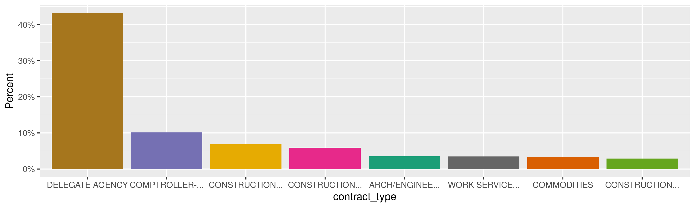
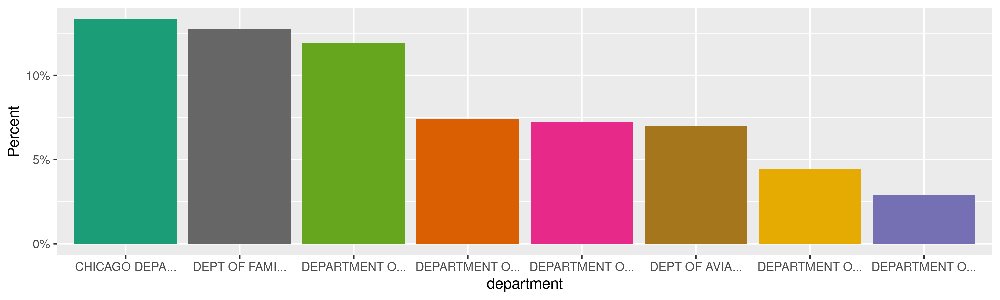
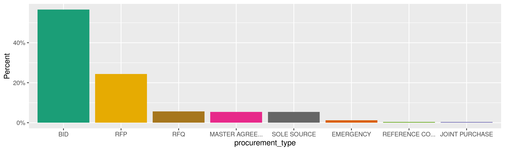
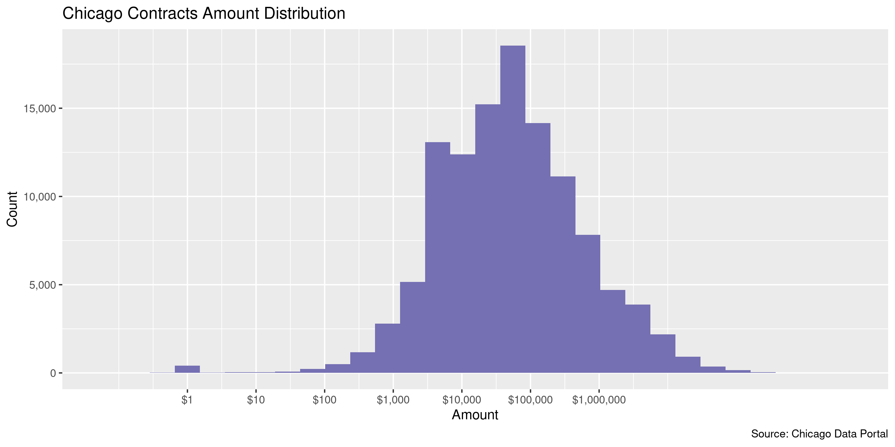
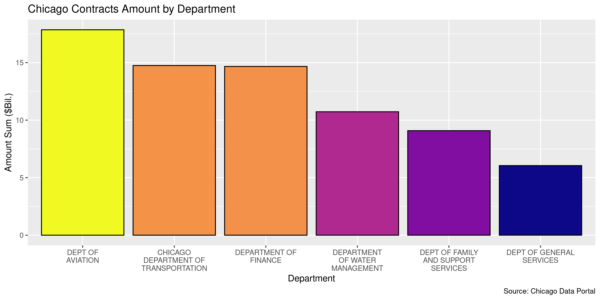
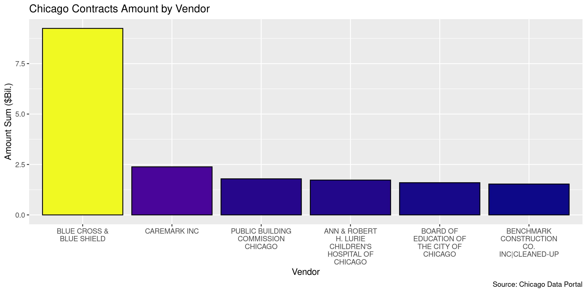

Chicago Contracts
================
Kiernan Nicholls
Thu Feb 2 17:15:46 2023

- <a href="#project" id="toc-project">Project</a>
- <a href="#objectives" id="toc-objectives">Objectives</a>
- <a href="#packages" id="toc-packages">Packages</a>
- <a href="#source" id="toc-source">Source</a>
- <a href="#download" id="toc-download">Download</a>
- <a href="#read" id="toc-read">Read</a>
- <a href="#explore" id="toc-explore">Explore</a>
  - <a href="#missing" id="toc-missing">Missing</a>
  - <a href="#duplicates" id="toc-duplicates">Duplicates</a>
  - <a href="#categorical" id="toc-categorical">Categorical</a>
  - <a href="#amounts" id="toc-amounts">Amounts</a>
  - <a href="#dates" id="toc-dates">Dates</a>
- <a href="#wrangle" id="toc-wrangle">Wrangle</a>
  - <a href="#zip" id="toc-zip">ZIP</a>
- <a href="#conclude" id="toc-conclude">Conclude</a>
- <a href="#export" id="toc-export">Export</a>
- <a href="#upload" id="toc-upload">Upload</a>

<!-- Place comments regarding knitting here -->

## Project

The Accountability Project is an effort to cut across data silos and
give journalists, policy professionals, activists, and the public at
large a simple way to search across huge volumes of public data about
people and organizations.

Our goal is to standardize public data on a few key fields by thinking
of each dataset row as a transaction. For each transaction there should
be (at least) 3 variables:

1.  All **parties** to a transaction.
2.  The **date** of the transaction.
3.  The **amount** of money involved.

## Objectives

This document describes the process used to complete the following
objectives:

1.  How many records are in the database?
2.  Check for entirely duplicated records.
3.  Check ranges of continuous variables.
4.  Is there anything blank or missing?
5.  Check for consistency issues.
6.  Create a five-digit ZIP Code called `zip`.
7.  Create a `year` field from the transaction date.
8.  Make sure there is data on both parties to a transaction.

## Packages

The following packages are needed to collect, manipulate, visualize,
analyze, and communicate these results. The `pacman` package will
facilitate their installation and attachment.

``` r
if (!require("pacman")) {
  install.packages("pacman")
}
pacman::p_load(
  tidyverse, # data manipulation
  lubridate, # datetime strings
  gluedown, # printing markdown
  jsonlite, # read json files
  janitor, # clean data frames
  campfin, # custom irw tools
  aws.s3, # aws cloud storage
  readxl, # read excel files
  refinr, # cluster & merge
  scales, # format strings
  knitr, # knit documents
  rvest, # scrape html
  glue, # code strings
  here, # project paths
  httr, # http requests
  fs # local storage 
)
```

This diary was run using `campfin` version 1.0.9.

``` r
packageVersion("campfin")
#> [1] '1.0.9'
```

This document should be run as part of the `R_tap` project, which lives
as a sub-directory of the more general, language-agnostic
[`irworkshop/accountability_datacleaning`](https://github.com/irworkshop/accountability_datacleaning)
GitHub repository.

The `R_tap` project uses the [RStudio
projects](https://support.rstudio.com/hc/en-us/articles/200526207-Using-Projects)
feature and should be run as such. The project also uses the dynamic
`here::here()` tool for file paths relative to *your* machine.

``` r
# where does this document knit?
here::i_am("state/il/chicago/contracts/docs/chicago_contracts_diary.Rmd")
```

## Source

> Contracts and modifications awarded by the City of Chicago since 1993.
> This data is currently maintained in the City’s Financial Management
> and Purchasing System (FMPS), which is used throughout the City for
> contract management and payment.
>
> Legacy System Records: Purchase Order/Contract Numbers that begin with
> alpha characters identify records imported from legacy systems.
> Records with a null value in the Contract Type field were imported
> from legacy systems.
>
> “Comptroller-Other” Contract Type: Some records where the Contract
> Type is “COMPTROLLER-OTHER” are ordinance-based agreements and may
> have start dates earlier than 1993.
>
> Depends Upon Requirements Contracts: If the contract Award Amount is
> \$0, the contract is not cancelled, and the contract is a blanket
> contract, then the contract award total Depends Upon Requirements. A
> Depends Upon Requirements contract is an indefinite quantities
> contract in which the City places orders as needed and the vendor is
> not guaranteed any particular contract award amount.
>
> Blanket vs. Standard Contracts: Only blanket contracts (contracts for
> repeated purchases) have FMPS end dates. Standard contracts (for
> example, construction contracts) terminate upon completion and
> acceptance of all deliverables. These dates are tracked outside of
> FMPS.
>
> Negative Modifications: Some contracts are modified to delete scope
> and money from a contract. These reductions are indicated by negative
> numbers in the Award Amount field of this dataset.
>
> Data Owner: Procurement Services.  
> Time Period: 1993 to present.  
> Frequency: Data is updated daily.

## Download

``` r
raw_url <- "https://data.cityofchicago.org/api/views/rsxa-ify5/rows.csv"
raw_dir <- dir_create(here("state", "il", "contracts", "data", "raw"))
raw_csv <- path(raw_dir, basename(raw_url))
```

``` r
if (!file_exists(raw_csv)) {
  download.file(raw_url, raw_csv)
}
```

## Read

``` r
chic <- read_delim(
  file = raw_csv,
  delim = ",",
  escape_backslash = FALSE,
  escape_double = FALSE,
  locale = locale(date_format = "%m/%d/%Y"),
  col_types = cols(
    .default = col_character(),
    `Start Date` = col_date(),
    `End Date` = col_date(),
    `Approval Date` = col_date(),
    `Award Amount` = col_double()
  )
)
```

``` r
chic <- clean_names(chic, case = "snake")
```

## Explore

There are 160,928 rows of 19 columns. Each record represents a single
contract between the city of Chicago and an outside vendor for goods and
services.

``` r
glimpse(chic)
#> Rows: 160,928
#> Columns: 19
#> $ purchase_order_description     <chr> "DEMOLITION", "JANITORIAL SUPPLIES", "MASTER AGREEMENT FOR DEMOLITION SERVICES"…
#> $ purchase_order_contract_number <chr> "E011442", "T27500", "C02163", "C02106", "T25387", "T25483", "T25327", "T27465"…
#> $ revision_number                <chr> "0", "0", "0", "0", "0", "0", "0", "0", "0", "0", "0", "0", "0", "1", "2", "1",…
#> $ specification_number           <chr> "E968020030", "B74851001", "B89683203", "B89683203", "B74455802", "B79364802", …
#> $ contract_type                  <chr> NA, NA, NA, NA, NA, NA, NA, NA, NA, NA, NA, NA, NA, "CONSTRUCTION-GENERAL", "DE…
#> $ start_date                     <date> NA, 1997-12-01, NA, NA, NA, NA, NA, NA, NA, 1997-12-01, NA, NA, NA, NA, 2012-0…
#> $ end_date                       <date> NA, 1999-11-30, NA, NA, NA, NA, NA, NA, NA, 1999-11-30, NA, NA, NA, NA, 2014-0…
#> $ approval_date                  <date> NA, NA, NA, NA, NA, NA, NA, NA, NA, NA, NA, NA, NA, 2014-09-05, 2014-09-03, 20…
#> $ department                     <chr> "DEPARTMENT OF BUILDINGS", NA, "DEPARTMENT OF BUILDINGS", "DEPARTMENT OF BUILDI…
#> $ vendor_name                    <chr> "MIDWEST WRECKING COMPANY 01", "CHICAGO UNITED INDUSTRIES, LIMITED", "DEMOLITIO…
#> $ vendor_id                      <chr> "14878414T", "22085024V", "22414299V", "22414299V", "23105142M", "23105142M", "…
#> $ address_1                      <chr> "1950 W HUBBARD ST", "53 W JACKSON BLVD # 1450", "P.0. BOX 10263", "P.0. BOX 10…
#> $ address_2                      <chr> NA, NA, NA, NA, "3228 S WOOD ST", "3228 S WOOD ST", "3228 S WOOD ST", NA, NA, N…
#> $ city                           <chr> "CHICAGO", "CHICAGO", "CHICAGO", "CHICAGO", "CHICAGO", "CHICAGO", "CHICAGO", "B…
#> $ state                          <chr> "IL", "IL", "IL", "IL", "IL", "IL", "IL", "MA", "IL", "IL", "IL", "WI", "IL", "…
#> $ zip                            <chr> "60622", "60604-3806", "60610", "60610", "60608", "60608", "60608", NA, "60632"…
#> $ award_amount                   <dbl> 17500.0, 0.0, 7000.0, 8200.0, 22220.0, 68100.0, 100000.0, 1258514.0, 13745682.0…
#> $ procurement_type               <chr> NA, NA, NA, NA, NA, NA, NA, NA, NA, NA, NA, NA, NA, "BID", NA, "BID", "BID", "B…
#> $ contract_pdf                   <chr> NA, NA, NA, NA, NA, NA, NA, NA, NA, NA, NA, NA, NA, NA, NA, NA, NA, NA, NA, NA,…
tail(chic)
#> # A tibble: 6 × 19
#>   purch…¹ purch…² revis…³ speci…⁴ contr…⁵ start_date end_date   approval…⁶ depar…⁷ vendo…⁸ vendo…⁹ addre…˟ addre…˟ city 
#>   <chr>   <chr>   <chr>   <chr>   <chr>   <date>     <date>     <date>     <chr>   <chr>   <chr>   <chr>   <chr>   <chr>
#> 1 FY' 20… 18861   0       70429   DELEGA… 2009-01-01 2009-12-31 2009-02-04 DEPT O… CENTER… 1047758 1955 N… <NA>    CHIC…
#> 2 MCFETR… 6124    6       20737   CONSTR… NA         NA         2005-03-28 CHICAG… SEVEN-… 103757… 2000 W… <NA>    CHIC…
#> 3 Exhibi… 61770   0       511201  COMPTR… 2017-01-12 2017-09-01 2017-08-01 DEPART… PAOLA … 102465… 221 E … <NA>    <NA> 
#> 4 City A… 30775   0       127727  COMPTR… 2014-01-01 2014-12-31 2014-10-08 DEPART… SEANAC… 313249… 2206 N… <NA>    CHIC…
#> 5 MANHOL… 19188   5       66535   COMMOD… 2008-12-01 2013-11-30 2012-08-08 DEPART… EAST J… 938970… PO BOX… <NA>    PITT…
#> 6 COMPLI… 18455   0       68442   SOFTWA… 2008-12-15 2013-12-14 2008-12-18 DEPT O… ASKREP… 991176… 3225 N… <NA>    PHOE…
#> # … with 5 more variables: state <chr>, zip <chr>, award_amount <dbl>, procurement_type <chr>, contract_pdf <chr>, and
#> #   abbreviated variable names ¹​purchase_order_description, ²​purchase_order_contract_number, ³​revision_number,
#> #   ⁴​specification_number, ⁵​contract_type, ⁶​approval_date, ⁷​department, ⁸​vendor_name, ⁹​vendor_id, ˟​address_1,
#> #   ˟​address_2
```

### Missing

Columns vary in their degree of missing values.

``` r
col_stats(chic, count_na)
#> # A tibble: 19 × 4
#>    col                            class       n          p
#>    <chr>                          <chr>   <int>      <dbl>
#>  1 purchase_order_description     <chr>    2719 0.0169    
#>  2 purchase_order_contract_number <chr>       0 0         
#>  3 revision_number                <chr>       0 0         
#>  4 specification_number           <chr>   12226 0.0760    
#>  5 contract_type                  <chr>   44747 0.278     
#>  6 start_date                     <date>  52085 0.324     
#>  7 end_date                       <date>  53046 0.330     
#>  8 approval_date                  <date>     21 0.000130  
#>  9 department                     <chr>   10044 0.0624    
#> 10 vendor_name                    <chr>       0 0         
#> 11 vendor_id                      <chr>       0 0         
#> 12 address_1                      <chr>       1 0.00000621
#> 13 address_2                      <chr>  143853 0.894     
#> 14 city                           <chr>    1008 0.00626   
#> 15 state                          <chr>       4 0.0000249 
#> 16 zip                            <chr>    1899 0.0118    
#> 17 award_amount                   <dbl>       0 0         
#> 18 procurement_type               <chr>  112058 0.696     
#> 19 contract_pdf                   <chr>  107717 0.669
```

We can flag any record missing a key variable needed to identify a
transaction.

``` r
key_vars <- c("approval_date", "department", "award_amount", "vendor_name")
chic <- flag_na(chic, all_of(key_vars))
sum(chic$na_flag)
#> [1] 10054
```

``` r
chic %>% 
  filter(na_flag) %>% 
  select(all_of(key_vars))
#> # A tibble: 10,054 × 4
#>    approval_date department              award_amount vendor_name                       
#>    <date>        <chr>                          <dbl> <chr>                             
#>  1 NA            DEPARTMENT OF BUILDINGS        17500 MIDWEST WRECKING COMPANY 01       
#>  2 NA            <NA>                               0 CHICAGO UNITED INDUSTRIES, LIMITED
#>  3 NA            DEPARTMENT OF BUILDINGS         7000 DEMOLITION & DEVELOPMENT, LIMITED.
#>  4 NA            DEPARTMENT OF BUILDINGS         8200 DEMOLITION & DEVELOPMENT, LIMITED.
#>  5 NA            <NA>                           22220 JULIE & STEVE'S ACQUISITION       
#>  6 NA            <NA>                           68100 JULIE & STEVE'S ACQUISITION       
#>  7 NA            <NA>                          100000 JULIE & STEVE'S ACQUISITION       
#>  8 NA            <NA>                         1258514 ZOLL MEDICAL CORP                 
#>  9 NA            <NA>                        13745682 MAX MADSON FORD                   
#> 10 NA            <NA>                          187650 G. VALDES ENTERPRISES             
#> # … with 10,044 more rows
```

### Duplicates

We can also flag any record completely duplicated across every column.

``` r
chic <- flag_dupes(chic, everything())
sum(chic$dupe_flag)
#> [1] 6
```

``` r
chic %>% 
  filter(dupe_flag) %>% 
  select(all_of(key_vars)) %>% 
  arrange(approval_date)
#> # A tibble: 6 × 4
#>   approval_date department                           award_amount vendor_name                   
#>   <date>        <chr>                                       <dbl> <chr>                         
#> 1 2004-05-17    CHICAGO DEPARTMENT OF TRANSPORTATION      -35630. M.Q. SEWER & WATER CONTRACTORS
#> 2 2004-05-17    CHICAGO DEPARTMENT OF TRANSPORTATION      -35630. M.Q. SEWER & WATER CONTRACTORS
#> 3 2011-07-20    CHICAGO DEPARTMENT OF TRANSPORTATION        -726. M.Q. SEWER & WATER CONTRACTORS
#> 4 2011-07-20    CHICAGO DEPARTMENT OF TRANSPORTATION        -726. M.Q. SEWER & WATER CONTRACTORS
#> 5 2012-02-06    CHICAGO DEPARTMENT OF TRANSPORTATION      -20609. M.Q. SEWER & WATER CONTRACTORS
#> 6 2012-02-06    CHICAGO DEPARTMENT OF TRANSPORTATION      -20609. M.Q. SEWER & WATER CONTRACTORS
```

### Categorical

``` r
col_stats(chic, n_distinct)
#> # A tibble: 21 × 4
#>    col                            class      n         p
#>    <chr>                          <chr>  <int>     <dbl>
#>  1 purchase_order_description     <chr>  34732 0.216    
#>  2 purchase_order_contract_number <chr>  78000 0.485    
#>  3 revision_number                <chr>  17936 0.111    
#>  4 specification_number           <chr>  37688 0.234    
#>  5 contract_type                  <chr>     56 0.000348 
#>  6 start_date                     <date>  5608 0.0348   
#>  7 end_date                       <date>  7181 0.0446   
#>  8 approval_date                  <date>  7566 0.0470   
#>  9 department                     <chr>     65 0.000404 
#> 10 vendor_name                    <chr>  12337 0.0767   
#> 11 vendor_id                      <chr>  12482 0.0776   
#> 12 address_1                      <chr>  11646 0.0724   
#> 13 address_2                      <chr>   1246 0.00774  
#> 14 city                           <chr>   1159 0.00720  
#> 15 state                          <chr>     61 0.000379 
#> 16 zip                            <chr>   2954 0.0184   
#> 17 award_amount                   <dbl>  66568 0.414    
#> 18 procurement_type               <chr>     16 0.0000994
#> 19 contract_pdf                   <chr>  53188 0.331    
#> 20 na_flag                        <lgl>      2 0.0000124
#> 21 dupe_flag                      <lgl>      2 0.0000124
```

<!-- --><!-- --><!-- -->

### Amounts

``` r
# fix floating point precision
chic$award_amount <- round(chic$award_amount, digits = 2)
```

``` r
summary(chic$award_amount)
#>       Min.    1st Qu.     Median       Mean    3rd Qu.       Max. 
#> -3.781e+09  0.000e+00  1.426e+04  7.300e+05  1.080e+05  3.781e+09
mean(chic$award_amount <= 0)
#> [1] 0.2846987
```

These are the records with the minimum and maximum amounts.

``` r
glimpse(chic[c(which.max(chic$award_amount), which.min(chic$award_amount)), ])
#> Rows: 2
#> Columns: 21
#> $ purchase_order_description     <chr> "0899-ADVANCE", "0899-ADVANCE"
#> $ purchase_order_contract_number <chr> "19030", "19030"
#> $ revision_number                <chr> "0", "1"
#> $ specification_number           <chr> "16194", "16194"
#> $ contract_type                  <chr> "DELEGATE AGENCY", "DELEGATE AGENCY"
#> $ start_date                     <date> 2009-01-01, 2009-01-01
#> $ end_date                       <date> 2009-12-31, 2009-12-31
#> $ approval_date                  <date> 2009-02-03, 2011-06-28
#> $ department                     <chr> "DEPT OF PLANNING & DEVELOPMENT", "DEPT OF PLANNING & DEVELOPMENT"
#> $ vendor_name                    <chr> "ROSCOE VILLAGE CHAMBER", "ROSCOE VILLAGE CHAMBER"
#> $ vendor_id                      <chr> "102482080Z", "102482080Z"
#> $ address_1                      <chr> "3201 N WOLCOTT AVE", "3201 N WOLCOTT AVE"
#> $ address_2                      <chr> NA, NA
#> $ city                           <chr> "CHICAGO", "CHICAGO"
#> $ state                          <chr> "IL", "IL"
#> $ zip                            <chr> "60657", "60657"
#> $ award_amount                   <dbl> 3780796120, -3780758313
#> $ procurement_type               <chr> NA, NA
#> $ contract_pdf                   <chr> NA, NA
#> $ na_flag                        <lgl> FALSE, FALSE
#> $ dupe_flag                      <lgl> FALSE, FALSE
```

The distribution of amount values are typically log-normal.

<!-- -->

<!-- -->

<!-- -->

### Dates

We can add the calendar year from `approval_date` with
`lubridate::year()`.

``` r
chic <- mutate(chic, approval_year = year(approval_date))
```

``` r
min(chic$approval_date, na.rm = TRUE)
#> [1] "1993-01-01"
sum(chic$approval_year < 2000, na.rm = TRUE)
#> [1] 37359
max(chic$approval_date, na.rm = TRUE)
#> [1] "2023-01-31"
sum(chic$approval_date > today(), na.rm = TRUE)
#> [1] 0
```

<!-- -->

## Wrangle

The `address_*`, `city`, and `state` variables are all already fairly
normalized and most of the “bad” addresses are foreign, so they
shouldn’t be changed.

We also needed to add fields for the city and state of the department,
which will be Chicago and Illinois in every instance.

``` r
chic <- chic %>% 
  mutate(
    dept_city = "CHICAGO",
    dept_state = "IL"
  )
```

### ZIP

For ZIP codes, the `campfin::normal_zip()` function will attempt to
create valid *five* digit codes by removing the ZIP+4 suffix and
returning leading zeroes dropped by other programs like Microsoft Excel.

``` r
chic <- chic %>% 
  mutate(
    zip_norm = normal_zip(
      zip = zip,
      na_rep = TRUE
    )
  )
```

``` r
progress_table(
  chic$zip,
  chic$zip_norm,
  compare = valid_zip
)
#> # A tibble: 2 × 6
#>   stage         prop_in n_distinct prop_na n_out n_diff
#>   <chr>           <dbl>      <dbl>   <dbl> <dbl>  <dbl>
#> 1 chic$zip        0.863       2954  0.0118 21855   1472
#> 2 chic$zip_norm   1.00        1759  0.0118    52     13
```

## Conclude

``` r
glimpse(sample_n(chic, 1000))
#> Rows: 1,000
#> Columns: 25
#> $ purchase_order_description     <chr> "COMPUTER HARDWARE, SOFTWARE, PERIPHERALS, SUPPLIES AND RELATED EQUIPMENT (SECO…
#> $ purchase_order_contract_number <chr> "13797", "F1749A", "159490", "121529", "71959", "44242", "D6961340005", "23126"…
#> $ revision_number                <chr> "0", "0", "0", "2", "0", "4", "0", "0", "L603111", "0", "2", "129", "4", "0", "…
#> $ specification_number           <chr> "40767", "B69683203", "697677", "1070196", "CDPH032017", "130911", NA, "90996",…
#> $ contract_type                  <chr> "COMMODITIES", NA, "DELEGATE AGENCY", "DELEGATE AGENCY", "DELEGATE AGENCY", "CO…
#> $ start_date                     <date> 2007-01-01, 1998-10-07, NA, NA, NA, NA, 1996-04-19, 2011-01-01, 1996-06-17, 20…
#> $ end_date                       <date> 2011-12-31, 1998-12-07, NA, NA, NA, NA, 1996-04-30, 2011-12-31, 1996-12-04, 20…
#> $ approval_date                  <date> 2007-01-12, 1998-10-07, 2021-06-08, 2020-06-17, 2018-02-09, 2018-04-09, 1996-0…
#> $ department                     <chr> "DEPT OF BUSINESS & INFORMATION SERVICES", "DEPARTMENT OF BUILDINGS", "DEPT OF …
#> $ vendor_name                    <chr> "SYSTEMS SOLUTIONS, INC.", "DAN-MAR DEMOLITION INC", "BRIGHT STAR COMMUNITY OUT…
#> $ vendor_id                      <chr> "31315397M", "18763693T", "87469744L", "99076565L", "102650258A", "93726083T", …
#> $ address_1                      <chr> "3630 COMMERCIAL AVE", "PO BOX 23393", "735 E 44TH ST # 1", "1611 W DIVISION ST…
#> $ address_2                      <chr> NA, NA, NA, NA, "2121 W TAYLOR ST", NA, "3441 W DIVERSEY AVE", NA, NA, "832 N D…
#> $ city                           <chr> "NORTHBROOK", "CHICAGO", "CHICAGO", "CHICAGO", "CHICAGO", "CHICAGO", "CHICAGO",…
#> $ state                          <chr> "IL", "IL", "IL", "IL", "IL", "IL", "IL", "IL", "IL", "IL", "IL", "IL", "IL", "…
#> $ zip                            <chr> "60062", "60623-0393", "60653", "60622", "60612-7260", "60630", "60647", "60615…
#> $ award_amount                   <dbl> 2102607.5, 5100.0, 92589.0, 3000.0, 137916.0, -98743.9, 50000.0, 72000.0, 31280…
#> $ procurement_type               <chr> "RFP", NA, NA, NA, NA, "BID", NA, NA, NA, "RFP", NA, "BID", NA, NA, NA, NA, "BI…
#> $ contract_pdf                   <chr> "http://ecm.cityofchicago.org/eSMARTContracts/service/DPSWebDocumentViewer?sid=…
#> $ na_flag                        <lgl> FALSE, FALSE, FALSE, FALSE, FALSE, FALSE, FALSE, FALSE, FALSE, FALSE, FALSE, FA…
#> $ dupe_flag                      <lgl> FALSE, FALSE, FALSE, FALSE, FALSE, FALSE, FALSE, FALSE, FALSE, FALSE, FALSE, FA…
#> $ approval_year                  <dbl> 2007, 1998, 2021, 2020, 2018, 2018, 1996, 2010, 1996, 2022, 2021, 2010, 2008, 2…
#> $ dept_city                      <chr> "CHICAGO", "CHICAGO", "CHICAGO", "CHICAGO", "CHICAGO", "CHICAGO", "CHICAGO", "C…
#> $ dept_state                     <chr> "IL", "IL", "IL", "IL", "IL", "IL", "IL", "IL", "IL", "IL", "IL", "IL", "IL", "…
#> $ zip_norm                       <chr> "60062", "60623", "60653", "60622", "60612", "60630", "60647", "60615", "60639"…
```

1.  There are 160,928 records in the database.
2.  There are 6 duplicate records in the database.
3.  The range and distribution of `amount` and `date` seem reasonable.
4.  There are 10,054 records missing key variables.
5.  Consistency in geographic data has been improved with
    `campfin::normal_*()`.
6.  The 4-digit `year` variable has been created with
    `lubridate::year()`.

## Export

Now the file can be saved on disk for upload to the Accountability
server. We will name the object using a date range of the records
included.

``` r
min_dt <- str_remove_all(min(chic$approval_date, na.rm = TRUE), "-")
max_dt <- str_remove_all(max(chic$approval_date, na.rm = TRUE), "-")
csv_ts <- paste(min_dt, max_dt, sep = "-")
```

``` r
clean_dir <- dir_create(here("state", "il", "chicago", "contracts", "data", "clean"))
clean_csv <- path(clean_dir, glue("il-chicago_contracts_{csv_ts}.csv"))
clean_rds <- path_ext_set(clean_csv, "rds")
basename(clean_csv)
#> [1] "il-chicago_contracts_19930101-20230131.csv"
```

``` r
write_csv(chic, clean_csv, na = "")
write_rds(chic, clean_rds, compress = "xz")
(clean_size <- file_size(clean_csv))
#> 43.7M
```

## Upload

We can use the `aws.s3::put_object()` to upload the text file to the IRW
server.

``` r
aws_key <- path("csv", basename(clean_csv))
if (!object_exists(aws_key, "publicaccountability")) {
  put_object(
    file = clean_csv,
    object = aws_key, 
    bucket = "publicaccountability",
    acl = "public-read",
    show_progress = TRUE,
    multipart = TRUE
  )
}
aws_head <- head_object(aws_key, "publicaccountability")
(aws_size <- as_fs_bytes(attr(aws_head, "content-length")))
unname(aws_size == clean_size)
```
