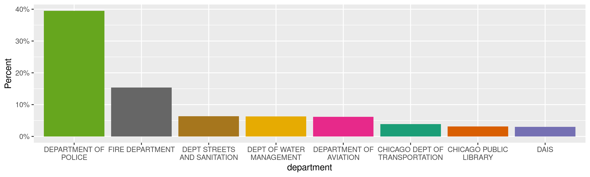
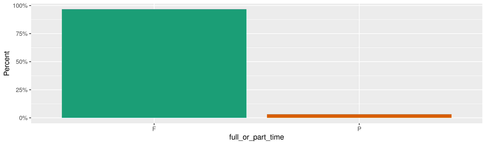
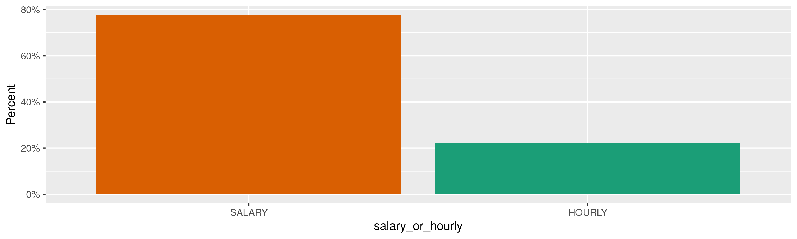
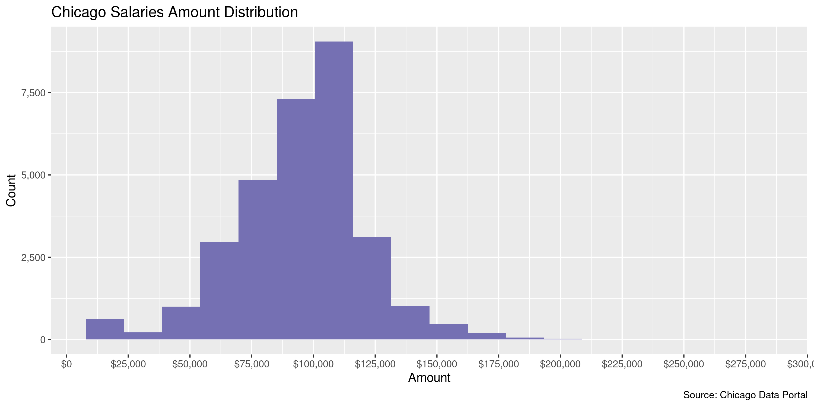
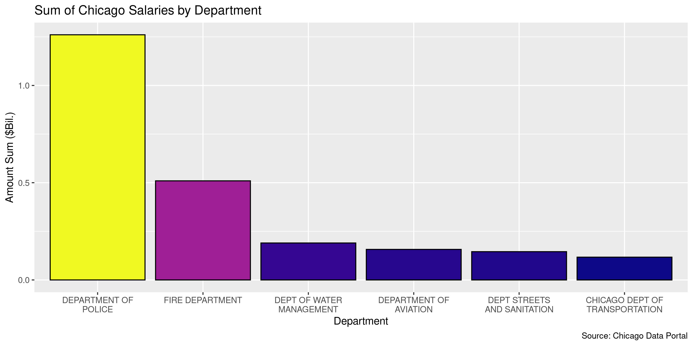
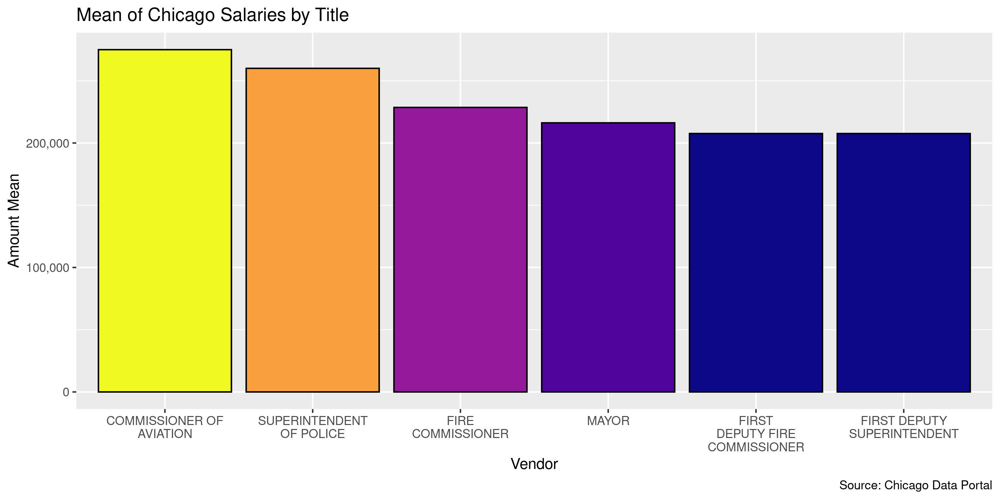

Chicago Salaries
================
Kiernan Nicholls
Fri Feb 3 12:02:49 2023

- <a href="#project" id="toc-project">Project</a>
- <a href="#objectives" id="toc-objectives">Objectives</a>
- <a href="#packages" id="toc-packages">Packages</a>
- <a href="#source" id="toc-source">Source</a>
- <a href="#download" id="toc-download">Download</a>
- <a href="#read" id="toc-read">Read</a>
- <a href="#explore" id="toc-explore">Explore</a>
  - <a href="#missing" id="toc-missing">Missing</a>
  - <a href="#duplicates" id="toc-duplicates">Duplicates</a>
  - <a href="#categorical" id="toc-categorical">Categorical</a>
  - <a href="#amounts" id="toc-amounts">Amounts</a>
- <a href="#wrangle" id="toc-wrangle">Wrangle</a>
- <a href="#conclude" id="toc-conclude">Conclude</a>
- <a href="#export" id="toc-export">Export</a>
- <a href="#upload" id="toc-upload">Upload</a>

<!-- Place comments regarding knitting here -->

## Project

The Accountability Project is an effort to cut across data silos and
give journalists, policy professionals, activists, and the public at
large a simple way to search across huge volumes of public data about
people and organizations.

Our goal is to standardize public data on a few key fields by thinking
of each dataset row as a transaction. For each transaction there should
be (at least) 3 variables:

1.  All **parties** to a transaction.
2.  The **date** of the transaction.
3.  The **amount** of money involved.

## Objectives

This document describes the process used to complete the following
objectives:

1.  How many records are in the database?
2.  Check for entirely duplicated records.
3.  Check ranges of continuous variables.
4.  Is there anything blank or missing?
5.  Check for consistency issues.
6.  Create a five-digit ZIP Code called `zip`.
7.  Create a `year` field from the transaction date.
8.  Make sure there is data on both parties to a transaction.

## Packages

The following packages are needed to collect, manipulate, visualize,
analyze, and communicate these results. The `pacman` package will
facilitate their installation and attachment.

``` r
if (!require("pacman")) {
  install.packages("pacman")
}
pacman::p_load(
  tidyverse, # data manipulation
  lubridate, # datetime strings
  gluedown, # printing markdown
  jsonlite, # read json files
  janitor, # clean data frames
  campfin, # custom irw tools
  aws.s3, # aws cloud storage
  readxl, # read excel files
  refinr, # cluster & merge
  scales, # format strings
  knitr, # knit documents
  rvest, # scrape html
  glue, # code strings
  here, # project paths
  httr, # http requests
  fs # local storage 
)
```

This diary was run using `campfin` version 1.0.9.

``` r
packageVersion("campfin")
#> [1] '1.0.9'
```

This document should be run as part of the `R_tap` project, which lives
as a sub-directory of the more general, language-agnostic
[`irworkshop/accountability_datacleaning`](https://github.com/irworkshop/accountability_datacleaning)
GitHub repository.

The `R_tap` project uses the [RStudio
projects](https://support.rstudio.com/hc/en-us/articles/200526207-Using-Projects)
feature and should be run as such. The project also uses the dynamic
`here::here()` tool for file paths relative to *your* machine.

``` r
# where does this document knit?
here::i_am("state/il/chicago/salaries/docs/chicago_salaries_diary.Rmd")
```

## Source

> This dataset is a listing of all active City of Chicago employees,
> complete with full names, departments, positions, employment status
> (part-time or full-time), frequency of hourly employee –where
> applicable—and annual salaries or hourly rate. Please note that
> “active” has a specific meaning for Human Resources purposes and will
> sometimes exclude employees on certain types of temporary leave. For
> hourly employees, the City is providing the hourly rate and frequency
> of hourly employees (40, 35, 20 and 10) to allow dataset users to
> estimate annual wages for hourly employees. Please note that annual
> wages will vary by employee, depending on number of hours worked and
> seasonal status. For information on the positions and related salaries
> detailed in the annual budgets, see
> <https://www.cityofchicago.org/city/en/depts/obm.html>

## Download

``` r
raw_url <- "https://data.cityofchicago.org/api/views/xzkq-xp2w/rows.csv"
raw_dir <- dir_create(here("state", "il", "chicago", "salaries", "data", "raw"))
raw_csv <- path(raw_dir, basename(raw_url))
```

``` r
if (!file_exists(raw_csv)) {
  download.file(raw_url, raw_csv)
}
```

## Read

``` r
chis <- read_delim(
  file = raw_csv,
  delim = ",",
  escape_backslash = FALSE,
  escape_double = FALSE,
  locale = locale(date_format = "%m/%d/%Y"),
  col_types = cols(
    .default = col_character(),
    `Typical Hours` = col_double(),
    `Annual Salary` = col_double(),
    `Hourly Rate` = col_double()
  )
)
```

``` r
chis <- clean_names(chis, case = "snake")
```

## Explore

There are 31,150 rows of 8 columns. Each record represents a single
employee.

``` r
glimpse(chis)
#> Rows: 31,150
#> Columns: 8
#> $ name              <chr> "MITCHELL, MARY", "ALDERDEN, JACOB M", "JOHNSON, ANTHONY L", "SHALABI, MAJDI A", "KELLY, LUK…
#> $ job_titles        <chr> "TRAFFIC CONTROL AIDE", "CAPTAIN", "MOTOR TRUCK DRIVER", "SERGEANT", "LIEUTENANT", "SERGEANT…
#> $ department        <chr> "OFFICE OF EMERGENCY MANAGEMENT", "DEPARTMENT OF POLICE", "DEPT OF WATER MANAGEMENT", "DEPAR…
#> $ full_or_part_time <chr> "F", "F", "F", "F", "F", "F", "F", "F", "F", "F", "F", "F", "F", "F", "F", "F", "F", "F", "F…
#> $ salary_or_hourly  <chr> "SALARY", "SALARY", "HOURLY", "SALARY", "SALARY", "SALARY", "SALARY", "SALARY", "SALARY", "S…
#> $ typical_hours     <dbl> NA, NA, 40, NA, NA, NA, NA, NA, NA, NA, NA, NA, NA, NA, NA, NA, NA, NA, NA, NA, 40, NA, 40, …
#> $ annual_salary     <dbl> 42312, 159552, NA, 133860, 150318, 129666, 141552, 98016, 133860, 121806, 125634, 129666, 13…
#> $ hourly_rate       <dbl> NA, NA, 39.25, NA, NA, NA, NA, NA, NA, NA, NA, NA, NA, NA, NA, NA, NA, NA, NA, NA, 39.25, NA…
tail(chis)
#> # A tibble: 6 × 8
#>   name               job_titles     department           full_or_part_time salary_or_hourly typical_ho…¹ annua…² hourl…³
#>   <chr>              <chr>          <chr>                <chr>             <chr>                   <dbl>   <dbl>   <dbl>
#> 1 LADUZINSKY, MARK J POLICE OFFICER DEPARTMENT OF POLICE F                 SALARY                     NA  111966      NA
#> 2 MARCIANO, DAVID    POLICE OFFICER DEPARTMENT OF POLICE F                 SALARY                     NA   97974      NA
#> 3 IBRAHIM, NOOR M    POLICE OFFICER DEPARTMENT OF POLICE F                 SALARY                     NA   93264      NA
#> 4 CHORZEPA, PETER J  POLICE OFFICER DEPARTMENT OF POLICE F                 SALARY                     NA   97974      NA
#> 5 SEPCOT, SEAN W     POLICE OFFICER DEPARTMENT OF POLICE F                 SALARY                     NA  104934      NA
#> 6 FOUCH, NICOLE M    POLICE OFFICER DEPARTMENT OF POLICE F                 SALARY                     NA  111966      NA
#> # … with abbreviated variable names ¹​typical_hours, ²​annual_salary, ³​hourly_rate
```

### Missing

Columns vary in their degree of missing values.

``` r
col_stats(chis, count_na)
#> # A tibble: 8 × 4
#>   col               class     n         p
#>   <chr>             <chr> <int>     <dbl>
#> 1 name              <chr>     0 0        
#> 2 job_titles        <chr>     0 0        
#> 3 department        <chr>     0 0        
#> 4 full_or_part_time <chr>     2 0.0000642
#> 5 salary_or_hourly  <chr>     0 0        
#> 6 typical_hours     <dbl> 24190 0.777    
#> 7 annual_salary     <dbl>  6960 0.223    
#> 8 hourly_rate       <dbl> 24190 0.777
```

Rows have *either* a `annual_salary` or `hourly_rate` but not both.

``` r
sum(is.na(chis$annual_salary) & is.na(chis$hourly_rate))
#> [1] 0
```

### Duplicates

We can flag any record completely duplicated across every column.

``` r
chis <- flag_dupes(chis, everything())
sum(chis$dupe_flag)
#> [1] 36
```

``` r
chis %>% 
  filter(dupe_flag) %>% 
  select(1:3) %>% 
  arrange(name)
#> # A tibble: 36 × 3
#>    name                 job_titles          department              
#>    <chr>                <chr>               <chr>                   
#>  1 ARREDONDO, TIMOTHY J ELECTRICAL MECHANIC DEPT OF WATER MANAGEMENT
#>  2 ARREDONDO, TIMOTHY J ELECTRICAL MECHANIC DEPT OF WATER MANAGEMENT
#>  3 FLORES, GABRIEL      SERGEANT            DEPARTMENT OF POLICE    
#>  4 FLORES, GABRIEL      SERGEANT            DEPARTMENT OF POLICE    
#>  5 GARCIA, DAVID        POLICE OFFICER      DEPARTMENT OF POLICE    
#>  6 GARCIA, DAVID        POLICE OFFICER      DEPARTMENT OF POLICE    
#>  7 GONZALEZ, JOEL       POLICE OFFICER      DEPARTMENT OF POLICE    
#>  8 GONZALEZ, JOEL       POLICE OFFICER      DEPARTMENT OF POLICE    
#>  9 GUTIERREZ, JOSE      POLICE OFFICER      DEPARTMENT OF POLICE    
#> 10 GUTIERREZ, JOSE      POLICE OFFICER      DEPARTMENT OF POLICE    
#> # … with 26 more rows
```

### Categorical

``` r
col_stats(chis, n_distinct)
#> # A tibble: 9 × 4
#>   col               class     n         p
#>   <chr>             <chr> <int>     <dbl>
#> 1 name              <chr> 30842 0.990    
#> 2 job_titles        <chr>  1091 0.0350   
#> 3 department        <chr>    37 0.00119  
#> 4 full_or_part_time <chr>     3 0.0000963
#> 5 salary_or_hourly  <chr>     2 0.0000642
#> 6 typical_hours     <dbl>     5 0.000161 
#> 7 annual_salary     <dbl>   895 0.0287   
#> 8 hourly_rate       <dbl>   148 0.00475  
#> 9 dupe_flag         <lgl>     2 0.0000642
```

<!-- --><!-- --><!-- -->

### Amounts

``` r
chis <- chis %>% 
  mutate(
    # weekly salary for entire year
    annual_hourly = (typical_hours * hourly_rate) * 52,
    salary_amount = coalesce(annual_salary, annual_hourly)
  ) %>% 
  select(
    -annual_hourly
  )
```

``` r
# fix floating point precision
chis$salary_amount <- round(chis$salary_amount, digits = 2)
```

``` r
summary(chis$salary_amount)
#>    Min. 1st Qu.  Median    Mean 3rd Qu.    Max. 
#>    3276   81640   97974   94670  109824  275004
mean(chis$salary_amount <= 0)
#> [1] 0
```

These are the records with the minimum and maximum amounts.

``` r
glimpse(chis[c(which.max(chis$salary_amount), which.min(chis$salary_amount)), ])
#> Rows: 2
#> Columns: 10
#> $ name              <chr> "RHEE, JAMIE L", "PESOTSKIY, BERTHA"
#> $ job_titles        <chr> "COMMISSIONER OF AVIATION", "SENIOR COMPANION"
#> $ department        <chr> "DEPARTMENT OF AVIATION", "FAMILY AND SUPPORT SERVICES"
#> $ full_or_part_time <chr> "F", "P"
#> $ salary_or_hourly  <chr> "SALARY", "HOURLY"
#> $ typical_hours     <dbl> NA, 20
#> $ annual_salary     <dbl> 275004, NA
#> $ hourly_rate       <dbl> NA, 3.15
#> $ dupe_flag         <lgl> FALSE, FALSE
#> $ salary_amount     <dbl> 275004, 3276
```

The distribution of amount values are typically log-normal.

<!-- -->

<!-- -->

<!-- -->

## Wrangle

The `address_*`, `city`, and `state` variables are all already fairly
normalized and most of the “bad” addresses are foreign, so they
shouldn’t be changed.

We also needed to add fields for the city and state of the department,
which will be Chicago and Illinois in every instance.

``` r
chis <- chis %>% 
  mutate(
    date = Sys.Date(),
    year = year(date),
    dept_city = "CHICAGO",
    dept_state = "IL"
  )
```

## Conclude

``` r
glimpse(sample_n(chis, 1000))
#> Rows: 1,000
#> Columns: 14
#> $ name              <chr> "MUIR, MARK K", "PETRAT, KARL J", "DONNELLY, MICHAEL", "BROGNI, ANTHONY M", "CROSBY, HAROLD …
#> $ job_titles        <chr> "FOREMAN OF ELECTRICAL MECHANICS", "FIRE ENGINEER-EMT", "POLICE OFFICER", "FRM OF MACHINISTS…
#> $ department        <chr> "PUBLIC SAFETY ADMINISTRATION", "FIRE DEPARTMENT", "DEPARTMENT OF POLICE", "DAIS", "DEPARTME…
#> $ full_or_part_time <chr> "F", "F", "F", "F", "F", "P", "F", "F", "F", "F", "F", "F", "F", "F", "F", "F", "F", "F", "F…
#> $ salary_or_hourly  <chr> "HOURLY", "SALARY", "SALARY", "HOURLY", "SALARY", "HOURLY", "SALARY", "SALARY", "SALARY", "S…
#> $ typical_hours     <dbl> 40, NA, NA, 40, NA, 20, NA, NA, NA, NA, 40, 40, 40, NA, NA, NA, NA, NA, NA, NA, NA, NA, NA, …
#> $ annual_salary     <dbl> NA, 110766, 97974, NA, 86016, NA, 90036, 93660, 108822, 67668, NA, NA, NA, 95616, 121140, 10…
#> $ hourly_rate       <dbl> 54.00, NA, NA, 53.18, NA, 15.40, NA, NA, NA, NA, 57.60, 51.00, 39.25, NA, NA, NA, NA, NA, NA…
#> $ dupe_flag         <lgl> FALSE, FALSE, FALSE, FALSE, FALSE, FALSE, FALSE, FALSE, FALSE, FALSE, FALSE, FALSE, FALSE, F…
#> $ salary_amount     <dbl> 112320.0, 110766.0, 97974.0, 110614.4, 86016.0, 16016.0, 90036.0, 93660.0, 108822.0, 67668.0…
#> $ date              <date> 2023-02-03, 2023-02-03, 2023-02-03, 2023-02-03, 2023-02-03, 2023-02-03, 2023-02-03, 2023-02…
#> $ year              <dbl> 2023, 2023, 2023, 2023, 2023, 2023, 2023, 2023, 2023, 2023, 2023, 2023, 2023, 2023, 2023, 20…
#> $ dept_city         <chr> "CHICAGO", "CHICAGO", "CHICAGO", "CHICAGO", "CHICAGO", "CHICAGO", "CHICAGO", "CHICAGO", "CHI…
#> $ dept_state        <chr> "IL", "IL", "IL", "IL", "IL", "IL", "IL", "IL", "IL", "IL", "IL", "IL", "IL", "IL", "IL", "I…
```

1.  There are 31,150 records in the database.
2.  There are 36 duplicate records in the database.

## Export

Now the file can be saved on disk for upload to the Accountability
server. We will name the object using a date range of the records
included.

``` r
csv_ts <- str_remove_all(Sys.Date(), "-")
```

``` r
clean_dir <- dir_create(here("state", "il", "chicago", "salaries", "data", "clean"))
clean_csv <- path(clean_dir, glue("il-chicago_salaries_{csv_ts}.csv"))
clean_rds <- path_ext_set(clean_csv, "rds")
basename(clean_csv)
#> [1] "il-chicago_salaries_20230203.csv"
```

``` r
write_csv(chis, clean_csv, na = "")
write_rds(chis, clean_rds, compress = "xz")
(clean_size <- file_size(clean_csv))
#> 3.5M
```

## Upload

We can use the `aws.s3::put_object()` to upload the text file to the IRW
server.

``` r
aws_key <- path("csv", basename(clean_csv))
if (!object_exists(aws_key, "publicaccountability")) {
  put_object(
    file = clean_csv,
    object = aws_key, 
    bucket = "publicaccountability",
    acl = "public-read",
    show_progress = TRUE,
    multipart = TRUE
  )
}
aws_head <- head_object(aws_key, "publicaccountability")
(aws_size <- as_fs_bytes(attr(aws_head, "content-length")))
unname(aws_size == clean_size)
```
