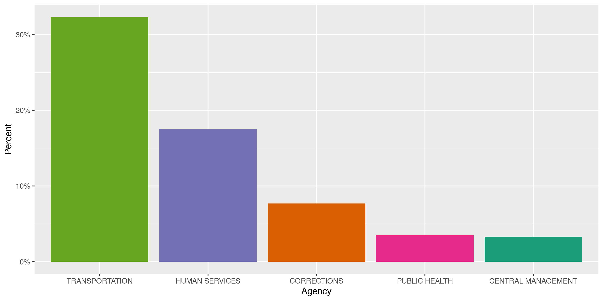
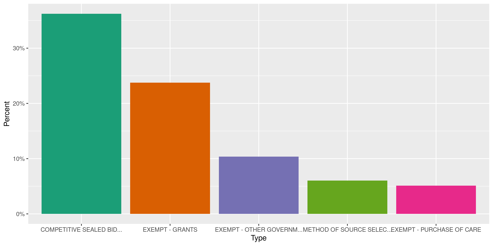
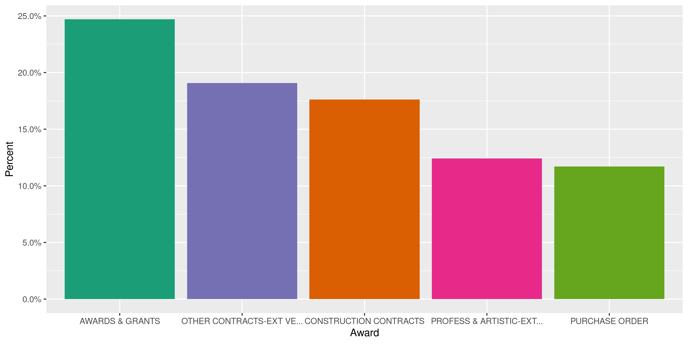
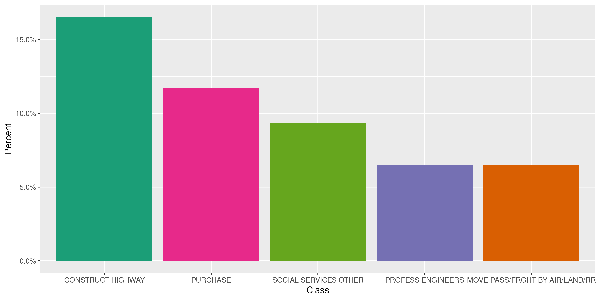
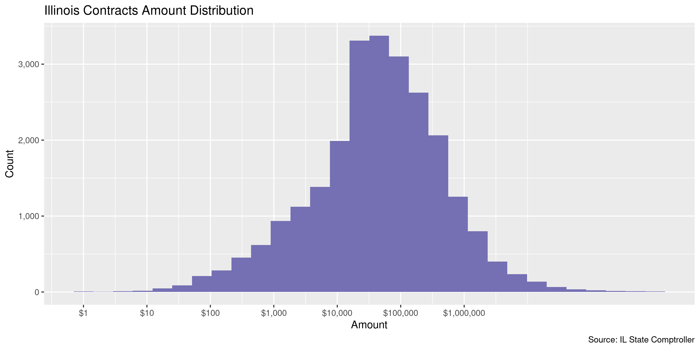

Illinois Contracts
================
Kiernan Nicholls
2020-06-12 12:28:53

  - [Project](#project)
  - [Objectives](#objectives)
  - [Packages](#packages)
  - [Data](#data)
  - [Download](#download)
  - [Read](#read)
  - [Explore](#explore)
  - [Wrangle](#wrangle)
  - [Conclude](#conclude)
  - [Export](#export)
  - [Upload](#upload)
  - [Dictionary](#dictionary)

<!-- Place comments regarding knitting here -->

## Project

The Accountability Project is an effort to cut across data silos and
give journalists, policy professionals, activists, and the public at
large a simple way to search across huge volumes of public data about
people and organizations.

Our goal is to standardizing public data on a few key fields by thinking
of each dataset row as a transaction. For each transaction there should
be (at least) 3 variables:

1.  All **parties** to a transaction.
2.  The **date** of the transaction.
3.  The **amount** of money involved.

## Objectives

This document describes the process used to complete the following
objectives:

1.  How many records are in the database?
2.  Check for entirely duplicated records.
3.  Check ranges of continuous variables.
4.  Is there anything blank or missing?
5.  Check for consistency issues.
6.  Create a five-digit ZIP Code called `zip`.
7.  Create a `year` field from the transaction date.
8.  Make sure there is data on both parties to a transaction.

## Packages

The following packages are needed to collect, manipulate, visualize,
analyze, and communicate these results. The `pacman` package will
facilitate their installation and attachment.

The IRW’s `campfin` package will also have to be installed from GitHub.
This package contains functions custom made to help facilitate the
processing of campaign finance data.

``` r
if (!require("pacman")) install.packages("pacman")
pacman::p_load_gh("irworkshop/campfin")
pacman::p_load(
  tidyverse, # data manipulation
  lubridate, # datetime strings
  gluedown, # printing markdown
  magrittr, # pipe operators
  janitor, # clean data frames
  refinr, # cluster and merge
  scales, # format strings
  knitr, # knit documents
  vroom, # read files fast
  rvest, # html scraping
  glue, # combine strings
  here, # relative paths
  httr, # http requests
  fs # local storage 
)
```

This document should be run as part of the `R_campfin` project, which
lives as a sub-directory of the more general, language-agnostic
[`irworkshop/accountability_datacleaning`](https://github.com/irworkshop/accountability_datacleaning)
GitHub repository.

The `R_campfin` project uses the [RStudio
projects](https://support.rstudio.com/hc/en-us/articles/200526207-Using-Projects)
feature and should be run as such. The project also uses the dynamic
`here::here()` tool for file paths relative to *your* machine.

``` r
# where does this document knit?
here::here()
#> [1] "/home/kiernan/Code/accountability_datacleaning/R_campfin"
```

## Data

## Download

``` r
raw_dir <- dir_create(here("il", "contracts", "data", "raw"))
raw_url <- "http://ledger.illinoiscomptroller.gov/downloads/SC_CFY_VendorName.csv"
raw_path <- path(raw_dir, basename(raw_url))
if (!file_exists(raw_path)) {
  download.file(raw_url, raw_path)
}
```

## Read

``` r
ilc <- vroom(
  file = raw_path,
  escape_backslash = FALSE,
  escape_double = FALSE,
  col_names = c(
    "fy", "id", "agency", "contract", "type", "award", "class", 
    "vendor", "dba", "start", "end", "amount", "annual", "lifetime"
  ),
  col_types = cols(
    .default = col_character(),
    fy = col_integer(),
    start = col_date(),
    end = col_date(),
    amount = col_double(),
    annual = col_double(),
    lifetime = col_double()
  )
)
```

## Explore

``` r
glimpse(ilc)
#> Rows: 29,193
#> Columns: 14
#> $ fy       <int> 2018, 2018, 2018, 2018, 2018, 2018, 2018, 2018, 2018, 2018, 2018, 2018, 2018, 2…
#> $ id       <chr> "557", "999", "494", "511", "511", "494", "511", "511", "418", "350", "350", "4…
#> $ agency   <chr> "IL STATE TOLL HIGHWAY AUTH", "MASTER CONTRACT", "TRANSPORTATION", "CAPITAL DEV…
#> $ contract <chr> "80000P74406", "8PSD4018369", "8COMPRESSOR", "80014062582", "80016043882", "800…
#> $ type     <chr> "COMPETITIVE SEALED BIDDING", "COMPETITIVE SEALED BIDDING", "SMALL PURCHASES", …
#> $ award    <chr> "PURCHASE ORDER", "SUB-ORDER", "OTHER CONTRACTS-EXT VENDOR", "CONSTRUCTION CONT…
#> $ class    <chr> "PURCHASE", "SUB-ORDER", "MOVE PASS/FRGHT BY AIR/LAND/RR", "CONSTRUCT OTHER", "…
#> $ vendor   <chr> "A & A EQUIPMENT & SUPPLY CO", "A & A EQUIPMENT & SUPPLY CO", "A & A EQUIPMENT …
#> $ dba      <chr> NA, NA, NA, NA, NA, "INC", NA, NA, "A & J MOBILITY", "LARRY SCHIEFERDECKER", "M…
#> $ start    <date> 2017-07-15, 2017-07-01, 2017-07-01, 2017-07-01, 2017-07-01, 2017-07-01, 2017-0…
#> $ end      <date> 2018-06-30, 2018-06-30, 2017-08-15, 2017-12-31, 2018-01-15, 2017-09-04, 2018-0…
#> $ amount   <dbl> 45631.50, 0.00, 63225.00, 0.00, 45343.80, 45912.32, 20241.11, 68253.02, 23487.0…
#> $ annual   <dbl> 45631.50, 0.00, 63225.00, 0.00, 45343.80, 45912.32, 20241.11, 68253.02, 23487.0…
#> $ lifetime <dbl> 4219.00, 0.00, 63225.00, 0.00, 0.00, 45912.32, 2542.33, 38323.58, 23487.00, 323…
tail(ilc)
#> # A tibble: 6 x 14
#>      fy id    agency contract type  award class vendor dba   start      end        amount annual
#>   <int> <chr> <chr>  <chr>    <chr> <chr> <chr> <chr>  <chr> <date>     <date>      <dbl>  <dbl>
#> 1  2018 422   NATUR… 80ENG21… SMAL… PURC… PURC… 5366 … <NA>  2017-08-01 2017-10-31 2.28e4 2.28e4
#> 2  2018 350   SECRE… 815PM01… METH… LEAS… OFFI… 8 OAK… C/O … 2017-07-01 2018-06-30 1.08e5 2.60e5
#> 3  2018 416   CENTR… 8CIPL57… METH… LEAS… PROP… 8151 … 9850… 2017-07-01 2018-03-11 2.37e5 2.37e5
#> 4  2018 494   TRANS… 8001302… CONS… PROF… PROF… 9 DES… <NA>  2017-07-01 2018-06-30 3.31e4 3.31e4
#> 5  2018 416   CENTR… 8CIPL51… METH… LEAS… PROP… 915 E… C/O … 2017-07-01 2018-06-30 6.39e5 1.41e6
#> 6  2018 350   SECRE… 815PM02… METH… LEAS… OFFI… 997 G… JOE … 2017-07-01 2018-06-30 2.87e4 6.45e4
#> # … with 1 more variable: lifetime <dbl>
```

### Missing

There are no records missing key values.

``` r
col_stats(ilc, count_na)
#> # A tibble: 14 x 4
#>    col      class      n         p
#>    <chr>    <chr>  <int>     <dbl>
#>  1 fy       <int>      0 0        
#>  2 id       <chr>      0 0        
#>  3 agency   <chr>      0 0        
#>  4 contract <chr>      0 0        
#>  5 type     <chr>      0 0        
#>  6 award    <chr>      0 0        
#>  7 class    <chr>      2 0.0000685
#>  8 vendor   <chr>      0 0        
#>  9 dba      <chr>  19618 0.672    
#> 10 start    <date>     0 0        
#> 11 end      <date>     0 0        
#> 12 amount   <dbl>      0 0        
#> 13 annual   <dbl>      0 0        
#> 14 lifetime <dbl>      0 0
```

### Duplicates

There are no duplicate records.

``` r
ilc <- flag_dupes(ilc, -id)
#> Warning in flag_dupes(ilc, -id): no duplicate rows, column not created
```

### Categorical

``` r
col_stats(ilc, n_distinct)
#> # A tibble: 14 x 4
#>    col      class      n         p
#>    <chr>    <chr>  <int>     <dbl>
#>  1 fy       <int>      1 0.0000343
#>  2 id       <chr>     79 0.00271  
#>  3 agency   <chr>     79 0.00271  
#>  4 contract <chr>  28975 0.993    
#>  5 type     <chr>     21 0.000719 
#>  6 award    <chr>     12 0.000411 
#>  7 class    <chr>     82 0.00281  
#>  8 vendor   <chr>   7506 0.257    
#>  9 dba      <chr>   3506 0.120    
#> 10 start    <date>   174 0.00596  
#> 11 end      <date>   352 0.0121   
#> 12 amount   <dbl>  19191 0.657    
#> 13 annual   <dbl>  19393 0.664    
#> 14 lifetime <dbl>  16278 0.558
```

``` r
explore_plot(ilc, agency, nbar = 5) + scale_x_truncate()
```

<!-- -->

``` r
explore_plot(ilc, type, nbar = 5) + scale_x_truncate(25)
```

<!-- -->

``` r
explore_plot(ilc, award, nbar = 5) + scale_x_truncate(25)
```

<!-- -->

``` r
explore_plot(ilc, class, nbar = 5)
```

<!-- -->

``` r
ilc %>% 
  count(vendor, sort = TRUE) %>% 
  add_prop(sum = FALSE) %>% 
  mutate(c = cumsum(p))
#> # A tibble: 7,506 x 4
#>    vendor                             n       p      c
#>    <chr>                          <int>   <dbl>  <dbl>
#>  1 M J KELLNER CO INC              2133 0.0731  0.0731
#>  2 UNIVERSITY OF ILLINOIS           438 0.0150  0.0881
#>  3 XEROX CORPORATION                330 0.0113  0.0994
#>  4 CHICAGO CITY OF                  313 0.0107  0.110 
#>  5 ADVANCED COMMODITIES  INC        298 0.0102  0.120 
#>  6 MIDLAND PAPER COMPANY            220 0.00754 0.128 
#>  7 D CONSTRUCTION INC               185 0.00634 0.134 
#>  8 UNITED CONTRACTORS MIDWEST INC   150 0.00514 0.139 
#>  9 CARBON SOLUTIONS GROUP LLC       138 0.00473 0.144 
#> 10 W W GRAINGER INC                 129 0.00442 0.148 
#> # … with 7,496 more rows
```

### Amounts

A significant amount of records have an `amount` values equal to $0.

``` r
noquote(map_chr(summary(ilc$amount), dollar))
#>           Min.        1st Qu.         Median           Mean        3rd Qu.           Max. 
#>             $0      $1,919.33        $29,900     $1,037,910       $148,881 $1,027,740,000
percent(mean(ilc$amount == 0), 0.1)
#> [1] "15.6%"
```

There doesn’t appear to be a consistent `class` or `award` for these
$0’s.

``` r
ilc %>% 
  filter(amount == 0) %>% 
  count(award, sort = TRUE) %>% 
  add_prop()
#> # A tibble: 12 x 3
#>    award                              n        p
#>    <chr>                          <int>    <dbl>
#>  1 CONSTRUCTION CONTRACTS          1974 0.433   
#>  2 PROFESS & ARTISTIC-EXT VENDOR    728 0.160   
#>  3 SUB-ORDER                        677 0.149   
#>  4 OTHER CONTRACTS-EXT VENDOR       599 0.132   
#>  5 AWARDS & GRANTS                  426 0.0935  
#>  6 PURCHASE ORDER                    87 0.0191  
#>  7 PRINTING ORDER-EXT VENDOR         22 0.00483 
#>  8 PROFESS & ARTISTIC-STATE AGCY     22 0.00483 
#>  9 OTHER CONTRACTS-STATE AGCY        12 0.00263 
#> 10 LEASES FOR RENTAL OF REAL PROP     5 0.00110 
#> 11 OTHER LEASES-EXT VENDOR            2 0.000439
#> 12 OTHER LEASES-STATE AGCY            1 0.000220
```

<!-- -->

### Dates

We can add the calendar year from `date` with `lubridate::year()`

``` r
ilc <- mutate(ilc, year = year(start))
```

``` r
min(ilc$start)
#> [1] "2017-07-01"
sum(ilc$year < 2000)
#> [1] 0
max(ilc$start)
#> [1] "2018-03-12"
sum(ilc$start > today())
#> [1] 0
```

Almost all of these contracts are from 2017.

    #> # A tibble: 2 x 3
    #>    year     n      p
    #>   <dbl> <int>  <dbl>
    #> 1  2017 28533 0.977 
    #> 2  2018   660 0.0226

## Wrangle

``` r
ilc <- mutate(ilc, state = "IL", .before = agency)
```

## Conclude

1.  There are 29,193 records in the database.
2.  There are 0 duplicate records in the database.
3.  The range and distribution of `amount` and `date` seem reasonable.
4.  There are 0 records missing key variables.
5.  There are no geographic variables to normalize..
6.  The 4-digit `year` variable has been created with
    `lubridate::year()`.

## Export

Now the file can be saved on disk for upload to the Accountability
server.

``` r
clean_dir <- dir_create(here("il", "contracts", "data", "clean"))
clean_path <- path(clean_dir, "il_contracts_clean.csv")
write_csv(ilc, clean_path, na = "")
file_size(clean_path)
#> 5.14M
file_encoding(clean_path) %>% 
  mutate(across(path, path.abbrev))
#> # A tibble: 1 x 3
#>   path                                             mime            charset 
#>   <chr>                                            <chr>           <chr>   
#> 1 ~/il/contracts/data/clean/il_contracts_clean.csv application/csv us-ascii
```

## Upload

Using the [duckr](https://github.com/kiernann/duckr) R package, we can
wrap around the [duck](https://duck.sh/) command line tool to upload the
file to the IRW server.

``` r
# remotes::install_github("kiernann/duckr")
s3_dir <- "s3:/publicaccountability/csv/"
s3_path <- path(s3_dir, basename(clean_path))
if (require(duckr)) {
  duckr::duck_upload(clean_path, s3_path)
}
```

## Dictionary

The following table describes the variables in our final exported file:

| Column     | Type        | Definition                    |
| :--------- | :---------- | :---------------------------- |
| `fy`       | `integer`   | Fiscal year contract made     |
| `id`       | `character` | State agency ID               |
| `state`    | `character` | State agency located          |
| `agency`   | `character` | State agency name             |
| `contract` | `character` | Unique contract ID            |
| `type`     | `character` | Contract type                 |
| `award`    | `character` | Award code                    |
| `class`    | `character` | Use class code                |
| `vendor`   | `character` | Vendor name                   |
| `dba`      | `character` | Vendor doing-business-as      |
| `start`    | `double`    | Start date                    |
| `end`      | `double`    | End date                      |
| `amount`   | `double`    | Maximum contract amount       |
| `annual`   | `double`    | Annual contract amount        |
| `lifetime` | `double`    | Lifetime contract amount      |
| `year`     | `double`    | Calendar year contract starts |
