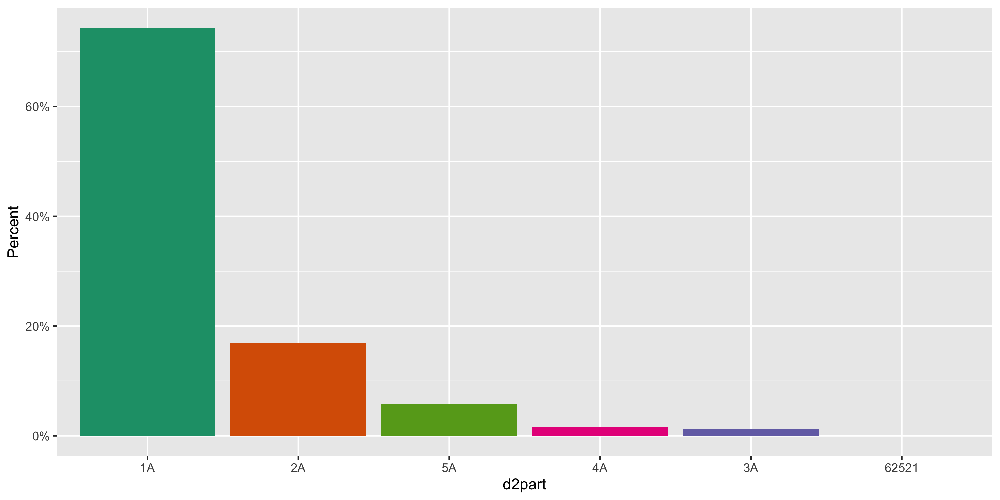
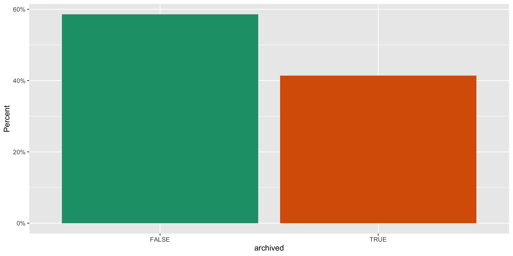
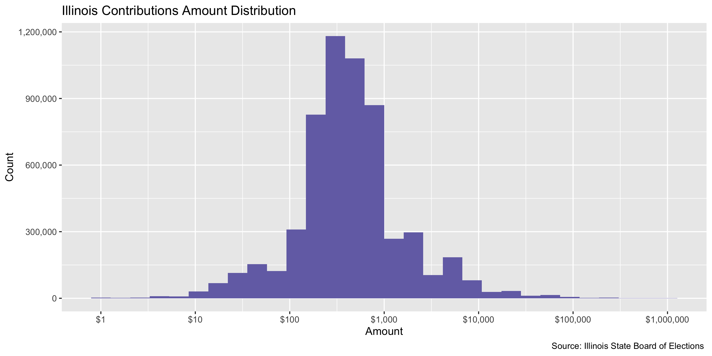
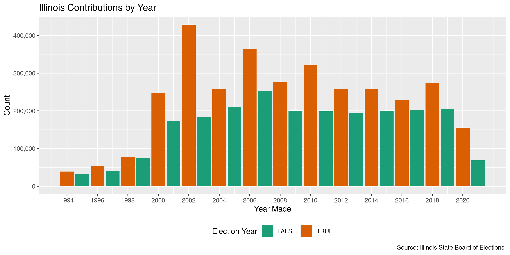
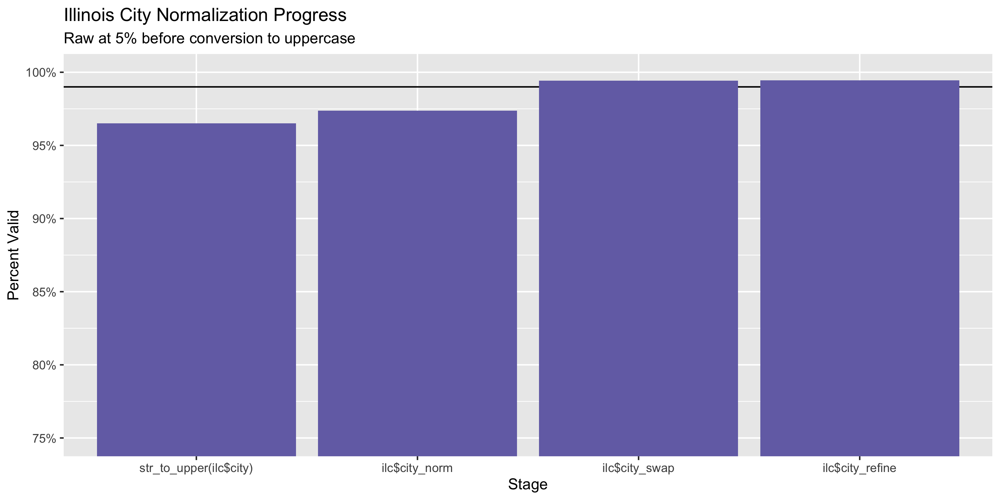
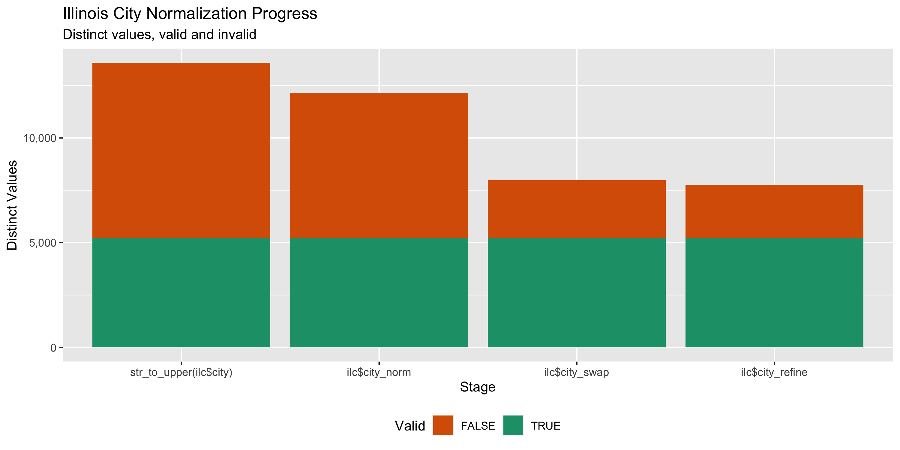

Illinois Contributions
================
Kiernan Nicholls
Fri Sep 17 16:01:59 2021

-   [Project](#project)
-   [Objectives](#objectives)
-   [Packages](#packages)
-   [Data](#data)
-   [Download](#download)
    -   [Dictionary](#dictionary)
    -   [Receipts](#receipts)
-   [Fix](#fix)
-   [Read](#read)
-   [Committees](#committees)
-   [Explore](#explore)
    -   [Missing](#missing)
    -   [Duplicates](#duplicates)
    -   [Categorical](#categorical)
    -   [Amounts](#amounts)
    -   [Dates](#dates)
-   [Wrangle](#wrangle-1)
    -   [Address](#address)
    -   [ZIP](#zip)
    -   [State](#state)
    -   [City](#city)
-   [Conclude](#conclude)
-   [Export](#export)
-   [Upload](#upload)

<!-- Place comments regarding knitting here -->

## Project

The Accountability Project is an effort to cut across data silos and
give journalists, policy professionals, activists, and the public at
large a simple way to search across huge volumes of public data about
people and organizations.

Our goal is to standardize public data on a few key fields by thinking
of each dataset row as a transaction. For each transaction there should
be (at least) 3 variables:

1.  All **parties** to a transaction.
2.  The **date** of the transaction.
3.  The **amount** of money involved.

## Objectives

This document describes the process used to complete the following
objectives:

1.  How many records are in the database?
2.  Check for entirely duplicated records.
3.  Check ranges of continuous variables.
4.  Is there anything blank or missing?
5.  Check for consistency issues.
6.  Create a five-digit ZIP Code called `zip`.
7.  Create a `year` field from the transaction date.
8.  Make sure there is data on both parties to a transaction.

## Packages

The following packages are needed to collect, manipulate, visualize,
analyze, and communicate these results. The `pacman` package will
facilitate their installation and attachment.

``` r
if (!require("pacman")) {
  install.packages("pacman")
}
pacman::p_load(
  tidyverse, # data manipulation
  lubridate, # datetime strings
  gluedown, # printing markdown
  janitor, # clean data frames
  campfin, # custom irw tools
  aws.s3, # aws cloud storage
  refinr, # cluster & merge
  scales, # format strings
  knitr, # knit documents
  vroom, # fast reading
  rvest, # scrape html
  glue, # code strings
  here, # project paths
  httr, # http requests
  fs # local storage 
)
```

This document should be run as part of the `R_campfin` project, which
lives as a sub-directory of the more general, language-agnostic
[`irworkshop/accountability_datacleaning`](https://github.com/irworkshop/accountability_datacleaning)
GitHub repository.

The `R_campfin` project uses the [RStudio
projects](https://support.rstudio.com/hc/en-us/articles/200526207-Using-Projects)
feature and should be run as such. The project also uses the dynamic
`here::here()` tool for file paths relative to *your* machine.

``` r
# where does this document knit?
here::i_am("il/contribs/docs/il_contribs_diary.Rmd")
```

## Data

Contribution data is available from the [Illinois State Board of
Elections](https://elections.il.gov/Default.aspx). The ILSBOE operates a
[contributions search
portal](https://elections.il.gov/CampaignDisclosure/ContributionSearchByAllContributions.aspx)
where users can find and export data on certain contributions. Data is
also available in \[bulk\] from the ILSBOE.

> ### Frequently Asked Questions
>
> #### What about campaign disclosure?\*\*
>
> The Campaign Financing Act covers the public’s right to know certain
> financial information about candidates, elected officials and those
> individuals and groups who are financially involved in political
> campaigns. The State Board of Elections supervises the administration
> of the Illinois act and closely monitors campaign expenditures which
> appear on reports submitted by candidates and committees as required
> by law. These reports, detailing contributions and expenditures, give
> the media and the public information on where candidates received
> their campaign money and where it is being spent. Board hearings are
> held if suspected or actual violations of the Campaign Financing Act
> occur. The Board is authorized to levy fines and turn over evidence of
> wrongdoing to local prosecutors.
>
> #### Is electronically filed data available on the Board of Elections website?
>
> Yes, the data is available in a searchable format. It may be accessed
> in a number of ways by selecting from the different search options
> available. Search tips are provided for each type of search. In
> addition, all itemized receipts for statewide candidates, legislative
> candidates, and legislative leadership committees for the period from
> July 1, 1994 through December 31, 1998, may be searched.
>
> #### Is electronically filed data downloadable from the Board website?
>
> Contribution and expenditure data may be downloaded in either a
> Tab-Delimited Text File or XML file. The data is also available at no
> cost from the Board on cdrom.
>
> #### When is a political committee required to file electronically?
>
> Electronic filing is required for all political committees that during
> a reporting period (i) had at any time a balance or an accumulation of
> contributions of $10,000 or more, (ii) made aggregate expenditures of
> $10,000 or more, or (iii) received loans of an aggregate of $10,000 or
> more. Once a committee exceeds the threshold that requires it to
> report electronically, it must continue thereafter to report
> electronically until it dissolves, whether or not its accumulation,
> receipts or expenditures fall beneath the levels set by statute for
> mandatory electronic filing.
>
> #### Who must file campaign disclosure reports?
>
> Any individual, trust, partnership, committee, association,
> corporation, or any other organization or group of persons which
> receives or spends more than $5,000 on behalf of or in opposition to a
> candidate or question of public policy, meets the definition of a
> political committee and must comply with all provisions of the
> Illinois Campaign Financing Act, including the filing of campaign
> disclosure reports. The $5,000 threshold does not apply to political
> party committees. In addition, any entity other than a natural person
> that makes expenditures of any kind in an aggregate amount of more
> than $3,000 during any 12-month period supporting or opposing a public
> official or candidate must organize as a political committee.

## Download

The campaign finance database is hosted at
`/campaigndisclosuredatafiles`. There, we can see the 13 files available
for download.

``` r
il_home <- read_html("https://elections.il.gov/campaigndisclosuredatafiles/")
```

This table of files includes the date, size, name and URL.

| date                |   length | name                                                                                                                                |
|:--------------------|---------:|:------------------------------------------------------------------------------------------------------------------------------------|
| 2020-01-17 15:25:00 |    11.7K | [`CampaignDisclosureDataDictionary.txt`](https://elections.il.gov/campaigndisclosuredatafiles/CampaignDisclosureDataDictionary.txt) |
| 2021-09-17 06:20:00 |    3.02M | [`Candidates.txt`](https://elections.il.gov/campaigndisclosuredatafiles/Candidates.txt)                                             |
| 2021-09-17 06:20:00 |    2.38M | [`CanElections.txt`](https://elections.il.gov/campaigndisclosuredatafiles/CanElections.txt)                                         |
| 2021-09-17 06:20:00 |   581.4K | [`CmteCandidateLinks.txt`](https://elections.il.gov/campaigndisclosuredatafiles/CmteCandidateLinks.txt)                             |
| 2021-09-17 06:20:00 | 1021.96K | [`CmteOfficerLinks.txt`](https://elections.il.gov/campaigndisclosuredatafiles/CmteOfficerLinks.txt)                                 |
| 2021-09-17 06:20:00 |    7.73M | [`Committees.txt`](https://elections.il.gov/campaigndisclosuredatafiles/Committees.txt)                                             |
| 2021-09-17 06:20:00 |   45.54M | [`D2Totals.txt`](https://elections.il.gov/campaigndisclosuredatafiles/D2Totals.txt)                                                 |
| 2021-09-17 06:22:00 |  611.86M | [`Expenditures.txt`](https://elections.il.gov/campaigndisclosuredatafiles/Expenditures.txt)                                         |
| 2021-09-17 06:22:00 |  105.52M | [`FiledDocs.txt`](https://elections.il.gov/campaigndisclosuredatafiles/FiledDocs.txt)                                               |
| 2021-09-17 06:22:00 |    2.68M | [`Investments.txt`](https://elections.il.gov/campaigndisclosuredatafiles/Investments.txt)                                           |
| 2021-09-17 06:22:00 |    6.07M | [`Officers.txt`](https://elections.il.gov/campaigndisclosuredatafiles/Officers.txt)                                                 |
| 2021-09-17 06:22:00 |    2.16M | [`PrevOfficers.txt`](https://elections.il.gov/campaigndisclosuredatafiles/PrevOfficers.txt)                                         |
| 2021-09-17 06:23:00 |  840.69M | [`Receipts.txt`](https://elections.il.gov/campaigndisclosuredatafiles/Receipts.txt)                                                 |

### Dictionary

The
[`CampaignDisclosureDataDictionary.txt`](https://elections.il.gov/campaigndisclosuredatafiles/CampaignDisclosureDataDictionary.txt)
file contains the columns within each of the available files. We are
interested in the `Receipts.txt` file that contains all campaign
contributions.

| column               | description                                                          |
|:---------------------|:---------------------------------------------------------------------|
| `ID`                 | ID number generated for each record                                  |
| `CommitteeID`        | Political Committee ID number assigned by SBE                        |
| `FiledDocID`         | ID number for the filed document containing the receipt              |
| `ETransID`           | ID number generated for electronically filed document                |
| `LastOnlyName`       | Last/Business name for donor                                         |
| `FirstName`          | First name for donor                                                 |
| `RcvDate`            | Date receipt received                                                |
| `Amount`             | Amount of the receipt                                                |
| `AggregateAmount`    | Aggregate receipt total for filing period                            |
| `LoanAmount`         | Amount of loan                                                       |
| `Occupation`         | Occupation of donor                                                  |
| `Employer`           | Employer of donor                                                    |
| `Address1`           | Donor’s address                                                      |
| `Addresss2`          | Donor’s address                                                      |
| `City`               | Donor’s city                                                         |
| `State`              | Donor’s state                                                        |
| `Zip`                | Donor’s zip code                                                     |
| `D2Part`             | Indicates section of the D-2 form for the receipt                    |
| `Description`        | Description of the receipt                                           |
| `VendorLastOnlyName` | Last name of vendor, for in-kind contribution                        |
| `VendorFirstName`    | First name of vendor, for in-kind contribution                       |
| `VendorAddress1`     | Vendor’s address, for in-kind contribution                           |
| `VendorAddress2`     | Vendor’s address, for in-kind contribution                           |
| `VendorCity`         | Vendor’s city, for in-kind contribution                              |
| `VendorState`        | Vendor’s state, for in-kind contribution                             |
| `VendorZip`          | Vendor’s zip code, for in-kind contribution                          |
| `Archived`           | Indicates the receipt has been superseded by an amendment            |
| `Country`            | Country of the receipt entity (if any)                               |
| `RedactionRequested` | Donor has requested address redaction under the Judicial Privacy Act |

### Receipts

``` r
raw_dir <- dir_create(here("il", "contribs", "data", "raw"))
raw_txt <- path(raw_dir, str_subset(il_ls$name, "Receipts"))
```

``` r
if (!file_exists(raw_txt)) {
  download.file(
    url = str_subset(raw_url, "Receipts"),
    destfile = raw_txt,
    method = "curl"
  )
}
```

## Fix

There are 3 problems within the `Receipts.txt` text file: 1. There are
two instances of a line being erroneously split in the middle and spread
across 7 lines with information repeated in the middle 5 lines. 2. There
are two instances of a name ending with `\n` causing that line to be
split across two lines. 3. There is one address with two extra `\t`
delimiters between the street number and street type.

Presuming the `Receipts.txt` file is the same one (or at least in the
same order) as the one downloaded today (September 16, 2021), then we
can fix these issues manually, removing the bad lines, and saving the
fixed lines to a new text file.

``` r
fix_txt <- here("il", "contribs", "data", "Receipts-fix.txt")
fixes <- rep(FALSE, 4)
if (!file_exists(fix_txt)) {
  x <- read_lines(raw_txt)
  Sys.sleep(5)
  
  # middle newline, repeated column in split middle
  if (str_starts(x[4170845], "\\d", negate = TRUE)) {
    x[4170839] <- paste(x[4170839], x[4170845], sep = "\t")
    fixes[1] <- TRUE
  }
  
  if (str_starts(x[4193501], "\\d", negate = TRUE)) {
    x[4193495] <- paste(x[4193495], x[4193501], sep = "\t")
    fixes[2] <- TRUE
  }

  # newline in name
  if (all(str_starts(x[c(4351744, 4377250)], "\\d", negate = TRUE))) {
    x[4351743] <- paste0(x[4351743], x[4351744])
    x[4377249] <- paste0(x[4377249], x[4377250])
    fixes[3] <- TRUE
  }

  # two tabs within address
  if (str_count(x[5452831], "\t") > 28) {
    x[5452831] <- str_replace(
      string = x[5452831],
      pattern = "672\tS Lincoln\tAve",
      replacement = "672 S Lincoln Ave"
    )
    fixes[4] <- TRUE
  }
  
  
  # remove bad lines
  if (all(fixes)) {
    bad_rows <- c(
      4170840:4170845, # fix one
      4193496:4193501, # fix two
      4351744,         # fix three
      4377250          # fix four
    )
    x <- x[-bad_rows]
  }
  write_lines(x, fix_txt)
}
```

## Read

We can read the manually fixed tab-delimited file.

``` r
ilc <- read_delim(
  file = fix_txt,
  delim = "\t",
  quote = "",
  escape_backslash = FALSE,
  escape_double = FALSE,
  trim_ws = TRUE,
  col_types = cols(
    .default = col_character(),
    ID = col_integer(),
    CommitteeID = col_integer(),
    FiledDocID = col_integer(),
    RcvDate = col_datetime(),
    Amount = col_double(),
    AggregateAmount = col_double(),
    LoanAmount = col_double(),
    Archived = col_logical(),
    RedactionRequested = col_logical()
  )
)
```

``` r
problems(ilc)
#> # A tibble: 0 × 5
#> # … with 5 variables: row <int>, col <int>, expected <chr>, actual <chr>, file <chr>
```

To ensure the file was properly read, we should count the distinct
values of a discrete variable like the logical `RedactionRequested`
column, which should only contain `TRUE` and `FALSE` values.

``` r
count(ilc, RedactionRequested)
#> # A tibble: 2 × 2
#>   RedactionRequested       n
#>   <lgl>                <int>
#> 1 FALSE              5470297
#> 2 TRUE                 10217
```

``` r
ilc <- clean_names(ilc, case = "snake")
```

## Committees

The contribution records contain the name and address of the contributor
but only identify the receiving committee with an `committee_id`
variable. We can use that `committee_id` to join against the
`Committees.txt` database.

``` r
cmt_txt <- path(raw_dir, str_subset(il_ls$name, "Committees"))
if (!file_exists(cmt_txt)) {
  download.file(
    url = str_subset(raw_url, "Committees"),
    destfile = cmt_txt
  )
}
```

``` r
committees <- read_delim(
  file = cmt_txt,
  delim = "\t",
  quote = "",
  escape_backslash = FALSE,
  escape_double = FALSE,
  trim_ws = TRUE,
  col_types = cols(
    .default = col_character(),
    ID = col_integer(),
    StateCommittee = col_logical(),
    StateID = col_integer(),
    LocalCommittee = col_logical(),
    LocalID = col_integer(),
    StatusDate = col_datetime(),
    CreationDate = col_datetime(),
    CreationAmount = col_double(),
    DispFundsReturn = col_logical(),
    DispFundsPolComm = col_logical(),
    DispFundsCharity = col_logical(),
    DispFunds95 = col_logical()
  )
)
```

``` r
committees <- clean_names(committees, case = "snake")
```

We are only interested in the columns which identify the receiving
committee by name and address so they can be easily searched.

``` r
committees <- committees %>% 
  select(id, name, starts_with("address"), city, state, zip)
```

#### Wrangle

Before we join the tables, we are going to normalize the geographic
variables of the address. The explanation for this process is detailed
in the `Wrangle` section below.

``` r
committees <- committees %>% 
  unite(
    col = address,
    starts_with("address"),
    sep = " ",
    remove = TRUE,
    na.rm = TRUE
  ) %>% 
  mutate(
    address = normal_address(
      address = address,
      abbs = usps_street,
      na_rep = TRUE
    )
  )
```

``` r
committees$zip <- normal_zip(
  zip = committees$zip,
  na_rep = TRUE,
  na = ""
)
```

``` r
il_zip <- zipcodes$zip[zipcodes$state == "IL"]
committees$state[committees$state == "L" & committees$zip %in% il_zip] <- "IL"
committees$state[committees$state == "O:" & committees$zip %in% il_zip] <- "IL"
committees$state <- normal_state(
  state = committees$state,
  valid = valid_state
)
```

``` r
committees <- committees %>% 
  mutate(
    city = normal_city(
      city = city, 
      abbs = usps_city,
      states = c("IL", "DC", "ILLINOIS"),
      na = invalid_city,
      na_rep = TRUE
    )
  ) %>% 
  left_join(
    y = zipcodes,
    by = c("state", "zip"),
    suffix = c("_norm", "_match")
  ) %>% 
  mutate(
    match_abb = is_abbrev(city_norm, city_match),
    match_dist = str_dist(city_norm, city_match),
    city_swap = if_else(
      condition = !is.na(match_dist) & (match_abb | match_dist == 1),
      true = city_match,
      false = city_norm
    ),
    .after = city_norm
  ) %>% 
  select(
    -match_abb,
    -match_dist,
    -city_norm,
    -city_match
  ) %>% 
  rename(city = city_swap)
```

#### Join

These columns can be joined with every contribution. We will identify
columns from the `Committees.txt` column with the `cmte_` prefix.

``` r
committees <- rename_with(
  .data = committees,
  .fn = ~paste0("cmte_", .),
  .cols = -id
)
```

``` r
ilc <- left_join(
  x = ilc,
  y = committees,
  by = c("committee_id" = "id")
)
```

## Explore

There are 5,480,514 rows of 34 columns. Each record represents a single
contribution from an individual or business to a campaign or committee.

``` r
glimpse(ilc)
#> Rows: 5,480,514
#> Columns: 34
#> $ id                    <int> 236628, 236629, 236630, 236631, 236632, 236633, 236634, 236635, 236636, 236637, 236638, …
#> $ committee_id          <int> 10353, 10353, 10353, 10353, 10353, 10353, 10353, 10353, 10353, 10353, 10353, 10353, 1035…
#> $ filed_doc_id          <int> 82298, 82298, 82298, 82298, 82298, 82298, 82298, 82298, 82298, 82298, 82298, 82298, 8229…
#> $ e_trans_id            <chr> NA, NA, NA, NA, NA, NA, NA, NA, NA, NA, NA, NA, NA, NA, NA, NA, NA, NA, NA, NA, NA, NA, …
#> $ last_only_name        <chr> "Abc Pac", "Bacon", "Baum", "Burns", "Cable Television & Commission Pac", "Carus", "Cate…
#> $ first_name            <chr> NA, "Donald", "H James", "John & Sandy", NA, "Cynthia", NA, "Roger", NA, NA, NA, "Robert…
#> $ rcv_date              <dttm> 1998-10-28, 1998-09-03, 1998-09-10, 1998-09-14, 1998-09-21, 1998-09-02, 1998-10-27, 199…
#> $ amount                <dbl> 500.00, 250.00, 150.00, 176.00, 1000.00, 200.00, 1000.00, 200.00, 1000.00, 2000.00, 850.…
#> $ aggregate_amount      <dbl> 0, 0, 0, 0, 0, 0, 0, 0, 0, 0, 0, 0, 0, 0, 0, 0, 0, 0, 0, 0, 0, 0, 0, 0, 0, 0, 0, 0, 0, 0…
#> $ loan_amount           <dbl> 0, 0, 0, 0, 0, 0, 0, 0, 0, 0, 0, 0, 0, 0, 0, 0, 0, 0, 0, 0, 0, 0, 0, 0, 0, 0, 0, 0, 0, 0…
#> $ occupation            <chr> NA, NA, NA, NA, NA, NA, NA, NA, NA, NA, NA, NA, NA, NA, NA, NA, NA, NA, NA, NA, NA, NA, …
#> $ employer              <chr> NA, NA, NA, NA, NA, NA, NA, NA, NA, NA, NA, NA, NA, NA, NA, NA, NA, NA, NA, NA, NA, NA, …
#> $ address1              <chr> "Rt 1 Box 255", "16 Bruarckuff", "221 Liberty St", "610 Houston", "2400 E Devon Ave Ste …
#> $ address2              <chr> NA, NA, NA, NA, NA, NA, NA, NA, NA, NA, NA, NA, NA, NA, NA, NA, NA, NA, NA, NA, NA, NA, …
#> $ city                  <chr> "Decatur", "Bourbonnais", "Morris", "Ottawa", "Des Plaines", "Peru", "Peoria", "Peru", "…
#> $ state                 <chr> "IL", "IL", "IL", "IL", "IL", "IL", "IL", "IL", "IL", "IL", "IL", "IL", "IL", "IL", "IL"…
#> $ zip                   <chr> "62526", "60914", "60450", "61350", "60018", "61354", "61629", "61354", "60601", "60601"…
#> $ d2part                <chr> "2A", "1A", "1A", "5A", "2A", "1A", "2A", "1A", "2A", "2A", "5A", "1A", "2A", "2A", "1A"…
#> $ description           <chr> NA, NA, NA, "Food For Fundraiser", NA, NA, NA, NA, NA, NA, "Copier For Office", NA, NA, …
#> $ vendor_last_only_name <chr> NA, NA, NA, NA, NA, NA, NA, NA, NA, NA, NA, NA, NA, NA, NA, NA, NA, NA, NA, NA, NA, NA, …
#> $ vendor_first_name     <chr> NA, NA, NA, NA, NA, NA, NA, NA, NA, NA, NA, NA, NA, NA, NA, NA, NA, NA, NA, NA, NA, NA, …
#> $ vendor_address1       <chr> NA, NA, NA, NA, NA, NA, NA, NA, NA, NA, NA, NA, NA, NA, NA, NA, NA, NA, NA, NA, NA, NA, …
#> $ vendor_address2       <chr> NA, NA, NA, NA, NA, NA, NA, NA, NA, NA, NA, NA, NA, NA, NA, NA, NA, NA, NA, NA, NA, NA, …
#> $ vendor_city           <chr> NA, NA, NA, NA, NA, NA, NA, NA, NA, NA, NA, NA, NA, NA, NA, NA, NA, NA, NA, NA, NA, NA, …
#> $ vendor_state          <chr> NA, NA, NA, NA, NA, NA, NA, NA, NA, NA, NA, NA, NA, NA, NA, NA, NA, NA, NA, NA, NA, NA, …
#> $ vendor_zip            <chr> NA, NA, NA, NA, NA, NA, NA, NA, NA, NA, NA, NA, NA, NA, NA, NA, NA, NA, NA, NA, NA, NA, …
#> $ archived              <lgl> FALSE, FALSE, FALSE, FALSE, FALSE, FALSE, FALSE, FALSE, FALSE, FALSE, FALSE, FALSE, FALS…
#> $ country               <chr> NA, NA, NA, NA, NA, NA, NA, NA, NA, NA, NA, NA, NA, NA, NA, NA, NA, NA, NA, NA, NA, NA, …
#> $ redaction_requested   <lgl> FALSE, FALSE, FALSE, FALSE, FALSE, FALSE, FALSE, FALSE, FALSE, FALSE, FALSE, FALSE, FALS…
#> $ cmte_name             <chr> "Citizens For Studzinski", "Citizens For Studzinski", "Citizens For Studzinski", "Citize…
#> $ cmte_address          <chr> "C/O JO HERRINGTON 2412 PLUM", "C/O JO HERRINGTON 2412 PLUM", "C/O JO HERRINGTON 2412 PL…
#> $ cmte_city             <chr> "PERU", "PERU", "PERU", "PERU", "PERU", "PERU", "PERU", "PERU", "PERU", "PERU", "PERU", …
#> $ cmte_state            <chr> "IL", "IL", "IL", "IL", "IL", "IL", "IL", "IL", "IL", "IL", "IL", "IL", "IL", "IL", "IL"…
#> $ cmte_zip              <chr> "61354", "61354", "61354", "61354", "61354", "61354", "61354", "61354", "61354", "61354"…
tail(ilc)
#> # A tibble: 6 × 34
#>        id committee_id filed_doc_id e_trans_id last_only_name     first_name rcv_date            amount aggregate_amount
#>     <int>        <int>        <int> <chr>      <chr>              <chr>      <dttm>               <dbl>            <dbl>
#> 1 5597112        20886       816189 <NA>       Illinois CPA's fo… <NA>       2021-04-09 00:00:00    400              400
#> 2 5597113        20886       816189 <NA>       Brittan Bolin Con… <NA>       2021-04-19 00:00:00    500              500
#> 3 5597114        20886       816189 <NA>       Cassidy            Michael    2021-06-02 00:00:00    500              500
#> 4 5597115        36738       816190 <NA>       Shapiro            James      2021-09-14 00:00:00   1000                0
#> 5 5597116        36738       816190 <NA>       Holmes             Patricia   2021-09-14 00:00:00   1000                0
#> 6 5597117        36738       816190 <NA>       David              Dr. Indra  2021-09-14 00:00:00   1000                0
#> # … with 25 more variables: loan_amount <dbl>, occupation <chr>, employer <chr>, address1 <chr>, address2 <chr>,
#> #   city <chr>, state <chr>, zip <chr>, d2part <chr>, description <chr>, vendor_last_only_name <chr>,
#> #   vendor_first_name <chr>, vendor_address1 <chr>, vendor_address2 <chr>, vendor_city <chr>, vendor_state <chr>,
#> #   vendor_zip <chr>, archived <lgl>, country <chr>, redaction_requested <lgl>, cmte_name <chr>, cmte_address <chr>,
#> #   cmte_city <chr>, cmte_state <chr>, cmte_zip <chr>
```

### Missing

Columns vary in their degree of missing values.

``` r
col_stats(ilc, count_na)
#> # A tibble: 34 × 4
#>    col                   class        n         p
#>    <chr>                 <chr>    <int>     <dbl>
#>  1 id                    <int>        0 0        
#>  2 committee_id          <int>        0 0        
#>  3 filed_doc_id          <int>        0 0        
#>  4 e_trans_id            <chr>  5416229 0.988    
#>  5 last_only_name        <chr>        0 0        
#>  6 first_name            <chr>  3213605 0.586    
#>  7 rcv_date              <dttm>       0 0        
#>  8 amount                <dbl>        0 0        
#>  9 aggregate_amount      <dbl>        0 0        
#> 10 loan_amount           <dbl>        0 0        
#> 11 occupation            <chr>  4731828 0.863    
#> 12 employer              <chr>  4732506 0.864    
#> 13 address1              <chr>    22284 0.00407  
#> 14 address2              <chr>  4716227 0.861    
#> 15 city                  <chr>    28667 0.00523  
#> 16 state                 <chr>    12544 0.00229  
#> 17 zip                   <chr>    36827 0.00672  
#> 18 d2part                <chr>        0 0        
#> 19 description           <chr>  5047481 0.921    
#> 20 vendor_last_only_name <chr>  5168086 0.943    
#> 21 vendor_first_name     <chr>  5362546 0.978    
#> 22 vendor_address1       <chr>  5172099 0.944    
#> 23 vendor_address2       <chr>  5448621 0.994    
#> 24 vendor_city           <chr>  5171646 0.944    
#> 25 vendor_state          <chr>  5168598 0.943    
#> 26 vendor_zip            <chr>  5168480 0.943    
#> 27 archived              <lgl>        0 0        
#> 28 country               <chr>  5403264 0.986    
#> 29 redaction_requested   <lgl>        0 0        
#> 30 cmte_name             <chr>        0 0        
#> 31 cmte_address          <chr>        0 0        
#> 32 cmte_city             <chr>      359 0.0000655
#> 33 cmte_state            <chr>      450 0.0000821
#> 34 cmte_zip              <chr>     4331 0.000790
```

We can flag any record missing a key variable needed to identify a
transaction.

``` r
key_vars <- c("rcv_date", "last_only_name", "amount", "cmte_name")
ilc <- flag_na(ilc, all_of(key_vars))
sum(ilc$na_flag)
#> [1] 0
```

0.0% rows are missing a key variable.

``` r
if (sum(ilc$na_flag) == 0) {
  ilc <- select(ilc, -na_flag)
}
```

### Duplicates

We can also flag any entirely duplicate rows. To keep memory usage low
with such a large data frame, we will split our data into a list and
check each element of the list. For each chunk, we will write the
duplicate `id` to a text file.

``` r
prop_distinct(ilc$id)
#> [1] 1
```

``` r
dupe_file <- here("ny", "contribs", "data", "dupe_ids.txt")
if (!file_exists(dupe_file)) {
  tmp <- file_temp(ext = "rds")
  write_rds(ilc, file = tmp)
  file_size(tmp)
  il_id <- split(ilc$id, ilc$rcv_date)
  ils <- ilc %>%
    select(-id) %>% 
    group_split(rcv_date)
  if (file_exists(tmp)) {
    rm(ilc)
    Sys.sleep(5)
    flush_memory(2)
  }
  ils <- ils[map_lgl(ils, function(x) nrow(x) > 1)]
  pb <- txtProgressBar(max = length(ils), style = 3)
  for (i in seq_along(ils)) {
    d1 <- duplicated(ils[[i]], fromLast = FALSE)
    d2 <- duplicated(ils[[i]], fromLast = TRUE)
    dupe_vec <- d1 | d2
    rm(d1, d2)
    if (any(dupe_vec)) {
      write_lines(
        x = il_id[[i]][dupe_vec], 
        file = dupe_file, 
        append = file_exists(dupe_file),
        na = ""
      )
    }
    rm(dupe_vec)
    ils[[i]] <- NA
    il_id[[i]] <- NA
    if (i %% 100 == 0) {
      Sys.sleep(2)
      flush_memory()
    }
    setTxtProgressBar(pb, i)
  }
  rm(ils, il_id)
  Sys.sleep(5)
  flush_memory()
  ilc <- read_rds(tmp)
}
```

``` r
dupe_id <- tibble(
  id = as.integer(read_lines(dupe_file, skip_empty_rows = TRUE)),
  dupe_flag = TRUE
)
ilc <- left_join(ilc, dupe_id, by = "id")
ilc <- mutate(ilc, across(dupe_flag, Negate(is.na)))
```

1.4% of rows are duplicates.

``` r
ilc %>% 
  filter(dupe_flag) %>% 
  count(rcv_date, last_only_name, amount, cmte_name, sort = TRUE)
#> # A tibble: 72,494 × 5
#>    rcv_date            last_only_name                   amount cmte_name                           n
#>    <dttm>              <chr>                             <dbl> <chr>                           <int>
#>  1 2012-03-22 00:00:00 "SEIU Illinois Council PAC Fund"   75   United for Rudy Lozano Jr          33
#>  2 2014-08-11 00:00:00 "Working America"                  55.9 Working America                    30
#>  3 2014-07-24 00:00:00 "Working America"                  55.9 Working America                    25
#>  4 2014-09-26 00:00:00 "Working America"                  55.9 Working America                    17
#>  5 2011-02-28 00:00:00 "SEIU IL Council PAC"              75   Friends to Elect Toni L Foulkes     9
#>  6 2014-08-11 00:00:00 "Working America"                  77.5 Working America                     8
#>  7 2002-03-08 00:00:00 "437 North Rush"                 1916.  Friends of Blagojevich              7
#>  8 2016-03-21 00:00:00 "Friends of Robert \"Bob\" Rita"  210   Friends of Juliana Stratton         7
#>  9 2002-03-08 00:00:00 "Grais"                           300   Friends of Blagojevich              6
#> 10 2002-03-08 00:00:00 "Landis Plastics Inc."           1250   Citizens for Patrick O'Malley       6
#> # … with 72,484 more rows
```

### Categorical

``` r
col_stats(ilc, n_distinct)
#> # A tibble: 35 × 4
#>    col                   class        n           p
#>    <chr>                 <chr>    <int>       <dbl>
#>  1 id                    <int>  5480514 1          
#>  2 committee_id          <int>    11617 0.00212    
#>  3 filed_doc_id          <int>   290243 0.0530     
#>  4 e_trans_id            <chr>    62549 0.0114     
#>  5 last_only_name        <chr>   475705 0.0868     
#>  6 first_name            <chr>    92850 0.0169     
#>  7 rcv_date              <dttm>    9933 0.00181    
#>  8 amount                <dbl>   109903 0.0201     
#>  9 aggregate_amount      <dbl>    85618 0.0156     
#> 10 loan_amount           <dbl>    11021 0.00201    
#> 11 occupation            <chr>    19743 0.00360    
#> 12 employer              <chr>    61613 0.0112     
#> 13 address1              <chr>   716789 0.131      
#> 14 address2              <chr>    42814 0.00781    
#> 15 city                  <chr>    16549 0.00302    
#> 16 state                 <chr>      148 0.0000270  
#> 17 zip                   <chr>    86400 0.0158     
#> 18 d2part                <chr>        5 0.000000912
#> 19 description           <chr>    62928 0.0115     
#> 20 vendor_last_only_name <chr>    36454 0.00665    
#> 21 vendor_first_name     <chr>     4688 0.000855   
#> 22 vendor_address1       <chr>    49526 0.00904    
#> 23 vendor_address2       <chr>     2498 0.000456   
#> 24 vendor_city           <chr>     3123 0.000570   
#> 25 vendor_state          <chr>       83 0.0000151  
#> 26 vendor_zip            <chr>     5680 0.00104    
#> 27 archived              <lgl>        2 0.000000365
#> 28 country               <chr>      196 0.0000358  
#> 29 redaction_requested   <lgl>        2 0.000000365
#> 30 cmte_name             <chr>    11503 0.00210    
#> 31 cmte_address          <chr>    10000 0.00182    
#> 32 cmte_city             <chr>      796 0.000145   
#> 33 cmte_state            <chr>       28 0.00000511 
#> 34 cmte_zip              <chr>      952 0.000174   
#> 35 dupe_flag             <lgl>        2 0.000000365
```

<!-- --><!-- -->

### Amounts

``` r
summary(ilc$amount)
#>      Min.   1st Qu.    Median      Mean   3rd Qu.      Max. 
#>         0       200       400      2076      1000 400164048
mean(ilc$amount <= 0)
#> [1] 4.014222e-06
```

These are the records with the minimum and maximum amounts.

``` r
glimpse(ilc[c(which.max(ilc$amount), which.min(ilc$amount)), ])
#> Rows: 2
#> Columns: 35
#> $ id                    <int> 5464817, 28693
#> $ committee_id          <int> 34699, 8511
#> $ filed_doc_id          <int> 787508, 85873
#> $ e_trans_id            <chr> NA, NA
#> $ last_only_name        <chr> "Iosbaker", "Brownstone Beverage"
#> $ first_name            <chr> "Joe", NA
#> $ rcv_date              <dttm> 2020-11-02, 1994-07-26
#> $ amount                <dbl> 400164048, 0
#> $ aggregate_amount      <dbl> 0, 0
#> $ loan_amount           <dbl> 0, 0
#> $ occupation            <chr> NA, NA
#> $ employer              <chr> NA, NA
#> $ address1              <chr> "6324 S Kimbark Ave", "5190 28th Ave"
#> $ address2              <chr> NA, NA
#> $ city                  <chr> "Chicago", "Rockford"
#> $ state                 <chr> "IL", "IL"
#> $ zip                   <chr> "60637", "61109"
#> $ d2part                <chr> "1A", "5A"
#> $ description           <chr> NA, "1 Sgnd Bo Jackson Bsbl,1 Gmn Br Stn"
#> $ vendor_last_only_name <chr> NA, NA
#> $ vendor_first_name     <chr> NA, NA
#> $ vendor_address1       <chr> NA, NA
#> $ vendor_address2       <chr> NA, NA
#> $ vendor_city           <chr> NA, NA
#> $ vendor_state          <chr> NA, NA
#> $ vendor_zip            <chr> NA, NA
#> $ archived              <lgl> TRUE, FALSE
#> $ country               <chr> NA, NA
#> $ redaction_requested   <lgl> FALSE, FALSE
#> $ cmte_name             <chr> "Friends for Celina Villanueva", "Giolitto For State Representative"
#> $ cmte_address          <chr> "4140 S ARCHER AVE SUITE N", "807 BRAE BURN LN"
#> $ cmte_city             <chr> "CHICAGO", "ROCKFORD"
#> $ cmte_state            <chr> "IL", "IL"
#> $ cmte_zip              <chr> "60632", "61107"
#> $ dupe_flag             <lgl> FALSE, FALSE
```

<!-- -->

### Dates

We can add the calendar year from `date` with `lubridate::year()`

``` r
ilc <- mutate(ilc, rcv_year = year(rcv_date))
```

``` r
min(ilc$rcv_date)
#> [1] "1903-02-07 UTC"
sum(ilc$rcv_year < 1994)
#> [1] 6
max(ilc$rcv_date)
#> [1] "2021-09-15 UTC"
sum(ilc$rcv_date > today())
#> [1] 0
```

<!-- -->

## Wrangle

To improve the searchability of the database, we will perform some
consistent, confident string normalization. For geographic variables
like city names and ZIP codes, the corresponding `campfin::normal_*()`
functions are tailor made to facilitate this process.

### Address

For the street `addresss` variable, the `campfin::normal_address()`
function will force consistence case, remove punctuation, and abbreviate
official USPS suffixes.

``` r
norm_addr <- ilc %>% 
  distinct(address1, address2) %>% 
  unite(
    col = address_full,
    starts_with("address"),
    sep = " ",
    remove = FALSE,
    na.rm = TRUE
  ) %>% 
  mutate(
    address_norm = normal_address(
      address = address_full,
      abbs = usps_street,
      na_rep = TRUE
    )
  ) %>% 
  select(-address_full)
```

``` r
sample_n(norm_addr, 10)
#> # A tibble: 10 × 3
#>    address1                            address2 address_norm                      
#>    <chr>                               <chr>    <chr>                             
#>  1 766 Research Pkwy.                  <NA>     766 RESEARCH PKWY                 
#>  2 610 W 18th St                       <NA>     610 W 18TH ST                     
#>  3 4101 S Morgan St                    <NA>     4101 S MORGAN ST                  
#>  4 440 North Wabash Avenue             #4906    440 NORTH WABASH AVENUE 4906      
#>  5 20912 W Ames Ct (22619 Fox Trail Ln <NA>     20912 W AMES CT 22619 FOX TRAIL LN
#>  6 5312 S. Archer                      <NA>     5312 S ARCHER                     
#>  7 900 N Kingsbury                     Apt 1031 900 N KINGSBURY APT 1031          
#>  8 15122 108th Street                  <NA>     15122 108TH ST                    
#>  9 322 N. Linden Ave                   <NA>     322 N LINDEN AVE                  
#> 10 261 Maple St.                       <NA>     261 MAPLE ST
```

``` r
ilc <- left_join(ilc, norm_addr, by = c("address1", "address2"))
```

### ZIP

For ZIP codes, the `campfin::normal_zip()` function will attempt to
create valid *five* digit codes by removing the ZIP+4 suffix and
returning leading zeroes dropped by other programs like Microsoft Excel.

``` r
ilc <- ilc %>% 
  mutate(
    zip_norm = normal_zip(
      zip = zip,
      na_rep = TRUE
    )
  )
```

``` r
progress_table(
  ilc$zip,
  ilc$zip_norm,
  compare = valid_zip
)
#> # A tibble: 2 × 6
#>   stage        prop_in n_distinct prop_na  n_out n_diff
#>   <chr>          <dbl>      <dbl>   <dbl>  <dbl>  <dbl>
#> 1 ilc$zip        0.881      86400 0.00672 649903  76051
#> 2 ilc$zip_norm   0.998      12589 0.00851  13403   1528
```

### State

Valid two digit state abbreviations can be made using the
`campfin::normal_state()` function.

``` r
st_norm <- ilc %>% 
  distinct(state) %>% 
  mutate(
    state_norm = normal_state(
      state = state,
      abbreviate = TRUE,
      na_rep = TRUE,
      valid = valid_state
    )
  )
```

``` r
st_norm %>% 
  filter(state != state_norm)
#> # A tibble: 36 × 2
#>    state state_norm
#>    <chr> <chr>     
#>  1 Mi    MI        
#>  2 Il    IL        
#>  3 Tx    TX        
#>  4 Ky    KY        
#>  5 Va    VA        
#>  6 il    IL        
#>  7 In    IN        
#>  8 Mn    MN        
#>  9 Wi    WI        
#> 10 wa    WA        
#> # … with 26 more rows
```

``` r
ilc <- left_join(ilc, st_norm, by = "state")
```

``` r
progress_table(
  ilc$state,
  ilc$state_norm,
  compare = valid_state
)
#> # A tibble: 2 × 6
#>   stage          prop_in n_distinct prop_na n_out n_diff
#>   <chr>            <dbl>      <dbl>   <dbl> <dbl>  <dbl>
#> 1 ilc$state         1.00        148 0.00229  1565     92
#> 2 ilc$state_norm    1            57 0.00242     0      1
```

### City

Cities are the most difficult geographic variable to normalize, simply
due to the wide variety of valid cities and formats.

#### Normal

The `campfin::normal_city()` function is a good start, again converting
case, removing punctuation, but *expanding* USPS abbreviations. We can
also remove `invalid_city` values.

``` r
norm_city <- ilc %>% 
  distinct(city, state_norm, zip_norm) %>% 
  mutate(
    city_norm = normal_city(
      city = city, 
      abbs = usps_city,
      states = c("IL", "DC", "ILLINOIS"),
      na = invalid_city,
      na_rep = TRUE
    )
  )
```

#### Swap

We can further improve normalization by comparing our normalized value
against the *expected* value for that record’s state abbreviation and
ZIP code. If the normalized value is either an abbreviation for or very
similar to the expected value, we can confidently swap those two.

``` r
norm_city <- norm_city %>% 
  rename(city_raw = city) %>% 
  left_join(
    y = zipcodes,
    by = c(
      "state_norm" = "state",
      "zip_norm" = "zip"
    )
  ) %>% 
  rename(city_match = city) %>% 
  mutate(
    match_abb = is_abbrev(city_norm, city_match),
    match_dist = str_dist(city_norm, city_match),
    city_swap = if_else(
      condition = !is.na(match_dist) & (match_abb | match_dist == 1),
      true = city_match,
      false = city_norm
    )
  ) %>% 
  select(
    -city_match,
    -match_dist,
    -match_abb
  )
```

``` r
ilc <- left_join(
  x = ilc,
  y = norm_city,
  by = c(
    "city" = "city_raw", 
    "state_norm", 
    "zip_norm"
  )
)
```

#### Refine

The [OpenRefine](https://openrefine.org/) algorithms can be used to
group similar strings and replace the less common versions with their
most common counterpart. This can greatly reduce inconsistency, but with
low confidence; we will only keep any refined strings that have a valid
city/state/zip combination.

``` r
good_refine <- ilc %>% 
  mutate(
    city_refine = city_swap %>% 
      key_collision_merge() %>% 
      n_gram_merge(numgram = 1)
  ) %>% 
  filter(city_refine != city_swap) %>% 
  inner_join(
    y = zipcodes,
    by = c(
      "city_refine" = "city",
      "state_norm" = "state",
      "zip_norm" = "zip"
    )
  )
```

    #> # A tibble: 235 × 5
    #>    state_norm zip_norm city_swap          city_refine           n
    #>    <chr>      <chr>    <chr>              <chr>             <int>
    #>  1 IL         60411    SO CHICAGO HEIGHTS CHICAGO HEIGHTS     576
    #>  2 IL         60429    EAST HAZEL CREST   HAZEL CREST         462
    #>  3 IL         60010    NO BARRINGTON      BARRINGTON           65
    #>  4 IA         51102    SOUIX CITY         SIOUX CITY           50
    #>  5 IL         60429    EAST HAZELCREST    HAZEL CREST          38
    #>  6 MD         20817    BESTHEDA           BETHESDA             27
    #>  7 IL         60476    THORTHON           THORNTON             23
    #>  8 IL         60007    LAKE GROVE VILLAGE ELK GROVE VILLAGE    21
    #>  9 IL         62832    DUQUION            DU QUOIN             19
    #> 10 IL         60411    CHCIAAGO HEIGHTS   CHICAGO HEIGHTS      18
    #> # … with 225 more rows

Then we can join the refined values back to the database.

``` r
ilc <- ilc %>% 
  left_join(good_refine, by = names(.)) %>% 
  mutate(city_refine = coalesce(city_refine, city_swap))
```

#### Progress

Our goal for normalization was to increase the proportion of city values
known to be valid and reduce the total distinct values by correcting
misspellings.

| stage                                                                                            | prop\_in | n\_distinct | prop\_na | n\_out | n\_diff |
|:-------------------------------------------------------------------------------------------------|---------:|------------:|---------:|-------:|--------:|
| str\_to\_upper(ilc*c**i**t**y*)\|0.965\|13043\|0.005\|191847\|7992\|\|*i**l**c*city\_norm        |    0.974 |       11655 |    0.006 | 142793 |    6579 |
| ilc*c**i**t**y*<sub>*s*</sub>*w**a**p*\|0.994\|7658\|0.006\|32590\|2598\|\|*i**l**c*city\_refine |    0.994 |        7463 |    0.006 |  30663 |    2405 |

You can see how the percentage of valid values increased with each
stage.

<!-- -->

More importantly, the number of distinct values decreased each stage. We
were able to confidently change many distinct invalid values to their
valid equivalent.

<!-- -->

Before exporting, we can remove the intermediary normalization columns
and rename all added variables with the `_clean` suffix.

``` r
ilc <- ilc %>% 
  select(
    -city_norm,
    -city_swap,
    city_clean = city_refine
  ) %>% 
  rename_all(~str_replace(., "_norm", "_clean")) %>% 
  rename_all(~str_remove(., "_raw")) %>% 
  relocate(city_clean, state_clean, zip_clean, .after = address_clean)
```

``` r
glimpse(sample_n(ilc, 50))
#> Rows: 50
#> Columns: 40
#> $ id                    <int> 3575904, 5251513, 3048014, 5327121, 1637265, 2792511, 562807, 4025039, 5290391, 1427915,…
#> $ committee_id          <int> 23965, 4255, 4565, 35482, 11769, 22077, 538, 23854, 497, 909, 22977, 25879, 13229, 19136…
#> $ filed_doc_id          <int> 477218, 748375, 413398, 760475, 294894, 391892, 204303, 538182, 753494, 275888, 450394, …
#> $ e_trans_id            <chr> NA, NA, NA, NA, NA, NA, NA, NA, NA, NA, NA, NA, NA, NA, NA, NA, NA, NA, NA, NA, NA, NA, …
#> $ last_only_name        <chr> "Pierce Law Office", "Woodrow", "Republican State Senate Campaign Committee", "Holmes", …
#> $ first_name            <chr> NA, "Sheila", NA, "Matt", NA, "Venu", NA, NA, "Vicki", "Kevin", "James", NA, "Earl A.", …
#> $ rcv_date              <dttm> 2012-09-27, 2019-09-04, 2010-08-31, 2019-11-06, 2004-03-22, 2009-06-30, 2000-04-19, 201…
#> $ amount                <dbl> 500.00, 50.00, 268.23, 250.00, 750.00, 200.00, 1130.95, 1000.00, 257.50, 45.00, 1000.00,…
#> $ aggregate_amount      <dbl> 500.00, 200.00, 18932.95, 250.00, 750.00, 1700.00, 6526.46, 1000.00, 257.50, 351.81, 300…
#> $ loan_amount           <dbl> 0, 0, 0, 0, 0, 0, 0, 0, 0, 0, 0, 0, 0, 0, 0, 0, 0, 0, 0, 0, 0, 0, 0, 0, 0, 0, 0, 0, 0, 0…
#> $ occupation            <chr> NA, NA, NA, NA, NA, "Attorney", NA, NA, NA, NA, "VP, Global Sales", NA, "Attorney", NA, …
#> $ employer              <chr> NA, NA, NA, NA, NA, "Vedder Price Kaufman & Krammholz", NA, NA, NA, NA, "Wittern Group",…
#> $ address1              <chr> "461 W. Main", "1200 E Pershing Rd", "P.O. Box 3422", "2220 S. State Rte 157, Suite 225"…
#> $ address2              <chr> "PO Box 147", NA, NA, NA, "4301 GARDEN CITY DR", NA, NA, "#300", NA, NA, NA, NA, NA, NA,…
#> $ city                  <chr> "Bushnell", "Decatur", "Springfield", "Edwardsville", "LANDOVER", "Chicago", "Crestwood"…
#> $ state                 <chr> "IL", "IL", "IL", "IL", "MD", "IL", "IL", "DC", "IL", "IL", "IA", "IL", "IL", "IL", "IL"…
#> $ zip                   <chr> "61422", "62526", "62708", "62025", "20785", "60606", "60445", "20004", "60035", "61820"…
#> $ d2part                <chr> "1A", "1A", "5A", "1A", "2A", "1A", "1A", "1A", "1A", "1A", "1A", "2A", "1A", "2A", "1A"…
#> $ description           <chr> NA, NA, "Taxes", NA, NA, NA, NA, NA, NA, NA, "161549", NA, NA, NA, NA, NA, NA, NA, NA, N…
#> $ vendor_last_only_name <chr> NA, NA, "Internal Revenue Service", NA, NA, NA, NA, NA, NA, NA, NA, NA, NA, NA, NA, NA, …
#> $ vendor_first_name     <chr> NA, NA, NA, NA, NA, NA, NA, NA, NA, NA, NA, NA, NA, NA, NA, NA, NA, NA, NA, NA, NA, NA, …
#> $ vendor_address1       <chr> NA, NA, NA, NA, NA, NA, NA, NA, NA, NA, NA, NA, NA, NA, NA, NA, NA, NA, NA, NA, NA, NA, …
#> $ vendor_address2       <chr> NA, NA, NA, NA, NA, NA, NA, NA, NA, NA, NA, NA, NA, NA, NA, NA, NA, NA, NA, NA, NA, NA, …
#> $ vendor_city           <chr> NA, NA, "Cincinnati", NA, NA, NA, NA, NA, NA, NA, NA, NA, NA, NA, NA, NA, NA, NA, NA, NA…
#> $ vendor_state          <chr> NA, NA, "OH", NA, NA, NA, NA, NA, NA, NA, NA, NA, NA, NA, NA, NA, NA, NA, NA, NA, NA, NA…
#> $ vendor_zip            <chr> NA, NA, "45999", NA, NA, NA, NA, NA, NA, NA, NA, NA, NA, NA, NA, NA, NA, NA, NA, NA, NA,…
#> $ archived              <lgl> FALSE, FALSE, TRUE, FALSE, FALSE, FALSE, FALSE, FALSE, FALSE, FALSE, FALSE, FALSE, FALSE…
#> $ country               <chr> NA, NA, NA, NA, NA, NA, NA, NA, NA, NA, NA, NA, NA, NA, NA, NA, NA, NA, NA, NA, NA, NA, …
#> $ redaction_requested   <lgl> FALSE, FALSE, FALSE, FALSE, FALSE, FALSE, FALSE, FALSE, FALSE, FALSE, FALSE, FALSE, FALS…
#> $ cmte_name             <chr> "Friends of Ramon Escapa", "Illinois Chiropractic Society PAC", "Citizens for Doherty", …
#> $ cmte_address          <chr> "PO BOX 341", "PO BOX 9493", "7805 W CATALPA AVE", "PO BOX 48", "10400 W HIGGINS RD STE …
#> $ cmte_city             <chr> "RUSHVILLE", "SPRINGFIELD", "CHICAGO", "GLEN CARBON", "ROSEMONT", "RIVER FOREST", "SPRIN…
#> $ cmte_state            <chr> "IL", "IL", "IL", "IL", "IL", "IL", "IL", "IL", "IL", "IL", "IL", "IL", "IL", "IL", "IL"…
#> $ cmte_zip              <chr> "62681", "62791", "60656", "62034", "60018", "60305", "62705", "60011", "60602", "62701"…
#> $ dupe_flag             <lgl> FALSE, FALSE, FALSE, FALSE, FALSE, FALSE, FALSE, FALSE, FALSE, FALSE, FALSE, FALSE, FALS…
#> $ rcv_year              <dbl> 2012, 2019, 2010, 2019, 2004, 2009, 2000, 2014, 2019, 2004, 2011, 2019, 2000, 2020, 2002…
#> $ address_clean         <chr> "461 W MAIN PO BOX 147", "1200 E PERSHING RD", "PO BOX 3422", "2220 S STATE RTE 157 SUIT…
#> $ city_clean            <chr> "BUSHNELL", "DECATUR", "SPRINGFIELD", "EDWARDSVILLE", "LANDOVER", "CHICAGO", "CRESTWOOD"…
#> $ state_clean           <chr> "IL", "IL", "IL", "IL", "MD", "IL", "IL", "DC", "IL", "IL", "IA", "IL", "IL", "IL", "IL"…
#> $ zip_clean             <chr> "61422", "62526", "62708", "62025", "20785", "60606", "60445", "20004", "60035", "61820"…
```

## Conclude

1.  There are 5,480,514 records in the database.
2.  There are 76,052 duplicate records in the database.
3.  The range and distribution of `amount` and `date` seem reasonable.
4.  There are 0 records missing key variables.
5.  Consistency in geographic data has been improved with
    `campfin::normal_*()`.
6.  The 4-digit `year` variable has been created with
    `lubridate::year()`.

## Export

Now the file can be saved on disk for upload to the Accountability
server.

``` r
clean_dir <- dir_create(here("il", "contribs", "data", "clean"))
clean_path <- path(clean_dir, "il_contribs_19940701-20210915.csv")
write_csv(ilc, clean_path, na = "")
(clean_size <- file_size(clean_path))
#> 1.36G
```

## Upload

We can use the `aws.s3::put_object()` to upload the text file to the IRW
server.

``` r
aws_path <- path("csv", basename(clean_path))
if (!object_exists(aws_path, "publicaccountability")) {
  put_object(
    file = clean_path,
    object = aws_path, 
    bucket = "publicaccountability",
    acl = "public-read",
    show_progress = TRUE,
    multipart = TRUE
  )
}
aws_head <- head_object(aws_path, "publicaccountability")
(aws_size <- as_fs_bytes(attr(aws_head, "content-length")))
unname(aws_size == clean_size)
```
