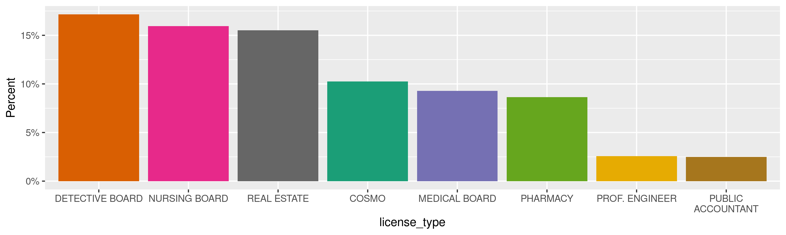
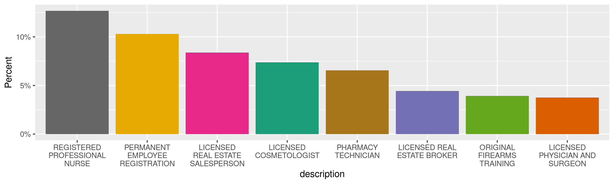
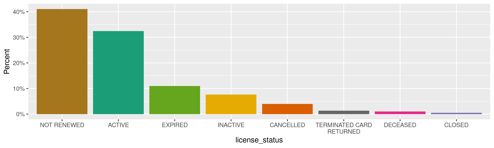
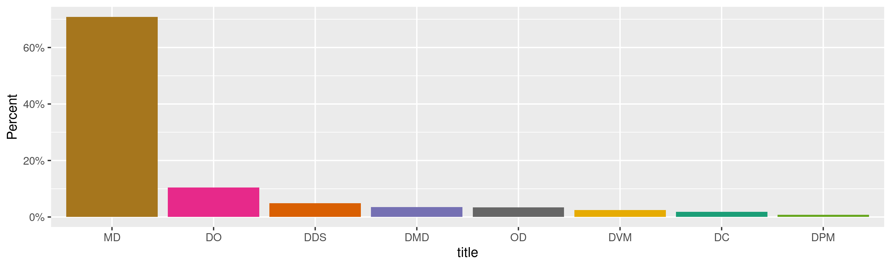
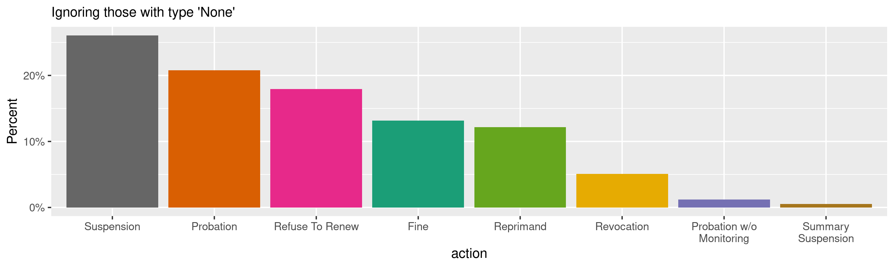
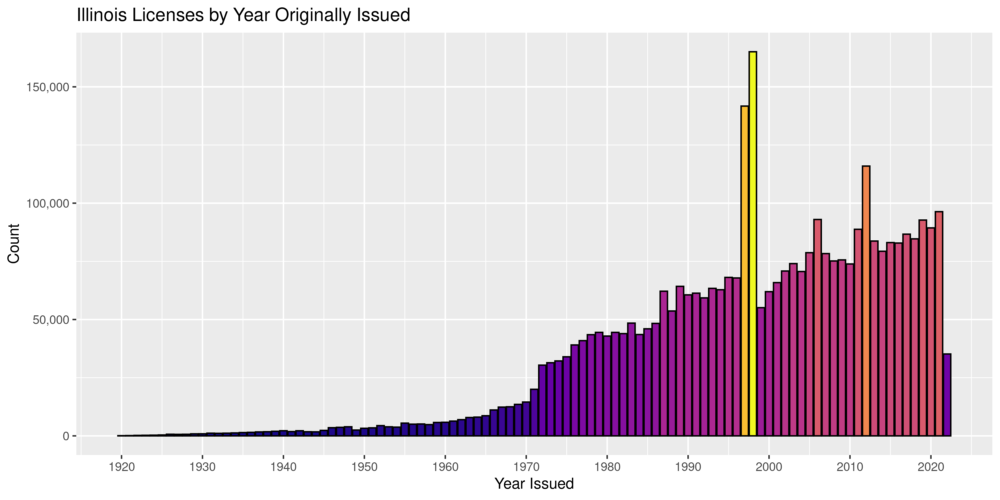
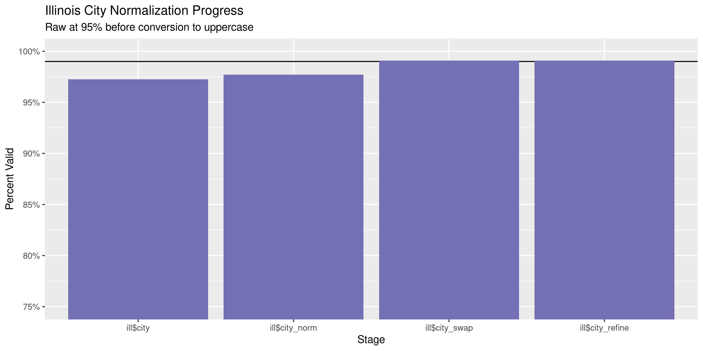
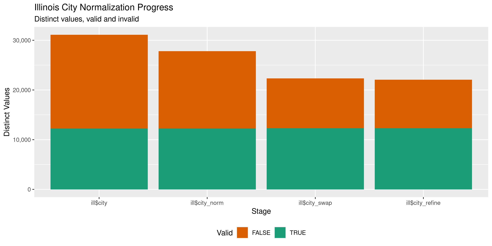

Illinois Licenses
================
Kiernan Nicholls
Fri May 27 12:17:43 2022

-   <a href="#project" id="toc-project">Project</a>
-   <a href="#objectives" id="toc-objectives">Objectives</a>
-   <a href="#packages" id="toc-packages">Packages</a>
-   <a href="#source" id="toc-source">Source</a>
-   <a href="#download" id="toc-download">Download</a>
-   <a href="#read" id="toc-read">Read</a>
-   <a href="#explore" id="toc-explore">Explore</a>
    -   <a href="#missing" id="toc-missing">Missing</a>
    -   <a href="#duplicate" id="toc-duplicate">Duplicate</a>
    -   <a href="#categorical" id="toc-categorical">Categorical</a>
    -   <a href="#dates" id="toc-dates">Dates</a>
-   <a href="#wrangle" id="toc-wrangle">Wrangle</a>
    -   <a href="#address" id="toc-address">Address</a>
    -   <a href="#zip" id="toc-zip">ZIP</a>
    -   <a href="#state" id="toc-state">State</a>
    -   <a href="#city" id="toc-city">City</a>
-   <a href="#conclude" id="toc-conclude">Conclude</a>
-   <a href="#export" id="toc-export">Export</a>
-   <a href="#upload" id="toc-upload">Upload</a>

<!-- Place comments regarding knitting here -->

## Project

The Accountability Project is an effort to cut across data silos and
give journalists, policy professionals, activists, and the public at
large a simple way to search across huge volumes of public data about
people and organizations.

Our goal is to standardize public data on a few key fields by thinking
of each dataset row as a transaction. For each transaction there should
be (at least) 3 variables:

1.  All **parties** to a transaction.
2.  The **date** of the transaction.
3.  The **amount** of money involved.

## Objectives

This document describes the process used to complete the following
objectives:

1.  How many records are in the database?
2.  Check for entirely duplicated records.
3.  Check ranges of continuous variables.
4.  Is there anything blank or missing?
5.  Check for consistency issues.
6.  Create a five-digit ZIP Code called `zip`.
7.  Create a `year` field from the transaction date.
8.  Make sure there is data on both parties to a transaction.

## Packages

The following packages are needed to collect, manipulate, visualize,
analyze, and communicate these results. The `pacman` package will
facilitate their installation and attachment.

``` r
if (!require("pacman")) {
  install.packages("pacman")
}
pacman::p_load(
  tidyverse, # data manipulation
  lubridate, # datetime strings
  gluedown, # printing markdown
  janitor, # clean data frames
  campfin, # custom irw tools
  aws.s3, # aws cloud storage
  refinr, # cluster & merge
  scales, # format strings
  knitr, # knit documents
  rvest, # scrape html
  glue, # code strings
  here, # project paths
  httr, # http requests
  fs # local storage 
)
```

This diary was run using `campfin` version 1.0.8.9300.

``` r
packageVersion("campfin")
#> [1] '1.0.8.9300'
```

This document should be run as part of the `R_tap` project, which lives
as a sub-directory of the more general, language-agnostic
[`irworkshop/accountability_datacleaning`](https://github.com/irworkshop/accountability_datacleaning)
GitHub repository.

The `R_tap` project uses the [RStudio
projects](https://support.rstudio.com/hc/en-us/articles/200526207-Using-Projects)
feature and should be run as such. The project also uses the dynamic
`here::here()` tool for file paths relative to *your* machine.

``` r
# where does this document knit?
here::i_am("state/il/licenses/docs/il_licenses_diary.Rmd")
```

## Source

## Download

``` r
raw_dir <- dir_create(here("state", "il", "licenses", "data", "raw"))
raw_csv <- path(raw_dir, "ad736417-627a-4709-ac78-85a70c2695db.csv")
```

## Read

``` r
ill <- read_delim(
  file = raw_csv,
  delim = ",",
  escape_backslash = FALSE,
  escape_double = FALSE,
  progress = TRUE,
  locale = locale(date_format = "%m/%d/%Y"),
  col_types = cols(
    .default = col_character(),
    `_id` = col_integer()
    # `Original Issue Date` = col_date(),
    # `Effective Date` = col_date(),
    # `Expiration Date` = col_date(),
    # `LastModifiedDate` = col_date()
  )
)
#> indexing ad736417-627a-4709-ac78-85a70c2695db.csv [================================================] 25.61TB/s, eta:  0s                                                                                                                        indexing ad736417-627a-4709-ac78-85a70c2695db.csv [===============================================] 244.19MB/s, eta:  0s                                                                                                                        
```

``` r
ill <- ill %>% 
  clean_names(case = "snake") %>% 
  mutate(
    across(c(business, ever_disciplined), function(x) x == "Y"),
    across(where(is.character),  str_squish),
    across(where(is.character),  na_if, ""),
    across(
      ends_with("_date"), 
      function(x) {
        parse_date(
          x = str_sub(x, 1, 10),
          format = "%m/%d/%Y",
          na = c("None", "/ /")
        )
      }
    )
  )
```

## Explore

There are 3,667,824 rows of 31 columns. Each record represents a single
license issued to a business in Illinois.

``` r
glimpse(ill)
#> Rows: 3,667,824
#> Columns: 31
#> $ id                                      <int> 1, 2, 3, 4, 5, 6, 7, 8, 9, 10, 11, 12, 13, 14, 15, 16, 17, 18, 19, 20,…
#> $ license_type                            <chr> "DETECTIVE BOARD", "DETECTIVE BOARD", "DETECTIVE BOARD", "DETECTIVE BO…
#> $ description                             <chr> "PERMANENT EMPLOYEE REGISTRATION", "PERMANENT EMPLOYEE REGISTRATION", …
#> $ license_number                          <chr> "129161139", "129161143", "129161181", "129161183", "129161198", "1291…
#> $ license_status                          <chr> "NOT RENEWED", "NOT RENEWED", "NOT RENEWED", "NOT RENEWED", "NOT RENEW…
#> $ business                                <lgl> FALSE, FALSE, FALSE, FALSE, FALSE, FALSE, FALSE, FALSE, FALSE, FALSE, …
#> $ title                                   <chr> NA, NA, NA, NA, NA, NA, NA, NA, NA, NA, NA, NA, NA, NA, NA, NA, NA, NA…
#> $ first_name                              <chr> "PHILLIP", "CHARLES S", "CHRISTOPHER F", "ZACHARY A", "PETE", "RALPH W…
#> $ middle                                  <chr> "L", NA, NA, NA, NA, NA, NA, NA, NA, NA, NA, NA, NA, NA, NA, NA, NA, N…
#> $ last_name                               <chr> "FARMER", "HAY", "BATTLE", "MAYES", "KISER", "PIERCE", "MITCHELL", "DA…
#> $ prefix                                  <chr> NA, NA, NA, NA, NA, NA, NA, NA, NA, NA, NA, NA, NA, NA, NA, NA, NA, NA…
#> $ suffix                                  <chr> NA, NA, NA, NA, NA, NA, NA, NA, NA, NA, NA, NA, NA, NA, NA, NA, NA, NA…
#> $ business_name                           <chr> "PHILLIP L FARMER", "CHARLES S HAY", "CHRISTOPHER F BATTLE", "ZACHARY …
#> $ business_dba                            <chr> NA, NA, NA, NA, NA, NA, NA, NA, NA, NA, NA, NA, NA, NA, NA, NA, NA, NA…
#> $ original_issue_date                     <date> 1994-01-25, 1994-10-17, 1994-02-08, 1994-01-07, 1994-02-08, 1994-06-2…
#> $ effective_date                          <date> 1994-01-25, 1994-10-17, 1994-02-08, 1994-01-07, 1994-02-08, 1994-06-2…
#> $ expiration_date                         <date> 1994-05-31, 1997-05-31, 1994-05-31, 1997-05-31, 1994-05-31, 2000-05-3…
#> $ city                                    <chr> "LOCKPORT", "FLORISSANT", "CHICAGO", "GENESEO", "DURAND", "QUINCY", "C…
#> $ state                                   <chr> "IL", "MO", "IL", "IL", "IL", "IL", "IL", "IL", "IL", "IL", "IL", "IL"…
#> $ zip                                     <chr> "60441", "63031", "60620", "61254", "61024", "62301", "64452", "61102"…
#> $ county                                  <chr> "WILL", "MISSOURI", "COOK", "HENRY", "WINNEBAGO", "ADAMS", "COOK", "WI…
#> $ specialty_qualifier                     <chr> "None", "None", "None", "None", "None", "None", "None", "None", "None"…
#> $ controlled_substance_schedule           <chr> "None", "None", "None", "None", "None", "None", "None", "None", "None"…
#> $ delegated_controlled_substance_schedule <chr> "None", "None", "None", "None", "None", "None", "None", "None", "None"…
#> $ ever_disciplined                        <lgl> FALSE, FALSE, FALSE, FALSE, FALSE, FALSE, FALSE, FALSE, FALSE, FALSE, …
#> $ last_modified_date                      <date> 2006-08-03, 2006-08-03, 2006-08-03, 2006-08-03, 2006-08-03, 2006-08-2…
#> $ case_number                             <chr> "None", "None", "None", "None", "None", "None", "None", "None", "None"…
#> $ action                                  <chr> "None", "None", "None", "None", "None", "None", "None", "None", "None"…
#> $ discipline_start_date                   <date> NA, NA, NA, NA, NA, NA, NA, NA, NA, NA, NA, NA, NA, NA, 1994-11-04, N…
#> $ discipline_end_date                     <date> NA, NA, NA, NA, NA, NA, NA, NA, NA, NA, NA, NA, NA, NA, 1996-11-03, N…
#> $ discipline_reason                       <chr> "None", "None", "None", "None", "None", "None", "None", "None", "None"…
tail(ill)
#> # A tibble: 6 × 31
#>       id license_type description license_number license_status business title first_name middle last_name prefix suffix
#>    <int> <chr>        <chr>       <chr>          <chr>          <lgl>    <chr> <chr>      <chr>  <chr>     <chr>  <chr> 
#> 1 3.67e6 VETERINARY   LICENSED V… 39*****99      NOT RENEWED    FALSE    <NA>  BIKRAM     SINGH  SOHI      <NA>   DVM   
#> 2 3.67e6 VETERINARY   LICENSED V… 39*****99      NOT RENEWED    FALSE    <NA>  KAREN M    <NA>   WESSON    <NA>   <NA>  
#> 3 3.67e6 VETERINARY   LICENSED V… 39*****99      NOT RENEWED    FALSE    <NA>  MARSIA D   <NA>   WOJCIKOW… <NA>   <NA>  
#> 4 3.67e6 VETERINARY   LICENSED V… 39*****99      NOT RENEWED    FALSE    <NA>  PATRICK    J      ROADY     <NA>   <NA>  
#> 5 3.67e6 VETERINARY   LICENSED V… 39*****99      NOT RENEWED    FALSE    <NA>  STEVEN R   <NA>   HANSEN    <NA>   <NA>  
#> 6 3.67e6 VETERINARY   LICENSED V… 39*****99      NOT RENEWED    FALSE    <NA>  WILMER     ALOY   BUSTELO   <NA>   DVM   
#> # … with 19 more variables: business_name <chr>, business_dba <chr>, original_issue_date <date>, effective_date <date>,
#> #   expiration_date <date>, city <chr>, state <chr>, zip <chr>, county <chr>, specialty_qualifier <chr>,
#> #   controlled_substance_schedule <chr>, delegated_controlled_substance_schedule <chr>, ever_disciplined <lgl>,
#> #   last_modified_date <date>, case_number <chr>, action <chr>, discipline_start_date <date>,
#> #   discipline_end_date <date>, discipline_reason <chr>
```

### Missing

Columns vary in their degree of missing values.

``` r
col_stats(ill, count_na)
#> # A tibble: 31 × 4
#>    col                                     class        n          p
#>    <chr>                                   <chr>    <int>      <dbl>
#>  1 id                                      <int>        0 0         
#>  2 license_type                            <chr>        0 0         
#>  3 description                             <chr>        0 0         
#>  4 license_number                          <chr>    38046 0.0104    
#>  5 license_status                          <chr>        0 0         
#>  6 business                                <lgl>        0 0         
#>  7 title                                   <chr>  3548898 0.968     
#>  8 first_name                              <chr>   189918 0.0518    
#>  9 middle                                  <chr>  2003449 0.546     
#> 10 last_name                               <chr>   189765 0.0517    
#> 11 prefix                                  <chr>  3639379 0.992     
#> 12 suffix                                  <chr>  3385396 0.923     
#> 13 business_name                           <chr>       10 0.00000273
#> 14 business_dba                            <chr>  3616196 0.986     
#> 15 original_issue_date                     <date>   15664 0.00427   
#> 16 effective_date                          <date>  253393 0.0691    
#> 17 expiration_date                         <date>  168965 0.0461    
#> 18 city                                    <chr>     5678 0.00155   
#> 19 state                                   <chr>    19066 0.00520   
#> 20 zip                                     <chr>    29264 0.00798   
#> 21 county                                  <chr>   272271 0.0742    
#> 22 specialty_qualifier                     <chr>    61763 0.0168    
#> 23 controlled_substance_schedule           <chr>     1185 0.000323  
#> 24 delegated_controlled_substance_schedule <chr>     8202 0.00224   
#> 25 ever_disciplined                        <lgl>        0 0         
#> 26 last_modified_date                      <date>       0 0         
#> 27 case_number                             <chr>        0 0         
#> 28 action                                  <chr>      146 0.0000398 
#> 29 discipline_start_date                   <date> 3590377 0.979     
#> 30 discipline_end_date                     <date> 3638141 0.992     
#> 31 discipline_reason                       <chr>       14 0.00000382
```

We can flag any record missing a key variable needed to identify a
transaction.

``` r
key_vars <- c("original_issue_date", "business_name")
ill <- flag_na(ill, all_of(key_vars))
sum(ill$na_flag)
#> [1] 15674
```

``` r
ill %>% 
  filter(na_flag) %>% 
  select(all_of(key_vars))
#> # A tibble: 15,674 × 2
#>    original_issue_date business_name           
#>    <date>              <chr>                   
#>  1 NA                  JOHN DAVID JANES        
#>  2 NA                  JEFFREY DON CONAWAY     
#>  3 2020-10-01          <NA>                    
#>  4 NA                  JEFFREY DON CONAWAY     
#>  5 NA                  STEVEN P WRIGHT         
#>  6 NA                  GEORGE E WESBEY III     
#>  7 NA                  PANKAJ JAIN MD          
#>  8 NA                  SHELLEY FIRESTONE MD    
#>  9 NA                  SHEILA RAE EHRLICH MD   
#> 10 NA                  RODRIGO L FARRALES JR MD
#> # … with 15,664 more rows
```

### Duplicate

``` r
dupe_file <- here("state", "il", "licenses", "data", "dupes.txt")
if (!file_exists(dupe_file)) {
  # save copy to disc
  tmp <- file_temp(ext = "rds")
  write_rds(ill, file = tmp)
  file_size(tmp)
  # split file into chunks
  il_id <- split(ill$id, ill$description)
  ils <- ill %>%
    select(-id) %>% 
    group_split(description)
  # remove from memory
  if (file_exists(tmp)) {
    rm(ill)
    Sys.sleep(5)
    flush_memory(2)
  }
  pb <- txtProgressBar(max = length(ils), style = 3)
  for (i in seq_along(ils)) {
    # check dupes from both ends
    if (nrow(ils[[i]]) > 1) {
      d1 <- duplicated(ils[[i]], fromLast = FALSE)
      d2 <- duplicated(ils[[i]], fromLast = TRUE)
      dupe_vec <- d1 | d2
      rm(d1, d2)
      # append dupe id to file
      if (any(dupe_vec)) {
        cli::cli_alert_danger("Duplicates found {i}")
        write_lines(
          x = il_id[[i]][dupe_vec], 
          file = dupe_file, 
          append = file_exists(dupe_file)
        )
      } else {
        cli::cli_alert_success("No duplicates {i}")
      }
      rm(dupe_vec)
    }
    ils[[i]] <- NA
    il_id[[i]] <- NA
    if (i %% 100 == 0) {
      Sys.sleep(2)
      flush_memory(2)
    }
    setTxtProgressBar(pb, i)
  }
  rm(ils, il_id)
  Sys.sleep(5)
  flush_memory(2)
  ill <- read_rds(tmp)
  if (!file_exists(dupe_file)) {
    file_touch(dupe_file)
  }
}
```

``` r
il_dupes <- tibble(
  id = as.integer(read_lines(dupe_file)), 
  dupe_flag = TRUE
)
```

``` r
ill <- left_join(ill, il_dupes, by = "id")
ill$dupe_flag <- !is.na(ill$dupe_flag)
```

``` r
if (sum(ill$dupe_flag) == 0) {
  ill <- select(ill, -dupe_flag)
}
```

### Categorical

``` r
col_stats(ill, n_distinct)
#> # A tibble: 32 × 4
#>    col                                     class        n           p
#>    <chr>                                   <chr>    <int>       <dbl>
#>  1 id                                      <int>  3667824 1          
#>  2 license_type                            <chr>       60 0.0000164  
#>  3 description                             <chr>      310 0.0000845  
#>  4 license_number                          <chr>  3420627 0.933      
#>  5 license_status                          <chr>       23 0.00000627 
#>  6 business                                <lgl>        2 0.000000545
#>  7 title                                   <chr>      164 0.0000447  
#>  8 first_name                              <chr>   300308 0.0819     
#>  9 middle                                  <chr>    47318 0.0129     
#> 10 last_name                               <chr>   354236 0.0966     
#> 11 prefix                                  <chr>       15 0.00000409 
#> 12 suffix                                  <chr>      163 0.0000444  
#> 13 business_name                           <chr>  2640514 0.720      
#> 14 business_dba                            <chr>    24370 0.00664    
#> 15 original_issue_date                     <date>   26976 0.00735    
#> 16 effective_date                          <date>   26553 0.00724    
#> 17 expiration_date                         <date>   14425 0.00393    
#> 18 city                                    <chr>    31120 0.00848    
#> 19 state                                   <chr>       77 0.0000210  
#> 20 zip                                     <chr>    29200 0.00796    
#> 21 county                                  <chr>      153 0.0000417  
#> 22 specialty_qualifier                     <chr>      408 0.000111   
#> 23 controlled_substance_schedule           <chr>       28 0.00000763 
#> 24 delegated_controlled_substance_schedule <chr>       18 0.00000491 
#> 25 ever_disciplined                        <lgl>        2 0.000000545
#> 26 last_modified_date                      <date>    5539 0.00151    
#> 27 case_number                             <chr>    57162 0.0156     
#> 28 action                                  <chr>       35 0.00000954 
#> 29 discipline_start_date                   <date>    7747 0.00211    
#> 30 discipline_end_date                     <date>    8909 0.00243    
#> 31 discipline_reason                       <chr>    23177 0.00632    
#> 32 na_flag                                 <lgl>        2 0.000000545
```

<!-- --><!-- --><!-- --><!-- --><!-- --><!-- -->

### Dates

We can add the calendar year from `date` with `lubridate::year()`

``` r
ill <- mutate(ill, issue_year = year(original_issue_date))
```

``` r
min(ill$original_issue_date, na.rm = TRUE)
#> [1] "1900-01-07"
sum(ill$issue_year < 2000, na.rm = TRUE)
#> [1] 1815578
max(ill$original_issue_date, na.rm = TRUE)
#> [1] "2109-04-26"
sum(ill$original_issue_date > today(), na.rm = TRUE)
#> [1] 1405
```

<!-- -->

## Wrangle

To improve the searchability of the database, we will perform some
consistent, confident string normalization. For geographic variables
like city names and ZIP codes, the corresponding `campfin::normal_*()`
functions are tailor made to facilitate this process.

### Address

There are no street addresses in the data.

### ZIP

The `zip` value is already over 99% normalized.

``` r
prop_in(ill$zip, valid_zip)
#> [1] 0.9941922
ill$zip <- na_if(ill$zip, "00000")
```

### State

The `state` value already contains only abbreviations.

``` r
prop_in(ill$state, valid_state)
#> [1] 0.9997169
table(what_out(ill$state, valid_state))
#> 
#>  AB  AI  BC  MB  MX  NB  NL  NS  NT  ON  PE  PQ  SG  SK  TW  UK  YT 
#> 129  12 122  23  23   1   1  22   1 565   7  62   1  16   3  44   1
```

### City

Cities are the most difficult geographic variable to normalize, simply
due to the wide variety of valid cities and formats.

#### Normal

The `campfin::normal_city()` function is a good start, again converting
case, removing punctuation, but *expanding* USPS abbreviations. We can
also remove `invalid_city` values.

``` r
norm_city <- ill %>% 
  distinct(city, state, zip) %>% 
  mutate(
    city_norm = normal_city(
      city = city, 
      abbs = usps_city,
      states = c("IL", "DC", "ILLINOIS"),
      na = invalid_city,
      na_rep = TRUE
    )
  )
```

#### Swap

We can further improve normalization by comparing our normalized value
against the *expected* value for that record’s state abbreviation and
ZIP code. If the normalized value is either an abbreviation for or very
similar to the expected value, we can confidently swap those two.

``` r
norm_city <- norm_city %>% 
  rename(city_raw = city) %>% 
  left_join(
    y = zipcodes,
    by = c("state", "zip")
  ) %>% 
  rename(city_match = city) %>% 
  mutate(
    match_abb = is_abbrev(city_norm, city_match),
    match_dist = str_dist(city_norm, city_match),
    city_swap = if_else(
      condition = !is.na(match_dist) & (match_abb | match_dist == 1),
      true = city_match,
      false = city_norm
    )
  ) %>% 
  select(
    -city_match,
    -match_dist,
    -match_abb
  )
```

``` r
ill <- left_join(
  x = ill,
  y = norm_city,
  by = c("city" = "city_raw", "state", "zip")
)
```

#### Refine

The [OpenRefine](https://openrefine.org/) algorithms can be used to
group similar strings and replace the less common versions with their
most common counterpart. This can greatly reduce inconsistency, but with
low confidence; we will only keep any refined strings that have a valid
city/state/zip combination.

``` r
good_refine <- ill %>% 
  mutate(
    city_refine = city_swap %>% 
      key_collision_merge() %>% 
      n_gram_merge(numgram = 1)
  ) %>% 
  filter(city_refine != city_swap) %>% 
  inner_join(
    y = zipcodes,
    by = c("city_refine" = "city", "state", "zip")
  )
```

    #> # A tibble: 301 × 5
    #>    state zip   city_swap            city_refine         n
    #>    <chr> <chr> <chr>                <chr>           <int>
    #>  1 IL    60429 EAST HAZEL CREST     HAZEL CREST       185
    #>  2 IL    60411 EAST CHICAGO HEIGHTS CHICAGO HEIGHTS    75
    #>  3 IL    60429 EAST HAZELCREST      HAZEL CREST        37
    #>  4 IL    60411 SO CHICAGO HEIGHTS   CHICAGO HEIGHTS    30
    #>  5 SC    29406 NORTH CHARLESTON     CHARLESTON         18
    #>  6 IL    62832 DUQUION              DU QUOIN            9
    #>  7 MO    63031 FLORRISANT           FLORISSANT          8
    #>  8 NY    11733 SETAUKET             EAST SETAUKET       8
    #>  9 MO    63033 FLORRISANT           FLORISSANT          7
    #> 10 IL    60060 MUNDELINE            MUNDELEIN           6
    #> # … with 291 more rows

Then we can join the refined values back to the database.

``` r
ill <- ill %>% 
  left_join(good_refine, by = names(.)) %>% 
  mutate(city_refine = coalesce(city_refine, city_swap))
```

#### Progress

Our goal for normalization was to increase the proportion of city values
known to be valid and reduce the total distinct values by correcting
misspellings.

| stage             | prop_in | n_distinct | prop_na |  n_out | n_diff |
|:------------------|--------:|-----------:|--------:|-------:|-------:|
| `ill$city`        |   0.973 |      31120 |   0.002 | 100586 |  18899 |
| `ill$city_norm`   |   0.977 |      27802 |   0.002 |  84005 |  15546 |
| `ill$city_swap`   |   0.991 |      22325 |   0.002 |  33890 |  10020 |
| `ill$city_refine` |   0.991 |      22057 |   0.002 |  33167 |   9753 |

You can see how the percentage of valid values increased with each
stage.

<!-- -->

More importantly, the number of distinct values decreased each stage. We
were able to confidently change many distinct invalid values to their
valid equivalent.

<!-- -->

Before exporting, we can remove the intermediary normalization columns
and rename all added variables with the `_clean` suffix.

``` r
ill <- ill %>% 
  select(
    -city_norm,
    -city_swap,
    city_clean = city_refine
  ) %>% 
  rename_all(~str_replace(., "_norm", "_clean")) %>% 
  rename_all(~str_remove(., "_raw"))
```

## Conclude

``` r
glimpse(sample_n(ill, 1000))
#> Rows: 1,000
#> Columns: 34
#> $ id                                      <int> 110443, 701305, 2674389, 1907783, 3571091, 167718, 3466060, 1038234, 2…
#> $ license_type                            <chr> "DETECTIVE BOARD", "MEDICAL CORP", "PHARMACY", "DETECTIVE BOARD", "ROO…
#> $ description                             <chr> "PERMANENT EMPLOYEE REGISTRATION", "REGISTERED MEDICAL CORPORATION", "…
#> $ license_number                          <chr> "129345081", "042004616", "049229741", "230044917", "105004654", "1293…
#> $ license_status                          <chr> "NOT RENEWED", "NOT RENEWED", "NOT RENEWED", "ACTIVE", "ACTIVE", "NOT …
#> $ business                                <lgl> FALSE, TRUE, FALSE, FALSE, FALSE, FALSE, FALSE, FALSE, FALSE, FALSE, F…
#> $ title                                   <chr> NA, NA, NA, NA, NA, NA, NA, NA, NA, NA, NA, NA, "DDS", NA, NA, NA, NA,…
#> $ first_name                              <chr> "JODY", NA, "HANEEN", "CHRISTINE", "JAMES", "JUSTIN", "JOAN", "JANIS",…
#> $ middle                                  <chr> "MCLEOD", NA, "KAMIL HAMAD", NA, "O", NA, NA, "L", "P", NA, NA, NA, "A…
#> $ last_name                               <chr> "ANDREWS", NA, "AL-AZZAWI", "ALEXANDER", "BARKER", "HARMON", "GARGANO"…
#> $ prefix                                  <chr> NA, NA, NA, NA, NA, NA, NA, NA, NA, NA, NA, NA, NA, NA, NA, NA, NA, NA…
#> $ suffix                                  <chr> NA, NA, NA, NA, NA, NA, NA, NA, NA, NA, NA, NA, NA, NA, NA, NA, NA, NA…
#> $ business_name                           <chr> "JODY MCLEOD ANDREWS", "CARL G LEIGH MD SC", "HANEEN KAMIL HAMAD AL-AZ…
#> $ business_dba                            <chr> NA, NA, NA, NA, NA, NA, NA, NA, NA, NA, NA, NA, NA, NA, NA, NA, NA, NA…
#> $ original_issue_date                     <date> 2011-06-21, 1981-06-30, 2014-12-04, 1980-01-12, 2003-09-10, 2015-02-2…
#> $ effective_date                          <date> 2011-06-21, 1981-06-30, 2015-11-25, 1980-01-12, 2003-09-10, 2015-02-2…
#> $ expiration_date                         <date> 2012-05-31, 2002-01-01, 2016-03-31, 2099-01-01, NA, 2018-05-31, 1987-…
#> $ city                                    <chr> "BROOKSVILLE", "CHICAGO", "SPRINGFIELD", "CHICAGO", "PANOLA", "CHICAGO…
#> $ state                                   <chr> "FL", "IL", "IL", "IL", "IL", "IL", "IL", "IL", "IL", "IL", "IL", "IL"…
#> $ zip                                     <chr> "34601", "60611", "62712", "60621", "61738", "60619", "60010", "60085"…
#> $ county                                  <chr> "FLORIDA", "COOK", "SANGAMON", "COOK", "WOODFORD", "COOK", "LAKE", "LA…
#> $ specialty_qualifier                     <chr> "None", "None", "None", "None", "UNLIMITED", "None", "None", "None", "…
#> $ controlled_substance_schedule           <chr> "None", "None", "None", "None", "None", "None", "None", "None", "None"…
#> $ delegated_controlled_substance_schedule <chr> "None", "None", "None", "None", "None", "None", "None", "None", "None"…
#> $ ever_disciplined                        <lgl> FALSE, FALSE, FALSE, FALSE, FALSE, FALSE, FALSE, FALSE, FALSE, FALSE, …
#> $ last_modified_date                      <date> 2012-07-10, 2006-09-26, 2016-05-20, 2007-01-19, 2005-10-17, 2018-07-1…
#> $ case_number                             <chr> "None", "None", "None", "None", "None", "None", "None", "None", "None"…
#> $ action                                  <chr> "None", "None", "None", "None", "None", "None", "None", "None", "None"…
#> $ discipline_start_date                   <date> NA, NA, NA, NA, NA, NA, NA, NA, NA, NA, NA, NA, NA, NA, NA, NA, NA, 2…
#> $ discipline_end_date                     <date> NA, NA, NA, NA, NA, NA, NA, NA, NA, NA, NA, NA, NA, NA, NA, NA, NA, N…
#> $ discipline_reason                       <chr> "None", "None", "None", "None", "None", "None", "None", "None", "None"…
#> $ na_flag                                 <lgl> FALSE, FALSE, FALSE, FALSE, FALSE, FALSE, FALSE, FALSE, FALSE, FALSE, …
#> $ issue_year                              <dbl> 2011, 1981, 2014, 1980, 2003, 2015, 1984, 1985, 2001, 1995, 1978, 1998…
#> $ city_clean                              <chr> "BROOKSVILLE", "CHICAGO", "SPRINGFIELD", "CHICAGO", "PANOLA", "CHICAGO…
```

1.  There are 3,667,824 records in the database.
2.  There are 0 duplicate records in the database.
3.  The range and distribution of `amount` and `date` seem reasonable.
4.  There are 15,674 records missing key variables.
5.  Consistency in geographic data has been improved with
    `campfin::normal_*()`.
6.  The 4-digit `year` variable has been created with
    `lubridate::year()`.

## Export

Now the file can be saved on disk for upload to the Accountability
server. We will name the object using a date range of the records
included.

``` r
clean_dir <- dir_create(here("state", "il", "licenses", "data", "clean"))
clean_csv <- path(clean_dir, glue("il_licenses_{gsub('-', '', today())}.csv"))
clean_rds <- path_ext_set(clean_csv, "rds")
basename(clean_csv)
#> [1] "il_licenses_20220527.csv"
```

``` r
write_csv(ill, clean_csv, na = "")
write_rds(ill, clean_rds, compress = "xz")
(clean_size <- file_size(clean_csv))
#> 854M
```

## Upload

We can use the `aws.s3::put_object()` to upload the text file to the IRW
server.

``` r
aws_key <- path("csv", basename(clean_csv))
if (!object_exists(aws_key, "publicaccountability")) {
  put_object(
    file = clean_csv,
    object = aws_key, 
    bucket = "publicaccountability",
    acl = "public-read",
    show_progress = TRUE,
    multipart = TRUE
  )
}
aws_head <- head_object(aws_key, "publicaccountability")
(aws_size <- as_fs_bytes(attr(aws_head, "content-length")))
unname(aws_size == clean_size)
```
