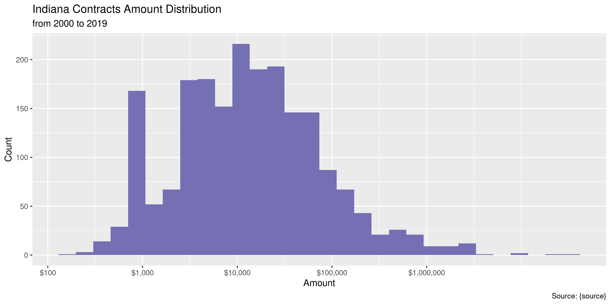
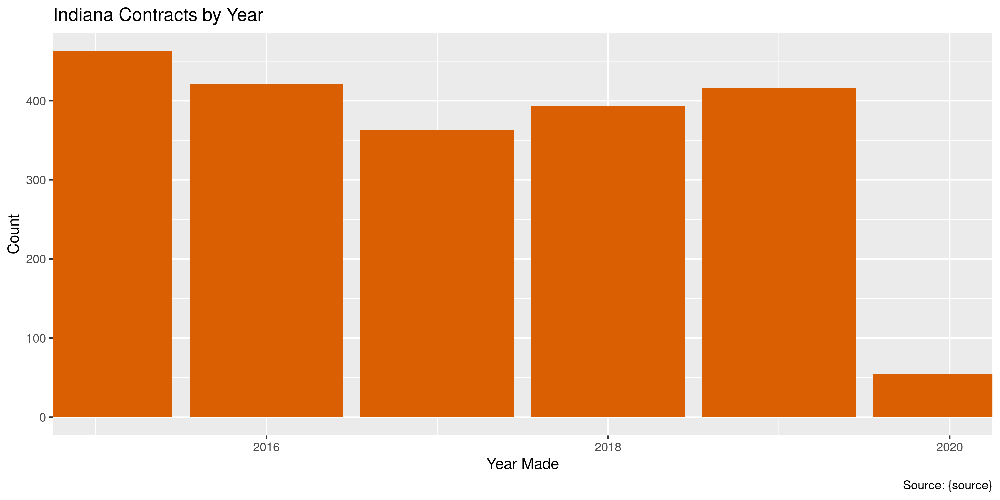

Indiana Contracts
================
Kiernan Nicholls
2020-05-12 13:53:11

  - [Project](#project)
  - [Objectives](#objectives)
  - [Packages](#packages)
  - [Data](#data)
  - [Read](#read)
  - [Explore](#explore)
  - [Wrangle](#wrangle)
  - [Conclude](#conclude)
  - [Export](#export)
  - [Dictionary](#dictionary)

<!-- Place comments regarding knitting here -->

## Project

The Accountability Project is an effort to cut across data silos and
give journalists, policy professionals, activists, and the public at
large a simple way to search across huge volumes of public data about
people and organizations.

Our goal is to standardizing public data on a few key fields by thinking
of each dataset row as a transaction. For each transaction there should
be (at least) 3 variables:

1.  All **parties** to a transaction.
2.  The **date** of the transaction.
3.  The **amount** of money involved.

## Objectives

This document describes the process used to complete the following
objectives:

1.  How many records are in the database?
2.  Check for entirely duplicated records.
3.  Check ranges of continuous variables.
4.  Is there anything blank or missing?
5.  Check for consistency issues.
6.  Create a five-digit ZIP Code called `zip`.
7.  Create a `year` field from the transaction date.
8.  Make sure there is data on both parties to a transaction.

## Packages

The following packages are needed to collect, manipulate, visualize,
analyze, and communicate these results. The `pacman` package will
facilitate their installation and attachment.

The IRW’s `campfin` package will also have to be installed from GitHub.
This package contains functions custom made to help facilitate the
processing of campaign finance data.

``` r
if (!require("pacman")) install.packages("pacman")
pacman::p_load_gh("irworkshop/campfin")
pacman::p_load(
  tidyverse, # data manipulation
  lubridate, # datetime strings
  gluedown, # printing markdown
  magrittr, # pipe operators
  janitor, # clean data frames
  refinr, # cluster and merge
  scales, # format strings
  knitr, # knit documents
  vroom, # read files fast
  rvest, # html scraping
  glue, # combine strings
  here, # relative paths
  httr, # http requests
  fs # local storage 
)
```

This document should be run as part of the `R_campfin` project, which
lives as a sub-directory of the more general, language-agnostic
[`irworkshop/accountability_datacleaning`](https://github.com/irworkshop/accountability_datacleaning)
GitHub repository.

The `R_campfin` project uses the [RStudio
projects](https://support.rstudio.com/hc/en-us/articles/200526207-Using-Projects)
feature and should be run as such. The project also uses the dynamic
`here::here()` tool for file paths relative to *your* machine.

``` r
# where does this document knit?
here::here()
#> [1] "/home/kiernan/Code/accountability_datacleaning/R_campfin"
```

## Data

Contracts can be exported from the [State of Indiana Public Contract
Search](https://fs.gmis.in.gov/psp/guest/SUPPLIER/ERP/c/SOI_CUSTOM_APPS.SOI_PUBLIC_CNTRCTS.GBL)
found on the [Indiana Transparency Portal](https://www.in.gov/itp/). The
portal limits the number of returned search results to 1,000 so queries
must be split from January through June and from July through December.
Search results can then be exported as Microsoft Excel files.

``` r
raw_dir <- dir_create(here("in", "contracts", "data", "raw"))
raw_paths <- dir_ls(raw_dir)
```

## Read

The Excel files can then all be read into a single data frame using the
`readxl::read_excel()` and `purrr::map_df()` functions.

``` r
inc <- map_df(
  .x = dir_ls("~/Downloads/in_contracts/"),
  .f = readxl::read_excel,
  .name_repair = make_clean_names
)
```

The date columns must be parsed after the fact. We can also remove empty
and useless columns.

``` r
inc <- inc %>% 
  mutate(across(ends_with("date"), parse_date, "%m/%d/%Y")) %>% 
  remove_empty("cols") %>% 
  remove_constant()
```

## Explore

``` r
glimpse(inc)
#> Rows: 2,144
#> Columns: 9
#> $ amount      <dbl> 10000.000, 9424.000, 5000.000, 5985.000, NA, 32000.000, 8326.110, 10000.000,…
#> $ contract_id <chr> "B21-15-007", "13459", "A337-15-ISDA-201", "D3-15-9914", "VR1-5-02-15-0X-260…
#> $ amendment   <dbl> NA, NA, NA, NA, NA, NA, NA, NA, NA, NA, NA, NA, NA, NA, NA, NA, NA, NA, NA, …
#> $ action_type <chr> "New", "New", NA, "New", "New", "New", "New", NA, "New", "New", NA, "New", N…
#> $ start_date  <date> 2015-01-01, 2015-03-24, 2015-03-01, 2015-04-05, 2015-01-01, 2015-03-09, 201…
#> $ end_date    <date> 2015-06-30, 2015-05-04, 2015-06-30, 2015-04-25, 2015-06-30, 2015-03-11, 201…
#> $ agency      <chr> "IN School f/t Deaf/Administrat", "DNR, F & W LaSalle 8LS", "State Departmen…
#> $ vendor_name <chr> "ADMINISTRATION SERVING THE DEAF", "AFFORDABLE GARAGE DOOR INC", "AGRIINSTIT…
#> $ zip_code    <chr> "32085", "46356", "46122", "46703", "46825", "46206", "46366", "47306", "462…
tail(inc)
#> # A tibble: 6 x 9
#>    amount contract_id  amendment action_type start_date end_date   agency    vendor_name   zip_code
#>     <dbl> <chr>            <dbl> <chr>       <date>     <date>     <chr>     <chr>         <chr>   
#> 1 155680  40109                2 Amendment   2020-01-08 2020-01-18 INDOT - … STRAND ASSOC… 53715   
#> 2   6000  40990               NA New         2020-04-14 2020-04-16 Indiana … STROBEL EDUC… 47586   
#> 3  35000  40338               NA New         2020-03-16 2020-03-18 IDOH, N … SWVP INDY LLC 46204   
#> 4  22642. A249-14-320…        NA New         2104-04-15 2015-04-15 INDOT - … TIME WARNER … 60132   
#> 5  55952  41092               NA New         2020-02-20 2020-05-07 INDOT - … ULTRA INC     53225   
#> 6 405909. D20-7-2066           5 Amendment   2020-03-31 2010-09-30 IOT Cont… UNISYS CORPO… 46069
```

### Missing

``` r
col_stats(inc, count_na)
#> # A tibble: 9 x 4
#>   col         class      n      p
#>   <chr>       <chr>  <int>  <dbl>
#> 1 amount      <dbl>     58 0.0271
#> 2 contract_id <chr>      0 0     
#> 3 amendment   <dbl>   2002 0.934 
#> 4 action_type <chr>    426 0.199 
#> 5 start_date  <date>     0 0     
#> 6 end_date    <date>     0 0     
#> 7 agency      <chr>      0 0     
#> 8 vendor_name <chr>      0 0     
#> 9 zip_code    <chr>      0 0
```

``` r
inc <- inc %>% flag_na(start_date, agency, amount, vendor_name)
sum(inc$na_flag)
#> [1] 58
```

``` r
inc %>% 
  filter(na_flag) %>% 
  select(start_date, agency, amount, vendor_name)
#> # A tibble: 58 x 4
#>    start_date agency                         amount vendor_name                   
#>    <date>     <chr>                           <dbl> <chr>                         
#>  1 2015-01-01 FSSA, DDARS, DIRECTORS OFFICE      NA ARC OF NORTHEAST INDIANA INC  
#>  2 2015-01-05 2 N. MERIDIAN - 2ND FL/SELIG/L     NA CHRISTEL HOUSE ACADEMY        
#>  3 2015-04-30 INDOT - Contract Administratio     NA CITY OF TERRE HAUTE           
#>  4 2015-04-01 2 N. MERIDIAN - 2ND FL/SELIG/L     NA EVANSVILLE CHRISTIAN LIFE CTR 
#>  5 2015-04-01 2 N. MERIDIAN - 1ST FL-STREET      NA NEW HOPE SERVICES INC         
#>  6 2015-03-13 INDOT - Contract Administratio     NA PIKE COUNTY                   
#>  7 2015-04-01 DNR, F & W Operations 8AE          NA PURDUE UNIV                   
#>  8 2015-05-01 IDOA/Procurement                   NA SPEAR CORPORATION             
#>  9 2015-04-01 2 N. MERIDIAN - 2ND FL/SELIG/L     NA ST VINCENT FRANKFORT HOSP, INC
#> 10 2015-07-07 INDOT - Contract Administratio     NA AMERICAN ELECTRIC POWER       
#> # … with 48 more rows
```

### Duplicates

``` r
inc <- flag_dupes(inc, everything())
sum(inc$dupe_flag)
#> [1] 75
```

``` r
inc %>% 
  filter(dupe_flag) %>% 
  select(start_date, agency, amount, vendor_name)
#> # A tibble: 75 x 4
#>    start_date agency                             amount vendor_name                  
#>    <date>     <chr>                               <dbl> <chr>                        
#>  1 2027-01-01 "FSSA-Claims Management"          622032  CENTER FOR MENTAL HEALTH INC 
#>  2 2015-11-19 "DNR, Land Acquisition 160"         2500  DAVID F WAGNER               
#>  3 2015-12-26 "SDA\\ ISDA Business Office"         975  DENNIS LAMBRIGHT             
#>  4 2015-07-01 "DOC, Central Office IGCS"       1205400  MADISON COUNTY               
#>  5 2016-02-17 "IN School f/t Deaf/Administrat"   81000  R E DIMOND AND ASSOC INC     
#>  6 2015-10-01 "Traffic Safety"                    1010. SOUTHERN INDIANA PHYSICIANS  
#>  7 2049-07-01 "INDOT - Contract Administratio" 3192500  ST JOSEPH COUNTY             
#>  8 2015-12-08 "DNR, Land Acquisition 160"       837695. THE NATURE CONSERVANCY       
#>  9 2104-04-15 "INDOT - Contract Administratio"   22642. TIME WARNER CABLE MEDIA SALES
#> 10 2020-03-31 "IOT Contracts"                   405909. UNISYS CORPORATION           
#> # … with 65 more rows
```

### Categorical

``` r
col_stats(inc, n_distinct)
#> # A tibble: 11 x 4
#>    col         class      n        p
#>    <chr>       <chr>  <int>    <dbl>
#>  1 amount      <dbl>   1265 0.590   
#>  2 contract_id <chr>   2015 0.940   
#>  3 amendment   <dbl>     12 0.00560 
#>  4 action_type <chr>      4 0.00187 
#>  5 start_date  <date>   655 0.306   
#>  6 end_date    <date>   547 0.255   
#>  7 agency      <chr>    234 0.109   
#>  8 vendor_name <chr>   1269 0.592   
#>  9 zip_code    <chr>    671 0.313   
#> 10 na_flag     <lgl>      2 0.000933
#> 11 dupe_flag   <lgl>      2 0.000933
add_prop(count(inc, action_type, sort = TRUE))
#> # A tibble: 4 x 3
#>   action_type     n        p
#>   <chr>       <int>    <dbl>
#> 1 New          1577 0.736   
#> 2 <NA>          426 0.199   
#> 3 Amendment     140 0.0653  
#> 4 Renewal         1 0.000466
```

### Continuous

#### Amounts

``` r
noquote(map_chr(summary(inc$amount), dollar))
#>        Min.     1st Qu.      Median        Mean     3rd Qu.        Max.        NA's 
#>    -$41,206      $3,500     $11,243    $110,296     $38,033 $31,779,128         $58
mean(inc$amount <= 0)
#> [1] NA
```

<!-- -->

#### Dates

We can add the calendar year from `date` with `lubridate::year()`

``` r
inc <- mutate(inc, start_year = year(start_date))
```

``` r
min(inc$start_date)
#> [1] "2015-01-01"
sum(inc$start_year < 2000)
#> [1] 0
max(inc$start_date)
#> [1] "2104-04-15"
sum(inc$start_date > today())
#> [1] 33
```

``` r
add_prop(count(inc, start_year))
#> # A tibble: 9 x 3
#>   start_year     n       p
#>        <dbl> <int>   <dbl>
#> 1       2015   463 0.216  
#> 2       2016   421 0.196  
#> 3       2017   363 0.169  
#> 4       2018   393 0.183  
#> 5       2019   416 0.194  
#> 6       2020    55 0.0257 
#> 7       2027    11 0.00513
#> 8       2049    11 0.00513
#> 9       2104    11 0.00513
```

<!-- -->

## Wrangle

The only geographic variable in need of cleaning is the ZIP code which
contains a handful of ZIP+4 codes, which we can trim to create 5-digit
ZIP codes.

``` r
inc <- mutate(inc, across(zip_code, normal_zip))
prop_in(inc$zip_code, valid_zip)
#> [1] 0.9986007
```

## Conclude

1.  There are 2,144 records in the database.
2.  There are 75 duplicate records in the database.
3.  The range and distribution of `amount` and `date` seem reasonable.
4.  There are 58 records missing key variables.
5.  Consistency in geographic data has been improved with
    `campfin::normal_*()`.
6.  The 4-digit `start_year` variable has been created with
    `lubridate::year()`.

## Export

Now the file can be saved on disk for upload to the Accountability
server.

``` r
clean_dir <- dir_create(here("in", "contracts", "data", "clean"))
clean_path <- path(clean_dir, "in_contracts_clean.csv")
write_csv(inc, clean_path, na = "")
file_size(clean_path)
#> 240K
mutate(file_encoding(clean_path), across(path, basename))
#> # A tibble: 1 x 3
#>   path                   mime            charset 
#>   <chr>                  <chr>           <chr>   
#> 1 in_contracts_clean.csv application/csv us-ascii
```

## Dictionary

The following table describes the variables in our final exported file:

| Column        | Type        | Definition                                     |
| :------------ | :---------- | :--------------------------------------------- |
| `amount`      | `double`    | Contract amount                                |
| `contract_id` | `character` | Unique contract ID                             |
| `amendment`   | `double`    | Contract amendment number                      |
| `action_type` | `character` | Contract action type (New, Amendment, Renewal) |
| `start_date`  | `double`    | Contract start date                            |
| `end_date`    | `double`    | Contract end date                              |
| `agency`      | `character` | Spending agency name                           |
| `vendor_name` | `character` | Recieving vendor name                          |
| `zip_code`    | `character` | Vendor 5-digit ZIP code                        |
| `na_flag`     | `logical`   | Flag for missing date, amount, or name         |
| `dupe_flag`   | `logical`   | Flag for completely duplicated record          |
| `start_year`  | `double`    | Calendar year contract started                 |

``` r
write_lines(
  x = c("# Indiana Contracts Data Dictionary\n", dict_md),
  path = here("in", "contracts", "in_contracts_dict.md"),
)
```
