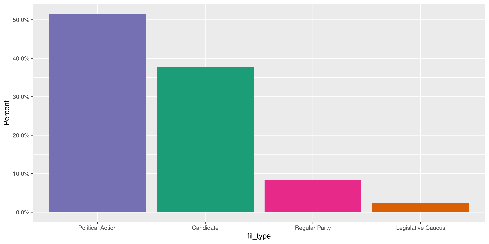
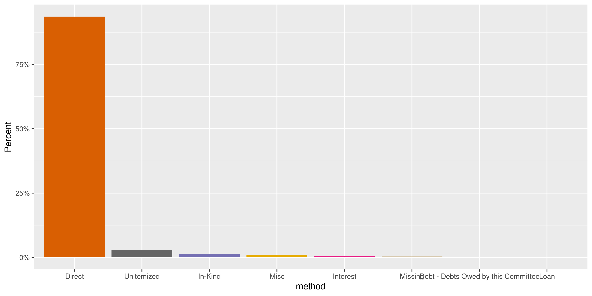
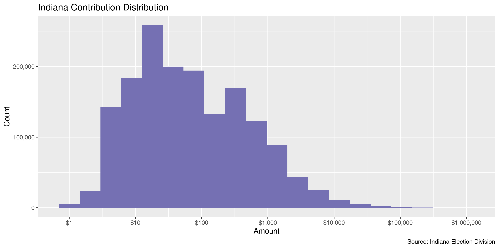
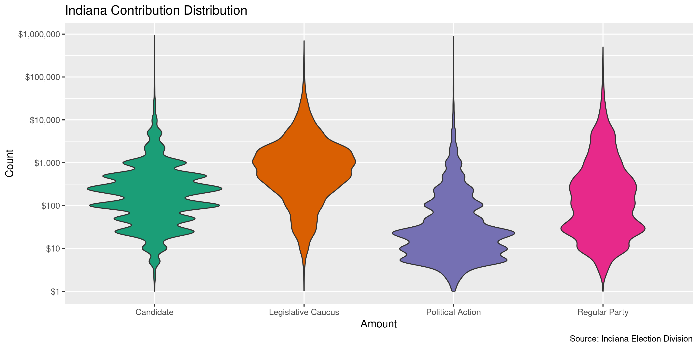
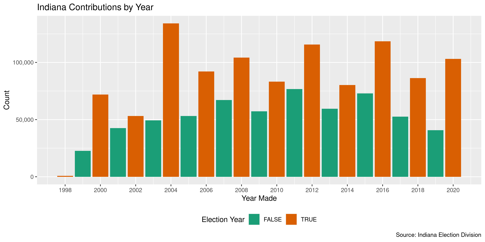
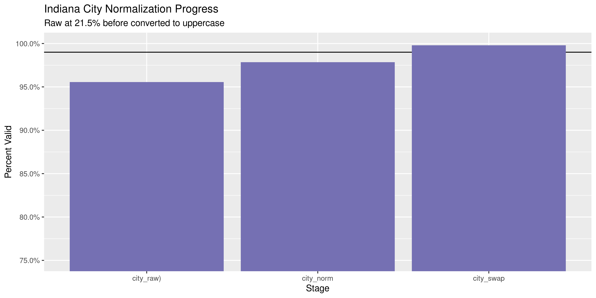
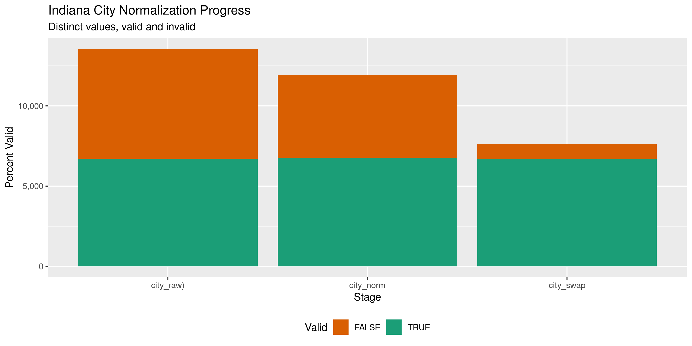

Indiana Contributions
================
Kiernan Nicholls
2022-11-19 20:19:54

-   <a href="#project" id="toc-project">Project</a>
-   <a href="#objectives" id="toc-objectives">Objectives</a>
-   <a href="#packages" id="toc-packages">Packages</a>
-   <a href="#data" id="toc-data">Data</a>
-   <a href="#import" id="toc-import">Import</a>
-   <a href="#explore" id="toc-explore">Explore</a>
-   <a href="#wrangle" id="toc-wrangle">Wrangle</a>
-   <a href="#conclude" id="toc-conclude">Conclude</a>
-   <a href="#export" id="toc-export">Export</a>
-   <a href="#upload" id="toc-upload">Upload</a>
-   <a href="#dictionary" id="toc-dictionary">Dictionary</a>

<!-- Place comments regarding knitting here -->

## Project

The Accountability Project is an effort to cut across data silos and
give journalists, policy professionals, activists, and the public at
large a simple way to search across huge volumes of public data about
people and organizations.

Our goal is to standardizing public data on a few key fields by thinking
of each dataset row as a transaction. For each transaction there should
be (at least) 3 variables:

1.  All **parties** to a transaction.
2.  The **date** of the transaction.
3.  The **amount** of money involved.

## Objectives

This document describes the process used to complete the following
objectives:

1.  How many records are in the database?
2.  Check for entirely duplicated records.
3.  Check ranges of continuous variables.
4.  Is there anything blank or missing?
5.  Check for consistency issues.
6.  Create a five-digit ZIP Code called `zip`.
7.  Create a `year` field from the transaction date.
8.  Make sure there is data on both parties to a transaction.

## Packages

The following packages are needed to collect, manipulate, visualize,
analyze, and communicate these results. The `pacman` package will
facilitate their installation and attachment.

The IRW’s `campfin` package will also have to be installed from GitHub.
This package contains functions custom made to help facilitate the
processing of campaign finance data.

``` r
if (!require("pacman")) install.packages("pacman")
pacman::p_load_gh("irworkshop/campfin")
pacman::p_load(
  tidyverse, # data manipulation
  lubridate, # datetime strings
  magrittr, # pipe operators
  gluedown, # print markdown
  janitor, # dataframe clean
  refinr, # cluster and merge
  aws.s3, # aws cloud storage
  scales, # format strings
  rvest, # read html pages
  knitr, # knit documents
  vroom, # read files fast
  glue, # combine strings
  here, # relative storage
  fs # search storage 
)
```

This document should be run as part of the `R_campfin` project, which
lives as a sub-directory of the more general, language-agnostic
[`irworkshop/accountability_datacleaning`](https://github.com/irworkshop/accountability_datacleaning)
GitHub repository.

The `R_campfin` project uses the [RStudio
projects](https://support.rstudio.com/hc/en-us/articles/200526207-Using-Projects)
feature and should be run as such. The project also uses the dynamic
`here::here()` tool for file paths relative to *your* machine.

``` r
# where does this document knit?
here::here()
#> [1] "/Users/yanqixu/code/accountability_datacleaning"
```

## Data

Data is obtained from the [Indiana Election
Division](https://campaignfinance.in.gov/PublicSite/Homepage.aspx).

> ##### What is the quality of the data?
>
> The information presented in the campaign finance database is, to the
> best of our ability, an accurate representation of the reports filed
> with the Election Division. This information is being provided as a
> service to the public, has been processed by the Election Division and
> should be cross-referenced with the original report on file with the
> Election Division.
>
> Some of the information in the campaign finance database was submitted
> in electronic form. Most of the information was key-entered from paper
> reports. Sometimes items which are inconsistent with filing
> requirements, such as incorrect codes or incorrectly formatted or
> blank items, are present in the results of a query. They are incorrect
> or missing in the database because they were incorrect or missing on
> the reports submitted to the Election Division. For some incorrect or
> missing data in campaign finance reports, the Election Division has
> requested that the filer supply an amended report. The campaign
> finance database will be updated to reflect amendments received.

> ##### What does the database contain?
>
> By Indiana law, candidates and committees are required to disclose
> detailed financial records of contributions received and expenditures
> made and debts owed by or to the committee. For committees, the
> campaign finance database contains all contributions, expenditures,
> and debts reported to the Election Division since January 1, 1998.

## Import

The IED provides annual files for both campaign contributions and
expenditures.

> This page provides comma separated value (CSV) downloads of
> contribution and expenditure data for each reporting year in a zipped
> file format. These files can be downloaded and imported into other
> applications (Microsoft Excel, Microsoft Access, etc.).
>
> This data was extracted from the Campaign Finance database as it
> existed as of 2/4/2020 1:00 AM.

### Download

We can read the [IED download
page](https://campaignfinance.in.gov/PublicSite/Reporting/DataDownload.aspx)
to get the list of URLs to each file.

``` r
raw_dir <- dir_create(here("state","in", "contribs", "data", "raw"))
prev_dir <- dir_create(here("state","in", "contribs", "data", "previous"))
```

``` r
# aspx <- "https://campaignfinance.in.gov/PublicSite/Reporting/DataDownload.aspx"
# raw_urls <- aspx %>% 
#   read_html() %>% 
#   html_node("#_ctl0_Content_dlstDownloadFiles") %>% 
#   html_nodes("a") %>% 
#   html_attr("href") %>% 
#   str_subset("Contribution") %>% 
#   str_replace("\\\\", "/")
# 
# md_bullet(raw_urls)
```

``` r
raw_urls <- glue("https://campaignfinance.in.gov/PublicSite/Docs/BulkDataDownloads/{2020:2022}_ContributionData.csv.zip")
```

We can download each of these files to the raw directory.

``` r
raw_paths <- path(raw_dir, basename(raw_urls))
if (!all(this_file_new(raw_paths))) {
  download.file(raw_urls, raw_paths, method = "libcurl")
}
```

Then, we will unzip each file and delete the original.

``` r
if (length(dir_ls(raw_dir, regexp = ".csv$")) == 0) {
  raw_paths <- as_fs_path(map_chr(raw_paths, unzip, exdir = raw_dir))
} else {
  raw_paths <- dir_ls(raw_dir, regexp = ".csv$")
}
```

### Read

There are two problems with each of these files: 1. When the second line
of an address was entered, a `\n` newline character was entered between
the two lines *within the same field*. The fields are surrounded in
double-quotes, but when reading the files these newlines mess things up.
2. Whenever a string itself contains `"` double-quotes, the first
occurrence is registered as the end of the field itself, which begun
with a `"`.

To fix these issues, we will read each file as a single character string
and use regular expressions to find and replace these errant `\n` and
`"` characters. We will then write the edited strings to a new file.

``` r
fix_dir <- dir_create(here("state","in", "contribs", "data", "fix"))
if (!any(file_exists(dir_ls(fix_dir)))) {
  for (f in raw_paths) {
    x <- read_file(f)
    # find newlines not at end of line
    x <- str_replace_all(x, "(?<!\"(\r|1|0)\")\n(?!\"\\d{1,10}\")", " ")
    # find quotes not at end of field
    x <- str_replace_all(x, "(?<!(\n|^|,))\"(?!(,(?=\"))|$|\r)", "\'")
    x <- str_trim(x, side = "both")
    # save to disk
    write_file(x, path = path(fix_dir, basename(f)))
    rm(x); flush_memory(1)
  }
}
```

``` r
fix_paths <- dir_ls(fix_dir)
```

These fixed files can be read into a single data frame with
`purrr::map_df()` and `readr::read_delim()`.

``` r
# 1,642,006
inc <- map_df(
  .x = fix_paths,
  .f = read_delim,
  delim = ",",
  quote = "\"",
  na = c("", "n/a", "NA", "N/A"),
  escape_backslash = FALSE,
  escape_double = FALSE,
  col_types = cols(
    .default = col_character(),
    FileNumber = col_integer(),
    Amount = col_double(),
    ContributionDate = col_datetime(),
    Amended = col_logical()
  )
)
```

``` r
inc <- inc %>% 
  clean_names("snake") %>% 
  rename(
    file = file_number,
    candiate = candidate_name,
    fil_type = committee_type,
    fil_name = received_by,
    con_type = contributor_type,
    date = contribution_date,
    method = type
  )
```

## Explore

``` r
glimpse(inc)
#> Rows: 301,548
#> Columns: 17
#> $ file        <int> 4492, 4669, 5904, 3970, 403, 403, 403, 403, 403, 7041, 7264, 5419, 5419, 5419…
#> $ fil_type    <chr> "Candidate", "Candidate", "Candidate", "Candidate", "Political Action", "Poli…
#> $ committee   <chr> "Hoosiers for Holcomb", "Friends of Mayor Fernandez", "Friends of Musgrave", …
#> $ candiate    <chr> "ERIC JOSEPH HOLCOMB", "John R. Fernandez", "Cheryl AW Musgrave", "THOMAS EUG…
#> $ con_type    <chr> NA, NA, NA, NA, NA, NA, NA, NA, NA, NA, NA, NA, NA, NA, NA, NA, NA, NA, NA, N…
#> $ name        <chr> "Adrian Coonce", "Andy O'Leary", "Mike and Laurie Schopmeyer", "HARY R & FRAN…
#> $ address     <chr> "13035 E. Coonce Rd", "5035 N. Kenwood Ave.", "862 S Lombard Ave", "5501 N. K…
#> $ city        <chr> "Monroe City", "Indianapolis", "Evansville", "INDIANAPOLIS", "Muncie", "Colum…
#> $ state       <chr> "IN", "IN", "IN", "IN", "IN", "OH", "IN", "IN", "IN", "IN", "IN", "IN", "IN",…
#> $ zip         <chr> "57557", "46208", "47714", "46208", "47304", "43215", "46319", "46268", "4632…
#> $ occupation  <chr> NA, NA, NA, NA, "Manufacturing", NA, NA, NA, NA, "Other", "Science/Technology…
#> $ method      <chr> "Direct", "Misc", "Direct", "Direct", "Direct", "Direct", "Direct", "Direct",…
#> $ description <chr> NA, NA, NA, NA, NA, NA, NA, NA, NA, NA, NA, NA, NA, NA, NA, "Monthly PAC Coll…
#> $ amount      <dbl> 25.00, 75.00, 150.00, 150.00, 10000.00, 1000.00, 100.00, 30.00, 100.00, 500.0…
#> $ date        <dttm> 2020-09-10, 2020-08-15, 2020-03-25, 2020-06-28, 2020-01-02, 2020-01-02, 2020…
#> $ fil_name    <chr> "tjb", "Mike Harmless", "Candidate", "CSS", "Malika Butler", "Malika Butler",…
#> $ amended     <lgl> FALSE, FALSE, TRUE, TRUE, FALSE, FALSE, FALSE, FALSE, FALSE, FALSE, FALSE, FA…
tail(inc)
#> # A tibble: 6 × 17
#>    file fil_type     commi…¹ candi…² con_t…³ name  address city  state zip   occup…⁴ method descr…⁵
#>   <int> <chr>        <chr>   <chr>   <chr>   <chr> <chr>   <chr> <chr> <chr> <chr>   <chr>  <chr>  
#> 1  7757 Political A… Our Ch… <NA>    Indivi… Patr… 7303 N… Indi… IN    46250 Unknown Direct <NA>   
#> 2  7757 Political A… Our Ch… <NA>    Indivi… Pete… 8269 N… Indi… IN    46240 Unknown Direct <NA>   
#> 3  7757 Political A… Our Ch… <NA>    Indivi… Sall… 4166 C… Indi… IN    46205 Unknown Direct <NA>   
#> 4  7757 Political A… Our Ch… <NA>    Indivi… Susa… 10848 … Fish… IN    46037 Unknown Direct <NA>   
#> 5  7757 Political A… Our Ch… <NA>    Indivi… Suza… 7525 G… Indi… IN    46240 Unknown Direct <NA>   
#> 6  7757 Political A… Our Ch… <NA>    Indivi… Trac… 7899 R… Indi… IN    46240 Unknown Direct <NA>   
#> # … with 4 more variables: amount <dbl>, date <dttm>, fil_name <chr>, amended <lgl>, and
#> #   abbreviated variable names ¹​committee, ²​candiate, ³​con_type, ⁴​occupation, ⁵​description
```

``` r
inc_prev <- read_csv(dir_ls(prev_dir))

inc_prev <- inc_prev %>% select(names(inc))  
```

``` r
inc <- anti_join(inc, inc_prev)
```

### Missing

``` r
col_stats(inc, count_na)
#> # A tibble: 17 × 4
#>    col         class       n      p
#>    <chr>       <chr>   <int>  <dbl>
#>  1 file        <int>       0 0     
#>  2 fil_type    <chr>       0 0     
#>  3 committee   <chr>       0 0     
#>  4 candiate    <chr>  145263 0.714 
#>  5 con_type    <chr>  117933 0.580 
#>  6 name        <chr>   17479 0.0859
#>  7 address     <chr>   20331 0.100 
#>  8 city        <chr>   20215 0.0994
#>  9 state       <chr>   18394 0.0904
#> 10 zip         <chr>   22784 0.112 
#> 11 occupation  <chr>  111211 0.547 
#> 12 method      <chr>       0 0     
#> 13 description <chr>  181055 0.890 
#> 14 amount      <dbl>       0 0     
#> 15 date        <dttm>      0 0     
#> 16 fil_name    <chr>    4233 0.0208
#> 17 amended     <lgl>       0 0
```

``` r
key_vars <- c("committee", "name", "amount", "date")
inc <- flag_na(inc, all_of(key_vars))
mean(inc$na_flag)
#> [1] 0.0859299
```

``` r
inc %>% 
  filter(na_flag) %>% 
  select(all_of(key_vars)) %>% 
  sample_n(10)
#> # A tibble: 10 × 4
#>    committee                                                       name  amount date               
#>    <chr>                                                           <chr>  <dbl> <dttm>             
#>  1 Laborers International Union of North America State of Indiana… <NA>    6.21 2021-12-16 00:00:00
#>  2 Laborers International Union of North America State of Indiana… <NA>   40.0  2021-12-09 00:00:00
#>  3 Indiana Democratic State Central Committee                      <NA>  -10    2020-09-28 00:00:00
#>  4 Laborers International Union of North America State of Indiana… <NA>    5.38 2021-12-02 00:00:00
#>  5 Indiana Democratic State Central Committee                      <NA>   50    2020-09-05 00:00:00
#>  6 Marion County Democratic Central Committee                      <NA>   30    2021-01-22 00:00:00
#>  7 Marion County Democratic Central Committee                      <NA>  100    2020-11-05 00:00:00
#>  8 Ingalls for Indiana                                             <NA>   20    2022-03-14 00:00:00
#>  9 Marion County Democratic Central Committee                      <NA>   20    2021-12-15 00:00:00
#> 10 Myers for Governor                                              <NA>   26.0  2020-10-28 00:00:00
```

### Duplicates

``` r
inc <- flag_dupes(inc, everything())
mean(inc$dupe_flag)
#> [1] 0.03911312
```

``` r
inc %>% 
  filter(dupe_flag) %>% 
  select(all_of(key_vars)) %>% 
  arrange(date, name)
#> # A tibble: 7,956 × 4
#>    committee                                         name            amount date               
#>    <chr>                                             <chr>            <dbl> <dttm>             
#>  1 Indiana American Water Political Action Committee Douglas A Brock    100 2020-03-31 00:00:00
#>  2 Indiana American Water Political Action Committee Douglas A Brock    100 2020-03-31 00:00:00
#>  3 Citizens For Mike Andrade                         <NA>                50 2020-04-08 00:00:00
#>  4 Citizens For Mike Andrade                         <NA>                50 2020-04-08 00:00:00
#>  5 Citizens For Mike Andrade                         <NA>               -50 2020-04-08 00:00:00
#>  6 Citizens For Mike Andrade                         <NA>               -50 2020-04-08 00:00:00
#>  7 Citizens For Mike Andrade                         <NA>                20 2020-05-02 00:00:00
#>  8 Citizens For Mike Andrade                         <NA>                20 2020-05-02 00:00:00
#>  9 Citizens For Mike Andrade                         <NA>               -20 2020-05-02 00:00:00
#> 10 Citizens For Mike Andrade                         <NA>               -20 2020-05-02 00:00:00
#> # … with 7,946 more rows
```

### Categorical

``` r
col_stats(inc, n_distinct)
#> # A tibble: 19 × 4
#>    col         class      n          p
#>    <chr>       <chr>  <int>      <dbl>
#>  1 file        <int>    912 0.00448   
#>  2 fil_type    <chr>      4 0.0000197 
#>  3 committee   <chr>    926 0.00455   
#>  4 candiate    <chr>    487 0.00239   
#>  5 con_type    <chr>     12 0.0000590 
#>  6 name        <chr>  59893 0.294     
#>  7 address     <chr>  60196 0.296     
#>  8 city        <chr>   4957 0.0244    
#>  9 state       <chr>    116 0.000570  
#> 10 zip         <chr>   5491 0.0270    
#> 11 occupation  <chr>     33 0.000162  
#> 12 method      <chr>     10 0.0000492 
#> 13 description <chr>   3357 0.0165    
#> 14 amount      <dbl>  11254 0.0553    
#> 15 date        <dttm>  3753 0.0185    
#> 16 fil_name    <chr>   1358 0.00668   
#> 17 amended     <lgl>      2 0.00000983
#> 18 na_flag     <lgl>      2 0.00000983
#> 19 dupe_flag   <lgl>      2 0.00000983
```

<!-- --><!-- --><!-- -->

### Continuous

#### Amounts

``` r
summary(inc$amount)
#>      Min.   1st Qu.    Median      Mean   3rd Qu.      Max. 
#> -289898.1      11.7      35.0     558.9     200.0  700000.0
mean(inc$amount <= 0)
#> [1] 0.01653803
```

<!-- -->

<!-- -->

#### Dates

``` r
inc <- mutate(
  .data = inc,
  date = as_date(date),
  year = year(date),
  year = case_when(
    year < 1998 ~ 1998,
    year > 2022 ~ 2022,
    year %>% between(1998, 2022) ~ year
  )
)
```

``` r
inc %>% 
  count(year) %>% 
  filter(!is.na(year)) %>% 
  mutate(even = is_even(year)) %>% 
  ggplot(aes(x = year, y = n)) +
  geom_col(aes(fill = even)) + 
  scale_fill_brewer(palette = "Dark2") +
  scale_y_continuous(labels = comma) +
  scale_x_continuous(breaks = seq(2020, 2022, by = 1)) +
  theme(legend.position = "bottom") +
  labs(
    title = "Indiana Contributions by Year",
    caption = "Source: Indiana Election Division",
    fill = "Election Year",
    x = "Year Made",
    y = "Count"
  )
```

<!-- -->

## Wrangle

To improve the searchability of the database, we will perform some
consistent, confident string normalization. For geographic variables
like city names and ZIP codes, the corresponding `campfin::normal_*()`
functions are taylor made to facilitate this process.

### Address

For the street `addresss` variable, the `campfin::normal_address()`
function will force consistence case, remove punctuation, and
abbreviation official USPS suffixes.

``` r
inc <- inc %>%
  mutate(
    address_norm = normal_address(
      address = address,
      abbs = usps_street,
      na_rep = TRUE
    )
  )
```

We can see how this process improved consistency.

``` r
inc %>% 
  select(contains("address")) %>% 
  distinct() %>% 
  sample_n(10)
#> # A tibble: 10 × 2
#>    address                       address_norm           
#>    <chr>                         <chr>                  
#>  1 "200 E Main St Suite 910"     200 E MAIN ST SUITE 910
#>  2 "8845 E 16th Pl"              8845 E 16TH PL         
#>  3 "2003 W THERLOW DR"           2003 W THERLOW DR      
#>  4 "713 Spencerville Rd"         713 SPENCERVILLE RD    
#>  5 "2971 MARGARITA AVE"          2971 MARGARITA AVE     
#>  6 "PO BOX 1132"                 PO BOX 1132            
#>  7 "2701 S. 1200 E"              2701 S 1200 E          
#>  8 "4719 Bluffwood Drive North " 4719 BLUFFWOOD DRIVE N 
#>  9 "8473 LA HABRA LANE"          8473 LA HABRA LN       
#> 10 "5501 N. Vista View Drive"    5501 N VISTA VIEW DR
```

### ZIP

For ZIP codes, the `campfin::normal_zip()` function will attempt to
create valid *five* digit codes by removing the ZIP+4 suffix and
returning leading zeroes dropped by other programs like Microsoft Excel.

``` r
inc <- inc %>% 
  mutate(
    zip_norm = normal_zip(
      zip = zip,
      na_rep = TRUE
    )
  )
```

``` r
progress_table(
  inc$zip,
  inc$zip_norm,
  compare = valid_zip
)
#> # A tibble: 2 × 6
#>   stage        prop_in n_distinct prop_na n_out n_diff
#>   <chr>          <dbl>      <dbl>   <dbl> <dbl>  <dbl>
#> 1 inc$zip        0.986       5491   0.112  2518    987
#> 2 inc$zip_norm   0.996       4933   0.113   691    402
```

### State

Valid two digit state abbreviations can be made using the
`campfin::normal_state()` function.

``` r
inc <- inc %>% 
  mutate(
    state_norm = normal_state(
      state = state,
      abbreviate = TRUE,
      na_rep = TRUE,
      valid = NULL
    )
  )
```

``` r
inc %>% 
  filter(state != state_norm) %>% 
  count(state, state_norm, sort = TRUE)
#> # A tibble: 43 × 3
#>    state state_norm     n
#>    <chr> <chr>      <int>
#>  1 In    IN           339
#>  2 Un    UN           177
#>  3 in    IN            93
#>  4 Oh    OH            24
#>  5 Il    IL            13
#>  6 ky    KY            10
#>  7 Ma    MA            10
#>  8 oh    OH             9
#>  9 Fl    FL             7
#> 10 Mi    MI             7
#> # … with 33 more rows
```

We can further improve these values by checking the state abbreviation
against the *expected* abbreviation for that record’s `zip_norm`
variable. If the invalid abbreviation is only 1 letter off the expected
value, we can confidently repair these typos.

``` r
inc <- inc %>% 
  left_join(
    y = select(zipcodes, -city), 
    by = c("zip_norm" = "zip"),
    suffix = c("_raw", "_match")
  ) %>% 
  mutate(
    match_dist = str_dist(state_raw, state_match),
    state_norm = if_else(
      condition = !is.na(state_match) & match_dist == 1,
      true = state_match,
      false = state_norm
    )
  ) %>% 
  rename(state = state_raw)

inc %>% 
  filter(match_dist == 1) %>% 
  count(state, state_norm, sort = TRUE)
#> # A tibble: 56 × 3
#>    state state_norm     n
#>    <chr> <chr>      <int>
#>  1 In    IN           334
#>  2 IN    IL            83
#>  3 IL    IN            61
#>  4 Oh    OH            24
#>  5 N     IN            18
#>  6 D.    DC            13
#>  7 Il    IL            12
#>  8 Ma    MA             9
#>  9 Fl    FL             5
#> 10 ID    IN             5
#> # … with 46 more rows
```

``` r
progress_table(
  inc$state,
  inc$state_norm,
  compare = valid_state
)
#> # A tibble: 2 × 6
#>   stage          prop_in n_distinct prop_na n_out n_diff
#>   <chr>            <dbl>      <dbl>   <dbl> <dbl>  <dbl>
#> 1 inc$state        0.996        116  0.0904   823     63
#> 2 inc$state_norm   0.999         60  0.0905   184      6
```

### City

Cities are the most difficult geographic variable to normalize, simply
due to the wide variety of valid cities and formats. The
`campfin::normal_city()` function is a good start, again converting
case, removing punctuation, but *expanding* USPS abbreviations. We can
also remove `invalid_city` values.

``` r
inc <- inc %>% 
  mutate(
    city_norm = normal_city(
      city = city, 
      abbs = usps_city,
      states = c("IN", "DC", "INDIANA"),
      na = invalid_city,
      na_rep = TRUE
    )
  )
```

Again, we can further improve normalization by comparing our normalized
value agaist the *expected* value for that record’s state abbreviation
and ZIP code. If the normalized value is either an abbreviation for or
very similar to the expected value, we can confidently swap those two.

``` r
inc <- inc %>% 
  rename(city_raw = city) %>% 
  left_join(
    y = zipcodes,
    by = c(
      "state_norm" = "state",
      "zip_norm" = "zip"
    )
  ) %>% 
  rename(city_match = city) %>% 
  mutate(
    match_abb = is_abbrev(city_norm, city_match),
    match_dist = str_dist(city_norm, city_match),
    city_swap = if_else(
      condition = !is.na(city_match) & match_abb | match_dist <= 2,
      true = city_match,
      false = city_norm
    )
  ) %>% 
  select(
    -city_match,
    -match_dist,
    -match_abb
  )
```

``` r
many_city <- c(valid_city, extra_city)
inc %>% 
  count(city_swap, state_norm, sort = TRUE) %>% 
  filter(!is.na(city_swap), city_swap %out% many_city)
#> # A tibble: 95 × 3
#>    city_swap              state_norm     n
#>    <chr>                  <chr>      <int>
#>  1 MICHIANA SHORES        IN            29
#>  2 FARMINGTON HILLS       MI            12
#>  3 MICHIGAN CITTY         IN            12
#>  4 INDY                   IN            11
#>  5 CARNOTMOON             PA             9
#>  6 RESEARCH TRIANGLE PARK NC             9
#>  7 INDPLD                 IN             8
#>  8 FISHERS IN             IN             7
#>  9 BLOOMINGTON IN US      IN             5
#> 10 CARMELCARMEL           IN             5
#> # … with 85 more rows
```

``` r
inc <- inc %>% 
  mutate(
    city_swap = city_swap %>% 
      str_replace("^INDY$", "INDIANAPOLIS") %>% 
      str_replace("^INDPLS$", "INDIANAPOLIS") %>% 
      str_replace("^ABBOTT PARKS$", "ABBOTT PARK") %>% 
      str_replace("^OVERLAND PARKS$", "OVERLAND PARK") %>% 
      str_remove("\\sIN$")
  )
```

| stage                                                                      | prop_in | n_distinct | prop_na | n_out | n_diff |
|:---------------------------------------------------------------------------|--------:|-----------:|--------:|------:|-------:|
| str_to_upper(inc$city_raw) | 0.969| 3541| 0.099| 5728| 947| |inc$city_norm |   0.987 |       3230 |   0.103 |  2435 |    623 |
| inc\$city_swap                                                             |   0.999 |       2613 |   0.119 |   212 |     93 |

You can see how the percentage of valid values increased with each
stage.

<!-- -->

More importantly, the number of distinct values decreased each stage. We
were able to confidently change many distinct invalid values to their
valid equivalent.

``` r
progress %>% 
  select(
    stage, 
    all = n_distinct,
    bad = n_diff
  ) %>% 
  mutate(good = all - bad) %>% 
  pivot_longer(c("good", "bad")) %>% 
  mutate(name = name == "good") %>% 
  ggplot(aes(x = stage, y = value)) +
  geom_col(aes(fill = name)) +
  scale_fill_brewer(palette = "Dark2", direction = -1) +
  scale_y_continuous(labels = comma) +
  theme(legend.position = "bottom") +
  labs(
    title = "Indiana City Normalization Progress",
    subtitle = "Distinct values, valid and invalid",
    x = "Stage",
    y = "Percent Valid",
    fill = "Valid"
  )
```

<!-- -->

## Conclude

Before exporting, we can remove the intermediary normalization columns
and rename all added variables with the `_clean` suffix.

``` r
inc <- inc %>% 
  select(
    -city_norm,
    city_clean = city_swap
  ) %>% 
  rename_all(~str_replace(., "_norm", "_clean")) %>% 
  rename_all(~str_remove(., "_raw"))
```

``` r
glimpse(sample_n(inc, 50))
#> Rows: 50
#> Columns: 24
#> $ file          <int> 7455, 790, 3222, 374, 5429, 7532, 3222, 7560, 840, 403, 7651, 3222, 7247, 4…
#> $ fil_type      <chr> "Political Action", "Regular Party", "Political Action", "Legislative Caucu…
#> $ committee     <chr> "David Volkert & Associates, Inc,. PAC", "LIBERTARIAN PARTY OF INDIANA STAT…
#> $ candiate      <chr> NA, NA, NA, NA, NA, "JEFFREY MICHAEL MAURER", NA, "KENDELL CULP", NA, NA, "…
#> $ con_type      <chr> "Individual", "Individual", "Individual", "Other Organization", "Individual…
#> $ name          <chr> "WILLIAM CULBERSON", "Robert Place", "Damon J Glaser", "Solv Energy", "CHRI…
#> $ address       <chr> "675 VANDER OLDHAM RD", "173 Wellington Pkwy", "9040 Warrick County Line Ro…
#> $ city          <chr> "BEAR CREEK", "Noblesville", "Evansville", "San Diego", "NOBLESVILLE", NA, …
#> $ state         <chr> "NC", "IN", "IN", "CA", "IN", NA, "IN", "IN", "IN", NA, "IN", "IN", "IN", N…
#> $ zip           <chr> "27207", "46060", "47725", "92127", "46062", NA, "47720", "47978", "46410",…
#> $ occupation    <chr> "General Business", NA, "Construction/Engineering", NA, "Other", NA, "Const…
#> $ method        <chr> "Direct", "Direct", "Direct", "Direct", "Direct", "Unitemized", "Direct", "…
#> $ description   <chr> "CONTRIBUTION FROM INDIVIDUAL", NA, NA, NA, NA, NA, NA, NA, NA, "Cash for m…
#> $ amount        <dbl> 11.07, 120.00, 10.11, 500.00, 25.00, 501.90, 0.71, 500.00, 100.00, 780.00, …
#> $ date          <date> 2022-09-28, 2022-03-22, 2022-10-13, 2022-10-04, 2022-07-04, 2022-09-26, 20…
#> $ fil_name      <chr> "MICHAEL I SAMPSON", "Michael Schultheiss", "John Bates", "Maren Patterson"…
#> $ amended       <lgl> FALSE, FALSE, FALSE, FALSE, FALSE, FALSE, FALSE, FALSE, FALSE, TRUE, FALSE,…
#> $ na_flag       <lgl> FALSE, FALSE, FALSE, FALSE, FALSE, TRUE, FALSE, FALSE, FALSE, TRUE, FALSE, …
#> $ dupe_flag     <lgl> FALSE, FALSE, FALSE, FALSE, FALSE, FALSE, FALSE, FALSE, FALSE, FALSE, FALSE…
#> $ year          <dbl> 2022, 2022, 2022, 2022, 2022, 2022, 2022, 2022, 2022, 2020, 2022, 2022, 202…
#> $ address_clean <chr> "675 VANDER OLDHAM RD", "173 WELLINGTON PKWY", "9040 WARRICK COUNTY LINE RD…
#> $ zip_clean     <chr> "27207", "46060", "47725", "92127", "46062", NA, "47720", "47978", "46410",…
#> $ state_clean   <chr> "NC", "IN", "IN", "CA", "IN", NA, "IN", "IN", "IN", NA, "IN", "IN", "IN", N…
#> $ city_clean    <chr> "BEAR CREEK", "NOBLESVILLE", "EVANSVILLE", "SAN DIEGO", "NOBLESVILLE", NA, …
```

1.  There are 203,410 records in the database.
2.  There are 7,956 duplicate records in the database.
3.  The range and distribution of `amount` and `date` seem reasonable.
4.  There are 17,479 records missing key variables.
5.  Consistency in geographic data has been improved with
    `campfin::normal_*()`.
6.  The 4-digit `year` variable has been created with
    `lubridate::year()`.

## Export

Now the file can be saved on disk for upload to the Accountability
server.

``` r
clean_dir <- dir_create(here("state","in", "contribs", "data", "clean"))
clean_path <- path(clean_dir, "in_contribs_clean_2020-2022.csv")
write_csv(inc, clean_path, na = "")
(clean_size <- file_size(clean_path))
#> 42.4M
file_encoding(clean_path) %>% 
  mutate(across(path, path.abbrev))
#> # A tibble: 1 × 3
#>   path                                                                                mime  charset
#>   <fs::path>                                                                          <chr> <chr>  
#> 1 …tability_datacleaning/state/in/contribs/data/clean/in_contribs_clean_2020-2022.csv <NA>  <NA>
```

## Upload

We can use the `aws.s3::put_object()` to upload the text file to the IRW
server.

``` r
aws_path <- path("csv", basename(clean_path))
if (!object_exists(aws_path, "publicaccountability")) {
  put_object(
    file = clean_path,
    object = aws_path, 
    bucket = "publicaccountability",
    acl = "public-read",
    show_progress = TRUE,
    multipart = TRUE
  )
}
aws_head <- head_object(aws_path, "publicaccountability")
(aws_size <- as_fs_bytes(attr(aws_head, "content-length")))
unname(aws_size == clean_size)
```

## Dictionary

The following table describes the variables in our final exported file:

| Column          | Type        | Definition                             |
|:----------------|:------------|:---------------------------------------|
| `file`          | `integer`   | Source file number                     |
| `fil_type`      | `character` | Type of committee filing               |
| `committee`     | `character` | Recipient filing committee name        |
| `candiate`      | `character` | Recipient candidate name               |
| `con_type`      | `character` | Contributor type                       |
| `name`          | `character` | Contributor name                       |
| `address`       | `character` | Contributor street address             |
| `city`          | `character` | Contributor city name                  |
| `state`         | `character` | Contributor state abbreviation         |
| `zip`           | `character` | Contributor ZIP+4 code                 |
| `occupation`    | `character` | Contributor occupation                 |
| `method`        | `character` | Method contribution made               |
| `description`   | `character` | Free-form contribution description     |
| `amount`        | `double`    | Contribution amount or correction      |
| `date`          | `double`    | Date contribution made                 |
| `fil_name`      | `character` | Name or role of filer                  |
| `amended`       | `logical`   | Flag indicating amended record         |
| `na_flag`       | `logical`   | Flag indicating missing values         |
| `dupe_flag`     | `logical`   | Flag indicating duplicate row          |
| `year`          | `double`    | Calendar year contribution made        |
| `address_clean` | `character` | Normalized street address              |
| `zip_clean`     | `character` | Normalized 5-digit ZIP code            |
| `state_clean`   | `character` | Normalized 2-letter state abbreviation |
| `city_clean`    | `character` | Normalized city name                   |
