Indiana Expenditures
================
Kiernan Nicholls & Aarushi Sahejpal
2023-02-05 15:28:24

- <a href="#project" id="toc-project">Project</a>
- <a href="#objectives" id="toc-objectives">Objectives</a>
- <a href="#packages" id="toc-packages">Packages</a>
- <a href="#data" id="toc-data">Data</a>
- <a href="#import" id="toc-import">Import</a>
- <a href="#explore" id="toc-explore">Explore</a>
- <a href="#wrangle" id="toc-wrangle">Wrangle</a>
- <a href="#conclude" id="toc-conclude">Conclude</a>
- <a href="#export" id="toc-export">Export</a>

<!-- Place comments regarding knitting here -->

## Project

The Accountability Project is an effort to cut across data silos and
give journalists, policy professionals, activists, and the public at
large a simple way to search across huge volumes of public data about
people and organizations.

Our goal is to standardizing public data on a few key fields by thinking
of each dataset row as a transaction. For each transaction there should
be (at least) 3 variables:

1.  All **parties** to a transaction
2.  The **date** of the transaction
3.  The **amount** of money involved

## Objectives

This document describes the process used to complete the following
objectives:

1.  How many records are in the database?
2.  Check for duplicates
3.  Check ranges
4.  Is there anything blank or missing?
5.  Check for consistency issues
6.  Create a five-digit ZIP Code called `ZIP5`
7.  Create a `YEAR` field from the transaction date
8.  Make sure there is data on both parties to a transaction

## Packages

The following packages are needed to collect, manipulate, visualize,
analyze, and communicate these results. The `pacman` package will
facilitate their installation and attachment.

The IRW’s `campfin` package will also have to be installed from GitHub.
This package contains functions custom made to help facilitate the
processing of campaign finance data.

``` r
if (!require("pacman")) install.packages("pacman")
pacman::p_load_gh("irworkshop/campfin")
pacman::p_load(
  tidyverse, # data manipulation
  lubridate, # datetime strings
  tidytext, # text analysis
  magrittr, # pipe opperators
  janitor, # dataframe clean
  refinr, # cluster and merge
  scales, # format strings
  rvest, # scrape html pages
  knitr, # knit documents
  vroom, # read files fast
  glue, # combine strings
  here, # relative storage
  fs # search storage 
)
```

This document should be run as part of the `R_campfin` project, which
lives as a sub-directory of the more general, language-agnostic
[`irworkshop/accountability_datacleaning`](https://github.com/irworkshop/accountability_datacleaning "TAP repo")
GitHub repository.

The `R_campfin` project uses the [RStudio
projects](https://support.rstudio.com/hc/en-us/articles/200526207-Using-Projects "Rproj")
feature and should be run as such. The project also uses the dynamic
`here::here()` tool for file paths relative to *your* machine.

``` r
# where dfs this document knit?
here::here()
#> [1] "/Volumes/TAP/accountability_datacleaning"
```

## Data

Data is obtained from the [Indiana Election
Division](http://campaignfinance.in.gov/PublicSite/Homepage.aspx) (IED).
Their data can be downloaded as anual files on their [data download
page](http://campaignfinance.in.gov/PublicSite/Reporting/DataDownload.aspx).

> The campaign finance database contains detailed financial records that
> campaigns and committees are required by law to disclose. Through this
> database, you can view contribution and expense records from
> candidate, PAC, regular party, legislative caucus, and exploratory
> committees. You can select specific reports based on the candidate,
> office, party, caucus, or PAC name or keyword. You can also search
> across one or more finance reports according to specific criteria that
> you choose. You can review the results on screen, print them, or
> extract the information for further analysis.

The IDE provides [some background
information](http://campaignfinance.in.gov/PublicSite/AboutDatabase.aspx)
on their campaign finance database.

> ### What is the quality of the data?
>
> The information presented in the campaign finance database is, to the
> best of our ability, an accurate representation of the reports filed
> with the Election Division. This information is being provided as a
> service to the public, has been processed by the Election Division and
> should be cross-referenced with the original report on file with the
> Election Division.
>
> Some of the information in the campaign finance database was submitted
> in electronic form. Most of the information was key-entered from paper
> reports. Sometimes items which are inconsistent with filing
> requirements, such as incorrect codes or incorrectly formatted or
> blank items, are present in the results of a query. They are incorrect
> or missing in the database because they were incorrect or missing on
> the reports submitted to the Election Division. For some incorrect or
> missing data in campaign finance reports, the Election Division has
> requested that the filer supply an amended report. The campaign
> finance database will be updated to reflect amendments received.

> ### What does the database contain?
>
> By Indiana law, candidates and committees are required to disclose
> detailed financial records of contributions received and expenditures
> made and debts owed by or to the committee. For committees, the
> campaign finance database contains all contributions, expenditures,
> and debts reported to the Election Division since January 1, 1998.

## Import

We can import each file into R as a single data frame to be explored,
wrangled, and exported as a single file to be indexed on the TAP
database.

### Download

``` r
raw_dir <- here("in", "expends", "data", "raw")
dir_create(raw_dir)
```

> This page provides comma separated value (CSV) downloads of
> contribution and expenditure data for each reporting year in a zipped
> file format. These files can be downloaded and imported into other
> applications (Microsoft Excel, Microsoft Access, etc.). This data was
> extracted from the Campaign Finance database as it existed as of
> 2/5/2023 2:48 PM.

The download URL to each file follows a consistent structure. We can
create a URL for each file by using `glue::glue()` to change the year in
the character string.

``` r
base_url <- "http://campaignfinance.in.gov/PublicSite/Docs/BulkDataDownloads"
exp_urls <- glue("{base_url}/{2000:2023}_ExpenditureData.csv.zip")
```

The files range in size, which we can check before downloading with
`campfin::url_file_size()`.

``` r
file_sizes <- map_dbl(exp_urls, url_file_size)
number_bytes(sum(file_sizes))
#> [1] "15 MiB"
```

If the files haven’t yet been downloaded, we can download each to the
`/in/data/raw` subdirectory.

``` r
if (!all_files_new(raw_dir, "*.zip$")) {
  for (year_url in exp_urls) {
    year_file <- glue("{raw_dir}/{basename(year_url)}")
    download.file(
      url = year_url,
      destfile = year_file
    )
  }
}
```

### Read

We can read each file as a data frame into a list of data frames by
using `purrr::map_df()` and `readr::read_delim()`. We don’t need to
unzip the files.

``` r
ind <- map_df(
  .x = dir_ls(raw_dir, glob = "*.csv.zip$"),
  .f = read_delim,
  delim = ",",
  escape_backslash = FALSE,
  escape_double = FALSE,
  col_types = cols(
    .default = col_character(),
    Amount = col_double(),
    Expenditure_Date = col_date("%Y-%m-%d %H:%M:%S"),
    Amended = col_logical()
  )
) %>% clean_names("snake")
```

There were about a dozen parsing errors, so we will remove these rows by
using `dplyr::filter()` to remove any record with an invalid
`file_number` (typically numeric nominal values) or
`committee_type`/`expenditure_code` values (fixed categorical).

``` r
ind <- ind %>%
  filter(
    str_detect(file_number, "\\d+"),
    str_detect(committee_type, "^\\d+.\\d+$", negate = TRUE),
    expenditure_code %out% "Thomas Lewis Andrews"
  )
```

## Explore

``` r
head(ind)
#> # A tibble: 6 × 18
#>   file_nu…¹ commi…² commi…³ candi…⁴ expen…⁵ name  address city  state zip   occup…⁶ offic…⁷ expen…⁸
#>   <chr>     <chr>   <chr>   <chr>   <chr>   <chr> <chr>   <chr> <chr> <chr> <chr>   <chr>   <chr>  
#> 1 17        Regula… Indian… <NA>    Missing Clin… 301 Ea… Fran… IN    46041 <NA>    <NA>    Other  
#> 2 17        Regula… Indian… <NA>    Missing Clin… 301 Ea… Fran… IN    46041 <NA>    <NA>    Direct 
#> 3 17        Regula… Indian… <NA>    Missing Clin… 301 Ea… Fran… IN    46041 <NA>    <NA>    Direct 
#> 4 17        Regula… Indian… <NA>    Missing Mont… 715 Sy… Craw… IN    46041 <NA>    <NA>    Other  
#> 5 17        Regula… Indian… <NA>    Missing Mont… 715 Sy… Craw… IN    46041 <NA>    <NA>    Direct 
#> 6 17        Regula… Indian… <NA>    Missing Mont… 715 Sy… Craw… IN    46041 <NA>    <NA>    Direct 
#> # … with 5 more variables: description <chr>, purpose <chr>, amount <dbl>,
#> #   expenditure_date <date>, amended <lgl>, and abbreviated variable names ¹​file_number,
#> #   ²​committee_type, ³​committee, ⁴​candidate_name, ⁵​expenditure_code, ⁶​occupation, ⁷​office_sought,
#> #   ⁸​expenditure_type
tail(ind)
#> # A tibble: 6 × 18
#>   file_nu…¹ commi…² commi…³ candi…⁴ expen…⁵ name  address city  state zip   occup…⁶ offic…⁷ expen…⁸
#>   <chr>     <chr>   <chr>   <chr>   <chr>   <chr> <chr>   <chr> <chr> <chr> <chr>   <chr>   <chr>  
#> 1 7385      Candid… Commit… Eugene… Loan P… Euge… "2677 … "Mar… IN    46151 <NA>    <NA>    Debt P…
#> 2 7385      Candid… Commit… Eugene… Operat… Dave… "2677 … "Mar… IN    46151 <NA>    <NA>    Paymen…
#> 3 7517      Candid… Friend… Suzann… Missing Hunt… "PO Bo… "Col… OH    43216 <NA>    House … Direct…
#> 4 7615      Candid… The Co… Nannet… Contri… Henr… "201 N… "New… IN    47362 <NA>    <NA>    Direct…
#> 5 7615      Candid… The Co… Nannet… Operat… Edwa… "808 E… "New… IN    47362 <NA>    <NA>    Direct…
#> 6 7615      Candid… The Co… Nannet… Unitem… <NA>   <NA>    <NA> <NA>  <NA>  <NA>    <NA>    Unitem…
#> # … with 5 more variables: description <chr>, purpose <chr>, amount <dbl>,
#> #   expenditure_date <date>, amended <lgl>, and abbreviated variable names ¹​file_number,
#> #   ²​committee_type, ³​committee, ⁴​candidate_name, ⁵​expenditure_code, ⁶​occupation, ⁷​office_sought,
#> #   ⁸​expenditure_type
glimpse(sample_frac(ind))
#> Rows: 706,974
#> Columns: 18
#> $ file_number      <chr> "4330", "364", "7580", "7193", "118", "1316", "17", "4460", "421", "886"…
#> $ committee_type   <chr> "Candidate", "Political Action", "Candidate", "Candidate", "Political Ac…
#> $ committee        <chr> "Dillon for State Senator", "Indiana Realtors Political Action Committee…
#> $ candidate_name   <chr> "Gary P. Dillon", NA, "Rodney Pol Jr.", "Jeremy Antonio Why", NA, "C. WO…
#> $ expenditure_code <chr> "Missing", "Contributions", "Fundraising", "Unitemized", "Operations", "…
#> $ name             <chr> "The Post & Mall", "SteveDavisson.com", "Kristen Self", NA, "Julian Smit…
#> $ address          <chr> "927 Connexion Way", "P.O. BOX 341", "6284 W Wellington Way, Unit G", NA…
#> $ city             <chr> "Columbia City", "Salem", "McCordsville", NA, "Scipio", "GREENWOOD", "Mu…
#> $ state            <chr> "IN", "IN", "IN", NA, "IN", "IN", "IN", "IN", NA, "IN", "IN", "AL", "IN"…
#> $ zip              <chr> "46725", "47167", "46055", NA, "47273", "46143", "46321", "47546", NA, "…
#> $ occupation       <chr> NA, NA, NA, NA, NA, NA, "Other", NA, NA, NA, NA, NA, NA, NA, NA, NA, NA,…
#> $ office_sought    <chr> NA, NA, NA, NA, NA, NA, NA, NA, NA, NA, NA, "STATE HOUSE/LEGISLATURE/REP…
#> $ expenditure_type <chr> "Other", "Direct", "Direct - Fundraising", "Unitemized", "Direct", "Dire…
#> $ description      <chr> "check", NA, NA, NA, NA, NA, NA, NA, NA, NA, NA, NA, NA, "n/a", NA, NA, …
#> $ purpose          <chr> NA, "To support candidates advocating homeownership, private property ri…
#> $ amount           <dbl> 159.00, 500.00, 1000.00, 32.83, 549.92, 325.00, 1191.70, 2295.15, 75.00,…
#> $ expenditure_date <date> 2003-01-23, 2018-08-31, 2022-03-14, 2018-12-01, 2014-05-14, 2005-05-09,…
#> $ amended          <lgl> FALSE, FALSE, FALSE, FALSE, FALSE, FALSE, FALSE, FALSE, FALSE, FALSE, FA…
```

### Missing

``` r
glimpse_fun(ind, count_na)
#> # A tibble: 18 × 4
#>    col              type        n          p
#>    <chr>            <chr>   <dbl>      <dbl>
#>  1 file_number      <chr>       0 0         
#>  2 committee_type   <chr>       0 0         
#>  3 committee        <chr>      14 0.0000198 
#>  4 candidate_name   <chr>  396725 0.561     
#>  5 expenditure_code <chr>       0 0         
#>  6 name             <chr>   15295 0.0216    
#>  7 address          <chr>   66722 0.0944    
#>  8 city             <chr>   46047 0.0651    
#>  9 state            <chr>   40468 0.0572    
#> 10 zip              <chr>   69028 0.0976    
#> 11 occupation       <chr>  671287 0.950     
#> 12 office_sought    <chr>  555353 0.786     
#> 13 expenditure_type <chr>       7 0.00000990
#> 14 description      <chr>  591155 0.836     
#> 15 purpose          <chr>  589593 0.834     
#> 16 amount           <dbl>      22 0.0000311 
#> 17 expenditure_date <date>     23 0.0000325 
#> 18 amended          <lgl>      23 0.0000325
```

There are a fairly significant number of records missing one of the four
variables needed to fully identify a transaction (who, what, and when).
We will use `campfin::flag_na()` to flag them with `TRUE` values in the
new `na_flag` variable. Most of these records are missing the payee
`name` value.

``` r
ind <- ind %>% flag_na(committee, name, expenditure_date, amount)
sum(ind$na_flag)
#> [1] 15332
percent(mean(ind$na_flag))
#> [1] "2%"
```

### Duplicates

There are very few duplicate records in the database. They have `TRUE`
values in the new `dupe_flag` variable.

``` r
ind <- mutate(ind, dupe_flag = duplicated(ind))
sum(ind$dupe_flag)
#> [1] 14668
percent(mean(ind$dupe_flag))
#> [1] "2%"
```

### Categorical

``` r
glimpse_fun(ind, n_distinct)
#> # A tibble: 20 × 4
#>    col              type        n          p
#>    <chr>            <chr>   <dbl>      <dbl>
#>  1 file_number      <chr>    3061 0.00433   
#>  2 committee_type   <chr>       4 0.00000566
#>  3 committee        <chr>    4743 0.00671   
#>  4 candidate_name   <chr>    2010 0.00284   
#>  5 expenditure_code <chr>      10 0.0000141 
#>  6 name             <chr>  139244 0.197     
#>  7 address          <chr>  140527 0.199     
#>  8 city             <chr>    9870 0.0140    
#>  9 state            <chr>     252 0.000356  
#> 10 zip              <chr>   12628 0.0179    
#> 11 occupation       <chr>      42 0.0000594 
#> 12 office_sought    <chr>   18664 0.0264    
#> 13 expenditure_type <chr>      52 0.0000736 
#> 14 description      <chr>    2761 0.00391   
#> 15 purpose          <chr>    8475 0.0120    
#> 16 amount           <dbl>  103966 0.147     
#> 17 expenditure_date <date>   8406 0.0119    
#> 18 amended          <lgl>       3 0.00000424
#> 19 na_flag          <lgl>       2 0.00000283
#> 20 dupe_flag        <lgl>       2 0.00000283
```

For categorical variables, we can use `ggplo2::geom_col()` to explore
the count of each variable.

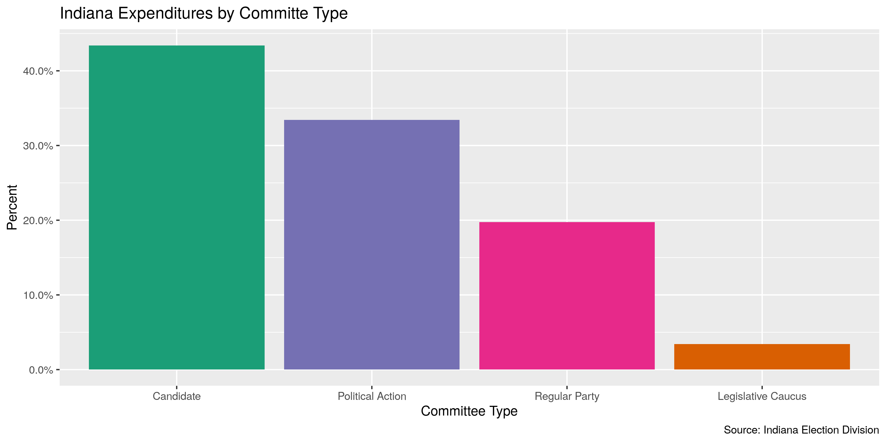<!-- -->

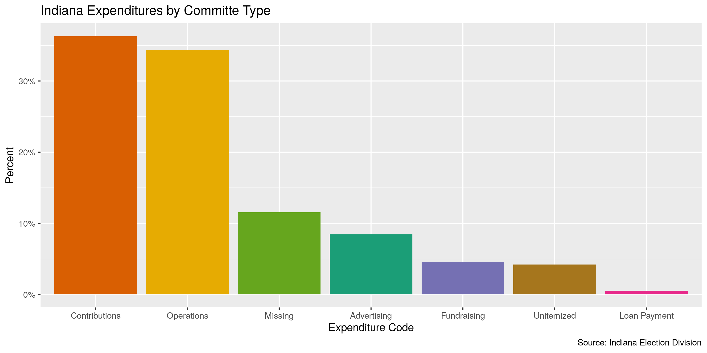<!-- -->

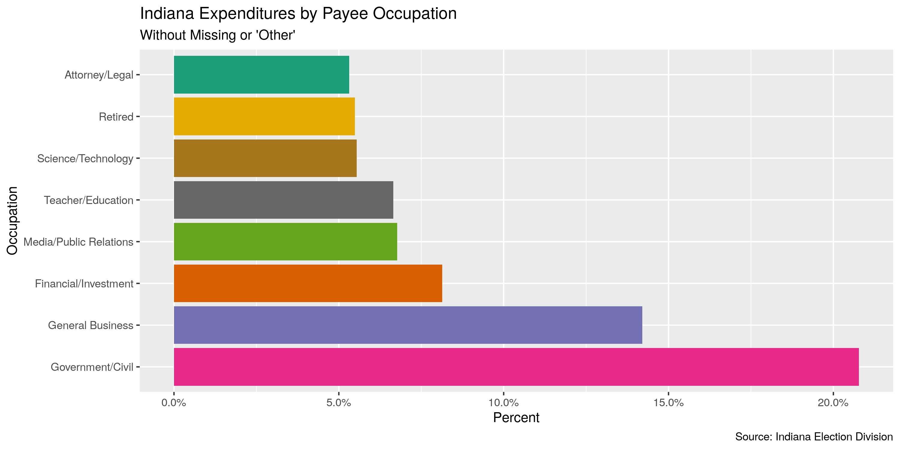<!-- -->

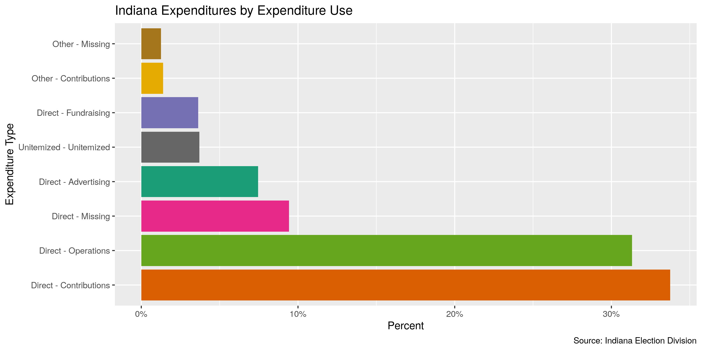<!-- -->

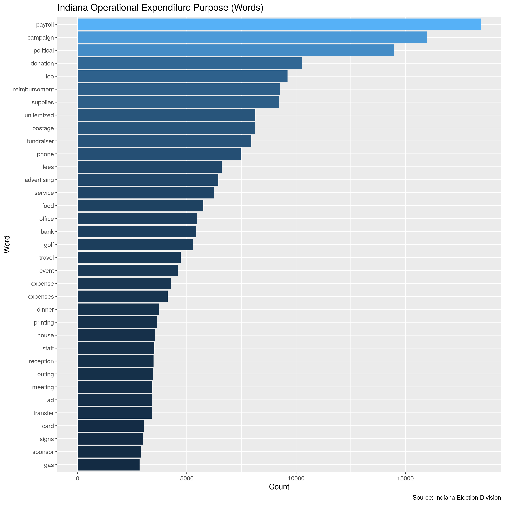<!-- -->

### Continuous

For continuous variables, we should explore both the range and
distribution. This can be done with visually with
`ggplot2::geom_histogram()` and `ggplot2::geom_violin()`.

#### Amounts

``` r
summary(ind$amount)
#>     Min.  1st Qu.   Median     Mean  3rd Qu.     Max.     NA's 
#>  -250000       73      250     1650      775 22286028       22
sum(ind$amount < 0, na.rm = TRUE)
#> [1] 5297
sum(ind$amount > 100000, na.rm = TRUE)
#> [1] 888
```

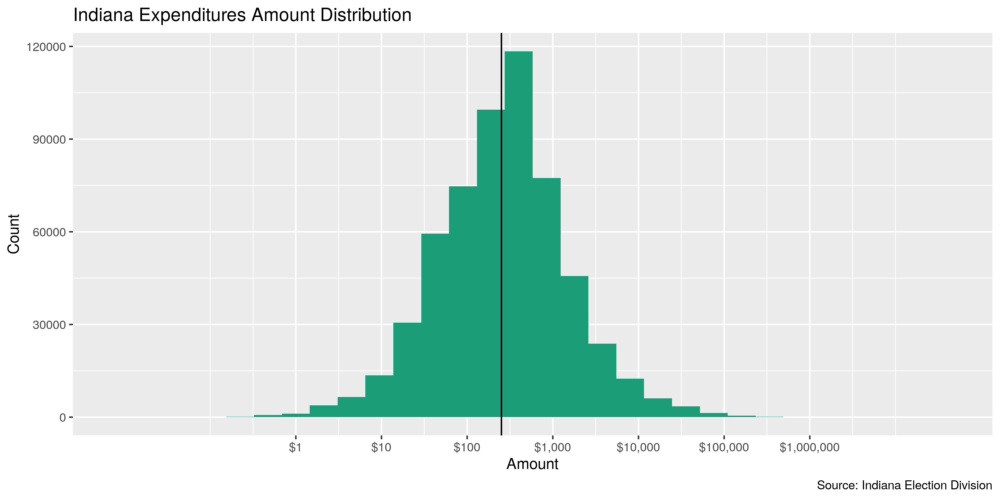<!-- -->

#### Dates

``` r
ind <- mutate(ind, expenditure_year = year(expenditure_date))
```

``` r
count_na(ind$expenditure_date)
#> [1] 23
min(ind$expenditure_date, na.rm = TRUE)
#> [1] "2000-01-01"
sum(ind$expenditure_year < 1998, na.rm = TRUE)
#> [1] 0
max(ind$expenditure_date, na.rm = TRUE)
#> [1] "2023-08-27"
sum(ind$expenditure_date > today(), na.rm = TRUE)
#> [1] 3
```

``` r
count(ind, expenditure_year) %>% print(n = 52)
#> # A tibble: 25 × 2
#>    expenditure_year     n
#>               <dbl> <int>
#>  1             2000 35650
#>  2             2001 16125
#>  3             2002 38203
#>  4             2003 27620
#>  5             2004 40531
#>  6             2005 19575
#>  7             2006 39238
#>  8             2007 23210
#>  9             2008 44012
#> 10             2009 18230
#> 11             2010 38744
#> 12             2011 21938
#> 13             2012 40491
#> 14             2013 19449
#> 15             2014 35194
#> 16             2015 22875
#> 17             2016 38107
#> 18             2017 20178
#> 19             2018 37880
#> 20             2019 25588
#> 21             2020 38409
#> 22             2021 23547
#> 23             2022 42143
#> 24             2023    14
#> 25               NA    23
```

``` r
ind <- ind %>% 
  mutate(
    date_flag = expenditure_year < 1998 | expenditure_date > today(),
    date_clean = case_when(
      date_flag~ as.Date(NA),
      not(date_flag) ~ expenditure_date
    ),
    year_clean = year(date_clean)
  )

sum(ind$date_flag, na.rm = TRUE)
#> [1] 3
```

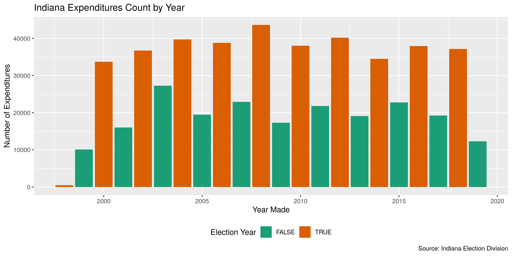<!-- -->

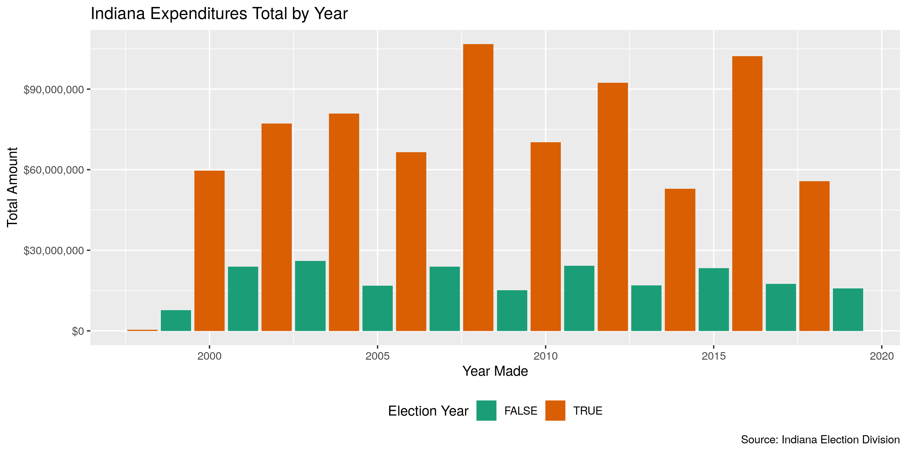<!-- -->

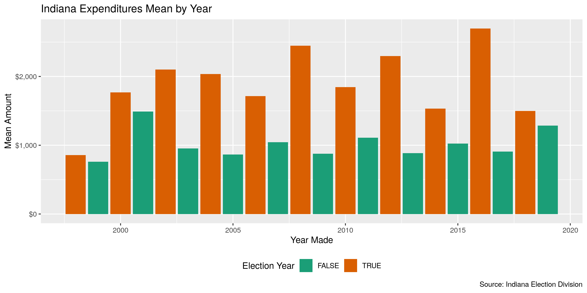<!-- -->

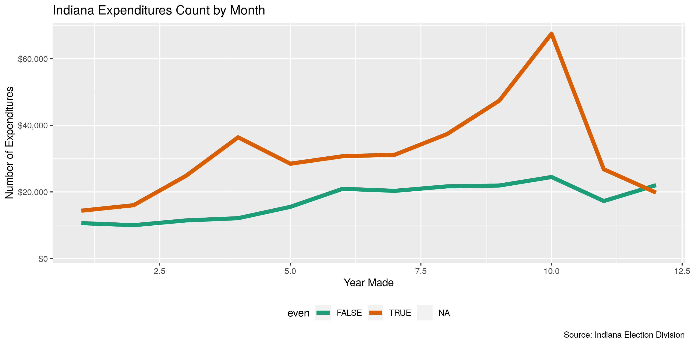<!-- -->

## Wrangle

We should use the `campfin::normal_*()` functions to perform some basic,
high-confidence text normalization to improve the searchability of the
database.

### Address

First, we will normalize the street address by removing punctuation and
expanding abbreviations.

``` r
ind <- ind %>% 
  mutate(
    address_norm = normal_address(
      address = address,
      abbs = usps_street,
      na_rep = TRUE
    )
  )
```

We can see how this improves consistency across the `address` field.

    #> # A tibble: 10 × 2
    #>    address               address_norm        
    #>    <chr>                 <chr>               
    #>  1 2141 HANOVER DR       2141 HANOVER DR     
    #>  2 300 S. State Road 201 300 S STATE ROAD 201
    #>  3 201 N Main            201 N MAIN          
    #>  4 6195 Central Ave.     6195 CENTRAL AVE    
    #>  5 3743 PAYTON AVE       3743 PAYTON AVE     
    #>  6 7040 McFarland Blvd   7040 MCFARLAND BLVD 
    #>  7 PO Box 7074           PO BOX 7074         
    #>  8 15 Beacon Dr          15 BEACON DR        
    #>  9 309 S Prairie St      309 S PRAIRIE ST    
    #> 10 3610 Balsam Ave       3610 BALSAM AVE

### ZIP

The `zip` address is already pretty good, with 95% of the values already
in our 95% comprehensive `valid_zip` list.

We can improve this further by lopping off the uncommon four-digit
extensions and removing common invalid codes like 00000 and 99999.

``` r
ind <- ind %>% 
  mutate(
    zip_norm = normal_zip(
      zip = zip,
      na_rep = TRUE
    )
  )
```

This brings our valid percentage to 99%.

``` r
progress_table(
  ind$zip,
  ind$zip_norm,
  compare = valid_zip
)
#> # A tibble: 2 × 6
#>   stage        prop_in n_distinct prop_na n_out n_diff
#>   <chr>          <dbl>      <dbl>   <dbl> <dbl>  <dbl>
#> 1 ind$zip        0.946      12628  0.0976 34193   5079
#> 2 ind$zip_norm   0.992       8888  0.100   5376   1208
```

### State

The `state` variable is also very clean, already at 99%.

There are still 198 invalid values which we can remove.

``` r
ind <- ind %>% 
  mutate(
    state_norm = normal_state(
      state = str_replace(str_trim(state), "^I$", "IN"),
      abbreviate = TRUE,
      na_rep = TRUE,
      valid = valid_state
    )
  )
```

``` r
progress_table(
  ind$state,
  ind$state_norm,
  compare = valid_state
)
#> # A tibble: 2 × 6
#>   stage          prop_in n_distinct prop_na n_out n_diff
#>   <chr>            <dbl>      <dbl>   <dbl> <dbl>  <dbl>
#> 1 ind$state        0.990        252  0.0572  6716    198
#> 2 ind$state_norm   1             55  0.0584     0      1
```

### City

The `city` value is the hardest to normalize. We can use a four-step
system to functionally improve the searchablity of the database.

1.  **Normalize** the raw values with `campfin::normal_city()`
2.  **Match** the normal values with the *expected* value for that ZIP
    code
3.  **Swap** the normal values with the expected value if they are
    *very* similar
4.  **Refine** the swapped values the [OpenRefine
    algorithms](https://github.com/OpenRefine/OpenRefine/wiki/Clustering-In-Depth)
    and keep good changes

The raw `city` values are not very normal, with only 13% already in
`valid_city`, mostly due to case difference. If we simply convert to
uppcase that numbers increases to 93%. We will aim to get this number
over 99% using the other steps in the process.

#### Normalize

``` r
ind <- ind %>% 
  mutate(
    city_norm = normal_city(
      city = city %>% str_replace(rx_break("Indianapol;is"), "INDIANAPOLIS"), 
      abbs = usps_city,
      states = c("IN", "DC", "INDIANA"),
      na = invalid_city,
      na_rep = TRUE
    )
  )
```

This process brought us to 96% valid.

It also increased the proportion of `NA` values by 0%. These new `NA`
values were either a single (possibly repeating) character, or contained
in the `na_city` vector.

    #> # A tibble: 84 × 4
    #>    zip_norm state_norm city       city_norm
    #>    <chr>    <chr>      <chr>      <chr>    
    #>  1 <NA>     IN         N/A        <NA>     
    #>  2 <NA>     <NA>       1111       <NA>     
    #>  3 <NA>     IN         UNKNOWN    <NA>     
    #>  4 <NA>     IL         unknown    <NA>     
    #>  5 <NA>     IN         xx         <NA>     
    #>  6 <NA>     IN         None given <NA>     
    #>  7 <NA>     <NA>       ??         <NA>     
    #>  8 <NA>     <NA>       N/A        <NA>     
    #>  9 <NA>     OK         x          <NA>     
    #> 10 46000    IN         unknown    <NA>     
    #> # … with 74 more rows

#### Swap

Then, we will compare these normalized `city_norm` values to the
*expected* city value for that vendor’s ZIP code. If the [levenshtein
distance](https://en.wikipedia.org/wiki/Levenshtein_distance) is less
than 3, we can confidently swap these two values.

``` r
ind <- ind %>% 
  rename(city_raw = city) %>% 
  left_join(
    y = zipcodes,
    by = c(
      "state_norm" = "state",
      "zip_norm" = "zip"
    )
  ) %>% 
  rename(city_match = city) %>% 
  mutate(
    match_abb = is_abbrev(city_norm, city_match),
    match_dist = str_dist(city_norm, city_match),
    city_swap = if_else(
      condition = match_dist < 3 | match_abb,
      true = city_match,
      false = city_norm
    )
  )
```

This is a very fast way to increase the valid proportion to 99% and
reduce the number of distinct *invalid* values from 3107 to only 587

#### Refine

Additionally, we can pass these swapped `city_swap` values to the
OpenRefine cluster and merge algorithms. These two algorithms cluster
similar values and replace infrequent values with their more common
counterparts. This process can be harmful by making *incorrect* changes.
We will only keep changes where the state, ZIP code, *and* new city
value all match a valid combination.

``` r
good_refine <- ind %>% 
  mutate(
    city_refine = city_swap %>% 
      key_collision_merge() %>% 
      n_gram_merge(numgram = 1)
  ) %>% 
  filter(city_refine != city_swap) %>% 
  inner_join(
    y = zipcodes,
    by = c(
      "city_refine" = "city",
      "state_norm" = "state",
      "zip_norm" = "zip"
    )
  )
```

    #> # A tibble: 24 × 5
    #>    state_norm zip_norm city_swap        city_refine         n
    #>    <chr>      <chr>    <chr>            <chr>           <int>
    #>  1 IN         47150    NEW ALBANY LANE  NEW ALBANY         64
    #>  2 IN         46184    NEW WHITELAND    WHITELAND          33
    #>  3 IN         46590    WINNIOA LAKE     WINONA LAKE         4
    #>  4 IN         47978    RENESSLEAR       RENSSELAER          4
    #>  5 CA         94107    FRANCISCO        SAN FRANCISCO       3
    #>  6 IA         50265    WEST DEMONIS     WEST DES MOINES     3
    #>  7 IN         46410    MERRERVILLE      MERRILLVILLE        2
    #>  8 OH         45999    CINNATTI         CINCINNATI          2
    #>  9 SC         29419    NORTH CHARLESTON CHARLESTON          2
    #> 10 CA         94102    SAN FRANCISCO CA SAN FRANCISCO       1
    #> # … with 14 more rows

We can join these good refined values back to the original data and use
them over their incorrect `city_swap` counterparts in a new
`city_refine` variable.

``` r
ind <- ind %>% 
  left_join(good_refine) %>% 
  mutate(city_refine = coalesce(city_refine, city_swap))
```

This brings us to 99% valid values.

We can make very few manual changes to capture the last few big invalid
values. Local city abbreviations (e.g., INDPLS) often need to be changed
by hand.

``` r
ind %>%
  filter(city_refine %out% valid_city) %>% 
  count(state_norm, city_refine, sort = TRUE) %>% 
  drop_na(city_refine)
#> # A tibble: 572 × 3
#>    state_norm city_refine          n
#>    <chr>      <chr>            <int>
#>  1 IL         COUNTRYSIDE        491
#>  2 IN         SPEEDWAY           452
#>  3 MA         WEST SOMERVILLE    272
#>  4 IN         INDY               163
#>  5 MA         FITCHBONS          108
#>  6 IL         OAKBROOK TERRACE    95
#>  7 TX         DFW AIRPORT         76
#>  8 SC         DANIEL ISLAND       72
#>  9 IN         OGDEN DUNES         70
#> 10 KS         OVERLAND PARK       69
#> # … with 562 more rows
```

``` r
ind <- ind %>% 
  mutate(
    city_refine = city_refine %>% 
      str_replace("^INDPLS$", "INDIANAPOLIS") %>% 
      str_replace("^EC$", "EAST CHICAGO") %>% 
      str_replace("^INDY$", "INDIANAPOLIS") %>% 
      str_replace("^MERR$", "MERRILLVILLE")
  )
```

#### Check

We can use the `check_city()` function to pass the remaining unknown
`city_refine` values (and their `state_norm`) to the Google Geocode API.
The function returns the name of the city or locality which most
associated with those values.

This is an easy way to both check for typos and check whether an unknown
`city_refine` value is actually a completely acceptable neighborhood,
census designated place, or some other locality not found in our
`valid_city` vector from our `zipcodes` database.

First, we’ll filter out any known valid city and aggregate the remaining
records by their city and state. Then, we will only query those unknown
cities which appear at least ten times.

``` r
ind_out <- ind %>% 
  filter(city_refine %out% c(valid_city, extra_city)) %>% 
  count(city_refine, state_norm, sort = TRUE) %>% 
  drop_na() %>% 
  filter(n > 1)
```

Passing these values to `check_city()` with `purrr::pmap_dfr()` will
return a single tibble of the rows returned by each city/state
combination.

First, we’ll check to see if the API query has already been done and a
file exist on disk. If such a file exists, we can read it using
`readr::read_csv()`. If not, the query will be sent and the file will be
written using `readr::write_csv()`.

``` r
check_file <- here("in", "expends", "data", "api_check.csv")
if (file_exists(check_file)) {
  check <- read_csv(
    file = check_file
  )
} else {
  check <- pmap_dfr(
    .l = list(
      ind_out$city_refine, 
      ind_out$state_norm
    ), 
    .f = check_city, 
    key = Sys.getenv("GEOCODE_KEY"), 
    guess = TRUE
  ) %>% 
    mutate(guess = coalesce(guess_city, guess_place)) %>% 
    select(-guess_city, -guess_place)
  write_csv(
    x = check,
    path = check_file
  )
}
```

Any city/state combination with a `check_city_flag` equal to `TRUE`
returned a matching city string from the API, indicating this
combination is valid enough to be ignored.

``` r
valid_locality <- check$guess[check$check_city_flag]
```

Then we can perform some simple comparisons between the queried city and
the returned city. If they are extremely similar, we can accept those
returned locality strings and add them to our list of accepted
additional localities.

``` r
valid_locality <- check %>% 
  filter(!check_city_flag) %>% 
  mutate(
    abb = is_abbrev(original_city, guess),
    dist = str_dist(original_city, guess)
  ) %>%
  filter(abb | dist <= 3) %>% 
  pull(guess) %>% 
  c(valid_locality)
```

This list of acceptable localities can be added with our `valid_city`
and `extra_city` vectors from the `campfin` package. The cities checked
will eventually be added to `extra_city`.

``` r
many_city <- c(valid_city, extra_city, valid_locality)
```

``` r
prop_in(ind$city_refine, valid_city)
#> [1] 0.9946119
prop_in(ind$city_refine, many_city)
#> [1] 0.9979556
```

| stage                                                                          | prop_in | n_distinct | prop_na | n_out | n_diff |
|:-------------------------------------------------------------------------------|--------:|-----------:|--------:|------:|-------:|
| str_to_upper(ind$city_raw) | 0.9379| 7634| 0.0651| 41023| 4240| |ind$city_norm |  0.9584 |       6401 |  0.0661 | 27490 |   2976 |
| ind$city_swap | 0.9975| 3835| 0.1192| 1585| 461| |ind$city_refine              |  0.9980 |       3811 |  0.1192 |  1273 |    439 |

You can see how the percentage of valid values increased with each
stage.

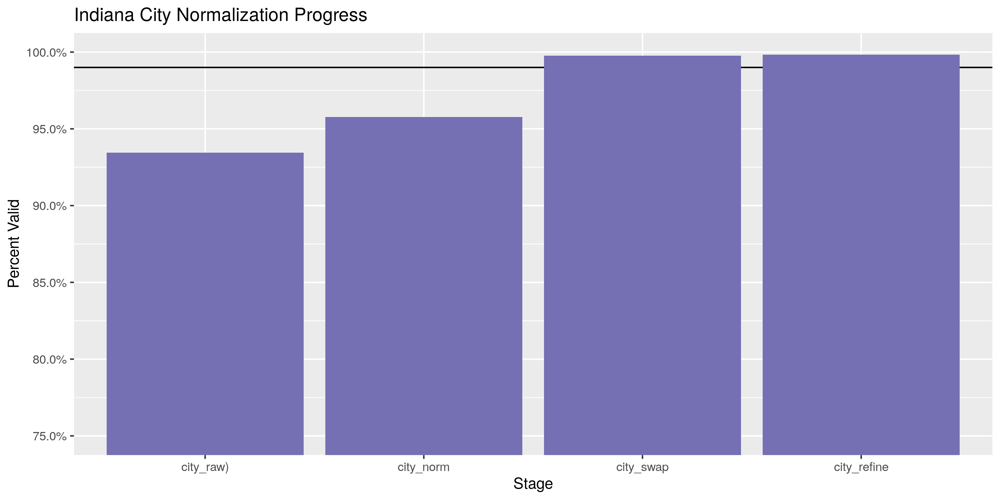<!-- -->

More importantly, the number of distinct values decreased each stage. We
were able to confidently change many distinct invalid values to their
valid equivilent.

``` r
progress %>% 
  select(
    stage, 
    all = n_distinct,
    bad = n_diff
  ) %>% 
  mutate(good = all - bad) %>% 
  pivot_longer(c("good", "bad")) %>% 
  mutate(name = name == "good") %>% 
  ggplot(aes(x = stage, y = value)) +
  geom_col(aes(fill = name)) +
  scale_fill_brewer(palette = "Dark2") +
  scale_y_continuous(labels = comma) +
  theme(legend.position = "bottom") +
  labs(
    title = "Indiana City Normalization Progress",
    subtitle = "Distinct values, valid and invalid",
    x = "Stage",
    y = "Distinct Values",
    fill = "Valid"
  )
```

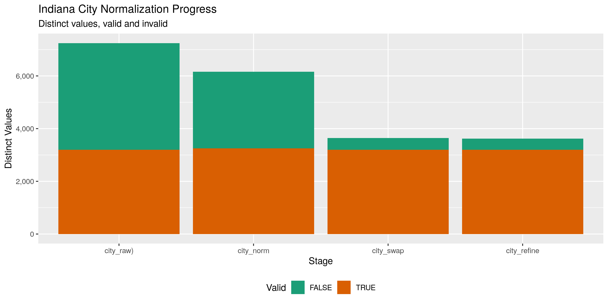<!-- -->

## Conclude

1.  There are 706974 records in the database.
2.  There are 14668 duplicate records in the database.
3.  The range and distribution of `amount` seems reasomable, and `date`
    has been cleaned by removing 3 values from the distance past or
    future.
4.  There are 15332 records missing either recipient or date.
5.  Consistency in geographic data has been improved with
    `campfin::normal_*()`.
6.  The 5-digit `zip_norm` variable has been created with
    `campfin::normal_zip()`.
7.  The 4-digit `year_clean` variable has been created with
    `lubridate::year()`.

## Export

``` r
proc_dir <- here("in", "expends", "data", "processed")
dir_create(proc_dir)
```

``` r
ind %>% 
  select(
    -city_norm,
    -city_swap,
    -city_match,
    -city_swap,
    -match_abb,
    -match_dist,
    -expenditure_year
  ) %>% 
  rename(
    city = city_raw,
    address_clean = address_norm,
    zip_clean = zip_norm,
    state_clean = state_norm,
    city_clean = city_refine
  ) %>% 
  write_csv(
    path = glue("{proc_dir}/in_expends_clean.csv"),
    na = ""
  )
```
