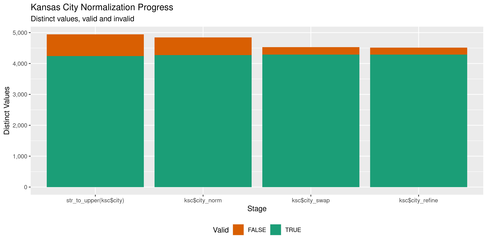

Kansas Contributions
================
Kiernan Nicholls
Wed Feb 23 14:50:03 2022

-   [Project](#project)
-   [Objectives](#objectives)
-   [Packages](#packages)
-   [Source](#source)
-   [Read](#read)
-   [Explore](#explore)
    -   [Missing](#missing)
    -   [Duplicates](#duplicates)
    -   [Categorical](#categorical)
    -   [Amounts](#amounts)
    -   [Dates](#dates)
-   [Wrangle](#wrangle)
    -   [Address](#address)
    -   [ZIP](#zip)
    -   [State](#state)
    -   [City](#city)
-   [Conclude](#conclude)
-   [Export](#export)
-   [Upload](#upload)
-   [Dictionary](#dictionary)

<!-- Place comments regarding knitting here -->

## Project

The Accountability Project is an effort to cut across data silos and
give journalists, policy professionals, activists, and the public at
large a simple way to search across huge volumes of public data about
people and organizations.

Our goal is to standardize public data on a few key fields by thinking
of each dataset row as a transaction. For each transaction there should
be (at least) 3 variables:

1.  All **parties** to a transaction.
2.  The **date** of the transaction.
3.  The **amount** of money involved.

## Objectives

This document describes the process used to complete the following
objectives:

1.  How many records are in the database?
2.  Check for entirely duplicated records.
3.  Check ranges of continuous variables.
4.  Is there anything blank or missing?
5.  Check for consistency issues.
6.  Create a five-digit ZIP Code called `zip`.
7.  Create a `year` field from the transaction date.
8.  Make sure there is data on both parties to a transaction.

## Packages

The following packages are needed to collect, manipulate, visualize,
analyze, and communicate these results. The `pacman` package will
facilitate their installation and attachment.

``` r
if (!require("pacman")) {
  install.packages("pacman")
}
pacman::p_load(
  tidyverse, # data manipulation
  lubridate, # datetime strings
  gluedown, # printing markdown
  janitor, # clean data frames
  campfin, # custom irw tools
  aws.s3, # aws cloud storage
  refinr, # cluster & merge
  scales, # format strings
  knitr, # knit documents
  vroom, # fast reading
  rvest, # scrape html
  glue, # code strings
  here, # project paths
  httr, # http requests
  cli, # command line
  fs # local storage 
)
```

This diary was run using `campfin` version 1.0.8.9201.

``` r
packageVersion("campfin")
#> [1] '1.0.8.9201'
```

This document should be run as part of the `R_tap` project, which lives
as a sub-directory of the more general, language-agnostic
[`irworkshop/accountability_datacleaning`](https://github.com/irworkshop/accountability_datacleaning)
GitHub repository.

The `R_tap` project uses the [RStudio
projects](https://support.rstudio.com/hc/en-us/articles/200526207-Using-Projects)
feature and should be run as such. The project also uses the dynamic
`here::here()` tool for file paths relative to *your* machine.

``` r
# where does this document knit?
here::i_am("ks/contribs/docs/ks_contribs_diary.Rmd")
```

## Source

Kansas contribution data is downloaded from a [search
portal](https://kssos.org/elections/cfr_viewer/cfr_examiner_contribution.aspx).
One has to search for all contributions of a specific “type” (.e.g.,
check or cash). Those results can be manually downloaded locally to
different files.

## Read

These files have the `.xls` extension, yet they can’t be read with
common tools like the `read_excel()` function. If we examine the files
in a text editor, they actually resemble HTML files with a single table.
These tables can be read, but we lose a lot of nuance. For example, the
contributor name and address are in the same column row (`<td>`), yet
contain different class tags.

``` html
<span id="lblContributor_0">NGP VAN Inc.</span><br />
<span id="lblAddress_0">1101   15th NW ST STE 500</span>
<span id="lblAddress2_0"></span><br />
<span id="lblCity_0">Washington</span>
<span id="lblState_0">DC</span>
<span id="lblZip_0">20005-5006</span
```

``` r
raw_dir <- dir_create(here("ks", "contribs", "data", "raw"))
raw_xls <- dir_info(raw_dir, glob = "*.xls")
raw_xls <- arrange(raw_xls, size)
raw_xls <- raw_xls$path
```

For each file, we are going to identify the *last* `<span>` tag
containing an `id` attribute that can be used to identify the variable
in the table column.

``` r
id_txt <- function(x, txt, i) {
  html_text(html_element(x, sprintf(txt, i)))
}
```

``` r
raw_tsv <- path(raw_dir, "ks_contributions.tsv")
```

``` r
if (!file_exists(raw_tsv)) {
  for (j in seq_along(raw_xls)) {
    # read the "xls" file as HTML data
    html <- read_html(raw_xls[j])
    # find all column rows
    rows <- html_elements(html, "tr")[-1]
    message(sprintf("\n%s (%d)", basename(raw_xls[j]), length(rows)))
    pb <- txtProgressBar(max = length(rows), style = 3)
    for (i in seq(40503, length(rows))) {
      # write the <span> tags as tab sep string in file
      span <- str_squish(html_text(html_elements(rows[[i]], "span")))
      span <- str_replace_all(span, "\t", " ") # remove tabs
      span <- c(i, span) # add row number
      cat(
        paste(span, collapse = "\t"), 
        sep = "\n", 
        file = raw_tsv, 
        append = TRUE
      )
      setTxtProgressBar(pb, i)
    }
  }
}
```

``` r
ks_cols <- rows[[1]] %>% 
  html_elements("span") %>%
  html_attr("id") %>% 
  str_remove("^lbl") %>% 
  str_remove("_\\d+$") %>% 
  make_clean_names()
```

``` r
ksc <- read_tsv(
  file = raw_tsv,
  col_names = c("id", ks_cols),
  col_types = cols(
    .default = col_character(),
    date = col_date(),
    amount = col_number(),
    start_date = col_date(),
    end_date = col_date()
  ),
  locale = locale(
    date_format = "%m/%d/%Y"
  )
)
```

``` r
problems(ksc)
#> # A tibble: 0 × 5
#> # … with 5 variables: row <int>, col <int>, expected <chr>, actual <chr>, file <chr>
```

## Explore

There are 133,913 rows of 17 columns. Each record represents a single
contribution from an individual or business to a candidate.

``` r
glimpse(ksc)
#> Rows: 133,913
#> Columns: 17
#> $ id                  <chr> "1", "2", "3", "4", "5", "6", "7", "8", "9", "10", "11", "12", "13", "14", "15", "16", "17…
#> $ cand_name           <chr> "Dennis Anderson", "Dennis Anderson", "James Barnett", "James Barnett", "James Barnett", "…
#> $ contributor         <chr> "NGP VAN Inc.", "NGP VAN, Inc.", "Kansas Press Association", "Pound Feinstein & Associates…
#> $ address             <chr> "1101 15th NW ST STE 500", "1101 15th NW ST", "5423 SW 7th Street", "5614 Connecticut Aven…
#> $ address2            <chr> NA, "STE 500", NA, NA, NA, NA, NA, NA, NA, NA, NA, NA, "43rd Floor", NA, NA, NA, NA, NA, N…
#> $ city                <chr> "Washington", "Washington", "Topeka", "Washington", "Washington", "Topeka", "Kansas City",…
#> $ state               <chr> "DC", "DC", "KS", "DC", "DC", "KS", "KS", "OR", "CA", "CA", "KS", "MN", "NY", "MI", "SD", …
#> $ zip                 <chr> "20005-5006", "20005", "66606", "20015-2601", "20015", "66605", "66111", "97208", "94043",…
#> $ occupation          <chr> NA, NA, NA, NA, NA, NA, NA, NA, NA, NA, "Account Adjustment", NA, NA, NA, NA, NA, NA, NA, …
#> $ industry            <chr> NA, NA, NA, NA, NA, NA, NA, NA, NA, NA, NA, NA, NA, NA, NA, NA, NA, NA, NA, NA, NA, NA, NA…
#> $ date                <date> 2014-12-04, 2015-01-09, 2018-10-18, 2018-12-17, 2019-01-28, 2016-04-20, 2017-05-31, 2017-…
#> $ typeof_tender       <chr> "Refund", "Refund", "Refund", "Refund", "Refund", "Refund", "Refund", "Refund", "Refund", …
#> $ amount              <dbl> 450.00, 100.00, 154.08, 335.75, 5843.75, 42.40, 8.71, 36.54, 311.16, 215.15, 2424.89, 272.…
#> $ in_kind_amount      <chr> NA, NA, NA, NA, NA, NA, NA, NA, NA, NA, NA, NA, NA, NA, NA, NA, NA, NA, NA, NA, NA, NA, NA…
#> $ in_kind_description <chr> NA, NA, NA, NA, NA, NA, NA, NA, NA, NA, NA, NA, NA, NA, NA, NA, NA, NA, NA, NA, NA, NA, NA…
#> $ start_date          <date> 2014-10-24, 2015-01-01, 2018-07-27, 2018-10-26, 2018-01-01, 2016-01-01, 2017-01-01, 2017-…
#> $ end_date            <date> 2014-12-31, 2015-12-31, 2018-10-25, 2018-12-31, 2018-12-31, 2016-12-31, 2017-12-31, 2017-…
tail(ksc)
#> # A tibble: 6 × 17
#>   id    cand_name contributor     address address2 city  state zip   occupation industry date       typeof_tender amount
#>   <chr> <chr>     <chr>           <chr>   <chr>    <chr> <chr> <chr> <chr>      <chr>    <date>     <chr>          <dbl>
#> 1 74251 Sara Weir Robert Taishoff 5025 C… <NA>     Napl… FL    34103 Retired    <NA>     2021-09-17 Credit Card     520.
#> 2 74252 Sara Weir Rochelle Tocch… 13431 … <NA>     Over… KS    66221 Financial… <NA>     2021-08-30 Credit Card     250 
#> 3 74253 Sara Weir Ryan Rogers     9616 D… <NA>     Over… KS    66207 Account E… <NA>     2021-12-31 Credit Card    2000 
#> 4 74254 Sara Weir Sara Hart Weir  9616 D… <NA>     Over… KS    66207 CEO        <NA>     2021-12-31 Credit Card    2000 
#> 5 74255 Sara Weir Steve Loftus    8371 S… <NA>     Prai… KS    66207 Retired    <NA>     2021-12-30 Credit Card     100 
#> 6 74256 Sara Weir Virginia Gille… 9911 F… <NA>     Lene… KS    66220 Retired    <NA>     2021-09-30 Credit Card      25 
#> # … with 4 more variables: in_kind_amount <chr>, in_kind_description <chr>, start_date <date>, end_date <date>
```

### Missing

Columns vary in their degree of missing values.

``` r
col_stats(ksc, count_na)
#> # A tibble: 17 × 4
#>    col                 class       n        p
#>    <chr>               <chr>   <int>    <dbl>
#>  1 id                  <chr>       0 0       
#>  2 cand_name           <chr>       0 0       
#>  3 contributor         <chr>       0 0       
#>  4 address             <chr>   18161 0.136   
#>  5 address2            <chr>  113562 0.848   
#>  6 city                <chr>       0 0       
#>  7 state               <chr>     109 0.000814
#>  8 zip                 <chr>     473 0.00353 
#>  9 occupation          <chr>   56785 0.424   
#> 10 industry            <chr>   95022 0.710   
#> 11 date                <date>      0 0       
#> 12 typeof_tender       <chr>       0 0       
#> 13 amount              <dbl>       0 0       
#> 14 in_kind_amount      <chr>  133913 1       
#> 15 in_kind_description <chr>  133913 1       
#> 16 start_date          <date>      0 0       
#> 17 end_date            <date>      0 0
```

We can flag any record missing a key variable needed to identify a
transaction.

``` r
key_vars <- c("date", "contributor", "amount", "cand_name")
ksc <- flag_na(ksc, all_of(key_vars))
sum(ksc$na_flag)
#> [1] 0
```

There are no rows missing key variables.

``` r
if (sum(ksc$na_flag) == 0) {
  ksc <- select(ksc, -na_flag)
}
```

### Duplicates

We can also flag any record completely duplicated across every column.

``` r
ksc <- flag_dupes(ksc, -id)
mean(ksc$dupe_flag)
#> [1] 0.009625652
sum(ksc$dupe_flag)
#> [1] 1289
```

There are a significant number of duplicates but not enough to warrant
removal.

``` r
ksc %>% 
  filter(dupe_flag) %>% 
  select(all_of(key_vars)) %>% 
  arrange(date)
#> # A tibble: 1,289 × 4
#>    date       contributor            amount cand_name    
#>    <date>     <chr>                   <dbl> <chr>        
#>  1 2009-08-15 Dale Haselhorst            50 Sam Brownback
#>  2 2009-08-15 Dale Haselhorst            50 Sam Brownback
#>  3 2009-11-22 Kraft Foods Global Inc   1000 Sam Brownback
#>  4 2009-11-22 Kraft Foods Global Inc   1000 Sam Brownback
#>  5 2009-11-25 Antoine Wakim             100 Sam Brownback
#>  6 2009-11-25 Antoine Wakim             100 Sam Brownback
#>  7 2009-11-25 Antoine Wakim             100 Sam Brownback
#>  8 2009-11-25 Todd Frankenbery          100 Sam Brownback
#>  9 2009-11-25 Todd Frankenbery          100 Sam Brownback
#> 10 2009-11-25 Todd Frankenbery          100 Sam Brownback
#> # … with 1,279 more rows
```

### Categorical

``` r
col_stats(ksc, n_distinct)
#> # A tibble: 18 × 4
#>    col                 class      n          p
#>    <chr>               <chr>  <int>      <dbl>
#>  1 id                  <chr>  74256 0.555     
#>  2 cand_name           <chr>     86 0.000642  
#>  3 contributor         <chr>  60269 0.450     
#>  4 address             <chr>  53621 0.400     
#>  5 address2            <chr>  13084 0.0977    
#>  6 city                <chr>   5634 0.0421    
#>  7 state               <chr>     53 0.000396  
#>  8 zip                 <chr>  29955 0.224     
#>  9 occupation          <chr>   7320 0.0547    
#> 10 industry            <chr>   5285 0.0395    
#> 11 date                <date>  3588 0.0268    
#> 12 typeof_tender       <chr>      7 0.0000523 
#> 13 amount              <dbl>   1267 0.00946   
#> 14 in_kind_amount      <chr>      1 0.00000747
#> 15 in_kind_description <chr>      1 0.00000747
#> 16 start_date          <date>    21 0.000157  
#> 17 end_date            <date>    20 0.000149  
#> 18 dupe_flag           <lgl>      2 0.0000149
```

<!-- --><!-- --><!-- -->

### Amounts

``` r
# fix floating point precision
ksc$amount <- round(ksc$amount, digits = 2)
```

``` r
summary(ksc$amount)
#>     Min.  1st Qu.   Median     Mean  3rd Qu.     Max. 
#>      0.0     20.0     75.0    363.3    250.0 695000.0
mean(ksc$amount <= 0)
#> [1] 3.733767e-05
```

These are the records with the minimum and maximum amounts.

``` r
glimpse(ksc[c(which.max(ksc$amount), which.min(ksc$amount)), ])
#> Rows: 2
#> Columns: 18
#> $ id                  <chr> "59", "156"
#> $ cand_name           <chr> "Willis Hartman", "Jeffrey Caldwell, II"
#> $ contributor         <chr> "Willis Hartman", "Anthony Pennington"
#> $ address             <chr> "10500 E Berkeley Square Parkway", NA
#> $ address2            <chr> "Suite 100", NA
#> $ city                <chr> "Wichita", "unknown"
#> $ state               <chr> "KS", "KS"
#> $ zip                 <chr> "67206", NA
#> $ occupation          <chr> "President", NA
#> $ industry            <chr> NA, NA
#> $ date                <date> 2017-12-29, 2018-06-02
#> $ typeof_tender       <chr> "Loan", "Cash"
#> $ amount              <dbl> 695000, 0
#> $ in_kind_amount      <chr> NA, NA
#> $ in_kind_description <chr> NA, NA
#> $ start_date          <date> 2017-01-01, 2018-01-01
#> $ end_date            <date> 2017-12-31, 2018-07-26
#> $ dupe_flag           <lgl> FALSE, FALSE
```

The distribution of amount values are typically log-normal.

<!-- -->

### Dates

``` r
big_dt <- which(ksc$date > today())
ksc$date[big_dt] <- as_date(str_replace(
  string = ksc$date[big_dt],
  pattern = "^2(\\d)(\\d)",
  replacement = "2\\2\\1"
))
```

We can add the calendar year from `date` with `lubridate::year()`

``` r
ksc <- mutate(ksc, year = year(date))
```

``` r
min(ksc$date)
#> [1] "2008-01-09"
sum(ksc$year < 2000)
#> [1] 0
max(ksc$date)
#> [1] "2021-12-31"
sum(ksc$date > today())
#> [1] 0
```

It’s common to see an increase in the number of contributions in
elections years.

<!-- -->

## Wrangle

To improve the searchability of the database, we will perform some
consistent, confident string normalization. For geographic variables
like city names and ZIP codes, the corresponding `campfin::normal_*()`
functions are tailor made to facilitate this process.

### Address

For the street `addresss` variable, the `campfin::normal_address()`
function will force consistence case, remove punctuation, and abbreviate
official USPS suffixes.

``` r
addr_norm <- ksc %>% 
  distinct(address) %>%
  mutate(
    address_norm = normal_address(
      address = address,
      abbs = usps_street,
      na_rep = TRUE
    )
  )
```

``` r
addr_norm
#> # A tibble: 53,621 × 2
#>    address                               address_norm                        
#>    <chr>                                 <chr>                               
#>  1 1101 15th NW ST STE 500               1101 15TH NW ST STE 500             
#>  2 1101 15th NW ST                       1101 15TH NW ST                     
#>  3 5423 SW 7th Street                    5423 SW 7TH ST                      
#>  4 5614 Connecticut Avenue NW, Suite 270 5614 CONNECTICUT AVENUE NW SUITE 270
#>  5 5614 Connecticut Avenue, NW Suite 270 5614 CONNECTICUT AVENUE NW SUITE 270
#>  6 Box 5637                              BOX 5637                            
#>  7 2601 Midwest Dr                       2601 MIDWEST DR                     
#>  8 Box 4199                              BOX 4199                            
#>  9 1600 Amphitheatre Pkwy                1600 AMPHITHEATRE PKWY              
#> 10 Box 9265                              BOX 9265                            
#> # … with 53,611 more rows
```

``` r
ksc <- left_join(ksc, addr_norm, by = c("address"))
```

### ZIP

For ZIP codes, the `campfin::normal_zip()` function will attempt to
create valid *five* digit codes by removing the ZIP+4 suffix and
returning leading zeroes dropped by other programs like Microsoft Excel.

``` r
ksc <- ksc %>% 
  mutate(
    zip_norm = normal_zip(
      zip = zip,
      na_rep = TRUE
    )
  )
```

``` r
progress_table(
  ksc$zip,
  ksc$zip_norm,
  compare = valid_zip
)
#> # A tibble: 2 × 6
#>   stage        prop_in n_distinct prop_na n_out n_diff
#>   <chr>          <dbl>      <dbl>   <dbl> <dbl>  <dbl>
#> 1 ksc$zip        0.436      29955 0.00353 75229  23352
#> 2 ksc$zip_norm   0.982       8550 0.00385  2377   1056
```

### State

State values do not need to be normalized.

``` r
prop_in(ksc$state, valid_state)
#> [1] 1
```

### City

Cities are the most difficult geographic variable to normalize, simply
due to the wide variety of valid cities and formats.

#### Normal

The `campfin::normal_city()` function is a good start, again converting
case, removing punctuation, but *expanding* USPS abbreviations. We can
also remove `invalid_city` values.

``` r
norm_city <- ksc %>% 
  distinct(city, state, zip_norm) %>% 
  mutate(
    city_norm = normal_city(
      city = city, 
      abbs = usps_city,
      states = c("KS", "DC", "KANSAS"),
      na = invalid_city,
      na_rep = TRUE
    )
  )
```

#### Swap

We can further improve normalization by comparing our normalized value
against the *expected* value for that record’s state abbreviation and
ZIP code. If the normalized value is either an abbreviation for or very
similar to the expected value, we can confidently swap those two.

``` r
norm_city <- norm_city %>% 
  rename(city_raw = city) %>% 
  left_join(
    y = zipcodes,
    by = c(
      "state" = "state",
      "zip_norm" = "zip"
    )
  ) %>% 
  rename(city_match = city) %>% 
  mutate(
    match_abb = is_abbrev(city_norm, city_match),
    match_dist = str_dist(city_norm, city_match),
    city_swap = if_else(
      condition = !is.na(match_dist) & (match_abb | match_dist == 1),
      true = city_match,
      false = city_norm
    )
  ) %>% 
  select(
    -city_match,
    -match_dist,
    -match_abb
  )
```

``` r
ksc <- left_join(
  x = ksc,
  y = norm_city,
  by = c(
    "city" = "city_raw", 
    "state", 
    "zip_norm"
  )
)
```

#### Refine

The [OpenRefine](https://openrefine.org/) algorithms can be used to
group similar strings and replace the less common versions with their
most common counterpart. This can greatly reduce inconsistency, but with
low confidence; we will only keep any refined strings that have a valid
city/state/zip combination.

``` r
good_refine <- ksc %>% 
  mutate(
    city_refine = city_swap %>% 
      key_collision_merge() %>% 
      n_gram_merge(numgram = 1)
  ) %>% 
  filter(city_refine != city_swap) %>% 
  inner_join(
    y = zipcodes,
    by = c(
      "city_refine" = "city",
      "state" = "state",
      "zip_norm" = "zip"
    )
  )
```

    #> # A tibble: 13 × 5
    #>    state zip_norm city_swap            city_refine        n
    #>    <chr> <chr>    <chr>                <chr>          <int>
    #>  1 NY    11201    BROOKLYN NY          BROOKLYN           4
    #>  2 KS    67870    SANTANA              SATANTA            3
    #>  3 PA    19103    PH PILADELPHIA       PHILADELPHIA       3
    #>  4 CA    95610    CITRUS HEIGHTSCITRUS CITRUS HEIGHTS     1
    #>  5 KS    66048    LEVANWORTH           LEAVENWORTH        1
    #>  6 KS    66097    WINCHESTERIN         WINCHESTER         1
    #>  7 KS    66614    TOPEKATOPEKA         TOPEKA             1
    #>  8 KS    67502    HUTCHINSINSON        HUTCHINSON         1
    #>  9 KS    67835    CIMMARON             CIMARRON           1
    #> 10 MI    48230    GROSSE POINTE P      GROSSE POINTE      1
    #> 11 NY    11733    SETAUKET             EAST SETAUKET      1
    #> 12 OR    97212    PORTLAND OR          PORTLAND           1
    #> 13 PA    16701    BRADOFR              BRADFORD           1

Then we can join the refined values back to the database.

``` r
ksc <- ksc %>% 
  left_join(good_refine, by = names(.)) %>% 
  mutate(city_refine = coalesce(city_refine, city_swap))
```

#### Progress

Our goal for normalization was to increase the proportion of city values
known to be valid and reduce the total distinct values by correcting
misspellings.

| stage                    | prop_in | n_distinct | prop_na | n_out | n_diff |
|:-------------------------|--------:|-----------:|--------:|------:|-------:|
| `str_to_upper(ksc$city)` |   0.982 |       4946 |   0.000 |  2438 |    703 |
| `ksc$city_norm`          |   0.987 |       4842 |   0.003 |  1763 |    568 |
| `ksc$city_swap`          |   0.994 |       4529 |   0.003 |   775 |    241 |
| `ksc$city_refine`        |   0.994 |       4516 |   0.003 |   755 |    228 |

You can see how the percentage of valid values increased with each
stage.

<!-- -->

More importantly, the number of distinct values decreased each stage. We
were able to confidently change many distinct invalid values to their
valid equivalent.

<!-- -->

Before exporting, we can remove the intermediary normalization columns
and rename all added variables with the `_clean` suffix.

``` r
ksc <- ksc %>% 
  select(
    -id, # added in reading
    -city_norm,
    -city_swap,
    city_clean = city_refine
  ) %>% 
  rename_all(~str_replace(., "_norm", "_clean")) %>% 
  rename_all(~str_remove(., "_raw")) %>% 
  relocate(address_clean, city_clean, .before = zip_clean)
```

## Conclude

``` r
glimpse(sample_n(ksc, 1000))
#> Rows: 1,000
#> Columns: 21
#> $ cand_name           <chr> "Edward O'Malley", "Sam Brownback", "Derek Schmidt", "Paul Davis", "Laura Kelly", "Joshua …
#> $ contributor         <chr> "Matt Gauldin", "Tara Christensen", "Virgil and Mary Alice Lair", "Raymond Rowden", "Carol…
#> $ address             <chr> "6821 Rockhill Rd", "6561 Eudaily Covington Rd", "250 N Country Club RD", "1904 Meadowlark…
#> $ address2            <chr> NA, NA, NA, NA, NA, "130 S Estates Dr", "1018 Arkansas Rd", NA, "3632 Regent Dr", NA, NA, …
#> $ city                <chr> "Kansas City", "College Grove", "Chanute", "Lawrence", "Frontenac", "Salina", "Williamsbur…
#> $ state               <chr> "MO", "TN", "KS", "KS", "KS", "KS", "KS", "KS", "TX", "KS", "KS", "KS", "GA", "CA", "KS", …
#> $ zip                 <chr> "64113", "37046-0109", "66720", "66047-2332", "66763-2414", "67401", "66095", "67401-3588"…
#> $ occupation          <chr> NA, "Homemaker", NA, NA, NA, "Retired Teacher", "Farmer", "Psychologist", "Physician", NA,…
#> $ industry            <chr> NA, "Spouse Attorney Legal Professi", NA, NA, NA, NA, NA, NA, NA, NA, NA, NA, NA, NA, NA, …
#> $ date                <date> 2017-11-28, 2010-08-03, 2009-10-08, 2014-09-22, 2018-10-15, 2018-01-25, 2021-08-14, 2018-…
#> $ typeof_tender       <chr> "Credit Card", "Check", "Check", "Credit Card", "Credit Card", "Check", "Check", "Credit C…
#> $ amount              <dbl> 100, 1000, 100, 20, 50, 250, 100, 100, 250, 100, 25, 100, 50, 25, 10, 2000, 100, 500, 3, 1…
#> $ in_kind_amount      <chr> NA, NA, NA, NA, NA, NA, NA, NA, NA, NA, NA, NA, NA, NA, NA, NA, NA, NA, NA, NA, NA, NA, NA…
#> $ in_kind_description <chr> NA, NA, NA, NA, NA, NA, NA, NA, NA, NA, NA, NA, NA, NA, NA, NA, NA, NA, NA, NA, NA, NA, NA…
#> $ start_date          <date> 2017-01-01, 2010-07-23, 2009-01-01, 2014-07-25, 2018-07-27, 2018-01-01, 2021-01-01, 2018-…
#> $ end_date            <date> 2017-12-31, 2010-10-21, 2009-12-31, 2014-10-23, 2018-10-25, 2018-07-26, 2021-12-31, 2018-…
#> $ dupe_flag           <lgl> FALSE, FALSE, FALSE, FALSE, FALSE, FALSE, FALSE, FALSE, FALSE, FALSE, FALSE, FALSE, FALSE,…
#> $ year                <dbl> 2017, 2010, 2009, 2014, 2018, 2018, 2021, 2018, 2017, 2013, 2018, 2021, 2018, 2018, 2021, …
#> $ address_clean       <chr> "6821 ROCKHILL RD", "6561 EUDAILY COVINGTON RD", "250 N COUNTRY CLUB RD", "1904 MEADOWLARK…
#> $ city_clean          <chr> "KANSAS CITY", "COLLEGE GROVE", "CHANUTE", "LAWRENCE", "FRONTENAC", "SALINA", "WILLIAMSBUR…
#> $ zip_clean           <chr> "64113", "37046", "66720", "66047", "66763", "67401", "66095", "67401", "75229", "66061", …
```

1.  There are 133,913 records in the database.
2.  There are 1,289 duplicate records in the database.
3.  The range and distribution of `amount` and `date` seem reasonable.
4.  There are 0 records missing key variables.
5.  Consistency in geographic data has been improved with
    `campfin::normal_*()`.
6.  The 4-digit `year` variable has been created with
    `lubridate::year()`.

## Export

Now the file can be saved on disk for upload to the Accountability
server. We will name the object using a date range of the records
included.

``` r
min_dt <- str_remove_all(min(ksc$date), "-")
max_dt <- str_remove_all(max(ksc$date), "-")
csv_ts <- paste(min_dt, max_dt, sep = "-")
```

``` r
clean_dir <- dir_create(here("ks", "contribs", "data", "clean"))
clean_csv <- path(clean_dir, glue("ks_contribs_{csv_ts}.csv"))
clean_rds <- path_ext_set(clean_csv, "rds")
basename(clean_csv)
#> [1] "ks_contribs_20080109-20211231.csv"
```

``` r
write_csv(ksc, clean_csv, na = "")
write_rds(ksc, clean_rds, compress = "xz")
(clean_size <- file_size(clean_csv))
#> 21.5M
```

## Upload

We can use the `aws.s3::put_object()` to upload the text file to the IRW
server.

``` r
aws_key <- path("csv", basename(clean_csv))
if (!object_exists(aws_key, "publicaccountability")) {
  put_object(
    file = clean_csv,
    object = aws_key, 
    bucket = "publicaccountability",
    acl = "public-read",
    show_progress = TRUE,
    multipart = TRUE
  )
}
aws_head <- head_object(aws_key, "publicaccountability")
(aws_size <- as_fs_bytes(attr(aws_head, "content-length")))
unname(aws_size == clean_size)
```

## Dictionary

The following table describes the variables in our final exported file:

| Column                | Type        | Definition |
|:----------------------|:------------|:-----------|
| `cand_name`           | `character` |            |
| `contributor`         | `character` |            |
| `address`             | `character` |            |
| `address2`            | `character` |            |
| `city`                | `character` |            |
| `state`               | `character` |            |
| `zip`                 | `character` |            |
| `occupation`          | `character` |            |
| `industry`            | `character` |            |
| `date`                | `double`    |            |
| `typeof_tender`       | `character` |            |
| `amount`              | `double`    |            |
| `in_kind_amount`      | `character` |            |
| `in_kind_description` | `character` |            |
| `start_date`          | `double`    |            |
| `end_date`            | `double`    |            |
| `dupe_flag`           | `logical`   |            |
| `year`                | `double`    |            |
| `address_clean`       | `character` |            |
| `city_clean`          | `character` |            |
| `zip_clean`           | `character` |            |
