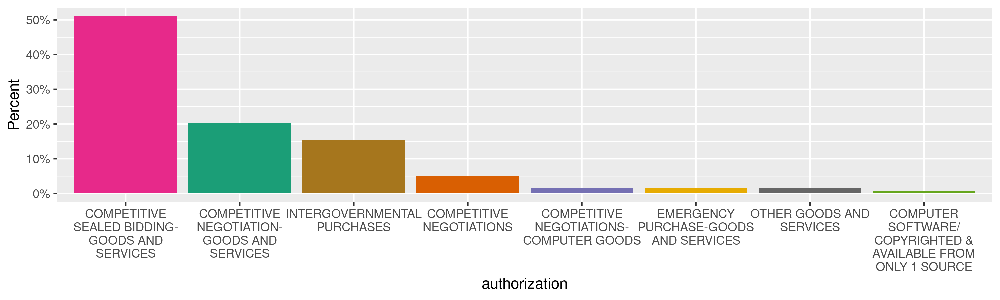
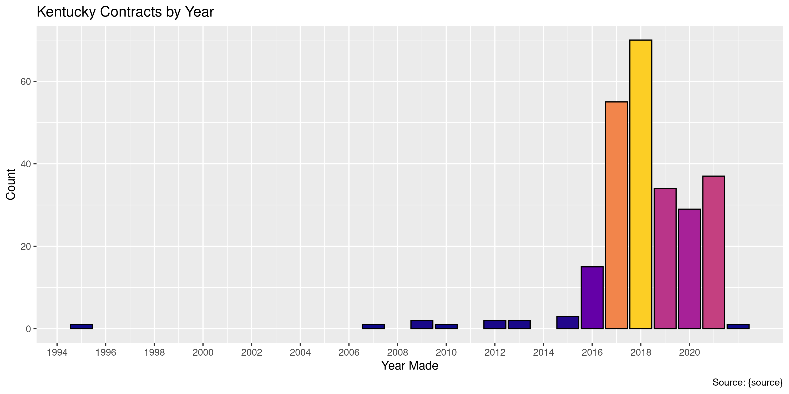

Kentucky Contracts
================
Kiernan Nicholls
Thu May 12 15:54:24 2022

-   <a href="#project" id="toc-project">Project</a>
-   <a href="#objectives" id="toc-objectives">Objectives</a>
-   <a href="#packages" id="toc-packages">Packages</a>
-   <a href="#source" id="toc-source">Source</a>
-   <a href="#download" id="toc-download">Download</a>
-   <a href="#read" id="toc-read">Read</a>
-   <a href="#explore" id="toc-explore">Explore</a>
    -   <a href="#missing" id="toc-missing">Missing</a>
    -   <a href="#duplicates" id="toc-duplicates">Duplicates</a>
    -   <a href="#categorical" id="toc-categorical">Categorical</a>
    -   <a href="#amounts" id="toc-amounts">Amounts</a>
    -   <a href="#dates" id="toc-dates">Dates</a>
-   <a href="#wrangle" id="toc-wrangle">Wrangle</a>
-   <a href="#conclude" id="toc-conclude">Conclude</a>
-   <a href="#export" id="toc-export">Export</a>
-   <a href="#upload" id="toc-upload">Upload</a>

<!-- Place comments regarding knitting here -->

## Project

The Accountability Project is an effort to cut across data silos and
give journalists, policy professionals, activists, and the public at
large a simple way to search across huge volumes of public data about
people and organizations.

Our goal is to standardize public data on a few key fields by thinking
of each dataset row as a transaction. For each transaction there should
be (at least) 3 variables:

1.  All **parties** to a transaction.
2.  The **date** of the transaction.
3.  The **amount** of money involved.

## Objectives

This document describes the process used to complete the following
objectives:

1.  How many records are in the database?
2.  Check for entirely duplicated records.
3.  Check ranges of continuous variables.
4.  Is there anything blank or missing?
5.  Check for consistency issues.
6.  Create a five-digit ZIP Code called `zip`.
7.  Create a `year` field from the transaction date.
8.  Make sure there is data on both parties to a transaction.

## Packages

The following packages are needed to collect, manipulate, visualize,
analyze, and communicate these results. The `pacman` package will
facilitate their installation and attachment.

``` r
if (!require("pacman")) {
  install.packages("pacman")
}
pacman::p_load(
  tidyverse, # data manipulation
  lubridate, # datetime strings
  gluedown, # printing markdown
  janitor, # clean data frames
  campfin, # custom irw tools
  aws.s3, # aws cloud storage
  refinr, # cluster & merge
  readxl, # read excel files
  scales, # format strings
  knitr, # knit documents
  vroom, # fast reading
  rvest, # scrape html
  glue, # code strings
  here, # project paths
  httr, # http requests
  fs # local storage 
)
```

This diary was run using `campfin` version 1.0.8.9300.

``` r
packageVersion("campfin")
#> [1] '1.0.8.9300'
```

This document should be run as part of the `R_tap` project, which lives
as a sub-directory of the more general, language-agnostic
[`irworkshop/accountability_datacleaning`](https://github.com/irworkshop/accountability_datacleaning)
GitHub repository.

The `R_tap` project uses the [RStudio
projects](https://support.rstudio.com/hc/en-us/articles/200526207-Using-Projects)
feature and should be run as such. The project also uses the dynamic
`here::here()` tool for file paths relative to *your* machine.

``` r
# where does this document knit?
here::i_am("state/ky/contracts/docs/ky_contracts_diary.Rmd")
```

## Source

## Download

``` r
raw_key <- "jla_class_data2021/O-22-119 B Morse.zip"
raw_dir <- dir_create(here("state", "ky", "contracts", "data", "raw"))
raw_zip <- path(raw_dir, basename(raw_key))
```

``` r
if (!file_exists(raw_key)) {
  save_object(
    object = raw_key,
    bucket = "publicaccountability",
    file = raw_zip,
    show_progress = TRUE
  )
}
#>   |                                                                                                                      |                                                                                                              |   0%  |                                                                                                                      |=                                                                                                             |   1%  |                                                                                                                      |============                                                                                                  |  11%  |                                                                                                                      |=============                                                                                                 |  12%  |                                                                                                                      |=======================                                                                                       |  21%  |                                                                                                                      |==================================                                                                            |  31%  |                                                                                                                      |=============================================                                                                 |  41%  |                                                                                                                      |==============================================                                                                |  42%  |                                                                                                                      |=========================================================                                                     |  52%  |                                                                                                                      |==========================================================                                                    |  52%  |                                                                                                                      |====================================================================                                          |  62%  |                                                                                                                      |=====================================================================                                         |  63%  |                                                                                                                      |================================================================================                              |  73%  |                                                                                                                      |=================================================================================                             |  73%  |                                                                                                                      |============================================================================================                  |  83%  |                                                                                                                      |============================================================================================                  |  84%  |                                                                                                                      |=======================================================================================================       |  94%  |                                                                                                                      |========================================================================================================      |  94%  |                                                                                                                      |==============================================================================================================| 100%
#> /home/kiernan/Documents/tap/state/ky/contracts/data/raw/O-22-119 B Morse.zip
```

``` r
raw_xls <- unzip(raw_zip, exdir = raw_dir)
```

## Read

``` r
kyc <- read_excel(raw_xls[2])
kyc <- mutate(kyc, across(ends_with("Date"), as_date))
kyc <- clean_names(kyc, case = "snake")
```

``` r
kyc <- clean_names(kyc, case = "snake")
```

## Explore

There are 253 rows of 6 columns. Each record represents a single
contract between the state and a vendor.

``` r
glimpse(kyc)
#> Rows: 253
#> Columns: 6
#> $ effective_date  <date> 2016-05-03, 2016-05-03, 2016-02-01, 2020-06-15, 2018-06-11, 2017-10-11, 2018-06-01, 2016-12-0…
#> $ expiration_date <date> 2022-05-02, 2022-05-02, 2021-12-31, 2022-06-14, 2022-03-31, 2022-10-10, 2022-03-14, 2021-11-3…
#> $ contract_id     <chr> "MA,758,1600000856", "MA,758,1600000857", "MA,758,1600000633", "MA,758,2000000717", "MA,758,18…
#> $ authorization   <chr> "COMPETITIVE NEGOTIATION-GOODS AND SERVICES", "COMPETITIVE NEGOTIATION-GOODS AND SERVICES", "C…
#> $ category        <chr> "(ITSM) TRAINING SERVICES", "(ITSM) TRAINING SERVICES", "ADVERTISING AND MARKETING SERVICES - …
#> $ vendor          <chr> "SOLARITECH LLC", "TANDEM SOLUTION LLC", "BON ADVERTISING INC", "TRI-DIM FILTER CORPORATION", …
tail(kyc)
#> # A tibble: 6 × 6
#>   effective_date expiration_date contract_id       authorization                                 category         vendor
#>   <date>         <date>          <chr>             <chr>                                         <chr>            <chr> 
#> 1 2021-02-01     2021-11-30      MA,758,2100000633 COMPETITIVE SEALED BIDDING-GOODS AND SERVICES UPHOLSTERED STA… RESOU…
#> 2 2019-11-01     2022-10-31      MA,758,2000000159 COMPETITIVE SEALED BIDDING-GOODS AND SERVICES VEHICLE DECALS … L & W…
#> 3 2021-09-01     2023-08-31      MA,758,2100000807 INTERGOVERNMENTAL PURCHASES                   VEHICLE LIGHTS … FEDER…
#> 4 2021-09-01     2022-08-31      MA,758,2200000077 OTHER GOODS AND SERVICES                      WORKEYS ACT CAR… ACT I…
#> 5 2018-01-01     2021-12-31      MA,758,1800000323 COMPETITIVE SEALED BIDDING-GOODS AND SERVICES YALE FORKLIFTS … YALE …
#> 6 2017-04-12     2022-04-11      MA,758,1700000975 COMPETITIVE SEALED BIDDING-GOODS AND SERVICES YAMAHA (GOLF CA… CUNNI…
```

### Missing

Columns vary in their degree of missing values.

``` r
col_stats(kyc, count_na)
#> # A tibble: 6 × 4
#>   col             class      n     p
#>   <chr>           <chr>  <int> <dbl>
#> 1 effective_date  <date>     0     0
#> 2 expiration_date <date>     0     0
#> 3 contract_id     <chr>      0     0
#> 4 authorization   <chr>      0     0
#> 5 category        <chr>      0     0
#> 6 vendor          <chr>      0     0
```

No columns are missing values.

### Duplicates

We can also flag any record completely duplicated across every column.

``` r
kyc <- flag_dupes(kyc, -contract_id)
```

There are no duplicate rows.

### Categorical

``` r
col_stats(kyc, n_distinct)
#> # A tibble: 6 × 4
#>   col             class      n      p
#>   <chr>           <chr>  <int>  <dbl>
#> 1 effective_date  <date>   132 0.522 
#> 2 expiration_date <date>    80 0.316 
#> 3 contract_id     <chr>    253 1     
#> 4 authorization   <chr>     14 0.0553
#> 5 category        <chr>    210 0.830 
#> 6 vendor          <chr>    231 0.913
```

<!-- -->

### Amounts

The data from this request does not contain a contract amount, despite
that being requested.

### Dates

We can add the calendar year from `date` with `lubridate::year()`

``` r
kyc <- mutate(kyc, effective_year = year(effective_date))
```

``` r
min(kyc$effective_date)
#> [1] "1995-11-01"
sum(kyc$effective_year < 2000)
#> [1] 1
max(kyc$effective_date)
#> [1] "2022-01-01"
sum(kyc$effective_date > today())
#> [1] 0
```

<!-- -->

## Wrangle

There are no addresses in this data.

## Conclude

``` r
glimpse(sample_n(kyc, 100))
#> Rows: 100
#> Columns: 7
#> $ effective_date  <date> 2018-06-01, 2019-05-21, 2018-11-01, 2021-02-01, 2018-01-01, 2017-06-14, 2018-04-01, 2019-05-0…
#> $ expiration_date <date> 2022-03-14, 2022-04-11, 2022-10-31, 2023-01-31, 2021-12-31, 2022-06-13, 2022-03-31, 2022-04-3…
#> $ contract_id     <chr> "MA,758,1800000711", "MA,758,1900000855", "MA,758,1900000502", "MA,758,2100000609", "MA,758,PU…
#> $ authorization   <chr> "COMPETITIVE SEALED BIDDING-GOODS AND SERVICES", "COMPETITIVE SEALED BIDDING-GOODS AND SERVICE…
#> $ category        <chr> "EXEMPLIS COMPL FURNITURE/OFFICE SEATING LINES-ALL STATE MA", "HONDA OFF-ROAD VEHICLES", "PUBL…
#> $ vendor          <chr> "EXEMPLIS LLC", "DAN POWERS STEVE PAWLEY LLC", "COMMONWEALTH ECONOMICS PARTNERS, LLC", "MUNICI…
#> $ effective_year  <dbl> 2018, 2019, 2018, 2021, 2018, 2017, 2018, 2019, 2017, 2018, 2016, 2016, 2018, 2021, 2019, 2018…
```

1.  There are 253 records in the database.
2.  There are 0 duplicate records in the database.
3.  The range and distribution of `amount` and `date` seem reasonable.
4.  There are 0 records missing key variables.
5.  Consistency in geographic data has been improved with
    `campfin::normal_*()`.
6.  The 4-digit `year` variable has been created with
    `lubridate::year()`.

## Export

Now the file can be saved on disk for upload to the Accountability
server. We will name the object using a date range of the records
included.

``` r
min_dt <- str_remove_all(min(kyc$effective_date), "-")
max_dt <- str_remove_all(max(kyc$effective_date), "-")
csv_ts <- paste(min_dt, max_dt, sep = "-")
```

``` r
clean_dir <- dir_create(here("state", "ky", "contracts", "data", "clean"))
clean_csv <- path(clean_dir, glue("ky_contracts_{csv_ts}.csv"))
clean_rds <- path_ext_set(clean_csv, "rds")
basename(clean_csv)
#> [1] "ky_contracts_19951101-20220101.csv"
```

``` r
write_csv(kyc, clean_csv, na = "")
write_rds(kyc, clean_rds, compress = "xz")
(clean_size <- file_size(clean_csv))
#> 37.1K
```

## Upload

We can use the `aws.s3::put_object()` to upload the text file to the IRW
server.

``` r
aws_key <- path("csv", basename(clean_csv))
if (!object_exists(aws_key, "publicaccountability")) {
  put_object(
    file = clean_csv,
    object = aws_key, 
    bucket = "publicaccountability",
    acl = "public-read",
    show_progress = TRUE,
    multipart = TRUE
  )
}
aws_head <- head_object(aws_key, "publicaccountability")
(aws_size <- as_fs_bytes(attr(aws_head, "content-length")))
unname(aws_size == clean_size)
```
