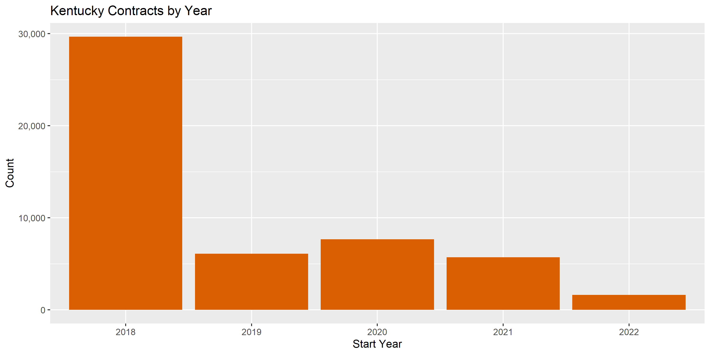
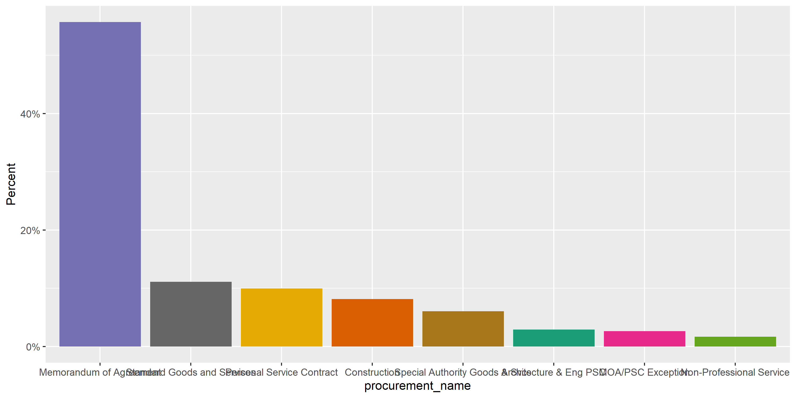
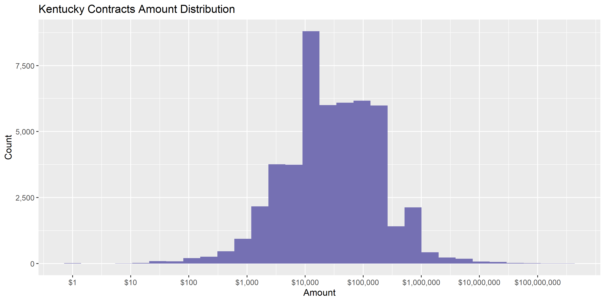
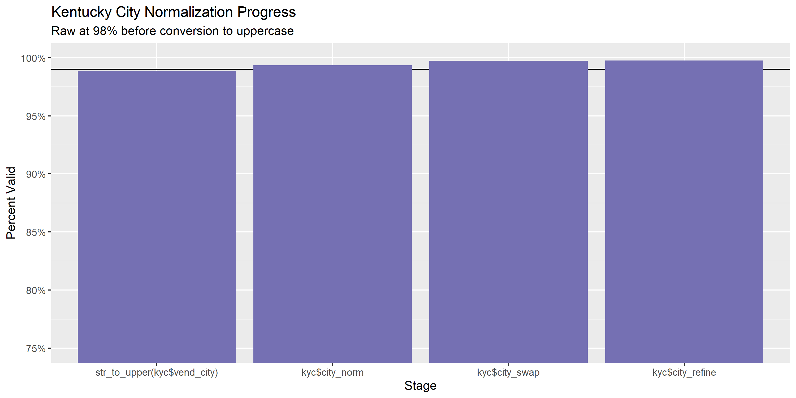
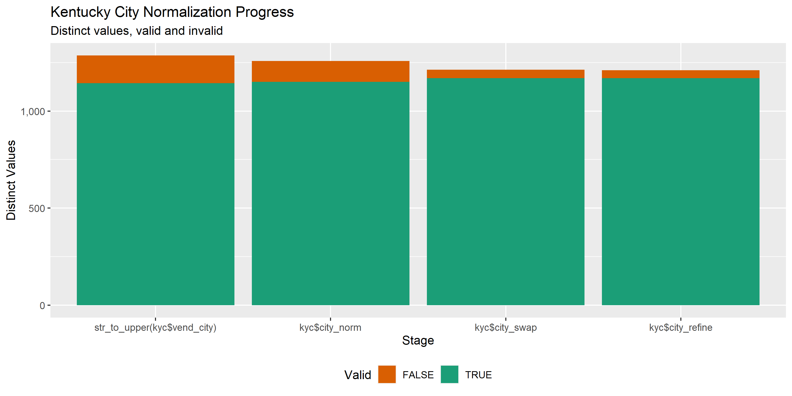

Kentucky Contracts
================
Jennifer LaFleur/Kiernan Nicholls
2023-01-03 13:14:08

-   [Project](#project)
-   [Objectives](#objectives)
-   [Packages](#packages)
-   [Data](#data)
-   [Read](#read)
-   [Explore](#explore)
-   [Wrangle](#wrangle)
-   [Conclude](#conclude)
-   [Export](#export)
-   [Dictionary](#dictionary)

<!-- Place comments regarding knitting here -->

## Project

The Accountability Project is an effort to cut across data silos and
give journalists, policy professionals, activists, and the public at
large a simple way to search across huge volumes of public data about
people and organizations.

Our goal is to standardize public data on a few key fields by thinking
of each dataset row as a transaction. For each transaction there should
be (at least) 3 variables:

1.  All **parties** to a transaction.
2.  The **date** of the transaction.
3.  The **amount** of money involved.

## Objectives

This document describes the process used to complete the following
objectives:

1.  How many records are in the database?
2.  Check for entirely duplicated records.
3.  Check ranges of continuous variables.
4.  Is there anything blank or missing?
5.  Check for consistency issues.
6.  Create a five-digit ZIP Code called `zip`.
7.  Create a `year` field from the transaction date.
8.  Make sure there is data on both parties to a transaction.

## Packages

The following packages are needed to collect, manipulate, visualize,
analyze, and communicate these results. The `pacman` package will
facilitate their installation and attachment.

The IRW’s `campfin` package will also have to be installed from GitHub.
This package contains functions custom made to help facilitate the
processing of campaign finance data.

``` r
if (!require("pacman")) install.packages("pacman")
pacman::p_load_gh("irworkshop/campfin")
pacman::p_load(
  tidyverse, # data manipulation
  lubridate, # datetime strings
  gluedown, # printing markdown
  magrittr, # pipe operators
  janitor, # clean data frames
  refinr, # cluster and merge
  scales, # format strings
  knitr, # knit documents
  vroom, # read files fast
  rvest, # html scraping
  glue, # combine strings
  here, # relative paths
  httr, # http requests
  fs, # local storage 
  stringi #string functions
)
```

This document should be run as part of the `R_campfin` project, which
lives as a sub-directory of the more general, language-agnostic
[`irworkshop/accountability_datacleaning`](https://github.com/irworkshop/accountability_datacleaning)
GitHub repository.

The `R_campfin` project uses the [RStudio
projects](https://support.rstudio.com/hc/en-us/articles/200526207-Using-Projects)
feature and should be run as such. The project also uses the dynamic
`here::here()` tool for file paths relative to *your* machine.

``` r
# where does this document knit?
here::here()
#> [1] "C:/Users/jla/Documents/jen_transition/AU_CLASSES/AUFALL22/rdata"
```

## Data

Kentucky contracts data were obtained via Public Records request by Nami
Hijikata.

## Read

``` r
kyc <- read.csv("KY_Contracts.csv")
head(kyc)
#> # A tibble: 6 × 21
#>   Link  ContractIde…¹ Class…² Class…³ Cited…⁴ Contr…⁵ DocId Branc…⁶ CabName DeptN…⁷ Reaso…⁸ Start…⁹
#>   <chr> <chr>         <chr>   <chr>   <chr>   <chr>   <chr> <chr>   <chr>   <chr>   <chr>   <chr>  
#> 1 NULL  4A5172AE-F58… ENGINE… 925     Compet… MA      2100… Judici… NULL    Judici… NULL    7/1/20…
#> 2 NULL  C0FCAC3F-7C4… NULL    NULL    Memora… PO      1900… Judici… NULL    Judici… Accoun… 7/1/20…
#> 3 NULL  E6143871-8DC… COMPUT… 209     Small … PO      2200… Execut… Educat… Depart… NULL    10/1/2…
#> 4 NULL  55A241F0-821… NULL    NULL    Memora… PO      1900… Judici… NULL    Judici… Accoun… 7/1/20…
#> 5 NULL  289B18CE-405… MISCEL… 961     Memora… PO      1900… Judici… NULL    Judici… NULL    7/1/20…
#> 6 NULL  434BAECA-C3E… NULL    NULL    Commer… PO      2200… Execut… Touris… Kentuc… NULL    8/17/2…
#> # … with 9 more variables: EndDate <chr>, VendCustId <chr>, VendName <chr>, VendAddress1 <chr>,
#> #   VendCity <chr>, VendState <chr>, VendZip <chr>, ProcurementName <chr>, ContractAmount <dbl>,
#> #   and abbreviated variable names ¹​ContractIdentifier, ²​Classification, ³​ClassificationCode,
#> #   ⁴​CitedAuthDescription, ⁵​ContractTypeCode, ⁶​BranchName, ⁷​DeptName, ⁸​ReasonModification,
#> #   ⁹​StartDate
```

There are two dates in the file. We used the year from start date as a
separate year column.

### Dates

``` r
kyc <- mutate(kyc, year = stri_sub(StartDate,-4))
```

``` r
prop_na(kyc$StartDate)
#> [1] 0
min(kyc$date, na.rm = TRUE)
#> [1] Inf
sum(kyc$year < 2000, na.rm = TRUE)
#> [1] 0
max(kyc$date, na.rm = TRUE)
#> [1] -Inf
sum(kyc$date > today(), na.rm = TRUE)
#> [1] 0
kyc$year <- na_if(kyc$year, 9999)
```

<!-- -->

Contracts have both `StartDate` and `EndDate`; we combine these two
variables into a single date to represent the transaction. We also make
the headers snake case. Replace the word NULL with actually NAs. Combine
cab_name and dept_name.

``` r
kyc <- kyc %>% 
  clean_names("snake") %>% 
  replace(kyc == "NULL", NA) %>% 
  mutate(date = paste0(start_date," to ", end_date)) %>% 
  unite("full_agency", c(cab_name, dept_name), sep=", ", remove = FALSE, na.rm = TRUE) %>% 
  mutate(vend_city=toupper(vend_city))
```

## Explore

``` r
glimpse(kyc)
#> Rows: 50,771
#> Columns: 24
#> $ link                   <chr> NA, NA, NA, NA, NA, NA, "https://secure2.kentucky.gov/Transparency…
#> $ contract_identifier    <chr> "4A5172AE-F580-4254-B59B-00008DE3E276", "C0FCAC3F-7C48-4439-BCE9-0…
#> $ classification         <chr> "ENGINEERING SERVICES, PROFESSIONAL", NA, "COMPUTER SOFTWARE FOR M…
#> $ classification_code    <chr> "925", NA, "209", NA, "961", NA, "924", "918", "912", "961", "924"…
#> $ cited_auth_description <chr> "Competitive Sealed Bidding", "Memorandum of Agreement", "Small Pu…
#> $ contract_type_code     <chr> "MA", "PO", "PO", "PO", "PO", "PO", "PO", "PO", "PO", "PO", "PO", …
#> $ doc_id                 <chr> "2100001036", "1900001843", "2200001377", "1900001881", "190000189…
#> $ branch_name            <chr> "Judicial", "Judicial", "Executive", "Judicial", "Judicial", "Exec…
#> $ full_agency            <chr> "Judicial Department", "Judicial Department", "Education & Workfor…
#> $ cab_name               <chr> NA, NA, "Education & Workforce Development Cabinet", NA, NA, "Tour…
#> $ dept_name              <chr> "Judicial Department", "Judicial Department", "Department For Work…
#> $ reason_modification    <chr> NA, "Accounting lines were not broken out by county.", NA, "Accoun…
#> $ start_date             <chr> "7/1/2021", "7/1/2018", "10/1/2019", "7/1/2018", "7/1/2018", "8/17…
#> $ end_date               <chr> "6/30/2022", "6/30/2019", "9/30/2020", "6/30/2019", "6/30/2019", "…
#> $ vend_cust_id           <chr> "KY0023046", "KY0036004", "KY0028928", "KY0018713", "KY0028291", "…
#> $ vend_name              <chr> "BRANDSTETTER CARROLL INC", "BLUEGRASS REGIONAL MH MR", "STATE OF …
#> $ vend_address1          <chr> "2360 CHAUVIN DR", "1351 NEWTOWN PIKE", "EUGENE T MAHONEY STATE PA…
#> $ vend_city              <chr> "LEXINGTON", "LEXINGTON", "ASHLAND", "LOUISVILLE", "CORBIN", "HARR…
#> $ vend_state             <chr> "KY", "KY", "NE", "KY", "KY", "KY", "KY", "KY", "KY", "KY", "KY", …
#> $ vend_zip               <chr> "40517", "40511-1277", "68003", "40223", "40702", "40330", "42633"…
#> $ procurement_name       <chr> "Standard Goods and Services", "Memorandum of Agreement", "Standar…
#> $ contract_amount        <dbl> 150000.00, 216000.00, 191.67, 67000.00, 10000.00, 75000.00, 8200.0…
#> $ year                   <chr> "2021", "2018", "2019", "2018", "2018", "2021", "2019", "2021", "2…
#> $ date                   <chr> "7/1/2021 to 6/30/2022", "7/1/2018 to 6/30/2019", "10/1/2019 to 9/…
tail(kyc)
#> # A tibble: 6 × 24
#>   link       contr…¹ class…² class…³ cited…⁴ contr…⁵ doc_id branc…⁶ full_…⁷ cab_n…⁸ dept_…⁹ reaso…˟
#>   <chr>      <chr>   <chr>   <chr>   <chr>   <chr>   <chr>  <chr>   <chr>   <chr>   <chr>   <chr>  
#> 1 <NA>       318535… <NA>    <NA>    Memora… PO      19000… Judici… Judici… <NA>    Judici… Accoun…
#> 2 <NA>       483E15… MISCEL… 961     Memora… PO      19000… Judici… Judici… <NA>    Judici… <NA>   
#> 3 <NA>       BF8D43… RENTAL… 981     Emerge… PO      23000… Execut… Cabine… Cabine… Depart… <NA>   
#> 4 <NA>       CC826E… <NA>    <NA>    Memora… PO      19000… Judici… Judici… <NA>    Judici… <NA>   
#> 5 https://s… 8EE4E5… <NA>    <NA>    Memora… PO      19000… Judici… Judici… <NA>    Judici… <NA>   
#> 6 <NA>       396B1C… <NA>    <NA>    Memora… PO      19000… Judici… Judici… <NA>    Judici… Accoun…
#> # … with 12 more variables: start_date <chr>, end_date <chr>, vend_cust_id <chr>, vend_name <chr>,
#> #   vend_address1 <chr>, vend_city <chr>, vend_state <chr>, vend_zip <chr>,
#> #   procurement_name <chr>, contract_amount <dbl>, year <chr>, date <chr>, and abbreviated
#> #   variable names ¹​contract_identifier, ²​classification, ³​classification_code,
#> #   ⁴​cited_auth_description, ⁵​contract_type_code, ⁶​branch_name, ⁷​full_agency, ⁸​cab_name,
#> #   ⁹​dept_name, ˟​reason_modification
```

### Missing

If we count the number of missing values per column, we can see a lot of
the values from the columns found only in one type of file are missing.

``` r
col_stats(kyc, count_na)
#> # A tibble: 24 × 4
#>    col                    class     n        p
#>    <chr>                  <chr> <int>    <dbl>
#>  1 link                   <chr> 38607 0.760   
#>  2 contract_identifier    <chr>     0 0       
#>  3 classification         <chr> 17130 0.337   
#>  4 classification_code    <chr> 17130 0.337   
#>  5 cited_auth_description <chr>     0 0       
#>  6 contract_type_code     <chr>     0 0       
#>  7 doc_id                 <chr>     0 0       
#>  8 branch_name            <chr>     0 0       
#>  9 full_agency            <chr>     0 0       
#> 10 cab_name               <chr> 24918 0.491   
#> 11 dept_name              <chr>     0 0       
#> 12 reason_modification    <chr> 30930 0.609   
#> 13 start_date             <chr>     0 0       
#> 14 end_date               <chr>     0 0       
#> 15 vend_cust_id           <chr>     0 0       
#> 16 vend_name              <chr>     0 0       
#> 17 vend_address1          <chr>     0 0       
#> 18 vend_city              <chr>     0 0       
#> 19 vend_state             <chr>    10 0.000197
#> 20 vend_zip               <chr>    14 0.000276
#> 21 procurement_name       <chr>     0 0       
#> 22 contract_amount        <dbl>     0 0       
#> 23 year                   <chr>     0 0       
#> 24 date                   <chr>     0 0
```

### Duplicates

There are no duplicate records in this database.

``` r
kyc <- flag_dupes(kyc, everything())
#> Warning in flag_dupes(kyc, everything()): no duplicate rows, column not created
```

### Categorical

``` r
col_stats(kyc, n_distinct)
#> # A tibble: 24 × 4
#>    col                    class     n         p
#>    <chr>                  <chr> <int>     <dbl>
#>  1 link                   <chr> 11840 0.233    
#>  2 contract_identifier    <chr> 49875 0.982    
#>  3 classification         <chr>   202 0.00398  
#>  4 classification_code    <chr>   207 0.00408  
#>  5 cited_auth_description <chr>   117 0.00230  
#>  6 contract_type_code     <chr>     2 0.0000394
#>  7 doc_id                 <chr> 19819 0.390    
#>  8 branch_name            <chr>     2 0.0000394
#>  9 full_agency            <chr>   147 0.00290  
#> 10 cab_name               <chr>    14 0.000276 
#> 11 dept_name              <chr>   144 0.00284  
#> 12 reason_modification    <chr>  4703 0.0926   
#> 13 start_date             <chr>  1436 0.0283   
#> 14 end_date               <chr>  1427 0.0281   
#> 15 vend_cust_id           <chr>  6463 0.127    
#> 16 vend_name              <chr>  6502 0.128    
#> 17 vend_address1          <chr>  6721 0.132    
#> 18 vend_city              <chr>  1286 0.0253   
#> 19 vend_state             <chr>    57 0.00112  
#> 20 vend_zip               <chr>  2460 0.0485   
#> 21 procurement_name       <chr>    14 0.000276 
#> 22 contract_amount        <dbl> 12150 0.239    
#> 23 year                   <chr>     5 0.0000985
#> 24 date                   <chr>  7647 0.151
```

``` r
explore_plot(kyc, classification, na.rm = TRUE)
```

<!-- -->

``` r
explore_plot(kyc, procurement_name, na.rm = TRUE)
```

<!-- -->

### Amounts

``` r
mean(kyc$contract_amount)
#> [1] 264228.9
noquote(map_chr(summary(kyc$contract_amount), dollar))
#>         Min.      1st Qu.       Median         Mean      3rd Qu.         Max. 
#>           $0    $7,863.70      $25,000     $264,229     $113,000 $311,589,050
```

<!-- -->

## Wrangle

To improve the searchability of the database, we will perform some
consistent, confident string normalization. For geographic variables
like city names and ZIP codes, the corresponding `campfin::normal_*()`
functions are tailor made to facilitate this process.

### Address

For the street `address` variable, the `campfin::normal_address()`
function will force consistence case, remove punctuation, and abbreviate
official USPS suffixes.

``` r
addr_norm <- kyc %>% 
  distinct(vend_address1) %>% 
  mutate(
    address_norm = normal_address(
      address = vend_address1,
      abbs = usps_street,
      na_rep = TRUE
    )
  )
```

``` r
addr_norm
#> # A tibble: 6,721 × 2
#>    vend_address1                   address_norm                   
#>    <chr>                           <chr>                          
#>  1 2360 CHAUVIN DR                 2360 CHAUVIN DR                
#>  2 1351 NEWTOWN PIKE               1351 NEWTOWN PIKE              
#>  3 EUGENE T MAHONEY STATE PARK     EUGENE T MAHONEY STATE PARK    
#>  4 10101 LINN STATION RD SUITE 600 10101 LINN STATION RD SUITE 600
#>  5 PO BOX 568                      PO BOX 568                     
#>  6 1015 Danville Road              1015 DANVILLE RD               
#>  7 134 COLLEGE ST                  134 COLLEGE ST                 
#>  8 3332 NEWBURG RD                 3332 NEWBURG RD                
#>  9 PO BOX 4157                     PO BOX 4157                    
#> 10 9226 MAIN STREET                9226 MAIN ST                   
#> # … with 6,711 more rows
```

``` r
kyc <- left_join(kyc, addr_norm, by = "vend_address1")
```

### ZIP

For ZIP codes, the `campfin::normal_zip()` function will attempt to
create valid *five* digit codes by removing the ZIP+4 suffix and
returning leading zeroes dropped by other programs like Microsoft Excel.

``` r
kyc <- kyc %>% 
  mutate(
    zip_norm = normal_zip(
      zip = vend_zip,
      na_rep = TRUE
    )
  )
```

``` r
progress_table(
  kyc$vend_zip,
  kyc$zip_norm,
  compare = valid_zip
)
#> # A tibble: 2 × 6
#>   stage        prop_in n_distinct  prop_na n_out n_diff
#>   <chr>          <dbl>      <dbl>    <dbl> <dbl>  <dbl>
#> 1 kyc$vend_zip   0.798       2460 0.000276 10232    822
#> 2 kyc$zip_norm   0.988       1944 0.000315   588    148
```

### State

Valid two digit state abbreviations can be made using the
`campfin::normal_state()` function.

``` r
kyc <- kyc %>% 
  mutate(
    state_norm = normal_state(
      state = vend_state,
      abbreviate = TRUE,
      na_rep = TRUE,
      valid = valid_state
    )
  )
```

``` r
kyc %>% 
  filter(vend_state != state_norm) %>% 
  count(vend_state, state_norm, sort = TRUE)
#> # A tibble: 0 × 3
#> # … with 3 variables: vend_state <chr>, state_norm <chr>, n <int>
```

``` r
progress_table(
  kyc$vend_state,
  kyc$state_norm,
  compare = valid_state
)
#> # A tibble: 2 × 6
#>   stage          prop_in n_distinct  prop_na n_out n_diff
#>   <chr>            <dbl>      <dbl>    <dbl> <dbl>  <dbl>
#> 1 kyc$vend_state   0.999         57 0.000197    37      8
#> 2 kyc$state_norm   1             50 0.000926     0      1
```

### City

Cities are the most difficult geographic variable to normalize, simply
due to the wide variety of valid cities and formats.

#### Normal

The `campfin::normal_city()` function is a good start, again converting
case, removing punctuation, but *expanding* USPS abbreviations. We can
also remove `invalid_city` values.

``` r
norm_city <- kyc %>% 
  distinct(vend_city, state_norm, zip_norm) %>% 
  mutate(
    city_norm = normal_city(
      city = vend_city, 
      abbs = usps_city,
      states = c("KY", "DC", "KENTUCKY"),
      na = invalid_city,
      na_rep = TRUE
    )
  )
```

#### Swap

We can further improve normalization by comparing our normalized value
against the *expected* value for that record’s state abbreviation and
ZIP code. If the normalized value is either an abbreviation for or very
similar to the expected value, we can confidently swap those two.

``` r
norm_city <- norm_city %>% 
  rename(city_raw = vend_city) %>% 
  left_join(
    y = zipcodes,
    by = c(
      "state_norm" = "state",
      "zip_norm" = "zip"
    )
  ) %>% 
  rename(city_match = city) %>% 
  mutate(
    match_abb = is_abbrev(city_norm, city_match),
    match_dist = str_dist(city_norm, city_match),
    city_swap = if_else(
      condition = !is.na(match_dist) & (match_abb | match_dist == 1),
      true = city_match,
      false = city_norm
    )
  ) %>% 
  select(
    -city_match,
    -match_dist,
    -match_abb
  )
```

``` r
kyc <- left_join(
  x = kyc,
  y = norm_city,
  by = c(
    "vend_city" = "city_raw", 
    "state_norm", 
    "zip_norm"
  )
)
```

#### Refine

The [OpenRefine](https://openrefine.org/) algorithms can be used to
group similar strings and replace the less common versions with their
most common counterpart. This can greatly reduce inconsistency, but with
low confidence; we will only keep any refined strings that have a valid
city/state/zip combination.

``` r
good_refine <- kyc %>% 
  mutate(
    city_refine = city_swap %>% 
      key_collision_merge() %>% 
      n_gram_merge(numgram = 1)
  ) %>% 
  filter(city_refine != city_swap) %>% 
  inner_join(
    y = zipcodes,
    by = c(
      "city_refine" = "city",
      "state_norm" = "state",
      "zip_norm" = "zip"
    )
  )
```

    #> # A tibble: 3 × 5
    #>   state_norm zip_norm city_swap     city_refine     n
    #>   <chr>      <chr>    <chr>         <chr>       <int>
    #> 1 OH         44202    AUOROA        AURORA          4
    #> 2 IL         60585    PLAINFIELD IL PLAINFIELD      1
    #> 3 KY         42754    LEICHTFIELD   LEITCHFIELD     1

Then we can join the refined values back to the database.

``` r
kyc <- kyc %>% 
  left_join(good_refine) %>% 
  mutate(city_refine = coalesce(city_refine, city_swap))
```

#### Progress

Our goal for normalization was to increase the proportion of city values
known to be valid and reduce the total distinct values by correcting
misspellings.

| stage                                                                  | prop_in | n_distinct | prop_na | n_out | n_diff |
|:-----------------------------------------------------------------------|--------:|-----------:|--------:|------:|-------:|
| str_to_upper(kyc$vend_city) | 0.988| 1286| 0| 586| 143| |kyc$city_norm |   0.994 |       1258 |       0 |   330 |    108 |
| kyc$city_swap | 0.997| 1213| 0| 127| 44| |kyc$city_refine              |   0.998 |       1210 |       0 |   121 |     41 |

You can see how the percentage of valid values increased with each
stage.

<!-- -->

More importantly, the number of distinct values decreased each stage. We
were able to confidently change many distinct invalid values to their
valid equivalent.

<!-- -->

## Conclude

Before exporting, we can remove the intermediary normalization columns
and rename all added variables with the `_clean` suffix.

``` r
kyc <- kyc %>% 
  select(
    -city_norm,
    -city_swap,
    city_clean = city_refine
  ) %>% 
  rename_all(~str_replace(., "_norm", "_clean")) %>% 
  rename_all(~str_remove(., "_raw")) %>% 
  relocate(state_clean, zip_clean, .after = city_clean)
```

``` r
glimpse(sample_n(kyc, 50))
#> Rows: 50
#> Columns: 28
#> $ link                   <chr> NA, NA, NA, NA, "https://secure2.kentucky.gov/TransparencyWebApi/v…
#> $ contract_identifier    <chr> "1075F0E1-1E50-4D88-BA82-E3739C36FE73", "45C78EA1-63CD-4240-96F9-5…
#> $ classification         <chr> NA, "MISCELLANEOUS PROFESSIONAL SERVICES", NA, NA, "CONSULTING SER…
#> $ classification_code    <chr> NA, "961", NA, NA, "918", "912", NA, "912", "803", NA, "961", NA, …
#> $ cited_auth_description <chr> "Memorandum of Agreement", "Memorandum of Agreement", "Memorandum …
#> $ contract_type_code     <chr> "PO", "PO", "PO", "PO", "PO", "PO", "PO", "PO", "PO", "PO", "PO", …
#> $ doc_id                 <chr> "1900001860", "1900001899", "1900001848", "1900001862", "200000272…
#> $ branch_name            <chr> "Judicial", "Judicial", "Judicial", "Judicial", "Executive", "Exec…
#> $ full_agency            <chr> "Judicial Department", "Judicial Department", "Judicial Department…
#> $ cab_name               <chr> NA, NA, NA, NA, "Education & Workforce Development Cabinet", "Ener…
#> $ dept_name              <chr> "Judicial Department", "Judicial Department", "Judicial Department…
#> $ reason_modification    <chr> "Accounting line was not broken out by county.", NA, NA, NA, NA, N…
#> $ start_date             <chr> "7/1/2018", "7/1/2018", "7/1/2018", "7/1/2018", "7/1/2020", "12/1/…
#> $ end_date               <chr> "6/30/2019", "6/30/2019", "6/30/2019", "6/30/2019", "6/30/2021", "…
#> $ vend_cust_id           <chr> "KY0036340", "KY0028291", "KY0035990", "KY0035989", "KY0035868", "…
#> $ vend_name              <chr> "Western KY Regional Mental Health & Retardation Advisory Brd", "C…
#> $ vend_address1          <chr> "425 Braodway Street", "PO BOX 568", "PO BOX 790", "P O BOX 2680",…
#> $ vend_city              <chr> "PADUCAH", "CORBIN", "ASHLAND", "COVINGTON", "GREENSBURG", "EDMONT…
#> $ vend_state             <chr> "KY", "KY", "KY", "KY", "KY", "KY", "KY", "KY", "KY", "KY", "KY", …
#> $ vend_zip               <chr> "42001", "40702", "41105-0790", "41011-2680", "42743", "42129", "4…
#> $ procurement_name       <chr> "Memorandum of Agreement", "Memorandum of Agreement", "Memorandum …
#> $ contract_amount        <dbl> 118000.00, 10000.00, 40000.00, 3000.00, 140011.00, 1350.00, 113000…
#> $ year                   <chr> "2018", "2018", "2018", "2018", "2020", "2019", "2018", "2021", "2…
#> $ date                   <chr> "7/1/2018 to 6/30/2019", "7/1/2018 to 6/30/2019", "7/1/2018 to 6/3…
#> $ address_clean          <chr> "425 BRAODWAY ST", "PO BOX 568", "PO BOX 790", "P O BOX 2680", "PO…
#> $ city_clean             <chr> "PADUCAH", "CORBIN", "ASHLAND", "COVINGTON", "GREENSBURG", "EDMONT…
#> $ state_clean            <chr> "KY", "KY", "KY", "KY", "KY", "KY", "KY", "KY", "KY", "KY", "KY", …
#> $ zip_clean              <chr> "42001", "40702", "41105", "41011", "42743", "42129", "41701", "41…
```

## Export

1.  There are 50,771 records in the database.
2.  There are 0 duplicate records in the database.
3.  The range and distribution of `amount` and `date` seem reasonable.
4.  There are 0 records missing key variables.
5.  There are no geographic variables to be normalized.
6.  The 4-digit `year` variable has been created.

Now the file can be saved on disk for upload to the Accountability
server.

``` r
clean_dir <- dir_create(here("ky", "contracts", "data", "clean"))
clean_path <- path(clean_dir, "ky_contracts_clean.csv")
write_csv(kyc, clean_path, na = "")
file_size(clean_path)
#> 22.8M
```

The encoding of the exported file should be UTF-8 or ASCII.

``` r
enc <- system2("file", args = paste("-i", clean_path), stdout = TRUE)
str_replace_all(enc, clean_path, basename)
#> [1] "ky_contracts_clean.csv: text/csv; charset=us-ascii"
```

## Dictionary

The following table describes the variables in our final exported file:

| Column                   | Type        | Overlaped | Definition             |
|:-------------------------|:------------|:----------|:-----------------------|
| `link`                   | `character` | TRUE      | link                   |
| `contract_identifier`    | `character` | TRUE      | contract_identifier    |
| `classification`         | `character` | TRUE      | classification         |
| `classification_code`    | `character` | FALSE     | classification_code    |
| `cited_auth_description` | `character` | TRUE      | cited_auth_description |
| `contract_type_code`     | `character` | TRUE      | contract_type_code     |
| `doc_id`                 | `character` | FALSE     | doc_id                 |
| `branch_name`            | `character` | TRUE      | branch_name            |
| `full_agency`            | `character` | FALSE     | full_agency            |
| `cab_name`               | `character` | FALSE     | cab_name               |
| `dept_name`              | `character` | FALSE     | dept_name              |
| `reason_modification`    | `character` | FALSE     | reason_modification    |
| `start_date`             | `character` | TRUE      | start_date             |
| `end_date`               | `character` | TRUE      | end_date               |
| `vend_cust_id`           | `character` | FALSE     | vend_cust_id           |
| `vend_name`              | `character` | FALSE     | vend_name              |
| `vend_address1`          | `character` | FALSE     | vend_address1          |
| `vend_city`              | `character` | TRUE      | vend_city              |
| `vend_state`             | `character` | TRUE      | vend_state             |
| `vend_zip`               | `character` | TRUE      | vend_zip               |
| `procurement_name`       | `character` | TRUE      | procurement_name       |
| `contract_amount`        | `double`    | TRUE      | contract_amount        |
| `year`                   | `character` | FALSE     | year                   |
| `date`                   | `character` | FALSE     | date                   |
| `address_clean`          | `character` | FALSE     | address_clean          |
| `city_clean`             | `character` | FALSE     | city_clean             |
| `state_clean`            | `character` | FALSE     | state_clean            |
| `zip_clean`              | `character` | FALSE     | zip_clean              |

``` r
write_lines(
  x = c("# Kentucky Contracts Data Dictionary\n", dict_md),
  path = here("ky", "contracts", "ky_contracts_dict.md"),
)
```
