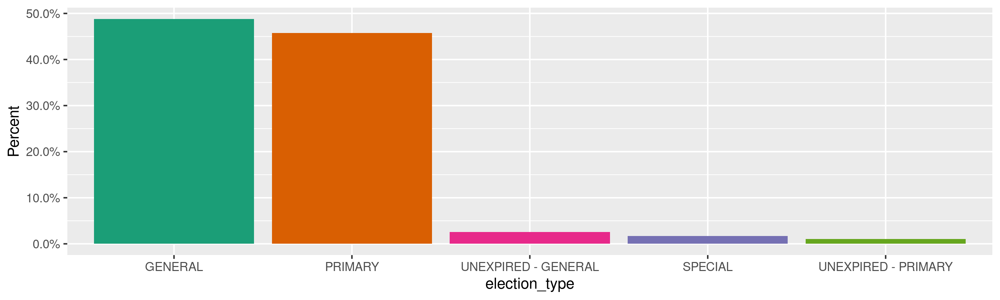
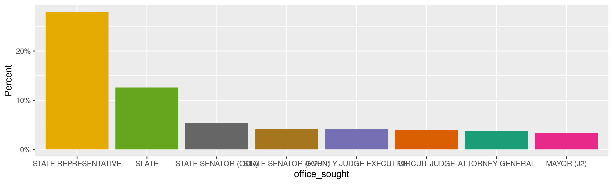
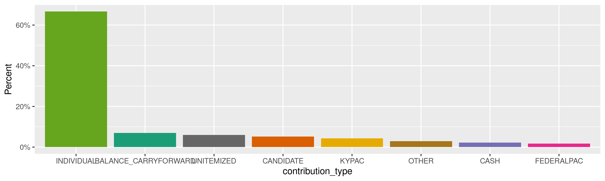
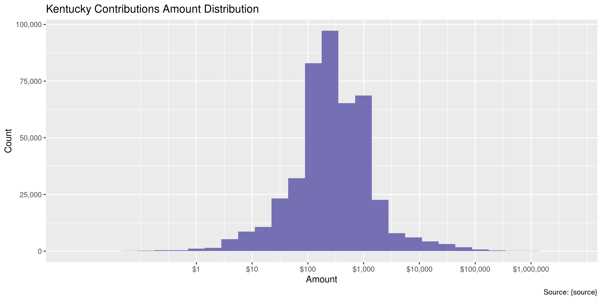
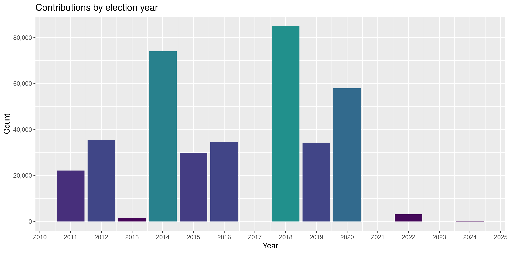

Kentucky Contributions
================
Kiernan Nicholls & Aarushi Sahejpal
Fri Mar 24 23:46:28 2023

- <a href="#project" id="toc-project">Project</a>
- <a href="#objectives" id="toc-objectives">Objectives</a>
- <a href="#packages" id="toc-packages">Packages</a>
- <a href="#data" id="toc-data">Data</a>
- <a href="#download" id="toc-download">Download</a>
- <a href="#read" id="toc-read">Read</a>
- <a href="#explore" id="toc-explore">Explore</a>
  - <a href="#missing" id="toc-missing">Missing</a>
  - <a href="#duplicates" id="toc-duplicates">Duplicates</a>
  - <a href="#categorical" id="toc-categorical">Categorical</a>
  - <a href="#amounts" id="toc-amounts">Amounts</a>
  - <a href="#dates" id="toc-dates">Dates</a>
- <a href="#wrangle" id="toc-wrangle">Wrangle</a>
  - <a href="#address" id="toc-address">Address</a>
  - <a href="#zip" id="toc-zip">ZIP</a>
  - <a href="#state" id="toc-state">State</a>
  - <a href="#city" id="toc-city">City</a>
- <a href="#conclude" id="toc-conclude">Conclude</a>
- <a href="#export" id="toc-export">Export</a>
- <a href="#upload" id="toc-upload">Upload</a>

<!-- Place comments regarding knitting here -->

## Project

The Accountability Project is an effort to cut across data silos and
give journalists, policy professionals, activists, and the public at
large a simple way to search across huge volumes of public data about
people and organizations.

Our goal is to standardize public data on a few key fields by thinking
of each dataset row as a transaction. For each transaction there should
be (at least) 3 variables:

1.  All **parties** to a transaction.
2.  The **date** of the transaction.
3.  The **amount** of money involved.

## Objectives

This document describes the process used to complete the following
objectives:

1.  How many records are in the database?
2.  Check for entirely duplicated records.
3.  Check ranges of continuous variables.
4.  Is there anything blank or missing?
5.  Check for consistency issues.
6.  Create a five-digit ZIP Code called `zip`.
7.  Create a `year` field from the transaction date.
8.  Make sure there is data on both parties to a transaction.

## Packages

The following packages are needed to collect, manipulate, visualize,
analyze, and communicate these results. The `pacman` package will
facilitate their installation and attachment.

``` r
if (!require("pacman")) {
  install.packages("pacman")
}
pacman::p_load(
  tidyverse, # data manipulation
  lubridate, # datetime strings
  gluedown, # printing markdown
  janitor, # clean data frames
  campfin, # custom irw tools
  aws.s3, # aws cloud storage
  refinr, # cluster & merge
  scales, # format strings
  knitr, # knit documents
  vroom, # fast reading
  rvest, # scrape html
  glue, # code strings
  here, # project paths
  httr, # http requests
  cli, # commend line
  fs # local storage 
)
```

This document should be run as part of the `R_campfin` project, which
lives as a sub-directory of the more general, language-agnostic
[`irworkshop/accountability_datacleaning`](https://github.com/irworkshop/accountability_datacleaning)
GitHub repository.

The `R_campfin` project uses the [RStudio
projects](https://support.rstudio.com/hc/en-us/articles/200526207-Using-Projects)
feature and should be run as such. The project also uses the dynamic
`here::here()` tool for file paths relative to *your* machine.

``` r
# where does this document knit?
here::i_am("ky/contribs/docs/ky_contribs_diary.Rmd")
```

## Data

State contributions can be obtained from the [Kentucky Registry of
Election Finance (KREF)](https://kref.ky.gov/Pages/default.aspx). Data
can be exported from the KREF candidate search
[page](https://secure.kentucky.gov/kref/publicsearch/CandidateSearch/).

## Download

Data must be requested in small, monthly chunks or the server will time
out and fail. We can request all contributions for each month since
2011.

``` r
raw_dir <- dir_create(here("ky", "contribs", "data", "raw"))
```

``` r
for (yr in 2011:2023) {
  cli_h2("Starting year: {yr}")
  for (mn in 1:12) {
    start_dt <- as.Date(paste(yr, mn, 1, sep = "-"))
    end_dt <- start_dt %m+% months(1) - days(1)
    if (start_dt > today()) {
      next
    }
    dt_path <- path(raw_dir, glue("ky-con_{yr}-{month.abb[mn]}.csv"))
    if (!file_exists(dt_path)) {
      ky_get <- RETRY(
        verb = "GET",
        "https://secure.kentucky.gov/kref/publicsearch/ExportContributors",
        write_disk(path = dt_path, overwrite = TRUE),
        query = list(
          ElectionDate = "",
          MaximalDate = end_dt,
          MinimalDate = start_dt,
          ContributionSearchType = "All"
        )
      )
      cli_alert_success("{month.abb[mn]}: {as.character(file_size(dt_path))}")
      Sys.sleep(10)
    } else {
      cli_alert_success("{month.abb[mn]} done!")
    }
  }
}
```

``` r
raw_info <- dir_info(raw_dir)
raw_info %>% 
  filter(size == 511) %>% 
  pull(path) %>% 
  file_delete()
```

``` r
raw_info <- dir_info(raw_dir)
sum(raw_info$size)
#> 174M
raw_info %>% 
  select(path, size, modification_time) %>% 
  mutate(across(path, basename))
#> # A tibble: 147 × 3
#>    path                       size modification_time  
#>    <chr>               <fs::bytes> <dttm>             
#>  1 ky-con_2011-Apr.csv        911K 2023-03-24 23:47:04
#>  2 ky-con_2011-Aug.csv        990K 2023-03-24 23:47:50
#>  3 ky-con_2011-Dec.csv        502K 2023-03-24 23:48:35
#>  4 ky-con_2011-Feb.csv        300K 2023-03-24 23:46:41
#>  5 ky-con_2011-Jan.csv        316K 2023-03-24 23:46:30
#>  6 ky-con_2011-Jul.csv        732K 2023-03-24 23:47:39
#>  7 ky-con_2011-Jun.csv        920K 2023-03-24 23:47:27
#>  8 ky-con_2011-Mar.csv        800K 2023-03-24 23:46:53
#>  9 ky-con_2011-May.csv        658K 2023-03-24 23:47:16
#> 10 ky-con_2011-Nov.csv        614K 2023-03-24 23:48:24
#> # … with 137 more rows
```

We have downloaded `nrow(raw_info)` files totaling `sum(raw_info$size)`
in size.

## Read

Given all of these files have the same structure, we can read them all
into a single data frame at once.

``` r
kyc <- map_dfr(
  .x = raw_info$path,
  .f = read_csv,
  col_types = cols(
    .default = col_character(),
    ElectionDate = col_date_mdy(),
    ExemptionStatus = col_logical(),
    Amount = col_double(),
    NumberOfContributors = col_integer()
  )
)
```

``` r
kyc <- clean_names(kyc, case = "snake")
```

## Explore

There are 674,610 rows of 34 columns. Each record represents a single
contribution from an organization or individual to a campaign or
committee.

``` r
glimpse(kyc)
#> Rows: 674,610
#> Columns: 34
#> $ to_organization        <chr> "FAYETTE COUNTY DEMOCRATIC EXECUTIVE COMMITTEE", "SCOTT COUNTY DEMOCRATIC EXECUTIVE COM…
#> $ from_organization_name <chr> NA, "TOTAL", "TOTAL", "IN-KIND TOTAL", "MAIN SOURCE BANK", "IN-KIND RECD. TOTAL", "CENT…
#> $ contributor_last_name  <chr> NA, NA, NA, NA, NA, NA, NA, NA, NA, "JUNG", NA, NA, "DERRICKSON", "POE", "ADKINS", "BLE…
#> $ contributor_first_name <chr> NA, NA, NA, NA, NA, NA, NA, NA, NA, "COURTNEY", NA, NA, "CHARLES", "WAYNE", "ROCKY", "W…
#> $ recipient_last_name    <chr> NA, NA, NA, NA, NA, NA, NA, NA, "BUTLER", "MOELLMAN", "LACKEY", "WUCHNER", "GRIMES", "G…
#> $ recipient_first_name   <chr> NA, NA, NA, NA, NA, NA, NA, NA, "DWIGHT", "KEN", "JOHN", "ADDIA", "ALISON LUNDERGAN", "…
#> $ office_sought          <chr> NA, NA, NA, NA, NA, NA, NA, NA, "STATE REPRESENTATIVE", "STATE TREASURER", "COMMISSIONE…
#> $ location               <chr> NA, NA, NA, NA, NA, NA, NA, NA, "18TH DISTRICT", "STATEWIDE", "STATEWIDE", "STATEWIDE",…
#> $ election_date          <date> NA, NA, NA, NA, NA, NA, NA, NA, 2012-05-22, 2011-11-08, 2011-05-17, 2011-05-17, 2011-0…
#> $ election_type          <chr> NA, NA, NA, NA, NA, NA, NA, NA, "PRIMARY", "GENERAL", "PRIMARY", "PRIMARY", "PRIMARY", …
#> $ exemption_status       <lgl> FALSE, FALSE, FALSE, FALSE, FALSE, FALSE, FALSE, FALSE, FALSE, FALSE, FALSE, FALSE, FAL…
#> $ other_text             <chr> NA, "TOTAL", "TOTAL", "IN-KIND - JON PARK", NA, "TOTAL", NA, NA, NA, NA, NA, "INTEREST"…
#> $ address1               <chr> NA, NA, NA, NA, "VERSAILLES ROAD", NA, "P.O. BOX 1360", "6300 DUTCHMANS PARKWAY", NA, "…
#> $ address2               <chr> NA, NA, NA, NA, NA, NA, NA, NA, NA, NA, NA, NA, NA, NA, NA, NA, NA, NA, "STE. 1A", NA, …
#> $ city                   <chr> NA, NA, NA, NA, "FRANKFORT", NA, "LEXINGTON", "LOUISVILLE", NA, "LAKESIDE PARK", "LOUIS…
#> $ state                  <chr> "N/A", "N/A", "N/A", "N/A", "N/A", "N/A", "KY", "KY", "N/A", "KY", "N/A", "KY", "N/A", …
#> $ zip                    <chr> NA, NA, NA, NA, "406010000", NA, "405880000", "402050000", NA, "41017", "402132031", "4…
#> $ amount                 <dbl> 3.14, 548.00, 2333.00, 87.77, 0.12, 1460.00, 17.00, 155.35, 4.65, 1000.00, 1000.00, 6.8…
#> $ contribution_type      <chr> "INTEREST", "OTHER", "OTHER", "OTHER", "INTEREST", "OTHER", "INTEREST", "KYPAC", "INTER…
#> $ contribution_mode      <chr> "DIRECT", "DIRECT", "DIRECT", "DIRECT", "DIRECT", "DIRECT", "DIRECT", "TRANSFER", "DIRE…
#> $ occupation             <chr> NA, NA, NA, NA, NA, NA, NA, NA, NA, NA, NA, NA, NA, NA, NA, NA, NA, NA, NA, NA, NA, NA,…
#> $ other_occupation       <chr> NA, NA, NA, NA, NA, NA, NA, NA, NA, NA, NA, NA, NA, NA, NA, NA, NA, NA, NA, NA, NA, NA,…
#> $ employer               <chr> NA, NA, NA, NA, NA, NA, NA, "REAL ESTATE PAC", NA, "IRS", NA, NA, "RETIRED", "RETIRED",…
#> $ spouse_prefix          <chr> NA, NA, NA, NA, NA, NA, NA, NA, NA, NA, NA, NA, NA, NA, NA, NA, NA, NA, NA, NA, NA, NA,…
#> $ spouse_last_name       <chr> NA, NA, NA, NA, NA, NA, NA, NA, NA, NA, NA, NA, "DERRICKSON", NA, "ADKINS", "BLEVINS", …
#> $ spouse_first_name      <chr> NA, NA, NA, NA, NA, NA, NA, NA, NA, NA, NA, NA, NA, NA, NA, NA, NA, NA, NA, NA, NA, NA,…
#> $ spouse_middle_initial  <chr> NA, NA, NA, NA, NA, NA, NA, NA, NA, NA, NA, NA, NA, NA, NA, NA, NA, NA, NA, NA, NA, NA,…
#> $ spouse_suffix          <chr> NA, NA, NA, NA, NA, NA, NA, NA, NA, NA, NA, NA, NA, NA, NA, NA, NA, NA, NA, NA, NA, NA,…
#> $ spouse_occupation      <chr> NA, NA, NA, NA, NA, NA, NA, NA, NA, NA, NA, NA, "LIBRARY ASSISTANT", NA, "HOMEMAKER", "…
#> $ spouse_employer        <chr> NA, NA, NA, NA, NA, NA, NA, NA, NA, NA, NA, NA, "RETIRED", NA, "N/A", "EAST KY PHLEBOTO…
#> $ number_of_contributors <int> 0, 0, 0, 0, 1, 0, 1, 1, 0, 0, 0, 0, 0, 0, 0, 0, 0, 1, 1, 1, 1, 1, 1, 1, 1, 1, 1, 1, 1, …
#> $ inkind_description     <chr> NA, NA, NA, "PROGRAMS FOR LINCOLN-REAGAN DAY LUNCHEON", NA, "VARIOUS", NA, NA, NA, NA, …
#> $ receipt_date           <chr> "04/30/2011 00:00:00", "04/30/2011 00:00:00", "04/30/2011 00:00:00", "04/30/2011 00:00:…
#> $ statement_type         <chr> "30 DAY POST", "30 DAY POST", "30 DAY POST", "30 DAY POST", "QUARTERLY", "30 DAY POST",…
tail(kyc)
#> # A tibble: 6 × 34
#>   to_organi…¹ from_…² contr…³ contr…⁴ recip…⁵ recip…⁶ offic…⁷ locat…⁸ election…⁹ elect…˟ exemp…˟ other…˟ addre…˟ addre…˟
#>   <chr>       <chr>   <chr>   <chr>   <chr>   <chr>   <chr>   <chr>   <date>     <chr>   <lgl>   <chr>   <chr>   <chr>  
#> 1 <NA>        <NA>    <NA>    <NA>    Chambe… Cassie  STATE … 19TH D… 2023-02-21 SPECIAL FALSE   <NA>    <NA>    <NA>   
#> 2 <NA>        <NA>    <NA>    <NA>    Chambe… Cassie  STATE … 19TH D… 2023-02-21 SPECIAL FALSE   <NA>    <NA>    <NA>   
#> 3 <NA>        <NA>    <NA>    <NA>    Chambe… Cassie  STATE … 19TH D… 2023-02-21 SPECIAL FALSE   <NA>    <NA>    <NA>   
#> 4 <NA>        <NA>    <NA>    <NA>    Chambe… Cassie  STATE … 19TH D… 2023-02-21 SPECIAL FALSE   <NA>    <NA>    <NA>   
#> 5 <NA>        <NA>    <NA>    <NA>    Chambe… Cassie  STATE … 19TH D… 2023-02-21 SPECIAL FALSE   <NA>    <NA>    <NA>   
#> 6 <NA>        <NA>    <NA>    <NA>    Chambe… Cassie  STATE … 19TH D… 2023-02-21 SPECIAL FALSE   <NA>    <NA>    <NA>   
#> # … with 20 more variables: city <chr>, state <chr>, zip <chr>, amount <dbl>, contribution_type <chr>,
#> #   contribution_mode <chr>, occupation <chr>, other_occupation <chr>, employer <chr>, spouse_prefix <chr>,
#> #   spouse_last_name <chr>, spouse_first_name <chr>, spouse_middle_initial <chr>, spouse_suffix <chr>,
#> #   spouse_occupation <chr>, spouse_employer <chr>, number_of_contributors <int>, inkind_description <chr>,
#> #   receipt_date <chr>, statement_type <chr>, and abbreviated variable names ¹​to_organization, ²​from_organization_name,
#> #   ³​contributor_last_name, ⁴​contributor_first_name, ⁵​recipient_last_name, ⁶​recipient_first_name, ⁷​office_sought,
#> #   ⁸​location, ⁹​election_date, ˟​election_type, ˟​exemption_status, ˟​other_text, ˟​address1, ˟​address2
```

### Missing

Columns vary in their degree of missing values.

``` r
col_stats(kyc, count_na)
#> # A tibble: 34 × 4
#>    col                    class       n      p
#>    <chr>                  <chr>   <int>  <dbl>
#>  1 to_organization        <chr>  524339 0.777 
#>  2 from_organization_name <chr>  619050 0.918 
#>  3 contributor_last_name  <chr>  195247 0.289 
#>  4 contributor_first_name <chr>  195246 0.289 
#>  5 recipient_last_name    <chr>  133930 0.199 
#>  6 recipient_first_name   <chr>  133930 0.199 
#>  7 office_sought          <chr>  133930 0.199 
#>  8 location               <chr>  133930 0.199 
#>  9 election_date          <date> 133930 0.199 
#> 10 election_type          <chr>  133930 0.199 
#> 11 exemption_status       <lgl>       0 0     
#> 12 other_text             <chr>  656095 0.973 
#> 13 address1               <chr>  146024 0.216 
#> 14 address2               <chr>  659762 0.978 
#> 15 city                   <chr>  145918 0.216 
#> 16 state                  <chr>   96004 0.142 
#> 17 zip                    <chr>  146320 0.217 
#> 18 amount                 <dbl>       0 0     
#> 19 contribution_type      <chr>       0 0     
#> 20 contribution_mode      <chr>   53227 0.0789
#> 21 occupation             <chr>  508671 0.754 
#> 22 other_occupation       <chr>  674610 1     
#> 23 employer               <chr>  270840 0.401 
#> 24 spouse_prefix          <chr>  674610 1     
#> 25 spouse_last_name       <chr>  589758 0.874 
#> 26 spouse_first_name      <chr>  674610 1     
#> 27 spouse_middle_initial  <chr>  674610 1     
#> 28 spouse_suffix          <chr>  674610 1     
#> 29 spouse_occupation      <chr>  591071 0.876 
#> 30 spouse_employer        <chr>  611956 0.907 
#> 31 number_of_contributors <int>       0 0     
#> 32 inkind_description     <chr>  658507 0.976 
#> 33 receipt_date           <chr>       0 0     
#> 34 statement_type         <chr>       0 0
```

Contributions can be made to an individual (with a `RecipientLastName`),
an organization (with a `ToOrganization` name), or an individual *with*
a committee name as well. We only want to flag records that are truly
missing *any* way to identify the parties of the transaction.

We can flag any record missing a key variable needed to identify a
transaction.

``` r
kyc <- kyc %>% 
  unite(
    col = recipient_any_name,
    recipient_first_name, recipient_last_name,
    sep = " ",
    remove = FALSE
  ) %>% 
  mutate(
    to_any = coalesce(to_organization, recipient_any_name)
  ) %>% 
  unite(
    col = contributor_any_name,
    contributor_first_name, contributor_last_name,
    sep = " ",
    remove = FALSE
  ) %>% 
  mutate(
    from_any = coalesce(from_organization_name, contributor_any_name)
  ) %>% 
  flag_na(to_any, from_any, amount) %>% 
  select(
    -recipient_any_name,
    -contributor_any_name,
    -to_any, -from_any
    )
```

``` r
sum(kyc$na_flag)
#> [1] 0
```

### Duplicates

We can also flag any record completely duplicated across every column.

``` r
kyc <- flag_dupes(kyc, everything())
sum(kyc$dupe_flag)
#> [1] 54093
```

`percent(mean(kyc$dupe_flag))` of all records are duplicates.

``` r
kyc %>% 
  filter(dupe_flag) %>% 
  select(
    contributor_last_name, recipient_last_name, 
    amount, election_date, address1
  ) %>% 
  arrange(recipient_last_name, election_date, amount)
#> # A tibble: 54,093 × 5
#>    contributor_last_name recipient_last_name amount election_date address1
#>    <chr>                 <chr>                <dbl> <date>        <chr>   
#>  1 <NA>                  Abraham                100 2020-11-03    <NA>    
#>  2 <NA>                  Abraham                100 2020-11-03    <NA>    
#>  3 <NA>                  Ackerman                50 2022-05-17    <NA>    
#>  4 <NA>                  Ackerman                50 2022-05-17    <NA>    
#>  5 <NA>                  Ackerman                50 2022-05-17    <NA>    
#>  6 <NA>                  Ackerman               100 2022-05-17    <NA>    
#>  7 <NA>                  Ackerman               100 2022-05-17    <NA>    
#>  8 <NA>                  Ackerman               100 2022-05-17    <NA>    
#>  9 <NA>                  Ackerman               100 2022-05-17    <NA>    
#> 10 <NA>                  Ackerman               100 2022-05-17    <NA>    
#> # … with 54,083 more rows
```

Without a contribution date, it’s difficult to identify these duplicates
as stemming from a flaw in the data (rather than “true” duplicate repeat
payments). We will flag them but not remove any.

### Categorical

``` r
col_stats(kyc, n_distinct)
#> # A tibble: 36 × 4
#>    col                    class       n          p
#>    <chr>                  <chr>   <int>      <dbl>
#>  1 to_organization        <chr>     925 0.00137   
#>  2 from_organization_name <chr>    9983 0.0148    
#>  3 contributor_last_name  <chr>   45007 0.0667    
#>  4 contributor_first_name <chr>   21737 0.0322    
#>  5 recipient_last_name    <chr>    4511 0.00669   
#>  6 recipient_first_name   <chr>    2169 0.00322   
#>  7 office_sought          <chr>      46 0.0000682 
#>  8 location               <chr>    1267 0.00188   
#>  9 election_date          <date>     57 0.0000845 
#> 10 election_type          <chr>       6 0.00000889
#> 11 exemption_status       <lgl>       1 0.00000148
#> 12 other_text             <chr>    3978 0.00590   
#> 13 address1               <chr>  208732 0.309     
#> 14 address2               <chr>    3141 0.00466   
#> 15 city                   <chr>    9288 0.0138    
#> 16 state                  <chr>      60 0.0000889 
#> 17 zip                    <chr>   28183 0.0418    
#> 18 amount                 <dbl>   51622 0.0765    
#> 19 contribution_type      <chr>      26 0.0000385 
#> 20 contribution_mode      <chr>       9 0.0000133 
#> 21 occupation             <chr>   12959 0.0192    
#> 22 other_occupation       <chr>       1 0.00000148
#> 23 employer               <chr>  109757 0.163     
#> 24 spouse_prefix          <chr>       1 0.00000148
#> 25 spouse_last_name       <chr>   10997 0.0163    
#> 26 spouse_first_name      <chr>       1 0.00000148
#> 27 spouse_middle_initial  <chr>       1 0.00000148
#> 28 spouse_suffix          <chr>       1 0.00000148
#> 29 spouse_occupation      <chr>    5870 0.00870   
#> 30 spouse_employer        <chr>   18342 0.0272    
#> 31 number_of_contributors <int>     377 0.000559  
#> 32 inkind_description     <chr>    7593 0.0113    
#> 33 receipt_date           <chr>    4404 0.00653   
#> 34 statement_type         <chr>      13 0.0000193 
#> 35 na_flag                <lgl>       1 0.00000148
#> 36 dupe_flag              <lgl>       2 0.00000296
```

<!-- --><!-- --><!-- --><!-- -->

### Amounts

``` r
summary(kyc$amount)
#>     Min.  1st Qu.   Median     Mean  3rd Qu.     Max. 
#> -4917869       50      200     1561      500  4917869
mean(kyc$amount <= 0)
#> [1] 0.01241013
```

These are the records with the minimum and maximum amounts.

``` r
glimpse(kyc[c(which.max(kyc$amount), which.min(kyc$amount)), ])
#> Rows: 2
#> Columns: 36
#> $ to_organization        <chr> NA, NA
#> $ from_organization_name <chr> NA, NA
#> $ contributor_last_name  <chr> "HEINER", "HEINER"
#> $ contributor_first_name <chr> "HAL", "HAL"
#> $ recipient_last_name    <chr> "HEINER", "HEINER"
#> $ recipient_first_name   <chr> "HAL", "HAL"
#> $ office_sought          <chr> "SLATE", "SLATE"
#> $ location               <chr> "STATEWIDE", "STATEWIDE"
#> $ election_date          <date> 2015-05-19, 2015-05-19
#> $ election_type          <chr> "PRIMARY", "PRIMARY"
#> $ exemption_status       <lgl> FALSE, FALSE
#> $ other_text             <chr> NA, NA
#> $ address1               <chr> "15101 PIERCY MILL RD", "15101 PIERCY MILL RD"
#> $ address2               <chr> NA, NA
#> $ city                   <chr> "LOUISVILLE", "LOUISVILLE"
#> $ state                  <chr> "KY", "KY"
#> $ zip                    <chr> "40245", "40245"
#> $ amount                 <dbl> 4917869, -4917869
#> $ contribution_type      <chr> "CANDIDATE_DEBT_ASSUMPTION", "CANDIDATE"
#> $ contribution_mode      <chr> "DIRECT", "LOAN"
#> $ occupation             <chr> NA, NA
#> $ other_occupation       <chr> NA, NA
#> $ employer               <chr> NA, NA
#> $ spouse_prefix          <chr> NA, NA
#> $ spouse_last_name       <chr> NA, NA
#> $ spouse_first_name      <chr> NA, NA
#> $ spouse_middle_initial  <chr> NA, NA
#> $ spouse_suffix          <chr> NA, NA
#> $ spouse_occupation      <chr> NA, NA
#> $ spouse_employer        <chr> NA, NA
#> $ number_of_contributors <int> 0, 0
#> $ inkind_description     <chr> NA, NA
#> $ receipt_date           <chr> "11/10/2015 00:00:00", "11/10/2015 00:00:00"
#> $ statement_type         <chr> "ANNUAL", "ANNUAL"
#> $ na_flag                <lgl> FALSE, FALSE
#> $ dupe_flag              <lgl> FALSE, FALSE
```

<!-- -->

### Dates

There is no variable containing the actual date the contributions were
made.

The `election_date` is the only date variable.

<!-- -->

## Wrangle

To improve the searchability of the database, we will perform some
consistent, confident string normalization. For geographic variables
like city names and ZIP codes, the corresponding `campfin::normal_*()`
functions are tailor made to facilitate this process.

### Address

For the street `addresss` variable, the `campfin::normal_address()`
function will force consistence case, remove punctuation, and abbreviate
official USPS suffixes.

``` r
kyc <- kyc %>% 
  unite(
    col = address_full,
    starts_with("address"),
    sep = " ",
    remove = FALSE,
    na.rm = TRUE
  ) %>% 
  mutate(
    address_norm = normal_address(
      address = address_full,
      abbs = usps_street,
      na_rep = TRUE
    )
  ) %>% 
  select(-address_full)
```

``` r
kyc %>% 
  select(contains("address")) %>% 
  distinct() %>% 
  sample_n(10)
#> # A tibble: 10 × 3
#>    address1                   address2 address_norm              
#>    <chr>                      <chr>    <chr>                     
#>  1 1400 WILLOW                <NA>     1400 WILLOW               
#>  2 539 BARBERRY LANE          <NA>     539 BARBERRY LN           
#>  3 580 Scaffold Cane Rd.      <NA>     580 SCAFFOLD CANE RD      
#>  4 336 JONAQUIN CIRCLE        <NA>     336 JONAQUIN CIR          
#>  5 4751 FOX RUN ROAD          <NA>     4751 FOX RUN RD           
#>  6 558 Beech Grove Rd         <NA>     558 BEECH GROVE RD        
#>  7 3267 Ashby Fork Road       <NA>     3267 ASHBY FORK RD        
#>  8 1666 CONNECTICUT AVENUE NW <NA>     1666 CONNECTICUT AVENUE NW
#>  9 217 BAYWOOD                <NA>     217 BAYWOOD               
#> 10 P. O. BOX 4253             <NA>     PO BOX 4253
```

### ZIP

For ZIP codes, the `campfin::normal_zip()` function will attempt to
create valid *five* digit codes by removing the ZIP+4 suffix and
returning leading zeroes dropped by other programs like Microsoft Excel.

``` r
kyc <- kyc %>% 
  mutate(
    zip_norm = normal_zip(
      zip = zip,
      na_rep = TRUE
    )
  )
```

``` r
progress_table(
  kyc$zip,
  kyc$zip_norm,
  compare = valid_zip
)
#> # A tibble: 2 × 6
#>   stage        prop_in n_distinct prop_na  n_out n_diff
#>   <chr>          <dbl>      <dbl>   <dbl>  <dbl>  <dbl>
#> 1 kyc$zip        0.656      28183   0.217 181750  21695
#> 2 kyc$zip_norm   0.996       8415   0.221   2161    842
```

### State

Valid two digit state abbreviations can be made using the
`campfin::normal_state()` function.

``` r
kyc <- kyc %>% 
  mutate(
    state_norm = normal_state(
      state = state,
      abbreviate = TRUE,
      na_rep = TRUE,
      valid = valid_state
    )
  )
```

``` r
kyc %>% 
  filter(state != state_norm) %>% 
  count(state, state_norm, sort = TRUE)
#> # A tibble: 0 × 3
#> # … with 3 variables: state <chr>, state_norm <chr>, n <int>
```

``` r
progress_table(
  kyc$state,
  kyc$state_norm,
  compare = valid_state
)
#> # A tibble: 2 × 6
#>   stage          prop_in n_distinct prop_na  n_out n_diff
#>   <chr>            <dbl>      <dbl>   <dbl>  <dbl>  <dbl>
#> 1 kyc$state        0.627         60   0.142 215977      8
#> 2 kyc$state_norm   1             53   0.462      0      1
```

### City

Cities are the most difficult geographic variable to normalize, simply
due to the wide variety of valid cities and formats.

#### Normal

The `campfin::normal_city()` function is a good start, again converting
case, removing punctuation, but *expanding* USPS abbreviations. We can
also remove `invalid_city` values.

``` r
norm_city <- kyc %>% 
  distinct(city, state_norm, zip_norm) %>% 
  mutate(
    city_norm = normal_city(
      city = city, 
      abbs = usps_city,
      states = c("KY", "DC", "KENTUCKY"),
      na = invalid_city,
      na_rep = TRUE
    )
  )
```

#### Swap

We can further improve normalization by comparing our normalized value
against the *expected* value for that record’s state abbreviation and
ZIP code. If the normalized value is either an abbreviation for or very
similar to the expected value, we can confidently swap those two.

``` r
norm_city <- norm_city %>% 
  rename(city_raw = city) %>% 
  left_join(
    y = zipcodes,
    by = c(
      "state_norm" = "state",
      "zip_norm" = "zip"
    )
  ) %>% 
  rename(city_match = city) %>% 
  mutate(
    match_abb = is_abbrev(city_norm, city_match),
    match_dist = str_dist(city_norm, city_match),
    city_swap = if_else(
      condition = !is.na(match_dist) & (match_abb | match_dist == 1),
      true = city_match,
      false = city_norm
    )
  ) %>% 
  select(
    -city_match,
    -match_dist,
    -match_abb
  )
```

``` r
kyc <- left_join(
  x = kyc,
  y = norm_city,
  by = c(
    "city" = "city_raw", 
    "state_norm", 
    "zip_norm"
  )
)
```

#### Refine

The [OpenRefine](https://openrefine.org/) algorithms can be used to
group similar strings and replace the less common versions with their
most common counterpart. This can greatly reduce inconsistency, but with
low confidence; we will only keep any refined strings that have a valid
city/state/zip combination.

``` r
good_refine <- kyc %>% 
  mutate(
    city_refine = city_swap %>% 
      key_collision_merge() %>% 
      n_gram_merge(numgram = 1)
  ) %>% 
  filter(city_refine != city_swap) %>% 
  inner_join(
    y = zipcodes,
    by = c(
      "city_refine" = "city",
      "state_norm" = "state",
      "zip_norm" = "zip"
    )
  )
```

    #> # A tibble: 85 × 5
    #>    state_norm zip_norm city_swap          city_refine          n
    #>    <chr>      <chr>    <chr>              <chr>            <int>
    #>  1 KY         42301    OWENSOBOR          OWENSBORO           34
    #>  2 KY         41129    CATTLESBURG        CATLETTSBURG        14
    #>  3 OH         45202    CINCINATTI         CINCINNATI           9
    #>  4 KY         42003    PAUDUACH           PADUCAH              8
    #>  5 OH         45255    CINCINATTI         CINCINNATI           8
    #>  6 KY         42717    BURKESVVILE        BURKESVILLE          7
    #>  7 KY         41129    CATTLETSBURG       CATLETTSBURG         6
    #>  8 KY         40056    PEE WEE VALLEY     PEWEE VALLEY         5
    #>  9 KY         42001    PADACUAH           PADUCAH              4
    #> 10 OH         44251    WESTERFIELD CENTER WESTFIELD CENTER     4
    #> # … with 75 more rows

Then we can join the refined values back to the database.

``` r
kyc <- kyc %>% 
  left_join(good_refine, by = names(.)) %>% 
  mutate(city_refine = coalesce(city_refine, city_swap))
```

#### Progress

Our goal for normalization was to increase the proportion of city values
known to be valid and reduce the total distinct values by correcting
misspellings.

| stage                                                                    | prop_in | n_distinct | prop_na | n_out | n_diff |
|:-------------------------------------------------------------------------|--------:|-----------:|--------:|------:|-------:|
| str_to_upper(kyc$city) | 0.966| 6833| 0.216| 17929| 2944| |kyc$city_norm |   0.982 |       6554 |   0.218 |  9305 |   2643 |
| kyc$city_swap | 0.991| 5379| 0.218| 4559| 1443| |kyc$city_refine         |   0.992 |       5329 |   0.218 |  4361 |   1393 |

You can see how the percentage of valid values increased with each
stage.

<!-- -->

More importantly, the number of distinct values decreased each stage. We
were able to confidently change many distinct invalid values to their
valid equivalent.

<!-- -->

## Conclude

Before exporting, we can remove the intermediary normalization columns
and rename all added variables with the `_clean` suffix.

``` r
kyc <- kyc %>% 
  select(
    -city_norm,
    -city_swap,
    city_clean = city_refine
  ) %>% 
  rename_all(~str_replace(., "_norm", "_clean")) %>% 
  rename_all(~str_remove(., "_raw")) %>% 
  relocate(city_clean, .after = address_clean)
```

``` r
glimpse(sample_n(kyc, 50))
#> Rows: 50
#> Columns: 40
#> $ to_organization        <chr> NA, NA, NA, NA, NA, NA, NA, NA, NA, "TIME WARNER CABLE KENTUCKY, PAC", NA, NA, NA, NA, …
#> $ from_organization_name <chr> NA, NA, NA, "Teamsters Local 100 Drive (PAC)", NA, NA, NA, NA, NA, NA, NA, NA, "INTERNA…
#> $ contributor_last_name  <chr> NA, "OSBORNE", "MCCOY", NA, "GRAHAM", "MCCOLLUM", "Hayes", "Hermes", NA, "DAY", "Parker…
#> $ contributor_first_name <chr> NA, "CRYSTAL", "ELIZABETH", NA, "DERRICK", "AMRGARET", "William", "Tyson", NA, "HEATHER…
#> $ recipient_last_name    <chr> "Bailey", "JOHNSON", "BECHLER", "Montgomery", "GRIMES", "MCCOLLOM", "Collett", "Gilbert…
#> $ recipient_first_name   <chr> "Carlos", "ROB", "LYNN", "Timothy", "ALISON LUNDERGAN", "CHARLES", "Joshua", "Courtney"…
#> $ office_sought          <chr> "CITY COMMISSIONER (A)", "COURT OF APPEALS JUDGE", "STATE REPRESENTATIVE", "STATE REPRE…
#> $ location               <chr> "BOWLING GREEN-WARREN", "5TH DISTRICT-1ST DIVISION", "4TH DISTRICT", "66TH DISTRICT", "…
#> $ election_date          <date> 2022-11-08, 2018-11-06, 2018-05-22, 2022-11-08, 2011-05-17, 2018-11-06, 2022-11-08, 20…
#> $ election_type          <chr> "GENERAL", "UNEXPIRED - GENERAL", "PRIMARY", "GENERAL", "PRIMARY", "GENERAL", "GENERAL"…
#> $ exemption_status       <lgl> FALSE, FALSE, FALSE, FALSE, FALSE, FALSE, FALSE, FALSE, FALSE, FALSE, FALSE, FALSE, FAL…
#> $ other_text             <chr> NA, NA, NA, NA, NA, NA, NA, NA, NA, NA, NA, NA, NA, NA, NA, NA, NA, NA, NA, NA, NA, NA,…
#> $ address1               <chr> NA, "301 WHISPERING BROOK DR.", "506 DEEPWOOD DRIVE", "2100 Oak Rd", "157 BELLEMEADE DR…
#> $ address2               <chr> NA, NA, NA, NA, NA, NA, NA, NA, NA, NA, NA, NA, NA, NA, NA, NA, NA, NA, NA, NA, NA, NA,…
#> $ city                   <chr> NA, "NICHOLASVILLE", "HOPKINSVILLE", "Cincinnati", "FRANKFORT", "HENDERSON", "Middlesbo…
#> $ state                  <chr> NA, "KY", "KY", "OH", "N/A", "KY", "KY", "KY", NA, "N/A", "KY", "KY", "DC", "KY", "N/A"…
#> $ zip                    <chr> NA, "40356", "42240", "45241", "406013945", "41420", "40965", "41018", NA, "400140000",…
#> $ amount                 <dbl> 100.00, 500.00, 250.00, 1000.00, 150.00, 2000.00, 1000.00, 100.00, 5.00, 26.92, 50.00, …
#> $ contribution_type      <chr> "UNITEMIZED", "INDIVIDUAL", "INDIVIDUAL", "KYPAC", "INDIVIDUAL", "INDIVIDUAL", "INDIVID…
#> $ contribution_mode      <chr> "EVENT_FUNDRAISING", "DIRECT", "EVENT_FUNDRAISING", "DIRECT", "DIRECT", "DIRECT", "DIRE…
#> $ occupation             <chr> NA, NA, NA, NA, NA, NA, "Attorney", "Construction Management", NA, NA, "Retired", "Admi…
#> $ other_occupation       <chr> NA, NA, NA, NA, NA, NA, NA, NA, NA, NA, NA, NA, NA, NA, NA, NA, NA, NA, NA, NA, NA, NA,…
#> $ employer               <chr> NA, "CRYSTAL OSBORNE", "PLANTERS BANK", NA, "FRANKFORT INDEPENDENT SCHOOLS", NA, "Hayes…
#> $ spouse_prefix          <chr> NA, NA, NA, NA, NA, NA, NA, NA, NA, NA, NA, NA, NA, NA, NA, NA, NA, NA, NA, NA, NA, NA,…
#> $ spouse_last_name       <chr> NA, NA, "MCCOY", NA, "GRAHAM", NA, NA, NA, NA, NA, NA, NA, NA, NA, "GUILLAUME", NA, NA,…
#> $ spouse_first_name      <chr> NA, NA, NA, NA, NA, NA, NA, NA, NA, NA, NA, NA, NA, NA, NA, NA, NA, NA, NA, NA, NA, NA,…
#> $ spouse_middle_initial  <chr> NA, NA, NA, NA, NA, NA, NA, NA, NA, NA, NA, NA, NA, NA, NA, NA, NA, NA, NA, NA, NA, NA,…
#> $ spouse_suffix          <chr> NA, NA, NA, NA, NA, NA, NA, NA, NA, NA, NA, NA, NA, NA, NA, NA, NA, NA, NA, NA, NA, NA,…
#> $ spouse_occupation      <chr> NA, NA, "RESTAURANT OWNER", NA, "U.S. SOCIAL SECURITY ADMIN. CLAIMS REP", NA, NA, NA, N…
#> $ spouse_employer        <chr> NA, NA, NA, NA, "FEDERAL COURT", NA, NA, NA, NA, NA, NA, NA, NA, NA, "CENTURY", NA, NA,…
#> $ number_of_contributors <int> 1, 0, 0, 0, 0, 0, 0, 0, 1, 1, 0, 0, 0, 0, 0, 0, 122, 0, 0, 1, 0, 1, 0, 1, 0, 0, 0, 0, 0…
#> $ inkind_description     <chr> NA, NA, NA, NA, NA, NA, NA, NA, NA, NA, NA, NA, NA, NA, NA, NA, NA, NA, NA, NA, NA, NA,…
#> $ receipt_date           <chr> "09/08/2022 00:00:00", "09/18/2018 00:00:00", "03/29/2018 00:00:00", "06/21/2022 00:00:…
#> $ statement_type         <chr> "60 DAY PRE", "30 DAY PRE", "30 DAY PRE", "60 DAY PRE", "32-DAY PRE", "30 DAY PRE", "60…
#> $ na_flag                <lgl> FALSE, FALSE, FALSE, FALSE, FALSE, FALSE, FALSE, FALSE, FALSE, FALSE, FALSE, FALSE, FAL…
#> $ dupe_flag              <lgl> TRUE, FALSE, FALSE, FALSE, FALSE, FALSE, FALSE, FALSE, TRUE, FALSE, FALSE, FALSE, FALSE…
#> $ address_clean          <chr> NA, "301 WHISPERING BROOK DR", "506 DEEPWOOD DR", "2100 OAK RD", "157 BELLEMEADE DR", "…
#> $ city_clean             <chr> NA, "NICHOLASVILLE", "HOPKINSVILLE", "CINCINNATI", "FRANKFORT", "HENDERSON", "MIDDLESBO…
#> $ zip_clean              <chr> NA, "40356", "42240", "45241", "40601", "41420", "40965", "41018", NA, "40014", "40324"…
#> $ state_clean            <chr> NA, "KY", "KY", "OH", NA, "KY", "KY", "KY", NA, NA, "KY", "KY", "DC", "KY", NA, "KY", N…
```

1.  There are 674,610 records in the database.
2.  There are 54,093 duplicate records in the database.
3.  The range and distribution of `amount` and `date` seem reasonable.
4.  There are 0 records missing key variables.
5.  Consistency in geographic data has been improved with
    `campfin::normal_*()`.
6.  The 4-digit `year` variable has been created with
    `lubridate::year()`.

## Export

Now the file can be saved on disk for upload to the Accountability
server.

``` r
clean_dir <- dir_create(here("ky", "contribs", "data", "clean"))
clean_path <- path(clean_dir, "ky_contribs_clean.csv")
write_csv(kyc, clean_path, na = "")
(clean_size <- file_size(clean_path))
#> 157M
non_ascii(clean_path)
#> # A tibble: 340 × 2
#>       row line                                                                                                          
#>     <int> <chr>                                                                                                         
#>  1 342341 ",,PEACH,LEN<c3><89>E,BESHEAR,ANDREW,SLATE,STATEWIDE,2019-05-21,PRIMARY,FALSE,,4686 VERSAILLES RD,,FRANKFORT,…
#>  2 357740 "\"BUILDING INDUSTRY ASSOCIATION OF GREATER LOUISVILLE, PAC\",,NA<c3><8f>VE,JENNIFER,,,,,,,FALSE,,7803 ROLLIN…
#>  3 382204 ",,PEACH,LEN<c3><89>E,BESHEAR,ANDREW,SLATE,STATEWIDE,2019-11-05,GENERAL,FALSE,,4686 VERSAILLES RD,,FRANKFORT,…
#>  4 400359 "\"BUILDING INDUSTRY ASSOCIATION OF GREATER LOUISVILLE, PAC\",,NA<c3><8f>VE,JENNIFER,,,,,,,FALSE,,7803 ROLLIN…
#>  5 405377 ",,HAAS,ERIC,Bevin,Matt,SLATE,STATEWIDE,2019-11-05,GENERAL,FALSE,,42 STARDUST PT,,FORT THOMAS,KY,410750000,50…
#>  6 408293 "\"KENTUCKY LAND TITLE ASSOCIATION, PAC\",,Mitchell,Jeremy,,,,,,,FALSE,,5670 Old Richmond Rd<c2><a0>,,Lexingt…
#>  7 409113 ",,Laughlin,Joshua,REILLY,SHAWN,LEGISLATIVE COUNCIL - EVEN,JEFFERSON-DIST 8,2020-05-19,PRIMARY,FALSE,,1622 Ro…
#>  8 409979 ",Kentucky Distiller<e2><80><99>s Association Bourbon Trail,,,Westrom,Susan,STATE REPRESENTATIVE,79TH DISTRIC…
#>  9 410047 ",,O<e2><80><99>Bryan,Donna,Westrom,Susan,STATE REPRESENTATIVE,79TH DISTRICT,2020-11-03,GENERAL,FALSE,,3124 O…
#> 10 410052 ",The Women<e2><80><99>s Network,,,Westrom,Susan,STATE REPRESENTATIVE,79TH DISTRICT,2020-11-03,GENERAL,FALSE,…
#> # … with 330 more rows
```

## Upload

We can use the `aws.s3::put_object()` to upload the text file to the IRW
server.

``` r
aws_path <- path("csv", basename(clean_path))
if (!object_exists(aws_path, "publicaccountability")) {
  put_object(
    file = clean_path,
    object = aws_path, 
    bucket = "publicaccountability",
    acl = "public-read",
    show_progress = TRUE,
    multipart = TRUE
  )
}
aws_head <- head_object(aws_path, "publicaccountability")
(aws_size <- as_fs_bytes(attr(aws_head, "content-length")))
unname(aws_size == clean_size)
```
