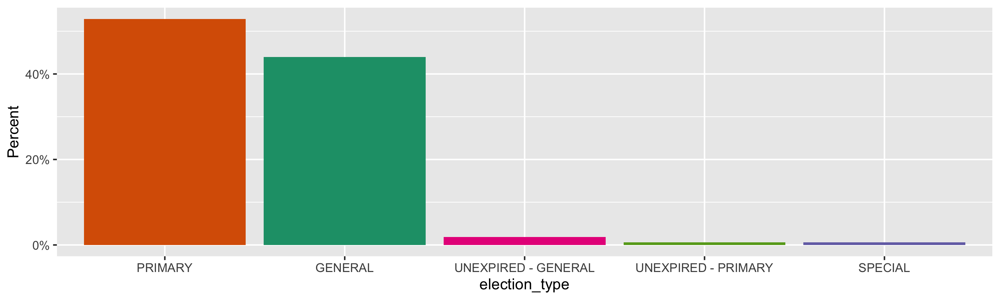
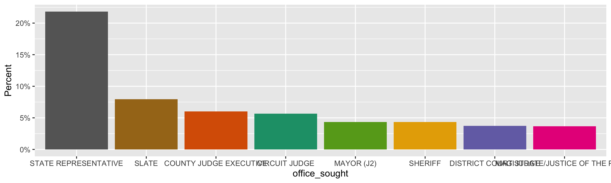
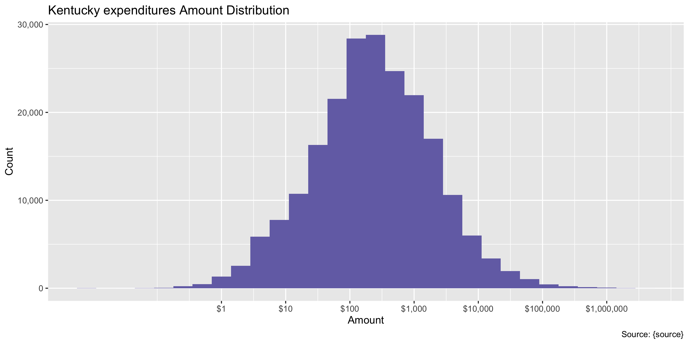
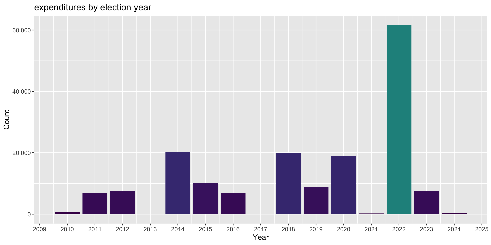

Kentucky Expenditures
================
Yanqi Xu & Kiernan Nicholls
Sat Dec 9 11:13:44 2023

- [Project](#project)
- [Objectives](#objectives)
- [Packages](#packages)
- [Source](#source)
- [Data](#data)
- [Download](#download)
- [Read](#read)
- [Explore](#explore)
  - [Missing](#missing)
  - [Duplicates](#duplicates)
  - [Categorical](#categorical)
  - [Amounts](#amounts)
  - [Dates](#dates)
- [Conclude](#conclude)
- [Export](#export)
- [Upload](#upload)

<!-- Place comments regarding knitting here -->

## Project

The Accountability Project is an effort to cut across data silos and
give journalists, policy professionals, activists, and the public at
large a simple way to search across huge volumes of public data about
people and organizations.

Our goal is to standardize public data on a few key fields by thinking
of each dataset row as a transaction. For each transaction there should
be (at least) 3 variables:

1.  All **parties** to a transaction.
2.  The **date** of the transaction.
3.  The **amount** of money involved.

## Objectives

This document describes the process used to complete the following
objectives:

1.  How many records are in the database?
2.  Check for entirely duplicated records.
3.  Check ranges of continuous variables.
4.  Is there anything blank or missing?
5.  Check for consistency issues.
6.  Create a five-digit ZIP Code called `zip`.
7.  Create a `year` field from the transaction date.
8.  Make sure there is data on both parties to a transaction.

## Packages

The following packages are needed to collect, manipulate, visualize,
analyze, and communicate these results. The `pacman` package will
facilitate their installation and attachment.

``` r
if (!require("pacman")) {
  install.packages("pacman")
}
pacman::p_load(
  tidyverse, # data manipulation
  lubridate, # datetime strings
  gluedown, # printing markdown
  janitor, # clean data frames
  campfin, # custom irw tools
  aws.s3, # aws cloud storage
  refinr, # cluster & merge
  scales, # format strings
  knitr, # knit documents
  vroom, # fast reading
  rvest, # scrape html
  glue, # code strings
  here, # project paths
  httr, # http requests
  cli, # commend line
  fs # local storage 
)
```

This diary was run using `campfin` version 1.0.10.9001.

``` r
packageVersion("campfin")
#> [1] '1.0.10.9001'
```

This document should be run as part of the `R_tap` project, which lives
as a sub-directory of the more general, language-agnostic
[`irworkshop/accountability_datacleaning`](https://github.com/irworkshop/accountability_datacleaning)
GitHub repository.

The `R_tap` project uses the [RStudio
projects](https://support.rstudio.com/hc/en-us/articles/200526207-Using-Projects)
feature and should be run as such. The project also uses the dynamic
`here::here()` tool for file paths relative to *your* machine.

``` r
# where does this document knit?
here::i_am("state/ky/expends/docs/ky_expends_diary.Rmd")
```

## Source

## Data

State expenditures can be obtained from the [Kentucky Registry of
Election Finance (KREF)](https://kref.ky.gov/Pages/default.aspx). Data
can be exported from the KREF candidate search
[page](https://secure.kentucky.gov/kref/publicsearch/CandidateSearch/).

## Download

We can request all expenditures for each month since Jan 1, 2011.

``` r
raw_dir <- dir_create(here("state","ky", "expends", "data", "raw"))
```

``` r
raw_info <- dir_info(raw_dir)
sum(raw_info$size)
#> 37M
raw_info %>% 
  select(path, size, modification_time) %>% 
  mutate(across(path, basename))
#> # A tibble: 1 × 3
#>   path                                             size modification_time  
#>   <chr>                                     <fs::bytes> <dttm>             
#> 1 export_expenditure_638366622231446162.csv         37M 2023-11-27 00:10:24
```

We have downloaded `nrow(raw_info)` files totaling `sum(raw_info$size)`
in size.

## Read

Given all of these files have the same structure, we can read them all
into a single data frame at once.

``` r
kye <- read_csv(
  raw_info$path,
  name_repair = make_clean_names,
  col_types = cols(
    .default = col_character(),
   disbursement_date = col_datetime(format="%m/%d/%Y %H:%M:%S"),
   election_date = col_datetime(format = "%m/%d/%Y %H:%M:%S"),
    disbursement_amount = col_double()
  )
)
```

## Explore

There are 213,460 rows of 16 columns. Each record represents a single
contribution from an organization or individual to a campaign or
committee.

``` r
glimpse(kye)
#> Rows: 213,460
#> Columns: 16
#> $ recipient_last_name        <chr> "White", "Watts", NA, NA, NA, "Kahne", "Moser", "Dame", "Bine", "Vanderglas", "Vand…
#> $ recipient_first_name       <chr> "Richard", "Casey", NA, NA, NA, "Robert", "Kimberly", "Curtis", "Douglas", "Justin"…
#> $ organization_name          <chr> NA, NA, "Strategic Impact", "Rowan County Education Association", "Committee to Ele…
#> $ purpose                    <chr> "FUNDS TRANSFERRED TO FILER 419602", "Cash out / close account", "VOID: Strategic C…
#> $ occupation                 <chr> NA, "Director of Relationship Management (Treasurer)", NA, NA, NA, "Data scientist"…
#> $ disbursement_code          <chr> "TRANSFER", "MONETARY", "MONETARY", "MONETARY", "MONETARY", "MONETARY", "TRANSFER",…
#> $ disbursement_amount        <dbl> 1614.64, 257.80, -964.55, -200.00, 87.74, 1000.00, 56471.04, 69.25, 172.05, 2000.00…
#> $ disbursement_date          <dttm> 2023-11-22, 2023-11-22, 2023-11-21, 2023-11-21, 2023-11-20, 2023-11-19, 2023-11-17…
#> $ from_candidate_first_name  <chr> "Richard", "Robby", "Richard", "Richard", "Ben", "Josie", "Kimberly", "CURTIS", "Do…
#> $ from_candidate_last_name   <chr> "White", "Waters", "White", "White", "Leonard", "Raymond", "Moser", "DAME", "Bine",…
#> $ from_organization_name     <chr> NA, NA, NA, NA, NA, NA, NA, NA, NA, NA, NA, NA, NA, NA, NA, NA, NA, NA, NA, NA, NA,…
#> $ statement_type             <chr> "ANNUAL", "ANNUAL", "ANNUAL", "ANNUAL", "ANNUAL", "ANNUAL", "ANNUAL", "ANNUAL", "AN…
#> $ office_sought              <chr> "STATE REPRESENTATIVE", "CITY COUNCIL MEMBER (A)", "STATE REPRESENTATIVE", "STATE R…
#> $ election_date              <dttm> 2022-11-08, 2022-11-08, 2022-11-08, 2022-11-08, 2022-05-17, 2024-05-21, 2022-11-08…
#> $ election_type              <chr> "GENERAL", "GENERAL", "GENERAL", "GENERAL", "PRIMARY", "PRIMARY", "GENERAL", "UNEXP…
#> $ is_independent_expenditure <chr> NA, NA, NA, NA, NA, NA, NA, NA, NA, NA, NA, NA, NA, NA, NA, NA, NA, NA, NA, NA, NA,…
tail(kye)
#> # A tibble: 6 × 16
#>   recipien…¹ recip…² organ…³ purpose occup…⁴ disbu…⁵ disbu…⁶ disbursement_date   from_…⁷ from_…⁸ from_…⁹ state…˟ offic…˟
#>   <chr>      <chr>   <chr>   <chr>   <chr>   <chr>     <dbl> <dttm>              <chr>   <chr>   <chr>   <chr>   <chr>  
#> 1 <NA>       <NA>    BALANC… BALANC… <NA>    MONETA…  17049. 2011-01-01 00:00:00 STAN    LEE     <NA>    60 DAY… STATE …
#> 2 <NA>       <NA>    BALANC… BALANC… <NA>    MONETA…  11993. 2011-01-01 00:00:00 DWIGHT  BUTLER  <NA>    60 DAY… STATE …
#> 3 <NA>       <NA>    TOTAL   TOTAL   <NA>    MONETA…  11057. 2011-01-01 00:00:00 ELIZAB… TORI    <NA>    60 DAY… STATE …
#> 4 <NA>       <NA>    BALANC… BALANC… <NA>    MONETA…  28342. 2011-01-01 00:00:00 DAN     SEUM    <NA>    60 DAY… STATE …
#> 5 <NA>       <NA>    BALANC… BALANC… <NA>    MONETA…   1270. 2011-01-01 00:00:00 STEVE   TRIBBLE <NA>    60 DAY… COUNTY…
#> 6 <NA>       <NA>    BALANC… BALANC… <NA>    MONETA…   5720. 2011-01-01 00:00:00 DAN     JOHNSON <NA>    60 DAY… LEGISL…
#> # … with 3 more variables: election_date <dttm>, election_type <chr>, is_independent_expenditure <chr>, and abbreviated
#> #   variable names ¹​recipient_last_name, ²​recipient_first_name, ³​organization_name, ⁴​occupation, ⁵​disbursement_code,
#> #   ⁶​disbursement_amount, ⁷​from_candidate_first_name, ⁸​from_candidate_last_name, ⁹​from_organization_name,
#> #   ˟​statement_type, ˟​office_sought
```

### Missing

Columns vary in their degree of missing values.

``` r
col_stats(kye, count_na)
#> # A tibble: 16 × 4
#>    col                        class       n         p
#>    <chr>                      <chr>   <int>     <dbl>
#>  1 recipient_last_name        <chr>  178299 0.835    
#>  2 recipient_first_name       <chr>  178299 0.835    
#>  3 organization_name          <chr>   35165 0.165    
#>  4 purpose                    <chr>       7 0.0000328
#>  5 occupation                 <chr>  156778 0.734    
#>  6 disbursement_code          <chr>       0 0        
#>  7 disbursement_amount        <dbl>       0 0        
#>  8 disbursement_date          <dttm>      0 0        
#>  9 from_candidate_first_name  <chr>   43293 0.203    
#> 10 from_candidate_last_name   <chr>   43293 0.203    
#> 11 from_organization_name     <chr>  161875 0.758    
#> 12 statement_type             <chr>       0 0        
#> 13 office_sought              <chr>   43293 0.203    
#> 14 election_date              <dttm>  43293 0.203    
#> 15 election_type              <chr>   43293 0.203    
#> 16 is_independent_expenditure <chr>  199289 0.934
```

expenditures can be made to an individual (with a
`from_candidate_last_name`), an organization (with a
`from_organization_name` name), or an individual *with* a committee name
as well. We only want to flag records that are truly missing *any* way
to identify the parties of the transaction.

We can flag any record missing a key variable needed to identify a
transaction.

``` r
kye <- kye %>% 
   unite(
    col = from_candidate_any_name,
    from_candidate_first_name, from_candidate_last_name,
    sep = " ",
    remove = FALSE
  ) %>% 
  mutate(
    from_any = coalesce(from_organization_name, from_candidate_any_name)
  ) %>% 
   unite(
    col = recipient_any_name,
    recipient_first_name, recipient_last_name,
    sep = " ",
    remove = FALSE
  ) %>% 
  mutate(
    to_any = coalesce(recipient_any_name, organization_name)
  ) %>% 
  flag_na(to_any, from_any, disbursement_amount) %>% 
  select(
    -from_candidate_any_name,
    -recipient_any_name,
    -to_any, -from_any
    )
```

``` r
sum(kye$na_flag)
#> [1] 0
```

### Duplicates

We can also flag any record completely duplicated across every column.

``` r
kye <- flag_dupes(kye, everything())
sum(kye$dupe_flag)
#> [1] 2924
```

`percent(mean(kye$dupe_flag))` of all records are duplicates.

``` r
kye %>% 
  filter(dupe_flag) %>% 
  select(
    from_candidate_last_name, recipient_last_name, 
    disbursement_amount, election_date, office_sought
  ) %>% 
  arrange(from_candidate_last_name, election_date, disbursement_amount)
#> # A tibble: 2,924 × 5
#>    from_candidate_last_name recipient_last_name disbursement_amount election_date       office_sought          
#>    <chr>                    <chr>                             <dbl> <dttm>              <chr>                  
#>  1 ADKINS                   <NA>                               200  2018-11-06 00:00:00 STATE REPRESENTATIVE   
#>  2 ADKINS                   <NA>                               200  2018-11-06 00:00:00 STATE REPRESENTATIVE   
#>  3 AKERS                    <NA>                              1099. 2014-05-20 00:00:00 CITY COUNCIL MEMBER (J)
#>  4 AKERS                    <NA>                              1099. 2014-05-20 00:00:00 CITY COUNCIL MEMBER (J)
#>  5 ARLINGHAUS               DIMMERMAN                         2250  2014-05-20 00:00:00 COUNTY JUDGE EXECUTIVE 
#>  6 ARLINGHAUS               DIMMERMAN                         2250  2014-05-20 00:00:00 COUNTY JUDGE EXECUTIVE 
#>  7 Abrams                   <NA>                              1000  2022-05-17 00:00:00 MAYOR (J2)             
#>  8 Abrams                   <NA>                              1000  2022-05-17 00:00:00 MAYOR (J2)             
#>  9 Adams                    <NA>                               200  2022-11-08 00:00:00 STATE SENATOR (EVEN)   
#> 10 Adams                    <NA>                               200  2022-11-08 00:00:00 STATE SENATOR (EVEN)   
#> # … with 2,914 more rows
```

Without a contribution date, it’s difficult to identify these duplicates
as stemming from a flaw in the data (rather than “true” duplicate repeat
payments). We will flag them but not remove any.

### Categorical

``` r
col_stats(kye, n_distinct)
#> # A tibble: 18 × 4
#>    col                        class      n          p
#>    <chr>                      <chr>  <int>      <dbl>
#>  1 recipient_last_name        <chr>   6051 0.0283    
#>  2 recipient_first_name       <chr>   3368 0.0158    
#>  3 organization_name          <chr>  35865 0.168     
#>  4 purpose                    <chr>  65460 0.307     
#>  5 occupation                 <chr>   5545 0.0260    
#>  6 disbursement_code          <chr>      6 0.0000281 
#>  7 disbursement_amount        <dbl>  64027 0.300     
#>  8 disbursement_date          <dttm>  4608 0.0216    
#>  9 from_candidate_first_name  <chr>   2131 0.00998   
#> 10 from_candidate_last_name   <chr>   4468 0.0209    
#> 11 from_organization_name     <chr>    930 0.00436   
#> 12 statement_type             <chr>     13 0.0000609 
#> 13 office_sought              <chr>     46 0.000215  
#> 14 election_date              <dttm>    56 0.000262  
#> 15 election_type              <chr>      6 0.0000281 
#> 16 is_independent_expenditure <chr>      3 0.0000141 
#> 17 na_flag                    <lgl>      1 0.00000468
#> 18 dupe_flag                  <lgl>      2 0.00000937
```

<!-- --><!-- -->

### Amounts

``` r
summary(kye$disbursement_amount)
#>    Min. 1st Qu.  Median    Mean 3rd Qu.    Max. 
#> -400000      50     211    2916    1000 5000000
mean(kye$disbursement_amount <= 0)
#> [1] 0.008844748
```

These are the records with the minimum and maximum amounts.

``` r
glimpse(kye[c(which.max(kye$disbursement_amount), which.min(kye$disbursement_amount)), ])
#> Rows: 2
#> Columns: 18
#> $ recipient_last_name        <chr> "Beshear", NA
#> $ recipient_first_name       <chr> "Andrew", NA
#> $ organization_name          <chr> NA, "Armada Strategies, LLC"
#> $ purpose                    <chr> "FUNDS TRANSFERRED TO FILER 419117", "Reversal of ACH Payment to Armada Strategies,…
#> $ occupation                 <chr> NA, NA
#> $ disbursement_code          <chr> "TRANSFER", "MONETARY"
#> $ disbursement_amount        <dbl> 5e+06, -4e+05
#> $ disbursement_date          <dttm> 2023-06-15, 2023-04-03
#> $ from_candidate_first_name  <chr> "Andy", NA
#> $ from_candidate_last_name   <chr> "Beshear", NA
#> $ from_organization_name     <chr> NA, "Commonwealth PAC"
#> $ statement_type             <chr> "30 DAY POST", "30 DAY PRE"
#> $ office_sought              <chr> "GOVERNOR", NA
#> $ election_date              <dttm> 2023-05-16, NA
#> $ election_type              <chr> "PRIMARY", NA
#> $ is_independent_expenditure <chr> NA, NA
#> $ na_flag                    <lgl> FALSE, FALSE
#> $ dupe_flag                  <lgl> FALSE, FALSE
```

<!-- -->

### Dates

There is no variable containing the actual date the expenditures were
made.

The `election_date` is the only date variable.

<!-- -->

## Conclude

``` r
glimpse(sample_n(kye, 50))
#> Rows: 50
#> Columns: 19
#> $ recipient_last_name        <chr> NA, NA, NA, NA, NA, NA, NA, NA, NA, NA, NA, "Kolb", NA, NA, NA, "JONES", "Lucas", N…
#> $ recipient_first_name       <chr> NA, NA, NA, NA, NA, NA, NA, NA, NA, NA, NA, "Chris", NA, NA, NA, "LYDIA", "Debbie",…
#> $ organization_name          <chr> "TEMPS PLUS", "Signarama", "ELITE GRAPHICS, INC.", "Creasy Mahan Nature Preserve", …
#> $ purpose                    <chr> "OFFICE HELP", "Banners", "CAMPAIGN MATERIALS", "501.C.# Charity", "contribution", …
#> $ occupation                 <chr> "Unknown", NA, NA, NA, NA, NA, NA, NA, NA, NA, NA, "Education Related", NA, NA, NA,…
#> $ disbursement_code          <chr> "NONE", "MONETARY", "MONETARY", "MONETARY", "MONETARY", "MONETARY", "MONETARY", "MO…
#> $ disbursement_amount        <dbl> 130.65, 551.25, 543.25, 544.00, 500.00, 49.59, 3147.96, 200.00, 1268.00, 119.33, 57…
#> $ disbursement_date          <dttm> 2020-03-03, 2022-10-27, 2014-09-16, 2022-05-05, 2022-01-27, 2015-07-31, 2015-03-10…
#> $ from_candidate_first_name  <chr> "George", "James", "ANDREW", "Brent", "Kelly", "ANDREW", "HAL", "Chris", "Luke", "P…
#> $ from_candidate_last_name   <chr> "Bray", "Lombardi", "BESHEAR", "Likins", "Flood", "BESHEAR", "HEINER", "Couch", "Ki…
#> $ from_organization_name     <chr> NA, NA, NA, NA, NA, NA, NA, NA, NA, NA, NA, "KENTUCKY FIREMEN & OILERS POLITICAL LE…
#> $ statement_type             <chr> "30 DAY PRE", "30 DAY POST", "QUARTERLY", "30 DAY POST", "ANNUAL", "32-DAY PRE", "3…
#> $ office_sought              <chr> "MAYOR (J1)", "CITY COUNCIL MEMBER (J)", "ATTORNEY GENERAL", "MAGISTRATE/JUSTICE OF…
#> $ election_date              <dttm> 2020-05-19, 2022-11-08, 2015-05-19, 2022-05-17, 2020-11-03, 2015-11-03, 2015-05-19…
#> $ election_type              <chr> "PRIMARY", "GENERAL", "PRIMARY", "PRIMARY", "GENERAL", "GENERAL", "PRIMARY", "PRIMA…
#> $ is_independent_expenditure <chr> NA, NA, NA, NA, NA, NA, NA, NA, NA, NA, NA, NA, NA, NA, NA, "False", NA, NA, NA, NA…
#> $ na_flag                    <lgl> FALSE, FALSE, FALSE, FALSE, FALSE, FALSE, FALSE, FALSE, FALSE, FALSE, FALSE, FALSE,…
#> $ dupe_flag                  <lgl> FALSE, FALSE, FALSE, FALSE, FALSE, FALSE, FALSE, TRUE, FALSE, FALSE, FALSE, FALSE, …
#> $ year                       <dbl> 2020, 2022, 2015, 2022, 2020, 2015, 2015, 2022, 2022, 2022, 2018, NA, 2014, 2022, 2…
```

1.  There are 213,460 records in the database.
2.  There are 2,924 duplicate records in the database.
3.  The range and distribution of `amount` and `date` seem reasonable.
4.  There are 0 records missing key variables.
5.  Consistency in geographic data has been improved with
    `campfin::normal_*()`.
6.  The 4-digit `year` variable has been created with
    `lubridate::year()`.

## Export

``` r
kye <- kye %>% select(-na_flag)
```

Now the file can be saved on disk for upload to the Accountability
server.

``` r
clean_dir <- dir_create(here("state","ky", "expends", "data", "clean"))
clean_path <- path(clean_dir, "ky_expends_clean.csv")
write_csv(kye, clean_path, na = "")
(clean_size <- file_size(clean_path))
#> 32.4M
non_ascii(clean_path)
#> # A tibble: 240 × 2
#>      row line                                                                                                           
#>    <int> <chr>                                                                                                          
#>  1   367 ",,Via Media,Advertising Expense I.E. <e2><80><93> In Support of Andy Beshear (D),,MONETARY,30000,2023-10-11T0…
#>  2   368 ",,Media Pros Productions,Video Production Expense I.E. <e2><80><93> In Support of Andy Beshear (D),,MONETARY,…
#>  3   698 ",,Washington County Democratic Womens Club,Reimbursement to Washington County Democratic Womens Club for 1/4 …
#>  4   699 "Crowley,Margy,,Reimbursement to Margy Crowley for August 1/4 page ad for BESHEAR in Hale Realty Brochure,Reti…
#>  5   718 "Benz,Angela,,Reimbursement to Angela Benz for ink pens with <e2><80><9c>vote for BESHEAR<e2><80><9d> engraved…
#>  6   845 ",,Hale Realty,Full page Ad for BESHEAR in Oct issue of Hale Realty Brochure,,MONETARY,1000,2023-09-25T00:00:0…
#>  7  1233 ",,\"Black Gold Committee, Inc.\",Black Gold Festival Booth Fee,,MONETARY,125,2023-09-14T00:00:00Z,,,Perry Cou…
#>  8  2461 ",,Andy Beshear for Governor,Candidate Contribution,,MONETARY,750,2023-08-01T00:00:00Z,,,Perry County Democrat…
#>  9  2666 ",,Pam Stevenson,Contirubtion,,MONETARY,100,2023-07-24T00:00:00Z,,,\"Boone County Democratic Woman<e2><80><99>…
#> 10  2667 ",,Michael Bowman,contribution,,MONETARY,100,2023-07-24T00:00:00Z,,,\"Boone County Democratic Woman<e2><80><99…
#> # … with 230 more rows
```

## Upload

We can use the `aws.s3::put_object()` to upload the text file to the IRW
server.

``` r
aws_path <- path("csv", basename(clean_path))
if (!object_exists(aws_path, "publicaccountability")) {
  put_object(
    file = clean_path,
    object = aws_path, 
    bucket = "publicaccountability",
    acl = "public-read",
    show_progress = TRUE,
    multipart = TRUE
  )
}
aws_head <- head_object(aws_path, "publicaccountability")
(aws_size <- as_fs_bytes(attr(aws_head, "content-length")))
unname(aws_size == clean_size)
```
