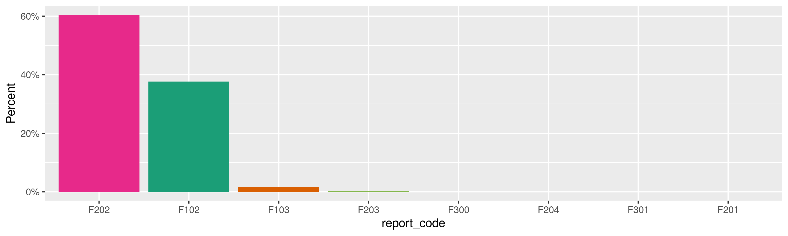
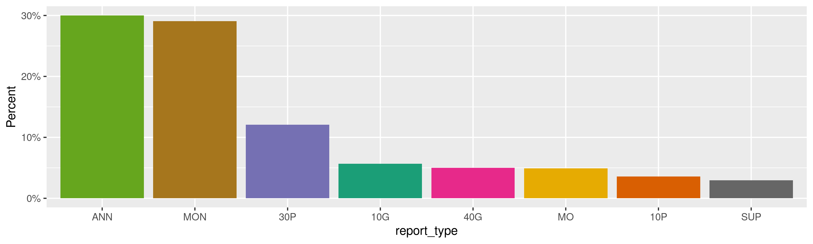
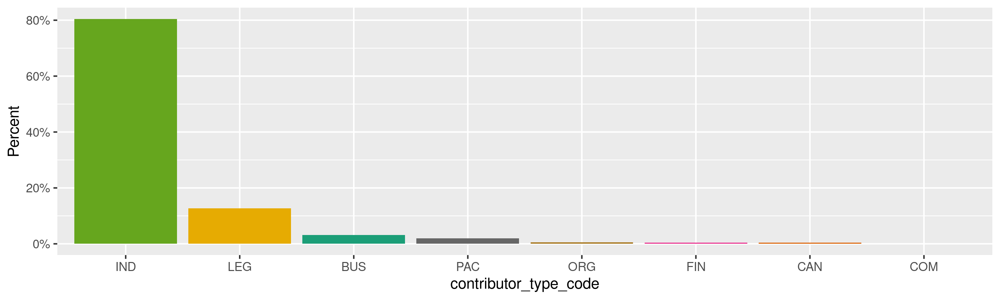
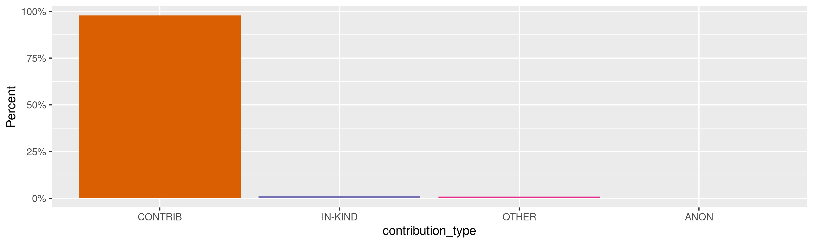
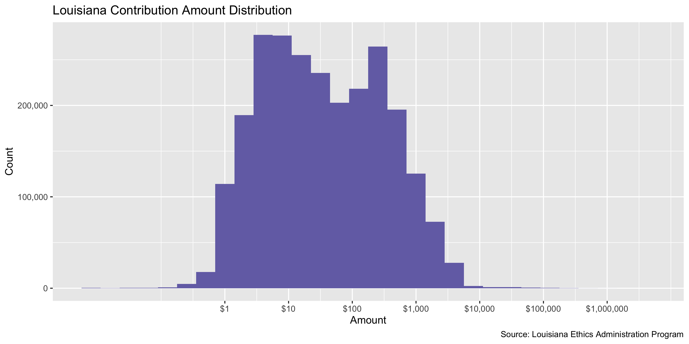
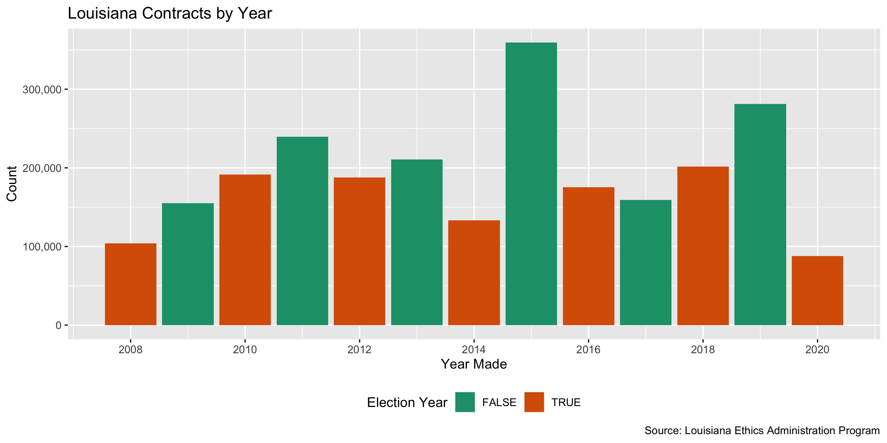
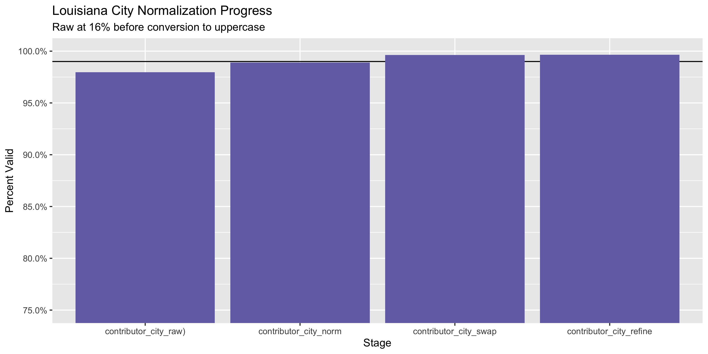
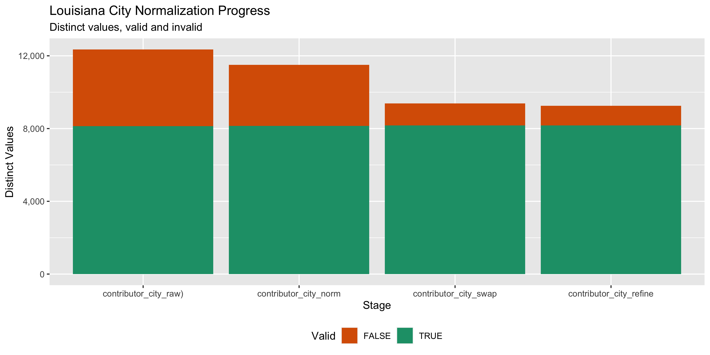

Louisiana Contributions
================
Kiernan Nicholls
Mon Sep 27 16:59:09 2021

-   [Project](#project)
-   [Objectives](#objectives)
-   [Packages](#packages)
-   [Data](#data)
-   [Download](#download)
-   [Read](#read)
-   [Explore](#explore)
    -   [Missing](#missing)
    -   [Duplicates](#duplicates)
    -   [Categorical](#categorical)
    -   [Amounts](#amounts)
    -   [Dates](#dates)
-   [Wrangle](#wrangle)
    -   [Address](#address)
    -   [ZIP](#zip)
    -   [State](#state)
    -   [City](#city)
-   [Conclude](#conclude)
-   [Export](#export)
-   [Upload](#upload)

<!-- Place comments regarding knitting here -->

## Project

The Accountability Project is an effort to cut across data silos and
give journalists, policy professionals, activists, and the public at
large a simple way to search across huge volumes of public data about
people and organizations.

Our goal is to standardize public data on a few key fields by thinking
of each dataset row as a transaction. For each transaction there should
be (at least) 3 variables:

1.  All **parties** to a transaction.
2.  The **date** of the transaction.
3.  The **amount** of money involved.

## Objectives

This document describes the process used to complete the following
objectives:

1.  How many records are in the database?
2.  Check for entirely duplicated records.
3.  Check ranges of continuous variables.
4.  Is there anything blank or missing?
5.  Check for consistency issues.
6.  Create a five-digit ZIP Code called `zip`.
7.  Create a `year` field from the transaction date.
8.  Make sure there is data on both parties to a transaction.

## Packages

The following packages are needed to collect, manipulate, visualize,
analyze, and communicate these results. The `pacman` package will
facilitate their installation and attachment.

``` r
if (!require("pacman")) {
  install.packages("pacman")
}
pacman::p_load(
  tidyverse, # data manipulation
  lubridate, # datetime strings
  gluedown, # printing markdown
  janitor, # clean data frames
  campfin, # custom irw tools
  aws.s3, # aws cloud storage
  refinr, # cluster & merge
  scales, # format strings
  knitr, # knit documents
  vroom, # fast reading
  rvest, # scrape html
  glue, # code strings
  here, # project paths
  httr, # http requests
  fs # local storage 
)
```

This document should be run as part of the `R_campfin` project, which
lives as a sub-directory of the more general, language-agnostic
[`irworkshop/accountability_datacleaning`](https://github.com/irworkshop/accountability_datacleaning)
GitHub repository.

The `R_campfin` project uses the [RStudio
projects](https://support.rstudio.com/hc/en-us/articles/200526207-Using-Projects)
feature and should be run as such. The project also uses the dynamic
`here::here()` tool for file paths relative to *your* machine.

``` r
# where does this document knit?
here::i_am("la/contribs/docs/la_contribs_diary.Rmd")
```

## Data

Contribution data is available for download from the Louisiana [Ethics
Admission Program](https://ethics.la.gov/default.aspx).

> The mission of the Ethics Administration Program is to administer and
> to enforce Louisiana’s conflicts of interest legislation, campaign
> finance registration and reporting requirements and lobbyist
> registration and disclosure laws to achieve compliance by governmental
> officials, public employees, candidates, and lobbyists and to provide
> public access to disclosed information.

The EAP administers [campaign finance
disclosures](https://ethics.la.gov/CampFinanHome.aspx) for candidates
and committees. Users can
[search](https://www.ethics.la.gov/CampaignFinanceSearch/SearchEfilingContributors.aspx)
for electronically filed campaign finance contributions.

## Download

If one submits a blank search for all contributions since January 1900,
then an error message is returned along with the results.

> **Due to the high volume of contribution receipts, these search
> results are limited to the top 100,000 of 3,381,933 records that match
> your search criteria and sorting selection.**

We can save this total results count for later.

``` r
n_all <- 3381933
```

There is an option to “Export Results to Spreadsheet (csv)” at the top
of the search table, but that download is restricted to the first
100,000 results as described in the error message.

We can write a script to repeatedly search between two dates, narrowing
the range if more results than the 100,000 limit are returned. This
script will download the results from these smaller date ranges to
individual files.

``` r
raw_dir <- dir_create(here("la", "contribs", "data", "scrape"))
raw_csv <- dir_ls(raw_dir, glob = "*.csv")
```

``` r
csv_dates <- do.call("c", map(str_extract_all(raw_csv, "\\d+"), ymd))
max_date <- max(unlist(csv_dates))
```

``` r
if (length(raw_csv) == 0 | max_date < Sys.Date()) {
  source(
    file = here("la", "contribs", "docs", "scrape_la_contrib.R")
  )
}
```

## Read

``` r
lac <- read_delim(
  file = raw_csv,
  delim = ",",
  trim_ws = TRUE,
  escape_double = FALSE,
  escape_backslash = FALSE,
  col_types = cols(
    .default = col_character(),
    ContributionDate = col_date("%m/%d/%Y"),
    ContributionAmt = col_number()
  )
)
```

``` r
problems(lac)
#> # A tibble: 0 × 5
#> # … with 5 variables: row <int>, col <int>, expected <chr>, actual <chr>, file <chr>
```

To ensure our file has been properly read, we can count the distinct
values of a variable suspected to be discrete, like `ContributionType`.

``` r
count(lac, ContributionType)
#> # A tibble: 4 × 2
#>   ContributionType       n
#>   <chr>              <int>
#> 1 ANON                 116
#> 2 CONTRIB          3310434
#> 3 IN-KIND            39632
#> 4 OTHER              31751
```

Finally, for standardization, we will make the column names “snake”
case.

``` r
lac <- clean_names(lac, case = "snake")
```

## Explore

There are 3,381,933 rows of 16 columns. Each record represents a single
contribution from an individual or business to a campaign or committee.

``` r
glimpse(lac)
#> Rows: 3,381,933
#> Columns: 16
#> $ filer_last_name          <chr> "Washington Square PAC", "Washington Square PAC", "Washington Square PAC", "Business …
#> $ filer_first_name         <chr> NA, NA, NA, NA, NA, NA, NA, NA, NA, NA, NA, NA, NA, NA, NA, NA, NA, NA, NA, NA, NA, N…
#> $ report_code              <chr> "F202", "F202", "F202", "F202", "F202", "F202", "F202", "F202", "F202", "F202", "F202…
#> $ report_type              <chr> "ANN", "ANN", "ANN", "ANN", "ANN", "ANN", "ANN", "ANN", "ANN", "ANN", "ANN", "ANN", "…
#> $ report_number            <chr> "LA-24", "LA-24", "LA-24", "LA-1501", "LA-1501", "LA-1501", "LA-1501", "LA-1501", "LA…
#> $ contributor_type_code    <chr> "LEG", "PAC", "IND", "IND", "IND", "IND", "IND", "IND", "IND", "IND", "IND", "IND", "…
#> $ contributor_name         <chr> "BILLES/MANNING ARCHITECTS", "LAMBERT BOISSIERIE III CAMPAIGN", "MICHAEL ROSS", "BATO…
#> $ contributor_addr1        <chr> "839 St. Charles Ave #300", NA, "1076 Veltore Circle", "7808 Airline Highway", "7808 …
#> $ contributor_addr2        <chr> NA, NA, NA, NA, NA, NA, NA, NA, NA, NA, NA, NA, NA, NA, NA, NA, NA, NA, NA, NA, NA, N…
#> $ contributor_city         <chr> "New Orleans", NA, "Atlanta", "Baton Rouge", "Baton Rouge", "Baton Rouge", "Baton Rou…
#> $ contributor_state        <chr> "LA", NA, "GA", "LA", "LA", "LA", "LA", "LA", "LA", "LA", "LA", "LA", "LA", "LA", "LA…
#> $ contributor_zip          <chr> "70130-1064", NA, "30311", "70815", "70815", "70815", "70815", "70815", "70815", "708…
#> $ contribution_type        <chr> "CONTRIB", "CONTRIB", "CONTRIB", "CONTRIB", "CONTRIB", "CONTRIB", "CONTRIB", "CONTRIB…
#> $ contribution_description <chr> NA, NA, NA, NA, NA, NA, NA, NA, NA, NA, NA, NA, NA, NA, NA, NA, NA, NA, NA, NA, NA, N…
#> $ contribution_date        <date> 1997-01-13, 1997-01-10, 1997-09-19, 1997-01-27, 1997-02-28, 1997-04-21, 1997-05-09, …
#> $ contribution_amt         <dbl> 1000.00, 500.00, 300.00, 175.32, 173.25, 169.48, 171.47, 196.85, 227.49, 193.59, 220.…
tail(lac)
#> # A tibble: 6 × 16
#>   filer_last_name           filer_first_name report_code report_type report_number contributor_type_c… contributor_name 
#>   <chr>                     <chr>            <chr>       <chr>       <chr>         <chr>               <chr>            
#> 1 Friends of LA Real Estate <NA>             F202        MON         LA-94066      IND                 NICOLE  MAYNOR   
#> 2 Friends of LA Real Estate <NA>             F202        MON         LA-94066      IND                 JENNY  SPIVEY    
#> 3 Friends of LA Real Estate <NA>             F202        MON         LA-94066      IND                 DARREN  MONTGOME…
#> 4 Friends of LA Real Estate <NA>             F202        MON         LA-94066      IND                 ANGELA R MEEK    
#> 5 Friends of LA Real Estate <NA>             F202        MON         LA-94066      IND                 SAAED  HASAN     
#> 6 Friends of LA Real Estate <NA>             F202        MON         LA-94066      IND                 CHRISTINA  HUNSU…
#> # … with 9 more variables: contributor_addr1 <chr>, contributor_addr2 <chr>, contributor_city <chr>,
#> #   contributor_state <chr>, contributor_zip <chr>, contribution_type <chr>, contribution_description <chr>,
#> #   contribution_date <date>, contribution_amt <dbl>
```

### Missing

Columns vary in their degree of missing values.

``` r
col_stats(lac, count_na)
#> # A tibble: 16 × 4
#>    col                      class        n          p
#>    <chr>                    <chr>    <int>      <dbl>
#>  1 filer_last_name          <chr>        0 0         
#>  2 filer_first_name         <chr>  2050687 0.606     
#>  3 report_code              <chr>        0 0         
#>  4 report_type              <chr>     7733 0.00229   
#>  5 report_number            <chr>        0 0         
#>  6 contributor_type_code    <chr>        0 0         
#>  7 contributor_name         <chr>      104 0.0000308 
#>  8 contributor_addr1        <chr>    12150 0.00359   
#>  9 contributor_addr2        <chr>  3075529 0.909     
#> 10 contributor_city         <chr>     8736 0.00258   
#> 11 contributor_state        <chr>     8208 0.00243   
#> 12 contributor_zip          <chr>    22716 0.00672   
#> 13 contribution_type        <chr>        0 0         
#> 14 contribution_description <chr>  3160546 0.935     
#> 15 contribution_date        <date>       0 0         
#> 16 contribution_amt         <dbl>        7 0.00000207
```

We can flag any record missing a key variable needed to identify a
transaction.

``` r
key_vars <- c("contribution_date", "contributor_name", 
              "contribution_amt", "filer_last_name")
lac <- flag_na(lac, all_of(key_vars))
sum(lac$na_flag)
#> [1] 111
```

``` r
lac %>% 
  filter(na_flag) %>% 
  select(all_of(key_vars))
#> # A tibble: 111 × 4
#>    contribution_date contributor_name   contribution_amt filer_last_name                                                
#>    <date>            <chr>                         <dbl> <chr>                                                          
#>  1 2000-08-17        <NA>                           200  Forestry Political Action Council (FORPAC)                     
#>  2 2003-09-17        MICHAEL G GAFFNEY               NA  Ieyoub                                                         
#>  3 2003-09-17        MICHAEL G GAFFNEY               NA  Ieyoub                                                         
#>  4 2004-12-31        <NA>                           249. Blanco                                                         
#>  5 2004-08-06        <NA>                           500. Blanco                                                         
#>  6 2004-10-12        <NA>                           250. Blanco                                                         
#>  7 2005-09-12        <NA>                            80  LA Democrats (formerly Democratic PAC of the Demo. St. Central…
#>  8 2005-09-12        <NA>                            80  LA Democrats (formerly Democratic PAC of the Demo. St. Central…
#>  9 2006-09-27        <NA>                          5000  LA Democrats (formerly Democratic PAC of the Demo. St. Central…
#> 10 2008-07-23        MR. DAVID W. LEEFE              NA  Steib                                                          
#> # … with 101 more rows
```

### Duplicates

We can also flag any record completely duplicated across every column.

``` r
lac <- flag_dupes(lac, everything())
mean(lac$dupe_flag)
#> [1] 0.005262079
sum(lac$dupe_flag)
#> [1] 17796
```

``` r
lac %>% 
  filter(dupe_flag) %>% 
  select(all_of(key_vars)) %>% 
  arrange(contribution_date)
#> # A tibble: 17,796 × 4
#>    contribution_date contributor_name                contribution_amt filer_last_name
#>    <date>            <chr>                                      <dbl> <chr>          
#>  1 1998-02-28        COASTAL SUPERIOR SOLUTIONS INC.              200 Blanco         
#>  2 1998-02-28        COASTAL SUPERIOR SOLUTIONS INC.              200 Blanco         
#>  3 1998-03-09        MS MAXINE T ARCENEAUX                         50 Goss           
#>  4 1998-03-09        MS MAXINE T ARCENEAUX                         50 Goss           
#>  5 1998-03-14        TONY STEWART                                  50 Goss           
#>  6 1998-03-14        TONY STEWART                                  50 Goss           
#>  7 1998-03-24        TIPPY LEBLANC                                 50 Goss           
#>  8 1998-03-24        TIPPY LEBLANC                                 50 Goss           
#>  9 1998-03-28        MINOS BROUSSARD                               50 Goss           
#> 10 1998-03-28        MINOS BROUSSARD                               50 Goss           
#> # … with 17,786 more rows
```

### Categorical

``` r
col_stats(lac, n_distinct)
#> # A tibble: 18 × 4
#>    col                      class       n           p
#>    <chr>                    <chr>   <int>       <dbl>
#>  1 filer_last_name          <chr>    3125 0.000924   
#>  2 filer_first_name         <chr>    2689 0.000795   
#>  3 report_code              <chr>      10 0.00000296 
#>  4 report_type              <chr>      15 0.00000444 
#>  5 report_number            <chr>   52407 0.0155     
#>  6 contributor_type_code    <chr>      24 0.00000710 
#>  7 contributor_name         <chr>  711882 0.210      
#>  8 contributor_addr1        <chr>  651702 0.193      
#>  9 contributor_addr2        <chr>   38881 0.0115     
#> 10 contributor_city         <chr>   21526 0.00636    
#> 11 contributor_state        <chr>      99 0.0000293  
#> 12 contributor_zip          <chr>  108493 0.0321     
#> 13 contribution_type        <chr>       4 0.00000118 
#> 14 contribution_description <chr>   51524 0.0152     
#> 15 contribution_date        <date>   8505 0.00251    
#> 16 contribution_amt         <dbl>   35713 0.0106     
#> 17 na_flag                  <lgl>       2 0.000000591
#> 18 dupe_flag                <lgl>       2 0.000000591
```

<!-- --><!-- --><!-- --><!-- -->

### Amounts

``` r
summary(lac$contribution_amt)
#>    Min. 1st Qu.  Median    Mean 3rd Qu.    Max.    NA's 
#>       0       5      30     379     250 5040303       7
mean(lac$contribution_amt <= 0, na.rm = TRUE)
#> [1] 0.01454644
```

These are the records with the minimum and maximum amounts.

``` r
glimpse(lac[c(which.max(lac$contribution_amt), which.min(lac$contribution_amt)), ])
#> Rows: 2
#> Columns: 18
#> $ filer_last_name          <chr> "Boasso", "Business Affairs Research Program"
#> $ filer_first_name         <chr> "Walter J.", NA
#> $ report_code              <chr> "F102", "F202"
#> $ report_type              <chr> "SUP", "ANN"
#> $ report_number            <chr> "LA-22159", "LA-1501"
#> $ contributor_type_code    <chr> "CHR", "IND"
#> $ contributor_name         <chr> "WALTER J BOASSO", "SOUTHERN EAGLE SALES & SERVICE"
#> $ contributor_addr1        <chr> "100 Intermodal Drive", "5300 Blair Drive"
#> $ contributor_addr2        <chr> NA, NA
#> $ contributor_city         <chr> "Chalmette", "Metairie"
#> $ contributor_state        <chr> "LA", "LA"
#> $ contributor_zip          <chr> "70043", "70003-2498"
#> $ contribution_type        <chr> "OTHER", "CONTRIB"
#> $ contribution_description <chr> "Funds to Campaign account to pay off loans", NA
#> $ contribution_date        <date> 2010-12-31, 1997-11-26
#> $ contribution_amt         <dbl> 5040303, 0
#> $ na_flag                  <lgl> FALSE, FALSE
#> $ dupe_flag                <lgl> FALSE, FALSE
```

<!-- -->

### Dates

We can add the calendar year from `contribution_date` with
`lubridate::year()`

``` r
lac <- mutate(lac, contribution_year = year(contribution_date))
```

``` r
min(lac$contribution_date)
#> [1] "1997-01-08"
sum(lac$contribution_year < 2000)
#> [1] 39656
max(lac$contribution_date)
#> [1] "2021-10-23"
sum(lac$contribution_date > today())
#> [1] 2
```

<!-- -->

## Wrangle

To improve the searchability of the database, we will perform some
consistent, confident string normalization. For geographic variables
like city names and ZIP codes, the corresponding `campfin::normal_*()`
functions are tailor made to facilitate this process.

### Address

For the street `addresss` variable, the `campfin::normal_address()`
function will force consistence case, remove punctuation, and abbreviate
official USPS suffixes.

``` r
addr_norm <- lac %>% 
  distinct(contributor_addr1, contributor_addr2) %>% 
  mutate(
    across(
      .cols = starts_with("contributor_addr"),
      .fns = list(normx = normal_address),
      abbs = usps_street,
      na_rep = TRUE
    )
  ) %>% 
  unite(
    col = "addr_norm",
    ends_with("_normx"),
    sep = " ",
    remove = TRUE,
    na.rm = TRUE
  ) %>% 
  mutate(across(addr_norm, na_if, ""))
```

``` r
addr_norm
#> # A tibble: 692,972 × 3
#>    contributor_addr1        contributor_addr2 addr_norm              
#>    <chr>                    <chr>             <chr>                  
#>  1 839 St. Charles Ave #300 <NA>              839 ST CHARLES AVE #300
#>  2 <NA>                     <NA>              <NA>                   
#>  3 1076 Veltore Circle      <NA>              1076 VELTORE CIR       
#>  4 7808 Airline Highway     <NA>              7808 AIRLINE HWY       
#>  5 P. O. Box 3026           <NA>              PO BOX 3026            
#>  6 P. O. Box 3928           <NA>              PO BOX 3928            
#>  7 P. O. Box 104            <NA>              PO BOX 104             
#>  8 P. O. Box 7053           <NA>              PO BOX 7053            
#>  9 P. O. Box 2500           <NA>              PO BOX 2500            
#> 10 P. O. Box 513            <NA>              PO BOX 513             
#> # … with 692,962 more rows
```

``` r
lac <- left_join(
  x = lac, 
  y = addr_norm, 
  by = c("contributor_addr1", "contributor_addr2")
)
```

### ZIP

For ZIP codes, the `campfin::normal_zip()` function will attempt to
create valid *five* digit codes by removing the ZIP+4 suffix and
returning leading zeroes dropped by other programs like Microsoft Excel.

``` r
lac <- lac %>% 
  mutate(
    zip_norm = normal_zip(
      zip = contributor_zip,
      na_rep = TRUE
    )
  )
```

``` r
progress_table(
  lac$contributor_zip,
  lac$zip_norm,
  compare = valid_zip
)
#> # A tibble: 2 × 6
#>   stage               prop_in n_distinct prop_na   n_out n_diff
#>   <chr>                 <dbl>      <dbl>   <dbl>   <dbl>  <dbl>
#> 1 lac$contributor_zip   0.633     108493 0.00672 1233334  90766
#> 2 lac$zip_norm          0.998      21732 0.00691    7066   1428
```

### State

Valid two digit state abbreviations can be made using the
`campfin::normal_state()` function.

``` r
lac <- lac %>% 
  mutate(
    state_norm = normal_state(
      state = contributor_state,
      abbreviate = TRUE,
      na_rep = TRUE,
      valid = valid_state
    )
  )
```

``` r
lac %>% 
  filter(contributor_state != state_norm) %>% 
  count(contributor_state, state_norm, sort = TRUE)
#> # A tibble: 17 × 3
#>    contributor_state state_norm     n
#>    <chr>             <chr>      <int>
#>  1 La                LA            69
#>  2 ms                MS            28
#>  3 Ne                NE            14
#>  4 Ca                CA            11
#>  5 Ma                MA             6
#>  6 tx                TX             6
#>  7 Tx                TX             5
#>  8 la                LA             3
#>  9 Ar                AR             2
#> 10 Co                CO             2
#> 11 Ct                CT             1
#> 12 Fl                FL             1
#> 13 Ga                GA             1
#> 14 Il                IL             1
#> 15 Mi                MI             1
#> 16 Vi                VI             1
#> 17 Wa                WA             1
```

``` r
progress_table(
  lac$contributor_state,
  lac$state_norm,
  compare = valid_state
)
#> # A tibble: 2 × 6
#>   stage                 prop_in n_distinct prop_na n_out n_diff
#>   <chr>                   <dbl>      <dbl>   <dbl> <dbl>  <dbl>
#> 1 lac$contributor_state    1.00         99 0.00243   436     42
#> 2 lac$state_norm           1            57 0.00251     0      1
```

### City

Cities are the most difficult geographic variable to normalize, simply
due to the wide variety of valid cities and formats.

#### Normal

The `campfin::normal_city()` function is a good start, again converting
case, removing punctuation, but *expanding* USPS abbreviations. We can
also remove `invalid_city` values.

``` r
norm_city <- lac %>% 
  distinct(contributor_city, state_norm, zip_norm) %>% 
  mutate(
    city_norm = normal_city(
      city = contributor_city, 
      abbs = usps_city,
      states = c("LA", "DC", "LOUISIANA"),
      na = invalid_city,
      na_rep = TRUE
    )
  )
```

#### Swap

We can further improve normalization by comparing our normalized value
against the *expected* value for that record’s state abbreviation and
ZIP code. If the normalized value is either an abbreviation for or very
similar to the expected value, we can confidently swap those two.

``` r
norm_city <- norm_city %>% 
  left_join(
    y = zipcodes,
    by = c(
      "state_norm" = "state",
      "zip_norm" = "zip"
    )
  ) %>% 
  rename(city_match = city) %>% 
  mutate(
    match_abb = is_abbrev(city_norm, city_match),
    match_dist = str_dist(city_norm, city_match),
    city_swap = if_else(
      condition = !is.na(match_dist) & (match_abb | match_dist == 1),
      true = city_match,
      false = city_norm
    )
  ) %>% 
  select(
    -city_match,
    -match_dist,
    -match_abb
  )
```

``` r
lac <- left_join(
  x = lac,
  y = norm_city,
  by = c(
    "contributor_city", 
    "state_norm", 
    "zip_norm"
  )
)
```

#### Refine

The [OpenRefine](https://openrefine.org/) algorithms can be used to
group similar strings and replace the less common versions with their
most common counterpart. This can greatly reduce inconsistency, but with
low confidence; we will only keep any refined strings that have a valid
city/state/zip combination.

``` r
good_refine <- lac %>% 
  mutate(
    city_refine = city_swap %>% 
      key_collision_merge() %>% 
      n_gram_merge(numgram = 1)
  ) %>% 
  filter(city_refine != city_swap) %>% 
  inner_join(
    y = zipcodes,
    by = c(
      "city_refine" = "city",
      "state_norm" = "state",
      "zip_norm" = "zip"
    )
  )
```

    #> # A tibble: 256 × 5
    #>    state_norm zip_norm city_swap       city_refine      n
    #>    <chr>      <chr>    <chr>           <chr>        <int>
    #>  1 LA         70508    LAFAYETTE LA    LAFAYETTE      108
    #>  2 LA         70611    LAKE CHARLES LA LAKE CHARLES    96
    #>  3 LA         70448    MANDEVILLE LA   MANDEVILLE      87
    #>  4 LA         70427    BOGALUSA LA     BOGALUSA        86
    #>  5 LA         70068    LAPALCE         LA PLACE        34
    #>  6 LA         70506    LAFAYETTE LA    LAFAYETTE       30
    #>  7 LA         71325    CHEYNEVILLE     CHENEYVILLE     17
    #>  8 LA         70501    LAFAYETTE LA    LAFAYETTE       15
    #>  9 LA         70503    LAFAYETTE LA    LAFAYETTE       15
    #> 10 LA         70570    OPELOUSAS LA    OPELOUSAS       15
    #> # … with 246 more rows

Then we can join the refined values back to the database.

``` r
lac <- lac %>% 
  left_join(good_refine) %>% 
  mutate(city_refine = coalesce(city_refine, city_swap))
```

#### Progress

Our goal for normalization was to increase the proportion of city values
known to be valid and reduce the total distinct values by correcting
misspellings.

| stage                                | prop\_in | n\_distinct | prop\_na | n\_out | n\_diff |
|:-------------------------------------|---------:|------------:|---------:|-------:|--------:|
| `str_to_upper(lac$contributor_city)` |    0.979 |       15719 |    0.003 |  71585 |    5747 |
| `lac$city_norm`                      |    0.981 |       14726 |    0.003 |  64726 |    4737 |
| `lac$city_swap`                      |    0.996 |       11815 |    0.003 |  13589 |    1800 |
| `lac$city_refine`                    |    0.996 |       11620 |    0.003 |  12616 |    1605 |

You can see how the percentage of valid values increased with each
stage.

<!-- -->

More importantly, the number of distinct values decreased each stage. We
were able to confidently change many distinct invalid values to their
valid equivalent.

<!-- -->

Before exporting, we can remove the intermediary normalization columns
and rename all added variables with the `_clean` suffix.

``` r
lac <- lac %>% 
  select(
    -city_norm,
    -city_swap,
    city_clean = city_refine
  ) %>% 
  rename_all(~str_replace(., "_norm", "_clean")) %>% 
  rename_all(~str_remove(., "_raw")) %>% 
  relocate(addr_clean, city_clean, state_clean, .before = zip_clean)
```

``` r
glimpse(sample_n(lac, 50))
#> Rows: 50
#> Columns: 23
#> $ filer_last_name          <chr> "Entergy Corp. PAC (ENPAC)", "Martiny", "Edwards", "Independent Insurance Agents & Br…
#> $ filer_first_name         <chr> NA, "Daniel R.", "John Bel", NA, NA, NA, "Julie", NA, "Toni", "Erich E.", NA, NA, "Da…
#> $ report_code              <chr> "F202", "F102", "F102", "F202", "F202", "F202", "F102", "F202", "F102", "F102", "F202…
#> $ report_type              <chr> "10G", "ANN", "ANN", "ANN", "ANN", "MON", "180P", "MON", "10G", "90P", "MON", "MON", …
#> $ report_number            <chr> "LA-3014", "LA-18697", "LA-75648", "LA-48671", "LA-4362", "LA-23359", "LA-69967", "LA…
#> $ contributor_type_code    <chr> "IND", "IND", "IND", "LEG", "IND", "IND", "IND", "IND", "IND", "LEG", "IND", "IND", "…
#> $ contributor_name         <chr> "QUITMAN LOCKE", "U.S. COPY INC.", "KENNETH JOVIN", "RIVER OAKS INSURANCE", "ZORAN HR…
#> $ contributor_addr1        <chr> "31870 Tiboe Plaza", "#30 23rd Street", "74 Victoria Ln", "506 Water St. Ste C", "326…
#> $ contributor_addr2        <chr> NA, NA, NA, NA, NA, NA, NA, NA, NA, NA, NA, NA, NA, NA, NA, "8686 Bluebonnet", NA, NA…
#> $ contributor_city         <chr> "Springfield", "Kenner", "Mandeville", "Madisonville", "Baton Rouge", "Metairie", "La…
#> $ contributor_state        <chr> "LA", "LA", "LA", "LA", "LA", "LA", "LA", "LA", "LA", "LA", "LA", "AR", "LA", "LA", "…
#> $ contributor_zip          <chr> "70462", "70062", "70471-7259", "70447", "70802", "70003-0000", "70598", "71104-0000"…
#> $ contribution_type        <chr> "CONTRIB", "CONTRIB", "CONTRIB", "CONTRIB", "CONTRIB", "CONTRIB", "CONTRIB", "CONTRIB…
#> $ contribution_description <chr> NA, NA, NA, NA, NA, NA, NA, NA, "CONTRIBUTION", "CONTRIBUTION", NA, NA, NA, NA, NA, N…
#> $ contribution_date        <date> 2002-01-25, 2009-03-13, 2018-08-31, 2015-03-09, 2003-04-21, 2011-02-28, 2017-04-05, …
#> $ contribution_amt         <dbl> 5.00, 500.00, 5.00, 100.00, 1.00, 2.13, 250.00, 4.52, 250.00, 5000.00, 3.32, 1.00, 35…
#> $ na_flag                  <lgl> FALSE, FALSE, FALSE, FALSE, FALSE, FALSE, FALSE, FALSE, FALSE, FALSE, FALSE, FALSE, F…
#> $ dupe_flag                <lgl> FALSE, FALSE, FALSE, FALSE, FALSE, FALSE, FALSE, FALSE, FALSE, FALSE, FALSE, FALSE, F…
#> $ contribution_year        <dbl> 2002, 2009, 2018, 2015, 2003, 2011, 2017, 2014, 2012, 2012, 2013, 2020, 2014, 2010, 2…
#> $ addr_clean               <chr> "31870 TIBOE PLZ", "#30 23RD ST", "74 VICTORIA LN", "506 WATER ST STE C", "3262 WYOMI…
#> $ city_clean               <chr> "SPRINGFIELD", "KENNER", "MANDEVILLE", "MADISONVILLE", "BATON ROUGE", "METAIRIE", "LA…
#> $ state_clean              <chr> "LA", "LA", "LA", "LA", "LA", "LA", "LA", "LA", "LA", "LA", "LA", "AR", "LA", "LA", "…
#> $ zip_clean                <chr> "70462", "70062", "70471", "70447", "70802", "70003", "70598", "71104", "70802", "708…
```

## Conclude

1.  There are 3,381,935 records in the database.
2.  There are 17,798 duplicate records in the database.
3.  The range and distribution of `amount` and `date` seem reasonable.
4.  There are 111 records missing key variables.
5.  Consistency in geographic data has been improved with
    `campfin::normal_*()`.
6.  The 4-digit `year` variable has been created with
    `lubridate::year()`.

## Export

Now the file can be saved on disk for upload to the Accountability
server.

``` r
clean_dir <- dir_create(here("la", "contribs", "data", "clean"))
clean_path <- path(clean_dir, "la_contribs_19970101-20210927.csv")
write_csv(lac, clean_path, na = "")
(clean_size <- file_size(clean_path))
#> 601M
```

## Upload

We can use the `aws.s3::put_object()` to upload the text file to the IRW
server.

``` r
aws_path <- path("csv", basename(clean_path))
if (!object_exists(aws_path, "publicaccountability")) {
  put_object(
    file = clean_path,
    object = aws_path, 
    bucket = "publicaccountability",
    acl = "public-read",
    show_progress = TRUE,
    multipart = TRUE
  )
}
aws_head <- head_object(aws_path, "publicaccountability")
(aws_size <- as_fs_bytes(attr(aws_head, "content-length")))
unname(aws_size == clean_size)
```
