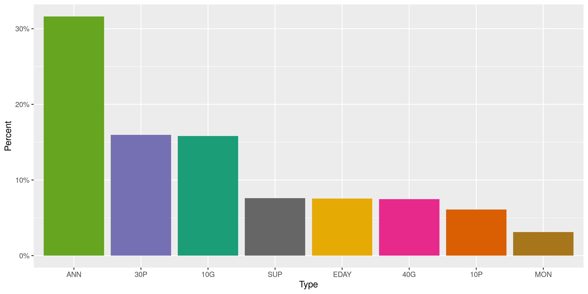
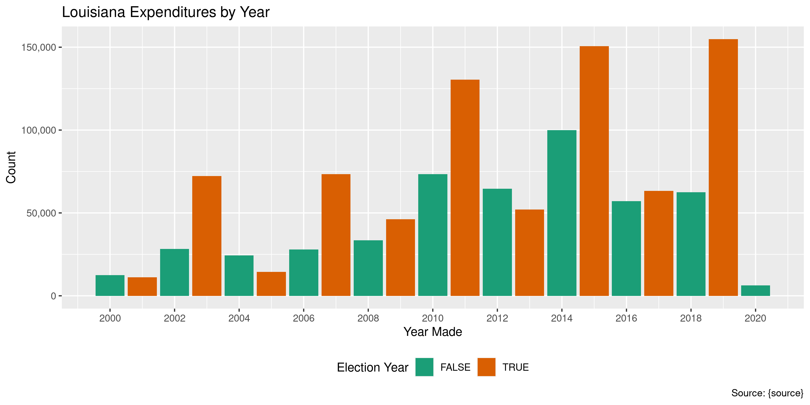
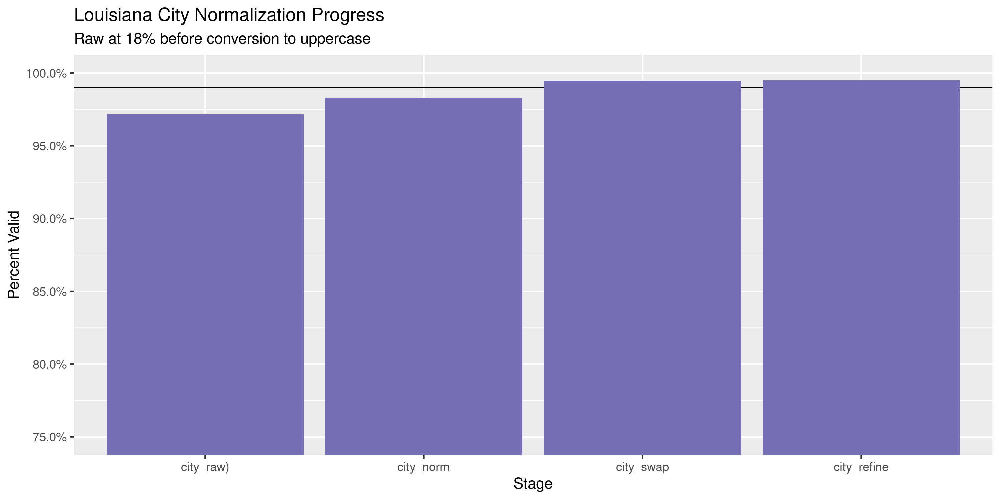
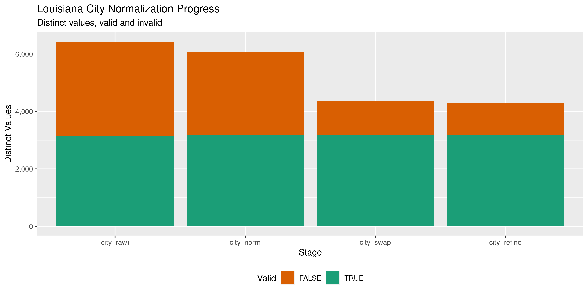

Louisiana Expenditures
================
Kiernan Nicholls & Yanqi Xu
2023-03-26 16:14:19

- <a href="#project" id="toc-project">Project</a>
- <a href="#objectives" id="toc-objectives">Objectives</a>
- <a href="#packages" id="toc-packages">Packages</a>
- <a href="#data" id="toc-data">Data</a>
- <a href="#download" id="toc-download">Download</a>
- <a href="#read" id="toc-read">Read</a>
- <a href="#explore" id="toc-explore">Explore</a>
- <a href="#wrangle" id="toc-wrangle">Wrangle</a>
- <a href="#conclude" id="toc-conclude">Conclude</a>
- <a href="#export" id="toc-export">Export</a>
- <a href="#upload" id="toc-upload">Upload</a>
- <a href="#dictionary" id="toc-dictionary">Dictionary</a>

<!-- Place comments regarding knitting here -->

## Project

The Accountability Project is an effort to cut across data silos and
give journalists, policy professionals, activists, and the public at
large a simple way to search across huge volumes of public data about
people and organizations.

Our goal is to standardizing public data on a few key fields by thinking
of each dataset row as a transaction. For each transaction there should
be (at least) 3 variables:

1.  All **parties** to a transaction.
2.  The **date** of the transaction.
3.  The **amount** of money involved.

## Objectives

This document describes the process used to complete the following
objectives:

1.  How many records are in the database?
2.  Check for entirely duplicated records.
3.  Check ranges of continuous variables.
4.  Is there anything blank or missing?
5.  Check for consistency issues.
6.  Create a five-digit ZIP Code called `zip`.
7.  Create a `year` field from the transaction date.
8.  Make sure there is data on both parties to a transaction.

## Packages

The following packages are needed to collect, manipulate, visualize,
analyze, and communicate these results. The `pacman` package will
facilitate their installation and attachment.

The IRW’s `campfin` package will also have to be installed from GitHub.
This package contains functions custom made to help facilitate the
processing of campaign finance data.

``` r
if (!require("pacman")) install.packages("pacman")
pacman::p_load_gh("irworkshop/campfin")
pacman::p_load(
  tidyverse, # data manipulation
  lubridate, # datetime strings
  gluedown, # printing markdown
  magrittr, # pipe operators
  janitor, # clean data frames
  refinr, # cluster and merge
  scales, # format strings
  knitr, # knit documents
  vroom, # read files fast
  rvest, # html scraping
  glue, # combine strings
  here, # relative paths
  httr, # http requests
  fs # local storage 
)
```

This document should be run as part of the `R_campfin` project, which
lives as a sub-directory of the more general, language-agnostic
[`irworkshop/accountability_datacleaning`](https://github.com/irworkshop/accountability_datacleaning)
GitHub repository.

The `R_campfin` project uses the [RStudio
projects](https://support.rstudio.com/hc/en-us/articles/200526207-Using-Projects)
feature and should be run as such. The project also uses the dynamic
`here::here()` tool for file paths relative to *your* machine.

``` r
# where does this document knit?
here::here()
#> [1] "/Users/yanqixu/code/accountability_datacleaning"
```

## Data

Expenditures records is from the [Louisiana Ethics
Administration’s](http://ethics.la.gov/AboutTheBoard.aspx):

> The mission of the Ethics Administration Program is to administer and
> to enforce Louisiana’s conflicts of interest legislation, campaign
> finance registration and reporting requirements and lobbyist
> registration and disclosure laws to achieve compliance by governmental
> officials, public employees, candidates, and lobbyists and to provide
> public access to disclosed information.

We can search expenditure records from the LEA’s expenditures search
portal:

> - [Campaign Finance
>   Expenditures](http://www.ethics.la.gov/CampaignFinanceSearch/SearchEfilingExpenditures.aspx)  
>   Choose this option to sort and view campaign expense records.  
>   Expenditures may appear multiple times in the search.

## Download

We can search for expenditures between two dates, however the number of
results that can be returned at a time is 100,000.

> Due to the high volume of contribution receipts, these search results
> are limited to the top 100,000 of 1,473,715 records that match your
> search criteria and sorting selection.

To circumvent this cap, we perform multiple searches between the start
and end of the years between 2000 and 2022. The
[cURL](https://en.wikipedia.org/wiki/CURL) commands to download these
chunks are stored in the `raw_curl.sh` text file. We can run these
commands one by one and save the returned files locally.

We will start our next update from Jan 1, 2023.

``` r
raw_dir <- dir_create(here("state","la", "expends", "data", "raw"))
#raw_path <- path(raw_dir, "la_exp_raw.csv")
#raw_curl <- read_lines(here("state","la", "expends", "raw_curl.sh"))
```

``` r
for (i in seq_along(raw_curl)) {
  out_path <- path(raw_dir, glue("SearchResults-{【  seq(2000, 2022)[i]}.csv"))
  write_lines(system(raw_curl[i], intern = TRUE), out_path)
  flush_memory(); Sys.sleep(5)
}
```

``` r
raw_info <- dir_info(raw_dir)
nrow(raw_info)
#> [1] 30
sum(raw_info$size)
#> 282M
as_tibble(raw_info) %>% 
  select(path, size, modification_time) %>% 
  mutate(across(path, path.abbrev))
#> # A tibble: 30 × 3
#>    path                                                                    size modification_time  
#>    <fs::path>                                                            <fs::> <dttm>             
#>  1 …bility_datacleaning/state/la/expends/data/raw/SearchResults_2000.csv  3.57M 2023-03-24 23:08:28
#>  2 …bility_datacleaning/state/la/expends/data/raw/SearchResults_2001.csv  3.18M 2023-03-24 23:27:06
#>  3 …bility_datacleaning/state/la/expends/data/raw/SearchResults_2002.csv  7.71M 2023-03-26 15:58:36
#>  4 …bility_datacleaning/state/la/expends/data/raw/SearchResults_2003.csv 19.81M 2023-03-26 15:59:29
#>  5 …bility_datacleaning/state/la/expends/data/raw/SearchResults_2004.csv  6.78M 2023-03-24 23:32:04
#>  6 …bility_datacleaning/state/la/expends/data/raw/SearchResults_2005.csv  4.08M 2023-03-24 23:32:28
#>  7 …bility_datacleaning/state/la/expends/data/raw/SearchResults_2006.csv  8.03M 2023-03-24 23:33:44
#>  8 …bility_datacleaning/state/la/expends/data/raw/SearchResults_2007.csv 19.02M 2023-03-24 23:37:03
#>  9 …bility_datacleaning/state/la/expends/data/raw/SearchResults_2008.csv  9.12M 2023-03-24 23:38:08
#> 10 …bility_datacleaning/state/la/expends/data/raw/SearchResults_2009.csv 12.62M 2023-03-26 16:06:47
#> # … with 20 more rows
```

## Read

All of these yearly files can be read into a single data frame with
`vroom()`.

``` r
lae <- vroom(
  file = raw_info$path,
  escape_backslash = FALSE,
  escape_double = FALSE,
  trim_ws = TRUE,
  id = "file",
  num_threads = 1,
  #.name_repair = make_clean_names,
  col_types = cols(
    .default = col_character(),
    ExpenditureDate = col_date_mdy(),
    ExpenditureAmt = col_number()
  )
) %>% clean_names()
```

``` r
old_names <- names(lae)
lae <- lae %>% 
  mutate(across(file, path.abbrev)) %>% 
  mutate(across(where(is.character), str_squish)) %>% 
  rename_all(str_remove, "_name$") %>% 
  rename_all(str_remove, "^filer_") %>% 
  rename_all(str_remove, "^report_") %>% 
  rename_all(str_remove, "^recipient_") %>% 
  rename_all(str_remove, "^expenditure_") %>% 
  rename_all(str_remove, "^candidate_") %>% 
  rename(amount = amt)
```

## Explore

``` r
glimpse(lae)
#> Rows: 1,445,196
#> Columns: 17
#> $ file        <chr> "/Users/yanqixu/code/accountability_datacleaning/state/la/expends/data/raw/Se…
#> $ last        <chr> "ABC Pelican PAC", "ABC Pelican PAC", "ABC Pelican PAC", "ABC Pelican PAC", "…
#> $ first       <chr> NA, NA, NA, NA, NA, NA, NA, NA, NA, NA, NA, NA, NA, NA, NA, NA, NA, NA, NA, N…
#> $ code        <chr> "F202", "F202", "F202", "F202", "F202", "F202", "F202", "F202", "F202", "F202…
#> $ type        <chr> "ANN", "ANN", "ANN", "ANN", "ANN", "ANN", "ANN", "ANN", "ANN", "ANN", "ANN", …
#> $ number      <chr> "LA-1860", "LA-1860", "LA-1860", "LA-1860", "LA-1860", "LA-1860", "LA-1860", …
#> $ schedule    <chr> "E-4", "E-4", "E-1", "E-1", "E-3", "E-3", "E-3", "E-3", "E-3", "E-4", "E-3", …
#> $ recipient   <chr> "IRS", "ABC PELICAN CHAPTER", "SPAULDING GROUP INC.", "LOUISIANA SENATE DEMOC…
#> $ addr1       <chr> NA, "19251 Highland Road", NA, "P.O. Box 4385", "1995 Nonconnah Blvd.", NA, "…
#> $ addr2       <chr> NA, NA, NA, NA, NA, NA, NA, "Suite 203", NA, NA, NA, NA, NA, NA, NA, NA, NA, …
#> $ city        <chr> "Memphis", "Baton Rouge", "Louisville", "Baton Rouge", "Memphis", NA, "Jeffer…
#> $ state       <chr> "TN", "LA", "KY", "LA", "TN", NA, "LA", "LA", "LA", "LA", "LA", "LA", "LA", N…
#> $ zip         <chr> NA, "70809", NA, "70801-4385", "38132", NA, "70181", "70122", "71483", "70810…
#> $ description <chr> NA, "Administrative Fees for 2000", "Bush/Cheney Buttons Signs and Bumper Sti…
#> $ beneficiary <chr> NA, NA, NA, NA, "COMMITTEE TO ELECT PAUL STANLEY", "FRIENDS OF MIKE FUTRELL",…
#> $ date        <date> 2000-03-08, 2000-11-17, 2000-11-03, 2000-05-02, 2000-07-24, 2000-05-10, 2000…
#> $ amount      <dbl> 2199.00, 2000.00, 515.00, 500.00, 500.00, 500.00, 500.00, 500.00, 500.00, 411…
tail(lae)
#> # A tibble: 6 × 17
#>   file         last  first code  type  number sched…¹ recip…² addr1 addr2 city  state zip   descr…³
#>   <chr>        <chr> <chr> <chr> <chr> <chr>  <chr>   <chr>   <chr> <chr> <chr> <chr> <chr> <chr>  
#> 1 /Users/yanq… Zerv… Carl… F102  SUP   LA-10… E-1     WEEBLY  460 … <NA>  San … CA    94107 2022-2…
#> 2 /Users/yanq… Zerv… Carl… F102  SUP   LA-10… E-1     REGION… 1820… <NA>  New … LA    70130 Fees t…
#> 3 /Users/yanq… Zibi… Franz F102  SUP   LA-10… E-1     CYNTHI… 16 C… <NA>  Kenn… LA    70065 Campai…
#> 4 /Users/yanq… Zibi… Franz F102  SUP   LA-10… E-1     CAMPAI… P.O.… <NA>  Bato… LA    70821 Filing…
#> 5 /Users/yanq… Zibi… Franz F102  SUP   LA-10… E-1     HEAVEN… 2328… <NA>  New … LA    70114 Donati…
#> 6 /Users/yanq… Zuck… Jason F102  ANN   LA-10… E-1     AMERIC… 406 … <NA>  Mand… LA    70448 Bank s…
#> # … with 3 more variables: beneficiary <chr>, date <date>, amount <dbl>, and abbreviated variable
#> #   names ¹​schedule, ²​recipient, ³​description
```

### Missing

Columns vary in their degree of missing values.

``` r
col_stats(lae, count_na)
#> # A tibble: 17 × 4
#>    col         class        n         p
#>    <chr>       <chr>    <int>     <dbl>
#>  1 file        <chr>        0 0        
#>  2 last        <chr>        0 0        
#>  3 first       <chr>   228689 0.158    
#>  4 code        <chr>        0 0        
#>  5 type        <chr>      131 0.0000906
#>  6 number      <chr>        0 0        
#>  7 schedule    <chr>        0 0        
#>  8 recipient   <chr>      248 0.000172 
#>  9 addr1       <chr>    60983 0.0422   
#> 10 addr2       <chr>  1342896 0.929    
#> 11 city        <chr>    33162 0.0229   
#> 12 state       <chr>    30945 0.0214   
#> 13 zip         <chr>    78101 0.0540   
#> 14 description <chr>   117081 0.0810   
#> 15 beneficiary <chr>  1358912 0.940    
#> 16 date        <date>       0 0        
#> 17 amount      <dbl>        0 0
```

We can flag any record missing a key variable like a name or date.

``` r
lae <- lae %>% flag_na(date, last, amount, recipient)
sum(lae$na_flag)
#> [1] 248
```

All such records are missing a beneficiary.

``` r
lae %>% 
  filter(na_flag) %>% 
  select(date, last, amount, recipient)
#> # A tibble: 248 × 4
#>    date       last                      amount recipient
#>    <date>     <chr>                      <dbl> <chr>    
#>  1 2002-04-22 Entergy Corp. PAC (ENPAC)  3000  <NA>     
#>  2 2003-12-29 Blanco                     1500  <NA>     
#>  3 2003-12-19 Blanco                     1473. <NA>     
#>  4 2003-12-27 Blanco                      647. <NA>     
#>  5 2003-12-26 Blanco                      579. <NA>     
#>  6 2003-12-26 Blanco                      297. <NA>     
#>  7 2003-12-26 Blanco                      279. <NA>     
#>  8 2003-12-31 Blanco                      185. <NA>     
#>  9 2003-01-08 Entergy Corp. PAC (ENPAC)   100  <NA>     
#> 10 2004-08-23 Blanco                    25000  <NA>     
#> # … with 238 more rows
```

``` r
lae %>% 
  filter(na_flag) %>% 
  select(date, last, amount, recipient) %>% 
  col_stats(count_na)
#> # A tibble: 4 × 4
#>   col       class      n     p
#>   <chr>     <chr>  <int> <dbl>
#> 1 date      <date>     0     0
#> 2 last      <chr>      0     0
#> 3 amount    <dbl>      0     0
#> 4 recipient <chr>    248     1
```

### Duplicates

We can flag any record that’s duplicated at least once across all
variables.

``` r
d1 <- duplicated(lae, fromLast = FALSE)
d2 <- duplicated(lae, fromLast = TRUE)
lae <- mutate(lae, dupe_flag = d1 | d2)
rm(d1, d2); flush_memory()
```

Over 1% of records are such duplicates

``` r
percent(mean(lae$dupe_flag), 0.01)
#> [1] "1.21%"
```

``` r
lae %>% 
  filter(dupe_flag) %>% 
  select(date, last, amount, recipient, number)
#> # A tibble: 17,535 × 5
#>    date       last         amount recipient           number 
#>    <date>     <chr>         <dbl> <chr>               <chr>  
#>  1 2000-11-07 Addison, Jr.    150 STERLING COLLINS    LA-1619
#>  2 2000-11-07 Addison, Jr.    150 STERLING COLLINS    LA-1619
#>  3 2000-11-07 Addison, Jr.     75 MR DON KELLY        LA-1619
#>  4 2000-11-07 Addison, Jr.     75 MR DON KELLY        LA-1619
#>  5 2000-11-07 Addison, Jr.     75 MR ERIC D ADDISON   LA-1619
#>  6 2000-11-07 Addison, Jr.     75 ASHLEY SPOTSVILLE   LA-1619
#>  7 2000-11-07 Addison, Jr.     75 ASHLEY SPOTSVILLE   LA-1619
#>  8 2000-11-07 Addison, Jr.     75 TAREN MACK          LA-1619
#>  9 2000-11-07 Addison, Jr.     75 TAREN MACK          LA-1619
#> 10 2000-11-07 Addison, Jr.     75 MR ALLEN S MERCHANT LA-1619
#> # … with 17,525 more rows
```

### Categorical

``` r
col_stats(lae, n_distinct)
#> # A tibble: 19 × 4
#>    col         class       n          p
#>    <chr>       <chr>   <int>      <dbl>
#>  1 file        <chr>      30 0.0000208 
#>  2 last        <chr>    3354 0.00232   
#>  3 first       <chr>    2889 0.00200   
#>  4 code        <chr>      12 0.00000830
#>  5 type        <chr>      16 0.0000111 
#>  6 number      <chr>   55410 0.0383    
#>  7 schedule    <chr>      10 0.00000692
#>  8 recipient   <chr>  288970 0.200     
#>  9 addr1       <chr>  308398 0.213     
#> 10 addr2       <chr>   15647 0.0108    
#> 11 city        <chr>    9303 0.00644   
#> 12 state       <chr>      64 0.0000443 
#> 13 zip         <chr>   31193 0.0216    
#> 14 description <chr>  358835 0.248     
#> 15 beneficiary <chr>   16418 0.0114    
#> 16 date        <date>   8395 0.00581   
#> 17 amount      <dbl>  123996 0.0858    
#> 18 na_flag     <lgl>       2 0.00000138
#> 19 dupe_flag   <lgl>       2 0.00000138
```

<!-- --><!-- --><!-- --><!-- -->

### Amounts

``` r
summary(lae$amount)
#>      Min.   1st Qu.    Median      Mean   3rd Qu.      Max. 
#>       0.0      60.0     120.0     853.7     450.0 3063269.8
mean(lae$amount <= 0)
#> [1] 0.0005231124
```

<!-- -->

### Dates

We can add the calendar year from `date` with `lubridate::year()`

``` r
lae <- mutate(lae, year = year(date))
```

``` r
min(lae$date)
#> [1] "2000-01-01"
sum(lae$year < 2000)
#> [1] 0
max(lae$date)
#> [1] "2022-12-31"
sum(lae$date > today())
#> [1] 0
```

<!-- -->

## Wrangle

To improve the searchability of the database, we will perform some
consistent, confident string normalization. For geographic variables
like city names and ZIP codes, the corresponding `campfin::normal_*()`
functions are tailor made to facilitate this process.

### Address

For the street `addresss` variable, the `campfin::normal_address()`
function will force consistence case, remove punctuation, and abbreviate
official USPS suffixes.

``` r
lae <- lae %>% 
  unite(
    col = addr_full,
    starts_with("addr"),
    sep = " ",
    remove = FALSE,
    na.rm = TRUE
  ) %>% 
  mutate(
    addr_norm = normal_address(
      address = addr_full,
      abbs = usps_street,
      na_rep = TRUE
    )
  ) %>% 
  select(-addr_full)
```

``` r
lae %>% 
  select(contains("addr")) %>% 
  distinct() %>% 
  sample_n(10)
#> # A tibble: 10 × 3
#>    addr1                    addr2     addr_norm                
#>    <chr>                    <chr>     <chr>                    
#>  1 710 Mazant               <NA>      710 MAZANT               
#>  2 233 W. 12th Street       <NA>      233 W 12TH ST            
#>  3 11 Tara Boulevard        <NA>      11 TARA BLVD             
#>  4 800 Tchoupitoulas Street <NA>      800 TCHOUPITOULAS ST     
#>  5 17301 W Colfax           <NA>      17301 W COLFAX           
#>  6 2959 COLLEGE DR          <NA>      2959 COLLEGE DR          
#>  7 7685 JEFFERSON PAIGE RD  <NA>      7685 JEFFERSON PAIGE RD  
#>  8 333 Girod St. Apt 305    <NA>      333 GIROD ST APT 305     
#>  9 620 MENDELSSOHN          SUITE 186 620 MENDELSSOHN SUITE 186
#> 10 308 Jackson St           <NA>      308 JACKSON ST
```

### ZIP

For ZIP codes, the `campfin::normal_zip()` function will attempt to
create valid *five* digit codes by removing the ZIP+4 suffix and
returning leading zeroes dropped by other programs like Microsoft Excel.

``` r
lae <- lae %>% 
  mutate(
    zip_norm = normal_zip(
      zip = zip,
      na_rep = TRUE
    )
  )
```

``` r
progress_table(
  lae$zip,
  lae$zip_norm,
  compare = valid_zip
)
#> # A tibble: 2 × 6
#>   stage        prop_in n_distinct prop_na  n_out n_diff
#>   <chr>          <dbl>      <dbl>   <dbl>  <dbl>  <dbl>
#> 1 lae$zip        0.903      31193  0.0540 133160  23854
#> 2 lae$zip_norm   0.996       8966  0.0552   5907   1080
```

### State

Valid two digit state abbreviations can be made using the
`campfin::normal_state()` function.

``` r
lae <- lae %>% 
  mutate(
    state_norm = normal_state(
      state = state,
      abbreviate = TRUE,
      na_rep = TRUE,
      valid = NULL
    )
  )
```

``` r
lae %>% 
  filter(state != state_norm) %>% 
  count(state, state_norm, sort = TRUE)
#> # A tibble: 0 × 3
#> # … with 3 variables: state <chr>, state_norm <chr>, n <int>
```

``` r
progress_table(
  lae$state,
  lae$state_norm,
  compare = valid_state
)
#> # A tibble: 2 × 6
#>   stage          prop_in n_distinct prop_na n_out n_diff
#>   <chr>            <dbl>      <dbl>   <dbl> <dbl>  <dbl>
#> 1 lae$state         1.00         64  0.0214   565     12
#> 2 lae$state_norm    1.00         61  0.0218    14      9
```

### City

Cities are the most difficult geographic variable to normalize, simply
due to the wide variety of valid cities and formats.

#### Normal

The `campfin::normal_city()` function is a good start, again converting
case, removing punctuation, but *expanding* USPS abbreviations. We can
also remove `invalid_city` values.

``` r
lae <- lae %>% 
  mutate(
    city_norm = normal_city(
      city = city, 
      abbs = usps_city,
      states = c("LA", "DC", "LOUISIANA"),
      na = invalid_city,
      na_rep = TRUE
    )
  )
```

#### Swap

We can further improve normalization by comparing our normalized value
against the *expected* value for that record’s state abbreviation and
ZIP code. If the normalized value is either an abbreviation for or very
similar to the expected value, we can confidently swap those two.

``` r
lae <- lae %>% 
  rename(city_raw = city) %>% 
  left_join(
    y = zipcodes,
    by = c(
      "state_norm" = "state",
      "zip_norm" = "zip"
    )
  ) %>% 
  rename(city_match = city) %>% 
  mutate(
    match_abb = is_abbrev(city_norm, city_match),
    match_dist = str_dist(city_norm, city_match),
    city_swap = if_else(
      condition = !is.na(match_dist) & (match_abb | match_dist == 1),
      true = city_match,
      false = city_norm
    )
  ) %>% 
  select(
    -city_match,
    -match_dist,
    -match_abb
  )
```

#### Refine

The [OpenRefine](https://openrefine.org/) algorithms can be used to
group similar strings and replace the less common versions with their
most common counterpart. This can greatly reduce inconsistency, but with
low confidence; we will only keep any refined strings that have a valid
city/state/zip combination.

``` r
good_refine <- lae %>% 
  mutate(
    city_refine = city_swap %>% 
      key_collision_merge() %>% 
      n_gram_merge(numgram = 1)
  ) %>% 
  filter(city_refine != city_swap) %>% 
  inner_join(
    y = zipcodes,
    by = c(
      "city_refine" = "city",
      "state_norm" = "state",
      "zip_norm" = "zip"
    )
  )
```

    #> # A tibble: 125 × 5
    #>    state_norm zip_norm city_swap       city_refine            n
    #>    <chr>      <chr>    <chr>           <chr>              <int>
    #>  1 CA         94103    SAN FRANSICO    SAN FRANCISCO         22
    #>  2 OH         45202    CINCINATTI      CINCINNATI            22
    #>  3 LA         70068    LAPALCE         LA PLACE              18
    #>  4 LA         70775    ST FRANCESVILLE SAINT FRANCISVILLE    15
    #>  5 CA         94025    MELONO PARK     MENLO PARK            12
    #>  6 LA         71457    NACTITOCHES     NATCHITOCHES          12
    #>  7 OH         45271    CINCINATTI      CINCINNATI            10
    #>  8 LA         70001    METIAIRE        METAIRIE               8
    #>  9 LA         70119    NEW ORLEANSLA   NEW ORLEANS            8
    #> 10 OH         45274    CINCINATTI      CINCINNATI             8
    #> # … with 115 more rows

Then we can join the refined values back to the database.

``` r
lae <- lae %>% 
  left_join(good_refine) %>% 
  mutate(city_refine = coalesce(city_refine, city_swap))
```

#### Progress

| stage                                                                        | prop_in | n_distinct | prop_na | n_out | n_diff |
|:-----------------------------------------------------------------------------|--------:|-----------:|--------:|------:|-------:|
| str_to_upper(lae$city_raw) | 0.972| 7037| 0.023| 39272| 3687| |lae$city_norm |   0.974 |       6665 |   0.024 | 36026 |   3303 |
| lae$city_swap | 0.995| 4773| 0.024| 7729| 1398| |lae$city_refine             |   0.995 |       4671 |   0.024 |  7386 |   1297 |

You can see how the percentage of valid values increased with each
stage.

<!-- -->

More importantly, the number of distinct values decreased each stage. We
were able to confidently change many distinct invalid values to their
valid equivalent.

<!-- -->

## Conclude

Before exporting, we can remove the intermediary normalization columns
and rename all added variables with the `_clean` suffix.

``` r
lae <- lae %>% 
  select(
    -city_norm,
    -city_swap,
    city_clean = city_refine
  ) %>% 
  rename_all(~str_replace(., "_norm", "_clean")) %>% 
  rename_all(~str_remove(., "_raw"))
```

``` r
glimpse(sample_frac(lae))
#> Rows: 1,445,196
#> Columns: 24
#> $ file        <chr> "/Users/yanqixu/code/accountability_datacleaning/state/la/expends/data/raw/Se…
#> $ last        <chr> "Romero", "Cooper", "Hewitt", "Thomas Jefferson Fund", "Brown", "LaBostrie", …
#> $ first       <chr> "Troy", "Michael (Mike)", "Sharon W.", NA, "Cary T.", "Paulette Porter", "Cra…
#> $ code        <chr> "F102", "F102", "F102", "F202", "F102", "F102", "F102", "F102", "F102", "F102…
#> $ type        <chr> "ANN", "ANN", "ANN", "ANN", "30P", "10G", "ANN", "180P", "90P", "40G", "ANN",…
#> $ number      <chr> "LA-102824", "LA-75764", "LA-109734", "LA-58742", "LA-42652", "LA-64892", "LA…
#> $ schedule    <chr> "E-1", "E-1", "E-1", "E-3", "E-1", "E-1", "E-1", "E-1", "E-1", "E-1", "E-1", …
#> $ recipient   <chr> "KRISPY KREME", "COPELAND&#39;S", "DONER FUNDRAISING", "PAUL BONIN", "PEARCE …
#> $ addr1       <chr> "5006 Hardy", "680 US-190", "3112 WINDSOR RD", "228 St. Charles Ave", "408 We…
#> $ addr2       <chr> NA, NA, "#105", "#1310", NA, NA, NA, NA, NA, NA, NA, NA, NA, NA, NA, NA, NA, …
#> $ city        <chr> "Hattiesburg", "Covington", "AUSTIN", "New Orleans", "Ruston", "WHITE CASTLE"…
#> $ state       <chr> "MS", "LA", "TX", "LA", "LA", "LA", "LA", "MS", "LA", "LA", "LA", "LA", "LA",…
#> $ zip         <chr> "39402", "70433", "78703", "70130", "71270", "70788", "70810", "39301", "7082…
#> $ description <chr> "Breakfast for Louisiana exhibitors and Open Livestock Show.", "Meal with sup…
#> $ beneficiary <chr> NA, NA, NA, "PAUL BONIN", NA, NA, NA, NA, NA, NA, NA, NA, NA, NA, NA, NA, NA,…
#> $ date        <date> 2021-07-02, 2018-02-08, 2022-11-01, 2016-03-09, 2014-06-12, 2015-10-24, 2017…
#> $ amount      <dbl> 247.50, 28.86, 2040.12, 1000.00, 664.02, 75.00, 50.32, 100.00, 8500.00, 1500.…
#> $ na_flag     <lgl> FALSE, FALSE, FALSE, FALSE, FALSE, FALSE, FALSE, FALSE, FALSE, FALSE, FALSE, …
#> $ dupe_flag   <lgl> FALSE, FALSE, FALSE, FALSE, FALSE, FALSE, FALSE, FALSE, FALSE, FALSE, FALSE, …
#> $ year        <dbl> 2021, 2018, 2022, 2016, 2014, 2015, 2017, 2013, 2020, 2011, 2015, 2011, 2017,…
#> $ addr_clean  <chr> "5006 HARDY", "680 US190", "3112 WINDSOR RD #105", "228 ST CHARLES AVE #1310"…
#> $ zip_clean   <chr> "39402", "70433", "78703", "70130", "71270", "70788", "70810", "39301", "7082…
#> $ state_clean <chr> "MS", "LA", "TX", "LA", "LA", "LA", "LA", "MS", "LA", "LA", "LA", "LA", "LA",…
#> $ city_clean  <chr> "HATTIESBURG", "COVINGTON", "AUSTIN", "NEW ORLEANS", "RUSTON", "WHITE CASTLE"…
```

1.  There are 1,445,196 records in the database.
2.  There are 17,535 duplicate records in the database.
3.  The range and distribution of `amount` and `date` seem reasonable.
4.  There are 248 records missing key variables.
5.  Consistency in geographic data has been improved with
    `campfin::normal_*()`.
6.  The 4-digit `year` variable has been created with
    `lubridate::year()`.

## Export

Now the file can be saved on disk for upload to the Accountability
server.

``` r
clean_dir <- dir_create(here("la", "expends", "data", "clean"))
clean_path <- path(clean_dir, "la_expends_clean.csv")
write_csv(lae, clean_path, na = "")
file_size(clean_path)
#> 398M
file_encoding(clean_path) %>% 
  mutate(across(path, path.abbrev))
#> # A tibble: 1 × 3
#>   path                                                                                mime  charset
#>   <fs::path>                                                                          <chr> <chr>  
#> 1 …anqixu/code/accountability_datacleaning/la/expends/data/clean/la_expends_clean.csv <NA>  <NA>
```

## Upload

Using the [duckr](https://github.com/kiernann/duckr) R package, we can
wrap around the [duck](https://duck.sh/) command line tool to upload the
file to the IRW server.

``` r
# remotes::install_github("kiernann/duckr")
s3_dir <- "s3:/publicaccountability/csv/"
s3_path <- path(s3_dir, basename(clean_path))
if (require(duckr)) {
  duckr::duck_upload(clean_path, s3_path)
}
```

## Dictionary

The following table describes the variables in our final exported file:

| Column        | Original name             | Type        | Definition                             |
|:--------------|:--------------------------|:------------|:---------------------------------------|
| `file`        | `file`                    | `character` | Source file path                       |
| `last`        | `filer_last_name`         | `character` | Spending candidate last name           |
| `first`       | `filer_first_name`        | `character` | Spending candidate first name          |
| `code`        | `report_code`             | `character` | Expenditure code                       |
| `type`        | `report_type`             | `character` | Expenditure type                       |
| `number`      | `report_number`           | `character` | Expenditure number                     |
| `schedule`    | `schedule`                | `character` | Schedule reported on                   |
| `recipient`   | `recipient_name`          | `character` | Recipient vendor name                  |
| `addr1`       | `recipient_addr1`         | `character` | Recipient street address               |
| `addr2`       | `recipient_addr2`         | `character` | Recipient secondary address            |
| `city`        | `recipient_city`          | `character` | Recipient city name                    |
| `state`       | `recipient_state`         | `character` | Recipient state abbreviation           |
| `zip`         | `recipient_zip`           | `character` | Recipient ZIP+4 code                   |
| `description` | `expenditure_description` | `character` | Expenditure description                |
| `beneficiary` | `candidate_beneficiary`   | `character` | Expenditure other beneficiary name     |
| `date`        | `expenditure_date`        | `double`    | Date contribution was made             |
| `amount`      | `expenditure_amt`         | `double`    | Contribution amount or correction      |
| `na_flag`     |                           | `logical`   | Flag for missing date, amount, or name |
| `dupe_flag`   |                           | `logical`   | Flag for completely duplicated record  |
| `year`        |                           | `double`    | Calendar year of contribution date     |
| `addr_clean`  |                           | `character` | Normalized combined street address     |
| `zip_clean`   |                           | `character` | Normalized 5-digit ZIP code            |
| `state_clean` |                           | `character` | Normalized 2-digit state abbreviation  |
| `city_clean`  |                           | `character` | Normalized city name                   |
