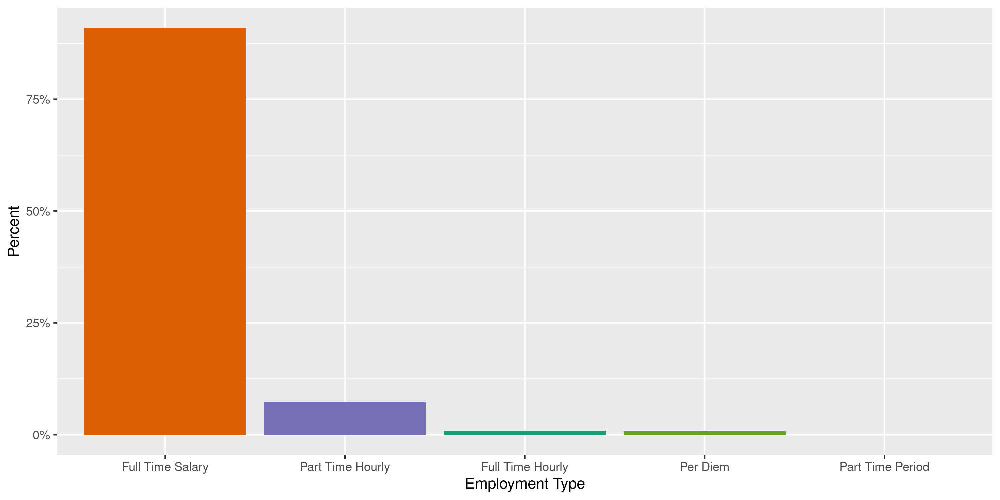
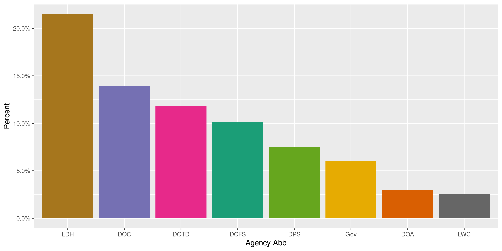
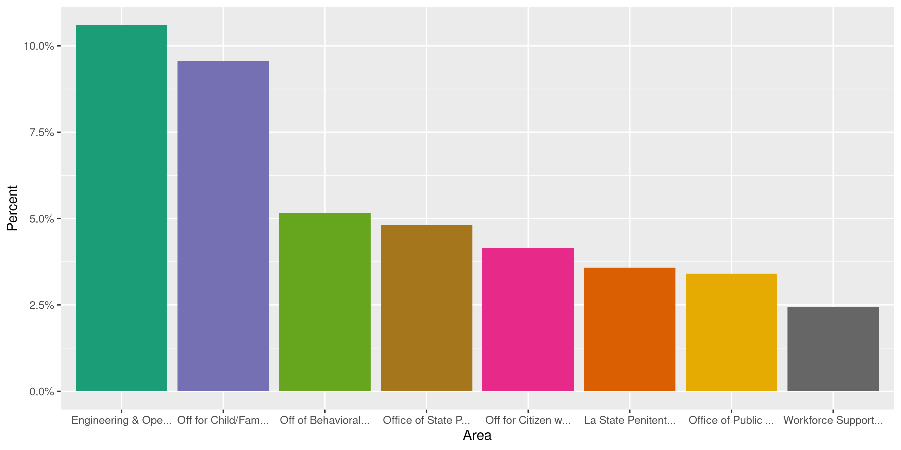
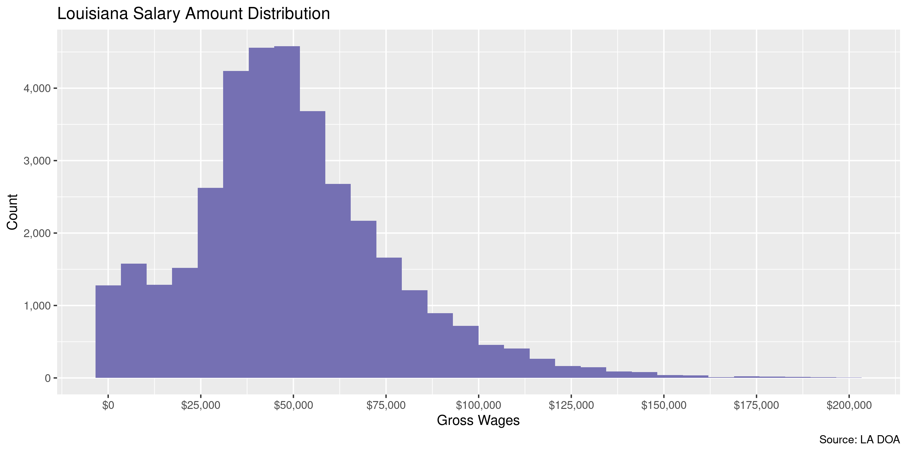
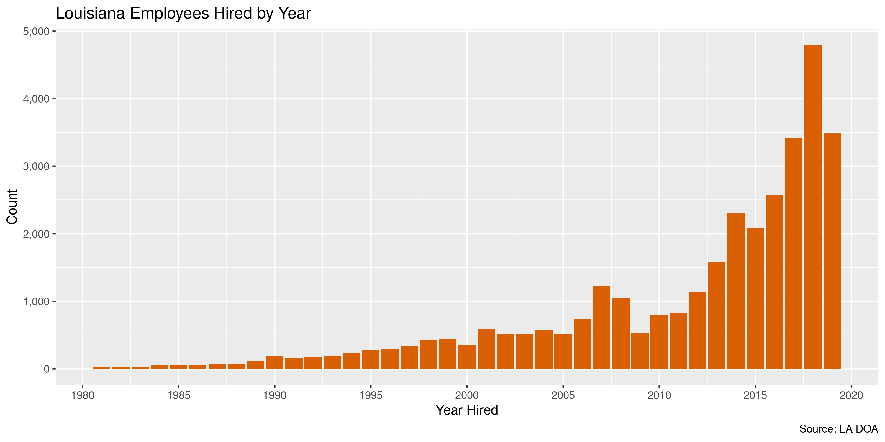

Louisiana Salary
================
Kiernan Nicholls
2020-06-03 12:56:43

  - [Project](#project)
  - [Objectives](#objectives)
  - [Packages](#packages)
  - [Data](#data)
  - [Read](#read)
  - [Explore](#explore)
  - [Wrangle](#wrangle)
  - [Conclude](#conclude)
  - [Export](#export)
  - [Upload](#upload)
  - [Dictionary](#dictionary)

<!-- Place comments regarding knitting here -->

## Project

The Accountability Project is an effort to cut across data silos and
give journalists, policy professionals, activists, and the public at
large a simple way to search across huge volumes of public data about
people and organizations.

Our goal is to standardizing public data on a few key fields by thinking
of each dataset row as a transaction. For each transaction there should
be (at least) 3 variables:

1.  All **parties** to a transaction.
2.  The **date** of the transaction.
3.  The **amount** of money involved.

## Objectives

This document describes the process used to complete the following
objectives:

1.  How many records are in the database?
2.  Check for entirely duplicated records.
3.  Check ranges of continuous variables.
4.  Is there anything blank or missing?
5.  Check for consistency issues.
6.  Create a five-digit ZIP Code called `zip`.
7.  Create a `year` field from the transaction date.
8.  Make sure there is data on both parties to a transaction.

## Packages

The following packages are needed to collect, manipulate, visualize,
analyze, and communicate these results. The `pacman` package will
facilitate their installation and attachment.

The IRW’s `campfin` package will also have to be installed from GitHub.
This package contains functions custom made to help facilitate the
processing of campaign finance data.

``` r
if (!require("pacman")) install.packages("pacman")
pacman::p_load_gh("irworkshop/campfin")
pacman::p_load(
  tidyverse, # data manipulation
  lubridate, # datetime strings
  gluedown, # printing markdown
  magrittr, # pipe operators
  janitor, # clean data frames
  refinr, # cluster and merge
  scales, # format strings
  readxl, # read excel files
  knitr, # knit documents
  vroom, # read files fast
  rvest, # html scraping
  glue, # combine strings
  here, # relative paths
  httr, # http requests
  fs # local storage 
)
```

This document should be run as part of the `R_campfin` project, which
lives as a sub-directory of the more general, language-agnostic
[`irworkshop/accountability_datacleaning`](https://github.com/irworkshop/accountability_datacleaning)
GitHub repository.

The `R_campfin` project uses the [RStudio
projects](https://support.rstudio.com/hc/en-us/articles/200526207-Using-Projects)
feature and should be run as such. The project also uses the dynamic
`here::here()` tool for file paths relative to *your* machine.

``` r
# where does this document knit?
here::here()
#> [1] "/home/kiernan/Code/accountability_datacleaning/R_campfin"
```

## Data

Salary data for the state of Louisiana was obtained via records request
pursuant to the Louisiana Public Records Act from the Department of
Administration. In the email providing the data, more information was
given:

> The information provided is for employees of executive branch agencies
> paid through the LaGov HCM payroll system. This does not include
> higher education or agencies in the legislative and judicial branches
> of government.

> Gross wages and paid overtime is provided for fiscal year 2019; all
> other information is reported as of the last day of fiscal year 2019
> (06/30/2019).

> The Overtime tab includes every employee who received overtime pay at
> any point during fiscal year 2019. Overtime reported is overtime that
> is paid as worked and it is included in the gross wages.

> The agency hire date is optional for entry in the LaGov HCM payroll
> system and the use may vary by agency. As such, this date may not
> exist for some employees. We cannot confirm the accuracy of this date
> (if populated) and we cannot confirm it reflects the employee’s first
> date of state service.

## Read

Data was provided as an Excel file with multiple sheets containing the
various tables needed to identify all salary information. We can use
`readxl::read_excel()` to read each individual sheet as a separate data
frame.

``` r
raw_dir <- dir_create(here("la", "salary", "data", "raw"))
raw_path <- dir_ls(raw_dir)
raw_sheets <- excel_sheets(raw_path)
```

We can read each sheet as a data frame in a list.

``` r
la_sheets <- list(
  emps = read_excel(raw_path, raw_sheets[1]),
  wages = read_excel(raw_path, raw_sheets[2]),
  overtime = read_excel(raw_path, raw_sheets[3]),
  hire_date = read_excel(raw_path, raw_sheets[4]),
  reference = read_excel(raw_path, raw_sheets[5], skip = 3)
)
```

``` r
glimpse(la_sheets)
#> List of 5
#>  $ emps     : tibble [37,866 × 8] (S3: tbl_df/tbl/data.frame)
#>   ..$ pa                       : num [1:37866] 100 100 100 100 100 100 100 100 100 100 ...
#>   ..$ pers_no                  : num [1:37866] 754 3102 7521 11898 14818 ...
#>   ..$ last_name                : chr [1:37866] "JUSTICE" "MOORE" "RABY" "KINCHEN" ...
#>   ..$ first_name               : chr [1:37866] "MILDRED" "ANITA" "LEAH" "ENGER" ...
#>   ..$ employment_type          : chr [1:37866] "Full Time Salary" "Full Time Salary" "Full Time Salary" "Full Time Salary" ...
#>   ..$ job_title                : chr [1:37866] "DIRECTOR" "MANAGER" "EXEC DIRECTOR" "EXECUTIVE ASSIST" ...
#>   ..$ annual_salary            : num [1:37866] 77522 67059 86715 51979 93766 ...
#>   ..$ work_hours_per_pay_period: num [1:37866] 80 80 80 80 80 80 40 80 42 80 ...
#>  $ wages    : tibble [44,377 × 6] (S3: tbl_df/tbl/data.frame)
#>   ..$ pers_area  : num [1:44377] 100 100 100 100 100 100 100 100 100 100 ...
#>   ..$ pers_no    : num [1:44377] 754 3102 7521 11898 14818 ...
#>   ..$ last_name  : chr [1:44377] "JUSTICE" "MOORE" "RABY" "KINCHEN" ...
#>   ..$ first_name : chr [1:44377] "MILDRED" "ANITA" "LEAH" "ENGER" ...
#>   ..$ wage_type  : chr [1:44377] "Total gross" "Total gross" "Total gross" "Total gross" ...
#>   ..$ gross_wages: num [1:44377] 77522 64080 86715 51979 93766 ...
#>  $ overtime : tibble [38,957 × 6] (S3: tbl_df/tbl/data.frame)
#>   ..$ pers_area   : num [1:38957] 100 100 100 100 100 100 100 100 100 100 ...
#>   ..$ pers_no     : num [1:38957] 312664 312664 312664 316706 316706 ...
#>   ..$ last_name   : chr [1:38957] "FORTENBERRY" "FORTENBERRY" "FORTENBERRY" "HUGHES" ...
#>   ..$ first_name  : chr [1:38957] "CLAIRE" "CLAIRE" "CLAIRE" "DEYON" ...
#>   ..$ wage_type   : chr [1:38957] "OT (ST) Attendance" "OT(1.5) Attendance" "OT(1.5) Att - NE Prem" "OT(1.5) Attendance" ...
#>   ..$ ytd_overtime: num [1:38957] 42.5 80.8 40.4 50 25 ...
#>  $ hire_date: tibble [37,874 × 5] (S3: tbl_df/tbl/data.frame)
#>   ..$ pa              : num [1:37874] 100 100 100 100 100 100 100 100 100 100 ...
#>   ..$ pers_no         : num [1:37874] 754 3102 7521 11898 14818 ...
#>   ..$ last_name       : chr [1:37874] "JUSTICE" "MOORE" "RABY" "KINCHEN" ...
#>   ..$ first_name      : chr [1:37874] "MILDRED" "ANITA" "LEAH" "ENGER" ...
#>   ..$ agency_hire_date: POSIXct[1:37874], format: "2016-01-11" "1998-06-22" "2016-01-11" ...
#>  $ reference: tibble [177 × 2] (S3: tbl_df/tbl/data.frame)
#>   ..$ pers_area          : chr [1:177] "0100" "0101" "0102" "0103" ...
#>   ..$ personnel_area_name: chr [1:177] "Gov-Executive Office" "Gov-Office of Indian Affairs" "Gov-Office of Inspector Gen" "Gov-Mental Health Advocacy Ser" ...
```

Then, we can combine each sheet into a single data frame.

``` r
las <- la_sheets$emps %>% 
  left_join(la_sheets$wages) %>% 
  left_join(la_sheets$overtime) %>% 
  left_join(la_sheets$hire_date) %>% 
  left_join(la_sheets$reference) %>% 
  arrange(last_name, first_name) %>% 
  mutate(across(hire_date, as_date)) %>% 
  select(-pa)
```

The `area` variable taken from the `pa` variable and `reference` sheet
contains a single string with an agency abbreviation and agency or
office. We can split the abbreviation into a separate variable.

``` r
las <- separate(
  data = las,
  col = area,
  into = c("agency_abb", "area"),
  sep = "\\s?-\\s?",
  remove = TRUE,
  fill = "left",
  extra = "merge"
)
```

## Explore

``` r
glimpse(las)
#> Rows: 37,866
#> Columns: 13
#> $ pers_no         <dbl> 112517, 314529, 308946, 160425, 46783, 284238, 170309, 318842, 264474, 1…
#> $ last_name       <chr> "AARABI", "AARON", "AARON", "AARON", "AARON", "AARON", "AARON", "AARON",…
#> $ first_name      <chr> "MEHDI", "ALEXIS", "ALISHA", "BRENDA", "JACQUELINE", "JALESA", "STANLEY"…
#> $ employment_type <chr> "Full Time Salary", "Full Time Salary", "Full Time Salary", "Full Time S…
#> $ job_title       <chr> "ENV SCIENTIST 3", "CHILD WELFARE SPEC 1", "ADMIN ASSISTANT 4", "RESIDEN…
#> $ annual_salary   <dbl> 56700.80, 33737.60, 45988.80, 39062.40, 42244.80, 27040.00, 58219.20, 25…
#> $ hours_worked    <dbl> 80.0, 80.0, 80.0, 80.0, 80.0, 80.0, 80.0, 80.0, 80.0, 80.0, 80.0, 80.0, …
#> $ wage_type       <chr> "Total gross", "Total gross", "Total gross", "Total gross", "Total gross…
#> $ gross_wages     <dbl> 56574.42, 37098.92, 45920.00, 49089.48, 61526.63, 26823.58, 56445.69, 24…
#> $ ytd_overtime    <dbl> NA, NA, NA, NA, NA, NA, NA, NA, NA, NA, NA, NA, NA, NA, NA, NA, NA, NA, …
#> $ hire_date       <date> NA, 2017-07-31, 2016-11-07, 2003-05-27, 1990-12-19, 2014-08-04, 2010-07…
#> $ agency_abb      <chr> NA, "DCFS", "LWC", "LDH", "LDH", "LDH", "Gov", "DNR", "Gov", "DOA", "DAF…
#> $ area            <chr> "Dept of Environmental Quality", "Off for Child/Family Srv", "Workforce …
tail(las)
#> # A tibble: 6 x 13
#>   pers_no last_name first_name employment_type job_title annual_salary hours_worked wage_type
#>     <dbl> <chr>     <chr>      <chr>           <chr>             <dbl>        <dbl> <chr>    
#> 1   30201 ZUELKE    OTTO       Part Time Hour… ENV SCIE…        47736            60 Total gr…
#> 2  283766 ZUMBRO    MALORIE    Full Time Sala… CORRS LI…        39458.           80 Total gr…
#> 3  218243 ZUMO      STEPHANIE  Full Time Sala… COASTAL …        66310.           80 Total gr…
#> 4  294908 ZUMWALT   CHELSEA    Full Time Sala… SOCIAL S…        40810.           80 Total gr…
#> 5   13989 ZUNDEL    DEBORAH    Full Time Sala… BUSINESS…        89898.           80 Total gr…
#> 6  221036 ZUNIGA A… MERCEDES   Full Time Sala… MEDIC PR…        45885.           80 Total gr…
#> # … with 5 more variables: gross_wages <dbl>, ytd_overtime <dbl>, hire_date <date>,
#> #   agency_abb <chr>, area <chr>
```

### Missing

Most records are not missing any values and need not be flagged.

``` r
col_stats(las, count_na)
#> # A tibble: 13 x 4
#>    col             class      n        p
#>    <chr>           <chr>  <int>    <dbl>
#>  1 pers_no         <dbl>      0 0       
#>  2 last_name       <chr>      0 0       
#>  3 first_name      <chr>      0 0       
#>  4 employment_type <chr>      0 0       
#>  5 job_title       <chr>      8 0.000211
#>  6 annual_salary   <dbl>      0 0       
#>  7 hours_worked    <dbl>      0 0       
#>  8 wage_type       <chr>   1371 0.0362  
#>  9 gross_wages     <dbl>   1371 0.0362  
#> 10 ytd_overtime    <dbl>  37866 1       
#> 11 hire_date       <date>  4972 0.131   
#> 12 agency_abb      <chr>   2094 0.0553  
#> 13 area            <chr>      0 0
```

### Duplicates

There are only a handful of records duplicated across every variable.

``` r
las <- flag_dupes(las, everything())
sum(las$dupe_flag)
#> [1] 6
```

``` r
las %>% 
  filter(dupe_flag) %>% 
  select(hire_date, last_name, gross_wages, area)
#> # A tibble: 6 x 4
#>   hire_date  last_name gross_wages area                
#>   <date>     <chr>           <dbl> <chr>               
#> 1 2013-02-01 COLE            36368 Board of Tax Appeals
#> 2 2013-02-01 COLE            36368 Board of Tax Appeals
#> 3 2009-06-02 GRAPHIA         42484 Board of Tax Appeals
#> 4 2009-06-02 GRAPHIA         42484 Board of Tax Appeals
#> 5 2016-04-19 LOBRANO         26883 Board of Tax Appeals
#> 6 2016-04-19 LOBRANO         26883 Board of Tax Appeals
```

### Categorical

``` r
col_stats(las, n_distinct)
#> # A tibble: 14 x 4
#>    col             class      n         p
#>    <chr>           <chr>  <int>     <dbl>
#>  1 pers_no         <dbl>  37863 1.00     
#>  2 last_name       <chr>  10493 0.277    
#>  3 first_name      <chr>   8432 0.223    
#>  4 employment_type <chr>      5 0.000132 
#>  5 job_title       <chr>   1663 0.0439   
#>  6 annual_salary   <dbl>   5869 0.155    
#>  7 hours_worked    <dbl>     48 0.00127  
#>  8 wage_type       <chr>      2 0.0000528
#>  9 gross_wages     <dbl>  33099 0.874    
#> 10 ytd_overtime    <dbl>      1 0.0000264
#> 11 hire_date       <date>  4974 0.131    
#> 12 agency_abb      <chr>     28 0.000739 
#> 13 area            <chr>    109 0.00288  
#> 14 dupe_flag       <lgl>      2 0.0000528
```

<!-- --><!-- --><!-- -->

### Amounts

There aren’t any gross wages values at or under zero, as you’d expect.

``` r
summary(las$gross_wages)
#>     Min.  1st Qu.   Median     Mean  3rd Qu.     Max.     NA's 
#>     14.5  32639.1  45993.7  49575.3  63607.7 452500.3     1371
mean(las$gross_wages <= 0, na.rm = TRUE)
#> [1] 0
```

Here is the highest paid public employee:

``` r
glimpse(las[which.max(las$gross_wages), ])
#> Rows: 1
#> Columns: 14
#> $ pers_no         <dbl> 288406
#> $ last_name       <chr> "HENDERSON"
#> $ first_name      <chr> "JAMES"
#> $ employment_type <chr> "Full Time Salary"
#> $ job_title       <chr> "PRESIDENT"
#> $ annual_salary   <dbl> 400000.1
#> $ hours_worked    <dbl> 80
#> $ wage_type       <chr> "Total gross"
#> $ gross_wages     <dbl> 452500.3
#> $ ytd_overtime    <dbl> NA
#> $ hire_date       <date> 2017-01-01
#> $ agency_abb      <chr> "HED"
#> $ area            <chr> "Bd Supervisors U of La Sys"
#> $ dupe_flag       <lgl> FALSE
```

The distribution of public employee salaries is reasonable.

<!-- -->

### Dates

We can add the calendar year from `date` with `lubridate::year()`

``` r
las <- mutate(las, hire_year = year(hire_date))
```

``` r
min(las$hire_date, na.rm = TRUE)
#> [1] "1955-06-02"
max(las$hire_date, na.rm = TRUE)
#> [1] "2209-06-05"
sum(las$hire_date > today(), na.rm = TRUE)
#> [1] 3
```

<!-- -->

## Wrangle

There are no geographic variables to wrangle. We can manually add the
state for all spending agencies.

``` r
las <- mutate(las, agency_state = "LA", .after = agency_abb)
```

## Conclude

``` r
glimpse(sample_n(las, 20))
#> Rows: 20
#> Columns: 16
#> $ pers_no         <dbl> 308611, 44715, 273839, 69411, 65376, 308328, 317828, 284927, 126972, 279…
#> $ last_name       <chr> "JONES", "CONEGLIO-DUHE", "STEELE", "WILLIAMS", "GONZALES", "HARGROVE", …
#> $ first_name      <chr> "SHALLAN", "MAURIE", "MARGARET", "KAREN", "GUY", "LLOYD", "MICHAEL", "LI…
#> $ employment_type <chr> "Full Time Salary", "Full Time Salary", "Full Time Salary", "Full Time S…
#> $ job_title       <chr> "ED PROGRAM CONSULTANT 2", "COMMUNITY SERVICE PROFESS", "CRIME LAB ANALY…
#> $ annual_salary   <dbl> 56305.6, 71136.0, 57532.8, 53580.8, 49254.4, 40851.2, 27476.8, 35984.0, …
#> $ hours_worked    <dbl> 80, 80, 80, 80, 80, 80, 80, 80, 80, 80, 80, 80, 80, 80, 80, 80, 80, 80, …
#> $ wage_type       <chr> "Total gross", "Total gross", "Total gross", "Total gross", "Total gross…
#> $ gross_wages     <dbl> 55797.13, 71078.81, 76945.79, 53569.61, 56724.89, 40732.01, 33037.85, 35…
#> $ ytd_overtime    <dbl> NA, NA, NA, NA, NA, NA, NA, NA, NA, NA, NA, NA, NA, NA, NA, NA, NA, NA, …
#> $ hire_date       <date> 2016-10-25, 2012-12-10, 2013-06-03, NA, 2012-12-24, 2016-10-10, 2017-12…
#> $ agency_abb      <chr> NA, "LDH", "DPS", "DCFS", "DPS", "DNR", "DAF", "DOTD", "DCFS", "SSC", "D…
#> $ agency_state    <chr> "LA", "LA", "LA", "LA", "LA", "LA", "LA", "LA", "LA", "LA", "LA", "LA", …
#> $ area            <chr> "DOE State Activities", "Fl Parishes Human Srv Auth", "Office of State P…
#> $ dupe_flag       <lgl> FALSE, FALSE, FALSE, FALSE, FALSE, FALSE, FALSE, FALSE, FALSE, FALSE, FA…
#> $ hire_year       <dbl> 2016, 2012, 2013, NA, 2012, 2016, 2017, 2014, 2001, 2019, 2014, 2017, 20…
```

1.  There are 37,866 records in the database.
2.  There are 6 duplicate records in the database.
3.  The range and distribution of `amount` and `date` seem reasonable.
4.  There are 0 records missing key variables.
5.  There are no geographic variables to normalize, `state` was added
    manually.
6.  The 4-digit `hire_year` variable has been created with
    `lubridate::year()`.

## Export

Now the file can be saved on disk for upload to the Accountability
server.

``` r
clean_dir <- dir_create(here("la", "salary", "data", "clean"))
clean_path <- path(clean_dir, "la_salary_clean.csv")
write_csv(las, clean_path, na = "")
file_size(clean_path)
#> 5.09M
mutate(file_encoding(clean_path), across(path, path.abbrev))
#> # A tibble: 1 x 3
#>   path                                       mime            charset 
#>   <chr>                                      <chr>           <chr>   
#> 1 ~/la/salary/data/clean/la_salary_clean.csv application/csv us-ascii
```

## Upload

Using the [duckr](https://github.com/kiernann/duckr) R package, we can
wrap around the [duck](https://duck.sh/) command line tool to upload the
file to the IRW server.

``` r
# remotes::install_github("kiernann/duckr")
s3_dir <- "s3:/publicaccountability/csv/"
s3_path <- path(s3_dir, basename(clean_path))
if (require(duckr)) {
  duckr::duck_upload(clean_path, s3_path)
}
```

## Dictionary

The following table describes the variables in our final exported file:

| Column            | Type        | Definition                                |
| :---------------- | :---------- | :---------------------------------------- |
| `pers_no`         | `double`    | Unique personnel number                   |
| `last_name`       | `character` | Employee last name                        |
| `first_name`      | `character` | Emplyee first name                        |
| `employment_type` | `character` | Employment type (full, part)              |
| `job_title`       | `character` | Full job title                            |
| `annual_salary`   | `double`    | Annual salary before overtime or hours    |
| `hours_worked`    | `double`    | Estimated hours worked per pay period     |
| `wage_type`       | `character` | Reported wage type for `gross_wage`       |
| `gross_wages`     | `double`    | Gross wages paid, including overtime      |
| `ytd_overtime`    | `double`    | Overtime year-to-date                     |
| `hire_date`       | `double`    | Date hired at agency                      |
| `agency_abb`      | `character` | Personnel area agency                     |
| `agency_state`    | `character` | Agency state, single value manually added |
| `area`            | `character` | Personnel area name                       |
| `dupe_flag`       | `logical`   | Flag indicating duplicate record          |
| `hire_year`       | `double`    | Calendar year hired at agency             |

``` r
write_lines(
  x = c("# Louisiana Salary Data Dictionary\n", dict_md),
  path = here("la", "salary", "la_salary_dict.md"),
)
```
