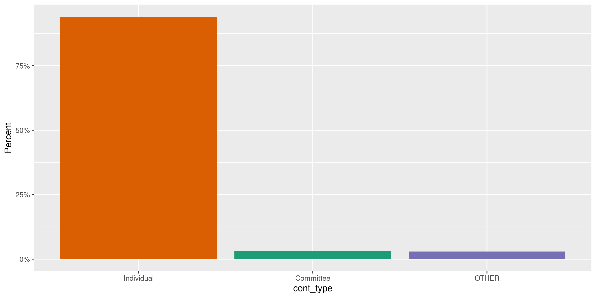
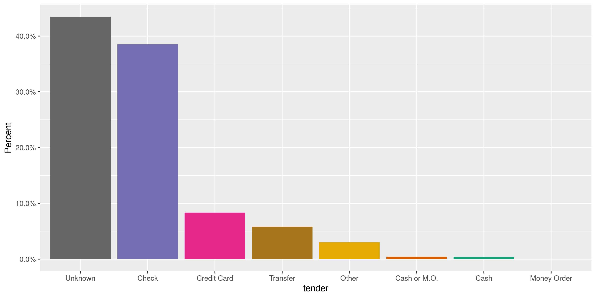
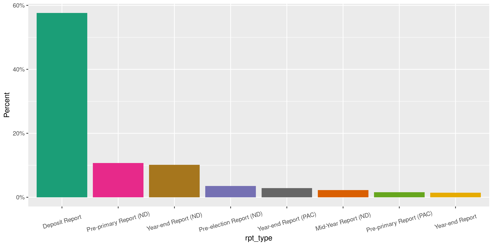
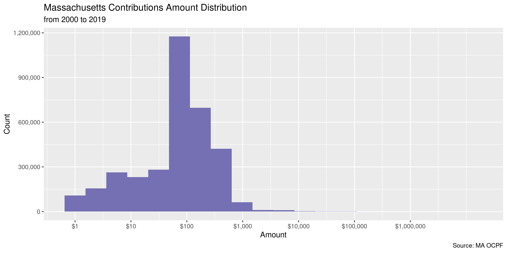
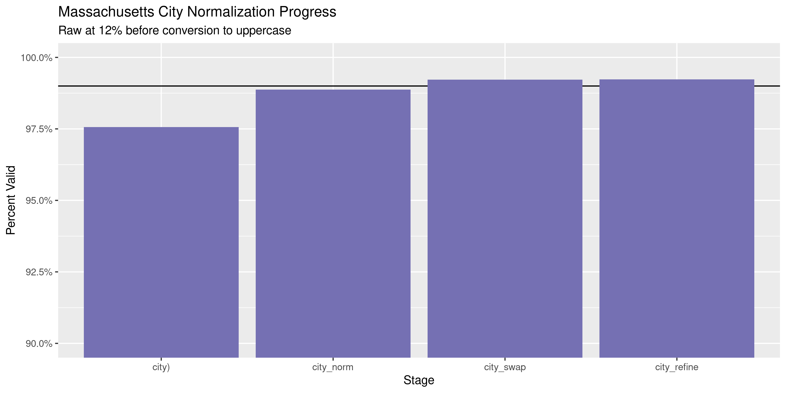
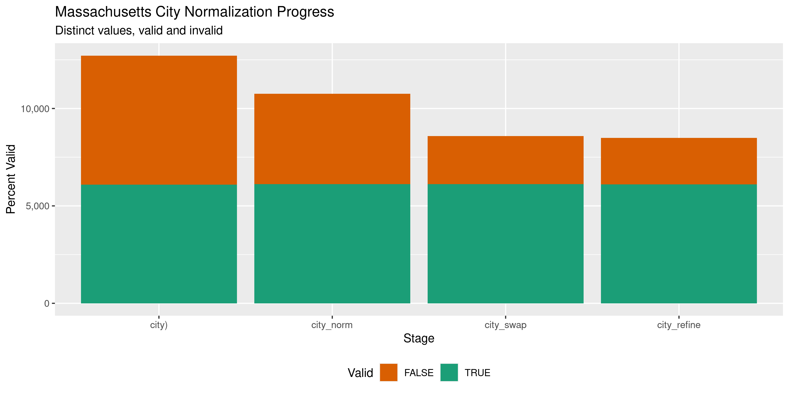

Massachusetts Contributions
================
Kiernan Nicholls & Yanqi Xu
2024-01-14 12:58:55

- [Project](#project)
- [Objectives](#objectives)
- [Packages](#packages)
- [Data](#data)
- [Download](#download)
- [Read](#read)
- [Filer](#filer)
- [Explore](#explore)
- [Missing](#missing)
- [Duplicates](#duplicates)
- [Categorical](#categorical)
- [Amounts](#amounts)
- [Dates](#dates)
- [Wrangle](#wrangle)
- [Export](#export)
- [Upload](#upload)
- [Dictionary](#dictionary)

<!-- Place comments regarding knitting here -->

## Project

The Accountability Project is an effort to cut across data silos and
give journalists, policy professionals, activists, and the public at
large a simple way to search across huge volumes of public data about
people and organizations.

Our goal is to standardizing public data on a few key fields by thinking
of each dataset row as a transaction. For each transaction there should
be (at least) 3 variables:

1.  All **parties** to a transaction.
2.  The **date** of the transaction.
3.  The **amount** of money involved.

## Objectives

This document describes the process used to complete the following
objectives:

1.  How many records are in the database?
2.  Check for entirely duplicated records.
3.  Check ranges of continuous variables.
4.  Is there anything blank or missing?
5.  Check for consistency issues.
6.  Create a five-digit ZIP Code called `zip`.
7.  Create a `year` field from the transaction date.
8.  Make sure there is data on both parties to a transaction.

## Packages

The following packages are needed to collect, manipulate, visualize,
analyze, and communicate these results. The `pacman` package will
facilitate their installation and attachment.

The IRW’s `campfin` package will also have to be installed from GitHub.
This package contains functions custom made to help facilitate the
processing of campaign finance data.

``` r
if (!require("pacman")) install.packages("pacman")
pacman::p_load_gh("irworkshop/campfin")
pacman::p_load_gh("kiernann/mdbr")
pacman::p_load(
  tidyverse, # data manipulation
  lubridate, # datetime strings
  magrittr, # pipe operators
  gluedown, # print markdown
  janitor, # dataframe clean
  aws.s3, # aws cloud storage
  refinr, # cluster and merge
  scales, # format strings
  knitr, # knit documents
  vroom, # read files fast
  glue, # combine strings
  here, # relative storage
  fs # search storage 
)
```

This document should be run as part of the `R_campfin` project, which
lives as a sub-directory of the more general, language-agnostic
[`irworkshop/accountability_datacleaning`](https://github.com/irworkshop/accountability_datacleaning)
GitHub repository.

The `R_campfin` project uses the [RStudio
projects](https://support.rstudio.com/hc/en-us/articles/200526207-Using-Projects)
feature and should be run as such. The project also uses the dynamic
`here::here()` tool for file paths relative to *your* machine.

``` r
# where does this document knit?
here::here()
#> [1] "/Users/yanqixu/code/accountability_datacleaning"
```

## Data

Data is obtained from the Massachusetts \[Office of Campaign and
Political Finance (OCPF)\]\[<https://www.ocpf.us/>\].

> The Office of Campaign and Political Finance is an independent state
> agency that administers Massachusetts General Law [Chapter
> 55](https://www.ocpf.us/Legal/CampaignFinanceLaw) the campaign finance
> law, and [Chapter 55C](https://www.ocpf.us/Legal/PublicFinancingLaw),
> the limited public financing program for statewide candidates.
> Established in 1973, OCPF is the depository for disclosure reports
> filed by candidates and political committees under M.G.L. Chapter 55.

## Download

We can download zip files by year. These zip files contain multiple data
files.

We can download this archive and extract the file to the
`ma/contribs/data/raw` directory.

``` r
#raw_dir <- dir_create(here("state","ma", "contribs", "data", "raw"))
raw_dir <- here("state","ma", "contribs", "data", "raw")
zip_name <- glue("ocpf-{2020:2023}-reports.zip")
zip_url <- str_c("http://ocpf2.blob.core.windows.net/downloads/data2/", zip_name)
zip_paths <- path(raw_dir, zip_name) 
```

``` r
for (i in seq_along(zip_paths)) {
 if (!this_file_new(zip_paths[i])) {
  download.file(zip_url[i], zip_paths[i])
  unzip(zip_paths[i], exdir = str_remove(zip_paths[i],".zip"))
} 
}
```

## Read

We can see that `read_me` file provided in the zip details the file
layouts for these tables. For contributions, everthing is contained in
the `report-items.txt` file.

``` r
data_meta <- read_lines(dir_ls(raw_dir, regexp = "readme.txt",recurse = T)[1])

data_dict <- data_meta[175:246]

data_dict <- data_dict %>% I() %>%  read_tsv(col_names = c("variable","notes"))

data_dict <- data_dict %>% 
  mutate(notes = coalesce(notes, X3)) %>% select(-X3)
```

``` r
raw_paths <- dir_ls(raw_dir, regexp = "report-items.txt",recurse = T)

mac <- read_tsv(
  file = raw_paths,
  na = c("", "NA", "N/A"),
  col_types = cols(
    .default = col_character(),
    Amount = col_double()
  )
)

mac <- mac %>% select(-ncol(mac))
```

According to the data dictionary, this file contains both receipts and
expenditures. We need to narrow down to records related to receipts only
using the `record_type_id` indicator.

``` r
mac$record_type_id <- mac$record_type_id %>% as.double()

mac <- mac %>% filter(record_type_id %in% c(201:204,211,220,303,401:403))
```

### Contribution type

The type of contribution (individual, committee) is recorded in the
\`record_type_id\`\` field and each number represents a contribution
category described in the data dictionary. We will join that with the
original data

``` r
cont_tb <- data_meta[90:156] %>% I() %>%  read_tsv(col_names = c("record_type_id","cont_type"))
```

``` r
mac <- mac %>% left_join(cont_tb)
```

### Previous

Since there are some entries that were already included in the last
update, we’ll get rid of these rows by matching the `item_id`.

``` r
mac_prev <- read_csv(here("state","ma", "contribs", "data","previous","ma_contribs_clean.csv"))
```

We’ll then standardize these column names so that they’re consistent.

``` r
mac <- mac %>% 
  rename(id = item_id,
          rpt_id = report_id,
          address = street_address,
          cpf_id = related_cpf_id,
          officer = principal_officer,
          tender = tender_type_id
          ) %>%
  mutate(date = mdy(date),
         tender = tender %>% str_replace("1", "Check") %>% 
str_replace("2", "Cash or Money Order") %>% 
str_replace("3", "Credit Card") %>% 
str_replace("4", "Transfer") %>% 
str_replace("5", "Other") %>% 
str_replace("6", "Cash") %>% 
str_replace("7", "Money Order"))

mac$id = as.double(mac$id)
```

``` r
mac <- mac %>% filter(id %out% mac_prev$id)
```

``` r
mac$rpt_id <- as.numeric(mac$rpt_id)
```

## Filer

This file doesn’t contain the information about filers and recipients of
contributions. We need to extract that information from the data file
`reports.csv`.

``` r
mac_f <- read_tsv(dir_ls(raw_dir, regexp = "reports.txt",recurse = T)) %>% clean_names()
```

We only need the committee name in this case, and will match the filer
data with the contribution data base on the `line` (or `report_id` in
the filer data base) field.

``` r
mac_f <- mac_f %>% 
  select(rpt_id = report_id, recip_any = ocpf_full_name,rpt_type = report_type_description)
```

``` r
mac <- mac %>% left_join(mac_f)
```

## Explore

There are 1,446,645 rows of 24 columns.

``` r
glimpse(mac)
#> Rows: 1,446,645
#> Columns: 24
#> $ id                       <dbl> 13717905, 13718907, 13724648, 13726952, 13726953, 13735698, 1381…
#> $ rpt_id                   <dbl> 731792, 731879, 732999, 733398, 733398, 733952, 739697, 745968, …
#> $ record_type_id           <dbl> 401, 303, 401, 303, 303, 401, 303, 201, 201, 201, 201, 201, 201,…
#> $ date                     <date> 2020-02-01, 2020-02-28, 2020-03-04, 2020-01-17, 2020-03-05, 202…
#> $ amount                   <dbl> 500.00, 170.03, 300.00, 100.00, 100.00, 560.00, 50.00, 1.00, 1.0…
#> $ last                     <chr> "Keefe", "Michelle Benedetti Scholarship Fund", "Pohner", "Commi…
#> $ first                    <chr> "Todd", NA, "Christopher", NA, NA, "Heather", NA, "Lawrence P", …
#> $ address                  <chr> "740 Boylston St", NA, "217 Edendale St", "South Street", "75 Be…
#> $ city                     <chr> "Boston", "Haverill", "springfield", "Reading", "Reading", "Fram…
#> $ state                    <chr> "MA", "MA", "MA", "MA", "MA", "MA", "MA", "MA", "MA", "MA", "MA"…
#> $ zip                      <chr> "02108", NA, "01104", "01867", "01867", "01701", "02184", "02125…
#> $ description              <chr> "Work On Campaign Website", "Scholarship Fund", "Pay Pal Out of …
#> $ cpf_id                   <chr> NA, NA, NA, NA, NA, NA, NA, NA, NA, NA, NA, NA, NA, NA, NA, NA, …
#> $ occupation               <chr> "Communications Director", NA, "retired", NA, NA, "Senior System…
#> $ employer                 <chr> "Palmer Campaign", NA, "Retired", NA, NA, "Tufts University", NA…
#> $ officer                  <chr> NA, NA, NA, NA, NA, NA, NA, NA, NA, NA, NA, NA, NA, NA, NA, NA, …
#> $ tender                   <chr> NA, NA, NA, NA, NA, NA, NA, "Check", "Check", "Check", "Check", …
#> $ clarified_name           <chr> NA, NA, NA, NA, NA, NA, NA, NA, NA, NA, NA, NA, NA, NA, NA, NA, …
#> $ clarified_purpose        <chr> NA, NA, NA, NA, NA, NA, NA, NA, NA, NA, NA, NA, NA, NA, NA, NA, …
#> $ is_supported             <chr> "False", NA, "False", NA, NA, "False", NA, NA, NA, NA, NA, NA, N…
#> $ is_previous_year_receipt <chr> NA, NA, NA, NA, NA, NA, NA, NA, NA, NA, NA, NA, NA, NA, NA, NA, …
#> $ cont_type                <chr> "Individual Inkind Contribution", "Contribution to a registered …
#> $ recip_any                <chr> "Stephen Palmer", "Daniel S. Trocki", "Christopher J. Pohner", "…
#> $ rpt_type                 <chr> "Initial Report", "Dissolution Report", "Dissolution Report", "D…
tail(mac)
#> # A tibble: 6 × 24
#>         id rpt_id record_t…¹ date       amount last  first address city  state zip   descr…² cpf_id
#>      <dbl>  <dbl>      <dbl> <date>      <dbl> <chr> <chr> <chr>   <chr> <chr> <chr> <chr>   <chr> 
#> 1 16477220 912357        201 2023-07-11     15 Wash… Shar… 16 Tra… Brid… MA    02324 <NA>    <NA>  
#> 2 16477222 912357        201 2023-07-11     20 Frez… Stev… 170 Gr… Milt… MA    02186 <NA>    <NA>  
#> 3 16477223 912357        201 2023-08-08     25 Linc… Suza… 540 Pl… Brid… MA    02324 <NA>    <NA>  
#> 4 16477224 912357        201 2023-09-12     15 Linc… Suza… 540 Pl… Brid… MA    02324 <NA>    <NA>  
#> 5 16477225 912357        201 2023-09-12     40 Marr… Gary  48 Vil… Brid… MA    02324 <NA>    <NA>  
#> 6 16477228 912357        201 2023-11-14     50 Marr… Gary  48 Vil… Brid… MA    02324 <NA>    <NA>  
#> # … with 11 more variables: occupation <chr>, employer <chr>, officer <chr>, tender <chr>,
#> #   clarified_name <chr>, clarified_purpose <chr>, is_supported <chr>,
#> #   is_previous_year_receipt <chr>, cont_type <chr>, recip_any <chr>, rpt_type <chr>, and
#> #   abbreviated variable names ¹​record_type_id, ²​description
```

## Missing

We should flag any records missing one of the key variables needed to
properly identify a unique contribution.

``` r
col_stats(mac, count_na)
#> # A tibble: 24 × 4
#>    col                      class        n        p
#>    <chr>                    <chr>    <int>    <dbl>
#>  1 id                       <dbl>        0 0       
#>  2 rpt_id                   <dbl>        0 0       
#>  3 record_type_id           <dbl>        0 0       
#>  4 date                     <date>       0 0       
#>  5 amount                   <dbl>        0 0       
#>  6 last                     <chr>      178 0.000123
#>  7 first                    <chr>    26967 0.0186  
#>  8 address                  <chr>    23973 0.0166  
#>  9 city                     <chr>    23199 0.0160  
#> 10 state                    <chr>   293271 0.203   
#> 11 zip                      <chr>    34975 0.0242  
#> 12 description              <chr>  1418192 0.980   
#> 13 cpf_id                   <chr>  1436232 0.993   
#> 14 occupation               <chr>   277576 0.192   
#> 15 employer                 <chr>   241093 0.167   
#> 16 officer                  <chr>  1444481 0.999   
#> 17 tender                   <chr>    20486 0.0142  
#> 18 clarified_name           <chr>  1446645 1       
#> 19 clarified_purpose        <chr>  1446645 1       
#> 20 is_supported             <chr>  1037442 0.717   
#> 21 is_previous_year_receipt <chr>   813879 0.563   
#> 22 cont_type                <chr>        0 0       
#> 23 recip_any                <chr>        0 0       
#> 24 rpt_type                 <chr>        0 0
```

We can first `dplyr::coalesce()` the contributor and recipient variables
to only flag records missing *any* kind of name.

``` r
mac <- mac %>% 
  unite(
    col = contrib_any,
    first, last, 
    sep = " ",
    na.rm = TRUE,
    remove = FALSE
  ) %>% 
  relocate(contrib_any, .after = last_col()) %>% 
  mutate(across(contrib_any, na_if, "")) %>% 
  flag_na(contrib_any, recip_any, date, amount)
```

The only variable missing from theses columns is the coalesced
contributor name.

``` r
mac %>% 
  filter(na_flag) %>% 
  select(contrib_any, recip_any, date, amount) %>% 
  col_stats(count_na)
#> # A tibble: 4 × 4
#>   col         class      n     p
#>   <chr>       <chr>  <int> <dbl>
#> 1 contrib_any <chr>    171     1
#> 2 recip_any   <chr>      0     0
#> 3 date        <date>     0     0
#> 4 amount      <dbl>      0     0
```

For all records with a `cont_type` of “OTHER”, there is no given
contributor name. We can remove these flags.

``` r
prop_na(mac$contrib_any[which(mac$cont_type != "OTHER")])
#> [1] 0.0001182045
prop_na(mac$contrib_any[which(mac$cont_type == "OTHER")])
#> [1] NaN
mac$na_flag[which(mac$cont_type == "OTHER")] <- FALSE
# very few remain
percent(mean(mac$na_flag), accuracy = 0.01)
#> [1] "0.01%"
```

## Duplicates

We can create a file containing every duplicate record in the data.

``` r
dupe_file <- path(dirname(raw_dir), "dupes.tsv")
if (!file_exists(dupe_file)) {
  file_create(dupe_file)
  mac <- mutate(mac, group = str_sub(date, end = 7))
  ma_id <- split(mac$id, mac$group)
  mas <- mac %>%
    select(-id) %>% 
    group_split(group, .keep = FALSE)
  pb <- txtProgressBar(max = length(mas), style = 3)
  for (i in seq_along(mas)) {
    d1 <- duplicated(mas[[i]], fromLast = FALSE)
    d2 <- duplicated(mas[[i]], fromLast = TRUE)
    dupes <- data.frame(id = ma_id[[i]], dupe_flag = d1 | d2)
    dupes <- filter(dupes, dupe_flag)
    vroom_write(
      x = dupes,
      path = dupe_file,
      append = TRUE,
      progress = FALSE,
    )
    rm(d1, d2, dupes)
    mas[[i]] <- NA
    flush_memory(1)
    setTxtProgressBar(pb, i)
  }
}
```

``` r
dupes <- vroom(
  file = dupe_file,
  col_names = c("id", "dupe_flag"),
  col_types = cols(
    id = col_number(),
    dupe_flag = col_logical()
  )
)
```

This file can then be joined against the contributions using the
transaction ID.

``` r
mac <- left_join(mac, dupes, by = "id")
mac <- mutate(mac, dupe_flag = !is.na(dupe_flag))
percent(mean(mac$dupe_flag), 0.1)
#> [1] "13.2%"
```

``` r
mac %>% 
  filter(dupe_flag) %>% 
  select(contrib_any, recip_any, date, amount) %>% 
  arrange(date, contrib_any)
#> # A tibble: 190,549 × 4
#>    contrib_any         recip_any                           date       amount
#>    <chr>               <chr>                               <date>      <dbl>
#>  1 David R Weiss-irwin Erika Uyterhoeven                   2020-02-13     50
#>  2 David R Weiss-irwin Erika Uyterhoeven                   2020-02-13     50
#>  3 Daniel Gilbert      Ranked Choice Voting 2020 Committee 2020-02-21      3
#>  4 Daniel Gilbert      Ranked Choice Voting 2020 Committee 2020-02-21      3
#>  5 Sam Hammar          Erika Uyterhoeven                   2020-03-09     20
#>  6 Sam Hammar          Erika Uyterhoeven                   2020-03-09     20
#>  7 Yotam Bentov        Erika Uyterhoeven                   2020-03-16     25
#>  8 Yotam Bentov        Erika Uyterhoeven                   2020-03-16     25
#>  9 Kathryn Deane       Raise Up Massachusetts 2022         2020-06-06     10
#> 10 Kathryn Deane       Raise Up Massachusetts 2022         2020-06-06     10
#> # … with 190,539 more rows
```

## Categorical

``` r
col_stats(mac, n_distinct)
#> # A tibble: 27 × 4
#>    col                      class        n           p
#>    <chr>                    <chr>    <int>       <dbl>
#>  1 id                       <dbl>  1446645 1          
#>  2 rpt_id                   <dbl>    67235 0.0465     
#>  3 record_type_id           <dbl>        9 0.00000622 
#>  4 date                     <date>    1464 0.00101    
#>  5 amount                   <dbl>     7792 0.00539    
#>  6 last                     <chr>    94687 0.0655     
#>  7 first                    <chr>    44081 0.0305     
#>  8 address                  <chr>   320750 0.222      
#>  9 city                     <chr>     8510 0.00588    
#> 10 state                    <chr>      197 0.000136   
#> 11 zip                      <chr>    48375 0.0334     
#> 12 description              <chr>     5847 0.00404    
#> 13 cpf_id                   <chr>     1010 0.000698   
#> 14 occupation               <chr>    34884 0.0241     
#> 15 employer                 <chr>    89525 0.0619     
#> 16 officer                  <chr>      897 0.000620   
#> 17 tender                   <chr>        8 0.00000553 
#> 18 clarified_name           <chr>        1 0.000000691
#> 19 clarified_purpose        <chr>        1 0.000000691
#> 20 is_supported             <chr>        2 0.00000138 
#> 21 is_previous_year_receipt <chr>        3 0.00000207 
#> 22 cont_type                <chr>        9 0.00000622 
#> 23 recip_any                <chr>     2076 0.00144    
#> 24 rpt_type                 <chr>       22 0.0000152  
#> 25 contrib_any              <chr>   273748 0.189      
#> 26 na_flag                  <lgl>        2 0.00000138 
#> 27 dupe_flag                <lgl>        2 0.00000138
```

<!-- -->

<!-- -->

<!-- -->

<!-- -->

## Amounts

``` r
summary(mac$amount)
#>     Min.  1st Qu.   Median     Mean  3rd Qu.     Max. 
#>  -100000        5        9      242       69 13290000
mean(mac$amount <= 0)
#> [1] 0.002839674
```

<!-- -->

## Dates

The actual year a contribution was made sometimes differs from the year
in which it was reported. We will create a new `year` variable from
`date` using `lubridate::year()`. This will more accurately identify the
contribution.

``` r
mac <- mutate(mac, year = year(date))

max_year <- max(mac$year, na.rm = T)
min_year <- min(mac$year, na.rm = T)
```

``` r
mac %>%
  count(year) %>%
  mutate(even = is_even(year)) %>% 
  ggplot(aes(x = year, y = n)) +
  geom_col(aes(fill = even)) +
  coord_cartesian(xlim = c(min_year, max_year)) +
  scale_fill_brewer(palette = "Dark2") +
  scale_x_continuous(breaks = seq(min_year, max_year, by = 2)) +
  theme(legend.position = "bottom") +
  labs(
    title = "Massachusetts Contributions by Year",
    caption = "Source: MA OCPF",
    fill = "Election Year",
    x = "Amount",
    y = "Count"
  )
```

<!-- -->

``` r
min(mac$date)
#> [1] "1921-09-10"
max(mac$date)
#> [1] "2023-12-31"
sum(mac$date > today())
#> [1] 0
```

## Wrangle

To improve the searchability of the database, we will perform some
consistent, confident string normalization. For geographic variables
like city names and ZIP codes, the corresponding `campfin::normal_*()`
functions are tailor made to facilitate this process.

``` r
comma(nrow(mac))
#> [1] "1,446,645"
```

### Address

For the street `addresss` variable, the `campfin::normal_address()`
function will force consistence case, remove punctuation, and abbreviate
official USPS suffixes.

This can be done by creating a separate table of unique normalized
addresses.

``` r
addr_norm <- mac %>%
  count(address, sort = TRUE) %>% 
  select(-n) %>% 
  mutate(
    address_norm = normal_address(
      address = address,
      abbs = usps_street,
      na_rep = TRUE
    )
  )
```

``` r
print(addr_norm)
#> # A tibble: 320,750 × 2
#>    address                     address_norm              
#>    <chr>                       <chr>                     
#>  1 <NA>                        <NA>                      
#>  2 159 S Main Street           159 S MAIN ST             
#>  3 7 Laborers Way              7 LABORERS WAY            
#>  4 100 Federal Street          100 FEDERAL ST            
#>  5 32 Chestnut Rd              32 CHESTNUT RD            
#>  6 11 Beacon Street  Suite 309 11 BEACON STREET SUITE 309
#>  7 11 Beacon St., Suite 410    11 BEACON ST SUITE 410    
#>  8 195 Old Colony Avenue       195 OLD COLONY AVE        
#>  9 PO Box 441146               PO BOX 441146             
#> 10 10 South Meadow Ridge       10 SOUTH MEADOW RDG       
#> # … with 320,740 more rows
```

Then joining that table on to the original contributions.

``` r
mac <- left_join(mac, addr_norm, by = "address")
rm(addr_norm)
```

### ZIP

For ZIP codes, the `campfin::normal_zip()` function will attempt to
create valid *five* digit codes by removing the ZIP+4 suffix and
returning leading zeroes dropped by other programs like Microsoft Excel.

``` r
zip_norm <- mac %>%
  count(zip, sort = TRUE) %>% 
  select(-n) %>% 
  mutate(
    zip_norm = normal_zip(
      zip = zip,
      na_rep = TRUE
    )
  )
```

``` r
mac <- left_join(mac, zip_norm, by = "zip")
rm(zip_norm)
```

``` r
progress_table(
  mac$zip,
  mac$zip_norm,
  compare = valid_zip
)
#> # A tibble: 2 × 6
#>   stage        prop_in n_distinct prop_na  n_out n_diff
#>   <chr>          <dbl>      <dbl>   <dbl>  <dbl>  <dbl>
#> 1 mac$zip        0.842      48375  0.0242 223043  40473
#> 2 mac$zip_norm   0.999       9098  0.0242   1850    662
```

### State

Valid two digit state abbreviations can be made using the
`campfin::normal_state()` function.

``` r
state_norm <- mac %>%
  count(state, sort = TRUE) %>% 
  select(-n) %>% 
  mutate(
    state_norm = normal_state(
      state = state,
      abbreviate = TRUE,
      na_rep = TRUE,
      valid = NULL
    )
  )
```

``` r
mac <- left_join(mac, state_norm, by = "state")
rm(state_norm)
```

``` r
mac %>%
  filter(state != state_norm) %>%
  count(state, state_norm, sort = TRUE)
#> # A tibble: 79 × 3
#>    state state_norm     n
#>    <chr> <chr>      <int>
#>  1 ma    MA           283
#>  2 Ma    MA           207
#>  3 Fl    FL           112
#>  4 ct    CT           104
#>  5 nh    NH            96
#>  6 ny    NY            59
#>  7 fl    FL            57
#>  8 ri    RI            56
#>  9 Ct    CT            50
#> 10 ca    CA            37
#> # … with 69 more rows
```

``` r
progress_table(
  mac$state,
  mac$state_norm,
  compare = valid_state
)
#> # A tibble: 2 × 6
#>   stage          prop_in n_distinct prop_na n_out n_diff
#>   <chr>            <dbl>      <dbl>   <dbl> <dbl>  <dbl>
#> 1 mac$state        0.998        197   0.203  1968    137
#> 2 mac$state_norm   1.00          92   0.203    59     32
```

### City

Cities are the most difficult geographic variable to normalize, simply
due to the wide variety of valid cities and formats.

#### Normal

The `campfin::normal_city()` function is a good start, again converting
case, removing punctuation, but *expanding* USPS abbreviations. We can
also remove `invalid_city` values.

``` r
usps_city <- usps_city %>% 
  add_row(abb = "SO", full = "SOUTH")
```

``` r
city_norm <- mac %>%
  count(city, state_norm, zip_norm, sort = TRUE) %>% 
  select(-n) %>% 
  mutate(
    city_norm = normal_city(
      city = city,
      abbs = usps_city,
      states = c("MA", "DC", "MASSACHUSETTS"),
      na = invalid_city,
      na_rep = TRUE
    )
  )
```

#### Swap

We can further improve normalization by comparing our normalized value
against the *expected* value for that record’s state abbreviation and
ZIP code. If the normalized value is either an abbreviation for or very
similar to the expected value, we can confidently swap those two.

``` r
city_norm <- city_norm %>%
  rename(city_raw = city) %>%
  left_join(
    y = zipcodes,
    by = c(
      "state_norm" = "state",
      "zip_norm" = "zip"
    )
  ) %>%
  rename(city_match = city) %>%
  mutate(
    match_abb = is_abbrev(city_norm, city_match),
    match_dist = str_dist(city_norm, city_match),
    city_swap = if_else(
      condition = !is.na(match_dist) & (match_abb | match_dist == 1),
      true = city_match,
      false = city_norm
    )
  ) %>%
  select(
    -city_match,
    -match_dist,
    -match_abb
  ) %>% 
  rename(city = city_raw)
```

#### Refine

The [OpenRefine](https://openrefine.org/) algorithms can be used to
group similar strings and replace the less common versions with their
most common counterpart. This can greatly reduce inconsistency, but with
low confidence; we will only keep any refined strings that have a valid
city/state/zip combination.

``` r
good_refine <- city_norm %>%
  mutate(
    city_refine = city_swap %>%
      key_collision_merge() %>%
      n_gram_merge(numgram = 1)
  ) %>%
  filter(city_refine != city_swap) %>%
  inner_join(
    y = zipcodes,
    by = c(
      "city_refine" = "city",
      "state_norm" = "state",
      "zip_norm" = "zip"
    )
  ) %>% 
  select(
    city_swap, 
    city_refine
  ) 
```

    #> # A tibble: 64 × 3
    #>    city_swap            city_refine         n
    #>    <chr>                <chr>           <int>
    #>  1 BOSTONBOSTON         BOSTON              3
    #>  2 SOMERVILLESOMERVILLE SOMERVILLE          2
    #>  3 ALARMOGORDA          ALAMOGORDO          1
    #>  4 AMHERST MA           AMHERST             1
    #>  5 ARLINGTONARLINGTON   ARLINGTON           1
    #>  6 AUGUSTINE            SAINT AUGUSTINE     1
    #>  7 BOXFORDORD           BOXFORD             1
    #>  8 BRAINTREEBRAINTREE   BRAINTREE           1
    #>  9 BRIGHTONRIGHTON      BRIGHTON            1
    #> 10 BROOKLYN NY          BROOKLYN            1
    #> # … with 54 more rows

Then we can join the refined values back to the database.

``` r
good_refine <- good_refine %>% unique()

city_norm <- city_norm %>%
  left_join(good_refine, by = "city_swap") %>%
  mutate(city_refine = coalesce(city_refine, city_swap))
```

``` r
city_norm %>% 
  filter(city_norm != city_refine) %>% 
  sample_n(10)
#> # A tibble: 10 × 6
#>    city          state_norm zip_norm city_norm    city_swap        city_refine     
#>    <chr>         <chr>      <chr>    <chr>        <chr>            <chr>           
#>  1 NEWTON HLDS   MA         02461    NEWTON HLDS  NEWTON HIGHLANDS NEWTON HIGHLANDS
#>  2 Huntsvill     AL         35802    HUNTSVILL    HUNTSVILLE       HUNTSVILLE      
#>  3 Dansbury      CT         06810    DANSBURY     DANBURY          DANBURY         
#>  4 Johnson       RI         02919    JOHNSON      JOHNSTON         JOHNSTON        
#>  5 No. Attleboro MA         02760    NO ATTLEBORO NORTH ATTLEBORO  NORTH ATTLEBORO 
#>  6 Worcestet     MA         01609    WORCESTET    WORCESTER        WORCESTER       
#>  7 St Thomas     VI         00802    ST THOMAS    SAINT THOMAS     SAINT THOMAS    
#>  8 St. Johnsbury VT         05819    ST JOHNSBURY SAINT JOHNSBURY  SAINT JOHNSBURY 
#>  9 Mornoe        NC         28110    MORNOE       MONROE           MONROE          
#> 10 Philidelphia  PA         19119    PHILIDELPHIA PHILADELPHIA     PHILADELPHIA
```

``` r
mac <- left_join(
  x = mac,
  y = distinct(city_norm),
  by = c("city", "state_norm", "zip_norm")
)
```

``` r
comma(nrow(mac))
#> [1] "1,446,645"
```

#### Progress

| stage                                                                    | prop_in | n_distinct | prop_na | n_out | n_diff |
|:-------------------------------------------------------------------------|--------:|-----------:|--------:|------:|-------:|
| str_to_upper(mac$city) | 0.985| 6698| 0.016| 20698| 2349| |mac$city_norm |   0.991 |       6268 |   0.016 | 12505 |   1905 |
| mac$city_swap | 0.994| 5574| 0.016| 8564| 1202| |mac$city_refine         |   0.994 |       5510 |   0.016 |  8345 |   1140 |

You can see how the percentage of valid values increased with each
stage.

<!-- -->

More importantly, the number of distinct values decreased each stage. We
were able to confidently change many distinct invalid values to their
valid equivalent.

``` r
progress %>%
  select(
    stage,
    all = n_distinct,
    bad = n_diff
  ) %>%
  mutate(good = all - bad) %>%
  pivot_longer(c("good", "bad")) %>%
  mutate(name = name == "good") %>%
  ggplot(aes(x = stage, y = value)) +
  geom_col(aes(fill = name)) +
  scale_fill_brewer(palette = "Dark2", direction = -1) +
  scale_y_continuous(labels = comma) +
  theme(legend.position = "bottom") +
  labs(
    title = "Massachusetts City Normalization Progress",
    subtitle = "Distinct values, valid and invalid",
    x = "Stage",
    y = "Percent Valid",
    fill = "Valid"
  )
```

<!-- --> \## Conclude

``` r
mac <- mac %>% 
  select(
    -city_norm,
    -city_swap,
    city_clean = city_refine
  ) %>% 
  rename_all(~str_replace(., "_norm", "_clean")) %>% 
  relocate(state_clean, zip_clean, .after = city_clean)
```

``` r
glimpse(sample_n(mac, 100))
#> Rows: 100
#> Columns: 32
#> $ id                       <dbl> 16372553, 15791091, 14536658, 16423312, 16378005, 16032604, 1642…
#> $ rpt_id                   <dbl> 905200, 868061, 788793, 908062, 905588, 883582, 908168, 856004, …
#> $ record_type_id           <dbl> 201, 201, 201, 201, 201, 201, 201, 201, 201, 201, 203, 201, 201,…
#> $ date                     <date> 2023-10-31, 2022-12-16, 2021-06-30, 2023-12-07, 2023-11-27, 202…
#> $ amount                   <dbl> 9.24, 100.00, 4.60, 50.00, 2.00, 200.00, 100.00, 100.00, 4.60, 1…
#> $ last                     <chr> "Perez", "Colon-Kolacko", "Graham Kwame", "walrath", "Penalis", …
#> $ first                    <chr> "Frannys", "Rosa", "Vanneia", "thomas", "Robert A", "Annmarie", …
#> $ address                  <chr> "109 Market Street Apt 1", "140 Arsenal", "17 Ahrend Circle", "2…
#> $ city                     <chr> "Lawrence", "Watertown", "Southwick", "Teaticket", "Watertown", …
#> $ state                    <chr> "MA", "MA", "MA", "MA", "MA", "NJ", "MA", "MA", "MA", "MA", "MA"…
#> $ zip                      <chr> "01843", "02472", "01077", "02536", "02472", "08876", "01085", "…
#> $ description              <chr> NA, NA, NA, NA, NA, NA, NA, NA, NA, NA, NA, NA, NA, NA, NA, "ACT…
#> $ cpf_id                   <chr> NA, NA, NA, NA, NA, NA, NA, NA, NA, NA, NA, NA, NA, NA, NA, NA, …
#> $ occupation               <chr> "PCA", "Chief Diversity Equity & Inclusion Officer", "PCA - Mass…
#> $ employer                 <chr> "Tempus", "Wellforce", "Mass PCA - North Shore", "Wally's Dog Ca…
#> $ officer                  <chr> NA, NA, NA, NA, NA, NA, NA, NA, NA, NA, NA, NA, NA, NA, NA, NA, …
#> $ tender                   <chr> "Transfer", "Credit Card", "Transfer", "Credit Card", "Check", "…
#> $ clarified_name           <chr> NA, NA, NA, NA, NA, NA, NA, NA, NA, NA, NA, NA, NA, NA, NA, NA, …
#> $ clarified_purpose        <chr> NA, NA, NA, NA, NA, NA, NA, NA, NA, NA, NA, NA, NA, NA, NA, NA, …
#> $ is_supported             <chr> NA, "False", NA, NA, NA, NA, "False", "False", NA, "False", "Fal…
#> $ is_previous_year_receipt <chr> "False", "False", NA, "False", "False", NA, "False", "False", NA…
#> $ cont_type                <chr> "Individual Contribution", "Individual Contribution", "Individua…
#> $ recip_any                <chr> "1199 SEIU MA PAC", "Aaron Michlewitz", "1199 SEIU MA PAC", "Don…
#> $ rpt_type                 <chr> "Deposit Report", "Deposit Report", "Deposit Report", "Deposit R…
#> $ contrib_any              <chr> "Frannys Perez", "Rosa Colon-Kolacko", "Vanneia Graham Kwame", "…
#> $ na_flag                  <lgl> FALSE, FALSE, FALSE, FALSE, FALSE, FALSE, FALSE, FALSE, FALSE, F…
#> $ dupe_flag                <lgl> FALSE, FALSE, FALSE, FALSE, FALSE, FALSE, FALSE, FALSE, FALSE, F…
#> $ year                     <dbl> 2023, 2022, 2021, 2023, 2023, 2022, 2023, 2022, 2022, 2022, 2022…
#> $ address_clean            <chr> "109 MARKET STREET APT 1", "140 ARSENAL", "17 AHREND CIR", "23 R…
#> $ city_clean               <chr> "LAWRENCE", "WATERTOWN", "SOUTHWICK", "TEATICKET", "WATERTOWN", …
#> $ state_clean              <chr> "MA", "MA", "MA", "MA", "MA", "NJ", "MA", "MA", "MA", "MA", "MA"…
#> $ zip_clean                <chr> "01843", "02472", "01077", "02536", "02472", "08876", "01085", "…
```

1.  There are 1,446,645 records in the database.
2.  There are 190,549 duplicate records in the database.
3.  The range and distribution of `amount` and `date` seem reasonable.
4.  There are 171 records missing a recipient or date.
5.  Consistency in geographic data has been improved with
    `campfin::normal_*()`.
6.  The 4-digit `year` variable has been created with
    `lubridate::year()`.

## Export

Now the file can be saved on disk for upload to the Accountability
server.

``` r
clean_dir <- dir_create(here("state","ma", "contribs", "data", "clean"))
clean_path <- path(clean_dir, "ma_contribs_clean_2020-2023.csv")
write_csv(mac, clean_path, na = "")
(clean_size <- file_size(clean_path))
#> 378M
file_encoding(clean_path) %>% 
  mutate(across(path, path.abbrev))
#> # A tibble: 1 × 3
#>   path                                                                                mime  charset
#>   <fs::path>                                                                          <chr> <chr>  
#> 1 …tability_datacleaning/state/ma/contribs/data/clean/ma_contribs_clean_2020-2023.csv <NA>  <NA>
```

## Upload

We can use the `aws.s3::put_object()` to upload the text file to the IRW
server.

``` r
aws_path <- path("csv", basename(clean_path))
if (!object_exists(aws_path, "publicaccountability")) {
  put_object(
    file = clean_path,
    object = aws_path, 
    bucket = "publicaccountability",
    acl = "public-read",
    show_progress = TRUE,
    multipart = TRUE
  )
}
aws_head <- head_object(aws_path, "publicaccountability")
(aws_size <- as_fs_bytes(attr(aws_head, "content-length")))
unname(aws_size == clean_size)
```

## Dictionary

The following table describes the variables in our final exported file:

| Column                     | Type        | Definition                                                                                                                     |
|:---------------------------|:------------|:-------------------------------------------------------------------------------------------------------------------------------|
| `id`                       | `double`    | The OCPF identifier of the transaction                                                                                         |
| `rpt_id`                   | `double`    | The report the transaction is tied to, can be linked/join to the reports.txt list                                              |
| `record_type_id`           | `double`    | The record type of the transaction (see record type list above)                                                                |
| `date`                     | `double`    | Date of transaction                                                                                                            |
| `amount`                   | `double`    | Amount of transaction                                                                                                          |
| `last`                     | `character` | Either the name (in the case of non-individuals) or the last name                                                              |
| `first`                    | `character` | The first name, only used for individuals                                                                                      |
| `address`                  | `character` | Address info                                                                                                                   |
| `city`                     | `character` | Address info                                                                                                                   |
| `state`                    | `character` | Address info                                                                                                                   |
| `zip`                      | `character` | Address info                                                                                                                   |
| `description`              | `character` | The description or purpose of the transaction, when applicable                                                                 |
| `cpf_id`                   | `character` | If the transaction is related to a registered filer, the filer’s OCPF-issued CPF ID                                            |
| `occupation`               | `character` | For individual contributions only, the occupation of the contributor                                                           |
| `employer`                 | `character` | For individual contributions only, the employer of the contributor                                                             |
| `officer`                  | `character` | For union/association contributions only, the principal officer of the entity                                                  |
| `tender`                   | `character` | For receipts, the tender type, i.e. cash, money order or credit card                                                           |
| `clarified_name`           | `character` | For bank-reported expenditure, this is information provided by the filer after it is filed by the bank                         |
| `clarified_purpose`        | `character` | For bank-reported expenditure, this is information provided by the filer after it is filed by the bank                         |
| `is_supported`             | `character` | For IEPAC expenditure and bank expenditure itemizations, whether the expenditure was spent to support or oppose the candidates |
| `is_previous_year_receipt` | `character` | True if the receipt was accepted in the previous year but deposited in the next year                                           |
| `cont_type`                | `character` | Contributor type (individual or not)                                                                                           |
| `recip_any`                | `character` | Coalesced recipient name                                                                                                       |
| `rpt_type`                 | `character` | Report on which contribution reported                                                                                          |
| `contrib_any`              | `character` | Full combined contributor name                                                                                                 |
| `na_flag`                  | `logical`   | Flag indicating missing values                                                                                                 |
| `dupe_flag`                | `logical`   | Flag indicating duplicate record                                                                                               |
| `year`                     | `double`    | Calendar year contribution made                                                                                                |
| `address_clean`            | `character` | Normalized full street address                                                                                                 |
| `city_clean`               | `character` | Normalized city name                                                                                                           |
| `state_clean`              | `character` | Normalized 2-letter state                                                                                                      |
| `zip_clean`                | `character` | Normalized 5-digit ZIP code                                                                                                    |
