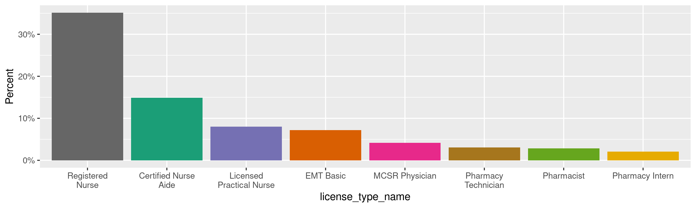
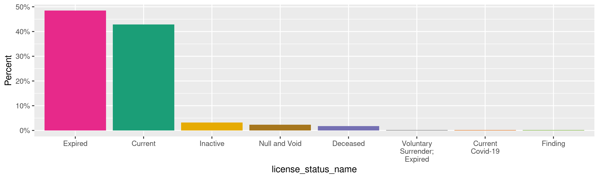
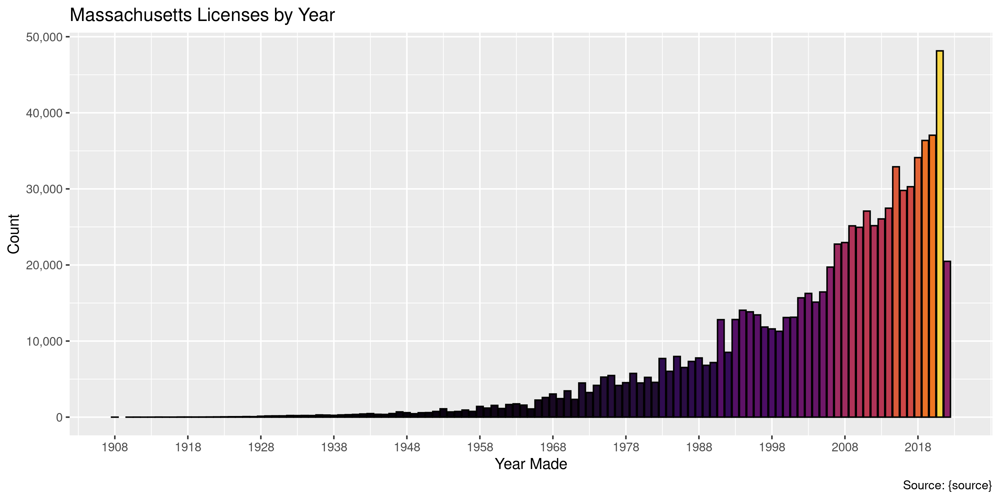
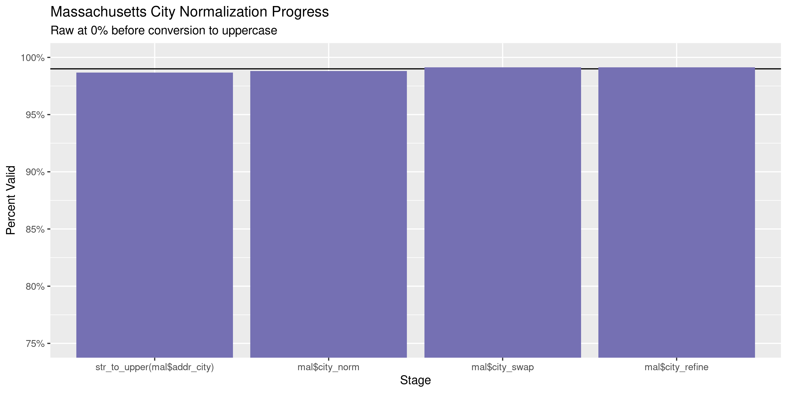
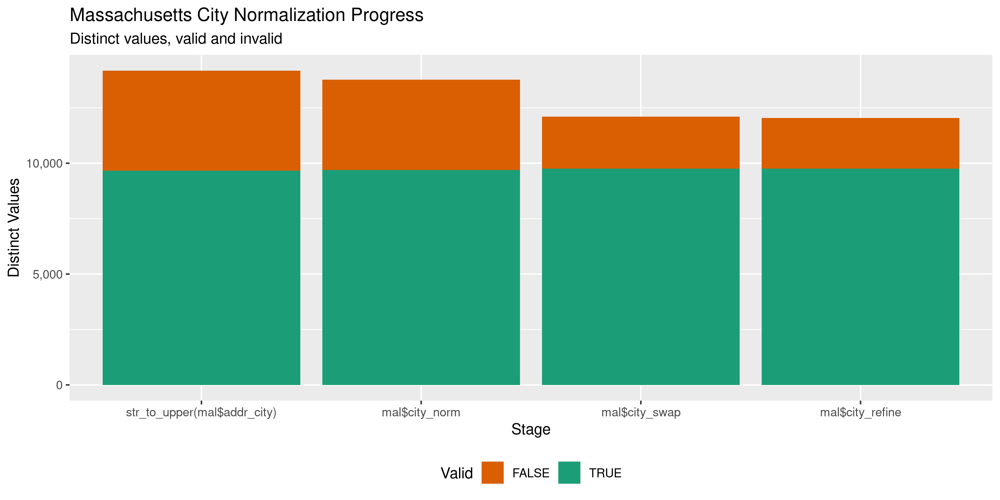

Massachusetts Licenses
================
Kiernan Nicholls
Thu Jun 2 12:55:56 2022

-   <a href="#project" id="toc-project">Project</a>
-   <a href="#objectives" id="toc-objectives">Objectives</a>
-   <a href="#packages" id="toc-packages">Packages</a>
-   <a href="#source" id="toc-source">Source</a>
-   <a href="#download" id="toc-download">Download</a>
-   <a href="#read" id="toc-read">Read</a>
-   <a href="#explore" id="toc-explore">Explore</a>
    -   <a href="#missing" id="toc-missing">Missing</a>
    -   <a href="#duplicates" id="toc-duplicates">Duplicates</a>
    -   <a href="#categorical" id="toc-categorical">Categorical</a>
    -   <a href="#dates" id="toc-dates">Dates</a>
-   <a href="#wrangle" id="toc-wrangle">Wrangle</a>
    -   <a href="#address" id="toc-address">Address</a>
    -   <a href="#zip" id="toc-zip">ZIP</a>
    -   <a href="#state" id="toc-state">State</a>
    -   <a href="#city" id="toc-city">City</a>
-   <a href="#conclude" id="toc-conclude">Conclude</a>
-   <a href="#export" id="toc-export">Export</a>
-   <a href="#upload" id="toc-upload">Upload</a>

<!-- Place comments regarding knitting here -->

## Project

The Accountability Project is an effort to cut across data silos and
give journalists, policy professionals, activists, and the public at
large a simple way to search across huge volumes of public data about
people and organizations.

Our goal is to standardize public data on a few key fields by thinking
of each dataset row as a transaction. For each transaction there should
be (at least) 3 variables:

1.  All **parties** to a transaction.
2.  The **date** of the transaction.
3.  The **amount** of money involved.

## Objectives

This document describes the process used to complete the following
objectives:

1.  How many records are in the database?
2.  Check for entirely duplicated records.
3.  Check ranges of continuous variables.
4.  Is there anything blank or missing?
5.  Check for consistency issues.
6.  Create a five-digit ZIP Code called `zip`.
7.  Create a `year` field from the transaction date.
8.  Make sure there is data on both parties to a transaction.

## Packages

The following packages are needed to collect, manipulate, visualize,
analyze, and communicate these results. The `pacman` package will
facilitate their installation and attachment.

``` r
if (!require("pacman")) {
  install.packages("pacman")
}
pacman::p_load(
  tidyverse, # data manipulation
  lubridate, # datetime strings
  gluedown, # printing markdown
  janitor, # clean data frames
  campfin, # custom irw tools
  aws.s3, # aws cloud storage
  refinr, # cluster & merge
  scales, # format strings
  knitr, # knit documents
  vroom, # fast reading
  rvest, # scrape html
  glue, # code strings
  here, # project paths
  httr, # http requests
  fs # local storage 
)
```

This diary was run using `campfin` version 1.0.8.9300.

``` r
packageVersion("campfin")
#> [1] '1.0.8.9300'
```

This document should be run as part of the `R_tap` project, which lives
as a sub-directory of the more general, language-agnostic
[`irworkshop/accountability_datacleaning`](https://github.com/irworkshop/accountability_datacleaning)
GitHub repository.

The `R_tap` project uses the [RStudio
projects](https://support.rstudio.com/hc/en-us/articles/200526207-Using-Projects)
feature and should be run as such. The project also uses the dynamic
`here::here()` tool for file paths relative to *your* machine.

``` r
# where does this document knit?
here::i_am("state/ma/licenses/docs/ma_licenses_diary.Rmd")
```

## Source

Professional licenses in Massachusetts are obtained from The Office of
Health and Human Services (EOHHS).

> On this site you can verify the status of an individual or a business
> license and view any disciplinary action, or download a data file of
> your search results at no cost.

> Select a Profession and enter one or more additional fields below.
> Searching by license number or last name will produce the most
> efficient results. Otherwise you may retrieve too large a data set to
> work with on your screen.

> **Disclaimer:** The information contained in this website (“website
> content”) is made available as a public service by the Massachusetts
> Department of Public Health (the Department). The Department considers
> this information to constitute primary source verification. Click here
> for full disclaimer.

From the [FAQ](https://madph.mylicense.com/verification/Custom/FAQ.htm):

> **Question:** When I download a file of licensee information, what
> data is in the file and what is the file format?
>
> **Answer:** Use the Preview button to see what data fields will be
> included. The file format is known as Delimited, meaning fields are
> separated by a character known as a delimiter. The file uses the \|
> character as the delimiter. When you import the file into Excel, for
> example, you will be prompted to type the delimiter character. The \|
> character can be found on top of the back slash character, located
> between the Backspace and Enter keys.

## Download

The licenses are separated as either being issued to a person or a
facility. We will manually download all results for each file type for
both entities.

> You may now download a data file of your search results in delimited
> text format. The delimiter character used in the data file is called
> the ‘pipes’ character \|, which is located above the Enter key on your
> keyboard.

``` r
raw_dir <- dir_create(here("state", "ma", "licenses", "data", "raw"))
raw_psv <- dir_ls(raw_dir)
```

## Read

``` r
x <- read_lines(raw_psv[6])
bad_ending <- str_which(x, "\\|$", negate = TRUE)
x[bad_ending] <- paste0(x[bad_ending], x[bad_ending + 1])
x <- x[-(bad_ending + 1)]
tmp <- file_temp(ext = "txt")
write_lines(x, tmp)
raw_psv[6] <- tmp
```

``` r
mal <- read_delim(
  file = raw_psv,
  delim = "|",
  id = "source_file",
  escape_backslash = FALSE,
  escape_double = FALSE,
  locale = locale(date_format = "%m/%d/%Y %H:%M:%S %p"),
  col_types = cols(
    .default = col_character(),
    expiration_date = col_date(),
    issue_date = col_date()
  )
)
```

``` r
mal <- mal %>% 
  mutate(
    across(where(is.character), str_squish),
    across(source_file, basename)
  ) %>% 
  remove_empty(which = "cols") %>% 
  relocate(source_file, .after = last_col())
```

## Explore

There are 935,602 rows of 14 columns. Each record represents a single
licensed issued to an individual or business.

``` r
glimpse(mal)
#> Rows: 935,602
#> Columns: 14
#> $ full_name           <chr> "3 Dimensions - Worcester", "3 Dimensions Health Services", "A Better Tomorrow", "AASTC Pa…
#> $ license_no          <chr> "21265P", "31217P", "21260P", "11180P", "NRI3", "N57R", "NI5T", "N788", "91427L", "N2LD", …
#> $ license_type_name   <chr> "Nurse Aide Training Provider", "Nurse Aide Training Provider", "Nurse Aide Training Provi…
#> $ license_status_name <chr> "Current", "Current", "Current", "Current", "Current", "Current", "Current", "Current", "C…
#> $ expiration_date     <date> NA, NA, NA, NA, NA, NA, NA, NA, NA, NA, NA, NA, NA, NA, NA, NA, NA, NA, NA, NA, NA, NA, N…
#> $ addr_line_1         <chr> "61 Harvard Street", "1934 Lakeview Avenue", "153B Main Street", "42 Union Street", "77 Sa…
#> $ addr_line_2         <chr> NA, NA, NA, NA, NA, NA, NA, NA, NA, NA, NA, NA, NA, NA, NA, NA, NA, NA, NA, NA, NA, NA, NA…
#> $ addr_line_4         <chr> "Worcester MA 01609", "Dracut MA 01826", "Boston MA 02114", "Attleboro MA 02703", "Malden …
#> $ addr_city           <chr> "Worcester", "Dracut", "Boston", "Attleboro", "Malden", "Roxbury Crossing", "Cambridge", "…
#> $ addr_county         <chr> "Worcester", "Middlesex", "Suffolk", "Bristol", "Middlesex", "Suffolk", "Middlesex", "Esse…
#> $ addr_state          <chr> "MA", "MA", "MA", "MA", "MA", "MA", "MA", "MA", "MA", "MA", "MA", "MA", "MA", "MA", "MA", …
#> $ addr_zipcode        <chr> "01609", "01826", "02114", "02703", "02148", "02120", "02138", "01930", "01534", "02703", …
#> $ issue_date          <date> 2016-11-07, 2013-12-01, 2013-12-01, 2013-12-01, 2015-08-24, 2020-02-25, 2017-09-14, 2015-…
#> $ source_file         <chr> "FACILITY_NURSE-AIDE-REGISTRY.txt", "FACILITY_NURSE-AIDE-REGISTRY.txt", "FACILITY_NURSE-AI…
tail(mal)
#> # A tibble: 6 × 14
#>   full_name   license_no license_type_na… license_status_… expiration_date addr_line_1 addr_line_2 addr_line_4 addr_city
#>   <chr>       <chr>      <chr>            <chr>            <date>          <chr>       <chr>       <chr>       <chr>    
#> 1 Zenaida Pa… RT-TF-0635 Respiratory The… Current          2022-06-30      <NA>        <NA>        <NA>        <NA>     
#> 2 Zenayda Sa… RT1293     Respiratory The… Expired          2000-05-31      94a Shore … <NA>        Peabody MA… Peabody  
#> 3 Zindia Fig… RT5978     Respiratory The… Current - COVID… 2020-05-31      Hatillo Ho… Edi 1 - Ap… Hatillo PR… Hatillo  
#> 4 Zindia Fig… RL5630     Limited Permit   Expired          2009-01-31      4 Bruce Cir <NA>        Randolph M… Randolph 
#> 5 Zuriel J. … RT10417    Respiratory The… Current          2024-05-31      54 Power S… <NA>        Uxbridge M… Uxbridge 
#> 6 Zuriel J. … RL10123    Limited Permit   Null and Void    2013-01-31      54 Corrine… <NA>        Worcester … Worcester
#> # … with 5 more variables: addr_county <chr>, addr_state <chr>, addr_zipcode <chr>, issue_date <date>,
#> #   source_file <chr>
```

### Missing

Columns vary in their degree of missing values.

``` r
col_stats(mal, count_na)
#> # A tibble: 14 × 4
#>    col                 class       n        p
#>    <chr>               <chr>   <int>    <dbl>
#>  1 full_name           <chr>       0 0       
#>  2 license_no          <chr>     773 0.000826
#>  3 license_type_name   <chr>       0 0       
#>  4 license_status_name <chr>       0 0       
#>  5 expiration_date     <date>   7379 0.00789 
#>  6 addr_line_1         <chr>   23056 0.0246  
#>  7 addr_line_2         <chr>  767755 0.821   
#>  8 addr_line_4         <chr>   23055 0.0246  
#>  9 addr_city           <chr>   26172 0.0280  
#> 10 addr_county         <chr>   55036 0.0588  
#> 11 addr_state          <chr>   25443 0.0272  
#> 12 addr_zipcode        <chr>   42379 0.0453  
#> 13 issue_date          <date>  95451 0.102   
#> 14 source_file         <chr>       0 0
```

We can flag any record missing a key variable needed to identify a
transaction.

``` r
key_vars <- c("license_no", "full_name")
mal <- flag_na(mal, all_of(key_vars))
mean(mal$na_flag)
#> [1] 0.000826206
sum(mal$na_flag)
#> [1] 773
```

``` r
mal %>% 
  filter(na_flag) %>% 
  select(all_of(key_vars), source_file)
#> # A tibble: 773 × 3
#>    license_no full_name                           source_file          
#>    <chr>      <chr>                               <chr>                
#>  1 <NA>       Berkshire Pharmacy Services Inc.    FACILITY_PHARMACY.txt
#>  2 <NA>       Berkshire Pharmacy Services Inc.    FACILITY_PHARMACY.txt
#>  3 <NA>       Berkshire Pharmacy Services Inc.    FACILITY_PHARMACY.txt
#>  4 <NA>       CarePro Pharmacy                    FACILITY_PHARMACY.txt
#>  5 <NA>       CarePro Pharmacy                    FACILITY_PHARMACY.txt
#>  6 <NA>       CarePro Pharmacy                    FACILITY_PHARMACY.txt
#>  7 <NA>       Medical Essentials                  FACILITY_PHARMACY.txt
#>  8 <NA>       Medical Essentials                  FACILITY_PHARMACY.txt
#>  9 <NA>       Northern General Distributors, Inc. FACILITY_PHARMACY.txt
#> 10 <NA>       Northern General Distributors, Inc. FACILITY_PHARMACY.txt
#> # … with 763 more rows
```

``` r
mal %>% 
  filter(na_flag) %>% 
  select(source_file) %>% 
  count(source_file, sort = TRUE)
#> # A tibble: 12 × 2
#>    source_file                                n
#>    <chr>                                  <int>
#>  1 PERSON_NURSING.txt                       259
#>  2 PERSON_RESPIRATORY-CARE.txt              113
#>  3 PERSON_DENTISTRY.txt                      82
#>  4 PERSON_PHYSICIAN-ASSISTANTS.txt           81
#>  5 file13616550d893f.txt                     64
#>  6 PERSON_PHARMACY.txt                       64
#>  7 PERSON_NURSING-HOME-ADMINISTRATORS.txt    48
#>  8 PERSON_NURSE-AIDE-REGISTRY.txt            32
#>  9 FACILITY_PHARMACY.txt                     17
#> 10 PERSON_GENETIC-COUNSELORS.txt              7
#> 11 PERSON_PERFUSIONISTS.txt                   5
#> 12 PERSON_MASS-CONTROLLED-SUBSTANCES.txt      1
```

### Duplicates

We can also flag any record completely duplicated across every column.

``` r
mal <- flag_dupes(mal, -license_no)
sum(mal$dupe_flag)
#> [1] 74
```

``` r
mal %>% 
  filter(dupe_flag) %>% 
  select(license_no, all_of(key_vars))
#> # A tibble: 74 × 2
#>    license_no  full_name                    
#>    <chr>       <chr>                        
#>  1 CS90330-A02 Long Term Pharmacy Solutions 
#>  2 CS90330-A01 Long Term Pharmacy Solutions 
#>  3 CS3419-A02  Partners of Massachusetts LLC
#>  4 CS3419-A03  Partners of Massachusetts LLC
#>  5 CS3419-A04  Partners of Massachusetts LLC
#>  6 CS3419-A    Partners of Massachusetts LLC
#>  7 CS3419-A    Partners of Massachusetts LLC
#>  8 DN0007PDO   Gregory Wu                   
#>  9 DN0008PDO   Gregory Wu                   
#> 10 DN0009PDO   Gregory Wu                   
#> # … with 64 more rows
```

### Categorical

``` r
col_stats(mal, n_distinct)
#> # A tibble: 16 × 4
#>    col                 class       n          p
#>    <chr>               <chr>   <int>      <dbl>
#>  1 full_name           <chr>  755217 0.807     
#>  2 license_no          <chr>  910099 0.973     
#>  3 license_type_name   <chr>      87 0.0000930 
#>  4 license_status_name <chr>      39 0.0000417 
#>  5 expiration_date     <date>  17902 0.0191    
#>  6 addr_line_1         <chr>  679541 0.726     
#>  7 addr_line_2         <chr>   64066 0.0685    
#>  8 addr_line_4         <chr>  192918 0.206     
#>  9 addr_city           <chr>   16115 0.0172    
#> 10 addr_county         <chr>    1657 0.00177   
#> 11 addr_state          <chr>      65 0.0000695 
#> 12 addr_zipcode        <chr>  163208 0.174     
#> 13 issue_date          <date>  16477 0.0176    
#> 14 source_file         <chr>      16 0.0000171 
#> 15 na_flag             <lgl>       2 0.00000214
#> 16 dupe_flag           <lgl>       2 0.00000214
```

<!-- --><!-- -->

### Dates

We can add the calendar year from `date` with `lubridate::year()`

``` r
mal <- mutate(mal, issue_year = year(issue_date))
```

``` r
min(mal$issue_date, na.rm = TRUE)
#> [1] "1908-03-03"
sum(mal$issue_year < 2000, na.rm = TRUE)
#> [1] 260008
max(mal$issue_date, na.rm = TRUE)
#> [1] "2022-06-01"
sum(mal$issue_date > today(), na.rm = TRUE)
#> [1] 0
```

<!-- -->

## Wrangle

To improve the searchability of the database, we will perform some
consistent, confident string normalization. For geographic variables
like city names and ZIP codes, the corresponding `campfin::normal_*()`
functions are tailor made to facilitate this process.

### Address

For the street `addresss` variable, the `campfin::normal_address()`
function will force consistence case, remove punctuation, and abbreviate
official USPS suffixes.

``` r
addr_norm <- mal %>% 
  distinct(addr_line_1, addr_line_2) %>% 
  mutate(
    norm_addr_line_1 = normal_address(
      address = addr_line_1,
      abbs = usps_street,
      na_rep = TRUE
    ),
    norm_addr_line_2 = normal_address(
      address = addr_line_2,
      abbs = usps_street,
      na_rep = TRUE,
      abb_end = FALSE
    )
  ) %>% 
  unite(
    col = address_norm,
    starts_with("norm_addr"),
    sep = " ",
    remove = TRUE,
    na.rm = TRUE
  )
```

``` r
addr_norm
#> # A tibble: 741,281 × 3
#>    addr_line_1            addr_line_2 address_norm      
#>    <chr>                  <chr>       <chr>             
#>  1 61 Harvard Street      <NA>        61 HARVARD ST     
#>  2 1934 Lakeview Avenue   <NA>        1934 LAKEVIEW AVE 
#>  3 153B Main Street       <NA>        153B MAIN ST      
#>  4 42 Union Street        <NA>        42 UNION ST       
#>  5 77 Salem Street        <NA>        77 SALEM ST       
#>  6 1234 Columbus Ave.     <NA>        1234 COLUMBUS AVE 
#>  7 459 Broadway           <NA>        459 BROADWAY      
#>  8 180 Main Street        <NA>        180 MAIN ST       
#>  9 85 Beaumont Drive      <NA>        85 BEAUMONT DR    
#> 10 703D Washington Street <NA>        703D WASHINGTON ST
#> # … with 741,271 more rows
```

``` r
mal <- left_join(mal, addr_norm, by = c("addr_line_1", "addr_line_2"))
```

### ZIP

For ZIP codes, the `campfin::normal_zip()` function will attempt to
create valid *five* digit codes by removing the ZIP+4 suffix and
returning leading zeroes dropped by other programs like Microsoft Excel.

``` r
mal <- mal %>% 
  mutate(
    zip_norm = normal_zip(
      zip = addr_zipcode,
      na_rep = TRUE
    )
  )
```

``` r
progress_table(
  mal$addr_zipcode,
  mal$zip_norm,
  compare = valid_zip
)
#> # A tibble: 2 × 6
#>   stage            prop_in n_distinct prop_na  n_out n_diff
#>   <chr>              <dbl>      <dbl>   <dbl>  <dbl>  <dbl>
#> 1 mal$addr_zipcode   0.778     163208  0.0453 198446 145044
#> 2 mal$zip_norm       0.998      19278  0.0456   1517    682
```

### State

The existing `addr_state` is already sufficiently normalized.

``` r
prop_in(mal$addr_state, valid_state)
#> [1] 0.9999923
table(what_out(mal$addr_state, valid_state))
#> 
#>  M ma Ma ON QC UK 
#>  1  1  1  1  1  2
mal$addr_state <- str_to_upper(mal$addr_state)
```

### City

Cities are the most difficult geographic variable to normalize, simply
due to the wide variety of valid cities and formats.

#### Normal

The `campfin::normal_city()` function is a good start, again converting
case, removing punctuation, but *expanding* USPS abbreviations. We can
also remove `invalid_city` values.

``` r
norm_city <- mal %>% 
  distinct(addr_city, addr_state, zip_norm) %>% 
  mutate(
    city_norm = normal_city(
      city = addr_city, 
      abbs = usps_city,
      states = c("MA", "DC", "MASSACHUSETTS"),
      na = invalid_city,
      na_rep = TRUE
    )
  )
```

#### Swap

We can further improve normalization by comparing our normalized value
against the *expected* value for that record’s state abbreviation and
ZIP code. If the normalized value is either an abbreviation for or very
similar to the expected value, we can confidently swap those two.

``` r
norm_city <- norm_city %>% 
  rename(city_raw = addr_city) %>% 
  left_join(
    y = zipcodes,
    by = c(
      "addr_state" = "state",
      "zip_norm" = "zip"
    )
  ) %>% 
  rename(city_match = city) %>% 
  mutate(
    match_abb = is_abbrev(city_norm, city_match),
    match_dist = str_dist(city_norm, city_match),
    city_swap = if_else(
      condition = !is.na(match_dist) & (match_abb | match_dist == 1),
      true = city_match,
      false = city_norm
    )
  ) %>% 
  select(
    -city_match,
    -match_dist,
    -match_abb
  )
```

``` r
mal <- left_join(
  x = mal,
  y = norm_city,
  by = c(
    "addr_city" = "city_raw", 
    "addr_state", 
    "zip_norm"
  )
)
```

#### Refine

The [OpenRefine](https://openrefine.org/) algorithms can be used to
group similar strings and replace the less common versions with their
most common counterpart. This can greatly reduce inconsistency, but with
low confidence; we will only keep any refined strings that have a valid
city/state/zip combination.

``` r
good_refine <- mal %>% 
  mutate(
    city_refine = city_swap %>% 
      key_collision_merge() %>% 
      n_gram_merge(numgram = 1)
  ) %>% 
  filter(city_refine != city_swap) %>% 
  inner_join(
    y = zipcodes,
    by = c(
      "city_refine" = "city",
      "addr_state" = "state",
      "zip_norm" = "zip"
    )
  )
```

    #> # A tibble: 68 × 5
    #>    addr_state zip_norm city_swap             city_refine           n
    #>    <chr>      <chr>    <chr>                 <chr>             <int>
    #>  1 NY         11733    SETAUKET              EAST SETAUKET         6
    #>  2 NJ         07093    WEST NEWEST YORK      WEST NEW YORK         4
    #>  3 MA         01523    LANCASTER RT          LANCASTER             3
    #>  4 SC         29406    NORTH CHARLESTON      CHARLESTON            3
    #>  5 FL         33435    BOYATEN BEACH         BOYNTON BEACH         2
    #>  6 MA         01469    WEST TOWNSEND         TOWNSEND              2
    #>  7 MA         02346    MIDDLEBORO RD         MIDDLEBORO            2
    #>  8 NY         12803    SOUTH GLENSOUTH FALLS SOUTH GLENS FALLS     2
    #>  9 RI         02904    NO PROVIDENCE         PROVIDENCE            2
    #> 10 AL         36111    MONTGNERY             MONTGOMERY            1
    #> # … with 58 more rows

Then we can join the refined values back to the database.

``` r
mal <- mal %>% 
  left_join(good_refine, by = names(.)) %>% 
  mutate(city_refine = coalesce(city_refine, city_swap))
```

#### Progress

Our goal for normalization was to increase the proportion of city values
known to be valid and reduce the total distinct values by correcting
misspellings.

| stage                         | prop_in | n_distinct | prop_na | n_out | n_diff |
|:------------------------------|--------:|-----------:|--------:|------:|-------:|
| `str_to_upper(mal$addr_city)` |   0.987 |      14181 |   0.028 | 12007 |   4520 |
| `mal$city_norm`               |   0.988 |      13770 |   0.028 | 10876 |   4075 |
| `mal$city_swap`               |   0.991 |      12096 |   0.028 |  7894 |   2343 |
| `mal$city_refine`             |   0.991 |      12036 |   0.028 |  7815 |   2283 |

You can see how the percentage of valid values increased with each
stage.

<!-- -->

More importantly, the number of distinct values decreased each stage. We
were able to confidently change many distinct invalid values to their
valid equivalent.

<!-- -->

Before exporting, we can remove the intermediary normalization columns
and rename all added variables with the `_clean` suffix.

``` r
mal <- mal %>% 
  select(
    -city_norm,
    -city_swap,
    city_clean = city_refine
  ) %>% 
  rename_all(~str_replace(., "_norm", "_clean")) %>% 
  rename_all(~str_remove(., "_raw")) %>% 
  relocate(address_clean, city_clean, .before = zip_clean)
```

## Conclude

``` r
glimpse(sample_n(mal, 1000))
#> Rows: 1,000
#> Columns: 20
#> $ full_name           <chr> "Ian Christopher Kelly", "Ida M Connolly", "Melisa R Johnson", "Joann C Filip", "Hugh Stet…
#> $ license_no          <chr> "E0908240", "LN17994", "RN2317569", "RN201223", "PH11485", "RN144421", "MCS006245A", "RN15…
#> $ license_type_name   <chr> "EMT Basic", "Licensed Practical Nurse", "Registered Nurse", "Registered Nurse", "Pharmaci…
#> $ license_status_name <chr> "Expired", "Expired", "Current", "Expired", "Expired", "Expired", "Current", "Expired", "C…
#> $ expiration_date     <date> 2019-04-01, 1981-04-10, 2022-07-16, 1994-11-27, 2002-12-31, 1982-04-01, 2024-06-08, 1984-…
#> $ addr_line_1         <chr> "5 Blanchard Rd", "68 Winding Way", "912 Sussex Dr", "40 Main Street", "410 High Street", …
#> $ addr_line_2         <chr> NA, NA, NA, NA, NA, NA, "#567", NA, NA, NA, "Unit 2", NA, NA, NA, NA, "337 Turnpike Rd", N…
#> $ addr_line_4         <chr> "Grafton MA 01519", "Portland ME 04102", "McKinney TX 75071", "Blackstone MA 01504-2205", …
#> $ addr_city           <chr> "Grafton", "Portland", "McKinney", "Blackstone", "Abington", "Worcester", "Newton", "Bosto…
#> $ addr_county         <chr> "Worcester", "Cumberland", "Collin", "Worcester", "Plymouth", "Worcester", "Middlesex", NA…
#> $ addr_state          <chr> "MA", "ME", "TX", "MA", "MA", "MA", "MA", "MA", "NC", "MA", "MA", "MA", "TX", "MA", "MA", …
#> $ addr_zipcode        <chr> "01519", "04102", "75071", "015042205", "023512338", "01602", "02462", NA, "27302", "02568…
#> $ issue_date          <date> 2016-08-29, NA, 2017-07-28, 1992-10-01, 1950-06-08, NA, 2021-06-08, NA, 2020-07-09, 2002-…
#> $ source_file         <chr> "file13616550d893f.txt", "PERSON_NURSING.txt", "PERSON_NURSING.txt", "PERSON_NURSING.txt",…
#> $ na_flag             <lgl> FALSE, FALSE, FALSE, FALSE, FALSE, FALSE, FALSE, FALSE, FALSE, FALSE, FALSE, FALSE, FALSE,…
#> $ dupe_flag           <lgl> FALSE, FALSE, FALSE, FALSE, FALSE, FALSE, FALSE, FALSE, FALSE, FALSE, FALSE, FALSE, FALSE,…
#> $ issue_year          <dbl> 2016, NA, 2017, 1992, 1950, NA, 2021, NA, 2020, 2002, 1994, 1997, 1984, 2003, NA, 2006, 20…
#> $ address_clean       <chr> "5 BLANCHARD RD", "68 WINDING WAY", "912 SUSSEX DR", "40 MAIN ST", "410 HIGH ST", "36 BEEC…
#> $ city_clean          <chr> "GRAFTON", "PORTLAND", "MCKINNEY", "BLACKSTONE", "ABINGTON", "WORCESTER", "NEWTON LOWER FA…
#> $ zip_clean           <chr> "01519", "04102", "75071", "01504", "02351", "01602", "02462", NA, "27302", "02568", "0160…
```

1.  There are 935,602 records in the database.
2.  There are 74 duplicate records in the database.
3.  The range and distribution of `amount` and `date` seem reasonable.
4.  There are 773 records missing key variables.
5.  Consistency in geographic data has been improved with
    `campfin::normal_*()`.
6.  The 4-digit `year` variable has been created with
    `lubridate::year()`.

## Export

Now the file can be saved on disk for upload to the Accountability
server. We will name the object using a date range of the records
included.

``` r
clean_dir <- dir_create(here("state", "ma", "licenses", "data", "clean"))
clean_csv <- path(clean_dir, glue("ma_licenses_20220601.csv"))
clean_rds <- path_ext_set(clean_csv, "rds")
basename(clean_csv)
#> [1] "ma_licenses_20220601.csv"
```

``` r
write_csv(mal, clean_csv, na = "")
write_rds(mal, clean_rds, compress = "xz")
(clean_size <- file_size(clean_csv))
#> 192M
```

## Upload

We can use the `aws.s3::put_object()` to upload the text file to the IRW
server.

``` r
aws_key <- path("csv", basename(clean_csv))
if (!object_exists(aws_key, "publicaccountability")) {
  put_object(
    file = clean_csv,
    object = aws_key, 
    bucket = "publicaccountability",
    acl = "public-read",
    show_progress = TRUE,
    multipart = TRUE
  )
}
aws_head <- head_object(aws_key, "publicaccountability")
(aws_size <- as_fs_bytes(attr(aws_head, "content-length")))
unname(aws_size == clean_size)
```
