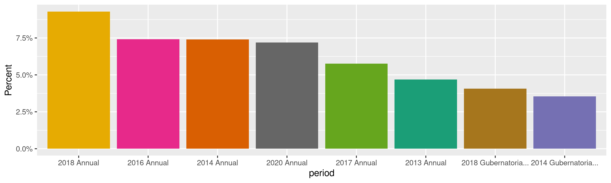
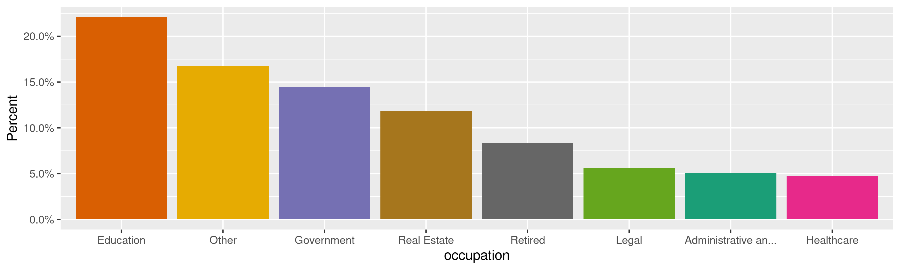
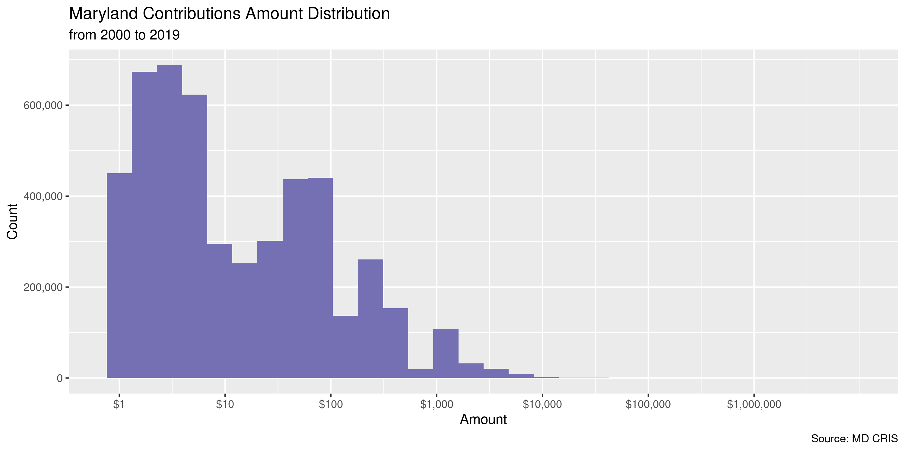
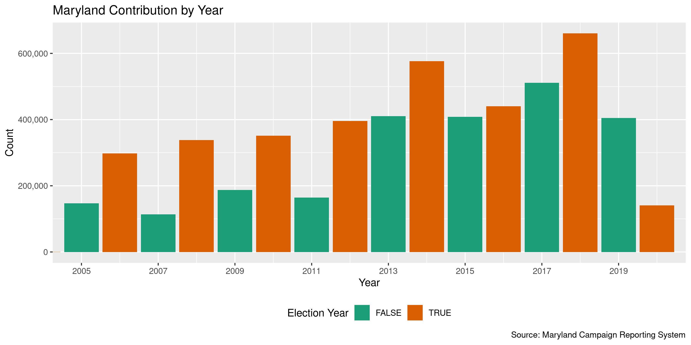
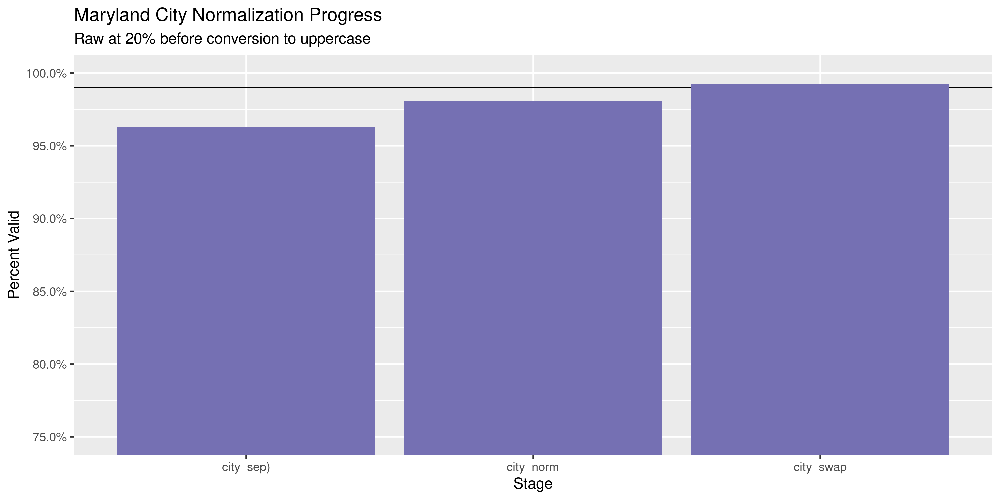

Maryland Contributions
================
Kiernan Nicholls & Yanqi Xu
2023-04-08 20:39:24

- <a href="#project" id="toc-project">Project</a>
  - <a href="#objectives" id="toc-objectives">Objectives</a>
- <a href="#packages" id="toc-packages">Packages</a>
- <a href="#data" id="toc-data">Data</a>
- <a href="#import" id="toc-import">Import</a>
  - <a href="#download" id="toc-download">Download</a>
  - <a href="#fix" id="toc-fix">Fix</a>
  - <a href="#read" id="toc-read">Read</a>
  - <a href="#separate" id="toc-separate">Separate</a>
- <a href="#explore" id="toc-explore">Explore</a>
  - <a href="#missing" id="toc-missing">Missing</a>
  - <a href="#duplicates" id="toc-duplicates">Duplicates</a>
  - <a href="#categorical" id="toc-categorical">Categorical</a>
  - <a href="#continuous" id="toc-continuous">Continuous</a>
- <a href="#wrangle" id="toc-wrangle">Wrangle</a>
  - <a href="#address" id="toc-address">Address</a>
  - <a href="#zip" id="toc-zip">ZIP</a>
  - <a href="#state" id="toc-state">State</a>
  - <a href="#city" id="toc-city">City</a>
- <a href="#conclude" id="toc-conclude">Conclude</a>
- <a href="#export" id="toc-export">Export</a>
- <a href="#upload" id="toc-upload">Upload</a>
- <a href="#dictionary" id="toc-dictionary">Dictionary</a>

<!-- Place comments regarding knitting here -->

## Project

The Accountability Project is an effort to cut across data silos and
give journalists, policy professionals, activists, and the public at
large a simple way to search across huge volumes of public data about
people and organizations.

Our goal is to standardizing public data on a few key fields by thinking
of each dataset row as a transaction. For each transaction there should
be (at least) 3 variables:

1.  All **parties** to a transaction.
2.  The **date** of the transaction.
3.  The **amount** of money involved.

### Objectives

This document describes the process used to complete the following
objectives:

1.  How many records are in the database?
2.  Check for entirely duplicated records.
3.  Check ranges of continuous variables.
4.  Is there anything blank or missing?
5.  Check for consistency issues.
6.  Create a five-digit ZIP Code called `zip`.
7.  Create a `year` field from the transaction date.
8.  Make sure there is data on both parties to a transaction.

## Packages

The following packages are needed to collect, manipulate, visualize,
analyze, and communicate these results. The `pacman` package will
facilitate their installation and attachment.

The IRW’s `campfin` package will also have to be installed from GitHub.
This package contains functions custom made to help facilitate the
processing of campaign finance data.

``` r
if (!require("pacman")) install.packages("pacman")
pacman::p_load_gh("irworkshop/campfin")
pacman::p_load(
  tidyverse, # data manipulation
  lubridate, # datetime strings
  gluedown, # printing markdown
  janitor, # clean data frames
  campfin, # custom irw tools
  aws.s3, # aws cloud storage
  refinr, # cluster & merge
  scales, # format strings
  knitr, # knit documents
  vroom, # fast reading
  rvest, # scrape html
  glue, # code strings
  here, # project paths
  httr, # http requests
  fs # local storage 
)
```

This document should be run as part of the `R_campfin` project, which
lives as a sub-directory of the more general, language-agnostic
[`irworkshop/accountability_datacleaning`](https://github.com/irworkshop/accountability_datacleaning)
GitHub repository.

The `R_campfin` project uses the [RStudio
projects](https://support.rstudio.com/hc/en-us/articles/200526207-Using-Projects)
feature and should be run as such. The project also uses the dynamic
`here::here()` tool for file paths relative to *your* machine.

``` r
# where does this document knit?
here::here()
#> [1] "/Users/yanqixu/code/accountability_datacleaning"
```

## Data

Data is obtained from the Maryland [Campaign Reporting System
(CRS)](https://campaignfinance.maryland.gov/Public/ViewReceipts?theme=vista).

> A contribution is money or anything of value given to a political
> committee to promote or assist in promoting the success or defeat of a
> candidate, political party, or question. A contribution can be made by
> any individual or by an entity, including a corporation or other
> business entity, a political club, a federal committee, or a labor
> union…

> A person may contribute directly or indirectly no more than \$6,000 to
> one political committee, and a total of \$24,000 to all political
> committees, during the four-year cycle.

## Import

### Download

We can download contributions from the Maryland Campaign Reporting
Information System
[search](https://campaignfinance.maryland.gov/Public/ViewReceipts?theme=vista)
portal. We can replicate the process of searching for contributions and
exporting them using a combination of `POST()` and `GET()`.

``` r
raw_dir <- dir_create(here("state","md", "contribs", "data", "raw"))
```

First, we will use `httr::POST()` to essentially fill out the search
form for all filing years. We can get all the filing year options from
the drop down menu. Our last update included data up to Nov 17, 2020, so
we will download the data from Nov 18, 2020 to April 7, 2023. However,
the next update should start on Jan. 19, 2023 because the more recent
entries could be

``` r
cris_url <- "https://campaignfinance.maryland.gov/Public/ViewReceipts"
fil_years <- read_html(cris_url) %>% 
  html_node("#FilingYear") %>% 
  html_nodes("option") %>% 
  html_text() %>% 
  str_subset("\\d")

fil_years <- fil_years[4]
```

Using the `cookies()` from this search request, we can then submit a
`GET()` request to save those search results to a local file.

``` r
md_http <- tibble()
for (y in fil_years) {
  year_path <- path(raw_dir, glue("ContributionsList-{y}.csv"))
  if (file_exists(year_path)) {
    md_status <- tibble(year = y)
    next()
  }
  t1 <- Sys.time()
  md_post <- POST(
    url = cris_url,
    write_disk(tmp <- file_temp(ext = "html")),
    body = list(
      FilingYear = y
    )
  )
  t2 <- Sys.time()
  md_cookies <- cookies(md_post)$value
  names(md_cookies) <- cookies(md_post)$name
  
  md_get <- GET(
    url = "https://campaignfinance.maryland.gov/Public/ExportCsv",
    set_cookies(md_cookies),
    progress(type = "down"),
    write_disk(year_path, overwrite = TRUE)
  )
  t3 <- Sys.time()
  md_status <- tibble(
    year = y,
    type = c("POST", "GET"),
    status = c(status_code(md_post), status_code(md_get)),
    size = file_size(c(tmp, year_path)),
    time = c(t2 - t1, t3 - t2)
  )
  print(md_status)
  md_http <- bind_rows(md_http, md_status)
}
```

| Filing Year | HTTP Type | Status |   Size | Time    |
|:------------|:----------|-------:|-------:|:--------|
| 2020        | POST      |    200 |  77.1K | 1 secs  |
| 2020        | GET       |    200 |  97.1M | 16 secs |
| 2019        | POST      |    200 |  76.6K | 1 secs  |
| 2019        | GET       |    200 |  16.1M | 5 secs  |
| 2018        | POST      |    200 |  78.5K | 2 secs  |
| 2018        | GET       |    200 | 210.2M | 35 secs |
| 2017        | POST      |    200 |  76.6K | 1 secs  |
| 2017        | GET       |    200 |    62M | 11 secs |
| 2016        | POST      |    200 |  76.5K | 1 secs  |
| 2016        | GET       |    200 |  99.1M | 18 secs |
| 2015        | POST      |    200 |  76.3K | 1 secs  |
| 2015        | GET       |    200 |  15.9M | 5 secs  |
| 2014        | POST      |    200 |  77.8K | 2 secs  |
| 2014        | GET       |    200 | 173.2M | 30 secs |
| 2013        | POST      |    200 |  75.7K | 1 secs  |
| 2013        | GET       |    200 |  46.3M | 9 secs  |
| 2012        | POST      |    200 |  75.9K | 1 secs  |
| 2012        | GET       |    200 |  47.9M | 13 secs |
| 2011        | POST      |    200 |  76.2K | 1 secs  |
| 2011        | GET       |    200 |  18.1M | 4 secs  |
| 2010        | POST      |    200 |  76.2K | 1 secs  |
| 2010        | GET       |    200 |  84.5M | 18 secs |
| 2009        | POST      |    200 |  75.9K | 1 secs  |
| 2009        | GET       |    200 |  14.2M | 4 secs  |
| 2008        | POST      |    200 |    77K | 1 secs  |
| 2008        | GET       |    200 |  57.2M | 11 secs |
| 2007        | POST      |    200 |  76.1K | 1 secs  |
| 2007        | GET       |    200 |  13.5M | 3 secs  |
| 2006        | POST      |    200 |  76.7K | 1 secs  |
| 2006        | GET       |    200 |  74.2M | 12 secs |

``` r
raw_info <- dir_info(raw_dir)
raw_info %>% 
  select(path, size, modification_time) %>% 
  mutate(across(path, path.abbrev))
#> # A tibble: 1 × 3
#>   path                                                                 size modification_time  
#>   <fs::path>                                                          <fs:> <dttm>             
#> 1 …lity_datacleaning/state/md/contribs/data/raw/ContributionsList.csv  232M 2023-04-08 19:39:03
```

### Fix

To properly read the file into R, we first have to do some simple string
processing to the text file.

``` r
fix_paths <- fs::path_temp(basename(raw_info$path))
for (i in seq_along(raw_info$path)) {
  if (!file_exists(fix_paths[i])) {
    read_file(raw_info$path[i]) %>% 
      str_remove_all("(?<!((Fundtype|Electoral|Administrative|,),))\r\n") %>% 
      str_replace_all("\"", "\'") %>% 
      str_remove_all(",(?=\r\n|(\r\n)?$)") %>% 
      write_lines(fix_paths[i])
    flush_memory(1)
    message(fix_paths[i])
  }
}
```

``` r
file_info(fix_paths) %>% 
  select(path, size, modification_time) %>% 
  arrange(desc(path))
#> # A tibble: 1 × 3
#>   path                                                                 size modification_time  
#>   <fs::path>                                                          <fs:> <dttm>             
#> 1 …/097tt05x0053jbg4q2bvjm1w0000gn/T/RtmpWLN8Ql/ContributionsList.csv  231M 2023-04-08 20:39:43
```

### Read

Since the more recent entries could be incomplete due to the lag in
reporting, we are going to exclude all the entries after `2023-01-18`

``` r
# 1,216,240
mdc <- map_df(
  .x = fix_paths,
  .f = read_delim,
  .id = "source_file",
  delim = ",",
  quote = "",
  escape_backslash = FALSE,
  escape_double = FALSE,
  na = c("", "NA", "N/A", "NULL", "Not Included"),
  col_types = cols(
    .default = col_character(),
    `Contribution Date` = col_date_mdy(),
    `Contribution Amount` = col_double()
  )
)
```

``` r
mdc <- mdc %>% 
  relocate(source_file, .after = last_col()) %>% 
  mutate(source_file = basename(fix_paths)[as.integer(source_file)]) %>% 
  remove_empty("cols") %>% 
  rename(
    committee = `Receiving Committee`,
    period = `Filing Period`,
    date = `Contribution Date`,
    name = `Contributor Name`,
    address = `Contributor Address`,
    type = `Contributor Type`,
    method = `Contribution Type`,
    amount = `Contribution Amount`,
    employer = `Employer Name`,
    occupation = `Employer Occupation`,
    office = `Office`,
    fund = `Fundtype`
  )

mdc <- mdc %>% filter(date <= as.Date("2023-01-18"))
```

### Separate

To better map the columns of the database, we will have to `separate()`
the `address` column into it’s components.

``` r
mdc <- mdc %>%
  mutate(
    address_fix = address %>% 
      str_remove("-(\\s+|\\d+)$") %>% 
      # address in DC with quad in sep col
      str_replace("(\\s{2})(?=(NW|NE|SW|SE)\\.?\\s{2})", " ") %>% 
      str_replace("(\\s{2})(?=(N.W.|N.E.|S.W.|S.E.)\\.?\\s{2})", " ")
  ) %>% 
  separate(
    col = address_fix,
    into = c(glue("split_addr{1:10}"), "city_sep", "state_zip"),
    sep = "\\s{2,}",
    remove = FALSE,
    extra = "merge",
    fill = "left"
  ) %>% 
  unite(
    starts_with("split_addr"),
    col = "address_sep",
    na.rm = TRUE,
    sep = " "
  ) %>% 
  mutate_if(is_character, na_if, "") %>% 
  separate(
    col = state_zip,
    into = c("state_sep", "zip_sep"),
    sep = "\\s(?=\\d)",
    extra = "merge",
    fill = "right"
  ) %>% 
  select(-address_fix)
```

This process does not work for the few addresses missing a state
abbreviation or some other geographic variable within the string. We can
identify any extracted ZIP codes in the new `state` column and adjust
their position appropriately.

``` r
mdc %>% 
  select("address", ends_with("_sep")) %>% 
  filter(state_sep %out% valid_state, !is.na(state_sep)) %>% 
  sample_frac()
#> # A tibble: 469 × 5
#>    address                                             address_sep      city_…¹ state…² zip_sep
#>    <chr>                                               <chr>            <chr>   <chr>   <chr>  
#>  1 521 Caledonian Road                                 <NA>             <NA>    521 Ca… <NA>   
#>  2 2 rue de la grande haie Bussy-le-Château FR         <NA>             <NA>    2 rue … <NA>   
#>  3 3120 Old Washington Road  20602                     <NA>             3120 O… 20602   <NA>   
#>  4 8508 16th St Montgomery  Silver spring  Md 20910    8508 16th St Mo… Silver… Md      20910  
#>  5 12 rue des Portes Blanches 75018 Paris FR           <NA>             <NA>    12 rue… 75018 …
#>  6 10000 New Hampshire Avenue  Silver Spring  Md 20903 10000 New Hamps… Silver… Md      20903  
#>  7 P O Box 282  Frederick  Md 21705                    P O Box 282      Freder… Md      21705  
#>  8 5350 Queens Chapel Road  20782                      <NA>             5350 Q… 20782   <NA>   
#>  9 4 Broadbridge Rd  Rosedale  Md 21237                4 Broadbridge Rd Roseda… Md      21237  
#> 10 1101 Mercantile Lane Suite 200  MD  20774           1101 Mercantile… MD      20774   <NA>   
#> # … with 459 more rows, and abbreviated variable names ¹​city_sep, ²​state_sep
```

``` r
mdc <- mutate(mdc, across(where(is_character), na_if, "Null Zip Code"))
```

``` r
# identify zips in state
zip_states <- str_which(mdc$state_sep, "\\d+(?:-\\d+|\\s+)?$")
# shift those cols left
mdc[zip_states, ] %>% select("address", ends_with("_sep"))
#> # A tibble: 214 × 5
#>    address                               address_sep                city_sep    state…¹ zip_sep
#>    <chr>                                 <chr>                      <chr>       <chr>   <chr>  
#>  1 2600 Brightseat Road  20785           <NA>                       2600 Brigh… 20785   <NA>   
#>  2 7619 Marlboro Pike  20747             <NA>                       7619 Marlb… 20747   <NA>   
#>  3 67 Crookston Road  SE9 1YQ London UK  <NA>                       67 Crookst… SE9     1YQ Lo…
#>  4 370 Front Street  #216                <NA>                       370 Front … #216    <NA>   
#>  5 4640 Forbes Blvd Suite 201  MD  20706 4640 Forbes Blvd Suite 201 MD          20706   <NA>   
#>  6 11703 Silvercreek Court  MD  20720    11703 Silvercreek Court    MD          20720   <NA>   
#>  7 635 Ivy Lane Suite 720  MD  20770     635 Ivy Lane Suite 720     MD          20770   <NA>   
#>  8 6213 Kilmer Street  MD  20785         6213 Kilmer Street         MD          20785   <NA>   
#>  9 4203 Enterprise Rd  MD  20720         4203 Enterprise Rd         MD          20720   <NA>   
#> 10 6007 Inwood Street  MD  20785         6007 Inwood Street         MD          20785   <NA>   
#> # … with 204 more rows, and abbreviated variable name ¹​state_sep
mdc$zip_sep[zip_states] <- mdc$state_sep[zip_states]
mdc$state_sep[zip_states] %>% 
  str_remove_all("\\d+") %>% 
  str_remove_all("[:punct:]") %>% 
  str_trim() %>% 
  na_if("") -> mdc$state_sep[zip_states]
mdc[zip_states, ] %>% select("address", ends_with("_sep"))
#> # A tibble: 214 × 5
#>    address                               address_sep                city_sep    state…¹ zip_sep
#>    <chr>                                 <chr>                      <chr>       <chr>   <chr>  
#>  1 2600 Brightseat Road  20785           <NA>                       2600 Brigh… <NA>    20785  
#>  2 7619 Marlboro Pike  20747             <NA>                       7619 Marlb… <NA>    20747  
#>  3 67 Crookston Road  SE9 1YQ London UK  <NA>                       67 Crookst… SE      SE9    
#>  4 370 Front Street  #216                <NA>                       370 Front … <NA>    #216   
#>  5 4640 Forbes Blvd Suite 201  MD  20706 4640 Forbes Blvd Suite 201 MD          <NA>    20706  
#>  6 11703 Silvercreek Court  MD  20720    11703 Silvercreek Court    MD          <NA>    20720  
#>  7 635 Ivy Lane Suite 720  MD  20770     635 Ivy Lane Suite 720     MD          <NA>    20770  
#>  8 6213 Kilmer Street  MD  20785         6213 Kilmer Street         MD          <NA>    20785  
#>  9 4203 Enterprise Rd  MD  20720         4203 Enterprise Rd         MD          <NA>    20720  
#> 10 6007 Inwood Street  MD  20785         6007 Inwood Street         MD          <NA>    20785  
#> # … with 204 more rows, and abbreviated variable name ¹​state_sep
```

``` r
addr_city <- which(str_starts(mdc$city_sep, "\\d") & is.na(mdc$address_sep))
mdc[addr_city, ] %>% select("address", ends_with("_sep"))
#> # A tibble: 504 × 5
#>    address                                   address_sep city_sep               state…¹ zip_sep
#>    <chr>                                     <chr>       <chr>                  <chr>   <chr>  
#>  1 2800 S. High Street Columbus  OH 43207 US <NA>        2800 S. High Street C… OH      43207 …
#>  2 2800 S High Street Columbus  OH 43207 US  <NA>        2800 S High Street Co… OH      43207 …
#>  3 2800 S High Street Columbus  OH 43207 US  <NA>        2800 S High Street Co… OH      43207 …
#>  4 2800 S. High Street Columbus  OH 43207 US <NA>        2800 S. High Street C… OH      43207 …
#>  5 2800 S High Street Columbus  OH 43207 US  <NA>        2800 S High Street Co… OH      43207 …
#>  6 2800 S. High Street Columbus  OH 43207 US <NA>        2800 S. High Street C… OH      43207 …
#>  7 2800 S High Street Columbus  OH 43207 US  <NA>        2800 S High Street Co… OH      43207 …
#>  8 2800 S High Street Columbus  OH 43207 US  <NA>        2800 S High Street Co… OH      43207 …
#>  9 2800 S. High Street Columbus  OH 43207 US <NA>        2800 S. High Street C… OH      43207 …
#> 10 2800 S. High Street Columbus  OH 43207 US <NA>        2800 S. High Street C… OH      43207 …
#> # … with 494 more rows, and abbreviated variable name ¹​state_sep
mdc$address_sep[addr_city] <- mdc$city_sep[addr_city]
mdc$city_sep[addr_city] <- NA
```

``` r
addr_state <- which(str_starts(mdc$state_sep, "\\d") & is.na(mdc$address_sep))
mdc[addr_state, ] %>% select("address", ends_with("_sep"))
#> # A tibble: 49 × 5
#>    address                                   address_sep city_sep        state_sep      zip_sep
#>    <chr>                                     <chr>       <chr>           <chr>          <chr>  
#>  1 1447 York Road Lutherville US             <NA>        <NA>            1447 York Roa… <NA>   
#>  2 509-18 Sommerset Way Toronto M2N6X5 CA    <NA>        <NA>            509-18 Sommer… <NA>   
#>  3 95 Lower Way Thatcham UK                  <NA>        <NA>            95 Lower Way … <NA>   
#>  4 14 Stockwell St Cambridge CB13ND UK       <NA>        <NA>            14 Stockwell … <NA>   
#>  5 Herengracht 597  1017 CE                  <NA>        Herengracht 597 1017 CE        <NA>   
#>  6 12 rue des Portes Blanches 75018 Paris FR <NA>        <NA>            12 rue des Po… 75018 …
#>  7 521 Caledonian Road                       <NA>        <NA>            521 Caledonia… <NA>   
#>  8 521 Caledonian Road                       <NA>        <NA>            521 Caledonia… <NA>   
#>  9 11 Tanza Road N/A                         <NA>        <NA>            11 Tanza Road… <NA>   
#> 10 5 Regent Dr Queanbeyan AS                 <NA>        <NA>            5 Regent Dr Q… <NA>   
#> # … with 39 more rows
mdc$address_sep[addr_state] <- mdc$state_sep[addr_state]
mdc$state_sep[addr_state] <- NA
```

``` r
city_state <- which(nchar(mdc$state_sep) > 2 & is.na(mdc$city_sep))
mdc[city_state, ] %>% select("address", ends_with("_sep"))
#> # A tibble: 31 × 5
#>    address                                        address_sep           city_…¹ state…² zip_sep
#>    <chr>                                          <chr>                 <chr>   <chr>   <chr>  
#>  1 304-6200Tasxhereau Brossard  Quebec J4W 3J8 CA 304-6200Tasxhereau B… <NA>    Quebec… 3J8 CA 
#>  2 PSC 802 BOX 268 09608 AE                       <NA>                  <NA>    PSC     802 BO…
#>  3 CMR 480 Box 716 APO GM                         <NA>                  <NA>    CMR     480 Bo…
#>  4 11A Friigatan  Apt 1403 214 21 Malmo SW        11A Friigatan         <NA>    Apt     1403 2…
#>  5 222 Prince George St  Suite 110                222 Prince George St  <NA>    Suite   110    
#>  6 Schlagvorder Str 9 Osnabruck GM                <NA>                  <NA>    Schlag… 9 Osna…
#>  7 20 Boylett Road Ajax  Ontario L1ZOM7 CA        20 Boylett Road Ajax  <NA>    Ontari… <NA>   
#>  8 208-6100 6th Avenue Whitehorse  YT CA          208-6100 6th Avenue … <NA>    YT CA   <NA>   
#>  9 208-6100 6th Avenue Whitehorse  YT CA          208-6100 6th Avenue … <NA>    YT CA   <NA>   
#> 10 Margaretenstrasse 56/2/11 Vienna AU            <NA>                  <NA>    Margar… 56/2/1…
#> # … with 21 more rows, and abbreviated variable names ¹​city_sep, ²​state_sep
city_abb <- str_extract(mdc$state_sep[city_state], "(?<=\\s)[:upper:]{2}$")
city_name <- str_remove(mdc$state_sep[city_state], "\\s[:upper:]{2}$")
mdc$city_sep[city_state] <- city_name
mdc$state_sep[city_state] <- city_abb
mdc$state_sep[city_state] <- NA
```

``` r
bad_st <- str_to_upper(mdc$state_sep) %out% valid_state
nan_st <- !is.na(mdc$state_sep)
add_st <- str_ends(mdc$city_sep, "\\d")
addr2_city <- which(bad_st & nan_st & add_st)

mdc$address_sep[addr2_city] <- mdc$address_sep[addr2_city] %>% 
  paste(mdc$city_sep[addr2_city]) %>% 
  str_remove("NA\\s")
mdc$city_sep[addr2_city] <- mdc$state_sep[addr2_city]
mdc$state_sep[addr2_city] <- str_extract(
  string = mdc$state_sep[addr2_city], 
  pattern = "[:upper:]{2}$"
)
```

``` r
mdc %>% 
  filter(
    str_to_upper(state_sep) %out% valid_state,
    !is.na(state_sep)
  ) %>% 
  select("address", ends_with("_sep"))
#> # A tibble: 22 × 5
#>    address                                                      addre…¹ city_…² state…³ zip_sep
#>    <chr>                                                        <chr>   <chr>   <chr>   <chr>  
#>  1 "6501 Redhook Plaza  suite 201  #190 St. Thomas VQ"          6501 R… #190 S… VQ      <NA>   
#>  2 "67 Crookston Road  SE9 1YQ London UK"                       67 Cro… <NA>    SE      SE9    
#>  3 "Cmr 469 Box 302 Apo  AE GM"                                 <NA>    Cmr 46… AE GM   <NA>   
#>  4 "25 Trailwood Drive  Apt #2308 Mississauga \tOntario  L4Z 3… 25 Tra… Ontario L4Z     3-K9 CA
#>  5 "327 Warren Avenue  Apt. 3H  Baltimore  MD Balti"            327 Wa… Baltim… MD Bal… <NA>   
#>  6 "1318 E. Fort Avenue  Baltimore  MD Balti"                   1318 E… Baltim… MD Bal… <NA>   
#>  7 "Declined (N/A)  Declined (N/A)  MD Decli"                   Declin… Declin… MD Dec… <NA>   
#>  8 "Declined (N/A)  Declined (N/A)  MD Decli"                   Declin… Declin… MD Dec… <NA>   
#>  9 "Declined (N/A)  Declined (N/A)  MD Decli"                   Declin… Declin… MD Dec… <NA>   
#> 10 "Sketquoy  Wasbister Road Rousay UK"                         <NA>    Sketqu… Wasbis… <NA>   
#> # … with 12 more rows, and abbreviated variable names ¹​address_sep, ²​city_sep, ³​state_sep
```

``` r
mdc <- mutate(mdc, across(where(is_character), str_squish))
```

## Explore

``` r
glimpse(mdc)
#> Rows: 1,216,189
#> Columns: 17
#> $ committee   <chr> "Committee for a Safe and Welcoming Howard", "Moore Wes For Maryland", "M…
#> $ period      <chr> "2022 Gubernatorial Pre-General2 Report", "2022 Annual", "2022 Annual", "…
#> $ date        <date> 2022-10-17, 2021-10-24, 2021-12-30, 2021-12-01, 2021-07-15, 2021-02-26, …
#> $ name        <chr> "Sandoval Luz", "Cmarada Ted", "Semmel Andrew", "Robinson Ken", "Thompson…
#> $ address     <chr> "7531 Weather Worn Way Apt. F Columbia MD 21046", "357 S Graham St Pittsb…
#> $ type        <chr> "Individual", "Individual", "Individual", "Individual", "Individual", "In…
#> $ method      <chr> "Check", "Credit Card", "Credit Card", "Credit Card", "Credit Card", "Pay…
#> $ amount      <dbl> 250.00, 15.00, 100.00, 250.00, 22.00, 208.33, 39.00, 36.00, 36.00, 444.90…
#> $ employer    <chr> "Self-Employed", NA, NA, NA, "Town of Riverdale Park", "Pfizer Inc", "How…
#> $ occupation  <chr> "Healthcare", NA, NA, "Retired", "Government", "Healthcare", "Government"…
#> $ office      <chr> NA, "Governor (SBE)", "Governor (SBE)", "House of Delegates (SBE) House o…
#> $ fund        <chr> "Electoral", "Electoral", "Electoral", "Electoral", "Electoral", "Elector…
#> $ source_file <chr> "ContributionsList.csv", "ContributionsList.csv", "ContributionsList.csv"…
#> $ address_sep <chr> "7531 Weather Worn Way Apt. F", "357 S Graham St", "4850 Yorktown Blvd", …
#> $ city_sep    <chr> "Columbia", "Pittsburgh", "Arlington", "Washington", "Riverdale Park", "N…
#> $ state_sep   <chr> "MD", "PA", "VA", "DC", "MD", "NY", "MD", "MD", "MD", "MD", "MD", "md", "…
#> $ zip_sep     <chr> "21046", "15232", "22207", "20007", "20737", "10017", "21043", "21043", "…
tail(mdc)
#> # A tibble: 6 × 17
#>   committee    period date       name  address type  method amount emplo…¹ occup…² office fund 
#>   <chr>        <chr>  <date>     <chr> <chr>   <chr> <chr>   <dbl> <chr>   <chr>   <chr>  <chr>
#> 1 Moore Mille… 2023 … 2023-01-10 Well… 7901 3… Indi… Credi…   51.3 <NA>    <NA>    <NA>   Elec…
#> 2 Moore Mille… 2023 … 2023-01-11 Wood… 460 A … Indi… Ticke…  134.  <NA>    <NA>    <NA>   Elec…
#> 3 Moore Mille… 2023 … 2022-12-25 Boyc… 3511 O… Indi… Ticke…   54.6 <NA>    <NA>    <NA>   Elec…
#> 4 Moore Mille… 2023 … 2022-12-16 Harg… 20 Phe… Indi… Ticke…  134.  <NA>    <NA>    <NA>   Elec…
#> 5 Moore Mille… 2023 … 2022-12-22 Durh… 5761 S… Indi… Ticke…  134.  <NA>    <NA>    <NA>   Elec…
#> 6 Moore Mille… 2023 … 2023-01-16 Trav… PO Box… Indi… Ticke…  134.  <NA>    <NA>    <NA>   Elec…
#> # … with 5 more variables: source_file <chr>, address_sep <chr>, city_sep <chr>,
#> #   state_sep <chr>, zip_sep <chr>, and abbreviated variable names ¹​employer, ²​occupation
```

### Missing

``` r
col_stats(mdc, count_na)
#> # A tibble: 17 × 4
#>    col         class       n          p
#>    <chr>       <chr>   <int>      <dbl>
#>  1 committee   <chr>       0 0         
#>  2 period      <chr>       0 0         
#>  3 date        <date>      0 0         
#>  4 name        <chr>       4 0.00000329
#>  5 address     <chr>     894 0.000735  
#>  6 type        <chr>       0 0         
#>  7 method      <chr>       0 0         
#>  8 amount      <dbl>       0 0         
#>  9 employer    <chr>  926852 0.762     
#> 10 occupation  <chr>  941070 0.774     
#> 11 office      <chr>  887524 0.730     
#> 12 fund        <chr>       0 0         
#> 13 source_file <chr>       0 0         
#> 14 address_sep <chr>     950 0.000781  
#> 15 city_sep    <chr>    1429 0.00117   
#> 16 state_sep   <chr>    1186 0.000975  
#> 17 zip_sep     <chr>    1070 0.000880
```

``` r
key_vars <- c("date", "name", "amount", "committee")
mdc <- flag_na(mdc, all_of(key_vars))
percent(mean(mdc$na_flag), 0.01)
#> [1] "0.00%"
sum(mdc$na_flag)
#> [1] 4
```

``` r
mdc %>% 
  filter(na_flag) %>% 
  select(all_of(key_vars))
#> # A tibble: 4 × 4
#>   date       name  amount committee                 
#>   <date>     <chr>  <dbl> <chr>                     
#> 1 2022-01-11 <NA>    0.98 Andrews Dorothy Friends of
#> 2 2022-06-07 <NA>   80.6  OConnor John Friends of   
#> 3 2022-06-07 <NA>  416.   OConnor John Friends of   
#> 4 2022-06-07 <NA>   90    OConnor John Friends of
```

``` r
mdc %>% 
  filter(na_flag) %>% 
  select(all_of(key_vars)) %>% 
  col_stats(count_na)
#> # A tibble: 4 × 4
#>   col       class      n     p
#>   <chr>     <chr>  <int> <dbl>
#> 1 date      <date>     0     0
#> 2 name      <chr>      4     1
#> 3 amount    <dbl>      0     0
#> 4 committee <chr>      0     0
```

### Duplicates

There are quite a lot of duplicate records in the database. We can flag
these variables but not remove them.

``` r
mdc <- mutate(mdc, tx = row_number())
```

``` r
dupe_file <- here("state","md", "contribs", "dupes_2023.csv.xz")
```

``` r
if (!file_exists(dupe_file)) {
  file_create(dupe_file)
  split_tx <- split(mdc$tx, mdc$period)
  mds <- mdc %>% 
    select(-tx) %>% 
    group_split(period)
  pb <- txtProgressBar(max = length(mds), style = 3)
  for (i in seq_along(mds)) {
    d1 <- duplicated(mds[[i]], fromLast = FALSE)
    if (any(d1)) {
      d2 <- duplicated(mds[[i]], fromLast = TRUE)
      dupes <- tibble(tx = split_tx[[i]], dupe_flag = d1 | d2)
      dupes <- filter(dupes, dupe_flag == TRUE)
      vroom_write(dupes, xzfile(dupe_file), append = TRUE)
      rm(d2, dupes)
    }
    rm(d1)
    flush_memory(1)
    setTxtProgressBar(pb, i)
  }
  rm(mds)
}
```

``` r
file_size(dupe_file)
#> 25.6K
dupes <- read_tsv(
  file = xzfile(dupe_file),
  col_names = c("tx", "dupe_flag"),
  col_types = cols(
    tx = col_integer(),
    dupe_flag = col_logical()
  )
)
dupes <- distinct(dupes)
```

``` r
nrow(mdc)
#> [1] 1216189
mdc <- left_join(mdc, dupes, by = "tx")
mdc <- mutate(mdc, dupe_flag = !is.na(dupe_flag))
percent(mean(mdc$dupe_flag), 0.1)
#> [1] "2.2%"
```

``` r
mdc %>% 
  filter(dupe_flag) %>% 
  select(all_of(key_vars)) %>% 
  arrange(desc(date))
#> # A tibble: 26,544 × 4
#>    date       name             amount committee                       
#>    <date>     <chr>             <dbl> <chr>                           
#>  1 2023-01-18 Massey Joshua     134.  Moore Miller Inaugural Committee
#>  2 2023-01-18 Lewis Jason       134.  Moore Miller Inaugural Committee
#>  3 2023-01-18 Hudgens Nakeya    134.  Moore Miller Inaugural Committee
#>  4 2023-01-18 Woodfork Shirley  134.  Moore Miller Inaugural Committee
#>  5 2023-01-18 Holt Janelle       81.1 Moore Miller Inaugural Committee
#>  6 2023-01-18 Williams Randi    134.  Moore Miller Inaugural Committee
#>  7 2023-01-18 Dixon Symphony    134.  Moore Miller Inaugural Committee
#>  8 2023-01-18 Rainey Cerella    134.  Moore Miller Inaugural Committee
#>  9 2023-01-18 Nicholas paul      81.1 Moore Miller Inaugural Committee
#> 10 2023-01-18 Grier Darragh     134.  Moore Miller Inaugural Committee
#> # … with 26,534 more rows
```

### Categorical

``` r
col_stats(mdc, n_distinct)
#> # A tibble: 20 × 4
#>    col         class        n           p
#>    <chr>       <chr>    <int>       <dbl>
#>  1 committee   <chr>     1858 0.00153    
#>  2 period      <chr>       56 0.0000460  
#>  3 date        <date>     792 0.000651   
#>  4 name        <chr>   236149 0.194      
#>  5 address     <chr>   255407 0.210      
#>  6 type        <chr>       22 0.0000181  
#>  7 method      <chr>       22 0.0000181  
#>  8 amount      <dbl>     8087 0.00665    
#>  9 employer    <chr>    38425 0.0316     
#> 10 occupation  <chr>       27 0.0000222  
#> 11 office      <chr>      623 0.000512   
#> 12 fund        <chr>        2 0.00000164 
#> 13 source_file <chr>        1 0.000000822
#> 14 address_sep <chr>   244757 0.201      
#> 15 city_sep    <chr>     9372 0.00771    
#> 16 state_sep   <chr>       86 0.0000707  
#> 17 zip_sep     <chr>    10304 0.00847    
#> 18 na_flag     <lgl>        2 0.00000164 
#> 19 tx          <int>  1216189 1          
#> 20 dupe_flag   <lgl>        2 0.00000164
```

<!-- --><!-- --><!-- --><!-- --><!-- -->

### Continuous

We should also explore the distribution of continuous variables, namely
the contribution `amount` and `date`. These variables should have
reasonable distributions: minimums, maximums, and medians.

#### Amounts

``` r
summary(mdc$amount)
#>     Min.  1st Qu.   Median     Mean  3rd Qu.     Max. 
#>        0        2        5      251       50 12000000
mean(mdc$amount <= 0)
#> [1] 0
```

<!-- -->

#### Dates

``` r
mdc <- mutate(mdc, year = year(date))
```

``` r
min(mdc$date)
#> [1] "2020-11-18"
sum(mdc$year < 2000)
#> [1] 0
max(mdc$date)
#> [1] "2023-01-18"
sum(mdc$date > today())
#> [1] 0
```

<!-- -->

## Wrangle

To improve the searchability of the database, we will perform some
consistent, confident string normalization. For geographic variables
like city names and ZIP codes, the corresponding `campfin::normal_*()`
functions are tailor made to facilitate this process.

``` r
comma(nrow(mdc))
#> [1] "1,216,189"
```

### Address

For the street `addresss` variable, the `campfin::normal_address()`
function will force consistence case, remove punctuation, and abbreviate
official USPS suffixes.

``` r
prop_distinct(mdc$address_sep)
#> [1] 0.2012491
norm_addr <- mdc %>% 
  count(address_sep, sort = TRUE) %>% 
  select(-n) %>% 
  mutate(
    address_norm = normal_address(
      address = address_sep,
      abbs = usps_street,
      na_rep = TRUE
    )
  )
```

``` r
norm_addr
#> # A tibble: 244,757 × 2
#>    address_sep                         address_norm                       
#>    <chr>                               <chr>                              
#>  1 3920 Buena Vista Ave Baltimore City 3920 BUENA VISTA AVE BALTIMORE CITY
#>  2 9304 Harford Road                   9304 HARFORD RD                    
#>  3 5397 Twin Knolls Road Suite 16      5397 TWIN KNOLLS ROAD SUITE 16     
#>  4 52 Scott Adam Road                  52 SCOTT ADAM RD                   
#>  5 3525 Ellicott Mills Drive Suite I   3525 ELLICOTT MILLS DRIVE SUITE I  
#>  6 PO BOX 3217                         PO BOX 3217                        
#>  7 100 Edison Park Drive               100 EDISON PARK DR                 
#>  8 5397 Twin Knolls Rd Suite 16        5397 TWIN KNOLLS RD SUITE 16       
#>  9 6600 Main Street Harford            6600 MAIN STREET HARFORD           
#> 10 1 Johnson And Johnson Plaza         1 JOHNSON AND JOHNSON PLZ          
#> # … with 244,747 more rows
```

``` r
mdc <- left_join(mdc, norm_addr, by = "address_sep")
rm(norm_addr)
```

### ZIP

For ZIP codes, the `campfin::normal_zip()` function will attempt to
create valid *five* digit codes by removing the ZIP+4 suffix and
returning leading zeroes dropped by other programs like Microsoft Excel.

``` r
mdc <- mdc %>% 
  mutate(
    zip_norm = normal_zip(
      zip = zip_sep,
      na_rep = TRUE,
      na = c("", "Null Zip Code")
    )
  )
```

``` r
progress_table(
  mdc$zip_sep,
  mdc$zip_norm,
  compare = valid_zip
)
#> # A tibble: 2 × 6
#>   stage        prop_in n_distinct  prop_na n_out n_diff
#>   <chr>          <dbl>      <dbl>    <dbl> <dbl>  <dbl>
#> 1 mdc$zip_sep    0.999      10304 0.000880  1371    538
#> 2 mdc$zip_norm   0.999      10292 0.000931  1284    524
```

### State

Valid two digit state abbreviations can be made using the
`campfin::normal_state()` function.

``` r
mdc %>% 
  count(state_sep, sort = TRUE) %>% 
  filter(state_sep %out% valid_state)
#> # A tibble: 26 × 2
#>    state_sep     n
#>    <chr>     <int>
#>  1 <NA>       1186
#>  2 Md           90
#>  3 md           33
#>  4 mD           20
#>  5 Co            5
#>  6 MD Balti      3
#>  7 MD Decli      3
#>  8 3066 AS       2
#>  9 L9W7L9 CA     2
#> 10 Ny            2
#> # … with 16 more rows
```

``` r
norm_state <- mdc %>% 
  count(state_sep, sort = TRUE) %>% 
  select(-n) %>% 
  mutate(
    state_norm = normal_state(
      state = state_sep,
      abbreviate = TRUE,
      na_rep = TRUE,
      valid = valid_state
    )
  )
```

``` r
mdc <- left_join(mdc, norm_state, by = "state_sep")
```

``` r
mdc %>% 
  filter(state_sep != state_norm) %>% 
  count(state_sep, state_norm, sort = TRUE)
#> # A tibble: 10 × 3
#>    state_sep state_norm     n
#>    <chr>     <chr>      <int>
#>  1 Md        MD            90
#>  2 md        MD            33
#>  3 mD        MD            20
#>  4 Co        CO             5
#>  5 3066 AS   AS             2
#>  6 Ny        NY             2
#>  7 Al        AL             1
#>  8 Dc        DC             1
#>  9 Fl        FL             1
#> 10 Ga        GA             1
```

``` r
progress_table(
  mdc$state_sep,
  mdc$state_norm,
  compare = valid_state
)
#> # A tibble: 2 × 6
#>   stage          prop_in n_distinct  prop_na n_out n_diff
#>   <chr>            <dbl>      <dbl>    <dbl> <dbl>  <dbl>
#> 1 mdc$state_sep     1.00         86 0.000975   176     26
#> 2 mdc$state_norm    1            62 0.000992     0      1
```

### City

Cities are the most difficult geographic variable to normalize, simply
due to the wide variety of valid cities and formats.

#### Normal

The `campfin::normal_city()` function is a good start, again converting
case, removing punctuation, but *expanding* USPS abbreviations. We can
also remove `invalid_city` values.

``` r
norm_city <- mdc %>% 
  count(city_sep, state_norm, zip_norm, sort = TRUE) %>%
  select(-n) %>% 
  mutate(
    city_norm = normal_city(
      city = city_sep %>% str_remove("(?<=Baltimore)\\sCity$"), 
      abbs = usps_city,
      states = c("MD", "DC", "MARYLAND"),
      na = invalid_city,
      na_rep = TRUE
    )
  )
```

#### Swap

We can further improve normalization by comparing our normalized value
against the *expected* value for that record’s state abbreviation and
ZIP code. If the normalized value is either an abbreviation for or very
similar to the expected value, we can confidently swap those two.

``` r
norm_city <- norm_city %>% 
  left_join(
    y = zipcodes,
    by = c(
      "state_norm" = "state",
      "zip_norm" = "zip"
    )
  ) %>% 
  rename(city_match = city) %>% 
  mutate(
    match_abb = is_abbrev(city_norm, city_match),
    match_dist = str_dist(city_norm, city_match),
    city_swap = if_else(
      condition = !is.na(match_dist) & (match_abb | match_dist == 1),
      true = city_match,
      false = city_norm
    )
  ) %>% 
  select(
    -city_match,
    -match_dist,
    -match_abb
  )
```

``` r
mdc <- left_join(mdc, norm_city)
```

#### Progress

``` r
many_city <- c(valid_city, extra_city)
mdc %>% 
  filter(city_swap %out% many_city) %>% 
  count(city_swap, sort = TRUE)
#> # A tibble: 911 × 2
#>    city_swap           n
#>    <chr>           <int>
#>  1 <NA>             1511
#>  2 BERWYN HEIGHTS    366
#>  3 CRESAPTOWN        285
#>  4 RIVERDALE PARK    191
#>  5 MD                176
#>  6 LUTH/TTIMONUM     121
#>  7 RUXTON             99
#>  8 DC                 87
#>  9 COTTAGE CITY       78
#> 10 MOUNT LAKE PARK    77
#> # … with 901 more rows
```

``` r
mdc <- mdc %>% 
  mutate(
    city_swap = city_swap %>% 
      str_replace("^BALTO$", "BALTIMORE")
  )
```

| stage                                                                        | prop_in | n_distinct | prop_na | n_out | n_diff |
|:-----------------------------------------------------------------------------|--------:|-----------:|--------:|------:|-------:|
| str_to_upper(mdc$city_sep) | 0.951| 7705| 0.001| 59463| 2703| |mdc$city_norm |   0.986 |       7385 |   0.001 | 16697 |   2368 |
| mdc\$city_swap                                                               |   0.996 |       5897 |   0.001 |  4480 |    910 |

You can see how the percentage of valid values increased with each
stage.

<!-- -->

More importantly, the number of distinct values decreased each stage. We
were able to confidently change many distinct invalid values to their
valid equivalent.

<!-- -->

## Conclude

``` r
mdc <- mdc %>% 
  select(
    -city_norm,
    city_clean = city_swap
  ) %>% 
  rename_all(~str_replace(., "_norm", "_clean")) %>% 
  relocate(state_clean, zip_clean, .after = city_clean) %>% 
  select(-ends_with("_sep"), -tx) %>% 
  mutate(
    filing_year = as.numeric(str_extract(source_file, "\\d{4}")), 
    .keep = "unused", .after = year
  )
```

``` r
glimpse(sample_n(mdc, 100))
#> Rows: 100
#> Columns: 20
#> $ committee     <chr> "Bevins Cathy Friends Of", "MSEA's Fund For Children And Public Educati…
#> $ period        <chr> "2022 Annual", "2021 Annual", "2022 Annual", "2021 Annual", "2022 Guber…
#> $ date          <date> 2022-01-12, 2021-01-06, 2021-12-31, 2020-11-20, 2022-10-26, 2021-01-15…
#> $ name          <chr> "Rosenblatt Adam", "TREZEVANT JERELLE", "Boswell Jason", "MAY NANCY E",…
#> $ address       <chr> "11704 Mayfair Field Dr Timonium MD 21093", "9593 Shirewood Ct Rosedale…
#> $ type          <chr> "Individual", "Individual", "Individual", "Individual", "Individual", "…
#> $ method        <chr> "Credit Card", "Check", "Payroll Deductions", "Check", "Electronic Fund…
#> $ amount        <dbl> 242.28, 1.80, 135.00, 2.70, 500.00, 5.00, 1.00, 0.90, 22.00, 4.50, 0.90…
#> $ employer      <chr> "Venable LLP", NA, "Prince George's County MD", NA, "FieldWorks LLC", "…
#> $ occupation    <chr> "Legal", NA, NA, NA, "Other", "Government", NA, NA, NA, NA, NA, NA, NA,…
#> $ office        <chr> "County Council (Baltimore Co.)", NA, NA, NA, "Democratic Central Commi…
#> $ fund          <chr> "Electoral", "Electoral", "Electoral", "Electoral", "Electoral", "Elect…
#> $ na_flag       <lgl> FALSE, FALSE, FALSE, FALSE, FALSE, FALSE, FALSE, FALSE, FALSE, FALSE, F…
#> $ dupe_flag     <lgl> FALSE, FALSE, FALSE, FALSE, FALSE, FALSE, FALSE, FALSE, FALSE, FALSE, F…
#> $ year          <dbl> 2022, 2021, 2021, 2020, 2022, 2021, 2022, 2022, 2021, 2022, 2021, 2021,…
#> $ filing_year   <dbl> NA, NA, NA, NA, NA, NA, NA, NA, NA, NA, NA, NA, NA, NA, NA, NA, NA, NA,…
#> $ address_clean <chr> "11704 MAYFAIR FIELD DR", "9593 SHIREWOOD CT", "1030 CLAY HAMMOND RD", …
#> $ city_clean    <chr> "TIMONIUM", "ROSEDALE", "PRINCE FREDERICK", "HALETHORPE", "KENSINGTON",…
#> $ state_clean   <chr> "MD", "MD", "MD", "MD", "MD", "MD", "MD", "MD", "MD", "MD", "WV", "MD",…
#> $ zip_clean     <chr> "21093", "21237", "20678", "21227", "20895", "21045", "21234", "20737",…
```

1.  There are 1,216,189 records in the database.
2.  There are 26,544 duplicate records in the database.
3.  The range and distribution of `amount` and `date` seem reasonable.
4.  There are 4 records missing key variables.
5.  Consistency in geographic data has been improved with
    `campfin::normal_*()`.
6.  The 4-digit `year` variable has been created with
    `lubridate::year()`.

## Export

Now the file can be saved on disk for upload to the Accountability
server.

``` r
clean_dir <- dir_create(here("state","md", "contribs", "data", "clean"))
clean_path <- path(clean_dir, "md_contribs_clean_20201118-20230118.csv")
write_csv(mdc, clean_path, na = "")
(clean_size <- file_size(clean_path))
#> 287M
file_encoding(clean_path) %>% 
  mutate(across(path, path.abbrev))
#> # A tibble: 1 × 3
#>   path                                                                            mime  charset
#>   <fs::path>                                                                      <chr> <chr>  
#> 1 …acleaning/state/md/contribs/data/clean/md_contribs_clean_20201118-20230118.csv <NA>  <NA>
```

## Upload

We can use the `aws.s3::put_object()` to upload the text file to the IRW
server.

``` r
aws_path <- path("csv", basename(clean_path))
if (!object_exists(aws_path, "publicaccountability")) {
  put_object(
    file = clean_path,
    object = aws_path, 
    bucket = "publicaccountability",
    acl = "public-read",
    show_progress = TRUE,
    multipart = TRUE
  )
}
aws_head <- head_object(aws_path, "publicaccountability")
(aws_size <- as_fs_bytes(attr(aws_head, "content-length")))
unname(aws_size == clean_size)
```

## Dictionary

The following table describes the variables in our final exported file:

| Column          | Type        | Definition                                  |
|:----------------|:------------|:--------------------------------------------|
| `committee`     | `character` | Name of committee receiving expenditure     |
| `period`        | `character` | Reporting period contribution made          |
| `date`          | `double`    | Date contribution made                      |
| `name`          | `character` | Name of contributing individual or business |
| `address`       | `character` | Full contributor address                    |
| `type`          | `character` | Type of contributor                         |
| `method`        | `character` | Method by which contribution made           |
| `amount`        | `double`    | Contribution amount or correction           |
| `employer`      | `character` | Contributor employer                        |
| `occupation`    | `character` | Contributor occupation                      |
| `office`        | `character` | Office sought by candidate                  |
| `fund`          | `character` | Fund type contribution used for             |
| `na_flag`       | `logical`   | Flag indicating missing values              |
| `dupe_flag`     | `logical`   | Flag indicating duplicate row               |
| `year`          | `double`    | Calendar year contribution made             |
| `filing_year`   | `double`    | Filing year contribution made               |
| `address_clean` | `character` | Separated normalized address                |
| `city_clean`    | `character` | Separated normalized city name              |
| `state_clean`   | `character` | Separated normalized ZIP code               |
| `zip_clean`     | `character` | Separated normalized state abbreviation     |
