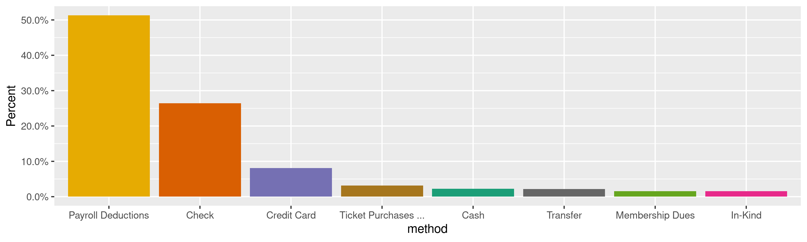
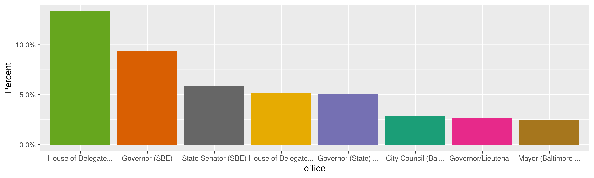
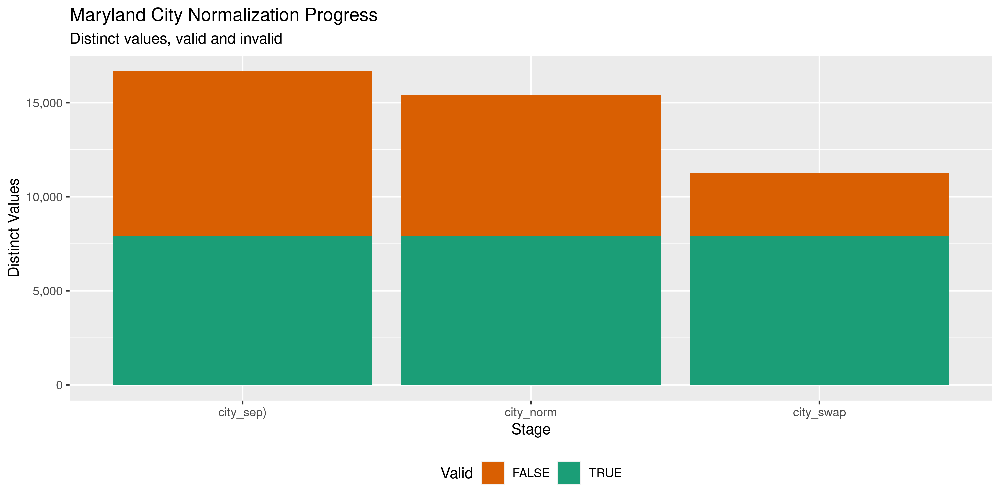

Maryland Contributions
================
Kiernan Nicholls
2020-11-23 12:11:15

  - [Project](#project)
      - [Objectives](#objectives)
  - [Packages](#packages)
  - [Data](#data)
  - [Import](#import)
      - [Download](#download)
      - [Fix](#fix)
      - [Read](#read)
      - [Separate](#separate)
  - [Explore](#explore)
      - [Missing](#missing)
      - [Duplicates](#duplicates)
      - [Categorical](#categorical)
      - [Continuous](#continuous)
  - [Wrangle](#wrangle)
      - [Address](#address)
      - [ZIP](#zip)
      - [State](#state)
      - [City](#city)
  - [Conclude](#conclude)
  - [Export](#export)
  - [Upload](#upload)
  - [Dictionary](#dictionary)

<!-- Place comments regarding knitting here -->

## Project

The Accountability Project is an effort to cut across data silos and
give journalists, policy professionals, activists, and the public at
large a simple way to search across huge volumes of public data about
people and organizations.

Our goal is to standardizing public data on a few key fields by thinking
of each dataset row as a transaction. For each transaction there should
be (at least) 3 variables:

1.  All **parties** to a transaction.
2.  The **date** of the transaction.
3.  The **amount** of money involved.

### Objectives

This document describes the process used to complete the following
objectives:

1.  How many records are in the database?
2.  Check for entirely duplicated records.
3.  Check ranges of continuous variables.
4.  Is there anything blank or missing?
5.  Check for consistency issues.
6.  Create a five-digit ZIP Code called `zip`.
7.  Create a `year` field from the transaction date.
8.  Make sure there is data on both parties to a transaction.

## Packages

The following packages are needed to collect, manipulate, visualize,
analyze, and communicate these results. The `pacman` package will
facilitate their installation and attachment.

The IRW’s `campfin` package will also have to be installed from GitHub.
This package contains functions custom made to help facilitate the
processing of campaign finance data.

``` r
if (!require("pacman")) install.packages("pacman")
pacman::p_load_gh("irworkshop/campfin")
pacman::p_load(
  tidyverse, # data manipulation
  lubridate, # datetime strings
  gluedown, # printing markdown
  janitor, # clean data frames
  campfin, # custom irw tools
  aws.s3, # aws cloud storage
  refinr, # cluster & merge
  scales, # format strings
  knitr, # knit documents
  vroom, # fast reading
  rvest, # scrape html
  glue, # code strings
  here, # project paths
  httr, # http requests
  fs # local storage 
)
```

This document should be run as part of the `R_campfin` project, which
lives as a sub-directory of the more general, language-agnostic
[`irworkshop/accountability_datacleaning`](https://github.com/irworkshop/accountability_datacleaning)
GitHub repository.

The `R_campfin` project uses the [RStudio
projects](https://support.rstudio.com/hc/en-us/articles/200526207-Using-Projects)
feature and should be run as such. The project also uses the dynamic
`here::here()` tool for file paths relative to *your* machine.

``` r
# where does this document knit?
here::here()
#> [1] "/home/kiernan/Code/tap/R_campfin/md/contribs/docs"
```

## Data

Data is obtained from the Maryland [Campaign Reporting System
(CRS)](https://campaignfinance.maryland.gov/Public/ViewReceipts?theme=vista).

> A contribution is money or anything of value given to a political
> committee to promote or assist in promoting the success or defeat of a
> candidate, political party, or question. A contribution can be made by
> any individual or by an entity, including a corporation or other
> business entity, a political club, a federal committee, or a labor
> union…

> A person may contribute directly or indirectly no more than $6,000 to
> one political committee, and a total of $24,000 to all political
> committees, during the four-year cycle.

## Import

### Download

We can download contributions from the Maryland Campaign Reporting
Information System
[search](https://campaignfinance.maryland.gov/Public/ViewReceipts?theme=vista)
portal. We can replicate the process of searching for contributions and
exporting them using a combination of `POST()` and `GET()`.

``` r
raw_dir <- dir_create(here("md", "contribs", "data", "raw"))
```

First, we will use `httr::POST()` to essentially fill out the search
form for all filing years. We can get all the filing year options from
the drop down menu.

``` r
cris_url <- "https://campaignfinance.maryland.gov/Public/ViewReceipts"
fil_years <- read_html(cris_url) %>% 
  html_node("#FilingYear") %>% 
  html_nodes("option") %>% 
  html_text() %>% 
  str_subset("\\d")
```

Using the `cookies()` from this search request, we can then submit a
`GET()` request to save those search results to a local file.

``` r
md_http <- tibble()
for (y in fil_years) {
  year_path <- path(raw_dir, glue("ContributionsList-{y}.csv"))
  if (file_exists(year_path)) {
    md_status <- tibble(year = y)
    next()
  }
  t1 <- Sys.time()
  md_post <- POST(
    url = cris_url,
    write_disk(tmp <- file_temp(ext = "html")),
    body = list(
      FilingYear = y
    )
  )
  t2 <- Sys.time()
  md_cookies <- cookies(md_post)$value
  names(md_cookies) <- cookies(md_post)$name
  
  md_get <- GET(
    url = "https://campaignfinance.maryland.gov/Public/ExportCsv",
    set_cookies(md_cookies),
    progress(type = "down"),
    write_disk(year_path, overwrite = TRUE)
  )
  t3 <- Sys.time()
  md_status <- tibble(
    year = y,
    type = c("POST", "GET"),
    status = c(status_code(md_post), status_code(md_get)),
    size = file_size(c(tmp, year_path)),
    time = c(t2 - t1, t3 - t2)
  )
  print(md_status)
  md_http <- bind_rows(md_http, md_status)
}
```

| Filing Year | HTTP Type | Status |   Size | Time    |
| :---------- | :-------- | -----: | -----: | :------ |
| 2020        | POST      |    200 |  77.1K | 1 secs  |
| 2020        | GET       |    200 |  97.1M | 16 secs |
| 2019        | POST      |    200 |  76.6K | 1 secs  |
| 2019        | GET       |    200 |  16.1M | 5 secs  |
| 2018        | POST      |    200 |  78.5K | 2 secs  |
| 2018        | GET       |    200 | 210.2M | 35 secs |
| 2017        | POST      |    200 |  76.6K | 1 secs  |
| 2017        | GET       |    200 |    62M | 11 secs |
| 2016        | POST      |    200 |  76.5K | 1 secs  |
| 2016        | GET       |    200 |  99.1M | 18 secs |
| 2015        | POST      |    200 |  76.3K | 1 secs  |
| 2015        | GET       |    200 |  15.9M | 5 secs  |
| 2014        | POST      |    200 |  77.8K | 2 secs  |
| 2014        | GET       |    200 | 173.2M | 30 secs |
| 2013        | POST      |    200 |  75.7K | 1 secs  |
| 2013        | GET       |    200 |  46.3M | 9 secs  |
| 2012        | POST      |    200 |  75.9K | 1 secs  |
| 2012        | GET       |    200 |  47.9M | 13 secs |
| 2011        | POST      |    200 |  76.2K | 1 secs  |
| 2011        | GET       |    200 |  18.1M | 4 secs  |
| 2010        | POST      |    200 |  76.2K | 1 secs  |
| 2010        | GET       |    200 |  84.5M | 18 secs |
| 2009        | POST      |    200 |  75.9K | 1 secs  |
| 2009        | GET       |    200 |  14.2M | 4 secs  |
| 2008        | POST      |    200 |    77K | 1 secs  |
| 2008        | GET       |    200 |  57.2M | 11 secs |
| 2007        | POST      |    200 |  76.1K | 1 secs  |
| 2007        | GET       |    200 |  13.5M | 3 secs  |
| 2006        | POST      |    200 |  76.7K | 1 secs  |
| 2006        | GET       |    200 |  74.2M | 12 secs |

``` r
raw_info <- dir_info(raw_dir)
raw_info %>% 
  select(path, size, modification_time) %>% 
  mutate(across(path, path.abbrev))
#> # A tibble: 28 x 3
#>    path                                                     size modification_time  
#>    <fs::path>                                        <fs::bytes> <dttm>             
#>  1 ~/md/contribs/data/raw/ContributionsList-1994.csv         196 2020-11-20 16:42:30
#>  2 ~/md/contribs/data/raw/ContributionsList-1995.csv         196 2020-11-20 16:42:29
#>  3 ~/md/contribs/data/raw/ContributionsList-1996.csv         196 2020-11-20 16:42:29
#>  4 ~/md/contribs/data/raw/ContributionsList-1997.csv         196 2020-11-20 16:42:29
#>  5 ~/md/contribs/data/raw/ContributionsList-1998.csv         196 2020-11-20 16:42:29
#>  6 ~/md/contribs/data/raw/ContributionsList-1999.csv         196 2020-11-20 16:42:28
#>  7 ~/md/contribs/data/raw/ContributionsList-2000.csv         196 2020-11-20 16:42:28
#>  8 ~/md/contribs/data/raw/ContributionsList-2001.csv       1.07K 2020-11-20 16:42:28
#>  9 ~/md/contribs/data/raw/ContributionsList-2002.csv       7.99K 2020-11-20 16:42:28
#> 10 ~/md/contribs/data/raw/ContributionsList-2003.csv       4.97K 2020-11-20 16:42:27
#> # … with 18 more rows
```

### Fix

To properly read the file into R, we first have to do some simple string
processing to the text file.

``` r
fix_paths <- path_temp(basename(raw_info$path))
for (i in seq_along(raw_info$path)) {
  if (!file_exists(fix_paths[i])) {
    read_file(raw_info$path[i]) %>% 
      str_remove_all("(?<!((Fundtype|Electoral|Administrative|,),))\r\n") %>% 
      str_replace_all("\"", "\'") %>% 
      str_remove_all(",(?=\r\n|(\r\n)?$)") %>% 
      write_lines(fix_paths[i])
    flush_memory(1)
    message(fix_paths[i])
  }
}
```

``` r
file_info(fix_paths) %>% 
  select(path, size, modification_time) %>% 
  arrange(desc(path))
#> # A tibble: 28 x 3
#>    path                                              size modification_time  
#>    <fs::path>                                 <fs::bytes> <dttm>             
#>  1 /tmp/RtmpyXD3Md/ContributionsList-2021.csv       13.3K 2020-11-23 12:12:03
#>  2 /tmp/RtmpyXD3Md/ContributionsList-2020.csv       96.6M 2020-11-23 12:12:03
#>  3 /tmp/RtmpyXD3Md/ContributionsList-2019.csv       16.1M 2020-11-23 12:11:59
#>  4 /tmp/RtmpyXD3Md/ContributionsList-2018.csv      209.2M 2020-11-23 12:11:58
#>  5 /tmp/RtmpyXD3Md/ContributionsList-2017.csv       61.7M 2020-11-23 12:11:49
#>  6 /tmp/RtmpyXD3Md/ContributionsList-2016.csv       98.6M 2020-11-23 12:11:47
#>  7 /tmp/RtmpyXD3Md/ContributionsList-2015.csv       15.8M 2020-11-23 12:11:42
#>  8 /tmp/RtmpyXD3Md/ContributionsList-2014.csv      172.3M 2020-11-23 12:11:41
#>  9 /tmp/RtmpyXD3Md/ContributionsList-2013.csv         46M 2020-11-23 12:11:34
#> 10 /tmp/RtmpyXD3Md/ContributionsList-2012.csv       47.6M 2020-11-23 12:11:32
#> # … with 18 more rows
```

### Read

``` r
# 5,548,922
mdc <- map_df(
  .x = fix_paths,
  .f = read_delim,
  .id = "source_file",
  delim = ",",
  quote = "",
  escape_backslash = FALSE,
  escape_double = FALSE,
  na = c("", "NA", "N/A", "NULL", "Not Included"),
  col_types = cols(
    .default = col_character(),
    `Contribution Date` = col_date_usa(),
    `Contribution Amount` = col_double()
  )
)
```

``` r
mdc <- mdc %>% 
  relocate(source_file, .after = last_col()) %>% 
  mutate(source_file = basename(fix_paths)[as.integer(source_file)]) %>% 
  remove_empty("cols") %>% 
  rename(
    committee = `Receiving Committee`,
    period = `Filing Period`,
    date = `Contribution Date`,
    name = `Contributor Name`,
    address = `Contributor Address`,
    type = `Contributor Type`,
    method = `Contribution Type`,
    amount = `Contribution Amount`,
    employer = `Employer Name`,
    occupation = `Employer Occupation`,
    office = `Office`,
    fund = `Fundtype`
  )
```

### Separate

To better map the columns of the database, we will have to `separate()`
the `address` column into it’s components.

``` r
mdc <- mdc %>%
  mutate(
    address_fix = address %>% 
      str_remove("-(\\s+|\\d+)$") %>% 
      # address in DC with quad in sep col
      str_replace("(\\s{2})(?=(NW|NE|SW|SE)\\.?\\s{2})", " ") %>% 
      str_replace("(\\s{2})(?=(N.W.|N.E.|S.W.|S.E.)\\.?\\s{2})", " ")
  ) %>% 
  separate(
    col = address_fix,
    into = c(glue("split_addr{1:10}"), "city_sep", "state_zip"),
    sep = "\\s{2,}",
    remove = FALSE,
    extra = "merge",
    fill = "left"
  ) %>% 
  unite(
    starts_with("split_addr"),
    col = "address_sep",
    na.rm = TRUE,
    sep = " "
  ) %>% 
  mutate_if(is_character, na_if, "") %>% 
  separate(
    col = state_zip,
    into = c("state_sep", "zip_sep"),
    sep = "\\s(?=\\d)",
    extra = "merge",
    fill = "right"
  ) %>% 
  select(-address_fix)
```

This process does not work for the few addresses missing a state
abbreviation or some other geographic variable within the string. We can
identify any extracted ZIP codes in the new `state` column and adjust
their position appropriately.

``` r
mdc %>% 
  select("address", ends_with("_sep")) %>% 
  filter(state_sep %out% valid_state, !is.na(state_sep)) %>% 
  sample_frac()
#> # A tibble: 2,193 x 5
#>    address                            address_sep           city_sep          state_sep zip_sep
#>    <chr>                              <chr>                 <chr>             <chr>     <chr>  
#>  1 22202                              <NA>                  <NA>              22202     <NA>   
#>  2 25419                              <NA>                  <NA>              25419     <NA>   
#>  3 109 Front St E  935 Toronto  Onta… 109 Front St E 935 T… Ontario           M5A       4S5 CA 
#>  4 19953                              <NA>                  <NA>              19953     <NA>   
#>  5 12 gaither manor drive  md 21784   <NA>                  12 gaither manor… md        21784  
#>  6 906 ROSE ANNE RD  21060            <NA>                  906 ROSE ANNE RD  21060     <NA>   
#>  7 24422                              <NA>                  <NA>              24422     <NA>   
#>  8 20678                              <NA>                  <NA>              20678     <NA>   
#>  9 20764                              <NA>                  <NA>              20764     <NA>   
#> 10 20685                              <NA>                  <NA>              20685     <NA>   
#> # … with 2,183 more rows
```

``` r
mdc <- mutate(mdc, across(where(is_character), na_if, "Null Zip Code"))
```

``` r
# identify zips in state
zip_states <- str_which(mdc$state_sep, "\\d+(?:-\\d+|\\s+)?$")
# shift those cols left
mdc[zip_states, ] %>% select("address", ends_with("_sep"))
#> # A tibble: 1,138 x 5
#>    address                            address_sep             city_sep        state_sep zip_sep
#>    <chr>                              <chr>                   <chr>           <chr>     <chr>  
#>  1 "B-dul Unirii nr. 74  Bucharest  … B-dul Unirii nr. 74 Bu… Romania         75103     <NA>   
#>  2 "408 16TH STREET  SE  WASHINGTON … 408 16TH STREET SE      WASHINGTON      DC -2424  <NA>   
#>  3 "1100 Terrace Glen  21210-    "    <NA>                    1100 Terrace G… 21210     <NA>   
#>  4 "12202 Devilwood Dr.  Potomac  20… 12202 Devilwood Dr.     Potomac         20854     <NA>   
#>  5 "5877 Union Ridge Drive  21710-  … <NA>                    5877 Union Rid… 21710     <NA>   
#>  6 "1138 Langley Lane  McLean  22101… 1138 Langley Lane       McLean          22101     <NA>   
#>  7 "8902 Fort Foot Rd.  Fort Washing… 8902 Fort Foot Rd.      Fort Washington 20744     <NA>   
#>  8 "10302 Duke of Wellington Ct.  Up… 10302 Duke of Wellingt… Upper Marlboro  20772     <NA>   
#>  9 "3822 Albemarle Street  NW  20016… <NA>                    3822 Albemarle… 20016     <NA>   
#> 10 "P.O. Box 457  Arecibo  00613-   … P.O. Box 457            Arecibo         00613     <NA>   
#> # … with 1,128 more rows
mdc$zip_sep[zip_states] <- mdc$state_sep[zip_states]
mdc$state_sep[zip_states] %>% 
  str_remove_all("\\d+") %>% 
  str_remove_all("[:punct:]") %>% 
  str_trim() %>% 
  na_if("") -> mdc$state_sep[zip_states]
mdc[zip_states, ] %>% select("address", ends_with("_sep"))
#> # A tibble: 1,138 x 5
#>    address                           address_sep              city_sep        state_sep zip_sep
#>    <chr>                             <chr>                    <chr>           <chr>     <chr>  
#>  1 "B-dul Unirii nr. 74  Bucharest … B-dul Unirii nr. 74 Buc… Romania         <NA>      75103  
#>  2 "408 16TH STREET  SE  WASHINGTON… 408 16TH STREET SE       WASHINGTON      DC        DC -24…
#>  3 "1100 Terrace Glen  21210-    "   <NA>                     1100 Terrace G… <NA>      21210  
#>  4 "12202 Devilwood Dr.  Potomac  2… 12202 Devilwood Dr.      Potomac         <NA>      20854  
#>  5 "5877 Union Ridge Drive  21710- … <NA>                     5877 Union Rid… <NA>      21710  
#>  6 "1138 Langley Lane  McLean  2210… 1138 Langley Lane        McLean          <NA>      22101  
#>  7 "8902 Fort Foot Rd.  Fort Washin… 8902 Fort Foot Rd.       Fort Washington <NA>      20744  
#>  8 "10302 Duke of Wellington Ct.  U… 10302 Duke of Wellingto… Upper Marlboro  <NA>      20772  
#>  9 "3822 Albemarle Street  NW  2001… <NA>                     3822 Albemarle… <NA>      20016  
#> 10 "P.O. Box 457  Arecibo  00613-  … P.O. Box 457             Arecibo         <NA>      00613  
#> # … with 1,128 more rows
```

``` r
addr_city <- which(str_starts(mdc$city_sep, "\\d") & is.na(mdc$address_sep))
mdc[addr_city, ] %>% select("address", ends_with("_sep"))
#> # A tibble: 10,329 x 5
#>    address                                address_sep city_sep                state_sep zip_sep
#>    <chr>                                  <chr>       <chr>                   <chr>     <chr>  
#>  1 "3400 Wolford Drive       -    "       <NA>        3400 Wolford Drive      <NA>      <NA>   
#>  2 "1100 Terrace Glen  21210-    "        <NA>        1100 Terrace Glen       <NA>      21210  
#>  3 "119 Hammonds Lane   MD 21225-    "    <NA>        119 Hammonds Lane       MD        21225  
#>  4 "119 Hammonds Lane   MD 21225-    "    <NA>        119 Hammonds Lane       MD        21225  
#>  5 "5877 Union Ridge Drive  21710-    "   <NA>        5877 Union Ridge Drive  <NA>      21710  
#>  6 "718 12TH Street N.W.  DC 20002-    "  <NA>        718 12TH Street N.W.    DC        20002  
#>  7 "3822 Albemarle Street  NW  20016-183… <NA>        3822 Albemarle Street … <NA>      20016  
#>  8 "15861 Union Chapel Road  21797-    "  <NA>        15861 Union Chapel Road <NA>      21797  
#>  9 "531 WINSTON AVE  MD 21212-    "       <NA>        531 WINSTON AVE         MD        21212  
#> 10 "7722 Trappe Road  MD 21222-    "      <NA>        7722 Trappe Road        MD        21222  
#> # … with 10,319 more rows
mdc$address_sep[addr_city] <- mdc$city_sep[addr_city]
mdc$city_sep[addr_city] <- NA
```

``` r
addr_state <- which(str_starts(mdc$state_sep, "\\d") & is.na(mdc$address_sep))
mdc[addr_state, ] %>% select("address", ends_with("_sep"))
#> # A tibble: 268 x 5
#>    address                    address_sep city_sep state_sep                  zip_sep
#>    <chr>                      <chr>       <chr>    <chr>                      <chr>  
#>  1 3024 N Calvert             <NA>        <NA>     3024 N Calvert             <NA>   
#>  2 17508 LEXINGTON AVE        <NA>        <NA>     17508 LEXINGTON AVE        <NA>   
#>  3 16251 Dallas Parkway       <NA>        <NA>     16251 Dallas Parkway       <NA>   
#>  4 4725 Silver Hill Rd        <NA>        <NA>     4725 Silver Hill Rd        <NA>   
#>  5 65 Meremere St.            <NA>        <NA>     65 Meremere St.            <NA>   
#>  6 828 E.A. St.               <NA>        <NA>     828 E.A. St.               <NA>   
#>  7 82 Ellen Street            <NA>        <NA>     82 Ellen Street            <NA>   
#>  8 1359 Miller Road           <NA>        <NA>     1359 Miller Road           <NA>   
#>  9 1006 TALISMAN DR           <NA>        <NA>     1006 TALISMAN DR           <NA>   
#> 10 39797 Persimmon Creek Road <NA>        <NA>     39797 Persimmon Creek Road <NA>   
#> # … with 258 more rows
mdc$address_sep[addr_state] <- mdc$state_sep[addr_state]
mdc$state_sep[addr_state] <- NA
```

``` r
city_state <- which(nchar(mdc$state_sep) > 2 & is.na(mdc$city_sep))
mdc[city_state, ] %>% select("address", ends_with("_sep"))
#> # A tibble: 246 x 5
#>    address                                address_sep              city_sep state_sep   zip_sep
#>    <chr>                                  <chr>                    <chr>    <chr>       <chr>  
#>  1 "56LL NEW HAMPSHIRE AVE  N.E.  WA HIN… 56LL NEW HAMPSHIRE AVE … <NA>     WA HINGT    <NA>   
#>  2 "56LL NEW HAMPSHIRE AVE  N.E.  WA HIN… 56LL NEW HAMPSHIRE AVE … <NA>     WA HINGT    <NA>   
#>  3 "56LL NEW HAMPSHIRE AVE  N.E.  WA HIN… 56LL NEW HAMPSHIRE AVE … <NA>     WA HINGT    <NA>   
#>  4 "56LL NEW HAMPSHIRE AVE  N.E.  WA HIN… 56LL NEW HAMPSHIRE AVE … <NA>     WA HINGT    <NA>   
#>  5 "56LL NEW HAMPSHIRE AVE  N.E.  WA HIN… 56LL NEW HAMPSHIRE AVE … <NA>     WA HINGT    <NA>   
#>  6 "Severna Park"                         <NA>                     <NA>     Severna Pa… <NA>   
#>  7 "Severna Park"                         <NA>                     <NA>     Severna Pa… <NA>   
#>  8 "2295 North Ridge Trail  Oakville"     2295 North Ridge Trail   <NA>     Oakville    <NA>   
#>  9 "2295 North Ridge Trail  Oakville"     2295 North Ridge Trail   <NA>     Oakville    <NA>   
#> 10 "2295 North Ridge Trail  Oakville"     2295 North Ridge Trail   <NA>     Oakville    <NA>   
#> # … with 236 more rows
city_abb <- str_extract(mdc$state_sep[city_state], "(?<=\\s)[:upper:]{2}$")
city_name <- str_remove(mdc$state_sep[city_state], "\\s[:upper:]{2}$")
mdc$city_sep[city_state] <- city_name
mdc$state_sep[city_state] <- city_abb
mdc$state_sep[city_state] <- NA
```

``` r
bad_st <- str_to_upper(mdc$state_sep) %out% valid_state
nan_st <- !is.na(mdc$state_sep)
add_st <- str_ends(mdc$city_sep, "\\d")
addr2_city <- which(bad_st & nan_st & add_st)

mdc$address_sep[addr2_city] <- mdc$address_sep[addr2_city] %>% 
  paste(mdc$city_sep[addr2_city]) %>% 
  str_remove("NA\\s")
mdc$city_sep[addr2_city] <- mdc$state_sep[addr2_city]
mdc$state_sep[addr2_city] <- str_extract(
  string = mdc$state_sep[addr2_city], 
  pattern = "[:upper:]{2}$"
)
```

``` r
mdc %>% 
  filter(
    str_to_upper(state_sep) %out% valid_state,
    !is.na(state_sep)
  ) %>% 
  select("address", ends_with("_sep"))
#> # A tibble: 86 x 5
#>    address                          address_sep                city_sep     state_sep  zip_sep 
#>    <chr>                            <chr>                      <chr>        <chr>      <chr>   
#>  1 Not Given  Not Given  MD Not G-… Not Given                  Not Given    MD Not G-… <NA>    
#>  2 21 Tennyson Road  Shepperton  A… 21 Tennyson Road Sheppert… Surrey TW15… UK         <NA>    
#>  3 Flat 2  121 Trinity Road  Londo… Flat 2 121 Trinity Road    London       UK SW      UK SW17 
#>  4 229 Phoenix Way  Portishead  Br… 229 Phoenix Way Portishead Bristol      NS BS      NS BS20 
#>  5 7020-21 Ave  Edmonton  Ab T6K 2… 7020-21 Ave                Edmonton     Ab T6K     2H4 Alb…
#>  6 7020-21 Ave  Edmonton  Alberta   7020-21 Ave                Edmonton     Alberta    <NA>    
#>  7 3333 Netherby Rd. RR#2  Stevens… 3333 Netherby Rd. RR#2 St… Ontario      L0S        1S0     
#>  8 Psje Las Magnolias Mz J1 Lt 26 … Psje Las Magnolias Mz J1 … Lima         ZZ         <NA>    
#>  9 122 Finborough Road  London  En… 122 Finborough Road Londo… London       England    <NA>    
#> 10 257 Balham High Rd  London  Eng… 257 Balham High Rd London… London       England    <NA>    
#> # … with 76 more rows
```

``` r
mdc <- mutate(mdc, across(where(is_character), str_squish))
```

## Explore

``` r
glimpse(mdc)
#> Rows: 5,548,638
#> Columns: 17
#> $ committee   <chr> "Muse C. Anthony Committee To Elect", "Muse C. Anthony Committee To Elec…
#> $ period      <chr> "2001 Annual", "2001 Annual", "2001 Annual", "2001 Annual", "2001 Annual…
#> $ date        <date> 2001-06-26, 2001-09-23, 2001-07-01, 2001-04-26, 2001-07-31, 2002-07-15,…
#> $ name        <chr> "Muse Charles A", "Muse Charles A.", "Muse Charles A.", "Muse Charles A"…
#> $ address     <chr> "12514 Monterey Circle Fort Washington MD 20744-", "12514 Monterey Circl…
#> $ type        <chr> "Individual", "Individual", "Individual", "Individual", "Individual", "I…
#> $ method      <chr> "Candidate Loan", "Candidate Loan", "Candidate Loan", "Candidate Loan", …
#> $ amount      <dbl> 185.0, 275.0, 2200.0, 1000.0, 370.0, 20000.0, 2000.0, 20000.0, 20000.0, …
#> $ employer    <chr> NA, NA, NA, NA, NA, NA, NA, NA, NA, NA, NA, NA, NA, NA, NA, NA, NA, NA, …
#> $ occupation  <chr> NA, NA, NA, NA, NA, NA, NA, NA, NA, NA, NA, NA, NA, NA, NA, NA, NA, NA, …
#> $ office      <chr> NA, NA, NA, NA, NA, NA, NA, NA, NA, NA, NA, NA, NA, NA, NA, NA, NA, NA, …
#> $ fund        <chr> "Electoral", "Electoral", "Electoral", "Electoral", "Electoral", "Electo…
#> $ source_file <chr> "ContributionsList-2001.csv", "ContributionsList-2001.csv", "Contributio…
#> $ address_sep <chr> "12514 Monterey Circle", "12514 Monterey Circle", "12514 Monterey Circle…
#> $ city_sep    <chr> "Fort Washington", "Fort Washington", "Fort Washington", "Fort Washingto…
#> $ state_sep   <chr> "MD", "MD", "MD", "MD", "MD", "MD", "MD", "MD", "MD", "MD", "MD", "MD", …
#> $ zip_sep     <chr> "20744", "20744", "20744", "20744", "20744", "20814", "20744", "20715", …
tail(mdc)
#> # A tibble: 6 x 17
#>   committee period date       name  address type  method amount employer occupation office
#>   <chr>     <chr>  <date>     <chr> <chr>   <chr> <chr>   <dbl> <chr>    <chr>      <chr> 
#> 1 Reilly J… 2021 … 2020-10-13 Wern… 4201 R… Indi… Check      60 <NA>     <NA>       Clerk…
#> 2 Reilly J… 2021 … 2020-10-12 Gray… 44 Eas… Indi… Check     200 Self     Legal      Clerk…
#> 3 Reilly J… 2021 … 2020-10-12 Mrug… 1944 M… Indi… Check     120 <NA>     <NA>       Clerk…
#> 4 Women Fo… 2021 … 2020-03-02 Harr… 3103 L… Cand… Trans…     90 <NA>     <NA>       <NA>  
#> 5 Harrison… 2021 … 2020-04-23 PHI … 701 NI… Poli… Check     125 <NA>     <NA>       Count…
#> 6 OConnor … 2021 … 2020-04-15 OCON… 602 Li… Self… In-Ki…    800 <NA>     <NA>       Board…
#> # … with 6 more variables: fund <chr>, source_file <chr>, address_sep <chr>, city_sep <chr>,
#> #   state_sep <chr>, zip_sep <chr>
```

### Missing

``` r
col_stats(mdc, count_na)
#> # A tibble: 17 x 4
#>    col         class        n        p
#>    <chr>       <chr>    <int>    <dbl>
#>  1 committee   <chr>        0 0       
#>  2 period      <chr>        0 0       
#>  3 date        <date>       0 0       
#>  4 name        <chr>     9893 0.00178 
#>  5 address     <chr>    63327 0.0114  
#>  6 type        <chr>        0 0       
#>  7 method      <chr>        0 0       
#>  8 amount      <dbl>        0 0       
#>  9 employer    <chr>  4547982 0.820   
#> 10 occupation  <chr>  4857892 0.876   
#> 11 office      <chr>  4741366 0.855   
#> 12 fund        <chr>     1536 0.000277
#> 13 source_file <chr>        0 0       
#> 14 address_sep <chr>    73786 0.0133  
#> 15 city_sep    <chr>    76807 0.0138  
#> 16 state_sep   <chr>    78464 0.0141  
#> 17 zip_sep     <chr>    79219 0.0143
```

``` r
key_vars <- c("date", "name", "amount", "committee")
mdc <- flag_na(mdc, all_of(key_vars))
percent(mean(mdc$na_flag), 0.01)
#> [1] "0.18%"
sum(mdc$na_flag)
#> [1] 9893
```

``` r
mdc %>% 
  filter(na_flag) %>% 
  select(all_of(key_vars))
#> # A tibble: 9,893 x 4
#>    date       name  amount committee                 
#>    <date>     <chr>  <dbl> <chr>                     
#>  1 2006-09-11 <NA>   156.  Forehand Jennie Friends Of
#>  2 2006-09-25 <NA>     1.1 Forehand Jennie Friends Of
#>  3 2006-08-05 <NA>    25.5 Forehand Jennie Friends Of
#>  4 2006-11-20 <NA>    50   Forehand Jennie Friends Of
#>  5 2006-10-10 <NA>   145   Forehand Jennie Friends Of
#>  6 2006-08-05 <NA>   150   Forehand Jennie Friends Of
#>  7 2006-11-10 <NA>   163.  Forehand Jennie Friends Of
#>  8 2006-07-11 <NA>   469.  Forehand Jennie Friends Of
#>  9 2006-04-02 <NA>   314.  Forehand Jennie Friends Of
#> 10 2006-10-11 <NA>   154.  Forehand Jennie Friends Of
#> # … with 9,883 more rows
```

``` r
mdc %>% 
  filter(na_flag) %>% 
  select(all_of(key_vars)) %>% 
  col_stats(count_na)
#> # A tibble: 4 x 4
#>   col       class      n     p
#>   <chr>     <chr>  <int> <dbl>
#> 1 date      <date>     0     0
#> 2 name      <chr>   9893     1
#> 3 amount    <dbl>      0     0
#> 4 committee <chr>      0     0
```

### Duplicates

There are quite a lot of duplicate records in the database. We can flag
these variables but not remove them.

``` r
mdc <- mutate(mdc, tx = row_number())
```

``` r
dupe_file <- here("md", "contribs", "dupes.csv.xz")
```

``` r
if (!file_exists(dupe_file)) {
  file_create(dupe_file)
  split_tx <- split(mdc$tx, mdc$period)
  mds <- mdc %>% 
    select(-tx) %>% 
    group_split(period)
  pb <- txtProgressBar(max = length(mds), style = 3)
  for (i in seq_along(mds)) {
    d1 <- duplicated(mds[[i]], fromLast = FALSE)
    if (any(d1)) {
      d2 <- duplicated(mds[[i]], fromLast = TRUE)
      dupes <- tibble(tx = split_tx[[i]], dupe_flag = d1 | d2)
      dupes <- filter(dupes, dupe_flag == TRUE)
      vroom_write(dupes, xzfile(dupe_file), append = TRUE)
      rm(d2, dupes)
    }
    rm(d1)
    flush_memory(1)
    setTxtProgressBar(pb, i)
  }
  rm(mds)
}
```

``` r
file_size(dupe_file)
#> 269K
dupes <- read_tsv(
  file = xzfile(dupe_file),
  col_names = c("tx", "dupe_flag"),
  col_types = cols(
    tx = col_integer(),
    dupe_flag = col_logical()
  )
)
dupes <- distinct(dupes)
```

``` r
nrow(mdc)
#> [1] 5548638
mdc <- left_join(mdc, dupes, by = "tx")
mdc <- mutate(mdc, dupe_flag = !is.na(dupe_flag))
percent(mean(mdc$dupe_flag), 0.1)
#> [1] "5.5%"
```

``` r
mdc %>% 
  filter(dupe_flag) %>% 
  select(all_of(key_vars)) %>% 
  arrange(desc(date))
#> # A tibble: 304,461 x 4
#>    date       name             amount committee                  
#>    <date>     <chr>             <dbl> <chr>                      
#>  1 2020-11-10 Rappaport Stacey     30 Rappaport Andrew Keep Judge
#>  2 2020-11-10 Rappaport Stacey     30 Rappaport Andrew Keep Judge
#>  3 2020-11-10 Rappaport Stacey     30 Rappaport Andrew Keep Judge
#>  4 2020-11-10 Rappaport Stacey     30 Rappaport Andrew Keep Judge
#>  5 2020-11-10 Rappaport Stacey     30 Rappaport Andrew Keep Judge
#>  6 2020-11-10 Rappaport Stacey     60 Rappaport Andrew Keep Judge
#>  7 2020-11-10 Rappaport Stacey    150 Rappaport Andrew Keep Judge
#>  8 2020-11-10 Rappaport Stacey    185 Rappaport Andrew Keep Judge
#>  9 2020-11-10 Rappaport Stacey     30 Rappaport Andrew Keep Judge
#> 10 2020-11-10 Rappaport Stacey     85 Rappaport Andrew Keep Judge
#> # … with 304,451 more rows
```

### Categorical

``` r
col_stats(mdc, n_distinct)
#> # A tibble: 20 x 4
#>    col         class        n           p
#>    <chr>       <chr>    <int>       <dbl>
#>  1 committee   <chr>     5248 0.000946   
#>  2 period      <chr>      126 0.0000227  
#>  3 date        <date>    6120 0.00110    
#>  4 name        <chr>   855059 0.154      
#>  5 address     <chr>   977437 0.176      
#>  6 type        <chr>       23 0.00000415 
#>  7 method      <chr>       22 0.00000396 
#>  8 amount      <dbl>    25634 0.00462    
#>  9 employer    <chr>    69908 0.0126     
#> 10 occupation  <chr>       31 0.00000559 
#> 11 office      <chr>      872 0.000157   
#> 12 fund        <chr>        3 0.000000541
#> 13 source_file <chr>       21 0.00000378 
#> 14 address_sep <chr>   831804 0.150      
#> 15 city_sep    <chr>    21473 0.00387    
#> 16 state_sep   <chr>      135 0.0000243  
#> 17 zip_sep     <chr>    18228 0.00329    
#> 18 na_flag     <lgl>        2 0.000000360
#> 19 tx          <int>  5548638 1          
#> 20 dupe_flag   <lgl>        2 0.000000360
```

<!-- --><!-- --><!-- --><!-- --><!-- -->

### Continuous

We should also explore the distribution of continuous variables, namely
the contribution `amount` and `date`. These variables should have
reasonable distributions: minimums, maximums, and medians.

#### Amounts

``` r
summary(mdc$amount)
#>    Min. 1st Qu.  Median    Mean 3rd Qu.    Max. 
#>  -13000       2       5     157      50 7700000
mean(mdc$amount <= 0)
#> [1] 0.0004352419
```

<!-- -->

#### Dates

``` r
mdc <- mutate(mdc, year = year(date))
```

``` r
min(mdc$date)
#> [1] "1-01-01"
sum(mdc$year < 2000)
#> [1] 64
max(mdc$date)
#> [1] "9862-07-01"
sum(mdc$date > today())
#> [1] 17
```

<!-- -->

## Wrangle

To improve the searchability of the database, we will perform some
consistent, confident string normalization. For geographic variables
like city names and ZIP codes, the corresponding `campfin::normal_*()`
functions are tailor made to facilitate this process.

``` r
comma(nrow(mdc))
#> [1] "5,548,638"
```

### Address

For the street `addresss` variable, the `campfin::normal_address()`
function will force consistence case, remove punctuation, and abbreviate
official USPS suffixes.

``` r
prop_distinct(mdc$address_sep)
#> [1] 0.1499114
norm_addr <- mdc %>% 
  count(address_sep, sort = TRUE) %>% 
  select(-n) %>% 
  mutate(
    address_norm = normal_address(
      address = address_sep,
      abbs = usps_street,
      na_rep = TRUE
    )
  )
```

``` r
norm_addr
#> # A tibble: 831,804 x 2
#>    address_sep                         address_norm                     
#>    <chr>                               <chr>                            
#>  1 3920 Buena Vista Ave                3920 BUENA VIS AVE               
#>  2 9304 Harford Road                   9304 HARFORD RD                  
#>  3 <NA>                                <NA>                             
#>  4 3920 Buena Vista Ave Baltimore City 3920 BUENA VIS AVE BALTIMORE CITY
#>  5 52 Scott Adam Road                  52 SCOTT ADAM RD                 
#>  6 5397 Twin Knolls Road Suite 16      5397 TWIN KNLS RD STE 16         
#>  7 750 E. Pratt St. 5th Floor          750 E PRATT ST 5 TH FL           
#>  8 101 Constitution Ave. NW 3rd Fl     101 CONSTITUTION AVE NW 3 RD FL  
#>  9 3525 Ellicott Mills Drive Suite I   3525 ELLICOTT MLS DR STE I       
#> 10 25 W. Chesapeake Ave. Suite 208     25 W CHESAPEAKE AVE STE 208      
#> # … with 831,794 more rows
```

``` r
mdc <- left_join(mdc, norm_addr, by = "address_sep")
rm(norm_addr)
```

### ZIP

For ZIP codes, the `campfin::normal_zip()` function will attempt to
create valid *five* digit codes by removing the ZIP+4 suffix and
returning leading zeroes dropped by other programs like Microsoft Excel.

``` r
mdc <- mdc %>% 
  mutate(
    zip_norm = normal_zip(
      zip = zip_sep,
      na_rep = TRUE,
      na = c("", "Null Zip Code")
    )
  )
```

``` r
progress_table(
  mdc$zip_sep,
  mdc$zip_norm,
  compare = valid_zip
)
#> # A tibble: 2 x 6
#>   stage    prop_in n_distinct prop_na n_out n_diff
#>   <chr>      <dbl>      <dbl>   <dbl> <dbl>  <dbl>
#> 1 zip_sep    0.999      18228  0.0143  7033   1990
#> 2 zip_norm   0.999      18102  0.0144  6193   1822
```

### State

Valid two digit state abbreviations can be made using the
`campfin::normal_state()` function.

``` r
mdc %>% 
  count(state_sep, sort = TRUE) %>% 
  filter(state_sep %out% valid_state)
#> # A tibble: 75 x 2
#>    state_sep        n
#>    <chr>        <int>
#>  1 <NA>         78464
#>  2 Md             294
#>  3 md             113
#>  4 Va               8
#>  5 Ca               6
#>  6 0626 NZ          5
#>  7 Annapolis MD     5
#>  8 Fl               5
#>  9 073-0 JA         4
#> 10 MD MD            4
#> # … with 65 more rows
```

``` r
norm_state <- mdc %>% 
  count(state_sep, sort = TRUE) %>% 
  select(-n) %>% 
  mutate(
    state_norm = normal_state(
      state = state_sep,
      abbreviate = TRUE,
      na_rep = TRUE,
      valid = valid_state
    )
  )
```

``` r
mdc <- left_join(mdc, norm_state, by = "state_sep")
```

``` r
mdc %>% 
  filter(state_sep != state_norm) %>% 
  count(state_sep, state_norm, sort = TRUE)
#> # A tibble: 19 x 3
#>    state_sep state_norm     n
#>    <chr>     <chr>      <int>
#>  1 Md        MD           294
#>  2 md        MD           113
#>  3 Va        VA             8
#>  4 Ca        CA             6
#>  5 Fl        FL             5
#>  6 Dc        DC             3
#>  7 ky        KY             2
#>  8 M5A       MA             2
#>  9 Me        ME             2
#> 10 Oh        OH             2
#> 11 Al        AL             1
#> 12 Az        AZ             1
#> 13 Co        CO             1
#> 14 De        DE             1
#> 15 Il        IL             1
#> 16 mD        MD             1
#> 17 Ny        NY             1
#> 18 Pa        PA             1
#> 19 va        VA             1
```

``` r
progress_table(
  mdc$state_sep,
  mdc$state_norm,
  compare = valid_state
)
#> # A tibble: 2 x 6
#>   stage      prop_in n_distinct prop_na n_out n_diff
#>   <chr>        <dbl>      <dbl>   <dbl> <dbl>  <dbl>
#> 1 state_sep     1.00        135  0.0141   530     75
#> 2 state_norm    1            61  0.0142     0      1
```

### City

Cities are the most difficult geographic variable to normalize, simply
due to the wide variety of valid cities and formats.

#### Normal

The `campfin::normal_city()` function is a good start, again converting
case, removing punctuation, but *expanding* USPS abbreviations. We can
also remove `invalid_city` values.

``` r
norm_city <- mdc %>% 
  count(city_sep, state_norm, zip_norm, sort = TRUE) %>%
  select(-n) %>% 
  mutate(
    city_norm = normal_city(
      city = city_sep %>% str_remove("(?<=Baltimore)\\sCity$"), 
      abbs = usps_city,
      states = c("MD", "DC", "MARYLAND"),
      na = invalid_city,
      na_rep = TRUE
    )
  )
```

#### Swap

We can further improve normalization by comparing our normalized value
against the *expected* value for that record’s state abbreviation and
ZIP code. If the normalized value is either an abbreviation for or very
similar to the expected value, we can confidently swap those two.

``` r
norm_city <- norm_city %>% 
  left_join(
    y = zipcodes,
    by = c(
      "state_norm" = "state",
      "zip_norm" = "zip"
    )
  ) %>% 
  rename(city_match = city) %>% 
  mutate(
    match_abb = is_abbrev(city_norm, city_match),
    match_dist = str_dist(city_norm, city_match),
    city_swap = if_else(
      condition = !is.na(match_dist) & (match_abb | match_dist == 1),
      true = city_match,
      false = city_norm
    )
  ) %>% 
  select(
    -city_match,
    -match_dist,
    -match_abb
  )
```

``` r
mdc <- left_join(mdc, norm_city)
```

#### Progress

``` r
many_city <- c(valid_city, extra_city)
mdc %>% 
  filter(city_swap %out% many_city) %>% 
  count(city_swap, sort = TRUE)
#> # A tibble: 3,336 x 2
#>    city_swap           n
#>    <chr>           <int>
#>  1 <NA>            77556
#>  2 MD              11004
#>  3 CRESAPTOWN       1602
#>  4 RUXTON           1350
#>  5 BERWYN HEIGHTS   1234
#>  6 MOUNT LAKE PARK   819
#>  7 STE               774
#>  8 BALTO             740
#>  9 RIVERDALE PARK    524
#> 10 DC                440
#> # … with 3,326 more rows
```

``` r
mdc <- mdc %>% 
  mutate(
    city_swap = city_swap %>% 
      str_replace("^BALTO$", "BALTIMORE")
  )
```

| stage      | prop\_in | n\_distinct | prop\_na | n\_out | n\_diff |
| :--------- | -------: | ----------: | -------: | -----: | ------: |
| city\_sep) |    0.963 |       16709 |    0.014 | 202509 |    8804 |
| city\_norm |    0.980 |       15404 |    0.014 | 106946 |    7463 |
| city\_swap |    0.993 |       11250 |    0.014 |  39673 |    3335 |

You can see how the percentage of valid values increased with each
stage.

<!-- -->

More importantly, the number of distinct values decreased each stage. We
were able to confidently change many distinct invalid values to their
valid equivalent.

<!-- -->

## Conclude

``` r
mdc <- mdc %>% 
  select(
    -city_norm,
    city_clean = city_swap
  ) %>% 
  rename_all(~str_replace(., "_norm", "_clean")) %>% 
  relocate(state_clean, zip_clean, .after = city_clean) %>% 
  select(-ends_with("_sep"), -tx) %>% 
  mutate(
    filing_year = as.numeric(str_extract(source_file, "\\d{4}")), 
    .keep = "unused", .after = year
  )
```

``` r
glimpse(sample_n(mdc, 100))
#> Rows: 100
#> Columns: 20
#> $ committee     <chr> "MSEA's Fund For Children And Public Education PAC", "MSEA's Fund For …
#> $ period        <chr> "2017 Annual", "2020 Annual", "2010 Gubernatorial Pre-Primary1", "2018…
#> $ date          <date> 2016-09-21, 2019-02-26, 2010-06-13, 2017-12-19, 2015-11-25, 2019-03-2…
#> $ name          <chr> "KEGG KRISTA", "WRIGHT TAMMY G", "Davis Antoinette", "Jones Jr Dwight"…
#> $ address       <chr> "804 Columbia Ave Cumberland MD 21502", "3682 Middle Ground Ct NULL Ch…
#> $ type          <chr> "Individual", "Individual", "Individual", "Individual", "Individual", …
#> $ method        <chr> "Payroll Deductions", "Check", "Ticket Purchases Check", "Electronic F…
#> $ amount        <dbl> 0.90, 0.90, 80.00, 12.00, 2.00, 1.80, 250.00, 100.00, 0.90, 40.00, 100…
#> $ employer      <chr> NA, NA, NA, NA, "ANNE ARUNDEL CO PUBLIC SCHOOLS", NA, NA, NA, NA, NA, …
#> $ occupation    <chr> NA, NA, NA, NA, "Education", NA, NA, NA, NA, NA, NA, NA, NA, NA, NA, N…
#> $ office        <chr> NA, NA, NA, NA, NA, NA, NA, NA, NA, NA, NA, NA, NA, NA, NA, NA, "Gover…
#> $ fund          <chr> "Electoral", "Electoral", "Electoral", "Electoral", "Electoral", "Elec…
#> $ na_flag       <lgl> FALSE, FALSE, FALSE, FALSE, FALSE, FALSE, FALSE, FALSE, FALSE, FALSE, …
#> $ dupe_flag     <lgl> FALSE, FALSE, FALSE, FALSE, FALSE, FALSE, FALSE, FALSE, FALSE, FALSE, …
#> $ year          <dbl> 2016, 2019, 2010, 2017, 2015, 2019, 2014, 2020, 2017, 2005, 2005, 2010…
#> $ filing_year   <dbl> 2017, 2020, 2010, 2018, 2016, 2020, 2014, 2020, 2018, 2006, 2006, 2010…
#> $ address_clean <chr> "804 COLUMBIA AVE", "3682 MIDDLE GROUND CT NULL", "235 MEDWICK GARTH",…
#> $ city_clean    <chr> "CUMBERLAND", "CHESAPEAKE BEACH", "CATONSVILLE", "UPPER MARLBORO", "AN…
#> $ state_clean   <chr> "MD", "MD", "MD", "MD", "MD", "MD", "MD", "MD", "MD", "MD", NA, "MD", …
#> $ zip_clean     <chr> "21502", "20732", "21228", "20772", "21403", "21042", "20910", "21838"…
```

1.  There are 5,548,638 records in the database.
2.  There are 304,461 duplicate records in the database.
3.  The range and distribution of `amount` and `date` seem reasonable.
4.  There are 9,893 records missing key variables.
5.  Consistency in geographic data has been improved with
    `campfin::normal_*()`.
6.  The 4-digit `year` variable has been created with
    `lubridate::year()`.

## Export

Now the file can be saved on disk for upload to the Accountability
server.

``` r
clean_dir <- dir_create(here("md", "contribs", "data", "clean"))
clean_path <- path(clean_dir, "md_contribs_clean.csv")
write_csv(mdc, clean_path, na = "")
(clean_size <- file_size(clean_path))
#> 1.26G
file_encoding(clean_path) %>% 
  mutate(across(path, path.abbrev))
#> # A tibble: 1 x 3
#>   path                                           mime            charset 
#>   <fs::path>                                     <chr>           <chr>   
#> 1 ~/md/contribs/data/clean/md_contribs_clean.csv application/csv us-ascii
```

## Upload

We can use the `aws.s3::put_object()` to upload the text file to the IRW
server.

``` r
aws_path <- path("csv", basename(clean_path))
if (!object_exists(aws_path, "publicaccountability")) {
  put_object(
    file = clean_path,
    object = aws_path, 
    bucket = "publicaccountability",
    acl = "public-read",
    show_progress = TRUE,
    multipart = TRUE
  )
}
aws_head <- head_object(aws_path, "publicaccountability")
(aws_size <- as_fs_bytes(attr(aws_head, "content-length")))
#> 1.26G
unname(aws_size == clean_size)
#> [1] TRUE
```

## Dictionary

The following table describes the variables in our final exported file:

| Column          | Type        | Definition                                  |
| :-------------- | :---------- | :------------------------------------------ |
| `committee`     | `character` | Name of committee receiving expenditure     |
| `period`        | `character` | Reporting period contribution made          |
| `date`          | `double`    | Date contribution made                      |
| `name`          | `character` | Name of contributing individual or business |
| `address`       | `character` | Full contributor address                    |
| `type`          | `character` | Type of contributor                         |
| `method`        | `character` | Method by which contribution made           |
| `amount`        | `double`    | Contribution amount or correction           |
| `employer`      | `character` | Contributor employer                        |
| `occupation`    | `character` | Contributor occupation                      |
| `office`        | `character` | Office sought by candidate                  |
| `fund`          | `character` | Fund type contribution used for             |
| `na_flag`       | `logical`   | Flag indicating missing values              |
| `dupe_flag`     | `logical`   | Flag indicating duplicate row               |
| `year`          | `double`    | Calendar year contribution made             |
| `filing_year`   | `double`    | Filing year contribution made               |
| `address_clean` | `character` | Separated normalized address                |
| `city_clean`    | `character` | Separated normalized city name              |
| `state_clean`   | `character` | Separated normalized ZIP code               |
| `zip_clean`     | `character` | Separated normalized state abbreviation     |
