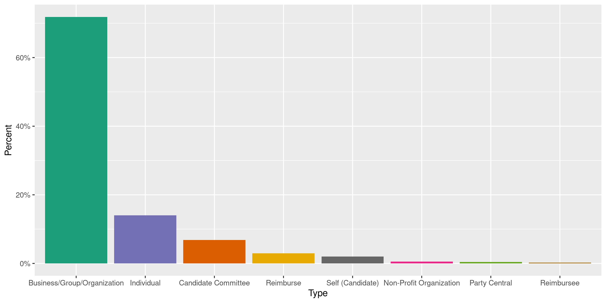
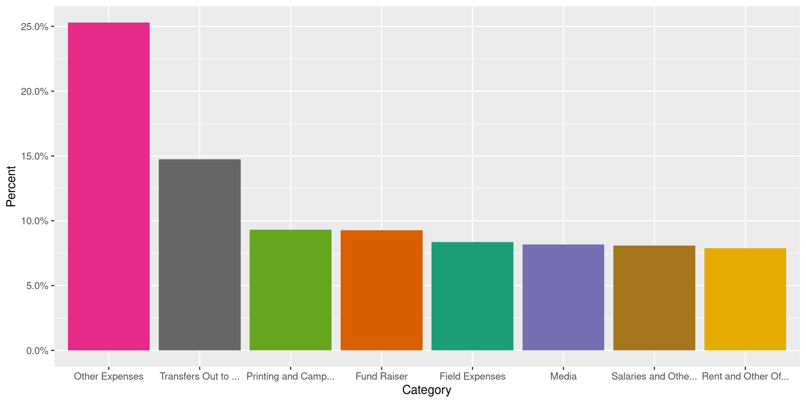
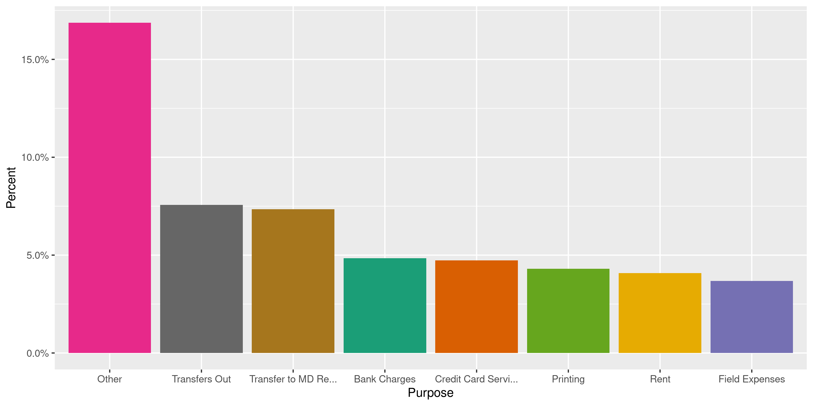
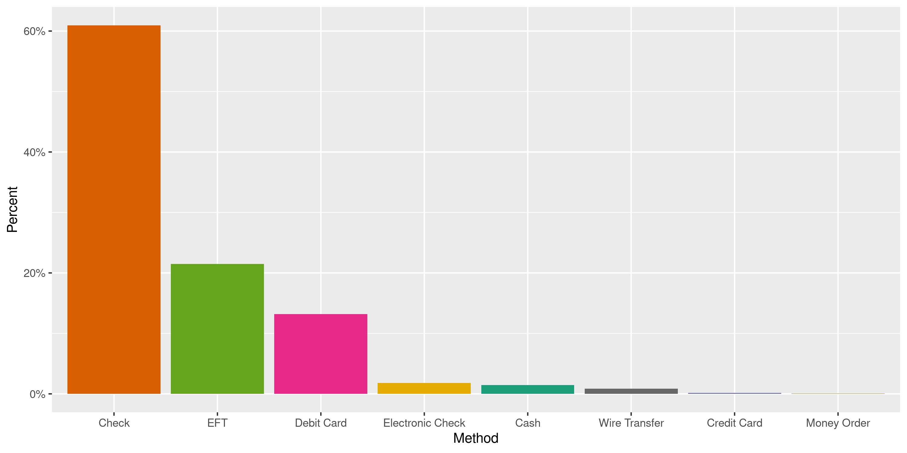
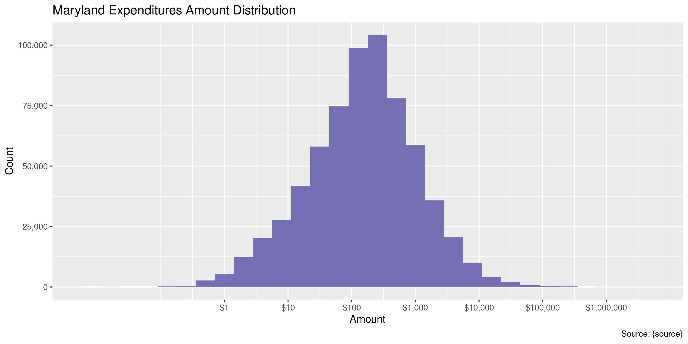
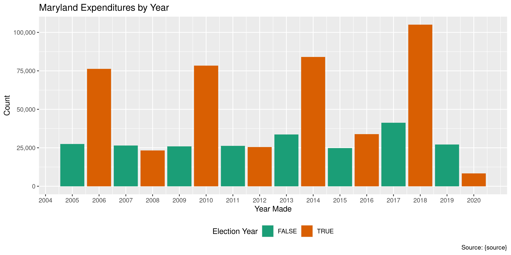
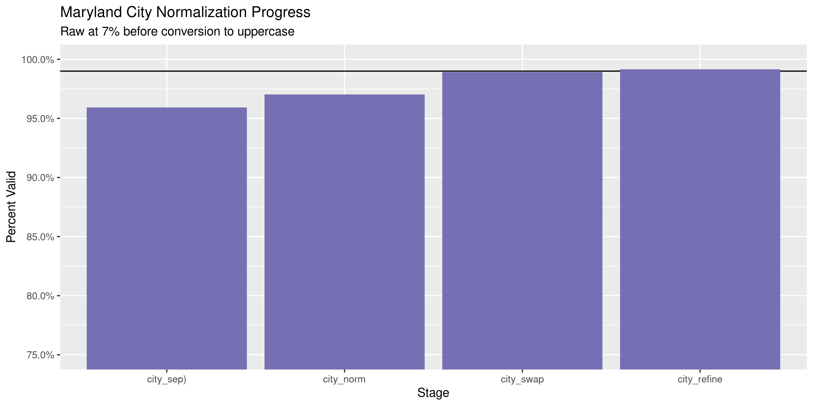
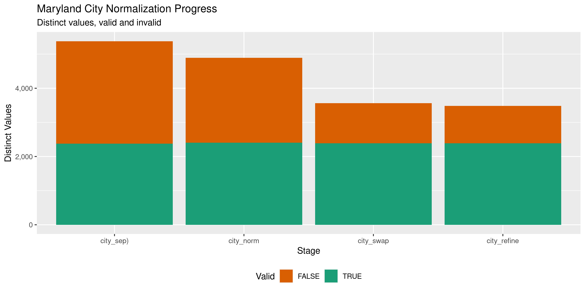

Maryland Expenditures
================
Kiernan Nicholls & Yanqi Xu
2023-07-04 16:58:28

- [Project](#project)
- [Objectives](#objectives)
- [Packages](#packages)
- [Data](#data)
- [Download](#download)
- [Read](#read)
- [Explore](#explore)
- [Wrangle](#wrangle)
- [Conclude](#conclude)
- [Export](#export)
- [Upload](#upload)
- [Dictionary](#dictionary)

<!-- Place comments regarding knitting here -->

## Project

The Accountability Project is an effort to cut across data silos and
give journalists, policy professionals, activists, and the public at
large a simple way to search across huge volumes of public data about
people and organizations.

Our goal is to standardizing public data on a few key fields by thinking
of each dataset row as a transaction. For each transaction there should
be (at least) 3 variables:

1.  All **parties** to a transaction.
2.  The **date** of the transaction.
3.  The **amount** of money involved.

## Objectives

This document describes the process used to complete the following
objectives:

1.  How many records are in the database?
2.  Check for entirely duplicated records.
3.  Check ranges of continuous variables.
4.  Is there anything blank or missing?
5.  Check for consistency issues.
6.  Create a five-digit ZIP Code called `zip`.
7.  Create a `year` field from the transaction date.
8.  Make sure there is data on both parties to a transaction.

## Packages

The following packages are needed to collect, manipulate, visualize,
analyze, and communicate these results. The `pacman` package will
facilitate their installation and attachment.

The IRW’s `campfin` package will also have to be installed from GitHub.
This package contains functions custom made to help facilitate the
processing of campaign finance data.

``` r
if (!require("pacman")) install.packages("pacman")
pacman::p_load_gh("irworkshop/campfin")
pacman::p_load(
  tidyverse, # data manipulation
  lubridate, # datetime strings
  gluedown, # printing markdown
  magrittr, # pipe operators
  janitor, # clean data frames
  refinr, # cluster and merge
  scales, # format strings
  knitr, # knit documents
  vroom, # read files fast
  rvest, # html scraping
  glue, # combine strings
  here, # relative paths
  httr, # http requests
  fs # local storage 
)
```

This document should be run as part of the `R_campfin` project, which
lives as a sub-directory of the more general, language-agnostic
[`irworkshop/accountability_datacleaning`](https://github.com/irworkshop/accountability_datacleaning)
GitHub repository.

The `R_campfin` project uses the [RStudio
projects](https://support.rstudio.com/hc/en-us/articles/200526207-Using-Projects)
feature and should be run as such. The project also uses the dynamic
`here::here()` tool for file paths relative to *your* machine.

``` r
# where does this document knit?
here::here()
#> [1] "/Users/yanqixu/code/accountability_datacleaning"
```

## Data

Data is taken from the [Maryland Campaign Reporting Information
System](https://campaignfinance.maryland.gov/Home/Logout).

As explained by this [CRIS help
page](https://campaignfinance.maryland.gov/home/viewpage?title=View%20Expenditures%20/%20Outstanding%20Obligations&link=Public/ViewExpenses):

> ## General Information on Expenditures and Outstanding Obligations
>
> An ***expenditure*** is defined as a gift, transfer, disbursement, or
> promise of money or valuable thing by or on behalf of a political
> committee to promote or assist in promoting the success or defeat of a
> candidate, political party, or question at an election.
>
> Expenditures must be election related; that is, they must enhance the
> candidates election chances, such that they would not have been
> incurred if there had been no candidacy. Furthermore, expenditures,
> including loans, may not be for the personal use of the candidate or
> any other individual.
>
> An outstanding obligation is any unpaid debt that the committee has
> incurred at the end of a reporting period.

## Download

Our last update included data up until June 30, 2020. In this update, we
will include everything up to June 30, 2023. The next update should
start with July 1, 2023.

``` r
raw_dir <- dir_create(here("state","md", "expends", "data", "raw"))
raw_path <- path(raw_dir, "ExpenseInfo.xls")
raw_gone <- !file_exists(raw_path)
```

To download a copy of the search results locally, we can first `POST()`
our form information, leaving everything blank but a start date. This is
the same as filling out the form manually on the website and clicking
“Search”.

``` r
md_post <- POST(
  url = "https://campaignfinance.maryland.gov/Public/ViewExpenses",
  body = list(
    txtPayeeLastName = "",
    txtPayeeFirstName = "",
    ddlPayeeType = "",
    MemberId = "",
    txtRegistrant = "",
    CommitteeType = "",
    txtStreet = "",
    txtTown = "",
    ddlState = "",
    txtZipCode = "",
    txtZipExt = "",
    ddlCountyofResidences = "",
    ddlExpenCategory = "",
    ddlExpensePurpose = "",
    FilingYear = "",
    FilingPeriodName = "",
    ddlFundType = "",
    dtStartDate = "07/01/2020",
    dtStartDate = "06/30/2023",
    #dtEndDate = format(today(), "%m/%d/%Y"),
    txtAmountfrom = "",
    txtAmountto = "",
    Submit = "Search"
  )
)
```

From this `POST()`, we can extract the cookies needed to then submit the
corresponding `GET()` request, essentially telling the server to then
click the “Export” button on our previously searched results.

``` r
md_cookie <- cookies(md_post)$value
names(md_cookie) <- cookies(md_post)$name
```

While we *could* export to a CSV file, the formatting they use has no
quotation escapes which makes it difficult to read the entire file
properly. While more troublesome than CSV, we can export as a Microsoft
Excel file and then *convert* that file to CSV.

``` r
md_get <- GET(
  url = "https://campaignfinance.maryland.gov/Public/ExportExpensestoExcel",
  set_cookies(md_cookie),
  write_disk(raw_path, overwrite = TRUE),
  query = list(
    page = "1",
    orderBy = "~",
    filter = "~",
    `Grid-size` = "15",
    theme = "vista"
  )
)
```

This `GET()` created a local file.

``` r
file_info(raw_path) %>% 
  select(path, size, modification_time) %>% 
  mutate(across(path, path.abbrev))
#> # A tibble: 1 × 3
#>   path                                                                     size modification_time  
#>   <fs::path>                                                              <fs:> <dttm>             
#> 1 …/accountability_datacleaning/state/md/expends/data/raw/ExpenseInfo.xls   432 2023-07-04 16:55:52
```

## Read

``` r
raw_files <- dir_ls(raw_dir, glob = "*.csv")
```

``` r
mde <- map_dfr(
  raw_files,
  vroom,
  delim = ",",
  quote = "\"",
  escape_backslash = FALSE,
  escape_double = FALSE,
  guess_max = 0,
  num_threads = 1,
  col_types = cols(
    .default = col_character(),
    `Expenditure Date` = col_date("%m/%d/%Y"),
    `Amount($)` = col_double()
  )
)
```

The read data frame should have the same number of rows as results
returned from the CRIS web portal, which we’ll have to check manually.
We can also count the distinct values of a discrete variable like
`method`.

``` r
nrow(mde) # 668245 from search
#> [1] 157071
count(mde, method, sort = TRUE)
#> # A tibble: 11 × 2
#>    method                     n
#>    <chr>                  <int>
#>  1 Check                  64534
#>  2 EFT                    45124
#>  3 Debit Card             30820
#>  4 Credit Card/Visa        5786
#>  5 Wire Transfer           2902
#>  6 <NA>                    2769
#>  7 Electronic Check        2336
#>  8 Credit Card/MasterCard  1714
#>  9 Cash                     647
#> 10 Credit Card              331
#> 11 Money Order              108
```

## Explore

``` r
glimpse(mde)
#> Rows: 157,071
#> Columns: 13
#> $ date      <date> 2021-03-12, 2021-03-29, 2021-04-29, 2021-05-18, 2021-06-09, 2021-06-09, 2021-0…
#> $ payee     <chr> "VARIOUS", "Dundalk Eagle Newspaper", "Dundalk Eagle Newspaper", "Dundalk Eagle…
#> $ address   <chr> NA, "PO Box 600, Easton, Maryland 21601", "PO Box 600, Easton, Maryland 21601",…
#> $ type      <chr> "Reimburse", "Business/Group/Organization", "Business/Group/Organization", "Bus…
#> $ amount    <dbl> 350.00, 329.00, 400.00, 350.00, 200.00, 250.00, 77.38, 150.00, 106.94, 106.94, …
#> $ committee <chr> "Salling, Johnny Ray Friends of", "Salling, Johnny Ray Friends of", "Salling, J…
#> $ category  <chr> "Field Expenses", "Media", "Media", "Media", "Other Expenses", "Other Expenses"…
#> $ purpose   <chr> "Meeting Expenses", "Newspaper", "Newspaper", "Newspaper", "Other", "Other", "P…
#> $ toward    <chr> NA, NA, NA, NA, NA, NA, NA, NA, NA, NA, NA, NA, NA, NA, NA, NA, NA, NA, NA, NA,…
#> $ method    <chr> "Check", "Check", "Check", "Check", "Check", "Check", "Debit Card", "Check", "D…
#> $ vendor    <chr> "VARIOUS", NA, NA, NA, NA, NA, NA, "VARIOUS", NA, NA, NA, NA, NA, NA, NA, NA, N…
#> $ fundtype  <chr> "Electoral", "Electoral", "Electoral", "Electoral", "Electoral", "Electoral", "…
#> $ comments  <chr> NA, NA, NA, NA, "PARADE SPONSOR", "HERITAGE FAIR SPONSOR", "PAYPAL PMT", NA, NA…
tail(mde)
#> # A tibble: 6 × 13
#>   date       payee        address type  amount commi…¹ categ…² purpose toward method vendor fundt…³
#>   <date>     <chr>        <chr>   <chr>  <dbl> <chr>   <chr>   <chr>   <chr>  <chr>  <chr>  <chr>  
#> 1 2022-12-30 Vincent Har… 3012 L… Indi…   2603 Moore … Salari… Consul… <NA>   Check  <NA>   Electo…
#> 2 2023-01-13 Vincent Har… 3012 L… Indi…   2603 Moore … Salari… Consul… <NA>   Check  <NA>   Electo…
#> 3 2023-01-30 Vincent Har… 3012 L… Indi…   2603 Moore … Salari… Consul… <NA>   Check  <NA>   Electo…
#> 4 2023-01-26 Lillie Harr… 1400 S… Indi…    275 Moore … Field … Consul… <NA>   Check  <NA>   Electo…
#> 5 2022-12-22 Athena Hern… 4732 G… Indi…   3000 Moore … Salari… Consul… <NA>   Check  <NA>   Electo…
#> 6 2022-12-28 Athena Hern… 4732 G… Indi…   3000 Moore … Salari… Consul… <NA>   Check  <NA>   Electo…
#> # … with 1 more variable: comments <chr>, and abbreviated variable names ¹​committee, ²​category,
#> #   ³​fundtype
```

### Missing

``` r
col_stats(mde, count_na)
#> # A tibble: 13 × 4
#>    col       class       n        p
#>    <chr>     <chr>   <int>    <dbl>
#>  1 date      <date>      0 0       
#>  2 payee     <chr>      93 0.000592
#>  3 address   <chr>    6313 0.0402  
#>  4 type      <chr>       0 0       
#>  5 amount    <dbl>       0 0       
#>  6 committee <chr>       0 0       
#>  7 category  <chr>       0 0       
#>  8 purpose   <chr>    4708 0.0300  
#>  9 toward    <chr>  154177 0.982   
#> 10 method    <chr>    2769 0.0176  
#> 11 vendor    <chr>  145439 0.926   
#> 12 fundtype  <chr>       0 0       
#> 13 comments  <chr>   97771 0.622
```

``` r
mde <- mutate(mde, payee = coalesce(payee, vendor))
mde <- mde %>% flag_na(date, payee, amount, committee)
percent(mean(mde$na_flag), 0.01)
#> [1] "0.06%"
```

``` r
mde %>% 
  filter(na_flag) %>% 
  select(date, payee, amount, committee)
#> # A tibble: 93 × 4
#>    date       payee amount committee               
#>    <date>     <chr>  <dbl> <chr>                   
#>  1 2021-04-16 <NA>    22   Edelson, Mark Friends of
#>  2 2021-04-24 <NA>   144.  Ivey, Julian Friends of 
#>  3 2021-04-24 <NA>    59.1 Ivey, Julian Friends of 
#>  4 2021-04-24 <NA>    26.5 Ivey, Julian Friends of 
#>  5 2021-04-24 <NA>   122.  Ivey, Julian Friends of 
#>  6 2021-04-24 <NA>    40.3 Ivey, Julian Friends of 
#>  7 2021-04-24 <NA>   102.  Ivey, Julian Friends of 
#>  8 2021-04-24 <NA>    59.9 Ivey, Julian Friends of 
#>  9 2021-04-24 <NA>    51.6 Ivey, Julian Friends of 
#> 10 2021-04-24 <NA>    39.9 Ivey, Julian Friends of 
#> # … with 83 more rows
```

``` r
mde %>% 
  filter(na_flag) %>% 
  select(date, payee, amount, committee) %>% 
  col_stats(count_na)
#> # A tibble: 4 × 4
#>   col       class      n     p
#>   <chr>     <chr>  <int> <dbl>
#> 1 date      <date>     0     0
#> 2 payee     <chr>     93     1
#> 3 amount    <dbl>      0     0
#> 4 committee <chr>      0     0
```

### Duplicates

``` r
d1 <- duplicated(mde, fromLast = FALSE)
d2 <- duplicated(mde, fromLast = TRUE)
mde <- mutate(mde, dupe_flag = d1 | d2)
percent(mean(mde$dupe_flag), 0.01)
#> [1] "4.89%"
rm(d1, d2); flush_memory()
```

``` r
mde %>% 
  filter(dupe_flag) %>% 
  select(date, payee, amount, committee)
#> # A tibble: 7,685 × 4
#>    date       payee          amount committee            
#>    <date>     <chr>           <dbl> <chr>                
#>  1 2021-01-15 SYED SAQIB ALI    100 Ali, Saqib Friends of
#>  2 2021-01-15 SYED SAQIB ALI      0 Ali, Saqib Friends of
#>  3 2021-01-15 SYED SAQIB ALI      0 Ali, Saqib Friends of
#>  4 2021-01-15 SYED SAQIB ALI      0 Ali, Saqib Friends of
#>  5 2021-01-15 SYED SAQIB ALI      0 Ali, Saqib Friends of
#>  6 2021-01-15 SYED SAQIB ALI    100 Ali, Saqib Friends of
#>  7 2021-01-15 SYED SAQIB ALI      0 Ali, Saqib Friends of
#>  8 2021-01-15 SYED SAQIB ALI      0 Ali, Saqib Friends of
#>  9 2021-01-15 SYED SAQIB ALI      0 Ali, Saqib Friends of
#> 10 2021-01-15 SYED SAQIB ALI    100 Ali, Saqib Friends of
#> # … with 7,675 more rows
```

A significant amount of these duplicate values have an `amount` of zero.

``` r
mean(mde$amount == 0, na.rm = TRUE)
#> [1] 0.009899982
mean(mde$amount[mde$dupe_flag] == 0, na.rm = TRUE)
#> [1] 0.1324658
```

### Categorical

``` r
col_stats(mde, n_distinct)
#> # A tibble: 15 × 4
#>    col       class      n         p
#>    <chr>     <chr>  <int>     <dbl>
#>  1 date      <date>  1013 0.00645  
#>  2 payee     <chr>  26015 0.166    
#>  3 address   <chr>  30585 0.195    
#>  4 type      <chr>     20 0.000127 
#>  5 amount    <dbl>  35310 0.225    
#>  6 committee <chr>   2187 0.0139   
#>  7 category  <chr>     17 0.000108 
#>  8 purpose   <chr>     72 0.000458 
#>  9 toward    <chr>    111 0.000707 
#> 10 method    <chr>     11 0.0000700
#> 11 vendor    <chr>   3656 0.0233   
#> 12 fundtype  <chr>      2 0.0000127
#> 13 comments  <chr>  25351 0.161    
#> 14 na_flag   <lgl>      2 0.0000127
#> 15 dupe_flag <lgl>      2 0.0000127
```

``` r
explore_plot(mde, type)
```

<!-- -->

``` r
explore_plot(mde, category) + scale_x_truncate()
```

<!-- -->

``` r
explore_plot(mde, purpose) + scale_x_truncate()
```

<!-- -->

``` r
explore_plot(mde, method)
```

<!-- -->

``` r
explore_plot(mde, fundtype)
```

<!-- -->

### Amounts

``` r
summary(mde$amount)
#>      Min.   1st Qu.    Median      Mean   3rd Qu.      Max. 
#>   -3531.2      20.3     125.0    1482.3     528.2 2700000.0
mean(mde$amount <= 0)
#> [1] 0.01000821
```

<!-- -->

### Dates

We can add the calendar year from `date` with `lubridate::year()`

``` r
mde <- mutate(mde, year = year(date))
```

``` r
min(mde$date)
#> [1] "2020-07-01"
sum(mde$year < 2000)
#> [1] 0
max(mde$date)
#> [1] "2023-06-30"
sum(mde$date > today())
#> [1] 0
```

<!-- -->

## Wrangle

To improve the searchability of the database, we will perform some
consistent, confident string normalization. For geographic variables
like city names and ZIP codes, the corresponding `campfin::normal_*()`
functions are tailor made to facilitate this process.

The `address` variable contains all geographic information in a single
string.

``` r
md_bullet(head(mde$address))
```

- NA
- PO Box 600, Easton, Maryland 21601
- PO Box 600, Easton, Maryland 21601
- PO Box 600, Easton, Maryland 21601
- Dundalk Maryland, Baltimore, Maryland 21222
- Dundalk Maryland, Baltimore, Maryland 21222

By using `tidyr::separate()` and `tidyr::unite()`, we can split this
single string into it’s component pieced in new variables ending in
`_sep`.

``` r
mde <- mde %>% 
  separate(
    col = address,
    into = c(glue("addr_sep{1:10}"), "city_sep", "state_zip"),
    sep = ",\\s",
    remove = FALSE,
    fill = "left",
    extra = "merge"
  ) %>% 
  unite(
    starts_with("addr_sep"),
    col = "addr_sep",
    sep = " ",
    na.rm = TRUE,
    remove = TRUE
  ) %>% 
  mutate(across(where(is.character), na_if, "")) %>%
  separate(
    col = state_zip,
    into = c("state_sep", "zip_sep"),
    sep = "\\s(?=\\d|-|x)",
    remove = TRUE,
    fill = "right"
  )
```

### Address

For the street `addresss` variable, the `campfin::normal_address()`
function will force consistence case, remove punctuation, and abbreviate
official USPS suffixes.

``` r
mde <- mde %>% 
  mutate(
    addr_norm = normal_address(
      address = addr_sep,
      abbs = usps_street,
      na_rep = TRUE
    )
  )
```

### ZIP

For ZIP codes, the `campfin::normal_zip()` function will attempt to
create valid *five* digit codes by removing the ZIP+4 suffix and
returning leading zeroes dropped by other programs like Microsoft Excel.

``` r
mde <- mde %>% 
  mutate(
    zip_norm = normal_zip(
      zip = zip_sep,
      na_rep = TRUE
    )
  )
```

``` r
progress_table(
  mde$zip_sep,
  mde$zip_norm,
  compare = valid_zip
)
#> # A tibble: 2 × 6
#>   stage        prop_in n_distinct prop_na n_out n_diff
#>   <chr>          <dbl>      <dbl>   <dbl> <dbl>  <dbl>
#> 1 mde$zip_sep    0.950       3394  0.0436  7486    851
#> 2 mde$zip_norm   0.991       2769  0.0442  1354    189
```

### State

Valid two digit state abbreviations can be made using the
`campfin::normal_state()` function.

``` r
mde <- mde %>% 
  mutate(
    state_norm = normal_state(
      state = state_sep,
      abbreviate = TRUE,
      na_rep = TRUE,
      valid = NULL
    )
  )
```

``` r
mde %>% 
  filter(state_sep != state_norm) %>% 
  count(state_sep, state_norm, sort = TRUE)
#> # A tibble: 77 × 3
#>    state_sep            state_norm     n
#>    <chr>                <chr>      <int>
#>  1 Maryland             MD         88452
#>  2 California           CA         16938
#>  3 Massachusetts        MA          9619
#>  4 District Of Columbia DC          5899
#>  5 Louisiana            LA          4588
#>  6 Virginia             VA          3248
#>  7 New York             NY          2978
#>  8 Ohio                 OH          2655
#>  9 Pennsylvania         PA          2557
#> 10 Arizona              AZ          1776
#> # … with 67 more rows
```

``` r
progress_table(
  mde$state_sep,
  mde$state_norm,
  compare = valid_state
)
#> # A tibble: 2 × 6
#>   stage             prop_in n_distinct prop_na  n_out n_diff
#>   <chr>               <dbl>      <dbl>   <dbl>  <dbl>  <dbl>
#> 1 mde$state_sep  0.00000663        101  0.0402 150757    100
#> 2 mde$state_norm 0.997              97  0.0402    481     41
```

### City

Cities are the most difficult geographic variable to normalize, simply
due to the wide variety of valid cities and formats.

#### Normal

The `campfin::normal_city()` function is a good start, again converting
case, removing punctuation, but *expanding* USPS abbreviations. We can
also remove `invalid_city` values.

``` r
mde <- mde %>% 
  mutate(
    city_norm = normal_city(
      city = city_sep, 
      abbs = usps_city,
      states = c("MD", "DC", "MARYLAND"),
      na = invalid_city,
      na_rep = TRUE
    )
  )
```

#### Swap

We can further improve normalization by comparing our normalized value
against the *expected* value for that record’s state abbreviation and
ZIP code. If the normalized value is either an abbreviation for or very
similar to the expected value, we can confidently swap those two.

``` r
mde <- mde %>% 
  left_join(
    y = zipcodes,
    by = c(
      "state_norm" = "state",
      "zip_norm" = "zip"
    )
  ) %>% 
  rename(city_match = city) %>% 
  mutate(
    match_abb = is_abbrev(city_norm, city_match),
    match_dist = str_dist(city_norm, city_match),
    city_swap = if_else(
      condition = !is.na(match_dist) & (match_abb | match_dist == 1),
      true = city_match,
      false = city_norm
    )
  ) %>% 
  select(
    -city_match,
    -match_dist,
    -match_abb
  )
```

#### Refine

The [OpenRefine](https://openrefine.org/) algorithms can be used to
group similar strings and replace the less common versions with their
most common counterpart. This can greatly reduce inconsistency, but with
low confidence; we will only keep any refined strings that have a valid
city/state/zip combination.

``` r
good_refine <- mde %>% 
  mutate(
    city_refine = city_swap %>% 
      key_collision_merge() %>% 
      n_gram_merge(numgram = 1)
  ) %>% 
  filter(city_refine != city_swap) %>% 
  inner_join(
    y = zipcodes,
    by = c(
      "city_refine" = "city",
      "state_norm" = "state",
      "zip_norm" = "zip"
    )
  )
```

    #> # A tibble: 35 × 5
    #>    state_norm zip_norm city_swap    city_refine       n
    #>    <chr>      <chr>    <chr>        <chr>         <int>
    #>  1 CA         94107    SAN FRANSICO SAN FRANCISCO    14
    #>  2 CA         94158    FRANCISCO    SAN FRANCISCO    13
    #>  3 CA         94105    SAN FRANSICO SAN FRANCISCO    10
    #>  4 DC         20006    WASHIGNTONO  WASHINGTON        8
    #>  5 OH         45249    CINCINATTI   CINCINNATI        8
    #>  6 CA         94158    SAN FRANSICO SAN FRANCISCO     6
    #>  7 MD         21206    BALTIMORE CO BALTIMORE         5
    #>  8 MD         21209    BALTIMORE CO BALTIMORE         4
    #>  9 MD         21224    BALTIMORE CO BALTIMORE         4
    #> 10 OH         45271    CINCINATTI   CINCINNATI        4
    #> # … with 25 more rows

Then we can join the refined values back to the database.

``` r
mde <- mde %>% 
  left_join(good_refine) %>% 
  mutate(city_refine = coalesce(city_refine, city_swap))
```

#### Progress

``` r
many_city <- c(valid_city, extra_city)
mde %>% 
  filter(city_refine %out% many_city) %>% 
  count(city_refine, sort = TRUE)
#> # A tibble: 284 × 2
#>    city_refine        n
#>    <chr>          <int>
#>  1 <NA>            6677
#>  2 LANGLEY PARK     854
#>  3 PRINCE GEORGES   518
#>  4 BALTIMORE CITY   451
#>  5 ANNE ARUNDEL     351
#>  6 BALTIMORE CO     273
#>  7 MELNO PARK       203
#>  8 IN STATE         171
#>  9 ST MARYS         157
#> 10 NORTH SEATTLE     98
#> # … with 274 more rows
```

``` r
mde <- mde %>% 
  mutate(
    city_refine = city_refine %>% 
      str_replace("^DC$", "WASHINGTON") %>% 
      str_replace("^BALTO$", "BALTIMORE") %>% 
      str_replace("^BALTIMORE CITY$", "BALTIMORE") %>% 
      str_replace("^BALTIMORE CO$", "BALTIMORE") %>% 
      str_replace("^BALTIMORE CO$", "BALTIMORE")
  )
```

``` r
many_city <- c(many_city, "COLMAR MANOR", "ANNE ARUNDEL", "PRINCE GEORGES")
```

| stage                                                                      | prop_in | n_distinct | prop_na | n_out | n_diff |
|:---------------------------------------------------------------------------|--------:|-----------:|--------:|------:|-------:|
| str_to_upper(mde$city_sep) | 0.942| 2199| 0.040| 8749| 820| |mde$city_norm |   0.955 |       2069 |   0.043 |  6769 |    681 |
| mde$city_swap | 0.974| 1676| 0.043| 3913| 296| |mde$city_refine            |   0.980 |       1656 |   0.043 |  3067 |    277 |

You can see how the percentage of valid values increased with each
stage.

<!-- -->

More importantly, the number of distinct values decreased each stage. We
were able to confidently change many distinct invalid values to their
valid equivalent.

<!-- -->

## Conclude

Before exporting, we can remove the intermediary normalization columns
and rename all added variables with the `_clean` suffix.

``` r
mde <- mde %>% 
  select(
    -city_norm,
    -city_swap,
    city_clean = city_refine,
    -ends_with("_sep")
  ) %>% 
  rename_all(~str_replace(., "_norm", "_clean")) %>% 
  rename_all(~str_remove(., "_raw"))
```

``` r
glimpse(sample_n(mde, 20))
#> Rows: 20
#> Columns: 20
#> $ date        <date> 2022-07-01, 2021-06-21, 2021-10-25, 2022-06-05, 2022-06-14, 2022-05-14, 2021…
#> $ payee       <chr> "Ambrosino Muir & Hansen", "NICHOLAUS RYAN KIPKE", "United Airlines", "Anedot…
#> $ address     <chr> "500 Sansome St, Ste 404, San Francisco, California 94111", "311 Eagle Hill R…
#> $ type        <chr> "Business/Group/Organization", "Self (Candidate)", "Business/Group/Organizati…
#> $ amount      <dbl> 35360.00, 100.03, 399.00, 4.30, 4134.00, 4.30, 140.00, 515.40, 156.88, 1500.0…
#> $ committee   <chr> "Brown, Anthony Friends Of", "Kipke, Nic Friends of", "King, John for Governo…
#> $ category    <chr> "Direct Mailing by Mail House (R)", "Other Expenses", "Salaries and Other com…
#> $ purpose     <chr> "Mailing Service", "Other", "Staff - Travel", "Credit Card Service Processing…
#> $ toward      <chr> NA, NA, NA, NA, NA, NA, NA, NA, NA, NA, NA, NA, NA, NA, NA, NA, NA, NA, NA, NA
#> $ method      <chr> "Wire Transfer", "Check", "Check", "EFT", "Debit Card", "EFT", "Check", "Debi…
#> $ vendor      <chr> NA, NA, NA, NA, NA, NA, NA, NA, NA, NA, NA, NA, NA, NA, NA, NA, NA, NA, NA, NA
#> $ fundtype    <chr> "Electoral", "Electoral", "Electoral", "Electoral", "Electoral", "Electoral",…
#> $ comments    <chr> "Direct Mail", "Charity Auction lunch", "Travel", NA, "Yard Signs", NA, "Dess…
#> $ na_flag     <lgl> FALSE, FALSE, FALSE, FALSE, FALSE, FALSE, FALSE, FALSE, FALSE, FALSE, FALSE, …
#> $ dupe_flag   <lgl> FALSE, FALSE, TRUE, TRUE, FALSE, FALSE, FALSE, FALSE, FALSE, FALSE, FALSE, FA…
#> $ year        <dbl> 2022, 2021, 2021, 2022, 2022, 2022, 2021, 2022, 2022, 2022, 2022, 2021, 2022,…
#> $ addr_clean  <chr> "500 SANSOME ST STE 404", "311 EAGLE HILL RD", "233 S WACKER DR", "1340 POYDR…
#> $ zip_clean   <chr> "94111", "21122", "60606", "70112", "21740", "70808", "21074", "20837", "2170…
#> $ state_clean <chr> "CA", "MD", "IL", "LA", "MD", "LA", "MD", "MD", "MD", "MD", "MD", "LA", "MA",…
#> $ city_clean  <chr> "SAN FRANCISCO", "PASADENA", "CHICAGO", "NEW ORLEANS", "HAGERSTOWN", "BATON R…
```

1.  There are 157,071 records in the database.
2.  There are 7,685 duplicate records in the database.
3.  The range and distribution of `amount` and `date` seem reasonable.
4.  There are 93 records missing key variables.
5.  Consistency in geographic data has been improved with
    `campfin::normal_*()`.
6.  The 4-digit `year` variable has been created with
    `lubridate::year()`.

## Export

Now the file can be saved on disk for upload to the Accountability
server.

``` r
clean_dir <- dir_create(here("state","md", "expends", "data", "clean"))
clean_path <- path(clean_dir, "md_expends_clean_202007-202306.csv")
write_csv(mde, clean_path, na = "")
file_size(clean_path)
#> 40.7M
file_encoding(clean_path) %>% 
  mutate(across(path, path.abbrev))
#> # A tibble: 1 × 3
#>   path                                                                                mime  charset
#>   <fs::path>                                                                          <chr> <chr>  
#> 1 …bility_datacleaning/state/md/expends/data/clean/md_expends_clean_202007-202306.csv <NA>  <NA>
```

## Upload

Using the [duckr](https://github.com/kiernann/duckr) R package, we can
wrap around the [duck](https://duck.sh/) command line tool to upload the
file to the IRW server.

``` r
# remotes::install_github("kiernann/duckr")
s3_dir <- "s3:/publicaccountability/csv/"
s3_path <- path(s3_dir, basename(clean_path))
if (require(duckr)) {
  duckr::duck_upload(clean_path, s3_path)
}
```

## Dictionary

The following table describes the variables in our final exported file:

| Column        | Original name      | Type        | Definition                                    |
|:--------------|:-------------------|:------------|:----------------------------------------------|
| `date`        | `Expenditure Date` | `double`    | Date expenditure was made                     |
| `payee`       | `Payee Name`       | `character` | Payee name                                    |
| `address`     | `Address`          | `character` | Payee full address                            |
| `type`        | `Payee Type`       | `character` | Payee type                                    |
| `amount`      | `Amount($)`        | `double`    | Expenditure amount or correction              |
| `committee`   | `Committee Name`   | `character` | Spending committee name                       |
| `category`    | `Expense Category` | `character` | Expenditure category                          |
| `purpose`     | `Expense Purpose`  | `character` | Expenditure method                            |
| `toward`      | `Expense Toward`   | `character` | Expenditure purpose                           |
| `method`      | `Expense Method`   | `character` | Expenditure helping other committee           |
| `vendor`      | `Vendor`           | `character` | Payee vendor name (unused)                    |
| `fundtype`    | `Fundtype`         | `character` | Funds source type (Electoral, Administrative) |
| `comments`    | `Comments`         | `character` | Freeform comment text                         |
| `na_flag`     |                    | `logical`   | Flag for missing date, amount, or name        |
| `dupe_flag`   |                    | `logical`   | Flag for completely duplicated record         |
| `year`        |                    | `double`    | Calendar year of contribution date            |
| `addr_clean`  |                    | `character` | Normalized combined street address            |
| `zip_clean`   |                    | `character` | Normalized 5-digit ZIP code                   |
| `state_clean` |                    | `character` | Normalized 2-digit state abbreviation         |
| `city_clean`  |                    | `character` | Normalized city name                          |
