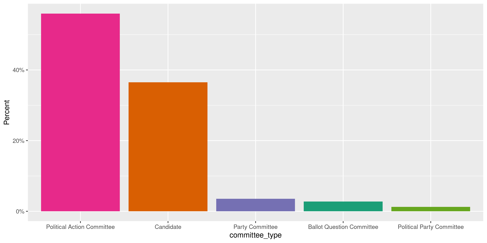
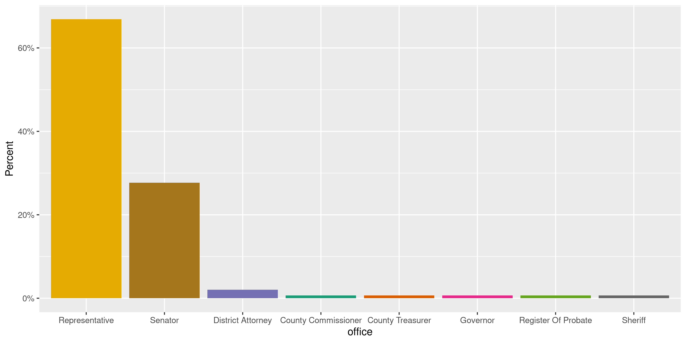
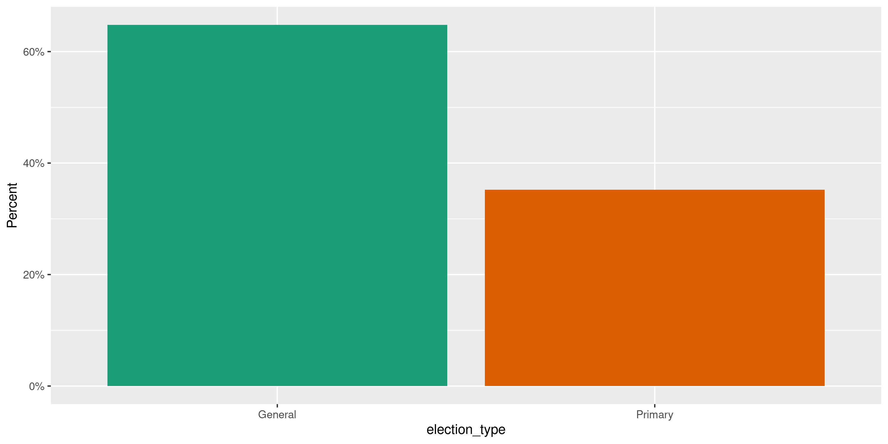
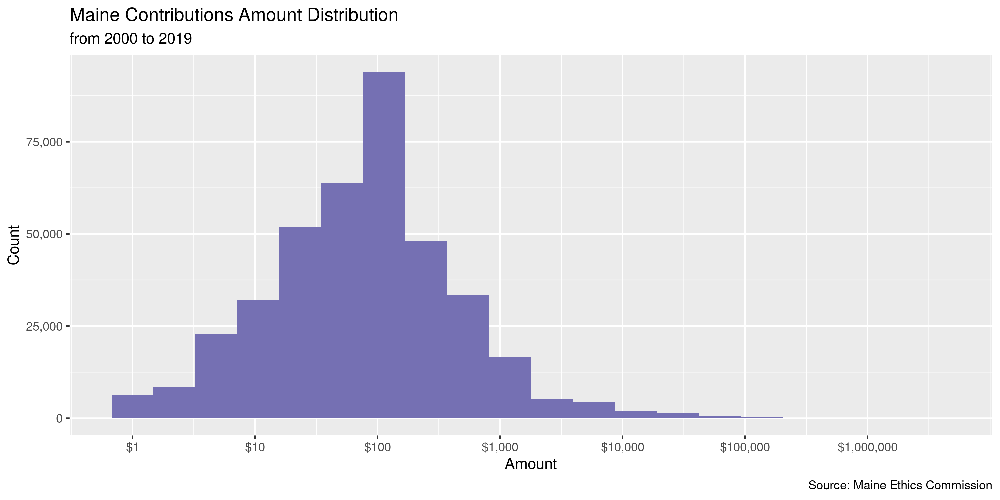
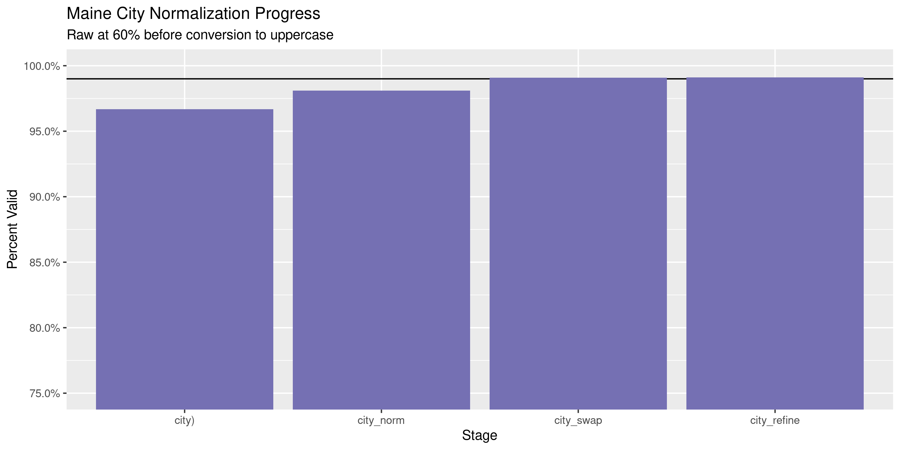
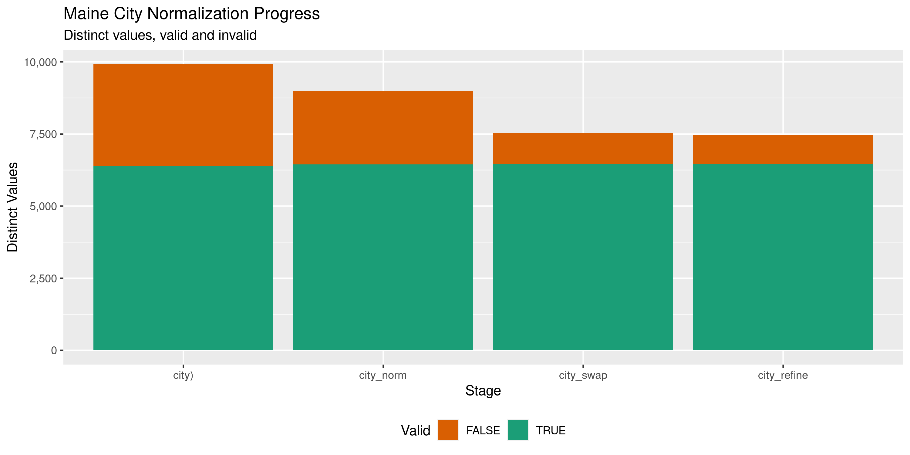

Maine Contributions
================
Kiernan Nicholls
2020-11-03 15:47:58

  - [Project](#project)
  - [Objectives](#objectives)
  - [Packages](#packages)
  - [Data](#data)
  - [Download](#download)
  - [Fix](#fix)
  - [Read](#read)
  - [Explore](#explore)
  - [Missing](#missing)
  - [Duplicates](#duplicates)
  - [Categorical](#categorical)
  - [Amounts](#amounts)
  - [Dates](#dates)
  - [Wrangle](#wrangle)
  - [Conclude](#conclude)
  - [Export](#export)
  - [Upload](#upload)
  - [Dictionary](#dictionary)

<!-- Place comments regarding knitting here -->

## Project

The Accountability Project is an effort to cut across data silos and
give journalists, policy professionals, activists, and the public at
large a simple way to search across huge volumes of public data about
people and organizations.

Our goal is to standardizing public data on a few key fields by thinking
of each dataset row as a transaction. For each transaction there should
be (at least) 3 variables:

1.  All **parties** to a transaction.
2.  The **date** of the transaction.
3.  The **amount** of money involved.

## Objectives

This document describes the process used to complete the following
objectives:

1.  How many records are in the database?
2.  Check for entirely duplicated records.
3.  Check ranges of continuous variables.
4.  Is there anything blank or missing?
5.  Check for consistency issues.
6.  Create a five-digit ZIP Code called `zip`.
7.  Create a `year` field from the transaction date.
8.  Make sure there is data on both parties to a transaction.

## Packages

The following packages are needed to collect, manipulate, visualize,
analyze, and communicate these results. The `pacman` package will
facilitate their installation and attachment.

The IRW’s `campfin` package will also have to be installed from GitHub.
This package contains functions custom made to help facilitate the
processing of campaign finance data.

``` r
if (!require("pacman")) install.packages("pacman")
pacman::p_load_gh("irworkshop/campfin")
pacman::p_load(
  tidyverse, # data manipulation
  lubridate, # datetime strings
  snakecase, # string convert
  gluedown, # print markdown
  magrittr, # pipe operators
  janitor, # dataframe clean
  batman, # parse logical
  aws.s3, # aws cloud storage
  refinr, # cluster and merge
  scales, # format strings
  knitr, # knit documents
  vroom, # read files fast
  rvest, # read html pages
  glue, # combine strings
  here, # relative storage
  fs # search storage 
)
```

This document should be run as part of the `R_campfin` project, which
lives as a sub-directory of the more general, language-agnostic
[`irworkshop/accountability_datacleaning`](https://github.com/irworkshop/accountability_datacleaning)
GitHub repository.

The `R_campfin` project uses the [RStudio
projects](https://support.rstudio.com/hc/en-us/articles/200526207-Using-Projects)
feature and should be run as such. The project also uses the dynamic
`here::here()` tool for file paths relative to *your* machine.

``` r
# where does this document knit?
here::here()
#> /home/kiernan/Code/tap/R_campfin
```

## Data

Data is from the [Maine Ethics
Commission](https://www.maine.gov/ethics/home)’s [public data
portal](https://mainecampaignfinance.com/#/index).

> The Maine Commission on Governmental Ethics and Election Practices is
> an independent state agency that administers Maine’s campaign finance
> laws, the Maine Clean Election Act, and the lobbyist disclosure law.
> It also issues advisory opinions and conducts investigations regarding
> legislative ethics.

> This page provides comma separated value (CSV) downloads of
> contribution, expenditure, and loan data for each reporting year in a
> zipped file format. These files can be downloaded and imported into
> other applications (Microsoft Excel, Microsoft Access, etc.)

> This data is extracted from the Maine Ethics Commission database as it
> existed as of 11/03/2020 02:25 PM

The MEC also provides a [file layout
key](https://mainecampaignfinance.com/Template/KeyDownloads/ME%20Contributions%20and%20Loans%20File%20Layout.pdf).

## Download

We download files from 2008 to 2020 using a `POST()` request with the
file year.

``` r
raw_dir <- dir_create(here("me", "contribs", "data", "raw"))
raw_url <- "https://mainecampaignfinance.com/api/DataDownload/CSVDownloadReport"
```

``` r
for (y in 2008:2020) {
  year_path <- path(raw_dir, glue("CON_{y}.csv"))
  if (!file_exists(year_path)) {
    POST(
      url = raw_url,
      write_disk(year_path),
      encode = "json",
      body = list(
        transactionType = "CON",
        year = y
      )
    )
  }
}
```

``` r
raw_info <- as_tibble(dir_info(raw_dir))
sum(raw_info$size)
#> 99.5M
raw_info %>% 
  select(path, size, modification_time) %>% 
  mutate(across(path, basename))
#> # A tibble: 13 x 3
#>    path                size modification_time  
#>    <chr>        <fs::bytes> <dttm>             
#>  1 CON_2008.csv       2.76M 2020-11-03 14:45:14
#>  2 CON_2009.csv       13.5M 2020-11-03 14:45:19
#>  3 CON_2010.csv       7.46M 2020-11-03 14:45:21
#>  4 CON_2011.csv       2.15M 2020-11-03 14:45:22
#>  5 CON_2012.csv          8M 2020-11-03 14:45:25
#>  6 CON_2013.csv       3.58M 2020-11-03 14:45:26
#>  7 CON_2014.csv      14.18M 2020-11-03 14:45:31
#>  8 CON_2015.csv       3.83M 2020-11-03 14:45:33
#>  9 CON_2016.csv       8.32M 2020-11-03 14:39:43
#> 10 CON_2017.csv       4.89M 2020-11-03 14:39:45
#> 11 CON_2018.csv       18.8M 2020-11-03 14:40:01
#> 12 CON_2019.csv       3.98M 2020-11-03 14:40:05
#> 13 CON_2020.csv        8.1M 2020-11-03 14:40:11
```

## Fix

``` r
fix_dir <- dir_create(path(dirname(raw_dir), "fix"))
fix_eval <- length(dir_ls(fix_dir)) != nrow(raw_info)
```

``` r
# for old format files
for (f in raw_info$path[1:10]) {
  n <- path(fix_dir, str_c("FIX", basename(f), sep = "_"))
  x <- read_lines(f, skip = 1)
  for (i in rev(seq_along(x))) {
    y <- i - 1
    if (y == 0) {
      next() # skip first
    } else if (str_starts(x[i], "\"\\d+\",") | str_ends(x[y], "\"(Y|N)\"")) {
      next() # skip if good
    } else { # merge if bad
      x[y] <- str_c(x[y], x[i])
      x <- x[-i] # remove bad
    }
  }
  x <- str_remove(x, '(?<=")"(?!,)')
  write_lines(x, n)
  message(basename(n))
}
```

``` r
# new format files
for (f in raw_info$path[11:length(raw_info$path)]) {
  n <- path(fix_dir, str_c("FIX", basename(f), sep = "_"))
  x <- read_lines(f, skip = 1)
  for (i in rev(seq_along(x))) {
    if (str_starts(x[i], "\\d+,\\d+,")) {
      next() # skip if good
    } else { # merge if bad
      x[i - 1] <- str_c(x[i - 1], x[i])
      x <- x[-i] # remove bad
    }
  }
  write_lines(x, n)
  message(basename(n))
}
```

``` r
fix_info <- as_tibble(dir_info(fix_dir))
sum(fix_info$size)
#> 99.2M
fix_info %>% 
  select(path, size, modification_time) %>% 
  mutate(across(path, basename))
#> # A tibble: 13 x 3
#>    path                    size modification_time  
#>    <chr>            <fs::bytes> <dttm>             
#>  1 FIX_CON_2008.csv       2.75M 2020-11-03 15:34:56
#>  2 FIX_CON_2009.csv      13.45M 2020-11-03 15:35:01
#>  3 FIX_CON_2010.csv       7.43M 2020-11-03 15:35:03
#>  4 FIX_CON_2011.csv       2.15M 2020-11-03 15:35:04
#>  5 FIX_CON_2012.csv       7.97M 2020-11-03 15:35:06
#>  6 FIX_CON_2013.csv       3.57M 2020-11-03 15:35:07
#>  7 FIX_CON_2014.csv      14.12M 2020-11-03 15:35:12
#>  8 FIX_CON_2015.csv       3.82M 2020-11-03 15:35:13
#>  9 FIX_CON_2016.csv       8.29M 2020-11-03 15:35:16
#> 10 FIX_CON_2017.csv       4.87M 2020-11-03 15:35:17
#> 11 FIX_CON_2018.csv      18.72M 2020-11-03 15:35:23
#> 12 FIX_CON_2019.csv       3.96M 2020-11-03 15:35:24
#> 13 FIX_CON_2020.csv       8.07M 2020-11-03 15:35:29
```

## Read

``` r
old_names <- read_names(path(raw_dir, "CON_2008.csv"))
new_names <- read_names(path(raw_dir, "CON_2019.csv"))
```

The files come in two structures. For files from 2008 to 2017, there are
`r length(me08)` variables. For the newer files, 2018 and 2019, there
are `r length(me19)` variables.

    #>  [1] "OrgID"                     "ReceiptAmount"             "ReceiptDate"              
    #>  [4] "LastName"                  "FirstName"                 "MI"                       
    #>  [7] "Suffix"                    "Address1"                  "Address2"                 
    #> [10] "City"                      "State"                     "Zip"                      
    #> [13] "ReceiptID"                 "FiledDate"                 "ReceiptType"              
    #> [16] "ReceiptSourceType"         "CommitteeType"             "CommitteeName"            
    #> [19] "CandidateName"             "Amended"                   "Description"              
    #> [22] "Employer"                  "Occupation"                "Occupation Comment"       
    #> [25] "Employment Info Requested"
    #>  [1] "OrgID"                            "LegacyID"                        
    #>  [3] "Committee Name"                   "Candidate Name"                  
    #>  [5] "Receipt Amount"                   "Receipt Date"                    
    #>  [7] "Office"                           "District"                        
    #>  [9] "Last Name"                        "First Name"                      
    #> [11] "Middle Name"                      "Suffix"                          
    #> [13] "Address1"                         "Address2"                        
    #> [15] "City"                             "State"                           
    #> [17] "Zip"                              "Description"                     
    #> [19] "Receipt ID"                       "Filed Date"                      
    #> [21] "Report Name"                      "Receipt Source Type"             
    #> [23] "Receipt Type"                     "Committee Type"                  
    #> [25] "Amended"                          "Employer"                        
    #> [27] "Occupation"                       "Occupation Comment"              
    #> [29] "Employment Information Requested" "Forgiven Loan"                   
    #> [31] "ElectionType"

``` r
old_names <- old_names %>% 
  str_replace("^MI$", "Middle Name") %>% 
  str_replace("\\bInfo\\b", "Information")
to_snake_case(old_names) %in% to_snake_case(new_names)
#>  [1] TRUE TRUE TRUE TRUE TRUE TRUE TRUE TRUE TRUE TRUE TRUE TRUE TRUE TRUE TRUE TRUE TRUE TRUE TRUE
#> [20] TRUE TRUE TRUE TRUE TRUE TRUE
```

``` r
me_old_format <-
  map(
    .x = fix_info$path[1:10],
    .f = read_delim,
    delim = ",",
    escape_backslash = FALSE,
    escape_double = FALSE,
    col_names = old_names,
    col_types = cols(
      .default = col_character(),
      ReceiptAmount = col_number(),
      ReceiptDate = col_date_usa(),
      FiledDate = col_date_usa()
    )
  ) %>% 
  bind_rows(.id = "id") %>% 
  clean_names() %>% 
  remove_empty("cols") %>% 
  left_join(
    tibble(
      id = as.character(1:10), 
      file = basename(raw_info$path[1:10])
    )
  ) %>% 
  select(-id)
```

``` r
x <- read_lines(fix_info$path[13])
write_lines(x[-344], fix_info$path[13])
```

``` r
me_new_format <-
  map(
    .x = fix_info$path[11:13],
    .f = read_delim,
    delim = ",",
    escape_backslash = FALSE,
    escape_double = TRUE,
    col_names = new_names,
    col_types = cols(
      .default = col_character(),
      `Receipt Amount` = col_number(),
      `Receipt Date` = col_date_usa(),
      `Filed Date` = col_date_usa()
    ) 
  ) %>% 
  bind_rows(.id = "id") %>% 
  clean_names() %>% 
  remove_empty("cols") %>% 
  left_join(
    tibble(
      id = as.character(1:3), 
      file = basename(raw_info$path[11:13])
    )
  ) %>% 
  select(-id)
```

``` r
mec <- 
  bind_rows(me_old_format, me_new_format) %>% 
  rename(emp_info_req = employment_information_requested) %>% 
  rename_all(str_remove, "receipt_") %>% 
  rename_all(str_remove, "_name") %>% 
  mutate_at(vars(emp_info_req, amended), to_logical) %>% 
  mutate_at(vars(file), basename) %>% 
  filter(!is.na(amended))
```

``` r
count(mec, emp_info_req)
#> # A tibble: 3 x 2
#>   emp_info_req      n
#>   <lgl>         <int>
#> 1 FALSE        273032
#> 2 TRUE           6132
#> 3 NA           117659
```

## Explore

``` r
glimpse(mec)
#> Rows: 396,823
#> Columns: 32
#> $ org_id             <chr> "3752", "3686", "3536", "3600", "3670", "3670", "3579", "3662", "3662…
#> $ amount             <dbl> 1147.22, 463.45, 100.00, 35.00, 100.00, 100.00, 250.00, 100.00, 100.0…
#> $ date               <date> 2008-01-01, 2008-01-01, 2008-01-01, 2008-01-01, 2008-01-01, 2008-01-…
#> $ last               <chr> NA, NA, "Lewis", NA, "Stevens", "Stevens", "Bryant", "Nadeau", "Marti…
#> $ first              <chr> NA, NA, "Brenda", NA, "Pat", "Win", "Bruce", "Jonathan", "Mary ", "Jo…
#> $ middle             <chr> NA, NA, NA, NA, NA, NA, "S", NA, NA, NA, NA, NA, NA, NA, NA, NA, NA, …
#> $ suffix             <chr> NA, NA, NA, NA, NA, NA, NA, NA, NA, NA, NA, NA, NA, NA, NA, NA, NA, N…
#> $ address1           <chr> NA, NA, "253 Mills Street", NA, "251 Nowell Rd", "251 Nowell Rd", "PO…
#> $ address2           <chr> NA, NA, NA, NA, NA, NA, NA, NA, NA, NA, NA, NA, NA, NA, NA, NA, NA, N…
#> $ city               <chr> NA, NA, "Whitelfield", NA, "Bangor", "Bangor", "Dixfield", "Fort Kent…
#> $ state              <chr> NA, NA, "ME", NA, "ME", "ME", "ME", "ME", "ME", "ME", "ME", "ME", "ME…
#> $ zip                <chr> NA, NA, "04353", NA, "04401", "04401", "04224-0643", "04743", "14743"…
#> $ id                 <chr> "12227", "24562", "13730", "26103", "24276", "24279", "27524", "13869…
#> $ filed_date         <date> 2008-05-30, 2008-08-06, 2008-04-25, 2008-10-28, 2008-07-22, 2008-07-…
#> $ type               <chr> "Monetary (Unitemized)", "Monetary (Unitemized)", "Monetary (Itemized…
#> $ source_type        <chr> "Transfer from Previous Campaign", "Transfer from Previous Campaign",…
#> $ committee_type     <chr> "Candidate", "Candidate", "Candidate", "Candidate", "Candidate", "Can…
#> $ committee          <chr> NA, NA, NA, NA, NA, NA, NA, NA, NA, NA, NA, NA, "MAINE COALITION TO S…
#> $ candidate          <chr> "Representative Christopher R Barstow", "Representative Richard D Bla…
#> $ amended            <lgl> FALSE, FALSE, FALSE, FALSE, FALSE, FALSE, FALSE, FALSE, FALSE, FALSE,…
#> $ description        <chr> NA, NA, NA, NA, NA, NA, NA, NA, NA, NA, NA, NA, NA, NA, NA, NA, NA, N…
#> $ employer           <chr> NA, NA, "State of Maine", NA, "State of Maine", "Rudman & Winchell", …
#> $ occupation         <chr> NA, NA, "Nurse", NA, "lawyer", "lawyer", "Boiler Operator", "Self Emp…
#> $ occupation_comment <chr> NA, NA, "Nurse", NA, "lawyer", "lawyer", "Boiler Operator", "Self Emp…
#> $ emp_info_req       <lgl> FALSE, FALSE, FALSE, FALSE, FALSE, FALSE, FALSE, FALSE, FALSE, FALSE,…
#> $ file               <chr> "CON_2008.csv", "CON_2008.csv", "CON_2008.csv", "CON_2008.csv", "CON_…
#> $ legacy_id          <chr> NA, NA, NA, NA, NA, NA, NA, NA, NA, NA, NA, NA, NA, NA, NA, NA, NA, N…
#> $ office             <chr> NA, NA, NA, NA, NA, NA, NA, NA, NA, NA, NA, NA, NA, NA, NA, NA, NA, N…
#> $ district           <chr> NA, NA, NA, NA, NA, NA, NA, NA, NA, NA, NA, NA, NA, NA, NA, NA, NA, N…
#> $ report             <chr> NA, NA, NA, NA, NA, NA, NA, NA, NA, NA, NA, NA, NA, NA, NA, NA, NA, N…
#> $ forgiven_loan      <chr> NA, NA, NA, NA, NA, NA, NA, NA, NA, NA, NA, NA, NA, NA, NA, NA, NA, N…
#> $ election_type      <chr> NA, NA, NA, NA, NA, NA, NA, NA, NA, NA, NA, NA, NA, NA, NA, NA, NA, N…
tail(mec)
#> # A tibble: 6 x 32
#>   org_id amount date       last  first middle suffix address1 address2 city  state zip   id   
#>   <chr>   <dbl> <date>     <chr> <chr> <chr>  <chr>  <chr>    <chr>    <chr> <chr> <chr> <chr>
#> 1 388390    149 2020-10-13 <NA>  <NA>  <NA>   <NA>   <NA>     <NA>     <NA>  ME    <NA>  7473…
#> 2 388390    190 2020-09-10 <NA>  <NA>  <NA>   <NA>   <NA>     <NA>     <NA>  ME    <NA>  7472…
#> 3 388390    220 2020-10-08 <NA>  <NA>  <NA>   <NA>   <NA>     <NA>     <NA>  ME    <NA>  7473…
#> 4 388390    256 2020-09-14 <NA>  <NA>  <NA>   <NA>   <NA>     <NA>     <NA>  ME    <NA>  7472…
#> 5 388390    289 2020-09-28 <NA>  <NA>  <NA>   <NA>   <NA>     <NA>     <NA>  ME    <NA>  7473…
#> 6 388390    310 2020-09-16 <NA>  <NA>  <NA>   <NA>   <NA>     <NA>     <NA>  ME    <NA>  7473…
#> # … with 19 more variables: filed_date <date>, type <chr>, source_type <chr>,
#> #   committee_type <chr>, committee <chr>, candidate <chr>, amended <lgl>, description <chr>,
#> #   employer <chr>, occupation <chr>, occupation_comment <chr>, emp_info_req <lgl>, file <chr>,
#> #   legacy_id <chr>, office <chr>, district <chr>, report <chr>, forgiven_loan <chr>,
#> #   election_type <chr>
```

## Missing

``` r
mec_missing <- col_stats(mec, count_na)
#> # A tibble: 32 x 4
#>    col                class       n          p
#>    <chr>              <chr>   <int>      <dbl>
#>  1 org_id             <chr>       1 0.00000252
#>  2 amount             <dbl>       1 0.00000252
#>  3 date               <date>      0 0         
#>  4 last               <chr>   21626 0.0545    
#>  5 first              <chr>   84686 0.213     
#>  6 middle             <chr>  355827 0.897     
#>  7 suffix             <chr>  394979 0.995     
#>  8 address1           <chr>   28780 0.0725    
#>  9 address2           <chr>  388985 0.980     
#> 10 city               <chr>   28580 0.0720    
#> 11 state              <chr>   13214 0.0333    
#> 12 zip                <chr>   29204 0.0736    
#> 13 id                 <chr>       0 0         
#> 14 filed_date         <date>     30 0.0000756 
#> 15 type               <chr>       0 0         
#> 16 source_type        <chr>    3225 0.00813   
#> 17 committee_type     <chr>       1 0.00000252
#> 18 committee          <chr>  128659 0.324     
#> 19 candidate          <chr>  251986 0.635     
#> 20 amended            <lgl>       0 0         
#> 21 description        <chr>  346543 0.873     
#> 22 employer           <chr>   99427 0.251     
#> 23 occupation         <chr>   92140 0.232     
#> 24 occupation_comment <chr>  170528 0.430     
#> 25 emp_info_req       <lgl>  117659 0.297     
#> 26 file               <chr>       0 0         
#> 27 legacy_id          <chr>  277406 0.699     
#> 28 office             <chr>  396675 1.00      
#> 29 district           <chr>  396679 1.00      
#> 30 report             <chr>  277679 0.700     
#> 31 forgiven_loan      <chr>  396800 1.00      
#> 32 election_type      <chr>  338066 0.852
```

Recipients are divided into committees and candidates. To better flag
records missing *either* type, we will `coalesce()` the two into a
single variable. We can also `unite()` the four contributor name
columns.

``` r
mec <- mec %>% 
  mutate(recipient = coalesce(candidate, committee)) %>% 
  unite(
    col = contributor,
    first, middle, last, suffix,
    sep = " ",
    na.rm = TRUE,
    remove = FALSE
  ) %>% 
  relocate(contributor, recipient, .after = last_col()) %>% 
  mutate(across(contributor, na_if, ""))
```

After uniting and coalescing the contributor and recipient columns, 0
records are missing a name, date, or amount.

``` r
key_vars <- c("date", "contributor", "amount", "recipient")
mec <- flag_na(mec, all_of(key_vars))
percent(mean(mec$na_flag), 0.1)
#> [1] "5.4%"
```

``` r
mec %>% 
  filter(na_flag) %>% 
  select(all_of(key_vars))
#> # A tibble: 21,414 x 4
#>    date       contributor  amount recipient                           
#>    <date>     <chr>         <dbl> <chr>                               
#>  1 2008-01-01 <NA>        1147.   Representative Christopher R Barstow
#>  2 2008-01-01 <NA>         463.   Representative Richard D Blanchard  
#>  3 2008-01-01 <NA>          35    Representative Donald E Pilon       
#>  4 2008-01-08 <NA>          15    Mr. Gary L Pelletier                
#>  5 2008-01-08 <NA>           3.15 Mr. Gary L Pelletier                
#>  6 2008-01-10 <NA>         400    Ms. Roberta B Beavers               
#>  7 2008-01-11 <NA>        2020.   Mr. Bradley S Moulton               
#>  8 2008-01-11 <NA>          25    Ms. Denise Anne Tepler              
#>  9 2008-01-11 <NA>          50    Ms. Denise Anne Tepler              
#> 10 2008-01-11 <NA>          10    Ms. Denise Anne Tepler              
#> # … with 21,404 more rows
```

``` r
mec %>% 
  filter(na_flag) %>% 
  select(all_of(key_vars)) %>% 
  col_stats(count_na)
#> # A tibble: 4 x 4
#>   col         class      n         p
#>   <chr>       <chr>  <int>     <dbl>
#> 1 date        <date>     0 0        
#> 2 contributor <chr>  21414 1        
#> 3 amount      <dbl>      1 0.0000467
#> 4 recipient   <chr>      1 0.0000467
```

## Duplicates

If we ignore the supposedly (quasi) unique `id` variable, there are a
number of otherwise completely duplicated records. We can flag them with
`campfin::flag_na()`

``` r
mec <- flag_dupes(mec, -id)
percent(mean(mec$dupe_flag), 0.1)
#> [1] "2.5%"
```

``` r
mec %>% 
  filter(dupe_flag) %>% 
  select(all_of(key_vars)) %>% 
  arrange(date, contributor)
#> # A tibble: 9,725 x 4
#>    date       contributor amount recipient                
#>    <date>     <chr>        <dbl> <chr>                    
#>  1 2008-01-11 <NA>            25 Ms. Denise Anne Tepler   
#>  2 2008-01-11 <NA>            50 Ms. Denise Anne Tepler   
#>  3 2008-01-11 <NA>            25 Ms. Denise Anne Tepler   
#>  4 2008-01-11 <NA>            50 Ms. Denise Anne Tepler   
#>  5 2008-01-11 <NA>            25 Ms. Denise Anne Tepler   
#>  6 2008-01-20 <NA>            50 Ms. Denise Anne Tepler   
#>  7 2008-01-20 <NA>            50 Ms. Denise Anne Tepler   
#>  8 2008-01-27 <NA>            25 Mr. Ronald J McAllister  
#>  9 2008-01-27 <NA>            25 Mr. Ronald J McAllister  
#> 10 2008-01-29 <NA>            50 Senator Philip L Bartlett
#> # … with 9,715 more rows
```

A lot of duplicate records are missing the `contributor` column.

``` r
percent(prop_na(mec$contributor[mec$dupe_flag]), 0.1)
#> [1] "32.0%"
```

## Categorical

``` r
col_stats(mec, n_distinct)
#> # A tibble: 36 x 4
#>    col                class       n          p
#>    <chr>              <chr>   <int>      <dbl>
#>  1 org_id             <chr>    3811 0.00960   
#>  2 amount             <dbl>   15888 0.0400    
#>  3 date               <date>   4623 0.0117    
#>  4 last               <chr>  101273 0.255     
#>  5 first              <chr>   19218 0.0484    
#>  6 middle             <chr>     729 0.00184   
#>  7 suffix             <chr>      27 0.0000680 
#>  8 address1           <chr>  158553 0.400     
#>  9 address2           <chr>    2519 0.00635   
#> 10 city               <chr>   14026 0.0353    
#> 11 state              <chr>     117 0.000295  
#> 12 zip                <chr>   29953 0.0755    
#> 13 id                 <chr>  379459 0.956     
#> 14 filed_date         <date>   2368 0.00597   
#> 15 type               <chr>      12 0.0000302 
#> 16 source_type        <chr>      33 0.0000832 
#> 17 committee_type     <chr>       6 0.0000151 
#> 18 committee          <chr>     807 0.00203   
#> 19 candidate          <chr>    3177 0.00801   
#> 20 amended            <lgl>       2 0.00000504
#> 21 description        <chr>   17447 0.0440    
#> 22 employer           <chr>   58004 0.146     
#> 23 occupation         <chr>   15469 0.0390    
#> 24 occupation_comment <chr>   25741 0.0649    
#> 25 emp_info_req       <lgl>       3 0.00000756
#> 26 file               <chr>      13 0.0000328 
#> 27 legacy_id          <chr>     662 0.00167   
#> 28 office             <chr>       9 0.0000227 
#> 29 district           <chr>      65 0.000164  
#> 30 report             <chr>      53 0.000134  
#> 31 forgiven_loan      <chr>      15 0.0000378 
#> 32 election_type      <chr>       3 0.00000756
#> 33 contributor        <chr>  180482 0.455     
#> 34 recipient          <chr>    3921 0.00988   
#> 35 na_flag            <lgl>       2 0.00000504
#> 36 dupe_flag          <lgl>       2 0.00000504
```

``` r
explore_plot(mec, committee_type)
```

<!-- -->

``` r
explore_plot(mec, office)
```

<!-- -->

``` r
explore_plot(mec, forgiven_loan) + 
  scale_x_discrete(label = function(x) str_trunc(x, 20)) +
  labs(caption = paste(percent(prop_na(mec$forgiven_loan), 0.001), "NA"))
```

<!-- -->

``` r
explore_plot(mec, election_type)
```

<!-- -->

## Amounts

``` r
summary(mec$amount)
#>    Min. 1st Qu.  Median    Mean 3rd Qu.    Max.    NA's 
#> -508237      25     100     855     230 3200000       1
percent(mean(mec$amount <= 0, na.rm = TRUE), 0.01)
#> [1] "0.91%"
```

<!-- -->

## Dates

We can add the calendar year from the `date` column with
`lubridate::year()`.

``` r
mec <- mutate(mec, year = year(date))
```

The new `year` and `date` columns are very clean.

``` r
min(mec$date)
#> [1] "2008-01-01"
sum(mec$year < 2000)
#> [1] 0
max(mec$date)
#> [1] "2020-10-31"
sum(mec$date > today())
#> [1] 0
```

<!-- -->

## Wrangle

To improve the searchability of the database, we will perform some
consistent, confident string normalization. For geographic variables
like city names and ZIP codes, the corresponding `campfin::normal_*()`
functions are tailor made to facilitate this process.

``` r
comma(nrow(mec))
#> [1] "396,823"
```

### Address

For the street `addresss` variable, the `campfin::normal_address()`
function will force consistence case, remove punctuation, and abbreviate
official USPS suffixes.

``` r
norm_addr <- mec %>% 
  count(address1, address2, sort = TRUE) %>% 
  select(-n) %>% 
  unite(
    col = address_full,
    starts_with("address"),
    sep = " ",
    remove = FALSE,
    na.rm = TRUE
  ) %>% 
  mutate(
    address_norm = normal_address(
      address = address_full,
      abbs = usps_street,
      na_rep = TRUE
    )
  ) %>% 
  select(-address_full) %>% 
  distinct()
```

    #> # A tibble: 159,855 x 3
    #>    address1           address2 address_norm    
    #>    <chr>              <chr>    <chr>           
    #>  1 <NA>               <NA>     <NA>            
    #>  2 19 Community Drive <NA>     19 COMMUNITY DR 
    #>  3 19 COMMUNITY DRIVE <NA>     19 COMMUNITY DR 
    #>  4 35 COMMUNITY DRIVE <NA>     35 COMMUNITY DR 
    #>  5 .                  <NA>     <NA>            
    #>  6 186 Ledgemere Road <NA>     186 LEDGEMERE RD
    #>  7 P.O. Box 15277     <NA>     PO BOX 15277    
    #>  8 35 Community Drive <NA>     35 COMMUNITY DR 
    #>  9 70 Sewall Street   <NA>     70 SEWALL ST    
    #> 10 101 WESTERN AVE    <NA>     101 WESTERN AVE 
    #> # … with 159,845 more rows

``` r
mec <- left_join(mec, norm_addr)
```

### ZIP

For ZIP codes, the `campfin::normal_zip()` function will attempt to
create valid *five* digit codes by removing the ZIP+4 suffix and
returning leading zeroes dropped by other programs like Microsoft Excel.

``` r
mec <- mec %>% 
  mutate(
    zip_norm = normal_zip(
      zip = zip,
      na_rep = TRUE
    )
  )
```

``` r
progress_table(
  mec$zip,
  mec$zip_norm,
  compare = valid_zip
)
#> # A tibble: 2 x 6
#>   stage    prop_in n_distinct prop_na  n_out n_diff
#>   <chr>      <dbl>      <dbl>   <dbl>  <dbl>  <dbl>
#> 1 zip        0.589      29953  0.0736 151104  19130
#> 2 zip_norm   0.993      13109  0.0753   2429    560
```

### State

Valid two digit state abbreviations can be made using the
`campfin::normal_state()` function.

``` r
mec <- mec %>% 
  mutate(
    state_norm = normal_state(
      state = state,
      abbreviate = TRUE,
      na_rep = TRUE,
      valid = valid_state
    )
  )
```

``` r
mec %>% 
  filter(state != state_norm) %>% 
  count(state, state_norm, sort = TRUE)
#> # A tibble: 35 x 3
#>    state state_norm     n
#>    <chr> <chr>      <int>
#>  1 Me    ME            48
#>  2 me    ME            22
#>  3 Ma    MA            17
#>  4 Va    VA            10
#>  5 Fl    FL             9
#>  6 ma    MA             7
#>  7 Ct    CT             6
#>  8 dC    DC             5
#>  9 Pa    PA             5
#> 10 Ca    CA             4
#> # … with 25 more rows
```

``` r
progress_table(
  mec$state,
  mec$state_norm,
  compare = valid_state
)
#> # A tibble: 2 x 6
#>   stage      prop_in n_distinct prop_na n_out n_diff
#>   <chr>        <dbl>      <dbl>   <dbl> <dbl>  <dbl>
#> 1 state        0.999        117  0.0333   460     58
#> 2 state_norm   1             59  0.0341     0      1
```

### City

Cities are the most difficult geographic variable to normalize, simply
due to the wide variety of valid cities and formats.

#### Normal

The `campfin::normal_city()` function is a good start, again converting
case, removing punctuation, but *expanding* USPS abbreviations. We can
also remove `invalid_city` values.

``` r
norm_city <- mec %>% 
  count(city, state_norm, zip_norm, sort = TRUE) %>% 
  select(-n) %>% 
  mutate(
    city_norm = normal_city(
      city = city, 
      abbs = usps_city,
      states = c("ME", "DC", "MAINE"),
      na = invalid_city,
      na_rep = TRUE
    )
  ) %>% 
  distinct()
```

#### Swap

We can further improve normalization by comparing our normalized value
against the *expected* value for that record’s state abbreviation and
ZIP code. If the normalized value is either an abbreviation for or very
similar to the expected value, we can confidently swap those two.

``` r
norm_city <- norm_city %>% 
  rename(city_raw = city) %>% 
  left_join(
    y = zipcodes,
    by = c(
      "state_norm" = "state",
      "zip_norm" = "zip"
    )
  ) %>% 
  rename(city_match = city) %>% 
  mutate(
    match_abb = is_abbrev(city_norm, city_match),
    match_dist = str_dist(city_norm, city_match),
    city_swap = if_else(
      condition = !is.na(match_dist) & (match_abb | match_dist == 1),
      true = city_match,
      false = city_norm
    )
  ) %>% 
  select(
    -city_match,
    -match_dist,
    -match_abb
  ) %>% 
  rename(city = city_raw)
```

#### Refine

The [OpenRefine](https://openrefine.org/) algorithms can be used to
group similar strings and replace the less common versions with their
most common counterpart. This can greatly reduce inconsistency, but with
low confidence; we will only keep any refined strings that have a valid
city/state/zip combination.

``` r
good_refine <- norm_city %>% 
  mutate(
    city_refine = city_swap %>% 
      key_collision_merge() %>% 
      n_gram_merge(numgram = 1)
  ) %>% 
  filter(city_refine != city_swap) %>% 
  inner_join(
    y = zipcodes,
    by = c(
      "city_refine" = "city",
      "state_norm" = "state",
      "zip_norm" = "zip"
    )
  )
```

    #> [1] 74
    #> # A tibble: 67 x 5
    #>    state_norm zip_norm city_swap              city_refine       n
    #>    <chr>      <chr>    <chr>                  <chr>         <int>
    #>  1 NY         11733    SETAUKET               EAST SETAUKET     3
    #>  2 CA         94102    SAN FRANSICO           SAN FRANCISCO     2
    #>  3 CA         94118    SAN FRANSICO           SAN FRANCISCO     2
    #>  4 ME         04046    KENNEBUNUNKPORT        KENNEBUNKPORT     2
    #>  5 MI         48640    MIDLAND MI             MIDLAND           2
    #>  6 NY         10028    NEW YORK NY            NEW YORK          2
    #>  7 AP         96319    APO AP                 APO               1
    #>  8 AZ         85003    PHOENIXPHOENIX         PHOENIX           1
    #>  9 AZ         85027    PHONIEX                PHOENIX           1
    #> 10 CA         90027    LOS ANGELOS ANGELESLES LOS ANGELES       1
    #> # … with 57 more rows

Then we can join the refined values back to the database.

``` r
norm_city <- norm_city %>% 
  left_join(good_refine) %>% 
  mutate(city_refine = coalesce(city_refine, city_swap)) %>% 
  distinct()
```

#### Progress

``` r
mec <- left_join(mec, norm_city)
```

``` r
comma(nrow(mec))
#> [1] "396,823"
```

``` r
many_city <- c(valid_city, extra_city)
mec %>% 
  filter(city_refine %out% many_city) %>% 
  count(city_refine, state_norm, sort = TRUE)
#> # A tibble: 1,085 x 3
#>    city_refine         state_norm     n
#>    <chr>               <chr>      <int>
#>  1 <NA>                ME         15675
#>  2 <NA>                <NA>       13285
#>  3 ARROWSIC            ME           451
#>  4 WEST BATH           ME           298
#>  5 VEAZIE              ME           268
#>  6 WESTPORT ISLAND     ME           182
#>  7 CARRABASSETT VALLEY ME           111
#>  8 CHINA VILLAGE       ME            97
#>  9 ABBOTT PARK         IL            93
#> 10 BOWERBANK           ME            90
#> # … with 1,075 more rows
```

``` r
many_city <- c(many_city, "ARROWSIC", "WEST BATH", "VEAZIE")
```

| stage        | prop\_in | n\_distinct | prop\_na | n\_out | n\_diff |
| :----------- | -------: | ----------: | -------: | -----: | ------: |
| city)        |    0.967 |        9921 |    0.072 |  12237 |    3534 |
| city\_norm   |    0.981 |        8983 |    0.073 |   7027 |    2537 |
| city\_swap   |    0.991 |        7539 |    0.073 |   3391 |    1071 |
| city\_refine |    0.991 |        7481 |    0.073 |   3273 |    1016 |

You can see how the percentage of valid values increased with each
stage.

<!-- -->

More importantly, the number of distinct values decreased each stage. We
were able to confidently change many distinct invalid values to their
valid equivalent.

<!-- -->

## Conclude

``` r
mec <- mec %>% 
  select(
    -city_norm,
    -city_swap,
    city_clean = city_refine
  ) %>% 
  rename_all(~str_replace(., "_norm", "_clean")) %>% 
  rename_all(~str_remove(., "_raw"))
```

``` r
glimpse(sample_n(mec, 100))
#> Rows: 100
#> Columns: 41
#> $ org_id             <chr> "6023", "3152", "8012", "4402", "5668", "7941", "4392", "5620", "2081…
#> $ amount             <dbl> 140, 15, 250, 500, 25, 250, 200, 200, 50, 750, 20, 100, 50, 120, 100,…
#> $ date               <date> 2012-06-13, 2009-08-13, 2014-09-08, 2009-11-01, 2018-10-03, 2014-07-…
#> $ last               <chr> NA, "MELINO (earmarked contribution for MAINE FREEDOM TO MARRY COALIT…
#> $ first              <chr> NA, "JOSHUA", "JOSEPH", "Kevin", "Russell", "LUCIEN", NA, "CAROL", "G…
#> $ middle             <chr> NA, NA, "M", "M", NA, NA, NA, "G", NA, "M", NA, NA, "E", NA, NA, NA, …
#> $ suffix             <chr> NA, NA, NA, NA, NA, NA, NA, NA, NA, NA, NA, NA, NA, NA, NA, NA, NA, N…
#> $ address1           <chr> NA, "16 TARRYCREST LANE", "242 CEDER STREET", "9 Whippoorwill Lane", …
#> $ address2           <chr> NA, NA, NA, NA, NA, NA, NA, NA, NA, NA, NA, NA, NA, NA, NA, NA, NA, N…
#> $ city               <chr> NA, "ROCHESTER", "BANGOR", "Durham", "Waterville", "LEWISTON", "BAR H…
#> $ state              <chr> "ME", "NY", "ME", "ME", "ME", "ME", "ME", "ME", "ME", "ME", "ME", "ME…
#> $ zip                <chr> NA, "14606", "04401", "04222-5283", "04901  ", "04240", "04609", "041…
#> $ id                 <chr> "90576", "30150", "203417", "54484", "587312", "172233", "148954", "2…
#> $ filed_date         <date> 2012-08-17, 2009-10-07, 2014-10-06, 2010-01-19, 2018-10-26, 2014-07-…
#> $ type               <chr> "Monetary (Unitemized)", "Monetary (Itemized)", "Monetary (Itemized)"…
#> $ source_type        <chr> "Contributors Giving $50 or less", "Individual", "Individual", "Indiv…
#> $ committee_type     <chr> "Candidate", "Political Action Committee", "Political Action Committe…
#> $ committee          <chr> NA, "ActBlue Maine", "BANGOR LEADERSHIP PAC", NA, "Caron for Governor…
#> $ candidate          <chr> "Mr. Boyd P Marley", NA, NA, "Mr. Matthew C Jacobson", "Alan Caron", …
#> $ amended            <lgl> FALSE, FALSE, FALSE, FALSE, FALSE, FALSE, FALSE, FALSE, FALSE, FALSE,…
#> $ description        <chr> "                ", NA, NA, NA, NA, NA, NA, NA, NA, NA, NA, NA, NA, N…
#> $ employer           <chr> NA, "NONE", "LAW OFFICE OF JOSEPH BALDACCI", "CMMC", "n/a", "SELF - C…
#> $ occupation         <chr> NA, "NOT EMPLOYED", "Attorney/Legal", "Emergency Medicine Specialist"…
#> $ occupation_comment <chr> NA, "NOT EMPLOYED", NA, "Emergency Medicine Specialist", NA, NA, NA, …
#> $ emp_info_req       <lgl> FALSE, FALSE, FALSE, FALSE, TRUE, FALSE, FALSE, NA, NA, FALSE, NA, FA…
#> $ file               <chr> "CON_2012.csv", "CON_2009.csv", "CON_2014.csv", "CON_2009.csv", "CON_…
#> $ legacy_id          <chr> NA, NA, NA, NA, "10166", NA, NA, "10067", "3152", NA, "3152", NA, "10…
#> $ office             <chr> NA, NA, NA, NA, NA, NA, NA, NA, NA, NA, NA, NA, NA, NA, NA, NA, NA, N…
#> $ district           <chr> NA, NA, NA, NA, NA, NA, NA, NA, NA, NA, NA, NA, NA, NA, NA, NA, NA, N…
#> $ report             <chr> NA, NA, NA, NA, "11-DAY PRE-GENERAL REPORT", NA, NA, "11-DAY PRE-PRIM…
#> $ forgiven_loan      <chr> NA, NA, NA, NA, NA, NA, NA, NA, NA, NA, NA, NA, NA, NA, NA, NA, NA, N…
#> $ election_type      <chr> NA, NA, NA, NA, "General", NA, NA, "Primary", NA, NA, NA, NA, "Genera…
#> $ contributor        <chr> NA, "JOSHUA MELINO (earmarked contribution for MAINE FREEDOM TO MARRY…
#> $ recipient          <chr> "Mr. Boyd P Marley", "ActBlue Maine", "BANGOR LEADERSHIP PAC", "Mr. M…
#> $ na_flag            <lgl> TRUE, FALSE, FALSE, FALSE, FALSE, FALSE, FALSE, FALSE, FALSE, FALSE, …
#> $ dupe_flag          <lgl> FALSE, FALSE, FALSE, FALSE, FALSE, FALSE, TRUE, FALSE, FALSE, FALSE, …
#> $ year               <dbl> 2012, 2009, 2014, 2009, 2018, 2014, 2010, 2018, 2018, 2013, 2019, 201…
#> $ address_clean      <chr> NA, "16 TARRYCREST LN", "242 CEDER ST", "9 WHIPPOORWILL LN", "6 REDIN…
#> $ zip_clean          <chr> NA, "14606", "04401", "04222", "04901", "04240", "04609", "04101", "0…
#> $ state_clean        <chr> "ME", "NY", "ME", "ME", "ME", "ME", "ME", "ME", "ME", "ME", "ME", "ME…
#> $ city_clean         <chr> NA, "ROCHESTER", "BANGOR", "DURHAM", "WATERVILLE", "LEWISTON", "BAR H…
```

1.  There are 396,823 records in the database.
2.  There are 9,725 duplicate records in the database.
3.  The range and distribution of `amount` and `date` seem reasonable.
4.  There are 21,414 records missing ….
5.  Consistency in geographic data has been improved with
    `campfin::normal_*()`.
6.  The 4-digit `year` variable has been created with
    `lubridate::year()`.

## Export

``` r
clean_dir <- dir_create(here("me", "contribs", "data", "clean"))
clean_path <- path(clean_dir, "me_contribs_clean.csv")
write_csv(mec, clean_path, na = "")
(clean_size <- file_size(clean_path))
#> 129M
file_encoding(clean_path) %>% 
  mutate(across(path, path.abbrev))
#> # A tibble: 1 x 3
#>   path                                           mime            charset 
#>   <chr>                                          <chr>           <chr>   
#> 1 ~/me/contribs/data/clean/me_contribs_clean.csv application/csv us-ascii
```

## Upload

We can use the `aws.s3::put_object()` to upload the text file to the IRW
server.

``` r
aws_path <- path("csv", basename(clean_path))
if (!object_exists(aws_path, "publicaccountability")) {
  put_object(
    file = clean_path,
    object = aws_path, 
    bucket = "publicaccountability",
    acl = "public-read",
    show_progress = TRUE,
    multipart = TRUE
  )
}
aws_head <- head_object(aws_path, "publicaccountability")
(aws_size <- as_fs_bytes(attr(aws_head, "content-length")))
#> 129M
unname(aws_size == clean_size)
#> [1] FALSE
```

## Dictionary

| Column               | Type        | Definition                             |
| :------------------- | :---------- | :------------------------------------- |
| `org_id`             | `character` | Recipient unique ID                    |
| `amount`             | `double`    | Contribution amount                    |
| `date`               | `double`    | Date contribution was made             |
| `last`               | `character` | Contributor full name                  |
| `first`              | `character` | Contributor first name                 |
| `middle`             | `character` | Contributor middle name                |
| `suffix`             | `character` | Contributor last name                  |
| `address1`           | `character` | Contributor name suffix                |
| `address2`           | `character` | Contributor street address             |
| `city`               | `character` | Contributor secondary address          |
| `state`              | `character` | Contributor city name                  |
| `zip`                | `character` | Contributor 2-digit state abbreviation |
| `id`                 | `character` | Contributor ZIP+4 code                 |
| `filed_date`         | `double`    | Contribution unique ID                 |
| `type`               | `character` | Date contribution filed                |
| `source_type`        | `character` | Contribution type                      |
| `committee_type`     | `character` | Contribution source                    |
| `committee`          | `character` | Recipient committee type               |
| `candidate`          | `character` | Recipient commttee name                |
| `amended`            | `logical`   | Recipient candidate name               |
| `description`        | `character` | Contribution amended                   |
| `employer`           | `character` | Contribution description               |
| `occupation`         | `character` | Contributor employer name              |
| `occupation_comment` | `character` | Contributor occupation                 |
| `emp_info_req`       | `logical`   | Occupation comment                     |
| `file`               | `character` | Employer information requested         |
| `legacy_id`          | `character` | Source file name                       |
| `office`             | `character` | Legacy recipient ID                    |
| `district`           | `character` | Recipient office sought                |
| `report`             | `character` | Recipient district election            |
| `forgiven_loan`      | `character` | Report contribution listed on          |
| `election_type`      | `character` | Forgiven loan reason                   |
| `contributor`        | `character` | Election type                          |
| `recipient`          | `character` | Combined type recipient name           |
| `na_flag`            | `logical`   | Flag for missing date, amount, or name |
| `dupe_flag`          | `logical`   | Flag for completely duplicated record  |
| `year`               | `double`    | Calendar year of contribution date     |
| `address_clean`      | `character` | Normalized combined street address     |
| `zip_clean`          | `character` | Normalized 5-digit ZIP code            |
| `state_clean`        | `character` | Normalized 2-digit state abbreviation  |
| `city_clean`         | `character` | Normalized city name                   |
