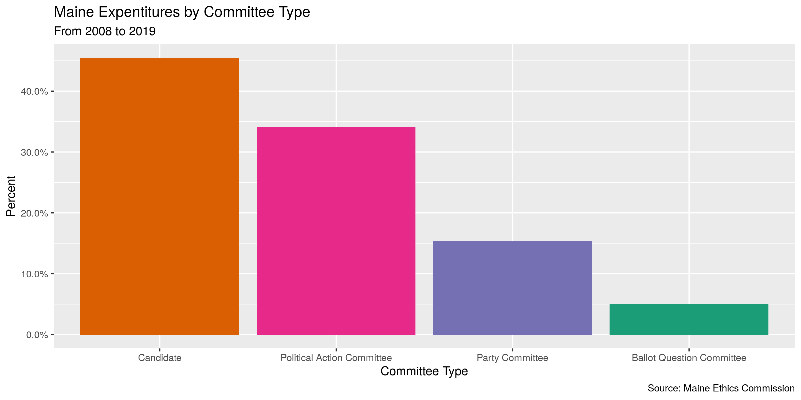
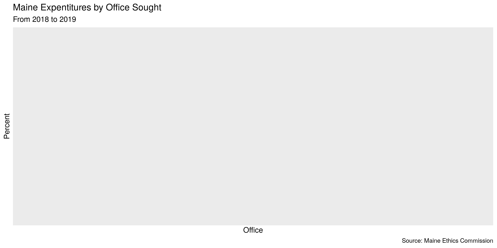
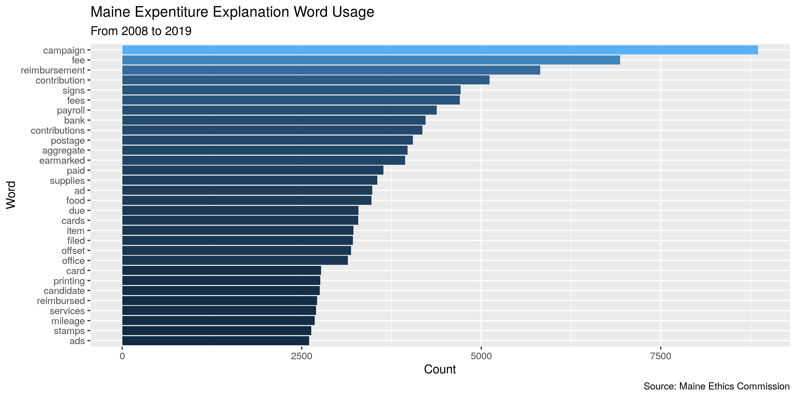
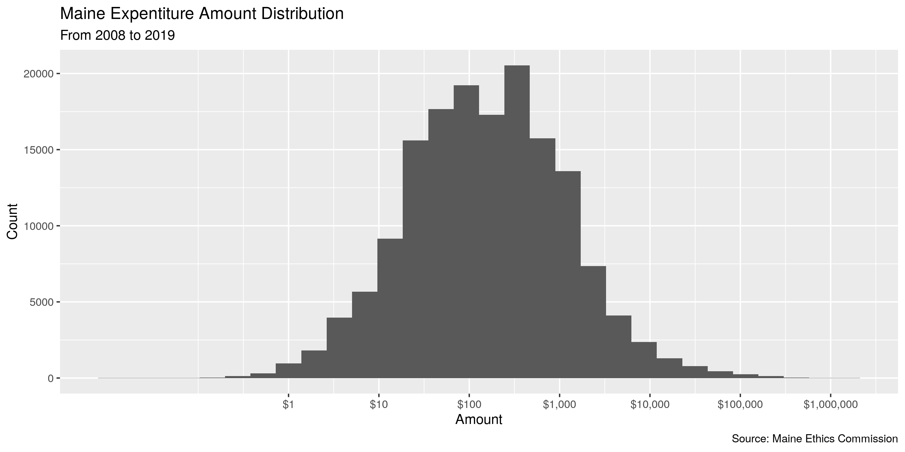
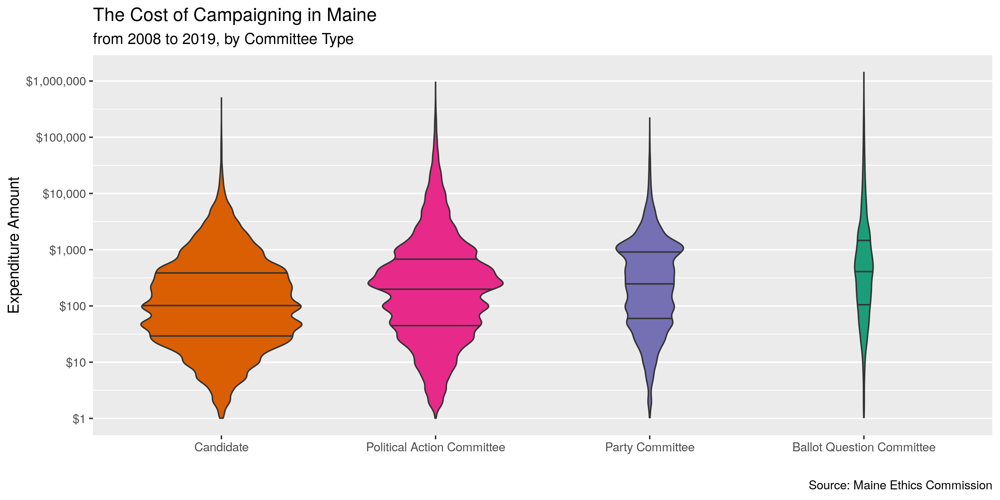

Maine Expenditures
================
Kiernan Nicholls
2019-12-02 16:40:24

  - [Project](#project)
  - [Objectives](#objectives)
  - [Packages](#packages)
  - [Data](#data)
  - [Read](#read)
  - [Explore](#explore)
  - [Wrangle](#wrangle)
  - [Conclude](#conclude)
  - [Export](#export)

## Project

The Accountability Project is an effort to cut across data silos and
give journalists, policy professionals, activists, and the public at
large a simple way to search across huge volumes of public data about
people and organizations.

Our goal is to standardizing public data on a few key fields by thinking
of each dataset row as a transaction. For each transaction there should
be (at least) 3 variables:

1.  All **parties** to a transaction
2.  The **date** of the transaction
3.  The **amount** of money involved

## Objectives

This document describes the process used to complete the following
objectives:

1.  How many records are in the database?
2.  Check for duplicates
3.  Check ranges
4.  Is there anything blank or missing?
5.  Check for consistency issues
6.  Create a five-digit ZIP Code called `ZIP5`
7.  Create a `YEAR` field from the transaction date
8.  Make sure there is data on both parties to a transaction

## Packages

The following packages are needed to collect, manipulate, visualize,
analyze, and communicate these results. The `pacman` package will
facilitate their installation and attachment.

The IRW’s `campfin` package will also have to be installed from GitHub.
This package contains functions custom made to help facilitate the
processing of campaign finance data.

``` r
if (!require("pacman")) install.packages("pacman")
pacman::p_load_gh("irworkshop/campfin")
pacman::p_load(
  snakecase, # change string case
  RSelenium, # remote browser
  tidyverse, # data manipulation
  lubridate, # datetime strings
  tidytext, # text analysis
  magrittr, # pipe opperators
  janitor, # dataframe clean
  batman, # rep(NA, 8) Batman!
  refinr, # cluster and merge
  scales, # format strings
  knitr, # knit documents
  vroom, # read files fast
  glue, # combine strings
  here, # relative storage
  fs # search storage 
)
```

This document should be run as part of the `R_campfin` project, which
lives as a sub-directory of the more general, language-agnostic
[`irworkshop/accountability_datacleaning`](https://github.com/irworkshop/accountability_datacleaning "TAP repo")
GitHub repository.

The `R_campfin` project uses the [RStudio
projects](https://support.rstudio.com/hc/en-us/articles/200526207-Using-Projects "Rproj")
feature and should be run as such. The project also uses the dynamic
`here::here()` tool for file paths relative to *your* machine.

``` r
# where dfs this document knit?
here::here()
#> [1] "/home/kiernan/R/accountability_datacleaning/R_campfin"
```

## Data

Data is obtained from the [Maine Ethics
Commission](https://mainecampaignfinance.com/#/index)

> This page provides comma separated value (CSV) downloads of
> contribution, expenditure, and loan data for each reporting year in a
> zipped file format. These files can be downloaded and imported into
> other applications (Microsoft Excel, Microsoft Access, etc.) This data
> is extracted from the Maine Ethics Commission database as it existed
> as of 08/12/2019 12:34 PM

The Ethics Commission also provides a [PDF file layout
key](https://mainecampaignfinance.com/Template/KeyDownloads/ME%20Expenditures%20File%20Layout.pdf)
that can be used to identify the role of each variable.

  - `ORG ID` is the unique ID of the paying candidate or committee
  - `LEGACY ID` is the unique ID of the recipient candidate of
    committee, for candidates or committees that existed prior to
    7/1/2018 (Old System prior to 7/1/2018)
  - `LAST NAME` is the Last Name of Payee (entity paid), if an
    individual person. If not an individual, the entity full name will
    be in LAST NAME field.

### Download

Expenditures data is separated into annual files. The files can only be
downloaded by clicking on the Data Download link.

``` r
raw_dir <- here("me", "expends", "data", "raw")
dir_create(raw_dir)
```

``` r
# open the driver with auto download options
remote_driver <- rsDriver(
  port = 4444L,
  browser = "firefox",
  extraCapabilities = makeFirefoxProfile(
    list(
      browser.download.dir = raw_dir,
      browser.download.folderList = 2L,
      browser.helperApps.neverAsk.saveToDisk = "text/csv"
    )
  )
)

# navigate to the download site
remote_browser <- remote_driver$client
remote_browser$navigate("https://mainecampaignfinance.com/index.html#/dataDownload")

rows_xpath <- str_c(
  "/html/body/section/div[2]/div[2]/div/div/div[8]/div/div/dir-pagination-controls",
  "/div/div[1]/table/tbody/tr/td[2]/div/select/option[3]"
)

remote_browser$findElement("xpath", rows_xpath)$clickElement()

children <- seq(from = 2, to = 28, by = 2)
selectors <- glue("tr.ng-scope:nth-child({children}) > td:nth-child(3) > a:nth-child(1)")

for (css in selectors) {
  remote_browser$findElement("css", css)$clickElement()
}

# close the browser and driver
remote_browser$close()
remote_driver$server$stop()
```

## Read

``` r
me08 <- scan(file = glue("{raw_dir}/EXP_2008.csv.csv"), sep = ",", what = "", nmax = 21)
me19 <- scan(file = glue("{raw_dir}/EXP_2019.csv.csv"), sep = ",", what = "", nmax = 39)
```

The files come in two structures. For files from 2008 to 2017, there are
21 variables. For the newer files, 2018 and 2019, there are 39
variables.

    #>  [1] "OrgID"             "ExpenditureAmount" "ExpenditureDate"   "LastName"         
    #>  [5] "FirstName"         "MI"                "Suffix"            "Address1"         
    #>  [9] "Address2"          "City"              "State"             "Zip"              
    #> [13] "Explanation"       "ExpenditureID"     "FiledDate"         "Purpose"          
    #> [17] "ExpenditureType"   "CommitteeType"     "CommitteeName"     "CandidateName"    
    #> [21] "Amended"
    #>  [1] "OrgID"                             "LegacyID"                         
    #>  [3] "Committee Name"                    "Candidate Name"                   
    #>  [5] "Committee Office"                  "Committee District"               
    #>  [7] "Committee Party"                   "Committee FinancingType"          
    #>  [9] "Support Oppose CandidateLegacyID"  "Expenditure Amount"               
    #> [11] "Expenditure Date"                  "Office"                           
    #> [13] "District"                          "Last Name"                        
    #> [15] "First Name"                        "Middle Name"                      
    #> [17] "Suffix"                            "Address1"                         
    #> [19] "Address2"                          "City"                             
    #> [21] "State"                             "Zip"                              
    #> [23] "Explanation"                       "Expenditure ID"                   
    #> [25] "Filed Date"                        "Report Name"                      
    #> [27] "Purpose"                           "Expenditure Type"                 
    #> [29] "Committee Type"                    "Amended"                          
    #> [31] "Support/Oppose Ballot Question"    "Support/Oppose Candidate"         
    #> [33] "Ballot Question Number"            "Ballot Question Description/Title"
    #> [35] "Candidate"                         "Candidate Office"                 
    #> [37] "District"                          "Party"                            
    #> [39] "Financing Type"

``` r
to_snake_case(str_replace(me08, "MI", "Middle Name")) %in% to_snake_case(me19)
```

    #>  [1] TRUE TRUE TRUE TRUE TRUE TRUE TRUE TRUE TRUE TRUE TRUE TRUE TRUE TRUE TRUE TRUE TRUE TRUE TRUE
    #> [20] TRUE TRUE

We can read each type of file into a separate data frame and then
combine the two. Any of the new variables. There are 4 rows with a field
containing double quoation marks. This causes `readr::read_delim()` to
incorectly shift values right one column. We have no choice but to
filter out these 4 records or manually edit the text file.

``` r
me_old_format <- 
  dir_ls(raw_dir) %>% 
  extract(1:10) %>% 
  map(
    read_delim,
    delim = ",",
    escape_backslash = FALSE,
    escape_double = FALSE,
    col_types = cols(
      .default = col_character(),
      ExpenditureAmount = col_number(),
      ExpenditureDate = col_date_usa(),
      FiledDate = col_date_usa()
    )
  ) %>% 
  bind_rows() %>% 
  clean_names() %>% 
  remove_empty("cols") %>% 
  rename(middle_name = mi)

me_new_format <- 
  dir_ls(raw_dir) %>% 
  extract(11:12) %>% 
  map(
    read_delim,
    delim = ",",
    escape_backslash = FALSE,
    escape_double = TRUE,
    col_types = cols(
      .default = col_character(),
      `Expenditure Amount` = col_number(),
      `Expenditure Date` = col_date_usa(),
      `Filed Date` = col_date_usa()
    ) 
  ) %>% 
  bind_rows() %>% 
  clean_names() %>% 
  remove_empty("cols") %>% 
  select(seq(-30, -39))

me <- 
  bind_rows(me_old_format, me_new_format) %>% 
  mutate(amended = to_logical(amended)) %>% 
  filter(!is.na(amended))
```

## Explore

``` r
head(me)
```

    #> # A tibble: 6 x 30
    #>   org_id expenditure_amo… expenditure_date last_name first_name middle_name suffix address1
    #>   <chr>             <dbl> <date>           <chr>     <chr>      <chr>       <chr>  <chr>   
    #> 1 1187              600   2008-01-02       Hale & H… <NA>       <NA>        <NA>   4 State…
    #> 2 3512              750   2008-01-02       BLUME     LYDIA      <NA>        <NA>   P.O. BO…
    #> 3 3512              900   2008-01-02       King Rea… <NA>       <NA>        <NA>   198 Sac…
    #> 4 3512               75   2008-01-02       Secretat… <NA>       <NA>        <NA>   123 Mai…
    #> 5 3533               15.7 2008-01-03       Marden's  <NA>       <NA>        <NA>   <NA>    
    #> 6 3533               13.1 2008-01-03       Staples   <NA>       <NA>        <NA>   <NA>    
    #> # … with 22 more variables: address2 <chr>, city <chr>, state <chr>, zip <chr>, explanation <chr>,
    #> #   expenditure_id <chr>, filed_date <date>, purpose <chr>, expenditure_type <chr>,
    #> #   committee_type <chr>, committee_name <chr>, candidate_name <chr>, amended <lgl>,
    #> #   legacy_id <chr>, committee_office <chr>, committee_district <chr>, committee_party <chr>,
    #> #   committee_financing_type <chr>, support_oppose_candidate_legacy_id <chr>, office <chr>,
    #> #   district <chr>, report_name <chr>

``` r
tail(me)
```

    #> # A tibble: 6 x 30
    #>   org_id expenditure_amo… expenditure_date last_name first_name middle_name suffix address1
    #>   <chr>             <dbl> <date>           <chr>     <chr>      <chr>       <chr>  <chr>   
    #> 1 10188            445.   2017-12-31       NATIONBU… <NA>       <NA>        <NA>   520 S G…
    #> 2 10188           -445.   2017-12-31       NATIONBU… <NA>       <NA>        <NA>   520 S G…
    #> 3 10188            495.   2017-12-31       NATIONBU… <NA>       <NA>        <NA>   520 S G…
    #> 4 8661            1092.   2017-12-31       DUSTIN M… <NA>       <NA>        <NA>   62 EVER…
    #> 5 6537               5    2017-12-31       Five Cou… <NA>       <NA>        <NA>   PO Box …
    #> 6 2633               1.98 2017-12-31       ACT BLUE  <NA>       <NA>        <NA>   PO BOX …
    #> # … with 22 more variables: address2 <chr>, city <chr>, state <chr>, zip <chr>, explanation <chr>,
    #> #   expenditure_id <chr>, filed_date <date>, purpose <chr>, expenditure_type <chr>,
    #> #   committee_type <chr>, committee_name <chr>, candidate_name <chr>, amended <lgl>,
    #> #   legacy_id <chr>, committee_office <chr>, committee_district <chr>, committee_party <chr>,
    #> #   committee_financing_type <chr>, support_oppose_candidate_legacy_id <chr>, office <chr>,
    #> #   district <chr>, report_name <chr>

``` r
glimpse(sample_frac(me))
```

    #> Observations: 162,447
    #> Variables: 30
    #> $ org_id                             <chr> "5556", "4519", "7374", "6546", "6123", "3680", "4060…
    #> $ expenditure_amount                 <dbl> 1000.00, 1615.00, 714.00, 27.60, 845.00, 41.00, 135.0…
    #> $ expenditure_date                   <date> 2012-08-10, 2009-10-31, 2014-10-20, 2013-09-25, 2012…
    #> $ last_name                          <chr> "Faulkner", "Gray", "USPS", "USPS", "Hayden Golden", …
    #> $ first_name                         <chr> "Cynthia", "Robb", NA, NA, NA, NA, NA, NA, NA, NA, NA…
    #> $ middle_name                        <chr> NA, NA, NA, NA, NA, NA, NA, NA, NA, NA, NA, NA, NA, N…
    #> $ suffix                             <chr> NA, NA, NA, NA, NA, NA, NA, NA, NA, NA, NA, NA, NA, N…
    #> $ address1                           <chr> NA, "820 First Street, NE", "GREAT FALLS PLAZA", "30 …
    #> $ address2                           <chr> NA, NA, NA, NA, NA, NA, NA, NA, NA, NA, NA, NA, NA, "…
    #> $ city                               <chr> NA, "Washington", "AUBURN", "BRUNSWICK", "Westbrook",…
    #> $ state                              <chr> NA, "DC", "ME", "ME", "ME", NA, NA, "DC", NA, "ME", "…
    #> $ zip                                <chr> NA, "20002", "04210", "04011", "04092", NA, NA, "2000…
    #> $ explanation                        <chr> "consulting", "total monthly salary", "PURCHASED STAM…
    #> $ expenditure_id                     <chr> "84264", "28150", "114949", "84784", "37325", "8776",…
    #> $ filed_date                         <date> 2013-10-08, 2009-12-14, 2014-10-23, 2014-01-15, 2012…
    #> $ purpose                            <chr> "Campaign consultants", "Campaign workers' salaries",…
    #> $ expenditure_type                   <chr> "Monetary (Itemized)", "Monetary (Itemized)", "Moneta…
    #> $ committee_type                     <chr> "Candidate", "Ballot Question Committee", "Candidate"…
    #> $ committee_name                     <chr> NA, "Center on Budget & Policy Priorities", NA, NA, "…
    #> $ candidate_name                     <chr> "Governor Paul R LePage", NA, "R. WAYNE WERTS", "Ralp…
    #> $ amended                            <lgl> FALSE, FALSE, FALSE, FALSE, FALSE, FALSE, FALSE, FALS…
    #> $ legacy_id                          <chr> NA, NA, NA, NA, NA, NA, NA, NA, NA, NA, NA, NA, NA, N…
    #> $ committee_office                   <chr> NA, NA, NA, NA, NA, NA, NA, NA, NA, NA, NA, NA, NA, N…
    #> $ committee_district                 <chr> NA, NA, NA, NA, NA, NA, NA, NA, NA, NA, NA, NA, NA, N…
    #> $ committee_party                    <chr> NA, NA, NA, NA, NA, NA, NA, NA, NA, NA, NA, NA, NA, N…
    #> $ committee_financing_type           <chr> NA, NA, NA, NA, NA, NA, NA, NA, NA, NA, NA, NA, NA, N…
    #> $ support_oppose_candidate_legacy_id <chr> NA, NA, NA, NA, NA, NA, NA, NA, NA, NA, NA, NA, NA, N…
    #> $ office                             <chr> NA, NA, NA, NA, NA, NA, NA, NA, NA, NA, NA, NA, NA, N…
    #> $ district                           <chr> NA, NA, NA, NA, NA, NA, NA, NA, NA, NA, NA, NA, NA, N…
    #> $ report_name                        <chr> NA, NA, NA, NA, NA, NA, NA, NA, NA, NA, NA, NA, NA, N…

### Missing

``` r
glimpse_fun(me, count_na)
```

    #> # A tibble: 30 x 4
    #>    col                                type        n          p
    #>    <chr>                              <chr>   <dbl>      <dbl>
    #>  1 org_id                             <chr>       0 0         
    #>  2 expenditure_amount                 <dbl>       0 0         
    #>  3 expenditure_date                   <date>      0 0         
    #>  4 last_name                          <chr>      15 0.0000923 
    #>  5 first_name                         <chr>  129674 0.798     
    #>  6 middle_name                        <chr>  155336 0.956     
    #>  7 suffix                             <chr>  162129 0.998     
    #>  8 address1                           <chr>   43197 0.266     
    #>  9 address2                           <chr>  156939 0.966     
    #> 10 city                               <chr>   42421 0.261     
    #> 11 state                              <chr>   40374 0.249     
    #> 12 zip                                <chr>   45334 0.279     
    #> 13 explanation                        <chr>   31821 0.196     
    #> 14 expenditure_id                     <chr>       0 0         
    #> 15 filed_date                         <date>      1 0.00000616
    #> 16 purpose                            <chr>       0 0         
    #> 17 expenditure_type                   <chr>       0 0         
    #> 18 committee_type                     <chr>       0 0         
    #> 19 committee_name                     <chr>   73843 0.455     
    #> 20 candidate_name                     <chr>   88604 0.545     
    #> 21 amended                            <lgl>       0 0         
    #> 22 legacy_id                          <chr>  162447 1         
    #> 23 committee_office                   <chr>  162447 1         
    #> 24 committee_district                 <chr>  162447 1         
    #> 25 committee_party                    <chr>  162447 1         
    #> 26 committee_financing_type           <chr>  162447 1         
    #> 27 support_oppose_candidate_legacy_id <chr>  162447 1         
    #> 28 office                             <chr>  162447 1         
    #> 29 district                           <chr>  162447 1         
    #> 30 report_name                        <chr>  162447 1

We can use `campfin::flag_na()` to create a new `na_flag` variable to
flag any record missing a variable needed to identify the parties to a
transaction.

``` r
me <- me %>% 
  mutate(expender_name = coalesce(committee_name, candidate_name)) %>% 
  flag_na(
  expenditure_amount, 
  expenditure_date,
  last_name,
  expender_name
)

sum(me$na_flag)
#> [1] 15
percent(mean(me$na_flag))
#> [1] "0%"
```

### Duplicates

If we ignore the (supposedly) unique `expenditure_id` variable, there
are a number of duplicated records. We can flag every duplicate record
(after the first) with a new `dupe_flag` variable.

``` r
me <- flag_dupes(me, -expenditure_id)
sum(me$dupe_flag)
#> [1] 5205
percent(mean(me$dupe_flag))
#> [1] "3%"
```

    #> # A tibble: 5,205 x 33
    #>    org_id expenditure_amo… expenditure_date last_name first_name middle_name suffix address1
    #>    <chr>             <dbl> <date>           <chr>     <chr>      <chr>       <chr>  <chr>   
    #>  1 639                50.6 2008-01-07       Vonage    <NA>       <NA>        <NA>   www.von…
    #>  2 639                50.6 2008-02-06       Vonage    <NA>       <NA>        <NA>   www.von…
    #>  3 1308               25   2008-03-03       Eapps     <NA>       <NA>        <NA>   3850 Ho…
    #>  4 639                50.6 2008-04-07       Vonage    <NA>       <NA>        <NA>   www.von…
    #>  5 639                78.7 2008-04-07       Staples   <NA>       <NA>        <NA>   Civic C…
    #>  6 638               550   2008-05-01       Maine De… <NA>       <NA>        <NA>   PO Box …
    #>  7 3987                5   2008-05-03       Tobey's … <NA>       <NA>        <NA>   <NA>    
    #>  8 2257               10.5 2008-05-28       Printing  Atkins     <NA>        <NA>   155 Mai…
    #>  9 2257               10.5 2008-05-28       Printing  Atkins     <NA>        <NA>   155 Mai…
    #> 10 3993               31.5 2008-05-28       Rite Aid  <NA>       <NA>        <NA>   <NA>    
    #> # … with 5,195 more rows, and 25 more variables: address2 <chr>, city <chr>, state <chr>,
    #> #   zip <chr>, explanation <chr>, expenditure_id <chr>, filed_date <date>, purpose <chr>,
    #> #   expenditure_type <chr>, committee_type <chr>, committee_name <chr>, candidate_name <chr>,
    #> #   amended <lgl>, legacy_id <chr>, committee_office <chr>, committee_district <chr>,
    #> #   committee_party <chr>, committee_financing_type <chr>,
    #> #   support_oppose_candidate_legacy_id <chr>, office <chr>, district <chr>, report_name <chr>,
    #> #   expender_name <chr>, na_flag <lgl>, dupe_flag <lgl>

Duplicate records are not clearly isolated to a single expenditure year.

``` r
me %>% 
  group_by(year = year(expenditure_date)) %>% 
  summarize(dupes = sum(dupe_flag))
```

    #> # A tibble: 10 x 2
    #>     year dupes
    #>    <dbl> <int>
    #>  1  2008   356
    #>  2  2009   157
    #>  3  2010   453
    #>  4  2011    99
    #>  5  2012  1080
    #>  6  2013    75
    #>  7  2014  1258
    #>  8  2015    48
    #>  9  2016  1610
    #> 10  2017    69

### Categorical

``` r
col_stats(me, n_distinct)
```

    #> # A tibble: 33 x 4
    #>    col                                class       n          p
    #>    <chr>                              <chr>   <int>      <dbl>
    #>  1 org_id                             <chr>    2921 0.0180    
    #>  2 expenditure_amount                 <dbl>   44372 0.273     
    #>  3 expenditure_date                   <date>   3621 0.0223    
    #>  4 last_name                          <chr>   27208 0.167     
    #>  5 first_name                         <chr>    2790 0.0172    
    #>  6 middle_name                        <chr>      47 0.000289  
    #>  7 suffix                             <chr>       8 0.0000492 
    #>  8 address1                           <chr>   21716 0.134     
    #>  9 address2                           <chr>     840 0.00517   
    #> 10 city                               <chr>    2776 0.0171    
    #> 11 state                              <chr>      95 0.000585  
    #> 12 zip                                <chr>    2833 0.0174    
    #> 13 explanation                        <chr>   50895 0.313     
    #> 14 expenditure_id                     <chr>  162447 1         
    #> 15 filed_date                         <date>   2030 0.0125    
    #> 16 purpose                            <chr>      45 0.000277  
    #> 17 expenditure_type                   <chr>       4 0.0000246 
    #> 18 committee_type                     <chr>       4 0.0000246 
    #> 19 committee_name                     <chr>     671 0.00413   
    #> 20 candidate_name                     <chr>    2291 0.0141    
    #> 21 amended                            <lgl>       2 0.0000123 
    #> 22 legacy_id                          <chr>       1 0.00000616
    #> 23 committee_office                   <chr>       1 0.00000616
    #> 24 committee_district                 <chr>       1 0.00000616
    #> 25 committee_party                    <chr>       1 0.00000616
    #> 26 committee_financing_type           <chr>       1 0.00000616
    #> 27 support_oppose_candidate_legacy_id <chr>       1 0.00000616
    #> 28 office                             <chr>       1 0.00000616
    #> 29 district                           <chr>       1 0.00000616
    #> 30 report_name                        <chr>       1 0.00000616
    #> 31 expender_name                      <chr>    2959 0.0182    
    #> 32 na_flag                            <lgl>       2 0.0000123 
    #> 33 dupe_flag                          <lgl>       2 0.0000123

<!-- -->

<!-- -->

<!-- -->

### Continuous

For continuous variables, we should check both the range and
distribution of values for plausability.

#### Amounts

``` r
summary(me$expenditure_amount)
#>       Min.    1st Qu.     Median       Mean    3rd Qu.       Max. 
#> -1418350.0       34.2      145.0     1392.8      541.0  1418350.0
sum(me$expenditure_amount < 0)
#> [1] 3906
percent(mean(me$expenditure_amount < 0))
#> [1] "2%"
```

From this summary, we can see a suspicious similarity between the
minimum expenditure value of `r dollar(min(me$expenditure_amount))` and
the maximum value of `r dollar(max(me$expenditure_amount))`. We can see
that the Mainers for Responsible Gun Ownership Fund committee had to
file an amended report with the `explanation` “Offset due to deletion of
filed item.” The correction is properly flagged with the `amended` value
of `TRUE`. This is a good indication that the `expenditutre_amount`
ranges are reasonable.

``` r
me %>%
  select(
    date = expenditure_date,
    amount = expenditure_amount,
    amended,
    explanation,
    payee = last_name,
    expender = committee_name
  ) %>% 
  filter(
    or(
      amount == min(amount), 
      amount == max(amount)
    )
  )
#> # A tibble: 3 x 6
#>   date         amount amended explanation               payee           expender                   
#>   <date>        <dbl> <lgl>   <chr>                     <chr>           <chr>                      
#> 1 2016-05-31  1418350 TRUE    TV MEDIA AD BUY           GUM SPIRITS PR… Mainers for Responsible Gu…
#> 2 2016-05-31  1418350 FALSE   TV MEDIA AD BUY           GUM SPIRITS PR… Mainers for Responsible Gu…
#> 3 2016-05-31 -1418350 FALSE   Offset due to deletion o… GUM SPIRITS PR… Mainers for Responsible Gu…
```

<!-- -->

<!-- -->

#### Dates

To better explore the distribution of `expenditure_date` values, we can
create a new `expenditure_year` variable using `lubridate::year()`.

``` r
me <- mutate(me, expenditure_year = year(expenditure_date))
```

The `expenditure_date` value is very clean, with 0 records from before
2008-01-02 and 0 records after 2017-12-31.

``` r
prop_na(me$expenditure_date)
#> [1] 0
min(me$expenditure_date)
#> [1] "2008-01-02"
sum(me$expenditure_year < 2000)
#> [1] 0
max(me$expenditure_date)
#> [1] "2017-12-31"
sum(me$expenditure_date > today())
#> [1] 0
```

## Wrangle

To improve the searchability of the database, we will perform some
programatic normalization of geographic data. This is done largely with
the `campfin::normal_*()` functions, wich wrap around a few different
`stringr::str_*()` functions.

### Address

``` r
me <- me %>% 
  unite(
    starts_with("address"),
    col = address_combine,
    sep = " ",
    remove = FALSE,
    na.rm = TRUE
  ) %>% 
  mutate(
    address_norm = normal_address(
      address = address_combine,
      abbs = usps_street,
      na_rep = TRUE
    )
  ) %>% 
  select(-address_combine)
```

    #> # A tibble: 10 x 3
    #>    address1                       address2 address_norm                      
    #>    <chr>                          <chr>    <chr>                             
    #>  1 <NA>                           <NA>     <NA>                              
    #>  2 PO BOX 437                     <NA>     PO BOX 437                        
    #>  3 443 CONGRESS STREET, 3RD FLOOR NONE     443 CONGRESS STREET 3RD FLOOR NONE
    #>  4 HAMMOND STREET                 <NA>     HAMMOND STREET                    
    #>  5 177 WILSON STREET              <NA>     177 WILSON STREET                 
    #>  6 WESTERN AVE                    <NA>     WESTERN AVENUE                    
    #>  7 P.O. Box 336                   <NA>     PO BOX 336                        
    #>  8 31 Birchwood Lane              <NA>     31 BIRCHWOOD LANE                 
    #>  9 125 W 55TH ST                  FL 8     125 WEST 55TH STREET FLOOR 8      
    #> 10 <NA>                           <NA>     <NA>

### ZIP

``` r
me <- me %>% 
  mutate(
    zip_norm = normal_zip(
      zip = zip,
      na_rep = TRUE
    )
  )
```

    #> # A tibble: 2 x 6
    #>   stage    prop_in n_distinct prop_na n_out n_diff
    #>   <chr>      <dbl>      <dbl>   <dbl> <dbl>  <dbl>
    #> 1 zip        0.934       2833   0.279  7707    815
    #> 2 zip_norm   0.995       2248   0.287   608    175

There are still some `zip_norm` values that are invalid. We will leave
these unchanged for now.

``` r
sample(unique(me$zip[which(me$zip_norm %out% valid_zip)]), 20)
#>  [1] "."      "000000" "04802"  "90236"  "83508"  "04432"  "04704"  "04882"  "04828"  "04035" 
#> [11] "04335"  "04025"  "04839"  "03879"  "04598"  "94360"  "04201"  "03139"  "04301"  "04720"
```

### State

``` r
me <- me %>% 
  mutate(
    state_norm = normal_state(
      state = str_replace(state, "^M$", "ME"),
      abbreviate = FALSE,
      na_rep = TRUE,
      na = c("", "NA"),
      valid = valid_state
    )
  )
```

    #> # A tibble: 2 x 6
    #>   stage      prop_in n_distinct prop_na n_out n_diff
    #>   <chr>        <dbl>      <dbl>   <dbl> <dbl>  <dbl>
    #> 1 state        0.975         95   0.249  3080     42
    #> 2 state_norm   1             53   0.261     0      1

### City

``` r
me <- me %>% 
  mutate(
    city_norm = normal_city(
      city = city,
      abbs = usps_city,
      states = c("ME", "DC", "MAINE"),
      na = invalid_city,
      na_rep = TRUE
    )
  )
```

``` r
me <- me %>% 
  rename(city_raw = city) %>% 
  left_join(
    y = zipcodes,
    by = c(
      "state_norm" = "state",
      "zip_norm" = "zip"
    )
  ) %>% 
  rename(city_match = city) %>% 
  mutate(
    match_abb = is_abbrev(city_norm, city_match),
    match_dist = str_dist(city_norm, city_match),
    city_swap = if_else(
      condition = match_abb | match_dist <= 2,
      true = city_match,
      false = city_norm
    )
  ) %>% 
  select(
    -city_match,
    -match_abb,
    -match_dist
  )
```

    #> # A tibble: 3 x 6
    #>   stage     prop_in n_distinct prop_na n_out n_diff
    #>   <chr>       <dbl>      <dbl>   <dbl> <dbl>  <dbl>
    #> 1 city_raw    0.595       2776   0.261 48635   1787
    #> 2 city_norm   0.978       1758   0.269  2619    538
    #> 3 city_swap   0.994       1339   0.297   736    152

## Conclude

1.  There are 162447 records in the database.
2.  There are 5205 (3%) duplicate records in the database, flagged with
    `dupe_flag`.
3.  The range and distribution of `expenditure_amount` and
    `expenditure_date` seem reasonable.
4.  There are 15 (0%) records missing either the amount, date, payee, or
    expender. Most from 2018.
5.  Consistency in goegraphic data has been improved with
    `campfin::normal_*()`.
6.  The 5-digit `zip_norm` variable has been created with
    `campfin::normal_zip(me$zip)`.
7.  The 4-digit `expenditure_year` variable has been created with
    `lubridate::year(me$expenditure_date)`.

## Export

``` r
proc_dir <- here("me", "expends", "data", "processed")
dir_create(proc_dir)
```

``` r
lookup_file <- here("me", "expends", "data", "me_city_lookup.csv")
if (file_exists(lookup_file)) {
  lookup <- 
    read_csv(lookup_file) %>% 
    select(1:2) %>% 
    rename_all(str_to_lower)
  me <- left_join(me, lookup)
  progress_table(
    me$city_swap, 
    me$city_clean, 
    compare = valid_city
  )
  me <- select(me, -city_swap)
}
```

``` r
proc_file <- glue("{proc_dir}/me_expends_clean.csv")
write_csv(
  x = me,
  path = proc_file,
  na = ""
)
```
