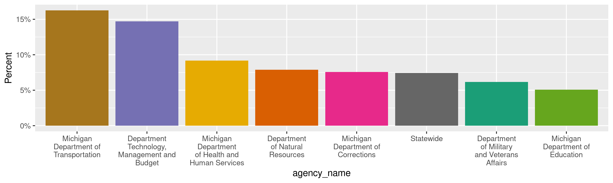
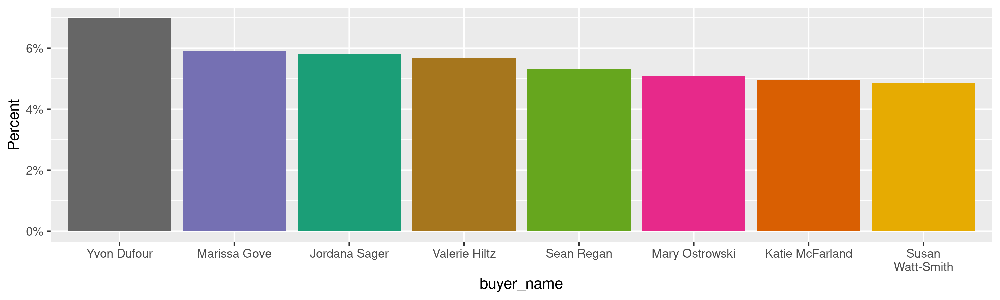
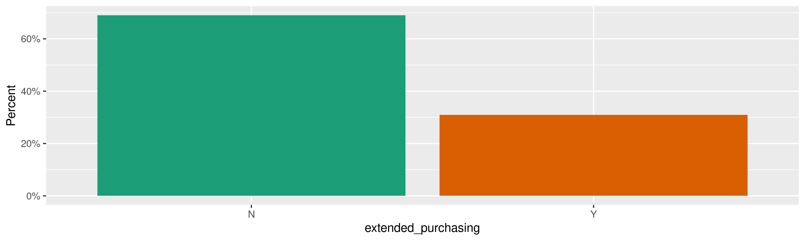
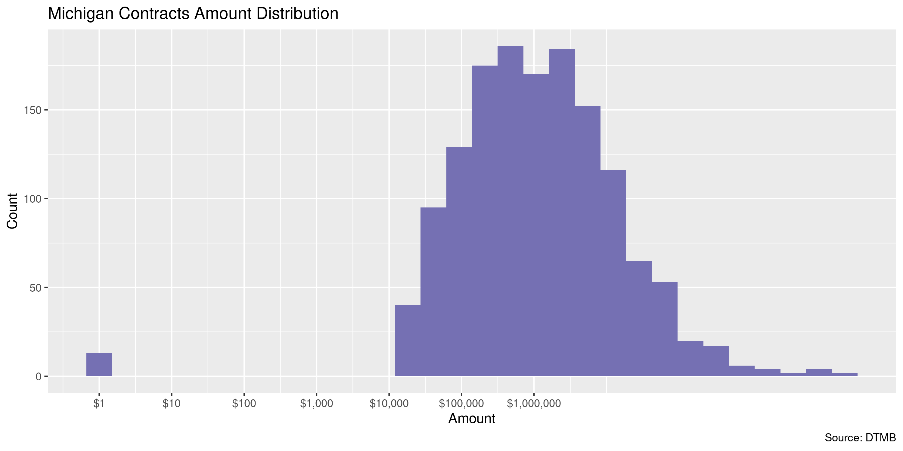
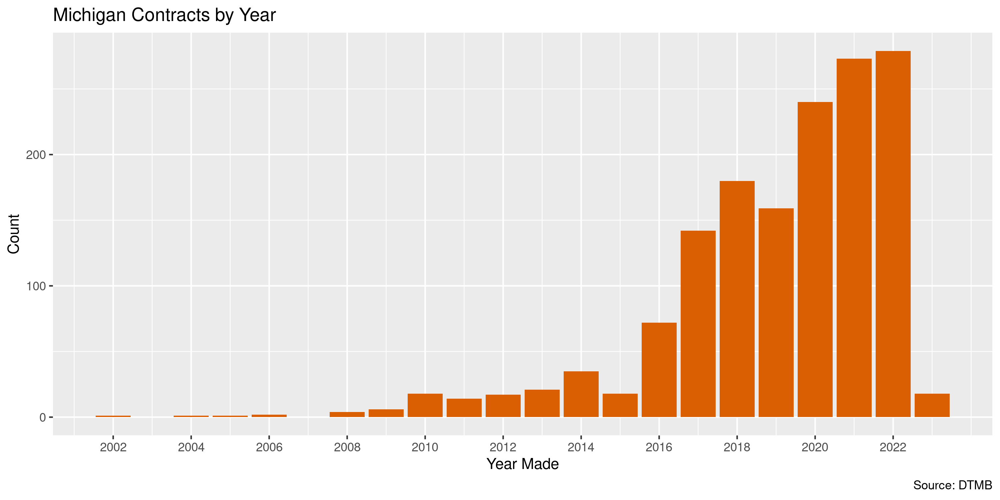

Michigan Contracts
================
Kiernan Nicholls
Tue Feb 21 13:46:42 2023

- <a href="#project" id="toc-project">Project</a>
- <a href="#objectives" id="toc-objectives">Objectives</a>
- <a href="#packages" id="toc-packages">Packages</a>
- <a href="#source" id="toc-source">Source</a>
- <a href="#about" id="toc-about">About</a>
- <a href="#download" id="toc-download">Download</a>
- <a href="#read" id="toc-read">Read</a>
- <a href="#explore" id="toc-explore">Explore</a>
  - <a href="#missing" id="toc-missing">Missing</a>
  - <a href="#duplicates" id="toc-duplicates">Duplicates</a>
  - <a href="#categorical" id="toc-categorical">Categorical</a>
  - <a href="#amounts" id="toc-amounts">Amounts</a>
  - <a href="#dates" id="toc-dates">Dates</a>
- <a href="#wrangle" id="toc-wrangle">Wrangle</a>
- <a href="#conclude" id="toc-conclude">Conclude</a>
- <a href="#export" id="toc-export">Export</a>
- <a href="#upload" id="toc-upload">Upload</a>

<!-- Place comments regarding knitting here -->

## Project

The Accountability Project is an effort to cut across data silos and
give journalists, policy professionals, activists, and the public at
large a simple way to search across huge volumes of public data about
people and organizations.

Our goal is to standardize public data on a few key fields by thinking
of each dataset row as a transaction. For each transaction there should
be (at least) 3 variables:

1.  All **parties** to a transaction.
2.  The **date** of the transaction.
3.  The **amount** of money involved.

## Objectives

This document describes the process used to complete the following
objectives:

1.  How many records are in the database?
2.  Check for entirely duplicated records.
3.  Check ranges of continuous variables.
4.  Is there anything blank or missing?
5.  Check for consistency issues.
6.  Create a five-digit ZIP Code called `zip`.
7.  Create a `year` field from the transaction date.
8.  Make sure there is data on both parties to a transaction.

## Packages

The following packages are needed to collect, manipulate, visualize,
analyze, and communicate these results. The `pacman` package will
facilitate their installation and attachment.

``` r
if (!require("pacman")) {
  install.packages("pacman")
}
pacman::p_load(
  tidyverse, # data manipulation
  lubridate, # datetime strings
  gluedown, # printing markdown
  jsonlite, # read json files
  janitor, # clean data frames
  campfin, # custom irw tools
  aws.s3, # aws cloud storage
  readxl, # read excel files
  refinr, # cluster & merge
  scales, # format strings
  knitr, # knit documents
  rvest, # scrape html
  glue, # code strings
  here, # project paths
  httr, # http requests
  fs # local storage 
)
```

This diary was run using `campfin` version 1.0.9.

``` r
packageVersion("campfin")
#> [1] '1.0.9'
```

This document should be run as part of the `R_tap` project, which lives
as a sub-directory of the more general, language-agnostic
[`irworkshop/accountability_datacleaning`](https://github.com/irworkshop/accountability_datacleaning)
GitHub repository.

The `R_tap` project uses the [RStudio
projects](https://support.rstudio.com/hc/en-us/articles/200526207-Using-Projects)
feature and should be run as such. The project also uses the dynamic
`here::here()` tool for file paths relative to *your* machine.

``` r
# where does this document knit?
here::i_am("state/mi/contracts/docs/mi_contracts_diary.Rmd")
```

## Source

Michigan state contracts are obtained from the state Department of
Technology, Management & Budget on that [Contract Connect
website](https://www.michigan.gov/dtmb/procurement/contractconnect).

> #### Welcome to Contract Connect!
>
> Contract Connect is State of Michigan Procurement’s primary website.
> Contract Connect is where we connect the vendor community to the
> resources they need to do bid on projects and do business with the
> State of Michigan.
>
> #### About State of Michigan Procurement
>
> State of Michigan Procurement is the State of Michigan’s central
> purchasing office and serves as the Department of Technology,
> Management and Budget’s (DTMB) central purchasing authority.
> Procurement handles all aspects of high-level, complex bids so the
> State’s agencies can achieve their missions and get the best value
> possible for Michigan’s residents.
>
> Our policies and procedures for purchasing across State departments in
> accordance with the Management and Budget Act.

## About

> #### DTMB-Procurement Contract List Explained
>
> The DTMB-Procurement Contract List, which is updated on a weekly
> basis, is the Department of Technology, Management and Budget’s (DTMB)
> contract portfolio.
>
> The list includes contracts executed by DTMB-Procurement, as well as
> some multi-year contracts executed by agencies under delegated
> authority. It is important to note that the dollar amounts shown for
> each multi-year contract are estimates only, and are not necessarily
> reflective of the actual spend, which is typically less.

> The list contains the following information:
>
> - The contract number,  
> - A link to the actual contract (click the “Open Contract” or “Open
>   MiDEAL Contract” link)  
> - The state department that requires the goods and services covered in
>   the contract  
> - The name of the current vendor  
> - A brief description of the goods and services covered in the
>   contract  
> - The multi-year spend estimate for the contract (the cumulative value
>   of the contract since its effective date). This is the maximum that
>   can be spent; not actual dollars spent.  
> - The current expiration date for the contract, which may change if
>   option years are exercised.

> Additional information:
>
> - Most contracts include base years and option years. The initial
>   contract period (base years) is typically three to five years. The
>   number of option years varies by contract, and they may or may not
>   be exercised. To determine whether a contract will be bid, or an
>   option will be exercised, contact the buyer on the cover sheet of
>   the contract.  
> - A contract may not be rebid because there will not be a future or
>   on-going need for the commodity or service.  
> - Delegated authority: Contracts may be handled by departments other
>   than Technology, Management & Budget due to delegated purchasing
>   authority granted to them via statute or policy/procedure.

## Download

The DTMB Central Procurement Contract List (Excel) can be installed as
an Excel file.

``` r
raw_url <- "https://www.michigan.gov/documents/web_contract_12037_7.xls"
raw_dir <- dir_create(here("state", "mi", "contracts", "data", "raw"))
raw_xls <- path(raw_dir, basename(raw_url))
```

``` r
if (!file_exists(raw_xls)) {
  download.file(raw_url, raw_xls)
}
```

## Read

That Excel file can then be read as a data frame.

``` r
mic <- read_excel(
  path = raw_xls,
  sheet = excel_sheets(raw_xls)[2],
  .name_repair = make_clean_names
)
```

``` r
mic <- mic %>% 
  mutate(
    across(where(is.POSIXct), as_date)
  )
```

## Explore

There are 1,501 rows of 13 columns. Each record represents a single
contract between the state of Michigan and a vendor.

``` r
glimpse(mic)
#> Rows: 1,501
#> Columns: 13
#> $ contract_number     <chr> "220000001309", "200000001779", "220000001365", "200000000679", "200000000675", "200000000…
#> $ link                <chr> "Contract Link", "Contract Link", "Contract Link", "Contract Link", "Contract Link", "Cont…
#> $ vendor_name         <chr> "Diane Dukes, Inc.", "Michigan 2-1-1", "CHANCE FOR LIFE ORGANIZATION", "E2 Enterprises, LL…
#> $ vendor_id           <chr> "VS0046096", "CV0001195", "CV0001798", NA, NA, NA, "VS0091089", "VS0185899", "CV0036059", …
#> $ description         <chr> "2022-23 Wetland Tree Planting", "2-1-1 Statewide Support", "220000001365-Chance For Life"…
#> $ cumulative_value    <dbl> 232000, 24013465, NA, 225875, 351765, 170100, NA, 2062584, 4324645, 685000, 5505000, 23764…
#> $ expiration_date     <date> 2023-10-09, 2024-09-30, 2023-09-30, 2023-04-20, 2023-04-19, 2023-04-19, 2024-05-23, 2024-…
#> $ effective_date      <date> 2022-10-10, 2020-10-01, 2022-08-12, 2020-04-20, 2020-04-20, 2020-04-20, 2021-05-24, 2021-…
#> $ agency_name         <chr> "Michigan Department of Transportation", "Multiple", "Michigan Department of Corrections",…
#> $ buyer_name          <chr> NA, "Jordana Sager", NA, NA, NA, NA, NA, NA, "Sarah Platte", "Jarrod Barron", "Jeremy  Lyo…
#> $ buyer_email         <chr> NA, "sagerj2@michigan.gov", NA, NA, NA, NA, NA, NA, "plattes3@michigan.gov", "BarronJ1@mic…
#> $ buyer_phone_number  <chr> NA, "(517) 896-1903", NA, NA, NA, NA, NA, NA, "517-219-2406", "(517) 249-0406", "(517) 230…
#> $ extended_purchasing <chr> "N", "N", NA, "N", "N", "N", NA, "N", "N", "N", "N", "N", "N", "Y", "Y", "Y", "N", "Y", "Y…
tail(mic)
#> # A tibble: 6 × 13
#>   contract_number link     vendo…¹ vendo…² descr…³ cumul…⁴ expirati…⁵ effectiv…⁶ agenc…⁷ buyer…⁸ buyer…⁹ buyer…˟ exten…˟
#>   <chr>           <chr>    <chr>   <chr>   <chr>     <dbl> <date>     <date>     <chr>   <chr>   <chr>   <chr>   <chr>  
#> 1 220000001141    Contrac… G&S Wi… VS0144… Window…  6.48e4 2025-07-14 2022-07-15 Michig… <NA>    <NA>    <NA>    N      
#> 2 200000000034    Contrac… TRUCK … CV0030… Winter…  2   e7 2024-11-30 2019-10-22 Michig… Yvon D… dufour… (517) … Y      
#> 3 210000000680    Contrac… T-Mobi… VS0133… Wirele…  2.25e5 2024-08-11 2021-04-01 Depart… Lisa S… Spitzl… (517) … Y      
#> 4 220000001545    Contrac… MIchig… VS0099… WLD wo…  1.00e5 2023-09-30 2022-10-01 Depart… <NA>    <NA>    <NA>    N      
#> 5 180000001231    Contrac… The Ch… <NA>    Workbo…  6.49e5 2023-09-24 2018-09-25 Michig… <NA>    <NA>    <NA>    N      
#> 6 084B7700001     Contrac… STATE … <NA>    Workfo…  1.92e5 2023-06-30 2011-03-01 Depart… <NA>    <NA>    <NA>    N      
#> # … with abbreviated variable names ¹​vendor_name, ²​vendor_id, ³​description, ⁴​cumulative_value, ⁵​expiration_date,
#> #   ⁶​effective_date, ⁷​agency_name, ⁸​buyer_name, ⁹​buyer_email, ˟​buyer_phone_number, ˟​extended_purchasing
```

### Missing

Columns vary in their degree of missing values.

``` r
col_stats(mic, count_na)
#> # A tibble: 13 × 4
#>    col                 class      n        p
#>    <chr>               <chr>  <int>    <dbl>
#>  1 contract_number     <chr>      0 0       
#>  2 link                <chr>      7 0.00466 
#>  3 vendor_name         <chr>      1 0.000666
#>  4 vendor_id           <chr>    158 0.105   
#>  5 description         <chr>      0 0       
#>  6 cumulative_value    <dbl>     31 0.0207  
#>  7 expiration_date     <date>     0 0       
#>  8 effective_date      <date>     0 0       
#>  9 agency_name         <chr>      6 0.00400 
#> 10 buyer_name          <chr>    656 0.437   
#> 11 buyer_email         <chr>    656 0.437   
#> 12 buyer_phone_number  <chr>    656 0.437   
#> 13 extended_purchasing <chr>     44 0.0293
```

We can flag any record missing a key variable needed to identify a
transaction.

``` r
key_vars <- c("effective_date", "agency_name", "cumulative_value", "vendor_name")
mic <- flag_na(mic, all_of(key_vars))
sum(mic$na_flag)
#> [1] 32
```

``` r
mic %>% 
  filter(na_flag) %>% 
  select(all_of(key_vars))
#> # A tibble: 32 × 4
#>    effective_date agency_name                                      cumulative_value vendor_name                         
#>    <date>         <chr>                                                       <dbl> <chr>                               
#>  1 2022-08-12     Michigan Department of Corrections                            NA  CHANCE FOR LIFE ORGANIZATION        
#>  2 2021-05-24     Department of Natural Resources                               NA  Litchfield Field Mowing Brush Trimm…
#>  3 2012-02-08     Department Technology, Management and Budget             4352161. <NA>                                
#>  4 2021-06-30     Michigan Department of Health and Human Services              NA  Advocates for Human Potential, Inc. 
#>  5 2022-04-22     Department of Natural Resources                               NA  OPERATIONS SERVICES INC             
#>  6 2023-02-01     Department of Military and Veterans Affairs                   NA  ENERCO CORPORATION                  
#>  7 2021-01-11     Department of Military and Veterans Affairs                   NA  SANI-VAC SERVICE INC                
#>  8 2019-06-17     Department of Natural Resources                               NA  STEIGERWALDT LAND SERVICES INC      
#>  9 2020-10-01     <NA>                                                          NA  LISA MYLES                          
#> 10 2020-08-01     Department of Military and Veterans Affairs                   NA  Atlantic Diving Supply              
#> # … with 22 more rows
```

### Duplicates

We can also flag any record completely duplicated across every column.

``` r
mic <- flag_dupes(mic, -contract_number)
```

There are no duplicate records.

### Categorical

``` r
col_stats(mic, n_distinct)
#> # A tibble: 14 × 4
#>    col                 class      n       p
#>    <chr>               <chr>  <int>   <dbl>
#>  1 contract_number     <chr>   1501 1      
#>  2 link                <chr>      2 0.00133
#>  3 vendor_name         <chr>   1215 0.809  
#>  4 vendor_id           <chr>   1047 0.698  
#>  5 description         <chr>   1214 0.809  
#>  6 cumulative_value    <dbl>   1163 0.775  
#>  7 expiration_date     <date>   409 0.272  
#>  8 effective_date      <date>   600 0.400  
#>  9 agency_name         <chr>     24 0.0160 
#> 10 buyer_name          <chr>     27 0.0180 
#> 11 buyer_email         <chr>     27 0.0180 
#> 12 buyer_phone_number  <chr>     27 0.0180 
#> 13 extended_purchasing <chr>      3 0.00200
#> 14 na_flag             <lgl>      2 0.00133
```

<!-- --><!-- --><!-- -->

### Amounts

``` r
# fix floating point precision
mic$cumulative_value <- round(mic$cumulative_value, digits = 2)
```

``` r
summary(mic$cumulative_value)
#>      Min.   1st Qu.    Median      Mean   3rd Qu.      Max.      NA's 
#> 0.000e+00 1.952e+05 9.619e+05 7.046e+07 5.143e+06 1.937e+10        31
mean(mic$cumulative_value <= 0, na.rm = TRUE)
#> [1] 0.02517007
```

These are the records with the minimum and maximum amounts.

``` r
glimpse(mic[c(which.max(mic$cumulative_value), which.min(mic$cumulative_value)), ])
#> Rows: 2
#> Columns: 14
#> $ contract_number     <chr> "071B6600028", "220000001294"
#> $ link                <chr> "Contract Link", "Contract Link"
#> $ vendor_name         <chr> "MERIDIAN HEALTH PLAN OF MICHIGAN", "Velocity Management Solutions, LLC"
#> $ vendor_id           <chr> "CV0039292", "VS0196652"
#> $ description         <chr> "Comprehensive Health Care Program - DHHS (Regions 2-10)", "Camp Grayling Outside Entity R…
#> $ cumulative_value    <dbl> 19366106108, 0
#> $ expiration_date     <date> 2024-09-30, 2023-12-31
#> $ effective_date      <date> 2016-01-01, 2022-09-29
#> $ agency_name         <chr> "Michigan Department of Health and Human Services", "Department of Military and Veterans A…
#> $ buyer_name          <chr> "Brandon Samuel", NA
#> $ buyer_email         <chr> "SamuelB@michigan.gov", NA
#> $ buyer_phone_number  <chr> "(517) 249-0439", NA
#> $ extended_purchasing <chr> "N", "N"
#> $ na_flag             <lgl> FALSE, FALSE
```

The distribution of amount values are typically log-normal.

<!-- -->

There are a number of contracts for a single U.S. dollar.

``` r
mic %>% 
  filter(cumulative_value == 1)
#> # A tibble: 13 × 14
#>    contrac…¹ link  vendo…² vendo…³ descr…⁴ cumul…⁵ expirati…⁶ effectiv…⁷ agenc…⁸ buyer…⁹ buyer…˟ buyer…˟ exten…˟ na_flag
#>    <chr>     <chr> <chr>   <chr>   <chr>     <dbl> <date>     <date>     <chr>   <chr>   <chr>   <chr>   <chr>   <lgl>  
#>  1 071B5200… Cont… UNSPAM… CV0013… Child …       1 2023-08-31 2005-06-08 Depart… Jeremy… lyonj5… (517) … N       FALSE  
#>  2 21000000… Cont… Achill… VS0097… Indepe…       1 2026-01-24 2021-01-25 Depart… Jordan… sagerj… (517) … Y       FALSE  
#>  3 21000000… Cont… CyberF… CV0039… Indepe…       1 2026-01-24 2021-01-25 Depart… Jordan… sagerj… (517) … Y       FALSE  
#>  4 21000000… Cont… Konica… CV0001… Indepe…       1 2026-01-24 2021-01-25 Depart… Jordan… sagerj… (517) … Y       FALSE  
#>  5 21000000… Cont… MERIT … CV0025… Indepe…       1 2026-01-24 2021-01-25 Depart… Jordan… sagerj… (517) … Y       FALSE  
#>  6 21000000… Cont… OpTech… CV0043… Indepe…       1 2026-01-24 2021-01-25 Depart… Jordan… sagerj… (517) … Y       FALSE  
#>  7 21000000… Cont… THE RE… CV0045… Indepe…       1 2026-01-24 2021-01-25 Depart… Jordan… sagerj… (517) … Y       FALSE  
#>  8 21000000… Cont… RSI Sy… VS0151… Indepe…       1 2026-01-24 2021-01-25 Depart… Jordan… sagerj… (517) … Y       FALSE  
#>  9 21000000… Cont… Secure… VC0000… Indepe…       1 2026-01-24 2021-01-25 Depart… Jordan… sagerj… (517) … Y       FALSE  
#> 10 21000000… Cont… UHY LLP CV0022… Indepe…       1 2026-01-24 2021-01-25 Depart… Jordan… sagerj… (517) … Y       FALSE  
#> 11 20000000… Cont… TITLE … CV0043… Proper…       1 2024-10-31 2019-11-01 Depart… <NA>    <NA>    <NA>    N       FALSE  
#> 12 071B4300… Cont… PERSPE… VC0001… RSS_II…       1 2030-06-01 2014-06-01 Depart… Sarah … platte… 517-21… N       FALSE  
#> 13 071B7700… Cont… Feldma… CV0003… Vehicl…       1 2023-11-30 2017-08-01 Statew… Yvon D… dufour… (517) … Y       FALSE  
#> # … with abbreviated variable names ¹​contract_number, ²​vendor_name, ³​vendor_id, ⁴​description, ⁵​cumulative_value,
#> #   ⁶​expiration_date, ⁷​effective_date, ⁸​agency_name, ⁹​buyer_name, ˟​buyer_email, ˟​buyer_phone_number,
#> #   ˟​extended_purchasing
```

### Dates

We can add the calendar year from `date` with `lubridate::year()`

``` r
mic <- mutate(mic, effective_year = year(effective_date))
```

``` r
min(mic$effective_date)
#> [1] "2002-12-20"
sum(mic$effective_year < 2000)
#> [1] 0
max(mic$effective_date)
#> [1] "2023-02-09"
sum(mic$effective_date > today())
#> [1] 0
```

It’s common to see an increase in the number of contracts in elections
years.

<!-- -->

## Wrangle

``` r
mic <- mutate(mic, agency_state = "MI")
```

## Conclude

``` r
glimpse(sample_n(mic, 1000))
#> Rows: 1,000
#> Columns: 16
#> $ contract_number     <chr> "190000000886", "180000001170", "071B2200116", "190000000503", "220000000902", "2000000003…
#> $ link                <chr> "Contract Link", "Contract Link", "Contract Link", "Contract Link", "Contract Link", "Cont…
#> $ vendor_name         <chr> "SUN VALLEY FOODS COMPANY", "R&K SERVICES INC", "IDENTISYS INCORPORATED", "INTERNATIONAL R…
#> $ vendor_id           <chr> "VC0001660", "CV0044597", "CV0050478", NA, "VS0083913", "AGCY027", "CV0035945", "CV0007263…
#> $ description         <chr> "MDOC Food and Food Service Products", "Janitorial Services at the MDARD's Atlanta office"…
#> $ cumulative_value    <dbl> 133470300.00, 82965.00, 5880971.49, 3450600.00, 2448170.00, 69192.00, 1945125.00, 2712936.…
#> $ expiration_date     <date> 2024-08-31, 2024-08-31, 2030-01-16, 2023-10-31, 2025-05-31, 2023-12-31, 2023-09-30, 2023-…
#> $ effective_date      <date> 2019-07-01, 2018-09-01, 2012-01-17, 2019-04-01, 2022-06-01, 2019-12-18, 2020-10-01, 2018-…
#> $ agency_name         <chr> "Michigan Department of Corrections", "Department of Agriculture and Rural Development", "…
#> $ buyer_name          <chr> "Valerie Hiltz", NA, "Valerie Hiltz", NA, "Nichole Harrell", NA, NA, "Valerie Hiltz", "Sar…
#> $ buyer_email         <chr> "hiltzv@michigan.gov", NA, "hiltzv@michigan.gov", NA, "harrelln@michigan.gov", NA, NA, "hi…
#> $ buyer_phone_number  <chr> "(517) 249-0459", NA, "(517) 249-0459", NA, "517-636-0313", NA, NA, "(517) 249-0459", "517…
#> $ extended_purchasing <chr> "N", "N", "N", "N", "N", "N", "N", "N", "N", "N", "N", "N", "N", "Y", "N", "N", "Y", "N", …
#> $ na_flag             <lgl> FALSE, FALSE, FALSE, FALSE, FALSE, FALSE, FALSE, FALSE, FALSE, FALSE, FALSE, FALSE, FALSE,…
#> $ effective_year      <dbl> 2019, 2018, 2012, 2019, 2022, 2019, 2020, 2018, 2018, 2018, 2019, 2022, 2021, 2022, 2022, …
#> $ agency_state        <chr> "MI", "MI", "MI", "MI", "MI", "MI", "MI", "MI", "MI", "MI", "MI", "MI", "MI", "MI", "MI", …
```

1.  There are 1,501 records in the database.
2.  There are 0 duplicate records in the database.
3.  The range and distribution of `amount` and `date` seem reasonable.
4.  There are 32 records missing key variables.
5.  Consistency in geographic data has been improved with
    `campfin::normal_*()`.
6.  The 4-digit `year` variable has been created with
    `lubridate::year()`.

## Export

Now the file can be saved on disk for upload to the Accountability
server. We will name the object using a date range of the records
included.

``` r
min_dt <- str_remove_all(min(mic$effective_date), "-")
max_dt <- str_remove_all(max(mic$effective_date), "-")
csv_ts <- paste(min_dt, max_dt, sep = "-")
```

``` r
clean_dir <- dir_create(here("state", "mi", "contracts", "data", "clean"))
clean_csv <- path(clean_dir, glue("mi_contracts_{csv_ts}.csv"))
clean_rds <- path_ext_set(clean_csv, "rds")
basename(clean_csv)
#> [1] "mi_contracts_20021220-20230209.csv"
```

``` r
write_csv(mic, clean_csv, na = "")
write_rds(mic, clean_rds, compress = "xz")
(clean_size <- file_size(clean_csv))
#> 327K
```

## Upload

We can use the `aws.s3::put_object()` to upload the text file to the IRW
server.

``` r
aws_key <- path("csv", basename(clean_csv))
if (!object_exists(aws_key, "publicaccountability")) {
  put_object(
    file = clean_csv,
    object = aws_key, 
    bucket = "publicaccountability",
    acl = "public-read",
    show_progress = TRUE,
    multipart = TRUE
  )
}
aws_head <- head_object(aws_key, "publicaccountability")
(aws_size <- as_fs_bytes(attr(aws_head, "content-length")))
unname(aws_size == clean_size)
```
