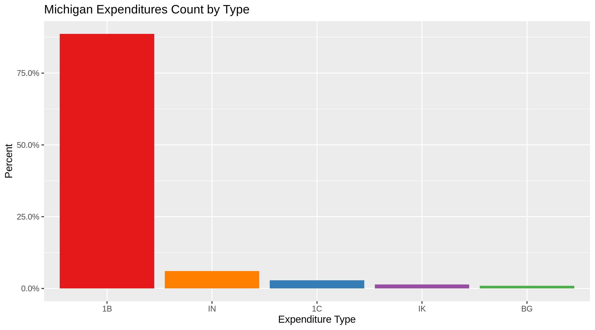
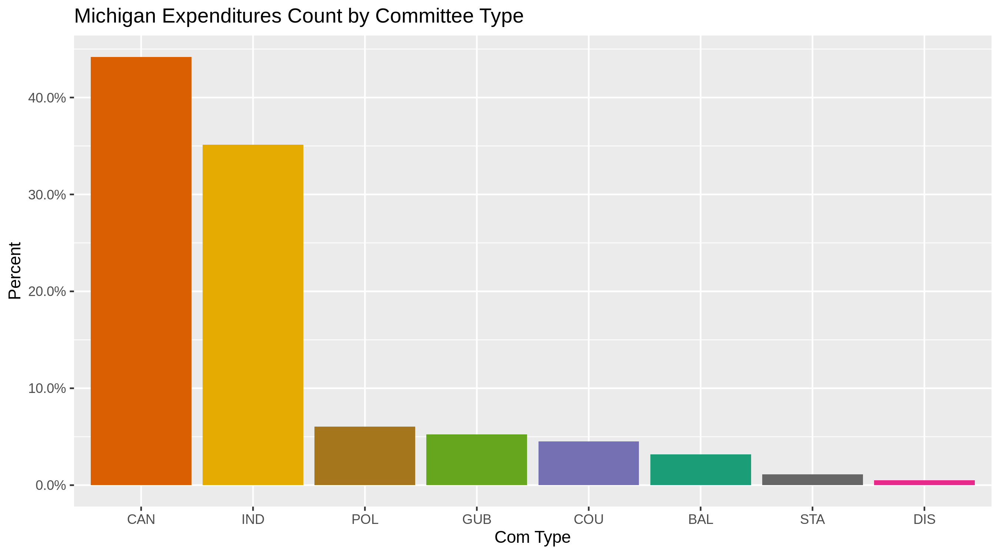
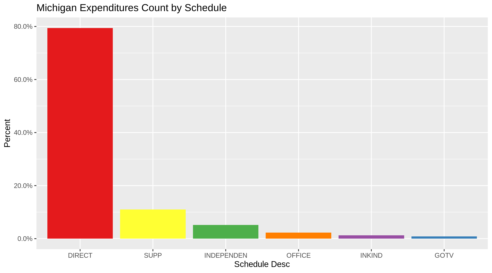
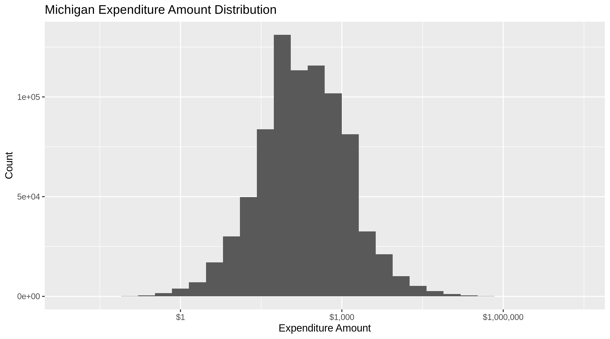
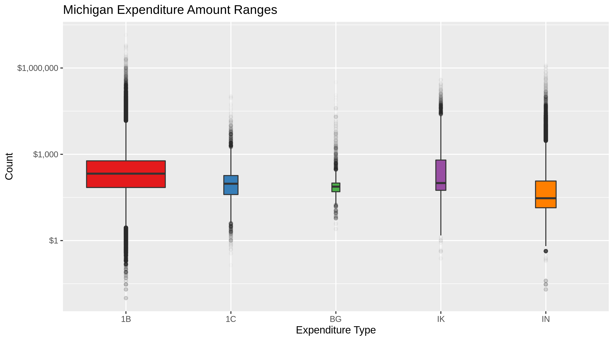
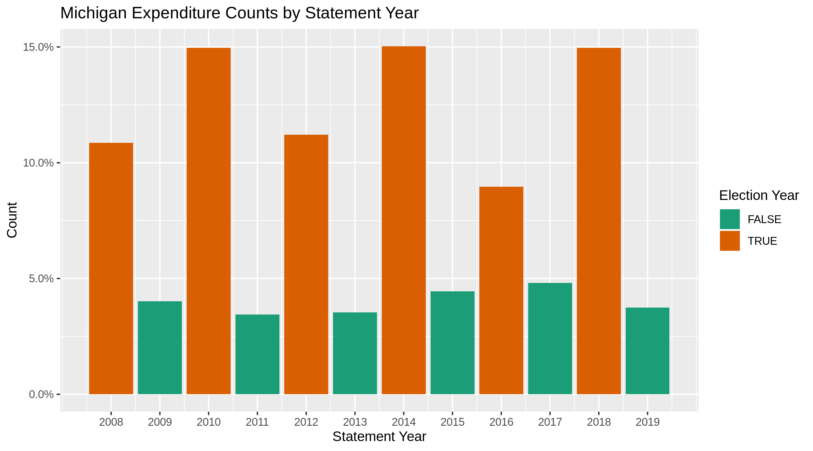
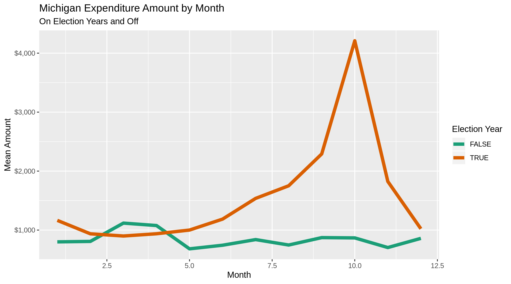
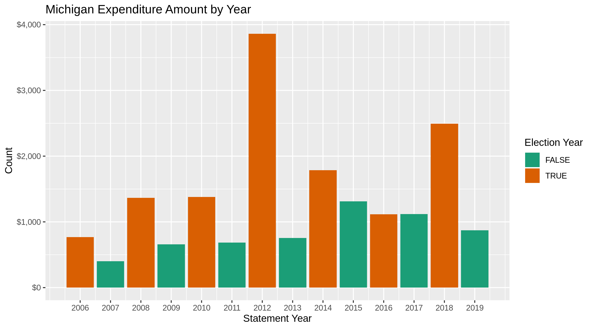

Michigan Expenditures
================
Kiernan Nicholls
2022-11-13 13:46:14

-   <a href="#project" id="toc-project">Project</a>
-   <a href="#objectives" id="toc-objectives">Objectives</a>
-   <a href="#packages" id="toc-packages">Packages</a>
-   <a href="#data" id="toc-data">Data</a>
-   <a href="#import" id="toc-import">Import</a>
-   <a href="#explore" id="toc-explore">Explore</a>
-   <a href="#wrangle" id="toc-wrangle">Wrangle</a>
-   <a href="#conclude" id="toc-conclude">Conclude</a>
-   <a href="#export" id="toc-export">Export</a>
-   <a href="#upload" id="toc-upload">Upload</a>

## Project

The Accountability Project is an effort to cut across data silos and
give journalists, policy professionals, activists, and the public at
large a simple way to search across huge volumes of public data about
people and organizations.

Our goal is to standardizing public data on a few key fields by thinking
of each dataset row as a transaction. For each transaction there should
be (at least) 3 variables:

1.  All **parties** to a transaction
2.  The **date** of the transaction
3.  The **amount** of money involved

## Objectives

This document describes the process used to complete the following
objectives:

1.  How many records are in the database?
2.  Check for duplicates
3.  Check ranges
4.  Is there anything blank or missing?
5.  Check for consistency issues
6.  Create a five-digit ZIP Code called `ZIP5`
7.  Create a `YEAR` field from the transaction date
8.  Make sure there is data on both parties to a transaction

## Packages

The following packages are needed to collect, manipulate, visualize,
analyze, and communicate these results. The `pacman` package will
facilitate their installation and attachment.

``` r
pacman::p_load_gh("VerbalExpressions/RVerbalExpressions")
pacman::p_load_current_gh("irworkshop/campfin")
pacman::p_load(
  stringdist, # levenshtein value
  tidyverse, # data manipulation
  lubridate, # datetime strings
  tidytext, # text mining tools
  magrittr, # pipe opperators
  janitor, # dataframe clean
  zipcode, # clean & databse
  batman, # parse logicals
  refinr, # cluster & merge
  scales, #format strings
  rvest, # scrape website
  skimr, # summary stats
  vroom, # quickly read
  glue, # combine strings
  gluedown, #markdown
  here, # locate storage
  fs # search storage 
)
```

The IRW’s `campfin` package will also have to be installed from GitHub.
This package contains functions custom made to help facilitate the
processing of campaign finance data.

This document should be run as part of the `R_campfin` project, which
lives as a sub-directory of the more general, language-agnostic
[`irworkshop/accountability_datacleaning`](https://github.com/irworkshop/accountability_datacleaning "TAP repo")
GitHub repository.

The `R_campfin` project uses the [RStudio
projects](https://support.rstudio.com/hc/en-us/articles/200526207-Using-Projects "Rproj")
feature and should be run as such. The project also uses the dynamic
`here::here()` tool for file paths relative to *your* machine.

``` r
# where dfs this document knit?
here::here()
#> [1] "/Users/yanqixu/code/accountability_datacleaning"
```

## Data

The data is obtained from the [Michigan Secretary of State’s
website](https://miboecfr.nictusa.com/cfr/dumpall/cfrdetail/).

### Variables

The
[`cfrdetail/ReadMe_EXPENDITURES.html`](https://miboecfr.nictusa.com/cfr/dumpall/cfrdetail/ReadMe_EXPENDITURES.html)
file provides a table of variable descriptions.

| Variable           | Description                                                                                                                                                          |
|:-------------------|:---------------------------------------------------------------------------------------------------------------------------------------------------------------------|
| `doc_seq_no`       | Unique BOE document sequence number of the filed campaign statement                                                                                                  |
| `expenditure_type` | Type of expenditure: DIRECT,OFFICE,GOTV,INKIND,INDEPENDENT                                                                                                           |
| `gub_account_type` | If expended by a gubernatorial committee, 1=Private, 2=Public account                                                                                                |
| `gub_elec_type`    | If expended by a gubernatorial committee, 1=Primary, 2=General, 3=Convention election                                                                                |
| `page_no`          | If filed on paper, the physical page number the transaction appears on, otherwise zero                                                                               |
| `expense_id`       | Unique number of the transaction, within the campaign statement and amendments                                                                                       |
| `detail_id`        | Unique number used to further break down some types of transactions with supplemental information. If \>0, related transactions will have the same expense_id value. |
| `doc_stmnt_year`   | The calendar year that this statement was required by the BOE                                                                                                        |
| `doc_type_desc`    | The type of statement that this expenditure is attached to                                                                                                           |
| `com_legal_name`   | Legal Name of the committee making the expenditure                                                                                                                   |
| `common_name`      | Commonly known shorter name of the committee. May be deprecated in the future.                                                                                       |
| `cfr_com_id`       | Unique committee ID# of the expending committee in the BOE database                                                                                                  |
| `com_type`         | Type of committee making the expenditure                                                                                                                             |
| `schedule_desc`    | Description of the schedule the expenditure is reported on                                                                                                           |
| `exp_desc`         | Further description of the expenditure                                                                                                                               |
| `purpose`          | Purpose of the expenditure                                                                                                                                           |
| `extra_desc`       | Further details of the expenditure, if provided                                                                                                                      |
| `f_name`           | First name of the individual receiving the expenditure                                                                                                               |
| `l_name`           | Last name of the individual OR the organization name receiving the expenditure                                                                                       |
| `address`          | Street address of the payee                                                                                                                                          |
| `city`             | City of the payee                                                                                                                                                    |
| `state`            | State of the payee                                                                                                                                                   |
| `zip`              | Zipcode of the payee                                                                                                                                                 |
| `exp_date`         | Date of the expenditure                                                                                                                                              |
| `amount`           | Dollar amount or value of the expenditure, depending on the expenditure type                                                                                         |
| `state_loc`        | Statewide or local office or ballot issue                                                                                                                            |
| `supp_opp`         | 1=Supporting, 2=Opposing the office or ballot issue                                                                                                                  |
| `can_or_ballot`    | Candidate/Ballot Issue Supported or Opposed                                                                                                                          |
| `county`           | County of office or ballot issue, if county level                                                                                                                    |
| `debt_payment`     | ‘X’ if payment on a debt                                                                                                                                             |
| `vend_name`        | Name of vendor                                                                                                                                                       |
| `vend_addr`        | Address of vendor                                                                                                                                                    |
| `vend_city`        | City of vendor                                                                                                                                                       |
| `vend_state`       | State of vendor                                                                                                                                                      |
| `vend_zip`         | Zipcode of vendor                                                                                                                                                    |
| `gotv_ink_ind`     | 1=INKIND, 2=INDEPENDENT GOTV expenditure                                                                                                                             |
| `fundraiser`       | ‘X’ if related to a fundraiser                                                                                                                                       |
| `RUNTIME`          | Indicates the time these transactions were exported from the BOE database. Header only.                                                                              |

## Import

As the
[`cfrdetail/ReadMe_EXPENDITURES.html`](https://miboecfr.nictusa.com/cfr/dumpall/cfrdetail/ReadMe_EXPENDITURES.html)
file also explains:

> Record layout of expenditures. Files are named by statement year.
> Larger files are split and numbered to make them easier to work with.
> In these cases the column header row will only exist in the first (00)
> file.

No expenditure files are large enough to be split, so we can simply
create a vector of URLs by `glue()`-ing the standard format with each
year.

``` r
urls <- glue("https://miboecfr.nictusa.com/cfr/dumpall/cfrdetail/{2008:2022}_mi_cfr_expenditures.zip")
```

### Download

Then, if the files haven’t already been downloaded we can download each
file to the raw directory. The files were downloaded Nov 6, 2022.

``` r
raw_dir <- here("state","mi", "expends", "data", "raw")
dir_create(raw_dir)
```

``` r
if (!all_files_new(raw_dir, "*.zip$")) {
  for (year_url in urls) {
    download.file(
      url = year_url,
      destfile = glue("{raw_dir}/{basename(year_url)}")
    ) 
  }
}
```

### Read

Since the `readr::read_delim()` function can read ZIP files, we don’t
need to unzip. We can read each file into a list using `purrr::map()`
and then bind them into a single list after removing empty columns.

``` r
mi_names <- str_split(read_lines(dir_ls(raw_dir)[1])[1], "\t")[[1]]
mi_names <- mi_names[-length(mi_names)]
mi_names[length(mi_names)] <- "runtime"

mi_names[29] <- "office"
```

``` r
mi <-  vroom(
  file = dir_ls(raw_dir),
  delim = "\t",
  skip = 1, # header
  col_names = mi_names,
  col_types = cols(
    .default = col_character(),
    page_no = col_integer(),
    doc_stmnt_year = col_integer(),
    received_date = col_date_mdy(),
    amount = col_double(),
    aggregate = col_double(),
    runtime = col_skip()
  )
)
```

``` r
read_errors <- mi %>% filter(is.na(as.numeric(amount)))

wrong_posit <- which(mi_names =="address"):(length(mi_names)-2)
read_errors[wrong_posit] <- read_errors[wrong_posit+1] 

read_errors <- read_errors %>% mutate(unique_id = paste0(expense_id,doc_stmnt_year), exp_date = NA_character_,
                                      amount = as.numeric(amount))

#read_errors[read_errors$expense_id == "9280",wrong_posit] <- read_errors[read_errors$expense_id == "9280",wrong_posit+1]
mi <- mi %>% mutate(unique_id = paste0(expense_id,doc_stmnt_year))

mi[match(read_errors$unique_id,mi$unique_id),wrong_posit] <- read_errors[,wrong_posit]
mi <- mi %>% select(-unique_id)
```

## Explore

``` r
head(mi)
```

    #> # A tibble: 6 × 38
    #>   doc_seq…¹ expen…² gub_a…³ gub_e…⁴ page_no expen…⁵ detai…⁶ doc_s…⁷ doc_t…⁸ com_l…⁹ commo…˟ cfr_c…˟
    #>   <chr>     <chr>   <chr>   <chr>     <int> <chr>   <chr>     <int> <chr>   <chr>   <chr>   <chr>  
    #> 1 275251    1B      <NA>    <NA>          0 4404    0          2008 POST-P… BETH S… BETH S… 512669 
    #> 2 275251    1B      <NA>    <NA>          0 4438    0          2008 POST-P… BETH S… BETH S… 512669 
    #> 3 275251    1B      <NA>    <NA>          0 4441    0          2008 POST-P… BETH S… BETH S… 512669 
    #> 4 275251    1B      <NA>    <NA>          0 4444    0          2008 POST-P… BETH S… BETH S… 512669 
    #> 5 275251    1B      <NA>    <NA>          0 4445    0          2008 POST-P… BETH S… BETH S… 512669 
    #> 6 275251    1B      <NA>    <NA>          0 4448    0          2008 POST-P… BETH S… BETH S… 512669 
    #> # … with 26 more variables: com_type <chr>, schedule_desc <chr>, exp_desc <chr>, purpose <chr>,
    #> #   extra_desc <chr>, f_name <chr>, lname_or_org <chr>, address <chr>, city <chr>, state <chr>,
    #> #   zip <chr>, exp_date <chr>, amount <dbl>, state_loc <chr>, supp_opp <chr>, can_or_ballot <chr>,
    #> #   office <chr>, county <chr>, debt_payment <chr>, vend_name <chr>, vend_addr <chr>,
    #> #   vend_city <chr>, vend_state <chr>, vend_zip <chr>, gotv_ink_ind <chr>, fundraiser <chr>, and
    #> #   abbreviated variable names ¹​doc_seq_no, ²​expenditure_type, ³​gub_account_type, ⁴​gub_elec_type,
    #> #   ⁵​expense_id, ⁶​detail_id, ⁷​doc_stmnt_year, ⁸​doc_type_desc, ⁹​com_legal_name, ˟​common_name, …

``` r
tail(mi)
```

    #> # A tibble: 6 × 38
    #>   doc_seq…¹ expen…² gub_a…³ gub_e…⁴ page_no expen…⁵ detai…⁶ doc_s…⁷ doc_t…⁸ com_l…⁹ commo…˟ cfr_c…˟
    #>   <chr>     <chr>   <chr>   <chr>     <int> <chr>   <chr>     <int> <chr>   <chr>   <chr>   <chr>  
    #> 1 538784    1B      <NA>    <NA>          0 5218    0          2022 AMENDE… TAMARA… TAMARA… 519825 
    #> 2 538784    1B      <NA>    <NA>          0 5220    0          2022 AMENDE… TAMARA… TAMARA… 519825 
    #> 3 538784    1B      <NA>    <NA>          0 5221    0          2022 AMENDE… TAMARA… TAMARA… 519825 
    #> 4 538784    1B      <NA>    <NA>          0 5225    0          2022 AMENDE… TAMARA… TAMARA… 519825 
    #> 5 538784    1B      <NA>    <NA>          0 5227    0          2022 AMENDE… TAMARA… TAMARA… 519825 
    #> 6 538784    1B      <NA>    <NA>          0 5233    0          2022 AMENDE… TAMARA… TAMARA… 519825 
    #> # … with 26 more variables: com_type <chr>, schedule_desc <chr>, exp_desc <chr>, purpose <chr>,
    #> #   extra_desc <chr>, f_name <chr>, lname_or_org <chr>, address <chr>, city <chr>, state <chr>,
    #> #   zip <chr>, exp_date <chr>, amount <dbl>, state_loc <chr>, supp_opp <chr>, can_or_ballot <chr>,
    #> #   office <chr>, county <chr>, debt_payment <chr>, vend_name <chr>, vend_addr <chr>,
    #> #   vend_city <chr>, vend_state <chr>, vend_zip <chr>, gotv_ink_ind <chr>, fundraiser <chr>, and
    #> #   abbreviated variable names ¹​doc_seq_no, ²​expenditure_type, ³​gub_account_type, ⁴​gub_elec_type,
    #> #   ⁵​expense_id, ⁶​detail_id, ⁷​doc_stmnt_year, ⁸​doc_type_desc, ⁹​com_legal_name, ˟​common_name, …

``` r
glimpse(sample_frac(mi))
```

    #> Rows: 1,026,452
    #> Columns: 38
    #> $ doc_seq_no       <chr> "340236", "383977", "468341", "535858", "372217", "334499", "364263", "3…
    #> $ expenditure_type <chr> "1B", "1B", "1B", "1B", "1B", "1B", "1B", "1B", "1B", "1B", "1B", "1B", …
    #> $ gub_account_type <chr> NA, NA, NA, NA, NA, NA, NA, NA, NA, NA, NA, NA, NA, NA, NA, NA, NA, NA, …
    #> $ gub_elec_type    <chr> NA, NA, NA, NA, NA, NA, NA, NA, NA, NA, NA, NA, NA, NA, NA, NA, NA, NA, …
    #> $ page_no          <int> 0, 0, 0, 0, 0, 0, 0, 0, 0, 0, 0, 0, 0, 0, 0, 0, 0, 0, 0, 0, 0, 0, 0, 0, …
    #> $ expense_id       <chr> "5552", "7593", "5624", "5904", "4755537", "42461", "200469611", "6684",…
    #> $ detail_id        <chr> "0", "0", "0", "0", "0", "0", "0", "0", "0", "0", "0", "0", "0", "0", "0…
    #> $ doc_stmnt_year   <int> 2011, 2014, 2018, 2022, 2013, 2010, 2012, 2014, 2019, 2008, 2021, 2022, …
    #> $ doc_type_desc    <chr> "JANUARY TRIANNUAL CS", "APRIL QUARTERLY CS", "PRE-GENERAL CS", "PRE-GEN…
    #> $ com_legal_name   <chr> "MASCO CORPORATION STATE PAC", "MICHIGAN ASSOCIATION OF INSURANCE AGENTS…
    #> $ common_name      <chr> "MASCO CORPORATION STATE PAC", "MICHIGAN ASSOCIATION OF INSURANCE AG", "…
    #> $ cfr_com_id       <chr> "509417", "506014", "508438", "520254", "322", "507645", "514489", "5146…
    #> $ com_type         <chr> "IND", "IND", "STA", "CAN", "IND", "IND", "IND", "CAN", "CAN", "CAN", "P…
    #> $ schedule_desc    <chr> "DIRECT", "DIRECT", "DIRECT", "DIRECT", "DIRECT", "DIRECT", "DIRECT", "D…
    #> $ exp_desc         <chr> "BANK CHARGES", "DIRECT CONTRIBUTIONS", "CHARITABLE CONTRIBUTIONS", "BRO…
    #> $ purpose          <chr> "BANK SERVICE CHARGE", "FUNDRAISER", "COTRIBUTION", "TEXTING ADS", "PAY …
    #> $ extra_desc       <chr> NA, NA, NA, NA, NA, NA, NA, NA, NA, NA, NA, NA, NA, NA, NA, NA, NA, NA, …
    #> $ f_name           <chr> NA, NA, NA, NA, NA, NA, "AMANDA", NA, NA, "TERRY R", NA, NA, NA, NA, NA,…
    #> $ lname_or_org     <chr> "CHASE BANK", "KEN YONKER FOR STATE REP", "DETROIT MLK DAY", "DS ADVISOR…
    #> $ address          <chr> "23150 VAN BORN RD.", "8300 PATTERSON AVE", "5920 SECOND AVE", "650 POTO…
    #> $ city             <chr> "DEARBORN HEIGHTS", "CALEDONIA", "DETROIT", "ALEXANDRIA", "ST. JOHNS", "…
    #> $ state            <chr> "MI", "MI", "MI", "VA", "MI", "MI", "MI", "MI", "CA", "MI", "CA", "MI", …
    #> $ zip              <chr> "48125-0000", "49316-0000", "48202-0000", "22301-0000", "48879-0000", "4…
    #> $ exp_date         <chr> "12/15/2010", "03/17/2014", "01/05/2018", "09/07/2022", "04/20/2013", "0…
    #> $ amount           <dbl> 38.95, 150.00, 200.00, 600.00, 233.03, 300.00, 600.00, 5000.00, 18.00, 3…
    #> $ state_loc        <chr> NA, NA, NA, NA, NA, NA, NA, NA, NA, NA, NA, NA, NA, NA, NA, NA, NA, NA, …
    #> $ supp_opp         <chr> NA, NA, NA, NA, NA, NA, NA, NA, NA, NA, NA, NA, NA, NA, "1", NA, "1", NA…
    #> $ can_or_ballot    <chr> NA, "KEN YOUNKER", NA, NA, NA, NA, NA, NA, NA, NA, NA, "ARIC NESBITT", N…
    #> $ office           <chr> NA, "STATE REPRESENTATIVE 72", NA, NA, NA, NA, NA, NA, NA, NA, NA, "STAT…
    #> $ county           <chr> NA, "KENT", NA, NA, NA, NA, NA, NA, NA, NA, NA, "VAN BUREN", NA, NA, "OA…
    #> $ debt_payment     <chr> NA, NA, NA, NA, NA, NA, NA, NA, NA, NA, NA, NA, NA, NA, NA, NA, NA, NA, …
    #> $ vend_name        <chr> NA, NA, NA, NA, NA, NA, NA, NA, NA, NA, NA, NA, NA, NA, NA, NA, NA, NA, …
    #> $ vend_addr        <chr> NA, NA, NA, NA, NA, NA, NA, NA, NA, NA, NA, NA, NA, NA, NA, NA, NA, NA, …
    #> $ vend_city        <chr> NA, NA, NA, NA, NA, NA, NA, NA, NA, NA, NA, NA, NA, NA, NA, NA, NA, NA, …
    #> $ vend_state       <chr> NA, NA, NA, NA, NA, NA, NA, NA, NA, NA, NA, NA, NA, NA, NA, NA, NA, NA, …
    #> $ vend_zip         <chr> NA, NA, NA, NA, NA, NA, NA, NA, NA, NA, NA, NA, NA, NA, NA, NA, NA, NA, …
    #> $ gotv_ink_ind     <chr> NA, NA, NA, NA, NA, NA, NA, NA, NA, NA, NA, NA, NA, NA, NA, NA, NA, NA, …
    #> $ fundraiser       <chr> NA, NA, NA, NA, NA, NA, NA, NA, NA, NA, NA, NA, NA, "X", NA, NA, NA, NA,…

### Update

For next update: Since the data contains a unique document sequence
number, we can filter out all the rows with a sequence number that
already appeared in our last update.

### Missing

As we know from the README, the `com_legal_name` variable represents who
is making the expenditure and has 0% missing values. The `l_name`
variable represents the “Last name of the individual OR the organization
name receiving the expenditure;” this variable, on the other hand, is 0%
missing (584 records).

``` r
col_stats(mi, count_na)
```

    #> # A tibble: 38 × 4
    #>    col              class       n         p
    #>    <chr>            <chr>   <int>     <dbl>
    #>  1 doc_seq_no       <chr>       0 0        
    #>  2 expenditure_type <chr>       0 0        
    #>  3 gub_account_type <chr>  995685 0.970    
    #>  4 gub_elec_type    <chr>  995685 0.970    
    #>  5 page_no          <int>       0 0        
    #>  6 expense_id       <chr>       0 0        
    #>  7 detail_id        <chr>       0 0        
    #>  8 doc_stmnt_year   <int>       0 0        
    #>  9 doc_type_desc    <chr>       0 0        
    #> 10 com_legal_name   <chr>       0 0        
    #> 11 common_name      <chr>       0 0        
    #> 12 cfr_com_id       <chr>       0 0        
    #> 13 com_type         <chr>       0 0        
    #> 14 schedule_desc    <chr>       0 0        
    #> 15 exp_desc         <chr>  358140 0.349    
    #> 16 purpose          <chr>    6386 0.00622  
    #> 17 extra_desc       <chr> 1026451 1.00     
    #> 18 f_name           <chr>  880615 0.858    
    #> 19 lname_or_org     <chr>     584 0.000569 
    #> 20 address          <chr>    7798 0.00760  
    #> 21 city             <chr>    5845 0.00569  
    #> 22 state            <chr>    5487 0.00535  
    #> 23 zip              <chr>    8521 0.00830  
    #> 24 exp_date         <chr>     188 0.000183 
    #> 25 amount           <dbl>      52 0.0000507
    #> 26 state_loc        <chr>  986426 0.961    
    #> 27 supp_opp         <chr>  929962 0.906    
    #> 28 can_or_ballot    <chr>  750476 0.731    
    #> 29 office           <chr>  760354 0.741    
    #> 30 county           <chr>  776642 0.757    
    #> 31 debt_payment     <chr> 1014257 0.988    
    #> 32 vend_name        <chr> 1015620 0.989    
    #> 33 vend_addr        <chr> 1018736 0.992    
    #> 34 vend_city        <chr> 1018701 0.992    
    #> 35 vend_state       <chr> 1018695 0.992    
    #> 36 vend_zip         <chr> 1018787 0.993    
    #> 37 gotv_ink_ind     <chr> 1025359 0.999    
    #> 38 fundraiser       <chr>  991021 0.965

Any record missing the variables needed to identify both parties of the
transaction can be flagged with a new `na_flag` variable.

``` r
mi <- mutate(mi, na_flag = is.na(com_legal_name) | is.na(lname_or_org) | is.na(amount))
sum(mi$na_flag)
#> [1] 620
```

### Duplicates

While there are zero completely duplicated records, there are a number
that are duplicated save for the `expense_id` variable.

``` r
nrow(mi) - nrow(distinct(select(mi, -expense_id)))
```

    #> [1] 9116

``` r
flag_dupes(mi, setdiff(names(mi),"expense_id"))
```

    #> # A tibble: 1,026,452 × 40
    #>    doc_se…¹ expen…² gub_a…³ gub_e…⁴ page_no expen…⁵ detai…⁶ doc_s…⁷ doc_t…⁸ com_l…⁹ commo…˟ cfr_c…˟
    #>    <chr>    <chr>   <chr>   <chr>     <int> <chr>   <chr>     <int> <chr>   <chr>   <chr>   <chr>  
    #>  1 275251   1B      <NA>    <NA>          0 4404    0          2008 POST-P… BETH S… BETH S… 512669 
    #>  2 275251   1B      <NA>    <NA>          0 4438    0          2008 POST-P… BETH S… BETH S… 512669 
    #>  3 275251   1B      <NA>    <NA>          0 4441    0          2008 POST-P… BETH S… BETH S… 512669 
    #>  4 275251   1B      <NA>    <NA>          0 4444    0          2008 POST-P… BETH S… BETH S… 512669 
    #>  5 275251   1B      <NA>    <NA>          0 4445    0          2008 POST-P… BETH S… BETH S… 512669 
    #>  6 275251   1B      <NA>    <NA>          0 4448    0          2008 POST-P… BETH S… BETH S… 512669 
    #>  7 275251   1B      <NA>    <NA>          0 4449    0          2008 POST-P… BETH S… BETH S… 512669 
    #>  8 282358   1B      <NA>    <NA>          0 4432    0          2008 AMENDE… BETH S… BETH S… 512669 
    #>  9 282358   1B      <NA>    <NA>          0 4436    0          2008 AMENDE… BETH S… BETH S… 512669 
    #> 10 282358   1B      <NA>    <NA>          0 4437    0          2008 AMENDE… BETH S… BETH S… 512669 
    #> # … with 1,026,442 more rows, 28 more variables: com_type <chr>, schedule_desc <chr>,
    #> #   exp_desc <chr>, purpose <chr>, extra_desc <chr>, f_name <chr>, lname_or_org <chr>,
    #> #   address <chr>, city <chr>, state <chr>, zip <chr>, exp_date <chr>, amount <dbl>,
    #> #   state_loc <chr>, supp_opp <chr>, can_or_ballot <chr>, office <chr>, county <chr>,
    #> #   debt_payment <chr>, vend_name <chr>, vend_addr <chr>, vend_city <chr>, vend_state <chr>,
    #> #   vend_zip <chr>, gotv_ink_ind <chr>, fundraiser <chr>, na_flag <lgl>, dupe_flag <lgl>, and
    #> #   abbreviated variable names ¹​doc_seq_no, ²​expenditure_type, ³​gub_account_type, …

### Categorical

For categorical variables, we can explore the degree of distinctness and
the distribution of these variables.

``` r
col_stats(mi, n_distinct)
```

    #> # A tibble: 39 × 4
    #>    col              class      n           p
    #>    <chr>            <chr>  <int>       <dbl>
    #>  1 doc_seq_no       <chr>  57196 0.0557     
    #>  2 expenditure_type <chr>      5 0.00000487 
    #>  3 gub_account_type <chr>      3 0.00000292 
    #>  4 gub_elec_type    <chr>      4 0.00000390 
    #>  5 page_no          <int>      1 0.000000974
    #>  6 expense_id       <chr> 248285 0.242      
    #>  7 detail_id        <chr>  45949 0.0448     
    #>  8 doc_stmnt_year   <int>     15 0.0000146  
    #>  9 doc_type_desc    <chr>     55 0.0000536  
    #> 10 com_legal_name   <chr>   5273 0.00514    
    #> 11 common_name      <chr>   5274 0.00514    
    #> 12 cfr_com_id       <chr>   5367 0.00523    
    #> 13 com_type         <chr>      8 0.00000779 
    #> 14 schedule_desc    <chr>      6 0.00000585 
    #> 15 exp_desc         <chr>     62 0.0000604  
    #> 16 purpose          <chr> 146633 0.143      
    #> 17 extra_desc       <chr>      2 0.00000195 
    #> 18 f_name           <chr>   9398 0.00916    
    #> 19 lname_or_org     <chr> 133211 0.130      
    #> 20 address          <chr> 161451 0.157      
    #> 21 city             <chr>   7113 0.00693    
    #> 22 state            <chr>    111 0.000108   
    #> 23 zip              <chr>  27482 0.0268     
    #> 24 exp_date         <chr>   5975 0.00582    
    #> 25 amount           <dbl> 112991 0.110      
    #> 26 state_loc        <chr>     21 0.0000205  
    #> 27 supp_opp         <chr>      7 0.00000682 
    #> 28 can_or_ballot    <chr>  20240 0.0197     
    #> 29 office           <chr>  11556 0.0113     
    #> 30 county           <chr>    730 0.000711   
    #> 31 debt_payment     <chr>     13 0.0000127  
    #> 32 vend_name        <chr>   1270 0.00124    
    #> 33 vend_addr        <chr>   1396 0.00136    
    #> 34 vend_city        <chr>    357 0.000348   
    #> 35 vend_state       <chr>     34 0.0000331  
    #> 36 vend_zip         <chr>    616 0.000600   
    #> 37 gotv_ink_ind     <chr>      3 0.00000292 
    #> 38 fundraiser       <chr>      3 0.00000292 
    #> 39 na_flag          <lgl>      2 0.00000195

<!-- -->

<!-- -->

<!-- -->

<!-- -->

### Continuous

For continuous variables, we can explore the range and distribution of
values.

#### Amounts

``` r
mi$amount <- as.numeric(mi$amount)
summary(mi$amount)
```

    #>     Min.  1st Qu.   Median     Mean  3rd Qu.     Max.     NA's 
    #>   -24000       58      200     1867      576 14157242       52

<!-- -->

<!-- -->

#### Dates

From the minimum and maximum, we can see that the `date` variable is not
exactly clean.

``` r
mi$exp_date <- as.Date(mi$exp_date, format = "%m/%d/%Y")

min(mi$exp_date, na.rm = TRUE)
#> [1] "1989-11-05"
max(mi$exp_date, na.rm = TRUE)
#> [1] "2907-09-01"
```

We can create a `exp_year` variable from `exp_date` using
`lubridate::year()`.

``` r
mi <- mutate(mi, exp_year = year(exp_date))
sum(mi$exp_year < 2006, na.rm = TRUE)
#> [1] 23
sum(mi$exp_date > today(), na.rm = TRUE)
#> [1] 8
```

We can nullify these few invalid dates in a new `date_clean` variable
and flag those changed records with `data_flag`

``` r
mi <- mi %>% 
  mutate(
    date_clean = if_else(
      condition = exp_year > 2019 | exp_year < 2006,
      true = as.Date("1970-01-01"),
      false = exp_date
    ) %>% na_if("1970-01-01")
  )

sum(is.na(mi$exp_date))
#> [1] 237
sum(is.na(mi$date_clean))
#> [1] 193758
```

Then we’ll have to go back and fix the `exp_year`.

``` r
mi <- mutate(mi, exp_year = year(date_clean))
```

There is a `doc_stmnt_year` variable, which lists “The calendar year
that this statement was required by the BOE.”

<!-- -->

Most of the time, these are the same but they can’t be equated.

``` r
mean(mi$doc_stmnt_year == mi$exp_year, na.rm = TRUE)
#> [1] 0.7704283
```

We can also use `date_clean` to explore the intersection of `amount` and
time.

``` r
mi %>% 
  mutate(
    month = month(date_clean),
    on_year = is_even(exp_year)
  ) %>% 
  group_by(month, on_year) %>% 
  summarize(mean = mean(amount)) %>% 
  drop_na() %>% 
  ggplot(aes(month, mean)) +
  geom_line(aes(color = on_year), size = 2) +
  scale_y_continuous(labels = dollar) +
  scale_color_brewer(type = "qual", palette = "Dark2") +
  labs(
    title = "Michigan Expenditure Amount by Month",
    subtitle = "On Election Years and Off",
    x      = "Month",
    y      = "Mean Amount",
    color  = "Election Year"
  )
```

<!-- -->

<!-- -->

<!-- -->

## Wrangle

### Address

``` r
mi <- mi %>% 
  mutate(
    address_norm = normal_address(
      address = address,
      abbs = usps_street,
      na_rep = TRUE
    )
  )
```

    #> # A tibble: 10 × 2
    #>    address                     address_norm           
    #>    <chr>                       <chr>                  
    #>  1 2895 RADCLIFF AVE SE        2895 RADCLIFF AVE SE   
    #>  2 PO BOX 441146               PO BOX 441146          
    #>  3 225 SOUTH WASHINGTON SQUARE 225 SOUTH WASHINGTON SQ
    #>  4 4900 LAKEVIEW BLVD          4900 LAKEVIEW BLVD     
    #>  5 4906 RASMUSSEN RD           4906 RASMUSSEN RD      
    #>  6 94 ASHMAN CIRCLE            94 ASHMAN CIR          
    #>  7 LINCOLN AVE.                LINCOLN AVE            
    #>  8 208 MURPHY ST               208 MURPHY ST          
    #>  9 29065 CABOT DRIVE           29065 CABOT DR         
    #> 10 P.O. BOX 809                PO BOX 809

### ZIP

``` r
n_distinct(mi$zip)
#> [1] 27482
prop_in(mi$zip, valid_zip, na.rm = TRUE)
#> [1] 0
sample(mi$zip, 10)
#>  [1] "48472-0000" "48382-0000" "48107-7178" "48220-0000" "06103-0000" "48917-0000" "48207-0000"
#>  [8] "48093-0000" "48933-0000" "48226-0000"
```

``` r
mi <- mi %>% 
  mutate(
    zip_norm = normal_zip(
      zip = zip,
      na_rep = TRUE
    )
  )
```

``` r
n_distinct(mi$zip_norm)
#> [1] 8611
prop_in(mi$zip_norm, valid_zip, na.rm = TRUE)
#> [1] 0.9965731
sum(unique(mi$zip_norm) %out% valid_zip)
#> [1] 703
```

### State

``` r
n_distinct(mi$state)
#> [1] 111
prop_in(mi$state, valid_state, na.rm = TRUE)
#> [1] 0.9992948
setdiff(mi$state, valid_state)
#>  [1] NA                 "ZZ"               "ON"               "YT"               "GR"              
#>  [6] "AB"               "BC"               "LANSING"          "UK"               "REFORD"          
#> [11] "BLOOMFIELD HILLS" "ROYAL OAK"        "HOLLAND"          "WATERFORD"        "OKEMOS"          
#> [16] "<O"               "AU"               "QC"               "WO"               "WOLVERINE"       
#> [21] "MANTON"           "CLARE"            "LUDINGTON"        "LAMBERTVILLE"     "MT PLEASANT"     
#> [26] "BATTLE CREEK"     "TRENTON"          "OWOSSO"           "ALPENA"           "TAWAS CITY"      
#> [31] "MIKADO"           "CHEBOYGAN"        "33"               "PE"               "NS"              
#> [36] "LIVONIA"          "MM"               "N/"               "SOUTHFIELD"       "GRAND RAPIDS"    
#> [41] "STURGIS"          "M"                "4803"             "GE"               "OXFORD"          
#> [46] "DETROIT"          "V5"               "ALLEN PARK"       "EAST LANSING"     "LAKE ORION"      
#> [51] "PERRY"            "PO BOX 826"       "PAW PAW"          "BA"
length(setdiff(mi$state, valid_state))
#> [1] 54
```

``` r
can_prov <- c("ON", "QC", "NS", "NB", "MB", "BC", "PE", "SK", "AB", "NL")

mi <- mi %>% 
  mutate(
    state_norm = normal_state(
      state = state,
      abbreviate = TRUE,
      na_rep = TRUE,
      valid = c(valid_state, can_prov)
    )
  )
```

``` r
# changes made
sum(mi$state != str_replace_na(mi$state_norm), na.rm = T)
#> [1] 550
n_distinct(mi$state_norm)
#> [1] 64
# only NA remains
prop_in(mi$state_norm, valid_state, na.rm = TRUE)
#> [1] 0.9998334
sum(unique(mi$state_norm) %out% valid_state)
#> [1] 7
```

### City

#### Normalize

``` r
n_distinct(mi$city)
#> [1] 7113
prop_in(mi$city, valid_city, na.rm = TRUE)
#> [1] 0.933713
length(setdiff(mi$city, valid_city))
#> [1] 3572
```

``` r
mi <- mi %>% 
  mutate(
    city_norm = normal_city(
      city = str_replace(city, "\\bTWP\\b", "TOWNSHIP"),
      abbs = usps_city,
      states = c("MI", "DC", "MICHIGAN"),
      na = invalid_city,
      na_rep = TRUE
    )
  )
```

    #> # A tibble: 29,776 × 2
    #>    city             city_norm      
    #>    <chr>            <chr>          
    #>  1 MT PLEASANT      MOUNT PLEASANT 
    #>  2 MT. PLEASANT     MOUNT PLEASANT 
    #>  3 MT CLEMENS       MOUNT CLEMENS  
    #>  4 MT. PLEASANT     MOUNT PLEASANT 
    #>  5 ST. CLAIR SHORES ST CLAIR SHORES
    #>  6 ST. JOSEPH       ST JOSEPH      
    #>  7 MT. PLEASANT     MOUNT PLEASANT 
    #>  8 ST. LOUIS        ST LOUIS       
    #>  9 MT. CLEMENS      MOUNT CLEMENS  
    #> 10 SYMMES TWP       SYMMES TOWNSHIP
    #> # … with 29,766 more rows

``` r
n_distinct(mi$city_norm)
#> [1] 6702
prop_in(mi$city_norm, valid_city, na.rm = TRUE)
#> [1] 0.9484202
length(setdiff(mi$city_norm, valid_city))
#> [1] 3150
```

#### Swap

``` r
mi <- mi %>% 
  rename(city_raw = city) %>% 
  left_join(
    y = zipcodes,
    by = c(
      "state_norm" = "state",
      "zip_norm" = "zip"
    )
  ) %>% 
  rename(city_match = city)

mi$city_raw <- iconv(mi$city_raw, to="UTF-8")
mi$city_match <- iconv(mi$city_raw, to="UTF-8")

mi <- mi %>% 
  mutate(
    match_dist = stringdist(city_raw, city_match),
    city_swap = if_else(
      condition = match_dist == 1,
      true = city_match,
      false = city_norm
    )
  )
```

``` r
mean(mi$match_dist == 0, na.rm = TRUE)
#> [1] 1
sum(mi$match_dist == 1, na.rm = TRUE)
#> [1] 0
```

``` r
n_distinct(mi$city_swap)
#> [1] 6701
prop_in(mi$city_swap, valid_city, na.rm = TRUE)
#> [1] 0.9484211
length(setdiff(mi$city_swap, valid_city))
#> [1] 3149
```

#### Refine

The [OpenRefine](https://openrefine.org/) algorithms can be used to
group similar strings and replace the less common versions with their
most common counterpart. This can greatly reduce inconsistency, but with
low confidence; we will only keep any refined strings that have a valid
city/state/zip combination.

``` r
good_refine <- mi %>% 
  mutate(
    city_refine = city_swap %>% 
      key_collision_merge() %>% 
      n_gram_merge(numgram = 1)
  ) %>% 
  filter(city_refine != city_swap) %>% 
  inner_join(
    y = zipcodes,
    by = c(
      "city_refine" = "city",
      "state_norm" = "state",
      "zip_norm" = "zip"
    )
  )
```

    #> # A tibble: 1,381 × 5
    #>    state_norm zip_norm city_swap    city_refine       n
    #>    <chr>      <chr>    <chr>        <chr>         <int>
    #>  1 MA         02144    SOMMERVILLE  SOMERVILLE      245
    #>  2 MI         49234    CLARK LAKE   CLARKLAKE       151
    #>  3 IL         60094    PALETINE     PALATINE        134
    #>  4 CA         94105    SAN FRANCISO SAN FRANCISCO   120
    #>  5 KY         40291    LOUSIVILLE   LOUISVILLE       96
    #>  6 MI         49127    STEVENVILLE  STEVENSVILLE     94
    #>  7 MI         49770    PETOSKY      PETOSKEY         77
    #>  8 VA         22102    MC LEAN      MCLEAN           77
    #>  9 MI         48015    CENTERLINE   CENTER LINE      73
    #> 10 MI         48848    LAINSBURG    LAINGSBURG       53
    #> # … with 1,371 more rows

Then we can join the refined values back to the database.

``` r
mi <- mi %>% 
  left_join(good_refine) %>% 
  mutate(city_refine = coalesce(city_refine, city_swap))

mi$city_refine <- mi$city_refine %>% str_replace("ELANSING", "EAST LANSING")
```

#### Check

We can use the `campfin::check_city()` function to pass the remaining
unknown `city_refine` values (and their `state_norm`) to the Google
Geocode API. The function returns the name of the city or locality which
most associated with those values.

This is an easy way to both check for typos and check whether an unknown
`city_refine` value is actually a completely acceptable neighborhood,
census designated place, or some other locality not found in our
`valid_city` vector from our `zipcodes` database.

First, we’ll filter out any known valid city and aggregate the remaining
records by their city and state. Then, we will only query those unknown
cities which appear at least ten times.

``` r
many_city <- c(valid_city, extra_city)
mi_out <- mi %>% 
  filter(city_refine %out% many_city) %>% 
  count(city_refine, state_norm, sort = TRUE) %>% 
  drop_na() %>% 
  filter(n > 1) %>% 
  head(200)
```

Passing these values to `campfin::check_city()` with `purrr::pmap_dfr()`
will return a single tibble of the rows returned by each city/state
combination.

First, we’ll check to see if the API query has already been done and a
file exist on disk. If such a file exists, we can read it using
`readr::read_csv()`. If not, the query will be sent and the file will be
written using `readr::write_csv()`.

``` r
check_file <- here("state", "mi", "expends", "data", "api_check.csv")
if (file_exists(check_file)) {
  check <- read_csv(
    file = check_file
  )
} else {
  check <- pmap_dfr(
    .l = list(
      mi_out$city_refine, 
      mi_out$state_norm
    ), 
    .f = check_city, 
    key = Sys.getenv("GEOCODING_API"), 
    guess = TRUE
  ) %>% 
    mutate(guess = coalesce(guess_city, guess_place)) %>% 
    select(-guess_city, -guess_place)
  write_csv(
    x = check,
    path = check_file
  )
}
```

Any city/state combination with a `check_city_flag` equal to `TRUE`
returned a matching city string from the API, indicating this
combination is valid enough to be ignored.

``` r
valid_locality <- check$guess[check$check_city_flag]
```

Then we can perform some simple comparisons between the queried city and
the returned city. If they are extremely similar, we can accept those
returned locality strings and add them to our list of accepted
additional localities.

``` r
valid_locality <- check %>% 
  filter(!check_city_flag) %>% 
  mutate(
    abb = is_abbrev(original_city, guess),
    dist = str_dist(original_city, guess)
  ) %>%
  filter(abb | dist <= 3) %>% 
  pull(guess) %>% 
  append(valid_locality)
```

#### Progress

Our goal for normalization was to increase the proportion of city values
known to be valid and reduce the total distinct values by correcting
misspellings.

``` r
many_city <- c(many_city,valid_locality)
mi %>% 
  filter(city_refine %out% many_city) %>% 
  count(city_refine, sort = TRUE)
```

    #> # A tibble: 1,973 × 2
    #>    city_refine          n
    #>    <chr>            <int>
    #>  1 <NA>              6752
    #>  2 SHELBY TOWNSHIP   3094
    #>  3 ST JOHNS          1969
    #>  4 ST LOUIS          1673
    #>  5 ST CLAIR           655
    #>  6 ST IGNACE          525
    #>  7 LUM                440
    #>  8 MACOMB TOWNSHIP    420
    #>  9 REDFORD TOWNSHIP   305
    #> 10 ST PAUL            267
    #> # … with 1,963 more rows

``` r
many_city <- c(
  many_city,
  "FARMINGTON HILLS",
  "SHELBY TOWNSHIP",
  "MACOMB TOWNSHIP",
  "GROSSE POINTE WOODS",
  "GROSSE POINTE FARMS",
  "GROSSE POINTE PARK"
)
```

| stage                                                                      | prop_in | n_distinct | prop_na | n_out | n_diff |
|:---------------------------------------------------------------------------|--------:|-----------:|--------:|------:|-------:|
| str_to_upper(mi$city_raw) | 0.955| 7112| 0.006| 46250| 3390| |mi$city_norm |   0.979 |       6702 |   0.007 | 21549 |   2957 |
| mi$city_swap | 0.979| 6701| 0.007| 21548| 2956| |mi$city_refine            |   0.985 |       5697 |   0.007 | 15663 |   1971 |

You can see how the percentage of valid values increased with each
stage.

<!-- -->

More importantly, the number of distinct values decreased each stage. We
were able to confidently change many distinct invalid values to their
valid equivalent.

<!-- -->

## Conclude

1.  There are 1026452 records in the database.
2.  There are duplicate records in the database, ignoring `expense_id`.
3.  The range and distribution of `amount` and `date` seem reasonable.
4.  There are 620 records missing either recipient or date.
5.  Consistency in goegraphic data has been improved with
    `campfin::normal_*()`.
6.  The 5-digit `zip_norm` variable has been created with
    `campfin::normal_zip(mi$zip)`.
7.  The 4-digit `exp_year` variable has been created with
    `lubridate::year(mi$date_clean)`.

## Export

``` r
proc_dir <- here("state","mi", "expends", "data", "processed")
dir_create(proc_dir)
clean_path <- glue("{proc_dir}/mi_expends_clean.csv")
```

``` r
mi %>% 
  select(
    -exp_date,
    -address,
    -state,
    -city_raw,
    -zip,
    -city_match,
    -city_norm,
    -match_dist
  ) %>% 
  write_csv(
    path = clean_path,
    na = ""
  )

(clean_size <- file_size(clean_path))
```

    #> 270M

``` r
file_encoding(clean_path) %>% 
  mutate(across(path, path.abbrev))
```

    #> # A tibble: 1 × 3
    #>   path                                                                                mime  charset
    #>   <fs::path>                                                                          <chr> <chr>  
    #> 1 …e/accountability_datacleaning/state/mi/expends/data/processed/mi_expends_clean.csv <NA>  <NA>

## Upload

We can use the `aws.s3::put_object()` to upload the text file to the IRW
server.

``` r
aws_path <- path("csv", basename(clean_path))
if (!object_exists(aws_path, "publicaccountability")) {
  put_object(
    file = clean_path,
    object = aws_path, 
    bucket = "publicaccountability",
    acl = "public-read",
    show_progress = TRUE,
    multipart = TRUE
  )
}
aws_head <- head_object(aws_path, "publicaccountability")
(aws_size <- as_fs_bytes(attr(aws_head, "content-length")))
unname(aws_size == clean_size)
```
