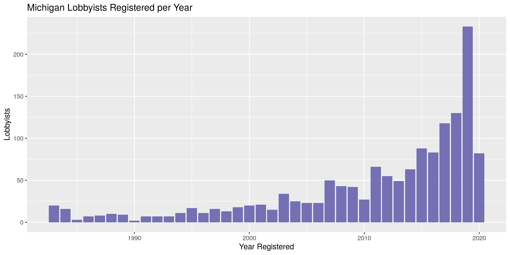

Michigan Lobbyists
================
Kiernan Nicholls & Yanqi Xu
2023-04-19 18:10:51

- <a href="#project" id="toc-project">Project</a>
- <a href="#objectives" id="toc-objectives">Objectives</a>
- <a href="#packages" id="toc-packages">Packages</a>
- <a href="#registration" id="toc-registration">Registration</a>
- <a href="#contributions" id="toc-contributions">Contributions</a>

<!-- Place comments regarding knitting here -->

## Project

The Accountability Project is an effort to cut across data silos and
give journalists, policy professionals, activists, and the public at
large a simple way to search across huge volumes of public data about
people and organizations.

Our goal is to standardizing public data on a few key fields by thinking
of each dataset row as a transaction. For each transaction there should
be (at least) 3 variables:

1.  All **parties** to a transaction
2.  The **date** of the transaction
3.  The **amount** of money involved

## Objectives

This document describes the process used to complete the following
objectives:

1.  How many records are in the database?
2.  Check for duplicates
3.  Check ranges
4.  Is there anything blank or missing?
5.  Check for consistency issues
6.  Create a five-digit ZIP Code called `ZIP5`
7.  Create a `YEAR` field from the transaction date
8.  Make sure there is data on both parties to a transaction

## Packages

The following packages are needed to collect, manipulate, visualize,
analyze, and communicate these results. The `pacman` package will
facilitate their installation and attachment.

The IRW’s `campfin` package will also have to be installed from GitHub.
This package contains functions custom made to help facilitate the
processing of campaign finance data.

``` r
if (!require("pacman")) install.packages("pacman")
pacman::p_load_gh("irworkshop/campfin")
pacman::p_load(
  tidyverse, # data manipulation
  lubridate, # datetime strings
  gluedown, # printing markdown
  magrittr, # pipe opperators
  janitor, # dataframe clean
  refinr, # cluster and merge
  scales, # format strings
  knitr, # knit documents
  vroom, # read files fast
  glue, # combine strings
  here, # relative storage
  fs # search storage 
)
```

This document should be run as part of the `R_campfin` project, which
lives as a sub-directory of the more general, language-agnostic
[`irworkshop/accountability_datacleaning`](https://github.com/irworkshop/accountability_datacleaning "TAP repo")
GitHub repository.

The `R_campfin` project uses the [RStudio
projects](https://support.rstudio.com/hc/en-us/articles/200526207-Using-Projects "Rproj")
feature and should be run as such. The project also uses the dynamic
`here::here()` tool for file paths relative to *your* machine.

``` r
# where does this document knit?
here::here()
#> [1] "/Users/yanqixu/code/accountability_datacleaning"
```

## Registration

Data is obtained from the [Michigan Secretary of
State](https://www.michigan.gov/sos/). The data is provided by NICUSA,
Inc., which provides information technology services for the SOS. The
data accessed on April 9, 2023 has a total of 8,261 records. This update
includes all the rows in the last dataset. The next update will likely
replace the current dataset.

> Use this page to search for information concerning individuals and
> organizations registered under the Michigan Lobby Registration Act, as
> well as expenditures disclosed by these registrants on required
> financial reports. The record for each registrant will also include a
> listing of any reported employees compensated by each registrant for
> lobbying, as well as employers who report the registrant as an
> employee compensated for lobbying on behalf of the employer.
>
> You may download the entire list of Michigan registrants by clicking
> on the Spreadsheet Format box and following the instructions provided.

The website certificates are out of date, so we can only obtain the file
by using `curl` with the `--insecure` option.

``` r
raw_dir <- here("state","mi", "lobby", "data", "raw")
dir_create(raw_dir)
```

``` r
# changes from time to time
#lob_url <- "https://miboecfr.nictusa.com/cfr/dumpdata/aaaMxayCb/mi_lobby.sh"
lob_url <- "https://miboecfr.nictusa.com/cfr/dumpdata/aaaeNaqWQ/mi_lobby.sh"
lob_path <- url2path(lob_url, raw_dir)
if (!file_exists(lob_path)) {
  download.file(
    url = lob_url,
    destfile = lob_path,
    method = "curl",
    extra = "--insecure"
  )
}
```

### Vars

| Variable | Description                                               |
|:---------|:----------------------------------------------------------|
| `id`     | Unique Bureau ID# of this Lobbyist or Agent               |
| `type`   | Type of Lobby (A = Agent, L = Lobbyist)                   |
| `last`   | Last or Full Name of the Individual or Lobby Organization |
| `first`  | First Name of the Individual Lobbyist or Agent            |
| `mi`     | Middle Name of the Individual Lobbyist or Agent           |
| `sig`    | Official Signatory or Contact Person for this Lobby       |
| `addr`   | Mailing Street Address of this Lobby                      |
| `city`   | Mailing City of this Lobby                                |
| `state`  | Mailing State of this Lobby                               |
| `zip`    | Mailing Zipcode of this Lobby                             |
| `phone`  | Phone Number of this Lobby                                |
| `reg`    | Date this Lobby became an Active Lobbyist or Agent        |
| `term`   | Date this Lobby Terminated all Lobbying activity          |

### Import

As described on the [data
website](https://miboecfr.nicusa.com/cgi-bin/cfr/lobby_srch_res.cgi):

> #### Other Notes:…
>
> The file is TAB delimited and NO quotes surround string text.
>
> The first record DOES contain the field names.
>
> The second record is a ‘dummy’ record used primarily to clue database
> programs like Access in as to how to import the data, as well as some
> other useful information. You may want to delete this record AND the
> record(s) at the end of the file containing counts once you have
> gotten any use from them.
>
> When saving the mi_lobby.sh file, you may want to rename it with an
> extension of .txt, so that certain database programs will import it
> correctly. The Bureau of Elections makes every effort to provide
> accurate information to the public. However, any data taken from the
> database should be verified against the actual report filed by the
> lobby. The information provided here is deemed reliable but not
> guaranteed.

We can use this information to define the parameters of
`readr::read_delim()`.

``` r
milr <- read_delim(
  file = lob_path,
  delim = "\t",
  skip = 2,
  col_names = var_names,
  col_types = cols(
    .default = col_character(),
    type = col_factor(),
    reg = col_date_mdy(),
    term = col_date_mdy()
  )
)
```

### Explore

``` r
head(milr)
#> # A tibble: 6 × 13
#>   id     type  last           first mi    sig   addr  city  state zip   phone reg        term      
#>   <chr>  <fct> <chr>          <chr> <chr> <chr> <chr> <chr> <chr> <chr> <chr> <date>     <date>    
#> 1 014673 A     (RADKE) JALVI… JODI  L     <NA>  PO B… LOVE… CO    80539 9702… 2019-09-12 NA        
#> 2 015124 L     1 800 CONTACTS <NA>  <NA>  ALLI… 261 … DRAP… UT    84020 5713… 2021-01-01 NA        
#> 3 015147 L     2050 PARTNERS  <NA>  <NA>  TATI… 110 … LANS… MI    48933 5173… 2020-12-22 2021-07-31
#> 4 015053 L     2441 5TH ST L… <NA>  <NA>  JOHN… 1605… WYAN… MI    48192 7345… 2020-10-12 2021-07-16
#> 5 009995 L     2630 FEATHERS… <NA>  <NA>  RICH… 721 … LANS… MI    4890… 5173… 2006-09-01 2008-11-30
#> 6 011388 L     3 CLICK SOLUT… <NA>  <NA>  A ED… 805 … WASH… DC    20005 2026… 2010-07-12 2010-12-31
tail(milr)
#> # A tibble: 6 × 13
#>   id     type  last     first   mi        sig   addr  city  state zip   phone reg        term      
#>   <chr>  <fct> <chr>    <chr>   <chr>     <chr> <chr> <chr> <chr> <chr> <chr> <date>     <date>    
#> 1 015734 A     ZUNIGA   JUANITA <NA>      <NA>  "440… DETR… MI    48202 <NA>  2021-09-10 NA        
#> 2 000151 A     ZURVALEC DAVID   S         <NA>  "620… LANS… MI    4890… 5174… 1983-10-17 2009-01-30
#> 3 012240 A     ZWART    STEVEN  J         <NA>  "PO … BAY … MI    4870… 9896… 2012-09-18 2013-12-31
#> 4 009589 A     ZWARTZ   ROBERT  <NA>      <NA>  "175… CHIC… IL    60604 3124… 2005-06-21 2010-08-05
#> 5 006811 A     ZYBLE    DAVID   A         <NA>  "1 C… LANS… MI    48951 5173… 1996-12-09 NA        
#> 6 <NA>   <NA>  <NA>     <NA>    End of D… 8,26… "\r"  <NA>  <NA>  <NA>  <NA>  NA         NA
glimpse(sample_frac(milr))
#> Rows: 8,262
#> Columns: 13
#> $ id    <chr> "011695", "000436", "010128", "015035", "007594", "012742", "007171", "011243", "01…
#> $ type  <fct> L, A, A, A, L, A, A, A, A, L, A, L, L, A, A, A, L, A, L, A, L, L, L, L, L, L, A, L,…
#> $ last  <chr> "EQUITY FOR EXCELLENCE", "SHELDON", "DEMAND", "KALTZ", "SURGICAL CARE CENTER OF MIC…
#> $ first <chr> NA, "PETER", "JOELLE", "EVE", NA, "SUNGURA", "DIANNE", "TROY", "NICOLE", NA, "MARK"…
#> $ mi    <chr> NA, "S", NA, "L", NA, NA, "E", "D", NA, NA, NA, NA, NA, NA, "R", NA, NA, "T", NA, N…
#> $ sig   <chr> "BRUCE B ASHLEY", NA, NA, NA, "BOB WOLFORD", NA, NA, NA, NA, "DAVID A ZYBLE", NA, "…
#> $ addr  <chr> "18700 AUDETTE ATTN GLENN MALEYKO", "215 S WASHINGTON SQ, STE 200", "3290 ROWLEY RD…
#> $ city  <chr> "DEARBORN", "LANSING", "WILLIAMSTON", "GLADWIN", "GRAND RAPIDS", "BIRMINGHAM", "LAN…
#> $ state <chr> "MI", "MI", "MI", "MI", "MI", "MI", "MI", "MI", "MI", "MI", "MI", "PA", "MA", "MI",…
#> $ zip   <chr> "48124", "48933", "48895", "48624", "49525", "48009", "48933", "48265", "48933", "4…
#> $ phone <chr> "3138273022", "5173711730", "5174853600", NA, "6169492600", "2486350000", "51737702…
#> $ reg   <date> 2011-04-15, 1983-11-01, 2007-02-05, 2020-09-15, 1999-06-14, 2014-06-03, 1998-01-23…
#> $ term  <date> 2021-12-31, 2019-07-31, 2011-02-07, 2021-02-11, 2009-12-31, 2022-08-31, 2021-08-04…
```

As we can see from `tail()`, the last two rows still need to be removed.

The `id` variable is unique to each lobbyist, so we can use it to remove
the summary rows at the bottom of the file.

``` r
col_stats(milr, n_distinct)
#> # A tibble: 13 × 4
#>    col   class      n        p
#>    <chr> <chr>  <int>    <dbl>
#>  1 id    <chr>   8262 1       
#>  2 type  <fct>      3 0.000363
#>  3 last  <chr>   6965 0.843   
#>  4 first <chr>   1051 0.127   
#>  5 mi    <chr>    208 0.0252  
#>  6 sig   <chr>   2995 0.363   
#>  7 addr  <chr>   5016 0.607   
#>  8 city  <chr>    808 0.0978  
#>  9 state <chr>     44 0.00533 
#> 10 zip   <chr>   1488 0.180   
#> 11 phone <chr>   4191 0.507   
#> 12 reg   <date>  3984 0.482   
#> 13 term  <date>  1500 0.182
```

``` r
milr <- filter(milr, !is.na(id))
```

Now, there are no rows missing the key information needed to identify
lobbyists.

``` r
col_stats(milr, count_na)
#> # A tibble: 13 × 4
#>    col   class      n        p
#>    <chr> <chr>  <int>    <dbl>
#>  1 id    <chr>      0 0       
#>  2 type  <fct>      0 0       
#>  3 last  <chr>      0 0       
#>  4 first <chr>   4028 0.488   
#>  5 mi    <chr>   6535 0.791   
#>  6 sig   <chr>   4237 0.513   
#>  7 addr  <chr>      0 0       
#>  8 city  <chr>      0 0       
#>  9 state <chr>     20 0.00242 
#> 10 zip   <chr>     17 0.00206 
#> 11 phone <chr>    718 0.0869  
#> 12 reg   <date>     8 0.000968
#> 13 term  <date>  3227 0.391
```

There are no duplicate rows in the database.

``` r
sum(duplicated(milr))
#> [1] 0
```

The database contains both outside lobbyist and lobbying agents.

<!-- -->

39% of lobbyists in the database have a termination date, meaning only
61% of the records identify active lobbyists.

``` r
prop_na(milr$term)
#> [1] 0.3906307
```

We can add the registration year using `lubridate::year()` on the date
column.

``` r
milr <- mutate(milr, year = year(reg))
```

<!-- -->

### Wrangle

To improve the searchability and consistency of the database, we can
perform some very basic and confident text normalization.

#### Phone

We can convert the phone numbers into a standard charatcer (i.e.,
non-numeric) format.

``` r
milr <- mutate(milr, phone_norm = normal_phone(phone))
```

    #> # A tibble: 4,191 × 2
    #>    phone      phone_norm    
    #>    <chr>      <chr>         
    #>  1 5173749008 (517) 374-9008
    #>  2 2023789140 (202) 378-9140
    #>  3 9725807847 (972) 580-7847
    #>  4 6162153103 (616) 215-3103
    #>  5 7342430720 (734) 243-0720
    #>  6 8599678020 (859) 967-8020
    #>  7 3133862410 (313) 386-2410
    #>  8 2485386611 (248) 538-6611
    #>  9 6125884158 (612) 588-4158
    #> 10 9897433471 (989) 743-3471
    #> # … with 4,181 more rows

#### Address

We can use `campfin::normal_address()` to improve the consistency in the
`addr` variable.

``` r
milr <- mutate(milr, addr_norm = normal_address(addr, abbs = usps_street))
```

    #> # A tibble: 5,015 × 2
    #>    addr                                                   addr_norm                                
    #>    <chr>                                                  <chr>                                    
    #>  1 34 35TH ST STE 4-2-A                                   34 35TH ST STE 42A                       
    #>  2 1676 INTERNATIONAL DR STE 800 % DEPUTY GENERAL COUNSEL 1676 INTERNATIONAL DR STE 800 DEPUTY GEN…
    #>  3 29200 VASSAR ST STE 545                                29200 VASSAR ST STE 545                  
    #>  4 17117 W NINE MILE RD STE 1600                          17117 W NINE MILE RD STE 1600            
    #>  5 1828 L ST NW STE 300-B                                 1828 L ST NW STE 300B                    
    #>  6 41 SOUTH HIGH STREET, HC0642                           41 SOUTH HIGH STREET HC0642              
    #>  7 5780 POWERS FERRY RD                                   5780 POWERS FERRY RD                     
    #>  8 8625 RICHARDSON RD                                     8625 RICHARDSON RD                       
    #>  9 71 S WACKER DR STE 500                                 71 S WACKER DR STE 500                   
    #> 10 65 E STATE ST STE 201                                  65 E STATE ST STE 201                    
    #> # … with 5,005 more rows

#### ZIP

``` r
milr <- mutate(milr, zip_norm = normal_zip(zip, na_rep = TRUE))
```

    #> # A tibble: 1,488 × 2
    #>    zip   zip_norm
    #>    <chr> <chr>   
    #>  1 28217 28217   
    #>  2 48243 48243   
    #>  3 49113 49113   
    #>  4 48625 48625   
    #>  5 62705 62705   
    #>  6 30319 30319   
    #>  7 55436 55436   
    #>  8 61701 61701   
    #>  9 55391 55391   
    #> 10 75062 75062   
    #> # … with 1,478 more rows

``` r
progress_table(
  milr$zip,
  milr$zip_norm,
  compare = valid_zip
)
#> # A tibble: 2 × 6
#>   stage         prop_in n_distinct prop_na n_out n_diff
#>   <chr>           <dbl>      <dbl>   <dbl> <dbl>  <dbl>
#> 1 milr$zip        0.937       1488 0.00206   516    279
#> 2 milr$zip_norm   0.999       1261 0.00254     8      9
```

#### State

The `state` variable does not need to be cleaned.

``` r
prop_in(milr$state, valid_state)
#> [1] 1
```

#### City

``` r
milr <- mutate(
  .data = milr, 
  city_norm = normal_city(
    city = city, 
    abbs = usps_city, 
    na = invalid_city
  )
)
```

``` r
milr <- milr %>% 
  rename(city_raw = city) %>% 
  left_join(
    y = zipcodes,
    by = c(
      "state" = "state",
      "zip_norm" = "zip"
    )
  ) %>% 
  rename(city_match = city) %>% 
  mutate(
    match_abb = is_abbrev(city_norm, city_match),
    match_dist = str_dist(city_norm, city_match),
    city_swap = if_else(
      condition = !is.na(city_match) & (match_abb | match_dist == 1),
      true = city_match,
      false = city_norm
    )
  ) %>% 
  select(
    -city_match,
    -match_abb,
    -match_dist
  )
```

``` r
out <- milr %>% 
  filter(city_swap %out% valid_city) %>% 
  count(city_swap, state, sort = TRUE) %>% 
  drop_na()
```

``` r
many_city <- c(valid_city, extra_city)
```

| stage                                                   | prop_in | n_distinct | prop_na | n_out | n_diff |
|:--------------------------------------------------------|--------:|-----------:|--------:|------:|-------:|
| milr$city_raw | 0.974| 807| 0| 213| 87| |milr$city_norm |   0.977 |        799 |       0 |   186 |     76 |
| milr\$city_swap                                         |   0.987 |        778 |       0 |   107 |     41 |

### Export

``` r
clean_dir <- dir_create(here("state","mi", "lobby", "data", "clean"))
clean_path <- path(clean_dir, "mi_lobby_reg.csv")
write_csv(milr %>% rename(city_clean = city_swap) %>% select(-city_norm), path = clean_path, na = "")
```

``` r
file_size(clean_path)
#> 1.39M
guess_encoding(clean_path)
#> # A tibble: 2 × 2
#>   encoding   confidence
#>   <chr>           <dbl>
#> 1 ISO-8859-1       0.38
#> 2 ISO-8859-2       0.22
```

## Contributions

Lobbying expenditure data be queried as [itemized lobby expenditure
analysis](https://miboecfr.nictusa.com/cgi-bin/cfr/lobby_exp_anls.cgi).

``` r
exp_url <- "https://miboecfr.nictusa.com/cfr/dumpall/miloball.sh"
exp_path <- url2path(exp_url, raw_dir)
if (!file_exists(exp_path)) {
  download.file(
    url = exp_url,
    destfile = exp_path,
    method = "curl",
    extra = "--insecure"
  )
}
```

``` r
mile <- read_delim(
  file = exp_path,
  delim = "\t",
  skip = 2,
  col_names = exp_names,
  escape_backslash = FALSE,
  escape_double = FALSE,
  col_types = cols(
    .default = col_character(),
    rpt_year = col_integer(),
    exp_date = col_date_usa(),
    exp_amt = col_double(),
    ytd_fb = col_double()
  )
) %>% 
  filter(!is.na(rpt_year))
```

``` r
head(mile)
#> # A tibble: 6 × 17
#>   rpt_year rpt_type lob_last    lob_f…¹ lob_mi lob_t…² lob_id exp_t…³ po_ti…⁴ po_last po_fi…⁵ po_mi
#>      <int> <chr>    <chr>       <chr>   <chr>  <chr>   <chr>  <chr>   <chr>   <chr>   <chr>   <chr>
#> 1     2001 SR       MICHIGAN H… <NA>    <NA>   L       1519   Financ… REPRES… MORTIM… MICKEY  <NA> 
#> 2     2001 SR       APPLE INC   <NA>    <NA>   L       8030   Financ… EXECUT… BRANDE… JIM     <NA> 
#> 3     2001 SR       DETROIT RE… <NA>    <NA>   L       2349   Financ… REPRES… ALLEN   JASON   <NA> 
#> 4     2001 SR       DETROIT RE… <NA>    <NA>   L       2349   Financ… REPRES… BISBEE  CLARK   <NA> 
#> 5     2001 SR       DETROIT RE… <NA>    <NA>   L       2349   Financ… SENATOR BULLARD WILLIS  <NA> 
#> 6     2001 SR       DETROIT RE… <NA>    <NA>   L       2349   Financ… SENATOR BENNETT LOREN   <NA> 
#> # … with 5 more variables: lob_why <chr>, exp_date <date>, exp_amt <dbl>, ytd_fb <dbl>,
#> #   doc_id <chr>, and abbreviated variable names ¹​lob_first, ²​lob_type, ³​exp_type, ⁴​po_title,
#> #   ⁵​po_first
tail(mile)
#> # A tibble: 6 × 17
#>   rpt_year rpt_type lob_last    lob_f…¹ lob_mi lob_t…² lob_id exp_t…³ po_ti…⁴ po_last po_fi…⁵ po_mi
#>      <int> <chr>    <chr>       <chr>   <chr>  <chr>   <chr>  <chr>   <chr>   <chr>   <chr>   <chr>
#> 1     2022 WR       PUBLIC AFF… <NA>    <NA>   A       43     Group … REPRES… <NA>    <NA>    <NA> 
#> 2     2022 WR       GOVERNMENT… <NA>    <NA>   A       27     Group … MEMBER… <NA>    <NA>    <NA> 
#> 3     2022 WR       GOVERNMENT… <NA>    <NA>   A       27     Group … MEMBER… <NA>    <NA>    <NA> 
#> 4     2022 WR       GOVERNMENT… <NA>    <NA>   A       27     Group … REPUBL… <NA>    <NA>    <NA> 
#> 5     2022 WR       GOVERNMENT… <NA>    <NA>   A       27     Group … REPUBL… <NA>    <NA>    <NA> 
#> 6     2022 WR       GOVERNMENT… <NA>    <NA>   A       27     Group … REPUBL… <NA>    <NA>    <NA> 
#> # … with 5 more variables: lob_why <chr>, exp_date <date>, exp_amt <dbl>, ytd_fb <dbl>,
#> #   doc_id <chr>, and abbreviated variable names ¹​lob_first, ²​lob_type, ³​exp_type, ⁴​po_title,
#> #   ⁵​po_first
glimpse(sample_frac(mile))
#> Rows: 17,503
#> Columns: 17
#> $ rpt_year  <int> 2016, 2001, 2013, 2018, 2022, 2021, 2019, 2016, 2018, 2021, 2015, 2019, 2003, 2…
#> $ rpt_type  <chr> "SR", "SR", "WR", "WR", "SR", "WR", "WR", "WR", "WR", "SR", "WR", "SR", "SR", "…
#> $ lob_last  <chr> "GOVERNMENTAL CONSULTANT SERVICES INC", "MICHIGAN ASSOCIATION OF BROADCASTERS",…
#> $ lob_first <chr> NA, NA, "GARY", NA, NA, NA, NA, "DILLON", NA, "ADAM", NA, "ROBERT", NA, NA, NA,…
#> $ lob_mi    <chr> NA, NA, "E", NA, NA, NA, NA, NA, NA, "P", NA, NA, NA, NA, NA, NA, "E", NA, NA, …
#> $ lob_type  <chr> "A", "L", "A", "A", "L", "L", "L", "A", "L", "A", "L", "A", "A", "A", "A", "L",…
#> $ lob_id    <chr> "27", "372", "11340", "43", "6993", "6424", "325", "13461", "346", "13659", "12…
#> $ exp_type  <chr> "Individual Food & Beverage", "Group Food & Beverage", "Individual Food & Bever…
#> $ po_title  <chr> "SENATOR", "SENATORS, REPRESENTATIVES, ALL MEMBERS OF THE SENA", "REPRESENTATIV…
#> $ po_last   <chr> "BOOHER", NA, "DIANDA", "WEBBER", "O'MALLEY", "JOHNSON", "LOWER", "CALLTON", "V…
#> $ po_first  <chr> "DARWIN", NA, "SCOTT", "MIKE", "JACK", "CYNTHIA", "JAMES", "MIKE", "SCOTT", "GR…
#> $ po_mi     <chr> NA, NA, NA, NA, NA, NA, NA, NA, NA, NA, NA, NA, NA, NA, NA, NA, NA, NA, NA, NA,…
#> $ lob_why   <chr> NA, "LEGISLATIVE RECEPTION", NA, NA, NA, NA, NA, NA, NA, NA, "EDUCATIONAL FORUM…
#> $ exp_date  <date> NA, 2001-02-27, NA, NA, NA, NA, NA, NA, NA, NA, 2015-12-02, NA, NA, NA, 2005-0…
#> $ exp_amt   <dbl> 171.98, 10964.35, 190.28, 86.25, 211.68, 141.33, 18.63, 11.63, 67.20, 36.66, 55…
#> $ ytd_fb    <dbl> 171.98, NA, 421.12, 161.25, 211.68, 141.33, 36.32, 11.63, 67.20, 36.66, NA, 99.…
#> $ doc_id    <chr> "221655", "98076", "198638", "245213", "278118", "272685", "254290", "225448", …
```

``` r
col_stats(mile, count_na)
#> # A tibble: 17 × 4
#>    col       class      n       p
#>    <chr>     <chr>  <int>   <dbl>
#>  1 rpt_year  <int>      0 0      
#>  2 rpt_type  <chr>      0 0      
#>  3 lob_last  <chr>      0 0      
#>  4 lob_first <chr>  13437 0.768  
#>  5 lob_mi    <chr>  15197 0.868  
#>  6 lob_type  <chr>      0 0      
#>  7 lob_id    <chr>      0 0      
#>  8 exp_type  <chr>      0 0      
#>  9 po_title  <chr>     54 0.00309
#> 10 po_last   <chr>   2460 0.141  
#> 11 po_first  <chr>   2504 0.143  
#> 12 po_mi     <chr>  17396 0.994  
#> 13 lob_why   <chr>  13991 0.799  
#> 14 exp_date  <date> 13999 0.800  
#> 15 exp_amt   <dbl>    339 0.0194 
#> 16 ytd_fb    <dbl>   3795 0.217  
#> 17 doc_id    <chr>      0 0
```

``` r
col_stats(mile, n_distinct)
#> # A tibble: 17 × 4
#>    col       class      n        p
#>    <chr>     <chr>  <int>    <dbl>
#>  1 rpt_year  <int>     22 0.00126 
#>  2 rpt_type  <chr>      2 0.000114
#>  3 lob_last  <chr>    639 0.0365  
#>  4 lob_first <chr>    141 0.00806 
#>  5 lob_mi    <chr>     32 0.00183 
#>  6 lob_type  <chr>      2 0.000114
#>  7 lob_id    <chr>    658 0.0376  
#>  8 exp_type  <chr>      4 0.000229
#>  9 po_title  <chr>   1446 0.0826  
#> 10 po_last   <chr>   1009 0.0576  
#> 11 po_first  <chr>    562 0.0321  
#> 12 po_mi     <chr>     33 0.00189 
#> 13 lob_why   <chr>   1530 0.0874  
#> 14 exp_date  <date>  1777 0.102   
#> 15 exp_amt   <dbl>  10037 0.573   
#> 16 ytd_fb    <dbl>   8637 0.493   
#> 17 doc_id    <chr>   2877 0.164
```

<!-- -->

<!-- -->

``` r
mile <- mile %>% rename(year = rpt_year) %>% mutate(state = "MI")
```

``` r
write_csv(
  x = mile,
  path = path(clean_dir, "mi_lobby_exp.csv"),
  na = ""
)
```
