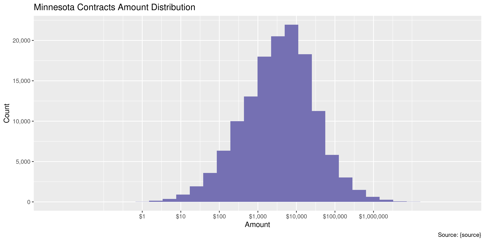
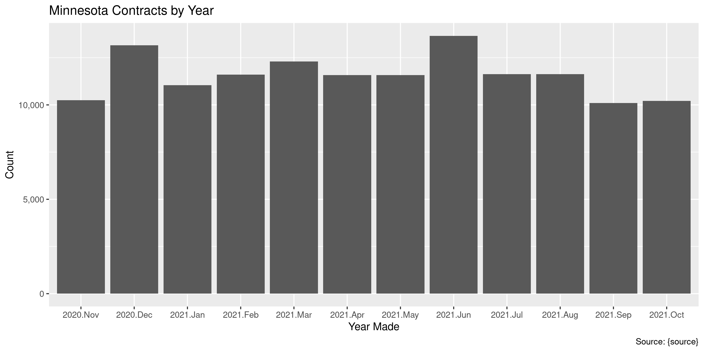
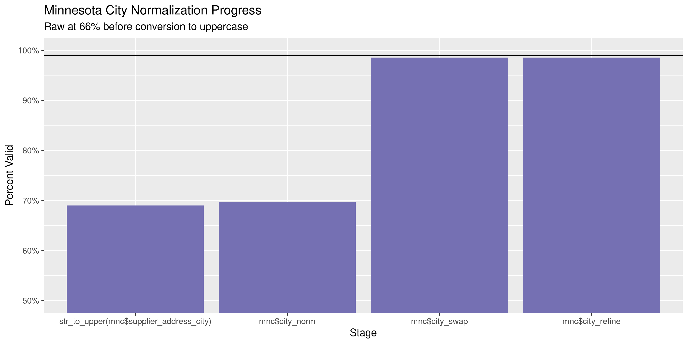
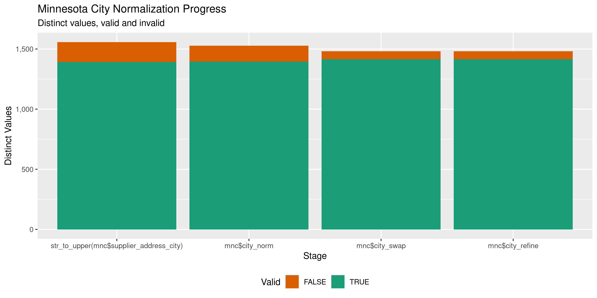

Minnesota Contracts
================
Kiernan Nicholls
Thu Apr 28 12:35:25 2022

-   [Project](#project)
-   [Objectives](#objectives)
-   [Packages](#packages)
-   [Source](#source)
-   [Download](#download)
-   [Read](#read)
-   [Explore](#explore)
    -   [Missing](#missing)
    -   [Duplicates](#duplicates)
    -   [Categorical](#categorical)
    -   [Amounts](#amounts)
    -   [Dates](#dates)
-   [Wrangle](#wrangle)
    -   [ZIP](#zip)
    -   [State](#state)
    -   [City](#city)
-   [Conclude](#conclude)
-   [Export](#export)
-   [Upload](#upload)

<!-- Place comments regarding knitting here -->

## Project

The Accountability Project is an effort to cut across data silos and
give journalists, policy professionals, activists, and the public at
large a simple way to search across huge volumes of public data about
people and organizations.

Our goal is to standardize public data on a few key fields by thinking
of each dataset row as a transaction. For each transaction there should
be (at least) 3 variables:

1.  All **parties** to a transaction.
2.  The **date** of the transaction.
3.  The **amount** of money involved.

## Objectives

This document describes the process used to complete the following
objectives:

1.  How many records are in the database?
2.  Check for entirely duplicated records.
3.  Check ranges of continuous variables.
4.  Is there anything blank or missing?
5.  Check for consistency issues.
6.  Create a five-digit ZIP Code called `zip`.
7.  Create a `year` field from the transaction date.
8.  Make sure there is data on both parties to a transaction.

## Packages

The following packages are needed to collect, manipulate, visualize,
analyze, and communicate these results. The `pacman` package will
facilitate their installation and attachment.

``` r
if (!require("pacman")) {
  install.packages("pacman")
}
pacman::p_load(
  tidyverse, # data manipulation
  lubridate, # datetime strings
  gluedown, # printing markdown
  janitor, # clean data frames
  campfin, # custom irw tools
  aws.s3, # aws cloud storage
  refinr, # cluster & merge
  scales, # format strings
  readxl, # read excel files
  knitr, # knit documents
  vroom, # fast reading
  rvest, # scrape html
  glue, # code strings
  here, # project paths
  httr, # http requests
  fs # local storage 
)
```

This diary was run using `campfin` version 1.0.8.9300.

``` r
packageVersion("campfin")
#> [1] '1.0.8.9300'
```

This document should be run as part of the `R_tap` project, which lives
as a sub-directory of the more general, language-agnostic
[`irworkshop/accountability_datacleaning`](https://github.com/irworkshop/accountability_datacleaning)
GitHub repository.

The `R_tap` project uses the [RStudio
projects](https://support.rstudio.com/hc/en-us/articles/200526207-Using-Projects)
feature and should be run as such. The project also uses the dynamic
`here::here()` tool for file paths relative to *your* machine.

``` r
# where does this document knit?
here::i_am("state/mn/contracts/docs/mn_contracts_diary.Rmd")
```

## Source

Minnesota state contracts were retrieved via a state records requests
filed by students at American University.

## Download

The ZIP archive containing the requested data can be downloaded from the
Investigative Reporting Workshop’s server.

``` r
raw_key <- "jla_class_data2021/fwdminnesotadatarequest.zip"
raw_dir <- dir_create(here("state", "mn", "contracts", "data", "raw"))
raw_zip <- path(raw_dir, raw_key)
```

``` r
if (!file_exists(raw_zip)) {
  save_object(
    object = raw_key,
    bucket = "publicaccountability",
    file = raw_zip,
    show_progress = TRUE
  )
}
```

``` r
raw_xls <- unzip(raw_zip, exdir = raw_dir)
```

## Read

The monthly excel files can be read together and combined into a single
table.

``` r
mnc <- map(
  .x = raw_xls, 
  .f = read_excel, 
  skip = 2, 
  col_names = FALSE,
  col_types = "text"
)
```

One file is missing column names, which can be added from another file.

``` r
mnc[[4]] <- bind_rows(mnc[[1]][1, -3], mnc[[4]])
mnc <- map(
  .x = mnc,
  .f = function(dat) {
    dat <- dat |> 
      remove_empty("cols") |> 
      row_to_names(1)
    if (is.na(last(dat[[1]]))) {
      dat <- head(dat, -1)
    }
    return(dat)
  }
)
```

``` r
mnc <- mnc |> 
  set_names(basename(raw_xls)) |> 
  bind_rows(.id = "source_file") |>
  relocate(source_file, .after = last_col()) |> 
  clean_names(case = "snake") |> 
  type_convert(
    na = c("", "-"),
    col_types = cols(
      .default = col_character(),
      payment_day_dt = col_date_mdy(),
      payment_amt = col_double()
    )
  )
```

The `supplier` should be separated into two separate values for the ID
and name.

``` r
mnc <- mnc |> 
  separate(
    col = supplier,
    into = c("supplier_id", "supplier_name"),
    sep = "(?<=\\d)\\s-\\s"
  )
```

## Explore

There are 138,760 rows of 11 columns. Each record represents a single
contract between the state and a vendor.

``` r
glimpse(mnc)
#> Rows: 138,760
#> Columns: 11
#> $ payment_day_dt             <date> 2020-11-02, 2020-11-02, 2020-11-02, 2020-11-02, 2020-11-02, 2020-11-02, 2020-11-02…
#> $ supplier_id                <chr> "0000192592", "0000192898", "0000192928", "0000192935", "0000192935", "0000192935",…
#> $ supplier_name              <chr> "UNITED PARCEL SERVICE D", "ST PAUL CITY OF", "ECOLAB INC S", "BOLTON & MENK INC", …
#> $ supplier_contract_id       <chr> "0000000000000000000121740", "0000000000000000000162773", "000000000000000000016180…
#> $ payment_amt                <dbl> 184.31, 51250.32, 801.00, 67313.63, 7207.29, 2058.78, 241.11, 6348.09, 90.01, 22428…
#> $ supplier_address_city      <chr> "DALLAS", "ST PAUL", "ST PAUL", "MANKATO", "MANKATO", "MANKATO", "ST PAUL", "BADGER…
#> $ supplier_address_state     <chr> "TX", "MN", "MN", "MN", "MN", "MN", "MN", "MN", "MN", "MN", "MN", "MN", "MN", "MN",…
#> $ supplier_address_postal_cd <chr> "75265-0580", "55102", "55102", "56001-5900", "56001-5900", "56001-5900", "55101-24…
#> $ supplier_address1          <chr> "PO BOX 650580", "15 W KELLOGG BLVD", "1 ECOLAB PLACE", "1960 PREMIER DR", "1960 PR…
#> $ supplier_address2          <chr> NA, "700 CITY HALL", NA, NA, NA, NA, NA, "PO BOX 67", NA, "PO BOX 579", NA, NA, NA,…
#> $ source_file                <chr> "2020-11 contract payments with address.xlsx", "2020-11 contract payments with addr…
tail(mnc)
#> # A tibble: 6 × 11
#>   payment_day_dt supplier_id supplier_name         supplier_contract_id    payment_amt supplier_addres… supplier_addres…
#>   <date>         <chr>       <chr>                 <chr>                         <dbl> <chr>            <chr>           
#> 1 2021-10-29     P010000000  MILITARY AFFAIRS DEPT 0000000000000000000034…      2410.  ST PAUL          MN              
#> 2 2021-10-29     P070000000  PUBLIC SAFETY DEPT    0000000000000000000118…       171.  ST PAUL          MN              
#> 3 2021-10-29     P070000000  PUBLIC SAFETY DEPT    0000000000000000000118…       306.  ST PAUL          MN              
#> 4 2021-10-29     P070000000  PUBLIC SAFETY DEPT    0000000000000000000121…        33.2 ST PAUL          MN              
#> 5 2021-10-29     P070000000  PUBLIC SAFETY DEPT    0000000000000000000123…      8140.  ST PAUL          MN              
#> 6 2021-10-29     P070000000  PUBLIC SAFETY DEPT    0000000000000000000123…       505.  ST PAUL          MN              
#> # … with 4 more variables: supplier_address_postal_cd <chr>, supplier_address1 <chr>, supplier_address2 <chr>,
#> #   source_file <chr>
```

### Missing

Columns vary in their degree of missing values.

``` r
col_stats(mnc, count_na)
#> # A tibble: 11 × 4
#>    col                        class       n         p
#>    <chr>                      <chr>   <int>     <dbl>
#>  1 payment_day_dt             <date>      0 0        
#>  2 supplier_id                <chr>       0 0        
#>  3 supplier_name              <chr>       0 0        
#>  4 supplier_contract_id       <chr>       0 0        
#>  5 payment_amt                <dbl>       0 0        
#>  6 supplier_address_city      <chr>       0 0        
#>  7 supplier_address_state     <chr>       6 0.0000432
#>  8 supplier_address_postal_cd <chr>       5 0.0000360
#>  9 supplier_address1          <chr>       0 0        
#> 10 supplier_address2          <chr>  118793 0.856    
#> 11 source_file                <chr>       0 0
```

We can flag any record missing a key variable needed to identify a
transaction.

``` r
key_vars <- c("payment_day_dt", "payment_amt", "supplier_name")
mnc <- flag_na(mnc, all_of(key_vars))
sum(mnc$na_flag)
#> [1] 0
```

``` r
# remove if no missing
if (sum(is.na(mnc$na_flag)) == 0) {
  mnc <- select(mnc, -na_flag)
}
```

There are no rows missing key values.

### Duplicates

We can also flag any record completely duplicated across every column.

``` r
mnc <- flag_dupes(mnc, everything())
sum(mnc$dupe_flag)
#> [1] 0
```

There are now duplicate rows.

### Categorical

``` r
col_stats(mnc, n_distinct)
#> # A tibble: 11 × 4
#>    col                        class      n         p
#>    <chr>                      <chr>  <int>     <dbl>
#>  1 payment_day_dt             <date>   250 0.00180  
#>  2 supplier_id                <chr>  11403 0.0822   
#>  3 supplier_name              <chr>  11383 0.0820   
#>  4 supplier_contract_id       <chr>  24814 0.179    
#>  5 payment_amt                <dbl>  90746 0.654    
#>  6 supplier_address_city      <chr>   1558 0.0112   
#>  7 supplier_address_state     <chr>     62 0.000447 
#>  8 supplier_address_postal_cd <chr>   3502 0.0252   
#>  9 supplier_address1          <chr>  12020 0.0866   
#> 10 supplier_address2          <chr>   1076 0.00775  
#> 11 source_file                <chr>     12 0.0000865
```

### Amounts

``` r
# fix floating point precision
mnc$payment_amt <- round(mnc$payment_amt, digits = 2)
```

``` r
summary(mnc$payment_amt)
#>      Min.   1st Qu.    Median      Mean   3rd Qu.      Max. 
#> -16000000       842      3910     34882     14621 160210351
mean(mnc$payment_amt <= 0)
#> [1] 0.007314788
```

These are the records with the minimum and maximum amounts.

``` r
glimpse(mnc[c(which.max(mnc$payment_amt), which.min(mnc$payment_amt)), ])
#> Rows: 2
#> Columns: 11
#> $ payment_day_dt             <date> 2021-07-14, 2021-09-28
#> $ supplier_id                <chr> "0000324390", "0001065918"
#> $ supplier_name              <chr> "MINNESOTA COMPREHENSIVE HEALTH", "VAULT MEDICAL SERVICES PA"
#> $ supplier_contract_id       <chr> "0000000000000000000162540", "0000000000000000000193321"
#> $ payment_amt                <dbl> 160210351, -16000000
#> $ supplier_address_city      <chr> "LAKE ELMO", "PALANTINE"
#> $ supplier_address_state     <chr> "MN", "IL"
#> $ supplier_address_postal_cd <chr> "55042", "60055"
#> $ supplier_address1          <chr> "8665 HUDSON BLVD N #200", "DEPT CH 19338"
#> $ supplier_address2          <chr> NA, NA
#> $ source_file                <chr> "2021-7 contract payments with address.xlsx", "2021-9 contract payments with addre…
```

The distribution of amount values are typically log-normal.

<!-- -->

### Dates

We can add the calendar year from `date` with `lubridate::year()`.

``` r
mnc <- mutate(mnc, payment_day_yr = year(payment_day_dt))
```

``` r
min(mnc$payment_day_dt)
#> [1] "2020-11-02"
sum(mnc$payment_day_yr < 2000)
#> [1] 0
max(mnc$payment_day_dt)
#> [1] "2021-10-29"
sum(mnc$payment_day_dt > today())
#> [1] 0
```

All of these contracts are from the 12 months between November 2020 and
October 2021.

<!-- -->

## Wrangle

To improve the searchability of the database, we will perform some
consistent, confident string normalization. For geographic variables
like city names and ZIP codes, the corresponding `campfin::normal_*()`
functions are tailor made to facilitate this process.

### ZIP

For ZIP codes, the `campfin::normal_zip()` function will attempt to
create valid *five* digit codes by removing the ZIP+4 suffix and
returning leading zeroes dropped by other programs like Microsoft Excel.

``` r
mnc <- mnc %>% 
  mutate(
    zip_norm = normal_zip(
      zip = supplier_address_postal_cd,
      na_rep = TRUE
    )
  )
```

``` r
progress_table(
  mnc$supplier_address_postal_cd,
  mnc$zip_norm,
  compare = valid_zip
)
#> # A tibble: 2 × 6
#>   stage                          prop_in n_distinct   prop_na n_out n_diff
#>   <chr>                            <dbl>      <dbl>     <dbl> <dbl>  <dbl>
#> 1 mnc$supplier_address_postal_cd   0.783       3502 0.0000360 30061   1695
#> 2 mnc$zip_norm                     0.998       2069 0.0000360   252     40
```

### State

The existing `supplier_address_state` column is already normalized. All
invalid abbreviations are from other countries.

``` r
prop_in(mnc$supplier_address_state, valid_state)
#> [1] 0.9983352
unique(what_out(mnc$supplier_address_state, valid_state))
#>  [1] "BC"   "NS"   "ON"   "NSW"  "QC"   "BE"   "13"   "KENT" "MB"   "SK"
```

### City

Cities are the most difficult geographic variable to normalize, simply
due to the wide variety of valid cities and formats.

#### Normal

The `campfin::normal_city()` function is a good start, again converting
case, removing punctuation, but *expanding* USPS abbreviations. We can
also remove `invalid_city` values.

``` r
norm_city <- mnc %>% 
  distinct(supplier_address_city, supplier_address_state, zip_norm) %>% 
  mutate(
    city_norm = normal_city(
      city = supplier_address_city, 
      abbs = usps_city,
      states = c("MN", "DC", "MINNESOTA"),
      na = invalid_city,
      na_rep = TRUE
    )
  )
```

#### Swap

We can further improve normalization by comparing our normalized value
against the *expected* value for that record’s state abbreviation and
ZIP code. If the normalized value is either an abbreviation for or very
similar to the expected value, we can confidently swap those two.

``` r
norm_city <- norm_city %>% 
  rename(city_raw = supplier_address_city) %>% 
  left_join(
    y = zipcodes,
    by = c(
      "supplier_address_state" = "state",
      "zip_norm" = "zip"
    )
  ) %>% 
  rename(city_match = city) %>% 
  mutate(
    match_abb = is_abbrev(city_norm, city_match),
    match_dist = str_dist(city_norm, city_match),
    city_swap = if_else(
      condition = !is.na(match_dist) & (match_abb | match_dist == 1),
      true = city_match,
      false = city_norm
    )
  ) %>% 
  select(
    -city_match,
    -match_dist,
    -match_abb
  )
```

``` r
mnc <- left_join(
  x = mnc,
  y = norm_city,
  by = c(
    "supplier_address_city" = "city_raw", 
    "supplier_address_state", 
    "zip_norm"
  )
)
```

#### Refine

The [OpenRefine](https://openrefine.org/) algorithms can be used to
group similar strings and replace the less common versions with their
most common counterpart. This can greatly reduce inconsistency, but with
low confidence; we will only keep any refined strings that have a valid
city/state/zip combination.

``` r
good_refine <- mnc %>% 
  mutate(
    city_refine = city_swap %>% 
      key_collision_merge() %>% 
      n_gram_merge(numgram = 1)
  ) %>% 
  filter(city_refine != city_swap) %>% 
  inner_join(
    y = zipcodes,
    by = c(
      "city_refine" = "city",
      "supplier_address_state" = "state",
      "zip_norm" = "zip"
    )
  )
```

    #> # A tibble: 1 × 5
    #>   supplier_address_state zip_norm city_swap      city_refine          n
    #>   <chr>                  <chr>    <chr>          <chr>            <int>
    #> 1 MN                     55375    ST BONIFACIOUS SAINT BONIFACIUS     1

Then we can join the refined values back to the database.

``` r
mnc <- mnc %>% 
  left_join(good_refine, by = names(.)) %>% 
  mutate(city_refine = coalesce(city_refine, city_swap))
```

#### Progress

Our goal for normalization was to increase the proportion of city values
known to be valid and reduce the total distinct values by correcting
misspellings.

| stage                                     | prop_in | n_distinct | prop_na | n_out | n_diff |
|:------------------------------------------|--------:|-----------:|--------:|------:|-------:|
| `str_to_upper(mnc$supplier_address_city)` |   0.690 |       1558 |       0 | 43005 |    166 |
| `mnc$city_norm`                           |   0.697 |       1528 |       0 | 41991 |    132 |
| `mnc$city_swap`                           |   0.985 |       1482 |       0 |  2053 |     66 |
| `mnc$city_refine`                         |   0.985 |       1481 |       0 |  2052 |     65 |

You can see how the percentage of valid values increased with each
stage.

<!-- -->

More importantly, the number of distinct values decreased each stage. We
were able to confidently change many distinct invalid values to their
valid equivalent.

<!-- -->

Before exporting, we can remove the intermediary normalization columns
and rename all added variables with the `_clean` suffix.

``` r
mnc <- mnc %>% 
  select(
    -city_norm,
    -city_swap,
    city_clean = city_refine
  ) %>% 
  rename_all(~str_replace(., "_norm", "_clean")) %>% 
  rename_all(~str_remove(., "_raw")) %>% 
  relocate(city_clean, .before = zip_clean)
```

## Conclude

``` r
glimpse(sample_n(mnc, 1000))
#> Rows: 1,000
#> Columns: 14
#> $ payment_day_dt             <date> 2021-08-10, 2020-12-18, 2021-03-18, 2021-05-07, 2021-05-24, 2021-03-31, 2021-03-03…
#> $ supplier_id                <chr> "0000340849", "0000841817", "0000197321", "0000978736", "0000203496", "0000261171",…
#> $ supplier_name              <chr> "TOMAC TRACY A MD", "AFRICAN ECONOMIC DEVELOPMENT SOLUTIONS", "WASHINGTON COUNTY", …
#> $ supplier_contract_id       <chr> "0000000000000000000196941", "0000000000000000000181029", "000000000000000000017318…
#> $ payment_amt                <dbl> 1125.00, 100000.00, 4638.00, 14080.00, 8029.89, 337.43, 147141.00, 104.27, 9298.96,…
#> $ supplier_address_city      <chr> "NEWPORT", "ST PAUL", "STILLWATER", "SAINT PAUL", "NEW HOPE", "NEW ULM", "MORRIS", …
#> $ supplier_address_state     <chr> "MN", "MN", "MN", "MN", "MN", "MN", "MN", "MN", "BC", "MN", "OH", "MN", "MN", "MN",…
#> $ supplier_address_postal_cd <chr> "55055", "55104", "55082", "55101", "55428", "56073", "56267-9505", "55420", "V8L 5…
#> $ supplier_address1          <chr> "971 SPRUCE STT", "1821 UNIVERSITY AVE W #S 290", "14949 62ND ST N", "445 MINNESOTA…
#> $ supplier_address2          <chr> NA, NA, "PO BOX 3804", NA, NA, NA, NA, "1101 E 78TH ST #200", NA, "PO BOX 310", NA,…
#> $ source_file                <chr> "2021-8 contract payments with address.xlsx", "2020-12 contract payments with addre…
#> $ payment_day_yr             <dbl> 2021, 2020, 2021, 2021, 2021, 2021, 2021, 2021, 2021, 2021, 2020, 2021, 2021, 2020,…
#> $ city_clean                 <chr> "NEWPORT", "SAINT PAUL", "STILLWATER", "SAINT PAUL", "NEW HOPE", "NEW ULM", "MORRIS…
#> $ zip_clean                  <chr> "55055", "55104", "55082", "55101", "55428", "56073", "56267", "55420", "852", "553…
```

1.  There are 138,760 records in the database.
2.  There are 0 duplicate records in the database.
3.  The range and distribution of `amount` and `date` seem reasonable.
4.  There are 0 records missing key variables.
5.  Consistency in geographic data has been improved with
    `campfin::normal_*()`.
6.  The 4-digit `year` variable has been created with
    `lubridate::year()`.

## Export

Now the file can be saved on disk for upload to the Accountability
server. We will name the object using a date range of the records
included.

``` r
min_dt <- str_remove_all(min(mnc$payment_day_dt), "-")
max_dt <- str_remove_all(max(mnc$payment_day_dt), "-")
csv_ts <- paste(min_dt, max_dt, sep = "-")
```

``` r
clean_dir <- dir_create(here("state", "mn", "contracts", "data", "clean"))
clean_csv <- path(clean_dir, glue("mn_contracts_{csv_ts}.csv"))
clean_rds <- path_ext_set(clean_csv, "rds")
basename(clean_csv)
#> [1] "mn_contracts_20201102-20211029.csv"
```

``` r
write_csv(mnc, clean_csv, na = "")
write_rds(mnc, clean_rds, compress = "xz")
(clean_size <- file_size(clean_csv))
#> 24M
```

## Upload

We can use the `aws.s3::put_object()` to upload the text file to the IRW
server.

``` r
aws_key <- path("csv", basename(clean_csv))
if (!object_exists(aws_key, "publicaccountability")) {
  put_object(
    file = clean_csv,
    object = aws_key, 
    bucket = "publicaccountability",
    acl = "public-read",
    show_progress = TRUE,
    multipart = TRUE
  )
}
aws_head <- head_object(aws_key, "publicaccountability")
(aws_size <- as_fs_bytes(attr(aws_head, "content-length")))
unname(aws_size == clean_size)
```
